# 🎬 Ces métiers sont déjà remplacés par l'IA. Vous devez savoir.

> **Chaîne** : [Pursuing AI](https://www.youtube.com/@PursuingAi)  
> **Titre original** : `These jobs are already replaced by AI. You must know.`  
> **Lien YouTube** : [https://www.youtube.com/watch?v=33FpzAqYX_o](https://www.youtube.com/watch?v=33FpzAqYX_o)  
> **Date de publication** : 2025-09-08  
> **Durée** : 03m 19s (`199s`)  
> **Identifiant vidéo** : `33FpzAqYX_o`  
> **Fiche Web Interactive** : [2025-09-08_YT-33FpzAqYX_o_Ces métiers sont déjà remplacés par l'IA. Vous devez savoir._by-whisper-v3-large-turbo+gemini-3.5-flash-lite.html](2025-09-08_YT-33FpzAqYX_o_Ces métiers sont déjà remplacés par l'IA. Vous devez savoir._by-whisper-v3-large-turbo+gemini-3.5-flash-lite.html)  
> **Captures de démonstration clés** : `20 captures réelles (anti-talking-head)`  
> **Modèles utilisés** : Audio: `large-v3-turbo` (Faster-Whisper int8 VPS) | Vision: `gemini-3.5-flash-lite` (Google AI Studio API)  

---

## 📌 Synthèse Exécutive & Outils

### 📌 Résumé
La vidéo de Pursuing AI, intitulée « Ces métiers sont déjà remplacés par l'IA. Vous devez savoir. », propose une immersion percutante et factuelle dans la réalité actuelle de l'automatisation par l'intelligence artificielle et la robotique. Loin des simples prédictions futuristes, le créateur s'appuie sur des preuves tangibles et des cas d'usage réels, principalement en Chine, pour démontrer que le remplacement de la main-d'œuvre humaine est déjà en marche dans des secteurs aussi divers que l'hôtellerie, la restauration, la rédaction publicitaire, la régulation de la circulation et le BTP. La structure narrative repose sur une gradation efficace : chaque section expose un métier touché, fournit des preuves concrètes (témoignages de professionnels, reportages sur le terrain), puis analyse l'impact sectoriel global avant d'interpeller directement le spectateur pour maximiser l'engagement.

Sur le plan de la production vidéo par IA, ce type de contenu illustre parfaitement l'art d'illustrer des sujets sociétaux complexes grâce à des flux de travail visuels ultra-dynamiques. Le créateur exploite des outils de pointe comme **Seedance 2.5** et **Kling 3.0** pour générer des séquences B-roll fluides, hyper-réalistes et parfaitement synchronisées avec un voice-over au rythme haletant. L'utilisation stratégique d'outils de génération d'images comme **Midjourney** permet de créer des vignettes et des visuels d'accroche saisissants. La méthode étape par étape repose sur un *hook* agressif dès les premières secondes, une transition fluide entre des exemples internationaux vérifiables et un appel à l'action final optimisé pour la rétention et la croissance de la chaîne.

Pour les créateurs de contenu vidéo et les monteurs, cette vidéo constitue un cas d'école en matière de storytelling et de monétisation de l'actualité technologique. En combinant des outils de **Génération Vidéo IA** avec un montage serré, des appels à commentaires ciblés et des questions ouvertes ("Notez-la sur 10"), le créateur transforme un sujet anxiogène en une conversation interactive à forte viralité. Les enseignements retirés de ce workflow permettent d'accélérer drastiquement la production de documentaires courts sur l'IA tout en maintenant un niveau d'engagement et de crédibilité élevé auprès d'une audience avide de comprendre les transformations du marché du travail.

### 🛠️ Outils, Modèles & Logiciels Présentés
* **Seedance 2.5** : Utilisé pour générer des séquences vidéo cinématiques et fluides illustrant les concepts futuristes et les robots en action dans le cadre de la narration visuelle.
* **Kling 3.0** : Mobilisé pour la production de plans B-roll complexes et ultra-réalistes, renforçant l'immersion et la crédibilité des exemples de chantiers autonomes et de services automatisés.
* **Midjourney** : Employé pour concevoir des visuels d'illustration percutants ainsi que les éléments graphiques et vignettes de la vidéo pour maximiser le taux de clics (CTR).
* **Génération Vidéo IA** : Terme englobant l'ensemble de la suite technologique de synthèse visuelle permettant d'illustrer des faits d'actualité internationale sans nécessiter d'équipes de tournage sur place.

### 🔑 Points Clés & Enseignements Stratégiques
* **Maîtriser le *hook* émotionnel et factuel** : Dès la première phrase, le créateur pose une affirmation percutante (« avec de vraies preuves ») pour éliminer le scepticisme du spectateur et garantir une rétention maximale dans les trente premières secondes.
* **Illustrer par des preuves tangibles** : Ne jamais se contenter de spéculations théoriques ; appuyer chaque affirmation sur des cas réels (ex. : robots livreurs dans les hôtels en Chine, bras robotisés Artly) pour asseoir l'autorité de la chaîne.
* **Intégrer des témoignages de première main** : Citer des retours d'utilisateurs issus de plateformes comme Reddit humanise le débat et donne une voix aux victimes directes des mutations technologiques (comme les rédacteurs publicitaires).
* **Déconstruire le remplacement sectoriel** : Expliquer que l'IA ne détruit pas toujours un métier en bloc, mais commence par automatiser des tâches spécifiques (ex. : la police de la circulation avec des agents robotisés gérant les flux basiques).
* **Exploiter les méga-projets industriels** : Mettre en avant des réalisations spectaculaires à grande échelle (comme une autoroute de 158 km construite sans ouvriers) pour démontrer l'ampleur systémique de l'automatisation.
* **Diversifier les industries ciblées** : Balayer large (hôtellerie, cafés, marketing, police, construction) pour maintenir l'intérêt d'une audience aux profils professionnels variés et élargir le potentiel viral de la vidéo.
* **Stimuler l'engagement communautaire actif** : Poser des questions précises et claires (« Notez-la sur 10 dans les commentaires », « L'IA vous a-t-elle aidé ou a-t-elle pris des opportunités ? ») pour propulser l'algorithme grâce à l'afflux de commentaires.
* **Créer des boucles d'anticipation (*loops*)** : Annoncer subtilement la suite (« le prochain emploi... pourrait vous surprendre encore plus ») pour maintenir la tension narrative et inciter le spectateur à rester jusqu'à la fin.
* **Optimiser le workflow visuel par IA** : Utiliser des générateurs de vidéo comme Seedance 2.5 et Kling 3.0 pour pallier l'absence d'images d'archives réelles, en veillant à maintenir une cohérence stylistique irréprochable.
* **Soigner le pont entre éthique et engagement** : Terminer sur une question philosophique ouverte (« L'IA va-t-elle détruire ou créer des emplois ? ») pour polariser sainement l'espace de discussion et maximiser le temps de visionnage.
* **Convertir l'audience de manière proactive** : Placer l'appel à l'abonnement et l'activation de la cloche au moment exact de la fatigue cognitive, juste avant la conclusion, en promettant une suite thématisée directe.

---

## ⏱️ Chronologie & Transcription Complète Audio & Visuelle (Mot pour Mot)

### ⏱️ `[00:00:00 - 00:00:19]` | Segment #01

**🔊 Audio (Transcription Intégrale Mot pour Mot en Français) :**
> Dans la vidéo d'aujourd'hui, je vais vous montrer les emplois que l'intelligence artificielle a déjà remplacés, avec de vraies preuves. Plongeons donc directement dans le sujet. Premier sur la liste : les employés d'hôtel. Oui, en Chine, les hôtels remplacent déjà le personnel par l'IA. Imaginez ceci : vous commandez de la nourriture ou des serviettes, et au lieu d'une personne qui frappe à votre porte, un robot arrive en roulant et vous livre directement. Et cela ne s'arrête pas aux hôtels. Les cafés s'y mettent également.

**👁️ Analyse Visuelle d'Écran (gemini-3.5-flash-lite) :**
**Interface & Outils** : Vidéo d'illustration de reportage / démonstration terrain (aucun logiciel affiché)

**Contenu textuel & Code** : Texte visible sur le robot : '#MeetBotlr / Tweets appreciated / @AloftHotels'

**Action / Démonstration** : Le robot de service est présenté en mouvement, puis un bras robotique prépare et sert un café latte avec un motif en mousse.

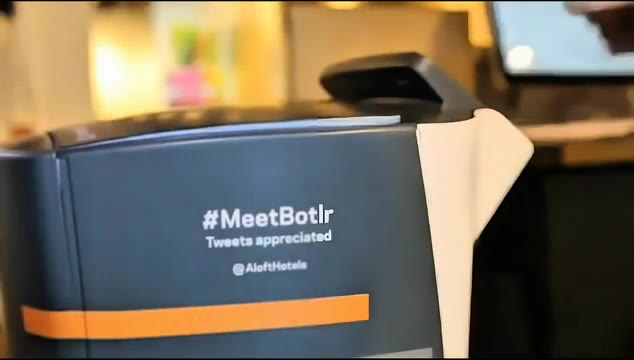
*Gros plan sur un robot de service d'hôtel portant l'inscription '#MeetBotlr'*

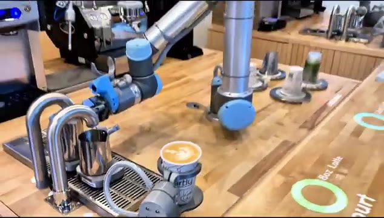
*Bras robotique automatisé préparant du café dans un café*

---

### ⏱️ `[00:00:19 - 00:00:44]` | Segment #02

**🔊 Audio (Transcription Intégrale Mot pour Mot en Français) :**
> Les bras robotiques comme Artly ne se contentent pas de préparer du café. Ils peuvent même créer un art du latte parfait. Ce qui commence dans un pays y reste rarement. Cela pourrait se propager dans le monde entier plus vite que nous le pensons. Alors dites-moi, si cette technologie arrivait dans votre pays, l'aimeriez-vous ? Notez-la sur 10 dans les commentaires. Passons ensuite aux rédacteurs. Mais d'abord, clarifions ce que fait un rédacteur. Ce sont ceux qui écrivent les mots sur les publicités, les sites web ou les affiches, les lignes qui vous convainquent de cliquer, d'acheter ou d'essayer quelque chose.

**👁️ Analyse Visuelle d'Écran (gemini-3.5-flash-lite) :**
**Interface & Outils** : Présentation vidéo d'exemples d'applications concrètes (café robotisé et supports publicitaires visuels).

**Contenu textuel & Code** : Textes publicitaires affichés : « FUEL YOUR LIFE, TASTE THE GOODNESS! » et étiquettes de produits « PURE & GOOD KALE CHIPS ».

**Action / Démonstration** : Présentation visuelle de démonstrations robotisées (latte art) et d'exemples de supports publicitaires de copywriting.

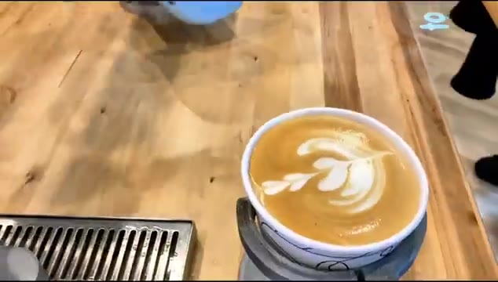
*Gros plan sur une tasse de café posée sur un comptoir en bois avec un motif complexe de latte art en forme de feuille réalisé par un robot.*

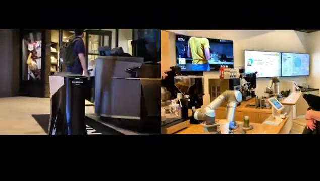
*Vue d'un café automatisé avec un bras robotique Artly en action et des écrans d'affichage numérique au mur.*

*Visuel publicitaire avec le texte promotionnel « FUEL YOUR LIFE, TASTE THE GOODNESS! » et des sachets de snacks « PURE & GOOD ».*

---

### ⏱️ `[00:00:44 - 00:01:05]` | Segment #03

**🔊 Audio (Transcription Intégrale Mot pour Mot en Français) :**
> Maintenant voici les preuves. Sur Reddit, plusieurs rédacteurs publicitaires ont admis que l'IA les avait déjà remplacés. L'un d'eux a même déclaré qu'il n'avait pas eu un seul emploi en huit mois parce que son entreprise avait licencié tous les rédacteurs et était passée à l'IA. Il a écrit : Je ne veux pas de réponses édulcorées du genre l'IA ne prend pas nos jobs, parce qu'elle a déjà pris le mien. J'ai lié ces publications dans la description pour que vous puissiez lire par vous-même.

**👁️ Analyse Visuelle d'Écran (gemini-3.5-flash-lite) :**
**Interface & Outils** : Captures d'écran de publications de réseaux sociaux (Reddit/LinkedIn) affichées sur fond sombre.

**Contenu textuel & Code** : Texte en anglais abordant l'impact de l'intelligence artificielle sur les emplois de rédacteur (copywriter), les licenciements massifs et la difficulté de retrouver un emploi.
[DESC_IMAGE_3] Suite du texte de la publication Reddit montrant la conclusion de l'auteur affirmant que l'IA a déjà pris son travail.

**Action / Démonstration** : Défilement visuel des captures d'écran de témoignages textuels pour illustrer les propos du créateur sur l'impact de l'IA.

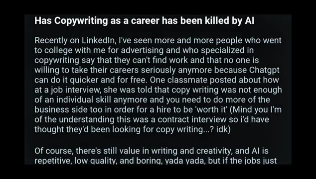
*Capture d'écran d'un article ou post Reddit/LinkedIn intitulé "Has Copywriting as a career has been killed by AI" traitant de la difficulté de trouver du travail en tant que rédacteur face à ChatGPT.*

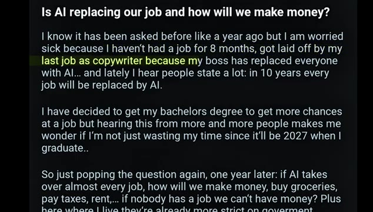
*Capture d'écran d'une publication Reddit intitulée "Is AI replacing our job and how will we make money?" où un utilisateur explique qu'il n'a pas eu de travail depuis 8 mois après avoir été licencié par son patron.*

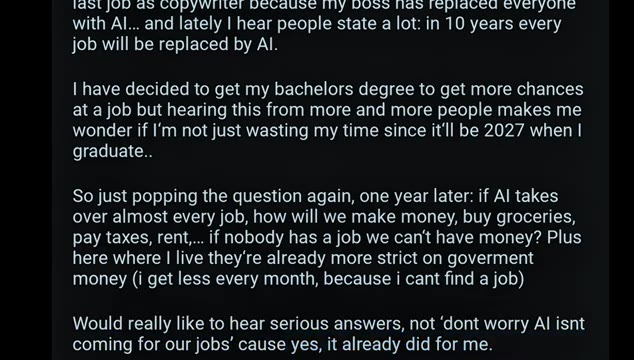
*Suite de la publication Reddit montrant les préoccupations de l'auteur concernant l'avenir et demandant des réponses sérieuses plutôt que des dénégations.*

---

### ⏱️ `[00:01:05 - 00:01:25]` | Segment #04

**🔊 Audio (Transcription Intégrale Mot pour Mot en Français) :**
> Et si vous êtes rédacteur, partagez votre expérience dans les commentaires. L'IA vous a-t-elle aidé ou a-t-elle pris des opportunités ? Mais ne vous installez pas trop confortablement, car le prochain emploi que l'IA aura remplacé pourrait vous surprendre encore plus. Numéro trois, la police de la circulation. Et voici la preuve. En Chine, des agents robotisés sont déjà déployés aux carrefours pour diriger les véhicules et les piétons dans la vie réelle.

**👁️ Analyse Visuelle d'Écran (gemini-3.5-flash-lite) :**
**Interface & Outils** : Présentation d'une vidéo d'illustration montrant un robot policier dans la rue en Chine.

**Contenu textuel & Code** : Un robot humanoïde jaune et blanc avec un casque de police se tient sur un passage piéton urbain, entouré de voitures et de piétons la nuit, à côté d'un agent de police humain.

**Action / Démonstration** : Le robot est déployé pour réguler la circulation et guider les passants dans une rue animée.

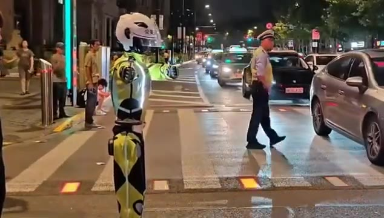
*Robot agent de circulation en Chine sur un passage piéton à côté de véhicules et d'un agent humain.*

---

### ⏱️ `[00:01:25 - 00:01:46]` | Segment #05

**🔊 Audio (Transcription Intégrale Mot pour Mot en Français) :**
> Pas seulement dans un film de science-fiction. Maintenant, soyons clairs, tous les rôles policiers ne sont pas menacés. Ces robots font principalement des tâches de bas niveau comme guider la circulation, pas des enquêtes sensibles ou du maintien de l'ordre communautaire. Mais cela montre quelque chose d'important. Le remplacement par l'IA ne signifie pas toujours tout ou rien. Cela peut commencer par des tâches spécifiques puis s'étendre plus largement. Le prochain emploi vient du chantier de construction.

**👁️ Analyse Visuelle d'Écran (gemini-3.5-flash-lite) :**
**Interface & Outils** : Présentation face caméra sans partage d'écran

**Contenu textuel & Code** : Aucun contenu logiciel ou interface affiché (images d'illustration de robots policiers et de chantiers).

**Action / Démonstration** : Le créateur présente une séquence vidéo d'illustration montrant un robot policier gérant la circulation et un ouvrier sur un chantier.

---

### ⏱️ `[00:01:46 - 00:02:05]` | Segment #06

**🔊 Audio (Transcription Intégrale Mot pour Mot en Français) :**
> Récemment, une énorme histoire a éclaté en Chine. Une autoroute de 158 kilomètres a été construite presque entièrement sans ouvriers. Les robots et l'IA ont pris le relais, ce qui signifie que certains emplois pourraient bientôt disparaître à cause de cette réalisation. Voici comment cela s'est produit. Des drones ont scanné chaque fissure. Des finisseurs géants autonomes ont posé l'asphalte avec une précision millimétrique.

**👁️ Analyse Visuelle d'Écran (gemini-3.5-flash-lite) :**
**Interface & Outils** : Présentation sans partage d'écran (images d'illustration montrant des engins de chantier et des salles de contrôle).

**Contenu textuel & Code** : Aucun texte ou interface logicielle visible à l'écran, uniquement des séquences vidéo d'illustration (un rouleau compresseur, des opérateurs dans une salle de contrôle devant des écrans, et une vue aérienne d'un chantier routier).

**Action / Démonstration** : Le flux vidéo présente des images d'illustration sur le chantier d'une autoroute automatisée en Chine, montrant les machines autonomes et les salles de contrôle associées.

---

### ⏱️ `[00:02:06 - 00:02:24]` | Segment #07

**🔊 Audio (Transcription Intégrale Mot pour Mot en Français) :**
> Et les rouleaux compresseurs ont compacté la route sans un seul opérateur sur le siège du conducteur. Ce n'est pas de la science-fiction. C'est aujourd'hui. Alors, quels emplois l'IA a-t-elle réellement remplacés ici ? Numéro un, les géomètres. Normalement, les équipes passent des jours à cartographier les dégâts routiers, mais cette fois, des drones l'ont fait plus rapidement et avec plus de précision. Numéro deux, les conducteurs d'engins lourds.

**👁️ Analyse Visuelle d'Écran (gemini-3.5-flash-lite) :**
**Interface & Outils** : Vidéo de démonstration et d'illustration avec incrustation de texte informatif.

**Contenu textuel & Code** : Texte affiché à l'écran : "Surveyors" (Géomètres).
[DESC_IMAGE_1] Rendu visuel d'un engin de chantier autonome en action.
[DESC_IMAGE_2] Présentation du premier métier remplacé : les géomètres (Surveyors).
[DESC_IMAGE_3] Illustration du travail de cartographie aérienne par drones sur un chantier.

**Action / Démonstration** : Démonstration pédagogique et présentation du workflow.

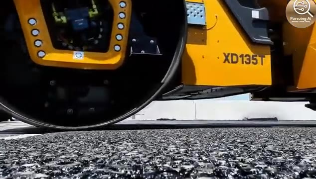
*Gros plan sur un rouleau compresseur jaune XD135T en mouvement compactant le bitume.*

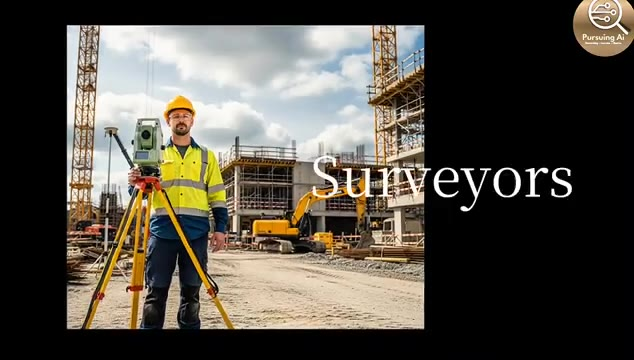
*Image illustrant un géomètre avec son équipement sur un chantier de construction, avec le texte 'Surveyors'.*

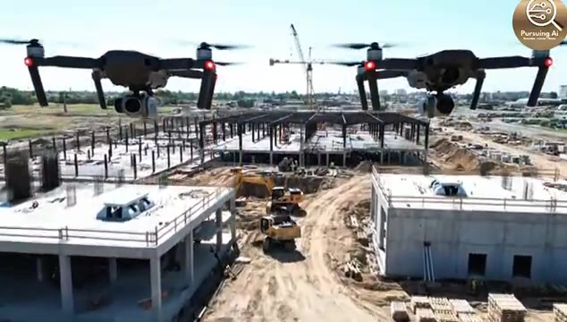
*Vue aérienne montrant des drones survolant un grand chantier de construction avec des bâtiments en structure.*

---

### ⏱️ `[00:02:25 - 00:02:46]` | Segment #08

**🔊 Audio (Transcription Intégrale Mot pour Mot en Français) :**
> Les machines de pavage et les rouleaux compresseurs étaient complètement autonomes. Pas de conducteurs, pas de changements d'équipe. Et cela ne s'arrête pas là. Les chauffeurs de taxi disparaissent aussi lentement, car en Chine, les voitures autonomes sont déjà sur les routes. Le plus fou, c'est qu'il ne s'agissait pas seulement d'un petit test. C'était l'une des autoroutes les plus fréquentées de Chine, resurfacée plus rapidement, plus sûrement et plus régulièrement que par les méthodes traditionnelles.

**👁️ Analyse Visuelle d'Écran (gemini-3.5-flash-lite) :**
**Interface & Outils** : Séquence vidéo documentaire avec incrustations de texte informatif.

**Contenu textuel & Code** : Texte affiché : "3 30-TON RUBBER-WHEELED ROLLERS" et "CARMAGEDDON".

**Action / Démonstration** : Présentation de véhicules de chantier autonomes, d'un intérieur de véhicule autonome en mouvement et d'un embouteillage nocturne.

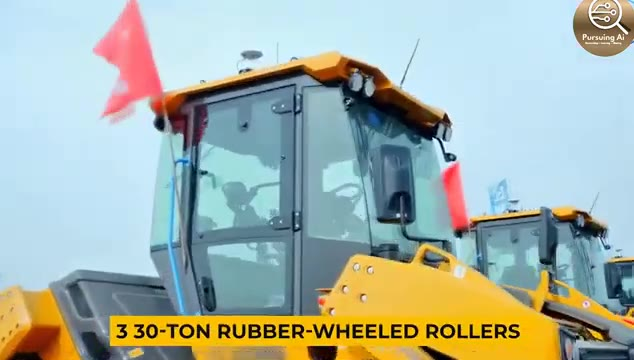
*Vue rapprochée d'un compacteur autonome jaune avec le texte explicatif "3 30-TON RUBBER-WHEELED ROLLERS".*

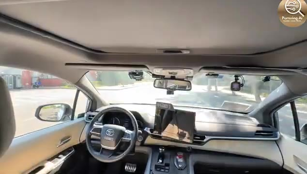
*Vue intérieure de l'habitacle d'une voiture autonome en circulation.*

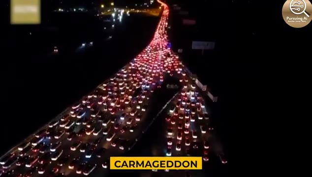
*Vue aérienne nocturne d'une autoroute très encombrée par la circulation avec le mot "CARMAGEDDON".*

---

### ⏱️ `[00:02:46 - 00:03:05]` | Segment #09

**🔊 Audio (Transcription Intégrale Mot pour Mot en Français) :**
> L'IA ne remplace pas seulement le travail de bureau comme la rédaction de textes ou le support client. Elle est déjà en train de remodeler la construction elle-même. Alors, qu'en pensez-vous ? L'IA va-t-elle détruire des millions d'emplois dans la construction ? Ou en créera-t-elle de nouveaux que nous ne pouvons même pas encore imaginer ? Partagez vos réflexions ci-dessous. Et ce n'est que le début. Ce ne sont là que quelques-uns des emplois que l'IA a déjà remplacés.

**👁️ Analyse Visuelle d'Écran (gemini-3.5-flash-lite) :**
**Interface & Outils** : Interface de contrôle sur tablette robuste de marque XCMG et divers affichages de vidéos de démonstration industrielle.

**Contenu textuel & Code** : Logos et interfaces de contrôle de machinerie lourde, vues aériennes de chantiers, intérieur de véhicule autonome et bras robotisés dans un café.

**Action / Démonstration** : Manipulation d'une tablette de contrôle tactile pour la machinerie de construction et défilement de différentes applications robotiques et d'automatisation.

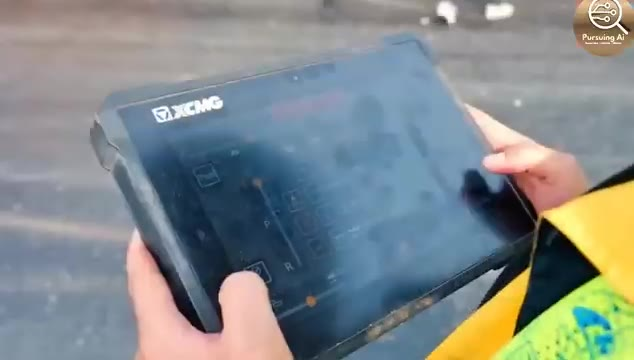
*Gros plan sur une tablette numérique XCMG utilisée sur un chantier de construction.*

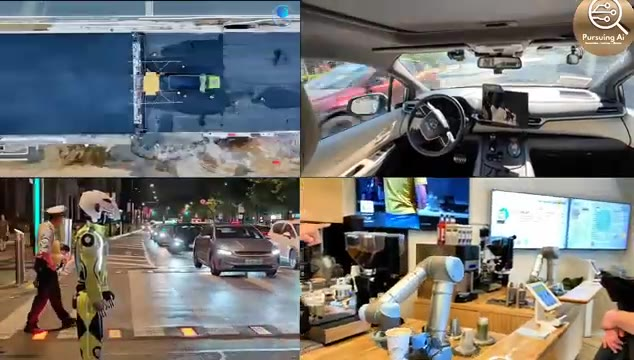
*Écran divisé en quatre montrant divers cas d'utilisation de l'IA et de la robotique dans le secteur réel.*

---

### ⏱️ `[00:03:05 - 00:03:18]` | Segment #10

**🔊 Audio (Transcription Intégrale Mot pour Mot en Français) :**
> D'autres arrivent, et vous voudrez savoir lesquels seront les suivants. Alors si vous avez trouvé cela révélateur, assurez-vous de cliquer sur ce bouton d'abonnement et d'activer la cloche. Parce que dans la prochaine vidéo, je vous montrerai encore plus d'emplois qui sont menacés. Restez curieux, et je vous vois dans la prochaine.

**👁️ Analyse Visuelle d'Écran (gemini-3.5-flash-lite) :**
**Interface & Outils** : Vidéo de démonstration avec écran divisé en quatre fenêtres illustrant des innovations robotiques et d'automatisation des emplois.

**Contenu textuel & Code** : Texte incrusté en bas à gauche de la vignette supérieure gauche sur l'image 3 : "3 30-TON RUBBER-WHEELED ROLLERS".

**Action / Démonstration** : Présentation visuelle en grille 2x2 de diverses technologies d'automatisation (construction routière automatisée, conduite autonome, police robotisée et service de café par bras mécanique).

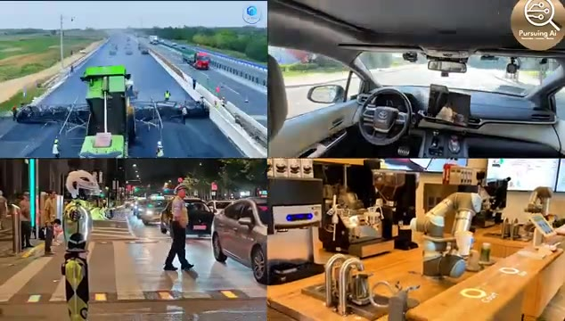
*Écran divisé en 4 montrant des exemples d'automatisation : compacteur de route, habitacle de voiture autonome, robot de police et bras robotique barista.*

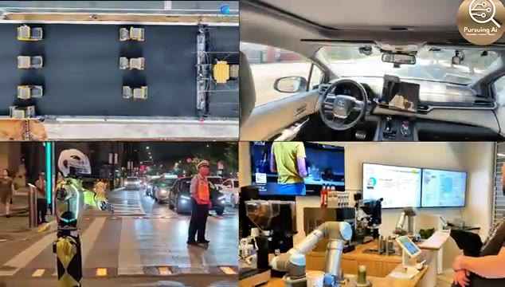
*Écran divisé en 4 montrant la suite de la démonstration des technologies d'automatisation et de robotique.*

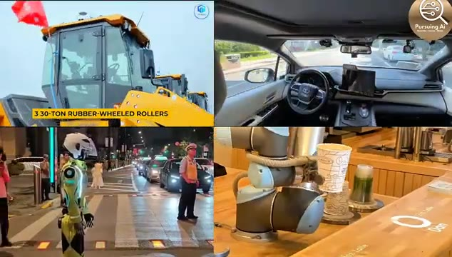
*Écran divisé en 4 montrant en gros plan des rouleaux de compactage, un véhicule autonome, un robot humanoïde et un bras robotique de café.*

---
