# 🎬 Le tueur de Nano Banana est enfin là !

> **Chaîne** : [Pursuing AI](https://www.youtube.com/@PursuingAi)  
> **Titre original** : `Nano Banana Killer is Here!`  
> **Lien YouTube** : [https://www.youtube.com/watch?v=DNly_Ue_XCc](https://www.youtube.com/watch?v=DNly_Ue_XCc)  
> **Date de publication** : 2025-09-15  
> **Durée** : 04m 46s (`286s`)  
> **Identifiant vidéo** : `DNly_Ue_XCc`  
> **Fiche Web Interactive** : [2025-09-15_YT-DNly_Ue_XCc_Le tueur de Nano Banana est enfin là !_by-whisper-v3-large-turbo+gemini-3.5-flash-lite.html](2025-09-15_YT-DNly_Ue_XCc_Le tueur de Nano Banana est enfin là !_by-whisper-v3-large-turbo+gemini-3.5-flash-lite.html)  
> **Captures de démonstration clés** : `36 captures réelles (anti-talking-head)`  
> **Modèles utilisés** : Audio: `large-v3-turbo` (Faster-Whisper int8 VPS) | Vision: `gemini-3.5-flash-lite` (Google AI Studio API)  

---

## 📌 Synthèse Exécutive & Outils

### 📌 Résumé
La vidéo de Pursuing AI analyse l'émergence de **Seedream 4.0**, un nouveau générateur et éditeur d'images développé par ByteDance (la maison mère de TikTok), présenté comme le nouveau « tueur » de l'outil dominant du marché, Nano Banana. Alors que l'écosystème de l'intelligence artificielle générative évolue à un rythme effréné, cette confrontation redéfinit les standards de l'édition d'images par prompt textuel. Le créateur structure sa démonstration de manière comparative et rigoureuse : il commence par analyser les cas d'usage spectaculaires mis en avant par les développeurs (fusion d'images, modification de texte, colorisation, résolution d'équations sur tableau noir), avant de confronter directement les deux IA sur ses propres cas pratiques. 

Pour mener à bien cette évaluation, le créateur adopte une méthode empirique basée sur des tests d'inpaint, de modification stylistique, de cohérence contextuelle et de manipulation typographique. À travers des prompts complexes intégrant des contraintes de style (animation 2D, scènes nocturnes), d'ajout d'objets (crocodiles, masques de Batman) ou de retouche de texte précis, il décortique la logique d'exécution des deux modèles. Cette approche méthodique permet d'éviter le piège des démos marketing officielles et d'isoler les forces et faiblesses réelles de chaque solution en conditions de production.

Pour les créateurs de contenu vidéo et les graphistes, les bénéfices de cette analyse sont stratégiques. La vidéo démontre qu'aucun outil n'est universellement supérieur : **Seedream 4.0** excelle dans la compréhension globale des scènes, l'édition typographique complexe et le respect des chartes graphiques, tandis que **Nano Banana** conserve des avantages sur certains ajustements anatomiques et la gestion de détails spécifiques. Cette vision nuancée permet aux créateurs d'optimiser leurs workflows en choisissant l'outil idéal selon la nature exacte de la tâche créative à accomplir.

### 🛠️ Outils, Modèles & Logiciels Présentés
* **Seedream 4.0** : Modèle d'édition et de génération d'images développé par ByteDance, reconnu pour sa puissance dans la fusion d'images, la manipulation de texte et la cohérence contextuelle.
* **Nano Banana** : Éditeur d'images par IA de référence, précédemment considéré comme le leader du marché, utilisé ici comme étalon de comparaison pour évaluer les performances de Seedream.
* **Photoshop** : Logiciel de retouche traditionnel mentionné comme l'étalon historique de l'industrie que ces nouvelles solutions d'IA cherchent à concurrencer ou remplacer.

### 🔑 Points Clés & Enseignements Stratégiques
* **Supériorité de Seedream 4.0 en fusion d'images** : Le modèle développé par ByteDance est capable d'absorber une grande quantité d'images de référence et de les fusionner en une seule composition tout en respectant strictement l'intégrité visuelle des éléments sources.
* **Capacités multimodales avancées** : Seedream démontre une aptitude impressionnante à résoudre des problèmes textuels ou logiques (comme des équations mathématiques) et à générer la solution directement mise en scène dans un décor réaliste (sur un tableau noir).
* **Nuances dans l'ajout d'objets (Cas du crocodile)** : Face à un prompt d'insertion contextuelle, Seedream intègre l'élément avec une échelle et un fondu naturels, tandis que Nano Banana pèche par une mauvaise gestion de l'échelle (élément disproportionné).
* **Gestion des portraits et des expressions (Cas de Robert Pattinson)** : L'ajout d'un masque de Batman révèle les limites de Seedream qui modifie involontairement l'expression faciale du sujet, donnant l'avantage à Nano Banana pour la préservation de la structure faciale.
* **Gestion de l'éclairage nocturne et des sources lumineuses** : Les tests de conversion jour/nuit mettent en évidence des logiques différentes : Seedream maintient parfois des éclairages de bâtiments de manière incohérente, tandis que Nano Banana gère parfois mieux l'allumage simultané des lumières urbaines et des monuments (comme la Tour Eiffel).
* **Performance absolue sur l'édition typographique** : Seedream surclasse nettement Nano Banana lorsqu'il s'agit de modifier du texte au sein d'une image (changement de noms de festivals ou d'événements sportifs), en conservant fidèlement la police, la palette de couleurs et l'alignement.
* **Respect des contraintes typographiques strictes** : Lors du remplacement du texte « Golf Club Meet and Great » par « Basketball Club » avec mention de joueurs, Seedream intègre même les signes de ponctuation spécifiques exigés dans le prompt, là où Nano Banana génère des artefacts parasites.
* **Gestion du flou de mouvement (Motion Blur)** : Pour l'ajout d'effets dynamiques sur un sujet en mouvement, les deux outils proposent des approches différentes, Nano Banana offrant parfois un rendu plus esthétique selon le contexte de la prise de vue.
* **Isolement des modifications ciblées (Cas de la pizza 2D)** : Lorsqu'on demande de transformer uniquement la pizza en style anime 2D, Seedream applique la transformation à l'ensemble du cadre, tandis que Nano Banana cible mieux la pizza, malgré une légère erreur sur la main du sujet.
* **L'importance de tester ses propres prompts** : Ne jamais se fier uniquement aux démos officielles des éditeurs d'IA, souvent idéalisées ou triées sur le volet, et privilégier des tests comparatifs sur des cas d'usage réels et personnels.
* **Complémentarité des outils du marché** : Plutôt qu'un « tueur » universel, l'écosystème actuel montre une coexistence d'intérêts : Seedream 4.0 pour le texte et la fusion complexe, Nano Banana pour des retouches ciblées et certains ajustements de précision.
* **Veille technologique indispensable** : Le domaine de l'IA générative évoluant de manière hebdomadaire, maintenir une formation continue et tester les nouveaux modèles ByteDance ou concurrents est crucial pour garder une longueur d'avance dans la création de contenu.

---

## ⏱️ Chronologie & Transcription Complète Audio & Visuelle (Mot pour Mot)

### ⏱️ `[00:00:00 - 00:00:22]` | Segment #01

**🔊 Audio (Transcription Intégrale Mot pour Mot en Français) :**
> Il y a tout juste quelques semaines, Nano Banana avait l'air du tueur de Photoshop ultime. Mais maintenant, oubliez cette idée, un nouvel éditeur et générateur d'images est arrivé, et il fait passer Nano Banana lui-même pour obsolète. Je sais que cela peut sembler difficile à croire, alors dans cette vidéo, je vais vous montrer des exemples réels et des comparaisons directes avec Nano Banana. Plongeons-nous directement dedans. Le modèle s'appelle Seedream 4.0, créé par ByteDance, l'entreprise derrière TikTok.

**👁️ Analyse Visuelle d'Écran (gemini-3.5-flash-lite) :**
**Interface & Outils** : Présentation de démonstrations visuelles de modèles d'IA générative et écran de transition de marque.

**Contenu textuel & Code** : Visuels générés par IA (portrait réaliste, personnage de style comics Catwoman) et logo "ByteDance | Seed".

**Action / Démonstration** : Défilement de différentes images générées par IA pour illustrer les capacités du modèle Seedream 4.0 comparées à Nano Banana.

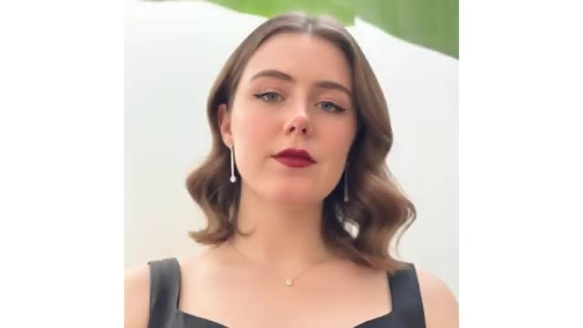
*Génération d'image IA montrant le portrait réaliste d'une jeune femme brune aux cheveux ondulés, portant une robe noire et des boucles d'oreilles.*

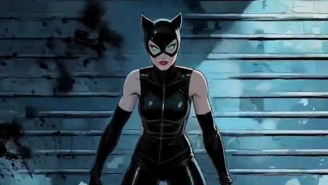
*Génération d'image IA représentant Catwoman en tenue noire en cuir moulante avec un masque à oreilles de chat, dans un style de bande dessinée sombre.*

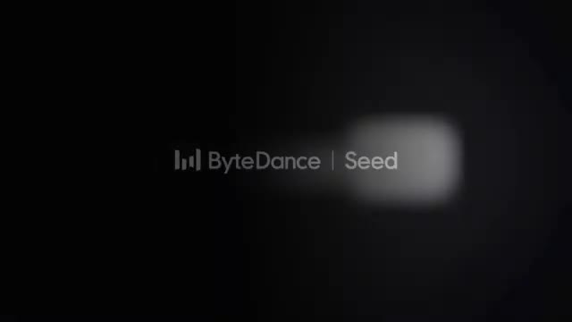
*Écran de transition ou de logo affichant le texte "ByteDance | Seed" sur fond sombre.*

---

### ⏱️ `[00:00:22 - 00:00:56]` | Segment #02

**🔊 Audio (Transcription Intégrale Mot pour Mot en Français) :**
> Sur leur site web, ils partagent quelques exemples. Supposons que vous téléchargez une tonne d'images et que vous lui donnez l'instruction de les fusionner toutes ensemble en une seule image. Le résultat est insensé. Il comprend parfaitement l'instruction, et tout ressemble exactement à l'image de référence. Vous pouvez également modifier le texte d'une affiche, comme ceci, ou même changer complètement l'éclairage de la scène, comme ceci. Il est également très doué pour coloriser des photos en noir et blanc, et au-delà de l'édition, il est extrêmement puissant pour générer des images aussi. Par exemple, vous pouvez lui demander de concevoir une page d'atterrissage pour cette galerie, comme ceci, ou vous pouvez lui demander de résoudre une équation, et le

**👁️ Analyse Visuelle d'Écran (gemini-3.5-flash-lite) :**
**Interface & Outils** : Site web de présentation de l'outil d'IA Seedream 4.0.

**Contenu textuel & Code** : Texte « Seedream 4.0 », exemples de fusions d'images, instructions d'édition, colorisation et résolution d'équations mathématiques.

**Action / Démonstration** : Présentation des capacités de fusion d'images, d'édition, de colorisation et de génération d'images complexes via Seedream 4.0.

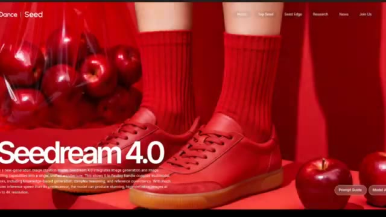
*Page web de Seedream 4.0 montrant des exemples d'images générées avec des pommes et des chaussures rouges.*

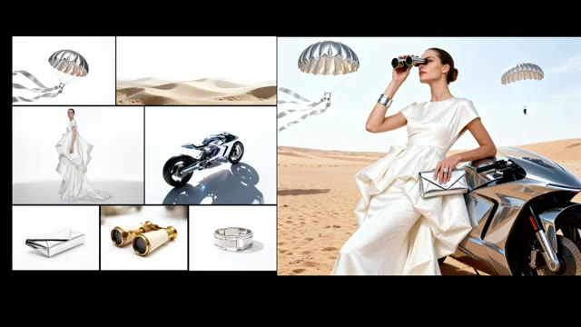
*Collage d'images de référence (parachutes, moto, accessoires) fusionnées par l'IA dans une scène unifiée dans le désert.*

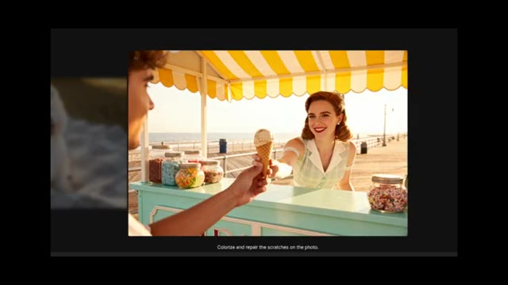
*Photo colorisée d'une femme servant une glace dans une baraque à frites, avec le texte d'invite en bas.*

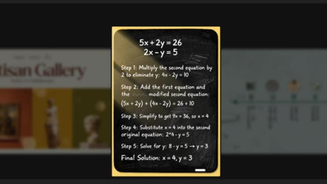
*Tableau noir affichant une équation mathématique résolue étape par étape par l'IA.*

---

### ⏱️ `[00:00:56 - 00:01:25]` | Segment #03

**🔊 Audio (Transcription Intégrale Mot pour Mot en Français) :**
> solution de l'équation sur un tableau noir. Et puis regardez les résultats pour voir avec quelle précision il comprend le prompt et donne également la solution. Incroyable. Ce sont des exemples complètement fous. Regardez à quel point c'est insensé. Maintenant, bien sûr, ce sont leurs démos officielles, elles ont donc pu être triées sur le volet. Ensuite, je vais vous montrer mes propres expériences et comparaisons avec Nano Banana. Le cas d'utilisation des équations est intéressant. J'ai essayé le même prompt, mais avec une équation différente et les résultats ont été impressionnants. Seadream l'a exécuté parfaitement.

**👁️ Analyse Visuelle d'Écran (gemini-3.5-flash-lite) :**
**Interface & Outils** : Démonstration de rendu vidéo et d'infographies textuelles illustrant la résolution de problèmes mathématiques par IA.

**Contenu textuel & Code** : Équations mathématiques, étapes de résolution textuelles ("Step 1", "Step 2", "Final Solution: x = 4, y = 3"), et visuel de coureur futuriste avec la mention "AI".

**Action / Démonstration** : Défilement de différentes démonstrations visuelles illustrant les capacités de compréhension de prompts et de résolution d'équations par les modèles d'intelligence artificielle.

*Tableau noir affichant la résolution étape par étape d'un système d'équations linéaires (5x + 2y = 26, 2x - y = 5) par l'IA.*

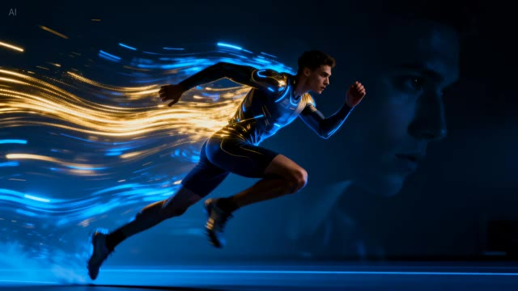
*Génération vidéo IA montrant un coureur futuriste stylisé avec des traînées lumineuses bleues et orange.*

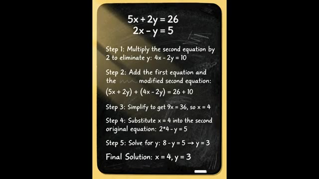
*Répétition de l'affichage du tableau noir avec la résolution détaillée des équations mathématiques.*

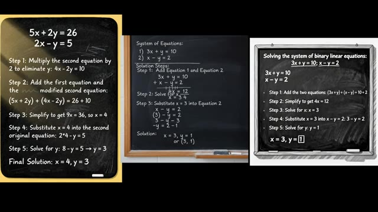
*Comparaison de tableaux noirs côte à côte présentant différentes étapes de résolution d'équations mathématiques générées par l'IA.*

---

### ⏱️ `[00:01:25 - 00:01:44]` | Segment #04

**🔊 Audio (Transcription Intégrale Mot pour Mot en Français) :**
> tandis que Nano Banana a également obtenu la bonne réponse et les étapes, mais les a présentées de manière un peu brouillonne sans exploiter au mieux l'espace. Pourtant, les deux modèles ont réussi à produire le bon résultat. J'ai utilisé cette image et lui ai donné une invite. Ajoute un crocodile dans la rivière. L'image doit être cohérente et naturelle. Maintenant, en regardant le résultat de SeaDream, c'est impressionnant.

**👁️ Analyse Visuelle d'Écran (gemini-3.5-flash-lite) :**
**Interface & Outils** : Affichage côte à côte de comparaisons de résultats de modèles d'IA (Seedream et Nano Banana).

**Contenu textuel & Code** : Texte sur tableau noir : "Solving the system of binary linear equations: 3x + y = 10; x - y = 2", étapes de calcul et résultats finaux "x = 3, y = 1". Sur la seconde image, les étiquettes "INPUT" et "SEEDREAM" apparaissent sous les photos.

**Action / Démonstration** : Présentation visuelle comparative des performances de résolution mathématique et de modification d'image entre différents modèles d'IA.

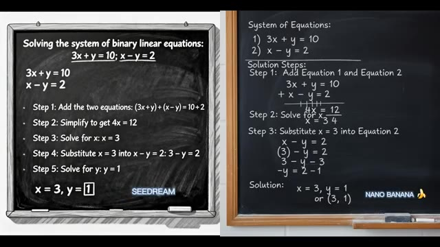
*Comparaison divisée en deux de tableaux noirs montrant la résolution d'un système d'équations linéaires par Seedream et Nano Banana.*

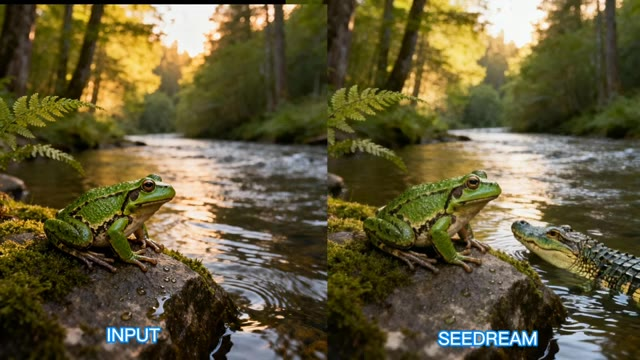
*Comparaison entre l'image d'entrée (Input) montrant une grenouille au bord d'une rivière et le résultat modifié par Seedream avec un crocodile.*

---

### ⏱️ `[00:01:44 - 00:02:02]` | Segment #05

**🔊 Audio (Transcription Intégrale Mot pour Mot en Français) :**
> Le crocodile se fond parfaitement dans le décor. Tout a l'air naturel et l'image reste cohérente avec la référence. D'un autre côté, Nano Banana offre également un bon résultat, mais il y a une erreur évidente. Le crocodile est beaucoup trop grand, et cela ne fait tout simplement pas naturel. C'est pourquoi, dans ce round, je donne le point à Sea Dream. Voici un autre exemple d'ajout d'éléments à une image.

**👁️ Analyse Visuelle d'Écran (gemini-3.5-flash-lite) :**
**Interface & Outils** : Présentation comparative de résultats de modèles d'IA générative d'images avec des étiquettes textuelles ("INPUT", "SEEDREAM", "NANO 🍌").

**Contenu textuel & Code** : Texte affiché sous les images : "INPUT", "SEEDREAM", "NANO 🍌", illustrant les tests de modification d'images par IA.

**Action / Démonstration** : Le créateur compare visuellement les performances de deux modèles d'IA différents (Seedream et Nano Banana) pour l'ajout d'un crocodile dans une scène naturelle.

*Comparaison entre l'image d'entrée (Input) et le résultat généré par Seedream montrant un petit crocodile près de la grenouille.*

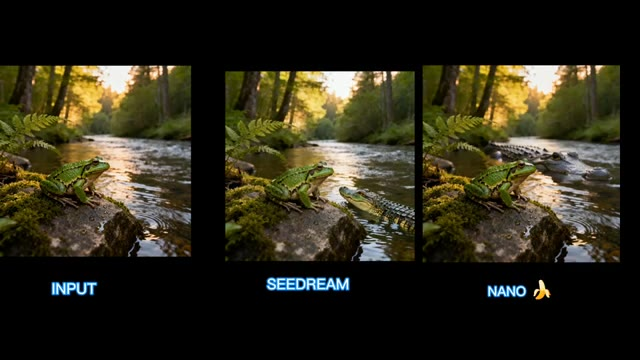
*Comparaison côte à côte de l'image d'entrée, du résultat de Seedream et du résultat de Nano Banana montrant un crocodile disproportionné.*

---

### ⏱️ `[00:02:03 - 00:02:21]` | Segment #06

**🔊 Audio (Transcription Intégrale Mot pour Mot en Français) :**
> J'ai téléchargé une photo de Robert Pattinson et j'ai utilisé ce prompt. Ajoute un masque de Batman noir réaliste sur le visage de Robert Pattinson pour qu'il corresponde à son look et à l'éclairage. Le résultat de Nano Banana est bon. Le masque est bien ajusté, et seule la forme du visage a un peu changé, mais ça reste bien. Le résultat de Sea Dream n'était pas bon.

**👁️ Analyse Visuelle d'Écran (gemini-3.5-flash-lite) :**
**Interface & Outils** : Interface vidéo de démonstration comparative d'outils d'intelligence artificielle.

**Contenu textuel & Code** : Texte affiché à l'écran : "INPUT" sous la photo originale et "NANO 🍌" sous l'image générée.

**Action / Démonstration** : Présentation visuelle comparative avant/après de la modification d'image par IA avec ajout d'un masque de Batman.

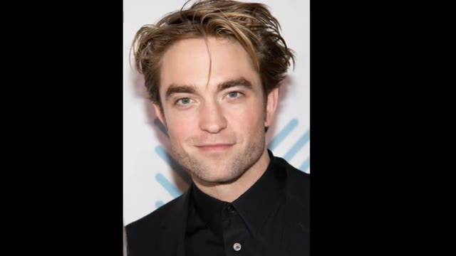
*Affichage de la photo source de Robert Pattinson (Input) utilisée pour le test.*

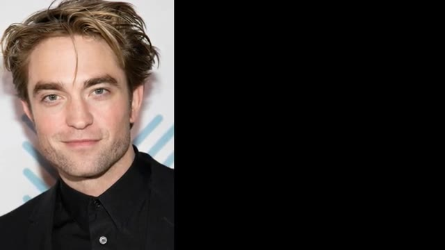
*Affichage comparatif côte à côte montrant la photo originale à gauche et une zone vide noire en cours de génération à droite.*

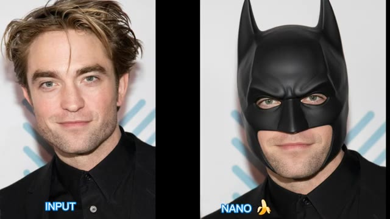
*Affichage comparatif final côte à côte entre l'image d'entrée ('INPUT') et le résultat généré par l'outil Nano Banana ('NANO 🍌') montrant Robert Pattinson portant le masque de Batman.*

---

### ⏱️ `[00:02:21 - 00:02:42]` | Segment #07

**🔊 Audio (Transcription Intégrale Mot pour Mot en Français) :**
> Il a ajouté le masque, mais ne l'a pas réparé, et il a également changé son expression faciale. Donc cette fois, le point va à Nano Banana. J'ai utilisé cette image et donné une instruction pour la transformer en scène nocturne. Voici le résultat de SeaDream. C'est devenu la nuit, mais les lampadaires sont restés allumés. D'un autre côté, Nano Banana a également gardé les lampadaires allumés, mais a éteint les lumières des bâtiments.

**👁️ Analyse Visuelle d'Écran (gemini-3.5-flash-lite) :**
**Interface & Outils** : Présentation comparative d'images générées par IA avec des étiquettes textuelles (INPUT, NANO BANANA, SEEDREAM).

**Contenu textuel & Code** : Texte à l'écran : "INPUT", "NANO BANANA", "SEEDREAM", "*DAYTIME*".
[Côté visuel] Affichage comparatif de différents modèles d'IA modifiant des images selon des instructions textuelles.

**Action / Démonstration** : Le présentateur compare les résultats visuels de deux outils d'IA différents (Nano Banana et SeaDream) sur des modifications d'images (ajout d'un masque et changement de l'éclairage de nuit à jour).

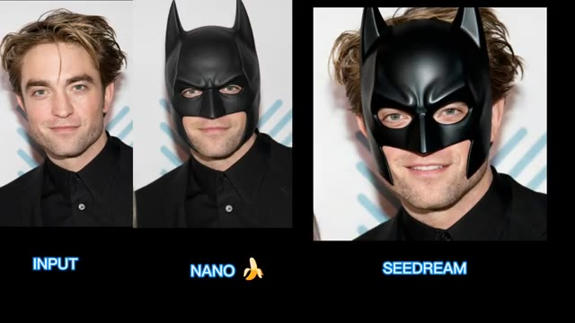
*Comparaison d'images montrant l'image d'entrée d'un visage et le résultat de Nano Banana avec un masque de Batman.*

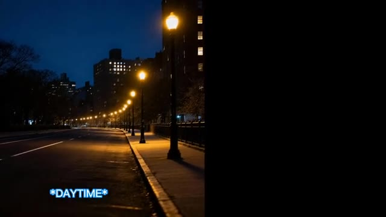
*Image de rue de nuit avec l'indication "*DAYTIME*".*

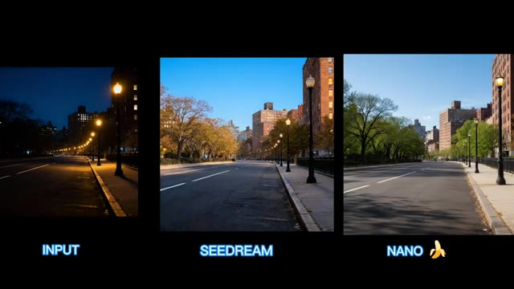
*Comparaison en trois parties montrant l'image d'entrée nocturne, le résultat de SeaDream et le résultat de Nano Banana transformés en plein jour.*

---

### ⏱️ `[00:02:42 - 00:03:06]` | Segment #08

**🔊 Audio (Transcription Intégrale Mot pour Mot en Français) :**
> Dans SeaDream, les lumières des bâtiments sont toujours allumées. Commentez ci-dessous et dites-moi à qui vous donneriez des points. Ici, j'ai utilisé une image aérienne de la tour Eiffel et j'ai donné un prompt pour la transformer en mode nuit. Le résultat de Seadream change bien la scène en nuit, avec les lumières des bâtiments visibles, mais les lumières de la tour Eiffel restent éteintes. D'un autre côté, Nano Banana comprend clairement mieux ma demande. Les lumières des bâtiments et de la tour Eiffel brillent magnifiquement.

**👁️ Analyse Visuelle d'Écran (gemini-3.5-flash-lite) :**
**Interface & Outils** : Interface de comparaison comparative de modèles d'IA générative d'images/vidéos avec des étiquettes textuelles (INPUT, SEEDREAM, NANO).

**Contenu textuel & Code** : Texte à l'écran : "INPUT", "SEEDREAM", "NANO" accompagné d'une icône de banane. Visuels de Paris et de la tour Eiffel de jour et de nuit.

**Action / Démonstration** : Le créateur présente une comparaison visuelle entre deux modèles d'IA différents (Seedream et Nano) transformant une photo de jour en scène nocturne.

*Comparaison côte à côte entre une image de rue de nuit (INPUT), la transformation par SEEDREAM et par NANO avec une icône de banane.*

*Vue aérienne en plein jour de la tour Eiffel et de la Seine à Paris utilisée comme image d'entrée.*

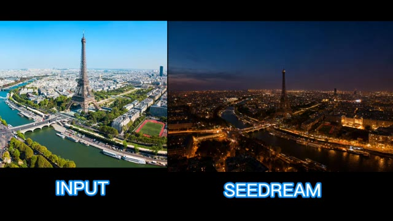
*Comparaison en deux volets montrant l'image aérienne de jour originale (INPUT) et le résultat nocturne de SEEDREAM où la tour Eiffel reste sombre.*

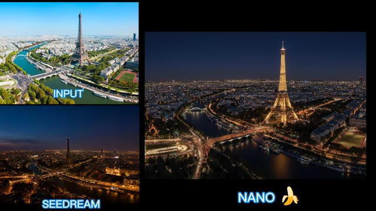
*Comparaison multi-panneaux montrant l'INPUT, SEEDREAM en bas à gauche et le résultat de NANO à droite où la tour Eiffel et les bâtiments sont brillamment illuminés la nuit.*

---

### ⏱️ `[00:03:06 - 00:03:42]` | Segment #09

**🔊 Audio (Transcription Intégrale Mot pour Mot en Français) :**
> Donc, le point revient à Nano Banana. Comme nous l'avons vu avec Seadream, il fonctionne très bien lors de la modification de texte. Pour tester cela, j'ai utilisé leur image sur laquelle était écrit « Santiago Music Festival » et j'ai donné le prompt suivant : Change Santiago Music Festival to Pursuing AI. Les résultats de Seadream sont parfaits, tandis que Nano Banana n'est pas efficace pour modifier correctement le texte et ne supprime pas Music Festival. Puisqu'il s'agit d'exemples de Seadream, cela pourrait être injuste pour Nano Banana. J'ai donc utilisé ma propre image avec « Golf Club Meet and Great » écrit dessus et j'ai donné le prompt : Change Golf Club Meet and Great to Basketball Club. Get a chance to meet Ronaldo and Messi.

**👁️ Analyse Visuelle d'Écran (gemini-3.5-flash-lite) :**
**Interface & Outils** : Interface de montage vidéo présentant des exemples comparatifs d'IA de génération/modification d'images, des affiches graphiques et des superpositions de textes de prompts.

**Contenu textuel & Code** : Textes visibles : « Santiago Music Festival », « Pursuing AI », « SEEDREAM », « NANO 🍌 », « GOLF CLUB MEET & GREAT », et les prompts textuels de modification : « Change Santiago Music Festival To Pursuing AI » et « Change 'Golf Club Meet and Great' to 'Basketball Club - Get a Chance to Meet Ronaldo and Messi' ».

**Action / Démonstration** : Le présentateur compare visuellement les performances de deux modèles d'IA (Seadream et Nano Banana) sur la modification de texte à l'intérieur d'images, en affichant des affiches graphiques et des prompts textuels à l'écran.

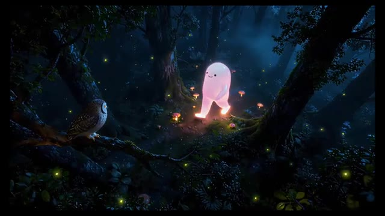
*Image animée montrant un personnage lumineux et gélatineux marchant dans une forêt sombre et mystique avec des lucioles et une chouette sur une branche.*

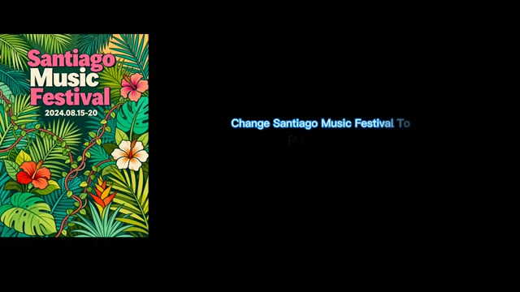
*Affiche graphique aux motifs tropicaux et floraux affichant le texte « Santiago Music Festival 2024.08.15-20 », accompagnée du prompt textuel affiché en bas : « Change Santiago Music Festival To Pursuing AI ».*

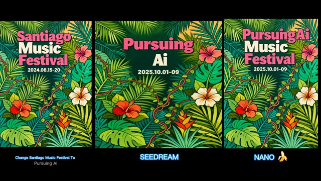
*Comparaison visuelle entre l'image originale, le résultat de SEEDREAM (« Pursuing AI ») et le résultat de NANO BANANA (« Pursuing Ai Music Festival »), illustrant l'efficacité de modification du texte.*

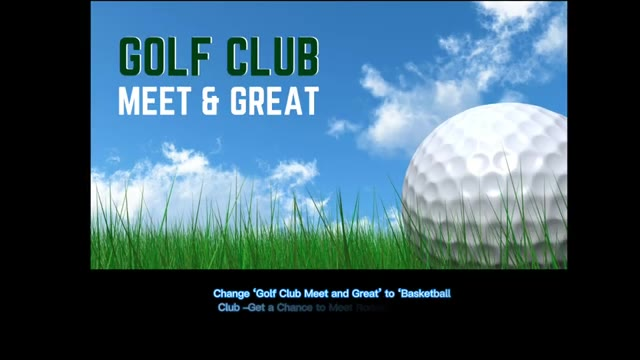
*Image de présentation d'un club de golf avec une grande balle de golf sur de l'herbe et un ciel bleu nuageux, avec le prompt textuel affiché en bas pour changer le texte.*

---

### ⏱️ `[00:03:42 - 00:04:17]` | Segment #10

**🔊 Audio (Transcription Intégrale Mot pour Mot en Français) :**
> Conservez la palette de couleurs, la police et l'alignement du texte inchangés. Voici le résultat. C Dream a parfaitement réussi, incluant même le tiret que j'ai spécifié dans le prompt. Nano Banana, cependant, a clairement échoué dans ce tour. Je ne sais pas pourquoi, mais il a ajouté des éléments supplémentaires à l'image. Ici, les points vont à C Dream. J'ai utilisé cette image et donné le prompt. Ajoutez de nombreuses trainées de flou de mouvement à cette personne qui court vite. Voici les résultats des deux modèles. Alors, lequel devriez-vous choisir ? Dans ce cas, je préfère la génération de Nano Banana, j'ai téléchargé cette image de pizza et donné le prompt. Faites ressembler la pizza à un dessin 2D fantaisiste

**👁️ Analyse Visuelle d'Écran (gemini-3.5-flash-lite) :**
**Interface & Outils** : Présentation vidéo comparative de modèles d'IA générative (C Dream / Nano Banana).

**Contenu textuel & Code** : Textes de prompts et comparaisons visuelles : "Change 'Golf Club Meet and Great' to 'Basketball Club - Get a Chance to Meet Ronaldo and Messi'", "Add loads of motion blur trails to this person running fast", "Make pizza look like a 2D whimsical hand-drawn".

**Action / Démonstration** : Le présentateur compare les résultats visuels produits par deux modèles d'IA différents suite à des prompts textuels précis.

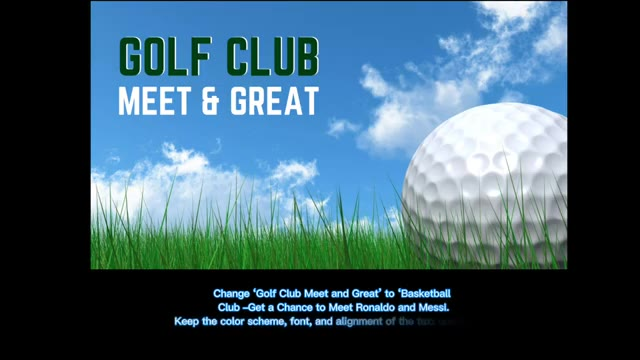
*Image d'une balle de golf sur l'herbe avec un texte de consigne en bas.*

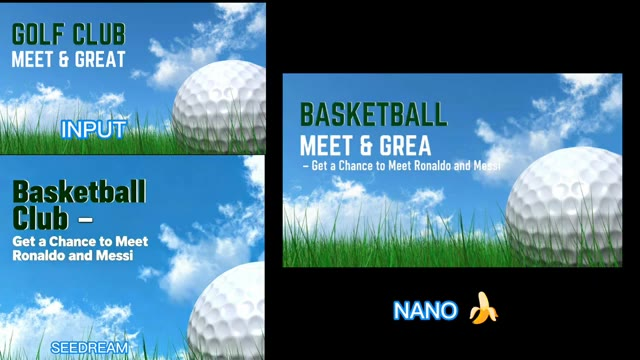
*Comparaison entre l'image d'entrée et le résultat généré par Nano Banana montrant le texte modifié.*

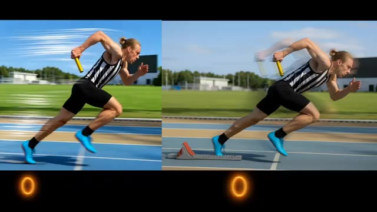
*Comparaison côte à côte de deux images d'un coureur avec des effets de flou de mouvement.*

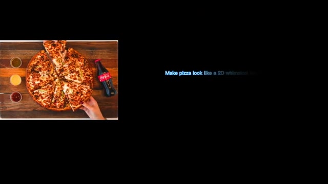
*Affichage d'une image de pizza avec une consigne textuelle partielle sur fond noir.*

---

### ⏱️ `[00:04:17 - 00:04:47]` | Segment #11

**🔊 Audio (Transcription Intégrale Mot pour Mot en Français) :**
> illustration d'anime, tout en gardant exactement tout le reste de l'image identique. Dans le prompt, j'ai spécifiquement mentionné uniquement la pizza, mais Seadream a transformé toute l'image en 2D. D'un autre côté, Nano Banana a fait une petite erreur en transformant aussi la main en 2D. Mais dans l'ensemble, la génération de Nano Banana est bonne. Je devrais donc donner un point à Nano Banana. Et avant de partir, je veux juste partager ceci. Je recherche constamment de nouveaux outils d'IA qui peuvent vraiment vous faciliter la vie, alors n'oubliez pas de vous abonner et de garder une longueur d'avance.

**👁️ Analyse Visuelle d'Écran (gemini-3.5-flash-lite) :**
**Interface & Outils** : Interface de comparatif d'images générées par IA et navigateur web de recherche d'applications IA.

**Contenu textuel & Code** : Texte du prompt : 'Make pizza look like a 2D whimsical hand-drawn anime illustration while keeping everything else in the image exactly the same.' Noms affichés : 'SEEDREAM' et 'NANO' avec l'emoji banane.

**Action / Démonstration** : Comparaison visuelle des résultats de deux modèles d'intelligence artificielle différents pour une tâche de modification ciblée sur une image.

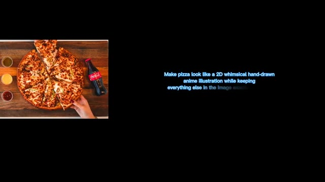
*Image originale de pizza avec un prompt textuel affiché à l'écran demandant de la transformer en illustration d'anime 2D.*

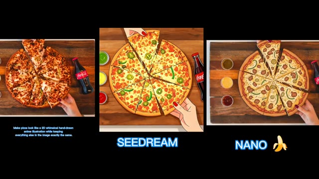
*Comparaison des résultats de génération d'image IA entre 'SEEDREAM' et 'NANO' illustrant la transformation de la pizza.*

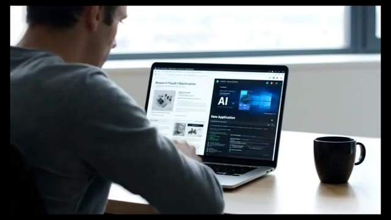
*B-roll montrant une personne de dos utilisant un ordinateur portable avec une interface web de recherche d'outils IA.*

---
