# 🎬 Tout savoir sur Gemini dans Chrome : Fonctionnalités et décryptage complet !

> **Chaîne** : [Pursuing AI](https://www.youtube.com/@PursuingAi)  
> **Titre original** : `Gemini In Chrome All Features Explained!`  
> **Lien YouTube** : [https://www.youtube.com/watch?v=ECaiOB37Rgs](https://www.youtube.com/watch?v=ECaiOB37Rgs)  
> **Date de publication** : 2025-09-22  
> **Durée** : 02m 56s (`176s`)  
> **Identifiant vidéo** : `ECaiOB37Rgs`  
> **Fiche Web Interactive** : [2025-09-22_YT-ECaiOB37Rgs_Tout savoir sur Gemini dans Chrome Fonctionnalités et décryptage complet !_by-whisper-v3-large-turbo+gemini-3.5-flash-lite.html](2025-09-22_YT-ECaiOB37Rgs_Tout savoir sur Gemini dans Chrome Fonctionnalités et décryptage complet !_by-whisper-v3-large-turbo+gemini-3.5-flash-lite.html)  
> **Captures de démonstration clés** : `15 captures réelles (anti-talking-head)`  
> **Modèles utilisés** : Audio: `large-v3-turbo` (Faster-Whisper int8 VPS) | Vision: `gemini-3.5-flash-lite` (Google AI Studio API)  

---

## 📌 Synthèse Exécutive & Outils

### 📌 Résumé
La vidéo de Pursuing AI explore l'intégration majeure de l'intelligence artificielle Gemini directement au cœur du navigateur Google Chrome, marquant un tournant décisif où le web passe d'un espace de recherche passif à un environnement d'exécution actif et agentique. Le créateur adopte une approche méthodique et didactique : il structure sa présentation en listant les fonctionnalités phares par cas d'usage concrets, illustrant comment l'IA transforme radicalement l'expérience utilisateur, de la lecture rapide de documents d'experts au shopping comparatif automatisé. Sur le plan de la production vidéo par IA, ce type de contenu démontre l'efficacité d'un storytelling axé sur l'immédiateté et l'utilité pratique, captivant l'audience en répondant à des problématiques quotidiennes de productivité.

Pour les créateurs de contenu et les professionnels de la vidéo, cette mutation technologique offre des perspectives inédites en matière de veille informationnelle, de génération de scripts et d'adaptation de formats (comme la synthèse instantanée de longues vidéos YouTube). En s'appuyant sur des visuels générés ou sublimés par des outils de pointe (tels que Seedance 2.5, Kling 3.0 et Midjourney), le réalisateur parvient à enrober une démonstration logicielle austère dans un écrin esthétique futuriste et immersif. Cette synergie entre l'analyse technique rigoureuse et la puissance des générateurs visuels par IA constitue une masterclass pour capter l'attention sur les plateformes et vulgariser des innovations logicielles complexes.

### 🛠️ Outils, Modèles & Logiciels Présentés
* **Google Gemini (dans Chrome)** : L'IA centrale intégrée au navigateur, servant d'assistant intelligent pour résumer, traduire, coder et exécuter des tâches en arrière-plan.
* **Seedance 2.5** : Outil de génération et de traitement vidéo par IA utilisé pour dynamiser les séquences visuelles et illustrer les concepts futuristes de la vidéo.
* **Kling 3.0** : Modèle de génération de vidéo par IA mobilisé pour créer des plans fluides, réalistes et cinématographiques illustrant les démonstrations logicielles.
* **Midjourney** : Générateur d'images par IA employé pour concevoir les visuels d'illustration, les vignettes et les concepts graphiques futuristes de la présentation.
* **Génération Vidéo IA** : Catégorie globale de technologies de pointe utilisées pour rythmer le montage et maintenir un engagement visuel maximal tout au long du décryptage.

### 🔑 Points Clés & Enseignements Stratégiques
* **Transformation de l'Omnibox** : La barre de recherche Chrome ne sert plus seulement à trouver des URL, mais devient une interface conversationnelle directe (Omnibox IA) capable de croiser les données de plusieurs onglets ouverts.
* **Synthèse intelligente de documents** : Capacité à condenser instantanément des articles longs, des blogs ou des documents de recherche complexes en points clés, avec une option de simplification par analogies.
* **Résumé automatique de vidéos YouTube** : Extraction immédiate de l'essence d'une longue vidéo sans nécessiter de visionnage intégral, un gain de temps massif pour la veille des créateurs.
* **Introduction des capacités agentiques** : Transition d'une IA passive (qui répond aux questions) à une IA active capable d'exécuter des actions complexes en arrière-plan, comme passer des commandes ou gérer des processus (en phase de déploiement progressif).
* **Shopping et comparatifs instantanés** : Ouverture de plusieurs onglets de produits pour laisser Gemini analyser, croiser et comparer automatiquement les prix, caractéristiques et avis clients.
* **Adaptation contextuelle de contenu** : Possibilité de modifier à la volée des recettes de cuisine (régimes spécifiques) ou d'ajuster des extraits de code informatique directement depuis la page web.
* **Mode vocal en direct (Hands-free)** : Intégration d'une interface audio naturelle permettant de dialoguer à l'oral avec Gemini tout en naviguant, idéale pour le multitasking (cuisine, travail manuel).
* **Écosystème Google unifié** : Connexion native entre Chrome, Gmail, YouTube et Google Agenda pour centraliser la gestion des tâches sans changer d'application.
* **Workflow de productivité par profil** : Ciblage précis des cas d'usage selon les publics (étudiants pour les lectures, professionnels pour la recherche, créateurs pour les scripts et les codes).
* **Esthétique visuelle au service de la tech** : Utilisation conjointe de Kling 3.0 et Seedance 2.5 pour transformer un sujet logiciel potentiellement abstrait en une expérience visuelle immersive de science-fiction.

---

## ⏱️ Chronologie & Transcription Complète Audio & Visuelle (Mot pour Mot)

### ⏱️ `[00:00:00 - 00:00:19]` | Segment #01

**🔊 Audio (Transcription Intégrale Mot pour Mot en Français) :**
> Google vient d'intégrer son IA la plus puissante, Gemini, directement dans Chrome, et cela change notre façon de naviguer pour toujours. Qu'il s'agisse de résumer des pages web ou même d'agir à votre place, Gemini dans Chrome, c'est comme avoir un assistant personnel intégré directement dans votre navigateur. Dans cette vidéo, je vais décortiquer toutes les fonctionnalités, les cas d'usage les plus intéressants, et ce que vous devez savoir avant de l'utiliser.

**👁️ Analyse Visuelle d'Écran (gemini-3.5-flash-lite) :**
**Interface & Outils** : Google Chrome avec l'intégration du panneau latéral de l'assistant Gemini.

**Contenu textuel & Code** : Textes visibles dans l'interface de Gemini : « Gemini acts on your behalf... », « Buy these ingredients for me on Instacart.com using the Sprouts store! », « Can I make this recipe gluten-free? », « Yes, you can make this recipe gluten-free. Here are some tips... ».

**Action / Démonstration** : Présentation visuelle de l'intégration de l'IA Gemini au sein du navigateur Google Chrome avec des exemples d'interactions textuelles et d'automatisation.

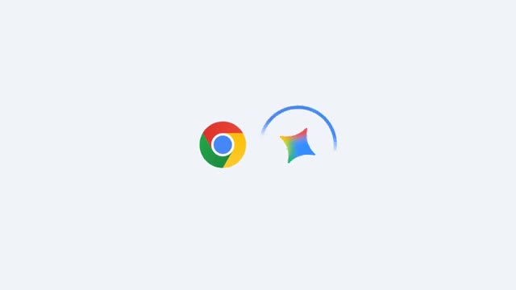
*Écran titre affichant les logos de Google Chrome et de Gemini.*

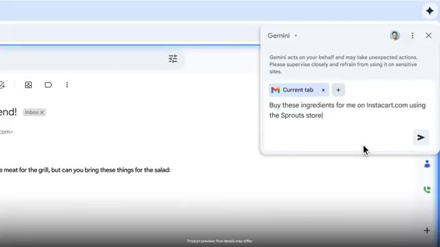
*Interface de Google Chrome avec un panneau latéral Gemini ouvert affichant un avertissement et un champ de saisie pour une action sur Instacart.*

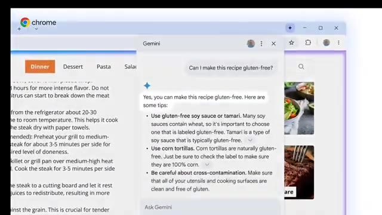
*Interface de Google Chrome avec le panneau latéral Gemini répondant à une question sur une recette de cuisine sans gluten.*

---

### ⏱️ `[00:00:19 - 00:00:38]` | Segment #02

**🔊 Audio (Transcription Intégrale Mot pour Mot en Français) :**
> Fonctionnalité 1. Lecture et compréhension plus intelligentes. La première chose que fait Gemini, c'est de rendre la lecture en ligne tellement plus facile. Ouvrez un article long, un blog ou un document de recherche, et il résume instantanément les points clés. Et si le contenu est trop technique ou déroutant, Gemini peut le simplifier en un langage clair et direct. Ou même utiliser des analogies pour vous aider à comprendre plus rapidement.

**👁️ Analyse Visuelle d'Écran (gemini-3.5-flash-lite) :**
**Interface & Outils** : Navigateur web (Google Chrome) avec le panneau latéral Gemini activé sur le côté droit.

**Contenu textuel & Code** : URL visible : "www.thedailythread.com/blog/guide/10-office-fun-activities". Titre de l'article : "10 Team Building Ideas for any Group". Invite dans le panneau Gemini : "What works for a group of 10 and takes less than 30 minutes?". Réponse de Gemini listant plusieurs activités ("Birthday Line Up", "Two Truths and a Lie", "Human Knot", "Marshmallow Challenge").

**Action / Démonstration** : Navigation sur un article web de blog et affichage d'un résumé/réponse contextuel généré par l'assistant IA Gemini dans le panneau latéral droit.

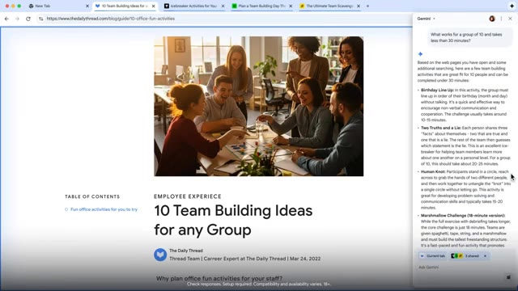
*Navigateur web affichant un article de blog sur le team building avec le panneau latéral de Gemini ouvert à droite, générant des suggestions d'activités.*

---

### ⏱️ `[00:00:38 - 00:00:58]` | Segment #03

**🔊 Audio (Transcription Intégrale Mot pour Mot en Français) :**
> Si vous êtes étudiant, cela pourrait vous faire économiser des heures de lecture chaque semaine. Des professionnels ou quiconque apprend quelque chose de nouveau. J'aurais aimé avoir ça pendant mes examens. Les résumés YouTube et l'IA agentique. Une autre fonctionnalité puissante est la capacité de Gemini à vous faire gagner du temps sur le contenu. Imaginez ouvrir une longue vidéo YouTube. Gemini peut générer instantanément un résumé clair, vous donnant les points clés sans avoir à visionner toute la vidéo.

**👁️ Analyse Visuelle d'Écran (gemini-3.5-flash-lite) :**
**Interface & Outils** : Interface du navigateur Google Chrome avec le panneau latéral Google Gemini activé.

**Contenu textuel & Code** : Texte affiché dans le résumé Gemini : « "Busy" is not the same as "important". Being busy doesn't necessarily mean you are productive. The goal is to focus on what is truly important and find a balance, rather than glorifying being "slammed". » et « Downtime is productive... ». Boutons « Current tab » et champ de saisie « Ask Gemini ». Vignettes de vidéos YouTube en arrière-plan.

**Action / Démonstration** : Démonstration de la fonctionnalité de résumé instantané de vidéos YouTube par l'intelligence artificielle Gemini dans un panneau latéral du navigateur.

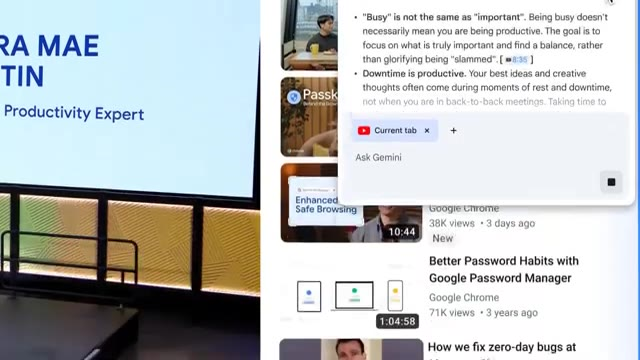
*Interface de Google Gemini affichant un résumé textuel de vidéo YouTube dans un panneau latéral.*

---

### ⏱️ `[00:00:58 - 00:01:19]` | Segment #04

**🔊 Audio (Transcription Intégrale Mot pour Mot en Français) :**
> Mais cela ne s'arrête pas là. Gemini introduit également ce que Google appelle des capacités agentiques. Cela signifie que l'IA ne se contente pas de répondre à des questions. Elle peut réellement effectuer des actions pour vous. Par exemple, si vous faites des courses, au lieu d'ajouter des articles un par un, vous pouvez simplement dire à Gemini ce dont vous avez besoin, et il gère le processus en arrière-plan. Cela transforme Chrome d'un simple navigateur en un assistant actif qui fait le travail à votre place.

**👁️ Analyse Visuelle d'Écran (gemini-3.5-flash-lite) :**
**Interface & Outils** : Navigateur Google Chrome affichant le site de livraison de courses Instacart (Sprouts Farmers Market) avec un panneau d'agent IA Gemini intégré dans l'angle supérieur droit.

**Contenu textuel & Code** : URL visible : instacart.com/store/sprouts/storefront. Barre de recherche : "Try 'fruits i can store out of the fridge'". Panneau de l'assistant IA (Instacart Order from Sprouts) affichant le message : "Buy these ingredients for me on Instacart.com using the Sprouts store" ainsi que les étapes en cours : "Navigating to Instacart.com", "Selecting the Sprouts store", "Clicking".

**Action / Démonstration** : L'assistant IA Gemini prend le contrôle du navigateur pour automatiser l'achat d'ingrédients sur le site Instacart, naviguant et sélectionnant le magasin de manière autonome.

*Un utilisateur navigue sur le site de courses Instacart sur son ordinateur portable.*

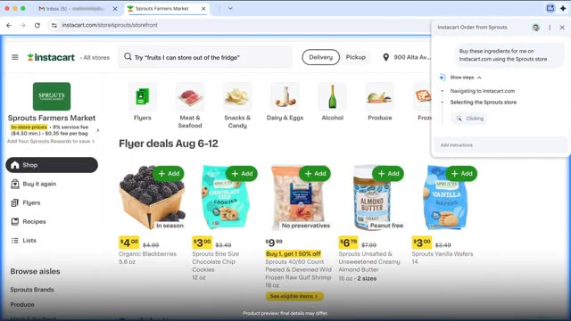
*Interface du navigateur Google Chrome affichant le site Instacart avec un panneau latéral d'assistant IA actif.*

---

### ⏱️ `[00:01:19 - 00:01:53]` | Segment #05

**🔊 Audio (Transcription Intégrale Mot pour Mot en Français) :**
> En ce moment, ces capacités d'agent sont encore en phase de test, mais Google prévoit de les déployer pour les utilisateurs dans les mois à venir. C'est donc juste un aperçu de ce qui va arriver. Ensuite, les comparatifs. Disons que vous faites du shopping, ouvrez quelques onglets de produits, et Gemini comparera instantanément les caractéristiques, les prix et même les avis, en vous donnant les points positifs et négatifs. Cette fonctionnalité change la donne pour prendre des décisions rapidement. Fonctionnalité 4, l'adaptation de contenu. Gemini ne se contente pas de lire le contenu, il peut l'adapter. Par exemple, vous pouvez prendre une recette et demander à Gemini de la rendre végétarienne, sans gluten, ou de l'adapter à un plan de régime. Les développeurs peuvent également ajuster des extraits de code,

**👁️ Analyse Visuelle d'Écran (gemini-3.5-flash-lite) :**
**Interface & Outils** : Navigateur web Google Chrome avec une extension ou un panneau latéral de chat et d'agent Gemini intégré.

**Contenu textuel & Code** : Sur l'image 1 : URL "instacart.com/store/sprouts", panneau latéral "Instacart Order from Sprouts", texte "Buy these ingredients for me on Instacart.com using the Sprouts store", étapes listées ("Navigating to Instacart.com", "Selecting the Sprouts store", "Searching for carrots", etc.). Sur l'image 4 : fenêtre de chat "Gemini", prompt utilisateur "Can I make this recipe gluten-free?", réponse de l'assistant "Yes, you can make this recipe gluten-free...".

**Action / Démonstration** : Démonstration de l'automatisation d'achats sur Instacart par Gemini, puis d'une adaptation de recette de cuisine pour devenir sans gluten.

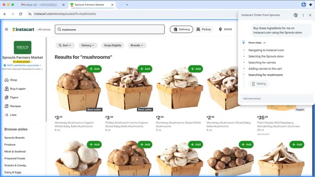
*Interface du navigateur Google Chrome affichant le site Instacart avec un panneau latéral de l'agent Gemini listant les étapes d'une commande automatique.*

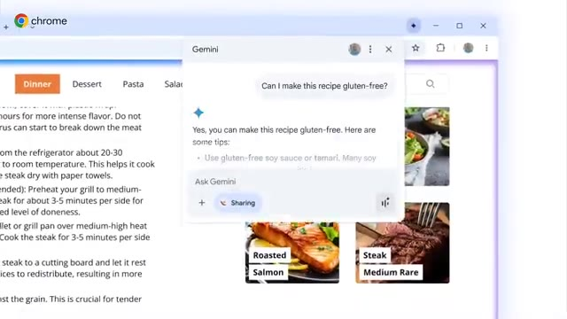
*Interface du navigateur Google Chrome affichant une page de recette avec une fenêtre de chat Gemini ouverte posant une question sur une version sans gluten.*

---

### ⏱️ `[00:01:53 - 00:02:18]` | Segment #06

**🔊 Audio (Transcription Intégrale Mot pour Mot en Français) :**
> Juste dans Chrome, l'une des parties les plus cool est le mode en direct. Vous pouvez réellement parler à Gemini à l'intérieur de Chrome, et il répond avec une voix naturelle pendant que vous naviguez. Imaginez cuisiner, travailler ou faire du multitasking. Le support IA mains libres est juste là avec vous. Fonctionnalité 6. Intégration des applications Google Gemini se connecte également aux services Google. De la synthèse de vidéos YouTube à l'extraction d'informations de Gmail ou à la création d'événements de calendrier, cela fait de Chrome le hub central pour toutes vos tâches sans changer d'application.

**👁️ Analyse Visuelle d'Écran (gemini-3.5-flash-lite) :**
**Interface & Outils** : Google Chrome, interface de Gemini Live et intégration des applications Google.

**Contenu textuel & Code** : Texte de la page web, fenêtres contextuelles de Gemini Live, invite textuelle "Create a focus block between 8-10AM for a half-hou", et confirmation de Google Calendar.

**Action / Démonstration** : Navigation web et interaction avec l'assistant Gemini Live et les services Google dans Chrome.

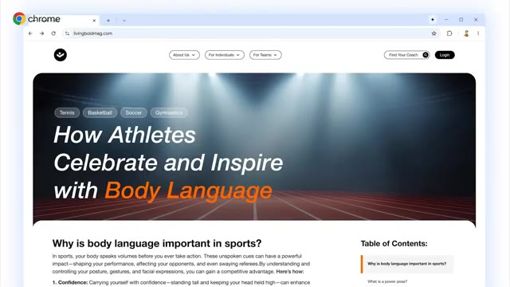
*Navigateur Google Chrome affichant un article web intitulé "How Athletes Celebrate and Inspire with Body Language".*

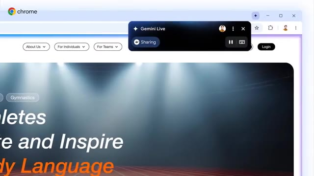
*Interface de Google Chrome avec une superposition noire "Gemini Live" active montrant le statut "Sharing".*

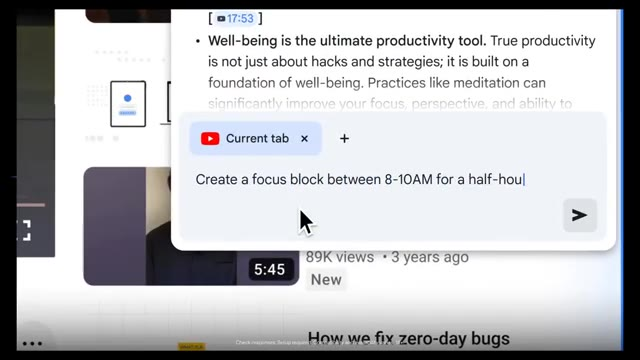
*Panneau contextuel de Gemini dans Chrome affichant une invite textuelle pour créer un bloc de concentration.*

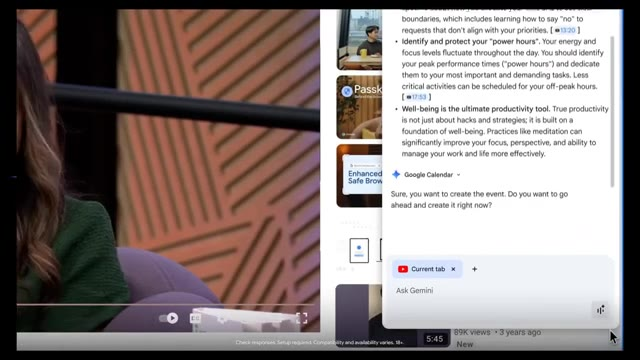
*Interface de Gemini intégrée affichant une interaction Google Calendar avec une vidéo YouTube en arrière-plan.*

---

### ⏱️ `[00:02:18 - 00:02:37]` | Segment #07

**🔊 Audio (Transcription Intégrale Mot pour Mot en Français) :**
> L'une des fonctionnalités phares est l'Omnibox IA. Tapez simplement votre question directement dans la barre de recherche Chrome. Et Gemini fournit des réponses intelligentes et contextuelles. Elle peut même extraire des informations de plusieurs onglets ouverts, vous offrant ainsi une vue d'ensemble complète et équilibrée. Les meilleurs cas d'utilisation. Des étudiants résumant des lectures en quelques secondes. Des professionnels simplifiant la recherche. Des acheteurs comparant des produits plus rapidement.

**👁️ Analyse Visuelle d'Écran (gemini-3.5-flash-lite) :**
**Interface & Outils** : Navigateur Google Chrome / Diapositive de présentation animée avec logo Gemini.

**Contenu textuel & Code** : Texte dans la barre de recherche : "I'm a side sleeper with occasional lower...", bouton "AI Mode", raccourcis vers des sites web (YouTube, Work Calendar, Google Drive, Google Photos). Texte sur la diapositive : "THE BEST USE CASES", "Students summarizing readings in seconds.", "Professionnels simplifying research."

**Action / Démonstration** : Démonstration de la saisie d'une requête dans la barre d'adresse de Chrome, suivie d'un affichage de texte textuel résumant les cas d'utilisation.

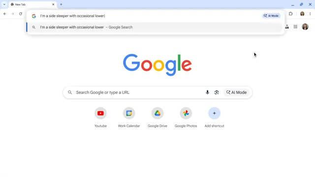
*Interface du navigateur Google Chrome montrant la barre d'adresse Omnibox avec une requête de recherche textuelle et le bouton « AI Mode ».*

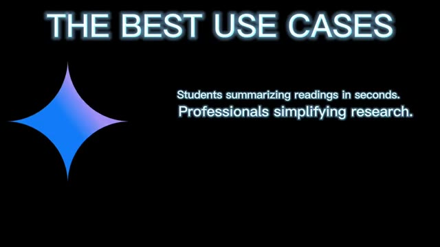
*Écran de présentation sur fond noir avec le logo Gemini et le texte illustrant les meilleurs cas d'utilisation pour les étudiants et les professionnels.*

---

### ⏱️ `[00:02:37 - 00:02:55]` | Segment #08

**🔊 Audio (Transcription Intégrale Mot pour Mot en Français) :**
> Les créateurs adaptent des recettes, des scripts ou du code. Les multitaskers discutent avec Gemini en mode vocal. Et les utilisateurs occupés laissent Gemini agir pour eux grâce à l'IA agentique. Gemini dans Chrome n'est pas seulement un outil. C'est comme avoir un co-pilote pour le web. La question est : comment allez-vous l'utiliser ? Honnêtement, ce n'est que le début. Quelle est la première chose que vousisseriez faire à Gemini pour vous ? Dites-le-moi dans les commentaires.

**👁️ Analyse Visuelle d'Écran (gemini-3.5-flash-lite) :**
**Interface & Outils** : Présentation graphique avec texte de synthèse, logo Google Chrome revisité avec l'étoile Gemini, et schéma conceptuel du processus de recherche, apprentissage et partage (aucune interface logicielle réelle n'est manipulée).

**Contenu textuel & Code** : Textes affichés à l'écran : "THE BEST USE CASES", liste des cas d'usage (étudiants, professionnels, acheteurs, créateurs), logo animé Chrome/Gemini, et schéma textuel "Researching -> Learning -> Sharing" avec un cerveau cybernétique.

**Action / Démonstration** : Affichage successif de graphiques textuels illustrant les cas d'utilisation de Gemini, le logo du produit, puis une transition animée vers le concept de recherche et d'apprentissage.

---
