# 🎬 De nouveaux modèles open source débarquent ! Recherche IA révolutionnaire

> **Chaîne** : [Pursuing AI](https://www.youtube.com/@PursuingAi)  
> **Titre original** : `New open source models are here! Huge AI Research.`  
> **Lien YouTube** : [https://www.youtube.com/watch?v=4Cu9EP_Zw6Q](https://www.youtube.com/watch?v=4Cu9EP_Zw6Q)  
> **Date de publication** : 2025-09-30  
> **Durée** : 05m 16s (`316s`)  
> **Identifiant vidéo** : `4Cu9EP_Zw6Q`  
> **Fiche Web Interactive** : [2025-09-30_YT-4Cu9EP_Zw6Q_De nouveaux modèles open source débarquent ! Recherche IA révolutionnaire_by-whisper-v3-large-turbo+gemini-3.5-flash-lite.html](2025-09-30_YT-4Cu9EP_Zw6Q_De nouveaux modèles open source débarquent ! Recherche IA révolutionnaire_by-whisper-v3-large-turbo+gemini-3.5-flash-lite.html)  
> **Captures de démonstration clés** : `38 captures réelles (anti-talking-head)`  
> **Modèles utilisés** : Audio: `large-v3-turbo` (Faster-Whisper int8 VPS) | Vision: `gemini-3.5-flash-lite` (Google AI Studio API)  

---

## 📌 Synthèse Exécutive & Outils

### 📌 Résumé
Dans ce tutoriel complet intitulé **De nouveaux modèles open source débarquent ! Recherche IA révolutionnaire**, le créateur présente les techniques de pointe pour maîtriser la génération de vidéos et de visuels par intelligence artificielle.

### 🛠️ Outils, Modèles & Logiciels Présentés
- **Modèles vidéo IA** : Génération de plans cinématiques.
- **Outils de prompt** : Structuration avancée des descriptions visuelles.

### 🔑 Points Clés & Enseignements Stratégiques
- Structurer ses prompts de mouvement avec des termes de caméra précis.
- Soigner la cohérence des personnages entre chaque plan.
- Exploiter les modèles de dernière génération pour un rendu professionnel.

---

## ⏱️ Chronologie & Transcription Complète Audio & Visuelle (Mot pour Mot)

### ⏱️ `[00:00:00 - 00:00:23]` | Segment #01

**🔊 Audio (Transcription Intégrale Mot pour Mot en Français) :**
> Poursuivre la recherche sur l'IA ne s'arrête jamais. Je n'arrive plus à suivre. Mes recherches ne s'arrêtent jamais. Et cette semaine, j'ai découvert des nouvelles incroyables et des modèles open source qui sont insensés. Nous avons Nano Banana pour le montage vidéo. Vous pouvez modifier votre vidéo simplement par du texte. Nous avons un autre outil vidéo IA, qui peut transférer les mouvements d'une vidéo sur un autre personnage, y compris vos mouvements de mains et vos expressions.

**👁️ Analyse Visuelle d'Écran (gemini-3.5-flash-lite) :**
**Interface & Outils** : Présentation vidéo avec incrustations PiP (Picture-in-Picture) de démonstration de transfert de mouvement.

**Contenu textuel & Code** : Rendu visuel haute qualité de personnages animés (créature simiesque, enfant stylisé, orc) synchronisés avec les mouvements d'un utilisateur réel en médaillon.

**Action / Démonstration** : Présentation d'exemples de transferts de mouvements et d'expressions faciales de l'utilisateur vers des personnages virtuels générés par IA.

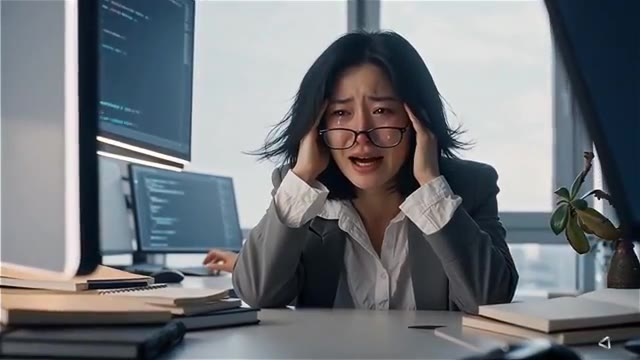
*Scène humoristique illustrant la surcharge de travail et le stress face à l'accélération constante de la recherche en IA.*

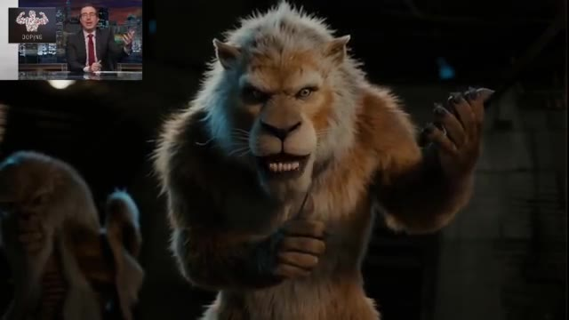
*Démonstration d'un modèle vidéo IA avec incrustation PiP montrant un homme reproduisant les mouvements du lion humanoïde à l'écran.*

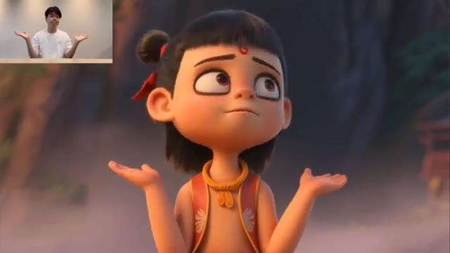
*Démonstration du transfert de mouvements faciaux et corporels sur un personnage d'enfant animé en 3D avec incrustation PiP.*

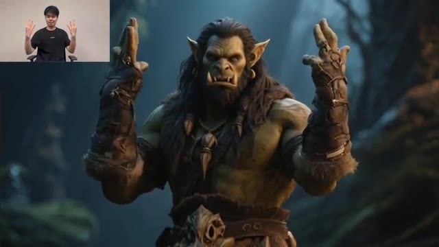
*Démonstration du transfert de mouvements des mains sur un personnage d'orc en 3D avec incrustation PiP.*

---

### ⏱️ `[00:00:23 - 00:00:42]` | Segment #02

**🔊 Audio (Transcription Intégrale Mot pour Mot en Français) :**
> Et c'est vraiment incroyable. Nous avons également un concurrent de VO3, qui peut générer de la vidéo et de l'audio de manière native. Et nous avons aussi un concurrent de Nano Banana, et il est même bon dans certaines conditions. Et nous avons des tonnes de nouveaux modèles insensés d'Alibaba, qui cartonnent. Alors, plongeons-nous directement dedans.

**👁️ Analyse Visuelle d'Écran (gemini-3.5-flash-lite) :**
**Interface & Outils** : Vitrine de démonstration vidéo de modèles d'IA générative (générations vidéo).

**Contenu textuel & Code** : Texte affiché à l'écran dans l'image 3 : 'AI has changed everything.'

**Action / Démonstration** : Présentation de différents extraits vidéo générés par intelligence artificielle pour illustrer les nouveaux modèles concurrents.

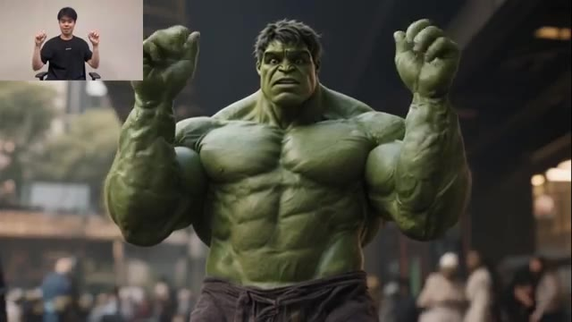
*Extrait vidéo généré par IA montrant Hulk dans un décor urbain, avec le créateur visible en incrustation (PiP) dans le coin supérieur gauche.*

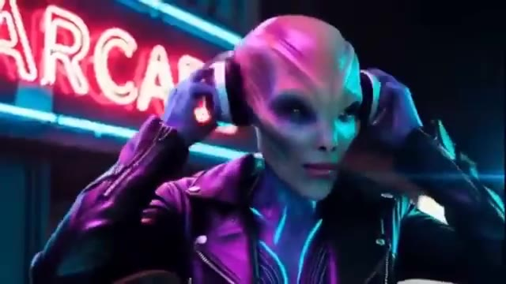
*Extrait vidéo généré par IA montrant un personnage extraterrestre humanoïde avec un casque audio devant une enseigne lumineuse au néon bleu et rose.*

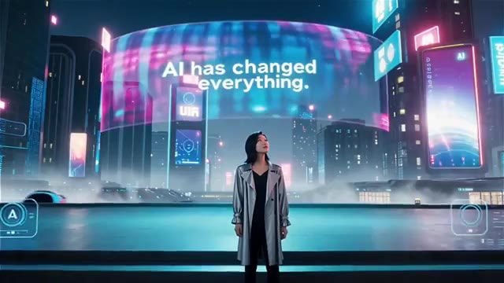
*Extrait vidéo généré par IA montrant une femme de dos dans une ville futuriste cyberpunk, avec le texte géant affiché 'AI has changed everything.' sur un écran incurvé géant.*

---

### ⏱️ `[00:00:42 - 00:01:00]` | Segment #03

**🔊 Audio (Transcription Intégrale Mot pour Mot en Français) :**
> Tout d'abord, nous avons WAN 2.5. C'est un concurrent direct de VO3. Et le truc fou, c'est qu'il peut faire des vidéos avec un son intégré. Laissez-moi vous montrer quelques exemples. Allez, dégage de ma propriété ! Les collines sont vivantes avec le son de la musique.

**👁️ Analyse Visuelle d'Écran (gemini-3.5-flash-lite) :**
**Interface & Outils** : Page web du modèle de génération vidéo WAN 2.5 avec interface utilisateur textuelle et lecteur vidéo de démonstration.

**Contenu textuel & Code** : Textes visibles à l'écran : "Features", "Open Source", "API", "Try Now", "Unleash Your Creativity", "Try Wan2.5 Now ->", et le champ de texte "Describe visuals and dynamics in the video.".

**Action / Démonstration** : Démonstration à l'écran des capacités de génération vidéo de WAN 2.5 avec des exemples d'animation générés par IA et synchronisation audio.

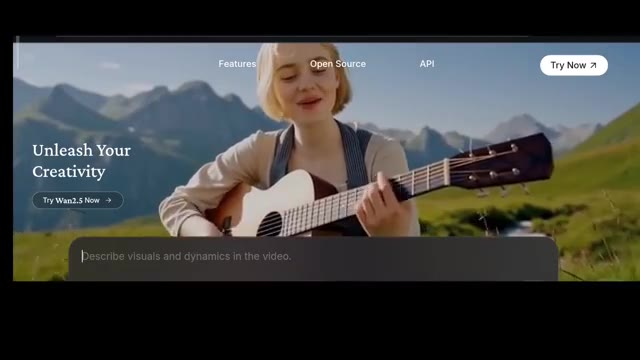
*Interface web du modèle WAN 2.5 montrant une femme jouant de la guitare dans un décor de montagne et un champ de texte de prompt.*

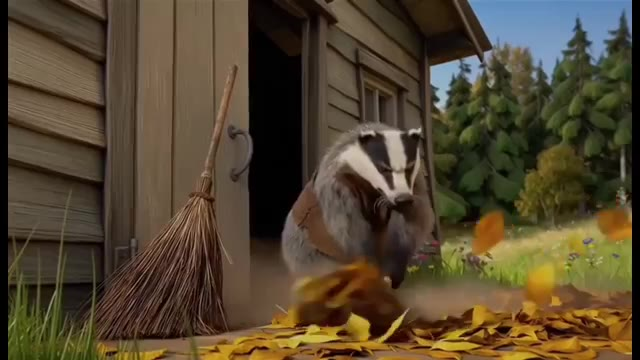
*Génération vidéo IA montrant un blaireau fâché balayant des feuilles mortes devant une maison en bois rustique.*

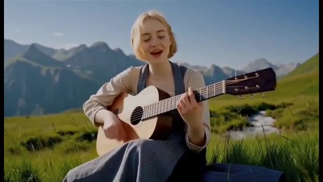
*Génération vidéo IA montrant une femme blonde en costume traditionnel chantant et jouant de la guitare acoustique dans un paysage alpin.*

---

### ⏱️ `[00:01:01 - 00:01:23]` | Segment #04

**🔊 Audio (Transcription Intégrale Mot pour Mot en Français) :**
> En conduisant le long de la côte où le soleil ne se couche jamais. WON 2.5 est créé par Alibaba. Et voici la partie géniale. Vous pouvez l'essayer complètement gratuitement sur leur site web, WON Video. Il vous suffit de vous inscrire et vous obtiendrez des crédits gratuits pour commencer. De plus, vous pouvez gagner plus de crédits chaque jour simplement en vous connectant.

**👁️ Analyse Visuelle d'Écran (gemini-3.5-flash-lite) :**
**Interface & Outils** : Navigateur web affichant la plateforme de génération vidéo "WON Video" avec une barre de prompt contextuelle en bas (options : Vidéo, Text to Video, Wan2.5, 16:9 720P, 5s).

**Contenu textuel & Code** : Texte affiché à l'écran : "Unleash Your Creativity", "Try Wan2.5 Now", "Describe visuals and dynamics in the video.", ainsi que les onglets "Features", "Open Source", "API" et le bouton "Try Now".

**Action / Démonstration** : Navigation et présentation de l'interface de la plateforme vidéo WON Video d'Alibaba avec des exemples de générations vidéo.

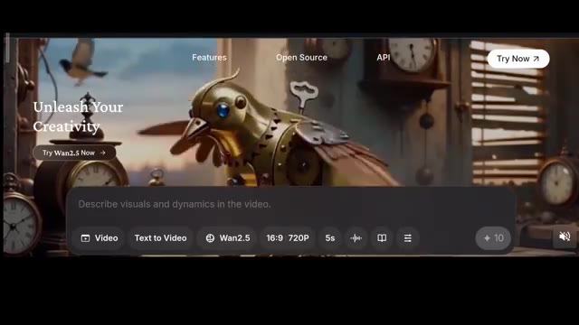
*Interface du site web WON Video affichant un oiseau mécanique steampunk et une barre de prompt avec les options de génération.*

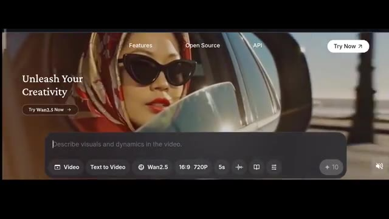
*Interface du site web WON Video affichant la vidéo d'une femme avec des lunettes de soleil vue dans le rétroviseur d'une voiture.*

---

### ⏱️ `[00:01:23 - 00:01:42]` | Segment #05

**🔊 Audio (Transcription Intégrale Mot pour Mot en Français) :**
> Avec cet outil, vous pouvez créer à la fois de l'image en vidéo et du texte en vidéo. Et oui, il peut générer des vidéos allant jusqu'à 1080p. Vous pouvez également choisir la taille et la durée, soit cinq secondes, soit 10 secondes. Par exemple, une vidéo de cinq secondes coûte 10 crédits, tandis qu'une vidéo de 10 secondes coûte 20 crédits.

**👁️ Analyse Visuelle d'Écran (gemini-3.5-flash-lite) :**
**Interface & Outils** : Interface web de l'outil de génération vidéo Wan2.5.

**Contenu textuel & Code** : Menus déroulants avec les options : Image to Video, Text to Video, Effects, Extend, First and Last Frame, References, Repaint, Inpaint. Options de résolution : 1080p, 720p, 480p. Formats : 16:9, 4:3, 1:1, 3:4, 9:16. Paramètres affichés : Wan2.5, 16:9 720P, 5s, et bouton de coût "+ 10".

**Action / Démonstration** : Navigation dans les menus de l'interface pour présenter les options de génération, les résolutions et les formats disponibles.

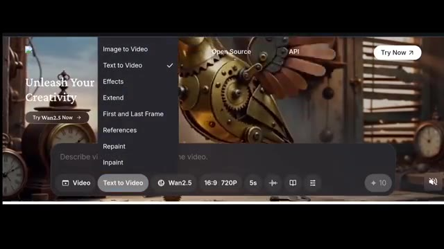
*Interface de l'outil montrant le menu déroulant des modes de génération (Image to Video, Text to Video, Effects, etc.).*

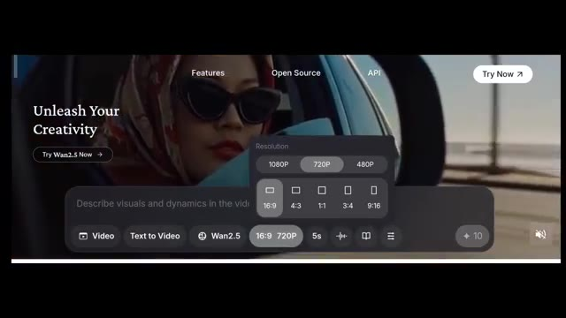
*Interface de l'outil affichant les options de résolution (1080p, 720p, 480p) et les formats d'image (16:9, 4:3, 1:1, etc.).*

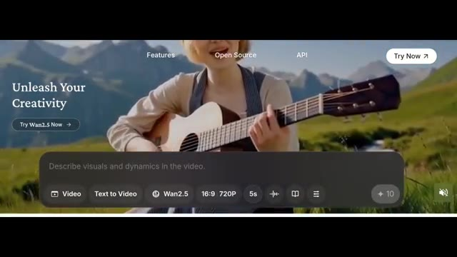
*Barre de contrôle et de saisie de prompt montrant les paramètres par défaut (Text to Video, Wan2.5, 16:9 720P, 5s) et le coût de 10 crédits.*

---

### ⏱️ `[00:01:42 - 00:02:00]` | Segment #06

**🔊 Audio (Transcription Intégrale Mot pour Mot en Français) :**
> Et voici le super bonus, vous pouvez même télécharger votre propre audio et le synchroniser avec la vidéo. C'est incroyable, non ? Donc dans la boîte de texte, je tape une femme assise seule dans sa chambre qui pleure avec les yeux en larmes. Elle dit, j'ai perdu mon travail. J'aurais aimé m'abonner à Pursuing AI plus tôt, puis éclate en sanglots. Voici le résultat.

**👁️ Analyse Visuelle d'Écran (gemini-3.5-flash-lite) :**
**Interface & Outils** : Page d'accueil et interface de génération vidéo de Wan2.5.

**Contenu textuel & Code** : Texte du prompt visible sur l'image #2 : "A woman sitting alone in her room, crying with teary eyes. She says, 'I lost my job... I wish I had subscribed to PursuingAi earlier,' then bursts into tears." Paramètres visibles : Vidéo, Text to Video, Wan2.5, 16:9, 720P, 5s ou 10s.

**Action / Démonstration** : Saisie du prompt textuel décrivant la scène de la femme qui pleure dans l'interface de génération vidéo.

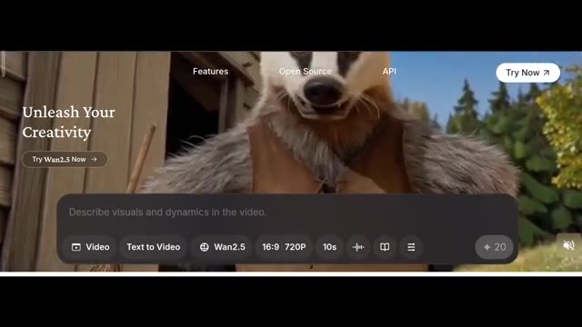
*Interface de la plateforme de génération vidéo Wan2.5 montrant la barre de prompt et les options de configuration.*

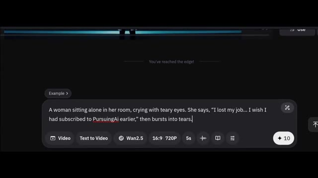
*Interface de la plateforme Wan2.5 avec le texte du prompt saisi par l'utilisateur.*

---

### ⏱️ `[00:02:00 - 00:02:20]` | Segment #07

**🔊 Audio (Transcription Intégrale Mot pour Mot en Français) :**
> J'ai perdu mon travail. J'aurais aimé m'abonner à Pursuing AI plus tôt. La synchronisation labiale est un peu décalée par rapport à la vidéo, mais dans l'ensemble, ça a l'air vraiment bien. Je mettrai le lien vers la page principale dans la description ci-dessous. Ensuite, nous avons un autre modèle vidéo d'Alibaba, et celui-ci est Wan Animate basé sur Wan 2.2.

**👁️ Analyse Visuelle d'Écran (gemini-3.5-flash-lite) :**
**Interface & Outils** : Navigateur web affichant la page de recherche ou de documentation officielle du modèle "Wan-Animate" (Tongyi Lab, Alibaba) avec des boutons d'accès (Paper, GitHub, HF Model, etc.).

**Contenu textuel & Code** : Texte principal : "Wan-Animate: Unified Character Animation and Replacement with Holistic Replication". Mention : "Tongyi Lab, Alibaba". Boutons cliquables : Paper, GitHub, HF Model, MS Model, HF Space, MS Studio. Vidéo de démonstration en bas avec un personnage de cochon.

**Action / Démonstration** : Le présentateur affiche à l'écran la page officielle du nouveau modèle d'animation d'Alibaba (Wan-Animate) tout en introduisant ses fonctionnalités.

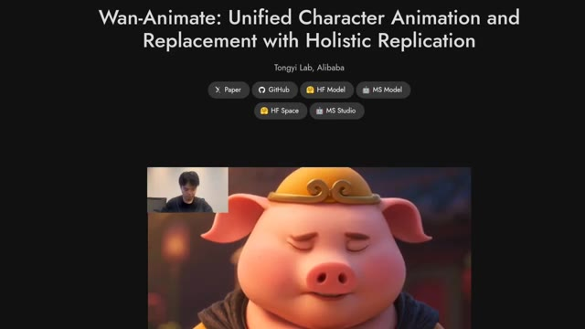
*Page web de présentation du modèle Wan-Animate par Tongyi Lab d'Alibaba, avec des liens vers le projet et une vidéo de démonstration montrant un personnage de cochon animé et un encadré vidéo.*

---

### ⏱️ `[00:02:20 - 00:02:43]` | Segment #08

**🔊 Audio (Transcription Intégrale Mot pour Mot en Français) :**
> Ses capacités sont incroyables. Il peut transférer les mouvements et les expressions d'une vidéo sur un autre personnage. Cela inclut vos mains, la synchronisation labiale et les mouvements de tout le corps. Tout cela en maintenant une cohérence parfaite. Remarquez à quel point il est précis pour copier les expressions et les mouvements de la vidéo de référence. Il peut même remplacer un personnage dans une vidéo existante tout en préservant parfaitement l'arrière-plan.

**👁️ Analyse Visuelle d'Écran (gemini-3.5-flash-lite) :**
**Interface & Outils** : Interface du site web du projet de recherche Wan-Animate par Tongyi Lab (Alibaba), présentant des exemples de démonstration vidéo sous forme de lecteur avec incrustation de la vidéo source (picture-in-picture) et des liens vers les articles et dépôts (Paper, GitHub, HF Model, etc.).

**Contenu textuel & Code** : Titre visible en haut de la page : "Wan-Animate: Unified Character Animation and Replacement with Holistic Replication" avec la mention "Tongyi Lab, Alibaba". Boutons de navigation : Paper, GitHub, HF Model, MS Model, HF Space, MS Studio.

**Action / Démonstration** : Le site présente une démonstration vidéo animée où les mouvements d'un humain (visible en haut à gauche de la vidéo) sont transférés en temps réel sur différents personnages générés par IA (elfe, félin, panda).

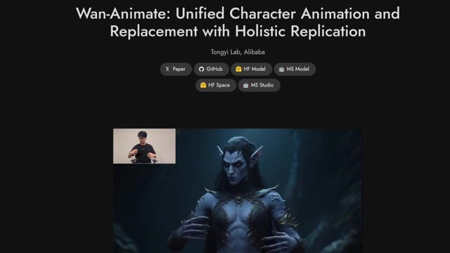
*Page web du projet Wan-Animate montrant l'animation d'un personnage elfe humanoïde d'après la vidéo de référence d'un homme en médaillon.*

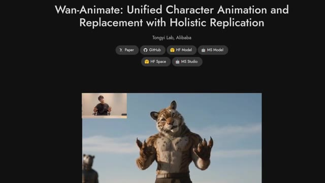
*Page web du projet Wan-Animate montrant le transfert de mouvements sur un personnage de félin anthropomorphe.*

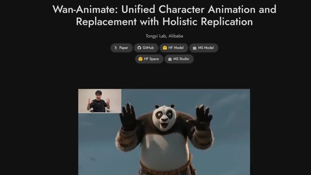
*Page web du projet Wan-Animate montrant l'animation d'un personnage de panda effectuant les mêmes mouvements de mains que la vidéo de référence.*

---

### ⏱️ `[00:02:43 - 00:03:02]` | Segment #09

**🔊 Audio (Transcription Intégrale Mot pour Mot en Français) :**
> Voici donc l'exemple. Rick Sorkin ? Excusez-moi, M. Sorkin. Vous avez cinq minutes de retard. Y a-t-il une raison pour que je vous laisse entrer ? J'essaie juste d'échapper à la police, d'accord ? Je me fiche un peu que vous me laissiez entrer ou non. M. Spector sera à vous dans un instant. Quoi ?

**👁️ Analyse Visuelle d'Écran (gemini-3.5-flash-lite) :**
**Interface & Outils** : Comparaison vidéo côte à côte (Split-screen) avec les étiquettes "Original" et "Generated".

**Contenu textuel & Code** : Les étiquettes textuelles "Original" sur les vidéos de gauche et "Generated" sur les vidéos de droite.

**Action / Démonstration** : Présentation d'exemples de modification vidéo par IA montrant le remplacement de personnages dans des scènes de film.

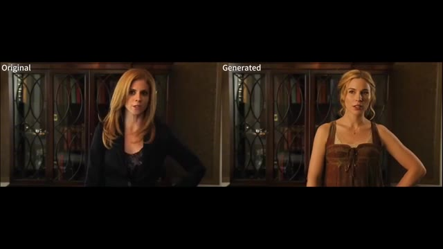
*Comparaison vidéo avant/après montrant le personnage féminin original à gauche et sa version générée par IA à droite.*

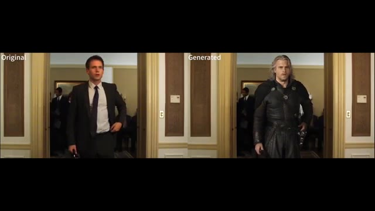
*Comparaison vidéo avant/après montrant le personnage masculin original en costume à gauche et sa version transformée en guerrier fantastique à droite.*

---

### ⏱️ `[00:03:02 - 00:03:35]` | Segment #10

**🔊 Audio (Transcription Intégrale Mot pour Mot en Français) :**
> Est-ce que je peux vous apporter quelque chose ? Un café ou une bouteille d'eau ? C'est complètement fou ! Ça préserve non seulement l'arrière-plan, mais ça intègre aussi le nouveau personnage de manière fluide, sans modifier les conditions d'éclairage de la vidéo. Voici quelques exemples montrant comment il est possible de transférer non seulement les mouvements corporels, mais aussi les expressions faciales et même les mouvements des mains, et le meilleur, c'est que ça ne fonctionne pas seulement avec des humains réalistes. Ça fonctionne aussi avec différentes créatures et d'autres styles d'animation comme celui-ci. Regardez comment il peut remplacer de manière fluide un personnage dans une vidéo existante.

**👁️ Analyse Visuelle d'Écran (gemini-3.5-flash-lite) :**
**Interface & Outils** : Démonstration vidéo de ré-enactment / remplacement de personnage par IA.

**Contenu textuel & Code** : Comparaison vidéo avant/après, incrustations vidéo (PiP) du présentateur ou de la source.

**Action / Démonstration** : Le modèle IA remplace un personnage réel ou animé par un autre tout en conservant les mouvements, les expressions faciales, les mains, l'éclairage et l'arrière-plan d'origine.

*Démonstration comparative côte à côte d'un personnage remplacé dans une scène vidéo (original à gauche, généré à droite).*

*Démonstration de transfert de mouvement avec le créateur en incrustation (PiP) en haut à gauche et le personnage généré en grand à l'écran.*

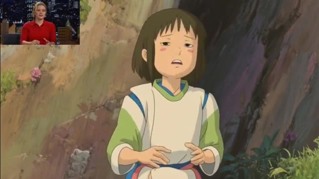
*Démonstration de remplacement de personnage dans un style d'animation de type Ghibli, avec le créateur en incrustation PiP.*

---

### ⏱️ `[00:03:35 - 00:03:59]` | Segment #11

**🔊 Audio (Transcription Intégrale Mot pour Mot en Français) :**
> Tout reste précis et la qualité est tout simplement incroyable et voici la partie géniale Ils ont déjà tout publié il suffit de cliquer sur github faites défiler vers le bas et vous trouverez toutes les instructions sur la façon de le télécharger de l'animer et de l'exécuter localement sur votre ordinateur Je mettrai également le lien vers la page principale dans la description ci-dessous afin que vous puissiez en lire plus. Ensuite, nous avons un nouvel outil d'IA pour le montage vidéo, et celui-ci s'appelle Lucy Edit par Descartes.

**👁️ Analyse Visuelle d'Écran (gemini-3.5-flash-lite) :**
**Interface & Outils** : Pages web GitHub et site de recherche de projets d'IA (Tongyi Lab, Alibaba), ainsi que des exemples de rendus vidéo générés par intelligence artificielle.

**Contenu textuel & Code** : Textes visibles : "Run Wan2.2", "Installation", "Clone the repo: git clone https://github.com/Wan-Video/Wan2.2.git", "Install dependencies:", "Model Download", "T2V-A14B", "I2V-A14B", "TI2V-5B", "Wan-Animate: Unified Character Animation and Replacement with Holistic Replication", "Tongyi Lab, Alibaba", "Paper", "GitHub", "HF Model", "MS Model", "HF Space", "MS Studio".

**Action / Démonstration** : Présentation visuelle des instructions d'installation sur GitHub, des pages de recherche du modèle Wan-Animate, et défilement des exemples de vidéos générées par IA (personnages animés et scènes réalistes).

*Démonstration d'une animation vidéo générée par IA représentant un personnage féminin inspiré de style animé 3D chantant, avec la créatrice visible en incrustation PiP dans le coin supérieur gauche.*

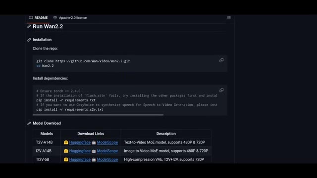
*Affichage de la page GitHub du projet Run Wan2.2 montrant les instructions d'installation avec les commandes de clonage et les liens de téléchargement des modèles.*

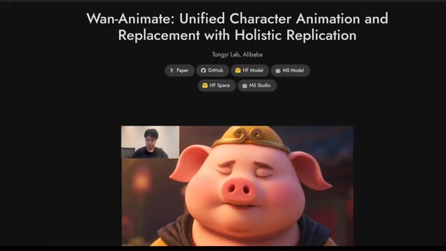
*Présentation de la page web du projet "Wan-Animate: Unified Character Animation and Replacement with Holistic Replication" par Tongyi Lab, Alibaba, avec une vidéo de démonstration d'un personnage de cochon animable.*

*Démonstration d'une autre vidéo générée par IA montrant un homme assis sur un banc tenant une immense glace géante complexe avec de multiples parfums et nappages.*

---

### ⏱️ `[00:03:59 - 00:04:21]` | Segment #12

**🔊 Audio (Transcription Intégrale Mot pour Mot en Français) :**
> C'est open source et c'est rapide. En gros, pensez-y comme à Nano Banana pour le montage vidéo, où vous pouvez simplement demander à l'IA d'éditer n'importe quel élément d'une vidéo, juste avec du texte. C'est incroyablement puissant pour le micro-montage dans vos vidéos. Comme vous pouvez le voir ici, vous pouvez facilement transformer un personnage entier dans une vidéo en un tout nouveau, ou même échanger leurs vêtements ou leur apparence simplement avec du texte.

**👁️ Analyse Visuelle d'Écran (gemini-3.5-flash-lite) :**
**Interface & Outils** : Interface de ComfyUI (projet Lucy Edit Dev) montrant les nœuds de traitement et l'aperçu vidéo.

**Contenu textuel & Code** : Titre "Lucy Edit - ComfyUI", liens vers GitHub, HuggingFace, Playground, Technical Report, Discord. Aperçu de workflow de nœuds ComfyUI et vidéos éditées (ex: painter_gothic_edit.mp4, painter_clown_edit.mp4, painter_bikini_edit.mp4).

**Action / Démonstration** : Présentation de l'interface et des résultats d'édition vidéo par IA textuelle avec ComfyUI.

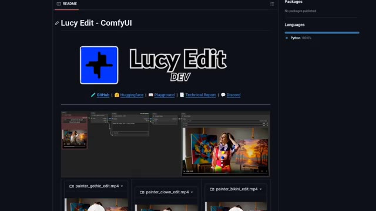
*Interface de Lucy Edit - ComfyUI montrant le workflow de modification vidéo par IA.*

---

### ⏱️ `[00:04:21 - 00:04:40]` | Segment #13

**🔊 Audio (Transcription Intégrale Mot pour Mot en Français) :**
> Et le truc génial, c'est que vous pouvez essayer ça dès maintenant. Alors cliquons d'abord sur le playground, je vais téléverser ma propre vidéo, et changeons cet homme en Spider-Man. Remarquez qu'une fois que vous vous inscrivez avec un compte gratuit, vous obtenez 2 000 crédits pour jouer avec cet outil. Une génération utilisant la version pro en 480p coûte 75 crédits.

**👁️ Analyse Visuelle d'Écran (gemini-3.5-flash-lite) :**
**Interface & Outils** : Interface web de la plateforme Decart et de ComfyUI / Lucy Edit.

**Contenu textuel & Code** : Textes visibles : "Lucy Edit - ComfyUI", "Decart", "Playground > Video Editing", "Make this man to spiderman", "Generation Settings", "Video Editing - LucyEdit Dev (Fast)", "Video Editing - LucyEdit Pro (Quality)", "480p", "720p", "15 credits/sec".

**Action / Démonstration** : Navigation sur la plateforme Decart, affichage du prompt de transformation d'un homme en Spider-Man et ouverture du menu des paramètres de génération vidéo.

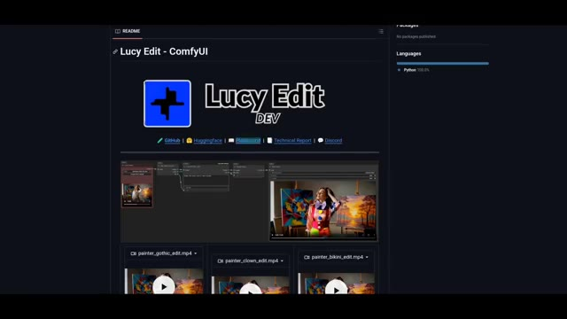
*Interface du projet "Lucy Edit - ComfyUI" affichant des exemples de modifications vidéo (painter_gothic_edit.mp4, painter_clown_edit.mp4, painter_bikini_edit.mp4).*

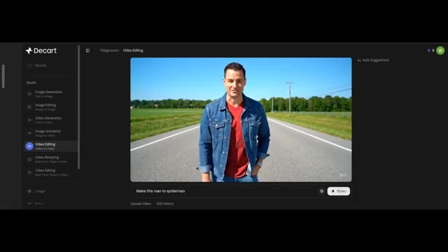
*Interface de la plateforme Decart dans la section "Video Editing", montrant le téléchargement d'une vidéo avec le prompt textuel "Make this man to spiderman".*

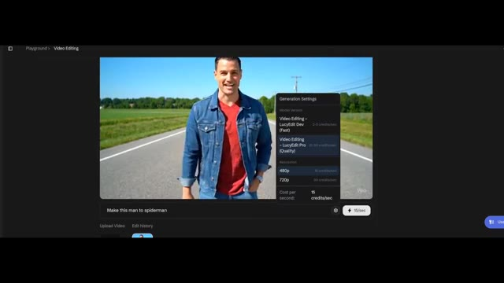
*Panneau des paramètres de génération ("Generation Settings") ouvert sur l'interface Decart, permettant de choisir entre les modèles LucyEdit Dev et LucyEdit Pro ainsi que les résolutions 480p et 720p.*

---

### ⏱️ `[00:04:40 - 00:05:05]` | Segment #14

**🔊 Audio (Transcription Intégrale Mot pour Mot en Français) :**
> Et si vous voulez générer en 720p, le coût sera doublé. Donc pour l'instant, restons sur du 480p et cliquons sur générer. Lucy Edit a deux versions, Pro et Dev. Probablement que la version Pro vous offre une meilleure qualité. Mais voici la partie géniale, ils ont également publié la version Dev. Sur leur dépôt GitHub, ils ont partagé un workflow ComfyUI complet où vous pouvez utiliser Lucy Dev localement sur votre ordinateur.

**👁️ Analyse Visuelle d'Écran (gemini-3.5-flash-lite) :**
**Interface & Outils** : Interface web de Lucy Edit et page du dépôt GitHub avec un workflow ComfyUI.

**Contenu textuel & Code** : Menus de paramètres de génération ("Video Editing - LucyEdit Dev", "Video Editing - LucyEdit Pro", résolutions "480p", "720p"), prompt "Make this man to spiderman", interface de ComfyUI avec les nœuds "Load Video", "Lucy Edit Pro - API", "Create Video", "Save Video".

**Action / Démonstration** : Le créateur montre les options de configuration de la résolution et des versions du modèle sur l'interface web, puis présente le dépôt GitHub et le workflow ComfyUI associé.

*Interface de Lucy Edit montrant les paramètres de génération, le choix du modèle (Dev ou Pro) et la résolution (480p ou 720p).*

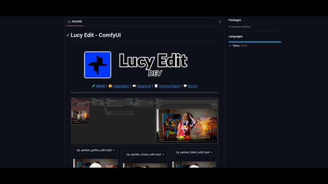
*Page GitHub du dépôt "Lucy Edit - ComfyUI" affichant les liens et un aperçu des workflows et des vidéos d'exemple.*

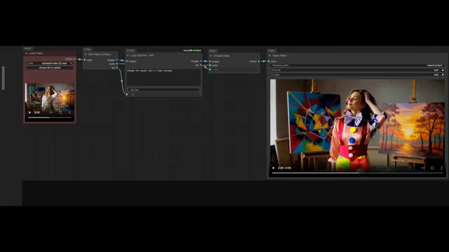
*Vue rapprochée du workflow ComfyUI pour Lucy Edit avec les nœuds de chargement vidéo, de traitement et de sauvegarde.*

---

### ⏱️ `[00:05:05 - 00:05:15]` | Segment #15

**🔊 Audio (Transcription Intégrale Mot pour Mot en Français) :**
> Je mettrai également le lien de la page principale dans la description ci-dessous. Cette semaine, les recherches s'arrête ici. Dites-moi que vous aimez regarder mon contenu et faites-moi part de vos suggestions. Alors n'hésitez pas à commenter, abonnez-vous pour plus de recherches.

**👁️ Analyse Visuelle d'Écran (gemini-3.5-flash-lite) :**
**Interface & Outils** : Rendu vidéo IA plein écran avec incrustation Picture-in-Picture (PiP) du créateur.

**Contenu textuel & Code** : Image générée par IA représentant un personnage détaillé ressemblant à un gobelin ou un elfe cyborg, vêtu d'une armure futuriste dans un environnement boisé ou sombre, et incrustation vidéo du présentateur en haut à gauche.

**Action / Démonstration** : Affichage d'un exemple de vidéo générée par intelligence artificielle en guise de conclusion, tandis que le créateur s'adresse aux spectateurs depuis le petit encadré PiP.

*Rendu vidéo généré par IA montrant un personnage de gobelin cybernétique, avec le créateur en incrustation PiP dans le coin supérieur gauche.*

---
