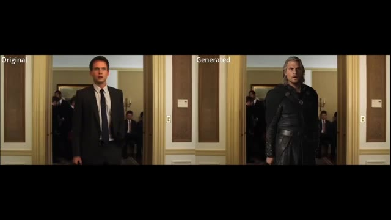
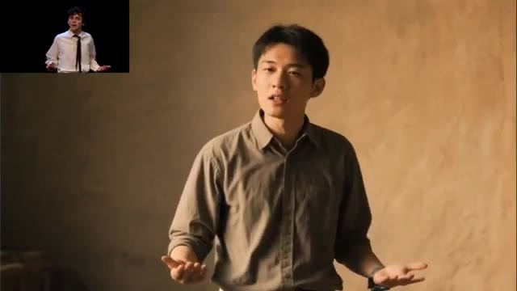
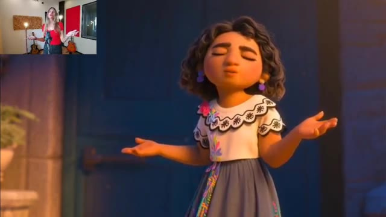
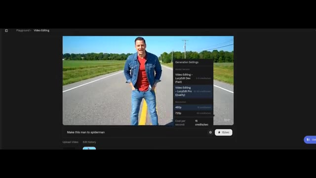
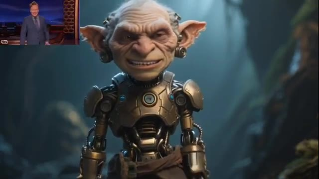

# 🎬 New open source models are here! Huge AI Research.

> **Chaîne** : [Pursuing AI](https://www.youtube.com/@PursuingAi)  
> **Titre original** : `New open source models are here! Huge AI Research.`  
> **Lien YouTube** : [https://www.youtube.com/watch?v=4Cu9EP_Zw6Q](https://www.youtube.com/watch?v=4Cu9EP_Zw6Q)  
> **Date de publication** : 2025-09-30  
> **Durée** : 05m 16s (`316s`)  
> **Identifiant vidéo** : `4Cu9EP_Zw6Q`  
> **Fiche Web Interactive** : [2025-09-30_YT-4Cu9EP_Zw6Q_New open source models are here! Huge AI Research._by-whisper-v3-large-turbo+gemini-3.5-flash-lite.html](2025-09-30_YT-4Cu9EP_Zw6Q_New open source models are here! Huge AI Research._by-whisper-v3-large-turbo+gemini-3.5-flash-lite.html)  
> **Captures de démonstration clés** : `15 captures réelles (anti-talking-head)`  
> **Modèles utilisés** : Audio: `large-v3-turbo` (Faster-Whisper int8 VPS) | Vision: `gemini-3.5-flash-lite` (Google AI Studio API)  

---

## 📌 Synthèse Exécutive & Outils

### 📌 Résumé
La recherche en intelligence artificielle générative franchit un nouveau cap décisif avec l'émergence de modèles open-source et de solutions natives révolutionnant la production et l'édition vidéo. Le créateur de la chaîne *Pursuing AI* explore dans cette vidéo une vague d'innovations majeures en provenance directe d'acteurs de premier plan comme Alibaba et de laboratoires de pointe. L'accent est mis sur l'interopérabilité, le contrôle chirurgical du mouvement et l'intégration audio native, redéfinissant complètement les standards de la post-production assistée par IA et ouvrant des perspectives inédites pour les créateurs de contenu indépendants.

La méthodologie démontrée s'articule autour de l'expérimentation multi-plateforme et de l'exploitation d'architectures open-source exécutables en local via des écosystèmes modulaires comme ComfyUI. Le créateur décortique des cas d'usage pratiques : de la génération texte-vidéo et image-vidéo haute définition avec synchronisation audio (via WAN 2.5), au transfert de mouvement inter-personnages et d'expressions faciales ultra-précis (via Wan Animate), jusqu'à l'édition vidéo textuelle par masquage intelligent (via Lucy Edit/Nano Banana). Chaque outil fait l'objet d'une démonstration in-app, illustrant les coûts en crédits, les résolutions disponibles (480p à 1080p) et les alternatives d'exécution locale.

Pour les créateurs de vidéo, ces avancées suppriment les barrières techniques traditionnelles du montage et des effets visuels (VFX). Il devient possible de remplacer des acteurs dans des séquences complexes tout en préservant l'éclairage et l'arrière-plan, de synchroniser des voix off ou des effets sonores dès la génération, ou d'appliquer des modifications contextuelles complexes par simple prompt textuel. L'accessibilité de ces technologies — partagées via des dépôts GitHub et des flux ComfyUI — démocratise des workflows d'animation de niveau professionnel autrefois réservés aux studios dotés de budgets colossaux.

### 🛠️ Outils, Modèles & Logiciels Présentés
* **WAN 2.5** : Modèle de pointe développé par Alibaba, capable de générer des vidéos en résolution 1080p (text-to-video et image-to-video) avec un support audio natif et une synchronisation sur mesure.
* **Wan Animate (basé sur Wan 2.2)** : Outil d'animation d'Alibaba spécialisé dans le transfert de mouvements corporels, d'expressions faciales et de gestes de mains d'une vidéo de référence vers un nouveau personnage ou une créature animée.
* **Lucy Edit (par Descartes)** : Solution de montage vidéo open-source basée sur le texte, fonctionnant sur le même principe que Nano Banana pour modifier ou remplacer des éléments visuels au sein d'une séquence existante.
* **ComfyUI** : Interface de nœuds modulaire indispensable pour exécuter localement les versions "Dev" des modèles open-source et exploiter des flux de travail personnalisés.
* **Nano Banana** : Outil de référence mentionné pour l'édition vidéo textuelle, dont Lucy Edit constitue un concurrent direct et performant.

### 🔑 Points Clés & Enseignements Stratégiques
* **Génération audiovisuelle unifiée** : Le modèle WAN 2.5 fusionne la génération de séquences visuelles et de pistes sonores natives, permettant de créer des clips cohérents de 5 ou 10 secondes en un seul prompt.
* **Gestion flexible des crédits en ligne** : Les plateformes propriétaires basées sur ces modèles proposent souvent des systèmes de crédits renouvelables quotidiennement par simple connexion, facilitant l'expérimentation gratuite.
* **Import et synchronisation audio personnalisée** : Il est possible d'injecter ses propres fichiers audio dans des générateurs comme WAN 2.5 pour forcer une synchronisation labiale et rythmique avec la vidéo générée.
* **Limites de la synchronisation labiale automatique** : Les tests in-app révèlent que le matching lipsync natif peut parfois présenter un léger décalage, nécessitant des ajustements ou des prompts textuels extrêmement précis sur les émotions.
* **Transfert de mouvement multi-styles** : Wan Animate ne se limite pas aux humains photoréalistes ; il transfère avec une grande précision les expressions, les postures et les mouvements de mains sur des créatures fantastiques et des styles d'animation variés.
* **Préservation rigoureuse des arrière-plans** : Lors du remplacement d'un personnage dans une vidéo existante, les outils d'animation avancés maintiennent l'intégrité du décor initial et respectent fidèlement les conditions d'éclairage d'origine.
* **Accessibilité open-source sur GitHub** : Les équipes de recherche publient massivement leurs travaux open-source, incluant des instructions détaillées pour télécharger, configurer et exécuter les modèles directement sur sa propre machine.
* **Édition vidéo micro-ciblée par le texte** : Des outils comme Lucy Edit permettent d'altérer des éléments précis d'une vidéo (changer un costume, transformer un personnage en Spider-Man) par simple instruction textuelle, révolutionnant le micro-montage.
* **Arbitrage entre résolutions et coûts de calcul** : Les environnements cloud proposent généralement une version Pro (plus qualitative mais plus gourmande en crédits, par exemple 75 crédits en 480p) et doublent le coût lors du passage en 720p.
* **Intégration locale via ComfyUI** : Pour s'affranchir des limitations des versions cloud, les créateurs peuvent exploiter les dépôts GitHub communautaires et les flux ComfyUI dédiés pour exécuter les versions "Dev" en local.

---

## ⏱️ Chronologie & Transcription Complète Audio & Visuelle (Mot pour Mot)

### ⏱️ `[00:00:00 - 00:00:23]` | Segment #01

**🔊 Audio (Transcription Intégrale Mot pour Mot en Français) :**
> Pursuing eye research never stops. I can't keep up anymore. My research never stops. And this week I discovered amazing news and some open source models, which are insane. We have Nano Banana for video editing. You can edit your video just by text. We have another AI video tool, which can transfer the movements of one video onto another character, including your hand movements and expressions.

**👁️ Analyse Visuelle d'Écran (gemini-3.5-flash-lite) :**
**Interface & Outils** : le créateur face caméra ou transition sans partage d'écran.

**Contenu textuel & Code** : Explications orales des concepts et des méthodes de création vidéo IA.

**Action / Démonstration** : Démonstration pédagogique et présentation du workflow.

---

### ⏱️ `[00:00:23 - 00:00:42]` | Segment #02

**🔊 Audio (Transcription Intégrale Mot pour Mot en Français) :**
> And this is really amazing. We also have a competitor of VO3, which can generate video and audio natively. And we also have a Nano Banana competitor, and it's even good in some conditions. And we have tons of new insane models from Alibaba, which are bangers. So let's jump right in.

**👁️ Analyse Visuelle d'Écran (gemini-3.5-flash-lite) :**
**Interface & Outils** : le créateur face caméra ou transition sans partage d'écran.

**Contenu textuel & Code** : Explications orales des concepts et des méthodes de création vidéo IA.

**Action / Démonstration** : Démonstration pédagogique et présentation du workflow.

---

### ⏱️ `[00:00:42 - 00:01:00]` | Segment #03

**🔊 Audio (Transcription Intégrale Mot pour Mot en Français) :**
> First up, we have WAN 2.5. It's a direct competitor to VO3. And the crazy part is it can make videos with built-in audio. Let me show you some examples. Go on, get off my property! The hills are alive with the sound of music.

**👁️ Analyse Visuelle d'Écran (gemini-3.5-flash-lite) :**
**Interface & Outils** : le créateur face caméra ou transition sans partage d'écran.

**Contenu textuel & Code** : Explications orales des concepts et des méthodes de création vidéo IA.

**Action / Démonstration** : Démonstration pédagogique et présentation du workflow.

---

### ⏱️ `[00:01:01 - 00:01:23]` | Segment #04

**🔊 Audio (Transcription Intégrale Mot pour Mot en Français) :**
> Driving down the coast where the sun never fades. WON 2.5 is made by Alibaba. And here's the awesome part. You can try it completely free on their website, WON Video. Just sign up and you'll get free credits to start. Plus, you can earn more credits every single day just by checking in.

**👁️ Analyse Visuelle d'Écran (gemini-3.5-flash-lite) :**
**Interface & Outils** : le créateur face caméra ou transition sans partage d'écran.

**Contenu textuel & Code** : Explications orales des concepts et des méthodes de création vidéo IA.

**Action / Démonstration** : Démonstration pédagogique et présentation du workflow.

---

### ⏱️ `[00:01:23 - 00:01:42]` | Segment #05

**🔊 Audio (Transcription Intégrale Mot pour Mot en Français) :**
> With this tool, you can create both image-to-video and text-to-video. And yes, it can generate videos all the way up to 1080p. You also get to choose the size and duration either five seconds or 10 seconds. For example, a five second video costs 10 credits, while a 10 second video costs 20 credits.

**👁️ Analyse Visuelle d'Écran (gemini-3.5-flash-lite) :**
**Interface & Outils** : le créateur face caméra ou transition sans partage d'écran.

**Contenu textuel & Code** : Explications orales des concepts et des méthodes de création vidéo IA.

**Action / Démonstration** : Démonstration pédagogique et présentation du workflow.

---

### ⏱️ `[00:01:42 - 00:02:00]` | Segment #06

**🔊 Audio (Transcription Intégrale Mot pour Mot en Français) :**
> And here's the cool bonus, you can even upload your own audio and sync it with the video. How amazing is that? So in the prompt box, I type a woman sitting alone in her room crying with teary eyes. She says, I lost my job. I wish I had subscribed to pursuing I earlier, then bursts into tears. Here is the result.

**👁️ Analyse Visuelle d'Écran (gemini-3.5-flash-lite) :**
**Interface & Outils** : le créateur face caméra ou transition sans partage d'écran.

**Contenu textuel & Code** : Explications orales des concepts et des méthodes de création vidéo IA.

**Action / Démonstration** : Démonstration pédagogique et présentation du workflow.

---

### ⏱️ `[00:02:00 - 00:02:20]` | Segment #07

**🔊 Audio (Transcription Intégrale Mot pour Mot en Français) :**
> I lost my job. I wish I had subscribed to pursuing I earlier. Lip syncing is a little mismatched with the video, but overall, it looks really good. I'll link the main page in the description below. Next up, we have another video model from Alibaba, and this one is Wan Animate based on Wan 2.2.

**👁️ Analyse Visuelle d'Écran (gemini-3.5-flash-lite) :**
**Interface & Outils** : le créateur face caméra ou transition sans partage d'écran.

**Contenu textuel & Code** : Explications orales des concepts et des méthodes de création vidéo IA.

**Action / Démonstration** : Démonstration pédagogique et présentation du workflow.

---

### ⏱️ `[00:02:20 - 00:02:43]` | Segment #08

**🔊 Audio (Transcription Intégrale Mot pour Mot en Français) :**
> Its ability is incredible. It can transfer movements and expressions from one video onto another character. This includes your hands, lip syncing, and full body movements. All while keeping everything consistent. Notice how precise it is in copying expressions and movements from the reference video. It can even replace a character in an existing video while perfectly preserving the background.

**👁️ Analyse Visuelle d'Écran (gemini-3.5-flash-lite) :**
**Interface & Outils** : le créateur face caméra ou transition sans partage d'écran.

**Contenu textuel & Code** : Explications orales des concepts et des méthodes de création vidéo IA.

**Action / Démonstration** : Démonstration pédagogique et présentation du workflow.

---

### ⏱️ `[00:02:43 - 00:03:02]` | Segment #09

**🔊 Audio (Transcription Intégrale Mot pour Mot en Français) :**
> So here's the example. Rick Sorkin? Excuse me, Mr. Sorkin. You are five minutes late. Is there a reason why I should let you in? I'm just trying to ditch the cops, okay? I don't really care if you let me in or not. Mr. Spector will be right with you. What?

**👁️ Analyse Visuelle d'Écran (gemini-3.5-flash-lite) :**
**Interface & Outils** : le créateur face caméra ou transition sans partage d'écran.

**Contenu textuel & Code** : Explications orales des concepts et des méthodes de création vidéo IA.

**Action / Démonstration** : Démonstration pédagogique et présentation du workflow.

---

### ⏱️ `[00:03:02 - 00:03:35]` | Segment #10

**🔊 Audio (Transcription Intégrale Mot pour Mot en Français) :**
> Est-ce que je peux vous apporter quelque chose ? Un café ou une bouteille d'eau ? C'est complètement fou ! Ça préserve non seulement l'arrière-plan, mais ça intègre aussi le nouveau personnage de manière fluide, sans changer les conditions d'éclairage de la vidéo. Voici quelques exemples montrant comment il est possible de transférer non seulement les mouvements du corps, mais aussi les expressions faciales et même les mouvements des mains, et le meilleur, c'est que ça ne fonctionne pas seulement avec des humains réalistes, ça fonctionne aussi avec différentes créatures et d'autres styles d'animation comme celui-ci. Regardez comment il peut remplacer de manière fluide un personnage dans une vidéo existante.

**👁️ Analyse Visuelle d'Écran (gemini-3.5-flash-lite) :**
**Interface & Outils** : Vidéo de démonstration technique d'un outil d'IA de remplacement et de transfert de mouvement sur vidéo, avec incrustation PiP (Picture-in-Picture) du présentateur en studio.

**Contenu textuel & Code** : Textes à l'écran « Original » et « Generated » sur la première image ; extraits vidéo démontrant le remplacement de personnage et le transfert de mouvements corporels, faciaux et de mains sur différents styles visuels (humain réaliste, style animé).

**Action / Démonstration** : Le créateur montre des exemples visuels de génération et de remplacement de personnages par IA, illustrant la conservation de l'arrière-plan, des éclairages et des mouvements.

*Démonstration comparative côte à côte d'un personnage remplacé dans une vidéo (« Original » vs « Generated »).*

*Démonstration du transfert de mouvements et d'expressions sur un personnage réaliste, avec le créateur en médaillon (PiP).*

*Démonstration du transfert d'animation sur un personnage de style anime, avec le créateur en médaillon (PiP).*

---

### ⏱️ `[00:03:35 - 00:03:59]` | Segment #11

**🔊 Audio (Transcription Intégrale Mot pour Mot en Français) :**
> Tout reste précis et la qualité est tout simplement incroyable et voici la partie géniale : ils ont déjà tout publié, il suffit de cliquer sur GitHub, de faire défiler vers le bas et vous trouverez toutes les instructions sur la façon de télécharger, d'animer et de l'exécuter localement sur votre ordinateur. Je mettrai également un lien vers la page principale dans la description ci-dessous pour que vous puissiez en lire plus. Ensuite, nous avons un nouvel outil d'IA pour le montage vidéo, et celui-ci s'appelle Lucy Edit par Descartes.

**👁️ Analyse Visuelle d'Écran (gemini-3.5-flash-lite) :**
**Interface & Outils** : Navigateur web affichant la plateforme GitHub et le site de recherche de Wan-Animate (Alibaba), ainsi que des exemples de démonstrations vidéo générées par IA.

**Contenu textuel & Code** : Texte visible : 'Run Wan2.2', 'Installation', 'Clone the repo: git clone https://github.com/Wan-Video/Wan2.2.git', 'Model Download' (avec les modèles T2V-A14B, I2V-A14B, TI2V-5B), et le titre 'Wan-Animate: Unified Character Animation and Replacement with Holistic Replication' par Tongyi Lab, Alibaba.

**Action / Démonstration** : Le présentateur montre des exemples de résultats de génération vidéo par IA et navigue sur les pages de documentation technique et de dépôt GitHub pour expliquer comment télécharger et exécuter le modèle localement.

*Démonstration vidéo d'un personnage animé (similaire au style de Mirabel de Disney) avec la créatrice visible en médaillon PiP dans le coin supérieur gauche.*

*Page GitHub montrant le code d'installation et la section de téléchargement des modèles pour 'Run Wan2.2' et 'Wan-Animate'.*

*Page Web officielle de 'Wan-Animate: Unified Character Animation and Replacement with Holistic Replication' par Tongyi Lab, Alibaba.*

*Démonstration vidéo d'un homme assis sur un banc tenant une énorme glace géante fondante générée par IA.*

---

### ⏱️ `[00:03:59 - 00:04:21]` | Segment #12

**🔊 Audio (Transcription Intégrale Mot pour Mot en Français) :**
> C'est open source et c'est rapide. En gros, pensez-y comme à Nano Banana pour le montage vidéo, où vous pouvez simplement demander à l'IA d'éditer n'importe quel élément d'une vidéo, juste avec du texte. C'est incroyablement puissant pour le micro-montage dans vos vidéos. Comme vous pouvez le voir ici, vous pouvez facilement transformer un personnage entier dans une vidéo en un tout nouveau, ou même échanger ses vêtements ou son apparence juste avec du texte.

**👁️ Analyse Visuelle d'Écran (gemini-3.5-flash-lite) :**
**Interface & Outils** : Interface de ComfyUI (projet Lucy Edit DEV), affichant des workflows de nœuds (nodes), des fenêtres de prévisualisation vidéo et des options de téléchargement (GitHub, HuggingFace, Playground, Technical Report, Discord).

**Contenu textuel & Code** : Texte affiché : "Lucy Edit - ComfyUI", ainsi que les noms des fichiers vidéo de sortie en bas : "painter_gothic_edit.mp4", "painter_clown_edit.mp4", "painter_bikini_edit.mp4".

**Action / Démonstration** : Présentation du logiciel open source Lucy Edit sous ComfyUI et visualisation des résultats de modification d'une vidéo selon différents styles.

*Interface de Lucy Edit - ComfyUI montrant le workflow de modification vidéo par IA et des exemples de rendu.*

---

### ⏱️ `[00:04:21 - 00:04:40]` | Segment #13

**🔊 Audio (Transcription Intégrale Mot pour Mot en Français) :**
> Et le truc génial, c'est que vous pouvez essayer ça dès maintenant. Donc cliquons d'abord sur le playground, je vais uploader ma propre vidéo, et changeons cet homme en Spider-Man. Remarquez qu'une fois que vous vous inscrivez avec un compte gratuit, vous obtenez 2000 crédits pour jouer avec cet outil. Une génération en utilisant la version pro en 480p coûte 75 crédits.

**👁️ Analyse Visuelle d'Écran (gemini-3.5-flash-lite) :**
**Interface & Outils** : Interface web de Decart (Playground - Video Editing) et page de présentation de Lucy Edit.

**Contenu textuel & Code** : Texte de prompt "Make this man to spiderman", options de configuration de modèle (LucyEdit Dev vs LucyEdit Pro), résolutions (480p, 720p) et coût en crédits par seconde (15 crédits/sec).

**Action / Démonstration** : Le créateur navigue dans l'interface de l'outil Decart, prépare l'édition vidéo et consulte le panneau des paramètres de génération.

*Interface de présentation du projet Lucy Edit - ComfyUI montrant le titre et des exemples de vidéos éditées.*

*Interface de Decart (Playground > Video Editing) montrant l'import d'une vidéo avec le prompt "Make this man to spiderman".*

*Panneau des paramètres de génération ("Generation Settings") dans Decart, affichant les options pour "Video Editing - LucyEdit Pro (Quality)" et la résolution 480p.*

---

### ⏱️ `[00:04:40 - 00:05:05]` | Segment #14

**🔊 Audio (Transcription Intégrale Mot pour Mot en Français) :**
> Et si vous voulez générer en 720p, le coût sera doublé. Donc pour l'instant, restons sur du 480p et cliquons sur générer. Lucy Edit a deux versions, Pro et Dev. Probablement que la version Pro vous donne une meilleure qualité. Mais voici la partie géniale, ils ont également sorti la version Dev. Sur leur dépôt GitHub, ils ont partagé un flux ComfyUI complet où vous pouvez utiliser Lucy Dev localement sur votre ordinateur.

**👁️ Analyse Visuelle d'Écran (gemini-3.5-flash-lite) :**
**Interface & Outils** : Navigateur web affichant l'interface de l'outil Lucy Edit en ligne puis le dépôt GitHub du projet Lucy Edit - ComfyUI.

**Contenu textuel & Code** : Menus de réglages de génération (Video Editing - LucyEdit Dev (Fast), Video Editing - LucyEdit Pro (Quality)), résolutions (480p, 720p), prompt "Make this man to spiderman", dépôt GitHub "Lucy Edit - ComfyUI" avec les liens GitHub, Hugging Face, Playground, Technical Report, Discord, et workflow ComfyUI avec des nœuds de traitement vidéo.

**Action / Démonstration** : Le créateur montre les options de configuration de résolution sur l'interface web, puis présente la page du dépôt GitHub et le workflow ComfyUI associé.

*Interface de l'outil Lucy Edit affichant les paramètres de génération, le sélecteur de version (Dev/Pro) et les résolutions (480p/720p).*

*Page GitHub du projet Lucy Edit - ComfyUI montrant le dépôt et ses liens vers le playground et Hugging Face.*

*Vue rapprochée d'un workflow complet ComfyUI pour Lucy Edit avec les nœuds de chargement, traitement vidéo et sauvegarde.*

---

### ⏱️ `[00:05:05 - 00:05:15]` | Segment #15

**🔊 Audio (Transcription Intégrale Mot pour Mot en Français) :**
> Je mettrai également le lien de la page principale dans la description ci-dessous. Cette semaine, les recherches s'arrête ici. Dites-moi si vous aimez regarder mon contenu et faites-moi part de vos suggestions. Alors n'hésitez pas à commenter et à vous abonner pour plus de recherches.

**👁️ Analyse Visuelle d'Écran (gemini-3.5-flash-lite) :**
**Interface & Outils** : Vidéo générée par intelligence artificielle avec incrustation du présentateur (PiP).

**Contenu textuel & Code** : Un personnage fantastique détaillé, un gobelin aux traits ridés doté d'une armure cybernétique et d'implants technologiques, dans un décor de forêt sombre et brumeuse. Dans le coin supérieur gauche, le créateur apparaît en petit format (PiP) dans son studio face caméra.

**Action / Démonstration** : Affichage d'un rendu vidéo généré par IA pour illustrer les conclusions de la vidéo, tandis que le créateur s'adresse au public en incrustation.

*Rendu vidéo généré par IA montrant un personnage de type gobelin cyborg, avec le créateur en incrustation (PiP) dans le coin supérieur gauche.*

---
