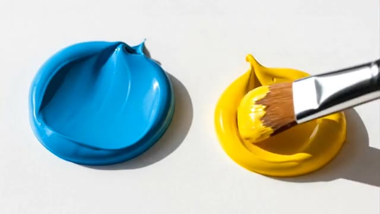
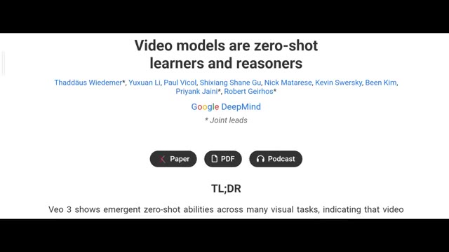
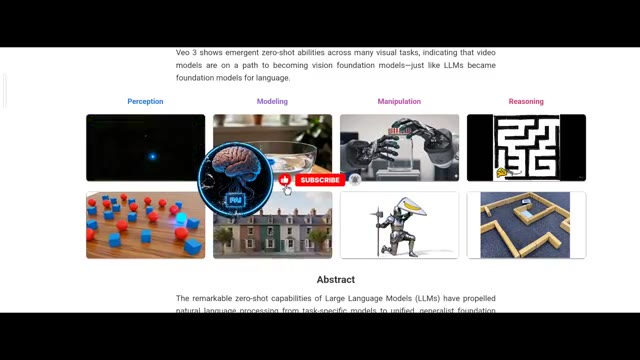

# 🎬 Veo 3.1 is wild!

> **Chaîne** : [Pursuing AI](https://www.youtube.com/@PursuingAi)  
> **Titre original** : `Veo 3.1 is wild!`  
> **Lien YouTube** : [https://www.youtube.com/watch?v=Er4kw7J4HsQ](https://www.youtube.com/watch?v=Er4kw7J4HsQ)  
> **Date de publication** : 2025-10-16  
> **Durée** : 03m 14s (`194s`)  
> **Identifiant vidéo** : `Er4kw7J4HsQ`  
> **Fiche Web Interactive** : [2025-10-16_YT-Er4kw7J4HsQ_Veo 3.1 is wild!_by-whisper-v3-large-turbo+gemini-3.5-flash-lite.html](2025-10-16_YT-Er4kw7J4HsQ_Veo 3.1 is wild!_by-whisper-v3-large-turbo+gemini-3.5-flash-lite.html)  
> **Captures de démonstration clés** : `3 captures réelles (anti-talking-head)`  
> **Modèles utilisés** : Audio: `large-v3-turbo` (Faster-Whisper int8 VPS) | Vision: `gemini-3.5-flash-lite` (Google AI Studio API)  

---

## 📌 Synthèse Exécutive & Outils

### 📌 Résumé
Dans ce tutoriel complet intitulé **Veo 3.1 is wild!**, le créateur présente les techniques de pointe pour maîtriser la génération de vidéos et de visuels par intelligence artificielle.

### 🛠️ Outils, Modèles & Logiciels Présentés
- **Modèles vidéo IA** : Génération de plans cinématiques.
- **Outils de prompt** : Structuration avancée des descriptions visuelles.

### 🔑 Points Clés & Enseignements Stratégiques
- Structurer ses prompts de mouvement avec des termes de caméra précis.
- Soigner la cohérence des personnages entre chaque plan.
- Exploiter les modèles de dernière génération pour un rendu professionnel.

---

## ⏱️ Chronologie & Transcription Complète Audio & Visuelle (Mot pour Mot)

### ⏱️ `[00:00:00 - 00:00:19]` | Segment #01

**🔊 Audio (Transcription Intégrale Mot pour Mot en Français) :**
> Sora 2 can't do this, and honestly, no other video model can either. What you're about to see is mind-blowing. Just look at these examples. I'm 100% sure you've never seen anything like this before in the world of generative AI. I'm talking about a brand new research paper from Google DeepMind, and it's showing how they're completely revolutionizing their video model VO3.

**👁️ Analyse Visuelle d'Écran (gemini-3.5-flash-lite) :**
**Interface & Outils** : le créateur face caméra ou transition sans partage d'écran.

**Contenu textuel & Code** : Explications orales des concepts et des méthodes de création vidéo IA.

**Action / Démonstration** : Démonstration pédagogique et présentation du workflow.

---

### ⏱️ `[00:00:19 - 00:00:38]` | Segment #02

**🔊 Audio (Transcription Intégrale Mot pour Mot en Français) :**
> First, take a look at these examples. They go way beyond the limits of what AI video generation could do before. If you give a photo which contains two colors and prompt it to mix them, it mixes accurately, knowing exactly what new color will be formed. And you can also do editing in videos, like adding a scarf to a parrot or changing the weather perfectly.

**👁️ Analyse Visuelle d'Écran (gemini-3.5-flash-lite) :**
**Interface & Outils** : le créateur face caméra ou transition sans partage d'écran.

**Contenu textuel & Code** : Explications orales des concepts et des méthodes de création vidéo IA.

**Action / Démonstration** : Démonstration pédagogique et présentation du workflow.

---

### ⏱️ `[00:00:38 - 00:00:57]` | Segment #03

**🔊 Audio (Transcription Intégrale Mot pour Mot en Français) :**
> This example really shows the power of Veo 3. This is called inpainting, which means adding a missing part in the image or video. It's difficult for video models, but this one does it correctly without any mistakes. Next, the inverted example called outpainting. Yes, you're thinking right. It means adding new content beyond the border of the image.

**👁️ Analyse Visuelle d'Écran (gemini-3.5-flash-lite) :**
**Interface & Outils** : le créateur face caméra ou transition sans partage d'écran.

**Contenu textuel & Code** : Explications orales des concepts et des méthodes de création vidéo IA.

**Action / Démonstration** : Démonstration pédagogique et présentation du workflow.

---

### ⏱️ `[00:00:57 - 00:01:28]` | Segment #04

**🔊 Audio (Transcription Intégrale Mot pour Mot en Français) :**
> And this does it perfectly. Impressive, but wait, it zooms out even more and performs the outpainting flawlessly You can also do drawing with this, which looks totally natural And no one can guess it's made by AI It doesn't draw like other AI tools that look straight and polished In the right down corner, it bends the line just a little like a human would And it even manages the overlay on the shape Amazing, this is also good in perception Meaning the ability to understand or notice something When you give this image and ask, what can you see in this picture?

**👁️ Analyse Visuelle d'Écran (gemini-3.5-flash-lite) :**
**Interface & Outils** : le créateur face caméra ou transition sans partage d'écran.

**Contenu textuel & Code** : Explications orales des concepts et des méthodes de création vidéo IA.

**Action / Démonstration** : Démonstration pédagogique et présentation du workflow.

---

### ⏱️ `[00:01:28 - 00:01:50]` | Segment #05

**🔊 Audio (Transcription Intégrale Mot pour Mot en Français) :**
> It clearly shows there are two minds and crabs around them. Most of the video models failed in this test too. Because it has a brain, it can solve reasoning questions, like solving the water problem with this, or in sequencing. See here, it perfectly sequences the dots in the correct inverted order, from 4 to 1. This is a video model's capability, not an LLM, like ChachiPT or Gemini.

**👁️ Analyse Visuelle d'Écran (gemini-3.5-flash-lite) :**
**Interface & Outils** : le créateur face caméra ou transition sans partage d'écran.

**Contenu textuel & Code** : Explications orales des concepts et des méthodes de création vidéo IA.

**Action / Démonstration** : Démonstration pédagogique et présentation du workflow.

---

### ⏱️ `[00:01:50 - 00:02:16]` | Segment #06

**🔊 Audio (Transcription Intégrale Mot pour Mot en Français) :**
> Do you know what gravity is? This model also understands how Earth's gravity works. Most people think this example is wrong because they've learned that light and heavy objects fall at the same speed when dropped from a height. But that's not the full truth. Light and heavy objects fall at the same time only in a vacuum where there's no air. In normal conditions where air is present, the metal ball hits the ground first because air resistance affects lighter objects more.

**👁️ Analyse Visuelle d'Écran (gemini-3.5-flash-lite) :**
**Interface & Outils** : le créateur face caméra ou transition sans partage d'écran.

**Contenu textuel & Code** : Explications orales des concepts et des méthodes de création vidéo IA.

**Action / Démonstration** : Démonstration pédagogique et présentation du workflow.

---

### ⏱️ `[00:02:16 - 00:02:36]` | Segment #07

**🔊 Audio (Transcription Intégrale Mot pour Mot en Français) :**
> So the example is actually correct. It also knows the material properties, meaning how a paper burns, and even the buoyancy of a rock. If you have a 3D model and want to transfer it into videos, you can do that too. Notice the reflection on the armor. Amazing. But what about rolling a burrito? Don't worry, it can roll your burrito perfectly, but you just can't eat it. But how can it do these things so perfectly?

**👁️ Analyse Visuelle d'Écran (gemini-3.5-flash-lite) :**
**Interface & Outils** : le créateur face caméra ou transition sans partage d'écran.

**Contenu textuel & Code** : Explications orales des concepts et des méthodes de création vidéo IA.

**Action / Démonstration** : Démonstration pédagogique et présentation du workflow.

---

### ⏱️ `[00:02:36 - 00:02:59]` | Segment #08

**🔊 Audio (Transcription Intégrale Mot pour Mot en Français) :**
> Let me explain in simple words. You already know about LLMs, large language models, like ChatGPT or Grok. They use reasoning to understand questions and give smart answers. Now, video models are doing something similar, but instead of using language, they use vision. These are called vision foundation models, and they help the AI understand how the world looks, moves, and behaves, so it can reason visually, just like language models reason with words.

**👁️ Analyse Visuelle d'Écran (gemini-3.5-flash-lite) :**
**Interface & Outils** : le créateur face caméra ou transition sans partage d'écran.

**Contenu textuel & Code** : Explications orales des concepts et des méthodes de création vidéo IA.

**Action / Démonstration** : Démonstration pédagogique et présentation du workflow.

---

### ⏱️ `[00:02:59 - 00:03:14]` | Segment #09

**🔊 Audio (Transcription Intégrale Mot pour Mot en Français) :**
> Par exemple, personne ne lui a appris à mélanger les couleurs, mais quand vous dites de mélanger du jaune et du bleu, il crée une vidéo où ils se transforment en vert tout seul. C'est l'apprentissage zero-shot, l'IA qui réfléchit au lieu de simplement se souvenir. C'est ma recherche pour la vidéo d'aujourd'hui. Si vous aimez cette recherche, veuillez aimer, partager et laisser un commentaire gentil.

**👁️ Analyse Visuelle d'Écran (gemini-3.5-flash-lite) :**
**Interface & Outils** : Document de recherche web de Google DeepMind et captures d'illustrations visuelles.

**Contenu textuel & Code** : Titre du document : "Video models are zero-shot learners and reasoners", auteurs (Thaddäus Wiedemer et al.), section TL;DR et catégories d'évaluation (Perception, Modeling, Manipulation, Reasoning).

**Action / Démonstration** : Défilement à l'écran du document de recherche et présentation d'exemples graphiques illustrant les capacités zero-shot des modèles de vidéo.

*Illustration visuelle d'un pinceau mélangeant de la peinture jaune à côté d'une touche de peinture bleue.*

*Affichage du document de recherche Google DeepMind intitulé "Video models are zero-shot learners and reasoners".*

*Présentation des sections de recherche (Perception, Modeling, Manipulation, Reasoning) avec des exemples visuels de tâches accomplies par l'IA.*

---
