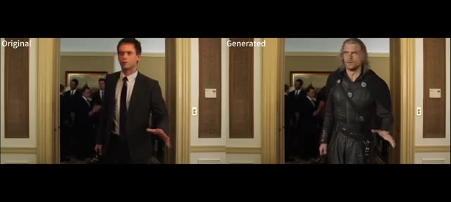
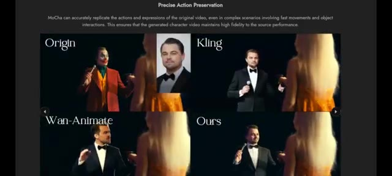
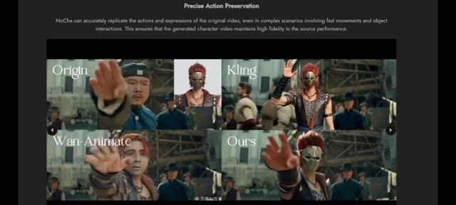
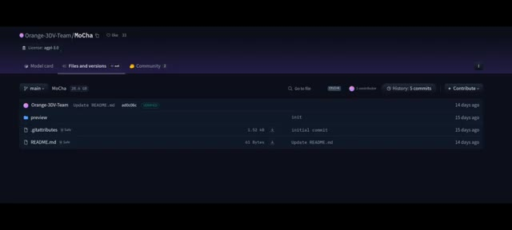
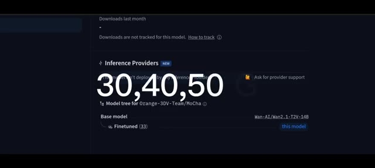
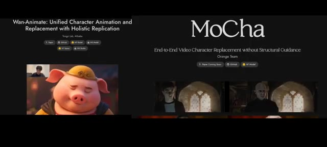
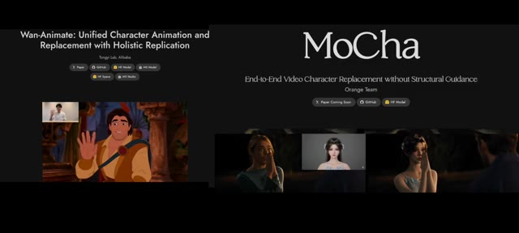

# 🎬 (MoCha) Le nouveau challenger de Wan Animate ! Tests réels et avis complet

> **Chaîne** : [Pursuing AI](https://www.youtube.com/@PursuingAi)  
> **Titre original** : `(MoCha) The New AI Challenging Wan Animate! Real Tests & Performance Review`  
> **Lien YouTube** : [https://www.youtube.com/watch?v=ftfnt6B36eI](https://www.youtube.com/watch?v=ftfnt6B36eI)  
> **Date de publication** : 2025-11-04  
> **Durée** : 03m 18s (`198s`)  
> **Identifiant vidéo** : `ftfnt6B36eI`  
> **Fiche Web Interactive** : [2025-11-04_YT-ftfnt6B36eI_(MoCha) Le nouveau challenger de Wan Animate ! Tests réels et avis complet_by-whisper-v3-large-turbo+gemini-3.5-flash-lite.html](2025-11-04_YT-ftfnt6B36eI_(MoCha) Le nouveau challenger de Wan Animate ! Tests réels et avis complet_by-whisper-v3-large-turbo+gemini-3.5-flash-lite.html)  
> **Captures de démonstration clés** : `7 captures réelles (anti-talking-head)`  
> **Modèles utilisés** : Audio: `large-v3-turbo` (Faster-Whisper int8 VPS) | Vision: `gemini-3.5-flash-lite` (Google AI Studio API)  

---

## 📌 Synthèse Exécutive & Outils

### 📌 Résumé
La vidéo de *Pursuing AI* explore **Mocha**, un nouveau système de remplacement de personnages en vidéo développé par l'Orange Team, positionné en tant que challenger direct de *Wan Animate*. Contrairement aux méthodes traditionnelles lourdes, Mocha se distingue par sa capacité à substituer des personnages de manière fluide sans nécessiter de guidage structurel complexe image par image. En s'appuyant sur un modèle amont affiné à partir de l'architecture texte-vidéo **WAN**, l'outil promet de réels gains de productivité pour les créateurs cherchant à insérer de nouvelles identités visuelles tout en respectant la cinétique et les expressions de la vidéo source.

La méthode présentée repose sur un workflow épuré : l'utilisateur fournit simplement un masque sur la toute première trame pour identifier la zone du personnage à remplacer, puis injecte quelques portraits de référence de face pour ancrer la nouvelle identité. L'analyse critique des résultats révèle toutefois des cas d'usage très tranchés. Si Mocha excelle dans le domaine du dessin animé et de la stylisation artistique grâce à une excellente conservation des mouvements rapides, il pèche encore sur les visages humains en live-action, produisant des textures de peau parfois lisses et artéfactées là où *Wan Animate* conserve un réalisme photographique saisissant.

Pour les professionnels de la vidéo par IA, cette confrontation met en lumière la nécessité d'adapter son pipeline technologique selon la direction artistique visée. Entre un Mocha redoutable pour l'animation stylisée et un *Wan Animate* suprême pour le photoréalisme humain, les créateurs disposent désormais d'une cartographie précise des forces en présence. Le déploiement de Mocha nécessite toutefois des ressources matérielles conséquentes (notamment un espace disque d'environ 30 à 50 Go et une VRAM musclée), tout en imposant la vigilance quant à sa licence AGPL 3.0 orientée vers la recherche académique.

### 🛠️ Outils, Modèles & Logiciels Présentés
* **Mocha** : Système de remplacement de personnages en vidéo développé par l'Orange Team, permettant de substituer des protagonistes à partir d'un simple masque initial sans guidage structurel par frame.
* **Wan Animate** (ou *Juan Anime*) : Modèle concurrent de référence, salué pour sa supériorité dans le remplacement de personnages humains vivants avec un haut niveau de réalisme et de fidélité texturale.
* **WAN.AI** (ou *WAN*) : Architecture de base texte-vidéo fondamentale sur laquelle le code et les poids de Mocha ont été affinés.
* **Hugging Face** : Plateforme d'hébergement où est répertorié le dépôt officiel de Mocha, comprenant les poids du modèle estimés à environ 28,6 gigaoctets.

### 🔑 Points Clés & Enseignements Stratégiques
* **Principe du masque initial** : Mocha s'affranchit du masquage par image en n'exigeant qu'un unique masque sur la première frame pour cibler le personnage à remplacer.
* **Injection d'identités** : L'utilisation de quelques photographies de face propres (références) permet au modèle d'adopter et de maintenir une nouvelle identité visuelle cohérente tout au long de la vidéo.
* **Préservation dynamique** : Le système restitue fidèlement les actions, les expressions faciales complexes et les interactions avec les objets, même lors de mouvements rapides.
* **Gestion des environnements** : L'algorithme préserve l'éclairage complexe d'origine (lumières tremblantes, contre-jours) pour intégrer visuellement le nouveau personnage dans la scène.
* **Limitation sur le photoréalisme** : Mocha éprouve des difficultés avec les humains en prises de vue réelles, générant des visages lissés et un rendu parfois "cartoonesque" manquant de texture de peau naturelle.
* **Suprématie de Wan Animate pour l'organique** : Pour un rendu live-action réaliste, détaillé et fidèle à l'éclairage de la scène originale, *Wan Animate* reste le choix incontesté.
* **Domaine d'excellence de Mocha** : Le modèle brille par sa fluidité et sa cohérence visuelle lorsqu'il est appliqué à des personnages de dessins animés ou à des animations stylisées.
* **Exigences matérielles lourdes** : L'exécution locale de Mocha requiert une configuration robuste, prévoyant au moins 30 à 50 Go d'espace disque libre et un GPU doté d'une VRAM élevée.
* **Contraintes de licence (AGPL 3.0)** : Le projet étant initialement positionné pour la recherche académique et la démonstration, une vérification rigoureuse des conditions d'utilisation est impérative avant tout usage commercial.
* **Arbitrage selon la direction artistique** : Le choix de l'outil ne dépend pas de la puissance brute, mais du style recherché : l'animation artistique pour Mocha, le réalisme humain pour Wan Animate.

---

## ⏱️ Chronologie & Transcription Complète Audio & Visuelle (Mot pour Mot)

### ⏱️ `[00:00:00 - 00:00:25]` | Segment #01

**🔊 Audio (Transcription Intégrale Mot pour Mot en Français) :**
> Do you remember the AI that went viral a few weeks ago? Juan Anime? The one everyone's been talking about for its ability to replace characters and animations with jaw-dropping realism. Well, meet the new contender. This is Pursuing AI, and you're watching The Research Report. Today we're diving into Mocha, an N-Tech and video character replacement system from the Orange Team that aims to replace characters in videos without relying on complicated structural guidance.

**👁️ Analyse Visuelle d'Écran (gemini-3.5-flash-lite) :**
**Interface & Outils** : le créateur face caméra ou transition sans partage d'écran.

**Contenu textuel & Code** : Explications orales des concepts et des méthodes de création vidéo IA.

**Action / Démonstration** : Démonstration pédagogique et présentation du workflow.

---

### ⏱️ `[00:00:25 - 00:00:49]` | Segment #02

**🔊 Audio (Transcription Intégrale Mot pour Mot en Français) :**
> Mocha performs high-quality character replacement directly from a source video. It keeps strong consistency in lighting, facial expressions, animation, and the character's identity, which helps the replacement feel naturally integrated into the scene. Mocha needs only a first-frame mask to mark the character that should be replaced. From that single mask, it re-renders the character across the video frames, avoiding per-frame structural inputs.

**👁️ Analyse Visuelle d'Écran (gemini-3.5-flash-lite) :**
**Interface & Outils** : le créateur face caméra ou transition sans partage d'écran.

**Contenu textuel & Code** : Explications orales des concepts et des méthodes de création vidéo IA.

**Action / Démonstration** : Démonstration pédagogique et présentation du workflow.

---

### ⏱️ `[00:00:50 - 00:01:15]` | Segment #03

**🔊 Audio (Transcription Intégrale Mot pour Mot en Français) :**
> You can feed reference images, for example, a few clean front-facing headshots, so Mocha can adopt a new character's appearance and identity consistently. Mocha performs impressively when working with cartoon characters, producing high fidelity and visually consistent results. However, it still struggles with human character replacement. In several examples, you can clearly see that the replaced faces look overly smooth and cartoonish, lacking realistic skin texture and depth.

**👁️ Analyse Visuelle d'Écran (gemini-3.5-flash-lite) :**
**Interface & Outils** : le créateur face caméra ou transition sans partage d'écran.

**Contenu textuel & Code** : Explications orales des concepts et des méthodes de création vidéo IA.

**Action / Démonstration** : Démonstration pédagogique et présentation du workflow.

---

### ⏱️ `[00:01:15 - 00:01:36]` | Segment #04

**🔊 Audio (Transcription Intégrale Mot pour Mot en Français) :**
> For instance, in one clip, Superman's face appears almost animated. It doesn't quite blend naturally with the live-action environment. Similarly, in another example, the boy's face looks stylized and artificial. On the other hand, Wan Animate handles human replacement far better. Its results appear more realistic, detailed, and lifelike, maintaining the original video's texture and lighting.

**👁️ Analyse Visuelle d'Écran (gemini-3.5-flash-lite) :**
**Interface & Outils** : le créateur face caméra ou transition sans partage d'écran.

**Contenu textuel & Code** : Explications orales des concepts et des méthodes de création vidéo IA.

**Action / Démonstration** : Démonstration pédagogique et présentation du workflow.

---

### ⏱️ `[00:01:36 - 00:01:58]` | Segment #05

**🔊 Audio (Transcription Intégrale Mot pour Mot en Français) :**
> Le modèle préserve l'éclairage et la tonalité des couleurs d'origine, ce qui aide le personnage remplacé à s'intégrer sous un éclairage complexe, des lumières tremblantes, un contre-jour, etc. Préservation. Mocha reproduit fidèlement les actions et les expressions faciales des artistes source, même lors de mouvements rapides et d'interactions avec des objets, minimisant ainsi les artéfacts temporels. La page du projet Mocha précise que ce travail est destiné à la recherche académique et à la démonstration.

**👁️ Analyse Visuelle d'Écran (gemini-3.5-flash-lite) :**
**Interface & Outils** : Page web de présentation du projet de recherche Mocha affichant des exemples comparatifs de vidéos générées par IA.

**Contenu textuel & Code** : Textes : "Precise Action Preservation", "Origin", "Kling", "Wan-Animate", "Ours", avec des images de référence de personnages et des fenêtres vidéo comparatives.

**Action / Démonstration** : Démonstration comparative de l'outil Mocha face à d'autres modèles (Kling, Wan-Animate) pour le remplacement de personnages dans des scènes dynamiques.

*Comparaison côte à côte entre la vidéo originale avec un acteur en costume et la version générée par l'IA montrant un personnage remplacé.*

*Interface du projet Mocha illustrant la préservation précise des actions avec une comparaison en grille entre Origin, Kling, Wan-Animate et Ours.*

*Comparaison en grille montrant une scène d'action d'arts martiaux avec différentes méthodes (Origin, Kling, Wan-Animate, Ours).*

---

### ⏱️ `[00:01:58 - 00:02:17]` | Segment #06

**🔊 Audio (Transcription Intégrale Mot pour Mot en Français) :**
> Le modèle amont sur Hugging Face répertorie le dépôt et montre que le modèle publié pèse environ 28,6 gigaoctets, sous licence AGPL 3.0. Cela signifie que vous devez lire et respecter la licence avant de l'utiliser dans des projets commerciaux. De plus, le code et les poids de Mocha sont affinés sur une base texte-vidéo WAN.AI.

**👁️ Analyse Visuelle d'Écran (gemini-3.5-flash-lite) :**
**Interface & Outils** : Interface du site web Hugging Face (dépôt du modèle Orange-3DV-Team/MoCha).

**Contenu textuel & Code** : On peut lire le nom du dépôt « Orange-3DV-Team/MoCha », la licence « agpl-3.0 », l'onglet « Files and versions », la taille du modèle « 28,6 GB », ainsi que les dossiers et fichiers « preview », « .gitattributes » et « README.md ».

**Action / Démonstration** : Affichage de la page Hugging Face du modèle MoCha pour illustrer sa source en ligne, sa taille et sa licence.

*Page du dépôt Hugging Face pour le modèle MoCha de Orange-3DV-Team, montrant la licence AGPL-3.0, la taille du modèle de 28,6 Go et la liste des fichiers.*

---

### ⏱️ `[00:02:17 - 00:02:36]` | Segment #07

**🔊 Audio (Transcription Intégrale Mot pour Mot en Français) :**
> Assurez-vous d'avoir au moins 30, 40, 50 Go d'espace disque libre et un GPU doté d'une VRAM suffisante pour l'inférence. Le dépôt Hugging Face répertorie actuellement le modèle à environ 28,6 Go. Les auteurs qualifiant ce projet de recherche académique et de démonstration, veuillez consulter le fichier README et les conditions de la licence AGPL avant de l'utiliser en production ou dans un contenu commercial.

**👁️ Analyse Visuelle d'Écran (gemini-3.5-flash-lite) :**
**Interface & Outils** : Navigateur web affichant une page de dépôt de modèle sur la plateforme Hugging Face.

**Contenu textuel & Code** : Texte affiché à l'écran : "Downloads last month", "Downloads are not tracked for this model", "Inference Providers", "Model tree for Orange-3DV-Team/MoCha", "Base model: Wan-AI/Wan2.1-T2V-14B", ainsi que les chiffres blancs géants "30, 40, 50".

**Action / Démonstration** : Le créateur présente visuellement les prérequis en matière d'espace disque (30, 40, 50 Go) en superposant ces chiffres sur la page du dépôt Hugging Face.

*Capture d'écran du navigateur montrant un dépôt Hugging Face avec des chiffres superposés en surimpression (30, 40, 50) et des informations sur les fournisseurs d'inférence.*

---

### ⏱️ `[00:02:36 - 00:03:06]` | Segment #08

**🔊 Audio (Transcription Intégrale Mot pour Mot en Français) :**
> Alors, lequel est réellement le meilleur ? Juan Animate ou Mocha ? Tout dépend de ce que vous créez. Si votre objectif est le remplacement de personnages humains réalistes, Wan Anime mène clairement la course. Ses détails faciaux, la cohérence de son éclairage et sa texture naturelle en font l'outil idéal pour les scènes en prise de vue réelle. Mais si vous travaillez avec des personnages de dessin animé, des animations stylisées ou des expériences créatives, Mocha offre des résultats plus fluides et visuellement plus cohérents, en particulier lorsque le réalisme n'est pas votre objectif principal.

**👁️ Analyse Visuelle d'Écran (gemini-3.5-flash-lite) :**
**Interface & Outils** : Navigateur web présentant les pages de présentation des projets Wan-Animate et MoCha avec des exemples vidéo intégrés.

**Contenu textuel & Code** : À gauche : Titre "Wan-Animate: Unified Character Animation and Replacement with Holistic Replication", boutons de liens (Paper, GitHub, HF Model, etc.) et vidéo d'un personnage de cochon animé. À droite : Titre "MoCha", sous-titre "End-to-End Video Character Replacement without Structural Guidance" par Orange Team, avec des exemples de remplacement de personnages de films (Harry Potter).

**Action / Démonstration** : Comparaison visuelle des interfaces et des résultats de démonstration des deux technologies de remplacement de personnages par IA.

*Comparaison côte à côte des interfaces des projets Wan-Animate (Tongyi Lab, Alibaba) à gauche et MoCha (Orange Team) à droite.*

---

### ⏱️ `[00:03:06 - 00:03:18]` | Segment #09

**🔊 Audio (Transcription Intégrale Mot pour Mot en Français) :**
> En bref, Wan Anime domine le réalisme, tandis que Mocha brille dans l'animation artistique stylisée. Les deux sont puissants. Cela dépend simplement de la façon dont vous souhaitez donner vie à votre imagination. Tous les liens sont dans la description.

**👁️ Analyse Visuelle d'Écran (gemini-3.5-flash-lite) :**
**Interface & Outils** : Navigateur web affichant deux pages de présentation de projets d'IA.

**Contenu textuel & Code** : À gauche, la page de Wan-Animate par Tongyi Lab (Alibaba) avec une vidéo montrant un personnage animé style dessin animé qui fait un signe de la main. À droite, la page de MoCha par Orange Team avec des exemples de remplacement de personnages en vidéo.

**Action / Démonstration** : Présentation comparative des deux outils d'intelligence artificielle pour l'animation et le remplacement de personnages dans les vidéos.

*Comparaison côte à côte des interfaces web de Wan-Animate et MoCha présentant leurs technologies de remplacement et d'animation de personnages.*

---
