# 🎬 1000 milliards de paramètres... Mais Kimi K2 peut-il battre GPT-5 ?

> **Chaîne** : [Pursuing AI](https://www.youtube.com/@PursuingAi)  
> **Titre original** : `1 Trillion Parameters… But Can Kimi K2 Beat GPT-5?`  
> **Lien YouTube** : [https://www.youtube.com/watch?v=4nYriaeipLA](https://www.youtube.com/watch?v=4nYriaeipLA)  
> **Date de publication** : 2025-11-10  
> **Durée** : 03m 29s (`209s`)  
> **Identifiant vidéo** : `4nYriaeipLA`  
> **Fiche Web Interactive** : [2025-11-10_YT-4nYriaeipLA_1000 milliards de paramètres... Mais Kimi K2 peut-il battre GPT-5_by-whisper-v3-large-turbo+gemini-3.5-flash-lite.html](2025-11-10_YT-4nYriaeipLA_1000 milliards de paramètres... Mais Kimi K2 peut-il battre GPT-5_by-whisper-v3-large-turbo+gemini-3.5-flash-lite.html)  
> **Captures de démonstration clés** : `24 captures réelles (anti-talking-head)`  
> **Modèles utilisés** : Audio: `large-v3-turbo` (Faster-Whisper int8 VPS) | Vision: `gemini-3.5-flash-lite` (Google AI Studio API)  

---

## 📌 Synthèse Exécutive & Outils

### 📌 Résumé
Dans cette vidéo du créateur *Pursuing AI*, l'analyse se penche sur le modèle **Kimi K2** de Moonshot AI, un mastodonte annoncé à 1 000 milliards de paramètres, censé rivaliser directement avec le redoutable **GPT-5**. Plutôt que de se fier au simple battage médiatique marketing, le vidéaste adopte une démarche empirique et rigoureuse : il soumet Kimi K2 aux mêmes tests et prompts exacts que ceux présentés par OpenAI lors de l'annonce officielle de GPT-5. Cette méthode comparative étape par étape permet de confronter les promesses théoriques des géants de l'IA à la dure réalité des performances pratiques sur des tâches de génération de code applicatif et interactif.

Sur le plan de la production visuelle et de l'intégration multimédia, la vidéo met en lumière l'utilisation d'outils de pointe tels que **Seedance 2.5**, **Kling 3.0** et **Midjourney** pour dynamiser le support visuel, illustrant la manière dont les créateurs modernes marient analyse technique et esthétique futuriste. Le processus du créateur consiste à lancer des défis de plus en plus complexes — de la création d'un mini-jeu de type *Rolling Ball* jusqu'à une application de peinture pixelisée et un instrument de musique virtuel (batterie virtuelle). Le flux de travail démontre l'importance cruciale de tester la robustesse des modèles d'intelligence artificielle face à des instructions multi-étapes et à la génération d'interfaces graphiques dynamiques.

Les enseignements pour les créateurs de contenu vidéo et les développeurs s'avèrent précieux. Si Kimi K2 impressionne par son statut open-source et sa capacité à réussir des tâches complexes sur-mesure (comme la batterie virtuelle avec enregistrement audio), il échoue paradoxalement sur des bases HTML/JavaScript standard où GPT-5 excelle. Cette analyse offre une perspective nuancée : le nombre brut de paramètres ne garantit pas une supériorité uniforme, rappelant aux créateurs qu'il est indispensable d'évaluer chaque modèle selon ses cas d'usage spécifiques plutôt que de céder à l'effet d'annonce des benchmarks théoriques.

### 🛠️ Outils, Modèles & Logiciels Présentés
* **Kimi K2** : Modèle de langage massif open-source de Moonshot AI doté d'un trillion de paramètres, testé ici sur sa capacité à générer du code applicatif et interactif.
* **GPT-5** : Modèle de référence d'OpenAI utilisé comme étalon de comparaison pour évaluer la génération de mini-jeux et d'applications en un seul prompt.
* **Seedance 2.5** : Outil de génération et d'amélioration vidéo par IA employé pour dynamiser le rendu visuel et l'habillage de la recherche.
* **Kling 3.0** : Solution de pointe en matière de génération vidéo text-to-video et image-to-video intégrée dans le pipeline de production des visuels.
* **Midjourney** : Logiciel de génération d'images par IA utilisé pour concevoir des visuels d'illustration percutants et futuristes pour la vidéo.
* **ChatGPT** : Interface conversationnelle utilisée en mode comparatif direct pour exécuter simultanément les mêmes prompts que Kimi K2.

### 🔑 Points Clés & Enseignements Stratégiques
* **Ne jamais se fier aux benchmarks théoriques** : Un modèle affichant 1 000 milliards de paramètres (comme Kimi K2) ne garantit pas automatiquement des performances supérieures sur des tâches pratiques du quotidien.
* **La puissance du test empirique comparative** : Reproduire exactement les mêmes prompts présentés lors des lancements officiels d'un concurrent (GPT-5) est la méthode la plus objective pour déceler les failles marketing.
* **L'importance de la logique de jeu (Game Logic)** : Kimi K2 a échoué sur le mini-jeu *Rolling Ball* en raison d'une gestion défaillante de la physique, de l'absence de système de fin de partie (*game over*) et d'une accélération incontrôlable de la vitesse.
* **La fragilité sur les interfaces graphiques de base** : Malgré sa grande taille, Kimi K2 a montré des limites sur l'application *Pixel Painting*, incapable de faire fonctionner des outils basiques comme le crayon, la gomme ou le remplissage de couleur.
* **Le succès des prompts longs et personnalisés** : Face à un prompt extrêmement détaillé rédigé par le créateur pour une batterie virtuelle, Kimi K2 a surpris en réussissant à générer des pads fonctionnels avec contrôle de volume et enregistrement.
* **Le défi de l'exécutabilité locale** : Bien que Kimi K2 soit open-source, sa structure lourde à un trillion de paramètres le rend difficilement exécutable en local pour la grande majorité des créateurs et développeurs.
* **L'importance de l'expérience utilisateur (UX)** : Les tests de GPT-5 intègrent nativement des micro-interactions soignées (boutons de son cliquables, pop-ups de score fluides) que les modèles alternatifs peinent à répliquer du premier coup.
* **Optimiser le workflow de test multi-modèle** : L'utilisation d'écrans ou de tests côte à côte (*side-by-side*) permet de visualiser instantanément les divergences de rendu et de déboguer l'efficacité des prompts.
* **Gérer les attentes face à l'open-source** : Si les modèles ouverts progressent à pas de géant, les solutions propriétaires fermées gardent souvent une longueur d'avance sur la cohérence logique globale à grande échelle.
* **Engager la communauté par l'interactivité** : Intégrer un appel à l'action ludique (demander le meilleur score au jeu de la balle rebondissante dans les commentaires) renforce l'engagement et la rétention sur la vidéo.

---

## ⏱️ Chronologie & Transcription Complète Audio & Visuelle (Mot pour Mot)

### ⏱️ `[00:00:00 - 00:00:23]` | Segment #01

**🔊 Audio (Transcription Intégrale Mot pour Mot en Français) :**
> Kimi K2 vient de sortir chez Moonshot AI. Et oui, ils affirment que c'est un monstre à 1 000 milliards de paramètres qui bat presque ChatGPT sur tous les benchmarks. Une affirmation audacieuse, n'est-ce pas ? Mais nous ne faisons pas confiance au battage médiatique, nous testons la réalité. Alors aujourd'hui, je lance chaque exemple qu'OpenAI a présenté lors de son annonce de GPT-5, mais sur Kimi K2.

**👁️ Analyse Visuelle d'Écran (gemini-3.5-flash-lite) :**
**Interface & Outils** : Pages web de présentation de Kimi K2 et de GPT-5 avec graphiques de performance et vidéo de démonstration.

**Contenu textuel & Code** : Titres 'Kimi K2: Open Agentic Intelligence', texte technique sur le modèle à 32 milliards de paramètres actifs et 1 000 milliards au total, graphiques de benchmarks ('Humanity's Last Exam', 'BrowseComp', 'Seal-0', 'SWE-Multilingual', 'SWE-bench Verified', 'LiveCodeBench V6'), ainsi que la page d'annonce 'Introducing GPT-5' avec le bouton 'Try on ChatGPT'.

**Action / Démonstration** : Présentation des spécifications techniques de Kimi K2, affichage de graphiques de benchmarks comparatifs, puis transition vers la page d'annonce de GPT-5 montrant une démo de suivi de main.

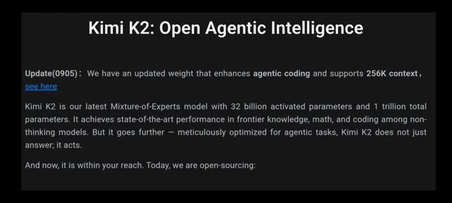
*Capture d'écran textuelle présentant l'annonce de Kimi K2 : Open Agentic Intelligence par Moonshot AI.*

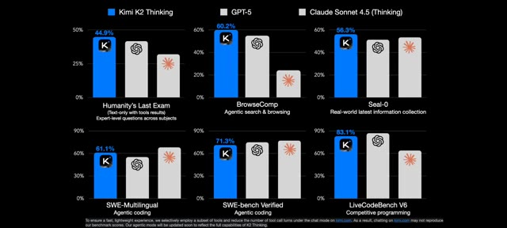
*Graphiques comparatifs des performances de Kimi K2 Thinking face à GPT-5 et Claude Sonnet 4.5 sur différents benchmarks.*

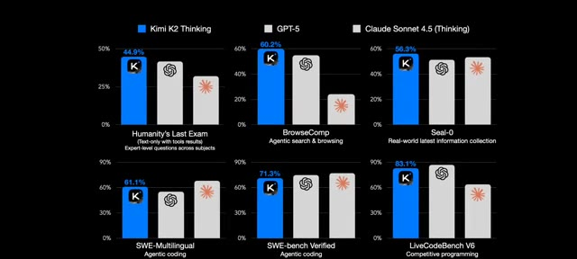
*Graphiques comparatifs identiques montrant les scores de Kimi K2 Thinking face à la concurrence.*

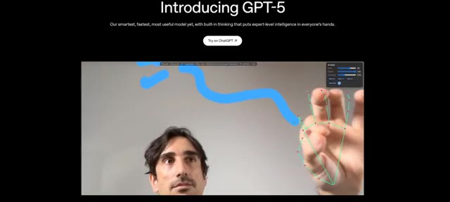
*Capture d'écran de l'annonce officielle de GPT-5 montrant une démo vidéo avec un suivi de main et un trait bleu.*

---

### ⏱️ `[00:00:23 - 00:00:47]` | Segment #02

**🔊 Audio (Transcription Intégrale Mot pour Mot en Français) :**
> Et vous verrez de vos propres yeux si ce modèle est l'avenir ou juste de la fumée marketing. C'est Pursuing AI et vous regardez le Research Report. Trouvons la vérité. Sur la page d'introduction de GPT-5, le premier exemple était le mini-jeu Rolling Ball. Et honnêtement, c'est impressionnant. Le nom du jeu apparaît, il y a un tableau des scores, un suivi du meilleur score, une option de vitesse et même un bouton de son fonctionnel.

**👁️ Analyse Visuelle d'Écran (gemini-3.5-flash-lite) :**
**Interface & Outils** : Navigateur web affichant la page d'introduction officielle de GPT-5 puis interface d'un mini-jeu interactif 2D.

**Contenu textuel & Code** : Textes visibles : "Introducing GPT-5", "Our smartest, fastest, most useful model yet...", "Try on ChatGPT", "The Research Report", et dans le jeu : "Jumping Ball Runner", "Score: 60", "Best: 306", "Speed: 608", "Muted".

**Action / Démonstration** : Présentation visuelle de la page de présentation de GPT-5, superposition du logo de la chaîne, puis démonstration du mini-jeu interactif avec affichage des scores et des options.

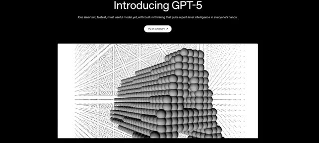
*Page web d'introduction de GPT-5 montrant une structure 3D sphérique et le titre "Introducing GPT-5".*

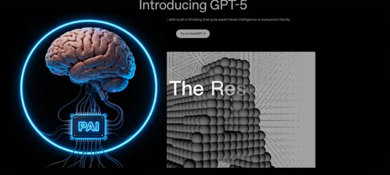
*Incrustation du logo "The Research Report" avec un cerveau robotisé et des connexions néon bleue à gauche de la page GPT-5.*

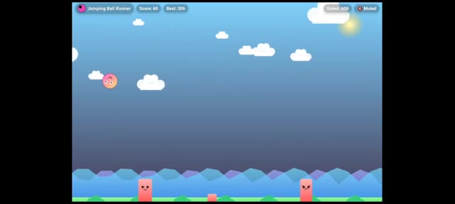
*Interface du mini-jeu "Jumping Ball Runner" avec le score, le meilleur score, l'option de vitesse et le bouton de son.*

---

### ⏱️ `[00:00:48 - 00:01:06]` | Segment #03

**🔊 Audio (Transcription Intégrale Mot pour Mot en Français) :**
> Vous pouvez couper ou rétablir le son en un clic. Et quand vous touchez les piliers, une fenêtre pop-up affiche "game over", votre score actuel, votre meilleur score, et une option pour réessayer comme dans un jeu soigné. D'ailleurs, je ne suis pas très doué à celui-ci, mais d'une manière ou d'une autre mon meilleur score est de 306. Et vous ? Quel est votre meilleur score ? Laissez un commentaire ci-dessous.

**👁️ Analyse Visuelle d'Écran (gemini-3.5-flash-lite) :**
**Interface & Outils** : Interface d'un mini-jeu web de type jeu de plateforme ou runner 2D.

**Contenu textuel & Code** : Textes visibles : "Jumping Ball Runner", "Score: 91" puis "133", "Best: 306", "Speed: 683" puis "268", "Muted", et sur le pop-up de fin : "Bonk! Game Over", "Score: 133", "Best: 306", bouton "Retry".

**Action / Démonstration** : Démonstration du mini-jeu en cours d'utilisation, illustrant le gameplay avec la boule qui saute par-dessus les obstacles puis l'apparition du pop-up de défaite lorsque le joueur percute un pilier.

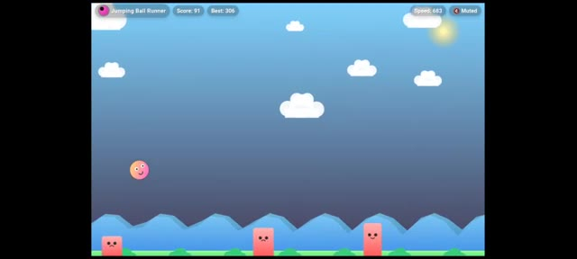
*Jeu vidéo 2D style runner montrant une boule rose sautant au-dessus de piliers dans un paysage de nuages, avec les scores affichés en haut.*

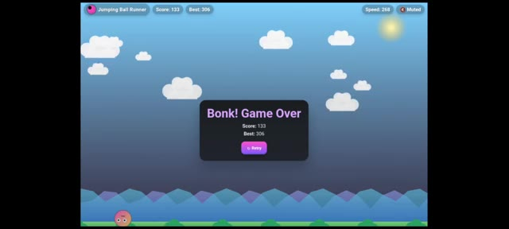
*Écran de fin de partie ("Game Over") affichant le score actuel de 133, le meilleur score de 306 et un bouton de réessai ("Retry").*

---

### ⏱️ `[00:01:06 - 00:01:27]` | Segment #04

**🔊 Audio (Transcription Intégrale Mot pour Mot en Français) :**
> Juste en dessous de cette démo, ils ont partagé le prompt exact utilisé pour générer le jeu avec GPT-5. J'ai donc copié le même prompt, l'ai collé dans Kimi K2, et par défaut K2 était sélectionné. Exécutons donc ceci. Kimi K2 commence à écrire du code. Je clique sur aperçu. Au début, ça a l'air correct. Tableau des scores, meilleur score, et la balle saute au clic.

**👁️ Analyse Visuelle d'Écran (gemini-3.5-flash-lite) :**
**Interface & Outils** : Interface de l'application Kimi avec affichage du code source et de l'aperçu en direct.

**Contenu textuel & Code** : Texte du prompt : "Create a single-page app in a single HTML file with the following requirements: - Name: Jumping Ball Runner - Goal: Jump over obstacles to survive as long as possible. - Features: Increasing speed, high score tracking, retry button, and funny sounds for actions and events. - The UI should be colorful, with parallax scrolling backgrounds. - The characters should look cartoonish and be fun to watch. - The game should be enjoyable for everyone."

**Action / Démonstration** : Le créateur copie-colle le prompt dans l'interface de Kimi K2, lance la génération du code et clique sur l'aperçu du jeu.

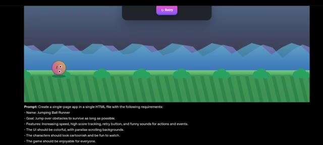
*Aperçu du jeu "Jumping Ball Runner" avec le prompt textuel affiché en bas.*

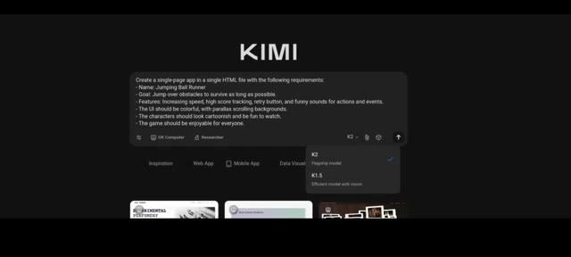
*Interface de Kimi montrant le prompt saisi et le menu déroulant de sélection des modèles (K2 et K1.5).*

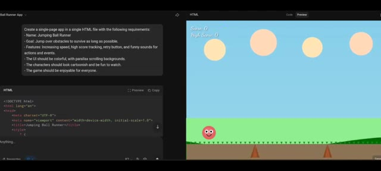
*Interface de Kimi divisée en deux avec le code HTML à gauche et l'aperçu du jeu avec le score et la balle rose à droite.*

---

### ⏱️ `[00:01:27 - 00:01:47]` | Segment #05

**🔊 Audio (Transcription Intégrale Mot pour Mot en Français) :**
> Mais après un moment, des problèmes surgissent. Pas de système de game over correct, la vitesse continue d'augmenter de manière incontrôlable et les piliers sont à moitié enterrés dans le sol. Aucune logique de game over présente. Kimi K2 a donc échoué à ce test. Et ensuite, j'ai exécuté exactement le même prompt sur GPT-5 et le résultat était parfait.

**👁️ Analyse Visuelle d'Écran (gemini-3.5-flash-lite) :**
**Interface & Outils** : Interface de développement web / éditeur de code avec panneau d'aperçu du jeu.

**Contenu textuel & Code** : Prompt visible : "Create a single-page app in a single HTML file with the following requirements: Name: Jumping Ball Runner, Goal: Jump over obstacles to survive as long as possible..." et code source HTML. Affichage du jeu avec score et personnages cartoon.

**Action / Démonstration** : Démonstration comparative du jeu généré montrant les bugs de Kimi K2 puis le résultat correct de GPT-5.

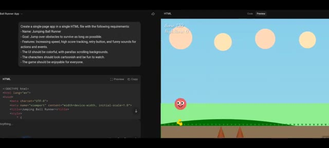
*Interface de développement montrant le code HTML et l'aperçu du jeu "Jumping Ball Runner" avec des défauts de génération par Kimi K2.*

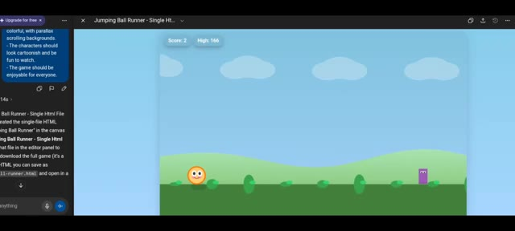
*Interface de GPT-5 affichant un résultat fonctionnel et soigné pour le jeu "Jumping Ball Runner".*

---

### ⏱️ `[00:01:47 - 00:02:08]` | Segment #06

**🔊 Audio (Transcription Intégrale Mot pour Mot en Français) :**
> Score, score élevé, et un système de fin de partie correct qui fonctionne parfaitement. Vient ensuite l'application Pixel Painting avec Crayon, Gomme, Remplissage de couleur, Affichage et Masquage de la grille, Annuler, Rétablir et une Palette de couleurs, le tout fonctionnant dans l'exemple de GPT-5. J'ai copié le prompt, je l'ai exécuté sur KimiK2 et en même temps sur Chantypt.

**👁️ Analyse Visuelle d'Écran (gemini-3.5-flash-lite) :**
**Interface & Outils** : Navigateur web affichant des applications web et des interfaces de génération de code IA.

**Contenu textuel & Code** : Textes d'interface, scores, application "Pixel Paint '99", options de grille, palette de couleurs, blocs de code HTML.

**Action / Démonstration** : Présentation des fonctionnalités de jeux et d'applications créées par intelligence artificielle.

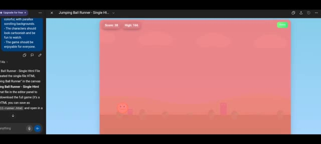
*Interface du jeu Jumping Ball Runner montrant le score et le meilleur score.*

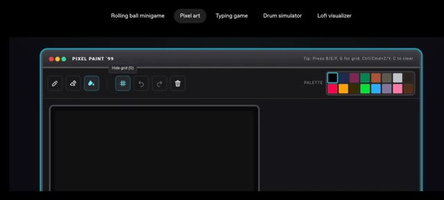
*Interface de l'application Pixel Paint '99 avec les outils de dessin et la palette de couleurs.*

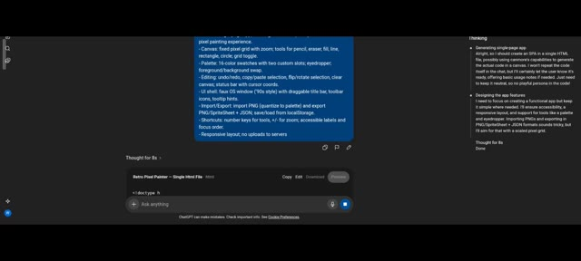
*Interface d'une application de génération de code affichant les blocs de prompts et le panneau de code HTML.*

---

### ⏱️ `[00:02:08 - 00:02:28]` | Segment #07

**🔊 Audio (Transcription Intégrale Mot pour Mot en Français) :**
> Les deux ont généré du code. L'interface utilisateur de KimiK2 est apparue mais les outils ne fonctionnaient pas. Pas de crayon, pas de gomme, pas de remplissage, rien. De l'autre côté, le résultat de ChatGPT a fonctionné. Le crayon a peint, Phil a appliqué la couleur sélectionnée, la toile a réagi de manière fluide. Donc encore une fois, Kimi K2 échoue ici.

**👁️ Analyse Visuelle d'Écran (gemini-3.5-flash-lite) :**
**Interface & Outils** : Double affichage : éditeur de code et application de peinture logicielle (PixelPaint Pro / Retro Pixel Painter).

**Contenu textuel & Code** : Code source HTML/CSS à gauche et interface d'une application de dessin pixel art dotée d'une barre d'outils, d'une palette de couleurs et d'une zone de canevas.

**Action / Démonstration** : Comparaison des performances des applications générées par IA, montrant l'échec des outils sur l'une et le fonctionnement correct sur l'autre.

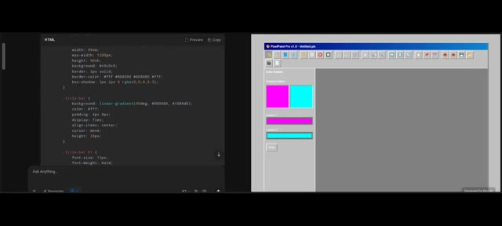
*Comparaison côte à côte montrant le code généré à gauche et l'interface utilisateur PixelPaint Pro à droite.*

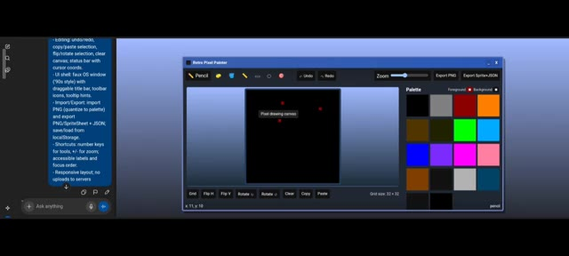
*Interface de Retro Pixel Painter fonctionnelle avec une palette de couleurs et une zone de dessin active à l'écran.*

---

### ⏱️ `[00:02:28 - 00:02:50]` | Segment #08

**🔊 Audio (Transcription Intégrale Mot pour Mot en Français) :**
> Et regardez, c'est open source, ce qui est génial, mais pour un modèle à 1 trillion de paramètres, rater une application HTML basique de travail ? De plus, la plupart d'entre nous ne peuvent pas exécuter cela localement. Bref, mon cerveau veut saturer mais je vais tenter un dernier test. La batterie virtuelle. De multiples pads et tonalités sonores, un contrôle du volume, enregistrer, lire et effacer.

**👁️ Analyse Visuelle d'Écran (gemini-3.5-flash-lite) :**
**Interface & Outils** : Navigateur web affichant d'abord la page du dépôt du modèle "moonshotai/Kimi-K2-Thinking", puis une application web interactive nommée "Virtual Drum Kit".

**Contenu textuel & Code** : Sur l'image 1 : la page de Kimi-K2-Thinking avec les onglets "Model card", "Files and versions", la section "Inference Providers" et une description textuelle ("1. Model Introduction"). Sur l'image 2 : l'application "Virtual Drum Kit" avec les touches Q, W, E, A, S, D, Z, X, C (Kick, Snare, Clap, Hi-Hat, Tom 1, Ride, Crash, Cowbell, Tom 2), des boutons de lecture (Play), d'enregistrement (Start Recording) et de sélection de kit (Classic Acoustic).

**Action / Démonstration** : Le créateur navigue entre la documentation technique du modèle open source et l'interface de test de l'application de batterie virtuelle générée.

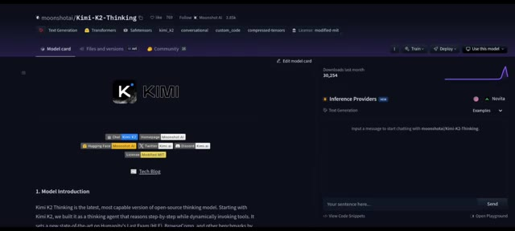
*Page de présentation du modèle open source Kimi-K2-Thinking sur une plateforme de type Hugging Face.*

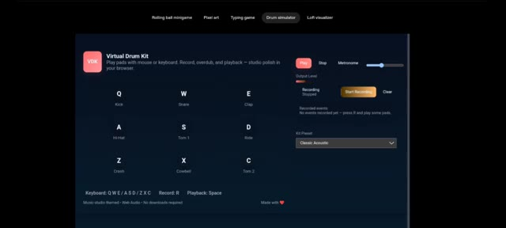
*Interface d'une application web interactive représentant une batterie virtuelle (Virtual Drum Kit) avec des pads de sons et des contrôles d'enregistrement.*

---

### ⏱️ `[00:02:50 - 00:03:17]` | Segment #09

**🔊 Audio (Transcription Intégrale Mot pour Mot en Français) :**
> cette fois je ne copierai pas le prompt d'OpenAI. J'ai écrit un prompt long et détaillé avec chaque instruction et je l'ai exécuté sur KimiK2. Côte à côte, j'ai donné le même long prompt à ChatGPT. Et étonnamment, KimiK2 a réussi. Il a généré des pads fonctionnels. Je pouvais augmenter et diminuer le volume, enregistrer et jouer ma musique, et tout effacer. Quand je clique sur enregistrer, oui, il a capturé chaque étape. Une application correcte sans problème.

**👁️ Analyse Visuelle d'Écran (gemini-3.5-flash-lite) :**
**Interface & Outils** : Interface textuelle et éditeur de prompt sur fond sombre.

**Contenu textuel & Code** : Texte du prompt : « Prompt: Create a single-page app in a single HTML file with the following requirements: - Name: Virtual Drum Kit - Goal: Play a drum kit using keyboard or clicks. - Features: Multiple drum sounds, record and playback mode. - The UI should be music-studio themed, polished, modern. Make it as beautiful as possible. » ainsi qu'une version plus détaillée du même prompt.

**Action / Démonstration** : Présentation à l'écran du prompt textuel long et structuré utilisé pour tester l'intelligence artificielle.

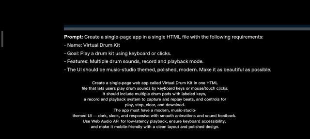
*Affichage du prompt détaillé contenant les instructions pour créer une application web de type kit de batterie virtuel en un seul fichier HTML.*

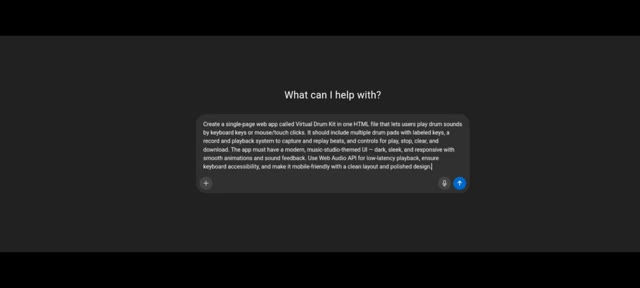
*Interface de type chatbot montrant le prompt saisi dans la zone de texte avec la question « What can I help with? ».*

---

### ⏱️ `[00:03:17 - 00:03:29]` | Segment #10

**🔊 Audio (Transcription Intégrale Mot pour Mot en Français) :**
> C'est donc tout pour mes recherches d'aujourd'hui. Si vous avez aimé, abonnez-vous, mettez un pouce bleu et commentez votre meilleur score au jeu de la balle rebondissante. C'est Pursuing AI, et je vous donne rendez-vous pour la prochaine plongée en profondeur.

**👁️ Analyse Visuelle d'Écran (gemini-3.5-flash-lite) :**
**Interface & Outils** : Interface du mini-jeu "Jumping Ball Runner" intégré ou développé dans le cadre de la vidéo.

**Contenu textuel & Code** : En haut à gauche, le titre "Jumping Ball Runner", le score actuel "Score: 117" et le meilleur score "Best: 306". En haut à droite, la vitesse "Speed: 724" et un bouton audio "Muted". Au centre, un décor de jeu en 2D avec un ciel dégradé, des nuages blancs, des montagnes stylisées au premier plan et des blocs obstacles roses. Une balle rose avec des yeux et un sourire est en suspension.

**Action / Démonstration** : Le mini-jeu de course de la balle rebondissante est affiché à l'écran, illustrant l'appel à l'action du créateur invitant les spectateurs à partager leur score.

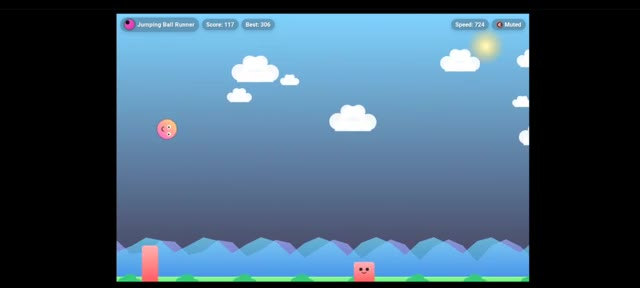
*Capture d'écran du mini-jeu de plateforme "Jumping Ball Runner" montrant une balle rose souriante en l'air au-dessus d'obstacles sur un fond de ciel bleu avec des nuages.*

---
