# 🎬 Tout ce que vous devez savoir sur GPT 5.1 : les détails complets

> **Chaîne** : [Pursuing AI](https://www.youtube.com/@PursuingAi)  
> **Titre original** : `GPT 5.1 Full Details — Everything You Need to Know`  
> **Lien YouTube** : [https://www.youtube.com/watch?v=HFq1xncPrIc](https://www.youtube.com/watch?v=HFq1xncPrIc)  
> **Date de publication** : 2025-11-14  
> **Durée** : 03m 10s (`190s`)  
> **Identifiant vidéo** : `HFq1xncPrIc`  
> **Fiche Web Interactive** : [2025-11-14_YT-HFq1xncPrIc_Tout ce que vous devez savoir sur GPT 5.1 les détails complets_by-whisper-v3-large-turbo+gemini-3.5-flash-lite.html](2025-11-14_YT-HFq1xncPrIc_Tout ce que vous devez savoir sur GPT 5.1 les détails complets_by-whisper-v3-large-turbo+gemini-3.5-flash-lite.html)  
> **Captures de démonstration clés** : `17 captures réelles (anti-talking-head)`  
> **Modèles utilisés** : Audio: `large-v3-turbo` (Faster-Whisper int8 VPS) | Vision: `gemini-3.5-flash-lite` (Google AI Studio API)  

---

## 📌 Synthèse Exécutive & Outils

### 📌 Résumé
La vidéo de *Pursuing AI* décortique la sortie officielle de **GPT-5.1**, annoncée par Sam Altman le 13 novembre en tant qu'évolution majeure de la gamme GPT-5 (sans pour autant constituer le saut générationnel attendu de GPT-6). Cette mise à jour se concentre principalement sur l'affinement du suivi des instructions, une pensée adaptative optimisée et une refonte du ton conversationnel. L'analyste met en lumière la stratégie d'OpenAI, qui segmente sa nouvelle offre avec deux versions phares : *GPT-5.1 Instant* pour des interactions plus chaleureuses et respectueuses des contraintes strictes, et *GPT-5.1 Thinking* pour des raisonnements profonds et dynamiques.

Sur le plan méthodologique, le créateur démontre l'efficacité du modèle à travers des tests de prompts rigoureux, comparant directement GPT-5 et GPT-5.1 sur des consignes complexes (comme la restriction stricte du nombre de mots ou l'utilisation d'un acrostiche phonétique). L'approche étape par étape montre comment exploiter l'adaptation automatique du ton et les paramètres de personnalisation pour basculer d'un registre formel à un ton amical sans friction, tout en optimisant le temps de calcul selon la difficulté de la tâche.

Pour les créateurs de vidéo et professionnels de l'IA, les bénéfices concrets sont immenses : réduction drastique des hallucinations, diminution du jargon technique superflux, et intégration fluide de ce nouveau standard dans l'ensemble des flux de travail (création de contenu, code, recherche). Le modèle s'impose ainsi comme un catalyseur d'efficacité, offrant des réponses plus humaines, des résultats plus propres et une adaptabilité contextuelle inédite qui redéfinit les standards de l'assistance générative.

### 🛠️ Outils, Modèles & Logiciels Présentés
* **GPT-5.1** : Modèle de langage phare d'OpenAI apportant des améliorations globales de l'intelligence, du style et du suivi des instructions par rapport à la version précédente.
* **GPT-5.1 Instant** : Modèle conversationnel par défaut, plus chaleureux, conçu pour répondre rapidement tout en respectant strictement les contraintes de format et de consignes.
* **GPT-5.1 Thinking** : Version dotée d'un mode de réflexion amélioré, qui alloue dynamiquement son temps de calcul (plus long sur les tâches complexes, plus court sur les tâches simples) pour délivrer des résultats précis.
* **GPT-6** : Prochaine génération majeure évoquée comme point de comparaison pour situer l'ampleur relative de la mise à jour 5.1.
* **Flux** : Écosystème de travail et d'applications d'IA adopté par l'industrie pour intégrer les performances du nouveau standard GPT-5.1.

### 🔑 Points Clés & Enseignements Stratégiques
* **Distinction générationnelle** : Comprendre que GPT-5.1 est un raffinement (polissage, optimisation) et non un remplacement total comparable au futur saut vers GPT-6.
* **Rigueur dans le suivi des instructions** : Le modèle Instant surpasse son prédécesseur dans l'application stricte de contraintes formelles, comme l'a démontré le test de limitation exacte à six mots.
* **Maîtrise des contraintes lexicales** : Capacité accrue à exécuter des consignes créatives et restrictives complexes, telles que la rédaction d'un texte entier en n'utilisant que des mots commençant par une lettre spécifique.
* **Allocation dynamique du raisonnement** : Le modèle *Thinking* calibre son temps de réflexion en fonction de la complexité réelle de la tâche pour optimiser la précision des résultats.
* **Allègement du style rédactionnel** : Les réponses générées sont plus nettes, plus claires et débarrassées du jargon technique inutile.
* **Adaptabilité automatique du ton** : L'IA analyse le contexte pour ajuster spontanément son niveau de formalité ou sa chaleur relationnelle selon les attentes implicites de l'utilisateur.
* **Personnalisation granulaire** : Possibilité de configurer manuellement le profil de ton (professionnel, franc, amical) dans les paramètres pour un contrôle absolu de la voix du modèle.
* **Standardisation des flux de travail** : L'adoption rapide de GPT-5.1 par les outils tiers garantit des résultats plus propres et plus rapides dans tous les cas d'usage (codage, recherche, création).
* **Amélioration de la fiabilité contextuelle** : Les interactions paraissent nettement plus humaines, réduisant le sentiment de rigidité robotique souvent reproché aux anciennes versions.
* **Piège à éviter** : Ne pas traiter GPT-5.1 avec les anciens réflexes de prompteur ; ses capacités de suivi strict exigent de tester de nouvelles limites de contraintes (longueur, vocabulaire) pour en tirer la quintessence.

---

## ⏱️ Chronologie & Transcription Complète Audio & Visuelle (Mot pour Mot)

### ⏱️ `[00:00:00 - 00:00:22]` | Segment #01

**🔊 Audio (Transcription Intégrale Mot pour Mot en Français) :**
> OpenAI vient de sortir GPT 5.1, et voici quelques éléments que vous devez savoir. C'est Pursuing AI, et vous regardez le Research Report. Le 13 novembre, Sam Altman a officiellement posté sur X et a déclaré que GPT 5.1 est sorti, et que c'est une belle mise à jour. Il a dit qu'il aimait beaucoup le suivi des instructions, la pensée adaptative, ainsi que les améliorations globales de l'intelligence et du style du modèle.

**👁️ Analyse Visuelle d'Écran (gemini-3.5-flash-lite) :**
**Interface & Outils** : Capture d'écran d'une page web d'annonce et capture d'interface du réseau social X.

**Contenu textuel & Code** : Texte de l'annonce : "November 12, 2025 Product Release. GPT-5.1: A smarter, more conversational ChatGPT. We're upgrading GPT-5 while making it easier to customize ChatGPT. Starting to roll out today to everyone, beginning with paid users. Try in ChatGPT". Tweet de Sam Altman : "GPT-5.1 is out! It's a nice upgrade. I particularly like the improvements in instruction following, and the adaptive thinking. The intelligence and style improvements are good too."

**Action / Démonstration** : Présentation visuelle de l'annonce officielle et du tweet de Sam Altman illustrant la sortie de GPT-5.1.

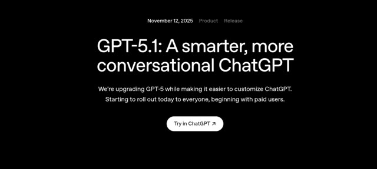
*Page web d'annonce officielle d'OpenAI pour le lancement de GPT-5.1.*

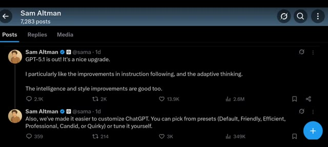
*Publication sur le réseau social X (anciennement Twitter) de Sam Altman annonçant la sortie de GPT-5.1.*

---

### ⏱️ `[00:00:23 - 00:00:42]` | Segment #02

**🔊 Audio (Transcription Intégrale Mot pour Mot en Français) :**
> Maintenant, la première chose que vous devez comprendre est celle-ci. GPT-5.1 n'est pas un saut énorme comme GPT-6. C'est simplement une mise à niveau dans la série GPT-5. Ils ont amélioré sa capacité à suivre les instructions et la façon intelligente dont il s'adapte en réfléchissant. Ne pensez donc pas à cela comme à une mise à niveau majeure de version. Pensez-y comme à un GPT-5 poli et amélioré.

**👁️ Analyse Visuelle d'Écran (gemini-3.5-flash-lite) :**
**Interface & Outils** : Pages web de présentation officielle d'OpenAI et graphiques statistiques sur fond sombre.

**Contenu textuel & Code** : Texte affiché : "GPT-5.1: A smarter, more conversational ChatGPT", "We're upgrading GPT-5 while making it easier to customize ChatGPT. Starting to roll out today to everyone, beginning with paid users." et graphique comparatif des tokens générés par réponse selon les percentiles (10e à 90e).

**Action / Démonstration** : Affichage successif des annonces de fonctionnalités et des graphiques comparatifs des performances de GPT-5.1.

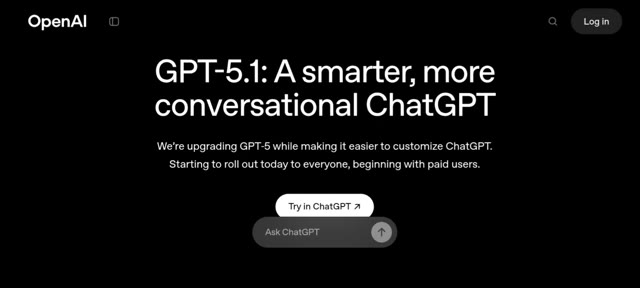
*Page d'accueil d'OpenAI annonçant le lancement de GPT-5.1 avec le titre 'A smarter, more conversational ChatGPT'.*

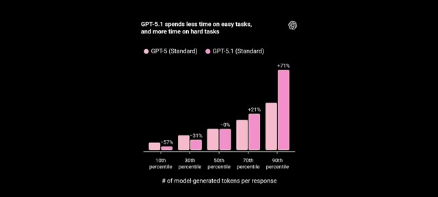
*Graphique comparatif montrant que GPT-5.1 passe moins de temps sur les tâches faciles et plus de temps sur les tâches complexes par rapport à GPT-5 Standard.*

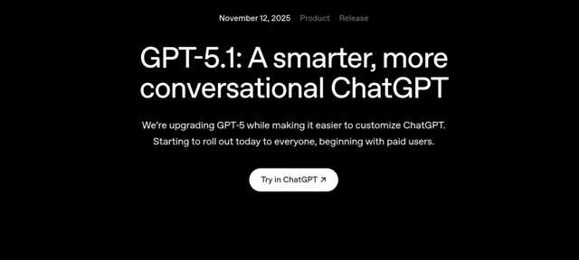
*Page d'annonce officielle d'OpenAI datée du 12 novembre 2025 pour GPT-5.1 avec le bouton 'Try in ChatGPT'.*

---

### ⏱️ `[00:00:43 - 00:01:04]` | Segment #03

**🔊 Audio (Transcription Intégrale Mot pour Mot en Français) :**
> On their GPT-5.1 introduction page, OpenAI explains how they've upgraded the GPT-5 family with the new GPT-5.1 Instant and GPT-5.1 Thinking models. Their instant model is warmer by default, more conversational, and much better at following instructions. They even showed a few comparison examples with GPT-5.

**👁️ Analyse Visuelle d'Écran (gemini-3.5-flash-lite) :**
**Interface & Outils** : le créateur face caméra ou transition sans partage d'écran.

**Contenu textuel & Code** : Explications orales des concepts et des méthodes de création vidéo IA.

**Action / Démonstration** : Démonstration pédagogique et présentation du workflow.

---

### ⏱️ `[00:01:04 - 00:01:25]` | Segment #04

**🔊 Audio (Transcription Intégrale Mot pour Mot en Français) :**
> Voici un exemple qui montre vraiment l'amélioration. Ils ont donné à la fois à GPT-5 et à GPT-5.1 Instant la même instruction. Réponds toujours en six mots. GPT-5 l'a suivi pour la première ligne et a ensuite écrit tout un paragraphe en dessous sur l'exploration du Japon. Mais GPT 5.1 instant a répondu uniquement en 6 mots, exactement comme demandé.

**👁️ Analyse Visuelle d'Écran (gemini-3.5-flash-lite) :**
**Interface & Outils** : Interface de comparaison de modèles de type interface de chat (ChatGPT) avec deux panneaux côte à côte : "GPT-5" à gauche et "GPT-5.1 Instant" à droite.

**Contenu textuel & Code** : En haut, l'instruction visible : "Always respond with six words". Dans le panneau GPT-5 : la consigne est respectée sur la première ligne (« Understood. All responses will be six. »), puis le modèle échoue en rédigeant un paragraphe entier sur le Japon. Dans le panneau GPT-5.1 Instant : la consigne est rigoureusement suivie avec des réponses strictes de six mots (« Understood, I will respond in six. », « Consider Japan, Italy, Greece, Canada, Iceland. », « Scenery culture cuisine climate friendly locals. »).

**Action / Démonstration** : Comparaison visuelle des performances des deux modèles suite à une instruction de formatage stricte.

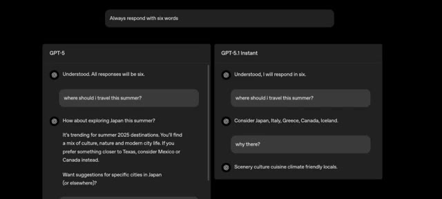
*Comparaison côte à côte des interfaces de GPT-5 et GPT-5.1 Instant illustrant le respect de la consigne des six mots.*

---

### ⏱️ `[00:01:25 - 00:01:45]` | Segment #05

**🔊 Audio (Transcription Intégrale Mot pour Mot en Français) :**
> Cela montre clairement à quel point le nouveau modèle est meilleur pour suivre les instructions. J'ai également testé cela en lui donnant une instruction simple mais délicate : Expliquez l'IA en utilisant uniquement des mots commençant par la lettre S. Et il l'a réellement fait, parfaitement. Cela montre à quel point le nouveau modèle est devenu précis. Maintenant, une autre mise à niveau est le modèle de réflexion GPT 5.1.

**👁️ Analyse Visuelle d'Écran (gemini-3.5-flash-lite) :**
**Interface & Outils** : Interface sombre de ChatGPT (versions GPT-5, GPT-5.1 Instant et GPT-5.1 Thinking).

**Contenu textuel & Code** : Texte affichant les prompts de test : "Always respond with six words", "where should i travel this summer?", "Explain AI using only words that start with the letter S", ainsi qu'un graphique en barres roses illustrant l'évolution du temps de traitement entre GPT-5 et GPT-5.1 selon les percentiles (10e, 30e, 50e, 70e, 90e).

**Action / Démonstration** : Démonstration comparative des capacités de suivi des instructions et des performances de réflexion des modèles GPT-5 et GPT-5.1.

*Comparaison d'interface entre GPT-5 et GPT-5.1 Instant sur des requêtes de voyage avec des contraintes spécifiques.*

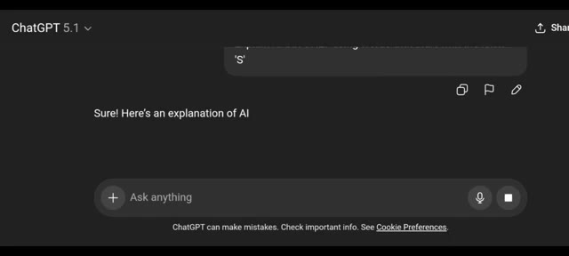
*Interface de ChatGPT 5.1 montrant la réponse de l'IA à la consigne complexe sur l'intelligence artificielle.*

*Présentation textuelle et graphique des performances du modèle GPT-5.1 Thinking comparé au standard.*

---

### ⏱️ `[00:01:45 - 00:02:05]` | Segment #06

**🔊 Audio (Transcription Intégrale Mot pour Mot en Français) :**
> C'est fondamentalement la version améliorée du mode de réflexion de GPT 5. Il passe plus de temps sur les tâches complexes et moins de temps sur les tâches simples, ce qui signifie qu'il réfléchit de manière plus approfondie lorsque c'est nécessaire et vous donne des résultats plus précis. Ils ont également indiqué que les réponses sont plus claires, plus nettes et contiennent moins de jargon. Et comme vous pouvez le voir dans cet exemple. Et la dernière chose que vous devez savoir concerne l'amélioration du ton.

**👁️ Analyse Visuelle d'Écran (gemini-3.5-flash-lite) :**
**Interface & Outils** : Présentation de diapositives ou d'articles officiels sur les nouveautés de l'interface et des modèles OpenAI (fond noir avec texte blanc).

**Contenu textuel & Code** : Image 1 : Titre "GPT-5.1 Thinking", texte explicatif sur l'efficacité et le temps de réflexion selon la difficulté de la tâche, et graphique en barres roses illustrant les temps de réponse ("10th percentile" à "90th percentile"). Image 2 : Titre "Making ChatGPT uniquely yours", texte décrivant l'amélioration du ton et du style avec mention des options : Default, Friendly, Efficient, Professional, Candid, et Quirky.

**Action / Démonstration** : Le créateur affiche des captures d'écran de notes de version ou d'annonces officielles décrivant les mises à jour de ChatGPT (modèle de réflexion et tons de voix).

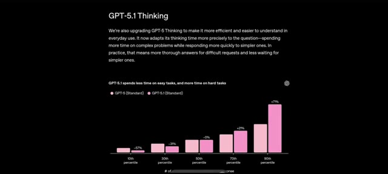
*Capture d'écran montrant une présentation textuelle et un graphique sur le mode "GPT-5.1 Thinking" comparant les performances entre GPT-5 (Standard) et GPT-5.1 (Standard).*

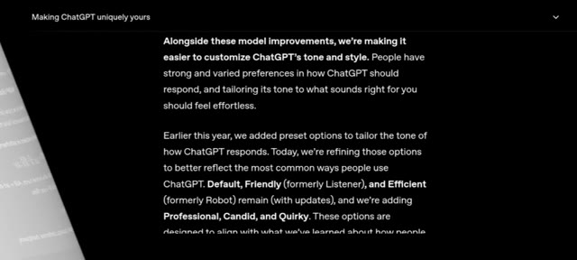
*Capture d'écran textuelle sur fond noir intitulée "Making ChatGPT uniquely yours", détaillant les options de personnalisation du ton et du style de ChatGPT.*

---

### ⏱️ `[00:02:05 - 00:02:37]` | Segment #07

**🔊 Audio (Transcription Intégrale Mot pour Mot en Français) :**
> Il comprend comment vous voulez qu'on vous parle et s'adapte automatiquement. Si vous préférez un ton amical, il reste amical. Si vous voulez quelque chose de plus formel ou direct, il suit également cette voie. Vous pouvez même le personnaliser vous-même. Ouvrez les paramètres de personnalisation et choisissez le ton que vous voulez. Professionnel, franc, amical, et de nombreuses autres options. Mais voici la partie la plus passionnante. GPT 5.1 n'est pas seulement une mise à niveau. C'est un nouveau standard. Les outils, les applications et les flux de travail d'IA commencent déjà à l'adopter, ce qui signifie que vous allez

**👁️ Analyse Visuelle d'Écran (gemini-3.5-flash-lite) :**
**Interface & Outils** : Documentation officielle de ChatGPT et application mobile sur fond rose et bleu pastel.

**Contenu textuel & Code** : Texte décrivant l'amélioration des options de ton et de style : "Making ChatGPT uniquely yours", "Default, Friendly, and Efficient remain, and we're adding Professional, Candid, and Quirky." Sur l'écran mobile : profil utilisateur "Faith Lawrence", options "Email", "Workspace", "Subscription", "Orders", "Personalization".

**Action / Démonstration** : Présentation des notes de mise à jour textuelles suivies d'une navigation dans les paramètres de l'application mobile pour accéder à la personnalisation.

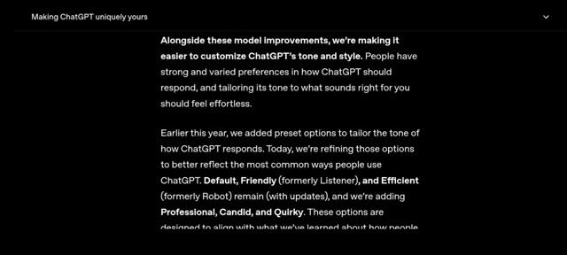
*Page de documentation textuelle expliquant la personnalisation du ton et du style de ChatGPT.*

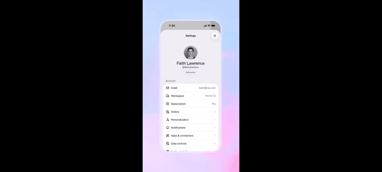
*Interface mobile affichant le menu des paramètres d'un compte avec l'option de personnalisation.*

---

### ⏱️ `[00:02:37 - 00:02:57]` | Segment #08

**🔊 Audio (Transcription Intégrale Mot pour Mot en Français) :**
> voir des réponses plus rapides, des résultats plus propres et des résultats bien plus précis dans tout ce que vous utilisez. Que vous créiez du contenu, codiez, fassiez des recherches ou simplement discutiez, GPT 5.1 s'adapte à votre style et vous offre des réponses qui semblent plus humaines et plus fiables que jamais auparavant.

**👁️ Analyse Visuelle d'Écran (gemini-3.5-flash-lite) :**
**Interface & Outils** : Interface de ChatGPT sur mobile et page web de publication de produit OpenAI.

**Contenu textuel & Code** : Texte à l'écran : "GPT-5.1: A smarter, more conversational ChatGPT", "November 12, 2025 Product Release", et graphiques de performance avec pourcentages (-57%, -31%, -0%, +21%, +71%).

**Action / Démonstration** : Démonstration visuelle de l'interface mobile de l'application et affichage des graphiques statistiques de performances comparatives du modèle d'intelligence artificielle.

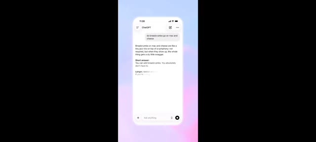
*Interface mobile de ChatGPT montrant une conversation avec une réponse formatée sur le fromage et les macaronis.*

*Graphique comparatif illustrant que GPT-5.1 passe moins de temps sur les tâches faciles et plus de temps sur les tâches difficiles par rapport à GPT-5.*

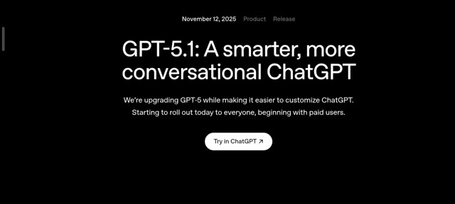
*Page de présentation de la mise à jour officielle de GPT-5.1 avec le titre indiquant qu'il s'agit d'un ChatGPT plus intelligent et conversationnel.*

---

### ⏱️ `[00:02:57 - 00:03:09]` | Segment #09

**🔊 Audio (Transcription Intégrale Mot pour Mot en Français) :**
> Gardez donc un œil sur cet espace car le monde de l'IA est sur le point d'évoluer encore plus vite. C'est Pursuing AI et je serai de retour avec plus de mises à jour, plus de tests et plus de recherches très bientôt.

**👁️ Analyse Visuelle d'Écran (gemini-3.5-flash-lite) :**
**Interface & Outils** : Page web officielle d'annonce de produit OpenAI sur fond sombre.

**Contenu textuel & Code** : Texte affiché : "November 12, 2025 Product Release", "GPT-5.1: A smarter, more conversational ChatGPT", "We're upgrading GPT-5 while making it easier to customize ChatGPT. Starting to roll out today to everyone, beginning with paid users.", ainsi qu'un bouton "Try in ChatGPT ↗".

**Action / Démonstration** : Affichage de la page d'annonce officielle de la mise à jour GPT-5.1.

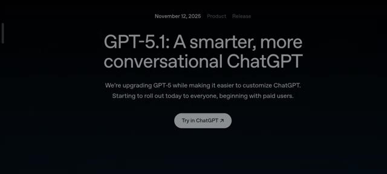
*Page de présentation officielle d'OpenAI annonçant la sortie de GPT-5.1.*

---
