# 🎬 Les fuites de Nano Banana 2 deviennent incontrôlables…

> **Chaîne** : [Pursuing AI](https://www.youtube.com/@PursuingAi)  
> **Titre original** : `Nano Banana 2 Leaks Are Getting Out of Control…`  
> **Lien YouTube** : [https://www.youtube.com/watch?v=mhryTXdg0S4](https://www.youtube.com/watch?v=mhryTXdg0S4)  
> **Date de publication** : 2025-11-17  
> **Durée** : 03m 00s (`180s`)  
> **Identifiant vidéo** : `mhryTXdg0S4`  
> **Fiche Web Interactive** : [2025-11-17_YT-mhryTXdg0S4_Les fuites de Nano Banana 2 deviennent incontrôlables…_by-whisper-v3-large-turbo+gemini-3.5-flash-lite.html](2025-11-17_YT-mhryTXdg0S4_Les fuites de Nano Banana 2 deviennent incontrôlables…_by-whisper-v3-large-turbo+gemini-3.5-flash-lite.html)  
> **Captures de démonstration clés** : `19 captures réelles (anti-talking-head)`  
> **Modèles utilisés** : Audio: `large-v3-turbo` (Faster-Whisper int8 VPS) | Vision: `gemini-3.5-flash-lite` (Google AI Studio API)  

---

## 📌 Synthèse Exécutive & Outils

### 📌 Résumé
La vidéo de *Pursuing AI* lève le voile sur les fuites et les premières générations exclusives du très attendu modèle **Nano Banana 2** de Google, actuellement testé en circuit fermé par des créateurs et des plateformes sélectionnés. Ce rapport de recherche met en lumière une avancée technologique majeure dans le domaine de la génération d'images et de vidéos par IA, notamment en matière de cohérence textuelle, de réalisme anatomique et de gestion des détails complexes qui mettaient jusqu'à présent tous les modèles concurrents en échec. Le créateur structure sa démonstration en comparant frontalement les résultats de Nano Banana 2 avec les cadors du marché (ChatGPT, Grok, Human Image 3.0 et Seadream 4 High Resolution), prouvant la supériorité flagrante du nouveau modèle sur des cas d'usage réputés impossibles.

Sur le plan technique, la méthode du créateur repose sur l'analyse comparative de prompts d'extrême précision appliqués à l'ensemble de ces générateurs pour isoler les failles des IA actuelles face aux prouesses de Nano Banana 2. À travers l'examen de cas pratiques — comme le rendu parfait d'une heure précise sur le cadran d'une montre, l'intégration de texte complexe sur des surfaces en perspective (murs, feuilles de papier) ou encore la génération ultra-réaliste de visages de célébrités et de personnages de fiction —, la vidéo décortique les capacités brutes du modèle. Cette démarche méthodique permet de cartographier avec précision le fossé qualitatif qui sépare cette nouvelle version des standards actuels de l'industrie.

Pour les créateurs de contenu vidéo et les spécialistes de l'IA, les bénéfices de cette fuite sont considérables. Non seulement Nano Banana 2 redéfinit les attentes en matière de photoréalisme et de fidélité textuelle, mais il préfigure également un changement radical dans les workflows de production visuelle. La capacité du modèle à maintenir un réalisme saisissant sur des animations et à générer des visages de célébrités sans artéfacts — avant une censure publique inévitable lors de sa sortie officielle — offre des perspectives créatives inédites. Cette analyse offre ainsi aux professionnels une vision anticipée des standards de qualité qui domineront le marché dès le lancement public de l'outil.

### 🛠️ Outils, Modèles & Logiciels Présentés
* **Nano Banana 2** : Modèle d'IA de nouvelle génération de Google (actuellement en phase de test privé) surpassant la concurrence en matière de réalisme, de rendu de texte complexe et de génération de visages.
* **ChatGPT** : Modèle conversationnel et générateur d'images d'OpenAI utilisé ici comme point de comparaison, montrant ses limites sur le rendu textuel et le respect des détails de la foule.
* **Grok** : Modèle d'IA d'xAI testé dans le comparatif, capable de générer du texte mais sujet à des biais de représentation (tendance à attribuer les traits d'Elon Musk).
* **Human Image 3.0** : Générateur d'images utilisé dans le benchmark concurrentiel pour évaluer la précision horaire et textuelle face à Nano Banana 2.
* **Seadream 4 High Resolution (ou Seadream 4K)** : Modèle d'imagerie haute résolution également mis en échec lors des tests comparatifs face aux performances de Nano Banana 2.

### 🔑 Points Clés & Enseignements Stratégiques
* **Supériorité absolue sur le rendu textuel** : Nano Banana 2 est le premier modèle capable d'afficher un texte parfaitement exact sur des supports complexes (murs en perspective, feuilles de papier tenues en main) sans aucune distorsion orthographique.
* **Résolution du défi horloger** : Le modèle surmonte l'un des plus grands écueils des générateurs d'images actuels en affichant l'heure exacte et cohérente (comme 6:32) sur le cadran d'une montre.
* **Gestion avancée de la perspective** : L'IA démontre une capacité inédite à appliquer du texte et des motifs tout en respectant une rotation de caméra à 30 degrés, garantissant un ancrage visuel réaliste.
* **Intégration d'éléments cachés complexes** : Le modèle réussit haut la main des prompts sophistiqués impliquant de dissimuler des solutions de énigmes ou des indices directement à l'intérieur de traits anatomiques (comme le visage du Père Noël).
* **Benchmark concurrentiel impitoyable** : Les tests croisés avec ChatGPT, Grok et Seadream 4K révèlent que les autres IA échouent systématiquement (images en noir et blanc, foule manquante, yeux fermés ou hallucinations de visages non désirés).
* **Photoréalisme de niveau supérieur** : Le réalisme des images générées est tel qu'il élimine les artefacts visuels typiques de l'IA, rendant les productions indiscernables de véritables photographies.
* **Génération de visages de célébrités non censurés** : En phase de test bêta, le modèle génère des figures publiques (Elon Musk, IShowSpeed) avec une précision photographique effrayante, un niveau de liberté qui sera inévitablement bridé par des filtres de censure lors du lancement officiel.
* **Performances exceptionnelles en animation** : Au-delà de l'image fixe, le modèle transpose son ultra-réalisme à la vidéo animée (comme le personnage de Goku), offrant un rendu fluide et organique "directement réel".
* **Fenêtre d'opportunité des versions bêta** : L'analyse souligne l'intérêt stratégique d'étudier les fuites et versions de test des IA, souvent dépourvues des garde-fous et des restrictions de sécurité imposées lors des versions grand public.
* **Anticipation des workflows futurs** : L'arrivée imminente de Nano Banana 2 oblige les créateurs de contenu à revoir leurs exigences de prompt engineering et à se préparer à des standards de qualité visuelle radicalement rehaussés.

---

## ⏱️ Chronologie & Transcription Complète Audio & Visuelle (Mot pour Mot)

### ⏱️ `[00:00:00 - 00:00:21]` | Segment #01

**🔊 Audio (Transcription Intégrale Mot pour Mot en Français) :**
> Google se prépare à lancer Nano Banana 2, mais avant la grande sortie, ils le confient discrètement à certaines plateformes et créateurs sélectionnés. Et bien sûr, les gens commencent à le tester comme des fous. Aujourd'hui, je me suis plongé dans ces premières générations et ce que j'ai trouvé est absolument insensé. C'est Pursuing AI et vous regardez le Research Report.

**👁️ Analyse Visuelle d'Écran (gemini-3.5-flash-lite) :**
**Interface & Outils** : Présentation face caméra et extraits visuels d'illustration (générations d'images IA) sans interface logicielle active démontrée.

**Contenu textuel & Code** : Textes illustratifs affichés à l'écran : "Nano Banana 2", "I AM SORRY JON.", ainsi que le logo de la chaîne "PAI" avec un cerveau relié à une puce et le titre "The Research Report".

**Action / Démonstration** : Affichage d'illustrations générées par IA et de séquences d'introduction de la chaîne vidéo.

---

### ⏱️ `[00:00:21 - 00:00:40]` | Segment #02

**🔊 Audio (Transcription Intégrale Mot pour Mot en Français) :**
> C'est le genre d'exemple qui brise presque tous les générateurs d'images du marché. Aucun modèle ne peut rendre parfaitement l'heure sur une montre, comme 6:32, sans se tromper. Mais Nano Banana 2 le peut. J'ai testé exactement le même prompt sur ChatGPT, Grok, Human Image 3.0, Seadream 4 High Resolution.

**👁️ Analyse Visuelle d'Écran (gemini-3.5-flash-lite) :**
**Interface & Outils** : Présentation vidéo comparative avec des captures d'écran de résultats de génération d'images.

**Contenu textuel & Code** : Texte du prompt en haut : "generate an image of a watch showing 6:32". Noms des modèles affichés sur les images : Seadr..., Grok, CHATGPT, Hunyan.

**Action / Démonstration** : Affichage comparatif des images de montres générées par divers modèles d'intelligence artificielle pour illustrer leurs limites à afficher correctement l'heure demandée.

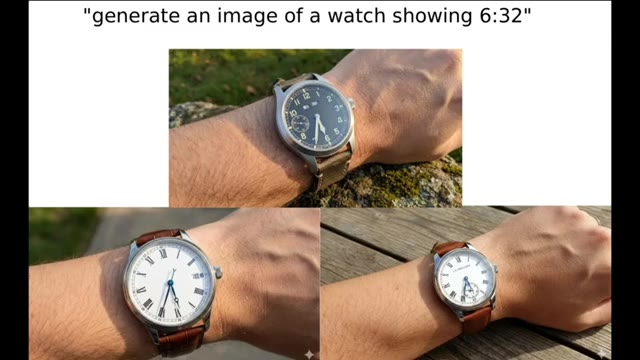
*Présentation de plusieurs images de montres générées par IA avec le prompt textuel en haut.*

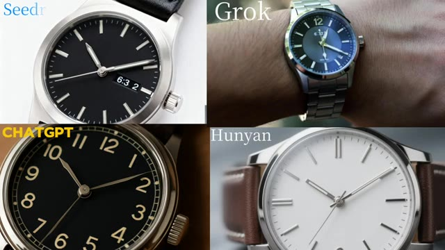
*Comparaison côte à côte des résultats de différents modèles d'IA pour le rendu de la montre.*

---

### ⏱️ `[00:00:40 - 00:00:58]` | Segment #03

**🔊 Audio (Transcription Intégrale Mot pour Mot en Français) :**
> Chaque modèle a échoué. Seul Nano Banana 2 a réussi. Ensuite, regardez cet exemple. Il montre à quel point Nano Banana 2 est doué pour rendre du texte sur les murs. Le modèle a pivoté la caméra de 30 degrés et a quand même écrit le texte exact parfaitement, exactement comme le demandait le prompt.

**👁️ Analyse Visuelle d'Écran (gemini-3.5-flash-lite) :**
**Interface & Outils** : Écran de présentation vidéo comparatif affichant des exemples de rendus de différents modèles d'IA et des prompts textuels.

**Contenu textuel & Code** : Noms des modèles affichés (Seedream, Grok, CHATGPT, Hunyan) et texte du prompt : "write this sentence on the wall and rotate camera 30 degrees left: 'new work even of sometimes out time make no will have see then now say garden the into would him on day can other tomorrow go some get it up'".

**Action / Démonstration** : Comparaison visuelle des performances de différents modèles d'intelligence artificielle sur le rendu d'éléments complexes comme des cadrans de montres et du texte sur des murs avec mouvement de caméra.

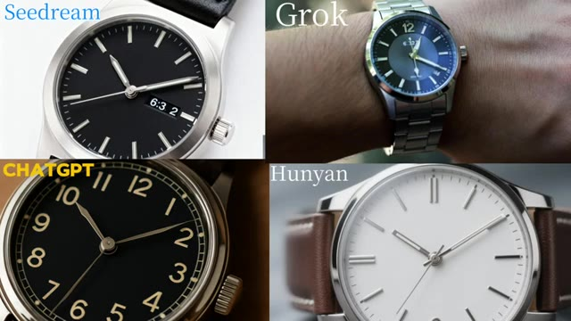
*Comparaison de quatre modèles différents (Seedream, Grok, ChatGPT, Hunyan) générant des images de montres.*

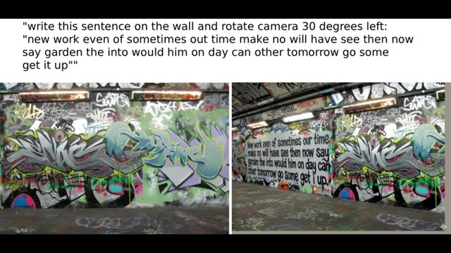
*Démonstration du prompt textuel demandant d'écrire une phrase sur un mur avec une rotation de caméra de 30 degrés, illustrée par deux rendus de murs graffités.*

---

### ⏱️ `[00:00:58 - 00:01:18]` | Segment #04

**🔊 Audio (Transcription Intégrale Mot pour Mot en Français) :**
> Et puis il y a celle-ci. Elle a généré une image où la solution de la question est cachée à l'intérieur du visage du Père Noël et elle a réussi haut la main. Trop fort. Ensuite, regardez cet exemple. Vous voyez le papier dans la main de l'homme ? Le texte sur ce papier est également parfaitement exact. J'ai essayé les mêmes invites sur ChatGPT, Grok et Seadream 4K.

**👁️ Analyse Visuelle d'Écran (gemini-3.5-flash-lite) :**
**Interface & Outils** : Présentation vidéo de démonstration d'IA générative d'images.

**Contenu textuel & Code** : Texte mathématique sur tableau noir ("Theorem: √2 is irrational... Q.E.D."). Prompt textuel : "a man holds up a letter on a podium, he is in front of a crowd, the letter says 'I have a dream...'". Texte sur les pancartes des images générées comparant différentes IA (ChatGPT, Grok, Seadream 4K).

**Action / Démonstration** : Le présentateur illustre ses propos en affichant des exemples d'images générées par IA démontrant la précision de rendu du texte textuel.

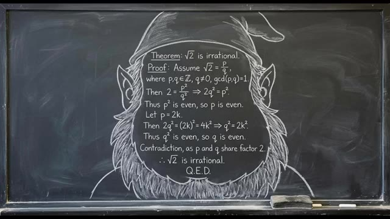
*Image générée par IA montrant un tableau noir avec une démonstration mathématique encadrée dans la barbe et le bonnet d'un personnage de type Père Noël.*

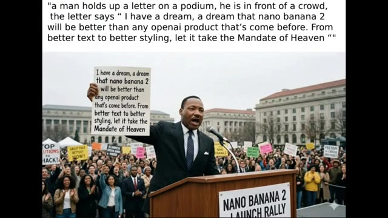
*Exemple d'image générée par IA montrant un homme derrière un pupitre tenant une pancarte avec du texte, accompagnée du prompt textuel au-dessus.*

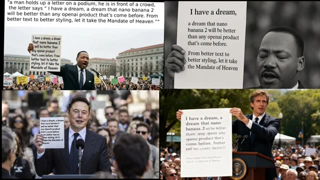
*Comparatif en quatre panneaux affichant différents essais de génération d'images avec des personnalités tenant des pancrates textuelles.*

---

### ⏱️ `[00:01:18 - 00:01:38]` | Segment #05

**🔊 Audio (Transcription Intégrale Mot pour Mot en Français) :**
> ChatGPT a bien produit une image similaire, mais elle était en noir et blanc, la foule manquait, et les yeux de la personne étaient fermés. Grok, je n'ai aucune idée pourquoi il a généré un visage ressemblant à Elon Musk. Oui, il a réussi le texte, et la génération de Grok est bonne. Mais comparé à tout cela, la génération de Nano Banana 2 est à un autre niveau.

**👁️ Analyse Visuelle d'Écran (gemini-3.5-flash-lite) :**
**Interface & Outils** : Interface de présentation comparative de résultats d'IA générative.

**Contenu textuel & Code** : Le prompt textuel affiché en haut à gauche : "a man holds up a letter on a podium, he is in front of a crowd, the letter says 'I have a dream, a dream that nano banana 2 will be better than any openai product that's come before. From better text to better styling, let it take the Mandate of Heaven'". Quatre images différentes illustrant des variations de rendu (dont une étiquetée ChatGPT en haut à droite en noir et blanc, une image avec un visage ressemblant à Elon Musk en bas à gauche, et une autre en bas à droite).

**Action / Démonstration** : Présentation comparative côte à côte de différentes images générées par des intelligences artificielles pour évaluer leurs performances textuelles et visuelles.

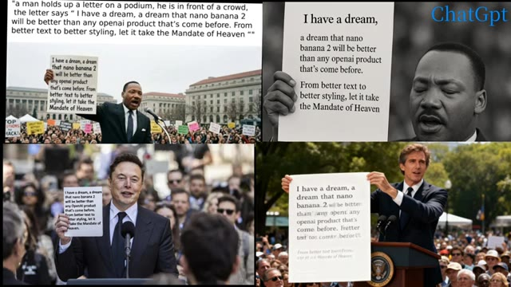
*Comparaison de quatre images générées par différentes IA à partir du même prompt textuel.*

---

### ⏱️ `[00:01:38 - 00:01:57]` | Segment #06

**🔊 Audio (Transcription Intégrale Mot pour Mot en Français) :**
> En matière de réalisme, Nano Banana 2 surpasse tous les modèles d'IA du marché. Regardez simplement ces exemples. Il génère le visage d'Elon Musk sans aucune erreur, et l'arrière-plan est impeccable. On dirait même l'une des premières photos d'Elon. Et puis il y a l'image de IShowSpeed. Personne ne croirait qu'elle a été générée par IA.

**👁️ Analyse Visuelle d'Écran (gemini-3.5-flash-lite) :**
**Interface & Outils** : Présentation vidéo d'exemples d'images générées par intelligence artificielle (Nano Banana 2).

**Contenu textuel & Code** : Des visages de célébrités générés par IA dans des contextes réalistes, avec notamment un tampon de date "OCT 2018" sur la première image.

**Action / Démonstration** : Défilement visuel des exemples d'images générées par l'IA pour illustrer son réalisme.

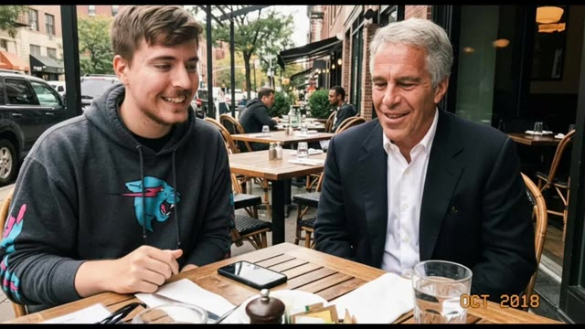
*Image générée par IA montrant MrBeast assis à une table de café en extérieur à côté de Jeffrey Epstein.*

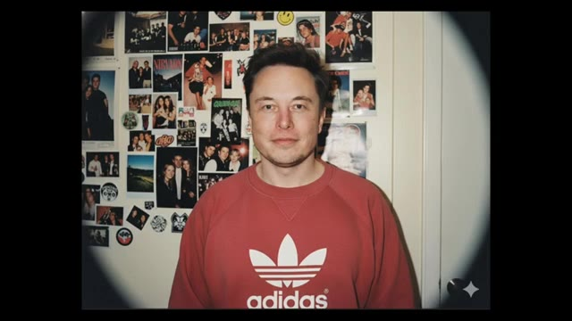
*Image générée par IA d'Elon Musk jeune portant un sweat-shirt rouge Adidas devant un mur tapissé de photos.*

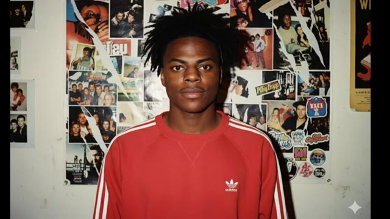
*Image générée par IA de IShowSpeed jeune portant un sweat-shirt rouge Adidas devant un mur tapissé de photos.*

---

### ⏱️ `[00:01:57 - 00:02:16]` | Segment #07

**🔊 Audio (Transcription Intégrale Mot pour Mot en Français) :**
> C'est incroyablement réaliste. Comme le modèle est toujours en phase de test, il est capable de générer des visages de célébrités avec ce niveau de précision. Mais une fois qu'il sortira officiellement, il sera censuré, donc il ne pourra plus générer de visages de célébrités comme ça. Cela rend ces premiers résultats encore plus époustouflants.

**👁️ Analyse Visuelle d'Écran (gemini-3.5-flash-lite) :**
**Interface & Outils** : Présentation de démonstrations visuelles et de clips générés par intelligence artificielle.

**Contenu textuel & Code** : Vues divisées et exemples d'images/vidéos de personnalités publiques générées de manière hyper-réaliste.

**Action / Démonstration** : Démonstration visuelle à l'écran illustrant les capacités du modèle d'IA à générer des visages de célébrités.

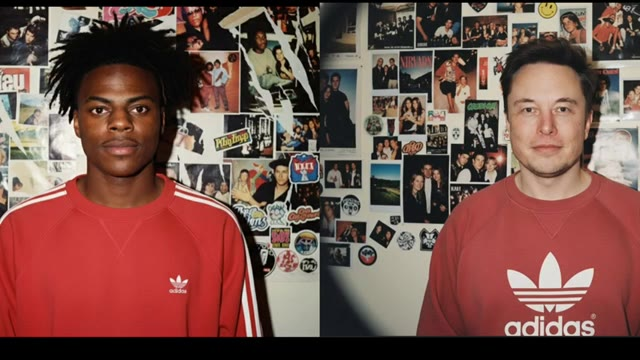
*Génération d'images ultra-réalistes de célébrités (IShowSpeed et Elon Musk) dans un style de photos vintage.*

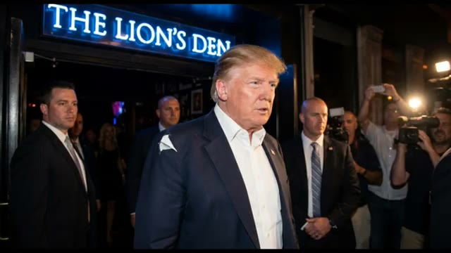
*Vidéo générée par IA montrant Donald Trump sortant d'un établissement sous les projecteurs avec ses gardes du corps.*

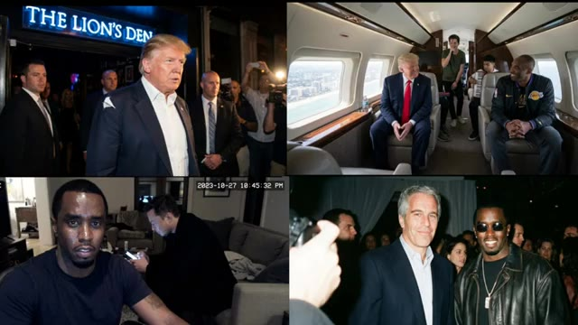
*Grille d'exemples montrant diverses scènes générées par IA mettant en scène des personnalités (Trump, Elon Musk, P. Diddy, Jeffrey Epstein).*

---

### ⏱️ `[00:02:16 - 00:02:39]` | Segment #08

**🔊 Audio (Transcription Intégrale Mot pour Mot en Français) :**
> En ce qui concerne l'animation, Nano Banana 2 est également à un autre niveau. Il connaît parfaitement le visage de Goku, et regardez juste cet exemple. Le réalisme est fou. Si je ne vous avais pas dit que c'était généré par IA, vous ne l'auriez jamais deviné. Ça a l'air directement réel. Chaque exemple de Nano Banana 2 sur Internet a l'air incroyable. Les résultats sont propres, puissants et honnêtement bien en avance sur ce que la plupart des modèles peuvent faire en ce moment.

**👁️ Analyse Visuelle d'Écran (gemini-3.5-flash-lite) :**
**Interface & Outils** : Démonstration de vidéos et images générées par intelligence artificielle (modèle Nano Banana 2).

**Contenu textuel & Code** : Visuels de styles variés : anime (Saitama, Goku), photoréalisme (horloge et verre de vin), personnages de jeux vidéo (Crash Bandicoot) et portraits générés.

**Action / Démonstration** : Présentation de différents exemples de rendus visuels de haute qualité générés par le modèle Nano Banana 2 pour illustrer son réalisme et sa maîtrise des personnages.

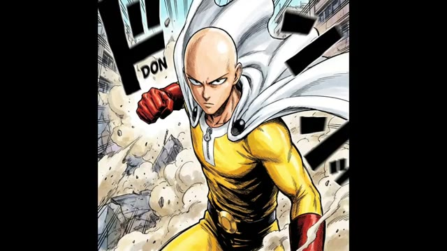
*Image de synthèse style animé montrant le personnage de Saitama (One-Punch Man) en action avec un effet de vitesse et des débris.*

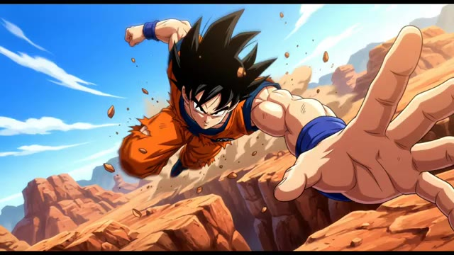
*Animation montrant Goku de Dragon Ball en train de courir et tendre le main vers l'avant dans un décor rocheux.*

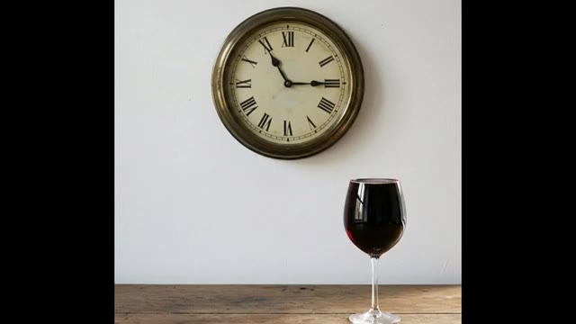
*Vue réaliste d'une horloge murale ancienne avec des chiffres romains et un verre de vin rouge posé sur une table en bois.*

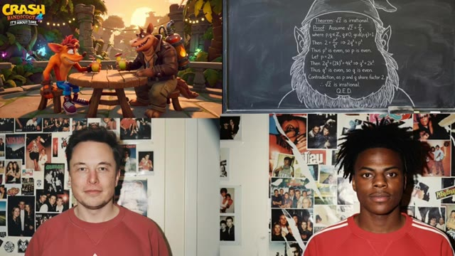
*Collage de quatre images incluant Crash Bandicoot, un tableau noir mathématique et des portraits réalistes.*

---

### ⏱️ `[00:02:39 - 00:02:48]` | Segment #09

**🔊 Audio (Transcription Intégrale Mot pour Mot en Français) :**
> Vraiment impatient de le tester moi-même quand il sortira enfin. C'était donc mes recherches sur Nano Banana 2. Si vous avez aimé, assurez-vous d'aimer la vidéo et de vous abonner.

**👁️ Analyse Visuelle d'Écran (gemini-3.5-flash-lite) :**
**Interface & Outils** : Jeu vidéo / Vidéo générée par IA (style Minecraft).

**Contenu textuel & Code** : On aperçoit des avatars cubiques représentant Donald Trump et Joe Biden armés d'épées en diamant, faisant face à des monstres (zombie, araignée, creeper) au pied des tours du World Trade Center dans un décor en blocs. La barre de vie et l'inventaire typiques de Minecraft sont visibles en bas de l'écran.

**Action / Démonstration** : Présentation d'un exemple de contenu vidéo absurde ou humoristique généré par intelligence artificielle pour illustrer les capacités de l'outil présenté.

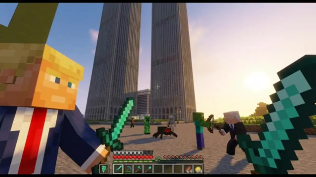
*Capture d'écran d'une vidéo générée par IA montrant une scène parodiant Minecraft avec des personnages politiques devant les tours jumelles.*

---
