# 🎬 Nano Banana Pro vient de choquer tout le monde

> **Chaîne** : [Pursuing AI](https://www.youtube.com/@PursuingAi)  
> **Titre original** : `Nano Banana Pro Just Shocked Everyone`  
> **Lien YouTube** : [https://www.youtube.com/watch?v=CtR8KRHsOSo](https://www.youtube.com/watch?v=CtR8KRHsOSo)  
> **Date de publication** : 2025-11-21  
> **Durée** : 03m 56s (`236s`)  
> **Identifiant vidéo** : `CtR8KRHsOSo`  
> **Fiche Web Interactive** : [2025-11-21_YT-CtR8KRHsOSo_Nano Banana Pro vient de choquer tout le monde_by-whisper-v3-large-turbo+gemini-3.5-flash-lite.html](2025-11-21_YT-CtR8KRHsOSo_Nano Banana Pro vient de choquer tout le monde_by-whisper-v3-large-turbo+gemini-3.5-flash-lite.html)  
> **Captures de démonstration clés** : `25 captures réelles (anti-talking-head)`  
> **Modèles utilisés** : Audio: `large-v3-turbo` (Faster-Whisper int8 VPS) | Vision: `gemini-3.5-flash-lite` (Google AI Studio API)  

---

## 📌 Synthèse Exécutive & Outils

### 📌 Résumé
La vidéo de *Pursuing AI* met en lumière une avancée majeure dans le domaine de l'intelligence artificielle générative : **Nano Banana Pro**, un nouveau modèle développé par Google et adossé à la puissance de Gemini 3. Conçu pour redéfinir les standards de la génération et de l'édition d'images, cet outil se distingue par une compréhension contextuelle poussée du monde réel et une précision chirurgicale dans le traitement visuel. Le présentateur structure sa démonstration de manière immersive, en enchaînant rapidement les cas d'usage concrets — de la typographie parfaite à la manipulation d'images complexes — pour prouver la supériorité technique du modèle face aux solutions concurrentes actuelles.

Sur le plan méthodologique, le créateur adopte une approche empirique et comparative, démontrant le fonctionnement de l'outil par l'exemple visuel direct (preuves à l'appui pour chaque fonctionnalité). Il décompose les workflows en actions simples mais puissantes : l'injection de liens pour générer des infographies documentées, l'importation de croquis ou de logos pour des variations créatives, et l'utilisation de commandes textuelles pour modifier la mise au point ou l'éclairage d'une scène existante. Cette démonstration pas à pas met en évidence les bénéfices concrets pour les créateurs de contenu, les graphistes et les étudiants, qui disposent désormais d'un outil de qualité studio capable de gérer simultanément plusieurs personnages et objets sans perte de cohérence.

### 🛠️ Outils, Modèles & Logiciels Présentés
* **Nano Banana Pro** : Modèle de pointe développé par Google, basé sur l'architecture de Gemini 3, spécialisé dans la génération, l'édition avancée d'images, le rendu typographique parfait et la manipulation de scènes complexes.
* **Gemini 3** : Le modèle linguistique et multimodal sous-jacent qui confère à Nano Banana Pro sa solide compréhension du monde réel, essentielle pour analyser des textes, des liens ou des images botaniques et en extraire des infographies précises.
* **Flux** : Mentionné comme brique technologique ou écosystème de référence associé aux flux de travail de génération d'images haute fidélité.

### 🔑 Points Clés & Enseignements Stratégiques
* **Maîtrise absolue du texte intégré** : Nano Banana Pro résout le problème historique des IA génératives en restituant des textes parfaitement orthographiés, sans distorsion ni bavure, directement au sein des images.
* **Génération d'infographies contextuelles** : Il est possible de créer des infographies détaillées et propres en combinant un simple prompt textuel avec l'ajout d'un lien web.
* **Analyse et extraction botanique** : Le modèle peut identifier une plante à partir d'une photo importée, en extraire les détails pertinents et générer automatiquement une infographie éducative visuellement irréprochable.
* **Traduction visuelle intégrée** : L'outil permet de traduire instantanément tout texte présent à l'intérieur d'une image source tout en conservant la mise en page et la cohérence visuelle.
* **Variations de logos et branding** : En téléchargeant le logo d'une marque, le modèle génère des déclinaisons de design multiples, propres et parfaitement cohérentes avec l'identité visuelle initiale.
* **Conversion croquis-réalisme** : Le workflow permet de transformer un simple dessin ou croquis en une image hyperréaliste, avec la possibilité d'ajouter des images de référence pour personnaliser les arrière-plans.
* **Contrôle de la mise au point (Depth of Field) de qualité studio** : Il est possible de déplacer dynamiquement le plan de netteté d'un sujet à un autre (par exemple, d'un visage vers une foule ou une main) tout en maintenant un flou naturel, l'éclairage et le réalisme.
* **Manipulation dynamique de l'éclairage** : Le modèle sait réinterpréter l'illumination d'une scène sur simple commande textuelle (transformer la nuit en jour, appliquer un éclairage volumétrique) en modifiant toute la configuration lumineuse de manière cohérente.
* **Upscaling haute résolution natif** : Amélioration de la clarté et de la résolution de n'importe quelle image aux formats 1K, 2K ou 4K avec un niveau de détail impressionnant.
* **Gestion multi-personnages et multi-objets** : Le modèle gère de manière fluide la ressemblance de jusqu'à 5 personnages distincts et la fidélité de jusqu'à 14 objets dans un seul et même flux de travail.
* **Combinaison de références multiples** : Possibilité de fusionner plusieurs images de référence en un rendu unique, cohérent et de haute qualité, ou de générer plusieurs images différentes à partir d'une seule et unique invite textuelle.
* **Gain de productivité massif** : Grâce à sa précision chirurgicale et à l'absence d'artefacts, Nano Banana Pro réduit considérablement le besoin de retouches post-production sur les créations visuelles.

---

## ⏱️ Chronologie & Transcription Complète Audio & Visuelle (Mot pour Mot)

### ⏱️ `[00:00:00 - 00:00:35]` | Segment #01

**🔊 Audio (Transcription Intégrale Mot pour Mot en Français) :**
> Google vient de lâcher une mise à jour majeure. Juste au moment où j'enregistrais ma vidéo sur Gemini 3, ils ont sorti Nano Banana Pro et ce modèle est une tuerie. Voici quelques exemples insensés que vous devez voir. C'est Pursuing AI et vous regardez The Research Report. D'abord, Nano Banana Pro vous permet d'ajouter du texte à n'importe quelle image et il le restitue parfaitement. Pas de fautes d'orthographe, pas de distorsions, juste un placement de texte propre et précis. Voici d'autres exemples montrant à quel point le texte est impeccable

**👁️ Analyse Visuelle d'Écran (gemini-3.5-flash-lite) :**
**Interface & Outils** : Présentation vidéo de démonstration de résultats de génération d'images par IA (Nano Banana Pro) avec affichage de prompts en bas de l'écran.

**Contenu textuel & Code** : Texte affiché sur l'image 3 : "HOW MUCH WOOD WOULD A WOODCHUCK CHUCK IF A WOODCHUCK COULD CHUCK WOOD?". Prompt visible en bas : "Prompt: Create an image showing the phrase 'How much wood would a woodchuck chuck if a woodchuck could chuck wood' made out of wood chucked by a woodchuck". Texte affiché sur l'image 4 : "MAGIC" en typographie décorative.

**Action / Démonstration** : Défilement successif d'exemples d'images générées par IA illustrant la précision du rendu textuel de Nano Banana Pro.

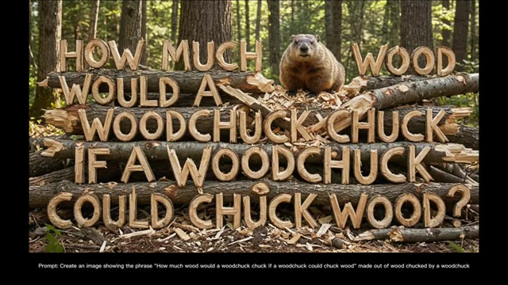
*Image générée montrant du texte en bois sculpté dans un décor boisé avec une marmotte*

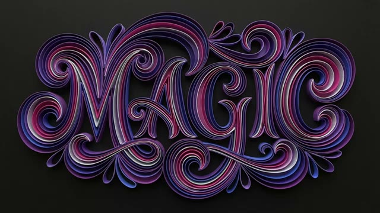
*Image générée montrant le mot "MAGIC" stylisé en papier roulé (quilling) aux teintes violettes et roses sur fond noir*

---

### ⏱️ `[00:00:35 - 00:01:11]` | Segment #02

**🔊 Audio (Transcription Intégrale Mot pour Mot en Français) :**
> le rendu l'est vraiment. En matière de rendu de texte, Google a vraiment fait un travail incroyable. Comme Nano Banana Pro repose sur Gemini 3, il possède une solide compréhension du monde réel. Vous pouvez créer des infographies entièrement détaillées en fournissant simplement un prompt et en ajoutant un lien. Regardez à quel point cette infographie est propre et précise, extrêmement utile pour les étudiants. Vous pouvez même télécharger l'image d'une plante, demander une infographie, et il identifiera la plante, en extraira des détails pertinents,

**👁️ Analyse Visuelle d'Écran (gemini-3.5-flash-lite) :**
**Interface & Outils** : Interface de démonstration de Nano Banana Pro (basé sur Gemini 3).

**Contenu textuel & Code** : Texte visible : "SCENE: URBAN ASTRONAUT", plans 1 à 4 avec descriptions. Schéma infographique sur l'énergie solaire ("SOLAR PANELS", "INVERTER", "HOME ELECTRICITY", "STORAGE BATTERY", "GRID UTILITY"). Infographie sur la plante "STRING OF TURTLES: Peperomia prostrata" avec sections "LEAF PATTERN", "ORIGIN & HABITAT", "GROWTH HABIT", "CARE ESSENTIALS". Prompt affiché en bas : "Prompt: Create an infographic about this plant focusing on interesting information".

**Action / Démonstration** : Présentation visuelle d'infographies détaillées générées par IA à partir d'images d'entrée et de prompts textuels, démontrant la compréhension du monde réel et les capacités de rendu de texte de l'outil.

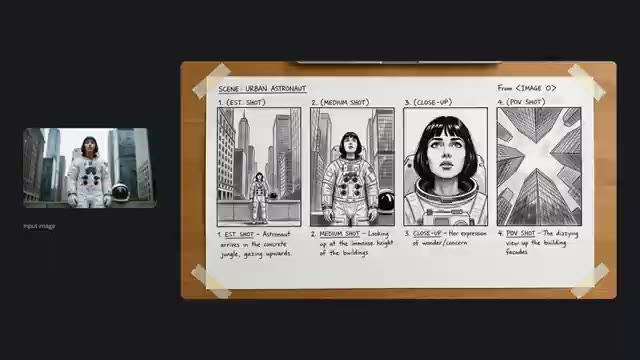
*Interface montrant un storyboard en 4 plans illustrant un astronaute urbain, généré à partir d'une image d'entrée.*

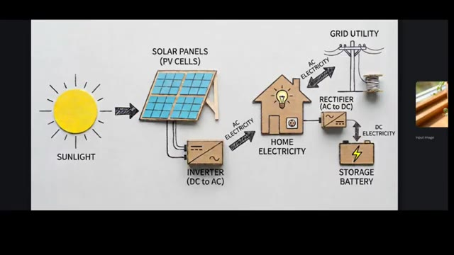
*Infographie détaillée et illustrée sur le fonctionnement de l'énergie solaire, avec un encart miniature d'une plante en bas à droite.*

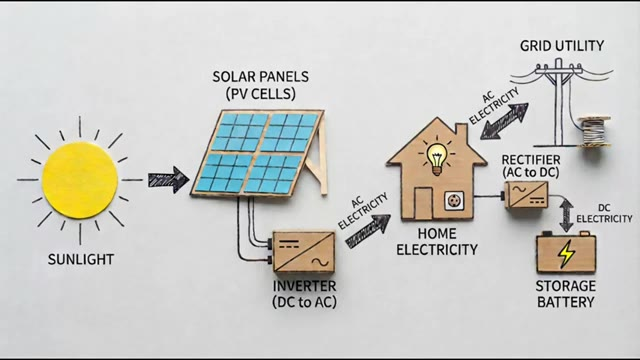
*Vue plein écran de l'infographie illustrée sur l'énergie solaire montrant le cycle de l'électricité depuis les panneaux photovoltaïques jusqu'au réseau.*

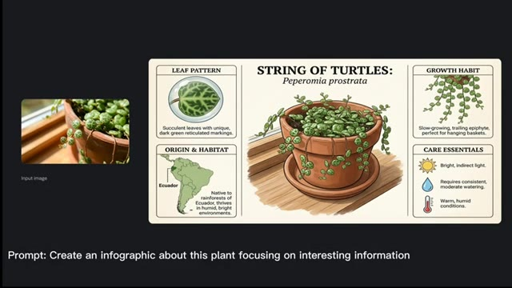
*Infographie détaillée générée à partir de l'image d'une plante, identifiant le "String of Turtles" (Peperomia prostrata) avec ses caractéristiques et conseils d'entretien.*

---

### ⏱️ `[00:01:11 - 00:01:49]` | Segment #03

**🔊 Audio (Transcription Intégrale Mot pour Mot en Français) :**
> et générer une infographie visuellement propre. C'est d'une précision choquante. Nano Banana Pro peut également traduire du texte qui apparaît à l'intérieur de n'importe quelle image. Il suffit de télécharger l'image et de lui demander de la traduire, et la traduction est parfaite. Voici d'autres exemples montrant à quel point le modèle gère les traductions. La précision est vraiment impressionnante. Téléchargez votre logo de marque et il génère plusieurs versions et variations de design, toutes cohérentes, toutes propres, et sans aucune erreur.

**👁️ Analyse Visuelle d'Écran (gemini-3.5-flash-lite) :**
**Interface & Outils** : Interface de démonstration de Nano Banana Pro avec affichage comparatif d'images d'entrée (Input image) et de résultats générés.

**Contenu textuel & Code** : Texte à l'écran : « Prompt: Create an infographic about this plant focusing on interesting information » et infographie détaillée sur la plante « String of Turtles », ainsi que divers textes publicitaires traduits (« Aura Fizz », « Zestful », « Schwungvoll »).

**Action / Démonstration** : Le modèle analyse une image source pour en extraire du texte, effectuer des traductions contextuelles et générer des infographies ou des variations de design cohérentes.

*Démonstration de la création d'une infographie botanique à partir d'une photo de plante avec Nano Banana Pro.*

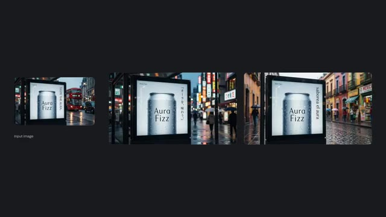
*Exemples de traduction de texte intégré dans des affiches publicitaires urbaines de canettes de boisson.*

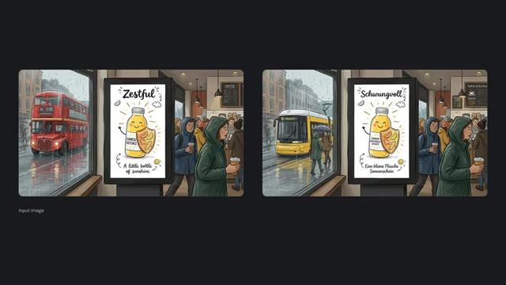
*Exemples de traduction de texte publicitaire illustré sur des affiches de rue dans un style animé.*

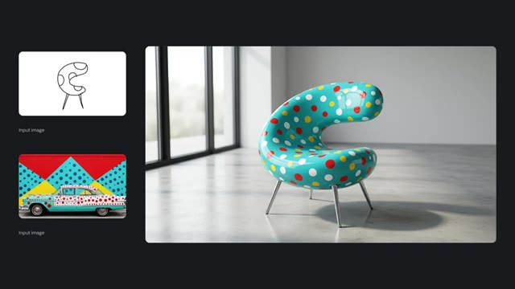
*Démonstration de génération de variations de design de meubles à partir d'un croquis et d'une image de référence.*

---

### ⏱️ `[00:01:49 - 00:02:10]` | Segment #04

**🔊 Audio (Transcription Intégrale Mot pour Mot en Français) :**
> Vous pouvez également télécharger un croquis et le transformer en image hyperréaliste. Si vous souhaitez un arrière-plan personnalisé, téléchargez simplement l'image de référence supplémentaire, et le résultat est honnêtement insensé. Voici d'autres exemples de conversions de croquis en images réalistes, et chacun d'eux est incroyable.

**👁️ Analyse Visuelle d'Écran (gemini-3.5-flash-lite) :**
**Interface & Outils** : Interface de démonstration logicielle ou site web présentant des exemples de conversion d'images (sketch-to-realistic).

**Contenu textuel & Code** : Affichage des images d'entrée (« Input image ») sous forme de croquis et de textures, accompagnées de grands rendus finaux générés par IA.

**Action / Démonstration** : Présentation visuelle de la transformation de croquis simples en images réalistes complexes grâce à l'intelligence artificielle.

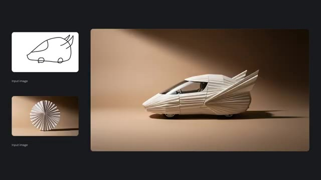
*Démonstration de conversion d'un croquis de voiture et d'une texture en une image hyperréaliste de véhicule en papier.*

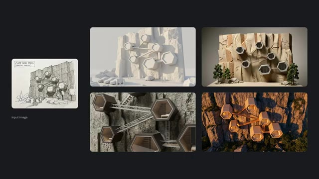
*Exemples multiples de conversion d'un croquis architectural de modules fixés sur une falaise en différents rendus 3D réalistes.*

---

### ⏱️ `[00:02:11 - 00:02:37]` | Segment #05

**🔊 Audio (Transcription Intégrale Mot pour Mot en Français) :**
> Nano Banana Pro débloque également un contrôle d'image de qualité studio. Par exemple, téléchargez une image, puis demandez-lui de déplacer la mise au point de la fille vers la foule. Il le fait parfaitement, en maintenant la cohérence, l'éclairage et le réalisme. Voici un autre exemple, changeant la mise au point du visage d'un homme vers sa main, en floutant naturellement le visage.

**👁️ Analyse Visuelle d'Écran (gemini-3.5-flash-lite) :**
**Interface & Outils** : Présentation logicielle avec interface de démonstration d'IA pour le contrôle d'image et de profondeur de champ.

**Contenu textuel & Code** : Texte à l'écran : « Studio-quality control. Exercise fine control over every aspect of your images, for high-fidelity results. Explore different angles and shot types. Wide angle, panoramic, close up - choose an angle and a type of shot. Or alter the depth of field to focus on different subjects in your image. » et les prompts « Prompt: Focus on the faces of the crowd and make woman blurry » et « Prompt: Focus on man's hand, blur his face ».

**Action / Démonstration** : Affichage des fonctionnalités de contrôle de la profondeur de champ et de la mise au point sur des images fixes à l'aide de prompts textuels.

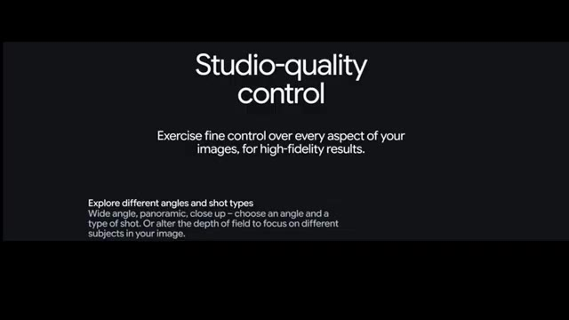
*Diapositive de présentation introduisant le contrôle d'image de qualité studio et l'exploration de différents angles de prise de vue.*

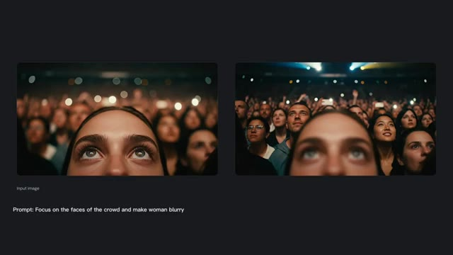
*Démonstration visuelle avec l'image d'entrée et l'image modifiée, montrant le déplacement de la mise au point de la femme vers la foule.*

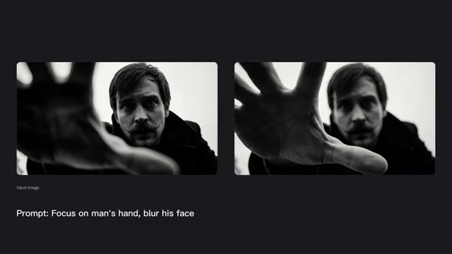
*Démonstration visuelle en noir et blanc montrant le déplacement de la mise au point du visage de l'homme vers sa main.*

---

### ⏱️ `[00:02:38 - 00:02:57]` | Segment #06

**🔊 Audio (Transcription Intégrale Mot pour Mot en Français) :**
> Ces résultats sont honnêtement d'un autre niveau. Vous pouvez aussi ajuster la couleur et l'éclairage. Dites-lui de transformer la nuit en jour, et il modifie parfaitement toute la configuration d'éclairage. Regardez cet exemple avec un éclairage volumétrique. Le résultat est incroyable.

**👁️ Analyse Visuelle d'Écran (gemini-3.5-flash-lite) :**
**Interface & Outils** : Interface de présentation de résultats de modèle d'IA générative avec affichage de comparaisons avant/après et de prompts textuels.

**Contenu textuel & Code** : Textes visibles : "Input image", "Prompt: Change to daytime" (sur l'image 2), "Prompt: Replace volumetric lighting with bokeh" (sur l'image 3).

**Action / Démonstration** : Présentation à l'écran de comparaisons visuelles et d'exemples de modifications d'éclairage et d'ambiance par IA.

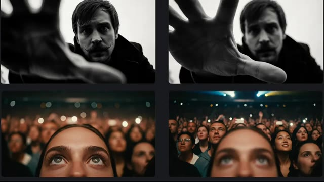
*Démonstration de résultats visuels générés avec différentes perspectives et personnages.*

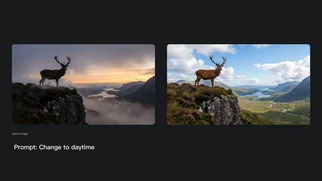
*Comparaison avant/après illustrant la modification de l'éclairage d'une image de cerf sur une falaise suite à un prompt.*

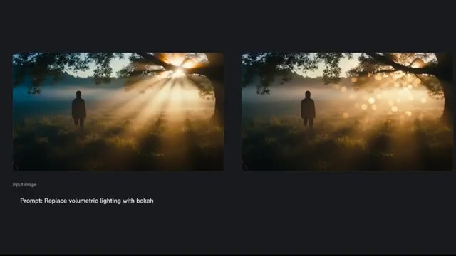
*Comparaison avant/après illustrant le remplacement de l'éclairage volumétrique par un effet bokeh suite à un prompt.*

---

### ⏱️ `[00:02:58 - 00:03:22]` | Segment #07

**🔊 Audio (Transcription Intégrale Mot pour Mot en Français) :**
> Vous pouvez améliorer la résolution de n'importe quelle image en 1K, 2K ou même 4K avec une clarté impressionnante. Et bien sûr, vous pouvez générer des images dans plusieurs formats d'image instantanément. Écoutez ceci. Il peut maintenir la ressemblance de jusqu'à 5 personnages et la fidélité de jusqu'à 14 objets dans un seul flux de travail.

**👁️ Analyse Visuelle d'Écran (gemini-3.5-flash-lite) :**
**Interface & Outils** : Interface de présentation logicielle avec titres textuels en haut à gauche et panneaux visuels de démonstration d'intelligence artificielle générative.

**Contenu textuel & Code** : Texte à l'écran : "Upscale with precision - Generate crisp visuals at 1k, 2k or 4k resolution." (Image 1). Texte à l'écran : "Subject consistency - Maintain the consistency and resemblance of up to five characters and the fidelity of up to fourteen objects in a single workflow." (Image 3). Nombreuses images d'entrée étiquetées "Input image" et grands visuels générés.

**Action / Démonstration** : Présentation visuelle des fonctionnalités de l'IA, montrant l'amélioration de résolution, les différents formats d'image et le maintien de la consistance de multiples personnages et objets.

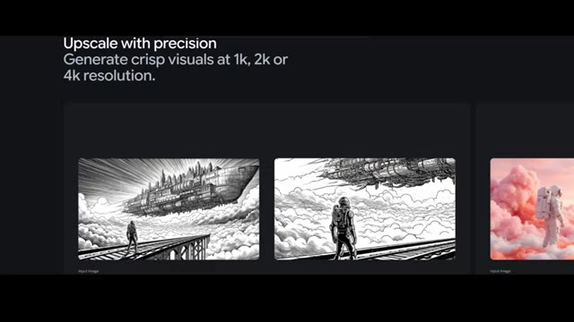
*Démonstration de la fonction d'upscaling avec des illustrations de style gravure montrant un astronaute sur un pont face à une ville volante, avec le texte explicatif en haut à gauche.*

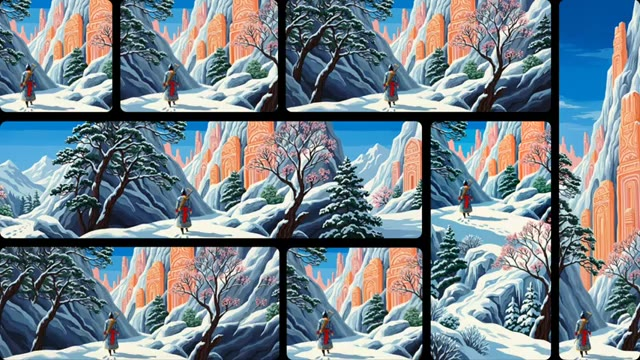
*Collage d'images montrant un personnage en armure marchant dans un paysage enneigé montagneux, illustrant la génération d'images en plusieurs formats (aspect ratios).*

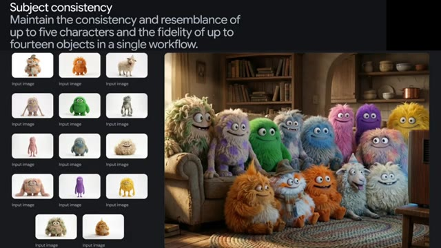
*Démonstration de la cohérence de sujets montrant de multiples petites images de créatures en entrée et une grande scène finale regroupant tous ces personnages sur un canapé et un tapis.*

---

### ⏱️ `[00:03:23 - 00:03:45]` | Segment #08

**🔊 Audio (Transcription Intégrale Mot pour Mot en Français) :**
> Voici quelques exemples. Plusieurs images de référence combinées en un seul rendu cohérent et de haute qualité. Vous pouvez même générer plusieurs images différentes en une seule invite. Super efficace. Et enfin, ces exemples. Je ne pense pas qu'aucun autre modèle actuellement ne puisse atteindre ce niveau de détail.

**👁️ Analyse Visuelle d'Écran (gemini-3.5-flash-lite) :**
**Interface & Outils** : Démonstration de rendu d'IA générative et de combinaison d'images multiples.

**Contenu textuel & Code** : Texte "Input image" sous de petites vignettes de référence à gauche de l'écran principal, affichant des éléments visuels variés (personnage, mobilier, plantes, cadre).

**Action / Démonstration** : Présentation d'exemples de résultats générés par IA illustrant la cohérence d'images multiples et un niveau de détail élevé.

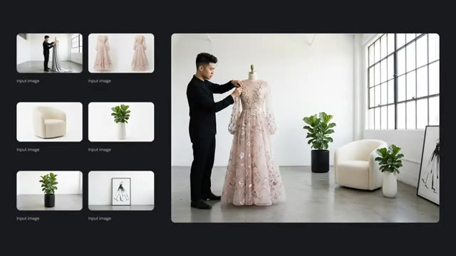
*Démonstration de la combinaison de plusieurs images de référence (Input image) pour générer une image finale cohérente montrant un designer ajustant une robe sur un mannequin dans un studio.*

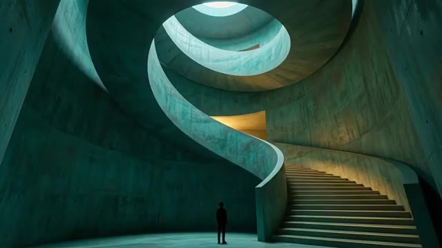
*Rendu visuel d'une architecture intérieure circulaire en béton avec un escalier en colimaçon monumental et une silhouette humaine au centre.*

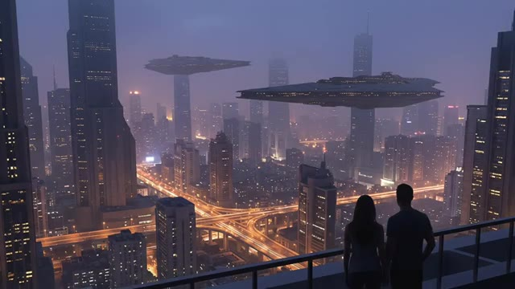
*Rendu visuel d'un paysage urbain futuriste de science-fiction au crépuscule avec des vaisseaux spatiaux en vol stationnaire au-dessus des gratte-ciels, observé par un couple depuis un balcon.*

---

### ⏱️ `[00:03:46 - 00:03:56]` | Segment #09

**🔊 Audio (Transcription Intégrale Mot pour Mot en Français) :**
> Ces générations sont vraiment d'un tout autre niveau. C'était la recherche complète de Nano Banana Pro. Si vous avez aimé cette vidéo, n'oubliez pas de l'aimer.

**👁️ Analyse Visuelle d'Écran (gemini-3.5-flash-lite) :**
**Interface & Outils** : Affichage plein écran d'une image générée par IA (rendu visuel de démonstration).

**Contenu textuel & Code** : Une grenouille rainette aux yeux rouges vifs, peau texturée verte et orange, pattes orangées, posée sur une grande feuille verte luisante avec des gouttes d'eau.

**Action / Démonstration** : Présentation du résultat visuel d'une génération par IA.

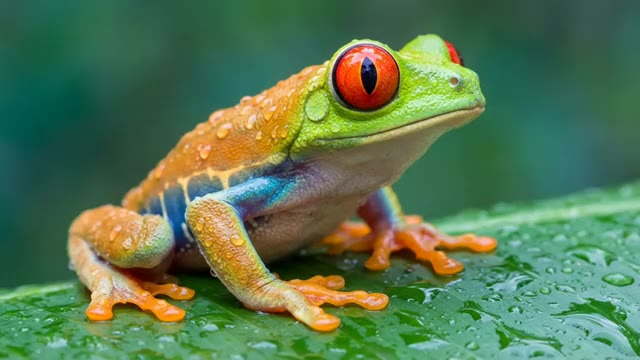
*Image générée par IA représentant une grenouille aux yeux rouges posée sur une feuille tropicale couverte de gouttes de rosée.*

---
