# 🎬 Gemini 3 vs GPT 5.1 : Leurs résultats vont vous choquer !

> **Chaîne** : [Pursuing AI](https://www.youtube.com/@PursuingAi)  
> **Titre original** : `Gemini 3 vs GPT 5.1: The Results Will Shock You!`  
> **Lien YouTube** : [https://www.youtube.com/watch?v=owYisYT9akg](https://www.youtube.com/watch?v=owYisYT9akg)  
> **Date de publication** : 2025-11-23  
> **Durée** : 04m 33s (`273s`)  
> **Identifiant vidéo** : `owYisYT9akg`  
> **Fiche Web Interactive** : [2025-11-23_YT-owYisYT9akg_Gemini 3 vs GPT 5.1 Leurs résultats vont vous choquer !_by-whisper-v3-large-turbo+gemini-3.5-flash-lite.html](2025-11-23_YT-owYisYT9akg_Gemini 3 vs GPT 5.1 Leurs résultats vont vous choquer !_by-whisper-v3-large-turbo+gemini-3.5-flash-lite.html)  
> **Captures de démonstration clés** : `26 captures réelles (anti-talking-head)`  
> **Modèles utilisés** : Audio: `large-v3-turbo` (Faster-Whisper int8 VPS) | Vision: `gemini-3.5-flash-lite` (Google AI Studio API)  

---

## 📌 Synthèse Exécutive & Outils

### 📌 Résumé
La vidéo de Pursuing AI, intitulée « Gemini 3 vs GPT 5.1 : Leurs résultats vont vous choquer ! », plonge au cœur de la compétition acharnée entre les mastodontes de l'intelligence artificielle pour déterminer quel modèle propriétaire et payant offre le meilleur retour sur investissement aux utilisateurs. Le créateur orchestre un comparatif rigoureux et méthodique en soumettant les deux intelligences artificielles à une série de tests de génération de code applicatif et de simulation visuelle interactive — incluant des interfaces complexes comme une main robotique, un pied articulé, un globe 3D informatif et un éditeur de Lego 3D. 

La méthodologie du créateur repose sur l'utilisation de prompts textuels uniques et l'injection d'images de référence (image-to-code/UI), qu'il teste à l'identique sur les deux plateformes pour évaluer non seulement la qualité de la génération graphique, mais surtout la fiabilité de l'exécution et la robustesse des fonctionnalités interactives. À travers ce processus étape par étape, il met en évidence la supériorité technique de Gemini 3 dans la compréhension contextuelle et le rendu visuel fonctionnel, là où son concurrent échoue à plusieurs reprises lors des phases de prévisualisation ou d'exécution du code.

Pour les créateurs de contenu, les vidéastes et les développeurs no-code, cette analyse livre des enseignements cruciaux sur l'évolution des assistants IA génératifs. Elle démontre comment exploiter ces outils pour prototyper rapidement des interfaces utilisateur sophistiquées, concevoir des éléments interactifs sans compétences techniques avancées, et identifier les solutions les plus performantes pour optimiser son budget logiciel. Les résultats soulignent l'accessibilité croissante des technologies de pointe pour le grand public, redéfinissant les standards de la production numérique assistée par IA.

### 🛠️ Outils, Modèles & Logiciels Présentés
* **Gemini 3** : Modèle propriétaire et payant de Google, mis en avant pour sa grande puissance de calcul, sa capacité supérieure à comprendre des prompts simples et à exécuter avec succès des applications interactives complexes.
* **GPT 5.1** : Modèle propriétaire et payant d'OpenAI, testé en parallèle sur les mêmes cas d'usage mais confronté à des limites de rendu graphique et à des échecs d'exécution de code en prévisualisation.
* **Seedance 2.5** : Outil de génération vidéo par IA mentionné dans l'écosystème technique global des créateurs de contenu de pointe.
* **Kling 3.0** : Solution avancée de génération et de manipulation de vidéo par intelligence artificielle utilisée dans les workflows de production visuelle.
* **Midjourney** : Référence incontournable de la génération d'images fixes par IA, souvent intégrée en amont des workflows de design et de prototypage.
* **Google AI Studio** : Plateforme de développement et d'expérimentation de Google permettant d'exploiter tout le potentiel de Gemini 3 en environnement de production.
* **Application Gemini** : Interface grand public de Google permettant d'accéder facilement aux capacités conversationnelles et génératives du modèle Gemini 3.

### 🔑 Points Clés & Enseignements Stratégiques
* **Supériorité de Gemini 3 sur le prototypage visuel** : Le modèle surpasse son concurrent direct dans la génération d'éléments graphiques réalistes et cohérents à partir d'un simple prompt et d'une image de référence.
* **Gestion réaliste de la cinématique (Cas de la main)** : Gemini 3 code un mouvement de pouce anatomiquement correct, évitant les flexions rigides ou standardisées observées sur les doigts classiques.
* **Efficacité de l'approche text-to-code pour les non-techniciens** : Les utilisateurs sans compétences en programmation peuvent générer des interfaces complexes et fonctionnelles rien qu'en décrivant leurs attentes textuellement.
* **Fiabilité des contrôleurs interactifs** : Les curseurs de contrôle (doigts, poings, relâchement, serrage, randomisation) générés par Gemini 3 s'avèrent immédiatement opérationnels et fluides lors de la prévisualisation.
* **Gestion des limites graphiques (Cas du pied)** : Même si Gemini 3 commet de légères erreurs géométriques lors du repli total des ốcorteils, le rendu reste visuellement supérieur et facilement corrigeable par un prompt affiné.
* **Faiblesses d'OpenAI sur l'exécution du code** : GPT 5.1 montre des difficultés récurrentes à exécuter des applications complexes dans son environnement de prévisualisation, renvoyant des bugs d'accès réseau bloquants.
* **Capacités géographiques et de data-viz** : Gemini 3 parvient à intégrer des bases de données interactives dans un globe 3D, restituant avec exactitude les informations démographiques et géographiques au clic.
* **Création d'applications ludiques complexes** : La génération d'un éditeur de Lego 3D entièrement fonctionnel (ajout, suppression, rotation, changement de taille et de couleur des briques) démontre la puissance de calcul et de logique du modèle de Google.
* **Optimisation du retour sur investissement** : L'analyse comparative aide directement les créateurs à orienter leurs investissements vers l'outil le plus rentable et le plus stable pour leurs besoins quotidiens.
* **Importance de l'itération par le prompt** : Un prompt détaillé et structuré permet de corriger instantanément les micro-défauts de génération (comme le doublage visuel des orteils), soulignant l'importance du prompting itératif.
* **Accessibilité multiplateforme** : La disponibilité de Gemini 3 via son application dédiée et Google AI Studio garantit une transition fluide entre usage grand public et exigences professionnelles.

---

## ⏱️ Chronologie & Transcription Complète Audio & Visuelle (Mot pour Mot)

### ⏱️ `[00:00:00 - 00:00:22]` | Segment #01

**🔊 Audio (Transcription Intégrale Mot pour Mot en Français) :**
> C'est quoi ce bordel ? À quel point c'est incroyable ? Donc Google a sorti Gemini 3, leur modèle le plus puissant. Et il y a quelques jours, OpenAI a sorti GPT 5.1. Les deux sont des modèles propriétaires et payants. Donc aujourd'hui, je vais faire des recherches pour savoir quel modèle en vaut vraiment la peine et lequel peut vous faire économiser de l'argent.

**👁️ Analyse Visuelle d'Écran (gemini-3.5-flash-lite) :**
**Interface & Outils** : Interface de démonstration interactive avec des panneaux de contrôle de mouvements et de simulation physique.

**Contenu textuel & Code** : Texte visible : "Finger Control Panel", "THUMB", "INDEX", "MIDDLE", "RING", "PINKY", "Reset", "Relax (soft)", "Clench (full)", "Randomize", "Touch-friendly buttons and sliders – physics simulated with damped springs for realistic motion."

**Action / Démonstration** : Manipulation de curseurs numériques pour contrôler les articulations d'une main modélisée en 3D avec simulation physique.

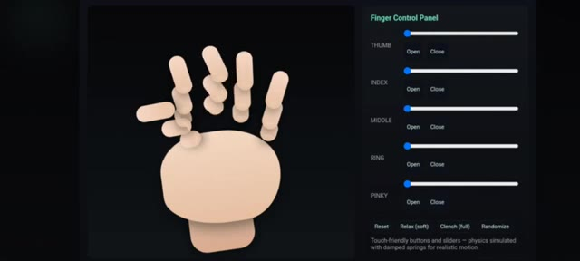
*Panneau de contrôle de doigts numérique avec des curseurs de réglage et une main stylisée.*

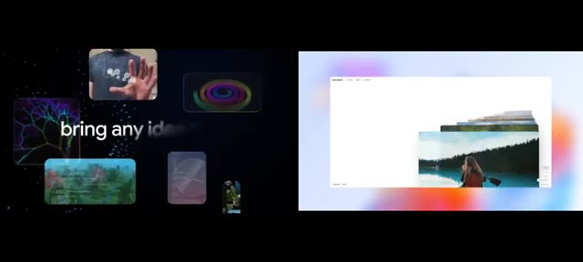
*Interface web avec des fenêtres empilées montrant des paysages naturels.*

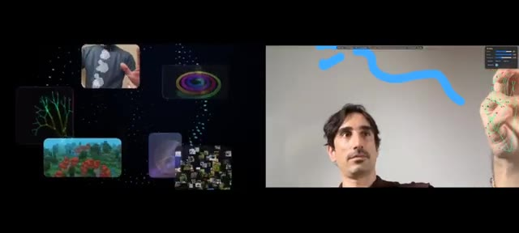
*Démonstration vidéo d'un utilisateur interagissant avec une interface de suivi de mouvements de la main.*

---

### ⏱️ `[00:00:23 - 00:00:56]` | Segment #02

**🔊 Audio (Transcription Intégrale Mot pour Mot en Français) :**
> Ceci est Pursuing AI et vous regardez le rapport de recherche. D'abord, je voulais faire une simulation de main. J'ai donc écrit un simple prompt dans lequel j'ai donné des instructions pour contrôler chaque doigt de la main, et j'ai téléchargé cette image de paume. Et voici le résultat de Gemini 3. Et honnêtement, ça dépasse mes attentes. Ça a codé une main robotique qui a l'air réaliste. Je peux contrôler tous les doigts en utilisant ces curseurs. Par exemple, si je veux bouger le pouce, je peux. Je peux contrôler l'index, le majeur,

**👁️ Analyse Visuelle d'Écran (gemini-3.5-flash-lite) :**
**Interface & Outils** : Interface de l'outil Gemini (avec mode Canvas) et interface de simulation 3D interactive.

**Contenu textuel & Code** : Texte du prompt : « Generate a simulation in which I can move all the fingers through button control background of simulation is dark and I can control all the fingers movements through different different button which is controlled through touch control. Physics must be realistic. Put all things i... » et curseurs de contrôle étiquetés THUMB, INDEX, MIDDLE, RING, PINKY, MOVE (ALL).

**Action / Démonstration** : Affichage de l'interface de génération avec image de référence et présentation d'une simulation 3D de main robotique manipulable via des curseurs.

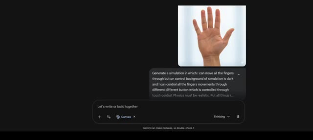
*Interface de Gemini montrant une image de main importée et un prompt textuel demandant une simulation interactive avec des contrôles de boutons.*

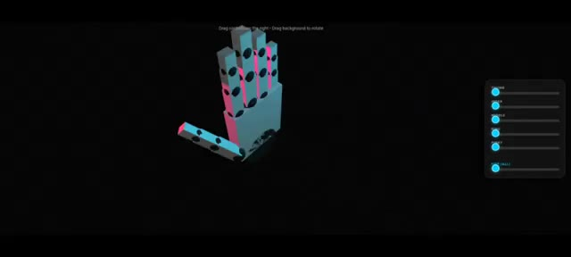
*Simulation 3D interactive d'une main robotique avec des curseurs de contrôle sur le côté droit pour chaque doigt.*

---

### ⏱️ `[00:00:56 - 00:01:32]` | Segment #03

**🔊 Audio (Transcription Intégrale Mot pour Mot en Français) :**
> annulaire et auriculaire. Et si je veux contrôler tous les doigts ensemble, j'utilise simplement ce curseur de poing et je peux tout contrôler parfaitement. C'génial. Et notez particulièrement le mouvement du pouce. Il ne se plie pas comme les doigts normaux qui font des va-et-vient. Il se plie de manière réaliste, tout comme un vrai pouce humain. Et voici le résultat de GPT 5.1 en utilisant le même prompt et la même image. Il génère bien une simulation de main et des curseurs, mais si vous regardez la main, elle ne ressemble pas à une main humaine et les doigts sont bizarrement faits, oui tous les contrôleurs fonctionnent

**👁️ Analyse Visuelle d'Écran (gemini-3.5-flash-lite) :**
**Interface & Outils** : Interface web de ChatGPT 5.1 avec affichage de code et simulation HTML interactive.

**Contenu textuel & Code** : Prompt utilisateur : "Generate a simulation in which i can move all the fingers through button control background of simulation is dark and i can control all the fingers movements through different different button which is controlled through touch control. Physics must be realistic. Put all things in a stand alone html file". Panneau de contrôle des doigts avec curseurs (Thumb, Index, Middle, Ring, Pinky).

**Action / Démonstration** : Le créateur présente une simulation interactive 3D d'une main pilotée par des curseurs, puis montre l'interface de ChatGPT 5.1 générant le code et le résultat de la simulation.

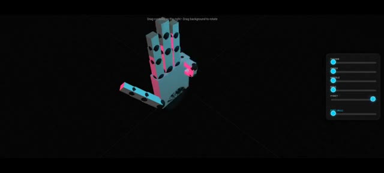
*Simulation 3D interactive d'une main géométrique avec des curseurs de contrôle sur le côté droit.*

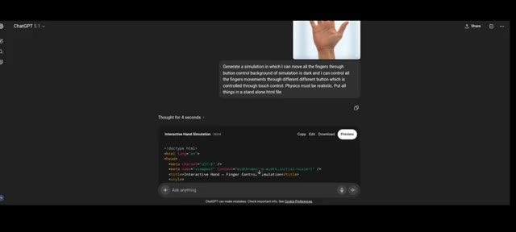
*Interface de ChatGPT 5.1 affichant un prompt textuel et un aperçu de code HTML pour une simulation de main.*

*Résultat généré par ChatGPT 5.1 montrant une simulation de main stylisée en beige avec un panneau de contrôle des doigts.*

---

### ⏱️ `[00:01:32 - 00:01:55]` | Segment #04

**🔊 Audio (Transcription Intégrale Mot pour Mot en Français) :**
> et en bas, il a ajouté une option de relâchement ce qui signifie une ouverture douce, une option de serrage ce qui signifie une ouverture complète, un randomiseur qui déplace la main dans n'importe quel motif et une option de réinitialisation. Pour ce test, je donnerai les points à Gemini 3. Ensuite, je voulais créer une simulation de pied, alors j'ai utilisé cette image de pied, j'ai donné le même prompt et j'ai juste changé main par pied.

**👁️ Analyse Visuelle d'Écran (gemini-3.5-flash-lite) :**
**Interface & Outils** : Interface de ChatGPT (avec panneau Canvas et panneau de contrôle interactif à droite).

**Contenu textuel & Code** : Texte du prompt : "Generate a simulation in which I can move all the fingers through button control background of simulation is dark and I can control all the fingers movements through different different button which is controlled through touch control. Physics must be realistic. Put all things in a stand alone html file". Boutons visibles : "Reset", "Relax (soft)", "Clench (full)", "Randomize".

**Action / Démonstration** : Le créateur présente l'interface interactive générée par l'IA avec les options de contrôle des doigts, puis montre la transition vers la création d'une simulation de pied en réutilisant le même prompt.

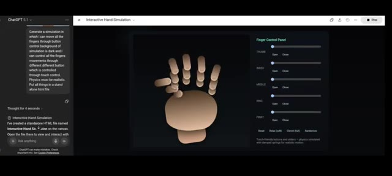
*Interface ChatGPT montrant un panneau de contrôle interactif pour simuler les doigts avec des boutons pour relâcher, serrer et randomiser.*

*Interface ChatGPT affichant l'utilisation d'une image de pied avec le même prompt textuel pour générer une simulation similaire.*

---

### ⏱️ `[00:01:56 - 00:02:16]` | Segment #05

**🔊 Audio (Transcription Intégrale Mot pour Mot en Français) :**
> Et voici le résultat de Gemini. Il génère le pied. Et comme vous pouvez le voir, c'est bien un pied. Et voici les curseurs à l'aide desquels je peux contrôler les doigts du pied. Par exemple, si j'utilise le curseur du gros orteil, oui, cela fléchit le gros orteil. Et chaque curseur fonctionne. Et si j'utilise « tout replier », cela fléchit tous les orteils.

**👁️ Analyse Visuelle d'Écran (gemini-3.5-flash-lite) :**
**Interface & Outils** : Interface web de Gemini (Canvas / interface de développement).

**Contenu textuel & Code** : Modèle 3D d'un pied (« FOOT SIMULATION ») avec des curseurs nommés Big Toe, 2nd Toe, 3rd Toe, 4th Toe, Little Toe et Curl All. Panneau latéral gauche affichant l'historique de chat et les modifications apportées (« I have updated the Foot Simulation to place the controls on the right side... »).

**Action / Démonstration** : Le créateur présente la simulation 3D interactive d'un pied générée par l'IA et démontre le fonctionnement des curseurs pour plier les différents orteils.

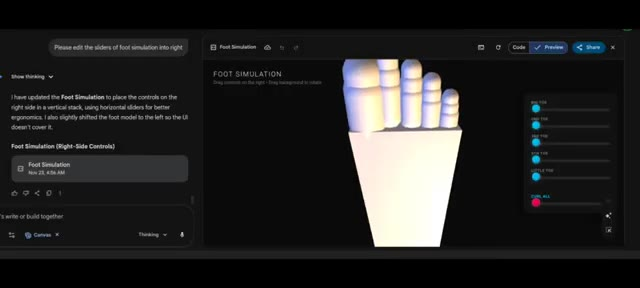
*Interface de Gemini affichant une simulation de pied en 3D avec des curseurs de contrôle sur le côté droit.*

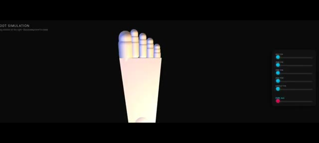
*Gros plan sur la simulation de pied en 3D générée avec les curseurs de contrôle des orteils visibles à droite.*

---

### ⏱️ `[00:02:16 - 00:02:41]` | Segment #06

**🔊 Audio (Transcription Intégrale Mot pour Mot en Français) :**
> La seule petite erreur que je peux voir, c'est que lorsque je ferme tous les orteils, ils ont l'air doublés de face, comme vous pouvez le voir ici. Mais ce n'est pas un gros problème. Cela peut facilement être corrigé avec un prompt plus détaillé. Voici le résultat de GPT 5.1. Et comme vous l'avez vu plus tôt, il a tout fait de la même manière. Tous les contrôleurs fonctionnent. La seule erreur réside à nouveau dans la génération du pied, tout comme il a eu du mal avec la main.

**👁️ Analyse Visuelle d'Écran (gemini-3.5-flash-lite) :**
**Interface & Outils** : Interface web de simulation 3D interactive et de contrôle des mouvements d'orteils.

**Contenu textuel & Code** : Texte 'FOOT SIMULATION', 'Toe Control Panel', curseurs de réglage 'Big', 'Second', 'Middle', 'Fourth', 'Little', et boutons 'Reset', 'Relax', 'Curl (full)', 'Randomize'.

**Action / Démonstration** : Manipulation d'une interface de simulation numérique démontrant le rendu 3D d'un pied et le comportement des orteils.

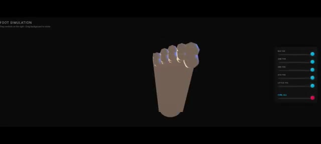
*Simulation 3D d'un pied avec un panneau de contrôle latéral comportant des curseurs pour chaque orteil.*

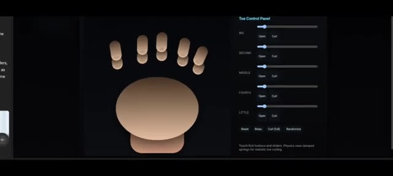
*Interface de contrôle des orteils ('Toe Control Panel') avec des curseurs pour chaque doigt de pied (Big, Second, Middle, Fourth, Little) et des boutons d'action.*

---

### ⏱️ `[00:02:41 - 00:03:16]` | Segment #07

**🔊 Audio (Transcription Intégrale Mot pour Mot en Français) :**
> Donc encore une fois, le point revient à Gemini 3. Ensuite, j'ai généré un globe 3D qui vous donne les informations de n'importe quel pays lorsque vous cliquez dessus et voici le résultat de Gemini. Trouvons les États-Unis et les voici. Si je clique dessus, il donne les informations sur le pays comme le nom du pays, la population, la région, la monnaie, les langues et les coordonnées, ce qui est également correct. Si je clique sur un autre pays, oui il donne les informations correctes. Cependant, GPT 5.1 n'est pas capable de générer un globe 3D.

**👁️ Analyse Visuelle d'Écran (gemini-3.5-flash-lite) :**
**Interface & Outils** : Interface web de Gemini avec panneau de génération et prévisualisation, et interface ChatGPT.

**Contenu textuel & Code** : Texte du prompt "Generate a 3d globe which gives you all the information about any country when I tap and click", code HTML/CSS, et rendu visuel du globe terrestre 3D "GEODATA SPHERE".

**Action / Démonstration** : Démonstration de la création d'un globe 3D interactif avec Gemini et affichage du code source.

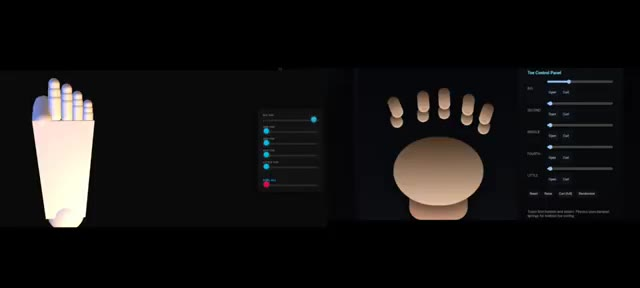
*Interface montrant une modélisation 3D de pieds avec des panneaux de contrôle des orteils.*

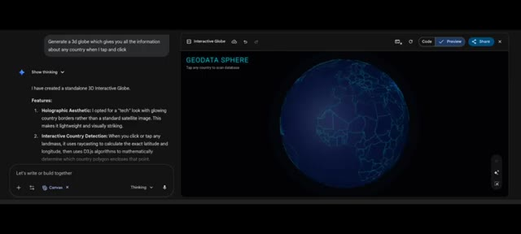
*Interface de Gemini affichant un globe 3D interactif et le prompt de génération.*

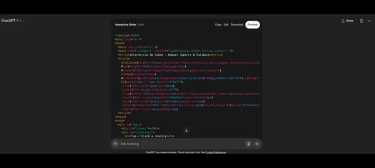
*Interface de ChatGPT 5.1 affichant le code HTML/CSS généré pour un globe interactif.*

---

### ⏱️ `[00:03:16 - 00:03:43]` | Segment #08

**🔊 Audio (Transcription Intégrale Mot pour Mot en Français) :**
> Il écrit le code, mais quand je prévisualise, parfois cela montre un bug et demande un accès à Internet. Mais ça échoue à chaque fois, même après l'avoir autorisé et avoir cliqué sur corriger le bug, ça échoue. Sur X, j'ai vu cet exemple. Cette personne a fait un éditeur de Lego 3D, qui a l'air incroyable. J'ai donc utilisé un simple prompt textuel unique qui est : créer un éditeur de Lego 3D. Et voici le résultat de Gemini.

**👁️ Analyse Visuelle d'Écran (gemini-3.5-flash-lite) :**
**Interface & Outils** : Interface web de ChatGPT et de Gemini, ainsi qu'une publication sur le réseau social X (Twitter).

**Contenu textuel & Code** : Code source HTML, balises de style, texte de prévisualisation "Interactive Globe", publication sur X de Pietro Schirano (@skirano) mentionnant la création d'un éditeur de Lego 3D via Gemini 3 Pro, prompt "create a 3D LEGO editor", et panneau de fonctionnalités de Gemini listant "3D Building Environment" et "Brick Selection".

**Action / Démonstration** : Le présentateur montre d'abord des bugs de code et de prévisualisation sur ChatGPT, puis présente un exemple réussi trouvé sur X, et enfin le résultat généré par un prompt simple dans Gemini affichant l'éditeur 3D.

*Image #1 : Interface de ChatGPT affichant du code HTML brut dans un panneau de prévisualisation sombre.*

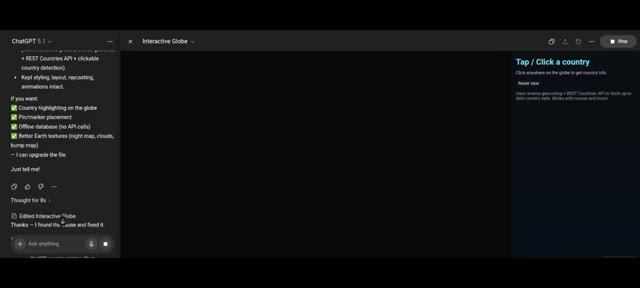
*Image #2 : Interface de ChatGPT montrant un volet latéral avec des options de configuration et une zone de prévisualisation sombre.*

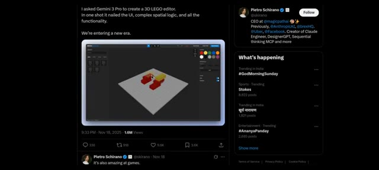
*Image #3 : Publication sur le réseau social X par Pietro Schirano montrant une capture d'écran d'un éditeur de Lego 3D fonctionnel.*

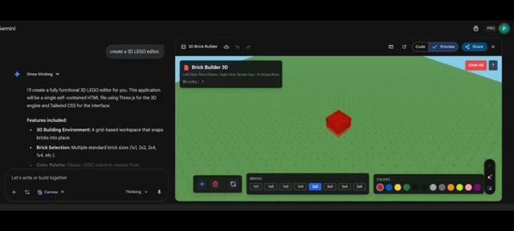
*Image #4 : Interface de Gemini affichant le prompt textuel "create a 3D LEGO editor" et un aperçu graphique de l'éditeur 3D avec une brique rouge.*

---

### ⏱️ `[00:03:43 - 00:04:04]` | Segment #09

**🔊 Audio (Transcription Intégrale Mot pour Mot en Français) :**
> Il génère effectivement un éditeur 3D de Lego à partir d'une simple invite textuelle. Je peux ajouter des Lego, changer les briques, ce qui signifie la taille et la couleur des Lego, faire pivoter, supprimer. Et si je clique sur tout effacer, cela efface tous les Lego. Il a également ajouté des instructions sur la façon d'utiliser toutes ces options. Incroyable. Gemini fait vraiment du bon travail.

**👁️ Analyse Visuelle d'Écran (gemini-3.5-flash-lite) :**
**Interface & Outils** : Éditeur de code et application 3D "Brick Builder 3D" propulsée par Gemini (HTML, Three.js, Tailwind CSS).

**Contenu textuel & Code** : Texte de l'invite "create a 3D LEGO editor.", description des fonctionnalités, palette de sélection de briques (1x1, 1x2, 2x2, 2x4, etc.) et de couleurs, bouton "Clear All", et instructions d'utilisation (Left Click, Right Drag, Scroll, R Key, Delete Key).

**Action / Démonstration** : Démonstration de l'éditeur 3D de Lego généré par IA, placement de briques, modification des tailles/couleurs, et affichage du panneau d'aide.

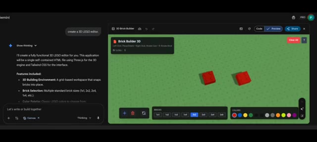
*Interface de Gemini affichant l'éditeur 3D de Lego généré par IA avec les blocs rouges placés sur une grille verte.*

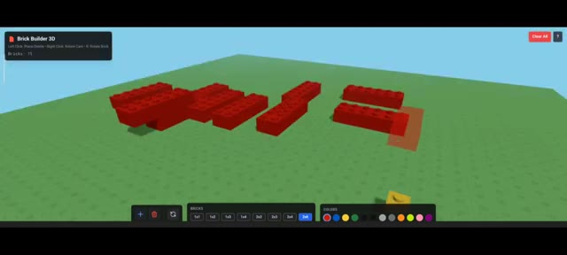
*Vue agrandie de l'éditeur Brick Builder 3D montrant plusieurs briques Lego rouges et une brique jaune assemblées sur l'espace de travail.*

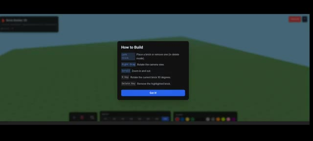
*Fenêtre d'instructions "How to Build" affichant les raccourcis clavier et les commandes de la souris pour manipuler l'éditeur 3D.*

---

### ⏱️ `[00:04:04 - 00:04:33]` | Segment #10

**🔊 Audio (Transcription Intégrale Mot pour Mot en Français) :**
> De l'autre côté, GPT 5.1 génère le code, mais n'est pas capable de l'exécuter. Il affiche un certain type d'erreur. J'ai essayé plusieurs fois, mais ça ne fonctionne pas. Ça a encore échoué. À partir de ces exemples, une chose est claire. Gemini peut comprendre votre invite simple et donner le résultat requis. C'est très utile pour les non-techniciens. Vous pouvez utiliser Gemini 3 dans l'application Gemini et Google AI Studio. C'est ma recherche. Si vous l'aimez, veuillez vous abonner.

**👁️ Analyse Visuelle d'Écran (gemini-3.5-flash-lite) :**
**Interface & Outils** : Interface de développement et de génération de code (type ChatGPT/interface de prévisualisation de code React avec options Copy, Edit, Download, Preview).

**Contenu textuel & Code** : Code source en TypeScript/React pour un éditeur de briques LEGO 3D (utilisation de React, useRef, useState, useMemo, useEffect, Canvas de @react-three/fiber, OrbitControls, etc.).

**Action / Démonstration** : Présentation du code généré par l'IA et de l'éditeur de briques 3D interactif généré pour illustrer la comparaison des performances.

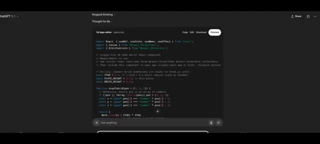
*Affichage d'un éditeur de code et de composants React pour un éditeur 3D de LEGO.*

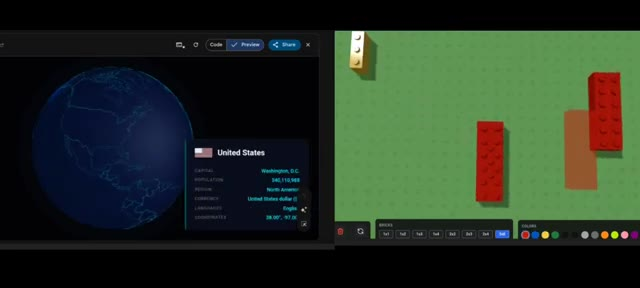
*Affichage côte à côte d'une interface cartographique interactive (globe terrestre avec fiche d'information sur les États-Unis) et d'un éditeur de briques LEGO interactif.*

---
