# 🎬 Cette IA crée des vidéos ultra-réalistes ! wan ai

> **Chaîne** : [Pursuing AI](https://www.youtube.com/@PursuingAi)  
> **Titre original** : `This AI Makes Ultra-Real Videos! wan ai`  
> **Lien YouTube** : [https://www.youtube.com/watch?v=2vmgejjKkPw](https://www.youtube.com/watch?v=2vmgejjKkPw)  
> **Date de publication** : 2025-11-25  
> **Durée** : 03m 01s (`181s`)  
> **Identifiant vidéo** : `2vmgejjKkPw`  
> **Fiche Web Interactive** : [2025-11-25_YT-2vmgejjKkPw_Cette IA crée des vidéos ultra-réalistes ! wan ai_by-whisper-v3-large-turbo+gemini-3.5-flash-lite.html](2025-11-25_YT-2vmgejjKkPw_Cette IA crée des vidéos ultra-réalistes ! wan ai_by-whisper-v3-large-turbo+gemini-3.5-flash-lite.html)  
> **Captures de démonstration clés** : `23 captures réelles (anti-talking-head)`  
> **Modèles utilisés** : Audio: `large-v3-turbo` (Faster-Whisper int8 VPS) | Vision: `gemini-3.5-flash-lite` (Google AI Studio API)  

---

## 📌 Synthèse Exécutive & Outils

### 📌 Résumé

La vidéo de Pursuing AI met en lumière **WAN 2.5**, un outil de pointe en matière d'intelligence artificielle générative, capable de produire des vidéos ultra-réalistes dotées d'un audio natif parfaitement synchronisé. En explorant les fonctionnalités de cette plateforme, le créateur démontre la puissance des technologies de conversion d'image en vidéo (*image-to-video*) et de texte en vidéo (*text-to-video*). À travers des démonstrations saisissantes de réalisme — qu'il s'agisse de capturer un moment estival nostalgique à partir d'une simple photo ou de modéliser une musicienne face à des montagnes — la vidéo illustre la capacité de WAN 2.5 à gérer avec une précision troublante les expressions faciales, les mouvements anatomiques complexes et les arrière-plans cinématographiques. 

La méthode présentée repose sur un workflow accessible mais hautement performant : l'utilisateur peut soit importer une image de référence pour l'animer, soit rédiger un prompt textuel détaillé, en s'appuyant si nécessaire sur un guide de prompts externe pour maîtriser l'éclairage et les dynamiques de plans. De plus, l'outil intègre une fonctionnalité performante de création d'humains numériques (*digital humans*) à partir d'une image fixe et d'un fichier audio, ouvrant la voie à des applications narratives et publicitaires poussées. Structurée autour de différents paliers tarifaires basés sur un système de crédits, la plateforme démocratise l'accès à la production audiovisuelle haute définition tout en répondant aux exigences des professionnels de la création de contenu.

Pour les créateurs vidéo, l'adoption de WAN 2.5 représente un levier stratégique majeur pour réduire drastiquement les coûts de production tout en maximisant l'impact visuel. L'intégration native de l'audio et la flexibilité des formats permettent d'itérer rapidement sur des concepts créatifs variés, qu'il s'agisse de clips promotionnels, de fictions ou de contenus réseaux sociaux. En maîtrisant la tarification par crédits (qui module le coût selon la résolution, de 480p à 720p) et en s'appuyant sur les options de licence commerciale incluses dès les premiers abonnements, les vidéastes disposent d'un arsenal technologique complet pour transformer radicalement leur pipeline de production sans nécessiter de lourdes équipes de tournage.

### 🛠️ Outils, Modèles & Logiciels Présentés

* **WAN 2.5** : Modèle et plateforme d'intelligence artificielle tout-en-un servant de moteur central pour la génération de vidéos ultra-réalistes, le traitement texte-vers-vidéo, image-vers-vidéo, et la création d'humains numériques avec audio natif synchronisé.
* **Guide de prompts** : Ressource externe liée dans la description de la vidéo, conçue pour aider les utilisateurs à structurer leurs requêtes textuelles afin de maîtriser l'éclairage, les mouvements de caméra et les émotions des personnages.
* **Section d'exploration de WAN 2.5** : Vitrine interactive intégrée à la plateforme permettant de consulter une galerie d'exemples concrets générés par la communauté pour s'inspirer des meilleures pratiques.

### 🔑 Points Clés & Enseignements Stratégiques

* **Maîtrise du double paradigme de génération** : Exploiter à la fois le *text-to-video* pour partir d'une feuille blanche et l'*image-to-video* pour insuffler du mouvement à des assets visuels existants garantit une polyvalence artistique maximale.
* **Gestion économique des crédits** : Adapter la résolution de sortie en fonction des besoins du projet — en privilégiant le 480p (5 crédits) pour les phases de test et le 720p (9 crédits) pour les rendus finaux — permet d'optimiser l'investissement financier.
* **Immersion et synchronisation audio native** : Profiter de la capacité de WAN 2.5 à générer un audio parfaitement calé sur les mouvements de la scène visuelle pour renforcer instantanément l'illusion de réalisme.
* **Optimisation des prompts par des guides dédiés** : S'appuyer sur des frameworks de rédaction structurés pour spécifier explicitement l'éclairage, la cinématographie et le comportement des personnages, éliminant ainsi le hasard dans les résultats.
* **Création simplifiée d'humains numériques** : Combiner une image fixe de personnage avec un flux audio et une description textuelle du mouvement pour produire rapidement des avatars parlants hautement expressifs.
* **Rendu anatomique et facial de haute précision** : Observer le comportement des mains, des expressions du visage et de la profondeur de champ dans les arrières-plans pour s'assurer que l'IA gère correctement la complexité physique.
* **Exploration de la galerie communautaire** : Utiliser la section d'exploration de la plateforme comme source d'inspiration pour identifier les types de prompts et de styles visuels qui fonctionnent le mieux.
* **Stratégie d'entrée de gamme flexible** : Démarrer avec la formule starter à 9,90 $ (100 crédits) pour valider le retour sur investissement avant de basculer vers des forfaits supérieurs (Basic, Plus, Professionnel) offrant des files d'attente accélérées.
* **Exploitation commerciale des livrables** : S'assurer que le plan d'abonnement choisi autorise l'utilisation commerciale des vidéos générées pour sécuriser la monétisation des projets professionnels.
* **Évaluation du coût par crédit** : Calculer le ratio coût/unité (environ 0,09 $ par crédit en formule starter) pour budgétiser précisément chaque campagne de production vidéo.
* **Anticipation des limites de file d'attente** : Choisir son niveau d'abonnement en fonction de l'urgence de livraison, les forfaits supérieurs garantissant des vitesses de traitement et des quotas adaptés aux cadences professionnelles.

---

## ⏱️ Chronologie & Transcription Complète Audio & Visuelle (Mot pour Mot)

### ⏱️ `[00:00:01 - 00:00:21]` | Segment #01

**🔊 Audio (Transcription Intégrale Mot pour Mot en Français) :**
> Bonsoir à tous. Ce soir, je veux partager de puissantes leçons sur l'intelligence artificielle que j'ai apprises en explorant l'IA. Ce time-lapse a l'air réel. Cette vidéo a aussi l'air réelle. Et honnêtement, celle-ci est absolument insensée. Et devinez quoi ? Tous ces clips sont générés par IA à l'aide d'un seul outil, WAN 2.5.

**👁️ Analyse Visuelle d'Écran (gemini-3.5-flash-lite) :**
**Interface & Outils** : Présentation de clips vidéo générés par IA (outil WAN 2.5).

**Contenu textuel & Code** : Visuels réalistes générés par intelligence artificielle : timelapse, scène de forêt, patinoire, danseur sous la pluie, chantier de grues.

**Action / Démonstration** : Démonstration visuelle de différents clips vidéo générés par le modèle WAN 2.5.

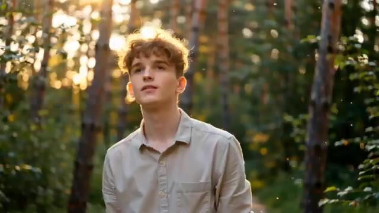
*Clip vidéo généré par IA montrant un jeune homme dans une forêt sous le soleil couchant.*

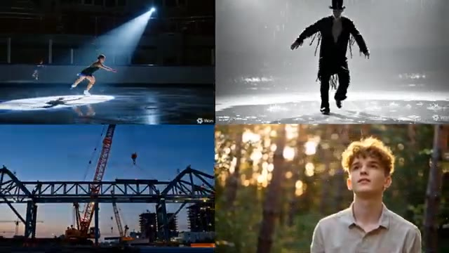
*Grille de quatre clips vidéo générés par IA montrant diverses scènes (patinage artistique, danseur sous la pluie, grues de chantier, jeune homme dans la forêt).*

---

### ⏱️ `[00:00:22 - 00:00:44]` | Segment #02

**🔊 Audio (Transcription Intégrale Mot pour Mot en Français) :**
> C'est Pursuing AI, et vous regardez le rapport de recherche. WAN 2.5 est actuellement l'un des outils les plus puissants pour générer de l'audio et de la vidéo natifs. Ce soir, je veux partager un site web puissant sur les vidéos par IA qui... Vous pouvez créer à la fois de l'image vers vidéo et du texte vers vidéo, avec un contrôle total sur les formats d'image, les résolutions et la durée.

**👁️ Analyse Visuelle d'Écran (gemini-3.5-flash-lite) :**
**Interface & Outils** : Navigateur web affichant le site internet officiel de l'outil de génération vidéo WAN 2.5.

**Contenu textuel & Code** : Texte affiché : "Create Cinematic AI Videos — with Wan2.5", "Image-to-Video", "Text-to-Video", "Duration: 5s", "Resolution: 480P", "Aspect Ratio: 16:9", et un champ de prompt textuel.

**Action / Démonstration** : Présentation et navigation sur le site web de l'outil WAN 2.5, mettant en avant les fonctionnalités de création de vidéos à partir d'images ou de textes avec des options de configuration.

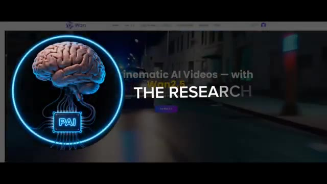
*Page d'accueil du site Wan 2.5 avec un logo représentant un cerveau en incrustation circulaire.*

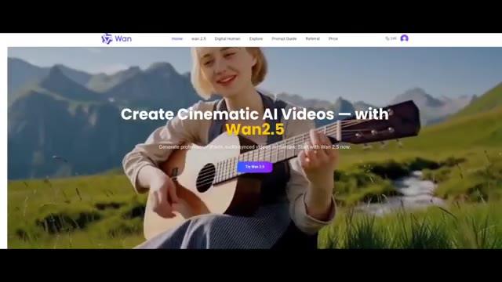
*Page d'accueil du site Wan 2.5 montrant une femme jouant de la guitare dans un paysage montagneux avec le texte de présentation.*

*Interface de génération vidéo de Wan 2.5 avec les options Image-to-Video et Text-to-Video, les réglages de durée et de résolution, ainsi qu'un aperçu vidéo.*

---

### ⏱️ `[00:00:45 - 00:01:04]` | Segment #03

**🔊 Audio (Transcription Intégrale Mot pour Mot en Français) :**
> Pour référence, générer une vidéo de 5 secondes en 480p coûte 5 crédits, et générer la même vidéo de 5 secondes en 720p coûte 9 crédits. Maintenant, laissez-moi vous montrer quelques tests que j'ai effectués en utilisant WAN 2.5. D'abord, j'ai téléchargé cette image et je lui ai demandé de créer un moment estival nostalgique. Le résultat était impressionnant.

**👁️ Analyse Visuelle d'Écran (gemini-3.5-flash-lite) :**
**Interface & Outils** : Interface web de l'outil de génération vidéo WAN (version 2.5).

**Contenu textuel & Code** : Menus de navigation (Home, Wan 2.5, Digital Human, Explore, Prompt Guide, Referral, Price), options de durée (5s, 10s), de résolution (480P, 720P, 1080P), et boutons de génération violet "Generate Video".

**Action / Démonstration** : Présentation des coûts de génération en crédits selon la résolution et démonstration d'un test de génération vidéo à partir d'une image.

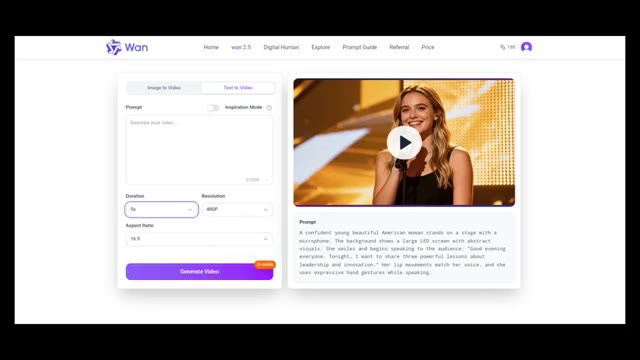
*Interface de l'outil WAN montrant les options de génération de vidéo (durée, résolution, ratio) et le coût en crédits (5 credits).*

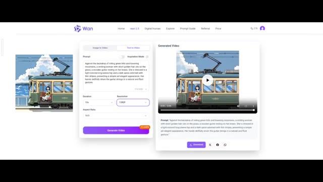
*Interface de WAN montrant une image importée, le prompt textuel et le résultat vidéo généré avec un bouton de téléchargement.*

---

### ⏱️ `[00:01:04 - 00:01:28]` | Segment #04

**🔊 Audio (Transcription Intégrale Mot pour Mot en Français) :**
> Les visuels semblaient authentiques et l'audio était parfaitement synchronisé avec la scène. Ensuite, j'ai essayé l'option texte-vidéo. Je lui ai demandé de générer une femme jouant de la guitare avec un arrière-plan de montagnes. Et voici le résultat. Regardez simplement l'arrière-plan, les mouvements des mains et les expressions faciales.

**👁️ Analyse Visuelle d'Écran (gemini-3.5-flash-lite) :**
**Interface & Outils** : Interface web de l'outil de génération vidéo IA "Wan" (Wan 2.5).

**Contenu textuel & Code** : Texte du prompt visible : "A vintage tram glides along the coast. Outside, blue sky and sparkling sea. A girl sits by the window, holding sunflowers, gazing softly. Sunlight dances, wind brushes her hair - a quiet, nostalgic summer moment." Paramètres affichés : Durée 5s, Résolution 720P.

**Action / Démonstration** : Présentation de l'interface de génération vidéo par IA et visualisation des résultats de rendu vidéo (tramway et femme jouant de la guitare).

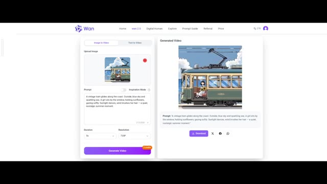
*Interface de Wan montrant l'option Image-to-Video et le résultat généré d'un tramway vintage.*

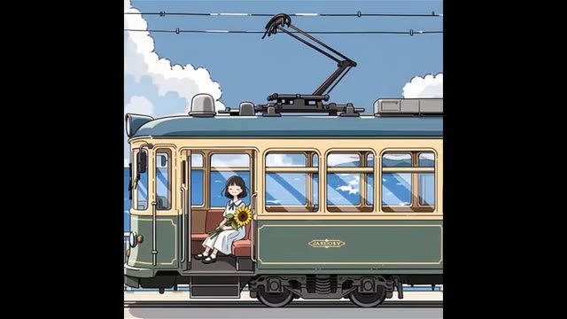
*Gros plan sur la vidéo générée montrant le tramway vintage longeant la côte avec une fille assise à l'intérieur.*

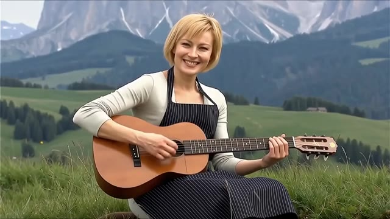
*Résultat de génération vidéo par IA montrant une femme blonde jouant de la guitare dans un décor de montagne.*

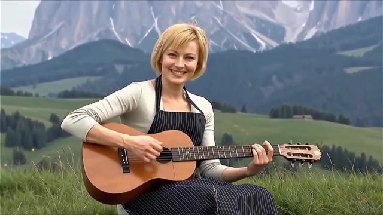
*Gros plan sur la femme jouant de la guitare démontrant la fluidité des mouvements des mains et du visage générés par l'IA.*

---

### ⏱️ `[00:01:29 - 00:01:48]` | Segment #05

**🔊 Audio (Transcription Intégrale Mot pour Mot en Français) :**
> Tout a l'air incroyablement réel. Vraiment incroyable. Et si vous n'avez pas confiance en vous pour rédiger des prompts, ne vous inquiétez pas. Vous pouvez utiliser leur guide de prompts lié dans la description et le commentaire épinglé. Ce guide vous aide à créer facilement des vidéos de haute qualité. Il explique tout, comment gérer l'éclairage, créer des plans cinématographiques, contrôler le mouvement, façonner les émotions des personnages, et bien plus encore.

**👁️ Analyse Visuelle d'Écran (gemini-3.5-flash-lite) :**
**Interface & Outils** : Navigateur web affichant un guide de prompts et des exemples de vidéos générées par IA.

**Contenu textuel & Code** : Titres visibles : "Cinematic Aesthetics", "Light Source Type", "Motion Control", "Movement", accompagnés de descriptions textuelles de prompts et de mini-lecteurs vidéo.

**Action / Démonstration** : Le présentateur fait défiler le guide de prompts en ligne pour illustrer la structure et les exemples fournis pour maîtriser la génération de vidéos.

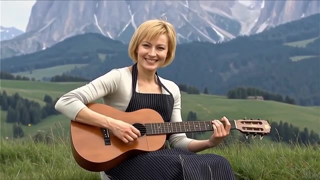
*Extrait vidéo généré par IA montrant une femme blonde souriante jouant de la guitare dans un champ verdoyant avec des montagnes en arrière-plan.*

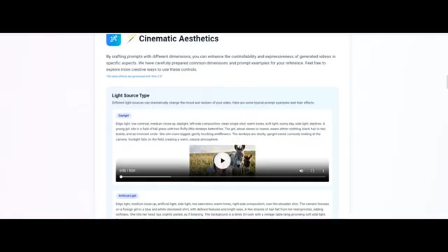
*Page web du guide de prompts montrant la section "Cinematic Aesthetics" avec des exemples sur le type de source lumineuse ("Light Source Type").*

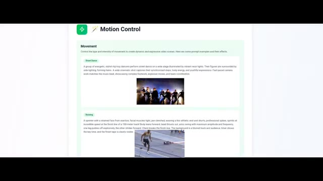
*Page web du guide de prompts montrant la section "Motion Control" avec des exemples de mouvements de danse et de course.*

---

### ⏱️ `[00:01:48 - 00:02:06]` | Segment #06

**🔊 Audio (Transcription Intégrale Mot pour Mot en Français) :**
> Vous pouvez également créer des humains numériques sur ce site Web. Il vous suffit de télécharger une image de votre personnage, d'ajouter de l'audio, de décrire le mouvement, de cliquer sur générer, et vous obtiendrez instantanément votre humain numérique. J'ai été second après Joe toute ma vie dans tout. Et je ne serai pas la personne dont vous vous contentez simplement parce que vous ne pouvez pas l'avoir.

**👁️ Analyse Visuelle d'Écran (gemini-3.5-flash-lite) :**
**Interface & Outils** : Interface web de création d'humains numériques et de génération vidéo par IA.

**Contenu textuel & Code** : Menus "Create Your Digital Human", "Upload Image", "Upload Audio", "Prompt", "Resolution" (480P, 720P) et bouton "Generate Now".
[SS_ACTION] Démonstration visuelle de l'interface de création d'humains virtuels et présentation de différents exemples de générations vidéo réussies.

**Action / Démonstration** : Démonstration pédagogique et présentation du workflow.

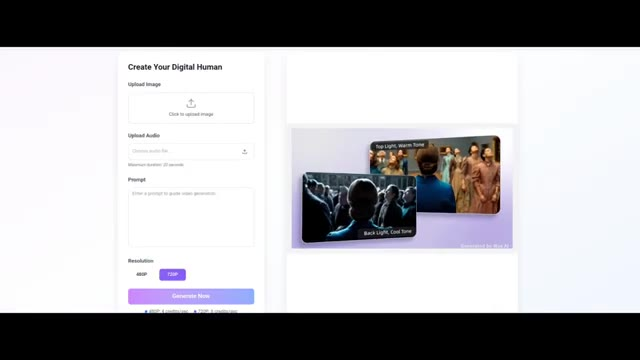
*Interface de création d'humains numériques montrant les options de téléchargement d'image, d'audio et de description textuelle.*

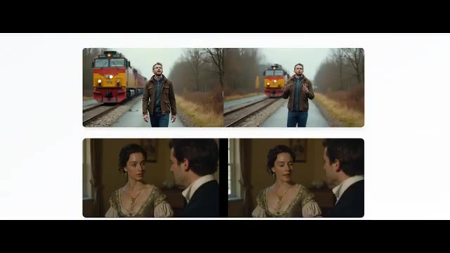
*Exemples de vidéos générées montrant des personnages animés dans divers décors (train et scène d'époque).*

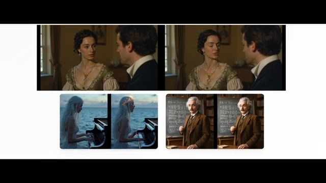
*Présentation d'autres exemples de rendus vidéo générés par IA, incluant des scènes de piano au bord de l'eau et un portrait d'Albert Einstein.*

---

### ⏱️ `[00:02:07 - 00:02:25]` | Segment #07

**🔊 Audio (Transcription Intégrale Mot pour Mot en Français) :**
> Si vous explorez la section d'exploration du site web, vous trouverez des tonnes d'exemples incroyables de WAN 2.5 qui montrent à quel point cet outil est vraiment puissant. Le lien du site web est dans la description et le commentaire épinglé. Maintenant, parlons des tarifs. Comme vous le savez, chaque bon produit a un coût. Et WAN 2.5 ne fait pas exception.

**👁️ Analyse Visuelle d'Écran (gemini-3.5-flash-lite) :**
**Interface & Outils** : Site web officiel de Wan 2.5 (section Explore et page Tarifs / Pricing).

**Contenu textuel & Code** : En-tête "Wan2.5 Explore", description "Discover stunning AI-generated videos...", cartes d'exemples avec boutons "Copy Prompt" et "Details". Page de tarification affichant quatre formules : Starter (9,9 $ / 100 crédits), Basic (29,9 $ / 330 crédits), Plus (49,9 $ / 600 crédits, marqué "Most Popular") et Professional (99,9 $ / 1250 crédits) avec les détails de chaque offre (accès unique, export HD, licence commerciale, support).

**Action / Démonstration** : Défilement (scroll) à travers la galerie d'exemples de la section explore du site web, puis transition vers l'affichage des différentes options de tarification.

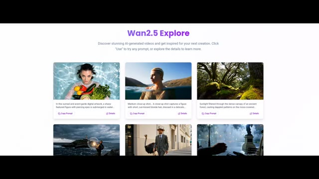
*Section d'exploration du site web de Wan 2.5 présentant des exemples de vidéos générées par IA avec les prompts associés.*

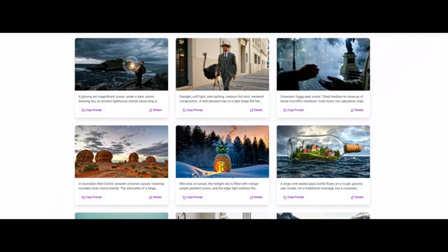
*Grille d'exemples supplémentaires de vidéos générées par IA sur la page d'exploration de Wan 2.5.*

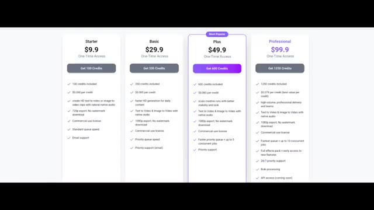
*Grille tarifaire de Wan 2.5 montrant les différentes offres : Starter, Basic, Plus et Professional.*

---

### ⏱️ `[00:02:26 - 00:02:44]` | Segment #08

**🔊 Audio (Transcription Intégrale Mot pour Mot en Français) :**
> Il propose quatre formules. La formule starter commence à 9,9, vous donnant 100 crédits, ce qui signifie que chaque crédit coûte environ 0,09 dollar. Plutôt bien. Avec la formule starter, vous pouvez créer des vidéos HD à partir de texte et d'images, utiliser les résultats commercialement, bénéficier d'une vitesse de file d'attente standard et recevoir un support par e-mail.

**👁️ Analyse Visuelle d'Écran (gemini-3.5-flash-lite) :**
**Interface & Outils** : Page web affichant les grilles de tarification d'un outil vidéo par IA.

**Contenu textuel & Code** : Quatre colonnes de formules : "Starter" à 9,9 $ (100 crédits, 0,090 $ par crédit, création de vidéos HD texte/image, exportation 720p sans filigrane, licence commerciale, file d'attente standard, support email), "Basic" à 29,9 $, "Plus" à 49,9 $ (marquée "Most Popular"), et "Professional" à 99,9 $.

**Action / Démonstration** : Affichage de la grille tarifaire pour illustrer les différentes options de prix et les fonctionnalités incluses.

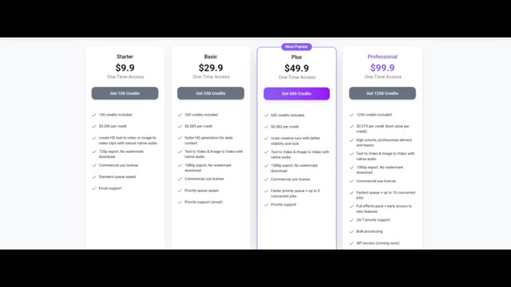
*Tableau comparatif des quatre formules d'abonnement (Starter, Basic, Plus, Professional) avec leurs tarifs et fonctionnalités.*

---

### ⏱️ `[00:02:44 - 00:03:00]` | Segment #09

**🔊 Audio (Transcription Intégrale Mot pour Mot en Français) :**
> Ensuite, vous avez le forfait de base, à partir de 29,9, avec 330 crédits, suivi des forfaits plus et professionnel qui offrent une génération plus rapide et des limites plus élevées. Donc, si vous souhaitez créer des vidéos cinématiques de haute qualité pour vos projets, vous pouvez consulter le lien dans la description et le commentaire épinglé.

**👁️ Analyse Visuelle d'Écran (gemini-3.5-flash-lite) :**
**Interface & Outils** : Page web de tarification et interface principale de l'outil Wan 2.5 AI Video Generator.

**Contenu textuel & Code** : Sur l'image 1, les options de tarification : Starter (9,9$), Basic (29,9$), Plus (49,9$) et Professional (99,9$) avec leurs crédits respectifs (100, 330, 600, 1250 crédits). Sur l'image 2, le titre "Wan 2.5 AI Video Generator with Audio Sync" et les options de prompt.

**Action / Démonstration** : Présentation des différents abonnements et des fonctionnalités de l'outil de génération de vidéo par IA.

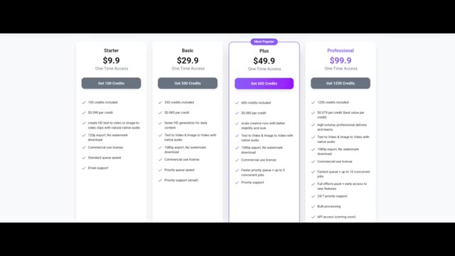
*Tableau des différents forfaits et tarifs de la plateforme (Starter à 9,9$, Basic à 29,9$, Plus à 49,9$ et Professional à 99,9$).*

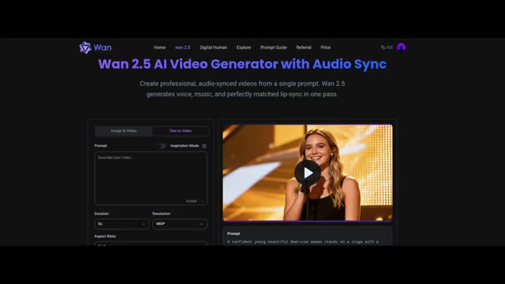
*Page d'accueil de l'outil Wan 2.5 AI Video Generator avec l'interface de génération vidéo et un aperçu vidéo.*

---
