# 🎬 Gemini 3 vs GPT 5.1 vs Opus 4.5 : Le test ultime au sommet

> **Chaîne** : [Pursuing AI](https://www.youtube.com/@PursuingAi)  
> **Titre original** : `Gemini 3 vs GPT 5.1 vs Opus 4.5. Peak Level Testing`  
> **Lien YouTube** : [https://www.youtube.com/watch?v=JluJkVTXh-0](https://www.youtube.com/watch?v=JluJkVTXh-0)  
> **Date de publication** : 2025-11-29  
> **Durée** : 03m 50s (`230s`)  
> **Identifiant vidéo** : `JluJkVTXh-0`  
> **Fiche Web Interactive** : [2025-11-29_YT-JluJkVTXh-0_Gemini 3 vs GPT 5.1 vs Opus 4.5 Le test ultime au sommet_by-whisper-v3-large-turbo+gemini-3.5-flash-lite.html](2025-11-29_YT-JluJkVTXh-0_Gemini 3 vs GPT 5.1 vs Opus 4.5 Le test ultime au sommet_by-whisper-v3-large-turbo+gemini-3.5-flash-lite.html)  
> **Captures de démonstration clés** : `24 captures réelles (anti-talking-head)`  
> **Modèles utilisés** : Audio: `large-v3-turbo` (Faster-Whisper int8 VPS) | Vision: `gemini-3.5-flash-lite` (Google AI Studio API)  

---

## 📌 Synthèse Exécutive & Outils

### 📌 Résumé
Dans cette vidéo de "Pursuing AI" intitulée « Gemini 3 vs GPT 5.1 vs Opus 4.5 : Le test ultime au sommet », le créateur pousse les limites des modèles d'intelligence artificielle de pointe à travers des tests de génération de code et de simulations interactives complexes (3.js, animations et interfaces graphiques dynamiques). L'objectif est d'évaluer la capacité de ces super-intelligences à concevoir des applications visuelles en temps réel, depuis un jeu de vol d'oiseaux en essaim jusqu'à des simulations de spirographes et de mains articulées, en passant par la gestion précise des caméras et de l'UI.

La méthodologie du créateur repose sur une batterie de prompts ultra-exigeants comportant des contraintes géométriques, comportementales et fonctionnelles strictes (gestion de bibliothèques 3D, boucles d'animation continues, cinématiques à la première personne et contrôles utilisateur). Chaque modèle est soumis aux mêmes exigences de rendu et d'interactivité, permettant d'analyser en profondeur leurs forces et leurs faiblesses structurelles, qu'il s'agisse de la fidélité plastique des textures, de la fluidité des mouvements de foule ou de la robustesse de la logique de programmation embarquée.

Pour les créateurs de vidéo et développeurs, cette analyse comparative offre des enseignements majeurs sur l'état de l'art des générateurs multimodaux et text-to-code. Elle met en lumière les arbitrages actuels entre la richesse esthétique des environnements et la précision de la logique algorithmique. Les créateurs apprennent ainsi à anticiper les artefacts visuels — tels que les mouvements de caméra erratiques ou les bugs de modélisation anatomique —, tout en identifiant quel modèle privilégier selon que l'on recherche une interface riche en fonctionnalités ou une simulation physique rigoureuse et continue.

### 🛠️ Outils, Modèles & Logiciels Présentés
* **Opus 4.5** : Modèle linguistique et de génération de code avancé, utilisé pour concevoir les simulations 3.js, offrant des interfaces riches en fonctionnalités mais sujet à des bugs géométriques et anatomiques majeurs.
* **GPT 5.1** : Modèle de pointe testé pour sa capacité à structurer des environnements visuels réalistes et des interfaces de contrôle, se distinguant par une meilleure fidélité plastique mais des limites sur les boucles d'animation continues.
* **Gemini 3** : Modèle haut de gamme évalué pour sa puissance de calcul globale, ayant surclassé ses concurrents sur la gestion des échelles d'environnement, la rotation continue des spirographes et la modélisation cinématique réaliste.
* **Seedance 2.5** : Solution de génération et de traitement vidéo par IA identifiée dans l'écosystème technique du créateur pour appuyer le pipeline de production visuelle.
* **Kling 3.0** : Modèle de génération vidéo par IA mentionné parmi les outils de référence pour l'enrichissement et le rendu des séquences dynamiques.
* **Midjourney** : Logiciel de génération d'images par IA utilisé en amont pour la conception et l'idéation visuelle des assets graphiques.
* **Génération Vidéo IA** : Catégorie globale d'outils et de technologies d'intelligence artificielle mobilisés pour illustrer et synthétiser les comparatifs de performance.
* **3.js** : Bibliothèque JavaScript fondamentale exigée dans les prompts pour bâtir l'ensemble des simulations 3D interactives et des environnements manipulables.

### 🔑 Points Clés & Enseignements Stratégiques
* **Complexité des prompts de simulation** : L'utilisation de bibliothèques tierces comme 3.js exige des instructions textuelles extrêmement rigoureuses pour espérer obtenir des comportements physiques et des rendus 3D exploitables.
* **Le piège de la cinématique erratique** : Opus 4.5 a démontré une fâcheuse tendance à générer des mouvements de caméra beaucoup trop agités, nuisant à la lisibilité et à l'immersion de la scène en vue subjective.
* **Gestion des morphologies complexes** : La modélisation de groupes d'animaux (comme les oiseaux en essaim) reste un défi critique, les modèles générant souvent des formes rigides en papier plié ou des dynamiques de vol non réalistes.
* **Arbitrage entre richesse d'UI et logique** : Opus 4.5 excelle dans la quantité de fonctionnalités d'interface proposées (boutons de sauvegarde, effets de lueur, réglages fins), mais pèche sur la logique de boucle continue (arrêt prématuré du spirographe).
* **La supériorité de Gemini 3 sur la continuité** : Seul Gemini 3 a réussi à intégrer nativement une rotation fluide et ininterrompue pour la simulation de spirographe, surpassant ses rivaux sur la durabilité des scripts d'animation.
* **Échelle et grandeur des mondes générés** : Gemini 3 se démarque par sa capacité à concevoir des environnements virtuels beaucoup plus vastes et immersifs que GPT 5.1 et Opus 4.5 lors des tests d'essaims.
* **Défis anatomiques de l'IA** : Le test de la main interactive a révélé des ratés spectaculaires (comme les artefacts grotesques d'Opus 4.5), rappelant que la cinématique inverse et le respect des articulations corporelles restent complexes pour les IA text-to-code.
* **Progrès du réalisme ostéo-articulaire** : GPT 5.1 et Gemini 3 ont montré d'excellents résultats sur le contrôle digital par curseurs, Gemini 3 se distinguant particulièrement par le mimétisme organique et les mouvements réalistes du pouce.
* **Gestion des collisions et limites physiques** : Un défaut récurrent observé chez GPT 5.1 lors de la simulation de main réside dans le franchissement des limites anatomiques (les doigts se replient trop loin sous la paume).
* **Sélection du modèle selon l'objectif créatif** : Il est stratégique de choisir son IA en fonction du besoin précis : opter pour la richesse d'interface d'Opus 4.5 (malgré ses bugs), ou privilégier la robustesse cinématique et spatiale de Gemini 3.
* **Importance du débogage itératif** : Aucun modèle n'atteint la perfection du premier coup ; les créateurs doivent intégrer une phase de correction de code pour palier les arrêts de scripts intempestifs ou les défauts de rendu géométrique.

---

## ⏱️ Chronologie & Transcription Complète Audio & Visuelle (Mot pour Mot)

### ⏱️ `[00:00:00 - 00:00:30]` | Segment #01

**🔊 Audio (Transcription Intégrale Mot pour Mot en Français) :**
> Dans cette vidéo, je vais pousser Opus 4.5 dans ses derniers retranchements et le comparer directement à Gemini 3 et GPT 5.1. C'est Pursuing AI, et vous regardez le Research Report. Notre premier test est un jeu de vol d'oiseaux en essaim. Le modèle doit générer une simulation 3D complète avec un comportement de vol réaliste, située au cœur d'un magnifique environnement naturel rempli de végétation, d'arbres et de tout élément supplémentaire que le modèle souhaite ajouter.

**👁️ Analyse Visuelle d'Écran (gemini-3.5-flash-lite) :**
**Interface & Outils** : Interface de simulation 3D interactive, page de présentation logicielle et diapositives de test.

**Contenu textuel & Code** : Texte « GPT-5.1: A smarter, more conversational ChatGPT », « Flocking Bird Requirements », options « Realistic Flocking Behaviour », « Natural Environment (Vegetation, trees, extras) » et contrôles de simulation d'essaim (« Flock Size », « Speed », « World View », « Bird View »).

**Action / Démonstration** : Présentation des exigences du test et affichage des simulations interactives 3D et des interfaces de modèles d'IA.

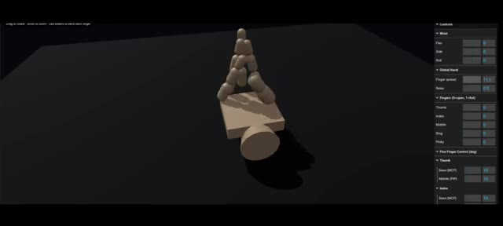
*Simulation 3D interactive montrant un modèle de main articulée avec des panneaux de contrôle des doigts sur le côté droit.*

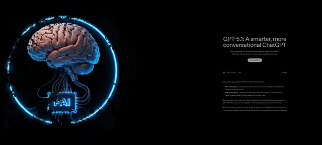
*Écran de présentation de GPT-5.1 affichant le titre « GPT-5.1: A smarter, more conversational ChatGPT » avec une illustration de cerveau lumineux.*

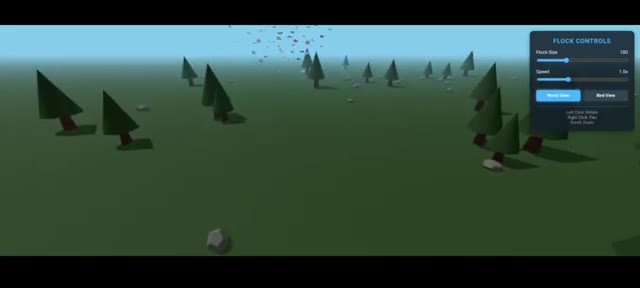
*Simulation 3D d'un jeu de vol d'oiseaux en essaim au-dessus d'une forêt stylisée, avec un panneau « Flock Controls » en haut à droite.*

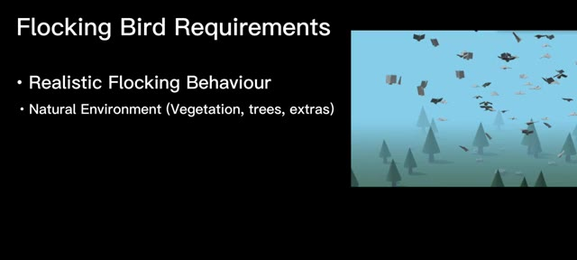
*Diapositive titrée « Flocking Bird Requirements » listant les exigences de la simulation d'oiseaux, accompagnée d'un extrait vidéo de la simulation.*

---

### ⏱️ `[00:00:30 - 00:00:49]` | Segment #02

**🔊 Audio (Transcription Intégrale Mot pour Mot en Français) :**
> Il devrait également inclure un mode de vue d'oiseau où la caméra suit un oiseau sélectionné ainsi que des commandes de base telles que l'ajustement de l'intensité du vol et le changement de vue de la caméra. Et toute la scène doit être construite en utilisant 3.js plus toutes les bibliothèques d'animation compatibles. Voici le résultat d'Opus 4.5.

**👁️ Analyse Visuelle d'Écran (gemini-3.5-flash-lite) :**
**Interface & Outils** : Présentation vidéo avec diapositive textuelle et interface utilisateur de simulation 3D interactive (panneau de contrôle de la simulation avec curseurs et boutons).

**Contenu textuel & Code** : Texte à l'écran : « Flocking Bird Requirements », « Realistic Flocking Behaviour », « Natural Environment (Vegetation, trees, extras) », « Bird View Mode ». Sur l'image 2, le panneau affiche « Bird Flocking Simulation », « Flock Size », « Simulation Speed », « Camera View » (World View / Bird View), et des boutons « Pause » et « Reset Flock ».

**Action / Démonstration** : Affichage des exigences de développement de la simulation 3D, puis démonstration du résultat interactif généré par Opus 4.5 montrant un paysage arboré en 3D avec des oiseaux en vol et une interface de contrôle.

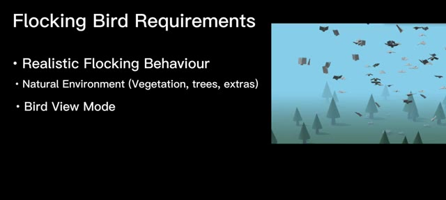
*Diapositive présentant les exigences de la simulation de vol d'oiseaux avec une vidéo en médaillon montrant des oiseaux en 3D dans un environnement naturel.*

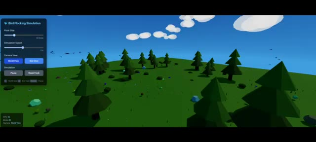
*Interface de la simulation interactive de vol d'oiseaux (« Bird Flocking Simulation ») en 3D avec des contrôles de paramètres à gauche et un rendu graphique en arrière-plan.*

---

### ⏱️ `[00:00:50 - 00:01:24]` | Segment #03

**🔊 Audio (Transcription Intégrale Mot pour Mot en Français) :**
> Il génère le monde tel qu'il lui est demandé, avec de la verdure et de la végétation. Mais regardez les oiseaux. Ils ont de grandes queues. Et depuis la vue en contre-plongée, ils ressemblent à des oiseaux en papier plié. La caméra bouge aussi beaucoup trop et ceci est généré par GPT 5.1, le monde est formidable mais les oiseaux ne le sont pas, leur mouvement de vol en groupe n'est pas très réaliste et les formes des oiseaux ont l'air bizarres et ceci est généré par Gemini 3, il est plus grand que les mondes générés par les autres modèles. L'oiseau rouge est le principal oiseau utilisé pour le mode vue d'oiseau. Cependant, le mouvement de vol en groupe n'est toujours pas aussi bon que prévu.

**👁️ Analyse Visuelle d'Écran (gemini-3.5-flash-lite) :**
**Interface & Outils** : Interface de simulation interactive en 3D (panneau de contrôle 'Bird Flocking Simulation' / 'Flock Controls' avec curseurs de taille de vol et de vitesse, options 'World View' et 'Bird View').

**Contenu textuel & Code** : Texte visible sur les interfaces : 'Bird Flocking Simulation', 'Flock Size', 'Simulation Speed', 'Camera View', 'World View', 'Bird View', 'Simulation', 'Pause', 'Reset Flock', et 'FLOCK CONTROLS'.

**Action / Démonstration** : Navigation et démonstration d'une simulation interactive en 3D représentant un monde low-poly avec des arbres et des oiseaux en mouvement, en ajustant les paramètres de la caméra et du vol.

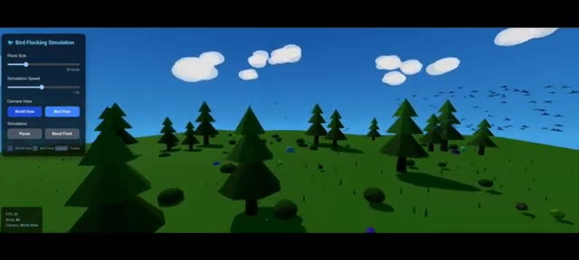
*Simulation de vol d'oiseaux montrant un paysage en 3D low-poly avec des arbres verts, un ciel bleu, des nuages et un panneau de contrôle à gauche.*

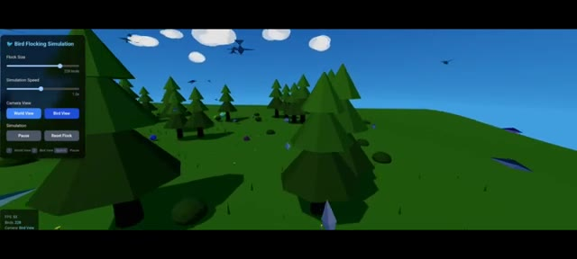
*Vue rapprochée de la simulation de vol d'oiseaux avec des contrôles de taille de vol et de vitesse de simulation affichés sur le panneau latéral gauche.*

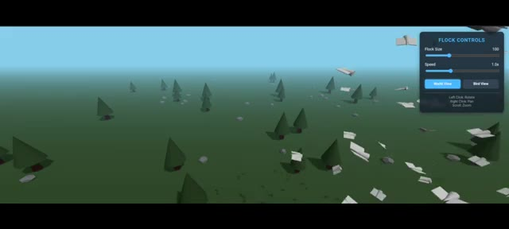
*Vue aérienne de la simulation montrant un paysage avec des sapins low-poly et des objets ressemblant à des oiseaux en papier, avec un panneau de contrôle 'FLOCK CONTROLS' à droite.*

---

### ⏱️ `[00:01:24 - 00:01:53]` | Segment #04

**🔊 Audio (Transcription Intégrale Mot pour Mot en Français) :**
> Ensuite, j'ai exécuté une simulation de spirographe. Les exigences étaient une rotation continue, plusieurs options de formes, des contrôles de couleur et d'autres fonctionnalités de base. Voici le résultat d'Opus 4.5. Il génère la simulation de spirographe comme prévu. Je peux choisir différentes formes, couleurs, et une section d'animation où je peux ajuster la vitesse de dessin, l'épaisseur des traits, la taille de l'engrenage fixe, la taille de l'engrenage mobile, la distance du crayon et les rotations.

**👁️ Analyse Visuelle d'Écran (gemini-3.5-flash-lite) :**
**Interface & Outils** : Interface de démonstration de "Spirograph Studio" générée par une IA (Opus 4.5), avec des panneaux latéraux pour les préréglages de design, les animations et les paramètres d'engrenage.

**Contenu textuel & Code** : Texte à l'écran : "Spirograph Simulation", "Continuous Rotation", "Multiple Shapes", "Colour Controls", "Other Basic Features", "DESIGN PRESETS" (Flower, Star, Mandala, Galaxy, Lotus, Vortex, Snowflake, Atom, DNA Helix, Chaos, Heart, Custom), "ANIMATION" (Drawing Speed 1.0x, Line Thickness 2px), "GEAR PARAMETERS" (Fixed Gear (R) 200, Moving Gear (r) 75, Status: Drawing..., Progress: 68.5%, Points: 365).

**Action / Démonstration** : Présentation des résultats de la simulation de spirographe et affichage des paramètres de contrôle de l'application.

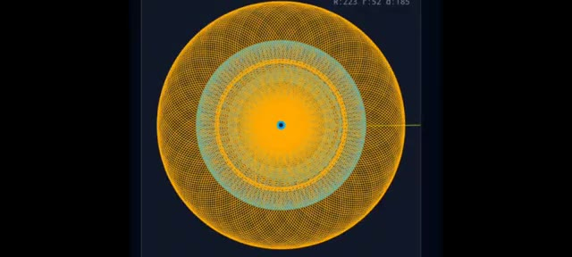
*Résultat d'une simulation de spirographe aux motifs géométriques complexes jaunes et cyan sur fond sombre.*

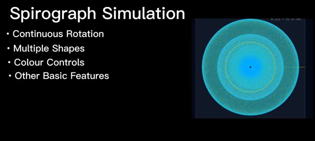
*Diapositive de présentation listant les exigences de la simulation de spirographe avec une illustration à droite.*

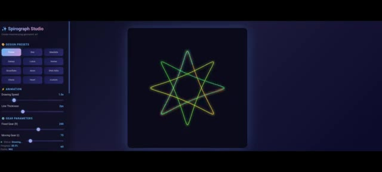
*Interface du logiciel Spirograph Studio affichant un motif en étoile et des panneaux de contrôle à gauche.*

---

### ⏱️ `[00:01:53 - 00:02:14]` | Segment #05

**🔊 Audio (Transcription Intégrale Mot pour Mot en Français) :**
> Il offre également des options supplémentaires comme l'affichage et le masquage des engrenages, un bouton d'activation de l'effet de lueur, l'atténuation de la traînée, la pause, le redémarrage, l'effacement et un bouton de sauvegarde qui enregistre réellement le design créé. Une petite erreur, il ne tourne pas en continu. Il s'arrête après avoir généré la forme complète. C'est la génération de GPT 5.1.

**👁️ Analyse Visuelle d'Écran (gemini-3.5-flash-lite) :**
**Interface & Outils** : Application web interactive de type "Dynamic Spirograph Studio" générée par IA.

**Contenu textuel & Code** : Panneaux de configuration avec des curseurs (Gear Parameters, Fixed Gear, Moving Gear, Pen Distance, Rotations, Drawing Speed, Line Thickness), palettes de couleurs, boutons de contrôle (Pause, Restart, Save) et affichage d'un tracé géométrique lumineux.

**Action / Démonstration** : Démonstration des fonctionnalités de l'interface avec affichage des paramètres de configuration et visualisation de la génération d'un motif de spirographe lumineux.

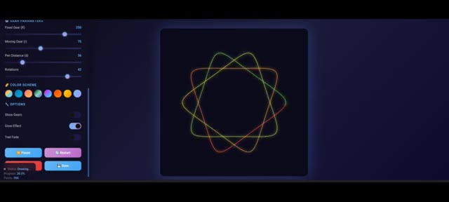
*Interface de l'application montrant les paramètres des engrenages, les palettes de couleurs, les options d'affichage et le rendu géométrique en cours de dessin.*

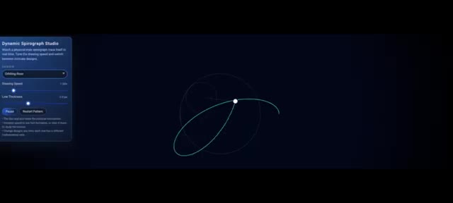
*Interface de Dynamic Spirograph Studio montrant le tracé en cours avec les options de vitesse de dessin et d'épaisseur de ligne.*

---

### ⏱️ `[00:02:14 - 00:02:32]` | Segment #06

**🔊 Audio (Transcription Intégrale Mot pour Mot en Français) :**
> Il ne génère pas beaucoup d'options. Je peux modifier la forme, la vitesse de dessin et l'épaisseur des traits, et il y a des boutons de redémarrage et de pause. Il s'arrête également après avoir généré un diagramme complet. Et voici le résultat de Gemini 3. Il a l'air bien, et quand je l'essaie, il comprend différentes formes, couleurs et contrôles de vitesse.

**👁️ Analyse Visuelle d'Écran (gemini-3.5-flash-lite) :**
**Interface & Outils** : Application web "Dynamic Spirograph Studio" avec panneaux de contrôle latéraux et zone de visualisation graphique centrale.

**Contenu textuel & Code** : Texte "Dynamic Spirograph Studio", curseurs "Drawing Speed", "Line Thickness", "Simulation Speed", "Outer Radius (R)", "Inner Radius (r)", "Pen Offset (d)", boutons "Pause", "Restart Pattern", et options de design rapide ("Classic", "Starflower", "Dense Mesh", "Hypnotic", "Loops").

**Action / Démonstration** : Démonstration de l'application web montrant le tracé dynamique d'une courbe spirographe et la modification des paramètres de configuration.

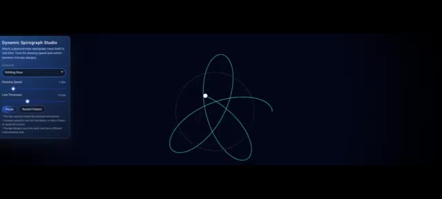
*Interface de l'application Dynamic Spirograph Studio affichant les réglages et le tracé d'une forme géométrique en temps réel.*

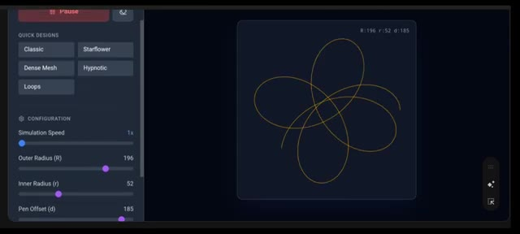
*Interface de configuration du spirographe montrant les boutons de design rapide et les curseurs de simulation.*

---

### ⏱️ `[00:02:32 - 00:02:51]` | Segment #07

**🔊 Audio (Transcription Intégrale Mot pour Mot en Français) :**
> Et elle possède une fonctionnalité que GPT 5.1 et Opus 4.5 n'ont pas pu générer. Une rotation continue. Si je zoome sur la forme, vous pouvez clairement la voir tourner sans s'arrêter. Exactement ce dont j'avais besoin. J'adore cette génération Gemini 3. Ensuite, c'est la simulation de main. La condition est simple.

**👁️ Analyse Visuelle d'Écran (gemini-3.5-flash-lite) :**
**Interface & Outils** : Interface web de simulation et de génération 3D interactive (outil de modélisation/simulation géométrique et articulée).

**Contenu textuel & Code** : Menus de configuration : "Quick Designs" (Classic, Starflower, Dense Mesh, Hypnotic, Loops), "Simulation Speed: 79x", "Outer Radius (R): 196", "Inner Radius (r): 52", "Pen Offset (d): 185". Commandes 3D pour la simulation de main : "Controls", "Wrist", "Global Hand", "Fingers", "Fine Finger Control".

**Action / Démonstration** : Le créateur présente une forme géométrique en rotation continue, puis effectue un zoom avant pour montrer les détails de la texture, avant de passer à une interface de simulation 3D de main articulée.

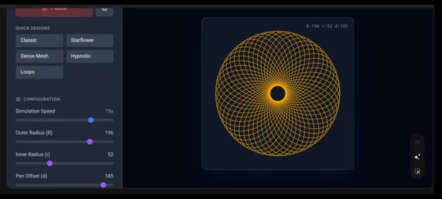
*Interface montrant un motif géométrique circulaire complexe en cours de génération avec des paramètres de configuration et de vitesse de simulation.*

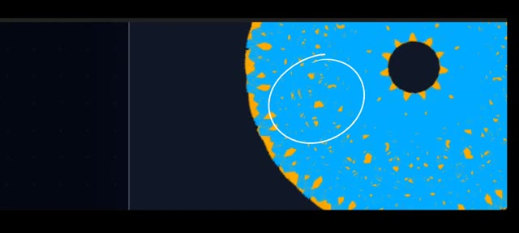
*Gros plan zoomé sur le motif circulaire coloré en bleu et orange avec un cercle blanc entourant une zone de détails.*

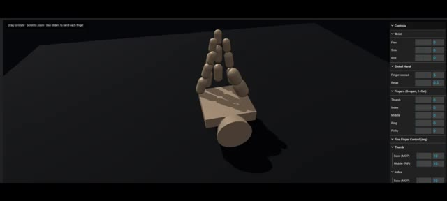
*Interface 3D de simulation d'une main articulée en bois avec des panneaux de contrôle latéraux pour les doigts et le poignet.*

---

### ⏱️ `[00:02:51 - 00:03:10]` | Segment #08

**🔊 Audio (Transcription Intégrale Mot pour Mot en Français) :**
> Je devrais être capable de contrôler tous les doigts de la main. Rien de plus. C'est le résultat d'Opus 4.5. Honnêtement, je pense que je devrais rire très fort. Parce que les gens disent que l'IA va leur voler leur travail, mais là, qu'est-ce que c'est que ce truc généré ? Je suis choqué. Ça génère bien des contrôles pour tous les doigts, et ils fonctionnent, mais regardez juste la main.

**👁️ Analyse Visuelle d'Écran (gemini-3.5-flash-lite) :**
**Interface & Outils** : Interface de visualisation et de contrôle 3D avec des panneaux de réglages sur le côté droit (Wrist, Global Hand, Fingers, Fine Finger Control).

**Contenu textuel & Code** : Textes visibles dans l'interface : "Drag to rotate", "Scroll to zoom", "Use sliders to bend each finger", "Controls", "Wrist", "Global Hand", "Fingers (0=open, 1=flat)", "Thumb", "Index", "Middle", "Ring", "Pinky", "Fine Finger Control (deg)".

**Action / Démonstration** : Le créateur montre le rendu 3D d'une main rudimentaire composée de blocs et de cylindres, dont les proportions et l'apparence générées par l'IA sont anormales, ainsi que les curseurs de contrôle associés.

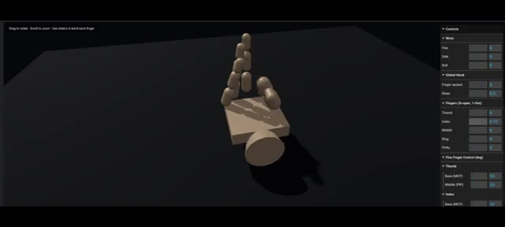
*Interface 3D montrant un modèle de main cubique rudimentaire généré et ses panneaux de contrôle latéraux.*

---

### ⏱️ `[00:03:10 - 00:03:43]` | Segment #09

**🔊 Audio (Transcription Intégrale Mot pour Mot en Français) :**
> C'est trop bizarre. Opus 4.5 a vraiment fait un truc bizarre ici. Ensuite, c'est la génération de GPT 5.1. C'est bien mieux qu'Opus 4.5. Regardez la paume. Ça a l'air réaliste. Je peux contrôler tous les doigts à l'aide de curseurs et tout fonctionne. Une erreur que j'ai remarquée : lorsque l'on plie les doigts, ils vont trop loin sous la paume au lieu de s'arrêter à la paume. Mais dans l'ensemble, ça a l'air bien et réaliste, et ça, c'est la génération de Gemini 3. Ça a l'air vraiment bien aussi. Ça génère une main robotique et je peux contrôler tous les doigts à l'aide de curseurs, tout fonctionne et elle bouge comme une vraie main humaine, et remarquez le pouce.

**👁️ Analyse Visuelle d'Écran (gemini-3.5-flash-lite) :**
**Interface & Outils** : Interface de simulation 3D interactive de modélisation de mains avec panneaux de contrôle par curseurs (sliders) et boutons de configuration.

**Contenu textuel & Code** : Textes visibles : "Realistic Hand Simulation", "Left Hand", "Right Hand", commandes des doigts ("THUMB", "INDEX", "MIDDLE", "RING", "PINKY"), préréglages ("Fist", "Open", "Peace", "Rock", "Thumbs Up", "Point"), et paramètres de contrôle de la main et du poignet ("Wrist", "Global Hand", "Fingers", "Fine Finger Control").

**Action / Démonstration** : Démonstration de simulations de mains 3D interactives où les doigts et les mouvements sont contrôlés via des curseurs et des boutons d'interface.

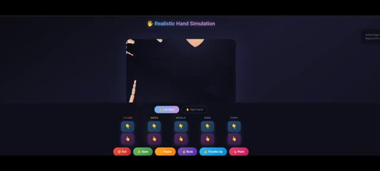
*Interface de simulation montrant une modélisation de main avec des boutons de contrôle pour chaque doigt (Thumb, Index, Middle, Ring, Pinky) et des préréglages (Fist, Open, Peace, Rock, Thumbs Up, Point).*

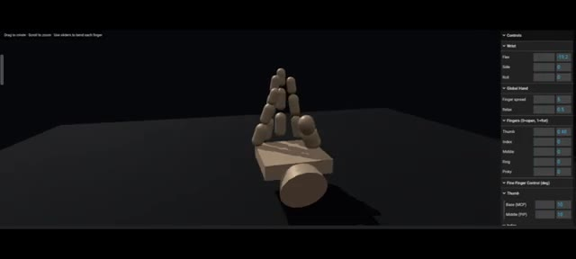
*Interface 3D montrant un modèle de main articulée beige sur fond sombre, avec un panneau de réglages à droite (Wrist, Global Hand, Fingers, Fine Finger Control).*

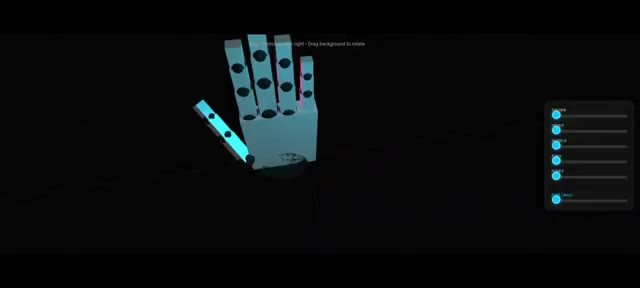
*Modélisation 3D d'une main robotique cyan et bleue sur fond noir, avec des curseurs de contrôle sur le côté droit pour chaque doigt.*

---

### ⏱️ `[00:03:43 - 00:03:50]` | Segment #10

**🔊 Audio (Transcription Intégrale Mot pour Mot en Français) :**
> Ça bouge de façon réaliste aussi. C'est la recherche pour la vidéo d'aujourd'hui. Si vous avez aimé, mettez un pouce bleu, abonnez-vous et laissez un commentaire.

**👁️ Analyse Visuelle d'Écran (gemini-3.5-flash-lite) :**
**Interface & Outils** : Interface de démonstration 3D avec des curseurs de contrôle sur le côté droit (Thumb, Index, Middle, Ring, Pinky, Pitch/Yaw) et le logo "PAI" dans un cercle lumineux bleu à gauche.

**Contenu textuel & Code** : Texte affiché en haut : "Drag controls. Left drag on blank space background to rotate". Curseurs de contrôle pour chaque doigt (Thumb, Index, Middle, Ring, Pinky) et l'orientation (Pitch/Yaw). Logo "PAI" sur un processeur connecté à un cerveau dans un cercle lumineux.

**Action / Démonstration** : Présentation d'un modèle 3D interactif d'une main robotique permettant de tester et de visualiser les mouvements et l'articulation des doigts.

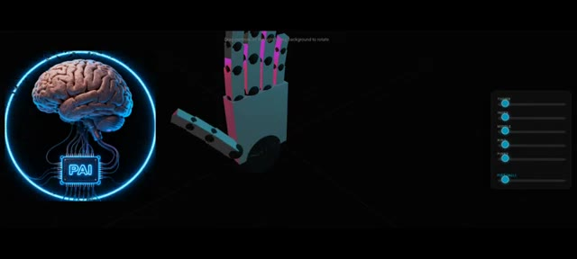
*Modélisation 3D d'une main robotique interactive avec des curseurs de contrôle, accompagnée du logo de la chaîne PAI représentant un cerveau relié à un processeur dans un cercle lumineux.*

---
