# 🎬 Les images IA sont TROP réalistes... Protégez-vous !

> **Chaîne** : [Pursuing AI](https://www.youtube.com/@PursuingAi)  
> **Titre original** : `AI Images Are TOO Real Now… Protect Yourself!`  
> **Lien YouTube** : [https://www.youtube.com/watch?v=vcRnzyhBikA](https://www.youtube.com/watch?v=vcRnzyhBikA)  
> **Date de publication** : 2025-12-02  
> **Durée** : 03m 39s (`219s`)  
> **Identifiant vidéo** : `vcRnzyhBikA`  
> **Fiche Web Interactive** : [2025-12-02_YT-vcRnzyhBikA_Les images IA sont TROP réalistes... Protégez-vous !_by-whisper-v3-large-turbo+gemini-3.5-flash-lite.html](2025-12-02_YT-vcRnzyhBikA_Les images IA sont TROP réalistes... Protégez-vous !_by-whisper-v3-large-turbo+gemini-3.5-flash-lite.html)  
> **Captures de démonstration clés** : `24 captures réelles (anti-talking-head)`  
> **Modèles utilisés** : Audio: `large-v3-turbo` (Faster-Whisper int8 VPS) | Vision: `gemini-3.5-flash-lite` (Google AI Studio API)  

---

## 📌 Synthèse Exécutive & Outils

### 📌 Résumé
La vidéo de Pursuing AI, intitulée « Les images IA sont TROP réalistes... Protégez-vous ! », met en lumière une réalité sociétale et technique alarmante : la prolifération d'images synthétiques hyper-réalistes capables de tromper même les plus aguerris, ouvrant la voie à des menaces d'usurpation et d'extorsion émotionnelle. Le créateur pose un constat implacable : les indices visuels obsolètes (comme les artefacts grossiers sur les mains ou les arrière-plans incohérents) ne suffisent plus face à la précision des nouveaux modèles. Pour contrer ce phénomène, la vidéo expose une méthodologie de défense rigoureuse, articulée autour de solutions technologiques de pointe et d'une analyse humaine minutieuse.

L'approche pédagogique repose sur un double niveau de vérification. D'une part, l'exploitation des métadonnées cryptographiques et des filigranes invisibles, à l'instar de SynthID, permet de démasquer instantanément les contenus générés par l'écosystème Google, même après le charcutage ou la suppression du watermark visible. D'autre part, lorsque les outils de détection automatisée font défaut face à des modèles tiers, le créateur enseigne une méthode empirique d'investigation visuelle : le « zoom et analyse ». Cette technique cible les angles morts persistants de l'intelligence artificielle — textures épidermiques trop lisses, anomalies anatomiques subtiles au niveau des doigts et asymétries d'accessoires.

Pour les créateurs de vidéo et les professionnels de l'image, les bénéfices de cette analyse sont immenses. Elle offre non seulement une boussole pour sécuriser ses propres productions et s'armer contre la désinformation, mais elle fournit également les clés pour comprendre les standards actuels du réalisme synthétique. En maîtrisant à la fois les failles des IA génératives et les contre-mesures cryptographiques, les créateurs renforcent leur veille technologique et garantissent l'intégrité de leurs flux de production face aux dérives de la synthetic media.

### 🛠️ Outils, Modèles & Logiciels Présentés
* **Nano Banana Pro** : Modèle de pointe de Google servant de référence principale dans la vidéo pour la génération d'images ultra-réalistes capables de duper les experts.
* **SynthID** : Système de filigrane invisible et cryptographique développé par Google DeepMind pour marquer et détecter l'origine synthétique des contenus (images, audio, texte, vidéo), même après altération du visuel.
* **Gemini** : Assistant conversationnel et multimodal de Google employé ici comme outil de vérification capable d'analyser une image importée pour y détecter la signature cachée de SynthID.

### 🔑 Points Clés & Enseignements Stratégiques
* **L'obsolescence des artefacts classiques** : Les vieux marqueurs d'erreur de l'IA (doigts surnuméraires évidents, yeux difformes) ne constituent plus des indicateurs fiables en raison de la fulgurante progression des modèles génératifs.
* **La menace du deepfake contextuel** : L'hyper-réalisme des images permet désormais aux escrocs de fabriquer de fausses preuves visuelles impliquant des proches pour orchestrer des tentatives d'extorsion.
* **Le double rempart de détection** : La sécurité face aux images synthétiques repose sur une approche hybride combinant des outils technologiques invisibles et une analyse visuelle critique.
* **La puissance du filigrane visible et invisible** : Google intègre une double protection, combinant un marquage à l'écran facile à identifier et une empreinte cryptographique de fond.
* **L'infaillibilité relative de SynthID** : Même si un utilisateur malveillant rogne ou supprime le filigrane visuel d'une image créée par Nano Banana Pro, la signature cachée de SynthID persiste dans les pixels.
* **Le rôle pivot des grands modèles de langage** : L'interface conversationnelle de Gemini sert de scanner accessible au grand public pour interroger une image et révéler sa nature artificielle grâce à la reconnaissance du filigrane invisible.
* **La limite écosystémique** : Le principal point de vulnérabilité actuel réside dans le fait que SynthID est cloisonné aux outils de Google, laissant les utilisateurs démunis face aux générateurs tiers non étiquetés.
* **La méthode du zoom et de l'analyse** : En l'absence de traçabilité numérique, l'examen minutieux des micro-détails (texture de peau, raccords d'accessoires) redevient l'ultime bouclier d'investigation.
* **Le piège de la texture épidermique** : Les générateurs ont tendance à lisser excessivement la peau, éliminant les pores, rides et aspérités naturelles au profit d'un rendu plastique ou brillant caractéristique.
* **L'inspection anatomique chirurgicale** : L'analyse des mains et des membres reste un indicateur secondaire précieux, en traquant les zones de fusion anormale avec les objets ou les courbures de doigts contre-intuitives.
* **La vérification des accessoires asymétriques** : Les objets complexes comme les montures de lunettes ou les boucles d'oreilles trahissent souvent l'IA par des défauts de symétrie ou des incohérences structurelles des deux côtés du visage.
* **L'impératif d'une norme universelle** : Le déploiement généralisé de standards de traçabilité similaires à SynthID à l'échelle de toute l'industrie de l'IA est présenté comme la condition sine qua non pour sécuriser l'avenir des contenus numériques.

---

## ⏱️ Chronologie & Transcription Complète Audio & Visuelle (Mot pour Mot)

### ⏱️ `[00:00:00 - 00:00:21]` | Segment #01

**🔊 Audio (Transcription Intégrale Mot pour Mot en Français) :**
> Les images générées par IA sont devenues si réalistes que même des experts se font avoir. Et dans les jours à venir, ce ne sera pas seulement un problème technique. Cela pourrait devenir une menace bien réelle. Des escrocs pourraient créer de fausses photos de votre famille, vous les envoyer dans un mauvais contexte et exiger de l'argent. Et si vous n'êtes pas entraîné à reconnaître les images générées par IA, vous pourriez facilement tomber dans le panneau.

**👁️ Analyse Visuelle d'Écran (gemini-3.5-flash-lite) :**
**Interface & Outils** : Présentation d'exemples visuels d'images synthétiques photoréalistes générées par intelligence artificielle (style photos de réseaux sociaux et selfies).

**Contenu textuel & Code** : Visualisation de fausses photographies au réalisme saisissant simulant des selfies et des scènes de la vie quotidienne.

**Action / Démonstration** : Défilé de visuels trompeurs illustrant le réalisme extrême des créations d'images par IA pour appuyer le propos sur les risques d'usurpation et d'arnaques.

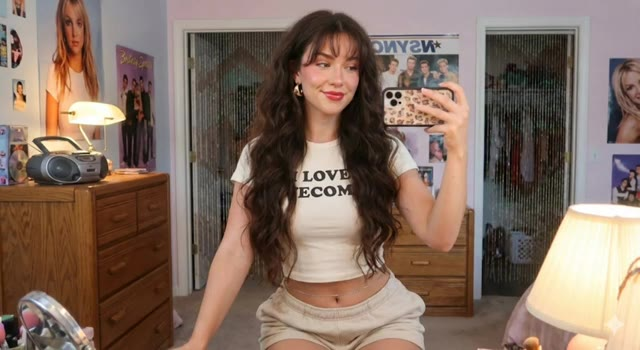
*Image générée par IA montrant une jeune femme souriante prenant un selfie dans un miroir de chambre.*

*Image générée par IA montrant une femme vêtue d'un costume de lapin et faisant une grimace.*

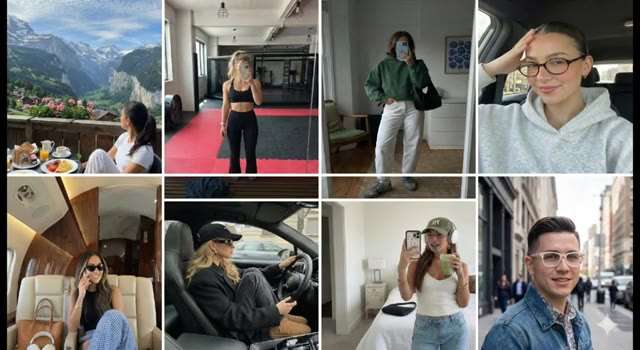
*Grille d'exemples multiples d'images et de portraits réalistes générés par intelligence artificielle dans divers contextes et environnements.*

---

### ⏱️ `[00:00:21 - 00:00:45]` | Segment #02

**🔊 Audio (Transcription Intégrale Mot pour Mot en Français) :**
> Pour vous assurer que cela ne vous arrive jamais, j'ai recherché des méthodes simples et fiables que tout le monde peut utiliser pour repérer les images générées par IA. C'est Pursuing AI, et vous regardez le Research Report. Avant de passer aux astuces, comprenons pourquoi les images par IA deviennent si réalistes. Des modèles comme Nano Banana Pro de Google et d'autres sont entraînés sur des milliards de vraies photos, apprenant le moindre petit détail.

**👁️ Analyse Visuelle d'Écran (gemini-3.5-flash-lite) :**
**Interface & Outils** : Interface logicielle d'analyse d'images et interface web de présentation du modèle d'intelligence artificielle Google Nano Banana Pro.

**Contenu textuel & Code** : Texte affiché : "The model was trained on a large and varied dataset...", "The training data includes web documents, code, mathematics...", "The model learns by processing billions of image-text pairs...", "A key feature of Nano Banana Pro is its ability to connect to Google Search...". Prompt visible sous l'image de la grenouille : "This is a stunning close-up photograph of a red-eyed tree frog...".

**Action / Démonstration** : Démonstration visuelle illustrant l'analyse technique d'images par IA, la présentation du modèle Nano Banana Pro via son site web officiel et l'affichage de ses spécifications d'entraînement.

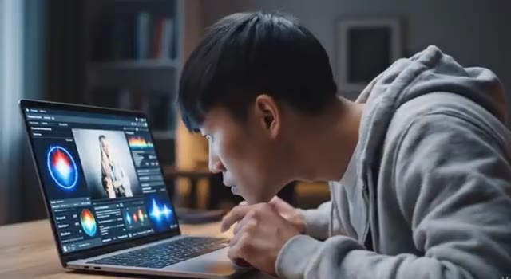
*Un utilisateur penché sur un ordinateur portable affichant une interface d'analyse d'image avec des graphiques colorés et des données techniques.*

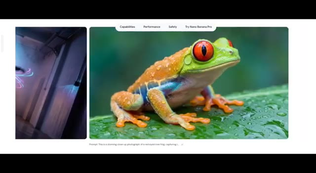
*Page web du modèle Nano Banana Pro montrant des exemples de génération d'images, notamment une grenouille aux yeux rouges sur une feuille.*

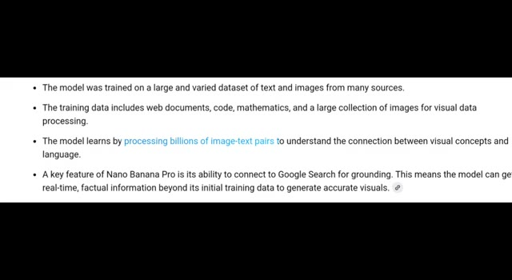
*Page de documentation textuelle listant les caractéristiques d'entraînement du modèle et son lien avec Google Search.*

---

### ⏱️ `[00:00:45 - 00:01:08]` | Segment #03

**🔊 Audio (Transcription Intégrale Mot pour Mot en Français) :**
> Texture de peau, éclairage, ombres, reflets, tout. C'est pourquoi les vieux signes de l'IA, doigts supplémentaires, yeux bizarres, arrière-plans brouillons, ne fonctionnent plus toujours. Mais ne vous inquiétez pas, il y a encore des moyens fiables repérer les faux, et nous allons les décortiquer un par un. D'abord, parlons du principal générateur d'images actuel, le Nano Banana Pro de Google.

**👁️ Analyse Visuelle d'Écran (gemini-3.5-flash-lite) :**
**Interface & Outils** : Navigateur web présentant des exemples d'images générées par IA, des analyses d'anomalies visuelles et la page officielle Google DeepMind pour "Nano Banana Pro".

**Contenu textuel & Code** : Texte affichant "Nano Banana Pro", "Built on Gemini 3.erce", "Try in Gemini", "Capabilities", "Performance", "Safety", "Try Nano Banana Pro".

**Action / Démonstration** : Présentation visuelle d'exemples d'images réalistes et de techniques pour repérer les défauts d'IA, suivie de la découverte de l'interface Google Nano Banana Pro.

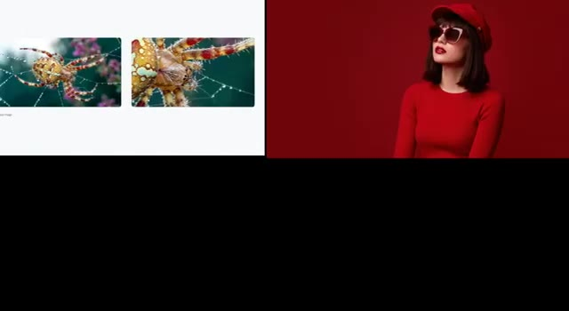
*Image #1 montrant des détails de textures générées par IA (araignée et portrait de femme en rouge).*

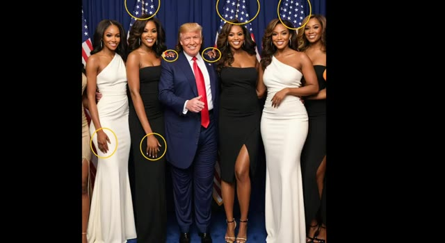
*Image #2 montrant une photo de groupe truquée par IA avec Donald Trump et plusieurs femmes, avec des cercles jaunes soulignant les anomalies anatomiques et les défauts d'arrière-plan.*

*Image #3 montrant une page web de présentation avec des exemples d'infographies textuelles et botaniques générées par IA.*

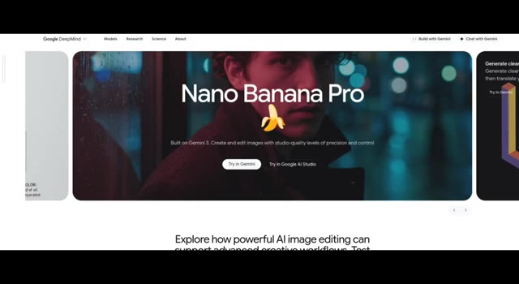
*Image #4 montrant la page web officielle de Google DeepMind présentant le générateur d'images "Nano Banana Pro".*

---

### ⏱️ `[00:01:08 - 00:01:40]` | Segment #04

**🔊 Audio (Transcription Intégrale Mot pour Mot en Français) :**
> Il peut créer des images extrêmement réalistes que même les experts ont du mal à identifier comme générées par l'IA. La question est donc : comment savoir si une image est réelle ou faite par l'IA ? La première méthode est simple. Vérifiez le filigrane. Mais que se passe-t-il si un escroc supprime le filigrane ? Pas de problème. Vous avez encore une autre option, SynthID. SynthID est le système de filigrane spécial de Google pour le contenu généré par l'IA. Il ajoute une marque cachée à l'intérieur des images, des audio, des textes et des vidéos générés par l'IA.

**👁️ Analyse Visuelle d'Écran (gemini-3.5-flash-lite) :**
**Interface & Outils** : Site web officiel de Google dédié à SynthID (DeepMind) avec un design sombre minimaliste.

**Contenu textuel & Code** : En-tête : "What is SynthID?". Texte descriptif : "Generative AI can help us all to be more creative, productive, and innovative. But it can be hard to tell the difference between content that's been AI-generated, and content created without AI." Onglets de navigation : "Overview", "How it works", "Hands-on", "Become a partner". Visuels illustratifs incluant un chien aux poils roses et un graphique abstrait de dégradé.

**Action / Démonstration** : Navigation et présentation visuelle de la page web expliquant la technologie de filigrane SynthID de Google.

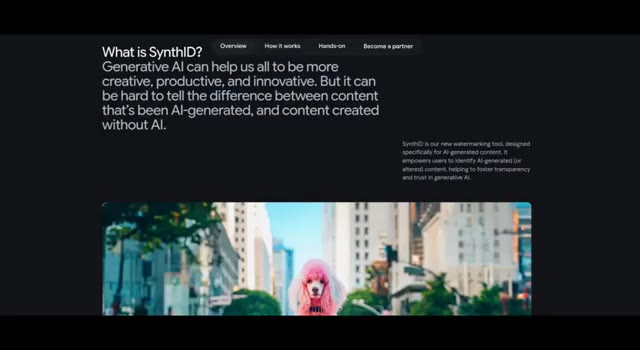
*Page web officielle de Google expliquant ce qu'est SynthID avec une image de caniche rose au premier plan.*

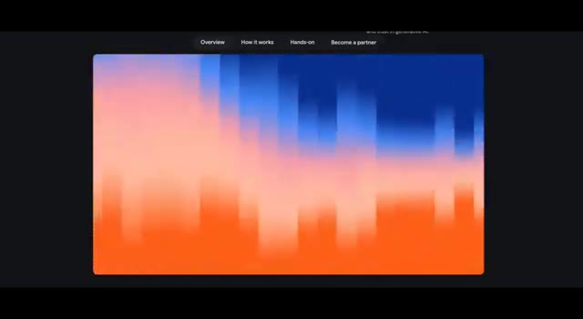
*Visuel abstrait coloré en dégradé bleu et orange illustrant le fonctionnement de SynthID sur le site de Google.*

---

### ⏱️ `[00:01:41 - 00:02:18]` | Segment #05

**🔊 Audio (Transcription Intégrale Mot pour Mot en Français) :**
> Vous ne pouvez pas voir cette marque, mais les outils de Google peuvent la détecter et confirmer si le contenu a été généré par IA. Maintenant, j'ai créé cette image en utilisant Google Nano Banana Pro. Avec le filigrane, il est facile de dire que c'est de l'IA. Mais que se passe-t-il si je supprime le filigrane ? Pouvez-vous toujours l'identifier ? Cela peut sembler difficile, mais plus maintenant. Vous pouvez utiliser Gemini pour vérifier si l'image a été générée par IA. Il suffit de télécharger l'image et de demander à Gemini. Il peut toujours détecter la marque cachée Synth ID même lorsque le filigrane visible est supprimé. Cependant, Synth ID ne fonctionne qu'avec les propres produits d'IA de Google. Voici donc le vrai problème.

**👁️ Analyse Visuelle d'Écran (gemini-3.5-flash-lite) :**
**Interface & Outils** : Interface web de Google Gemini et site de présentation de Synth ID.

**Contenu textuel & Code** : Texte affiché : "Overview, How it works, Hands-on, Become a partner", "Hello Pursuing", et dans le champ de saisie de Gemini : "is this image generated by ai?".

**Action / Démonstration** : Le créateur illustre la détection d'une image générée par IA en montrant le filigrane visible, puis en utilisant Gemini pour analyser l'image importée.

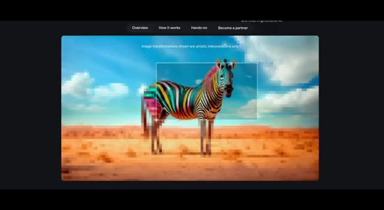
*Interface de présentation montrant une image de zèbre pixelisée avec un cadre de sélection.*

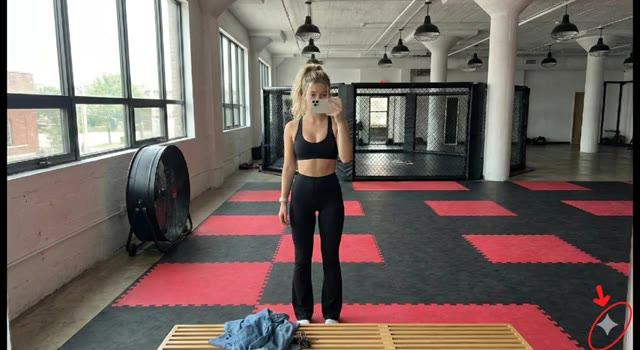
*Image générée par IA d'une femme dans une salle de sport avec un filigrane Synth ID mis en évidence en bas à droite.*

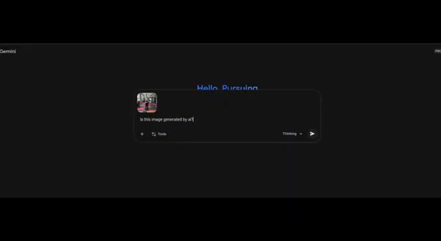
*Interface de l'outil Gemini avec une image importée et le prompt textuel demandant si elle a été générée par IA.*

---

### ⏱️ `[00:02:18 - 00:02:36]` | Segment #06

**🔊 Audio (Transcription Intégrale Mot pour Mot en Français) :**
> Et si un escroc utilise un autre outil d'image IA qui ne prend pas en charge SynthID ? Ainsi, lorsque SynthID n'est pas disponible, le seul outil fiable dont vous disposez est votre propre observation. Voici trois méthodes simples que tout le monde peut utiliser pour repérer les images générées par IA. La première est la méthode du zoom et de l'analyse.

**👁️ Analyse Visuelle d'Écran (gemini-3.5-flash-lite) :**
**Interface & Outils** : Page web de présentation du modèle d'intelligence artificielle FLUX.2.

**Contenu textuel & Code** : Texte "FLUX.2", "Production-grade AI image generation and editing model with 4MP photorealistic output and multi-reference control", boutons "Try in Playground", "Access via API", "Open Weights".

**Action / Démonstration** : Défilement horizontal à travers différentes images d'exemples générées par le modèle FLUX.2 pour illustrer les capacités de génération.

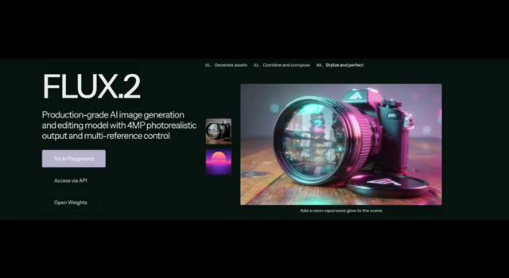
*Présentation du modèle FLUX.2 avec une image d'appareil photo reflex générée par IA.*

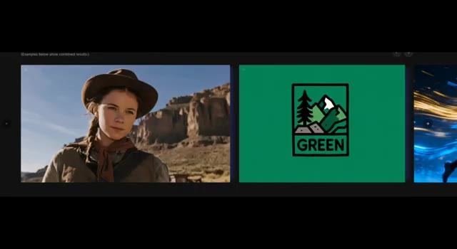
*Affichage d'exemples d'images combinées, incluant le portrait d'une femme dans un canyon et un logo "GREEN".*

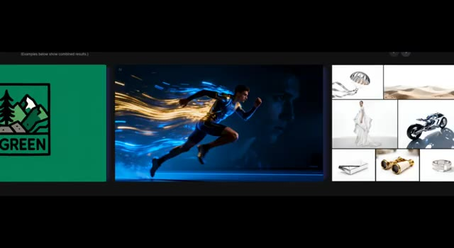
*Affichage d'une composition montrant un coureur en mouvement avec des traînées lumineuses et une grille d'objets divers (moto, dunes de sable, bijoux).*

---

### ⏱️ `[00:02:36 - 00:02:58]` | Segment #07

**🔊 Audio (Transcription Intégrale Mot pour Mot en Français) :**
> C'est le moyen non technique le plus simple pour repérer les erreurs de l'IA. Il suffit de zoomer et de chercher les petits détails que l'IA rate généralement. Les mains et les membres. L'IA a encore du mal avec les mains. Cherchez trop ou trop peu de doigts. Des doigts inhabituellement longs ou pliés de façon étrange. Des mains qui semblent fondre dans les objets. La texture de la peau.

**👁️ Analyse Visuelle d'Écran (gemini-3.5-flash-lite) :**
**Interface & Outils** : Présentation vidéo illustrative avec exemples d'images générées ou modifiées par IA.

**Contenu textuel & Code** : Visuels d'exemples d'erreurs d'IA (mains anormales, artefacts).

**Action / Démonstration** : Affichage successif d'images d'exemples pour illustrer les erreurs commises par l'intelligence artificielle sur les mains et les textures.

*Image générée par IA montrant une femme cuisinant dans une cuisine rustique, utilisée pour illustrer la texture de la peau et les détails.*

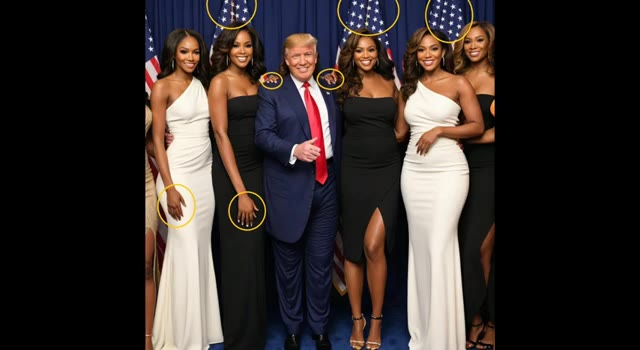
*Image générée par IA montrant Donald Trump entouré de femmes, avec des cercles jaunes soulignant des anomalies sur les mains et les drapeaux en arrière-plan.*

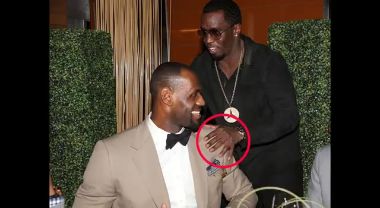
*Photographie modifiée montrant Diddy posant une main aux doigts anormaux sur l'épaule de LeBron James, encerclée en rouge.*

---

### ⏱️ `[00:02:59 - 00:03:18]` | Segment #08

**🔊 Audio (Transcription Intégrale Mot pour Mot en Français) :**
> La peau générée par l'IA a souvent l'air trop lisse ou brillante, presque plastique. La vraie peau a des pores, des rides et des imperfections naturelles. La peau de l'IA a souvent l'air trop lisse ou brillante. Accessoires. Vérifiez les petits objets comme les lunettes. Les montures peuvent ne pas correspondre des deux côtés, les boucles d'oreilles sont souvent manquantes ou dépareillées.

**👁️ Analyse Visuelle d'Écran (gemini-3.5-flash-lite) :**
**Interface & Outils** : Présentation face caméra sans partage d'écran

**Contenu textuel & Code** : Aucune interface logicielle, aucun texte ni paramètre technique affiché à l'écran.

**Action / Démonstration** : Le créateur présente une vidéo ou des images d'illustration générées par IA pour illustrer son propos sur les défauts de texture de peau et d'accessoires.

---

### ⏱️ `[00:03:18 - 00:03:38]` | Segment #09

**🔊 Audio (Transcription Intégrale Mot pour Mot en Français) :**
> À mon avis, Synth ID est actuellement le moyen le plus fiable pour détecter si une image est générée par l'IA. Il a été créé par Google DeepMind et il ajoute un filigrane invisible qui peut être vérifié même si le filigrane visible est supprimé. Chaque outil d'IA devrait adopter Synth ID ou un système similaire pour assurer la sécurité des utilisateurs et prévenir les escroqueries à l'avenir.

**👁️ Analyse Visuelle d'Écran (gemini-3.5-flash-lite) :**
**Interface & Outils** : Interface web de Google Gemini et page de présentation Google DeepMind.

**Contenu textuel & Code** : Texte à l'écran : "Hi Christopher", "Is this image generated by AI?", "Analysis: Based on the analysis, a SynthID watermark was detected in more than 50% of the image...", "What is SynthID? Generative AI can help us all to be more creative...".

**Action / Démonstration** : Navigation et démonstration dans l'interface de Gemini pour tester la détection de filigrane d'une image générée par l'IA.

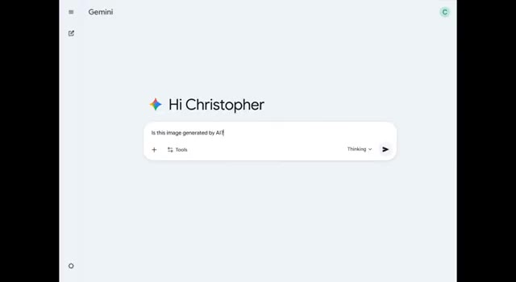
*Interface de Gemini affichant la question posée par l'utilisateur « Is this image generated by AI? ».*

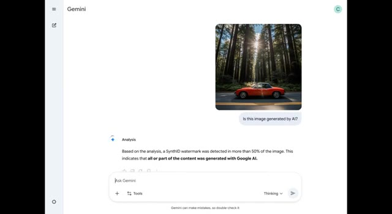
*Résultat de l'analyse dans l'interface de Gemini montrant la détection d'un filigrane SynthID sur l'image d'une voiture rouge.*

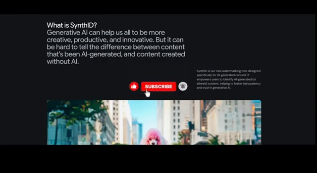
*Page de présentation « What is SynthID? » expliquant le fonctionnement du nouvel outil de filigranage de Google.*

---
