# 🎬 Nouveau modèle Seedream 4.5 testé : rebondissement choc dans le benchmark !

> **Chaîne** : [Pursuing AI](https://www.youtube.com/@PursuingAi)  
> **Titre original** : `New Seedream 4.5 Model Tested: Shocking Twist in the Benchmark!`  
> **Lien YouTube** : [https://www.youtube.com/watch?v=vTcGkM5wMvc](https://www.youtube.com/watch?v=vTcGkM5wMvc)  
> **Date de publication** : 2025-12-07  
> **Durée** : 03m 07s (`187s`)  
> **Identifiant vidéo** : `vTcGkM5wMvc`  
> **Fiche Web Interactive** : [2025-12-07_YT-vTcGkM5wMvc_Nouveau modèle Seedream 4.5 testé rebondissement choc dans le benchmark !_by-whisper-v3-large-turbo+gemini-3.5-flash-lite.html](2025-12-07_YT-vTcGkM5wMvc_Nouveau modèle Seedream 4.5 testé rebondissement choc dans le benchmark !_by-whisper-v3-large-turbo+gemini-3.5-flash-lite.html)  
> **Captures de démonstration clés** : `21 captures réelles (anti-talking-head)`  
> **Modèles utilisés** : Audio: `large-v3-turbo` (Faster-Whisper int8 VPS) | Vision: `gemini-3.5-flash-lite` (Google AI Studio API)  

---

## 📌 Synthèse Exécutive & Outils

### 📌 Résumabé

La vidéo de *Pursuing AI* explore en profondeur le nouveau modèle unifié **Seedream 4.5** développé par ByteDance, un outil polyvalent capable de générer des images ultra-réalistes, de gérer l'édition avancée, de manipuler du texte et de concevoir des affiches professionnelles. Le créateur démontre les capacités bluffantes du modèle, notamment sa précision anatomique (comme le rendu parfait des mains), sa fidélité à la préservation des traits du visage, l'éclairage et la tonalité des couleurs, ainsi que sa flexibilité pour combiner plusieurs images ou décliner des formats tout en maintenant une cohérence visuelle absolue.

Pour structurer son analyse, le créateur adopte une méthode rigoureuse en trois temps : d'abord l'accroche visuelle pour capter l'attention avec des exemples photoréalistes, puis une démonstration technique exhaustive des fonctionnalités phares (édition multi-images, design de produits, retouche ciblée), et enfin une mise en perspective critique. Cette dernière révèle un "rebondissement choc" : malgré des sauts qualitatifs perçus, les benchmarks publics comme *Ella Marina* montrent une stagnation relative de seulement deux points par rapport à la version précédente (Seedream 4).

Les bénéfices pour les créateurs de contenu et de vidéo par IA sont majeurs. Seedream 4.5 s'impose comme un couteau suisse capable de s'affranchir des workflows complexes de design graphique manuel. Cependant, l'enseignement stratégique majeur réside dans la limite des benchmarks actuels face à des modèles génératifs de pointe, invitant les créateurs à juger les outils sur leur utilité pratique en production plutôt que sur des scores chiffrés parfois déconnectés de la réalité opérationnelle.

### 🛠️ Outils, Modèles & Logiciels Présentés

* **Seedream 4.5** : Nouveau modèle d'IA unifié de ByteDance servant à la génération texte-image, à l'édition d'image avancée, au maintien de la cohérence des personnages et à la conception d'affiches publicitaires.
* **Seedance 2.5** : Modèle ou écosystème connexe mentionné dans l'écosystème global de production vidéo et visuelle par IA.
* **Kling 3.0** : Modèle concurrent de génération vidéo et visuelle haut de gamme utilisé comme point de comparaison dans l'industrie.
* **Midjourney** : Référence historique et graphique majeure dans la génération d'images par IA, servant d'étalon de comparaison qualitatif.
* **Génération Vidéo IA** : Catégorie globale d'outils technologiques englobant les flux de travail de création visuelle et animée.
* **Ella Marina** : Classement de référence public évaluant les modèles texte-image et servant ici d'outil d'analyse critique des performances.

### 🔑 Points Clés & Enseignements Stratégiques

* **Unification des workflows** : Seedream 4.5 prouve qu'un modèle unifié gérant à la fois la génération pure et l'édition granulaire simplifie drastiquement la chaîne de production visuelle.
* **Préservation anatomique de pointe** : Le modèle excelle dans le rendu des détails complexes, notamment la précision des doigts et des mains, souvent problématiques chez les concurrents.
* **Fidélité contextuelle et référentielle** : Capacité impressionnante à préserver les traits du visage, l'éclairage d'origine et la palette chromatique d'une image de référence lors d'une modification.
* **Édition ciblée et soustractive** : Possibilité de supprimer des éléments au premier plan ou à l'arrière-plan tout en conservant l'intégrité visuelle du sujet principal.
* **Maîtrise typographique intégrée** : Aptitude à traduire du texte directement dans l'image, à actualiser des designs textuels et à préserver les mises en page publicitaires.
* **Automatisation du design d'affiches** : Remplacement potentiel des outils de PAO traditionnels pour la création rapide d'affiches marketing propres et professionnelles.
* **Gestion multi-images et multi-formats** : Fonctionnalité avancée pour fusionner plusieurs visuels en une seule composition ou décliner une image en différents formats via une seule invite.
* **Variations stylistiques cohérentes** : Génération d'objets ou d'éléments de jeu (comme des ballons) déclinés sous de multiples styles artistiques tout en gardant une cohérence de structure.
* **Le piège des benchmarks publics** : Les scores sur des classements comme *Ella Marina* (seulement deux points de progression entre Seedream 4 et 4.5) ne reflètent pas toujours les gains réels d'ergonomie et de précision qualitative.
* **Évolution de la mesure de performance** : Atteinte d'un plateau technologique où les améliorations incrémentales des modèles de pointe deviennent difficiles à capturer par de simples métriques quantitatives.
* **Supériorité empirique vs théorique** : Nécessité pour les créateurs de tester les outils sur le terrain plutôt que de se fier aveuglément aux comparatifs de performances affichés par les développeurs ou les classements.

---

## ⏱️ Chronologie & Transcription Complète Audio & Visuelle (Mot pour Mot)

### ⏱️ `[00:00:00 - 00:00:39]` | Segment #01

**🔊 Audio (Transcription Intégrale Mot pour Mot en Français) :**
> Voyez comme cela a l'air réel ? Même les doigts sont parfaitement précis. Et regardez cette image. Elle gère si bien toutes les personnes et chaque petit détail. Mais voici le problème. Ce ne sont pas de vraies photos. Toutes les images que vous avez vues ont été créées par un nouvel outil d'image appelé CDream 4.5. J'ai fait des recherches approfondies sur cet outil et vous devez savoir ce qu'il peut faire. Et il y a un rebondissement à ce sujet que je révélerai à la fin. C'est Pursuing AI et vous regardez le Research Report. ByteDance a donc sorti leur nouveau modèle, Seadream 4.5. C'est un modèle unifié, ce qui signifie que vous pouvez tout faire

**👁️ Analyse Visuelle d'Écran (gemini-3.5-flash-lite) :**
**Interface & Outils** : Interface du site web officiel de ByteDance Seed, présentant la section dédiée au modèle d'intelligence artificielle Seedream 4.5.

**Contenu textuel & Code** : On peut lire les textes suivants sur l'interface : "ByteDance | Seed", "Seedream 4.5", ainsi que la description textuelle des performances du modèle en matière d'édition multi-images, de préservation des détails et de rendu typographique. Des boutons de navigation ("Home", "Research", "News", "Seed Edge", "Top Seed", "Join Us", "Try Now") sont également visibles.

**Action / Démonstration** : Le créateur présente des exemples d'images générées par IA extrêmement réalistes pour illustrer les capacités du modèle Seedream 4.5 avant de dévoiler l'interface officielle de l'outil développé par ByteDance.

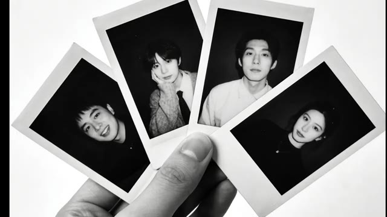
*Une main tenant quatre photos au format Polaroid en noir et blanc représentant de jeunes adultes dans des poses expressives.*

*Un collage de quatre images générées par IA présentant des scènes cinématographiques : une femme dans un espace architectural lumineux, un jeune homme dans une cabine téléphonique, une personne travaillant dans une pièce tapissée de post-its jaunes, et un homme avec son chien sous une tente.*

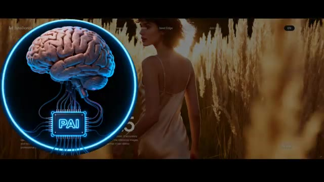
*Une vue de l'interface du site web de ByteDance montrant une animation avec un cerveau humain relié à une puce étiquetée "PAI" et une femme dans un champ de blé en arrière-plan.*

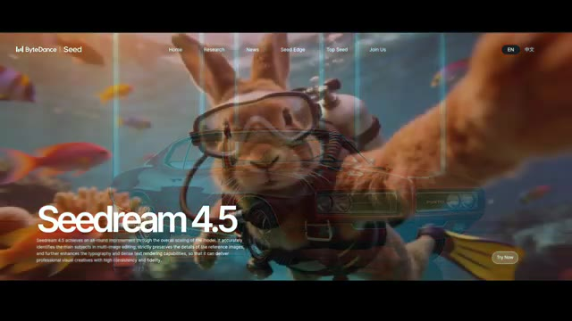
*La page d'accueil officielle du modèle Seedream 4.5 de ByteDance avec un arrière-plan aquatique animé montrant un lapin plongeur et du texte descriptif.*

---

### ⏱️ `[00:00:39 - 00:01:01]` | Segment #02

**🔊 Audio (Transcription Intégrale Mot pour Mot en Français) :**
> en un seul endroit, du texte à l'image jusqu'à l'édition d'image avancée. Premièrement, Seadream 4.5 peut parfaitement préserver les traits du visage, l'éclairage, la tonalité des couleurs et d'autres détails d'une image de référence. Donc, si vous voulez supprimer des personnages en arrière-plan ou au premier plan, il peut le faire tout en gardant l'éclairage et les couleurs du personnage principal exactement identiques.

**👁️ Analyse Visuelle d'Écran (gemini-3.5-flash-lite) :**
**Interface & Outils** : Interface web de Seedance / Seedream 4.5 (ByteDance).

**Contenu textuel & Code** : Texte affiché : "Seedream 4.5", "Consistency with Reference Image", ainsi que des descriptions textuelles et des exemples visuels (hamburger éclaté, paysages, personnages d'action).

**Action / Démonstration** : Présentation des capacités de conservation des détails d'image de référence et de modification sélective des éléments (suppression de personnages).

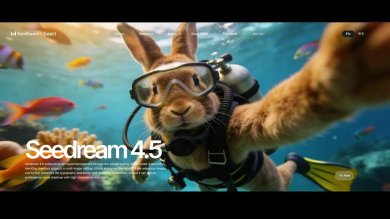
*Page d'accueil de la plateforme Seedream 4.5 de ByteDance montrant un lapin en train de faire un selfie sous l'eau.*

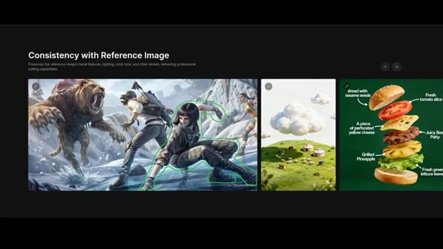
*Interface présentant la consistance avec une image de référence et des exemples d'édition d'image avec détourage vert.*

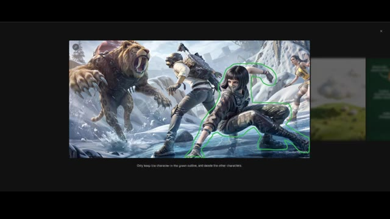
*Gros plan sur une image d'action avec un personnage entouré d'un contour vert pour l'édition et la suppression d'arrière-plan.*

---

### ⏱️ `[00:01:01 - 00:01:20]` | Segment #03

**🔊 Audio (Transcription Intégrale Mot pour Mot en Français) :**
> Vous pouvez également traduire n'importe quel texte dans l'image, changer les matériaux des vêtements et même actualiser les designs de texte tout en conservant la pose cohérente. Il peut également créer des images de présentation de produits propres et réalistes exactement comme celle-ci. Seadream 4.5 est également très fort pour les mises en page d'affiches.

**👁️ Analyse Visuelle d'Écran (gemini-3.5-flash-lite) :**
**Interface & Outils** : Interface web de présentation de l'outil d'IA Seadream 4.5.

**Contenu textuel & Code** : Texte affiché sous les images : "Translate the image into Chinese, using a handwritten font, with all other content unchanged." et "Generate a best-selling product display image in a modern e-commerce platform style. Top title: "Today's Hot Sale"; main product in the middle of the image, price "$9.99" below it. Overall background: a vertical gradient transitioning from orange-pink to light purple-blue." En-tête : "Poster Layout and Logo Design" avec le texte descriptif "Offers designer-level composition and typography, together with clear and readable small text rendering, ideal for posters, brand visuals, and other creative scenarios."

**Action / Démonstration** : Démonstration visuelle des capacités de traduction de texte, de génération d'images de produits pour le e-commerce et de mise en page d'affiches par l'intelligence artificielle Seadream 4.5.

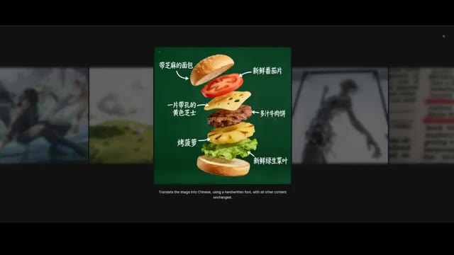
*Interface de Seadream 4.5 montrant la traduction de texte et la structure éclatée d'un burger avec des légendes en chinois.*

*Interface de Seadream 4.5 présentant une image de présentation de produit propre et réaliste d'un pot de miel fait main.*

*Interface de Seadream 4.5 présentant des exemples de mises en page d'affiches et de designs de logos.*

---

### ⏱️ `[00:01:20 - 00:01:38]` | Segment #04

**🔊 Audio (Transcription Intégrale Mot pour Mot en Français) :**
> Ces affiches ont l'air professionnelles et accrocheuses. On ne devinerait même pas qu'elles ont été faites avec l'IA. Avec cet outil, vous n'avez plus besoin de concevoir des affiches manuellement. Il peut aussi gérer l'édition multi-images. Si vous lui demandez de combiner plusieurs images en une seule, il préserve parfaitement tous les personnages en arrière-plan.

**👁️ Analyse Visuelle d'Écran (gemini-3.5-flash-lite) :**
**Interface & Outils** : Interface web de présentation d'un outil de design et de génération d'images par IA.

**Contenu textuel & Code** : Textes visibles : « Poster Layout and Logo Design », « Accurate Multi-Image Editing », et un prompt descriptif sous l'image agrandie : « Fairy Tale Book Cover: A little girl and a small fox stand in front of a glowing forest cabin... ».

**Action / Démonstration** : Navigation et présentation des fonctionnalités de conception d'affiches et de fusion d'images multiples de l'outil d'IA.

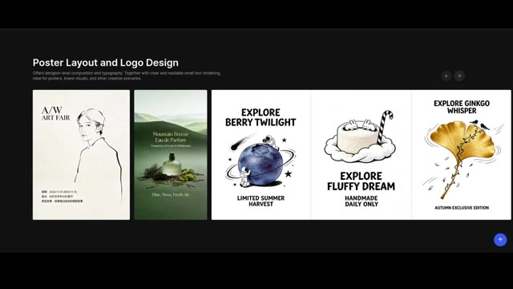
*Interface web montrant des exemples de conception d'affiches et de logos avec des mises en page de niveau professionnel.*

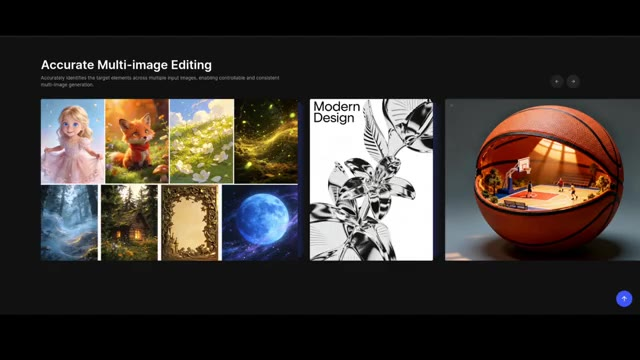
*Interface de démonstration de la fonction d'édition multi-images précise combinant plusieurs visuels.*

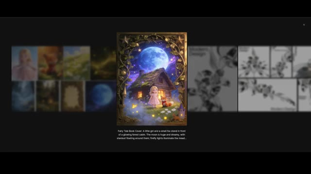
*Vue agrandie d'une image combinée centrée avec son prompt textuel descriptif en bas.*

---

### ⏱️ `[00:01:38 - 00:02:00]` | Segment #05

**🔊 Audio (Transcription Intégrale Mot pour Mot en Français) :**
> Et si vous voulez la même image dans des formats d'image différents, vous pouvez générer plusieurs versions en une seule invite. Et cela préserve toujours le texte, la mise en page et la scène. Vous pouvez également générer des objets ou des éléments de jeu comme ce ballon dans de nombreux styles différents. Voici des exemples de texte à image. Ils ont l'air superbes et l'esthétique globale est très propre et soignée.

**👁️ Analyse Visuelle d'Écran (gemini-3.5-flash-lite) :**
**Interface & Outils** : Interface de démonstration logicielle de génération d'images par IA présentant des exemples de prompts, de variations de formats et de rendus visuels.

**Contenu textuel & Code** : Texte affiché : « Based on this banner, create 6 posters. Maintain the same style and elements, but the layout of the elements can be adjusted. The aspect ratios are 1:1, 2:3, 4:3, 16:9, 1:2, and 9:16 respectively. », « Refer to the creativity of the input image and generate 4 separate imaegs for soccer, volleyball, golf, and tennis. », et « Nighttime outdoor photoshoot: A young man stands inside a public phone booth, holding a blue phone receiver to his ear. One hand is cas... »

**Action / Démonstration** : Présentation visuelle et défilement d'exemples de générations d'images par IA illustrant la cohérence de style, les différents formats d'aspect et la création d'objets.

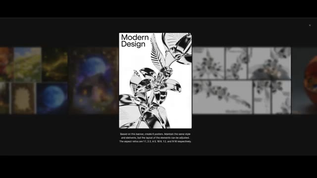
*Interface montrant la génération de plusieurs affiches avec des formats d'image différents à partir d'une bannière de design moderne.*

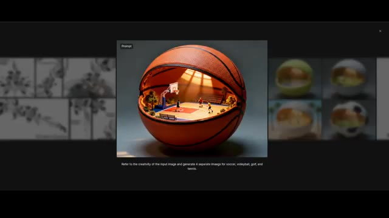
*Interface présentant un ballon de basketball évidé abritant un terrain miniature à l'intérieur, avec le prompt associé pour générer d'autres variantes sportives.*

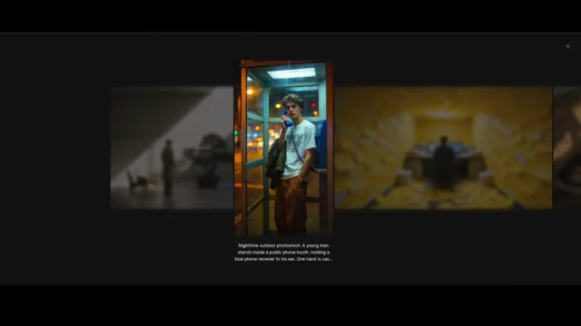
*Interface affichant l'exemple d'une image générée représentant un jeune homme dans une cabine téléphonique la nuit, accompagnée de son prompt descriptif.*

---

### ⏱️ `[00:02:00 - 00:02:28]` | Segment #06

**🔊 Audio (Transcription Intégrale Mot pour Mot en Français) :**
> Regardez cette photo de pose longue. Elle gère magnifiquement l'éclairage et la composition de la scène. Si vous consultez les benchmarks sur leur site web comparant Seedream 4 et Seedream 4.5, la nouvelle version bat l'ancienne dans toutes les catégories. Mais c'est là que les choses deviennent intéressantes. Car même si CDream 4.5 montre des améliorations massives de la qualité d'édition, de la cohérence des personnages et de la génération de posters, les benchmarks publics racontent une histoire légèrement différente.

**👁️ Analyse Visuelle d'Écran (gemini-3.5-flash-lite) :**
**Interface & Outils** : Site web de présentation et de benchmarks de modèles d'intelligence artificielle.

**Contenu textuel & Code** : Texte affiché sous l'image : « Dynamic Motion Portrait: A dynamic long-exposure shot of a person in motion against a vivid red background, creating a fluid and artistic visual effect. » Graphiques MagicBench : « Text-to-Image Radar Chart » et « Single-Image Editing Radar Chart » comparant Seedream 4.5 (bleu foncé) et Seedream 4.0 (bleu clair). Tableau des classements avec les modèles : flux-2-pro, seedream-4.5, imagen-4.0-ultra, seedream-4-2k, wan2.5-t2i-preview, gpt-image-1, etc.

**Action / Démonstration** : Navigation et présentation des résultats de tests de performance et de génération d'images par IA.

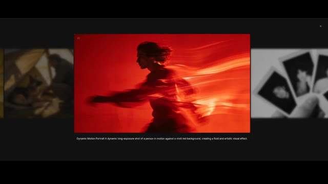
*Image générée par IA montrant un portrait en mouvement à longue exposition avec un fond rouge vif.*

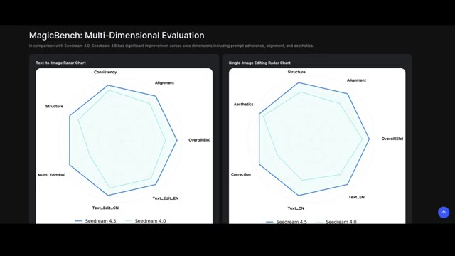
*Graphiques radar multidimensionnels de MagicBench comparant Seedream 4.0 et Seedream 4.5.*

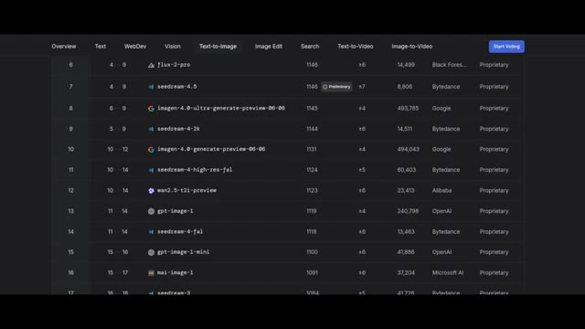
*Tableau de classement des modèles de texte vers image affichant Seedream-4.5 et d'autres IA.*

---

### ⏱️ `[00:02:28 - 00:02:55]` | Segment #07

**🔊 Audio (Transcription Intégrale Mot pour Mot en Français) :**
> Sur le classement texte-image d'Ella Marina, qui compare des centaines de modèles, CDream 4.5 n'est que deux points plus haut que CDream 4 au moment de cet enregistrement. Juste deux points. Et cela crée un vrai rebondissement. Soit le classement ne saisit pas pleinement les nouvelles forces du modèle, soit Seedream 4 était déjà si fort qu'une mise à niveau majeure fait à peine bouger le score.

**👁️ Analyse Visuelle d'Écran (gemini-3.5-flash-lite) :**
**Interface & Outils** : Tableau de classement en ligne (Leaderboard) avec des onglets de navigation (Overview, Text, WebDev, Vision, Text-to-Image, Image Edit, Search, Text-to-Video, Image-to-Video) et un bouton "Start Voting".

**Contenu textuel & Code** : Le tableau liste plusieurs modèles d'IA avec leurs scores et créateurs : rang 6 (flux-2-pro, 1146 points, Black Forest Labs), rang 7 (seedream-4.5, 1146 points, badge "Preliminary", Bytedance), rang 8 (imagen-4.0-ultra-generate-preview-06-06, 1145 points, Google), rang 9 (seedream-4-2k, 1144 points, Bytedance), rang 10 (imagen-4.0-generate-preview-06-06, 1131 points, Google), rang 11 (seedream-4-high-res-fal, 1124 points, Bytedance), rang 12 (wan2.5-t2i-preview, 1123 points, Alibaba), rang 13 (gpt-image-1, 1119 points, OpenAI), rang 14 (seedream-4-fal, 1118 points, Bytedance), rang 15 (gpt-image-1-mini, 1100 points, OpenAI), rang 16 (mai-image-1, 1091 points, Microsoft AI), rang 17 (seedream-3, 1084 points, Bytedance). Tous les modèles affichent le statut "Proprietary".

**Action / Démonstration** : Affichage fixe du classement comparatif des modèles d'intelligence artificielle texte-image.

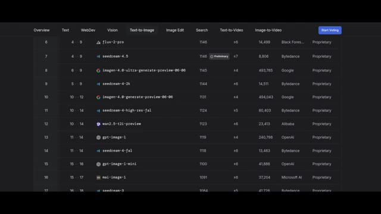
*Capture d'écran du classement de modèles d'IA "Text-to-Image" sur le site Ella Marina, affichant Seedream-4.5 et d'autres modèles.*

---

### ⏱️ `[00:02:55 - 00:03:06]` | Segment #08

**🔊 Audio (Transcription Intégrale Mot pour Mot en Français) :**
> Donc la grande question est, est-on en train d'atteindre un point où les améliorations deviennent plus difficiles à mesurer, ou est-ce que Seedream 4.5 surpasse discrètement les attentes d'une manière que les benchmarks ne montrent pas encore ?

**👁️ Analyse Visuelle d'Écran (gemini-3.5-flash-lite) :**
**Interface & Outils** : Tableau de classement de type LMSYS (Chatbot Arena ou équivalent orienté images) avec des onglets de navigation en haut (Overview, Text, WebDev, Vision, Text-to-Image, Image Edit, Search, Text-to-Video, Image-to-Video).

**Contenu textuel & Code** : Le tableau présente plusieurs modèles d'IA avec leurs scores et classements. On peut y voir : flux-2-pro (6e), seedream-4.5 (7e, étiqueté 'Preliminary'), imagen-4.0-ultra-generate-preview (8e), seedream-4-2k (9e), imagen-4.0-generate-preview (10e), seedream-4-high-res-fal (11e), wan2.5-t2i-preview (12e), gpt-image-1 (13e), seedream-4-fal (14e), gpt-image-1-mini (15e), mai-image-1 (16e). Les colonnes affichent les classements, les scores ELO/scores de performance, et les créateurs (Black Forest Labs, Bytedance, Google, Alibaba, OpenAI, Microsoft AI).

**Action / Démonstration** : Visualisation d'un classement de modèles d'intelligence artificielle text-to-image soulignant la position du modèle Seedream 4.5.

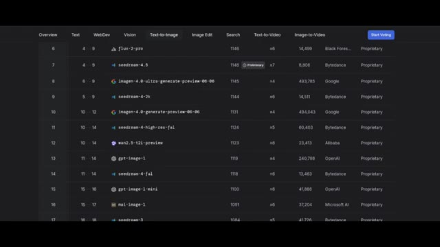
*Tableau de classement (Leaderboard) de type LMSYS montrant les performances des modèles Text-to-Image, avec Seedream 4.5 positionné en 7e position.*

---
