# 🎬 GPT-5.2 vs Gemini 3 — Vrais Tests

> **Chaîne** : [Pursuing AI](https://www.youtube.com/@PursuingAi)  
> **Titre original** : `GPT-5.2 vs Gemini 3 — Real Tests`  
> **Lien YouTube** : [https://www.youtube.com/watch?v=PVf0LdCCxuQ](https://www.youtube.com/watch?v=PVf0LdCCxuQ)  
> **Date de publication** : 2025-12-14  
> **Durée** : 04m 15s (`255s`)  
> **Identifiant vidéo** : `PVf0LdCCxuQ`  
> **Fiche Web Interactive** : [2025-12-14_YT-PVf0LdCCxuQ_GPT-5.2 vs Gemini 3 — Vrais Tests_by-whisper-v3-large-turbo+gemini-3.5-flash-lite.html](2025-12-14_YT-PVf0LdCCxuQ_GPT-5.2 vs Gemini 3 — Vrais Tests_by-whisper-v3-large-turbo+gemini-3.5-flash-lite.html)  
> **Captures de démonstration clés** : `22 captures réelles (anti-talking-head)`  
> **Modèles utilisés** : Audio: `large-v3-turbo` (Faster-Whisper int8 VPS) | Vision: `gemini-3.5-flash-lite` (Google AI Studio API)  

---

## 📌 Synthèse Exécutive & Outils

### 📌 Résumé
La vidéo de *Pursuing AI* intitulée « GPT-5.2 vs Gemini 3 — Vrais Tests » propose une analyse comparative rigoureuse des performances de pointe en matière de génération de code et de simulations interactives complexes par intelligence artificielle. Face aux promesses marketing d'OpenAI concernant son modèle le plus récent, le créateur soumet les prétendants à une batterie de tests exigeants comprenant des simulations physiques, le comportement d'essaims d'oiseaux et la cinématique anatomique. L'approche méthodologique repose sur une évaluation empirique stricte : l'utilisation d'un prompt unique et standardisé appliqué successivement à chaque IA pour juger de sa capacité à traduire des concepts mathématiques, physiques et visuels en applications interactives fonctionnelles, dotées de curseurs de contrôle et de rendus fluides.

Les résultats de ce benchmark bousculent la hiérarchie établie, révélant un paysage concurrentiel très nuancé où la domination technique n'est plus l'exclusivité d'un seul acteur. Alors que GPT-5.2 brille sur la simulation physique de la roue hexagonale en proposant un éventail de réglages poussés (restitution, frottement, résistance de l'air), il s'effondre curieusement sur des tests pourtant basiques comme la modélisation d'une main articulée ou l'essaim d'oiseaux. À l'inverse, Gemini 3 s'impose comme un outil redoutable d'équilibre et de robustesse — l'emportant haut la main sur la simulation anatomique —, tandis que Claude (notamment Opus 4.5, invité surprise du test) surclasse ses rivaux en matière de naturel organique sur le vol des oiseaux.

Pour les créateurs de contenu vidéo et les développeurs, ces enseignements soulignent l'importance cruciale de ne pas se fier aveuglément aux communiqués de presse ou aux benchmarks théoriques standardisés. Le choix d'un modèle d'IA doit désormais s'opérer au cas par cas, en fonction de la nature spécifique du projet créatif (physique pure, animation organique ou interactivité complexe). Cette étude comparative offre une vision pragmatique des forces et faiblesses actuelles des grands modèles de langage, permettant d'optimiser les workflows de prototypage rapide et d'éviter les pièges des performances en trompe-l'œil.

### 🛠️ Outils, Modèles & Logiciels Présentés
* **GPT-5.2** : Modèle phare d'OpenAI testé sur sa compréhension de la physique, sa capacité à générer des simulations interactives et ses performances globales face à ses concurrents.
* **Gemini 3** : Modèle de pointe évalué pour sa robustesse, sa réactivité face aux prompts de simulation complexes et sa supériorité sur les tests anatomiques et d'essaims.
* **Claude (Opus 4.5)** : Modèle d'Anthropic invité en cours de test pour sa capacité supérieure à générer des mouvements organiques fluides et naturels dans la simulation d'oiseaux.

### 🔑 Points Clés & Enseignements Stratégiques
* **Défiance envers le marketing** : Ne jamais baser ses choix technologiques uniquement sur les pages de blog des éditeurs ou les scores de benchmarks théoriques.
* **Méthode du prompt unique** : Utiliser un prompt rigoureusement identique pour chaque modèle afin de garantir l'équité et la pertinence des tests comparatifs.
* **Granularité des contrôles** : Évaluer la capacité d'une IA à intégrer des interfaces de contrôle interactives (curseurs de gravité, vitesse, échelle temporelle) directement dans le code généré.
* **Robustesse de la simulation physique** : Vérifier si le modèle comprend intuitivement les lois fondamentales (inertie, accélération selon la distance, rebonds proportionnels à la vitesse).
* **Supériorité contextuelle** : Accepter qu'aucun modèle ne soit universellement le meilleur ; GPT-5.2 excelle sur certains calculs physiques mais échoue sur des cinématiques simples.
* **Spécialisation organique de Claude** : Intégrer Claude (Opus 4.5) dans son workflow dès qu'un projet nécessite un rendu visuel fluide, naturel et vivant (comme le comportement animal).
* **Gestion de la déception technique** : Savoir réévaluer un modèle très attendu (comme GPT-5.2) face à des échecs répétés sur des tâches pratiques d'animation de mains.
* **Fiabilité de Gemini 3** : Considérer Gemini 3 comme une option extrêmement solide pour le prototypage rapide d'applications interactives complexes et fonctionnelles du premier coup.
* **Optimisation des paramètres d'essaim** : Analyser l'impact de curseurs comportementaux précis (séparation, alignement, cohésion, portée visuelle) pour juger de la maturité du code généré.
* **Importance du point de vue caméra** : Tester la flexibilité des environnements 3D générés en alternant les perspectives (vue subjective de l'oiseau versus vue globale du monde) pour déceler les bugs de saccade.

---

## ⏱️ Chronologie & Transcription Complète Audio & Visuelle (Mot pour Mot)

### ⏱️ `[00:00:00 - 00:00:23]` | Segment #01

**🔊 Audio (Transcription Intégrale Mot pour Mot en Français) :**
> Le 11 décembre, OpenAI a publié son modèle le plus performant, GPT 5.2. Et sur leur page de blog, la partie la plus intéressante est cette simulation de vagues océaniques, qui a l'air vraiment réaliste et bien faite. Dans les benchmarks de code, il surpasse également les benchmarks SWE et tous les autres benchmarks. Et comme vous pouvez le voir ici, il bat Opus 4.5 et Gemini 3 dans tous les benchmarks.

**👁️ Analyse Visuelle d'Écran (gemini-3.5-flash-lite) :**
**Interface & Outils** : Navigateur web affichant le blog officiel d'OpenAI et un tableau de benchmarks.

**Contenu textuel & Code** : Texte affichant « Introducing GPT-5.2 », « The most advanced frontier model for professional work and long-running agents », et tableau comparatif avec des scores pour SWE-Bench Pro (55,6% pour GPT-5.2 Thinking), GPQA Diamond (92,4%), FrontierMath, ARC-AGI, etc.

**Action / Démonstration** : Le présentateur affiche à l'écran l'annonce officielle de GPT-5.2 puis le tableau des benchmarks montrant sa supériorité sur les modèles concurrents.

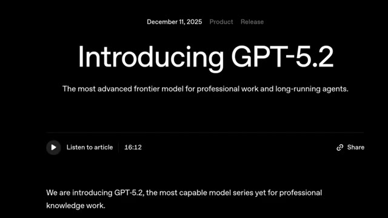
*Page de blog d'OpenAI annonçant la sortie de GPT-5.2 le 11 décembre 2025.*

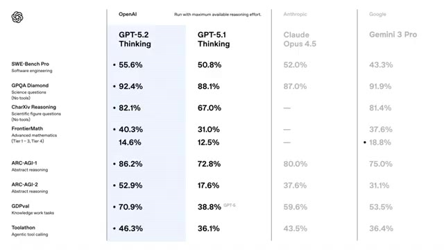
*Tableau comparatif des performances de GPT-5.2 par rapport à GPT-5.1, Claude Opus 4.5 et Gemini 3 Pro sur différents benchmarks.*

---

### ⏱️ `[00:00:24 - 00:00:45]` | Segment #02

**🔊 Audio (Transcription Intégrale Mot pour Mot en Français) :**
> Donc je vais tester ce modèle avec mes tests de simulation de recherche et aussi le comparer avec Gemini 3. C'est Pursuing AI et vous regardez le rapport de recherche. Le premier test est le test de physique pour voir à quel point le modèle est bon en compréhension de la physique. J'ai donc donné un simple prompt pour générer cette simulation physique et ce résultat provient de GPT 5.2.

**👁️ Analyse Visuelle d'Écran (gemini-3.5-flash-lite) :**
**Interface & Outils** : Interface de simulation interactive en ligne basée sur le Web avec des panneaux de contrôle de paramètres physiques (vitesse, gravité, frottement).

**Contenu textuel & Code** : Textes visibles : "Ocean Wave Simulation", "Physics Simulat...", "Ball in a Rotating Hexagon", curseurs pour "Wind speed", "Wave height", "Lighting", "Rotation", "Gravity", "Restitution", "Wall friction".

**Action / Démonstration** : Démonstration de différentes simulations physiques interactives générées par IA, montrant le comportement des vagues et d'une balle dans une forme géométrique rotative.

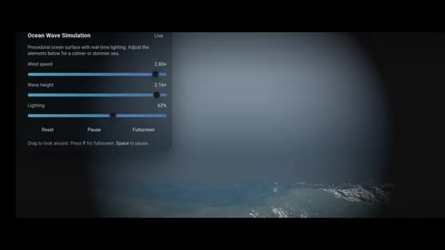
*Simulation de vagues océaniques avec curseurs de réglage du vent et de la hauteur des vagues.*

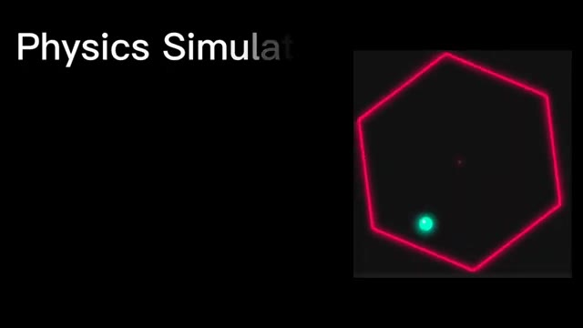
*Simulation physique montrant une balle verte rebondissant dans un hexagone aux contours rouges néon.*

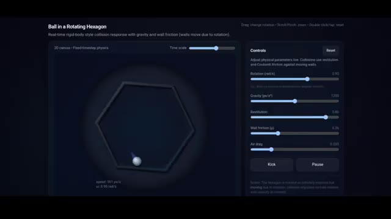
*Interface de simulation physique « Ball in a Rotating Hexagon » avec panneaux de contrôle des paramètres.*

---

### ⏱️ `[00:00:45 - 00:01:10]` | Segment #03

**🔊 Audio (Transcription Intégrale Mot pour Mot en Français) :**
> La balle à l'intérieur de la roue hexagonale est correcte. Si vous remarquez, la physique de la balle est également correcte. Elle tourne avec la roue conformément à la physique. Regardez la balle au ralenti et voyez comment elle rebondit avec précision. Remarquez ici, lorsque la balle rebondit depuis une petite zone, elle saute peu. Mais lorsqu'elle vient d'une grande distance le long d'une paroi, sa vitesse augmente et elle rebondit plus haut avec plus de vitesse, ce qui est correct selon la physique.

**👁️ Analyse Visuelle d'Écran (gemini-3.5-flash-lite) :**
**Interface & Outils** : Application web interactive de simulation physique ("Ball in a Rotating Hexagon") avec un panneau de contrôle à droite et une vue 2D de la simulation à gauche.

**Contenu textuel & Code** : Titre "Ball in a Rotating Hexagon", sous-titre "Real-time rigid-body style collision response with gravity and wall friction", et des curseurs de contrôle (Rotation, Gravity, Restitution, Wall friction, Air drag) ainsi que des boutons "Kick" et "Pause".

**Action / Démonstration** : Le panneau présente une simulation en temps réel d'une sphère blanche rebondissant à l'intérieur d'un hexagone en rotation avec des mesures de vitesse affichées.

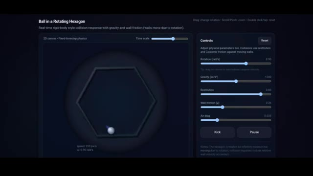
*Simulation interactive de physique montrant une balle rebondissant à l'intérieur d'un hexagone en rotation avec des curseurs de contrôle des paramètres.*

---

### ⏱️ `[00:01:10 - 00:01:30]` | Segment #04

**🔊 Audio (Transcription Intégrale Mot pour Mot en Français) :**
> Vous avez également des curseurs grâce auxquels vous pouvez contrôler la rotation de la roue. Vous pouvez faire pivoter la roue de gauche à droite, augmenter ou diminuer la gravité. Et comme vous pouvez le voir ici, si vous augmentez la gravité, la balle reste collée au sol et ne rebondit pas trop, et si vous diminuez la gravité, elle flotte, ce qui est correct selon la physique.

**👁️ Analyse Visuelle d'Écran (gemini-3.5-flash-lite) :**
**Interface & Outils** : Application web interactive de simulation physique ("Ball in a Rotating Hexagon").

**Contenu textuel & Code** : Panneau de contrôles avec curseurs pour la rotation (0.90 rad/s), la gravité (1200 px/s²), la restitution (0.85), la friction des murs (0.38) et la résistance de l'air (0.035). Boutons "Kick" et "Pause".

**Action / Démonstration** : Le créateur montre l'interface de simulation physique et les curseurs permettant de modifier en temps réel des paramètres comme la gravité et la rotation.

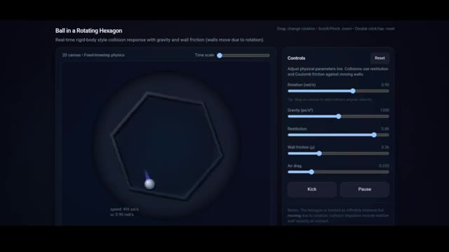
*Interface de simulation physique montrant une balle dans un hexagone rotatif avec des curseurs de contrôle pour la gravité, la rotation et la friction.*

---

### ⏱️ `[00:01:30 - 00:01:49]` | Segment #05

**🔊 Audio (Transcription Intégrale Mot pour Mot en Français) :**
> Grâce à la restitution, vous pouvez contrôler le rebond de la balle. Vous pouvez également contrôler la quantité de frottement, la résistance de l'air et il y a un bouton de pause grâce auquel vous pouvez suspendre le mouvement à tout moment. Vous pouvez aussi donner une impulsion à la balle en utilisant l'option de coup de pied, et dans le coin supérieur droit, il y a un curseur d'échelle temporelle grâce auquel vous pouvez voir ces moments en mouvement ralenti et rapide.

**👁️ Analyse Visuelle d'Écran (gemini-3.5-flash-lite) :**
**Interface & Outils** : Application Web interactive de simulation physique ("Ball in a Rotating Hexagon").

**Contenu textuel & Code** : Panneau de contrôles avec les curseurs suivants : Rotation (rad/s), Gravity (px/s²), Restitution, Wall friction (μ), Air drag, ainsi que des boutons "Kick" et "Pause". Un curseur "Time scale" est visible en haut à droite.

**Action / Démonstration** : Simulation en temps réel d'une balle rebondissant à l'intérieur d'un hexagone en rotation avec affichage des paramètres physiques ajustables.

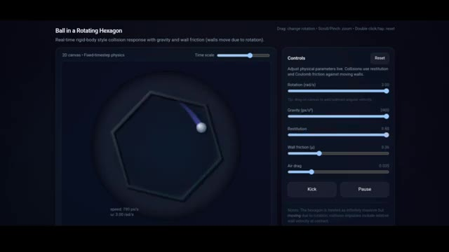
*Interface de simulation physique montrant une balle à l'intérieur d'un hexagone en rotation avec des curseurs de contrôle pour la restitution, la friction et la gravité.*

---

### ⏱️ `[00:01:49 - 00:02:12]` | Segment #06

**🔊 Audio (Transcription Intégrale Mot pour Mot en Français) :**
> Et voici le résultat de Gemini 3. Sa physique est également correcte, avec la balle qui glisse et rebondit parfaitement. Ici, je n'ai que trois curseurs. Premièrement, le contrôleur de vitesse de rotation, deuxièmement, le contrôleur de gravité, et troisièmement, le contrôleur de rebond, et tous fonctionnent. Les deux résultats sont bons, mais GPT 5.2 a plus d'options que Gemini 3.

**👁️ Analyse Visuelle d'Écran (gemini-3.5-flash-lite) :**
**Interface & Outils** : Interface logicielle ou de simulation interactive de physique avec affichage graphique et curseurs de réglage.

**Contenu textuel & Code** : Trois curseurs visibles en bas de l'écran avec les libellés : 'ROTATION SPEED', 'GRAVITY', et 'BOUNCINESS'. Une forme géométrique hexagonale lumineuse en néon rouge et une petite sphère lumineuse turquoise à l'intérieur.

**Action / Démonstration** : Simulation physique d'une sphère se déplaçant à l'intérieur d'un hexagone en rotation, contrôlée par les paramètres de l'interface.

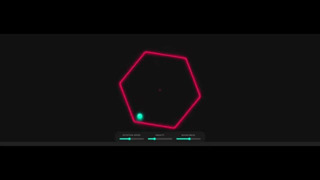
*Interface interactive affichant un hexagone lumineux rouge contenant une balle turquoise en mouvement, avec trois curseurs de contrôle en bas (vitesse de rotation, gravité, rebond).*

---

### ⏱️ `[00:02:12 - 00:02:33]` | Segment #07

**🔊 Audio (Transcription Intégrale Mot pour Mot en Français) :**
> Dans ce résultat, je préfère le résultat de GPT 5.2. Ensuite, c'est le jeu de vol d'oiseaux. Les exigences sont simples, un monde dans lequel des oiseaux volent en essaim et je peux voir les mouvements de vol d'oiseaux à travers une vue d'oiseau. Voici le résultat de Gemini 3. Le monde est grand. Voici quelques paramètres à travers lesquels vous pouvez contrôler la taille de l'essaim et la taille maximale de l'essaim est de 300.

**👁️ Analyse Visuelle d'Écran (gemini-3.5-flash-lite) :**
**Interface & Outils** : Interface de simulation de jeu en ligne avec panneaux de contrôle interactifs.

**Contenu textuel & Code** : Textes visibles : "Bird Flocking Game", "A world in which birds are flocking Bird View", "Flock Controls", "Flock Size", "Separation (Space)", "Alignment (Steer)", "Cohesion (Group)", "Speed", "Switch Camera: World". Paramètre de taille d'essaim réglé à 300.

**Action / Démonstration** : Le créateur présente différents résultats de génération de code/monde virtuel, montrant d'abord une simulation physique puis un jeu de vol d'oiseaux avec réglage des paramètres de l'essaim.

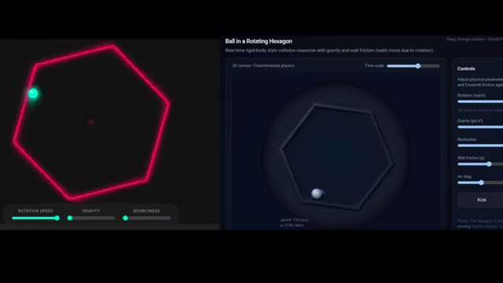
*Comparaison de deux simulations physiques interactives dont une avec un hexagone rotatif.*

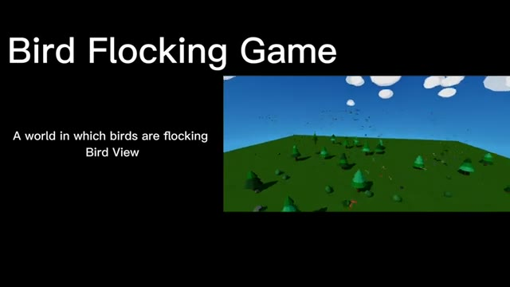
*Présentation du titre 'Bird Flocking Game' avec un monde 3D affichant une vue d'ensemble des oiseaux.*

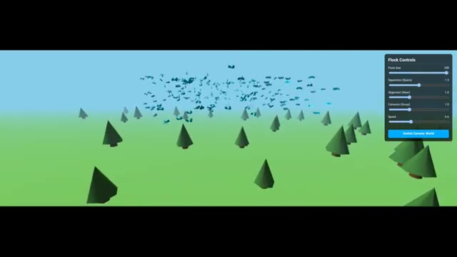
*Simulation 3D du vol d'oiseaux avec le panneau de contrôle 'Flock Controls' affichant une taille d'essaim de 300.*

---

### ⏱️ `[00:02:33 - 00:03:11]` | Segment #08

**🔊 Audio (Transcription Intégrale Mot pour Mot en Français) :**
> Vous pouvez contrôler la vitesse, vous pouvez mettre le monde en pause, et vous disposez de quelques contrôles de comportement, un curseur de séparation qui signifie l'espace personnel requis par chaque oiseau, l'alignement où les oiseaux essaient fortement de voler dans la même direction que leurs voisins, créant des vagues de mouvement fluides et synchronisées. La cohésion, qui contrôle le regroupement, et la portée visuelle, qui contrôle la distance de vision. Vous pouvez également changer la vue de la caméra. Vous pouvez voir depuis la vue de l'oiseau et la vue du monde. Si vous regardez le mouvement des oiseaux, il est correct et fluide. Mais si vous regardez depuis la vue de l'oiseau, ça secoue trop. Voici le résultat de GPT 5.2. Qu'est-ce que c'est que ça, mon frère ?

**👁️ Analyse Visuelle d'Écran (gemini-3.5-flash-lite) :**
**Interface & Outils** : Interface de simulation interactive en 3D ("Bird Flocking Simulation") avec un panneau de réglages "Flock Controls" (taille du groupe, séparation, alignement, cohésion, vitesse) et des boutons de changement de vue caméra.

**Contenu textuel & Code** : Panneau "Flock Controls" affichant des curseurs pour Flock Size (300), Separation (1.5), Alignment (1.0), Cohesion (1.0), Speed (1.5), ainsi qu'un bouton "Switch Camera: World".

**Action / Démonstration** : L'écran présente la simulation interactive de vol d'oiseaux en 3D low-poly, avec des ajustements des paramètres de comportement et des basculements entre la vue du monde et la vue de l'oiseau.

*Simulation de vol d'oiseaux en vue globale (World View) avec le panneau de contrôle des comportements "Flock Controls" à droite.*

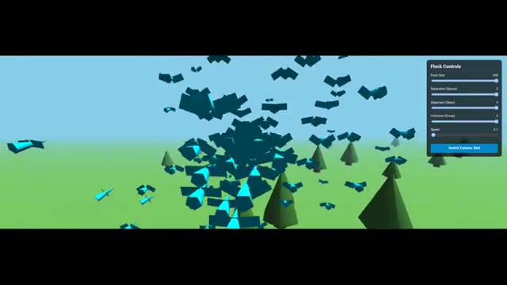
*Simulation de vol d'oiseaux en gros plan rapproché avec les paramètres de "Flock Controls" ajustés à droite.*

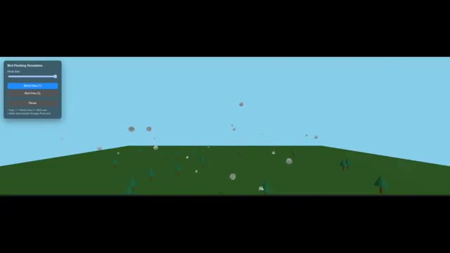
*Interface de simulation "Bird Flocking Simulation" montrant les options de vue World View, Bird View et Pause en haut à gauche.*

---

### ⏱️ `[00:03:11 - 00:03:29]` | Segment #09

**🔊 Audio (Transcription Intégrale Mot pour Mot en Français) :**
> Ça a vraiment brisé mes attentes. Les résultats de Gemini sont vraiment meilleurs. Voici le résultat de Claude Opus 4.5. Vous voyez les oiseaux ? Ça a l'air vraiment naturel et incroyable. C'est encore mieux que le résultat de Gemini 3. Claude Opus 4.5 l'emporte ici. C'est le dernier test, la simulation de main.

**👁️ Analyse Visuelle d'Écran (gemini-3.5-flash-lite) :**
**Interface & Outils** : Interface de simulation de vol d'oiseaux (« Bird Flocking ») avec panneaux de configuration et contrôles interactifs.

**Contenu textuel & Code** : Textes visibles : « Bird Flocking », « Flock Size », « Flocking Speed », « Cohesion Strength », « World View », « Bird View », « Pause », « Scatter », et le titre « Hand Simulation ».

**Action / Démonstration** : Présentation comparative des résultats de génération d'IA (oiseaux en vol et simulation de main 3D).

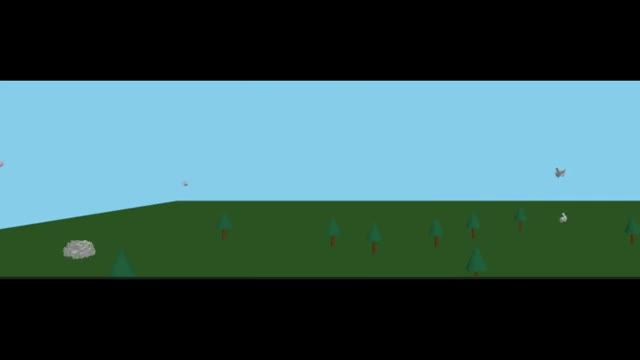
*Démonstration du résultat de simulation généré, montrant des oiseaux en vol dans un paysage minimaliste en 3D.*

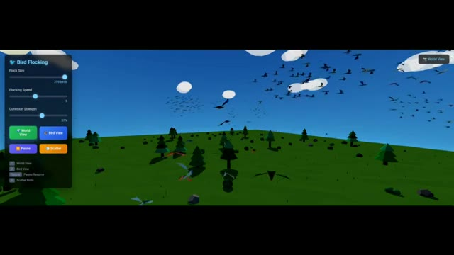
*Interface de contrôle de simulation (« Bird Flocking ») avec des curseurs de réglage pour la taille du vol, la vitesse et la cohésion.*

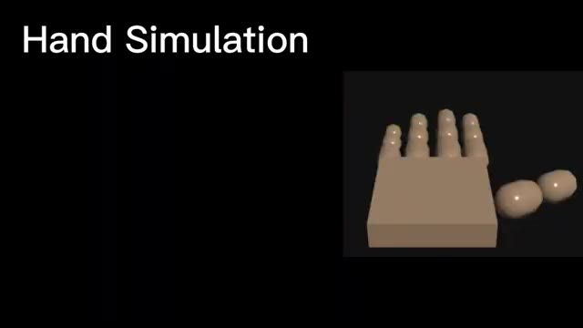
*Écran de titre et démonstration d'une simulation 3D de main stylisée en blocs (« Hand Simulation »).*

---

### ⏱️ `[00:03:29 - 00:03:48]` | Segment #10

**🔊 Audio (Transcription Intégrale Mot pour Mot en Français) :**
> Les exigences sont simples. Je peux contrôler chaque doigt de la main grâce à des curseurs. Et voici le résultat de GPT 5.2. Et je suis totalement déçu par cela. C'est le modèle pour lequel ils annoncent une alerte rouge ? Quelle mise à jour est-ce ? J'ai même essayé plusieurs fois mais ça échoue. Voici le résultat de Gemini 3.

**👁️ Analyse Visuelle d'Écran (gemini-3.5-flash-lite) :**
**Interface & Outils** : Simulation 3D interactive (Hand Finger Physics Simulator / HTML autonome) avec des boutons de contrôle des doigts et un encadré de type mème/réaction vidéo.

**Contenu textuel & Code** : Textes visibles : "Hand Simulation", "Control Every Fingers of the Hand", "Hand Finger Physics Simulator (standalone Html)", boutons "Thumb Open", "Thumb Close", "Index Open", "Index Close", "Middle Open", "Middle Close", "Ring Open", "Ring Close", et le texte "ME..." sur l'encadré de réaction.

**Action / Démonstration** : Présentation d'une simulation 3D de main avec des contrôles interactifs pour chaque doigt, accompagnée d'une réaction émotionnelle de déception.

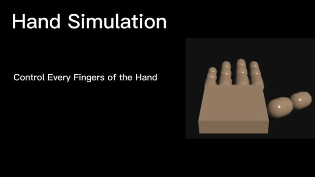
*Simulation 3D d'une main simplifiée avec le titre 'Hand Simulation' et 'Control Every Fingers of the Hand'.*

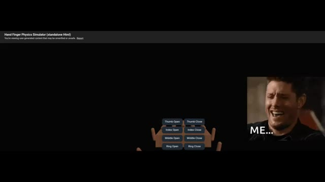
*Interface de simulation physique 'Hand Finger Physics Simulator' avec des boutons de contrôle pour les doigts et un encadré vidéo montrant une réaction déçue.*

---

### ⏱️ `[00:03:48 - 00:04:06]` | Segment #11

**🔊 Audio (Transcription Intégrale Mot pour Mot en Français) :**
> Pour la première fois, il crée cela en utilisant le même prompt. Ça a vraiment l'air fantastique. Comme vous pouvez le voir, vous pouvez contrôler tous les doigts à l'aide de ces curseurs, et ils fonctionnent tous. Regardez le mouvement des doigts. Il bouge vraiment comme un doigt humain. Encore une fois, Gemini 3 l'emporte ici, et je n'ai vraiment pas aimé la mise à jour de GPT 5.2.

**👁️ Analyse Visuelle d'Écran (gemini-3.5-flash-lite) :**
**Interface & Outils** : Hand Sim (Application de simulation de main 3D) avec un panneau de contrôle latéral comportant des curseurs.

**Contenu textuel & Code** : Texte "Hand Sim", curseurs pour "PINKY" (auriculaire), "RING" (annulaire), "MIDDLE" (majeur), "INDEX", "THUMB" (pouce) et "ALL" (tous), ainsi que deux boutons "Open" (ouvrir) et "Close" (fermer). Au centre, un modèle 3D simplifié d'une main articulée.

**Action / Démonstration** : Le modèle 3D de la main est affiché à l'écran tandis que les curseurs permettent de contrôler les mouvements de chaque articulation et doigt.

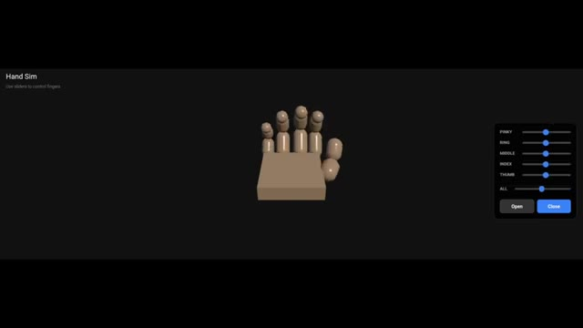
*Interface d'une application de simulation de main 3D montrant les curseurs de contrôle pour chaque doigt.*

---

### ⏱️ `[00:04:06 - 00:04:14]` | Segment #12

**🔊 Audio (Transcription Intégrale Mot pour Mot en Français) :**
> Il obtient vraiment de moins bons résultats dans ces tests. C'est donc mes recherches pour la vidéo d'aujourd'hui. Si vous avez aimé, veuillez mettre un pouce bleu, vous abonner et laisser un commentaire.

**👁️ Analyse Visuelle d'Écran (gemini-3.5-flash-lite) :**
**Interface & Outils** : Page web de présentation produit (type OpenAI) avec superposition d'éléments d'interface YouTube (boutons Like, Subscribe, Notification et icône de partage).

**Contenu textuel & Code** : Texte affiché : "December 11, 2025 Product Release", "Introducing GPT-5.2", et "Introducing GPT-5.2, the most capable model series yet for professional work and long-running agents." Illustration graphique à gauche montrant un cerveau humain connecté à un processeur informatique stylisé entouré d'un anneau lumineux. Boutons interactifs au centre : bouton pouce bleu, gros bouton rouge "SUBSCRIBE" et cloche de notification.

**Action / Démonstration** : Affichage de la page de présentation du modèle GPT-5.2 avec superposition des boutons d'interaction de la chaîne YouTube pour inciter l'abonnement.

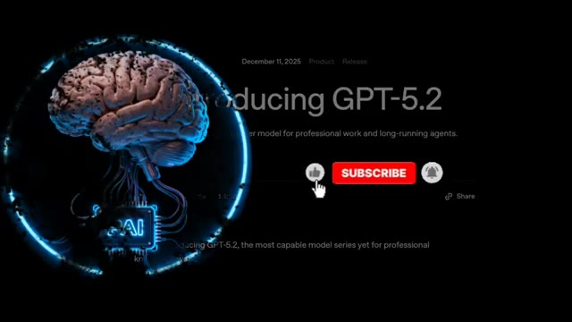
*Page de présentation du produit Introducing GPT-5.2 avec une illustration de cerveau artificiel lumineux et des boutons d'appel à l'action pour s'abonner.*

---
