# 🎬 Révélation sur les images de GPT-1.5 : Vraie évolution ou simple coup marketing ?

> **Chaîne** : [Pursuing AI](https://www.youtube.com/@PursuingAi)  
> **Titre original** : `GPT-1.5 Images Exposed: Real Upgrade or Marketing Hype?`  
> **Lien YouTube** : [https://www.youtube.com/watch?v=Msrj1lQBonI](https://www.youtube.com/watch?v=Msrj1lQBonI)  
> **Date de publication** : 2025-12-18  
> **Durée** : 03m 45s (`225s`)  
> **Identifiant vidéo** : `Msrj1lQBonI`  
> **Fiche Web Interactive** : [2025-12-18_YT-Msrj1lQBonI_Révélation sur les images de GPT-1.5 Vraie évolution ou simple coup marketing_by-whisper-v3-large-turbo+gemini-3.5-flash-lite.html](2025-12-18_YT-Msrj1lQBonI_Révélation sur les images de GPT-1.5 Vraie évolution ou simple coup marketing_by-whisper-v3-large-turbo+gemini-3.5-flash-lite.html)  
> **Captures de démonstration clés** : `24 captures réelles (anti-talking-head)`  
> **Modèles utilisés** : Audio: `large-v3-turbo` (Faster-Whisper int8 VPS) | Vision: `gemini-3.5-flash-lite` (Google AI Studio API)  

---

## 📌 Synthèse Exécutive & Outils

### 📌 Résumé
La vidéo de *Pursuing AI* dissèque la nouvelle mise à jour « ChatGPT Images 1.5 » d'OpenAI afin de séparer la véritable révolution technologique du simple argument marketing. L'analyste adopte une approche pragmatique et comparative, s'éloignant des démos superficiellement parfaites pour soumettre le modèle à des cas d'usage réels du quotidien (retouche photo, essayage virtuel et génération d'infographies). En confrontant directement l'outil à un cador du marché, *Nano Banana Pro*, il évalue froidement la précision, le respect du contexte et les limites structurelles des intelligences artificielles génératives actuelles.

Pour mener à bien son investigation, le créateur déploie une méthodologie empirique rigoureuse basée sur des scénarios concrets. Il teste d'abord la suppression d'éléments indésirables sur une photo de Noël pour mesurer l'intégrité de la retouche, puis éprouve la capacité d'essayage virtuel en habillant un sujet à partir d'un plan mi-corps, avant d'explorer la création d'infographies et les affiches publicitaires. Chaque cas d'usage est décortiqué pour observer la gestion des proportions, le réalisme des textures et la fidélité des sujets.

Cette analyse approfondie offre des bénéfices concrets majeurs pour les créateurs de vidéo et professionnels du numérique. Elle démontre que si les modèles actuels excellent dans la manipulation chirurgicale d'images (comme l'inpainting contextuel), ils pèchent encore sur la cohérence multisuport et la persistance des personnages d'un plan à l'autre. Pour les créateurs, comprendre ces seuils de rupture permet d'optimiser leurs workflows de production, d'éviter les pièges de l'hallucination visuelle et d'utiliser à bon escient les forces combinées de ces nouveaux outils génératifs.

### 🛠️ Outils, Modèles & Logiciels Présentés
* **ChatGPT Images 1.5 (OpenAI)** : Modèle de génération et d'édition d'images testé pour ses capacités de retouche contextuelle, d'essayage virtuel et de création d'infographies.
* **Nano Banana Pro** : Modèle d'image ultra-puissant du marché utilisé comme étalon de comparaison directe pour évaluer le réalisme et la précision de la concurrence.

### 🔑 Points Clés & Enseignements Stratégiques
* **Priorité aux cas d'usage réels** : Il est impératif de tester les IA génératives sur des problématiques quotidiennes (retouche, détourage, mise en situation) plutôt de se fier uniquement aux démos marketing tape-à-l'œil.
* **Maîtrise de l'inpainting contextuel** : Image 1.5 démontre une excellente capacité à supprimer des personnes en arrière-plan tout en préservant l'intégrité des expressions faciales et du sujet principal.
* **Gestion rigoureuse des limites de cadrage** : Lors d'un essayage virtuel à partir d'un plan mi-corps, un bon modèle génératif ne doit pas halluciner des éléments hors champ (comme des pantalons ou des bottes invisibles).
* **Supériorité subtile du réalisme vestimentaire** : Face à *Nano Banana Pro*, Image 1.5 ajuste plus naturellement les vêtements sur un corps, évitant l'effet trop ample et peu naturel.
* **Bond en avant pour les infographies** : Les nouveaux modèles structurent nettement mieux la mise en page, la hiérarchie visuelle et la clarté des infographies comparés aux anciennes générations.
* **Transparence des failles par les éditeurs** : OpenAI liste lui-même ses limites (inexactitudes scientifiques, contraintes de style artistique), ce qui aide les créateurs à anticiper les erreurs de rendu.
* **Persistance des sujets en multi-sujets** : Un point de friction majeur reste la cohérence visuelle lorsqu'une seule image intègre plusieurs personnages, entraînant des variations morphologiques d'un sujet à l'autre.
* **Limites linguistiques persistantes** : Des barrières subsistent dans la compréhension fine de certaines requêtes textuelles complexes intégrées aux images.
* **Approche comparative indispensable** : L'utilisation d'un benchmark direct (comme *Nano Banana Pro*) est la seule méthode fiable pour nuancer le battage médiatique autour d'une nouvelle version.
* **Adaptation des workflows de création** : Connaître les forces de retouche d'Image 1.5 permet aux créateurs de contenu d'accélérer la post-production photographique sans recourir systématiquement à des logiciels lourds.

---

## ⏱️ Chronologie & Transcription Complète Audio & Visuelle (Mot pour Mot)

### ⏱️ `[00:00:00 - 00:00:22]` | Segment #01

**🔊 Audio (Transcription Intégrale Mot pour Mot en Français) :**
> OpenAI vient de sortir une nouvelle version de ChatGPT Images 1.5. Et à première vue, ça a l'air impressionnant. Mais la vraie question est de savoir si c'est réellement utile dans le monde réel, ou si c'est juste un autre générateur d'images avec un meilleur marketing. La plupart des critiques s'arrêtent aux démos tape-à-l'œil et aux jolies images.

**👁️ Analyse Visuelle d'Écran (gemini-3.5-flash-lite) :**
**Interface & Outils** : Interface web de présentation de ChatGPT Images (OpenAI) avec des exemples de générations visuelles et de prompts.

**Contenu textuel & Code** : Texte principal "The new ChatGPT Images is here", boutons "Try in ChatGPT", "Learn more", ainsi que des exemples d'images générées et de prompts textuels (ex: "Combine the two men and the dog in a 2000s film camera-style photo of them looking bored at a kids birthday party").

**Action / Démonstration** : Présentation des capacités de génération et de modification d'images de la nouvelle version 1.5 de ChatGPT Images.

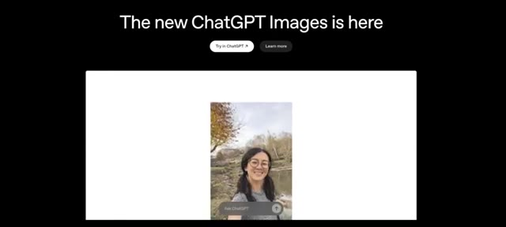
*Page de présentation de ChatGPT Images affichant le texte "The new ChatGPT Images is here" avec l'exemple d'une photo générée d'une femme en extérieur.*

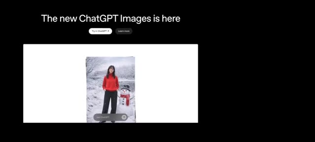
*Page de présentation montrant une autre image générée d'une femme posant à côté d'un bonhomme de neige dans un décor hivernal.*

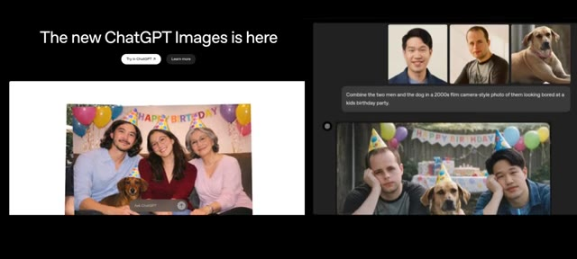
*Page de présentation de ChatGPT Images montrant des exemples de combinaisons d'images et de prompts textuels complexes générant de nouvelles scènes de groupe.*

---

### ⏱️ `[00:00:22 - 00:00:44]` | Segment #02

**🔊 Audio (Transcription Intégrale Mot pour Mot en Français) :**
> Je ne l'ai pas fait. Au lieu de faire des tests irréalistes, j'ai recherché et testé Image 1.5 sur des cas d'usage réels, le genre de tâches qui importent vraiment aux gens, aux créateurs, aux développeurs et aux entreprises. Et pour comprendre où il se situe réellement, je l'ai comparé directement avec Nano Banana Pro, l'un des modèles d'image les plus puissants du moment.

**👁️ Analyse Visuelle d'Écran (gemini-3.5-flash-lite) :**
**Interface & Outils** : Interface de présentation web et logicielle présentant de nouveaux modèles d'IA générative d'images ("The new ChatGPT Images is here" et "Nano Banana Pro").

**Contenu textuel & Code** : Texte affiché : "The new ChatGPT Images is here", boutons "Try in ChatGPT", "Learn more", et le titre "Nano Banana Pro" avec des vignettes d'exemples d'images générées et des prompts textuels de modification.

**Action / Démonstration** : Démonstration visuelle et comparaison des capacités de génération et de modification d'images entre les nouveaux modèles ChatGPT Images et Nano Banana Pro.

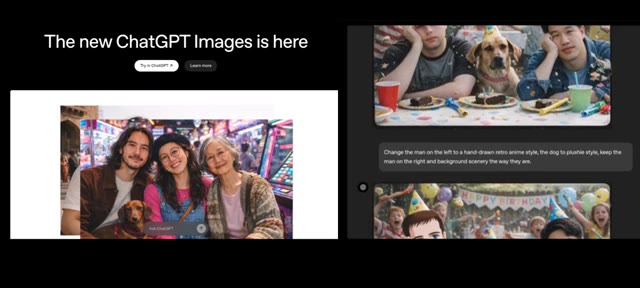
*Interface de présentation montrant "The new ChatGPT Images is here" avec des exemples de modification d'image et une comparaison visuelle.*

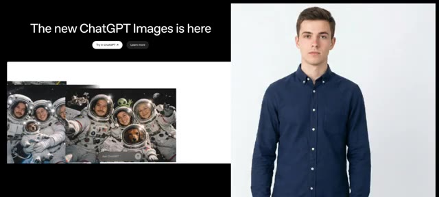
*Interface de présentation comparant de nouvelles générations d'images ChatGPT avec des astronautes et le modèle Nano Banana Pro.*

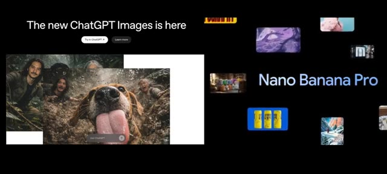
*Interface de présentation avec le texte "The new ChatGPT Images is here" à gauche et le modèle "Nano Banana Pro" à droite illustré par plusieurs exemples.*

---

### ⏱️ `[00:00:44 - 00:01:10]` | Segment #03

**🔊 Audio (Transcription Intégrale Mot pour Mot en Français) :**
> Pas de battage médiatique, pas d'exemples sélectionnés sur le volet. Juste de vrais tests, de vraies comparaisons et de vrais résultats. C'est Pursuing AI, et vous regardez le rapport de recherche. Commençons donc par le premier test, l'édition d'image. Car dans la vraie vie, les photos sont rarement parfaites. Par exemple, à Noël, vous prenez une photo près d'un sapin de Noël, mais des personnes aléatoires s'immiscent en arrière-plan et soudainement votre photo est gâchée.

**👁️ Analyse Visuelle d'Écran (gemini-3.5-flash-lite) :**
**Interface & Outils** : Interface de ChatGPT (version sombre) affichant des discussions avec des images générées et éditées.

**Contenu textuel & Code** : Texte du prompt dans l'interface : "Remove all people from the background completely while keeping the main subject untouched. Preserve the face, facial features, skin texture, hair details, expression, clothing, body proportions, lighting, shadows, and overall image quality exactly as original. Do not alter the subject's appearance in any way. Ensure the background looks natural, clean, and seamless with no blur artifacts, distortions, or loss of detail. Maintain high resolution and realistic colors." Des flèches roses dessinées pointent sur les passants en arrière-plan de la photo.

**Action / Démonstration** : L'écran montre une interface de chat avec un prompt détaillé pour la retouche d'image (suppression d'arrière-plan), puis zoome sur la photo originale montrant une femme faisant un selfie devant un sapin de Noël avec des passants en arrière-plan signalés par des flèches.

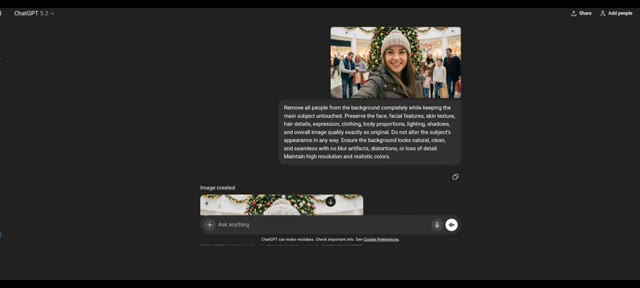
*Interface de ChatGPT montrant un prompt d'édition d'image pour supprimer les personnes en arrière-plan d'un selfie de Noël.*

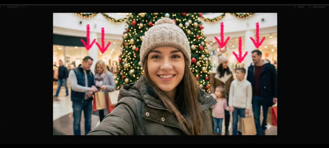
*Gros plan de la photo de selfie de Noël avec des flèches roses pointant vers les personnes en arrière-plan.*

---

### ⏱️ `[00:01:11 - 00:01:33]` | Segment #04

**🔊 Audio (Transcription Intégrale Mot pour Mot en Français) :**
> Donc la vraie question est de savoir à quel point image 1.5 est douée pour supprimer des objets et des personnes sans détruire l'image ? Voici l'image que j'ai utilisée. J'ai demandé au modèle de supprimer les personnes en arrière-plan, et voici le résultat. Il a préservé les expressions faciales correctement, a supprimé toutes les personnes en arrière-plan, et a gardé le sujet principal complètement intact.

**👁️ Analyse Visuelle d'Écran (gemini-3.5-flash-lite) :**
**Interface & Outils** : Interface sombre de ChatGPT 5.2 avec une zone de chat et des éléments de saisie textuelle.

**Contenu textuel & Code** : Texte du prompt visible : "Remove all people from the background completely while keeping the main subject untouched. Preserve the face, facial features, skin texture, hair details, expression, clothing, body proportions, lighting, shadows, and overall image quality exactly as original..."

**Action / Démonstration** : L'écran présente l'interface de ChatGPT avec l'image source et le prompt de modification, puis affiche le résultat avant/après de la suppression d'objets.

*Interface de ChatGPT montrant une image avec un prompt textuel demandant la suppression des personnes en arrière-plan.*

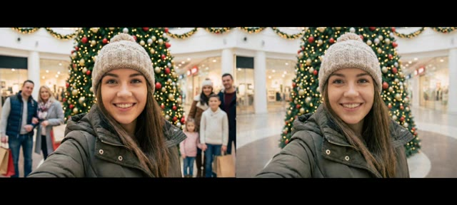
*Comparaison avant/après de l'image montrant le sujet principal avec les personnes en arrière-plan supprimées.*

---

### ⏱️ `[00:01:33 - 00:01:57]` | Segment #05

**🔊 Audio (Transcription Intégrale Mot pour Mot en Français) :**
> Maintenant, voici le résultat de Nano Banana Pro. Il a également supprimé les personnes en arrière-plan avec succès. Donc, dans ce test, les deux modèles fonctionnent bien. Passons maintenant à un cas d'usage plus pratique. Et si vous vouliez essayer un costume de Père Noël sur votre corps avant de l'acheter en ligne ? J'ai donc utilisé l'image d'un homme et demandé à un modèle d'ajuster ce costume sur son corps.

**👁️ Analyse Visuelle d'Écran (gemini-3.5-flash-lite) :**
**Interface & Outils** : Interface de type chat IA (ChatGPT) et fenêtres de comparaison d'images.

**Contenu textuel & Code** : Texte du prompt visible : "Dress the man in a realistic Santa Claus costume. Replace his current clothing with a classic red Santa suit including the red coat with white fur trim, matching pants, black belt with gold buckle, and Santa hat. Preserve the man's original face, facial features, skin tone, expression, hairstyle, and body proportions exactly as they are..."

**Action / Démonstration** : Le présentateur compare les résultats visuels de suppression d'arrière-plan de deux modèles d'IA, puis introduit un test de retouche vestimentaire (essayage virtuel d'un costume de Père Noël) en montrant les images source et le prompt associé dans l'interface de l'IA.

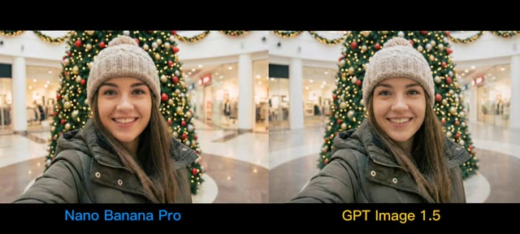
*Comparaison côte à côte entre Nano Banana Pro et GPT Image 1.5 montrant le résultat de suppression d'arrière-plan.*

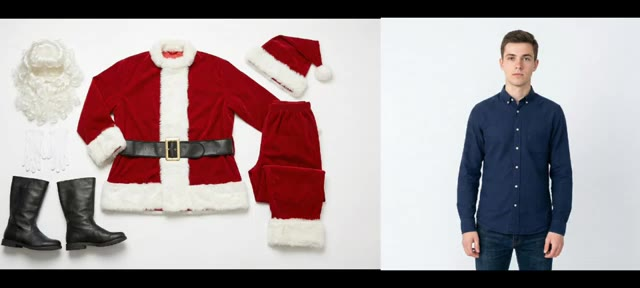
*Affichage des images source utilisées pour le test : un costume de Père Noël complet et une photo d'un homme portant une chemise bleue.*

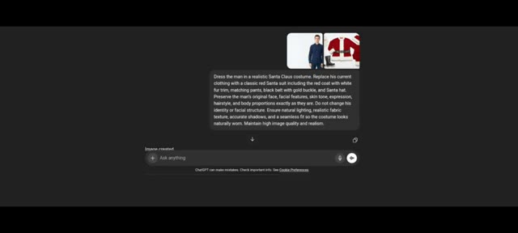
*Interface de ChatGPT montrant le prompt textuel et les images jointes pour habiller l'homme en costume de Père Noël.*

---

### ⏱️ `[00:01:57 - 00:02:18]` | Segment #06

**🔊 Audio (Transcription Intégrale Mot pour Mot en Français) :**
> Voici le résultat de l'image 1.5. Les vêtements s'ajustent naturellement. Le modèle préserve le visage correct, la tonalité de la peau et le réalisme global. Un détail important ici. Comme j'ai fourni uniquement une image à mi-corps, le modèle a correctement généré uniquement la partie supérieure des vêtements. Il n'a pas halluciné de pantalon ou de bottes.

**👁️ Analyse Visuelle d'Écran (gemini-3.5-flash-lite) :**
**Interface & Outils** : Présentation visuelle de résultats d'essayage virtuel d'intelligence artificielle.

**Contenu textuel & Code** : À gauche, les éléments du costume de Père Noël (manteau, bonnet, ceinture, bottes, barbe). Au centre, l'image originale d'un homme en chemise bleue. À droite, le résultat de l'essayage virtuel où l'homme porte le costume de Père Noël.

**Action / Démonstration** : Le créateur montre le résultat de l'essayage virtuel et souligne que le modèle n'a généré que le haut du corps en fonction de l'image source fournie.

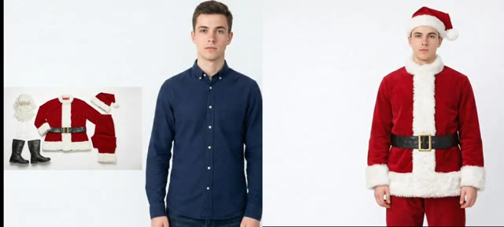
*Comparatif d'essayage virtuel avec l'image source, les vêtements de Père Noël et le résultat généré.*

---

### ⏱️ `[00:02:18 - 00:02:38]` | Segment #07

**🔊 Audio (Transcription Intégrale Mot pour Mot en Français) :**
> C'est en fait un bon signe. Voici maintenant le résultat de Nano Banana Pro. Ça va aussi avec les vêtements, mais comme vous pouvez le voir, la tenue a l'air plus ample et moins naturelle. Donc dans ce cas, les deux résultats sont bons, mais l'image 1.5 gère légèrement mieux le réalisme. Maintenant, et si vous vouliez créer une infographie ?

**👁️ Analyse Visuelle d'Écran (gemini-3.5-flash-lite) :**
**Interface & Outils** : Interface de démonstration et de comparaison d'images IA, puis interface d'affichage de résultats (style interface web / application de génération d'infographie).

**Contenu textuel & Code** : Textes visibles : "Nano Banana Pro", "GPT Image 1.5", et sur l'infographie de l'image 2 : "HOW MANY CALORIES ARE THERE IN YOUR HAMBURGER" avec la liste des ingrédients et des calories (Top Bun, Cheddar Cheese, Onions, Fresh Lettuce, etc., pour un total estimé de 1,090 kcal).

**Action / Démonstration** : Le présentateur compare visuellement deux images de vêtements générées par IA, puis passe à la présentation d'une infographie nutritionnelle générée par l'outil.

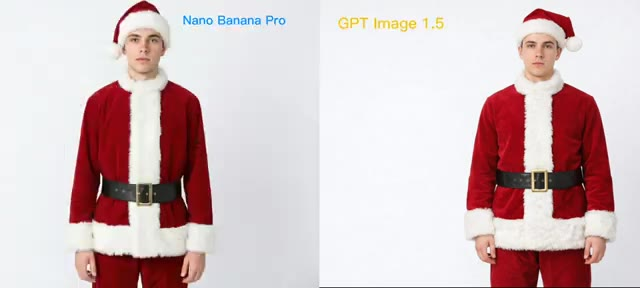
*Comparaison côte à côte de deux images de modèles habillés en Père Noël générées par 'Nano Banana Pro' et 'GPT Image 1.5'.*

*Affichage d'une interface de génération montrant une infographie détaillée sur les calories d'un hamburger.*

---

### ⏱️ `[00:02:38 - 00:02:58]` | Segment #08

**🔊 Audio (Transcription Intégrale Mot pour Mot en Français) :**
> Oui, vous pouvez générer des infographies comme celle-ci. La mise en page, la structure et la clarté sont nettement améliorées par rapport aux anciens modèles. Parlons des limitations car aucun modèle n'est parfait. Et pour être juste, OpenAI a lui-même listé les limitations d'Image 1.5 sur son site web.

**👁️ Analyse Visuelle d'Écran (gemini-3.5-flash-lite) :**
**Interface & Outils** : Interface web d'analyse ou de présentation de modèles d'IA avec des onglets de navigation (Markdown rendering, Calorie infographic, Coding, Deep sea poster, etc.)

**Contenu textuel & Code** : Sur l'image 1 : Une infographie titrée "HOW MANY CALORIES ARE THERE IN YOUR HAMBURGER" détaillant les ingrédients de 1 à 11 et indiquant un total estimé de 1,090 kcal. Sur l'image 2 : Un panneau "New" avec un prompt texte "create a poster of deep sea creatures at different depths..." et son résultat graphique comparé au panneau "Previous".

**Action / Démonstration** : Le présentateur illustre ses propos en affichant à l'écran des exemples concrets d'infographies générées pour appuyer l'amélioration de la disposition et de la structure.

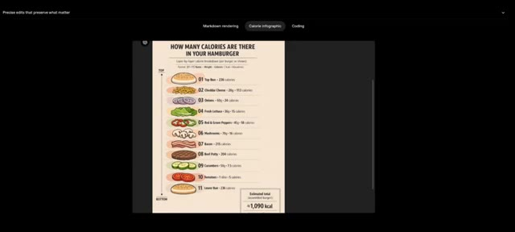
*Affichage d'une infographie détaillée sur les calories d'un hamburger, illustrant la clarté et la structure améliorées de la génération.*

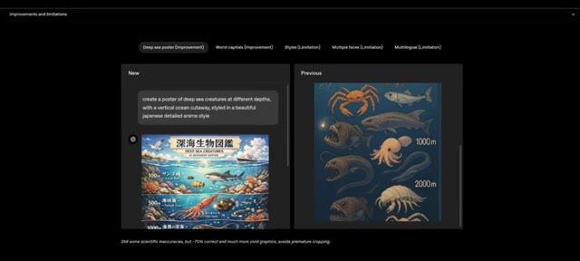
*Comparaison visuelle entre un nouveau modèle et un ancien modèle montrant une affiche de créatures sous-marines avec les améliorations de mise en page.*

---

### ⏱️ `[00:02:58 - 00:03:18]` | Segment #09

**🔊 Audio (Transcription Intégrale Mot pour Mot en Français) :**
> Par exemple, si vous lui demandez de générer une affiche, les résultats sont bien meilleurs que les modèles précédents, mais il reste des problèmes. Il peut y avoir des inexactitudes scientifiques, quelques limitations de style artistique, et des problèmes de cohérence lorsque plusieurs sujets apparaissent dans une seule image. Comme vous pouvez le voir ici, cette fille change à travers l'image.

**👁️ Analyse Visuelle d'Écran (gemini-3.5-flash-lite) :**
**Interface & Outils** : Interface utilisateur web de présentation d'améliorations et de limitations d'un modèle d'intelligence artificielle (génération d'images).

**Contenu textuel & Code** : Texte du prompt dans l'interface : "create a poster of deep sea creatures at different depths, with a vertical ocean cutaway, styled in a beautiful japanese detailed anime style". Légende en bas : "Still some scientific inaccuracies, but ~70% correct and much more vivid graphics, avoids premature cropping." Onglets de navigation : "Deep sea poster (Improvement)", "World capitals (Improvement)", "Styles (Limitation)", "Multiple faces (Limitation)", "Multilingual (Limitation)".

**Action / Démonstration** : Comparaison visuelle entre un ancien et un nouveau modèle de génération d'images, puis affichage d'une image générée démontrant des incohérences sur les visages de plusieurs sujets.

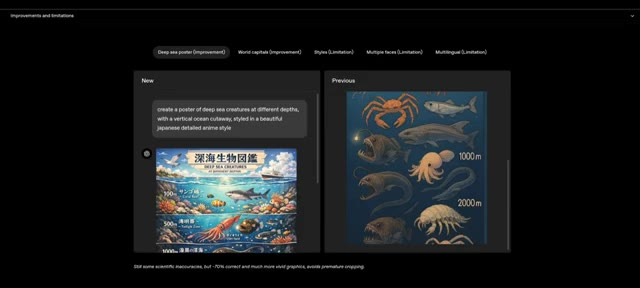
*Interface de démonstration comparative d'une IA affichant les onglets et les résultats entre une version "New" et "Previous" pour la création d'une affiche d'animaux marins.*

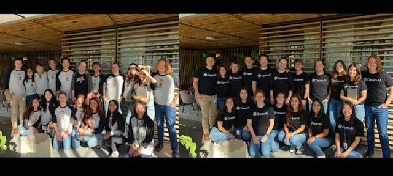
*Image générée par IA montrant un groupe de personnes posant ensemble, illustrant des problèmes de cohérence faciale et morphologique d'un sujet féminin au sein de l'image.*

---

### ⏱️ `[00:03:19 - 00:03:37]` | Segment #10

**🔊 Audio (Transcription Intégrale Mot pour Mot en Français) :**
> Cependant, une chose reste cohérente, Sam Altman. Et honnêtement, si le modèle modifiait Sam Altman, cette image serait probablement supprimée. Il y a aussi quelques limitations linguistiques, mais dans l'ensemble, c'est une nette amélioration par rapport au modèle précédent. C'est ma recherche pour la vidéo d'aujourd'hui.

**👁️ Analyse Visuelle d'Écran (gemini-3.5-flash-lite) :**
**Interface & Outils** : Interface web de ChatGPT et pages de présentation du modèle d'image d'OpenAI.

**Contenu textuel & Code** : Texte de l'interface : "can you make them wear shirts that say 'OpenAI' and have everyone smiling", "When there are many people, the model has difficulty maintaining the exact identity of every person during editing tasks.", "How to Order Food in Chinese", "The new ChatGPT Images is here".

**Action / Démonstration** : Présentation des limitations du modèle d'IA lors de la modification d'images complexes et de la gestion du texte dans différentes langues.

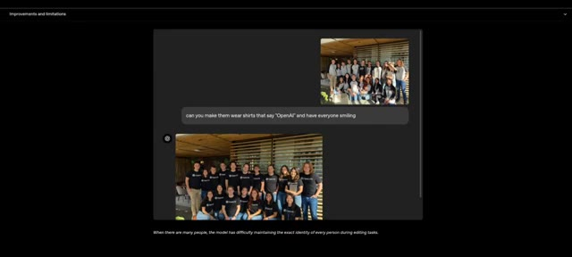
*Interface de ChatGPT montrant une modification d'image avec un groupe de personnes et le prompt textuel demandant de porter des t-shirts "OpenAI".*

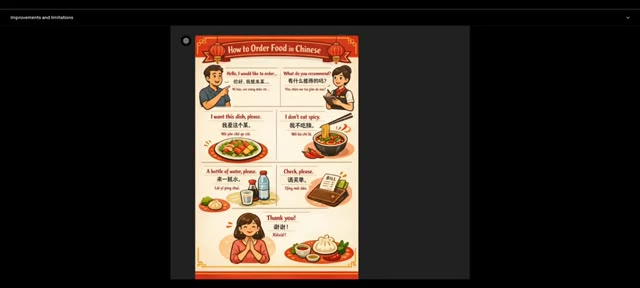
*Affiche illustrée en chinois et en anglais intitulée "How to Order Food in Chinese" démontrant les capacités linguistiques du modèle.*

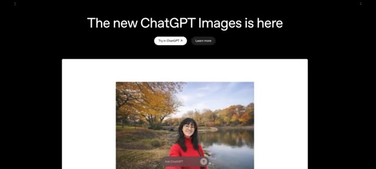
*Page web de présentation "The new ChatGPT Images is here" montrant une image générée d'une femme souriante dans un parc d'automne.*

---

### ⏱️ `[00:03:38 - 00:03:45]` | Segment #11

**🔊 Audio (Transcription Intégrale Mot pour Mot en Français) :**
> Si vous avez trouvé cela utile, assurez-vous d'aimer, de vous abonner et de commenter vos réflexions ci-dessous. Je vous verrai dans le prochain rapport de recherche.

**👁️ Analyse Visuelle d'Écran (gemini-3.5-flash-lite) :**
**Interface & Outils** : Navigateur web / superpositions graphiques d'appel à l'action YouTube.

**Contenu textuel & Code** : Texte partiel visible en arrière-plan lié à "GPT Images is here", logo "PAI" avec un cerveau relié à des circuits électroniques dans un cercle néon bleu, boutons d'interaction YouTube superposés (Like, Subscribe, notification).

**Action / Démonstration** : Affichage des éléments graphiques d'appel à l'action (incitation à s'abonner et à interagir avec la vidéo).

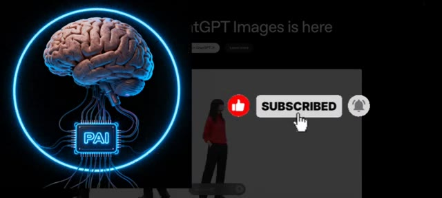
*Écran affichant le logo de la chaîne Pursuing AI (cerveau robotique) et des icônes d'appel à l'action (pouce levé, bouton "Subscribed" avec une main qui clique, et cloche de notification).*

---
