# 🎬 GPT-5.2 vs Gemini 3 Flash, Opus 4.5 — C'était inattendu

> **Chaîne** : [Pursuing AI](https://www.youtube.com/@PursuingAi)  
> **Titre original** : `GPT-5.2 vs Gemini 3 Flash , Opus 4.5 — This Was Unexpected`  
> **Lien YouTube** : [https://www.youtube.com/watch?v=EygX7S0lWEc](https://www.youtube.com/watch?v=EygX7S0lWEc)  
> **Date de publication** : 2025-12-20  
> **Durée** : 06m 38s (`398s`)  
> **Identifiant vidéo** : `EygX7S0lWEc`  
> **Fiche Web Interactive** : [2025-12-20_YT-EygX7S0lWEc_GPT-5.2 vs Gemini 3 Flash, Opus 4.5 — C'était inattendu_by-whisper-v3-large-turbo+gemini-3.5-flash-lite.html](2025-12-20_YT-EygX7S0lWEc_GPT-5.2 vs Gemini 3 Flash, Opus 4.5 — C'était inattendu_by-whisper-v3-large-turbo+gemini-3.5-flash-lite.html)  
> **Captures de démonstration clés** : `38 captures réelles (anti-talking-head)`  
> **Modèles utilisés** : Audio: `large-v3-turbo` (Faster-Whisper int8 VPS) | Vision: `gemini-3.5-flash-lite` (Google AI Studio API)  

---

## 📌 Synthèse Exécutive & Outils

### 📌 Résumé
La vidéo de *Pursuing AI* dissèque comparativement les performances des plus récents modèles de pointe de l'intelligence artificielle — identifiés comme GPT-5.2, Gemini 3 Flash, Gemini 3 Pro et Claude Opus 4.5 — à travers des cas pratiques exigeants de génération de code interactif et de simulation 3D (3.js). Plutôt que de se fier aveuglément aux benchmarks académiques (SWE, ARK AGI2) souvent surcotés par les éditeurs, le créateur déploie une méthode empirique rigoureuse basée sur trois tests concrets de complexité croissante : une simulation anatomique interactive de main, un outil pédagogique interactif sur le fonctionnement d'un réacteur nucléaire, et un jeu de simulation de vol d'oiseaux en essaim dans un environnement naturel. 

Cette démarche méthodique permet de révéler les véritables forces et faiblesses contextuelles de chaque modèle, loin des discours marketing. Pour les créateurs de contenu vidéo et les développeurs, l'enseignement majeur est qu'aucune IA n'est universellement supérieure : Gemini 3 Flash surprend par son excellent rapport qualité-prix et sa supériorité inattendue sur les dynamiques de vol complexes, Gemini 3 Pro excelle dans la modélisation géométrique et anatomique, tandis que Claude Opus 4.5 domine haut la main sur la vulgarisation pédagogique et l'accessibilité visuelle. En analysant ces outputs, les créateurs apprennent à cibler précisément le modèle adéquat selon le cahier des charges recherché (réalisme visuel, clarté didactique ou performance algorithmique brute).

### 🛠️ Outils, Modèles & Logiciels Présentés
* **Claude (notamment Opus 4.5) :** Utilisé comme modèle conversationnel et de génération de code pour concevoir des simulations interactives, se distinguant par sa remarquable capacité de vulgarisation pédagogique et de structuration de contenu pour débutants.
* **Flux :** Mentionné comme brique technologique potentielle dans l'écosystème de création, bien que le cœur de la vidéo se concentre sur l'évaluation comparative des capacités de code et de rendu interactif des grands modèles de langage.
* **Gemini 3 Flash :** Modèle économique de Google, testé pour son efficacité redoutable sur des tâches algorithmiques complexes comme le comportement en essaim (3.js) malgré son coût réduit.
* **Gemini 3 Pro :** Modèle intermédiaire/avancé de Google, mis à l'épreuve pour sa précision géométrique et anatomique (simulation de main interactive).
* **GPT-5.2 :** Modèle phare d'OpenAI, évalué sur sa capacité à générer des scènes complexes et des mouvements fluides, privilégiant la précision technique avancée.
* **3.js :** Bibliothèque JavaScript de référence utilisée pour le rendu des environnements 3D, des arbres, de la végétation et des systèmes de caméras multiples dans le test de vol d'oiseaux.

### 🔑 Points Clés & Enseignements Stratégiques
* **Défiance envers les benchmarks :** Ne jamais se fier uniquement aux scores affichés (SWE, ARK AGI2), car ils ne reflètent pas l'expérience utilisateur réelle ni la robustesse des modèles face à des consignes de design spécifiques.
* **Hiérarchie contextuelle des performances :** Aucun modèle n'écrase les autres dans tous les domaines ; la sélection de l'IA doit impérativement s'aligner sur l'objectif final du projet (pédagogie vs réalisme vs physique).
* **Supériorité pédagogique de Claude Opus 4.5 :** Le modèle excelle dans la conception d'expériences d'apprentissage pour débutants, intégrant des explications textuelles claires, des faits marquants et un séquençage étape par étape irréprochable.
* **Le piège de la sur-complexité technique :** GPT-5.2 produit des simulations extrêmement précises et riches, mais souffre parfois d'un manque d'accessibilité visuelle pour le grand public, ciblant trop nettement les utilisateurs avancés.
* **La surprise Gemini 3 Flash :** Malgré son positionnement tarifaire agressif et inférieur à ses concurrents directs, il surclasse des modèles Pro et Ultra sur des tâches géométriques et cinématiques spécifiques, comme la simulation de vol en essaim.
* **Vigilance sur les artefacts anatomiques :** Les modèles peuvent générer des interfaces fonctionnelles mais échouer sur la logique visuelle de base (ex: mains inversées, doigts manquant de réalisme ou erreurs de perspective 2D).
* **Gestion rigoureuse des multi-caméras :** Dans les environnements 3D (3.js), la transition fluide entre une "vue du monde" et une "vue d'oiseau" met en lumière l'instabilité de certains algorithmes de caméra (tremblements excessifs).
* **Simulation de la physique des foules :** Le comportement d'un essaim d'oiseaux est un excellent test stressant pour les IA ; la plupart échouent en raison d'un rendu trop massif, d'une compacité non naturelle ou d'une mauvaise gestion de la gravité (oiseaux s'enfonçant dans le sol).
* **Complémentarité des workflows :** Pour un projet vidéo ou interactif ambitieux, il est stratégique de combiner les forces des différents modèles (utiliser Claude pour la structure textuelle et pédagogique, Gemini pour l'optimisation des flux visuels dynamiques, et GPT pour la logique dense).

---

## ⏱️ Chronologie & Transcription Complète Audio & Visuelle (Mot pour Mot)

### ⏱️ `[00:00:00 - 00:00:23]` | Segment #01

**🔊 Audio (Transcription Intégrale Mot pour Mot en Français) :**
> Après le lancement de GPT-5.2, Google a publié son modèle Gemini 3 Flash, qui est moins cher que Gemini 3 Pro, GPT-5.2 et Claude Sonnet 4.5. Dans les benchmarks, il offre une rude concurrence aux autres modèles. Il bat même leur modèle Pro dans certains benchmarks, comme les benchmarks SWE et ARK AGI2, où il obtient un score supérieur à celui de Gemini 3 Pro.

**👁️ Analyse Visuelle d'Écran (gemini-3.5-flash-lite) :**
**Interface & Outils** : Page web d'annonce de produit et tableau comparatif de performances de modèles d'intelligence artificielle.

**Contenu textuel & Code** : Texte "Introducing GPT-5.2", tableaux de benchmarks avec colonnes : Gemini 3 Flash, Gemini 3 Pro, Gemini 2.5 Flash, Gemini 2.5 Pro, Claude Sonnet 4.5, GPT-5.2, Grok 4.1 Fast. Tarifs d'entrée et de sortie par million de tokens, et scores sur des benchmarks tels que Humanity's Last Exam, ARC-AGI-2, AIME 2025, SWE-bench Verified.

**Action / Démonstration** : Défilement vertical à travers la page d'annonce et le tableau comparatif des performances des modèles IA.

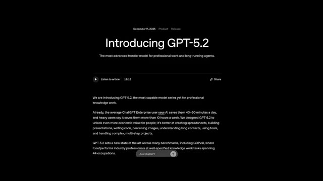
*Page de présentation officielle du modèle GPT-5.2 avec son titre et son introduction textuelle.*

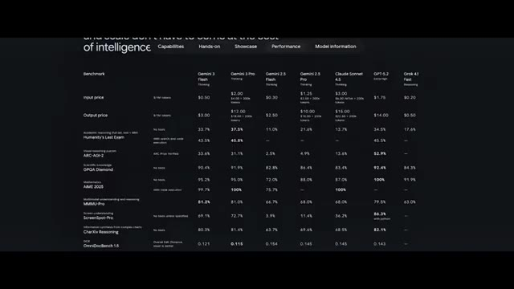
*Tableau comparatif des performances et des prix de divers modèles d'IA incluant Gemini 3 Flash, Gemini 3 Pro, Claude Sonnet 4.5 et GPT-5.2.*

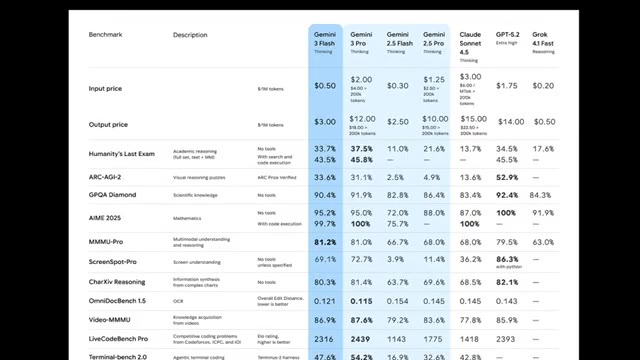
*Tableau détaillé des benchmarks comparant les différents modèles d'IA avec des colonnes surlignées en bleu pour Gemini 3 Flash et Gemini 3 Pro.*

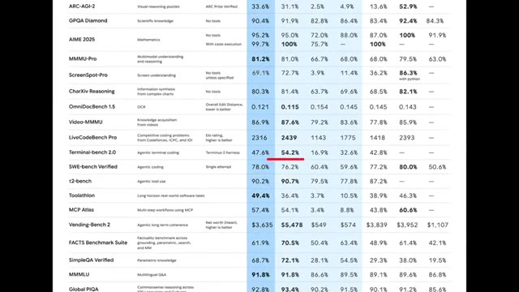
*Suite du tableau comparatif des benchmarks montrant des scores spécifiques comme SWE-bench Verified et Terminal-bench 2.0.*

---

### ⏱️ `[00:00:23 - 00:00:44]` | Segment #02

**🔊 Audio (Transcription Intégrale Mot pour Mot en Français) :**
> Mais je ne crois pas en ces benchmarks, et je sais que vous ne croyez pas non plus à ces valeurs de benchmark. Je vais donc tester Gemini 3 Flash sur des tests vraiment intéressants et difficiles, et le comparer avec Gemini 3 Pro, GPT 5.2 et Claude Sonnet 4.5. C'est Pursuing AI, et vous regardez le rapport de recherche.

**👁️ Analyse Visuelle d'Écran (gemini-3.5-flash-lite) :**
**Interface & Outils** : Tableau comparatif de benchmarks techniques et interface de test de code interactif ("SPINNER EVOLVE").

**Contenu textuel & Code** : Texte du tableau listant les modèles (Gemini 3 Flash, Gemini 3 Pro, Claude Sonnet 4.5, GPT-5.2, etc.), les prix d'entrée/sortie, et divers scores de benchmarks (Humanity's Last Exam, ARC-AGI-2, GPQA Diamond, AIME 2025, MMMU-Pro). Sur l'image 2 : "SPINNER EVOLVE", "A new way to develop. A/B test real-time code generations. Gemini 3 Flash evolves the perfect loading spinner", bouton "START EVOLVING".

**Action / Démonstration** : Présentation visuelle d'un tableau comparatif de modèles d'IA, suivie d'une interface de test logiciel interactive pour illustrer les capacités de génération de code de Gemini 3 Flash.

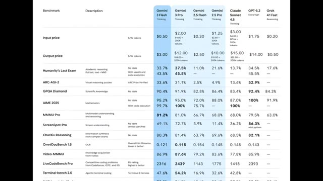
*Tableau comparatif des performances de différents modèles d'intelligence artificielle (Gemini 3 Flash, Gemini 3 Pro, Claude Sonnet 4.5, GPT-5.2) sur divers benchmarks.*

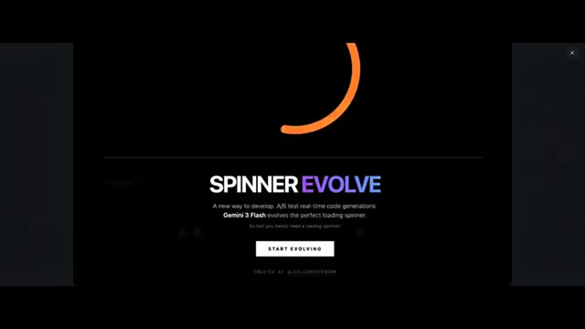
*Interface de démonstration de "SPINNER EVOLVE", un outil de développement et de test A/B en temps réel pour des générations de code avec Gemini 3 Flash.*

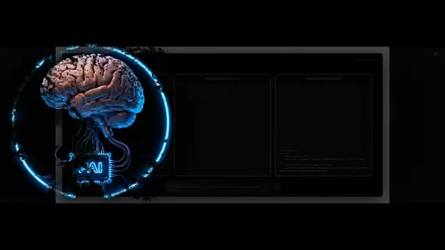
*Interface sombre affichant un visuel de cerveau artificiel interconnecté à une puce, avec des blocs de code et des fenêtres de test.*

---

### ⏱️ `[00:00:44 - 00:01:02]` | Segment #03

**🔊 Audio (Transcription Intégrale Mot pour Mot en Français) :**
> Le premier test est une simulation interactive de main, et les exigences sont simples. Je dois pouvoir contrôler tous les doigts de la main, y compris le pouce. D'abord, regardons le résultat de Gemini 3 Flash. Il génère une main en 2D d'apparence basique. En dessous, j'obtiens des contrôleurs pour bouger tous les doigts.

**👁️ Analyse Visuelle d'Écran (gemini-3.5-flash-lite) :**
**Interface & Outils** : Interface de simulation interactive sombre avec des boutons de contrôle pour les doigts (THUMB, INDEX, MIDDLE, RING, PINKY) et un affichage visuel 2D d'une main.

**Contenu textuel & Code** : Texte « Interactive Hand Simulation », « Gemini 3 Flash », « ANATOMY 01 BIOMECHANICAL SIMULATION », et les étiquettes des contrôleurs de doigts : THUMB, INDEX, MIDDLE, RING, PINKY.

**Action / Démonstration** : Présentation du premier test de simulation de main interactive et affichage du résultat généré par Gemini 3 Flash avec ses contrôleurs de doigts.

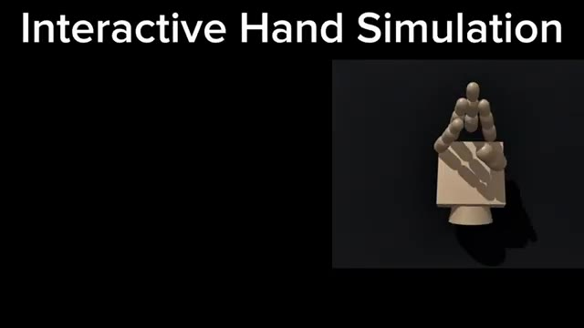
*Titre « Interactive Hand Simulation » affiché à l'écran avec une vue 3D d'une maquette de main articulée sur fond noir.*

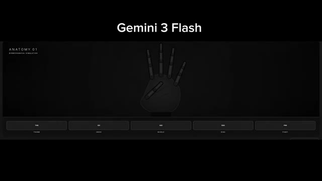
*Interface de simulation affichant « Gemini 3 Flash » en haut avec un rendu 2D d'une main squelettique et des boutons de contrôle pour chaque doigt en bas.*

---

### ⏱️ `[00:01:02 - 00:01:24]` | Segment #04

**🔊 Audio (Transcription Intégrale Mot pour Mot en Français) :**
> Pouce, index, majeur, annulaire et auriculaire. Tous les doigts fonctionnent correctement. C'est simple, mais ça fait ce que c'est censé faire. Ensuite, voici le résultat de Gemini 3 Pro. Ici, les mains ont l'air plus réalistes par rapport à Flash. Dans l'ensemble, c'est nettement mieux. Toutes les manettes fonctionnent également, mais il y a une mineure erreur. Le pouce ne bouge pas correctement et la main est montrée de dos au lieu de face.

**👁️ Analyse Visuelle d'Écran (gemini-3.5-flash-lite) :**
**Interface & Outils** : Interface de simulation biomécanique affichant les tests anatomiques des différents doigts (Thumb, Index, Mid, Ring, Pinky).

**Contenu textuel & Code** : Titre "Gemini 3 Flash", "ANATOMY 01 BIOMECHANICAL SIMULATION", et boutons de sélection des doigts au bas de l'écran avec "THUMB" et "INDEX" mis en surbrillance en vert fluo.

**Action / Démonstration** : Visualisation d'une simulation 3D de main squelettique/articulée sur fond noir, démontrant le mouvement des doigts.

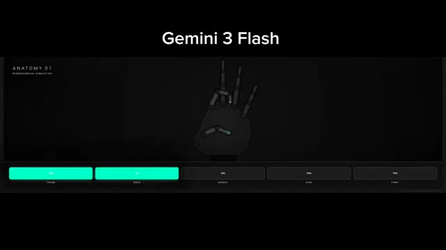
*Simulation biomécanique d'une main montrant les résultats de Gemini 3 Flash.*

---

### ⏱️ `[00:01:24 - 00:01:46]` | Segment #05

**🔊 Audio (Transcription Intégrale Mot pour Mot en Français) :**
> Cependant, si vous vous concentrez sur le mouvement des autres doigts, ils bougent de manière très réaliste. En raison de ce réalisme, ce résultat est toujours meilleur que flash. Maintenant parlons du résultat de GPT 5.2. Il génère également une main en 2D, et cela peut contrôler tous les doigts ici également. Mais la partie la plus intéressante est le mouvement. Le mouvement des doigts est très fluide, et cela fait vraiment réel.

**👁️ Analyse Visuelle d'Écran (gemini-3.5-flash-lite) :**
**Interface & Outils** : Interface de démonstration ou de test montrant un modèle 3D de main articulée avec des sélecteurs (Thumb, Index, Middle, Ring, Pinky).

**Contenu textuel & Code** : Modèle 3D de main en bois sur fond sombre avec les étiquettes de contrôle des doigts en bas (Thumb, Index, Middle, Ring, Pinky) et des boutons à bascule (toggles) activés pour l'annulaire et l'auriculaire.

**Action / Démonstration** : Visualisation d'un modèle 3D de main dont les doigts (index et majeur) sont dressés, illustrant le contrôle et le mouvement des doigts.

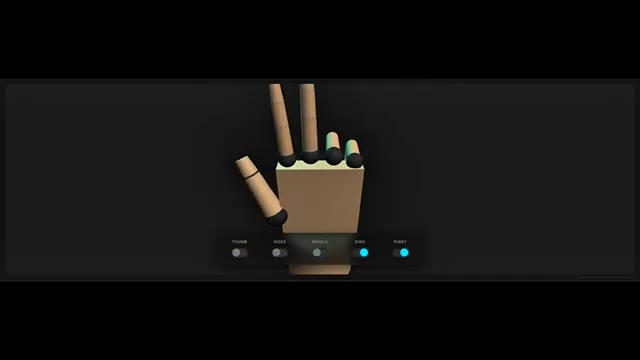
*Modèle 3D d'une main articulée en bois avec des boutons de contrôle pour chaque doigt en bas de l'écran.*

---

### ⏱️ `[00:01:46 - 00:02:04]` | Segment #06

**🔊 Audio (Transcription Intégrale Mot pour Mot en Français) :**
> C'est clairement mieux que le résultat flash, mais toujours pas mieux que le résultat pro. Et enfin, voici le résultat de Claude Opus 4.5. Honnêtement, j'ai envie de rire. La main générée ressemble à un cochon avec des doigts posés dessus. Et quand je clique sur n'importe quel contrôleur, peu importe ce qui se passe, c'est juste confus. Qu'est-ce que c'est que ça, mon frère ?

**👁️ Analyse Visuelle d'Écran (gemini-3.5-flash-lite) :**
**Interface & Outils** : Interface web interactive sombre avec un affichage graphique stylisé d'une main humaine stylisée et des boutons de contrôle en bas et en haut.

**Contenu textuel & Code** : Titre « ARTICULATED HUMAN HAND » avec la description « Each finger toggles independently. Kinematic springs + joint coupling emulate tendon lag and inertia for smooth, realistic motion. » Légende des doigts en haut : Thumb, Index, Middle, Ring, Pinky. Boutons de contrôle en bas : Thumb, Index, Middle, Ring, Pinky, Open all, Close all.

**Action / Démonstration** : Présentation d'une interface de démonstration graphique d'une main articulée avec des options de sélection pour chaque doigt.

*Interface interactive affichant une main humaine articulée générée en 3D avec des contrôleurs pour chaque doigt.*

---

### ⏱️ `[00:02:05 - 00:02:24]` | Segment #07

**🔊 Audio (Transcription Intégrale Mot pour Mot en Français) :**
> Ça ne bat même pas le modèle Flash. Je ne veux même pas en dire plus ici. Donc dans ce test, Gemini 3 Pro donne le meilleur résultat. Vient ensuite Gemini 3 Flash, qui est également bon. Et Gemini 3 Flash est plus performant que Cloud Opus 4.5 dans ce cas. Et, si vous êtes étudiant, ce prochain test devient extrêmement important.

**👁️ Analyse Visuelle d'Écran (gemini-3.5-flash-lite) :**
**Interface & Outils** : Interface de test et de simulation comparative de modèles d'IA avec affichage sur plusieurs fenêtres et graphiques 3D.

**Contenu textuel & Code** : Texte affichant "HUMAN HAND SIMULATION", "Tap fingers to curl - Kinematic tendon physics", les boutons "Thumb", "Index", "Middle", "Ring", "Pinky", ainsi que les labels des modèles "G3Pro", "G3 Flash", "GPT 5.2", "OPUS 4.5", du code HTML/JS et un prompt "Design a minimalist weather card, add weather animations and click interaction".

**Action / Démonstration** : Présentation comparative des résultats de différents modèles d'intelligence artificielle sur une simulation de main en 3D et une interface de design interactif.

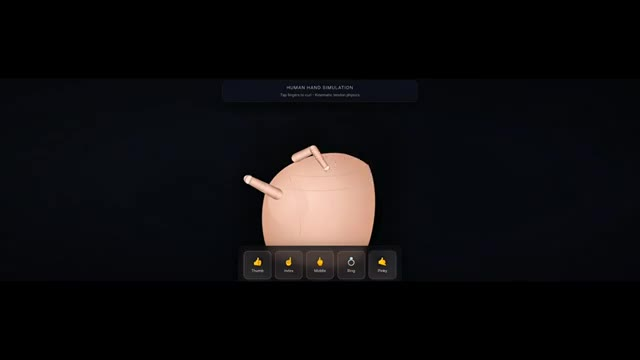
*Simulation interactive d'une main humaine montrant les contrôles des doigts avec la mention "Human Hand Simulation".*

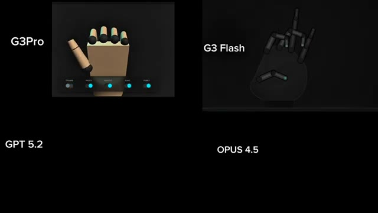
*Comparatif divisé en quatre quadrants pour différents modèles d'IA (G3Pro, G3 Flash, GPT 5.2, OPUS 4.5) illustrant des rendus graphiques de mains en 3D.*

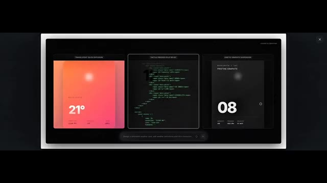
*Interface de conception affichant trois fenêtres avec des éléments d'interface météo, du code source et une barre de prompt en bas.*

---

### ⏱️ `[00:02:24 - 00:02:43]` | Segment #08

**🔊 Audio (Transcription Intégrale Mot pour Mot en Français) :**
> Ce test consiste à générer une simulation interactive pour un sujet complexe, quelque chose qui aide réellement les étudiants à comprendre les concepts visuellement. Pour ce test, j'utilise un sujet très courant mais critique. Comment fonctionne un réacteur nucléaire. C'est un processus en quatre étapes. Premièrement, la fission nucléaire libère une chaleur massive.

**👁️ Analyse Visuelle d'Écran (gemini-3.5-flash-lite) :**
**Interface & Outils** : Interface logicielle de démonstration et de simulation interactive de concepts visuels.

**Contenu textuel & Code** : Texte affiché : "STAGE 2: HEAT GENERATION", "We've raised the control rods! Fission begins, and the fuel turns intensely hot (glowing green)...", "The water around it heats up rapidly but doesn't boil because it's under extreme pressure...", "This hot water (red particles) flows to the next stage." et boutons "PREVIOUS" / "NEXT STAGE".

**Action / Démonstration** : Présentation d'une simulation interactive 3D illustrant le fonctionnement d'un réacteur nucléaire, en transition avec des interfaces d'applications de test.

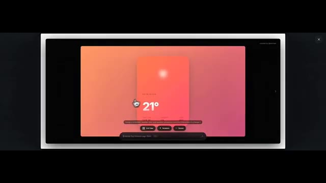
*Interface d'une application interactive montrant une carte météo avec une température de 21 degrés sur un fond orangé.*

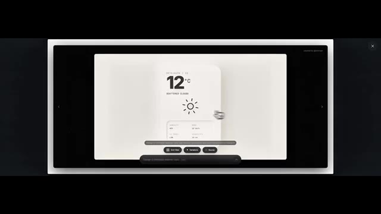
*Interface interactive similaire montrant une carte météo blanche avec la température de 12 degrés et un soleil.*

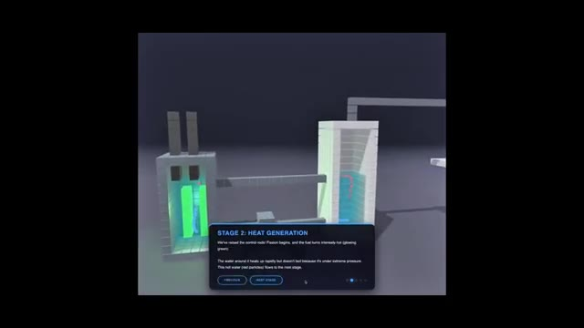
*Simulation 3D interactive d'un réacteur nucléaire montrant l'étape 2 (Stage 2: Heat Generation) avec une interface textuelle explicative.*

---

### ⏱️ `[00:02:43 - 00:03:01]` | Segment #09

**🔊 Audio (Transcription Intégrale Mot pour Mot en Français) :**
> Deuxièmement, cette chaleur fait bouillir l'eau. Troisièmement, la vapeur fait tourner une turbine pour générer de l'électricité. Et enfin, après avoir traversé la turbine, la vapeur est recyclée afin que le processus puisse recommencer. Maintenant, voici le résultat de Gemini 3 Flash. Il génère une vue très basique. Il ne montre pas clairement les quatre étapes.

**👁️ Analyse Visuelle d'Écran (gemini-3.5-flash-lite) :**
**Interface & Outils** : Interface utilisateur web d'une application interactive de simulation de centrale nucléaire, avec des panneaux d'information contextuelle ("Stages").

**Contenu textuel & Code** : Textes explicatifs des étapes ("STAGE 3: CREATING STEAM", "STAGE 5: COOLING TOWER"), ainsi que des panneaux de contrôle du réacteur ("Reactor Core Simulation", "Operations Panel", "EMERGENCY SCRAM", température 340°C, puissance 1.50 GW).

**Action / Démonstration** : Navigation à travers les différentes étapes interactives d'une simulation technique en 3D d'un système thermique, puis affichage du résultat généré par Gemini 3 Flash.

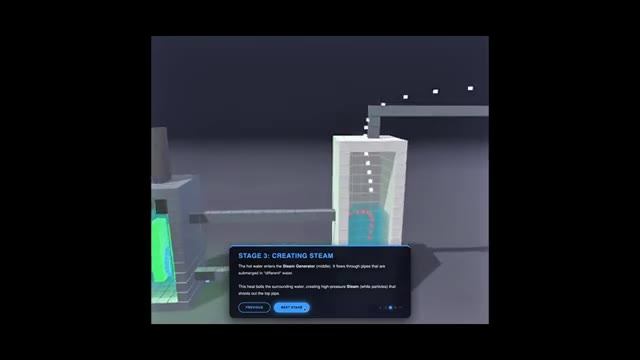
*Étape 3 de la simulation montrant la création de vapeur dans un générateur.*

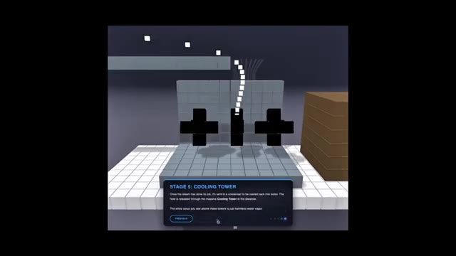
*Étape 5 de la simulation montrant la tour de refroidissement.*

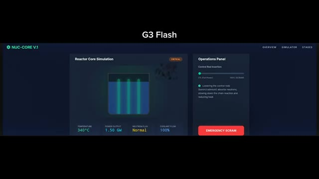
*Interface de simulation du cœur de réacteur "NUC-CORE V.1" générée par G3 Flash.*

---

### ⏱️ `[00:03:01 - 00:03:22]` | Segment #10

**🔊 Audio (Transcription Intégrale Mot pour Mot en Français) :**
> Même si cela mentionne les quatre étapes ci-dessous, on a l'impression que les étapes de chauffage, d'ébullition et de libération de vapeur sont fusionnées visuellement. Les étapes d'ébullition et de turbine ne sont pas montrées correctement. Si quelqu'un ne sait pas déjà comment fonctionne un réacteur nucléaire, cette simulation pourrait facilement le confondre. Il y a un système d'insertion de barres pour contrôler l'absorption des neutrons et ralentir la réaction en chaîne.

**👁️ Analyse Visuelle d'Écran (gemini-3.5-flash-lite) :**
**Interface & Outils** : Interface logicielle sombre intitulée "NUC-CORE V.1" avec un menu de navigation supérieur (Overview, Simulator, Stages) et un encart de texte "G3 Flash" au-dessus.

**Contenu textuel & Code** : Quatre sections numérotées : 1. Nuclear Fission, 2. Heat Exchange, 3. Turbine Rotation, 4. Generation & Condensation, détaillant le fonctionnement thermique et nucléaire.

**Action / Démonstration** : Présentation des quatre étapes clés du fonctionnement d'un réacteur nucléaire sur l'interface de simulation.

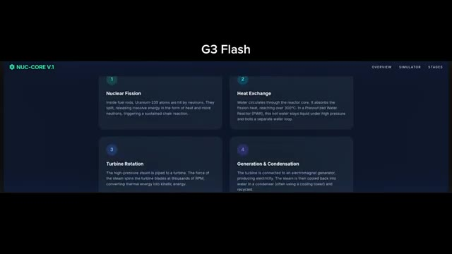
*Capture d'écran montrant l'interface d'un logiciel de simulation nucléaire nommé NUC-CORE V.1 avec quatre blocs décrivant les étapes du processus.*

---

### ⏱️ `[00:03:22 - 00:03:42]` | Segment #11

**🔊 Audio (Transcription Intégrale Mot pour Mot en Français) :**
> Mais dans l'ensemble, la visualisation n'est pas assez claire. Maintenant, voici le résultat de Gemini 3 Pro. C'est mieux que Flash. Il montre les quatre étapes et explique également le processus sur le côté gauche. Les particules vertes clignotantes représentent le combustible uranium. Le rouge montre le flux de chaleur. Le bleu représente le caloporteur, et les petits points jaunes indiquent la production d'électricité.

**👁️ Analyse Visuelle d'Écran (gemini-3.5-flash-lite) :**
**Interface & Outils** : Application logicielle de simulation nommée « NUC-CORE V1 » avec un tableau de bord de type interface utilisateur sombre comprenant un visualiseur de cœur de réacteur et un panneau d'opérations.

**Contenu textuel & Code** : Texte affiché : « NUC-CORE V1 », « OVERVIEW », « SIMULATOR », « STAGES », « Reactor Core Simulation », « STABLE », « TEMPERATURE 199°C », « POWER OUTPUT 0.99 GW », « NEUTRON FLUX Normal », « COOLANT FLOW 100% », « Operations Panel », « Control Rod Insertion », curseur allant de « 0% (Full Power) » à « 100% (SCRAM) », description textuelle concernant l'abaissement des barres de contrôle (bore/cadmium) et un bouton d'urgence rouge « EMERGENCY SCRAM ».

**Action / Démonstration** : Visualisation d'une simulation de cœur de réacteur nucléaire avec les barres de contrôle insérées dans un réservoir de liquide vert, affichant les métriques opérationnelles en temps réel.

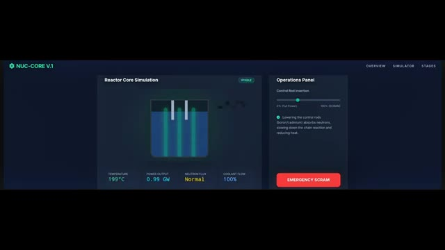
*Interface de simulation de cœur de réacteur nucléaire (Nuc-Core V1) montrant le panneau de contrôle et les données de température, puissance, flux neutronique et débit du caloporteur.*

---

### ⏱️ `[00:03:42 - 00:04:03]` | Segment #12

**🔊 Audio (Transcription Intégrale Mot pour Mot en Français) :**
> Toutes les étapes sont affichées correctement, mais ce n'est toujours pas aussi bien que je le voudrais pour une explication adaptée aux débutants. Voici maintenant Claude Opus 4.5. Ce résultat est nettement meilleur que Gemini 3 Flash et Pro. C'est exactement ce que je cherchais. Quand je clique sur l'option de lecture, cela montre le processus étape par étape, expliquant clairement comment fonctionne la turbine.

**👁️ Analyse Visuelle d'Écran (gemini-3.5-flash-lite) :**
**Interface & Outils** : Interface web d'un chatbot/assistant IA (Claude) présentant un composant visuel ou interactif avec des étapes numérotées sur le réacteur nucléaire.

**Contenu textuel & Code** : Texte affiché : "Nuclear Reactor", "1. The Reactor Core", "2. The Primary Loop", "3. Heat Exchange", ainsi qu'un schéma technique du cœur du réacteur, du générateur de vapeur, de la turbine et du condenseur. Légende de couleur sur le côté : Coolant (Water), Heat/Steam, Uranium Fuel, Electricity.

**Action / Démonstration** : Visualisation d'un schéma explicatif généré par l'IA détaillant le fonctionnement d'un réacteur nucléaire, avec un panneau latéral numéroté pour les différentes étapes.

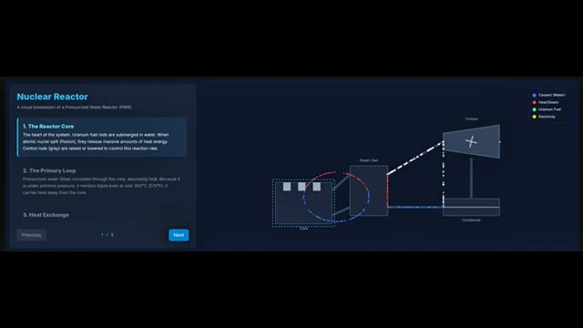
*Interface de Claude affichant un diagramme interactif et explicatif d'un réacteur nucléaire avec des étapes textuelles.*

---

### ⏱️ `[00:04:03 - 00:04:25]` | Segment #13

**🔊 Audio (Transcription Intégrale Mot pour Mot en Français) :**
> Sous la simulation, toutes les étapes sont décrites en mots très simples. Et dans la dernière section, cela ajoute même des faits marquants, comme le nombre de foyers qu'un réacteur peut alimenter, comment 1 kilogramme d'uranium équivaut à 3 millions de kilogrammes de charbon, et comment environ 10 % de l'énergie mondiale provient de l'énergie nucléaire. Si un élève ne connaît pas le processus au préalable, regarder cela seul lui permettrait de le comprendre complètement.

**👁️ Analyse Visuelle d'Écran (gemini-3.5-flash-lite) :**
**Interface & Outils** : Interface web éducative aux tons sombres avec des encadrés colorés expliquant la science nucléaire.

**Contenu textuel & Code** : Texte principal "The Science Behind It" et six sections avec icônes : "Nuclear Fission" (~200 MeV), "Chain Reaction" (~300°C), "Heat Transfer" (~155 bar), "Steam Generation", "Turbine & Generator" (~1800-3600 RPM), et "Cooling System".

**Action / Démonstration** : Affichage à l'écran d'une infographie interactive ou de fiches explicatives détaillant les étapes physiques et techniques de la production d'énergie nucléaire.

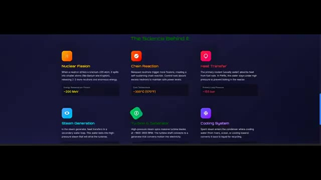
*Interface web montrant les étapes scientifiques détaillées du fonctionnement d'un réacteur nucléaire.*

---

### ⏱️ `[00:04:26 - 00:04:47]` | Segment #14

**🔊 Audio (Transcription Intégrale Mot pour Mot en Français) :**
> Maintenant, voici le résultat de GPT 5.2. Celui-ci génère une scène très complexe. L'explication est bonne, toutes les étapes sont correctes, et il explique le processus étape par étape. Cependant, cela ne semble pas très accessible aux débutants. C'est impressionnant et précis, mais clairement destiné à des utilisateurs plus avancés. Donc, dans ce test, le gagnant est Opus 4.5, suivi par GPT 5.2.

**👁️ Analyse Visuelle d'Écran (gemini-3.5-flash-lite) :**
**Interface & Outils** : Interface web interactive "Nuclear Reactor Explorer" (dashboards de simulation technique).

**Contenu textuel & Code** : Texte "GPT 5.2", "Nuclear Reactor Explorer", curseurs de contrôle (Requested power 70%, Control rod insertion 35%), sorties en direct (Efficiency = 33%, Thermal 1.85 GW, Electric 610 MW, 27°C), étapes de la chaîne de conversion d'énergie, diagrammes système, et étiquettes techniques.

**Action / Démonstration** : Présentation et comparaison des interfaces générées par GPT 5.2 et Opus 4.5 pour illustrer la complexité et l'accessibilité des résultats.

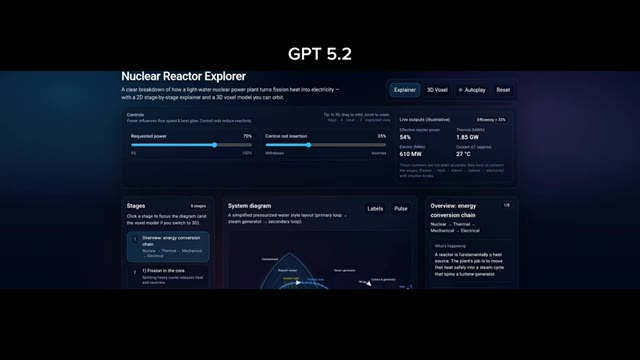
*Interface interactive "Nuclear Reactor Explorer" générée par GPT 5.2 avec des contrôles de puissance et des diagrammes de système.*

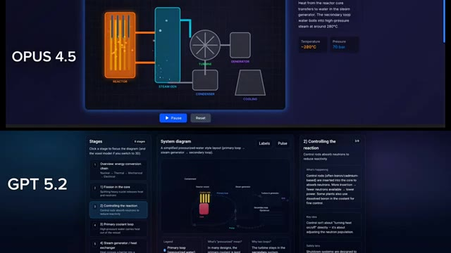
*Comparaison côte à côte entre Opus 4.5 et GPT 5.2 montrant leurs interfaces de visualisation de réacteur nucléaire.*

---

### ⏱️ `[00:04:48 - 00:05:09]` | Segment #15

**🔊 Audio (Transcription Intégrale Mot pour Mot en Français) :**
> Je n'ai vraiment pas aimé le résultat de Gemini 3 Pro et Flash ici. Maintenant, passons au test final, le jeu de vol d'oiseaux en essaim. Les exigences sont simples, mais strictes. Un environnement naturel avec des arbres et de la végétation, deux systèmes de caméras, une vue du monde et une vue des oiseaux, et des oiseaux qui se déplacent en essaim de manière réaliste dans l'environnement construit à l'aide de 3.js.

**👁️ Analyse Visuelle d'Écran (gemini-3.5-flash-lite) :**
**Interface & Outils** : Interface de comparaison de modèles d'IA avec des panneaux de simulation interactive (réacteur nucléaire) et diapositive de présentation avec aperçu vidéo 3D.

**Contenu textuel & Code** : Texte à l'écran : "G3 FLASH", "G3 PRO", "NUC-CORE V1", "Reactor Core Simulation", "Operations Panel", "Nuclear Reactor", "Flocking Bird Requirements", "Realistic Flocking Behaviour", "Natural Environment (Vegetation, trees, extras)".

**Action / Démonstration** : Présentation comparative des performances des modèles Gemini 3 Flash et Pro, suivie de l'énoncé des critères du test final de simulation d'oiseaux en essaim.

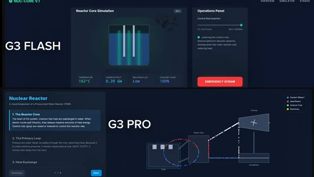
*Comparaison des interfaces et des résultats obtenus avec G3 Flash et G3 Pro pour une simulation de réacteur nucléaire.*

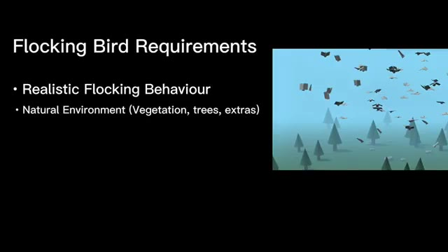
*Diapositive présentant les exigences du jeu de vol d'oiseaux en essaim, illustrée par un aperçu vidéo en 3D d'une forêt stylisée.*

---

### ⏱️ `[00:05:09 - 00:05:28]` | Segment #16

**🔊 Audio (Transcription Intégrale Mot pour Mot en Français) :**
> Voici le résultat de Gemini 3 Flash. Il génère un monde avec des arbres. Je peux augmenter ou diminuer la taille de la volée, basculer entre la vue du monde et la vue d'oiseau, et même mettre en pause le vol en essaim. Le mouvement des oiseaux semble naturel et réaliste. Cependant, il y a des problèmes. Certains oiseaux descendent à l'intérieur du sol et la caméra en vue d'oiseau est trop instable.

**👁️ Analyse Visuelle d'Écran (gemini-3.5-flash-lite) :**
**Interface & Outils** : Application de simulation "Nature Flight" (G3 Flash) avec un panneau de contrôle latéral incluant un curseur de taille de volée (Flock Size), des boutons de mode de caméra (World View / Bird View) et un bouton de pause.

**Contenu textuel & Code** : Texte "G3 Flash" en haut, titre "NATURE FLIGHT" dans l'interface, curseurs de réglage, boutons "World View", "Bird View" et "Pause Simulation". Paysage stylisé 3D avec un sol vert, des arbres coniques et un ciel bleu peuplé d'oiseaux.

**Action / Démonstration** : Présentation du rendu de la simulation générée par Gemini 3 Flash, montrant les différents modes de vue (monde et oiseau) et le comportement des oiseaux en vol.

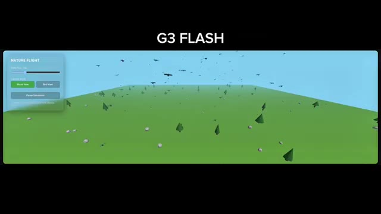
*Démonstration du résultat de Gemini 3 Flash montrant une simulation de vol d'oiseaux au-dessus d'un paysage vert avec des arbres et des contrôles d'interface sur le côté gauche.*

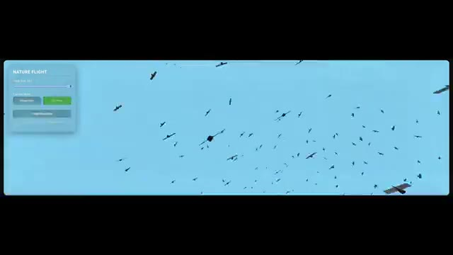
*Vue rapprochée de la simulation de vol d'oiseaux (vue d'oiseau) générée par Gemini 3 Flash avec le panneau de contrôle de l'application "Nature Flight".*

---

### ⏱️ `[00:05:28 - 00:05:48]` | Segment #17

**🔊 Audio (Transcription Intégrale Mot pour Mot en Français) :**
> Maintenant, voici le résultat de Gemini 3 Pro. Il génère un monde avec des oiseaux multicolores, mais les oiseaux n'ont pas l'air naturels. Leur comportement de vol en essaim semble bizarre, et vous comprendrez clairement cela lorsque vous verrez la caméra vue d'oiseau. La caméra elle-même ne tremble pas, mais le comportement de vol en essaim n'est pas convaincant. Dans ce cas, Flash est clairement meilleur que Pro.

**👁️ Analyse Visuelle d'Écran (gemini-3.5-flash-lite) :**
**Interface & Outils** : Interface de simulation logicielle intitulée "Nature Flock Sim" avec un panneau de contrôle latéral.

**Contenu textuel & Code** : Texte "G3 Pro" en haut, panneau de contrôle "NATURE FLOCK SIM" avec curseur "Flock Size" réglé sur 100, options de mode caméra "World View" et "Bird View", bouton "Pause", et instructions de contrôle (Left Click to Rotate, Right Click to Pan, Scroll to Zoom).

**Action / Démonstration** : Affichage du rendu 3D d'un monde virtuel généré par l'IA montrant des oiseaux colorés et des arbres clairsemés sur le sol.

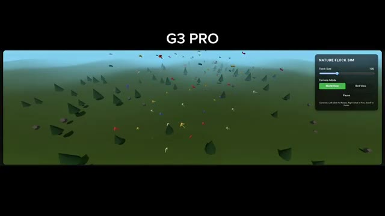
*Démonstration du résultat généré par Gemini 3 Pro représentant une simulation de vol en essaim d'oiseaux multicolores au-dessus d'un paysage verdoyant.*

---

### ⏱️ `[00:05:48 - 00:06:09]` | Segment #18

**🔊 Audio (Transcription Intégrale Mot pour Mot en Français) :**
> Maintenant voici le résultat d'Opus 4.5. L'environnement a l'air meilleur que les autres modèles, mais les oiseaux ont l'air très massifs et non naturels. Leur comportement de vol en essaim est médiocre, encore pire que Gemini 3 Pro. Et enfin, voici le résultat de GPT 5.2. Il échoue également à ce test. Les oiseaux ne sont pas correctement structurés et le comportement en essaim n'est pas réaliste.

**👁️ Analyse Visuelle d'Écran (gemini-3.5-flash-lite) :**
**Interface & Outils** : Interface de simulation de vol en essaim (Bird Flocking Simulation) avec panneaux de contrôle des paramètres.

**Contenu textuel & Code** : Texte « OPUS 4.5 » en haut, panneaux de configuration de simulation avec réglages (Flock Size, Flight Speed, Cohesion Strength, World View, Bird View, Pause).

**Action / Démonstration** : Présentation comparative des résultats des modèles Opus 4.5 et GPT 5.2 sur une simulation de vol d'oiseaux en essaim.

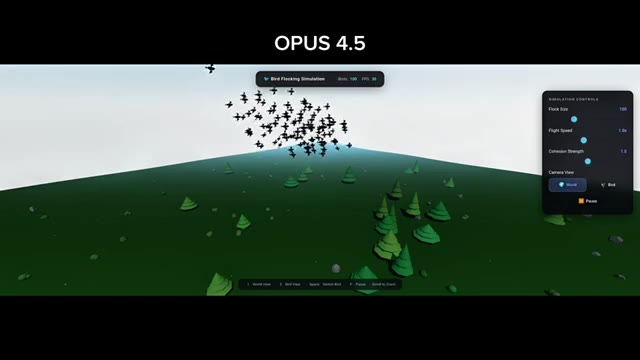
*Résultat d'Opus 4.5 montrant une simulation 3D d'un paysage avec des arbres et une volée d'oiseaux dans le ciel.*

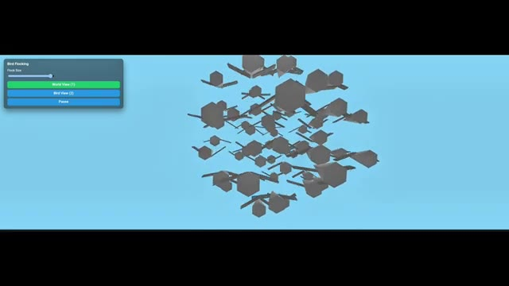
*Résultat de GPT 5.2 montrant une simulation 3D de vol d'oiseaux mal structurés sur fond bleu.*

---

### ⏱️ `[00:06:09 - 00:06:31]` | Segment #19

**🔊 Audio (Transcription Intégrale Mot pour Mot en Français) :**
> Donc dans ce test, le vainqueur incontesté est Gemini 3 Flash. Aucun autre modèle ne réussit ce test correctement. Donc si nous regardons tous les résultats des tests, Gemini 3 Pro gagne le premier test avec la simulation de main, Opus 4.5 gagne le deuxième test avec la simulation interactive la plus adaptée aux débutants, et Gemini 3 Flash gagne le test final avec le meilleur comportement de vol d'oiseaux.

**👁️ Analyse Visuelle d'Écran (gemini-3.5-flash-lite) :**
**Interface & Outils** : Interfaces de simulation 3D interactives de tests de modèles d'IA.

**Contenu textuel & Code** : Texte « G3 FLASH », « NATURE FLIGHT », curseurs de configuration, boutons « World View », « Bird View », « Pause Simulation », et modèle 3D de vol d'oiseaux. Pour l'image 2 : texte « G3 PRO » et curseurs de contrôle des doigts (« THUMB », « INDEX », « MIDDLE », « RING », « PINKY ») sur une main 3D filaire.

**Action / Démonstration** : Présentation comparative des résultats des tests de simulation 3D pour différents modèles d'IA (Gemini 3 Flash, Gemini 3 Pro).

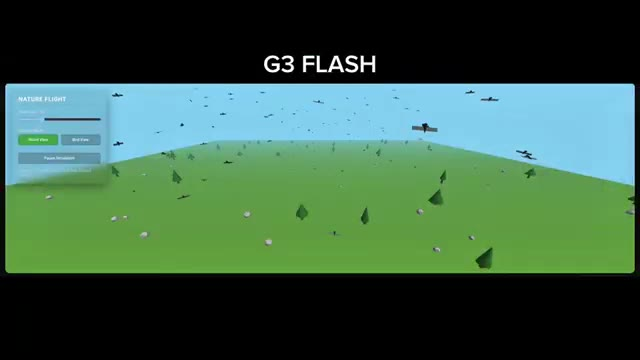
*Interface de simulation montrant le test de vol d'oiseaux avec Gemini 3 Flash.*

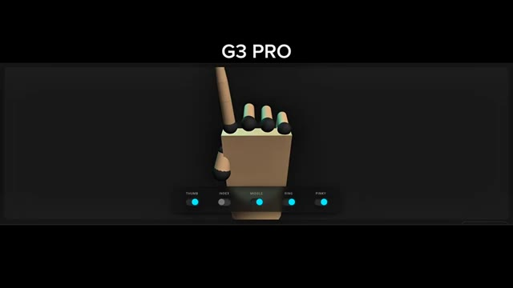
*Interface de simulation montrant le test de main articulée avec Gemini 3 Pro.*

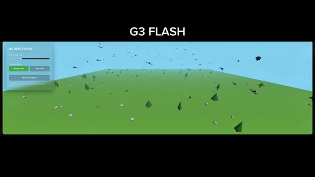
*Interface de simulation montrant à nouveau le test de vol d'oiseaux avec Gemini 3 Flash.*

---

### ⏱️ `[00:06:31 - 00:06:38]` | Segment #20

**🔊 Audio (Transcription Intégrale Mot pour Mot en Français) :**
> C'est Pursuing AI et vous venez de regarder le rapport de recherche. Si vous aimez ceci, aimez, abonnez-vous, commentez et partagez.

**👁️ Analyse Visuelle d'Écran (gemini-3.5-flash-lite) :**
**Interface & Outils** : Écran de fin de vidéo YouTube montrant les éléments de branding de la chaîne.

**Contenu textuel & Code** : Le logo circulaire de Pursuing AI représentant un cerveau relié à un processeur PAI par des câbles dans un cercle néon bleu, accompagné du texte stylisé "The Research Report" avec un bonnet de Père Noël.

**Action / Démonstration** : Affichage fixe de l'écran de fin de la vidéo avec les visuels de la chaîne.

*Logo de la chaîne Pursuing AI avec un cerveau cybernétique et le titre The Research Report surmonté d'un bonnet de Noël.*

---
