# 🎬 C'est probablement la farce générée par IA la plus flippante de tous les temps

> **Chaîne** : [Pursuing AI](https://www.youtube.com/@PursuingAi)  
> **Titre original** : `This Might Be the Scariest AI Prank Ever`  
> **Lien YouTube** : [https://www.youtube.com/watch?v=dW74ziq6PGg](https://www.youtube.com/watch?v=dW74ziq6PGg)  
> **Date de publication** : 2025-12-22  
> **Durée** : 03m 16s (`196s`)  
> **Identifiant vidéo** : `dW74ziq6PGg`  
> **Fiche Web Interactive** : [2025-12-22_YT-dW74ziq6PGg_C'est probablement la farce générée par IA la plus flippante de tous les temps_by-whisper-v3-large-turbo+gemini-3.5-flash-lite.html](2025-12-22_YT-dW74ziq6PGg_C'est probablement la farce générée par IA la plus flippante de tous les temps_by-whisper-v3-large-turbo+gemini-3.5-flash-lite.html)  
> **Captures de démonstration clés** : `22 captures réelles (anti-talking-head)`  
> **Modèles utilisés** : Audio: `large-v3-turbo` (Faster-Whisper int8 VPS) | Vision: `gemini-3.5-flash-lite` (Google AI Studio API)  

---

## 📌 Synthèse Exécutive & Outils

### 📌 Résumé
Dans cette vidéo immersive de la chaîne *Pursuing AI*, le créateur explore les frontières créatives de l'intelligence artificielle en concevant un Noël entièrement généré par des agents conversationnels et des modèles multimodaux. Le sujet central s'articule autour d'une expérience interactive : la création de sites web pièges sous forme de boîtes cadeaux numériques destinées à effrayer les utilisateurs lors du clic final. En mobilisant des technologies de pointe, la démarche démontre la capacité des LLM à concevoir non seulement du texte, mais des applications front-end fonctionnelles intégrant du code HTML, des animations visuelles et des effets sonores dynamiques.

La méthode employée repose sur un test comparatif rigoureux entre plusieurs fleurons technologiques – ChatGPT 5.2, Gemini 3 Pro et Claude Opus 4.5 (notations fictives ou prospectives utilisées par le créateur) – pour exécuter un même prompt de conception web axé sur l'horreur festive. Chaque modèle a généré une interprétation distincte, allant du glitch visuel anxiogène à l'animation mignonne, en passant par un équilibre parfait entre esthétique de Noël et sursaut horrifique. Cette expérimentation met en lumière la diversité des logiques génératives et la flexibilité du code produit par les intelligences artificielles à partir d'une simple instruction textuelle.

Pour les créateurs de contenu et développeurs, les bénéfices concrets de cette approche sont immenses. Elle illustre la démocratisation du prototypage rapide : n'importe quel créateur peut désormais concevoir des expériences web interactives, des mini-jeux ou des farces numériques sophistiquées en quelques minutes sans compétences avancées en codage. L'utilisation d'assistants IA comme Claude permet d'automatiser la mise en page, l'intégration de scripts d'animation (neige) et le couplage audio-visuel, ouvrant la voie à des formats de vidéos participatives et virales d'un nouveau genre.

### 🛠️ Outils, Modèles & Logiciels Présentés
* **Claude (Opus 4.5)** : Utilisé pour générer un site web interactif de Noël incluant une animation de neige, un design soigné et un rendu combinant un visage de Père Noël effrayant et des effets sonores adaptés.
* **ChatGPT (5.2)** : Mobilisé pour concevoir une application web au thème mignon et ludique, produisant une surprise visuelle et sonore douce destinée à être partagée en famille.
* **Gemini (3 Pro)** : Employé pour créer un site de farce dont le résultat visuel brut et intense, malgré des glitchs non intentionnels, s'est avéré le plus effrayant et perturbateur selon l'analyse du créateur.
* **Discord** : Utilisé comme plateforme de partage communautaire pour héberger et distribuer l'ensemble des fichiers HTML et des prompts utilisés dans le cadre de la vidéo.

### 🔑 Points Clés & Enseignements Stratégiques
* **Prototypage web instantané** : Démontre la capacité des LLM à rédiger du code HTML/CSS/JS fonctionnel et interactif à partir d'un simple prompt conversationnel.
* **Diversité comportementale des modèles** : Souligne que face à une même consigne créative, chaque IA (Gemini, ChatGPT, Claude) adopte une interprétation esthétique et technique radicalement différente.
* **Gestion des imprévus visuels** : Illustre comment un "bug" génératif (comme le visage non rendu sur Gemini) peut parfois renforcer l'impact émotionnel recherché, en l'occurrence la peur.
* **Expérience utilisateur multimodale** : Combine habilement des éléments visuels (boîte cadeau, neige, visage du Père Noël) et des retours audio (sifflements, sons terrifiants) pour maximiser l'immersion.
* **Format viral orienté partage** : Utilise le concept de la farce numérique ("prank") comme levier marketing naturel incitant à l'engagement et au repartage entre amis.
* **Accessibilité du code pour non-codeurs** : Prouve qu'un créateur de contenu sans bagage en programmation peut concevoir et déployer des applications web interactives complexes.
* **Optimisation des prompts créatifs** : Met en avant l'importance de spécifier clairement les déclencheurs d'action (le clic sur le bouton "Ouvrir") pour synchroniser l'effet de surprise.
* **Centralisation des ressources communautaires** : L'utilisation d'un serveur Discord pour partager les fichiers sources renforce l'engagement de l'audience et la transparence du tutoriel.
* **Équilibre entre ton festif et subversion** : Exploite le contraste culturel entre une fête traditionnellement chaleureuse (Noël) et un genre inattendu (l'horreur) pour capter l'attention.
* **Itération et persistance** : Rappelle que l'obtention d'un résultat parfait via l'IA nécessite souvent plusieurs essais et ajustements de prompts, malgré les capacités avancées des modèles.

---

## ⏱️ Chronologie & Transcription Complète Audio & Visuelle (Mot pour Mot)

### ⏱️ `[00:00:00 - 00:00:21]` | Segment #01

**🔊 Audio (Transcription Intégrale Mot pour Mot en Français) :**
> Noël approche enfin. Mais je ne sais pas pour vous, cette année me semble un peu différente. L'année 2025 a été un véritable tourbillon pour l'IA. Presque chaque semaine, nous nous sommes réveillés avec un tout nouveau modèle, un LLM époustouflant, ou un outil qui a totalement changé la donne.

**👁️ Analyse Visuelle d'Écran (gemini-3.5-flash-lite) :**
**Interface & Outils** : Interface utilisateur futuriste de type affichage tête haute / hologramme bleu avec des blocs de texte et des menus verticaux.

**Contenu textuel & Code** : Texte affiché : 'take action' et des lignes de texte simulées sur un panneau virtuel.

**Action / Démonstration** : Le panneau holographique se met à jour et met en valeur l'action textuelle à l'écran.

*Interface holographique bleue affichant du texte et le texte 'take action' au centre.*

---

### ⏱️ `[00:00:22 - 00:00:54]` | Segment #02

**🔊 Audio (Transcription Intégrale Mot pour Mot en Français) :**
> L'intelligence artificielle n'est plus seulement un sujet technologique. C'est pratiquement devenu une partie de notre vie quotidienne maintenant. Alors je me suis dit, pourquoi ne pas s'y mettre à fond ? Pourquoi ne pas faire de ce Noël un Noël 100% IA ? J'ai cherché des méthodes pour fabriquer ce Noël avec l'IA, et pour réaliser ces méthodes, j'ai utilisé ChatGPT 5.2, Gemini 3 Pro et Claude Opus 4.5. Je suis vraiment ravi que vous soyez là. Ici Pursuing AI, et vous regardez The Research Report.

**👁️ Analyse Visuelle d'Écran (gemini-3.5-flash-lite) :**
**Interface & Outils** : Interface logicielle de développement/modélisation 3D (avec éditeur de code/texte à gauche et affichage 3D à droite) et interface web de présentation de Claude Opus 4.5.

**Contenu textuel & Code** : Texte visible sur l'image 1 : « I've made the hamsters smaller and animated them! They now hop around the island, pausing occasionally to look around. I also increased their number to 15... ». Texte visible sur l'image 2 : « turn it into a 3D white hologram wireframe with short text labels ». Texte visible sur l'image 4 : « cing Claude Opus 4.5 ».

**Action / Démonstration** : Démonstration de modifications sur un modèle 3D de type voxel avec une interface de code, suivie de l'affichage d'une animation holographique 3D et de la présentation de l'interface web de Claude Opus 4.5.

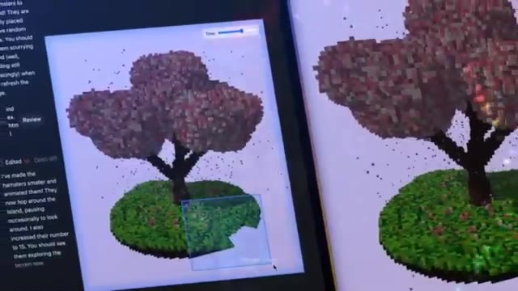
*Interface logicielle montrant la modélisation 3D voxel d'un arbre et d'un îlot, avec un panneau textuel latéral expliquant les modifications apportées (réduction et animation des hamsters).*

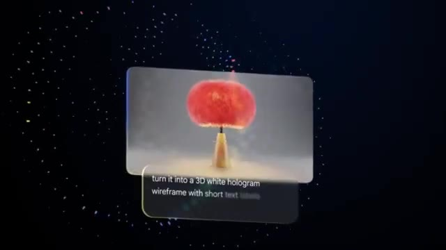
*Animation montrant une interface flottante avec le prompt textuel « turn it into a 3D white hologram wireframe with short text labels ».*

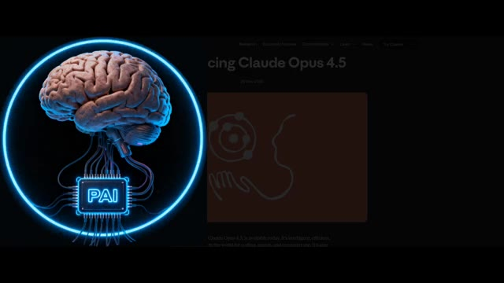
*Page web présentant « Claude Opus 4.5 » avec à gauche un logo animé représentant un cerveau connecté à une puce « PAI ».*

---

### ⏱️ `[00:00:55 - 00:01:16]` | Segment #03

**🔊 Audio (Transcription Intégrale Mot pour Mot en Français) :**
> Donc, la première idée est une farce de Noël effrayante. J'ai demandé à l'IA de créer un site web. Quand quelqu'un ouvre le site web, il voit une boîte cadeau sur l'écran. Sous la boîte cadeau, il y a un bouton d'ouverture. Et quand la personne clique sur le bouton d'ouverture, boum ! Un Père Noël effrayant apparaît soudainement avec des effets sonores terrifiants.

**👁️ Analyse Visuelle d'Écran (gemini-3.5-flash-lite) :**
**Interface & Outils** : Interface d'un site web simple créé par IA pour une farce de Noël.

**Contenu textuel & Code** : Texte 'Scary Christmas Prank', 'You have a Christmas Gift!', et le bouton rouge 'OPEN'.

**Action / Démonstration** : Présentation de l'idée de farce de Noël avec affichage de l'interface du site web piégé et de l'image effrayante du Père Noël.

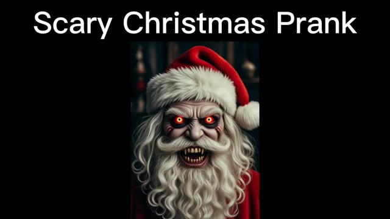
*Image du Père Noël effrayant avec le texte 'Scary Christmas Prank' en haut de l'écran.*

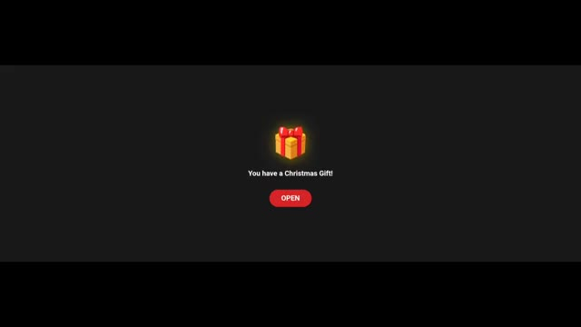
*Interface d'un site web montrant une boîte cadeau lumineuse avec le texte 'You have a Christmas Gift!' et un bouton rouge 'OPEN'.*

*Gros plan sur le Père Noël effrayant aux yeux brillants et aux dents pointues.*

---

### ⏱️ `[00:01:17 - 00:01:41]` | Segment #04

**🔊 Audio (Transcription Intégrale Mot pour Mot en Français) :**
> C'est conçu pour surprendre la personne avec un Père Noël effrayant. D'abord, voici le résultat obtenu par Gemini 3. Très bien les gars, je vais ouvrir la boîte. Et le voilà. Qu'est-ce que c'est ?

**👁️ Analyse Visuelle d'Écran (gemini-3.5-flash-lite) :**
**Interface & Outils** : Interface web de développement ou de prototype (probablement Artifacts de Claude ou interface similaire basée sur Gemini 3).

**Contenu textuel & Code** : Textes visibles : "Happy Christmas By Pursuing AI", "Christmas Gift Jump Scare App", "A special gift for you!", "Tap to Open", "HO HO NO...", "Merry Christmas & Happy Nightmare".
[DESC_IMAGE_3] Visualisation du résultat de l'application interactive générée par IA.

**Action / Démonstration** : Démonstration pédagogique et présentation du workflow.

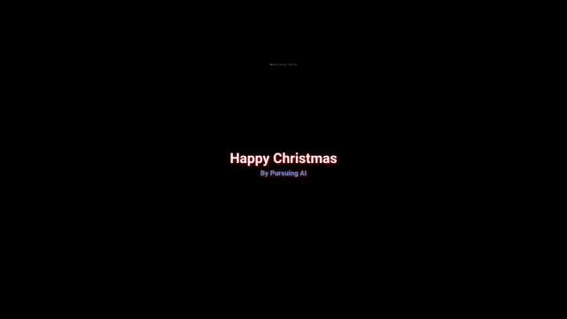
*Écran titre noir affichant "Happy Christmas" en rouge et "By Pursuing AI" en dessous.*

*Interface de l'application montrant une boîte cadeau dorée avec un ruban rouge et le texte "A special gift for you!" et un bouton "Tap to Open".*

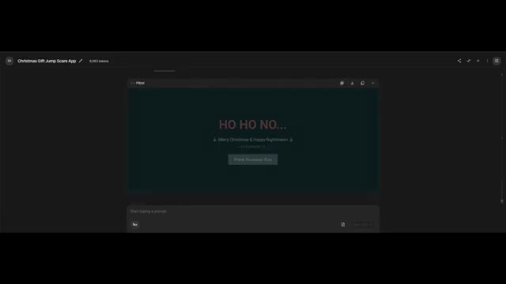
*Résultat après ouverture de la boîte montrant un écran sombre avec le texte "HO HO NO..." et "Merry Christmas & Happy Nightmare".*

---

### ⏱️ `[00:01:42 - 00:02:02]` | Segment #05

**🔊 Audio (Transcription Intégrale Mot pour Mot en Français) :**
> C'est vraiment flippant, mais il y a une erreur. On n'a pas vraiment un visage de Père Noël flippant. J'ai essayé plusieurs fois d'ajouter un visage de Père Noël flippant, mais ça n'a pas corrigé le problème. Pourtant, c'est vraiment flippant. Dites-moi dans les commentaires, est-ce que vous enverriez ça à vos amis ? Maintenant, regardons le résultat de ChatGPT 5.2.

**👁️ Analyse Visuelle d'Écran (gemini-3.5-flash-lite) :**
**Interface & Outils** : Interface de développement / application web (type assistant IA ou IDE).

**Contenu textuel & Code** : Texte de l'interface : "Christmas Gift Jump Scare App", "A special gift for you!", "Tap to Open", et code HTML avec commentaires sur le "Zombie Santa" et l'interface de surprise.

**Action / Démonstration** : Présentation visuelle de l'application interactive de cadeau de Noël puis de son code source.

*Interface de l'application affichant le rendu HTML avec un cadeau de Noël et le texte "A special gift for you!".*

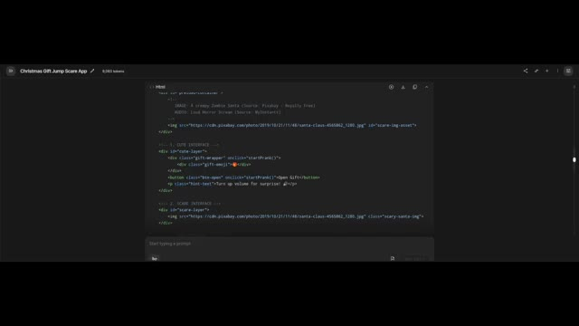
*Affichage du code source HTML de l'application avec des commentaires sur les images et les couches d'interface.*

---

### ⏱️ `[00:02:03 - 00:02:24]` | Segment #06

**🔊 Audio (Transcription Intégrale Mot pour Mot en Français) :**
> Ici, ça crée un thème mignon, et tout a l'air vraiment sympa. Cliquons sur Ouvrir, et le voilà ! C'est vraiment mignon ! Un petit son arrive, et ce son est également doux. Globalement, c'est amical et ludique. Vous devriez l'envoyer à vos amis et aux membres de votre famille.

**👁️ Analyse Visuelle d'Écran (gemini-3.5-flash-lite) :**
**Interface & Outils** : Interface de ChatGPT (version 5.2) avec panneau de discussion à gauche et aperçu de l'application web interactive à droite.

**Contenu textuel & Code** : Texte de débogage et de code dans ChatGPT (gestion d'erreur de syntaxe liée à un accolate en trop), et affichage du message "Happy Christmas - by Pursuing AI" avec un bouton de relecture.

**Action / Démonstration** : Le créateur montre l'interface interactive de l'application web créée avec ChatGPT, illustrant le rendu final avec le bouton "Open" et les options de relecture de la blague.

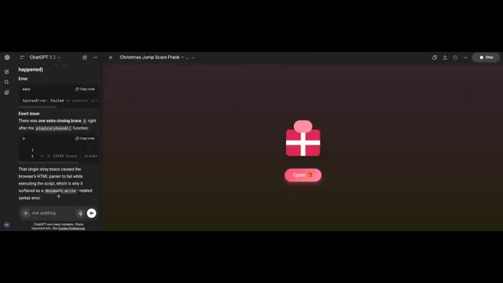
*Interface de ChatGPT montrant le projet web et un message d'erreur de syntaxe, avec un aperçu interactif d'un paquet cadeau de Noël et un bouton "Open".*

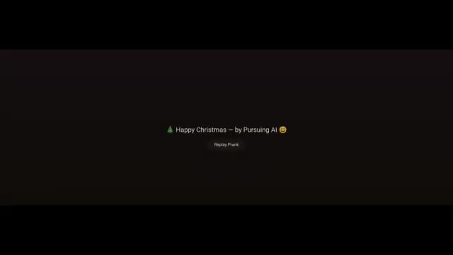
*Écran affichant le texte "Happy Christmas - by Pursuing AI" avec un bouton "Replay Prank".*

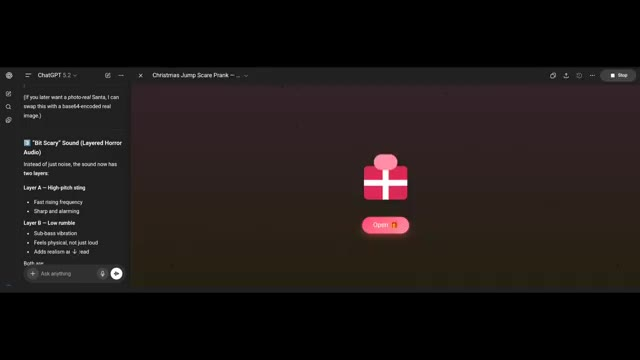
*Interface de ChatGPT affichant les détails audio de la blague de Noël ("Bit Scary" Sound) à côté de l'aperçu du paquet cadeau interactif.*

---

### ⏱️ `[00:02:24 - 00:02:50]` | Segment #07

**🔊 Audio (Transcription Intégrale Mot pour Mot en Français) :**
> Maintenant, passons au résultat d'Opus 4.5. Ici, il ajoute une animation de neige, et ça ressemble vraiment à quelque chose que quelqu'un enverrait comme un joli cadeau. Voyons ce qu'il y a à l'intérieur de la boîte cadeau. Ce n'est pas trop effrayant, mais cela ajoute un visage de Père Noël au style effrayant, et inclut également un effet sonore effrayant, ce qui est bien.

**👁️ Analyse Visuelle d'Écran (gemini-3.5-flash-lite) :**
**Interface & Outils** : Interface web interactive (ChatGPT / application hébergée).

**Contenu textuel & Code** : Texte affiché : "Merry Christmas! — by Pursuing AI", bouton "Replay Prank", instructions dans ChatGPT sur les couches audio ("Bit Scary Sound", "Layer A - High-pitch sting", "Layer B - Low rumble").

**Action / Démonstration** : Présentation du résultat généré par Opus 4.5 montrant une animation sur le thème de Noël avec un effet de surprise (jump scare) et des sons effrayants.

*Interface d'une application ChatGPT avec un panneau latéral montrant du code et des instructions audio (Bit Scary Sound).*

*Écran de l'application web avec un fond vert, des flocons de neige animés et le texte "Merry Christmas! - by Pursuing AI".*

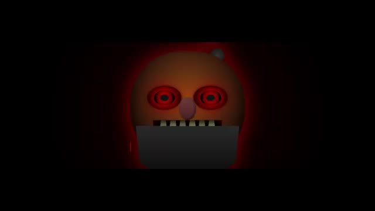
*Visage d'un Père Noël stylisé et effrayant aux yeux rouges et menaçants sur fond sombre.*

---

### ⏱️ `[00:02:51 - 00:03:10]` | Segment #08

**🔊 Audio (Transcription Intégrale Mot pour Mot en Français) :**
> Globalement, le meilleur résultat effrayant est Gemini 3, parce qu'il donne l'impression d'être le plus intense et le plus effrayant. Commentez ci-dessous, quel cadeau avez-vous préféré ? Tous les fichiers HTML et les prompts que j'ai utilisés sont téléchargés sur mon serveur Discord. Le lien est dans la description. Joyeux Noël à mon adorable public.

**👁️ Analyse Visuelle d'Écran (gemini-3.5-flash-lite) :**
**Interface & Outils** : Interface de ChatGPT et navigateur web affichant des applications web HTML interactives générées par IA.

**Contenu textuel & Code** : Texte affichant 'Christmas Gift Jump Scare App', un paquet cadeau, 'A special gift for you!', bouton 'Tap to Open', code ChatGPT avec 'Bit Scary Sound (Layered Horror Audio)', et 'Happy Christmas - by Pursuing AI'.

**Action / Démonstration** : Le créateur présente différentes versions d'applications web HTML interactives générées par intelligence artificielle comportant des effets de surprise et des sons effrayants pour Noël.

*Aperçu d'une application HTML interactive de cadeau de Noël avec un paquet cadeau et un bouton 'Tap to Open'.*

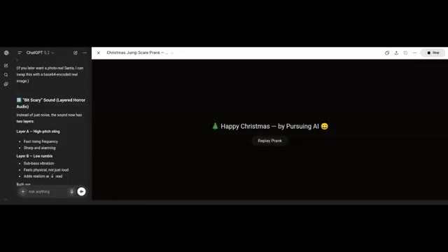
*Interface de ChatGPT montrant le code et la configuration audio pour une farce de type 'jump scare' de Noël.*

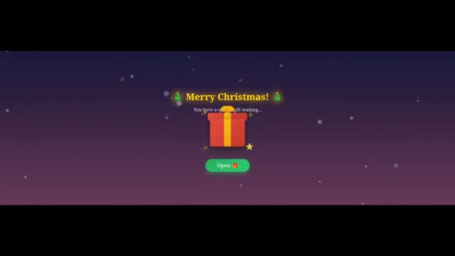
*Interface Web interactive affichant un paquet cadeau rouge avec le texte 'Merry Christmas! You have a special gift waiting...' et un bouton 'Open'.*

---

### ⏱️ `[00:03:11 - 00:03:15]` | Segment #09

**🔊 Audio (Transcription Intégrale Mot pour Mot en Français) :**
> C'est Pursuing AI, et vous venez de regarder le rapport de recherche.

**👁️ Analyse Visuelle d'Écran (gemini-3.5-flash-lite) :**
**Interface & Outils** : Écran de fin / carte graphique animée de la chaîne YouTube Pursuing AI.

**Contenu textuel & Code** : Texte "The Research Report", logo de la chaîne avec le cerveau et l'inscription "PAI", éléments graphiques de Noël (sapins, bonnets de Noël, cadeaux) et un bouton "Subscribe" (S'abonner).

**Action / Démonstration** : Affichage de l'écran de fin de la vidéo avec le logo et les bannières d'abonnement.

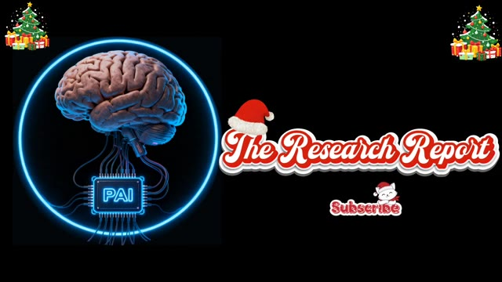
*Écran de fin de la vidéo affichant le logo de la chaîne Pursuing AI avec un cerveau connecté à une puce "PAI" et le titre "The Research Report" aux couleurs de Noël.*

---
