# 🎬 GPT 5.2, GEMINI 3, Opus 4.5 et GLM 4.7 🎄🎁

> **Chaîne** : [Pursuing AI](https://www.youtube.com/@PursuingAi)  
> **Titre original** : `GPT 5.2 , GEMINI 3 , Opus 4.5 and GLM 4.7 🎄🎁`  
> **Lien YouTube** : [https://www.youtube.com/watch?v=GGRpVBQV2yg](https://www.youtube.com/watch?v=GGRpVBQV2yg)  
> **Date de publication** : 2025-12-24  
> **Durée** : 07m 32s (`452s`)  
> **Identifiant vidéo** : `GGRpVBQV2yg`  
> **Fiche Web Interactive** : [2025-12-24_YT-GGRpVBQV2yg_GPT 5.2, GEMINI 3, Opus 4.5 et GLM 4.7 🎄🎁_by-whisper-v3-large-turbo+gemini-3.5-flash-lite.html](2025-12-24_YT-GGRpVBQV2yg_GPT 5.2, GEMINI 3, Opus 4.5 et GLM 4.7 🎄🎁_by-whisper-v3-large-turbo+gemini-3.5-flash-lite.html)  
> **Captures de démonstration clés** : `41 captures réelles (anti-talking-head)`  
> **Modèles utilisés** : Audio: `large-v3-turbo` (Faster-Whisper int8 VPS) | Vision: `gemini-3.5-flash-lite` (Google AI Studio API)  

---

## 📌 Synthèse Exécutive & Outils

### 📌 Résumé
La vidéo de *Pursuing AI* intitulée « GPT 5.2, GEMINI 3, Opus 4.5 et GLM 4.7 🎄🎁 » explore de manière ludique et comparative le potentiel des modèles de langage de pointe (ou de nouvelle génération) pour concevoir des applications web interactives de Noël. À travers trois cas d'usage précis — une carte romantique pour sa petite amie, une farce effrayante pour son meilleur ami et l'affichage d'un message personnalisé sur le Burj Khalifa —, le créateur teste la capacité de ces intelligences artificielles à coder, itérer et produire des interfaces web fonctionnelles uniquement à partir de descriptions textuelles.

La méthode repose sur une approche itérative rigoureuse : chaque modèle est soumis à un prompt initial, puis affiné par des instructions correctives successives pour corriger les bugs d'affichage, ajuster les ambiances sonores ou perfectionner le design visuel. L'expérience montre que si aucun modèle ne parvient à un résultat parfait du premier coup, les performances varient grandement d'une IA à l'autre selon la complexité de la tâche, qu'il s'agisse de générer du code HTML autonome, de concevoir des animations fluides ou de respecter des contraintes structurelles précises.

Pour les créateurs de contenu et les développeurs, ce type de workflow illustre l'abaissement spectaculaire de la barrière technique : il est désormais possible de prototyper des expériences web immersives et personnalisées en quelques minutes sans écrire une seule ligne de code manuellement. Cette vidéo démontre que l'avenir de la création de contenu réside dans la co-création pilotée par le prompt, où la qualité du résultat dépend autant de la persévérance de l'utilisateur dans l'itération que de la puissance brute du modèle d'IA employé.

### 🛠️ Outils, Modèles & Logiciels Présentés
* **Gemini 3** : Utilisé pour générer une application web romantique avec un Père Noël animé et un message personnalisé, ainsi que pour tester des animations et de la musique de fond.
* **GLM 4.7** : Modèle open source testé pour concevoir une farce interactive avec un effet sonore terrifiant et pour simuler l'affichage d'un message sur le Burj Khalifa.
* **Opus 4.5** : Modèle de langage mobilisé en alternative pour réussir la conception de la farce effrayante et pour structurer l'affichage architectural du Burj Khalifa avec des effets de neige.
* **ChatGPT 5.2** : Modèle utilisé pour surpasser les autres IA dans la génération d'une farce terrifiante ultra-immersive, intégrant un son d'ambiance et un timing d'apparition parfait.
* **Seedance 2.5** : Mentionné dans l'écosystème global des outils d'IA pour la génération et le traitement vidéo.
* **Kling 3.0** : Cité parmi les technologies de pointe utilisées pour la production de contenus visuels par intelligence artificielle.
* **Midjourney** : Référence incontournable pour la conception d'assets graphiques et visuels.

### 🔑 Points Clés & Enseignements Stratégiques
* **L'importance cruciale de l'itération** : Aucun modèle n'est capable de produire une application web parfaite du premier coup ; le processus exige une suite de prompts correctifs pour ajuster le comportement, le design et l'interactivité.
* **La gestion du code exportable** : Lorsque les liens web générés directement par l'IA affichent des erreurs de routage, l'option de téléchargement du fichier HTML brut s'impose comme une alternative indispensable pour tester le projet localement.
* **La spécialisation des modèles selon les tâches** : ChatGPT 5.2 excelle dans la création d'ambiances dramatiques et de surprises interactives (comme la farce du Père Noël effrayant), tandis que d'autres modèles brillent par la structure visuelle de leurs décors.
* **L'intégration du design émotionnel** : Les IA modernes comprennent parfaitement les consignes d'ambiance (styles de police romantiques, palettes de couleurs chaleureuses, émojis animés) pour maximiser l'impact émotionnel auprès du destinataire.
* **L'autonomie rédactionnelle des LLM** : Lorsqu'aucun texte n'est spécifié dans le prompt, des modèles comme Gemini 3 démontrent une forte capacité à rédiger de manière autonome des messages touchants et contextuels.
* **Le piège des rendus architecturaux** : Reproducer des monuments réels complexes comme le Burj Khalifa nécessite des instructions extrêmement précises, les IA ayant tendance à générer des structures de bâtiments génériques si elles ne sont pas guidées.
* **L'optimisation de l'expérience sonore** : L'ajout de sons d'ambiance et d'effets sonores terrifiants ou musicaux demande généralement plusieurs essais pour synchroniser parfaitement l'audio avec l'action visuelle à l'ouverture des boîtes-cadeaux.
* **La démocratisation du prototypage rapide** : Ces outils permettent à des non-développeurs de concevoir des mini-applications web (HTML/CSS/JS intégrés) en quelques minutes, transformant une idée créative en un produit partageable instantanément.
* **La gestion des animations fluides** : Obtenir des transitions harmonieuses (comme l'apparition d'une lettre pop-up ou le mouvement de boutons) requiert de prompter explicitement le modèle sur la fluidité des mouvements graphiques.
* **L'évaluation comparative multi-modèles** : Face à l'échec ou aux limites d'un modèle (comme GLM 4.7 sur la farce effrayante), basculer rapidement vers un concurrent (Opus 4.5 ou ChatGPT 5.2) garantit d'atteindre le résultat escompté sans perdre de temps.

---

## ⏱️ Chronologie & Transcription Complète Audio & Visuelle (Mot pour Mot)

### ⏱️ `[00:00:00 - 00:00:21]` | Segment #01

**🔊 Audio (Transcription Intégrale Mot pour Mot en Français) :**
> Hé, quelqu'un m'a envoyé un cadeau. Ouvrons-le. Aujourd'hui c'est le réveillon de Noël, mais ce n'est pas un réveillon de Noël normal. Nous vivons à l'ère de l'IA, et cette année, l'IA est partout. De nouveaux modèles, de nouveaux outils, presque chaque semaine.

**👁️ Analyse Visuelle d'Écran (gemini-3.5-flash-lite) :**
**Interface & Outils** : Interface web interactive avec animations graphiques, moteur de recherche de date et interface de modélisation 3D/voxel avec commentaires textuels.

**Contenu textuel & Code** : Texte affiché : "Open Gift", "*Pls Low The Volume*", "Christmas Eve › Date", "Wed, Dec 24, 2025", et commentaires de code textuels sur l'ajout de hamsters voxélisés et animés.

**Action / Démonstration** : Présentation d'une animation d'ouverture de cadeau interactif, vérification de la date de Noël 2025, puis affichage d'un modèle 3D interactif d'un arbre en voxels.

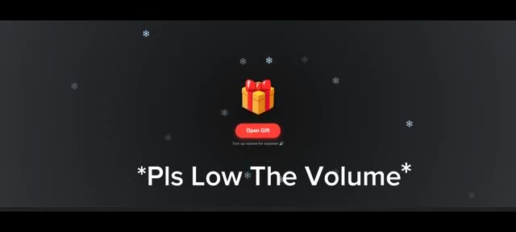
*Interface sombre affichant une boîte cadeau rouge et jaune avec l'indication 'Open Gift' et le texte d'avertissement '*Pls Low The Volume*'.*

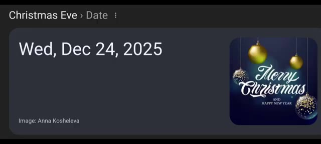
*Interface de recherche montrant la date du mercredi 24 décembre 2025 et une image de vœux de Noël.*

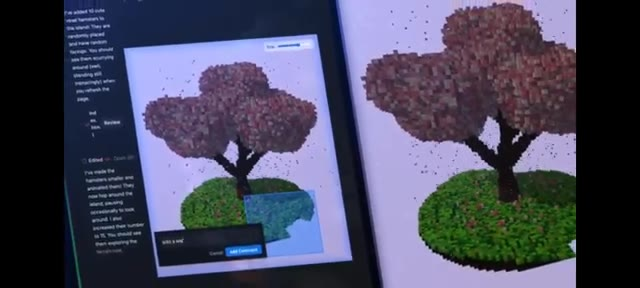
*Interface de développement ou de création 3D montrant un arbre voxélisé style voxel art sur une île flottante avec un panneau de code/commentaires textuels à gauche.*

---

### ⏱️ `[00:00:21 - 00:00:44]` | Segment #02

**🔊 Audio (Transcription Intégrale Mot pour Mot en Français) :**
> Franchement, on a l'impression qu'il pleut de l'IA cette année. Et voici la partie passionnante. Tous ces outils d'IA peuvent réellement rendre notre Noël plus amusant, plus créatif et plus impressionnant. Alors j'ai creusé le sujet. J'ai fait des recherches sur des manières folles et incroyables d'utiliser l'IA ce Noël. C'est Pursuing AI, et vous regardez The Research Report.

**👁️ Analyse Visuelle d'Écran (gemini-3.5-flash-lite) :**
**Interface & Outils** : Présentation face caméra et animations graphiques thématiques sans partage d'écran logiciel.

**Contenu textuel & Code** : Animations graphiques illustrant le sujet de l'intelligence artificielle et de Noël, incluant le logo "The Research Report" avec un cerveau cybernétique et une lettre de vœux.

**Action / Démonstration** : Affichage d'animations de transition et d'illustrations visuelles pour accompagner la voix off du créateur.

---

### ⏱️ `[00:00:44 - 00:01:05]` | Segment #03

**🔊 Audio (Transcription Intégrale Mot pour Mot en Français) :**
> Tout d'abord, j'ai cherché comment impressionner votre petite amie ce Noël, alors j'ai créé une petite application web. Lorsque votre petite amie l'ouvre, un Père Noël apparaît à l'écran avec une animation fluide et magnifique. Ensuite, le Père Noël lui donne une lettre, mais ce n'est pas une lettre normale. À l'intérieur de la lettre se trouve votre propre message, écrit par vous, pour elle.

**👁️ Analyse Visuelle d'Écran (gemini-3.5-flash-lite) :**
**Interface & Outils** : Écran de présentation de l'application web développée par le créateur.

**Contenu textuel & Code** : Texte à l'écran : "How To Impress Your Girlfriend" puis animation d'une lettre interactive.

**Action / Démonstration** : Le texte apparaît en typographie blanche simple sur fond noir, suivi d'une animation graphique d'enveloppe sur un fond sombre constellé.

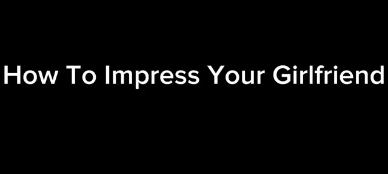
*Titre textuel à l'écran sur fond noir indiquant 'How To Impress Your Girlfriend'.*

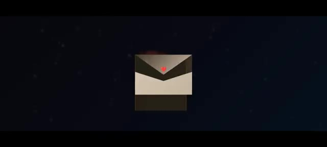
*Animation montrant une enveloppe de lettre stylisée avec un cachet en forme de cœur rouge.*

---

### ⏱️ `[00:01:05 - 00:01:24]` | Segment #04

**🔊 Audio (Transcription Intégrale Mot pour Mot en Français) :**
> Donc ça a l'air personnel, ça a l'air spécial. Passons maintenant au premier résultat. C'est le résultat de Gemini 3. D'abord, il génère ceci. Quand je clique sur ouvrir, un Père Noël apparaît, et une lettre pop-up apparaît. Ensuite, le message apparaît avec une animation. Mais voici le problème.

**👁️ Analyse Visuelle d'Écran (gemini-3.5-flash-lite) :**
**Interface & Outils** : Démonstration vidéo d'un résultat généré par Gemini 3 avec des animations de Noël.

**Contenu textuel & Code** : Texte sur l'enveloppe et la lettre de vœux : vœux de joyeux Noël, message personnalisé et signature.

**Action / Démonstration** : Présentation du premier résultat généré par l'IA Gemini 3, montrant l'ouverture d'une enveloppe et l'apparition d'une animation du Père Noël avec un message.

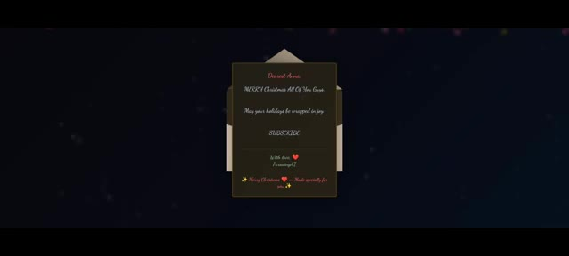
*Aperçu du premier résultat généré (Gemini 3) montrant une enveloppe ouverte avec une lettre de vœux de Noël.*

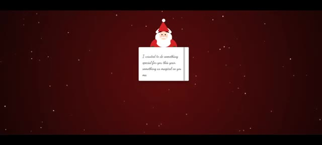
*Animation avec le Père Noël et une lettre pop-up affichant un message personnalisé sur fond rouge avec des flocons.*

---

### ⏱️ `[00:01:24 - 00:01:47]` | Segment #05

**🔊 Audio (Transcription Intégrale Mot pour Mot en Français) :**
> Je ne lui ai donné aucun message. Le message à l'intérieur de la lettre a été écrit par le modèle lui-même. Voyons donc ce qu'il a écrit. Je voulais faire quelque chose de spécial pour toi cette année. Quelque chose d'aussi magique que tu rends ma vie chaque jour. Tu es mon cadeau préféré. Aujourd'hui et pour toujours. Que tes fêtes soient remplies de toute la joie et de l'amour que tu apportes dans mon cœur.

**👁️ Analyse Visuelle d'Écran (gemini-3.5-flash-lite) :**
**Interface & Outils** : Animation graphique thématique de Noël.

**Contenu textuel & Code** : Texte manuscrit en anglais sur la lettre : « I wanted to do something special for you this year, something as magical as you make my life every single day. » avec une illustration du Père Noël en haut.

**Action / Démonstration** : Affichage à l'écran du contenu de la lettre générée par l'intelligence artificielle pendant que le créateur en fait la lecture.

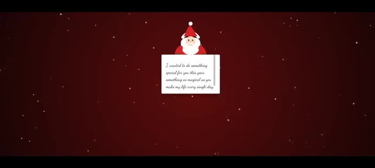
*Animation montrant le Père Noël tenant une lettre avec le texte généré par l'IA sur un fond rouge avec des flocons de neige.*

---

### ⏱️ `[00:01:47 - 00:02:05]` | Segment #06

**🔊 Audio (Transcription Intégrale Mot pour Mot en Français) :**
> Je t'aime plus que les mots ne peuvent le dire. Pour toujours ton ou ta. Et en bas, Joyeux Noël. Fait spécialement pour toi. C'est un message vraiment adorable. Et remarquez particulièrement l'arrière-plan. C'est vraiment romantique. Mais ce n'est pas ce que je veux. Je donne donc une autre consigne pour affiner le résultat.

**👁️ Analyse Visuelle d'Écran (gemini-3.5-flash-lite) :**
**Interface & Outils** : Google Gemini

**Contenu textuel & Code** : Texte de l'application web de cadeau de Noël avec des instructions de téléchargement et un champ de saisie de message romantique.

**Action / Démonstration** : Le créateur montre le rendu visuel généré puis bascule sur l'interface de Google Gemini pour modifier le prompt.

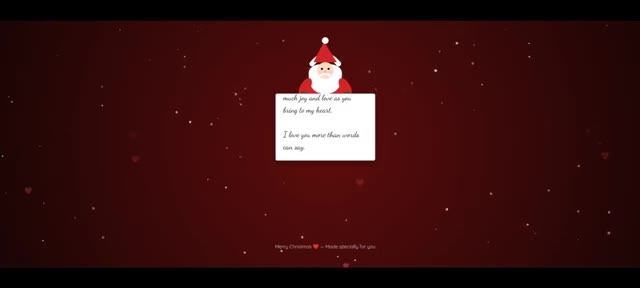
*Aperçu du rendu graphique avec un personnage de Père Noël tenant une carte de vœux sur fond rouge et des paillettes.*

*Interface de Google Gemini affichant le code et le panneau de prévisualisation d'une application web de cadeau de Noël.*

---

### ⏱️ `[00:02:06 - 00:02:24]` | Segment #07

**🔊 Audio (Transcription Intégrale Mot pour Mot en Français) :**
> Et le voilà. Maintenant c'est exactement ce que je veux. À l'intérieur de la boîte, je peux écrire mon propre message personnel, comme "Merry Christmas by pursuing AI". Je peux télécharger le lien et obtenir le fichier HTML. Le lien généré ne fonctionne pas. Il affiche une erreur car le lien n'existe pas.

**👁️ Analyse Visuelle d'Écran (gemini-3.5-flash-lite) :**
**Interface & Outils** : Interface de Google Gemini et navigateur web affichant une application web interactive et une page d'erreur 404.

**Contenu textuel & Code** : Textes "Christmas Web App For Girlfriend", "Create Your Gift", "Write your romantic message below:", "MERRY Christmas By Pursuing AI", boutons "Download Gift File" et "Get Link", et message d'erreur Google "404. That's an error. The requested URL ... was not found on this server."

**Action / Démonstration** : Le créateur présente l'application web mise à jour, tape un message personnalisé dans la boîte de texte, puis montre l'erreur générée par le lien de partage défectueux.

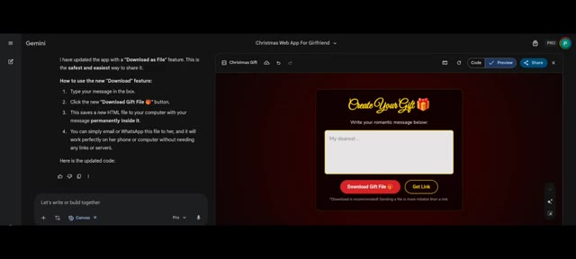
*Interface de Gemini affichant l'application web de Noël avec le code source et la zone de saisie.*

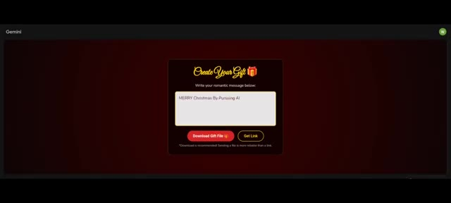
*Gros plan sur l'interface de l'application web avec le texte personnalisé "MERRY Christmas By Pursuing AI" saisi dans la zone de message.*

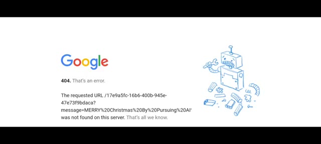
*Page d'erreur Google 404 indiquant que l'URL demandée pour le lien généré est introuvable sur le serveur.*

---

### ⏱️ `[00:02:24 - 00:02:47]` | Segment #08

**🔊 Audio (Transcription Intégrale Mot pour Mot en Français) :**
> Mais le téléchargement fonctionne. Quand je clique sur télécharger, il télécharge le fichier HTML. Quand je l'ouvre, une boîte cadeau apparaît. Quand j'ouvre la boîte cadeau, un petit Père Noël apparaît avec une lettre. Et à l'intérieur de la lettre, mon message personnel apparaît. Exactement ce que je veux qu'il envoie. Des émojis en forme de cœur apparaissent avec une animation. Maintenant, remarquez le style de police. Il correspond parfaitement à l'ambiance romantique.

**👁️ Analyse Visuelle d'Écran (gemini-3.5-flash-lite) :**
**Interface & Outils** : Page web interactive de création de messages-cadeaux personnalisés.

**Contenu textuel & Code** : Texte du message : "MERRY Christmas By Pursuing AI", boutons "Download Gift File" et "Get Link", avec un lien blob généré et un bouton "Copy Link". Sur l'image 2, la lettre affiche le texte stylisé "MERRY Christmas By Pursuing AI" avec des cœurs rouges animés.

**Action / Démonstration** : Démonstration du téléchargement et de l'affichage du fichier HTML généré avec le message personnalisé et les animations de cœurs.

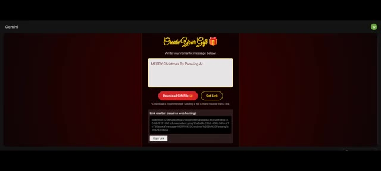
*Interface Web de création de cadeau avec un champ de saisie de message et des boutons de téléchargement de fichier.*

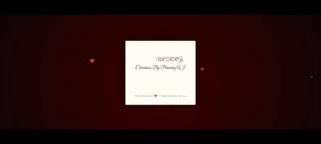
*Affichage du message personnalisé dans une lettre ouverte avec des cœurs animés en arrière-plan.*

---

### ⏱️ `[00:02:47 - 00:03:07]` | Segment #09

**🔊 Audio (Transcription Intégrale Mot pour Mot en Français) :**
> Je pense que ta petite amie serait vraiment heureuse quand tu lui envoies un message personnel comme celui-ci. C'est vraiment incroyable comme Gemini a compris cela en seulement deux invites. Donc la prochaine méthode consiste à faire une farce à ton meilleur ami. Dans la méthode précédente, j'ai utilisé Gemini. Mais pour cette méthode, j'ai utilisé le nouveau modèle open source, GLM 4.7.

**👁️ Analyse Visuelle d'Écran (gemini-3.5-flash-lite) :**
**Interface & Outils** : Interface vidéo et page web de présentation du modèle d'intelligence artificielle GLM-4.7.

**Contenu textuel & Code** : Texte affiché : "MERRY Christmas By Pursuing AI", "Merry Christmas — Made specialty for you", "Scary Prank To Your Best Friend", et "GLM-4.7: Advancing the Coding Capability" avec des détails sur les performances et fonctionnalités du modèle.

**Action / Démonstration** : Le créateur illustre ses propos en affichant une carte virtuelle de Noël, un titre thématique sur la farce, puis la documentation officielle du modèle de langage GLM-4.7.

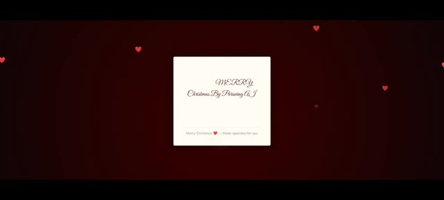
*Carte postale de vœux animée affichant un message de Noël sur fond sombre avec des cœurs flottants.*

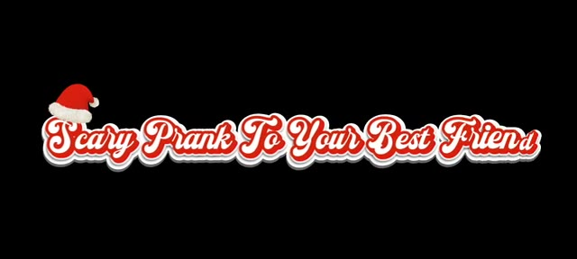
*Texte stylisé en rouge et blanc coiffé d'un bonnet de Noël, introduisant la farce à destination du meilleur ami.*

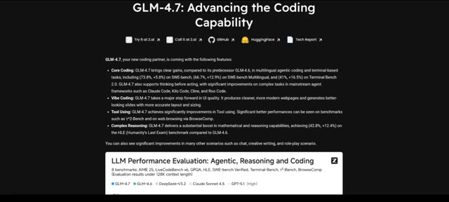
*Page web officielle de présentation du modèle GLM-4.7 détaillant ses capacités de codage et d'évaluation.*

---

### ⏱️ `[00:03:08 - 00:03:29]` | Segment #10

**🔊 Audio (Transcription Intégrale Mot pour Mot en Français) :**
> Ce modèle surpasse Gemini dans certains tests. S'il n'avait pas été capable de réussir ce test, j'avais prévu d'utiliser Opus 4.5 et ChatGPT 5.2. Maintenant, les exigences de la farce étaient simples. Créez un site web où, lorsque quelqu'un l'ouvre, une boîte-cadeau apparaît avec un joli arrière-plan. Sous la boîte, une option pour ouvrir la boîte-cadeau est disponible.

**👁️ Analyse Visuelle d'Écran (gemini-3.5-flash-lite) :**
**Interface & Outils** : Diapositives et écrans de présentation textuels sur fond noir.

**Contenu textuel & Code** : Texte affiché : "LLM Performance Evaluation: Agentic, Reasoning and Coding", "Scary Prank Requirements", et la description des exigences : "Make a website where when anyone opens it, a gift box appears with a lovely background. Below the box, an "Open Gift Box" option is available."

**Action / Démonstration** : Affichage des graphiques de performance des modèles d'IA, suivi de l'apparition textuelle des critères de conception de la farce sur fond noir.

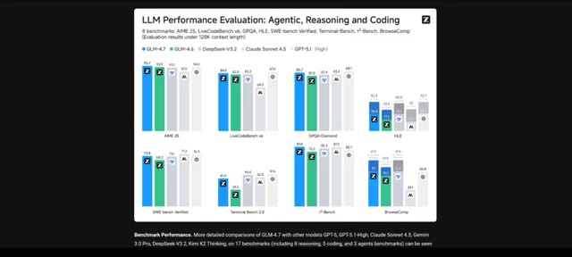
*Graphique de performance des LLM montrant l'évaluation sur divers benchmarks (agentique, raisonnement et codage).*

*Écran noir affichant le titre en texte blanc 'Scary Prank Requirements'.*

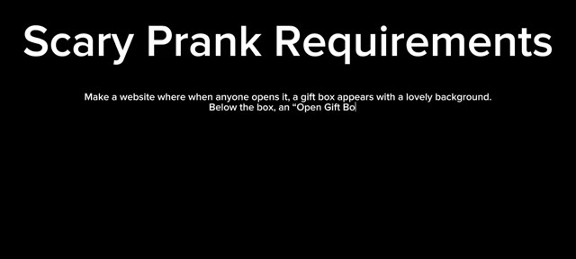
*Écran affichant le titre 'Scary Prank Requirements' avec le texte descriptif de la farce qui s'écrit progressivement en dessous.*

---

### ⏱️ `[00:03:29 - 00:03:57]` | Segment #11

**🔊 Audio (Transcription Intégrale Mot pour Mot en Français) :**
> Lorsque l'on clique dessus, un visage de Père Noël effrayant apparaît soudainement avec des effets sonores terrifiants. Et à la fin, un message apparaît : "bonne année par Pursuing AI". Maintenant voici le résultat de GLM 4.7. D'abord, il a fait un arrière-plan normal. Une boîte cadeau apparaît, mais en ouvrant le cadeau, aucun Père Noël n'apparaît. Et le son n'est pas non plus très effrayant, alors j'ai relancé un prompt pour obtenir un meilleur résultat. C'est le deuxième résultat.

**👁️ Analyse Visuelle d'Écran (gemini-3.5-flash-lite) :**
**Interface & Outils** : Interface de GLM-4.7 montrant une zone de chat textuel à gauche et un panneau de prévisualisation web à droite.

**Contenu textuel & Code** : Prompts textuels saisis par l'utilisateur demandant de créer une page web interactive avec une boîte cadeau, un effet effrayant de Père Noël et un message de fin d'année.

**Action / Démonstration** : Le créateur montre les différentes étapes de génération et d'itération du code d'une application web interactive via GLM-4.7.

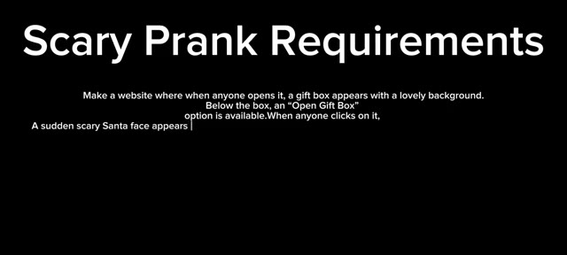
*Texte sur fond noir détaillant les exigences de la farce effrayante ("Scary Prank Requirements").*

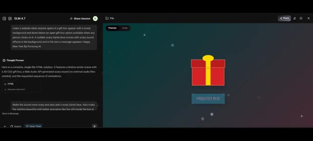
*Interface de GLM-4.7 montrant le premier résultat généré avec une boîte cadeau rouge sur fond de flocons de neige.*

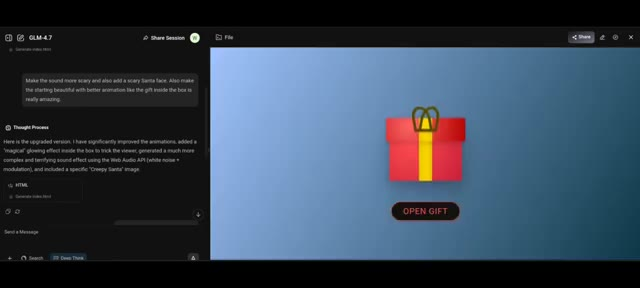
*Interface de GLM-4.7 montrant le deuxième résultat amélioré avec un nouveau prompt et un arrière-plan bleu.*

---

### ⏱️ `[00:03:57 - 00:04:39]` | Segment #12

**🔊 Audio (Transcription Intégrale Mot pour Mot en Français) :**
> Ça améliore le son, mais encore une fois le visage effrayant du Père Noël ne vient pas, alors je lui donne une dernière instruction. Et voici le résultat final. La première impression n'est pas très bonne. En ouvrant la boîte, le visage effrayant du Père Noël apparaît bien, avec du son, mais ce n'est pas ce à quoi je m'attendais. Ce n'est pas assez effrayant pour piéger vos amis. C'est donc le moment de passer à Opus 4.5, et voici le résultat. C'est bien meilleur que GLM 4.7. Ensuite, j'ai aussi essayé ChatGPT 5.2,

**👁️ Analyse Visuelle d'Écran (gemini-3.5-flash-lite) :**
**Interface & Outils** : Interface web de GLM-4.7 avec un panneau de discussion à gauche et une fenêtre de prévisualisation (Preview/Code) à droite.

**Contenu textuel & Code** : Texte de prompt visible : 'Make the sound more scary and also add a scary Santa face. Also make the starting beautiful with better animation like the gift inside the box is really amazing.' Texte de fin : 'Happy New Year By Pursuing AI' et 'A Little Festive Surprise'.

**Action / Démonstration** : Le créateur présente les différents résultats de génération et de prévisualisation obtenus via l'outil GLM-4.7 suite à ses instructions correctives.

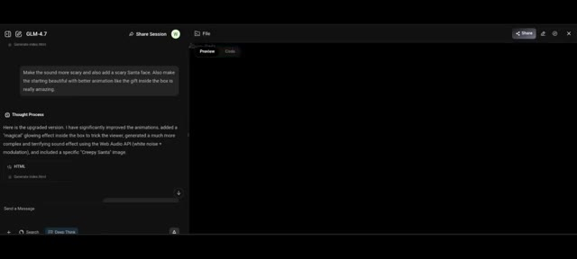
*Interface de GLM-4.7 affichant le panneau de discussion avec le prompt de modification du son et de l'animation.*

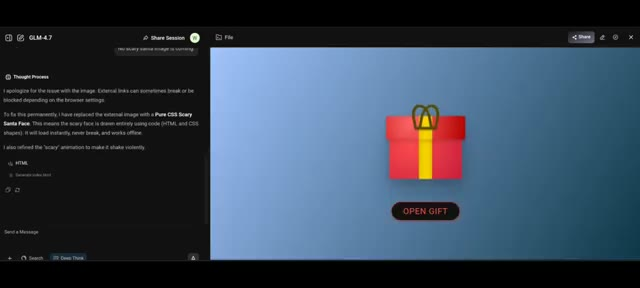
*Interface de GLM-4.7 montrant la prévisualisation d'un cadeau rouge avec un bouton 'OPEN GIFT'.*

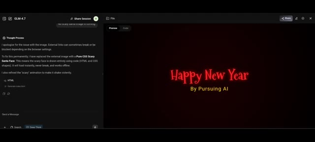
*Interface de GLM-4.7 affichant un écran de fin avec le texte 'Happy New Year By Pursuing AI'.*

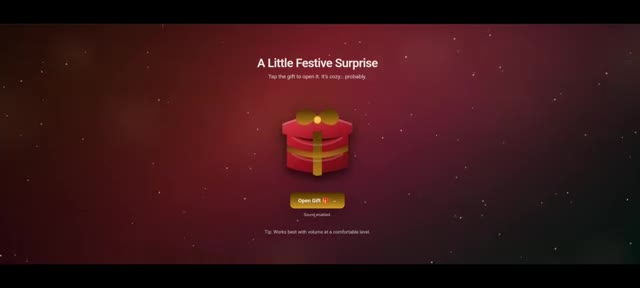
*Interface en plein écran montrant le rendu d'une surprise festive avec un cadeau interactif et le texte 'A Little Festive Surprise'.*

---

### ⏱️ `[00:04:39 - 00:05:06]` | Segment #13

**🔊 Audio (Transcription Intégrale Mot pour Mot en Français) :**
> et voici le résultat. Regardez la première impression. C'est vraiment impressionnant. Notez le message au-dessus de la boîte disant que c'est chaleureux. Cela donne probablement envie aux gens d'ouvrir la boîte. Cela a également ajouté un son d'ambiance dès la première impression. Le son est vraiment incroyable. Maintenant, ouvrons le cadeau. L'apparition soudaine du Père Noël est vraiment effrayante. C'est exactement ce que je voulais.

**👁️ Analyse Visuelle d'Écran (gemini-3.5-flash-lite) :**
**Interface & Outils** : Page web interactive de surprise de Noël animée.

**Contenu textuel & Code** : Textes visibles : "A Little Festive Surprise", "Tap the gift to open it. It's cozy... probably.", "Open Gift", "Sound enabled", "Tip: Works best with volume at a comfortable level."

**Action / Démonstration** : Le créateur présente l'interface interactive de la boîte cadeau, clique pour l'ouvrir et montre l'animation surprise avec effet sonore.

*Interface interactive affichant un cadeau rouge avec le titre "A Little Festive Surprise" et le message "It's cozy... probably."*

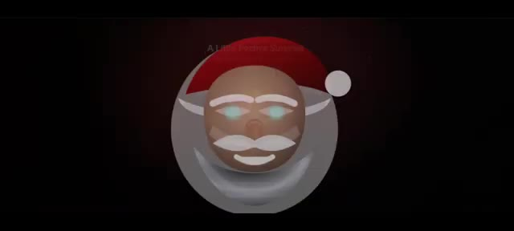
*Gros plan effrayant du visage du Père Noël qui apparaît soudainement lors de l'ouverture du cadeau.*

*Retour à l'écran initial montrant la boîte cadeau rouge interactive avec les options de son.*

---

### ⏱️ `[00:05:06 - 00:05:30]` | Segment #14

**🔊 Audio (Transcription Intégrale Mot pour Mot en Français) :**
> Incroyable ! Nous avons essayé tous les outils, sauf Gemini. J'ai donc réessayé Gemini, et voici le résultat de Gemini. Ouvrons la boîte. C'est bien, mais ce n'est toujours pas aussi bon que le résultat de ChatGPT. Maintenant, après la farce effrayante, vous devriez envoyer le nom de votre ami sur le plus grand bâtiment du monde, le Burj Khalifa.

**👁️ Analyse Visuelle d'Écran (gemini-3.5-flash-lite) :**
**Interface & Outils** : Interface web interactive avec un design festif (fond rouge et étoiles scintillantes).

**Contenu textuel & Code** : Texte affiché : "A Little Festive Surprise", "Tap the gift to open it, it's cozy... probably.", "Open Gift", "Sound enabled", "Tip: Works best with volume at a comfortable level" sur la première image ; et "World's Tallest Building" sur la deuxième.

**Action / Démonstration** : Présentation d'une interface interactive avec un cadeau virtuel à ouvrir, suivie d'une transition textuelle annonçant le plus haut bâtiment du monde.

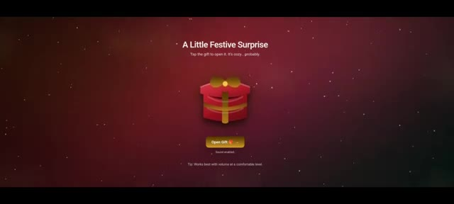
*Interface interactive affichant une boîte cadeau rouge sur fond étoilé avec le titre "A Little Festive Surprise" et un bouton "Open Gift".*

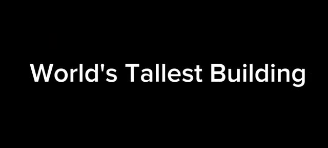
*Écran noir affichant le texte en blanc "World's Tallest Building".*

---

### ⏱️ `[00:05:30 - 00:05:52]` | Segment #15

**🔊 Audio (Transcription Intégrale Mot pour Mot en Français) :**
> Et voici le résultat de GLM 4.7. Le bouton se déplace sur l'écran. Il y a une zone de nom où je peux mettre le nom de mon ami. Mettons-le. Je mets des abonnés. Je clique sur créer. La musique commence. Du texte apparaît avec une animation. La musique de fond rend le tout incroyable. À la fin, une fenêtre pop-up apparaît disant, Je vous souhaite un très joyeux Noël.

**👁️ Analyse Visuelle d'Écran (gemini-3.5-flash-lite) :**
**Interface & Outils** : Interface web interactive générée par GLM 4.7 sur le thème de Noël.

**Contenu textuel & Code** : Texte 'Christmas Magic', 'Enter your friend\'s name', bouton 'Create Christmas Surprise', et le message final 'Merry Christmas! Wishing you a very Merry Christmas from your best friend'.

**Action / Démonstration** : L'utilisateur saisit un nom dans le champ prévu, clique sur le bouton de création, puis la vidéo animée se lance avec de la musique jusqu'à afficher la fenêtre pop-up de vœux finale.

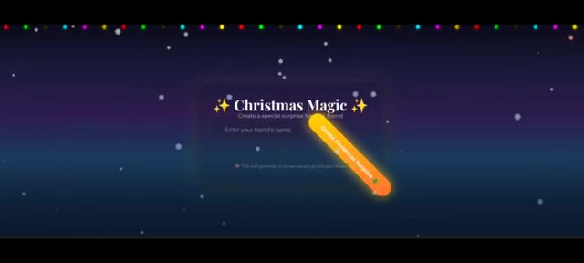
*Interface de GLM 4.7 montrant la carte interactive 'Christmas Magic' avec un champ de texte et un bouton orange interactif.*

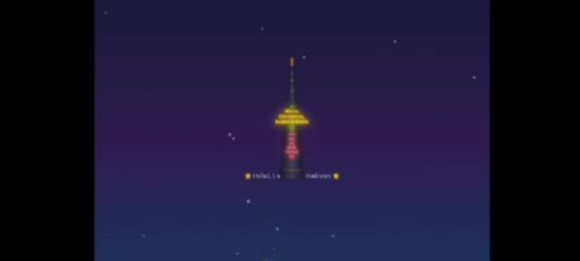
*Animation vidéo générée montrant une tour décorée avec des lumières de Noël et des textes textuels animés.*

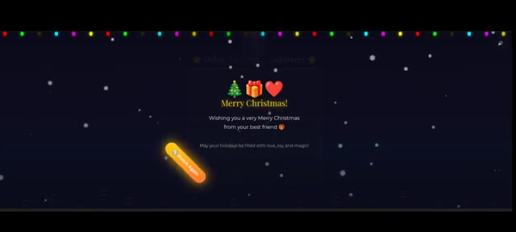
*Pop-up finale de vœux de Noël avec les emojis sapin, cadeau et cœur, affichant le message 'Merry Christmas!'.*

---

### ⏱️ `[00:05:52 - 00:06:21]` | Segment #16

**🔊 Audio (Transcription Intégrale Mot pour Mot en Français) :**
> Tu es mon meilleur ami. Nous venons d'atteindre 200 abonnés. Veux-tu être mon abonné ? Commente ta décision dans les commentaires. Maintenant voici le résultat de Gemini. Mettons le nom de l'ami. C'est incroyable.

**👁️ Analyse Visuelle d'Écran (gemini-3.5-flash-lite) :**
**Interface & Outils** : Présentation face caméra / capture de la chaîne YouTube sans démonstration active de logiciel de création d'IA.

**Contenu textuel & Code** : Affichage de la page d'accueil de la chaîne YouTube "Pursuing AI" avec des éléments graphiques de Noël et des miniatures de vidéos.

**Action / Démonstration** : Le créateur montre la chaîne YouTube pour célébrer l'atteinte des 200 abonnés.

---

### ⏱️ `[00:06:22 - 00:06:56]` | Segment #17

**🔊 Audio (Transcription Intégrale Mot pour Mot en Français) :**
> Remarquez la musique, comme elle est bonne. Mais il y a une erreur. Le bâtiment ne ressemble pas au Burj Khalifa. C'est quand même vraiment impressionnant. Ensuite, c'est le résultat de ChatGPT 5.2. J'ai mis le nom. Il n'y a pas de musique de fond, juste un bâtiment droit avec du texte dessus. Pas aussi bien que le modèle précédent. Et enfin, c'est Opus 4.5. Le thème a l'air incroyable. Remarquez les ampoules colorées en haut et l'animation de neige. Mettons le nom et cliquons sur créer. Pas de musique de fond, mais la structure du bâtiment a l'air vraiment bien par rapport aux autres.

**👁️ Analyse Visuelle d'Écran (gemini-3.5-flash-lite) :**
**Interface & Outils** : Application web interactive de génération de cartes de vœux ou de messages festifs personnalisés.

**Contenu textuel & Code** : Texte affiché : 'Merry Christmas', 'Create a magical surprise for your friend', 'Enter your friend\'s name', et un bouton rouge 'Create Christmas Surprise 🎄'. Sur l'image 1 : 'HAPPY HOLIDAYS', 'Best wishes for you, SUBSCRIBERS', et un bouton rouge 'Send Gift to SUBSCRIBERS'.

**Action / Démonstration** : Visualisation et démonstration des résultats de génération de différents modèles (notamment Opus 4.5 et d'autres) avec les éléments visuels de Noël, les ampoules colorées et les animations de neige.

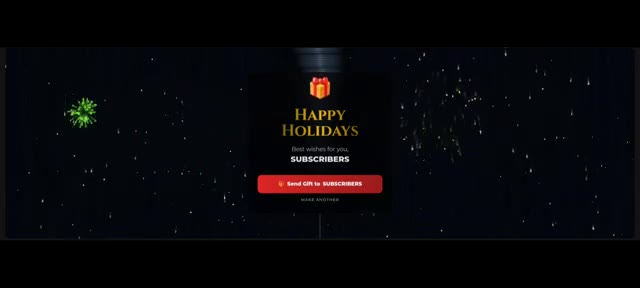
*Résultat généré montrant un panneau noir avec un message de vœux, un fond sombre avec des effets de neige et un bouton rouge.*

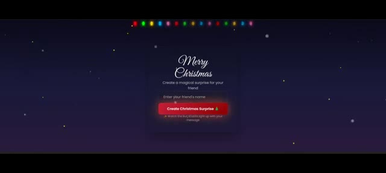
*Interface de création affichant le titre 'Merry Christmas' avec des guirlandes lumineuses colorées en haut et un champ de saisie de nom.*

---

### ⏱️ `[00:06:56 - 00:07:31]` | Segment #18

**🔊 Audio (Transcription Intégrale Mot pour Mot en Français) :**
> des modèles. L'éclairage sur le bâtiment a l'air génial. Et remarquez les bâtiments secondaires. On a clairement l'impression que c'est le plus grand de tous. Commentez maintenant ci-dessous. Quelle méthode avez-vous préférée ? Et laquelle enverriez-vous à votre ami ? Remarquez aussi que j'ai fait plusieurs essais pour améliorer les résultats. Aucun de ces modèles n'a généré de résultats parfaits du premier coup. Je ne montre que les résultats finaux. Cela a pris beaucoup de temps de réaliser toutes ces méthodes. Si vous avez adoré, mettez un pouce bleu, abonnez-vous et commentez. Et enfin, Joyeux Noël à tous. Profitez de vos vacances.

**👁️ Analyse Visuelle d'Écran (gemini-3.5-flash-lite) :**
**Interface & Outils** : Interface Google Gemini et application web interactive de simulation de messages de Noël.

**Contenu textuel & Code** : Textes "Merry Christmas, Subscribers! You are my best friend", "BURJ SURPRISE HOLIDAY EDITION", instructions d'utilisation, et bouton "CREATE MAGIC".

**Action / Démonstration** : Affichage des résultats finaux des animations et présentation de l'application interactive Gemini de création de vœux personnalisés.

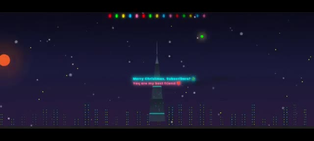
*Animation du Burj Khalifa de nuit avec des lumières de Noël et des flocons de neige qui tombent, affichant le texte "Merry Christmas, Subscribers! You are my best friend".*

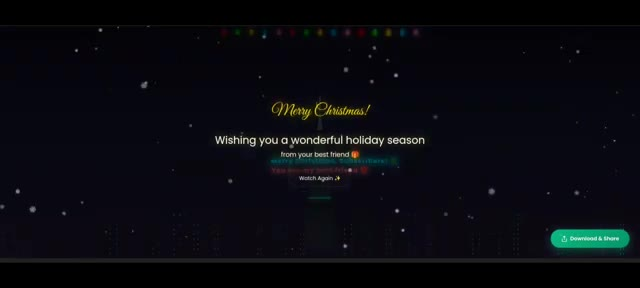
*Interface de fin d'animation montrant les vœux de Noël "Merry Christmas! Wishing you a wonderful holiday season" et un bouton "Download & Share".*

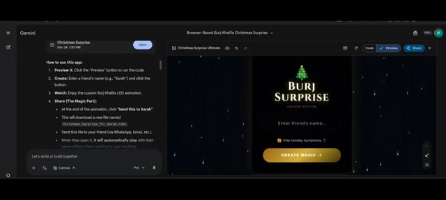
*Interface de Gemini affichant l'application interactive "Burj Khalifa Christmas Surprise" avec des instructions d'utilisation et un panneau de prévisualisation "CREATE MAGIC".*

---
