# 🎬 Open Source vs IA fermée : GLM 4.7 secoue GPT-5.2, Gemini & Opus

> **Chaîne** : [Pursuing AI](https://www.youtube.com/@PursuingAi)  
> **Titre original** : `Open Source vs Closed AI: GLM 4.7 Shocks GPT-5.2, Gemini & Opus`  
> **Lien YouTube** : [https://www.youtube.com/watch?v=dzqjuVLQrU8](https://www.youtube.com/watch?v=dzqjuVLQrU8)  
> **Date de publication** : 2025-12-28  
> **Durée** : 03m 26s (`206s`)  
> **Identifiant vidéo** : `dzqjuVLQrU8`  
> **Fiche Web Interactive** : [2025-12-28_YT-dzqjuVLQrU8_Open Source vs IA fermée GLM 4.7 secoue GPT-5.2, Gemini & Opus_by-whisper-v3-large-turbo+gemini-3.5-flash-lite.html](2025-12-28_YT-dzqjuVLQrU8_Open Source vs IA fermée GLM 4.7 secoue GPT-5.2, Gemini & Opus_by-whisper-v3-large-turbo+gemini-3.5-flash-lite.html)  
> **Captures de démonstration clés** : `24 captures réelles (anti-talking-head)`  
> **Modèles utilisés** : Audio: `large-v3-turbo` (Faster-Whisper int8 VPS) | Vision: `gemini-3.5-flash-lite` (Google AI Studio API)  

---

## 📌 Synthèse Exécutive & Outils

### 📌 Résumé
La vidéo de *Pursuing AI* intitulée « Open Source vs IA fermée : GLM 4.7 secoue GPT-5.2, Gemini & Opus » explore l’affrontement décisif entre les modèles de langage et de code open source et les solutions propriétaires dominantes du marché. Face aux promesses de performances exceptionnelles de GLM 4.7, le créateur a choisi de soumettre ces intelligences artificielles à un stress-test impitoyable composé de simulations complexes en conditions réelles (génération de code interactif, simulation anatomique et rendu comportemental 3D). L'approche méthodologique repose sur l'utilisation de prompts longs, texturés et extrêmement détaillés — et non de requêtes simplistes —, afin de tester les limites logiques, visuelles et cinématiques de chaque modèle. 

Au terme de ce comparatif rigoureux, la frontière entre open source et écosystèmes fermés s'avère plus poreuse que jamais. Si les modèles propriétaires conservent une supériorité notable sur des tâches organiques hautement délicates comme le réalisme visuel d'une main humaine, l'outsider open source GLM 4.7 démontre une supériorité écrasante sur des logiques algorithmiques avancées et de simulation spatiale, notamment dans le vol d'oiseaux en essaim via Three.js. Pour les créateurs de contenu vidéo, de VFX et les développeurs d'expériences interactives, cette étude de cas offre un enseignement capital : l'open source n'est plus une alternative de second choix au rabais, mais une véritable force de frappe concurrentielle capable de rivaliser, voire de surpasser les géants propriétaires sur des aspects techniques ciblés.

---

### 🛠️ Outils, Modèles & Logiciels Présentés
* **GLM 4.7** : Modèle open source principal testé dans la vidéo, capable de générer des centaines de lignes de code complexes pour rivaliser avec les géants propriétaires.
* **Gemini** (versions 3 et standard) : Modèle propriétaire de Google évalué pour ses capacités de rendu visuel et sa gestion des caméras virtuelles.
* **ChatGPT / GPT-5.2** : Modèle propriétaire de pointe d'OpenAI utilisé comme étalon de référence pour la génération de logiques interactives et de simulations graphiques.
* **Opus / Opus 4.5** : Modèle propriétaire (de type Claude/Anthropic) soumis aux tests de simulation anatomique et comportementale 3D.
* **Seedance 2.5** : Solution de génération et de traitement vidéo par IA identifiée dans l'écosystème technique du créateur.
* **Kling 3.0** : Modèle de pointe pour la génération de vidéo par IA mentionné parmi les outils de référence du domaine.
* **Midjourney** : Référence incontournable de la génération d'images fixes par IA intégrée aux flux de production visuelle.
* **Three.js** : Librairie JavaScript 3D exploitée conjointement avec les IA pour structurer les environnements visuels et le comportement des essaims d'oiseaux.

---

### 🔑 Points Clés & Enseignements Stratégiques
* **L'essor incontestable de l'Open Source** : GLM 4.7 prouve que les modèles ouverts ne se contentent plus de suivre la cadence, mais talonnent ou surpassent les grands acteurs propriétaires sur des tâches techniques spécifiques.
* **Le choix méthodologique des prompts longs** : L'utilisation de consignes textuelles denses, structurées et hautement détaillées est indispensable pour tester la véritable profondeur logique des IA, évitant ainsi les biais des prompts simplistes d'une seule ligne.
* **L'importance de la tolérance à l'erreur itérative** : Face à une génération initiale en écran noir sur le test de la main, GLM 4.7 a nécessité un retour d'instruction correctif, soulignant que l'interaction itérative reste clé dans le code généré par IA.
* **Supériorité des modèles fermés sur l'organique** : Pour la simulation de main humaine, les solutions propriétaires (Gemini, GPT-5.2, Opus) surclassent nettement l'open source en matière de rendu visuel réaliste et immédiat.
* **Maîtrise de la logique anatomique vs esthétique** : Même si le rendu visuel de GLM 4.7 sur la main évoquait une commode, sa logique mécanique et cinématique (articulations et mouvement différencié du pouce) s'est révélée rigoureusement exacte.
* **La suprématie de GLM 4.7 sur la simulation spatiale** : Sur le test du vol d'oiseaux en essaim (Three.js), GLM 4.7 domine largement ses concurrents en offrant un monde cohérent, un menu de contrôle intégré et une stabilité de caméra irréprochable.
* **Les limites de la stabilité de caméra chez les concurrents** : Des modèles comme Gemini ont péché par une vue d'oiseau extrêmement instable nuisant à l'immersion, tandis qu'Opus a généré un comportement s'apparentant visuellement à des poissons nageant dans le ciel.
* **L'échec contextuel des modèles de pointe** : GPT-5.2 a échoué à plusieurs reprises sur le test des oiseaux, confirmant qu'aucun modèle propriétaire n'est universellement parfait sur tous les types de simulation 3D.
* **Optimisation des coûts pour les créateurs** : L'émergence d'alternatives open source aussi puissantes que GLM 4.7 remet directement en question la rentabilité de l'investissement exclusif dans des abonnements à des modèles propriétaires onéreux.
* **Synergie entre code et rendu visuel** : L'intégration de scripts complexes générés par IA avec des moteurs graphiques légers (comme Three.js) ouvre des perspectives inédites pour le prototypage rapide de décors et d'effets visuels vidéo.

---

## ⏱️ Chronologie & Transcription Complète Audio & Visuelle (Mot pour Mot)

### ⏱️ `[00:00:00 - 00:00:25]` | Segment #01

**🔊 Audio (Transcription Intégrale Mot pour Mot en Français) :**
> Il s'agit de GLM 4.7, un modèle open source dont les benchmarks surpassent et rivalisent avec des modèles propriétaires comme Gemini, ChatGPT et Opus. La vraie question est donc simple : votre argent est-il gaspillé dans des modèles propriétaires ? Pour le savoir, j'ai testé GLM 4.7 face à des modèles propriétaires en utilisant trois tâches de simulation insensées.

**👁️ Analyse Visuelle d'Écran (gemini-3.5-flash-lite) :**
**Interface & Outils** : Pages web documentant GLM-4.7, tableaux de benchmarks comparatifs, page de tarification et application de simulation 3D.

**Contenu textuel & Code** : Textes techniques sur GLM-4.7 ("Advancing the Coding Capability"), graphiques de performance (AIME 25, LiveCodeBench, GPQA, HLE), plans tarifaires à 4$, 20$ et 200$, et panneau de contrôle "Flock Controls" dans la simulation 3D.

**Action / Démonstration** : Défilement à travers la documentation technique, les graphiques de benchmarks, l'affichage des offres d'abonnement et la démonstration d'une simulation 3D.

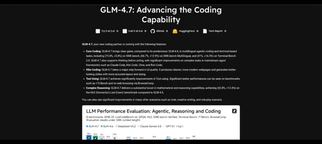
*Page web de présentation de GLM-4.7 montrant ses capacités de codage et ses liens vers les ressources.*

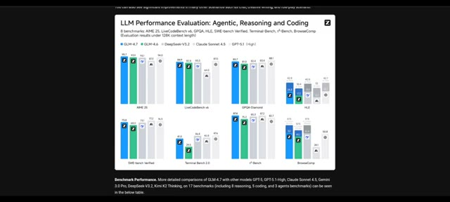
*Graphiques d'évaluation des performances des LLM comparant GLM-4.7 à d'autres modèles sur plusieurs benchmarks.*

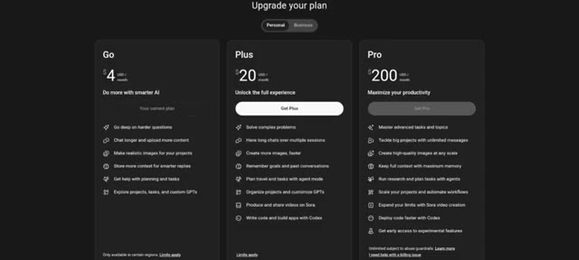
*Page de tarification d'un service d'IA affichant les abonnements Go, Plus et Pro.*

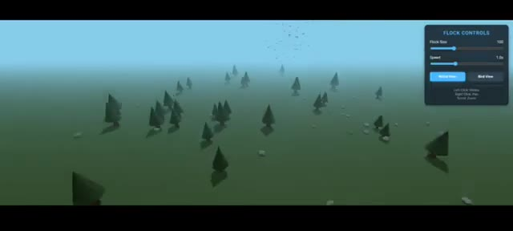
*Simulation 3D interactive d'une forêt avec des contrôles de vol pour les oiseaux affichés en haut à droite.*

---

### ⏱️ `[00:00:25 - 00:01:01]` | Segment #02

**🔊 Audio (Transcription Intégrale Mot pour Mot en Français) :**
> Ceci est Pursuing AI, et vous regardez The Research Report. Simulation 1. Simulation de main. Le premier test est une simulation de main. Les exigences sont strictes. Contrôle total de chaque doigt. Une main humaine réaliste. Des curseurs séparés pour chaque doigt. Un mouvement fluide et anatomiquement correct. Et un détail important. J'utilise de longs prompts détaillés, et non de courts prompts d'une ligne. D'abord, GLM 4.7. Il a généré 600 lignes de code, mais le résultat n'était qu'un écran noir, alors je lui ai redonné des instructions pour corriger le problème.

**👁️ Analyse Visuelle d'Écran (gemini-3.5-flash-lite) :**
**Interface & Outils** : Interface utilisateur de type site web d'actualité ou de notes de version IA (image 1), écran de présentation avec texte et modélisation 3D (image 2), et interface de type chat ou assistant de code GLM-4.7 sur fond sombre (image 3).

**Contenu textuel & Code** : Image 1 : "GPT-5.1: A smarter, more conversational ChatGPT", "We're upgrading GPT-5 while making it easier to customise in ChatGPT...". Image 2 : "Requirements", "• Full Control Of Every Finger". Image 3 : "Hi, Pursuing AI", texte de prompt détaillé avec "Create a highly realistic, interactive hand simulation...", options "Deep Think", "AI Slides", "Full Stack", "Magic Design", "Write Code", "Deep Research".

**Action / Démonstration** : Défilement des diapositives de présentation du projet de test de simulation de main avec différents modèles d'IA.

*Présentation des notes de version de GPT-5.1 avec le titre 'GPT-5.1: A smarter, more conversational ChatGPT' et une illustration animée d'un cerveau.*

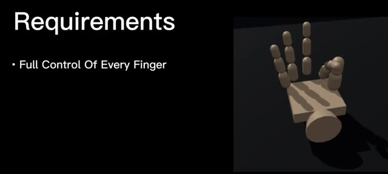
*Écran de présentation des exigences avec le titre 'Requirements' et 'Full Control Of Every Finger' à gauche, et une modélisation 3D basique d'une main articulée à droite.*

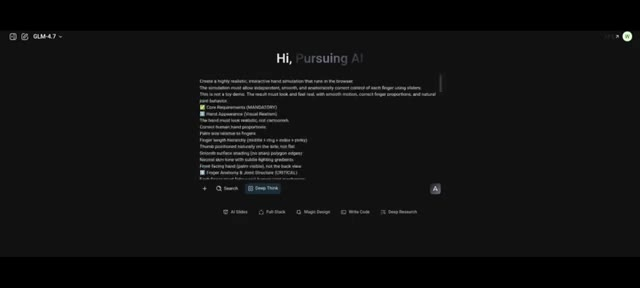
*Interface de l'outil GLM-4.7 montrant un long prompt détaillé adressé à l'IA pour créer une simulation de main interactive.*

---

### ⏱️ `[00:01:02 - 00:01:26]` | Segment #03

**🔊 Audio (Transcription Intégrale Mot pour Mot en Français) :**
> Voici le nouveau résultat. À première vue, ça n'a pas l'air réaliste. La main est montrée de dos, et honnêtement, ça ressemble à une commode. Mais testons la mécanique. Nous avons bien des curseurs pour chaque doigt. Les doigts se plient correctement, et le pouce bouge différemment des autres doigts, ce qui est anatomiquement correct. Visuellement c'est donc faible, mais la logique des articulations est bonne.

**👁️ Analyse Visuelle d'Écran (gemini-3.5-flash-lite) :**
**Interface & Outils** : Interface web de GLM-4.7 (modèle linguistique et de génération de code) avec un visualiseur 3D interactif et un panneau "Hand Controller" doté de curseurs pour chaque doigt (Thumb, Index Finger, Middle Finger, Ring Finger, Pinky Finger).

**Contenu textuel & Code** : Texte de prompt et de génération de code dans le panneau de gauche : instructions pour créer une simulation de main interactive et réaliste dans le navigateur, avec des exigences sur l'apparence, l'anatomie et la structure des articulations. Panneau de contrôle à droite avec des curseurs réglés sur 0%.

**Action / Démonstration** : Présentation de la simulation 3D d'une main modélisée géométriquement avec des curseurs permettant de contrôler individuellement chaque articulation des doigts.

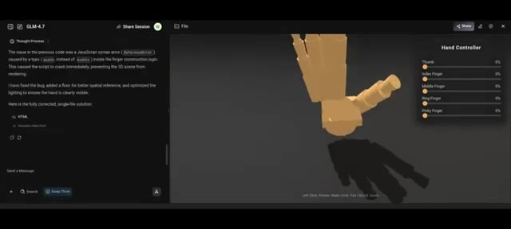
*Interface de GLM-4.7 montrant le panneau de code sur la gauche et un visualiseur 3D interactif d'une main avec un panneau de contrôle des doigts à droite.*

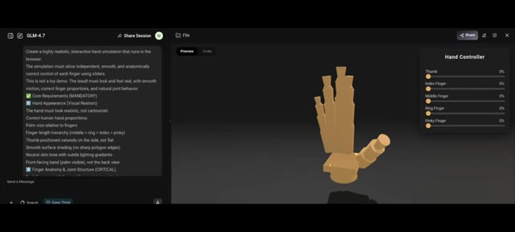
*Interface de GLM-4.7 affichant les instructions textuelles de simulation de main avec curseurs de contrôle des doigts.*

---

### ⏱️ `[00:01:26 - 00:02:00]` | Segment #04

**🔊 Audio (Transcription Intégrale Mot pour Mot en Français) :**
> Maintenant, c'est Gemini 3. Il a généré ceci en un seul prompt. La main a l'air réaliste. Le mouvement des doigts est correct. Le mouvement du pouce est également naturel. Ensuite, c'est GPT 5.2. La main a l'air réaliste. Le mouvement des doigts est fluide. Le seul inconvénient : le mouvement du pouce est légèrement décalé. C'est toujours bien, juste pas parfait. Opus 4.5. C'est Opus 4.5. Il génère une main blanche, mais les mouvements des doigts et du pouce sont corrects. Verdict de la simulation de main. Dans ce test, fermé

**👁️ Analyse Visuelle d'Écran (gemini-3.5-flash-lite) :**
**Interface & Outils** : Interface web de simulation et de contrôle de modélisation de mains en 3D (Hand Simulation / Hand Control).

**Contenu textuel & Code** : Panneaux de contrôle avec les libellés : Hand Controls / Finger Controls, Thumb, Index Finger, Middle Finger, Ring Finger, Pinky Finger, et des boutons de préréglage (Open, Flat, Point, Peace, Rock, OK).

**Action / Démonstration** : Le créateur présente différentes simulations et modèles 3D de mains générés par divers outils d'intelligence artificielle, en évaluant le réalisme des mouvements des doigts et du pouce.

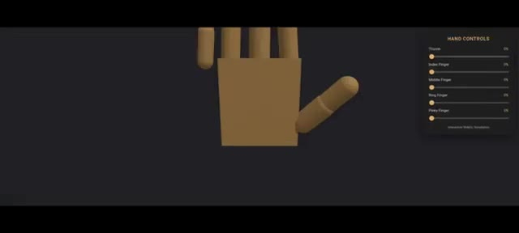
*Interface de simulation montrant une main modélisée en 3D avec un panneau de contrôle des doigts à droite.*

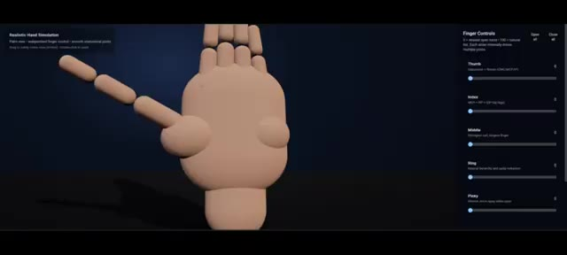
*Interface de simulation de main réaliste affichant une main 3D beige et des curseurs de contrôle pour chaque doigt.*

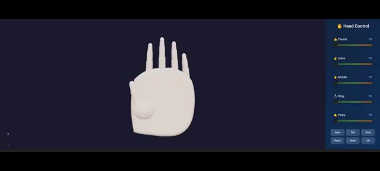
*Interface de simulation affichant une main blanche en 3D et un panneau de contrôle latéral avec des boutons de préréglage.*

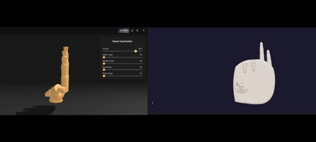
*Affichage comparatif en écran partagé de deux modèles de mains 3D avec leurs panneaux de contrôle respectifs.*

---

### ⏱️ `[00:02:00 - 00:02:33]` | Segment #05

**🔊 Audio (Transcription Intégrale Mot pour Mot en Français) :**
> les modèles sources performent clairement mieux que GLM 4.7. Prochain test, vol d'oiseaux en essaim. Exigences. Construit avec Three.js, comportement d'essaim réaliste. Curseurs pour la vitesse et le contrôle de l'essaim, environnement naturel avec arbres et végétation, mode caméra vue d'oiseau. C'est le résultat de GLM 4.7, le monde est beau, l'environnement est bien construit, le mouvement d'essaim est fluide et naturel en mode vue d'oiseau, la caméra est stable sans secousses, il y a aussi un menu de contrôle sur le côté.

**👁️ Analyse Visuelle d'Écran (gemini-3.5-flash-lite) :**
**Interface & Outils** : Application ou interface de démonstration 3D interactive utilisant Three.js avec un menu de configuration latéral 'Flock Settings'.

**Contenu textuel & Code** : Texte affiché : 'Requirements', 'Built Using Three.js', 'Realistic Flocking Behaviour', ainsi que les paramètres de l'essaim ('Separation', 'Alignment', 'Cohesion', 'Speed', 'Visual Range') et des curseurs de contrôle.

**Action / Démonstration** : Navigation et démonstration d'une simulation interactive en 3D d'un vol d'oiseaux en essaim, incluant l'affichage des exigences du test et des réglages via le menu latéral.

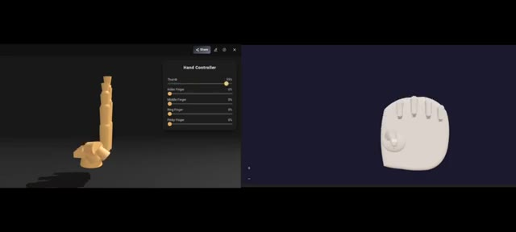
*Interface 3D montrant un contrôleur de main avec des curseurs de réglage pour les doigts.*

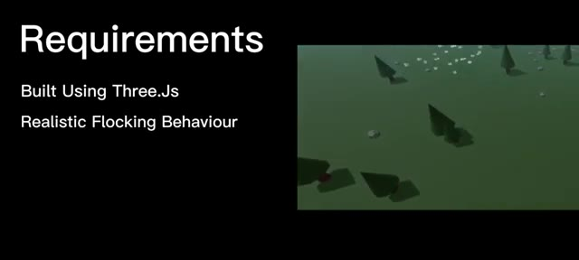
*Écran affichant les exigences du test avec le texte 'Requirements', 'Built Using Three.js', 'Realistic Flocking Behaviour'.*

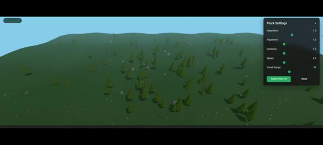
*Vue aérienne de l'environnement virtuel avec des arbres et un menu de réglages 'Flock Settings' sur le côté droit.*

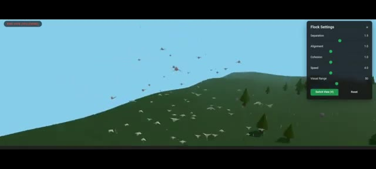
*Mode caméra vue d'oiseau montrant un groupe d'oiseaux volant au-dessus du paysage paysager.*

---

### ⏱️ `[00:02:34 - 00:02:53]` | Segment #06

**🔊 Audio (Transcription Intégrale Mot pour Mot en Français) :**
> Dans l'ensemble, ce résultat est solide. Maintenant, Gemini, l'environnement a l'air super, la logique de vol en essaim est correcte, mais la caméra vue d'oiseau est très instable, ce qui nuit à l'immersion. C'est Opus 4.5. Honnêtement, on dirait des poissons qui nagent dans le ciel. Les modèles d'oiseaux et la structure de l'essaim sont nettement pires.

**👁️ Analyse Visuelle d'Écran (gemini-3.5-flash-lite) :**
**Interface & Outils** : Interface de simulation 3D de vol d'oiseaux en essaim (Flocking Simulation) avec des panneaux de contrôle des paramètres sur le côté droit.

**Contenu textuel & Code** : Panneaux de configuration affichant des curseurs et des valeurs pour les paramètres d'essaim (Separation, Alignment, Cohesion, Speed, Visual Range, Bird Count, Steering Force, Wind, Turbulence) et des indicateurs de performance (FPS, nombre d'oiseaux).

**Action / Démonstration** : Navigation et affichage d'une simulation 3D interactive en temps réel démontrant le comportement de vol en essaim d'oiseaux au-dessus de paysages générés.

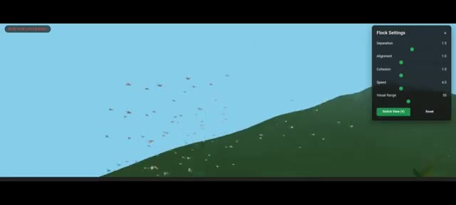
*Interface de simulation montrant un paysage vallonné vert et un ciel bleu avec des paramètres de vol en essaim à droite.*

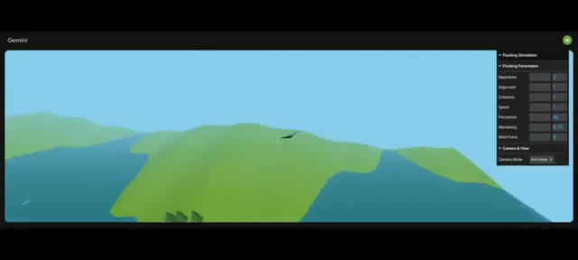
*Interface de simulation Gemini affichant des reliefs vallonnés, une rivière et un panneau de paramètres de vol en essaim sur le côté droit.*

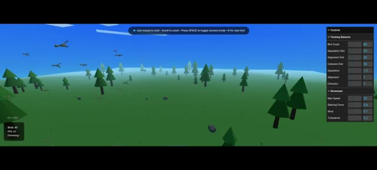
*Interface montrant une forêt stylisée avec des arbres en 3D low-poly et des oiseaux volant dans le ciel, ainsi qu'un panneau de contrôle des comportements d'essaim à droite.*

---

### ⏱️ `[00:02:53 - 00:03:13]` | Segment #07

**🔊 Audio (Transcription Intégrale Mot pour Mot en Français) :**
> Et enfin, GPT 5.2. Ce résultat est clairement pire. Je lui ai même redemandé d'améliorer le rendu, mais il a encore échoué. Verdict de la simulation d'envol d'oiseaux. Dans cette simulation, GLM 4.7 obtient les meilleurs résultats. Conclusion finale. Alors, quelle est la conclusion ? Dans la simulation de main, les modèles fermés gagnent encore.

**👁️ Analyse Visuelle d'Écran (gemini-3.5-flash-lite) :**
**Interface & Outils** : Interfaces de test de modèles d'IA (ChatGPT 5.2 et GLM-4.7) avec des environnements de simulation 3D interactifs dans le navigateur.

**Contenu textuel & Code** : Texte de prompt détaillé pour la simulation de main ("Create a highly realistic, interactive hand simulation..."), paramètres de contrôle des doigts ("Hand Controller" avec Thumb, Index Finger, etc.), et options de simulation de vol d'oiseaux.

**Action / Démonstration** : Présentation comparative des résultats de simulation entre différents modèles d'IA (ChatGPT 5.2 et GLM-4.7), en montrant les rendus visuels et les échecs ou réussites des prompts.

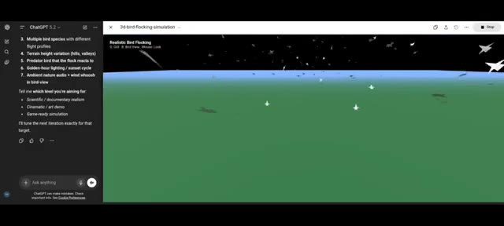
*Interface ChatGPT 5.2 affichant une simulation 3D de vol d'oiseaux avec des options de configuration textuelles.*

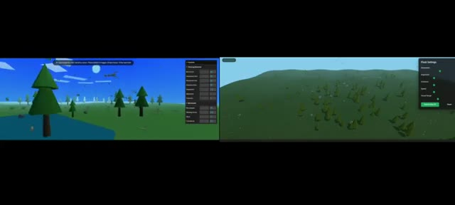
*Écran partagé comparant deux simulations 3D différentes de vol d'oiseaux avec des panneaux de paramètres de vol.*

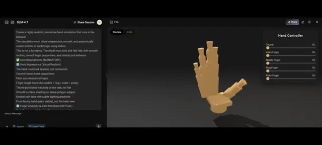
*Interface GLM-4.7 montrant le panneau de prévisualisation d'une simulation 3D de main humaine avec des curseurs de contrôle (Hand Controller).*

---

### ⏱️ `[00:03:14 - 00:03:25]` | Segment #08

**🔊 Audio (Transcription Intégrale Mot pour Mot en Français) :**
> En ce qui concerne le vol des oiseaux, GLM 4.7 domine. Cela signifie une chose. Les modèles open source offrent désormais une véritable concurrence directe aux modèles fermés.

**👁️ Analyse Visuelle d'Écran (gemini-3.5-flash-lite) :**
**Interface & Outils** : Interface web de GLM-4.7 (Chat / Session de partage) avec un volet de texte à gauche, une zone de prévisualisation 3D au centre et un panneau de contrôle "Hand Controller" à droite.

**Contenu textuel & Code** : Texte de prompt visible dans le panneau de gauche demandant de créer une simulation de main interactive hautement réaliste s'exécutant dans le navigateur ("Create a highly realistic, interactive hand simulation..."), avec des exigences de base, d'apparence et d'anatomie. À droite, le panneau de contrôle affiche des curseurs pour chaque doigt (Thumb, Index Finger, Middle Finger, Ring Finger, Pinky Finger) réglés sur 0%.

**Action / Démonstration** : Affichage d'une interface de démonstration interactive de GLM-4.7 générant un modèle 3D de main stylisée.

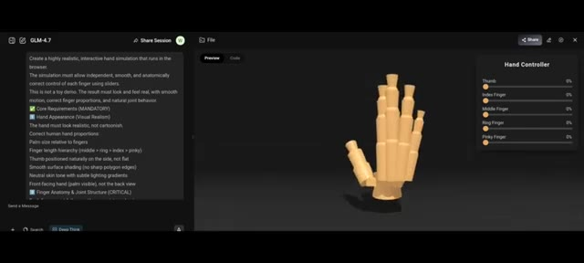
*Interface de GLM-4.7 montrant la simulation interactive d'une main 3D avec panneau de contrôle latéral.*

---
