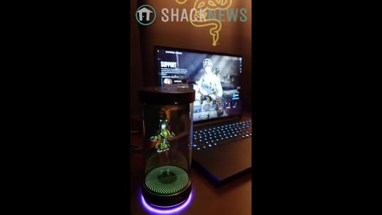
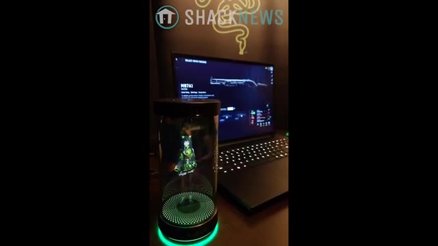

# 🎬 AI wifu is here | CES 2026

> **Chaîne** : [Pursuing AI](https://www.youtube.com/@PursuingAi)  
> **Titre original** : `AI wifu is here | CES 2026`  
> **Lien YouTube** : [https://www.youtube.com/watch?v=N5cWXftiq-g](https://www.youtube.com/watch?v=N5cWXftiq-g)  
> **Date de publication** : 2026-01-08  
> **Durée** : 04m 11s (`251s`)  
> **Identifiant vidéo** : `N5cWXftiq-g`  
> **Fiche Web Interactive** : [2026-01-08_YT-N5cWXftiq-g_AI wifu is here CES 2026_by-whisper-v3-large-turbo+gemini-3.5-flash-lite.html](2026-01-08_YT-N5cWXftiq-g_AI wifu is here CES 2026_by-whisper-v3-large-turbo+gemini-3.5-flash-lite.html)  
> **Captures de démonstration clés** : `2 captures réelles (anti-talking-head)`  
> **Modèles utilisés** : Audio: `large-v3-turbo` (Faster-Whisper int8 VPS) | Vision: `gemini-3.5-flash-lite` (Google AI Studio API)  

---

## 📌 Synthèse Exécutive & Outils

### 📌 Résumé
Dans ce tutoriel complet intitulé **AI wifu is here | CES 2026**, le créateur présente les techniques de pointe pour maîtriser la génération de vidéos et de visuels par intelligence artificielle.

### 🛠️ Outils, Modèles & Logiciels Présentés
- **Modèles vidéo IA** : Génération de plans cinématiques.
- **Outils de prompt** : Structuration avancée des descriptions visuelles.

### 🔑 Points Clés & Enseignements Stratégiques
- Structurer ses prompts de mouvement avec des termes de caméra précis.
- Soigner la cohérence des personnages entre chaque plan.
- Exploiter les modèles de dernière génération pour un rendu professionnel.

---

## ⏱️ Chronologie & Transcription Complète Audio & Visuelle (Mot pour Mot)

### ⏱️ `[00:00:00 - 00:00:28]` | Segment #01

**🔊 Audio (Transcription Intégrale Mot pour Mot en Français) :**
> Your AI assistant just escaped a chat window. And no, this isn't another useless chatbot with a new coat of paint. This one watches your screen, reacts to your mistakes, and lives on your desk like a sentient RGB tamagotchi. This is Pursuing AI, and you are watching the research report. At CES 2026, Razer quietly stole the spotlight with Project AVA, a physical AI companion that feels less like software and more like an object you're eventually going to argue with.

**👁️ Analyse Visuelle d'Écran (gemini-3.5-flash-lite) :**
**Interface & Outils** : le créateur face caméra ou transition sans partage d'écran.

**Contenu textuel & Code** : Explications orales des concepts et des méthodes de création vidéo IA.

**Action / Démonstration** : Démonstration pédagogique et présentation du workflow.

---

### ⏱️ `[00:00:28 - 00:00:49]` | Segment #02

**🔊 Audio (Transcription Intégrale Mot pour Mot en Français) :**
> Le Projet AVA est un appareil de bureau qui projette un avatar holographique 3D en temps réel à l'intérieur d'un cylindre transparent. Il suit le contact visuel, anime les expressions faciales, synchronise les mouvements des lèvres avec précision et répond avec une latence quasi nulle. En d'autres termes, il ne s'agit pas d'un GIF animé préenregistré. C'est une présence IA en direct.

**👁️ Analyse Visuelle d'Écran (gemini-3.5-flash-lite) :**
**Interface & Outils** : Présentation de démonstration matérielle (Project AVA) sans interface logicielle active à l'écran.

**Contenu textuel & Code** : Aucun texte, prompt ou paramètre visible à l'écran.

**Action / Démonstration** : Présentation du dispositif matériel cylindrique affichant différents avatars holographiques et interactions avec un utilisateur.

---

### ⏱️ `[00:00:49 - 00:01:12]` | Segment #03

**🔊 Audio (Transcription Intégrale Mot pour Mot en Français) :**
> And yes, it can see your screen. When plugged into a Windows PC over USB-C, AVA enters vision mode, meaning it analyzes whatever you're doing in real time. Games, work, tabs you forgot to close, all fair game. During demos, it provided live gameplay feedback, strategy suggestions, and commentary that felt suspiciously like backseat gaming with infinite context.

**👁️ Analyse Visuelle d'Écran (gemini-3.5-flash-lite) :**
**Interface & Outils** : le créateur face caméra ou transition sans partage d'écran.

**Contenu textuel & Code** : Explications orales des concepts et des méthodes de création vidéo IA.

**Action / Démonstration** : Démonstration pédagogique et présentation du workflow.

---

### ⏱️ `[00:01:12 - 00:01:35]` | Segment #04

**🔊 Audio (Transcription Intégrale Mot pour Mot en Français) :**
> RPGs? Baldur's Gate 3 snagged a labor of love. Deep story, epic quests at minus 25% off. Dive in. You'll love the roleplay magic. Grab it. Maybe we'll buy that game later, but I think right now we're going to jump into a game of Battlefield. I really like playing the support class. Can you make a loadout recommendation?

**👁️ Analyse Visuelle d'Écran (gemini-3.5-flash-lite) :**
**Interface & Outils** : le créateur face caméra ou transition sans partage d'écran.

**Contenu textuel & Code** : Explications orales des concepts et des méthodes de création vidéo IA.

**Action / Démonstration** : Démonstration pédagogique et présentation du workflow.

---

### ⏱️ `[00:01:39 - 00:02:00]` | Segment #05

**🔊 Audio (Transcription Intégrale Mot pour Mot en Français) :**
> La classe de soutien assure. L'Accord 6P 67 avec un frein de bouche à recul, une poignée verticale, un canon léger, une optique tactique 1-2, un faisceau laser en visant en pas de côté, une paire de boîtes de munitions comme gadget pour des recharges infinies. Écrasez-tout. Je voulais vraiment aller au corps à corps, donc j'ai ce fusil à pompe M87A1.

**👁️ Analyse Visuelle d'Écran (gemini-3.5-flash-lite) :**
**Interface & Outils** : Écran de personnalisation des classes d'un jeu vidéo sur ordinateur portable.

**Contenu textuel & Code** : Le mot "SUPPORT" visible à l'écran, un personnage en équipement militaire, ainsi qu'un appareil cylindrique avec des LED vertes et violettes.

**Action / Démonstration** : Présentation du chargement de la classe de soutien sur un écran d'ordinateur à côté d'un gadget lumineux cylindrique.

*Un ordinateur portable affichant l'écran de chargement de la classe de soutien d'un jeu vidéo, avec au premier plan un cylindre lumineux futuriste affichant un hologramme et le logo "SHACKNEWS" en haut.*

---

### ⏱️ `[00:02:00 - 00:02:34]` | Segment #06

**🔊 Audio (Transcription Intégrale Mot pour Mot en Français) :**
> Peux-tu m'aider à l'équiper ? M870A1 pour les combats rapprochés, chargeur étendu clipsé, visée laser, poignée verticale, et des munitions à balle unique pour des tirs percutants à mi-distance. Reste mobile, élimine les bêtes de feu, prêt pour le nettoyage de pièces. Merci, Kira. Une dernière question. On commence à avoir faim. Tu aurais de bonnes recommandations pour manger à Las Vegas ce soir ? C'est Kira, mais ne t'inquiète pas. Pour manger à Vegas, va au Gordon Ramsay Hell's Kitchen sur le Strip. Le paradis du steak ou Lotus of Siam pour

**👁️ Analyse Visuelle d'Écran (gemini-3.5-flash-lite) :**
**Interface & Outils** : Interface de jeu vidéo montrant les statistiques et accessoires d'une arme (M870A1).

**Contenu textuel & Code** : Texte affichant « M870A1 », des options d'équipement d'armes et le logo « SHACKNEWS » en haut de l'écran.

**Action / Démonstration** : Présentation d'un setup de jeu avec un ordinateur portable et un cylindre holographique interactif.

*Un écran d'ordinateur portable affichant le menu d'équipement d'une arme (M870A1) aux côtés d'un dispositif holographique cylindrique éclairé en vert.*

---

### ⏱️ `[00:02:34 - 00:02:52]` | Segment #07

**🔊 Audio (Transcription Intégrale Mot pour Mot en Français) :**
> Tie. Fuel up and game on. Under the hood, Ava currently runs on XAI's Grok model, which gives it conversational reasoning, memory, and contextual awareness. Razor has confirmed the AI layer is modular so this isn't locked to one model forever, but Grok is the brain right now.

**👁️ Analyse Visuelle d'Écran (gemini-3.5-flash-lite) :**
**Interface & Outils** : le créateur face caméra ou transition sans partage d'écran.

**Contenu textuel & Code** : Explications orales des concepts et des méthodes de création vidéo IA.

**Action / Démonstration** : Démonstration pédagogique et présentation du workflow.

---

### ⏱️ `[00:02:52 - 00:03:13]` | Segment #08

**🔊 Audio (Transcription Intégrale Mot pour Mot en Français) :**
> The part that made the internet lose its mind though are the avatars. Ava isn't a single assistant, you can swap personalities and characters including anime-styled companions, productivity-focused assistants, and even licensed personas like eSports legend Faker. Each one has distinct behavior, tone, and expressions, which is exactly how we ended up here.

**👁️ Analyse Visuelle d'Écran (gemini-3.5-flash-lite) :**
**Interface & Outils** : le créateur face caméra ou transition sans partage d'écran.

**Contenu textuel & Code** : Explications orales des concepts et des méthodes de création vidéo IA.

**Action / Démonstration** : Démonstration pédagogique et présentation du workflow.

---

### ⏱️ `[00:03:13 - 00:03:34]` | Segment #09

**🔊 Audio (Transcription Intégrale Mot pour Mot en Français) :**
> Razer is very deliberately not calling this a gaming accessory. They're marketing it as a long-term AI companion, something that helps with productivity, planning, translation, brainstorming, and daily workflows while maintaining a persistent visual identity. Which is a very polite way of saying, please don't get emotionally attached to the glowing hologram.

**👁️ Analyse Visuelle d'Écran (gemini-3.5-flash-lite) :**
**Interface & Outils** : le créateur face caméra ou transition sans partage d'écran.

**Contenu textuel & Code** : Explications orales des concepts et des méthodes de création vidéo IA.

**Action / Démonstration** : Démonstration pédagogique et présentation du workflow.

---

### ⏱️ `[00:03:34 - 00:03:53]` | Segment #10

**🔊 Audio (Transcription Intégrale Mot pour Mot en Français) :**
> As of CES 2026, Project AVA is still labeled a concept, but reservations are already live with a $20 refundable deposit, and Razer expects shipments in the second half of 2026. Pricing hasn't been announced yet, but nobody should expect this to be cheap. This is premium hardware plus an always-on AI stack.

**👁️ Analyse Visuelle d'Écran (gemini-3.5-flash-lite) :**
**Interface & Outils** : le créateur face caméra ou transition sans partage d'écran.

**Contenu textuel & Code** : Explications orales des concepts et des méthodes de création vidéo IA.

**Action / Démonstration** : Démonstration pédagogique et présentation du workflow.

---

### ⏱️ `[00:03:54 - 00:04:10]` | Segment #11

**🔊 Audio (Transcription Intégrale Mot pour Mot en Français) :**
> And that's why Project Ava actually matters. This isn't about better models or bigger benchmarks. It's about AI crossing a psychological line, leaving the browser and becoming something with presence, something you look at, something that reacts before you ask. This has been the Research Report.

**👁️ Analyse Visuelle d'Écran (gemini-3.5-flash-lite) :**
**Interface & Outils** : le créateur face caméra ou transition sans partage d'écran.

**Contenu textuel & Code** : Explications orales des concepts et des méthodes de création vidéo IA.

**Action / Démonstration** : Démonstration pédagogique et présentation du workflow.

---
