# 🎬 ELLE VEUT TOUT ÇA : La techno la plus folle du CES 2026 (Ongles E-Ink)

> **Chaîne** : [Pursuing AI](https://www.youtube.com/@PursuingAi)  
> **Titre original** : `YOUR GIRLFRIEND WANTS THIS: The Craziest CES 2026 Tech (E-Ink Nails)`  
> **Lien YouTube** : [https://www.youtube.com/watch?v=aoDtfg52NPI](https://www.youtube.com/watch?v=aoDtfg52NPI)  
> **Date de publication** : 2026-01-13  
> **Durée** : 03m 35s (`215s`)  
> **Identifiant vidéo** : `aoDtfg52NPI`  
> **Fiche Web Interactive** : [2026-01-13_YT-aoDtfg52NPI_ELLE VEUT TOUT ÇA La techno la plus folle du CES 2026 (Ongles E-Ink)_by-whisper-v3-large-turbo+gemini-3.5-flash-lite.html](2026-01-13_YT-aoDtfg52NPI_ELLE VEUT TOUT ÇA La techno la plus folle du CES 2026 (Ongles E-Ink)_by-whisper-v3-large-turbo+gemini-3.5-flash-lite.html)  
> **Captures de démonstration clés** : `12 captures réelles (anti-talking-head)`  
> **Modèles utilisés** : Audio: `large-v3-turbo` (Faster-Whisper int8 VPS) | Vision: `gemini-3.5-flash-lite` (Google AI Studio API)  

---

## 📌 Synthèse Exécutive & Outils

### 📌 Résumé
Dans ce tutoriel complet intitulé **ELLE VEUT TOUT ÇA : La techno la plus folle du CES 2026 (Ongles E-Ink)**, le créateur présente les techniques de pointe pour maîtriser la génération de vidéos et de visuels par intelligence artificielle.

### 🛠️ Outils, Modèles & Logiciels Présentés
- **Modèles vidéo IA** : Génération de plans cinématiques.
- **Outils de prompt** : Structuration avancée des descriptions visuelles.

### 🔑 Points Clés & Enseignements Stratégiques
- Structurer ses prompts de mouvement avec des termes de caméra précis.
- Soigner la cohérence des personnages entre chaque plan.
- Exploiter les modèles de dernière génération pour un rendu professionnel.

---

## ⏱️ Chronologie & Transcription Complète Audio & Visuelle (Mot pour Mot)

### ⏱️ `[00:00:00 - 00:00:20]` | Segment #01

**🔊 Audio (Transcription Intégrale Mot pour Mot en Français) :**
> Et si je vous disais que vous pouviez changer la couleur de vos ongles de la même manière que vous changez de skin dans un jeu vidéo ? Pas de vernis, pas de désordre, pas d'attente. Vous tapez sur une application, boum, nouvelle couleur débloquée. Ce n'est pas de la science-fiction. C'est apparu au CES 2026. Et oui, ce sont de vrais ongles.

**👁️ Analyse Visuelle d'Écran (gemini-3.5-flash-lite) :**
**Interface & Outils** : Application mobile de personnalisation de couleur d'ongles (iPOLISH) sur smartphone.

**Contenu textuel & Code** : Interface de sélection de teintes de vert sous forme de grille de vignettes de couleurs, avec un aperçu de palette dégradée en haut.

**Action / Démonstration** : Une personne manipule l'application mobile pour choisir et appliquer une nouvelle couleur (vert olive/pastel) sur les faux ongles connectés.

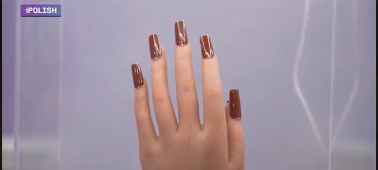
*Gros plan sur une main artificielle présentant des ongles longs et vernis en marron brillant avec le logo iPOLISH en haut à gauche.*

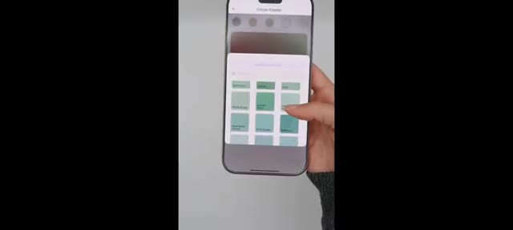
*Utilisation d'une application mobile sur smartphone permettant de sélectionner une palette de couleurs vertes pour les ongles.*

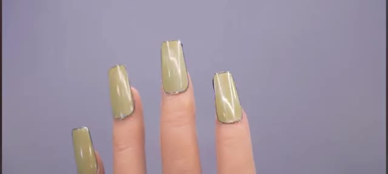
*Gros plan sur la main montrant les ongles dont la couleur a changé pour un ton vert clair pastel.*

---

### ⏱️ `[00:00:20 - 00:00:38]` | Segment #02

**🔊 Audio (Transcription Intégrale Mot pour Mot en Français) :**
> Mais c'est une pure démonstration technologique. Avant que vous ne quittiez la vidéo en vous disant, mec, pourquoi des ongles ? Ou pourquoi est-ce que ma petite amie va coûter plus cher ? Pause. Parce qu'il ne s'agit pas de mode. Il s'agit d'écrans portables, de technologie e-paper, et du futur du matériel informatique personnel.

**👁️ Analyse Visuelle d'Écran (gemini-3.5-flash-lite) :**
**Interface & Outils** : Présentation physique et démonstration de matériel technologique vestimentaire (e-ink/affichage sur ongles).

**Contenu textuel & Code** : Marquage de la marque « iPolish » visible sur les boîtes et les instructions d'utilisation.

**Action / Démonstration** : Manipulation d'un kit de faux ongles connectés et présentation des composants du coffret.

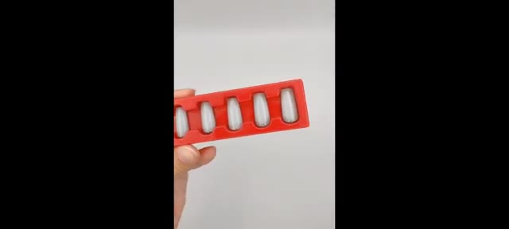
*Gros plan sur une main tenant un support rouge contenant des faux ongles intelligents à technologie e-ink.*

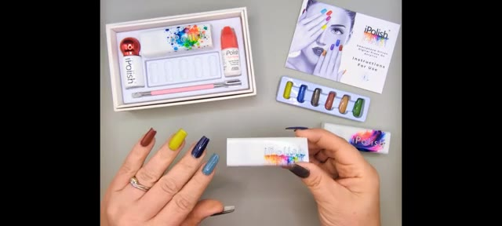
*Vue de dessus d'un kit complet de faux ongles personnalisables « iPolish » avec accessoires et boîtiers de contrôle.*

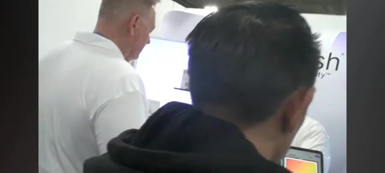
*Présentation en salon ou en stand d'exposition du produit de technologie vestimentaire « iPolish ».*

---

### ⏱️ `[00:00:39 - 00:01:01]` | Segment #03

**🔊 Audio (Transcription Intégrale Mot pour Mot en Français) :**
> C'est Pursuing AI, et vous regardez le Research Report. Rencontrez Eye Polish, l'entreprise qui vient de transformer les ongles en surfaces programmables. Eye Polish n'est pas du vernis à ongles. Ce sont de faux ongles intelligents avec une technologie de couleur numérique intégrée. Vous les mettez une seule fois. Après cela, vous pouvez basculer entre plus de 400 couleurs grâce à une application mobile.

**👁️ Analyse Visuelle d'Écran (gemini-3.5-flash-lite) :**
**Interface & Outils** : Interface graphique de l'application mobile iPolish sur boîte et tablette tactile de démonstration.

**Contenu textuel & Code** : Textes visibles : "The Research Report", "iPolish", "Fashion at Your Fingertips", palettes de couleurs sur écran.

**Action / Démonstration** : Présentation de la boîte du produit puis démonstration d'utilisatrices interagissant avec l'application de sélection des couleurs.

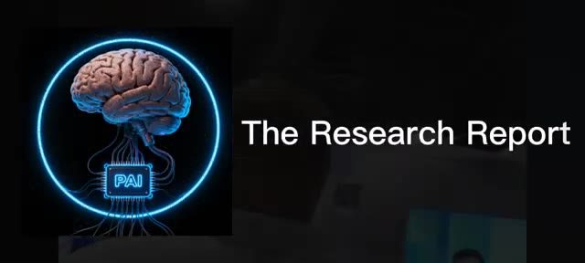
*Logo de la chaîne Pursuing AI avec un cerveau cybernétique et le titre The Research Report.*

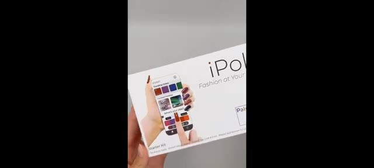
*Boîte du produit 'iPolish' montrant l'application mobile de contrôle des couleurs sur l'emballage.*

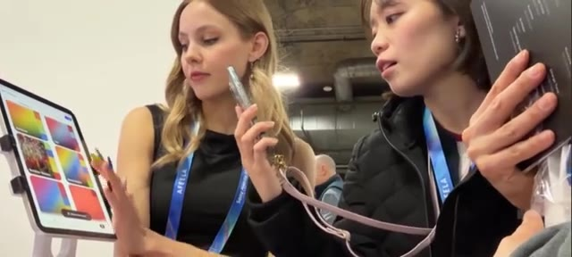
*Deux femmes dans un salon ou événement testant une tablette tactile affichant des palettes de couleurs pour les ongles.*

---

### ⏱️ `[00:01:02 - 00:01:22]` | Segment #04

**🔊 Audio (Transcription Intégrale Mot pour Mot en Français) :**
> Rouge, noir, chrome, néon, mat, instantané. Pas de ré-application, pas de dissolvant, non, chéri, tu peux attendre 30 minutes ? C'est déjà fou. Mais voici où ça devient dingue. À l'intérieur de chaque ongle se trouve un nanomatériau electrophorétique. Le même principe que celui utilisé dans les écrans e-ink des Kindle.

**👁️ Analyse Visuelle d'Écran (gemini-3.5-flash-lite) :**
**Interface & Outils** : Présentation vidéo de matériel physique (kit iPolish) et d'un écran de liseuse e-ink (Kindle).

**Contenu textuel & Code** : Texte du kit "iPolish - Smartphone-Driven Digital Press-On Acrylics" et page de livre numérique sur Kindle avec le titre "INCOMPARABLE ARROGANCE" et des annotations manuscrites ("What? That's kind of crazy, But in a cool way?").

**Action / Démonstration** : Manipulation d'un accessoire iPolish sur les ongles, présentation à plat du kit de manucure, puis affichage de l'écran d'une liseuse électronique pour illustrer la technologie des nanomatériaux.

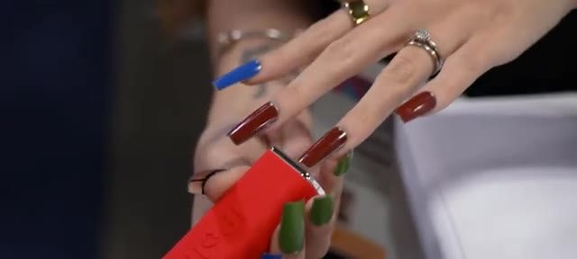
*Démonstration du produit iPolish avec un outil de couleur appliqué sur les ongles.*

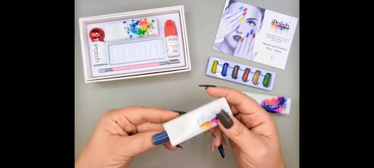
*Présentation du kit complet iPolish avec ses accessoires et emballages.*

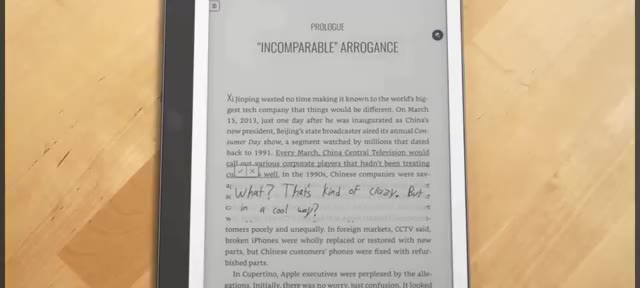
*Gros plan sur une liseuse numérique Kindle montrant du texte électronique et des annotations manuscrites.*

---

### ⏱️ `[00:01:22 - 00:01:43]` | Segment #05

**🔊 Audio (Transcription Intégrale Mot pour Mot en Français) :**
> Instead of light, it uses electric charge to move pigment particles. Translation? No battery inside the nail. No heat. No constant power. So yes, your girlfriend now has digital nails and somehow they're more energy efficient than your gaming PC. What? Bro, what are you talking about man?

**👁️ Analyse Visuelle d'Écran (gemini-3.5-flash-lite) :**
**Interface & Outils** : le créateur face caméra ou transition sans partage d'écran.

**Contenu textuel & Code** : Explications orales des concepts et des méthodes de création vidéo IA.

**Action / Démonstration** : Démonstration pédagogique et présentation du workflow.

---

### ⏱️ `[00:01:43 - 00:02:16]` | Segment #06

**🔊 Audio (Transcription Intégrale Mot pour Mot en Français) :**
> You use a small activation one for a few seconds. The color updates and then it stays there permanently until you change it again. That's not makeup. That's low-power display engineering. Think about it. LEDs used to live on walls. Now they're on wrists. Screens used to sit on desks. Now they live in pockets. Next step? Your body becomes the interface. These nails are basically a prototype for wearable skins. A test run for customizable surfaces. Early tech that

**👁️ Analyse Visuelle d'Écran (gemini-3.5-flash-lite) :**
**Interface & Outils** : le créateur face caméra ou transition sans partage d'écran.

**Contenu textuel & Code** : Explications orales des concepts et des méthodes de création vidéo IA.

**Action / Démonstration** : Démonstration pédagogique et présentation du workflow.

---

### ⏱️ `[00:02:16 - 00:02:43]` | Segment #07

**🔊 Audio (Transcription Intégrale Mot pour Mot en Français) :**
> could move to rings, watches, controllers, even game gear. Today it's nails. Tomorrow, color-changing controller shells, mood-based wearables, status indicators on your hand like a HUD. At this point, your hands are a UI and your wallet is a loading screen. Let's be real, this isn't cheap. The starter kit is around $95. Replacement nails cost a few dollars each. So now, this isn't for everyone.

**👁️ Analyse Visuelle d'Écran (gemini-3.5-flash-lite) :**
**Interface & Outils** : le créateur face caméra ou transition sans partage d'écran.

**Contenu textuel & Code** : Explications orales des concepts et des méthodes de création vidéo IA.

**Action / Démonstration** : Démonstration pédagogique et présentation du workflow.

---

### ⏱️ `[00:02:43 - 00:03:19]` | Segment #08

**🔊 Audio (Transcription Intégrale Mot pour Mot en Français) :**
> This is for people who like new tech, weird gadgets, being first, and flexing something nobody else understands yet, especially while explaining it at dinner. CES isn't about what you buy today. It's about what becomes normal in five years. Touchscreens were once a demo. Smartwatches were once laughed at. Now, look. Eye Polish isn't selling nails. They're selling a concept. Your appearance can be software. So yeah, call them nails. Laugh if you want, but remember this moment because when color changing wearables become normal,

**👁️ Analyse Visuelle d'Écran (gemini-3.5-flash-lite) :**
**Interface & Outils** : le créateur face caméra ou transition sans partage d'écran.

**Contenu textuel & Code** : Explications orales des concepts et des méthodes de création vidéo IA.

**Action / Démonstration** : Démonstration pédagogique et présentation du workflow.

---

### ⏱️ `[00:03:19 - 00:03:34]` | Segment #09

**🔊 Audio (Transcription Intégrale Mot pour Mot en Français) :**
> this was one of the first steps. If this blew your mind even a little, drop a comment and tell me, would you wear tech like this or is this too far? And also, why is your pocket already empty? Subscribe because this future is coming fast.

**👁️ Analyse Visuelle d'Écran (gemini-3.5-flash-lite) :**
**Interface & Outils** : le créateur face caméra ou transition sans partage d'écran.

**Contenu textuel & Code** : Explications orales des concepts et des méthodes de création vidéo IA.

**Action / Démonstration** : Démonstration pédagogique et présentation du workflow.

---
