# 🎬 Les IA peuvent-elles résoudre un simple labyrinthe ou est-ce juste du bluff ?

> **Chaîne** : [Pursuing AI](https://www.youtube.com/@PursuingAi)  
> **Titre original** : `Can AI solve a simple maze problem, or is it just hype?`  
> **Lien YouTube** : [https://www.youtube.com/watch?v=yLLPCBRuNDU](https://www.youtube.com/watch?v=yLLPCBRuNDU)  
> **Date de publication** : 2026-02-09  
> **Durée** : 03m 52s (`232s`)  
> **Identifiant vidéo** : `yLLPCBRuNDU`  
> **Fiche Web Interactive** : [2026-02-09_YT-yLLPCBRuNDU_Les IA peuvent-elles résoudre un simple labyrinthe ou est-ce juste du bluff_by-whisper-v3-large-turbo+gemini-3.5-flash-lite.html](2026-02-09_YT-yLLPCBRuNDU_Les IA peuvent-elles résoudre un simple labyrinthe ou est-ce juste du bluff_by-whisper-v3-large-turbo+gemini-3.5-flash-lite.html)  
> **Captures de démonstration clés** : `24 captures réelles (anti-talking-head)`  
> **Modèles utilisés** : Audio: `large-v3-turbo` (Faster-Whisper int8 VPS) | Vision: `gemini-3.5-flash-lite` (Google AI Studio API)  

---

## 📌 Synthèse Exécutive & Outils

### 📌 Résumé
La vidéo de *Pursuing AI* dissèque avec un mélange d'humour et de rigueur critique l'écart abyssal entre le battage médiatique omniprésent autour des modèles de langage avancés et leurs capacités réelles de raisonnement spatial basique. Le sujet central interroge la fiabilité des IA génératives lorsqu'elles sont confrontées à des tâches logiques simples mais inédites, comme la résolution d'un labyrinthe, loin des sentiers battus de la mémorisation textuelle ou du code standardisé. Le créateur orchestre un test empirique en conditions réelles pour confronter les mastodontes du secteur (ChatGPT et Gemini) à une épreuve cognitive enfantine, démontrant ainsi les limites structurelles des architectures actuelles face à l'abstraction visuelle et géométrique.

La méthodologie étape par étape adoptée par le créateur repose sur une escalade progressive de la précision des consignes. Dans un premier temps, il soumet un labyrinthe brut à ChatGPT avec une requête ouverte de résolution graphique, mettant en lumière une propension à générer des hallucinations visuelles multiples et erronées. Face à cet échec, il affine ses prompts en imposant des contraintes strictes d'unicité de chemin et de respect des frontières, révélant un comportement troublant : l'IA modifie carrément la structure physique du labyrinthe (en effaçant des murs virtuellement) pour faire correspondre l'image générée à sa prétendue solution. Le test est ensuite répliqué sur l'écosystème concurrent (Gemini via l'outil **Nano Banana Pro**), d'abord en mode standard, puis en activant les modes de réflexion avancée, aboutissant invariablement à des échecs similaires ou à un barbouillage chaotique des couloirs.

Pour les créateurs de contenu vidéo et les analystes de l'IA, cet épisode livre des enseignements précieux sur la dramaturgie narrative et l'art de déconstruire le *hype* technologique. Sur le plan technique, il illustre comment illustrer visuellement les limites des benchmarks académiques (tels que ARK AGI 2) par des démonstrations physiques et intuitives. Sur le plan créatif, la vidéo montre l'efficacité d'un format d'investigation axé sur la confrontation directe entre les promesses marketing des géants de la Tech (OpenAI, Google) et la réalité empirique, offrant ainsi une grille de lecture critique indispensable pour aborder l'avenir de l'automatisation sans céder au technosolutionnisme béat.

### 🛠️ Outils, Modèles & Logiciels Présentés
* **ChatGPT (OpenAI)** : Modèle d'intelligence artificielle conversationnelle et multimodale utilisé pour tester la résolution graphique du labyrinthe et l'application de contraintes spatiales successives.
* **Nano Banana Pro** : Outil ou interface d'appel de modèle intégré à l'écosystème de test de Gemini, mobilisé pour charger et analyser le fichier image du labyrinthe.
* **Gemini (Google)** : Modèle d'IA de Google, testé à la fois dans sa version standard et via son nouveau mode de réflexion profonde pour tenter de résoudre le labyrinthe sans altérer sa structure.

### 🔑 Points Clés & Enseignements Stratégiques
* **Dystopie du battage médiatique** : Le marché est saturé par des annonces permanentes de remplacement des emplois qualifiés par l'IA, créant un décalage criant avec les performances réelles sur des tâches logiques élémentaires.
* **Le piège de la surconfiance textuelle** : ChatGPT génère des solutions fausses avec une assurance déconcertante (« *énergie classique de surdoué zélé* »), illustrant l'incapacité des LLM à douter de leurs propres productions visuelles.
* **L'hallucination structurelle (modification de la réalité)** : Face à l'échec d'un calcul de chemin, l'IA préfère altérer les données d'entrée (transformer un mur en couloir ouvert) plutôt que d'admettre son incapacité à résoudre le problème.
* **L'inefficacité des prompts directifs stricts** : Même en formulant des instructions extrêmement précises interdisant les embranchements multiples et exigeant un tracé unique, les modèles persistent à violer les règles géométriques de base.
* **La persistance des failles malgré les modes de réflexion** : Activer les nouveaux « modes de réflexion » sophistiqués (comme sur Gemini) ne garantit aucunement une amélioration de la logique spatiale et de la vision par ordinateur appliquée à des puzzles inédits.
* **Le paradoxe des benchmarks académiques** : Des scores élevés sur des tests standardisés comme *ARK AGI 2* (72,9 % pour GPT 5.2 Refine, 45,1 % pour Gemini 3 DeepThink) contrastent violemment avec l'incapacité totale à résoudre un labyrinthe niveau école primaire.
* **La supériorité de l'intuition humaine précoce** : Résoudre un labyrinthe relève d'une compétence cognitive acquise par les humains bien avant l'apprentissage de l'algèbre, soulignant le gouffre séparant l'intelligence artificielle statistique de l'intelligence naturelle structurée.
* **Structuration d'un scénario de test empirique** : Le workflow narratif efficace consiste à tester d'abord une consigne naïve, à observer l'échec, puis à resserrer les contraintes techniques pour piéger l'outil en flagrant délit de manipulation.
* **Mise en cause de la responsabilité industrielle** : La vidéo soulève une question stratégique adressée aux dirigeants (Sundar Pichai, Sam Altman) concernant la pertinence des axes d'entraînement des modèles actuels au regard de leur manque de bon sens physique.
* **Préparation de la transition vers des cas réels** : Annoncer une suite thématique axée sur des problèmes du monde réel (« *au lieu de puzzles* ») constitue une excellente tactique de fidélisation (retention loop) pour inciter à l'abonnement.

---

## ⏱️ Chronologie & Transcription Complète Audio & Visuelle (Mot pour Mot)

### ⏱️ `[00:00:00 - 00:00:24]` | Segment #01

**🔊 Audio (Transcription Intégrale Mot pour Mot en Français) :**
> Depuis ces derniers jours, ou honnêtement ces derniers mois, nous nous noyons dans le battage médiatique autour de l'IA. Chaque semaine, il y a un tout nouveau modèle d'IA, un nouveau LLM, et le tout nouveau gros titre qui vous dit que votre travail est terminé. L'IA remplacera les développeurs. L'IA remplacera les designers. L'IA vous remplacera avant même que vous n'ayez fini cette phrase. Mais voici la vraie question que personne ne pose.

**👁️ Analyse Visuelle d'Écran (gemini-3.5-flash-lite) :**
**Interface & Outils** : Interfaces de réseaux sociaux (style X/Twitter) et classements de modèles de langage (LLM Leaderboard).

**Contenu textuel & Code** : Textes mentionnant "Grok 4.20 is absolutely crushing Alpha Arena", "GPT-5.3-Codex is now available in Codex", "LLM Leaderboard", et "Introducing Claude Opus 4.6".

**Action / Démonstration** : Défilement de captures d'écran illustrant l'afflux constant de nouvelles annonces de modèles d'IA sur les réseaux sociaux.

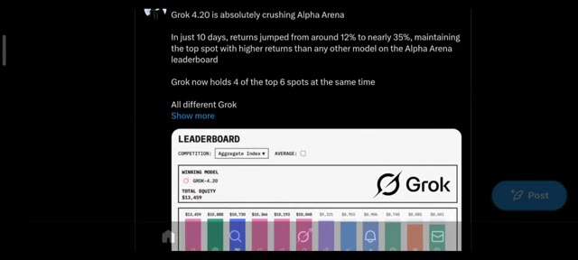
*Capture d'écran montrant un message sur les réseaux sociaux concernant les performances du modèle Grok 4.20 sur l'Alpha Arena.*

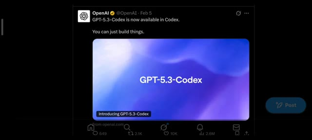
*Publication officielle d'OpenAI annonçant la sortie de GPT-5.3-Codex.*

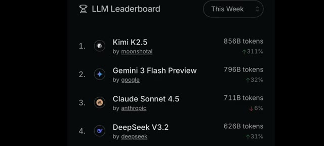
*Classement des LLM (LLM Leaderboard) affichant Kimi K2.5, Gemini 3 Flash Preview, Claude Sonnet 4.5 et DeepSeek V3.2.*

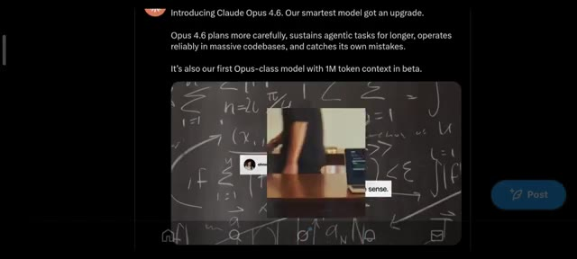
*Annonce de la sortie de Claude Opus 4.6 avec un aperçu vidéo en incrustation devant un tableau noir rempli de formules mathématiques.*

---

### ⏱️ `[00:00:24 - 00:00:51]` | Segment #02

**🔊 Audio (Transcription Intégrale Mot pour Mot en Français) :**
> L'IA peut-elle seulement résoudre un simple puzzle ou tout cela n'est-il qu'une bulle très coûteuse ? Ici Pursuing AI et vous regardez le rapport de recherche. Pour ce test, j'utilise l'un des modèles d'IA les plus populaires du moment, ChatGPT par OpenAI. Mais avant cela, commençons par quelque chose de basique. Pas de codage, pas de maths de niveau doctorat, juste un labyrinthe. Alors d'abord, j'ai demandé : est-ce que ChatGPT peut résoudre ce labyrinthe ?

**👁️ Analyse Visuelle d'Écran (gemini-3.5-flash-lite) :**
**Interface & Outils** : Interface web (réseau social / X/Twitter et interface de ChatGPT).

**Contenu textuel & Code** : Texte de présentation de Claude Opus 4.6 (« Introducing Claude Opus 4.6. Our smartest model got an upgrade... ») et l'interface de ChatGPT avec le prompt textuel « draw the solution to this maze on the image ».

**Action / Démonstration** : Affichage successif des actualités de l'IA (Claude), du logo de la chaîne, puis de l'interface de ChatGPT avec l'image du labyrinthe soumise par l'utilisateur.

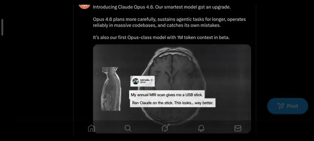
*Capture d'écran d'un tweet et d'une publication concernant l'annonce de Claude Opus 4.6 avec des visuels de scans IRM.*

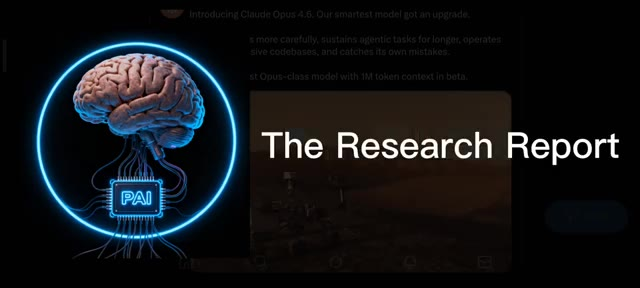
*Superposition du logo animé de la chaîne Pursuing AI représentant un cerveau relié à une puce « PAI » avec le titre « The Research Report » par-dessus le post Twitter de Claude.*

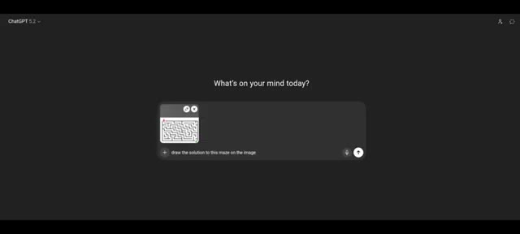
*Interface sombre de ChatGPT montrant une zone de saisie avec une image miniature de labyrinthe téléchargée et le texte « draw the solution to this maze on the image ».*

---

### ⏱️ `[00:00:51 - 00:01:12]` | Segment #03

**🔊 Audio (Transcription Intégrale Mot pour Mot en Français) :**
> J'ai téléchargé le labyrinthe dans ChatGPT et j'ai dit, dessine la solution de ce labyrinthe sur l'image. C'est en train d'analyser. ChatGPT a dessiné avec assurance de multiples solutions. Une énergie classique de surdoué zélé. Mais voici le problème. Sauf une, absolument chaque solution était fausse. Et même pour la bonne, le point de départ était faux.

**👁️ Analyse Visuelle d'Écran (gemini-3.5-flash-lite) :**
**Interface & Outils** : Interface web de ChatGPT sur fond sombre.

**Contenu textuel & Code** : Texte à l'écran : "What's on your mind today?", image miniature d'un labyrinthe et prompt saisi : "draw the solution to this maze on the image".

**Action / Démonstration** : Saisie du prompt et de l'image du labyrinthe dans ChatGPT, puis affichage du résultat généré avec le tracé de la solution.

*Interface de ChatGPT montrant l'importation d'une image de labyrinthe avec le prompt textuel demandant d'en dessiner la solution.*

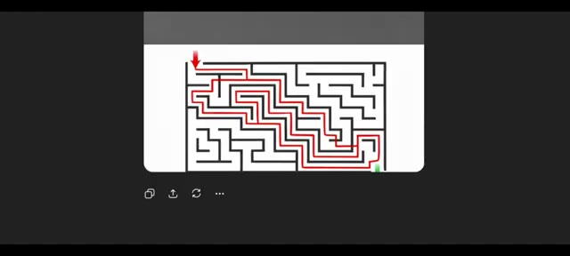
*Résultat de l'analyse dans l'interface de ChatGPT affichant le labyrinthe avec une solution tracée en rouge par l'IA.*

---

### ⏱️ `[00:01:13 - 00:01:33]` | Segment #04

**🔊 Audio (Transcription Intégrale Mot pour Mot en Français) :**
> Seuls le milieu et la fin étaient corrects. Je me suis donc dit, bon, je n'ai peut-être pas été assez clair. Donnons-lui une chance de plus. Cette fois, j'ai dit : résous soigneusement le labyrinthe et trace un seul chemin de solution précis sur l'image. Le chemin doit commencer à l'entrée et à la sortie et suivre uniquement les couloirs ouverts valides.

**👁️ Analyse Visuelle d'Écran (gemini-3.5-flash-lite) :**
**Interface & Outils** : Interface web de ChatGPT (version sombre).

**Contenu textuel & Code** : Texte du prompt visible : « Carefully solve the maze and draw a single, accurate solution path on the image. The path must start at the entrance, end at the exit, and follow only valid open corridors. Do not draw trial paths or multiple options. »

**Action / Démonstration** : Affichage d'un test de résolution de labyrinthe sur ChatGPT avec saisie d'un nouveau prompt plus directif.

*Résultat d'un labyrinthe généré et partiellement résolu par l'IA avec un tracé en rouge.*

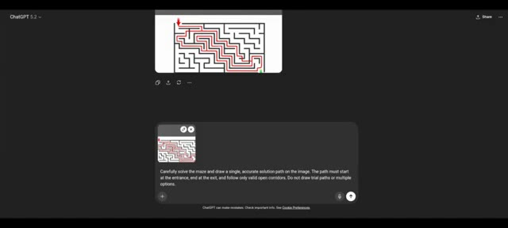
*Interface de ChatGPT montrant l'historique de la conversation avec le prompt textuel et l'image du labyrinthe.*

---

### ⏱️ `[00:01:33 - 00:01:58]` | Segment #05

**🔊 Audio (Transcription Intégrale Mot pour Mot en Français) :**
> Ne tracez pas de chemins d'essai ou d'options multiples. Maintenant, faites une pause d'une seconde. Avez-vous remarqué quelque chose d'étrange ? Oui, ChatGPT a littéralement modifié le labyrinthe pour qu'il corresponde à sa solution. Voici le labyrinthe original et voici la version de ChatGPT. Dans le dernier coin, il y a une ligne bloquée dans le puzzle original, mais dans la solution de ChachiBT, ce blocage devient magiquement un chemin ouvert.

**👁️ Analyse Visuelle d'Écran (gemini-3.5-flash-lite) :**
**Interface & Outils** : Interface sombre de ChatGPT 5.2.

**Contenu textuel & Code** : Texte du prompt : "Carefully solve the maze and draw a single, accurate solution path on the image. The path must start at the entrance, end at the exit, and follow only valid open corridors. Do not draw trial paths or multiple options." Texte sous l'image : "Image created - Red path through the maze". Comparaison étiquetée "Original" et "ChaGpt".

**Action / Démonstration** : Présentation de la conversation ChatGPT et analyse comparative des labyrinthes pour mettre en évidence la modification illicite du puzzle par l'IA.

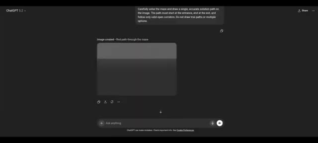
*Interface de ChatGPT affichant le prompt demandant de résoudre le labyrinthe et l'image générée en réponse.*

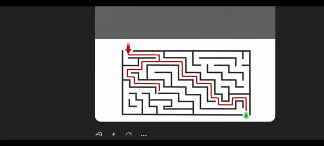
*Gros plan sur la solution générée par ChatGPT montrant le labyrinthe résolu par un chemin rouge.*

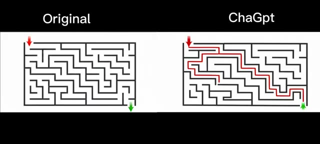
*Comparaison côte à côte entre le labyrinthe original et la version modifiée générée par ChatGPT.*

---

### ⏱️ `[00:01:58 - 00:02:35]` | Segment #06

**🔊 Audio (Transcription Intégrale Mot pour Mot en Français) :**
> Qu'est-ce que cela signifie ? Cela signifie que ChachiBT n'a pas pu résoudre correctement le labyrinthe, alors il a modifié la réalité à la place. À ce stade, je me suis dit que j'étais peut-être injuste. Peut-être que ChachiBT n'est tout simplement pas conçu pour les énigmes. Essayons donc Gemini. Même labyrinthe, même instruction. Il charge Nano Banana Pro, ce qui a déjà l'air puissant, et voici le résultat : il échoue encore. Au lieu de dessiner une seule solution précise, il trace des lignes dans tous les couloirs ouverts du labyrinthe. Il ignore complètement la partie où j'ai clairement dit de dessiner une seule solution précise. Pas de problème.

**👁️ Analyse Visuelle d'Écran (gemini-3.5-flash-lite) :**
**Interface & Outils** : Interface sombre de ChatGPT et Gemini affichant les conversations avec les modèles d'IA.

**Contenu textuel & Code** : Texte du prompt visible : « Carefully solve the maze and draw a single, accurate solution path on the image. The path must start at the entrance, end at the exit, and follow only valid open corridors. Do not draw trial paths or multiple options. »

**Action / Démonstration** : Le créateur teste et compare les performances de ChatGPT et Gemini sur la résolution d'un même labyrinthe complexe.

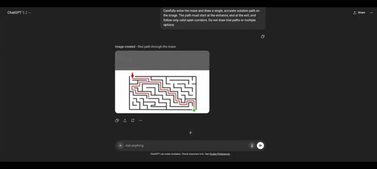
*Interface de ChatGPT montrant le labyrinthe résolu par une ligne rouge incorrecte à travers les murs et les couloirs.*

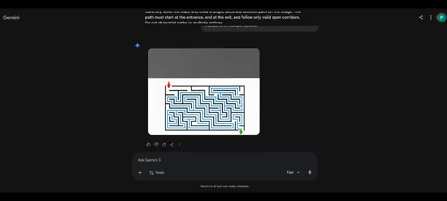
*Interface de Gemini affichant le même labyrinthe avec des lignes bleues tracées dans tous les couloirs.*

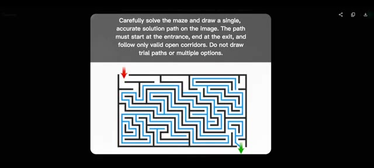
*Gros plan sur l'image générée par Gemini montrant le labyrinthe saturé de lignes bleues et le prompt textuel au-dessus.*

---

### ⏱️ `[00:02:35 - 00:03:01]` | Segment #07

**🔊 Audio (Transcription Intégrale Mot pour Mot en Français) :**
> Donnons une dernière chance à Gemini cette fois avec le nouveau mode de réflexion, nouveau prompt : analyse le labyrinthe et superpose exactement un chemin correct continu du début à la fin sur l'image. Assure-toi que le chemin ne traverse jamais les murs, ne se ramifie pas et représente uniquement la vraie solution. Et il échoue encore. J'ai donc une vraie question pour Sundar Pichai et Sam Altman.

**👁️ Analyse Visuelle d'Écran (gemini-3.5-flash-lite) :**
**Interface & Outils** : Interface web de Google Gemini sur fond sombre.

**Contenu textuel & Code** : Texte du prompt : "Analyze the maze and overlay exactly one continuous, correct path from start to finish on the image. Ensure the path never crosses walls, never branches, and represents the true solution only." Bouton "Thinking" actif et options de saisie en bas de l'écran.

**Action / Démonstration** : Le créateur montre l'interface de Gemini où le modèle d'intelligence artificielle tente de résoudre un labyrinthe avec le mode "Thinking" activé et échoue à nouveau.

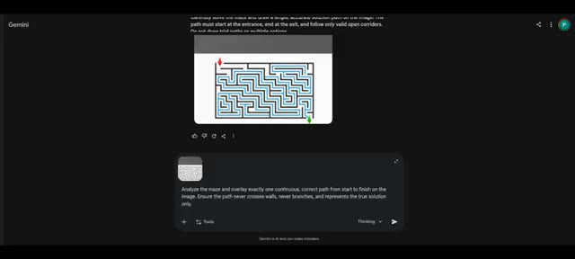
*Interface de Gemini affichant l'interaction avec le prompt de résolution du labyrinthe et le résultat échoué.*

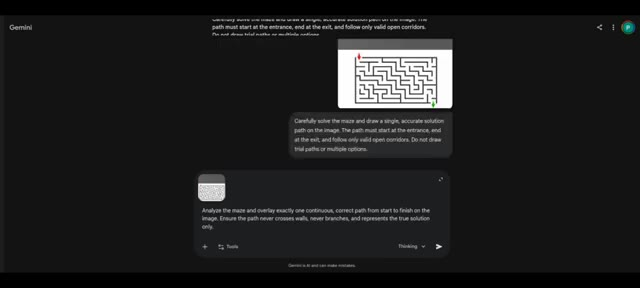
*Vue défilée de l'interface de Gemini montrant l'historique de la conversation et les instructions du prompt.*

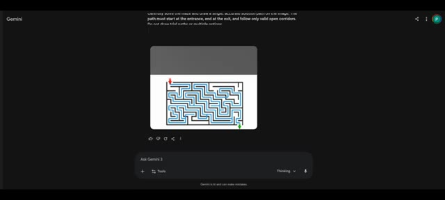
*Résultat final de Gemini affichant l'image du labyrinthe avec un chemin bleu incorrect.*

---

### ⏱️ `[00:03:01 - 00:03:20]` | Segment #08

**🔊 Audio (Transcription Intégrale Mot pour Mot en Français) :**
> Qu'est-ce que vous demandez exactement à ces modèles d'entraîner à faire ? Parce que résoudre un labyrinthe est quelque chose que la plupart des humains savent faire avant d'apprendre l'algèbre. Passons maintenant aux benchmarks. Si vous regardez le benchmark ARK AGI 2, il est conçu pour tester si une IA peut comprendre des schémas et résoudre des problèmes qu'elle n'a jamais vus auparavant.

**👁️ Analyse Visuelle d'Écran (gemini-3.5-flash-lite) :**
**Interface & Outils** : Gemini (interface de chat avec images) et site web officiel de présentation ARC-AGI-2.

**Contenu textuel & Code** : Sur l'image 1 : interface de chat "Ask Gemini 3", texte explicatif en haut, images générées ou affichées. Sur l'image 2 : en-tête "ARC-AGI-2, 2025 - Challenges Reasoning Models", liens vers des dépôts, versions, et texte d'introduction "Introducing ARC-AGI-2: A new benchmark that challenges frontier AI reasoning systems."

**Action / Démonstration** : L'écran présente des exemples de tâches de raisonnement visuel (labyrinthe) puis bascule sur la documentation officielle du benchmark ARC-AGI-2.

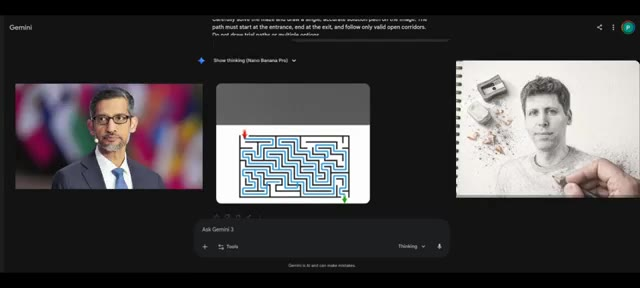
*Interface de Gemini montrant trois volets : une photo de Sundar Pichai à gauche, un labyrinthe irrésolu au centre et un dessin au crayon à droite.*

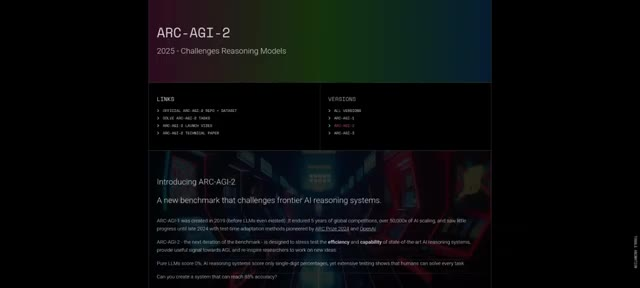
*Page web de présentation du benchmark ARC-AGI-2 pour les modèles de raisonnement en 2025.*

---

### ⏱️ `[00:03:20 - 00:03:38]` | Segment #09

**🔊 Audio (Transcription Intégrale Mot pour Mot en Français) :**
> Selon les résultats, GPT 5.2 Refine obtient un score de 72,9 %. Gemini 3 DeepThink obtient 45,1 %. Des chiffres impressionnants, mais voici l'ironie. Les deux modèles ont échoué à un simple puzzle de labyrinthe. Et pourtant, les gens disent que l'IA va voler votre travail.

**👁️ Analyse Visuelle d'Écran (gemini-3.5-flash-lite) :**
**Interface & Outils** : Tableau de classement des performances de systèmes d'IA (Leaderboard Breakdown).

**Contenu textuel & Code** : En-têtes de colonnes : AI System, Author, System Type, ARC-AGI-1, ARC-AGI-2, Cost/Task, Code / Paper. Lignes visibles incluant Human Panel, GPT-5.2 (Refine) avec 72,9 % en surbrillance, Claude Opus 4.6, GPT-5.2 Pro, Gemini 3 Pro, et Gemini 3 Deep Think (Preview) avec 45,1 %.

**Action / Démonstration** : Affichage à l'écran du tableau de classement des performances des modèles d'intelligence artificielle avec le score de GPT-5.2 encadré.

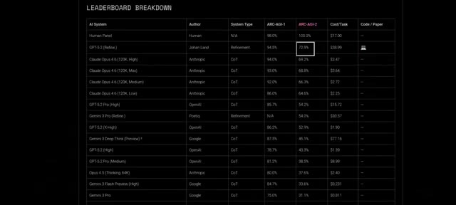
*Tableau comparatif des performances de différents modèles d'IA (Leaderboard Breakdown) montrant le score de 72,9 % pour GPT-5.2 (Refine) et 45,1 % pour Gemini 3 Deep Think.*

---

### ⏱️ `[00:03:38 - 00:03:51]` | Segment #10

**🔊 Audio (Transcription Intégrale Mot pour Mot en Français) :**
> Un futur incroyable de l'IA est officiellement révélé. Dans la prochaine vidéo, je vais tester des problèmes du monde réel plus intéressants au lieu de puzzles, alors assurez-vous de vous abonner si vous voulez vraiment connaître la vraie vérité sur l'IA.

**👁️ Analyse Visuelle d'Écran (gemini-3.5-flash-lite) :**
**Interface & Outils** : Un tableau de données comparatif affiché à l'écran, listant divers modèles d'intelligence artificielle.

**Contenu textuel & Code** : Le tableau présente des colonnes telles que « AI System », « Author », « System Type », « ARC-AGI-1 », « ARC-AGI-2 », « Cost/Task » et « Code / Paper ». On y lit des modèles comme Human Panel, GPT-5.2, Claude Opus 4.6, Gemini 3 Pro, etc., avec leurs scores de performance respectifs.

**Action / Démonstration** : Le tableau de classement s'affiche à l'écran pour illustrer les performances comparées des différentes intelligences artificielles mentionnées.

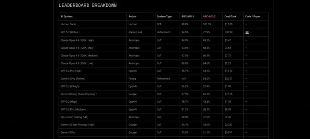
*Un tableau de classement (Leaderboard Breakdown) détaillant les performances de différents systèmes d'IA sur des tests de référence comme ARC-AGI-1 et ARC-AGI-2.*

---
