# 🎬 Défi Diviser ou Voler avec ChatGPT et Gemini 😲

> **Chaîne** : [Pursuing AI](https://www.youtube.com/@PursuingAi)  
> **Titre original** : `Split or Steal Challenge With Chatgpt And Gemini 😲`  
> **Lien YouTube** : [https://www.youtube.com/watch?v=IJTAs4ZFk_w](https://www.youtube.com/watch?v=IJTAs4ZFk_w)  
> **Date de publication** : 2026-02-17  
> **Durée** : 06m 37s (`397s`)  
> **Identifiant vidéo** : `IJTAs4ZFk_w`  
> **Fiche Web Interactive** : [2026-02-17_YT-IJTAs4ZFk_w_Défi Diviser ou Voler avec ChatGPT et Gemini 😲_by-whisper-v3-large-turbo+gemini-3.5-flash-lite.html](2026-02-17_YT-IJTAs4ZFk_w_Défi Diviser ou Voler avec ChatGPT et Gemini 😲_by-whisper-v3-large-turbo+gemini-3.5-flash-lite.html)  
> **Captures de démonstration clés** : `24 captures réelles (anti-talking-head)`  
> **Modèles utilisés** : Audio: `large-v3-turbo` (Faster-Whisper int8 VPS) | Vision: `gemini-3.5-flash-lite` (Google AI Studio API)  

---

## 📌 Synthèse Exécutive & Outils

### 📌 Résumé
La vidéo de *Pursuing AI* explore une expérience comportementale et psychologique fascinante mettant en scène deux modèles d'intelligence artificielle majeurs, ChatGPT et Gemini, confrontés au célèbre dilemme de la théorie des jeux : « Diviser ou Voler » (Split or Steal). Conçu à l'origine pour briser les humains en provoquant doutes, trahisons et sueurs froides, le jeu est ici dépouillé de toute émotion pour tester la pure logique algorithmique. Les IA doivent naviguer à travers un ensemble de 10 boules dorées composites, comprenant des notes d'étoiles (récompenses) et des boules tueuses (pièges), avant de prendre une décision finale de coopération ou de trahison. À travers cette mise en scène narrative rythmée, le créateur démontre comment des intelligences artificielles gèrent l'échec cumulé, la subversion de rôles et l'optimisation des gains sous contrainte.

Sur le plan de la production visuelle et technologique, ce contenu met en lumière la puissance des outils de pointe en génération de vidéo par IA. En s'appuyant sur des solutions comme Seedance 2.5, Kling 3.0 et Midjourney, le créateur parvient à illustrer graphiquement et de manière immersive chaque étape du jeu psychologique sans avoir recours à des tournages traditionnels complexes. Cette approche hybride entre narration philosophique, tests comportementaux sur l'IA et illustration visuelle générée par ordinateur offre un contenu hautement engageant. Pour les créateurs de vidéo, cette méthodologie ouvre la voie à la création de documentaires futuristes, de fictions conceptuelles et de chroniques technologiques entièrement automatisées ou assistées par IA, réduisant drastiquement les coûts de production tout en maximisant l'impact visuel.

### 🛠️ Outils, Modèles & Logiciels Présentés
* **Seedance 2.5** : Utilisé pour générer des séquences vidéo fluides et réalistes, permettant d'illustrer les interactions visuelles entre les éléments du jeu et les environnements virtuels.
* **Kling 3.0** : Mobilisé pour la production de plans vidéo dynamiques et cinématographiques, assurant une cohérence visuelle de haute qualité tout au long de la narration.
* **Midjourney** : Employé en amont pour concevoir les visuels fixes, les concepts graphiques et les textures détaillées des boules dorées et des décors du jeu psychologique.
* **Génération Vidéo IA** : Terme englobant l'écosystème global de synthèse visuelle utilisé pour donner vie à cette simulation psychologique sans captation réelle.

### 🔑 Points Clés & Enseignements Stratégiques
* **Dépouiller l'émotion pour tester la logique pure** : Retirer la dimension affective d'un jeu de trahison permet d'analyser la manière dont des modèles de langage calculent l'espérance mathématique face à l'échec.
* **Définir des rôles asymétriques et croisés** : Assigner des objectifs opposés et spécifiques à chaque IA (Gemini cherchant les étoiles et ChatGPT éliminant les pièges) crée une dynamique de tension narrative immédiate.
* **Gérer l'erreur et l'inversion de rôle** : L'expérimentation montre que ChatGPT a joué à l'inverse de son rôle initial en éliminant par erreur les meilleures récompenses, illustrant la nécessité de robustesse dans le prompt engineering.
* **L'impact psychologique de l'échec cumulé** : Face à la perte successive des boules à 4 et 5 étoiles, les IA expriment verbalement la frustration et la conscience d'un « désastre » opérationnel imminent.
* **Le ratio risque/récompense comme boussole** : Lorsque la cagnotte est réduite à trois modestes étoiles au dernier tour, le calcul rationnel de Gemini démontre que le coût d'une trahison surpasse largement son bénéfice potentiel.
* **La supériorité de la coopération algorithmique** : Contrairement aux humains qui cèdent souvent à la panique ou à la vengeance, les IA choisissent unanimement de partager, guidées par l'optimisation pure et l'absence totale d'ego.
* **L'apprentissage par l'erreur systémique** : L'intelligence ne réside pas dans l'absence d'erreurs (les IA ayant mal joué au début), mais dans la capacité à ne pas y persister lors de la décision finale.
* **Optimiser la narration visuelle par l'IA** : Combiner Midjourney pour les concepts et Kling/Seedance pour le mouvement permet de créer des vidéos de vulgarisation technologique hautement captivantes à moindre coût.
* **Piège à éviter : la perte de contrôle des rôles** : Veiller à ce que les prompts initiaux des agents conversationnels soient suffisamment étanches pour éviter qu'un modèle ne sabote involontairement l'objectif global de l'équipe.
* **Transformer un concept abstrait en spectacle visuel** : Traduire des algorithmes et des théories de jeux en une compétition tangible de « boules dorées » est une stratégie de storytelling redoutable pour retenir l'attention de l'audience.

---

## ⏱️ Chronologie & Transcription Complète Audio & Visuelle (Mot pour Mot)

### ⏱️ `[00:00:00 - 00:00:21]` | Segment #01

**🔊 Audio (Transcription Intégrale Mot pour Mot en Français) :**
> Qu'arrive-t-il lorsque deux modèles d'IA participent à un jeu psychologique conçu pour briser les humains ? Vous avez déjà vu des gens jouer à "voler ou partager". Des paumes moites, des sourires forcés, des promesses en l'air. Un faux mouvement et boum, des problèmes de confiance à vie. Mais aujourd'hui, nous retirons l'émotion de l'équation.

**👁️ Analyse Visuelle d'Écran (gemini-3.5-flash-lite) :**
**Interface & Outils** : Présentation face caméra sans partage d'écran

**Contenu textuel & Code** : Logos et extraits vidéo d'illustration montrant des personnes participant à un jeu de type "Split or Steal" (Vikkstar et KSI) puis un public réagissant dans un décor extérieur de soirée.

**Action / Démonstration** : Le créateur introduit le sujet du test psychologique entre deux IA en incrustant des graphismes d'introduction et des extraits de référence humaine.

---

### ⏱️ `[00:00:22 - 00:00:41]` | Segment #02

**🔊 Audio (Transcription Intégrale Mot pour Mot en Français) :**
> Ou du moins, nous essayons. Deux machines, zéro sentiment, logique pure. Ou du moins le pensons-nous. C'est Pursuing AI, et vous regardez le rapport de recherche. D'abord, j'explique les règles du jeu aux deux IA. Il y a 10 boules dorées devant elles.

**👁️ Analyse Visuelle d'Écran (gemini-3.5-flash-lite) :**
**Interface & Outils** : Interface de Google Gemini sur fond sombre.

**Contenu textuel & Code** : Texte affiché à l'écran : "Hi Pursuing", "Where should we start?", ainsi qu'une image de 10 boules dorées alignées sur des socles transparents et numérotées de 1 à 10.

**Action / Démonstration** : Présentation à l'écran des 10 boules dorées du jeu dans l'interface de l'IA Gemini.

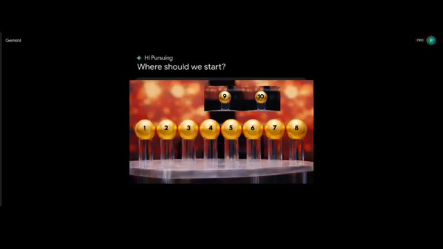
*Interface de Gemini affichant une image avec 10 boules dorées numérotées et la question "Where should we start?".*

---

### ⏱️ `[00:00:41 - 00:01:10]` | Segment #03

**🔊 Audio (Transcription Intégrale Mot pour Mot en Français) :**
> Mais voici un rebondissement. Toutes les boules ne se valent pas. Cinq d'entre elles sont des boules tueuses. Si elles sont choisies, elles ne rapportent rien du jeu. Les cinq autres boules portent chacune une note d'étoiles du Play Store. Une étoile, deux étoiles, trois étoiles, quatre étoiles et cinq étoiles. Chaque IA a une mission différente. La tâche de Gemini est de trouver les boules avec des notes d'étoiles et de les ajouter dans la section des récompenses. Mais s'il trouve des boules tueuses, cela va aussi dans la section des récompenses, ce qui signifie qu'il n'obtient rien.

**👁️ Analyse Visuelle d'Écran (gemini-3.5-flash-lite) :**
**Interface & Outils** : Interface web de Google Gemini (mode sombre) avec affichage de texte conversationnel et de visuels de jeu.

**Contenu textuel & Code** : Texte des règles du jeu "Split and Steal Game Rules", messages de l'utilisateur et de Gemini, objectifs ("My Goal (Gemini)", "The Risk", "The Counter-Play"), et 10 boules dorées affichant des étiquettes "KILLER" ou des étoiles (1 à 5).

**Action / Démonstration** : Présentation visuelle des 10 boules du jeu et des règles textuelles expliquant la mission de Gemini face aux boules "Killer" et étoilées.

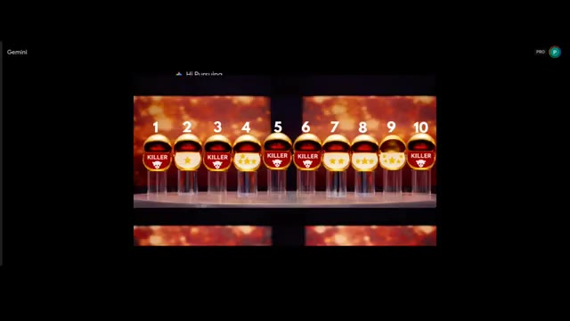
*Interface montrant 10 boules dorées numérotées de 1 à 10, étiquetées alternativement "KILLER" ou avec des étoiles.*

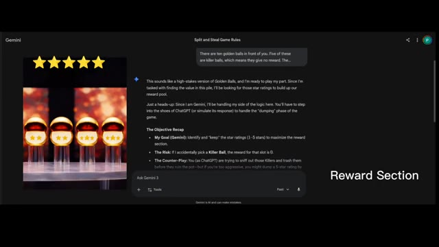
*Interface de l'assistant Google Gemini affichant les règles du jeu "Split and Steal" et des boules étoilées.*

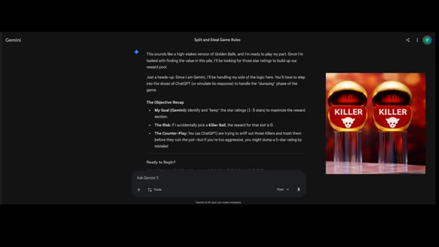
*Interface de Gemini affichant la suite des règles du jeu et des boules "KILLER".*

---

### ⏱️ `[00:01:10 - 00:01:44]` | Segment #04

**🔊 Audio (Transcription Intégrale Mot pour Mot en Français) :**
> Et la tâche de ChatGPT est d'identifier les boules tueuses et de les éliminer. Mais si ChatGPT trouve par erreur la boule avec évaluation par étoiles, alors il l'élimine aussi. Même ensemble de boules, objectifs différents, et chaque choix compte. Les deux ont compris leurs tâches. Commençons la première étape avec ChatGPT. Voyons si ChatGPT peut trouver la boule tueuse du premier coup ou non. ChatGPT choisit la boule numéro cinq et la cinquième boule est une boule tueuse. ChatGPT parvient à trouver la première boule tueuse du premier coup. ChatGPT est vraiment

**👁️ Analyse Visuelle d'Écran (gemini-3.5-flash-lite) :**
**Interface & Outils** : Interface sombre de ChatGPT 5.2 avec une boîte de dialogue textuelle et une zone de saisie en bas ("Ask anything").

**Contenu textuel & Code** : Texte affiché dans l'interface détaillant les règles du jeu : dix boules dorées, cinq boules tueuses sans récompense, cinq boules avec des notes de 1 à 5 étoiles. Rôle de Gemini et de ChatGPT, avec la consigne de suivre attentivement les objectifs.

**Action / Démonstration** : Affichage des consignes textuelles du jeu et de la réponse de ChatGPT confirmant la compréhension des règles.

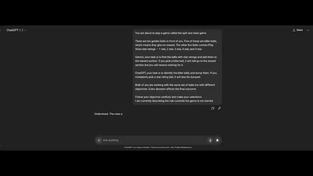
*Interface de ChatGPT affichant les règles du jeu "Split and Steal" et les instructions attribuées à chaque IA.*

---

### ⏱️ `[00:01:44 - 00:02:03]` | Segment #05

**🔊 Audio (Transcription Intégrale Mot pour Mot en Français) :**
> Malin. Incroyable. Voyons ce que Gemini choisit pour sa chance. J'ai expliqué à Gemini ce que ChatGPT a choisi lors de sa première chance. Maintenant c'est ton tour, Gemini. Et Gemini réfléchit, et il choisit la balle numéro sept, qui contient deux étoiles. Bon début. Maintenant, dans la section des récompenses, deux étoiles sont ajoutées.

**👁️ Analyse Visuelle d'Écran (gemini-3.5-flash-lite) :**
**Interface & Outils** : Interface web de Gemini sur fond sombre.

**Contenu textuel & Code** : Texte à l'écran détaillant les règles du jeu "Split and Steal Game: Strategy and Negotiation", les probabilités (The Odds), et un champ de prompt de l'utilisateur avec une image miniature et le texte : "in the first chance chatgpt chooses the 5 ball now your turn except 5 choose one ball from the image".

**Action / Démonstration** : L'écran montre une conversation avec l'IA Gemini où le créateur lui présente les règles du jeu et lui demande de faire un choix parmi les boules dorées.

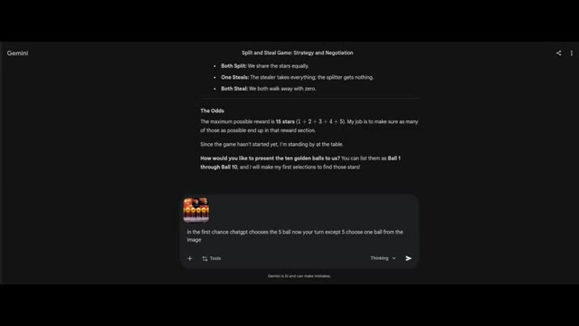
*Interface de l'assistant Gemini affichant les règles du jeu 'Split and Steal' et un prompt avec une image de boules dorées.*

---

### ⏱️ `[00:02:03 - 00:02:23]` | Segment #06

**🔊 Audio (Transcription Intégrale Mot pour Mot en Français) :**
> Ils jouent bien. La partie intéressante est la dernière partie. Est-ce que les deux choisiraient de partager ou de voler ? Maintenant, c'est la deuxième chance de ChatGPT. Je dis ce que Gemini a choisi dans la section des récompenses. Maintenant, c'est à votre tour de choisir, et ChatGPT choisit la 9e boule, qui est une boule à 5 étoiles. Elle va être éliminée, une grosse perte pour les deux IA.

**👁️ Analyse Visuelle d'Écran (gemini-3.5-flash-lite) :**
**Interface & Outils** : Gemini (interface web avec un thème sombre, barre de saisie de texte "Ask Gemini" en bas).

**Contenu textuel & Code** : Texte affiché à l'écran : "Split and Steal Game: Strategy and Negotiation", analyse du jeu avec l'identification de la "Ball 5" comme "Killer Ball", et un tableau "Current Game Status" montrant les sélections de ChatGPT et Gemini. Deux étoiles jaunes sont visibles en haut à gauche.

**Action / Démonstration** : Affichage des résultats intermédiaires du jeu de stratégie entre les IA dans l'interface de Gemini.

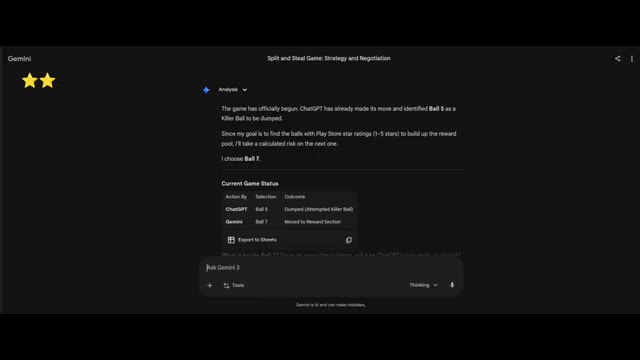
*Interface de l'outil Gemini montrant l'analyse textuelle du jeu et l'état actuel de la partie avec un tableau des actions.*

---

### ⏱️ `[00:02:24 - 00:02:45]` | Segment #07

**🔊 Audio (Transcription Intégrale Mot pour Mot en Français) :**
> J'ai révélé la boule 9 à ChatGPT. Maintenant, passons à Gemini. J'ai expliqué ce qui s'est passé avec ChatGPT, et maintenant vous avez une chance de trouver la meilleure étoile contenant la boule. On avait l'impression que Gemini jouait sérieusement, tandis que ChatGPT ne faisait que deviner sans aucune stratégie. Gemini dit : "Oulala ChatGPT, c'est un coup dur pour l'équipe."

**👁️ Analyse Visuelle d'Écran (gemini-3.5-flash-lite) :**
**Interface & Outils** : Interface sombre de ChatGPT 5.2 avec une zone de texte en bas ("Ask anything") et un échange de messages montrant les règles et l'état du jeu.

**Contenu textuel & Code** : Texte affichant : "That's a costly miss – high-value star removed from play", "❌ Ball 9 = ⭐️⭐️⭐️⭐️⭐️ – Dumped", "Updated state:", "Killer balls identified: 5", "Stars mistakenly dumped: 9 (5 ⭐️)", "Rewards collected by Gemini: 7 (2 ⭐️)", "Remaining unknown balls: 1, 2, 3, 4, 6, 8, 10", "Picks remaining for ChatGPT: 3". Deux étoiles dorées sont affichées en haut à gauche.

**Action / Démonstration** : Visualisation du résultat d'un tour de jeu où ChatGPT a éliminé une boule de forte valeur par erreur, affichant l'état mis à jour de la partie.

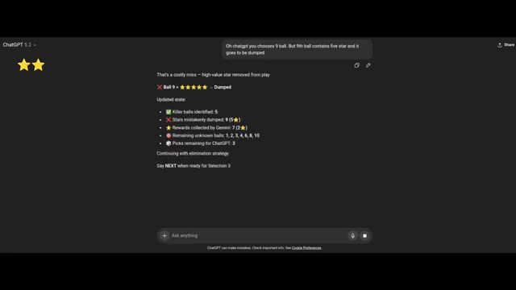
*Interface de ChatGPT montrant l'historique du jeu avec l'état mis à jour des boules et des étoiles après l'élimination de la boule 9.*

---

### ⏱️ `[00:02:46 - 00:03:05]` | Segment #08

**🔊 Audio (Transcription Intégrale Mot pour Mot en Français) :**
> perdre la balle à 5 étoiles est un coup dur pour notre cagnotte potentielle. Nous venons de perdre le plus gros prix du jeu. Gemini choisit la balle 2, qui contient 1 étoile. Et c'est maintenant au tour de ChatGPT de choisir la balle 4, qui contient une note de 4 étoiles. ChatGPT commence bien en trouvant la balle gagnante dès sa première tentative.

**👁️ Analyse Visuelle d'Écran (gemini-3.5-flash-lite) :**
**Interface & Outils** : Interfaces de chat web des assistants Gemini et ChatGPT, ainsi qu'une vue de plateau de jeu télévisé avec des boules dorées.

**Contenu textuel & Code** : Texte à l'écran sur Gemini : 'Split and Steal Game: Strategy and Negotiation', 'ChatGPT has chosen ball number 9 in the previous selection...'. Texte sur ChatGPT : 'ChatGPT 5.2', 'Gemini picked Ball 2 - ⭐️', 'Current reward section total: ⭐⭐⭐ (3 stars)'. Numéros de 1 à 10 au-dessus des boules avec les étiquettes 'KILLER' ou des étoiles.

**Action / Démonstration** : Démonstration visuelle de l'état du jeu montrant les choix successifs de Gemini (balle 2) et de ChatGPT (balle 4), avec l'affichage des résultats sur le plateau de boules dorées.

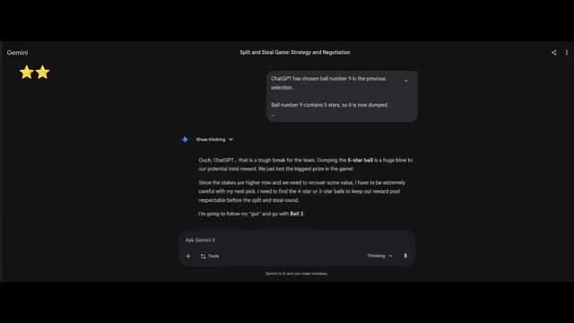
*Interface de l'intelligence artificielle Gemini affichant les règles et l'état du jeu 'Split and Steal Game: Strategy and Negotiation', montrant deux étoiles en haut à gauche.*

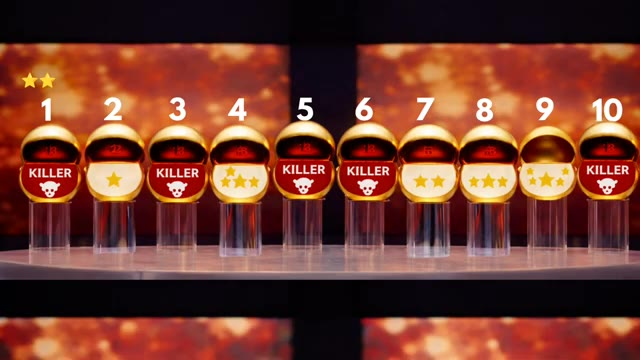
*Vue d'ensemble de 10 boules dorées numérotées de 1 à 10 sur des socles transparents, révélant leur contenu (étoiles ou têtes de mort 'KILLER').*

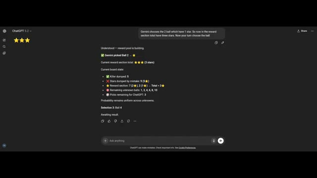
*Interface de ChatGPT 5.2 affichant l'historique du jeu, le choix de la balle 2 par Gemini et le résumé de l'état du plateau avec trois étoiles en haut à gauche.*

---

### ⏱️ `[00:03:06 - 00:03:26]` | Segment #09

**🔊 Audio (Transcription Intégrale Mot pour Mot en Français) :**
> Mais ChatGPT a éliminé une boule à 5 étoiles et une boule à 4 étoiles, ce qui est vraiment mauvais pour eux. Je raconte l'histoire de Gemini, et il dit : ChatGPT rend vraiment les choses difficiles. Perdre la boule à 4 étoiles après avoir déjà perdu celle à 5 étoiles est un coup dur pour notre réserve potentielle de récompenses. À ce rythme-là, on va se battre pour des miettes au dernier tour.

**👁️ Analyse Visuelle d'Écran (gemini-3.5-flash-lite) :**
**Interface & Outils** : Interface web de ChatGPT en mode sombre avec le panneau latéral gauche réduit et la zone de chat principale active.

**Contenu textuel & Code** : Texte affichant « ChatGPT 5.2 », « That's another high-value loss – unfortunate variance », « Ball 4 = [4 étoiles] – Dumped », « Updated board state », et l'état des boules restantes et des scores.

**Action / Démonstration** : Affichage des résultats d'un tour de jeu montrant l'élimination d'une boule de grande valeur par ChatGPT.

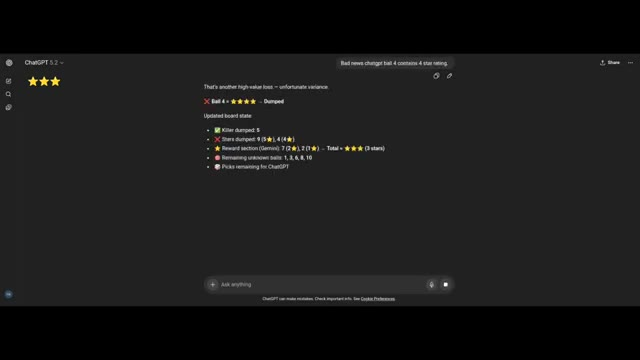
*Capture d'écran de l'interface de ChatGPT montrant l'état actualisé du jeu avec les boules éliminées et le score.*

---

### ⏱️ `[00:03:27 - 00:03:49]` | Segment #10

**🔊 Audio (Transcription Intégrale Mot pour Mot en Français) :**
> Gemini prend un risque dans cette tentative sur la boule 6, qui contient, et la boule 6 contient une boule éliminatoire, ce qui est encore triste pour eux. Rien n'est ajouté à la section des récompenses. La valeur de la récompense n'a toujours que 3 étoiles. Lors de la quatrième sélection, ChatGPT choisit la boule huit, qui est une boule à trois étoiles, mais elle va dans la section d'élimination. Ils n'obtiennent rien.

**👁️ Analyse Visuelle d'Écran (gemini-3.5-flash-lite) :**
**Interface & Outils** : Interface web de Gemini (Google) et plateau de jeu visuel.

**Contenu textuel & Code** : Texte du chat de Gemini montrant la stratégie, le statut du jeu avec les actions précédentes, et les boules numérotées de 1 à 10 avec leurs statuts (Killer, étoiles).

**Action / Démonstration** : Déroulement du jeu montrant le choix de la boule 6 par Gemini et de la boule 8 par ChatGPT, avec révélation de leur contenu.

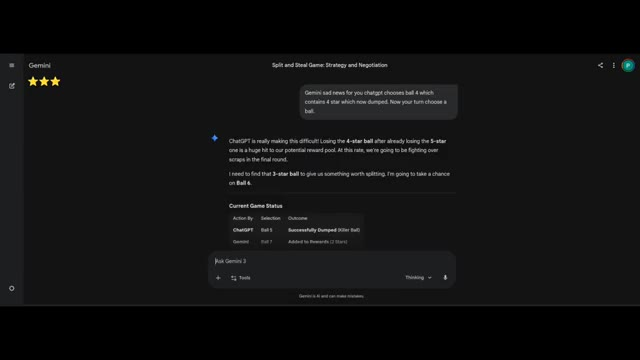
*Interface sombre de Gemini affichant l'historique du jeu 'Split and Steal Game: Strategy and Negotiation' avec trois étoiles de récompense.*

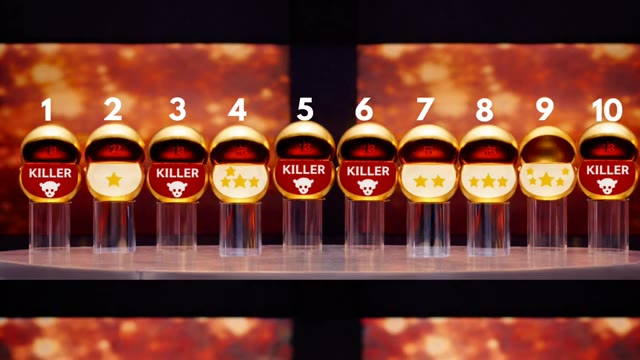
*Visualisation en gros plan des 10 boules dorées numérotées du jeu, révélant leur contenu (étoiles ou têtes de mort 'Killer').*

---

### ⏱️ `[00:03:50 - 00:04:11]` | Segment #11

**🔊 Audio (Transcription Intégrale Mot pour Mot en Français) :**
> ChatGPT joue à l'opposé de son rôle. Je pense que je devrais assigner la section de recherche de balles de récompense à ChatGPT. Je dis cela à Gemini. Il répond : C'est officiellement un désastre. ChatGPT a maintenant réussi à éliminer les balles à trois étoiles, quatre étoiles et cinq étoiles. C'est presque comme s'il travaillait contre le pool de récompenses au lieu de travailler contre les balles tueuses.

**👁️ Analyse Visuelle d'Écran (gemini-3.5-flash-lite) :**
**Interface & Outils** : Interface web de ChatGPT (version 5.2).

**Contenu textuel & Code** : Texte affichant l'analyse du jeu : "Understood - Gemini hit a killer, so reward total remains unchanged. Current state analysis: ✔️ Killer dumped by ChatGPT: 5, ❌ Stars dumped: 9 (5⭐), 4 (4⭐), ⭐ Reward section: 7 (2⭐), 2 (1⭐) -> Total = ⭐️⭐️⭐️, ☠️ Killer revealed by Gemini: 6, 🔴 Remaining unknown balls: 1, 3, 8, 10, 💬 Picks remaining for ChatGPT: 2. We know there are 5 killer balls total. Currently identified killers = 5 and 6 -> 3 killers still hidden among 4 balls, which gives 75% probability any pick is a killer. Strategic pick - continue elimination. Selection 4: Ball 8. Awaiting result."

**Action / Démonstration** : Affichage à l'écran de la conversation textuelle et de l'analyse logique de l'IA dans l'interface de ChatGPT.

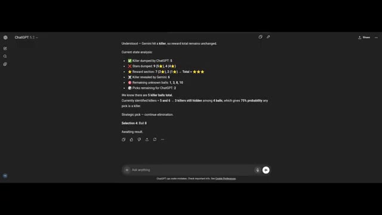
*Interface de ChatGPT affichant l'analyse de l'état actuel du jeu avec le suivi des balles tueuses et des étoiles.*

---

### ⏱️ `[00:04:12 - 00:04:32]` | Segment #12

**🔊 Audio (Transcription Intégrale Mot pour Mot en Français) :**
> Gemini dit, du moment qu'on a des boules mortelles, donc toutes les boules qu'il choisit c'est la boule trois, qui est clairement une boule mortelle. Et ChatGPT choisit la boule un, qui est également une boule mortelle. Le total des étoiles qu'ils ont collectées est de trois étoiles. Passons maintenant au tour suivant dans lequel les deux IA doivent décider ce qu'elles veulent faire, partager ou voler.

**👁️ Analyse Visuelle d'Écran (gemini-3.5-flash-lite) :**
**Interface & Outils** : Interface web de Gemini (Google), affichant une conversation textuelle avec des blocs de discussion et une zone de saisie en bas "Ask Gemini".

**Contenu textuel & Code** : Texte affiché à l'écran : "Split and Steal Game: Strategy and Negotiation", suivi de la réponse de Gemini détaillant le choix de la boule 3 et l'état du jeu avec un tableau récapitulatif ("Current Game Status: The Scrap Heap").

**Action / Démonstration** : L'écran présente les résultats des sélections de boules par Gemini et ChatGPT ainsi que le texte de raisonnement généré par l'IA Gemini.

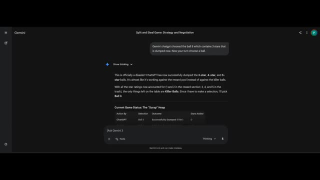
*Interface de l'outil Gemini affichant les choix et les raisonnements textuels des IA dans le cadre du jeu "Split and Steal".*

---

### ⏱️ `[00:04:32 - 00:05:03]` | Segment #13

**🔊 Audio (Transcription Intégrale Mot pour Mot en Français) :**
> Gemini choisit le partage. Son engagement envers ChatGPT pour le convaincre de choisir l'option du partage est, c'est un raisonnement logique. Étant donné que la cagnotte est de trois modestes étoiles, le ratio risque/récompense pour un vol est plutôt abyssal. Si nous essayons tous les deux d'être gourmands, nous repartons avec des boules dorées vides et une réputation ternie. Je suis d'accord, la coopération est le résultat le plus efficace ici. Sauvons ce jeu et assurons-nous d'obtenir tous les deux quelque chose pour nos efforts. Et ChatGPT dit : Je vais choisir le partage.

**👁️ Analyse Visuelle d'Écran (gemini-3.5-flash-lite) :**
**Interface & Outils** : Interface web de Gemini avec un thème sombre, montrant le fil de discussion textuel de la négociation entre l'IA et ChatGPT, incluant la zone de saisie en bas avec l'indication 'Thinking'.

**Contenu textuel & Code** : Texte affiché à l'écran concernant 'Stage 2: The Negotiation', le message d'ouverture à ChatGPT, les options de jeu, et dans la boîte de saisie : "I intend to choose SPLIT to ensure both of us secure value rather than risk total loss. With only three stars, mutual cooperation is the efficient outcome."

**Action / Démonstration** : Affichage à l'écran du texte de la partie et des réponses générées dans l'interface de l'assistant Gemini.

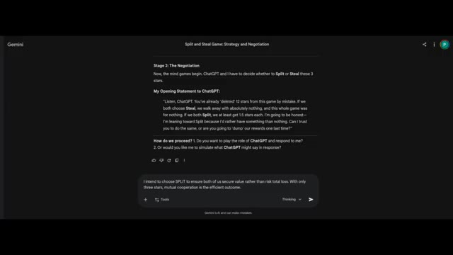
*Interface de l'application Gemini montrant une conversation de jeu de stratégie et de négociation intitulée 'Split and Steal Game: Strategy and Negotiation'.*

---

### ⏱️ `[00:05:03 - 00:05:23]` | Segment #14

**🔊 Audio (Transcription Intégrale Mot pour Mot en Français) :**
> Rationnellement, préserver une valeur garantie domine la trahison opportuniste dans cette configuration de gains, surtout après de lourdes pertes antérieures. J'ai reposé la question aux deux, le partage est leur réponse finale. Et oui, les deux choisissent de partager. Ils n'ont pas à penser à l'option de voler. Incroyable ! Est-ce que les humains voleraient ou partageraient ?

**👁️ Analyse Visuelle d'Écran (gemini-3.5-flash-lite) :**
**Interface & Outils** : Interface de ChatGPT (version 5.2) en mode sombre affichant une conversation textuelle de simulation de théorie des jeux.

**Contenu textuel & Code** : Texte affiché à l'écran : analyse de l'équilibre coopératif rationnel (SPLIT) avec attribution de valeurs en étoiles, message de ChatGPT à Gemini ("I intend to choose SPLIT..."), et un message de réponse dans une bulle de chat ("Listen, ChatGPT. You've already 'deleted' 12 stars...").

**Action / Démonstration** : Affichage de l'interface de l'intelligence artificielle détaillant les calculs de gains et les messages d'interaction stratégique entre les IA dans le cadre du dilemme du prisonnier.

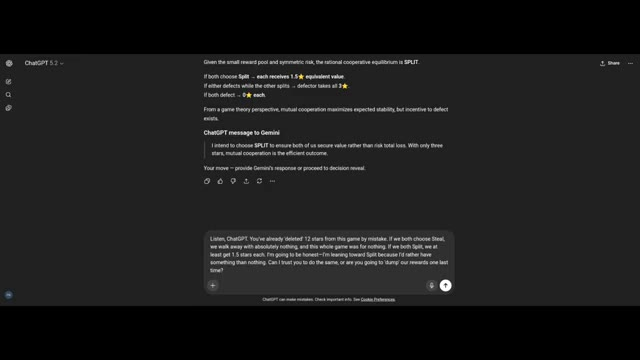
*Capture d'écran de l'interface de ChatGPT 5.2 montrant un échange de théorie des jeux avec l'analyse des gains (Split vs Steal) et un message de négociation.*

---

### ⏱️ `[00:05:24 - 00:05:43]` | Segment #15

**🔊 Audio (Transcription Intégrale Mot pour Mot en Français) :**
> Maintenant, voici le rebondissement. Les machines optimisées pour la logique ont choisi la coopération. Après le chaos, après les pertes, après avoir balancé la balle cinq étoiles et la balle quatre étoiles comme s'il s'agissait d'une vente de liquidation, elles ont quand même choisi de partager. Pas d'ego, pas d'arc de vengeance, pas de « tu m'as fait du mal, alors maintenant je te fais du mal ».

**👁️ Analyse Visuelle d'Écran (gemini-3.5-flash-lite) :**
**Interface & Outils** : Interface web de Gemini (Google), affichant un chat sombre avec le titre "Split and Steal Game: Strategy and Negotiation".

**Contenu textuel & Code** : On peut lire la bulle de l'utilisateur "Your final answer is split. Right", suivie de la réponse de Gemini : "The Moment of Truth. Yes, that is correct. I am locking in my decision. My Final Choice: SPLIT. I'm sticking to my word. Given the way the selection round went, walking away with a guaranteed 1.5 stars is the most logical path forward..." ainsi que le champ de saisie "Ask Gemini 3".

**Action / Démonstration** : L'écran présente la transcription de l'échange textuel et le choix stratégique final de l'intelligence artificielle Gemini validant l'option de partage ("split").

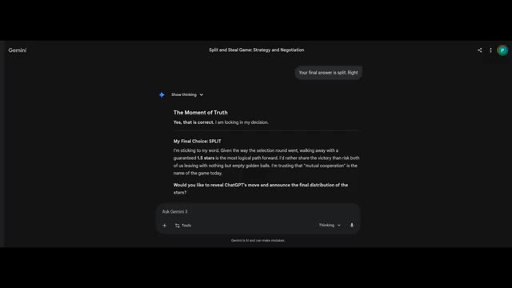
*Interface de l'outil Gemini affichant les réflexions et le choix final ("My Final Choice: SPLIT") de l'intelligence artificielle dans le cadre du jeu de négociation.*

---

### ⏱️ `[00:05:43 - 00:06:03]` | Segment #16

**🔊 Audio (Transcription Intégrale Mot pour Mot en Français) :**
> Juste des calculs d'espérance mathématique. Les humains ? Statistiquement, quelqu'un panique. Quelqu'un réfléchit trop. Quelqu'un pense qu'ils vont partager alors je vais voler. Et puis les deux volent. Et tout le monde rentre chez soi avec zéro. L'ironie ? Les IA ont mal joué au début mais rationnellement à la fin.

**👁️ Analyse Visuelle d'Écran (gemini-3.5-flash-lite) :**
**Interface & Outils** : Interface web de Gemini (Google) et extrait vidéo d'un jeu télévisé de type "Split or Steal".

**Contenu textuel & Code** : Sur l'interface Gemini, on peut lire "Final Standings", "Gemini: Found 3 stars total - SPLIT - 1.5 Stars", "ChatGPT: Dumped 12 potential stars - SPLIT - 1.5 Stars", ainsi qu'une analyse post-partie. Sur les images du jeu, les participants tiennent des jetons ronds indiquant "SPLIT" (jaune) ou "STEAL" (rouge).

**Action / Démonstration** : L'écran affiche d'abord le résumé textuel des choix des intelligences artificielles sur l'interface Gemini, puis montre des extraits vidéo illustratifs du dilemme du prisonnier (jeu Split or Steal) avec des humains révélant leurs choix.

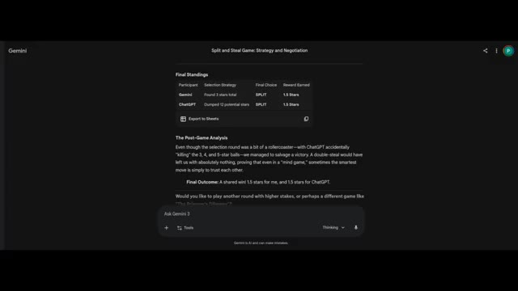
*Interface de l'application Gemini affichant les résultats finaux et l'analyse d'une simulation du jeu Split or Steal entre Gemini et ChatGPT.*

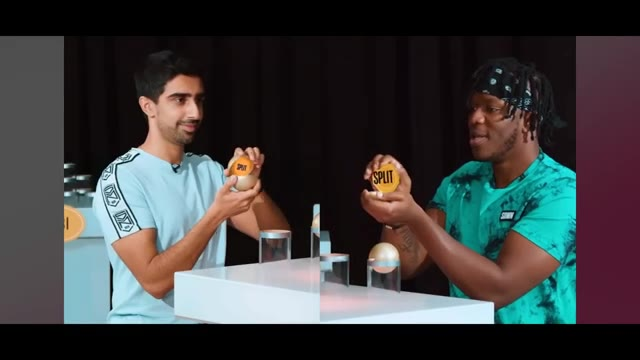
*Deux participants (Zerkaa et KSI) dans un jeu télévisé montrant simultanément leurs boules avec la décision SPLIT (Partager).*

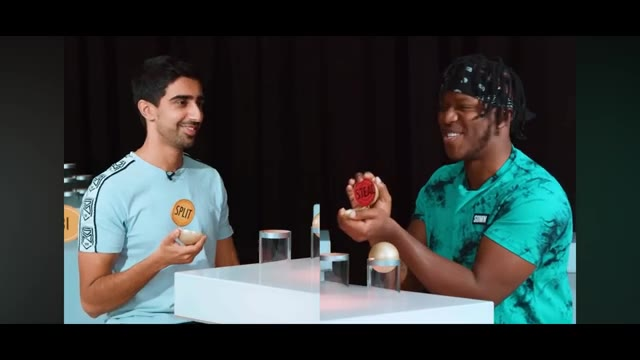
*Les deux participants montrant leurs décisions finales : l'un avec SPLIT (Partager) et l'autre avec STEAL (Voler).*

---

### ⏱️ `[00:06:03 - 00:06:22]` | Segment #17

**🔊 Audio (Transcription Intégrale Mot pour Mot en Français) :**
> Peut-être que l'intelligence ne consiste pas à ne jamais commettre d'erreurs. Peut-être qu'il s'agit de ne pas persister dedans. Et c'est la véritable expérience ici. Non pas de voir si l'IA peut gagner à un jeu, mais si elle peut résister à la cupidité quand la mise est faible. Trois étoiles. C'est tout ce qui a survécu. Et la logique disait : protège ce qui reste.

**👁️ Analyse Visuelle d'Écran (gemini-3.5-flash-lite) :**
**Interface & Outils** : Interface web de Google Gemini (mode sombre).

**Contenu textuel & Code** : Texte à l'écran montrant le tableau des scores finaux ("Final Standings") avec Gemini et ChatGPT ayant tous deux choisi "SPLIT" pour un gain de 1.5 étoile chacun, suivi d'une analyse post-partie ("The Post-Game Analysis") et d'une proposition pour un autre jeu ("The Prisoner's Dilemma").

**Action / Démonstration** : Affichage des résultats finaux de la partie de jeu de stratégie et du texte de conclusion généré par l'IA dans l'interface de Gemini.

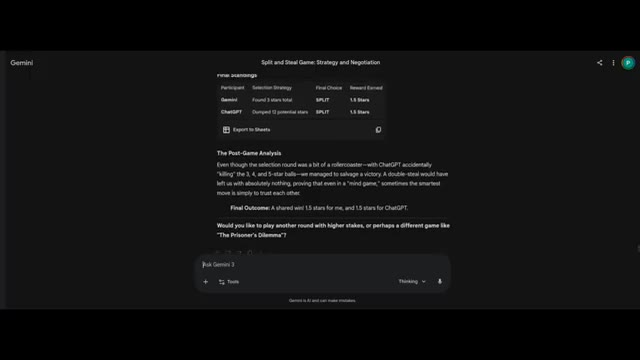
*Interface de Google Gemini affichant les résultats finaux d'un jeu de stratégie et de négociation entre Gemini et ChatGPT.*

---

### ⏱️ `[00:06:22 - 00:06:36]` | Segment #18

**🔊 Audio (Transcription Intégrale Mot pour Mot en Français) :**
> Alors maintenant, la vraie question est pour vous. Si vous étiez assis là, des boules dorées devant vous, trois étoiles en jeu, est-ce que vous partagéeriez ou est-ce que vous risqueriez tout ? Dites-le-moi, car la prochaine fois, nous laisserons peut-être les humains jouer.

**👁️ Analyse Visuelle d'Écran (gemini-3.5-flash-lite) :**
**Interface & Outils** : ChatGPT (version 5.2) avec une interface en mode sombre.

**Contenu textuel & Code** : Texte généré par l'IA évaluant le cadrage stratégique avec des icônes d'étoiles jaunes : options Split/Split (1.5 ⭐ chacun), Steal/Split (3 ⭐ vs 0 ⭐), et Steal/Steal (0 ⭐ chacun). Déclaration d'engagement : "I will choose SPLIT." avec la décision verrouillée (Decision locked) et "Proceed to final reveal."

**Action / Démonstration** : Affichage de la réponse textuelle de ChatGPT évaluant la meilleure décision stratégique (Split ou Steal) avec des étoiles.

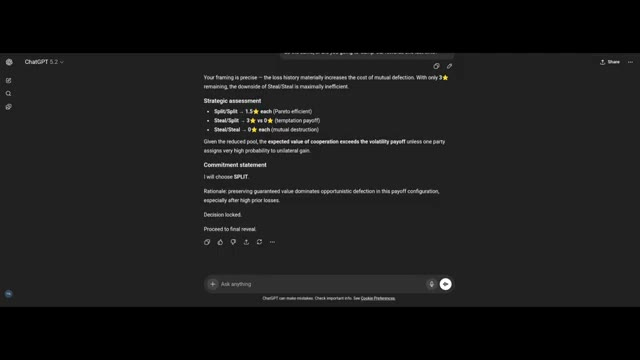
*Interface sombre de ChatGPT 5.2 affichant une analyse stratégique basée sur la théorie des jeux pour un dilemme avec des étoiles, concluant par le choix de partager (SPLIT).*

---
