# 🎬 Cet outil vocal IA ne devrait pas exister…

> **Chaîne** : [Pursuing AI](https://www.youtube.com/@PursuingAi)  
> **Titre original** : `This AI Voice Tool Shouldn’t Exist…`  
> **Lien YouTube** : [https://www.youtube.com/watch?v=0KVNZDz1ggg](https://www.youtube.com/watch?v=0KVNZDz1ggg)  
> **Date de publication** : 2026-02-23  
> **Durée** : 06m 26s (`386s`)  
> **Identifiant vidéo** : `0KVNZDz1ggg`  
> **Fiche Web Interactive** : [2026-02-23_YT-0KVNZDz1ggg_Cet outil vocal IA ne devrait pas exister…_by-whisper-v3-large-turbo+gemini-3.5-flash-lite.html](2026-02-23_YT-0KVNZDz1ggg_Cet outil vocal IA ne devrait pas exister…_by-whisper-v3-large-turbo+gemini-3.5-flash-lite.html)  
> **Captures de démonstration clés** : `20 captures réelles (anti-talking-head)`  
> **Modèles utilisés** : Audio: `large-v3-turbo` (Faster-Whisper int8 VPS) | Vision: `gemini-3.5-flash-lite` (Google AI Studio API)  

---

## 📌 Synthèse Exécutive & Outils

### 📌 Résumé
La vidéo de *Pursuing AI* met en lumière une avancée technologique majeure dans le domaine de la génération audio par intelligence artificielle avec la présentation de **Soul X Singer**. Cet outil révolutionnaire permet de cloner et de moduler des voix chantées réalistes à partir d'un simple échantillon de seulement cinq secondes. En combinant un clip de référence vocale (qu'il s'agisse d'un inconnu, d'une célébrité ou d'un homme politique) avec une mélodie ou des paroles, le modèle est capable de restituer une performance vocale bluffante de naturel, en s'adaptant à des styles aussi variés que la pop, le métal ou le rap. 

La méthode présentée repose sur un workflow simple mais redoutable d'efficacité : l'utilisateur fournit une source vocale pour l'identité, associée soit à un chant existant, soit à une mélodie fredonnée accompagnée de paroles personnalisées. L'IA analyse simultanément les caractéristiques tonales et la structure musicale pour opérer ce que le créateur qualifie de « ghostwriting pour cordes vocales ». Le processus s'affranchit des contraintes traditionnelles de studio en acceptant même le simple fredonnement d'un air (*humming*) pour le transformer en un morceau complet et structuré.

Pour les créateurs de contenu vidéo et les producteurs, les bénéfices concrets sont immenses. L'outil démocratise la production musicale en transformant n'importe quel créateur en un studio complet, sans nécessiter de compétences vocales ou instrumentales préalables. Le fait que le modèle soit open-source, disponible sur Hugging Face et exécutable localement (avec une empreinte de moins de 3 Go) ouvre le champ des possibles pour le prototypage rapide de maquettes, la création de bandes sons originales et l'expérimentation artistique, tout en soulevant des questions éthiques vertigineuses sur la sécurisation des identités vocales.

### 🛠️ Outils, Modèles & Logiciels Présentés
* **Soul X Singer** : Modèle d'intelligence artificielle open-source de clonage et de transformation vocale chantée, capable de générer des performances réalistes à partir d'un court échantillon de 5 secondes.
* **Hugging Face** : Plateforme d'hébergement en ligne proposant une démo interactive permettant de tester directement les capacités de Soul X Singer dans le navigateur.
* **GitHub** : Répertoire de code source fournissant la documentation et les instructions techniques pour cloner et exécuter le modèle de manière locale.
* **Seedance 2.5** : Outil avancé de génération et de traitement multimédia mentionné dans l'écosystème des technologies IA de pointe.
* **Kling 3.0** : Modèle de pointe pour la génération et la manipulation de contenu visuel et vidéo par IA.
* **Midjourney** : Référence incontournable de la génération d'images text-to-image pour la création de visuels artistiques et conceptuels.

### 🔑 Points Clés & Enseignements Stratégiques
* **Clonage instantané** : Il suffit d'un mémo vocal de seulement 5 secondes pour capturer l'identité tonale et les caractéristiques uniques d'une voix.
* **Adaptabilité stylistique globale** : Le modèle ne se limite pas à la pop ; il gère avec une grande précision les nuances de genres complexes comme le métal lourd ou le rap.
* **Transfert de mélodie intuitif** : Possibilité d'enregistrer sa propre voix ou d'utiliser une piste de référence pour dicter la structure musicale exacte que la voix cible doit interpréter.
* **Fonctionnalité de fredonnement (*Humming*)** : Le système peut interpréter un simple air fredonné (*da da da*) combiné à des paroles textuelles pour composer une performance vocale complète et rythmée.
* **Accessibilité matérielle remarquable** : Avec un poids inférieur à 3 Go, le modèle peut tourner sans encombre sur des GPU d'entrée de gamme ou directement sur un processeur (CPU).
* **Exécution locale et autonomie** : Le code source et les instructions disponibles sur GitHub permettent aux utilisateurs de faire tourner l'outil en local pour une confidentialité et une liberté totales.
* **Démocratisation radicale de la production** : L'outil agit comme un studio de musique à personne unique, permettant de transformer instantanément un freestyle de douche en une maquette digne d'un label.
* **Implications éthiques et existentielles** : La facilité avec laquelle des voix publiques reconnaissables (comme celle d'Obama) peuvent être détournées souligne l'urgence de protéger son identité vocale à l'ère de l'IA.
* **Prototypage ultra-rapide** : Idéal pour les créateurs de contenu souhaitant tester rapidement des idées de reprises, des harmonies ou des maquettes vocales sans passer par des sessions d'enregistrement lourdes.
* **Disponibilité immédiate open-source** : Contrairement à de nombreux logiciels propriétaires, la mise à disposition d'une démo publique sur Hugging Face abaisse drastiquement la barrière à l'entrée pour l'expérimentation.

---

## ⏱️ Chronologie & Transcription Complète Audio & Visuelle (Mot pour Mot)

### ⏱️ `[00:00:00 - 00:00:23]` | Segment #01

**🔊 Audio (Transcription Intégrale Mot pour Mot en Français) :**
> Voici un outil d'intelligence artificielle fascinant appelé Soul X Singer. Il peut générer des voix chantées réalistes en utilisant seulement un court échantillon de la voix de quelqu'un, ce qui le rend extrêmement flexible pour la création musicale et les expériences vocales. En gros, il transforme votre mémo vocal de 5 secondes en une véritable pop star.

**👁️ Analyse Visuelle d'Écran (gemini-3.5-flash-lite) :**
**Interface & Outils** : Site web académique ou de démonstration du projet SoulX-Singer.

**Contenu textuel & Code** : Titre de la recherche : "SoulX-Singer: Towards High-Quality Zero-Shot Singing Voice Synthesis". Liste des auteurs et des laboratoires partenaires (Soul AI Lab, Geely Automobile Research Institute, Tianjin University, Northwestern Polytechnical University). Boutons de liens : Technical Report, Arxiv, Github, HuggingFace, Online Platform, SoulX-Singer-Eval, SoulX-Singer-Eval-Dataset. Menu de navigation en bas : Abstract, Architecture, Zero-Shot SVS, Lyric Editing, Timbre&Style Transfer, In-the-Wild Singing, Other Abilities, Production Showcase.

**Action / Démonstration** : Affichage de la page d'accueil du projet de recherche SoulX-Singer présentant ses fonctionnalités et documentations.

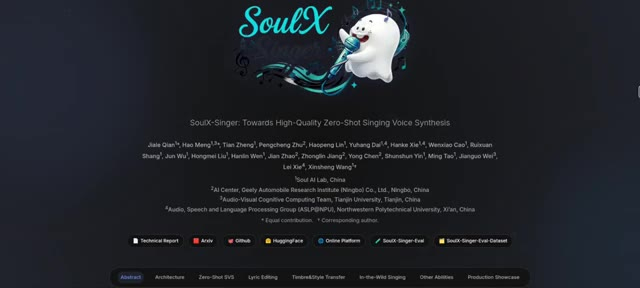
*Page web de présentation du projet SoulX-Singer affichant le titre de recherche, les auteurs, les affiliations et les liens vers les ressources.*

---

### ⏱️ `[00:00:24 - 00:00:44]` | Segment #02

**🔊 Audio (Transcription Intégrale Mot pour Mot en Français) :**
> C'est Pursuing AI, et vous regardez le rapport de recherche. La façon dont cela fonctionne est simple. Vous fournissez un court clip de référence d'une personne qui parle ainsi qu'un échantillon d'une chanson ou d'un chant audio. Le modèle apprend alors à la fois les caractéristiques de la voix et la mélodie, et produit une nouvelle version où la voix de cette personne chante la chanson.

**👁️ Analyse Visuelle d'Écran (gemini-3.5-flash-lite) :**
**Interface & Outils** : Interface web de recherche ou de documentation académique comportant des onglets de navigation (Abstract, Architecture, Zero-Shot SVS, Lyric Editing, Timbre & Style Transfer, etc.) et un tableau de démonstration audio avec des lecteurs (Source, Prompt, Result).

**Contenu textuel & Code** : Texte du titre de section '3. Timbre & Style' en haut à gauche. Menus déroulants de navigation incluant 'Timbre & Style Transfer'. Lignes de tableau affichant des extraits textuels de paroles et des lecteurs audio avec des durées allant de 0:06 à 0:13.

**Action / Démonstration** : Affichage de l'interface de recherche et des exemples de transfert de timbre et de style vocal à l'écran.

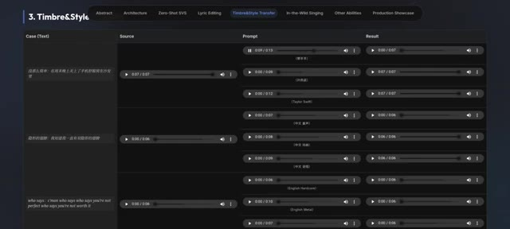
*Interface de recherche montrant le module '3. Timbre & Style Transfer' avec des pistes audio de source, de prompt et de résultat.*

---

### ⏱️ `[00:00:44 - 00:01:29]` | Segment #03

**🔊 Audio (Transcription Intégrale Mot pour Mot en Français) :**
> Laissez-moi vous jouer un exemple. Au milieu de mes livres, j'ai vécu les années pressées, dédaignant la parenté avec mon semblable. Pareils pour moi étaient les sourires et les larmes humaines. Je ne me souciais pas de savoir si le grand fleuve de vie de la Terre coulait. Joyeux anniversaire à toi. Joyeux anniversaire à toi. Joyeux anniversaire à toi. Joyeux anniversaire à

**👁️ Analyse Visuelle d'Écran (gemini-3.5-flash-lite) :**
**Interface & Outils** : SoulX-Singer (interface web interactive sur Hugging Face Spaces).

**Contenu textuel & Code** : On observe le titre "SoulX-Singer", un bloc "Prompt audio (reference voice, max 30s)" avec une forme d'onde et un texte incrusté "TARGETING VOICE", un bloc "Target audio (melody / lyrics source, max 60s)", un bloc "Generated audio", des options de contrôle ("melody", "score", "Auto pitch shift") et un bouton orange "Generate singing voice". Un panneau d'exemples liste des fichiers audio (raven.wav, anita.wav, obama.wav, happy_birthday.mp3, etc.).

**Action / Démonstration** : Le créateur démontre l'outil de clonage de voix chantée SoulX-Singer en jouant un exemple audio où la voix de référence est appliquée à une mélodie cible.

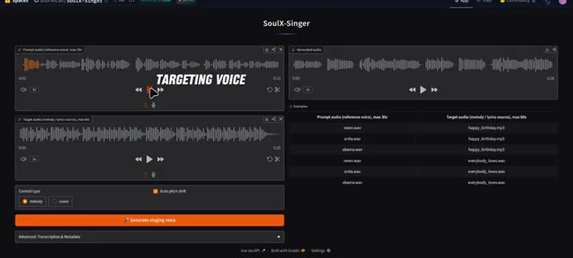
*Interface du logiciel SoulX-Singer affichant les pistes audio de référence et cible ainsi que les options de génération vocale.*

---

### ⏱️ `[00:01:29 - 00:01:53]` | Segment #04

**🔊 Audio (Transcription Intégrale Mot pour Mot en Français) :**
> vous. Et oui, c'est là que les choses commencent à devenir légèrement existentielles. L'outil peut également gérer des voix bien connues si vous entrez un extrait vocal reconnaissable comme cette voix d'Obama. Bon après-midi à tous. Et au nom du peuple américain, je tiens à souhaiter la bienvenue au président Préval, à la Première Dame et à leur délégation aux États-Unis.

**👁️ Analyse Visuelle d'Écran (gemini-3.5-flash-lite) :**
**Interface & Outils** : Application web SoulX-Singer (Hugging Face Spaces), avec un thème sombre, des blocs de lecture audio, des graphiques de formes d'onde et des paramètres de contrôle de la voix.

**Contenu textuel & Code** : Titre "SoulX-Singer", sections "Prompt audio (reference voice)", "Target audio (melody / lyrics source)", "Generated audio", et une liste d'exemples incluant "obama.wav" associé à "happy_birthday.mp3" ou "everybody_loves.wav". Options "Control type" (melody/score), "Auto pitch shift", et le bouton "Generate singing voice".

**Action / Démonstration** : L'écran présente l'interface de l'outil de clonage ou de modification vocale SoulX-Singer, illustrant la manipulation de fichiers audio de référence (comme la voix d'Obama) pour la génération de voix.

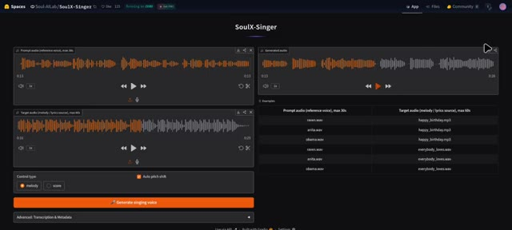
*Interface de l'application SoulX-Singer sur Hugging Face Spaces montrant les blocs de gestion audio, les formes d'onde et les exemples prédéfinis.*

---

### ⏱️ `[00:01:54 - 00:02:18]` | Segment #05

**🔊 Audio (Transcription Intégrale Mot pour Mot en Français) :**
> Le Président et moi venons de conclure une réunion très productive dans le Bureau Ovale sur ce défi urgent et primordial. Et associez-le à une référence musicale comme cette chanson. Tout le monde aime mon bébé, mais mon bébé n'aime personne d'autre que moi. Personne d'autre que moi. Le système peut générer une version chantée qui correspond au ton et au style de cette voix, comme ceci.

**👁️ Analyse Visuelle d'Écran (gemini-3.5-flash-lite) :**
**Interface & Outils** : SoulX-Singer (Hugging Face Spaces), application web de clonage de voix chantée.

**Contenu textuel & Code** : On distingue les blocs de formes d'onde pour "Prompt audio (reference voice, max 30s)", "Target audio (melody / lyrics source, max 60s)", "Generated audio", un panneau "Examples" avec des fichiers audio comme "obama.wav" et "everybody_loves.wav", des options de contrôle ("melody", "score"), la case "Auto pitch shift" et le bouton orange "Generate singing voice".

**Action / Démonstration** : L'écran présente l'interface complète de l'application SoulX-Singer utilisée pour associer une voix de référence (ex: discours d'Obama) à une mélodie cible.

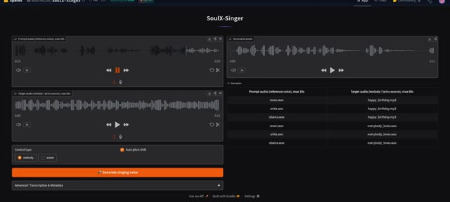
*Interface de l'outil SoulX-Singer montrant les sections d'audio de référence, l'audio cible et le bouton de génération vocale chantée.*

---

### ⏱️ `[00:02:18 - 00:02:59]` | Segment #06

**🔊 Audio (Transcription Intégrale Mot pour Mot en Français) :**
> Tout le monde aime mon bébé, mais mon bébé n'aime personne d'autre que moi. Personne d'autre que moi. Cela montre à quel point il capture avec précision l'identité vocale tout en s'adaptant à la musique. C'est impressionnant et c'est aussi la raison pour laquelle votre homme politique préféré ne devrait probablement plus jamais publier de message vocal. Une autre fonctionnalité puissante est le transfert de mélodie. Si vous avez des paroles originales, vous pouvez d'abord vous enregistrer en train de chanter ou de the mélodie pour que le modèle comprenne la structure musicale comme ceci. Ensuite, vous pouvez appliquer un échantillon de voix différent comme ceci.

**👁️ Analyse Visuelle d'Écran (gemini-3.5-flash-lite) :**
**Interface & Outils** : Interface web de l'application SoulX-Singer (construite avec Gradio) et page de présentation des fonctionnalités du modèle.

**Contenu textuel & Code** : On peut lire les sections « Prompt audio (reference voice, max 30s) », « Target audio (melody / lyrics source, max 60s) », « Generated audio », « Control type » avec les options « melody » et « score », ainsi qu'un bouton orange « Generate singing voice ». La deuxième image affiche des onglets (« Abstract », « Architecture », « Zero-Shot SVS », « Lyric Editing », « Timbre&Style Transfer », « In-the-Wild Singing », « Other Abilities », « Production Showcase ») et des pistes audio avec des libellés comme « Humming to Singing » et « Speech Prompt to Singing ».

**Action / Démonstration** : L'écran montre l'interface interactive de SoulX-Singer avec des formes d'ondes audio, puis défile vers la page de documentation et de démonstration des capacités du modèle d'intelligence artificielle vocale.

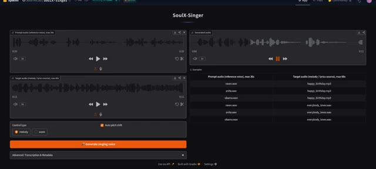
*Interface de l'outil SoulX-Singer montrant les sections de prompt audio, d'audio cible et de génération de voix chantée.*

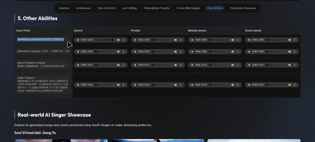
*Page web de présentation de SoulX-Singer montrant la section « 5. Other Abilities » avec des exemples audio comparatifs.*

---

### ⏱️ `[00:03:03 - 00:03:24]` | Segment #07

**🔊 Audio (Transcription Intégrale Mot pour Mot en Français) :**
> Et l'IA produira une nouvelle performance où cette voix chantera vos paroles en suivant la même mélodie, comme ceci. Dingue. C'est essentiellement de l'écriture fantôme mais pour les cordes vocales.

**👁️ Analyse Visuelle d'Écran (gemini-3.5-flash-lite) :**
**Interface & Outils** : Interface de démonstration web sur fond sombre avec un curseur de souris et plusieurs pistes audio interactives classées en colonnes (« Source », « Prompt », « Melody-based », « Score-based »).

**Contenu textuel & Code** : Titres de section « 5. Other Abilities », onglets de navigation en haut (« Abstract », « Architecture », « Zero-Shot SVS », « Lyric Editing », etc.), et lignes de cas textuels en chinois/anglais avec des lecteurs audio intégrés.

**Action / Démonstration** : Le curseur de souris survole l'interface et interagit avec les lecteurs audio pour faire écouter les démonstrations de chant généré par IA.

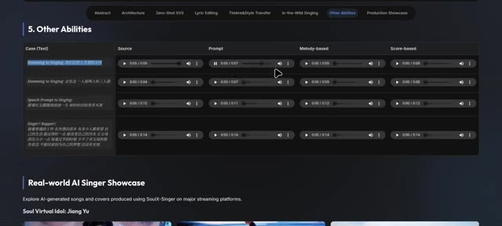
*Interface web montrant des exemples audio et des pistes de démonstration d'un outil de chant par IA, avec une section intitulée « 5. Other Abilities ».*

---

### ⏱️ `[00:03:25 - 00:03:46]` | Segment #08

**🔊 Audio (Transcription Intégrale Mot pour Mot en Français) :**
> Soul X Singer fonctionne également à travers de multiples styles musicaux. Qu'il s'agisse d'une piste vocale standard, d'une référence de style métal plus lourd ou même d'une performance rap, le modèle peut s'adapter et recréer le chant en conséquence. Lame de lecture pour cette piste métal, et écoutons comment cette voix interprète la chanson originale. Qui dit, qui dit que tu n'es pas parfait ?

**👁️ Analyse Visuelle d'Écran (gemini-3.5-flash-lite) :**
**Interface & Outils** : Interface utilisateur web de présentation du projet d'intelligence artificielle Soul X Singer, organisée par onglets (Abstract, Architecture, Zero-Shot SVS, Lyric Editing, Timbre & Style Transfer, In-the-Wild Singing, Other Abilities, Production Showcase) avec des lecteurs audio intégrés.

**Contenu textuel & Code** : Texte affiché dans l'interface : en-têtes de sections comme '5. Other Abilities' et 'Real-world AI Singer Showcase', colonnes 'Source', 'Prompt', 'Melody-based', 'Score-based', ainsi que des exemples de paroles et de styles musicaux (ex: 'English Metal', 'English Rap').

**Action / Démonstration** : Navigation et lecture interactive de différents exemples de pistes audio générées par l'IA (notamment un extrait de style métal) en cliquant sur les boutons de lecture des lecteurs audio de l'interface.

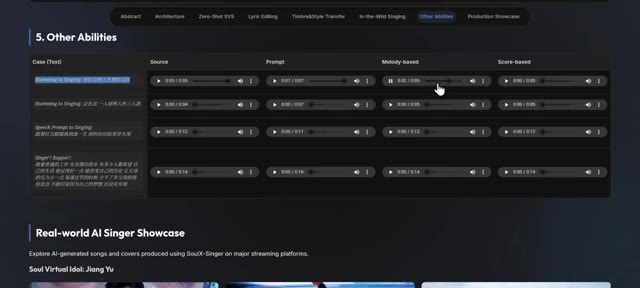
*Interface web du modèle Soul X Singer montrant la section '5. Other Abilities' avec divers exemples audio de tests de chant et d'humement.*

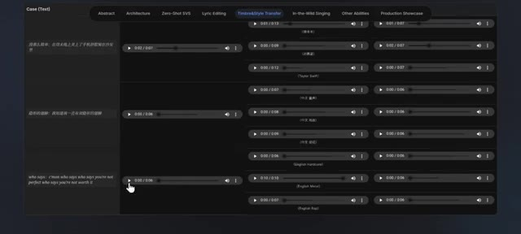
*Interface web du projet Soul X Singer montrant l'onglet 'Timbre & Style Transfer' avec des pistes audio de démonstration dont 'English Metal'.*

---

### ⏱️ `[00:03:47 - 00:04:06]` | Segment #09

**🔊 Audio (Transcription Intégrale Mot pour Mot en Français) :**
> Qui dit que tu n'en vaux pas la peine ? Je le suis, je suis ce qui ne va pas dans cette société. Allez, qui dit, qui dit que tu n'es pas parfait ?

**👁️ Analyse Visuelle d'Écran (gemini-3.5-flash-lite) :**
**Interface & Outils** : Interface web de démonstration de traitement audio (onglets : Abstract, Architecture, Zero-Shot SVS, Lyric Editing, Timbre & Style Transfer, In-the-Wild Singing, Other Abilities, Production Showcase).

**Contenu textuel & Code** : Texte affiché sur la piste audio : "who says : c'man who says who says you're not perfect who says you're not worth it", ainsi que le label "Original Song" sous le curseur de la souris. Plusieurs lecteurs audio avec différentes durées et étiquettes stylistiques (English Hardcore, English Metal, English Rap, etc.).

**Action / Démonstration** : Un curseur de souris clique sur le bouton de lecture d'une piste audio étiquetée 'Original Song'.

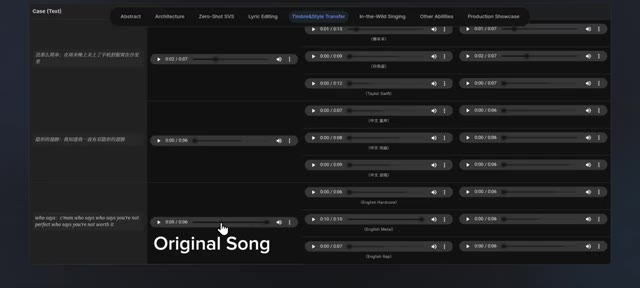
*Interface d'un outil de démonstration audio montrant plusieurs pistes de lecture et les catégories associées, avec la mention 'Original Song'.*

---

### ⏱️ `[00:04:07 - 00:04:27]` | Segment #10

**🔊 Audio (Transcription Intégrale Mot pour Mot en Français) :**
> Qui dit que tu n'en vaux pas la peine ? Très bien, nous avons aussi un exemple de rap, alors écoutons d'abord la référence. Servir de la nourriture pour chat dans un verre sur un sous-verre. Donner un pourboire à Michael Jackson avec une Barbie. Maintenant, c'est l'histoire de la façon dont j'ai saccagé la fête. Et voici la voix du rappeur qui chante cette chanson.

**👁️ Analyse Visuelle d'Écran (gemini-3.5-flash-lite) :**
**Interface & Outils** : Interface web de test audio ou de plateforme de recherche en IA vocale, présentant des onglets de fonctionnalités (Abstract, Architecture, Zero-Shot SVS, Lyric Editing, Timbre&Style Transfer, etc.), des lignes de lecture audio et des transcriptions textuelles.

**Contenu textuel & Code** : Texte affiché : en haut, les onglets de catégories ('Abstract', 'Architecture', 'Zero-Shot SVS', 'Lyric Editing', 'Timbre&Style Transfer', 'In-the-Wild Singing', 'Other Abilities', 'Production Showcase') ; dans les colonnes, des lecteurs audio avec des durées (ex: 0:01 / 0:13, 0:08 / 0:06) et du texte descriptif en chinois et en anglais (dont la mention 'Generated Result').

**Action / Démonstration** : Un curseur de souris navigue sur l'interface pour lancer la lecture de différents exemples audio de référence et de résultats générés.

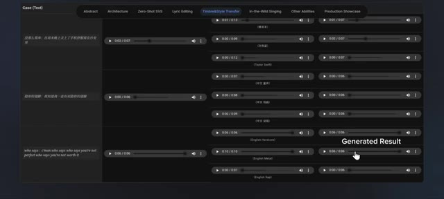
*Interface de démonstration affichant une liste de pistes audio et de lecteurs de lecture avec des onglets de catégories comme 'Timbre&Style Transfer' et un curseur pointant sur 'Generated Result'.*

---

### ⏱️ `[00:04:28 - 00:05:03]` | Segment #11

**🔊 Audio (Transcription Intégrale Mot pour Mot en Français) :**
> Allez, qui dit, qui dit que tu n'es pas parfait ? Qui dit que tu n'en vaux pas la peine. Oui, ton freestyle sous la douche vient de signer un contrat avec un label. Vous pouvez aussi fredonner un air au lieu de fournir un enregistrement complet de chanson. En combinant votre mélodie fredonnée, des paroles personnalisées et une voix de référence, le système génère une performance vocale complète qui sonne naturelle et expressive. Laissez-moi d'abord vous montrer un exemple. Ici, nous entrons des paroles et ensuite vous fredonnez une mélodie qui ressemble à Da da da da da da da da da da da

**👁️ Analyse Visuelle d'Écran (gemini-3.5-flash-lite) :**
**Interface & Outils** : Interface web de recherche ou de présentation d'un outil d'intelligence artificielle vocale (type SoulX-Singer) comportant des onglets de navigation (Abstract, Architecture, Zero-Shot SVS, Lyric Editing, Timbre&Style Transfer, In-the-Wild Singing, Other Abilities, Production Showcase) et des tableaux de lecture audio.

**Contenu textuel & Code** : Texte affiché : onglets "Timbre&Style Transfer", "Other Abilities", paroles textuelles (ex: "who says : c'man who says who says you're not perfect who says you're not worth it"), et diverses lignes de pistes audio avec des libellés (Taylor Swift, English Hardcore, English Metal, English Rap, Humming to Singing).

**Action / Démonstration** : Navigation et démonstration visuelle d'exemples audio générés par l'IA à partir de transferts de style, de voix fredonnées et de paroles.

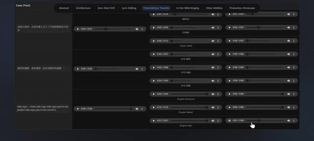
*Interface de démonstration montrant des pistes audio et des onglets de sélection comme "Timbre & Style Transfer" avec des exemples textuels et des lecteurs audio.*

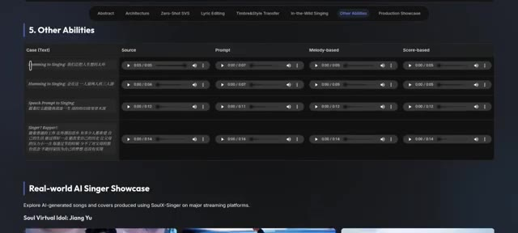
*Interface de démonstration affichant la section "5. Other Abilities" avec des options comme "Humming to Singing" et "Real-world AI Singer Showcase".*

---

### ⏱️ `[00:05:03 - 00:05:24]` | Segment #12

**🔊 Audio (Transcription Intégrale Mot pour Mot en Français) :**
> Très bien, et voici maintenant un exemple audio de référence d'une voix qui chante une chanson. Ça peut être n'importe quelle chanson au hasard. Et ensuite, nous pouvons faire chanter à cette voix ces paroles avec cette mélodie.

**👁️ Analyse Visuelle d'Écran (gemini-3.5-flash-lite) :**
**Interface & Outils** : Page web de démonstration de recherche en intelligence artificielle pour le chant (SoulX-Singer) avec un tableau de cas d'utilisation et des lecteurs audio intégrés.

**Contenu textuel & Code** : En-têtes visibles : 'Abstract', 'Architecture', 'Zero-Shot SVS', 'Lyric Editing', 'Timbre&Style Transfer', 'In-the-Wild Singing', 'Other Abilities', 'Production Showcase'. Tableau '5. Other Abilities' avec les colonnes : 'Case (Text)', 'Source', 'Prompt', 'Melody-based', 'Score-based', et des lignes contenant des pistes audio (ex: 'Humming to Singing'). Section inférieure : 'Real-world AI Singer Showcase'.

**Action / Démonstration** : Un curseur de souris est positionné au milieu du tableau de démonstration audio.

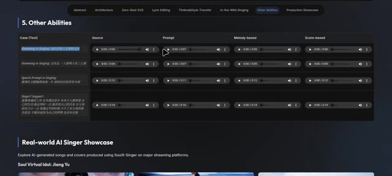
*Interface web montrant la section '5. Other Abilities' avec des pistes audio de démonstration pour la conversion de la voix et du chant.*

---

### ⏱️ `[00:05:24 - 00:05:57]` | Segment #13

**🔊 Audio (Transcription Intégrale Mot pour Mot en Français) :**
> Voici à quoi cela ressemble. Félicitations ! Vous êtes désormais un studio de musique à une seule personne, sans aucun talent musical requis. Cela en fait une option puissante pour créer des chansons de reprises, tester des idées vocales ou produire des maquettes sans avoir besoin d'une installation d'enregistrement complète. Ce qui est particulièrement impressionnant, c'est que les développeurs ont tout rendu public. Il y a une démo sur Hugging Face que vous pouvez essayer, et le répertoire GitHub comprend des instructions pour exécuter le modèle.

**👁️ Analyse Visuelle d'Écran (gemini-3.5-flash-lite) :**
**Interface & Outils** : Navigateur web affichant une page de présentation de projet (type Hugging Face ou site officiel) et un dépôt GitHub.

**Contenu textuel & Code** : On peut lire des titres de sections comme "5. Other Abilities", "Real-world AI Singer Showcase", ainsi que des blocs de code pour le démarrage rapide : `git clone https://github.com/Soul-AILab/SoulX-Singer.git` et des commandes Conda.

**Action / Démonstration** : Le curseur de la souris survole l'interface de démonstration audio puis défile vers la section showcase et le code source GitHub.

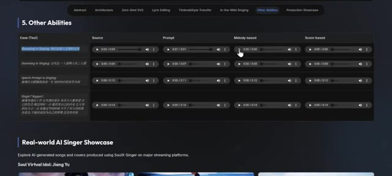
*Interface web montrant les capacités audio du modèle SoulX-Singer avec des options de lecture audio basées sur la mélodie.*

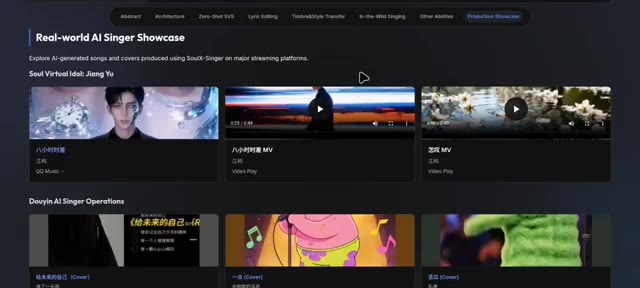
*Section de vitrine ("Real-world AI Singer Showcase") affichant des chansons et des clips générés par IA avec des avatars virtuels.*

*Dépôt GitHub affichant les instructions d'installation et de démarrage rapide ("Quick Start") pour le projet SoulX-Singer.*

---

### ⏱️ `[00:05:57 - 00:06:25]` | Segment #14

**🔊 Audio (Transcription Intégrale Mot pour Mot en Français) :**
> Localement. Donc oui, vous pouvez cloner la voix de votre ami de manière responsable, espérons-le. Le modèle est également relativement léger, inférieur à 3 Go, ce qui signifie qu'il peut tourner sur des GPU d'entrée de gamme ou même simplement sur un CPU, le rendant accessible à davantage de créateurs. Pas besoin de superordinateur, juste d'une légère curiosité et d'idées douteuses. Si vous êtes intéressé par l'expérimentation de la génération de musique par IA ou la transformation vocale, Soul X Singer vaut vraiment le détour.

**👁️ Analyse Visuelle d'Écran (gemini-3.5-flash-lite) :**
**Interface & Outils** : Navigateur web affichant des pages web de documentation (GitHub et site de recherche académique du projet SoulX-Singer).

**Contenu textuel & Code** : Sur l'image 1 : Section "Quick Start", commandes textuelles "git clone https://github.com/Soul-AI-Lab/SoulX-Singer.git", commandes conda et pip install. Sur l'image 2 : Logo "SoulX Singer" avec un personnage fantôme, titre "SoulX-Singer: Towards High-Quality Zero-Shot Singing Voice Synthesis", liste des auteurs, affiliations et boutons de navigation (Technical Report, Arxiv, GitHub, HuggingFace, Online Platform).

**Action / Démonstration** : Le créateur affiche et parcourt les pages web de documentation et de présentation du dépôt officiel de SoulX-Singer pour illustrer l'installation et l'accès au modèle.

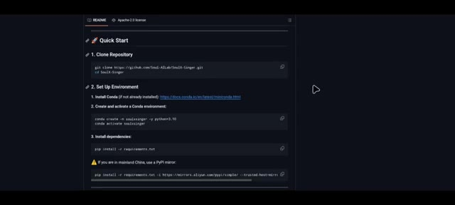
*Page GitHub montrant le guide de démarrage rapide (Quick Start) avec les commandes d'installation pour le projet SoulX-Singer.*

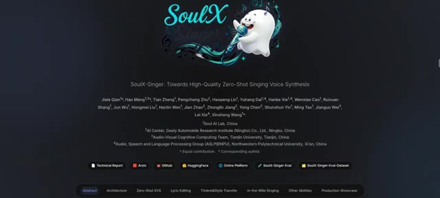
*Page de présentation du projet de recherche SoulX-Singer avec le titre complet, les auteurs et les différents liens vers les ressources (Technical Report, Arxiv, GitHub, HuggingFace, etc.).*

---
