# 🎬 Pourquoi Nano Banana 2 devient-il viral ?

> **Chaîne** : [Pursuing AI](https://www.youtube.com/@PursuingAi)  
> **Titre original** : `This Is Why Nano Banana 2 Is Going Viral?`  
> **Lien YouTube** : [https://www.youtube.com/watch?v=OAC-8KbNtmE](https://www.youtube.com/watch?v=OAC-8KbNtmE)  
> **Date de publication** : 2026-02-28  
> **Durée** : 03m 01s (`181s`)  
> **Identifiant vidéo** : `OAC-8KbNtmE`  
> **Fiche Web Interactive** : [2026-02-28_YT-OAC-8KbNtmE_Pourquoi Nano Banana 2 devient-il viral_by-whisper-v3-large-turbo+gemini-3.5-flash-lite.html](2026-02-28_YT-OAC-8KbNtmE_Pourquoi Nano Banana 2 devient-il viral_by-whisper-v3-large-turbo+gemini-3.5-flash-lite.html)  
> **Captures de démonstration clés** : `20 captures réelles (anti-talking-head)`  
> **Modèles utilisés** : Audio: `large-v3-turbo` (Faster-Whisper int8 VPS) | Vision: `gemini-3.5-flash-lite` (Google AI Studio API)  

---

## 📌 Synthèse Exécutive & Outils

### 📌 Résumé
La vidéo de *Pursuing AI* intitulée « Pourquoi Nano Banana 2 devient-il viral ? » met en lumière la toute dernière révolution de Google en matière de génération d'images par intelligence artificielle : **Nano Banana 2**. Ce supermodèle combine habilement la vitesse d'exécution fulgurante de Gemini Flash avec une qualité visuelle professionnelle, démocratisant ainsi la création de contenus ultra-rapides et accessibles à tous, du simple amateur au marketeur aguerri. Le créateur structure sa présentation en démontrant comment cet outil métamorphose un simple prompt textuel en visuels complexes, allant du diagramme scientifique détaillé au photoréalisme en 4K, tout en éliminant la barrière des compétences techniques traditionnelles comme Photoshop.

Sur le plan méthodologique, la vidéo adopte un format de "Research Report" dynamique, rythmé par l'énumération des six piliers fondamentaux qui font le succès viral du modèle : vitesse accrue, compréhension sémantique de haut niveau, ancrage dans la réalité via la recherche web, rendu 4K photoréaliste, cohérence parfaite des personnages et des scènes, ainsi que la capacité native à générer et traduire du texte multilingue directement dans l'image. Le créateur montre comment Google intègre ce modèle de manière transversale dans l'ensemble de son écosystème (application Gemini, Google Search, Google Ads, Flow et API Cloud), illustrant une stratégie de fluidification des workflows créatifs.

Pour les créateurs de vidéo et les professionnels de l'image, les bénéfices concrets sont immenses. Nano Banana 2 résout les problématiques historiques de l'IA générative : la lenteur, l'incohérence visuelle d'une image à l'autre et l'accès restreint par des barrières financières. En permettant de conserver la structure des personnages sous plusieurs angles et de générer du texte typographique lisible à la volée, l'outil s'impose comme un accélérateur de production incontournable, permettant de concevoir des campagnes marketing et des visuels narratifs percutants sans nécessiter d'années d'apprentissage en design.

### 🛠️ Outils, Modèles & Logiciels Présentés
* **Nano Banana** (et **Nano Banana 2**) : Le supermodèle d'image IA ultra-rapide de Google qui transforme des descriptions textuelles en visuels haute définition, diagrammes et textes intégrés.
* **Photoshop** : Le logiciel de retouche graphique traditionnel dont l'utilisation complexe est rendue superflue grâce à la puissance et à l'intuitivité de l'IA.
* **Flux** : L'outil de génération d'images intégré au cœur des flux de travail vidéo pour accélérer la production visuelle.
* **Gemini Flash** : Le modèle rapide de Google dont la technologie de rapidité est combinée à Nano Banana 2 pour offrir des performances instantanées.

### 🔑 Points Clés & Enseignements Stratégiques
* **Fusion de la vitesse et de la qualité** : Nano Banana 2 associe la rapidité d'exécution de Gemini Flash à un rendu professionnel auparavant réservé aux utilisateurs payants, éliminant les temps d'attente.
* **Compréhension sémantique avancée** : Le modèle interprète des instructions complexes (comme la création de diagrammes du cycle de l'eau avec flèches et étiquettes) sans se bloquer, surpassant la précision des anciens modèles.
* **Ancrage dans la réalité par le web** : L'IA ne se contente pas de produire des pixels aléatoires ; elle pioche dans les recherches web en temps réel pour garantir l'exactitude des objets, des lieux et des textes représentés.
* **Résolution 4K et photoréalisme poussé** : Capacité à générer des images atteignant la résolution 4K avec un éclairage riche, des textures minutieuses et des détails dignes d'un peintre numérique.
* **Cohérence accrue des scènes et des personnages** : Mémorisation efficace des éléments pour conserver le même personnage sous plusieurs angles ou maintenir la cohérence d'une scène complexe comportant de nombreux objets.
* **Intégration native du texte multilingue** : Génération directe de typographies lisibles à l'intérieur des images avec une fonction de traduction à la volée, agissant comme des sous-titres visuels.
* **Déploiement écosystémique global** : L'outil n'est pas confiné à une application unique mais est disséminé dans Gemini, Google Search, Google Lens, Google Ads et les plateformes Cloud pour développeurs.
* **Démocratisation des barrières techniques** : Le workflow permet de s'affranchir de logiciels lourds comme Photoshop ou de décennies d'expérience en design graphique pour obtenir des résultats professionnels instantanément.
* **Élimination des obstacles économiques** : Google met fin aux contraintes des "paywalls" bloquant l'accès aux IA de pointe, ouvrant la voie à une nouvelle génération de créateurs et de marketeurs.
* **Optimisation des flux de travail vidéo (Flow)** : Intégration directe de la génération d'images au sein des processus de production vidéo pour accélérer la création de story-boards et de visuels de campagne.

---

## ⏱️ Chronologie & Transcription Complète Audio & Visuelle (Mot pour Mot)

### ⏱️ `[00:00:00 - 00:00:21]` | Segment #01

**🔊 Audio (Transcription Intégrale Mot pour Mot en Français) :**
> Imaginez que vous puissiez penser à une image et boum ! Elle est instantanément créée en ultra-haute qualité avec du texte, des diagrammes, des photos, et même une précision réaliste. Tout à partir d'un simple anglais. Eh bien, arrêtez d'imaginer. Parce que Nano Banana 2 vient de le faire. C'est Pursuing AI, et vous regardez le Research Report.

**👁️ Analyse Visuelle d'Écran (gemini-3.5-flash-lite) :**
**Interface & Outils** : Écran de présentation vidéo illustrant des concepts d'intelligence artificielle générative et de traitement d'images.

**Contenu textuel & Code** : Texte affiché : "Beach", diagramme avec des blocs empilés ("Ocean Waves", "Sandy Shoreline", "Palm Trees & Sunset"), et logo "PAI" sur un processeur relié à un cerveau.

**Action / Démonstration** : Transition visuelle illustrant la création instantanée d'une image réaliste à partir d'une idée, suivie d'un graphique conceptuel sur l'IA.

*Image générée par IA floue représentant une femme en bikini sur une plage au coucher du soleil.*

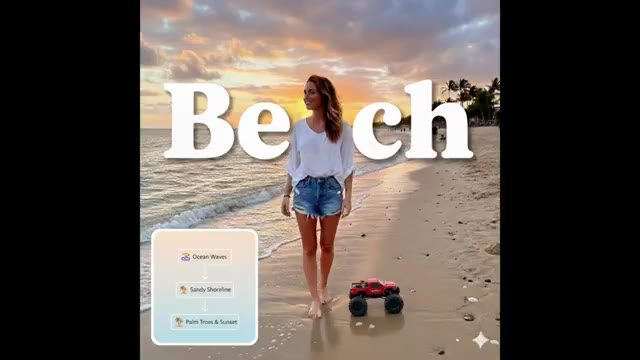
*Image nette d'une femme habillée sur une plage avec le mot 'Beach' en gros caractères et un diagramme de flux d'éléments ('Ocean Waves', 'Sandy Shoreline', 'Palm Trees & Sunset').*

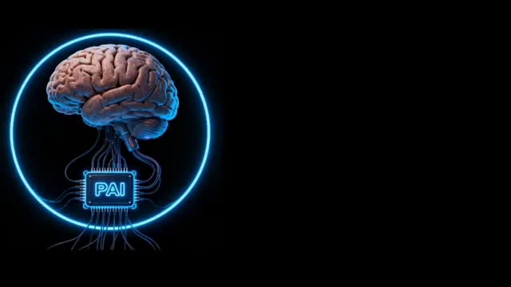
*Illustration 3D d'un cerveau humain connecté à une puce électronique portant l'inscription 'PAI' entourée d'un anneau lumineux bleu.*

---

### ⏱️ `[00:00:21 - 00:00:53]` | Segment #02

**🔊 Audio (Transcription Intégrale Mot pour Mot en Français) :**
> Bon, écoutez bien. Nano Banana 2, non, ce n'est pas une nouvelle boisson énergétique pour programmeurs. C'est le supermodèle d'image IA ultra rapide de Google qui transforme littéralement vos idées en visuels à la vitesse de l'éclair. Voici ce qu'il fait concrètement : premièrement, une magie d'image ultra rapide. Nano banana 2 combine la vitesse de Gemini Flash de Google avec la qualité de niveau professionnel auparavant réservée aux utilisateurs payants. Donc, si nano banana était une voiture de sport, ceci est la version propulsée par fusée. Le modèle 2 comprend ce que vous voulez dire.

**👁️ Analyse Visuelle d'Écran (gemini-3.5-flash-lite) :**
**Interface & Outils** : Article de blog Google DeepMind et interface de démonstration web "WINDOW SEAT" ainsi que l'interface de Gemini.

**Contenu textuel & Code** : Texte de l'article : "Nano Banana 2: Combining Pro capabilities with lightning-fast speed", nom de l'auteur Naina Raisinghani (Product Manager, Google DeepMind). Interface Window Seat avec champs "Location", "Specific view", "Weather source", "Window size (aspect ratio)". Interface Gemini avec le prompt concernant une fusée en forme de banane.

**Action / Démonstration** : Présentation des spécifications du nouveau modèle Google, manipulation des interfaces de génération visuelle et affichage des résultats générés par l'IA.

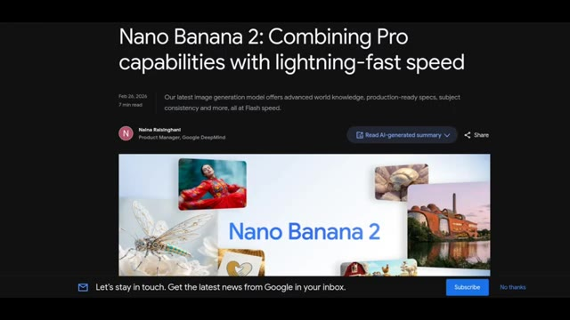
*Article de présentation de Google DeepMind titré "Nano Banana 2: Combining Pro capabilities with lightning-fast speed".*

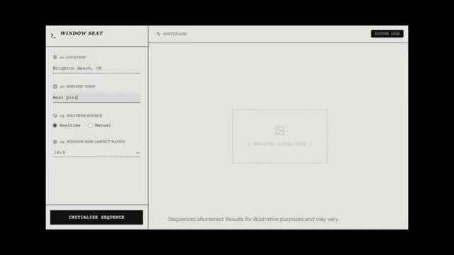
*Interface de l'application de démonstration "WINDOW SEAT" montrant les paramètres de localisation et de vue spécifique ("Brighton Beach, UK", "West pier").*

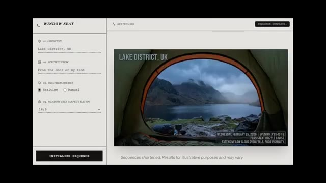
*Résultat de la génération dans l'interface "WINDOW SEAT" affichant une vue depuis une tente dans le Lake District au Royaume-Uni.*

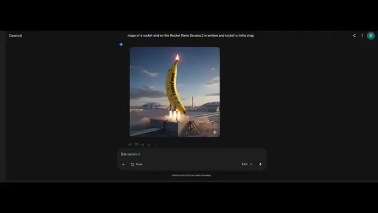
*Interface de Gemini affichant l'image générée d'une fusée en forme de banane avec l'inscription "NANO BANANA 2".*

---

### ⏱️ `[00:00:53 - 00:01:17]` | Segment #03

**🔊 Audio (Transcription Intégrale Mot pour Mot en Français) :**
> Vraiment, vous pouvez lui donner des choses complexes comme faire un diagramme du cycle de l'eau avec des flèches et des étiquettes et il ne va pas débloquer. Il suit des instructions de niveau supérieur beaucoup plus précisément que les anciens modèles. Troisièmement, le cerveau de la connaissance du monde. Il ne crache pas seulement des pixels. Il puise dans la recherche web réelle et des connaissances actualisées pour créer des visuels précis d'objets réels, d'endroits ou de texte dans les images.

**👁️ Analyse Visuelle d'Écran (gemini-3.5-flash-lite) :**
**Interface & Outils** : Interface utilisateur de texte et navigateur web affichant un article de documentation de Google The Keyword.

**Contenu textuel & Code** : Texte du prompt numéro 1 en anglais détaillant la création d'une infographie sur le cycle de l'eau style DIY, puis l'infographie générée correspondante avec les termes "Evaporation", "Condensation", "Precipitation" et "Runoff & Collection", et enfin la page web "Google The Keyword" avec le titre "Improved world knowledge".

**Action / Démonstration** : Présentation consécutive du prompt textuel, du résultat généré correspondant par l'IA, puis d'une page de documentation de Google soulignant les capacités de connaissance du monde et de recherche web.

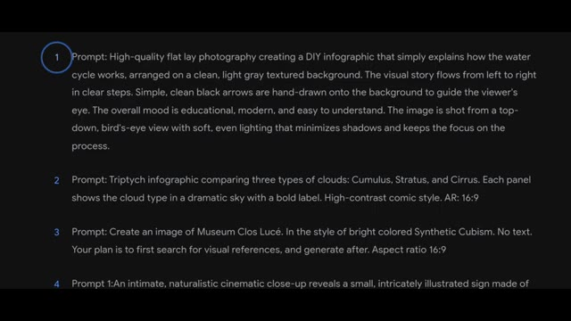
*Affichage d'un prompt textuel détaillé demandant une infographie sur le cycle de l'eau.*

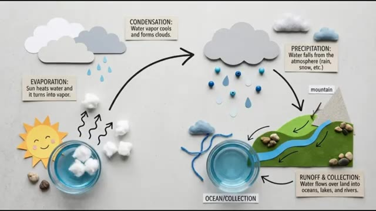
*Résultat visuel généré montrant une infographie détaillée et illustrée du cycle de l'eau avec des étiquettes et des flèches.*

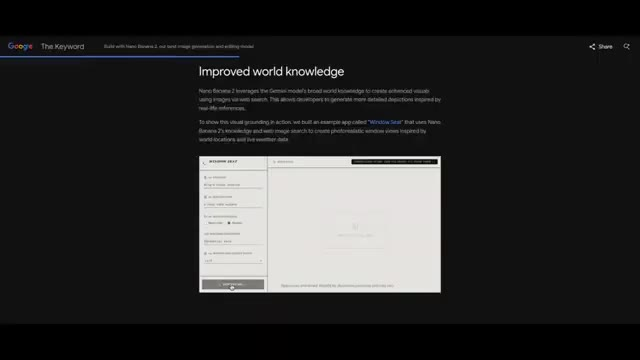
*Page web de documentation "Google The Keyword" illustrant l'amélioration de la connaissance du monde et l'intégration de la recherche web.*

---

### ⏱️ `[00:01:17 - 00:01:38]` | Segment #04

**🔊 Audio (Transcription Intégrale Mot pour Mot en Français) :**
> Cela signifie que vos graphismes sont ancrés dans la réalité, et non pas simplement des hallucinations aléatoires de l'IA. 4. Le photoréalisme allié à la puissance de la 4K. Cet outil ne se contente pas de créer des visuels au niveau des mèmes. Il génère une résolution allant jusqu'à 4K avec un éclairage riche, des détails précis et des textures réalistes, comme un peintre numérique en vitesse accélérée.

**👁️ Analyse Visuelle d'Écran (gemini-3.5-flash-lite) :**
**Interface & Outils** : Navigateur web affichant un article de blog technique de Google (The Keyword) sur le modèle Nano Banana 2.

**Contenu textuel & Code** : Texte sur l'amélioration des connaissances du monde, spécifications prêtes pour la production, prise en charge de la 4K, et affichage de visuels générés par IA (vue de fenêtre sur Brighton Beach et paysage de vallée luxuriante).

**Action / Démonstration** : Le navigateur présente des captures d'écran et des exemples de génération d'images haute résolution démontrant la fidélité visuelle et le réalisme.

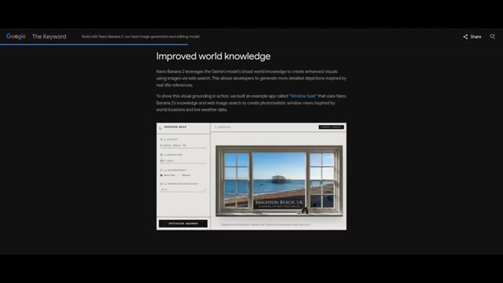
*Page web de Google The Keyword présentant les fonctionnalités de Nano Banana 2 et l'application exemple 'Window Seat'.*

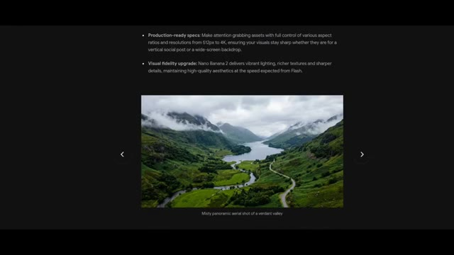
*Page web montrant les spécifications prêtes pour la production et un exemple de paysage montagneux brumeux.*

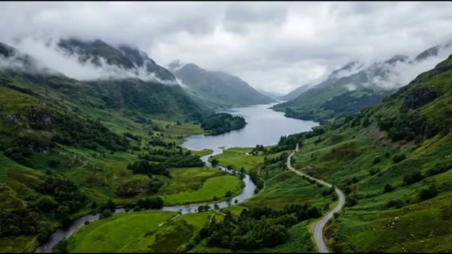
*Gros plan en plein écran sur l'image générée de la vallée verdoyante et du lac entouré de montagnes.*

---

### ⏱️ `[00:01:38 - 00:02:03]` | Segment #05

**🔊 Audio (Transcription Intégrale Mot pour Mot en Français) :**
> 5. Conserve la cohérence des personnages et des scènes. Vous voulez le même personnage sous 5 angles différents ou 14 objets dans 1 scène ? Nano Banana 2 les mémorise, pour que vos visuels n'aient pas l'air d'être passés au mixeur. 6. Texte multilingue et traduction. Nano Banana 2 peut générer du texte lisible directement à l'intérieur des images et le traduire à la volée, comme des sous-titres visuels à l'intérieur de votre photo.

**👁️ Analyse Visuelle d'Écran (gemini-3.5-flash-lite) :**
**Interface & Outils** : Interface web de présentation du modèle d'intelligence artificielle Nano Banana 2 (documentation ou site officiel de présentation de fonctionnalités).

**Contenu textuel & Code** : Texte à l'écran : "Production-ready specs...", "Visual fidelity upgrade...", "Highly stylized pop-art fashion portrait in different aspect ratios", "Joyful characters and items at a farm", "Precision text rendering and translation: Nano Banana 2 allows you to generate accurate, legible text...", "Localized 'Native Wildlife' sign".

**Action / Démonstration** : Le présentateur ou l'interface fait défiler des exemples visuels illustrant les points 5 et 6 sur la cohérence des scènes/objets et la traduction de texte intégrée.

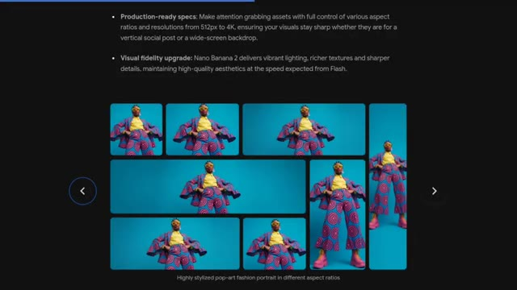
*Présentation des fonctionnalités de Nano Banana 2 montrant la cohérence des personnages et des scènes avec un portrait de mode pop-art stylisé dans différents formats.*

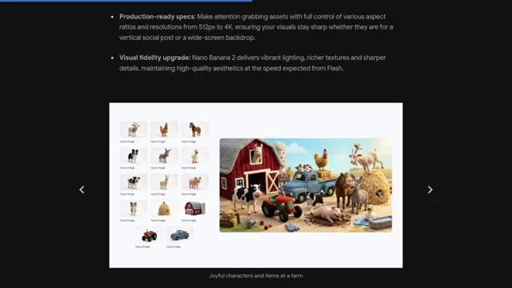
*Démonstration de Nano Banana 2 montrant la génération d'une scène de ferme cohérente intégrant de multiples objets et personnages à partir d'images sources.*

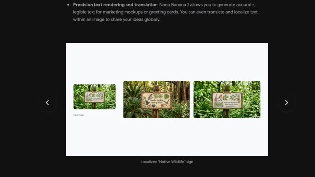
*Illustration de la fonction de texte multilingue et de traduction de Nano Banana 2 avec un panneau dans la nature affichant du texte localisé.*

---

### ⏱️ `[00:02:03 - 00:02:27]` | Segment #06

**🔊 Audio (Transcription Intégrale Mot pour Mot en Français) :**
> Où vous pouvez l'utiliser. Nano Banana 2 n'est pas dans une seule application. Il se déploie dans tout l'écosystème d'IA de Google. L'application Gemini, votre espace de création, le mode IA de Google Search et Lens, les images alimentées par la recherche de connaissances, Google Ads, les visuels de campagnes alimentés par l'IA, Flow, la génération d'images au sein des flux de travail vidéo, et les plateformes d'API et cloud pour l'accès des développeurs.

**👁️ Analyse Visuelle d'Écran (gemini-3.5-flash-lite) :**
**Interface & Outils** : Interface web de documentation ou de présentation sur fond noir avec du texte en blanc et des liens en bleu.

**Contenu textuel & Code** : Titre : "Try Nano Banana 2 today". Texte décrivant la disponibilité du modèle à travers divers produits Google : Gemini app, Search, AI Studio + API, Google Cloud, Flow et Google Ads.

**Action / Démonstration** : Affichage à l'écran de la liste des applications et plateformes Google où Nano Banana 2 est déployé.

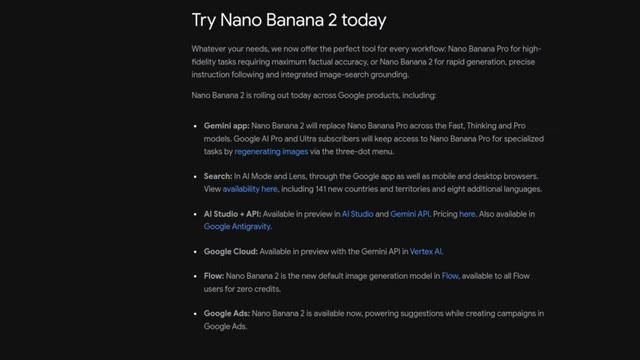
*Page de présentation listant les différentes intégrations de Nano Banana 2 dans l'écosystème Google.*

---

### ⏱️ `[00:02:27 - 00:02:56]` | Segment #07

**🔊 Audio (Transcription Intégrale Mot pour Mot en Français) :**
> Pourquoi c'est important. Avant Nano Banana 2, les visuels IA de haute qualité étaient soit lents, soit incohérents, soit bloqués derrière des paywalls. Maintenant, Google met des outils d'IA de niveau professionnel à la portée de tout le monde, et littéralement des générations de créateurs et de marketeurs vont surfer sur cette vague. Nano Banana 2, c'est comme projeter des super-pouvoirs de peinture colorée directement depuis votre clavier, tout cela sans nécessiter de compétences sur Photoshop, 10 ans d'expérience en design, ou vendre votre âme à un gourou.

**👁️ Analyse Visuelle d'Écran (gemini-3.5-flash-lite) :**
**Interface & Outils** : Démonstration visuelle de résultats générés par intelligence artificielle (visuels de haute qualité illustrant les capacités du modèle).

**Contenu textuel & Code** : Visuels artistiques et cinématiques variés produits par IA, démontrant la qualité et la diversité des rendus (typographie artistique, architecture complexe, scène de rue nocturne brumeuse).

**Action / Démonstration** : Présentation défilée d'exemples d'images et de scènes générées par IA illustrant la qualité professionnelle des résultats.

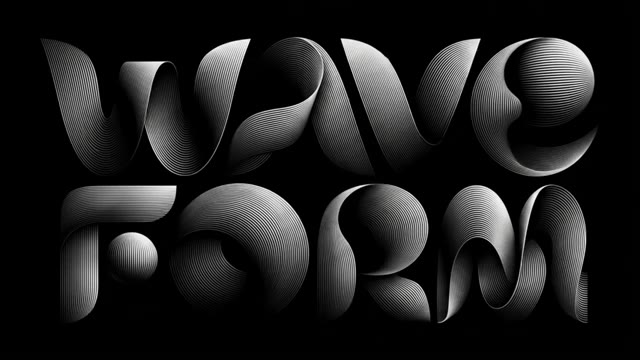
*Image générée par IA montrant le texte stylisé en typographie noire et blanche avec des formes d'ondes graphiques et le texte "WAVE FORM".*

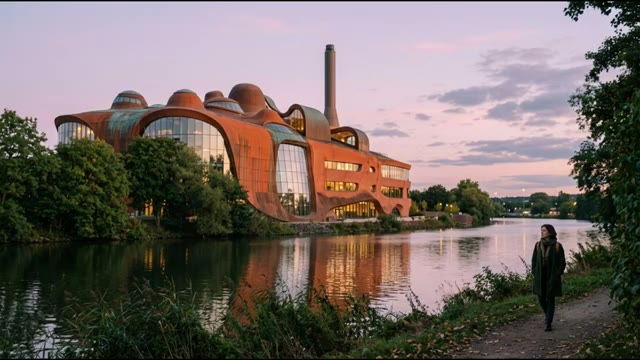
*Image générée par IA d'un bâtiment architectural aux formes organiques et cuivrées au bord d'une rivière, avec une personne qui marche sur un sentier au crépuscule.*

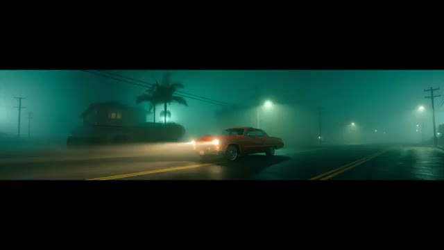
*Scène cinématique générée par IA montrant une voiture classique rouge roulant sur une route de nuit dans une brume épaisse aux teintes verdâtres.*

---
