# 🎬 OpenAI vient de lâcher GPT-5.4… C'est littéralement hallucinant

> **Chaîne** : [Pursuing AI](https://www.youtube.com/@PursuingAi)  
> **Titre original** : `OpenAI Just Dropped GPT-5.4… It’s Actually Crazy`  
> **Lien YouTube** : [https://www.youtube.com/watch?v=eI7gfK5E9N4](https://www.youtube.com/watch?v=eI7gfK5E9N4)  
> **Date de publication** : 2026-03-06  
> **Durée** : 04m 09s (`249s`)  
> **Identifiant vidéo** : `eI7gfK5E9N4`  
> **Fiche Web Interactive** : [2026-03-06_YT-eI7gfK5E9N4_OpenAI vient de lâcher GPT-5.4… C'est littéralement hallucinant_by-whisper-v3-large-turbo+gemini-3.5-flash-lite.html](2026-03-06_YT-eI7gfK5E9N4_OpenAI vient de lâcher GPT-5.4… C'est littéralement hallucinant_by-whisper-v3-large-turbo+gemini-3.5-flash-lite.html)  
> **Captures de démonstration clés** : `27 captures réelles (anti-talking-head)`  
> **Modèles utilisés** : Audio: `large-v3-turbo` (Faster-Whisper int8 VPS) | Vision: `gemini-3.5-flash-lite` (Google AI Studio API)  

---

## 📌 Synthèse Exécutive & Outils

### 📌 Résumé
La vidéo de Pursuing AI décrypte la sortie surprise de ChatGPT 5.4 (initialement masqué sous le nom de code « Galapagos » sur LM Arena), un modèle qui redéfinit les standards de l'intelligence artificielle générative et pulvérise les benchmarks de développement. Le créateur structure sa démonstration en soumettant l'IA à des tests de résistance technique de haute volée : génération d'un globe 3D interactif avec animations dorées, modélisation d'une pièce en 3D dotée d'une transition dynamique jour/nuit sophistiquée, conception d'un outil de recadrage d'image en temps réel et simulation ultra-réaliste d'une main articulée aux mouvements biomécaniques précis. 

Pour les créateurs de contenu vidéo, cette percée technologique transforme radicalement l'approche de la production visuelle et interactive. Grâce à une fenêtre de contexte colossale d'un million de tokens en entrée et de 128 000 tokens en sortie, combinée à une compréhension native des interfaces logicielles, le modèle permet de prototyper des applications web complexes et des visualisations 3D fluides en un temps record. La méthode étape par étape du créateur consiste à confronter directement les résultats de GPT-5.4 aux anciennes versions (comme GPT-5.2 Codex) et aux concurrents (comme Claude Sonnet 4.5 et Qwen 3.5), démontrant visuellement un bond en avant spectaculaire en matière de raisonnement spatial et d'exécution logicielle.

### 🛠️ Outils, Modèles & Logiciels Présentés
* **ChatGPT 5.4 (Galapagos)** : Modèle d'intelligence artificielle d'OpenAI doté d'un million de tokens de contexte, utilisé pour générer du code complexe, des simulations 3D interactives et surpasser les performances humaines sur le benchmark OS World.
* **Claude Sonnet 4.5** : Modèle linguistique d'Anthropic mentionné comparativement pour évaluer les différences de rendu visuel et de raisonnement spatial face à GPT-5.4.
* **Qwen 3.5** : Modèle concurrent utilisé dans le test de la simulation de main interactive pour illustrer l'échec des anciennes générations face à la précision de GPT-5.4.
* **LM Arena (Chatbot Arena)** : Plateforme d'évaluation ouverte où le modèle était initialement testé sous le nom de code "Galapagos" avant son lancement officiel.
* **OS World Verified** : Benchmark de référence évaluant les capacités d'interaction informatique, où GPT-5.4 a atteint un score record de 75 %, surpassant la performance humaine.

### 🔑 Points Clés & Enseignements Stratégiques
* **Effet de surprise et disponibilité immédiate** : La sortie inopinée de modèles sous nom de code sur les plateformes de test (LM Arena) constitue un signal fort d'accélération des cycles de déploiement dans l'industrie de l'IA.
* **Explosion de la fenêtre de contexte** : Avec 1 million de tokens en entrée et 128 000 en sortie, il devient possible d'injecter des bases de code entières ou des documentations massives dans une seule invite sans perte de cohérence.
* **Maîtrise du raisonnement spatial** : GPT-5.4 démontre une capacité inédite à concevoir des environnements 3D complexes (comme une pièce ou un globe) avec des textures, des reflets et des transitions d'éclairage fluides.
* **Gestion dynamique des ambiances** : La transition réussie entre une vue de jour et une vue de nuit chaleureuse sur un modèle 3D prouve l'aptitude de l'IA à gérer des logiques d'interface utilisateur contextuelles et sophistiquées.
* **Interactivité biomécanique poussée** : La simulation de la main interactive avec des curseurs de contrôle indépendants pour chaque articulation illustre le réalisme accru du code généré pour des applications graphiques avancées.
* **Supériorité face aux benchmarks humains** : En atteignant 75 % de réussite sur OS World Verified (dépassant la référence humaine de 72,4 %), le modèle s'impose comme un outil redoutable pour l'automatisation de tâches complexes.
* **Interaction native avec les interfaces** : La capacité à comprendre les captures d'écran et à interagir directement avec les logiciels ouvre la voie à la création d'agents autonomes capables de manipuler des applications et des sites web à la place des humains.
* **Obsolescence rapide des versions antérieures** : Les tests comparatifs directs (face à GPT-5.2 Codex ou Qwen 3.5) soulignent l'obsolescence fulgurante des générations précédentes, incapables de rivaliser en termes de robustesse et de design.
* **Orientation professionnelle et d'entreprise** : Le positionnement de GPT-5.4 répond directement aux besoins des développeurs et des structures cherchant à optimiser la planification, le codage itératif et l'automatisation multi-étapes.
* **Défis psychologiques pour les utilisateurs** : L'accélération constante des performances technologiques soulève des questions légitimes sur l'obsolescence des compétences humaines et le sentiment d'écrasement face au flux incessant de nouveautés.

---

## ⏱️ Chronologie & Transcription Complète Audio & Visuelle (Mot pour Mot)

### ⏱️ `[00:00:00 - 00:00:22]` | Segment #01

**🔊 Audio (Transcription Intégrale Mot pour Mot en Français) :**
> OpenAI vient de lâcher par surprise ChatGPT 5.4, ruinant complètement mes projets de week-end. Il se cachait sur LM Arena sous le nom de code Galapagos, mais à partir d'aujourd'hui, il est en ligne. Il possède une fenêtre de contexte d'un million de tokens, il pulvérise les références humaines et fait passer les anciens modèles pour du code en HTML basique.

**👁️ Analyse Visuelle d'Écran (gemini-3.5-flash-lite) :**
**Interface & Outils** : Site web d'annonce d'OpenAI, interface de LM Arena (LMSYS), navigateur web avec Gmail et simulation interactive 3D dans le navigateur.

**Contenu textuel & Code** : Texte d'introduction "Introducing GPT-5.4 - Designed for professional work", nom de code "galapagos" sur LM Arena, interface de messagerie Gmail avec des actions automatisées et application web interactive nommée "Golden Gate Flight Experience".

**Action / Démonstration** : Présentation des notes de version de GPT-5.4, affichage du modèle sur LM Arena, démonstration de l'interaction de GPT-5.4 avec une interface de messagerie et de la navigation 3D en temps réel dans une simulation de pont.

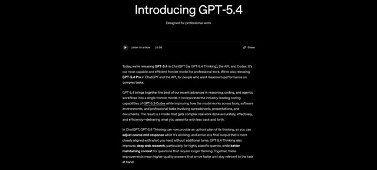
*Article d'annonce officiel d'OpenAI présentant le nouveau modèle GPT-5.4 conçu pour le travail professionnel.*

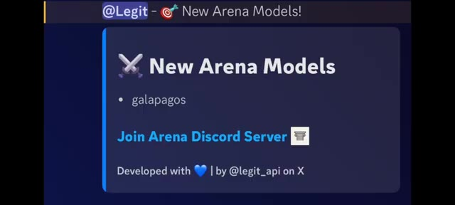
*Interface de LM Arena montrant le modèle masqué sous le nom de code "galapagos" dans la liste des New Arena Models.*

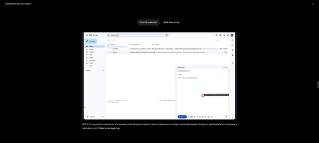
*Démonstration de l'utilisation d'un ordinateur et de la vision par GPT-5.4 interagissant avec une interface Gmail.*

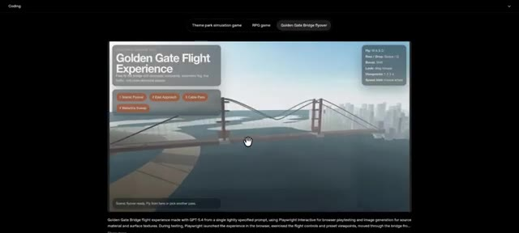
*Démonstration de code et de simulation 3D interactive du Golden Gate Bridge générée par GPT-5.4.*

---

### ⏱️ `[00:00:23 - 00:00:45]` | Segment #02

**🔊 Audio (Transcription Intégrale Mot pour Mot en Français) :**
> Aujourd'hui, nous testons ses capacités de développement web avec des globes 3D, des simulations de pièces interactives et des doigts articulés. C'est Pursuing AI et vous regardez le Research Report. Hier, je préparais une vidéo pour vous parler de ce mystérieux modèle Galapagos sur LM Arena, mais OpenAI a appuyé sur la gâchette un peu trop tôt.

**👁️ Analyse Visuelle d'Écran (gemini-3.5-flash-lite) :**
**Interface & Outils** : Interface web de test et de simulation interactive intégrant des graphismes 3D en temps réel et des panneaux de contrôle textuels.

**Contenu textuel & Code** : Texte visible : "Golden Gate Flight Experience", boutons de sélection ("Theme park simulation game", "RPG game", "Golden Gate Bridge flyover"), contrôles de vol (Fly: W A S D, Rise / Drop: Space / Q, Boost: Shift, Look: Drag mouse, Viewports: 1 2 3 4, Speed trim: Mouse wheel) et curseurs de manipulation de doigts.

**Action / Démonstration** : Navigation et démonstration interactive d'une simulation 3D de survol d'un pont ainsi que de la manipulation des articulations d'une main virtuelle.

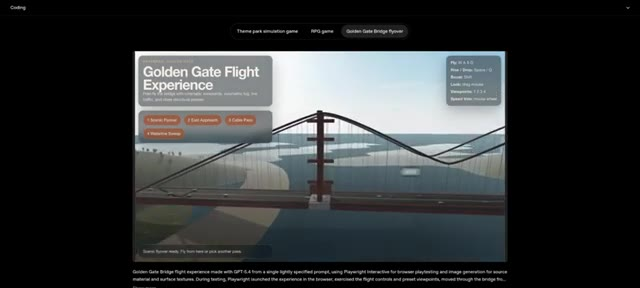
*Interface de simulation montrant une expérience de vol au-dessus du Golden Gate Bridge ("Golden Gate Flight Experience") avec des options de navigation et des contrôles interactifs.*

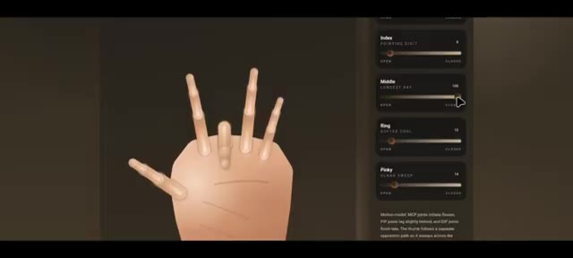
*Interface de modélisation 3D interactive montrant une main stylisée avec des curseurs de réglage pour chaque doigt (Index, Middle, Ring, Pinky).*

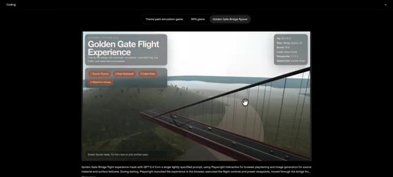
*Vue similaire à l'image 1 de la simulation de vol interactive du Golden Gate Bridge avec l'affichage des commandes à l'écran.*

---

### ⏱️ `[00:00:45 - 00:01:04]` | Segment #03

**🔊 Audio (Transcription Intégrale Mot pour Mot en Français) :**
> C'est arrivé bien plus tôt que prévu, et spoiler, ses capacités de codage sont insensées. Laissez-moi vous montrer les tests de résistance que j'ai menés. Tout d'abord, regardez ce globe 3D interactif. À première vue, il est absolument saisissant. Je peux zoomer, dézoomer et faire glisser la carte du monde en douceur.

**👁️ Analyse Visuelle d'Écran (gemini-3.5-flash-lite) :**
**Interface & Outils** : Navigateur web affichant une application web interactive de globe 3D (Atlas Terminal) et une publication sur X (Twitter)

**Contenu textuel & Code** : Texte affiché : '5.4 sooner than you think' (OpenAI), 'Interactive globe with living borders and signal markers.', 'Rotation', 'Highlight', 'Markers', 'Focused Marker: Osaka', 'Texture Mode', 'Geometry', 'Marker Set'

**Action / Démonstration** : Le créateur présente une publication sur les réseaux sociaux puis démontre un globe 3D interactif sur une page web, en explorant ses fonctionnalités et ses options de contrôle.

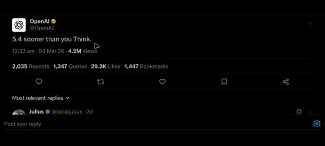
*Capture d'un tweet d'OpenAI annonçant '5.4 sooner than you think'*

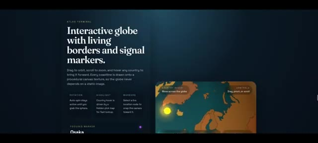
*Interface d'un site web interactif 'Atlas Terminal' présentant un globe 3D avec des descriptions techniques et des marqueurs*

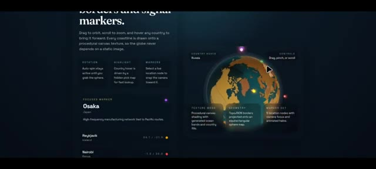
*Vue rapprochée du globe 3D interactif avec des options de contrôle, des modes de texture et de géométrie*

---

### ⏱️ `[00:01:04 - 00:01:23]` | Segment #04

**🔊 Audio (Transcription Intégrale Mot pour Mot en Français) :**
> Si je sélectionne le pays, cela déclenche cette animation dorée en survol qui a l'air incroyablement cool. Si je dois noter cette génération de GPT 5.4, c'est facilement un 9 sur 10. Pour le contexte, le globe fait par GPT 5.2 codex ne ressemble absolument à rien comparé à celui-ci.

**👁️ Analyse Visuelle d'Écran (gemini-3.5-flash-lite) :**
**Interface & Outils** : Application web "Orbital Atlas" présentant un globe interactif procédural avec des panneaux d'information contextuels, des réglages de rotation, de texture et des marqueurs de localisation.

**Contenu textuel & Code** : Texte affiché : "Interactive procedural globe", "Active location: United States", "Country highlights" (avec les pays United States, Brazil, France, Egypt, South Africa, India), ainsi que divers paramètres techniques sur l'image 1 (Rotation, Highlight, Markers, Texture Mode, Geometry, Marker Set).

**Action / Démonstration** : Le curseur de la souris survole ou sélectionne des pays sur le globe interactif, déclenchant des animations de surbrillance dorée et des affichages d'informations textuelles.

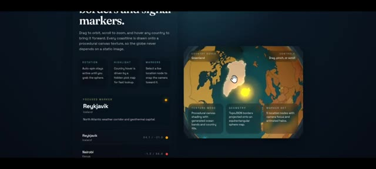
*Interface interactive affichant un globe en gros plan avec la sélection du Groenland et des panneaux de contrôle détaillés.*

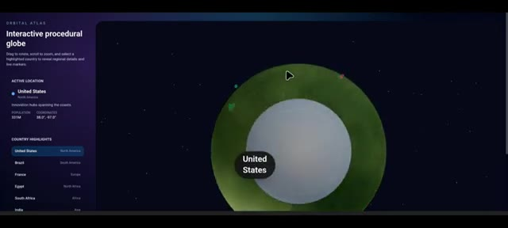
*Vue d'ensemble d'un atlas orbital interactif avec un globe 3D et une liste de pays sur le panneau latéral gauche.*

---

### ⏱️ `[00:01:24 - 00:01:43]` | Segment #05

**🔊 Audio (Transcription Intégrale Mot pour Mot en Français) :**
> Ensuite, nous avons cette vue de pièce en 3D. et c'est magnifique. C'est une petite scène construite à partir de géométrie de base, un lit, un bureau, une étagère, un tapis, une plante et une fenêtre. Et il y a un objet spécifique ici. Je ne sais pas exactement ce que c'est. Si vous le savez, laissez un commentaire ci-dessous.

**👁️ Analyse Visuelle d'Écran (gemini-3.5-flash-lite) :**
**Interface & Outils** : Interface web interactive avec un panneau latéral de description et de contrôle à gauche, et une vue 3D interactive au centre.

**Contenu textuel & Code** : Texte affiché : "INTERIOR STUDY", "Simple 3D room with orbit exploration.", "A small scene built from basic geometry: bed, desk, shelf, rug, plant, and a window that shifts from warm daylight to lamp-lit night", "LIGHTING" avec les boutons "Day" et "Night", et "Furniture placement". Le rendu 3D montre une chambre simplifiée avec un lit, un bureau, une étagère et une fenêtre.

**Action / Démonstration** : Présentation d'une démo interactive de pièce 3D dans le navigateur web avec un curseur de souris visible au centre.

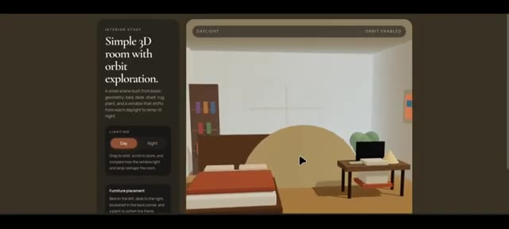
*Interface interactive d'une étude d'intérieur montrant une pièce 3D minimaliste avec des options d'éclairage et de placement de mobilier.*

---

### ⏱️ `[00:01:43 - 00:02:09]` | Segment #06

**🔊 Audio (Transcription Intégrale Mot pour Mot en Français) :**
> Maintenant, c'est la vue de jour, mais voyons comment elle gère la transition nocturne. Oh mon Dieu, ça a l'air vraiment bien. Ça passe à cette vue de nuit calme, chaleureuse et éclairée par une lampe. Une lumière chaude irradie de ceci, c'est peut-être un tableau, et illumine parfaitement l'espace. Si vous comparez directement ce résultat de GPT 5.4 avec le Claude Sonnet 4.5, la différence est le jour et la nuit.

**👁️ Analyse Visuelle d'Écran (gemini-3.5-flash-lite) :**
**Interface & Outils** : Interface web de visualisation 3D interactive ('Interior Study' / '3D Room Viewer') avec contrôles de lumière et d'orbite.

**Contenu textuel & Code** : Textes visibles : "Simple 3D room with orbit exploration.", "LIGHTING: Day / Night", "Furniture placement", "3D Room Viewer".

**Action / Démonstration** : Navigation et basculement interactif entre le mode d'éclairage diurne et nocturne dans un environnement 3D simulé.

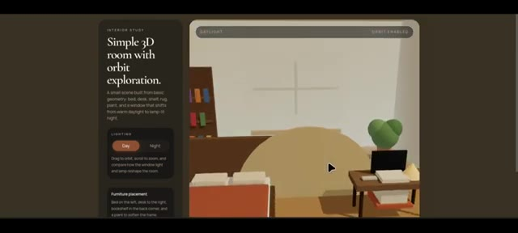
*Interface montrant une scène 3D simple d'une chambre avec un sélecteur d'éclairage en mode 'Day' (jour).*

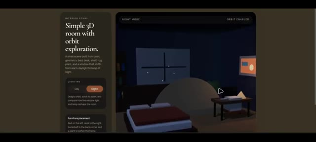
*Interface de la pièce 3D basculée en mode 'Night' (nuit) avec un éclairage de lampe tamisé.*

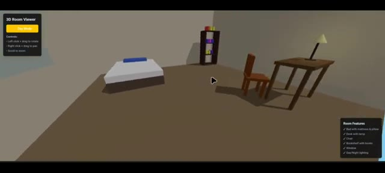
*Visualiseur 3D affichant une pièce différente avec un lit, un bureau, une chaise et une bibliothèque.*

---

### ⏱️ `[00:02:09 - 00:02:28]` | Segment #07

**🔊 Audio (Transcription Intégrale Mot pour Mot en Français) :**
> Vous pouvez facilement repérer le bond en avant en matière de raisonnement spatial. Ensuite, j'ai demandé un outil de recadrage d'image, et les résultats ont été choquants. Par défaut, une image est déjà chargée. Je peux recadrer, zoomer, dézoomer et faire pivoter. Les boutons de format d'image fonctionnent parfaitement et il y a un aperçu en temps réel de l'image recadrée juste en dessous.

**👁️ Analyse Visuelle d'Écran (gemini-3.5-flash-lite) :**
**Interface & Outils** : Interface web interactive 'Precision Crop Studio' et '3D Room Viewer'

**Contenu textuel & Code** : Titres et paramètres de l'outil : 'Crop motion and geometry without leaving the frame', 'Aspect presets' (Free, 1:1, 4:5, 3:2, 16:9), 'Adjustments', 'Preview pane', 'Room Features'

**Action / Démonstration** : Manipulation d'un cadre de recadrage sur une image géométrique avec des curseurs de zoom et de rotation.

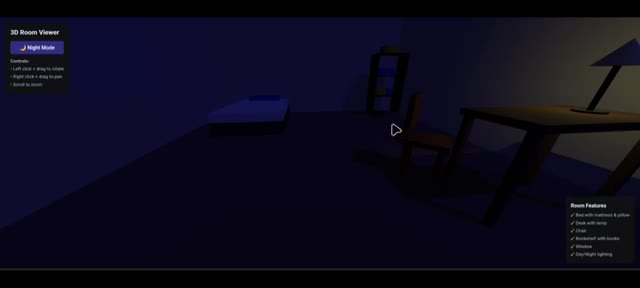
*Interface 3D Room Viewer montrant une pièce sombre avec un lit, une chaise et un bureau avec une lampe.*

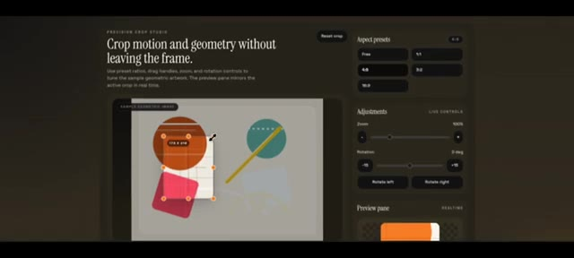
*Interface de l'outil de recadrage 'Precision Crop Studio' montrant les options de recadrage, de zoom et de rotation avec un aperçu.*

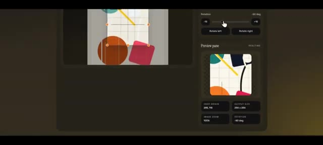
*Gros plan sur le panneau de prévisualisation et les contrôles de rotation de l'outil de recadrage en temps réel.*

---

### ⏱️ `[00:02:29 - 00:02:50]` | Segment #08

**🔊 Audio (Transcription Intégrale Mot pour Mot en Français) :**
> Maintenant, ce test final est dingue. Une simulation de main interactive. Avec GPT 5.4, j'ai des curseurs de contrôle pour absolument chaque doigt. Si je plie l'index, regardez avec quel réalisme les articulations bougent. Tout fonctionne parfaitement. Pendant ce temps, la génération QN 3.5 était une perte totale de temps.

**👁️ Analyse Visuelle d'Écran (gemini-3.5-flash-lite) :**
**Interface & Outils** : Interface de simulation interactive de main (Realistic Hand Simulation) avec un panneau de contrôle latéral comportant des curseurs pour chaque doigt.

**Contenu textuel & Code** : On peut lire des libellés de doigts sur les panneaux latéraux : Thumb, Index, Middle, Ring, Pinky, ainsi que des curseurs de flexion (Open / Closed).

**Action / Démonstration** : Le curseur de l'index est manipulé pour montrer l'articulation et la flexion réaliste des doigts de la main simulée.

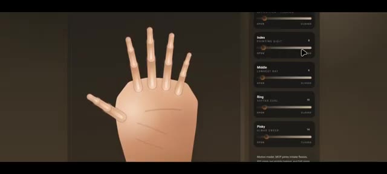
*Interface de simulation montrant une main stylisée en 3D avec des curseurs de réglage pour chaque doigt sur le panneau latéral.*

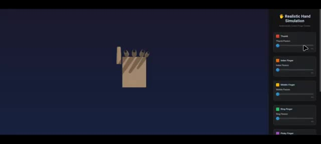
*Interface de simulation montrant une vue schématique d'une main fermée avec le panneau de contrôle "Realistic Hand Simulation" sur la droite.*

---

### ⏱️ `[00:02:50 - 00:03:23]` | Segment #09

**🔊 Audio (Transcription Intégrale Mot pour Mot en Français) :**
> complètement cassé. Très bien, voici les spécifications principales que vous devez connaître sur GPT-5.4. Numéro un, il comprend les captures d'écran et interagit directement avec les interfaces logicielles, ce qui en fait une bête pour créer des agents IA capables de réellement manipuler vos applications et sites web. Numéro deux, il prend en charge une fenêtre de contexte massive, environ 1 million de jetons d'entrée et jusqu'à 128 000 jetons de sortie. Vous pouvez lui fournir des bases de code entières ou des documents massifs dans une seule invite.

**👁️ Analyse Visuelle d'Écran (gemini-3.5-flash-lite) :**
**Interface & Outils** : Interface de documentation web d'OpenAI et interface de démonstration d'utilisation d'ordinateur (navigateur avec Gmail).

**Contenu textuel & Code** : Texte de présentation de GPT-5.4, interface Gmail avec curseur interactif, et spécifications techniques sur la fenêtre de contexte de 1 million de tokens (`model_context_window`).

**Action / Démonstration** : Présentation des notes de version de GPT-5.4, démonstration d'interaction logicielle et affichage des détails techniques sur la gestion des tokens et de la tarification.

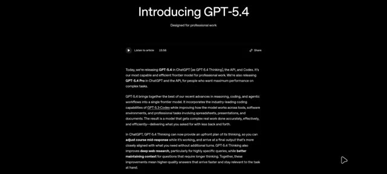
*Article de présentation de GPT-5.4 sur une interface web sombre décrivant ses capacités de raisonnement et de codage.*

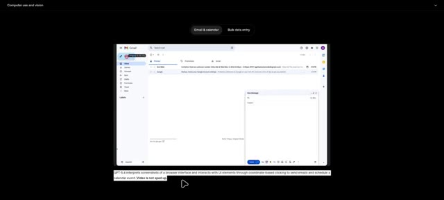
*Démonstration de l'utilisation d'une interface de messagerie (Gmail) contrôlée par l'IA avec une fenêtre contextuelle de composition de message.*

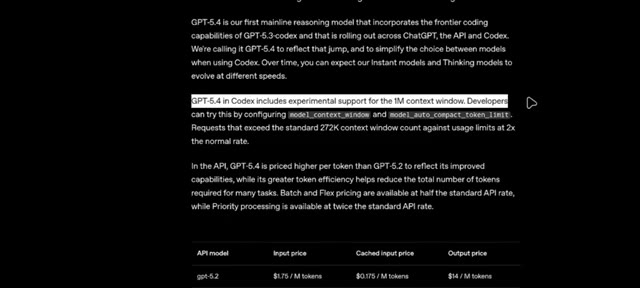
*Documentation technique de GPT-5.4 dans Codex détaillant la prise en charge de la fenêtre de contexte de 1M et la grille tarifaire de l'API.*

---

### ⏱️ `[00:03:23 - 00:03:47]` | Segment #10

**🔊 Audio (Transcription Intégrale Mot pour Mot en Français) :**
> Mais voici la partie la plus folle. Dans le benchmark OS World Verified, GPT 5.2 a obtenu un score de 47,3 %. La référence humaine est de 72,4 %. GPT 5.4 atteint un taux de réussite de 75 %. Laissez-moi vous répéter ça. GPT 5.4 dépasse réellement la référence humaine dans ce test.

**👁️ Analyse Visuelle d'Écran (gemini-3.5-flash-lite) :**
**Interface & Outils** : Documentation officielle ou rapport technique d'évaluation de modèle d'IA affichant du texte descriptif et des tableaux de benchmarks sur fond noir.

**Contenu textuel & Code** : Texte sur OSWorld-Verified indiquant le taux de réussite de 75,0 % pour GPT-5.4, 47,3 % pour GPT-5.2 et 72,4 % pour le niveau humain. Tableau comparatif avec les colonnes GPT-5.4, GPT-5.3-Codex et GPT-5.2 affichant les scores respectifs (ex: OSWorld-Verified : 75,0 %, 74,0%*, 47,3 %).

**Action / Démonstration** : Défilement de la page de documentation textuelle et du tableau de comparaison des performances des différents modèles d'intelligence artificielle.

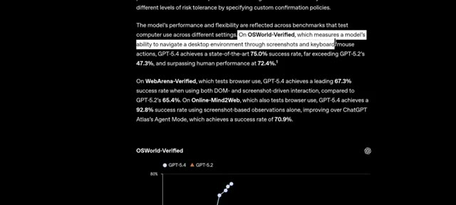
*Capture d'écran du site officiel présentant les résultats des benchmarks, notamment OSWorld-Verified où GPT-5.4 atteint un taux de réussite de 75,0 % face à GPT-5.2 à 47,3 % et l'humain à 72,4 %.*

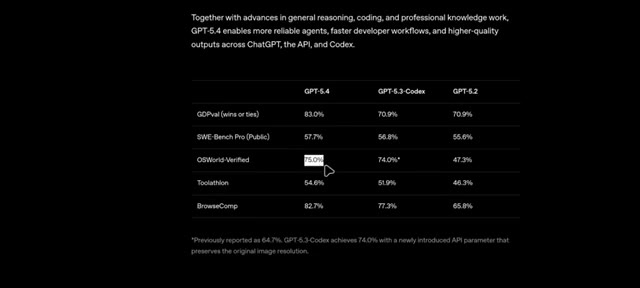
*Tableau comparatif des performances montrant les scores de GPT-5.4, GPT-5.3-Codex et GPT-5.2 sur différents benchmarks comme GDPval, SWE-Bench Pro, OSWorld-Verified, Toolathlon et BrowseComp.*

---

### ⏱️ `[00:03:47 - 00:04:06]` | Segment #11

**🔊 Audio (Transcription Intégrale Mot pour Mot en Français) :**
> Il est fortement positionné pour les développeurs et l'utilisation en entreprise, en particulier pour la planification avancée, le codage et l'automatisation en plusieurs étapes. Je dois donc vous poser la question : croyez-vous que ChatGPT remplacera les humains ? Et aimez-vous réellement utiliser ces nouveaux modèles, ou cela devient-il trop écrasant ? Dites-le-moi dans les commentaires.

**👁️ Analyse Visuelle d'Écran (gemini-3.5-flash-lite) :**
**Interface & Outils** : Présentation de benchmarks de modèles d'IA sur fond sombre.

**Contenu textuel & Code** : Texte descriptif en haut : "Together with advances in general reasoning, coding, and professional knowledge work, GPT-5.4 enables more reliable agents, faster developer workflows, and higher-quality outputs across ChatGPT, the API, and Codex." Tableau comparant GPT-5.4, GPT-5.3-Codex et GPT-5.2 sur des critères tels que GDPval (83.0% / 70.9% / 70.9%), SWE-Bench Pro (57.7% / 56.8% / 55.6%), OSWorld-Verified (75.0% / 74.0%* / 47.3%), Toolathlon (54.6% / 51.9% / 46.3%) et BrowseComp (82.7% / 77.3% / 65.8%). Note de bas de page concernant GPT-5.3-Codex.

**Action / Démonstration** : Affichage des résultats de performance comparative des modèles GPT avec un curseur de souris pointant sur "OSWorld-Verified".

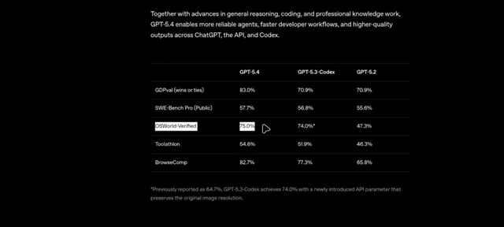
*Tableau comparatif des performances des modèles GPT-5.4, GPT-5.3-Codex et GPT-5.2 sur divers benchmarks.*

---

### ⏱️ `[00:04:07 - 00:04:09]` | Segment #12

**🔊 Audio (Transcription Intégrale Mot pour Mot en Français) :**
> Merci d'avoir regardé, et je vous retrouve dans la prochaine.

**👁️ Analyse Visuelle d'Écran (gemini-3.5-flash-lite) :**
**Interface & Outils** : Présentation graphique de fin de vidéo sans partage d'écran (logo de la chaîne Pursuing AI avec un cerveau connecté à une puce).

**Contenu textuel & Code** : Affichage d'une illustration générée par IA représentant un cerveau humain relié par des câbles à une puce électronique portant l'inscription "PAI" (Pursuing AI), le tout encerclé par un anneau lumineux bleu sur fond noir.

**Action / Démonstration** : Affichage de l'écran de fin de la vidéo avec le logo de la chaîne.

---
