# 🎬 La vidéo n'est désormais plus une preuve

> **Chaîne** : [Pursuing AI](https://www.youtube.com/@PursuingAi)  
> **Titre original** : `Now video is no longer used as evidence anymore`  
> **Lien YouTube** : [https://www.youtube.com/watch?v=5q4YKN-hMJo](https://www.youtube.com/watch?v=5q4YKN-hMJo)  
> **Date de publication** : 2026-03-07  
> **Durée** : 04m 04s (`244s`)  
> **Identifiant vidéo** : `5q4YKN-hMJo`  
> **Fiche Web Interactive** : [2026-03-07_YT-5q4YKN-hMJo_La vidéo n'est désormais plus une preuve_by-whisper-v3-large-turbo+gemini-3.5-flash-lite.html](2026-03-07_YT-5q4YKN-hMJo_La vidéo n'est désormais plus une preuve_by-whisper-v3-large-turbo+gemini-3.5-flash-lite.html)  
> **Captures de démonstration clés** : `23 captures réelles (anti-talking-head)`  
> **Modèles utilisés** : Audio: `large-v3-turbo` (Faster-Whisper int8 VPS) | Vision: `gemini-3.5-flash-lite` (Google AI Studio API)  

---

## 📌 Synthèse Exécutive & Outils

### 📌 Résumé
La vidéo de *Pursuing AI* intitulée « La vidéo n'est désormais plus une preuve » met en lumière une avancée technologique majeure signée ByteDance : **DreamID Omni**. Ce générateur vidéo nouvelle génération ne se contente pas d'interpréter un simple prompt textuel (« taper et prier »), il fusionne de multiples flux d'entrée — texte, image et échantillons audio de véritables voix. Cette approche multimodale permet de cloner à la fois l'identité visuelle (visage) et vocale d'individus, qu'il s'agisse de personnalités publiques comme Anne Hathaway ou Will Smith, ou de réussir des interactions complexes entre plusieurs personnages dotés d'identités et de timbres distincts. Le processus étape par étape présenté démontre comment, à partir d'une image de référence et d'un court clip audio, l'outil génère des séquences inédites où le sujet prononce de nouveaux dialogues avec une synchronisation labiale et une intonation saisissantes de réalisme. 

Au-delà de la simple génération de contenu ex nihilo, *DreamID Omni* franchit un cap inquiétant et révolutionnaire en permettant le remixage de vidéos existantes. Il devient possible de remplacer totalement le visage et la voix d'un acteur dans une séquence préexistante tout en conservant la dynamique de la scène. Cette flexibilité absolue — combinant création originale, gestion multi-personnages et édition vidéo destructive — positionne l'outil comme le « couteau suisse des humains synthétiques ». Pour les créateurs de vidéo, les départements marketing et l'industrie du divertissement, les bénéfices concrets sont immenses : réduction drastique des coûts de casting, suppression des tournages physiques pour des spots publicitaires, et automatisation du doublage. 

Cependant, cette puissance technologique, dont l'arrivée imminente d'une version open-source sur GitHub est annoncée pour mars, redéfinit profondément notre rapport à la vérité. En permettant de modifier à loisir la preuve visuelle et auditive, l'outil illustre parfaitement le basculement dans une ère où « voir ne suffit plus pour croire ». Les flux de production vidéo doivent désormais intégrer cette nouvelle donne où la falsification hyper-réaliste devient accessible au plus grand nombre, posant des défis éthiques et juridiques considérables pour l'authentification des médias à l'avenir.

### 🛠️ Outils, Modèles & Logiciels Présentés
* **DreamID Omni** : Modèle multimodal de pointe développé par ByteDance permettant de générer et d'éditer des vidéos ultra-réalistes en combinant des entrées textuelles, des images de référence et des clips audio vocaux pour un contrôle total des visages et des voix.
* **Flux** : Écosystème technologique et pipeline de traitement global mentionné comme le flux d'entrée sous-jacent gérant la complexité des données multimodales.
* **Ovi** : Outil alternatif de deepfake et de génération vidéo mentionné pour contextualiser l'existant sur le marché des humains synthétiques.
* **Phantom** : Solution concurrente de génération et de manipulation vidéo utilisée dans le paysage actuel des technologies synthétiques.
* **Vase** : Logiciel tiers de traitement vidéo et de manipulation faciale cité parmi les solutions actuelles du secteur.
* **LTX2** : Modèle de génération vidéo avancé servant de point de comparaison pour illustrer l'état de l'art technologique avant l'arrivée de DreamID Omni.
* **GitHub** : Plateforme de référentiel de code où ByteDance prévoit de publier la version open-source de DreamID Omni dès le mois de mars.

### 🔑 Points Clés & Enseignements Stratégiques
* **Approche multimodale intégrée** : L'utilisation simultanée de textes, d'images et de flux audio réels représente un bond qualitatif majeur par rapport aux générateurs text-to-video traditionnels.
* **Clonage vocal et facial synchrone** : Le couplage d'une image de référence fixe et d'un échantillon audio garantit non seulement la fidélité physique du personnage, mais aussi l'exactitude de son intonation et de sa tessiture vocale.
* **Gestion multi-personnages avancée** : Capacité à injecter plusieurs voix et plusieurs identités visuelles distinctes dans une même scène pour orchestrer des interactions complexes et des dialogues fluides.
* **Remixage de vidéos existantes** : Possibilité de prendre une séquence vidéo déjà tournée et d'y substituer entièrement le visage et la voix d'un protagoniste tout en préservant le contexte de la scène.
* **Disruption des workflows publicitaires** : Les départements marketing peuvent désormais faire vendre des produits par des célébrités ou des acteurs sans jamais organiser de tournage physique ni de session d'enregistrement en studio.
* **Réduction des coûts de production** : Remplacement potentiel des castings traditionnels, des équipes de doublage et d'une grande partie de la logistique de plateau par des pipelines entièrement synthétiques.
* **Démocratisation open-source imminente** : L'annonce d'une version 1 open-source sur GitHub pour le mois de mars garantit que ces technologies ne resteront pas cantonnées aux laboratoires fermés des grandes entreprises.
* **Obsolescence de la preuve visuelle** : La facilité avec laquelle les vidéos peuvent être modifiées et réinventées acte la fin du dogme « voir c'est croire », nécessitant de repenser l'authentification des preuves numériques.
* **Saturation du marché des deepfakes** : Bien que des outils comme Ovi, Phantom, Vase ou LTX2 existent déjà, DreamID Omni se démarque par sa flexibilité globale et son statut de « couteau suisse » du domaine.
* **Vigilance éthique et juridique accrue** : L'utilisation non autorisée d'images et de voix de personnalités (comme Anne Hathaway ou Will Smith) soulève des urgences réglementaires majeures pour protéger le droit à l'image et contrer la désinformation.

---

## ⏱️ Chronologie & Transcription Complète Audio & Visuelle (Mot pour Mot)

### ⏱️ `[00:00:00 - 00:00:36]` | Segment #01

**🔊 Audio (Transcription Intégrale Mot pour Mot en Français) :**
> Cette semaine, ByteDance a décidé que les générateurs de vidéo ordinaires étaient trop ennuyeux, alors ils ont lancé quelque chose appelé DreamID Omni, et oui, cela fait exactement ce que vous pensez. C'est Pursuing AI et vous regardez le rapport de recherche. DreamID Omni est un autre générateur de vidéo, mais pas juste un générateur de type « taper et prier ». Ce truc prend de multiples entrées : un prompt textuel, une image et même la voix d'une personne, parce qu'apparemment, un seul flux d'entrée n'était pas assez dystopique. Commençons par Anne Hathaway. Vous entrez un prompt, vous téléchargez une image d'Anne Hathaway, mais avant de générer la vidéo, vous intégrez un clip de référence de sa véritable voix.

**👁️ Analyse Visuelle d'Écran (gemini-3.5-flash-lite) :**
**Interface & Outils** : Interface web de présentation de recherche académique pour le projet DreamID Omni / R2AV, intégrant des lecteurs vidéo, des commandes de timbre vocal et des infobulles de prompts textuels.

**Contenu textuel & Code** : En haut : "Human-Reference Audio-Video Generation (R2AV)". Texte du prompt visible en surbrillance : "A lively open-kitchen café at night; stove flames flare, steam rises, and warm pendant lights swing slightly as staff move behind her. sub1 is a young woman with thick dark wavy hair and a side part. She wears a fitted black top under a light apron, a thin gold chain necklace, and small stud earrings. sub1 tastes the sauce with a spoon, then turns her face toward the camera while still holding the spoon, her expression shifting from focused to conflicted. sub1 maintains eye contact, swallows as if choosing her words, and says, 'I keep telling myself I am fine, but some nights it feels like I am just performing calm.'" Commandes visibles : "0:00 / 0:05", "Timbre:", icônes de lecture et de sourdine.

**Action / Démonstration** : Présentation de la recherche et de la grille d'exemples vidéo illustrant la génération audio-vidéo contrôlée par référence humaine (R2AV) avec DreamID Omni, affichant les détails des prompts et les options audio interactives.

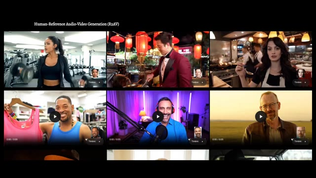
*Grille de présentation de la recherche "Human-Reference Audio-Video Generation (R2AV)" montrant plusieurs exemples de vidéos générées avec le modèle DreamID Omni, avec des visages de référence et des boutons de lecture.*

*Interface web du projet montrant deux vidéos de démonstration côte à côte avec des options de lecture, un contrôle de timbre vocal et l'affichage d'un prompt textuel en surbrillance.*

---

### ⏱️ `[00:00:36 - 00:00:58]` | Segment #02

**🔊 Audio (Transcription Intégrale Mot pour Mot en Français) :**
> L'audio de référence ressemble à ceci. Je suis venu à New York pour être journaliste et j'ai envoyé des lettres partout jusqu'à ce que j'obtienne enfin un appel d'Elias. Totalement normal, totalement innocent. Ensuite, DreamID Omni génère une vidéo d'Anne Hathaway prononçant de nouveaux dialogues. Je ne cesse de me dire que ça va, mais certaines nuits, j'ai l'impression de faire semblant d'être calme.

**👁️ Analyse Visuelle d'Écran (gemini-3.5-flash-lite) :**
**Interface & Outils** : Interface utilisateur d'un site web de démonstration vidéo, présentant un lecteur multimédia avec des boutons de lecture et des aperçus de personnages.

**Contenu textuel & Code** : On peut lire un prompt textuel en anglais sur la vidéo de droite : « A lively open-kitchen café at night; stove flames flare, steam rises... sub1 tastes the sauce with a spoon, then turns her face toward the camera... and says, "I keep telling myself I am fine, but some nights it feels like I'm just performing calm." »

**Action / Démonstration** : L'écran présente des exemples de vidéos générées par IA avec DreamID Omni, mettant en évidence la manipulation de l'audio et de la vidéo d'un personnage (Anne Hathaway).

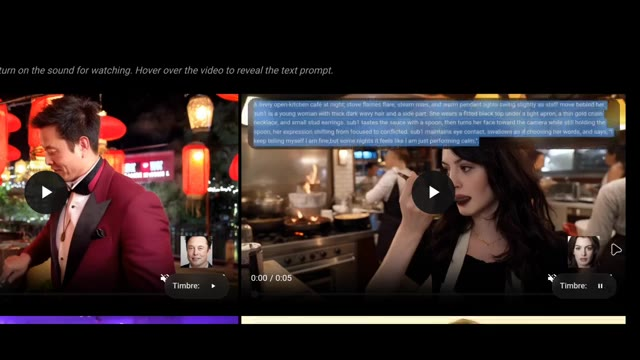
*Interface web montrant deux vidéos côte à côte avec des exemples de génération par DreamID Omni, incluant une vidéo d'Anne Hathaway dans une cuisine et son prompt textuel associé.*

---

### ⏱️ `[00:00:59 - 00:01:31]` | Segment #03

**🔊 Audio (Transcription Intégrale Mot pour Mot en Français) :**
> Même visage, même voix, nouvelle phrase. Donc oui, cela peut créer une vidéo d'Anne Hathaway qui parle en utilisant sa vraie voix. Les agents d'Hollywood viennent de ressentir une perturbation dans la Force. Mais c'est peut-être juste un exemple isolé, non ? Eh bien non. Voici Will Smith. D'abord, vous entrez sa voix de référence. Je prends mes chances en frappant ce mec au visage ou en insultant cette fille ou peu importe, mais euh euh je ne peux pas faire preuve de bienveillance aimante alors Dream ID Omni génère une toute nouvelle vidéo de lui.

**👁️ Analyse Visuelle d'Écran (gemini-3.5-flash-lite) :**
**Interface & Outils** : Page web de démonstration de recherche en IA (Human-Reference Audio-Video Generation / R2AV / Dream ID Omni) avec lecteur vidéo interactif et sélection de timbres vocaux.

**Contenu textuel & Code** : Textes visibles : "Human-Reference Audio-Video Generation (R2AV)", "Timbre:", et un prompt textuel détaillé sur fond semi-transparent : "The scene is set in a clothing store with artificial lighting. Racks of clothes are visible in the background...". Visuels de plusieurs personnalités clonées (Anne Hathaway, Will Smith, etc.).

**Action / Démonstration** : Navigation à travers une galerie de vidéos de démonstration d'génération audio-vidéo par IA, lecture des clips et affichage des prompts textuels au survol.

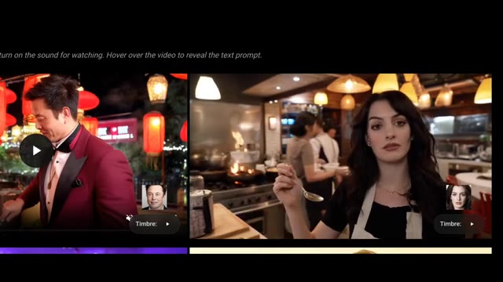
*Interface web montrant des exemples de vidéos générées avec le visage d'Anne Hathaway et d'autres personnes.*

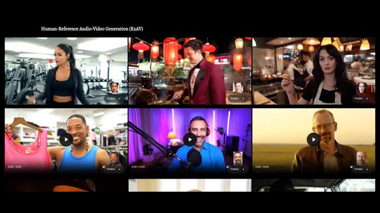
*Grille de plusieurs vidéos de démonstration étiquetée "Human-Reference Audio-Video Generation (R2AV)".*

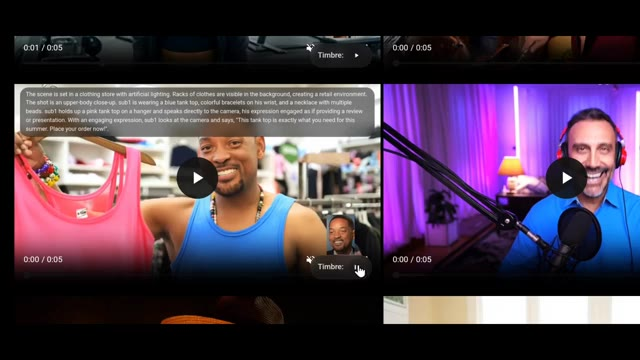
*Gros plan sur l'interface vidéo avec une incrustation affichant le prompt textuel descriptif et Will Smith tenant un débardeur rose.*

---

### ⏱️ `[00:01:31 - 00:01:53]` | Segment #04

**🔊 Audio (Transcription Intégrale Mot pour Mot en Français) :**
> en disant que ce débardeur est exactement ce dont vous avez besoin pour cet été, passez votre commande maintenant, pour que Will Smith puisse vous vendre des vêtements d'été sans jamais enregistrer la publicité. Les départements marketing respirent bruyamment en ce moment, et ça devient encore mieux ou pire selon votre tolérance à la distorsion de la réalité. Cela ne fonctionne pas seulement avec un seul personnage.

**👁️ Analyse Visuelle d'Écran (gemini-3.5-flash-lite) :**
**Interface & Outils** : Interface de démonstration vidéo montrant plusieurs exemples de génération de vidéos par IA (R2AV) disposés en grille avec des contrôles de lecture.

**Contenu textuel & Code** : Texte affiché en haut : « Human-Reference Audio-Video Generation (R2AV) ». Dans l'une des fenêtres, un texte de description en anglais détaille la scène : « The scene is set in a clothing store with artificial lighting... ».

**Action / Démonstration** : Le créateur présente une interface web affichant des exemples de vidéos générées par IA où des personnages virtuels parlent et bougent de manière réaliste à partir de références audio et vidéo.

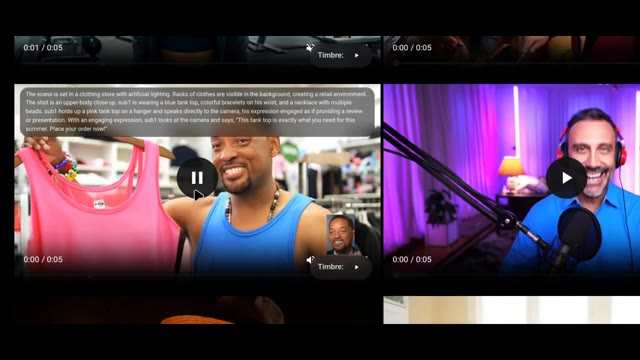
*Démonstration à l'écran de la génération vidéo IA montrant un personnage ressemblant à Will Smith présentant un débardeur rose dans un magasin, avec une bulle de texte descriptif et un encadré de référence.*

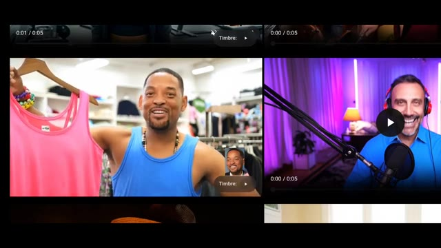
*Vue rapprochée de la vidéo générée par IA montrant le personnage de Will Smith souriant et montrant un vêtement dans un magasin.*

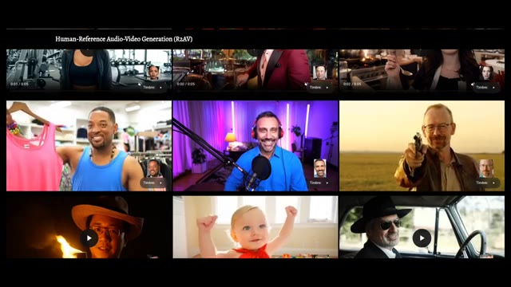
*Interface de présentation montrant une grille de plusieurs vidéos générées par IA sous le titre « Human-Reference Audio-Video Generation (R2AV) ».*

---

### ⏱️ `[00:01:53 - 00:02:16]` | Segment #05

**🔊 Audio (Transcription Intégrale Mot pour Mot en Français) :**
> Vous pouvez télécharger plusieurs personnages avec plusieurs voix. Dans un exemple, ils fournissent deux voix de référence différentes. Vous savez, pendant deux ans, une tournée de deux ans, et j'étais plutôt déprimé. J'ai pleuré occasionnellement. Le format de film indien, il en a été ainsi pendant longtemps, et c'est ce sur quoi nous avons grandi, et les gens adorent ça absolument.

**👁️ Analyse Visuelle d'Écran (gemini-3.5-flash-lite) :**
**Interface & Outils** : Interface web de démonstration de recherche en intelligence artificielle pour la génération audio-vidéo (Human-Reference Audio-Video Generation - R2AV).

**Contenu textuel & Code** : Texte affiché : « Human-Reference Audio-Video Generation (R2AV) », des commandes de lecture vidéo (0:00 / 0:05), ainsi que des boutons « Timbre 1 » et « Timbre 2 » avec des portraits de référence. Sur la deuxième image, un encadré de texte descriptif détaille la scène : « A bright, sunny day on a mountain hiking trail... ».

**Action / Démonstration** : Présentation de plusieurs exemples vidéo démontrant la génération de dialogues synchronisés avec des voix de référence multiples pour des duos de personnages.

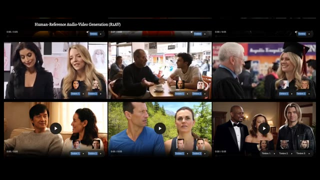
*Interface montrant des exemples de génération audio-vidéo avec référence humaine (R2AV) impliquant plusieurs personnages et voix.*

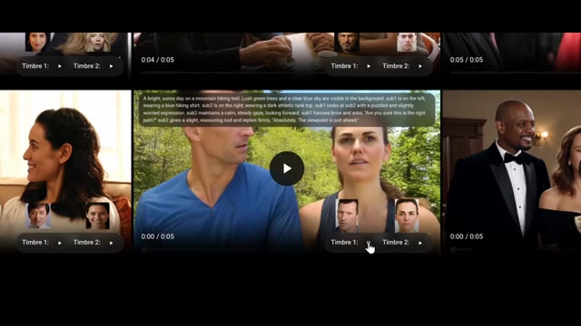
*Gros plan sur une démonstration vidéo avec des boîtes de texte descriptives et des miniatures de timbres vocaux pour les personnages.*

---

### ⏱️ `[00:02:16 - 00:02:39]` | Segment #06

**🔊 Audio (Transcription Intégrale Mot pour Mot en Français) :**
> Je pense que cela reflète également notre culture, qui est le format de film indien. Ensuite, la scène générée met en scène les personnages qui interagissent. Es-tu sûr que c'est le bon chemin ? Absolument, le point de vue est juste devant. Ainsi, vous pouvez maintenant générer des scènes de dialogue à plusieurs personnages avec des voix et des identités distinctes. Félicitations, vous venez de remplacer le casting, le doublage et peut-être la petite discussion sur le plateau.

**👁️ Analyse Visuelle d'Écran (gemini-3.5-flash-lite) :**
**Interface & Outils** : Interface web de recherche ou de démonstration sur l'IA vidéo (Human-Reference Audio-Video Generation - R2AV), affichant des vignettes vidéo interactives avec des curseurs de lecture, des boutons de sélection de timbres ("Timbre 1", "Timbre 2") et des miniatures de visages.

**Contenu textuel & Code** : Texte de prompt visible dans la vidéo centrale : "A bright, sunny day on a mountain hiking trail. Lush green trees and a clear blue sky are visible in the background, sub1 is on the left, wearing a blue hiking shirt. sub2 is on the right, wearing a dark athletic tank top... Are you sure this is the right path? Absolutely, the viewpoint is just ahead." Titre de la page : "Human-Reference Audio-Video Generation (R2AV)".

**Action / Démonstration** : Navigation et affichage de différentes vidéos générées par IA démontrant des interactions de dialogues entre deux personnages avec des voix distinctes associées (Timbre 1 et Timbre 2).

*Interface de démonstration montrant une grille de vidéos générées avec des options de sélection de timbres vocaux et des prompts textuels descriptifs.*

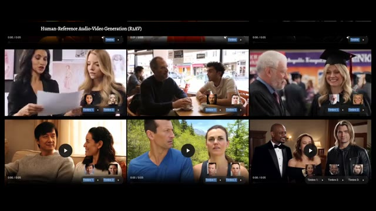
*Vue d'ensemble de la page "Human-Reference Audio-Video Generation (R2AV)" présentant plusieurs exemples de scènes de dialogue multi-personnages.*

---

### ⏱️ `[00:02:39 - 00:03:13]` | Segment #07

**🔊 Audio (Transcription Intégrale Mot pour Mot en Français) :**
> Mais c'est là que ça devient particulièrement fou. Vous pouvez prendre une vidéo existante et modifier le visage et la voix de cette personne. Clip original. Aujourd'hui, vous avez utilisé votre enfant comme appât pendant un mois. Ensuite, vous remplacez le visage d'une autre femme et une nouvelle voix de référence. Ouais, je pense que c'est les deux, je pense que c'est ok. Ça peut être les deux, c'est les deux choses, comme il y a le genre de confiance et de respect et d'amour que vous avez pour les gens que et ensuite vous régénérez la scène avec le visage échangé et la voix échangée en prononçant vous avez utilisé votre enfant comme appât pour un monstre

**👁️ Analyse Visuelle d'Écran (gemini-3.5-flash-lite) :**
**Interface & Outils** : Interface web d'un outil de recherche ou de démonstration en IA intitulé "Human-Reference Audio-Video Generation (R2AV)" et "Human-Reference Video Editing (RV2AV)".

**Contenu textuel & Code** : Titres des sections "Human-Reference Audio-Video Generation (R2AV)" et "Human-Reference Video Editing (RV2AV)", étiquettes "Original video", curseurs de lecture temporelle (0:00 / 0:04, 0:00 / 0:03), boutons "Timbre", et un prompt textuel décrivant la scène : "The scene takes place in a modern indoor setting, characterized by cool, blue-tinted lighting that creates a tense atmosphere..."

**Action / Démonstration** : Navigation et affichage d'exemples de modification de visages et de voix sur des vidéos existantes, démontrant l'échange d'identité et de voix synchronisée (face-swap et voice-swap).

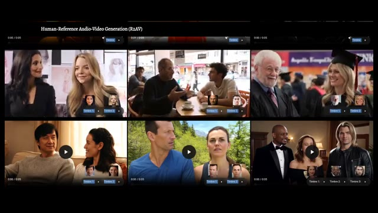
*Interface web montrant des exemples de génération de vidéos avec référence humaine (Human-Reference Audio-Video Generation ou R2AV) sous forme de grille de clips.*

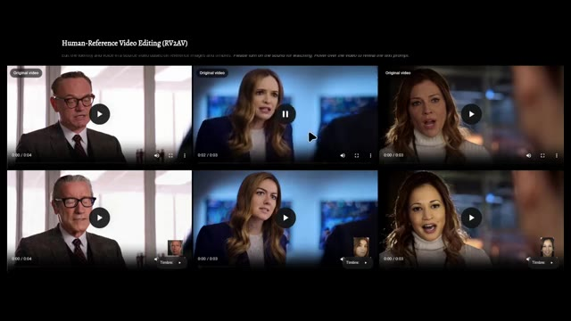
*Interface web montrant des exemples d'édition de vidéos avec référence humaine (Human-Reference Video Editing ou RV2AV), comparant des vidéos originales et des clips modifiés.*

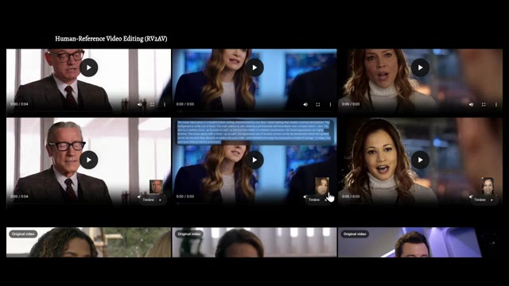
*Interface web de RV2AV avec un prompt textuel affiché au survol d'une vidéo montrant la description détaillée de la scène en cours d'édition.*

---

### ⏱️ `[00:03:13 - 00:03:31]` | Segment #08

**🔊 Audio (Transcription Intégrale Mot pour Mot en Français) :**
> Donc maintenant, la preuve vidéo est fondamentalement modifiable. Ce n'est pas seulement de la création de contenu, c'est du remixage de réalité. Maintenant, pour être juste, ce n'est pas la première méthode de deepfake qui existe. Il y a des tonnes d'outils déjà. Ovi, Phantom, Vase, LTX2 et d'autres. Mais DreamID Omni est de loin le plus flexible.

**👁️ Analyse Visuelle d'Écran (gemini-3.5-flash-lite) :**
**Interface & Outils** : Site web académique du projet DreamID-Omni.

**Contenu textuel & Code** : Titre "DreamID-Omni", sous-titre "Unified Framework for Controllable Human-Centric Audio-Video Generation", noms des auteurs et boutons de liens vers les articles et GitHub.

**Action / Démonstration** : Démonstration visuelle des capacités de modification de vidéos humaines et présentation de la plateforme DreamID-Omni.

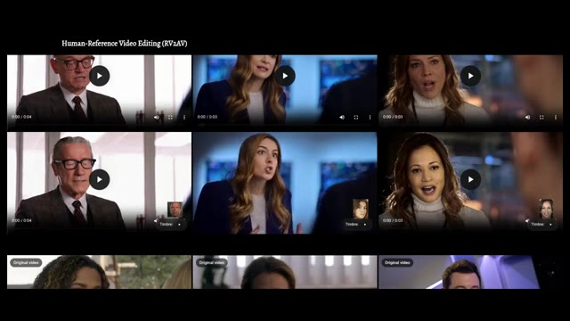
*Présentation des exemples de montage vidéo de référence humaine (RV2AV) avec une grille de clips vidéo.*

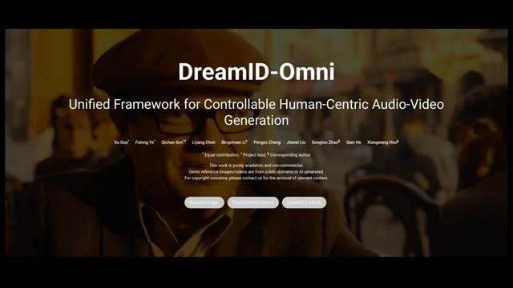
*Page d'accueil du projet DreamID-Omni montrant le titre et les auteurs.*

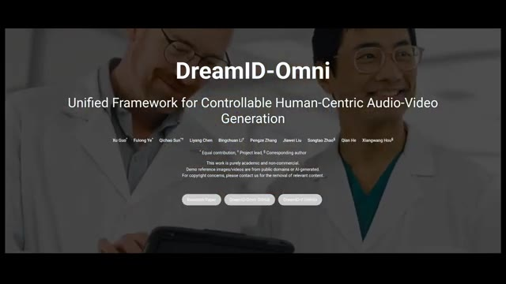
*Page d'accueil alternative du projet DreamID-Omni avec un arrière-plan de chercheurs.*

---

### ⏱️ `[00:03:31 - 00:03:53]` | Segment #09

**🔊 Audio (Transcription Intégrale Mot pour Mot en Français) :**
> Saisie de texte, saisie d'image, saisie vocale, personnages multiples, échange de visages, échange de voix, édition de vidéos existantes. C'est fondamentalement le couteau suisse des humains synthétiques. Et en haut de la page, ils ont publié un répertoire GitHub. Il est indiqué qu'ils font les derniers préparatifs pour une version open source. La version 1 est attendue en mars, ce qui signifie que cela ne reste pas derrière les murs d'une entreprise.

**👁️ Analyse Visuelle d'Écran (gemini-3.5-flash-lite) :**
**Interface & Outils** : Site web de présentation du projet de recherche DreamID-Omni (cadre unifié pour la génération audio-vidéo centrée sur l'humain).

**Contenu textuel & Code** : Titres et sous-titres : 'DreamID-Omni', 'Unified Framework for Controllable Human-Centric Audio-Video Generation', mentions des auteurs (Xu Guo, Fulong Ye, Qichao Sun, etc.), boutons 'Research Paper', 'DreamID-Omni GitHub', 'DreamID-V GitHub'. Textes en bas : 'Text Input', 'Image Input', 'Voice Input'. Section 'Code Release' : 'We are currently making final preparations for the open-source release. Pending internal company approval, we aim to release the v1 version in March. Please stay tuned!'. Section 'News' : '[02/13/2026] Our paper is released!', '[01/05/2026] The code for our previous work, DreamID-V, has been released!'. Lecteur vidéo intégré montrant une femme avec le sous-titre 'We introduce DreamID-Omni. A unified model for Controllable Audio Video Generation'.

**Action / Démonstration** : Défilement de la page web de présentation du projet DreamID-Omni mettant en avant les fonctionnalités, la vidéo de démonstration et la section de publication du code source.

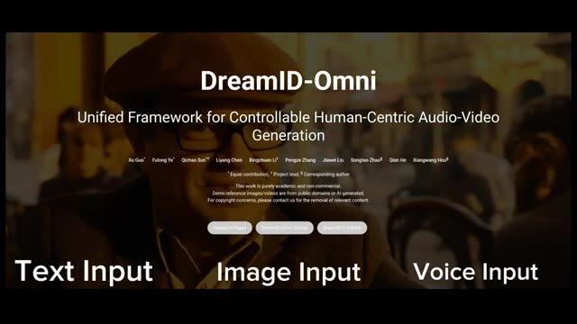
*Page de présentation du projet DreamID-Omni avec le titre principal et les options Text Input, Image Input, Voice Input.*

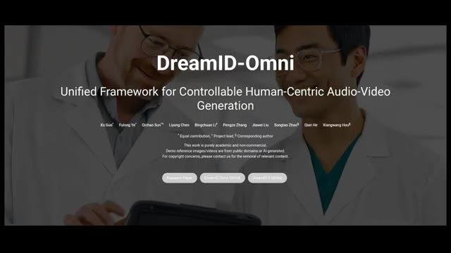
*Page web de DreamID-Omni montrant le sous-titre 'Unified Framework for Controllable Human-Centric Audio-Video Generation' avec des chercheurs en arrière-plan.*

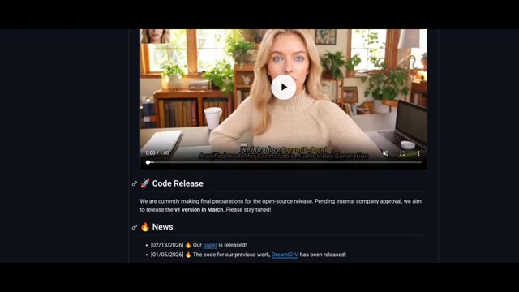
*Section Code Release du site de DreamID-Omni affichant l'annonce d'une publication open source prévue pour mars.*

---

### ⏱️ `[00:03:53 - 00:04:03]` | Segment #10

**🔊 Audio (Transcription Intégrale Mot pour Mot en Français) :**
> Bref, si vous voulez lire plus de détails, la page principale est liée ci-dessous. Et oui, nous entrons définitivement dans l'ère où voir ne suffit plus pour croire. Je vous retrouve dans le prochain rapport de recherche.

**👁️ Analyse Visuelle d'Écran (gemini-3.5-flash-lite) :**
**Interface & Outils** : Page web académique ou de présentation de projet de recherche.

**Contenu textuel & Code** : Titre principal : "DreamID-Omni", sous-titre : "Unified Framework for Controllable Human-Centric Audio-Video Generation", noms des auteurs, mentions légales, et boutons de liens ("Research Paper", "DreamID-Omni GitHub", "DreamID-Omni Huggingface").

**Action / Démonstration** : Affichage de la page d'accueil du projet DreamID-Omni en fond d'écran pendant la conclusion de la vidéo.

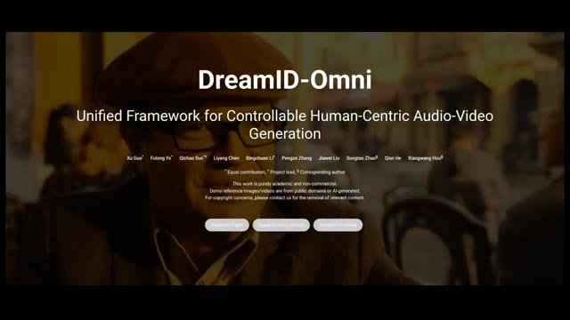
*Page de présentation du projet de recherche DreamID-Omni sur un navigateur web.*

---
