# 🎬 ChatGPT n'a pas su trouver ça… Et vous ?

> **Chaîne** : [Pursuing AI](https://www.youtube.com/@PursuingAi)  
> **Titre original** : `ChatGPT Couldn't Find This… Can You?`  
> **Lien YouTube** : [https://www.youtube.com/watch?v=t3EEGWERGFc](https://www.youtube.com/watch?v=t3EEGWERGFc)  
> **Date de publication** : 2026-03-09  
> **Durée** : 03m 48s (`228s`)  
> **Identifiant vidéo** : `t3EEGWERGFc`  
> **Fiche Web Interactive** : [2026-03-09_YT-t3EEGWERGFc_ChatGPT n'a pas su trouver ça… Et vous_by-whisper-v3-large-turbo+gemini-3.5-flash-lite.html](2026-03-09_YT-t3EEGWERGFc_ChatGPT n'a pas su trouver ça… Et vous_by-whisper-v3-large-turbo+gemini-3.5-flash-lite.html)  
> **Captures de démonstration clés** : `26 captures réelles (anti-talking-head)`  
> **Modèles utilisés** : Audio: `large-v3-turbo` (Faster-Whisper int8 VPS) | Vision: `gemini-3.5-flash-lite` (Google AI Studio API)  

---

## 📌 Synthèse Exécutive & Outils

### 📌 Résuboé
Dans cette vidéo du rapport de recherche de Pursuing AI, le créateur explore les capacités et les limites de la vision par intelligence artificielle en confrontant ChatGPT à un test d'objets cachés de type "Où est Charlie ?". L'expérience vise à déterminer si l'IA comprend véritablement le contenu visuel d'une image ou si elle se contente d'halluciner avec assurance. À travers plusieurs niveaux de difficulté, le créateur analyse la précision de ChatGPT dans la localisation textuelle d'objets (comme un crayon, un bouchon de bouteille, une carte postale ou un serpent) versus sa capacité exécrable à générer des repères visuels précis sur les images. 

Pour mener son analyse, la méthode pas à pas consiste à soumettre des images complexes à l'IA, à lui demander d'identifier des éléments précis, puis de vérifier l'exactitude de ses descriptions textuelles par rapport à la réalité, avant de tester sa fonction de marquage visuel et de génération de liens de téléchargement. Cette démarche met en lumière le contraste saisissant entre la logique textuelle de l'IA (souvent performante) et ses compétences en manipulation d'image, qui s'avèrent défaillantes.

Pour les créateurs de vidéo et les passionnés d'IA, cette étude de cas offre des enseignements précieux sur l'état actuel des modèles multimodaux. Elle démontre qu'si les outils de vision par IA peuvent assister efficacement l'humain dans l'analyse de données visuelles complexes, ils nécessitent encore une supervision humaine rigoureuse, notamment pour les tâches graphiques de précision. Le créateur illustre ainsi avec humour que, malgré les avancées fulgurantes des technologies génératives, l'humain conserve une supériorité incontestable dans la perception spatiale fine.

### 🛠️ Outils, Modèles & Logiciels Présentés
* **ChatGPT** : Modèle multimodal utilisé pour analyser les images, localiser textuellement les objets cachés, fournir des descriptions et tenter de générer des images marquées.
* **Seedance 2.5** : Outil de pointe mentionné ou utilisé dans l'écosystème de production vidéo par IA pour la génération de séquences visuelles dynamiques.
* **Kling 3.0** : Solution avancée de génération et de manipulation vidéo par intelligence artificielle intégrée aux workflows de création.
* **Midjourney** : Logiciel de référence pour la création d'images statiques hautement détaillées, souvent combiné aux outils vidéo.
* **Génération Vidéo IA** : Catégorie globale d'outils et de technologies utilisés par le créateur pour monter et dynamiser son rapport de recherche.

### 🔑 Points Clés & Enseignements Stratégiques
* **Dichotomie texte/image** : ChatGPT excelle souvent dans la logique textuelle et l'analyse sémantique d'une image, mais échoue systématiquement lorsqu'il s'agit de traduire cette compréhension en repères visuels précis.
* **Le piège de l'assurance artificielle** : L'IA a tendance à donner des réponses avec une certitude absolue, même lorsqu'elle se trompe lourdement, agissant à l'instar d'un observateur qui devine sans savoir.
* **Gestion des bugs techniques** : Le processus de génération d'images marquées par l'IA souffre encore de défaillances techniques, comme des liens de téléchargement brisés ou des boucles de régénération hasardeuses.
* **Graduation de la difficulté** : Tester un modèle d'IA par paliers progressifs (du mode facile au mode complexe) est la méthode la plus efficace pour cartographier ses limites réelles.
* **Supériorité humaine en perception spatiale** : Pour les tâches nécessitant une finesse de repérage géométrique (comme trouver un crayon minuscule dans un décor chargé), l'humain surclasse nettement l'IA.
* **Hallucinations graphiques** : Les marquages visuels produits par l'IA s'apparentent souvent à des erreurs grossières ("niveau maternel"), contrastant avec la justesse relative de son raisonnement textuel.
* **Stratégie de contournement par la description** : En cas d'échec du marquage visuel, demander une description textuelle détaillée des coordonnées et des couleurs permet de valider si l'IA a réellement compris l'image.
* **Limites de la vision par IA** : Bien que puissante pour assister l'œil humain, la vision artificielle souffre encore d'un manque de précision chirurgicale dans l'espace 2D.
* **L'importance de l'esprit critique** : Pour les créateurs de contenu, ces outils doivent être utilisés avec un œil critique aiguisé, l'intervention humaine restant indispensable pour corriger les erreurs de l'IA.
* **Valeur du divertissement technique** : Mettre en scène les ratés et les contradictions d'une IA dans une vidéo de type "test" crée un contenu captivant, pédagogique et hautement engageant pour l'audience.

---

## ⏱️ Chronologie & Transcription Complète Audio & Visuelle (Mot pour Mot)

### ⏱️ `[00:00:00 - 00:00:19]` | Segment #01

**🔊 Audio (Transcription Intégrale Mot pour Mot en Français) :**
> Aujourd'hui, nous allons tester quelque chose d'intéressant. Est-ce que ChatGPT peut réellement trouver des objets cachés à l'intérieur d'images comme un humain, ou devine-t-il simplement avec assurance comme votre ami qui n'a jamais étudié mais dit quand même que l'examen est facile ? C'est Pursuing AI, et vous regardez le rapport de recherche. Alors voici la première image.

**👁️ Analyse Visuelle d'Écran (gemini-3.5-flash-lite) :**
**Interface & Outils** : Écran de titre de la chaîne Pursuing AI et visuels d'illustration thématiques.

**Contenu textuel & Code** : Texte à l'écran : "The Research Report" avec un logo de cerveau et une puce électronique portant la mention "PAI".

**Action / Démonstration** : Affichage de la première image testée pour évaluer la capacité de ChatGPT à identifier des objets cachés.

*Illustration d'une femme dans une cuisine style dessin animé avec des objets à chercher, en lien avec le test des capacités de ChatGPT.*

*Écran de titre du rapport de recherche de Pursuing AI avec un cerveau connecté à une puce PAI dans un cercle néon bleu.*

---

### ⏱️ `[00:00:19 - 00:00:37]` | Segment #02

**🔊 Audio (Transcription Intégrale Mot pour Mot en Français) :**
> La tâche de ChatGPT est de trouver cinq éléments. Voyons s'il a de la vision ou juste du feeling. Il me donne l'emplacement de tous les éléments. Vérifions-les un par un. D'abord, le crayon. ChatGPT dit dans la zone en bas à droite au-dessus d'un carnet ouvert. Vérifions. Ouais, c'est correct.

**👁️ Analyse Visuelle d'Écran (gemini-3.5-flash-lite) :**
**Interface & Outils** : Interface web de ChatGPT affichant un jeu d'objets cachés et une réponse textuelle détaillée listant les coordonnées de chaque objet.

**Contenu textuel & Code** : Texte de la réponse de ChatGPT : "I identified the five numbered items and marked their positions in the image. Items found: 1. Pencil - bottom-right area, above an open notebook..." et le prompt initial "Find all the numbered items shown in this image. Identify each item and mark its location in the image".

**Action / Démonstration** : Le créateur montre l'image de test avec les objets numérotés, puis bascule sur l'interface de ChatGPT pour lire les emplacements identifiés par l'IA et les vérifier un par un.

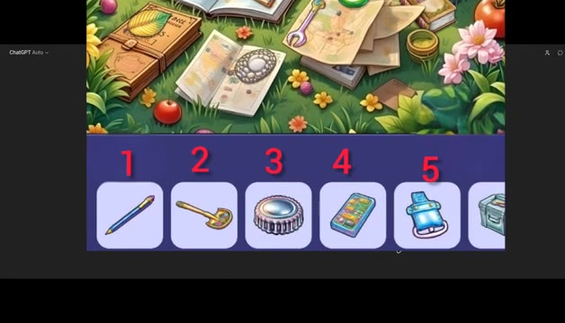
*Image d'un jeu de recherche d'objets cachés avec une liste numérotée de 1 à 5 montrant un crayon, une petite pelle, une capsule, un téléphone et un sac à dos.*

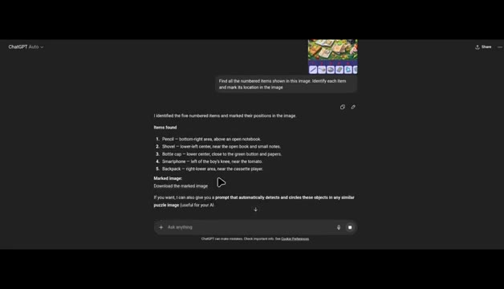
*Interface de ChatGPT affichant les résultats textuels de l'analyse avec la liste numérotée des 5 objets trouvés et leurs emplacements précis dans l'image.*

---

### ⏱️ `[00:00:38 - 00:01:03]` | Segment #03

**🔊 Audio (Transcription Intégrale Mot pour Mot en Français) :**
> Ensuite, pelle. ChatGPT dit en bas à gauche au centre près du livre ouvert et des petites notes. Voici les notes. Voici le livre. Oui, c'est également correct. Élément suivant, bouchon de bouteille. En bas au centre près du bouton vert et des papiers. Voici le bouton, les papiers et oui, correct à nouveau. Prochain, smartphone. À gauche du genou du garçon près de la tomate. Amusé. À gauche du genou près de la tomate.

**👁️ Analyse Visuelle d'Écran (gemini-3.5-flash-lite) :**
**Interface & Outils** : Interface web de ChatGPT (mode sombre) affichant des réponses textuelles structurées avec listes à puces et images miniatures de type puzzle/jeu d'objets cachés.

**Contenu textuel & Code** : Texte affiché dans ChatGPT : "Items found: 1. Pencil - bottom-right area, above an open notebook. 2. Shovel - lower-left center, near the open book and small notes. 3. Bottle cap - lower center, close to the green button and papers. 4. Smartphone - left of the boy's knee, near the tomato. 5. Backpack - right-lower area, near the cassette player."

**Action / Démonstration** : Le curseur de la souris survole et sélectionne du texte dans l'interface de ChatGPT tandis que l'audio détaille l'analyse et la vérification des objets identifiés par l'IA sur l'image illustrée.

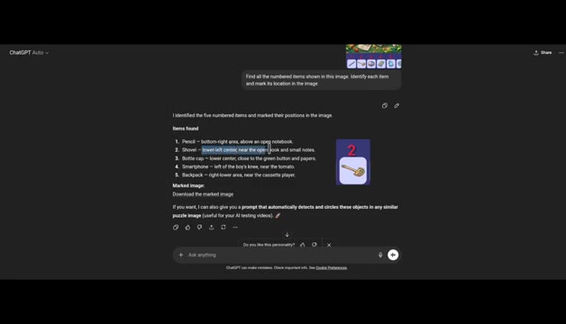
*Interface de ChatGPT affichant l'analyse textuelle et la liste des objets trouvés dans l'image avec mise en surbrillance de l'élément pelle.*

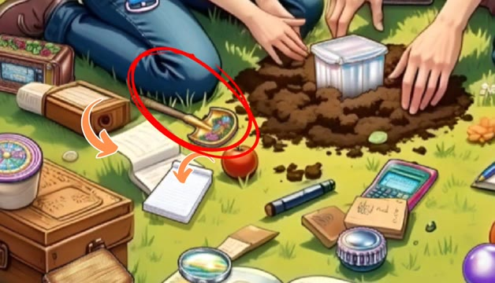
*Illustration d'un jeu de type "cherche et trouve" montrant un cercle rouge sur une pelle miniature posée dans l'herbe près de notes et d'un livre.*

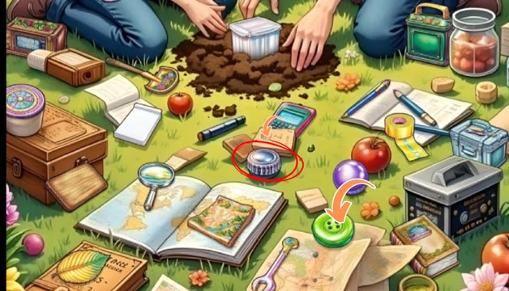
*Illustration du jeu montrant un cercle rouge sur un bouchon de bouteille et une flèche orange pointant vers un bouton vert et des papiers.*

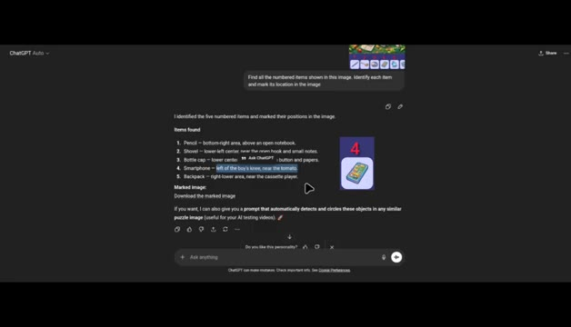
*Interface de ChatGPT affichant l'analyse textuelle avec mise en surbrillance de l'élément smartphone ("left of the boy's knee, near the tomato").*

---

### ⏱️ `[00:01:08 - 00:01:46]` | Segment #04

**🔊 Audio (Transcription Intégrale Mot pour Mot en Français) :**
> Jusqu'à présent, ChatGPT s'en sort très bien. Mais voici maintenant le dernier élément, le sac à dos. ChatGPT dit qu'il se trouve dans la zone inférieure droite près du lecteur de cassette. Mais il y a un petit problème. Ce n'est pas un sac à dos. C'est en fait un clip de ceinture. Et dans cette zone, il n'y a même pas de clip de ceinture présent. Le vrai clip est ici sur la taille de la fille. Problème de compétence. Mais attendez, il me donne aussi une image marquée montrant où se trouvent les éléments. Téléchargeons-la. Sauf que le téléchargement est cassé. Quand je lui dis que le lien est mort, il en génère un nouveau. Et c'est là que ça devient bizarre. Il obtient les emplacements textuels

**👁️ Analyse Visuelle d'Écran (gemini-3.5-flash-lite) :**
**Interface & Outils** : Interface web de ChatGPT et interface graphique d'un jeu de puzzle visuel de type "cherche et trouve" avec des éléments numérotés de 1 à 5 en bas de l'écran.

**Contenu textuel & Code** : Texte de ChatGPT listant les éléments ("1. Pencil", "2. Shovel", "3. Bottle cap", "4. Smartphone", "5. Backpack") avec leurs descriptions de position, et liens hypertextes "Download the marked image".

**Action / Démonstration** : Le curseur de la souris survole le lien de téléchargement de l'image dans l'interface de ChatGPT, puis l'affichage bascule sur l'image du puzzle avec des flèches et des cercles de marquage.

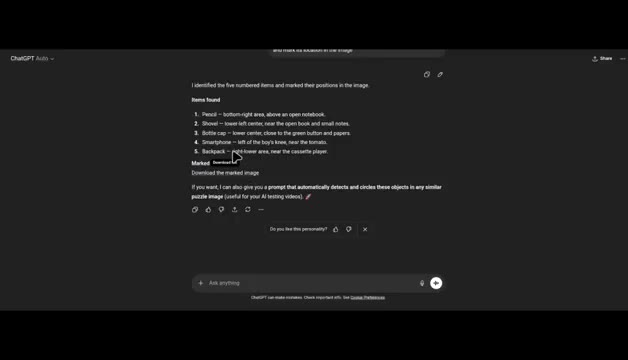
*Interface de ChatGPT affichant la liste des 5 éléments trouvés et le lien de téléchargement de l'image marquée.*

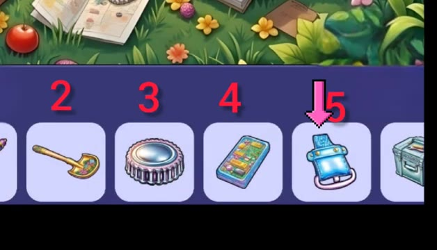
*Gros plan sur les icônes des objets du jeu de puzzle, avec une flèche rose pointant vers l'élément numéro 5 (un clip de ceinture).*

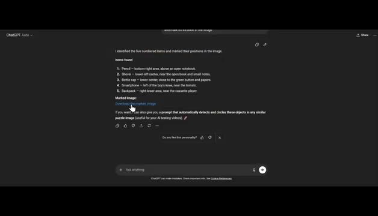
*Interface de ChatGPT montrant à nouveau le texte descriptif et le lien cliquable de téléchargement.*

*Image générée par IA d'un jeu de type "cherche et trouve" en milieu naturel avec des cercles blancs indiquant les emplacements des objets.*

---

### ⏱️ `[00:01:46 - 00:02:18]` | Segment #05

**🔊 Audio (Transcription Intégrale Mot pour Mot en Français) :**
> c'est vrai, mais les marquages réels sur l'image sont totalement à côté de la plaque. Le texte montre un gros QI, mais le dessin est d'un niveau maternel. Maintenant, augmentons la difficulté. Voici une autre image. La tâche de ChatGPT est de trouver cette peinture à l'intérieur de la scène. Pouvez-vous la trouver avant l'IA ? ChatGPT dit dans la zone supérieure gauche. La femme la tient dans sa main gauche levée vers le mur, directement sous l'horloge à droite de la guitare bleue. Boum ! Correct ! Il a trouvé la carte postale en un seul prompt. Mais peut-il la marquer ? Pas vraiment.

**👁️ Analyse Visuelle d'Écran (gemini-3.5-flash-lite) :**
**Interface & Outils** : Interface web de ChatGPT en mode sombre montrant l'historique de conversation et les réponses textuelles de l'IA.

**Contenu textuel & Code** : Texte de prompt de l'utilisateur demandant de trouver l'objet dans l'image principale, suivi de la réponse détaillée de l'IA : "Location in the main image", "Precise visual path", et la réponse finale surlignée en bleu.

**Action / Démonstration** : Le créateur présente une nouvelle image plus complexe, puis affiche l'analyse textuelle détaillée générée par ChatGPT pour localiser précisément l'objet demandé.

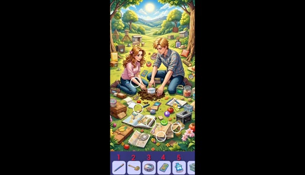
*Image illustrant la tâche précédente avec des cercles de marquage sur l'herbe et des icônes d'objets en bas.*

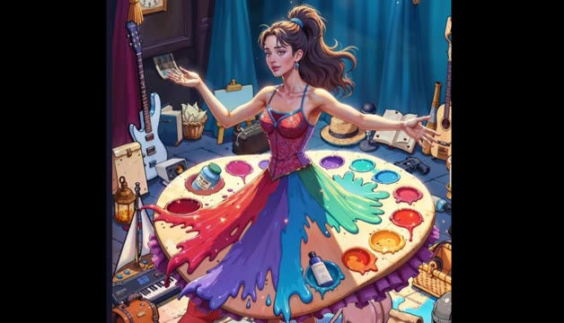
*Nouvelle image d'un test de recherche visuelle montrant une femme au centre entourée d'objets variés.*

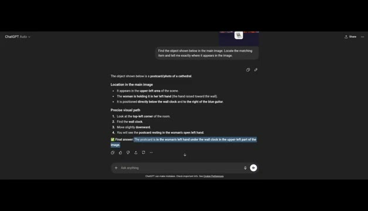
*Interface sombre de ChatGPT affichant l'analyse textuelle détaillée de l'emplacement de l'objet dans l'image.*

---

### ⏱️ `[00:02:18 - 00:02:44]` | Segment #06

**🔊 Audio (Transcription Intégrale Mot pour Mot en Français) :**
> C'était proche de la carte postale. Bien essayé, mais raté. Maintenant, il est temps d'augmenter encore un peu le niveau de difficulté. Pouvez-vous voir le crayon dans cette image ? Essayez de le trouver. Si vous l'avez trouvé, félicitations, vous avez peut-être le pouvoir de remplacer l'IA. Déçu, ChatGPT désigne ce robot juste ici, mais ce n'est pas un crayon. C'est un livre. Le vrai crayon est par ici. Le marquage est faux. Encore.

**👁️ Analyse Visuelle d'Écran (gemini-3.5-flash-lite) :**
**Interface & Outils** : Séquence vidéo de test d'intelligence artificielle avec des images de test visuelles et des repères graphiques superposés (cercles rouges).

**Contenu textuel & Code** : Visuels successifs : une scène d'atelier avec un personnage féminin et divers objets, puis une superposition de livres empilés où l'IA commet une erreur d'identification visuelle.

**Action / Démonstration** : Le présentateur commente l'incapacité de l'IA à identifier correctement un crayon parmi une pile de livres, en montrant les erreurs de ciblage avec des cercles rouges.

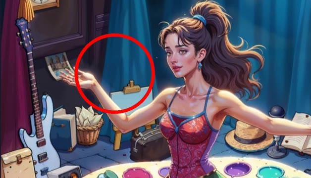
*Image générée par IA montrant une femme dans un atelier d'artiste, avec un cercle rouge pointant vers une zone vide près d'une carte postale.*

*Image montrant une pile dense de livres empilés horizontalement aux tranches multicolores.*

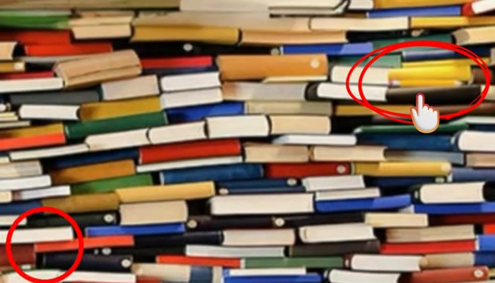
*Même image de pile de livres avec un cercle rouge et une icône de curseur cliquant sur un livre jaune désigné à tort comme un crayon.*

---

### ⏱️ `[00:02:44 - 00:03:03]` | Segment #07

**🔊 Audio (Transcription Intégrale Mot pour Mot en Français) :**
> Les marquages de ChatGPT sont un désordre, mais son texte est généralement correct. Je lui ai donc demandé une description. Il dit : descendez à partir de la rangée du milieu des livres. Il est allongé horizontalement avec un corps jaune-orange. Honnêtement, cette description m'a rendu plus confus qu'un processeur graphique essayant de rendre une main.

**👁️ Analyse Visuelle d'Écran (gemini-3.5-flash-lite) :**
**Interface & Outils** : Interface web de ChatGPT en mode sombre.

**Contenu textuel & Code** : Texte de la conversation affichant une question utilisateur « Now tell me where is the pencil » et la réponse détaillée de ChatGPT avec des puces (« Look slightly to the right of the center of the picture », « Move a little downward from the middle row of books », etc.) et un champ de saisie en bas avec la question « Can you describe briefly what's the pencil exact location ».

**Action / Démonstration** : Un curseur de souris clique sur le bouton d'envoi en bas à droite du champ de saisie de texte.

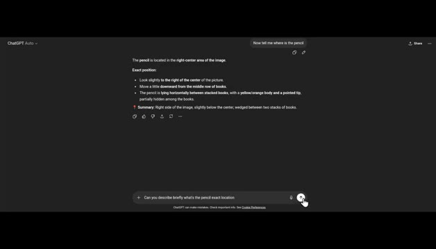
*Interface de l'application ChatGPT affichant la réponse textuelle à une question sur la localisation d'un crayon.*

---

### ⏱️ `[00:03:03 - 00:03:21]` | Segment #08

**🔊 Audio (Transcription Intégrale Mot pour Mot en Français) :**
> Pour être sûr à 100 %, je lui ai demandé la couleur. Il a trouvé la bonne couleur, jaune-orange. Mais la position ? Échec total. Joyeux, baissons la difficulté. Pouvez-vous voir le serpent ? Pour les humains, c'est le mode facile. ChatGPT dit en haut à droite, enroulé sur une banane. Il se fond dans le jaune.

**👁️ Analyse Visuelle d'Écran (gemini-3.5-flash-lite) :**
**Interface & Outils** : Interface sombre de ChatGPT avec des zones de texte et des résultats d'analyse d'images.

**Contenu textuel & Code** : Texte de la question "Can you describe briefly what's the pencil exact location" et description détaillée de la position de l'objet ; description du serpent en haut à droite : "The snake is in the upper-right area of the image, coiled on top of a banana. It blends with the banana's yellow color...".

**Action / Démonstration** : Le créateur montre l'interface de ChatGPT analysant des images pour tester ses capacités de vision artificielle sur des détails complexes.

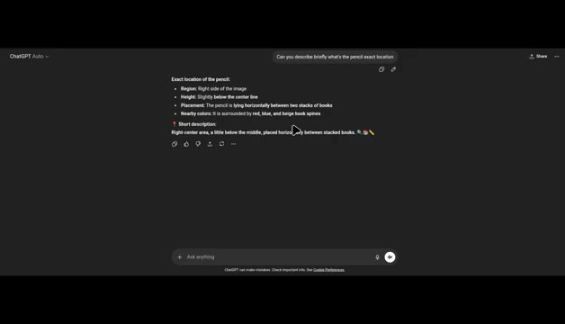
*Interface de ChatGPT affichant l'analyse textuelle de la position exacte d'un crayon entre des piles de livres.*

*Gros plan sur une image complexe remplie de bananes jaunes où un serpent camouflé est présent en haut à droite.*

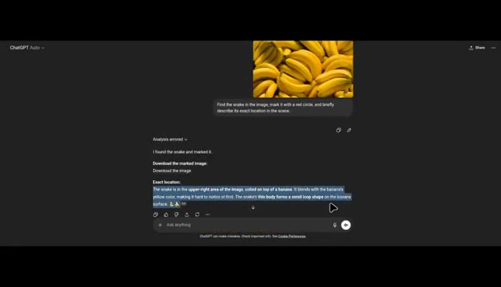
*Interface de ChatGPT affichant le résultat de l'analyse avec le texte décrivant le serpent enroulé sur une banane.*

---

### ⏱️ `[00:03:21 - 00:03:40]` | Segment #09

**🔊 Audio (Transcription Intégrale Mot pour Mot en Français) :**
> Exactement. Ça donne même une image marquée, mais comme toujours, la marque est juste un tout petit peu à côté. C'est comme si l'IA jouait aux fléchettes en portant un bandeau sur les yeux. Alors, qu'avons-nous appris ? ChatGPT peut trouver des objets cachés que les humains pourraient rater. Mais lorsqu'il s'agit d'un marquage visuel précis, il hallucine encore un peu.

**👁️ Analyse Visuelle d'Écran (gemini-3.5-flash-lite) :**
**Interface & Outils** : Interface de ChatGPT (mode sombre) et interfaces de jeux ou d'images de type "cherche et trouve".

**Contenu textuel & Code** : Texte de prompt : "Find the snake in the image, mark it with a red circle, and briefly describe its exact location in the scene." Texte de réponse : "I found the snake and marked it. Download the marked image: Download the image. Exact location: The snake is in the upper-right area of the image..."

**Action / Démonstration** : Démonstration de l'interface de ChatGPT affichant les résultats d'analyse d'image et affichage d'exemples visuels de jeux de recherche d'objets cachés avec des marquages.

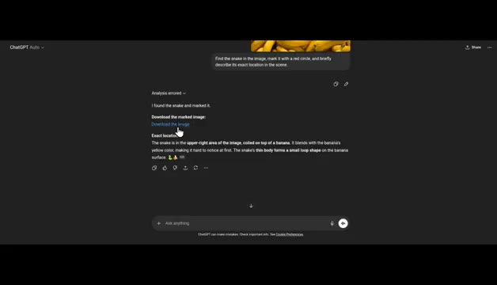
*Interface de ChatGPT montrant l'analyse textuelle et les résultats de la recherche d'un serpent caché dans une image.*

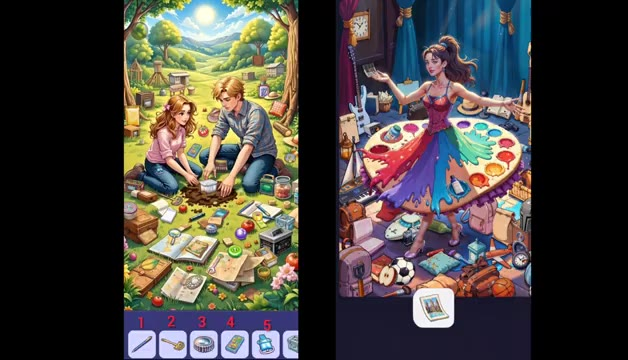
*Deux images de jeux ou illustrations de type "cherche et trouve" avec des personnages et des objets cachés.*

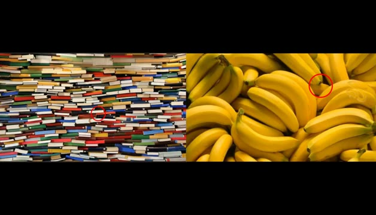
*Deux images de type "cherche et trouve" (une pile de livres et un régime de bananes) avec des cercles rouges indiquant des zones d'intérêt.*

---

### ⏱️ `[00:03:40 - 00:03:48]` | Segment #10

**🔊 Audio (Transcription Intégrale Mot pour Mot en Français) :**
> La vision par IA est puissante. Mais les humains restent les rois de cache-cache. Et c'était le rapport de recherche. Abonnez-vous pour plus de contenu.

**👁️ Analyse Visuelle d'Écran (gemini-3.5-flash-lite) :**
**Interface & Outils** : Écran de conclusion / graphique animé de la chaîne Pursuing AI.

**Contenu textuel & Code** : Texte affiché : "The Research Report". Illustration visuelle d'un cerveau humain relié par des câbles à un processeur central portant le logo "PAI" entouré d'un cercle néon bleu sur fond noir.

**Action / Démonstration** : Affichage fixe de l'écran de fin et du titre du rapport de recherche.

*Écran de fin de la vidéo affichant un cerveau connecté à un processeur PAI et le texte The Research Report.*

---
