# 🎬 L'IA se moque des développeurs… Test LeetCode HARD

> **Chaîne** : [Pursuing AI](https://www.youtube.com/@PursuingAi)  
> **Titre original** : `AI Is Laughing at Programmers… LeetCode HARD Test`  
> **Lien YouTube** : [https://www.youtube.com/watch?v=uP3CLiz35ZY](https://www.youtube.com/watch?v=uP3CLiz35ZY)  
> **Date de publication** : 2026-03-13  
> **Durée** : 06m 27s (`387s`)  
> **Identifiant vidéo** : `uP3CLiz35ZY`  
> **Fiche Web Interactive** : [2026-03-13_YT-uP3CLiz35ZY_L'IA se moque des développeurs… Test LeetCode HARD_by-whisper-v3-large-turbo+gemini-3.5-flash-lite.html](2026-03-13_YT-uP3CLiz35ZY_L'IA se moque des développeurs… Test LeetCode HARD_by-whisper-v3-large-turbo+gemini-3.5-flash-lite.html)  
> **Captures de démonstration clés** : `30 captures réelles (anti-talking-head)`  
> **Modèles utilisés** : Audio: `large-v3-turbo` (Faster-Whisper int8 VPS) | Vision: `gemini-3.5-flash-lite` (Google AI Studio API)  

---

## 📌 Synthèse Exécutive & Outils

### 📌 Résumé
La vidéo de *Pursuing AI* intitulée « L'IA se moque des développeurs… Test LeetCode HARD » s'attaque frontalement au mythe ambiant de l'obsolescence programmée des ingénieurs logiciels face aux progrès fulgurants de l'intelligence artificielle. Le créateur orchestre un test comparatif rigoureux et progressif — allant de problèmes simples à des défis de niveau *Hard* issus d'entretiens techniques de Big Tech — pour évaluer objectivement la frontière entre la simple saisie semi-automatique dopée aux GPU et la véritable ingénierie logicielle complexe. En soumettant une sélection de tests algorithmiques et SQL à quatre grands modèles du marché (Gemini, ChatGPT, Claude et Grok), la vidéo démontre que l'IA ne se contente plus de générer du code superficiel, mais qu'elle est désormais capable de raisonner, d'expliquer des architectures sous-jacentes et de résoudre des problèmes algorithmiques ardus.

Sur le plan de la réalisation et de la narration vidéo, le créateur structure son récit selon une courbe dramatique classique mais redoutablement efficace : la promesse alarmiste initiale (« votre patron va licencier toute l'équipe »), l'escalade de la difficulté (Easy ➔ Medium ➔ Hard) et l'élimination progressive des candidats, culminant avec l'élimination de Grok sur un problème de niveau moyen. L'utilisation habile de l'outil Claude, mis en avant dans l'analyse pour sa capacité à décortiquer les subtilités d'une logique SQL complexe (comme la gestion des ex-aequo avec les sous-requêtes corrélées), renforce la crédibilité technique de la capsule. Le montage s'appuie sur le rythme des tests en temps réel (collage du prompt, exécution dans l'IDE/LeetCode, validation des cas de test), créant un suspense palpable.

Pour les créateurs de contenu vidéo et les monteurs spécialisés dans la tech, cette vidéo offre une masterclass sur la manière de traiter un sujet abstrait et technique en un divertissement captivant. En transformant un benchmark technique aride en un tournoi éliminatoire, le créateur maximise l'engagement du spectateur (*retention rate*), utilise l'humour (« réparer le vieux code de production écrit en 2011 par un stagiaire ») pour dédramatiser la menace de l'IA, et conclut par un appel à l'action naturel et contextuel. Les bénéfices concrets résident dans la maîtrise du *storytelling* par la preuve empirique, l'incarnation d'un test grandeur nature et la capacité à transformer une analyse de code source en un contenu grand public hautement viral.

### 🛠️ Outils, Modèles & Logiciels Présentés
* **Claude** : Modèle d'intelligence artificielle conversationnelle d'Anthropic, utilisé ici pour analyser et résoudre avec succès des problèmes algorithmiques et des requêtes SQL complexes, démontrant une excellente compréhension logique et textuelle.
* **ChatGPT** : Modèle phare d'OpenAI, employé pour tester sa rapidité et sa précision sur des problématiques de programmation allant du niveau *Easy* au niveau *Hard*.
* **Gemini** : L'assistant IA de Google, mis à l'épreuve sur les différents paliers de difficulté, se distinguant notamment par l'utilisation de fonctions de fenêtrage en SQL.
* **Grok** : Modèle d'intelligence artificielle évalué dans le tournoi, qui se fait éliminer au stade des problèmes de niveau moyen après avoir échoué sur un problème de maximisation du profit.
* **LeetCode** : Plateforme en ligne de référence pour les entretiens techniques, servant de banc d'essai neutre et impitoyable pour valider l'exactitude du code généré par chaque IA via des cas de tests réels.
* **Java / SQL** : Langages de programmation et de gestion de bases de données utilisés comme supports pour évaluer les compétences techniques des modèles.

### 🔑 Points Clés & Enseignements Stratégiques
* **Structurer le contenu en paliers de difficulté croissants** : Faire progresser le test du niveau le plus simple (*Two Sum*) au niveau le plus complexe (*Hard SQL*) crée une rampe de progression dramatique naturelle qui retient l'attention du spectateur jusqu'à la fin.
* **Mettre en place une règle du jeu claire et stricte** : Fixer des limites précises (par exemple, accorder exactement trois chances à chaque IA par problème) instaure un cadre rigoureux qui transforme un simple test technique en une véritable compétition sportive.
* **Humaniser le test par la mise en scène du direct** : Montrer l'action de copier-coller le prompt, d'observer la génération du code et de valider les résultats dans l'interface de test (LeetCode) renforce instantanément l'authenticité et la transparence de la vidéo.
* **Valoriser les nuances comportementales des modèles** : Ne pas se contenter de dire si l'IA a bon ou faux, mais analyser *comment* elle résout le problème (par exemple, Grok choisissant un tableau pour optimiser la localité du cache) apporte une valeur ajoutée hautement professionnelle.
* **Intégrer une touche d'humour et d'autodérision** : Utiliser des blagues bienvenues (comme évoquer le code de production d'un stagiaire en 2011) permet de désamorcer l'anxiété liée au remplacement des développeurs par l'IA tout en captant la sympathie de la communauté tech.
* **Créer de faux suspenses et éliminations** : Éliminer un modèle en cours de route (comme l'élimination de Grok au milieu de la vidéo) insuffle un rebondissement narratif qui relance l'intérêt au moment où la fatigue pourrait s'installer.
* **Ancrer le sujet dans l'actualité et la peur collective** : Surfer sur un sujet viral et anxiogène (« l'IA va remplacer les programmeurs ») pour ensuite le nuancer par la réalité du terrain offre le parfait équilibre entre racolage intelligent et journalisme technique rigoureux.
* **Exploiter la force des exemples concrets d'entretiens** : Utiliser des problèmes célèbres et redoutés des développeurs (comme *Two Sum* ou le calcul de salaires par département) garantit une résonance immédiate auprès de la cible visée.
* **Conclure par un appel à l'action contextuel** : Lier l'abonnement et le like non pas à une demande générique, mais à la promesse de continuer à tester les limites de l'IA et la sécurité de l'emploi des spectateurs, maximisant ainsi la conversion.
* **Démontrer la polyvalence des outils** : Mettre en avant le fait que plusieurs modèles réussissent les tests (ChatGPT, Gemini et Claude) évite le piège du publi-reportage unilatéral et dresse un portrait réaliste et nuancé de l'état actuel de la technologie.

---

## ⏱️ Chronologie & Transcription Complète Audio & Visuelle (Mot pour Mot)

### ⏱️ `[00:00:00 - 00:00:23]` | Segment #01

**🔊 Audio (Transcription Intégrale Mot pour Mot en Français) :**
> Tout le monde sur internet ne cesse de répéter la même chose. L'intelligence artificielle va remplacer les programmeurs. Je pense, je ne sais pas, que nous sommes peut-être à 6 ou 12 mois du moment où le modèle fera la majeure partie, voire la totalité, de ce que font les ingénieurs logiciels, et 10. Apparemment, d'un jour à l'autre, votre patron va débarquer au bureau, licencier toute l'équipe de développeurs et la remplacer par un seul prompt et un GPU.

**👁️ Analyse Visuelle d'Écran (gemini-3.5-flash-lite) :**
**Interface & Outils** : B-roll vidéo et illustrations graphiques d'illustration.

**Contenu textuel & Code** : Texte sous-titré/animé 'THE SAME THING' et incrustations textuelles 'World Economic Forum | YT, Davos, Switzerland, 20 JANUARY, 2026, CREDIT @MINT'.

**Action / Démonstration** : Illustrations visuelles dynamiques illustrant les propos de l'orateur sur le remplacement des développeurs par l'IA et le matériel informatique.

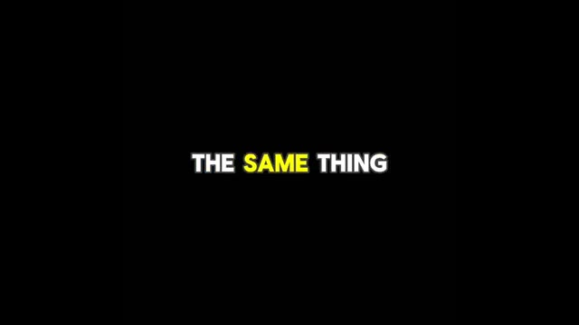
*Texte animé en surbrillance jaune et blanche sur fond noir affichant 'THE SAME THING'.*

*Extrait vidéo d'un panel de discussion du World Economic Forum à Davos en Suisse avec des intervenants assis sur scène.*

*Scène de bureau illustrant un homme souriant apportant une grande boîte de matériel informatique (GPU) devant des employés travaillant sur des ordinateurs portables.*

*Gros plan sur un homme posant une grande boîte de carte graphique sur un bureau devant des employés surpris.*

---

### ⏱️ `[00:00:24 - 00:00:42]` | Segment #02

**🔊 Audio (Transcription Intégrale Mot pour Mot en Français) :**
> Mais est-ce vraiment vrai ? Parce que coder une simple application de tâches à partir d'une consigne, c'est facile. Mais la vraie ingénierie logicielle est complexe. Alors aujourd'hui, nous allons faire un test simple pour découvrir la vérité. L'IA peut-elle réellement résoudre de vrais problèmes LeetCode ? Ou s'agit-il simplement d'une saisie semi-automatique sous stéroïdes ?

**👁️ Analyse Visuelle d'Écran (gemini-3.5-flash-lite) :**
**Interface & Outils** : Interface utilisateur de développement web / application et mème vidéo illustratif.

**Contenu textuel & Code** : Texte affiché : "Theme park simulation game made with GPT-5.4 from a single lightly specified prompt, using Playwright Interactive for browser playtesting and image generation for the isometric..." et un mème avec le texte "NeedSize" et "A I".

**Action / Démonstration** : Présentation d'une démo de simulation de parc d'attractions générée par IA, suivie d'une illustration humoristique métaphorique.

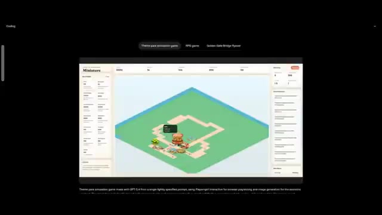
*Capture d'écran montrant l'interface d'un outil de développement miniature ou de simulation de jeu avec un rendu graphique isométrique et du code.*

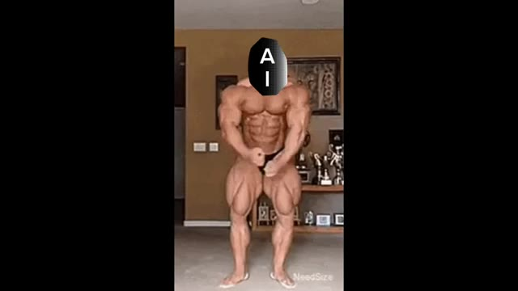
*Mème vidéo illustrant un culturiste bodybuildé avec un logo « AI » sur le visage, symbolisant la métaphore des stéroïdes.*

---

### ⏱️ `[00:00:43 - 00:01:03]` | Segment #03

**🔊 Audio (Transcription Intégrale Mot pour Mot en Français) :**
> C'est Pursuing AI, et vous regardez le rapport de recherche. Aujourd'hui, nous mettons les plus grands modèles d'IA à l'épreuve. Gemini, ChatGPT, Claude et Grok. Nous commencerons par des problèmes faciles, passerons aux moyens, et terminerons par les difficiles. La règle la plus importante, chaque IA a trois chances pour résoudre un problème particulier.

**👁️ Analyse Visuelle d'Écran (gemini-3.5-flash-lite) :**
**Interface & Outils** : Graphismes animés et présentation visuelle des modèles d'IA testés.

**Contenu textuel & Code** : Texte 'Easy -> Medium -> Hard' et logos de Gemini, ChatGPT, Claude et Grok.

**Action / Démonstration** : Affichage graphique des étapes de difficulté et des logos des IA comparées.

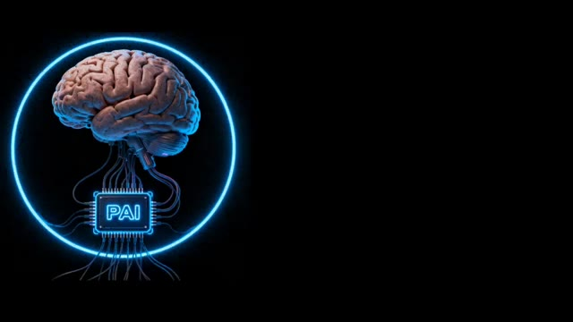
*Illustration graphique montrant un cerveau humain connecté à un processeur portant l'inscription 'PAI' entouré d'un anneau néon bleu sur fond noir.*

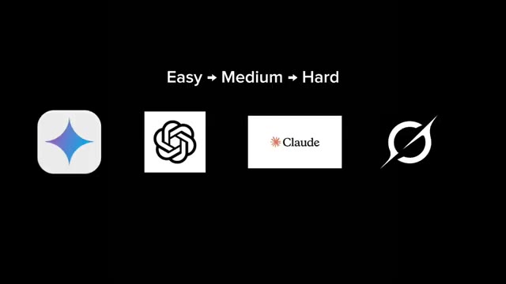
*Écran affichant le texte 'Easy -> Medium -> Hard' ainsi que les logos des quatre modèles d'IA : Gemini, ChatGPT, Claude et Grok.*

---

### ⏱️ `[00:01:04 - 00:01:27]` | Segment #04

**🔊 Audio (Transcription Intégrale Mot pour Mot en Français) :**
> Voyons quelle IA peut réellement réussir et rendre officiellement les codeurs obsolètes partout. Donc, nous commençons d'abord par la question la plus posée par les grandes entreprises, le grand classique des entretiens, Two Sum. Si vous avez déjà passé un entretien dans une entreprise technologique, il y a environ 90 % de chances qu'on vous ait posé cette question. La tâche est simple. Trouver deux nombres qui s'additionnent pour donner une valeur cible.

**👁️ Analyse Visuelle d'Écran (gemini-3.5-flash-lite) :**
**Interface & Outils** : Interface de présentation graphique (diapositive) et interface web d'une plateforme de résolution de problèmes de code (type LeetCode).

**Contenu textuel & Code** : Sur l'image 1 : Texte "Easy → Medium → Hard", les logos de Gemini, ChatGPT, Claude et un autre modèle, et le texte "3 Chances For A Particular Problem". Sur l'image 2 : Titre "1. Two Sum", description de la tâche ("Given an array of integers nums and an integer target, return indices of the two numbers such that they add up to target."), et trois exemples d'entrées/sorties.

**Action / Démonstration** : Le créateur présente visuellement la structure de l'évaluation des IA selon la difficulté des problèmes, puis affiche l'énoncé exact du problème "Two Sum" pour expliquer l'exercice de code soumis aux IA.

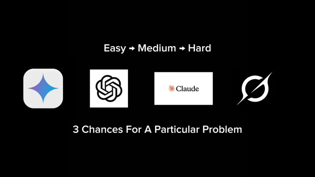
*Diapositive affichant la structure des tests avec les niveaux de difficulté et les logos de quatre IA (Gemini, ChatGPT, Claude, et une autre).*

*Capture d'écran de l'énoncé du problème algorithmique classique "Two Sum" sur une plateforme de type LeetCode, avec les exemples et explications.*

---

### ⏱️ `[00:01:28 - 00:01:57]` | Segment #05

**🔊 Audio (Transcription Intégrale Mot pour Mot en Français) :**
> La cible est 9, 6, et encore 6 à partir des paires suivantes. En commençant donc par ChatGPT, je colle la question et lui demande de résoudre le problème en Java, et immédiatement il écrit le code. Il utilise une table de hachage pour résoudre le problème, ce que la plupart des développeurs feraient exactement. Nous copions donc le code, le collons dans LeetCode, et l'exécutons. Et le code est correct. Il valide tous les cas de test. Jusqu'ici, tout va bien.

**👁️ Analyse Visuelle d'Écran (gemini-3.5-flash-lite) :**
**Interface & Outils** : LeetCode (navigateur web)

**Contenu textuel & Code** : Le problème numéro 1 intitulé "Two Sum" avec la description demandant de retourner les indices de deux nombres dont la somme est égale à la cible (target), accompagné de trois exemples (Exemple 1 : nums = [2,7,11,15], target = 9 ; Exemple 2 : nums = [3,2,4], target = 6 ; Exemple 3 : nums = [3,3], target = 6).

**Action / Démonstration** : Le curseur de la souris survole les exemples de tests du problème sur LeetCode pendant que le créateur présente le problème à résoudre.

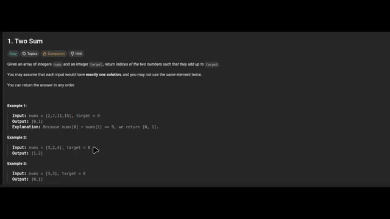
*Interface de la plateforme LeetCode affichant le problème de programmation "Two Sum" avec ses exemples d'entrées et de sorties.*

---

### ⏱️ `[00:01:57 - 00:02:18]` | Segment #06

**🔊 Audio (Transcription Intégrale Mot pour Mot en Français) :**
> Maintenant, je colle la même question à tous les modèles d'IA. Et honnêtement, ils les ont tous résolues très facilement. Pas de drame, pas d'hallucinations, juste des solutions correctes. Donc problème facile, l'IA réussit. Les développeurs sont toujours en sécurité, pour l'instant. Il est maintenant temps de passer aux problèmes de niveau moyen.

**👁️ Analyse Visuelle d'Écran (gemini-3.5-flash-lite) :**
**Interface & Outils** : LeetCode et interfaces de chat de modèles d'IA (dont Grok).

**Contenu textuel & Code** : Liste de problèmes de programmation sur LeetCode (ex: "Two Sum", "Add Two Numbers", "Median of Two Sorted Arrays") avec leurs niveaux de difficulté et pourcentages de réussite. Fenêtres de discussion avec des IA montrant des codes et solutions.

**Action / Démonstration** : Le créateur montre les interfaces de différentes IA résolvant facilement un problème de programmation facile sur LeetCode avant de passer à des problèmes de niveau moyen.

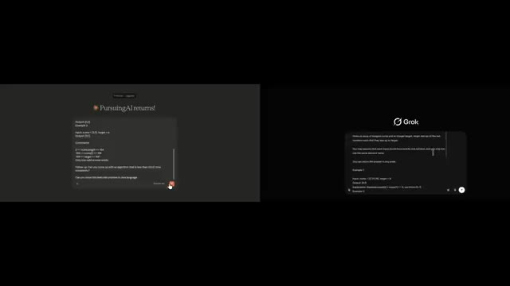
*Capture d'écran double affichant des fenêtres de chat avec des modèles d'IA et le logo Grok.*

*Interface de la plateforme LeetCode montrant la liste des problèmes de programmation avec des catégories (Easy, Med, Hard).*

---

### ⏱️ `[00:02:18 - 00:02:39]` | Segment #07

**🔊 Audio (Transcription Intégrale Mot pour Mot en Français) :**
> C'est là que les choses commencent à devenir intéressantes. Parce que si l'IA peut résoudre des problèmes LeetCode de niveau moyen de manière cohérente, les développeurs devraient probablement commencer à y prêter attention. J'ai donc choisi ce problème. Le numéro trois, un classique. La plus longue sous-chaîne sans caractères répétés. Si vous avez déjà fait du LeetCode, vous savez déjà que celui-ci est célèbre.

**👁️ Analyse Visuelle d'Écran (gemini-3.5-flash-lite) :**
**Interface & Outils** : LeetCode (plateforme web d'entraînement au code).

**Contenu textuel & Code** : Liste de problèmes de programmation avec des scores de difficulté (Easy, Med, Hard), incluant notamment "1. Two Sum", "2. Add Two Numbers", et "3. Longest Substring Without Repeating Characters", ainsi qu'un panneau latéral avec des catégories de sujets et des filtres d'entreprises (Trending Companies).

**Action / Démonstration** : Affichage de la bibliothèque de problèmes LeetCode pour présenter le problème classique sélectionné pour le test.

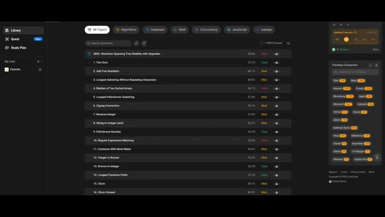
*Interface de la plateforme LeetCode affichant une liste de problèmes de programmation, incluant "3. Longest Substring Without Repeating Characters".*

---

### ⏱️ `[00:02:40 - 00:02:59]` | Segment #08

**🔊 Audio (Transcription Intégrale Mot pour Mot en Français) :**
> Je colle une question à tous les modèles d'IA et leur demande d'expliquer l'approche. Voici ce qui se passe. Gemini utilise une fenêtre glissante avec une table de hachage. ChatGPT utilise une fenêtre glissante plus un ensemble de hachage. Claude utilise également une fenêtre glissante et une table de hachage. Et ensuite nous avons Grok. Grok décide de faire quelque chose de légèrement différent.

**👁️ Analyse Visuelle d'Écran (gemini-3.5-flash-lite) :**
**Interface & Outils** : Interfaces web de chatbots d'IA (ChatGPT) affichant des réponses de programmation en Java.

**Contenu textuel & Code** : Code source en Java (classe Solution, méthode lengthOfLongestSubstring), explications des approches algorithmiques ('Sliding Window + HashSet', 'Optimized Sliding Window with Array'), complexité temporelle O(n) et spatiale O(1) ou O(n).

**Action / Démonstration** : Affichage et comparaison des réponses de différents modèles d'IA concernant un problème de programmation LeetCode.

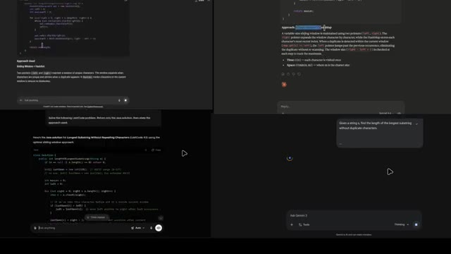
*Capture d'écran divisée en quatre parties montrant différentes interfaces d'IA (ChatGPT et Gemini) avec du code Java et des explications sur l'algorithme de la plus longue sous-chaîne sans caractères répétés.*

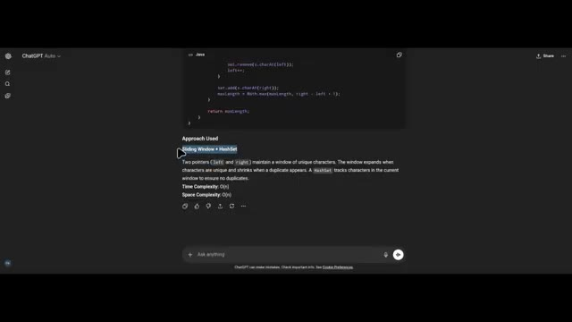
*Interface de ChatGPT en mode sombre affichant une solution en Java et l'approche utilisée ('Sliding Window + HashSet') avec l'explication de la complexité temporelle et spatiale.*

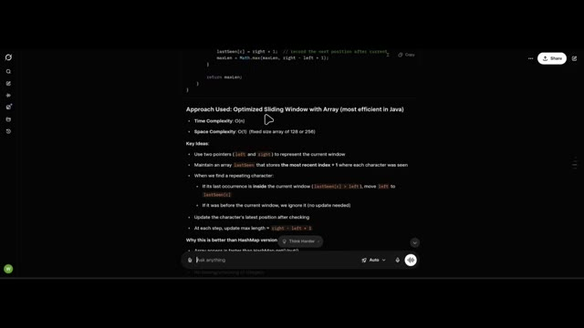
*Interface de l'IA affichant une approche optimisée en Java ('Optimized Sliding Window with Array') avec les complexités temporelle et spatiale, ainsi que les idées clés.*

---

### ⏱️ `[00:03:00 - 00:03:19]` | Segment #09

**🔊 Audio (Transcription Intégrale Mot pour Mot en Français) :**
> Il utilise une fenêtre glissante avec un tableau, et Grok explique même pourquoi il a choisi cette méthode. L'accès au tableau est plus rapide que la méthode get d'une table de hachage. Une taille fixe et restreinte offre une meilleure localité de cache. Pas de mise en boîte ou de déballage des entiers. Ce qui, honnêtement, ressemble au genre d'explication que l'on donne en entretien pour impressionner le recruteur.

**👁️ Analyse Visuelle d'Écran (gemini-3.5-flash-lite) :**
**Interface & Outils** : Interface de chat web (style Grok / LLM) avec un panneau de code en haut et une liste de points explicatifs textuels.

**Contenu textuel & Code** : Code source en haut (extrait Java avec `lastSeen` et `Math.max`), suivi du texte « Approach Used: Optimized Sliding Window with Array (most efficient in Java) », la complexité temporelle et spatiale, des idées clés sur l'utilisation de pointeurs `left` et `right`, et les avantages par rapport à une version HashMap.

**Action / Démonstration** : Visualisation d'une explication technique générée par une IA détaillant l'algorithme de fenêtre glissante en Java.

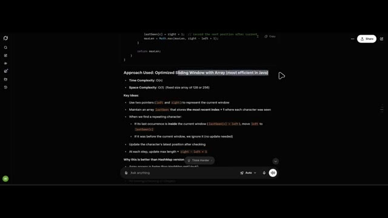
*Interface de discussion de l'IA affichant une portion de code Java et une explication détaillée de l'approche par fenêtre glissante optimisée avec un tableau.*

---

### ⏱️ `[00:03:20 - 00:03:42]` | Segment #10

**🔊 Audio (Transcription Intégrale Mot pour Mot en Français) :**
> Passons donc au test décisif. Est-ce que les solutions fonctionnent réellement ? L'approche de Grok est correcte. Celle de Claude l'est également. Le code de Gemini est correct. Et ChatGPT, également correct. Chaque modèle d'intelligence artificielle a résolu avec succès un problème LeetCode de niveau moyen, ce qui est impressionnant, mais aussi légèrement terrifiant.

**👁️ Analyse Visuelle d'Écran (gemini-3.5-flash-lite) :**
**Interface & Outils** : Interface de la plateforme LeetCode et éditeur de texte sombre pour l'analyse de code.

**Contenu textuel & Code** : Problème LeetCode "3. Longest Substring Without Repeating Characters", code Java, cas de tests réussis ("Accepted"), et notes d'explication textuelles sur la complexité algorithmique.

**Action / Démonstration** : Présentation comparative des résultats de code validés ("Accepted") obtenus par différents modèles d'IA sur un problème LeetCode moyen.

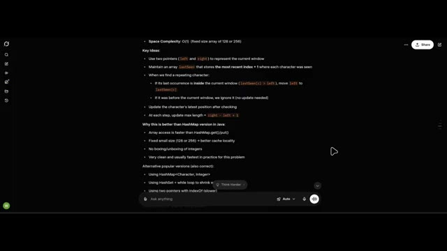
*Interface textuelle affichant les explications détaillées et les idées clés de résolution d'algorithme.*

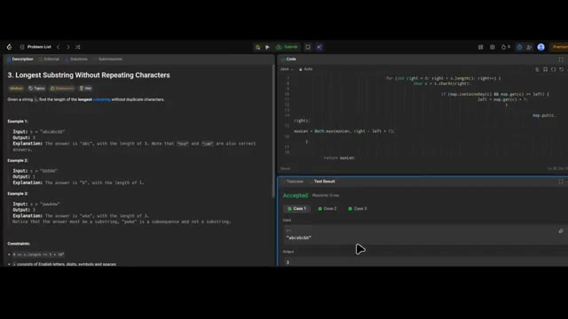
*Interface de la plateforme LeetCode en mode écran partagé montrant l'énoncé du problème et les résultats des tests de code validés.*

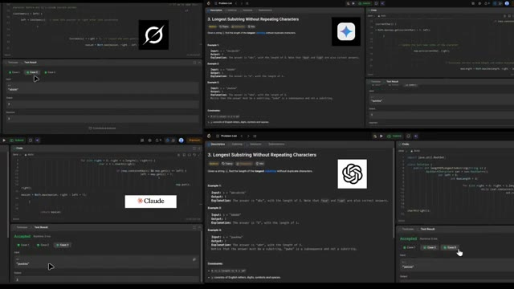
*Vue en quadrillage (split-screen) comparant les interfaces LeetCode des quatre modèles d'IA : Grok, Gemini, Claude et ChatGPT.*

---

### ⏱️ `[00:03:43 - 00:04:01]` | Segment #11

**🔊 Audio (Transcription Intégrale Mot pour Mot en Français) :**
> L'étape suivante est évidente. Rendons les choses plus difficiles. Maintenant, nous essayons un autre problème de niveau moyen qui est réellement posé lors des entretiens chez Google. Meilleur moment pour acheter et vendre une action, II. L'objectif est de maximiser le profit en achetant et en vendant une action plusieurs fois, mais vous devez vendre avant d'acheter à nouveau.

**👁️ Analyse Visuelle d'Écran (gemini-3.5-flash-lite) :**
**Interface & Outils** : Interface web sombre d'une plateforme de préparation aux entretiens techniques (type LeetCode) avec un menu de navigation latéral à gauche ("Library", "Quest", "Study Plan"), une barre de recherche de questions, des filtres par thématiques ("All Topics", "Algorithms", "Database", "Shell", etc.) et un panneau latéral des entreprises tendance à droite ("Uber", "Amazon", "Google", "Bloomberg", etc.).

**Contenu textuel & Code** : Liste de problèmes d'algorithmique visibles à l'écran : "1. Two Sum", "2. Add Two Numbers", "3. Longest Substring Without Repeating Characters", "4. Median of Two Sorted Arrays", "5. Longest Palindromic Substring", "6. Zigzag Conversion", etc., avec leurs niveaux de difficulté respectifs (Easy, Med, Hard) et pourcentages de réussite.

**Action / Démonstration** : L'écran présente la bibliothèque de problèmes de programmation pour sélectionner et résoudre le prochain défi algorithmique.

*Interface d'une plateforme de questions d'algorithmique et de programmation (type LeetCode) affichant la liste des problèmes classés par difficulté.*

---

### ⏱️ `[00:04:02 - 00:04:20]` | Segment #12

**🔊 Audio (Transcription Intégrale Mot pour Mot en Français) :**
> Donc fondamentalement, le genre de problème qui ruine les weekends des développeurs. Est-ce que l'IA peut résoudre ça ? On commence avec Claude. Claude écrit le code, et l'explication est plutôt bonne. Il utilise une approche gloutonne. L'idée clé est que le profit maximum est égal à la somme de chaque mouvement de prix à la hausse.

**👁️ Analyse Visuelle d'Écran (gemini-3.5-flash-lite) :**
**Interface & Outils** : LeetCode (plateforme web d'entraînement algorithmique) avec un panneau de description du problème à gauche et un éditeur de code en Java à droite.

**Contenu textuel & Code** : Le problème LeetCode numéro 122 "Best Time to Buy and Sell Stock II" (niveau Moyen), avec les exemples d'entrées/sorties et l'éditeur de code affichant la signature de la méthode en Java (`class Solution { public int maxProfit(int[] prices) { } }`).

**Action / Démonstration** : Le créateur montre l'énoncé d'un problème algorithmique complexe sur LeetCode que l'IA va devoir résoudre.

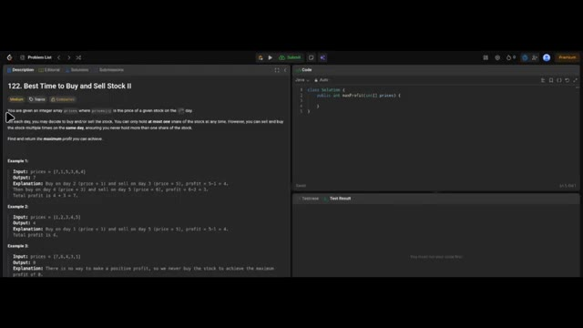
*Interface de la plateforme de programmation LeetCode affichant le problème "122. Best Time to Buy and Sell Stock II" avec l'éditeur de code source à droite.*

---

### ⏱️ `[00:04:20 - 00:04:39]` | Segment #13

**🔊 Audio (Transcription Intégrale Mot pour Mot en Français) :**
> Par exemple, du jour un au jour deux, le prix est de sept à un, donc le gain est de zéro. Du jour deux au jour trois, le prix passe de un à cinq, donc le profit est de quatre. Et cela continue. Nous exécutons le code de Claude et félicitations, Claude a réussi à le résoudre.

**👁️ Analyse Visuelle d'Écran (gemini-3.5-flash-lite) :**
**Interface & Outils** : Interface de l'assistant IA Claude avec un panneau de discussion sombre et une zone de réponse.

**Contenu textuel & Code** : Un texte explicatif ("Approach: Greedy"), un exemple de tableau ("Walk-through with Example 1 -> prices = [7, 1, 5, 3, 6, 4]") avec les colonnes Day, prices[i], prices[i-1], Gain et Total Profit.

**Action / Démonstration** : Un curseur de souris survole le tableau affichant les détails des prix et des gains calculés par l'algorithme.

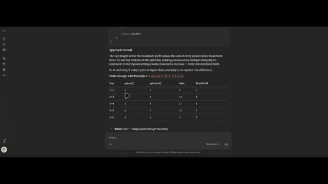
*Interface de Claude affichant une explication textuelle et un tableau détaillé d'un problème algorithmique.*

---

### ⏱️ `[00:04:40 - 00:05:01]` | Segment #14

**🔊 Audio (Transcription Intégrale Mot pour Mot en Français) :**
> Maintenant, nous testons les autres. Gemini utilise également la méthode gloutonne. ChatGPT utilise également la méthode gloutonne. Mais Grok, Grok ne peut pas résoudre ce problème. Donc à ce stade, Grok est malheureusement éliminé, ce qui signifie que les concurrents restants sont ChatGPT, Gemini et Claude. Et honnêtement, ils s'en sortent très bien.

**👁️ Analyse Visuelle d'Écran (gemini-3.5-flash-lite) :**
**Interface & Outils** : Interface de Google Gemini et écran de présentation avec les logos des IA concurrentes.

**Contenu textuel & Code** : Texte en anglais dans Gemini expliquant que le problème récompense une approche "gloutonne" (greedy mindset) pour maximiser le profit. Logos de ChatGPT, Claude et Gemini affichés côte à côte.

**Action / Démonstration** : Présentation de la réponse de Gemini sur l'algorithme glouton, suivie d'un récapitulatif visuel des trois IA restantes en compétition.

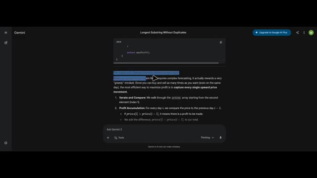
*Interface de Gemini affichant l'explication de la méthode gloutonne (greedy method) pour résoudre le problème.*

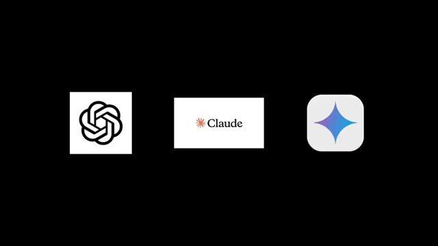
*Écran noir affichant les logos des trois finalistes : ChatGPT, Claude et Gemini.*

---

### ⏱️ `[00:05:02 - 00:05:34]` | Segment #15

**🔊 Audio (Transcription Intégrale Mot pour Mot en Français) :**
> Mais maintenant, c'est l'heure du problème difficile. C'est là que les choses se brisent généralement. Le problème concerne les trois meilleurs salaires par département. Ce problème vous demande de trouver les trois salaires les plus élevés de chaque département. Il s'agit plutôt d'une logique SQL complexe. Claude utilise une méthode appelée sous-requête corrélée. Il explique même l'exemple. Dans le département informatique, deux employés partagent le même salaire. Joe et Randy gagnent tous deux 85 000 $. Comme ils partagent le même salaire, ils comptent tous les deux comme le deuxième salaire unique, pas le deuxième et

**👁️ Analyse Visuelle d'Écran (gemini-3.5-flash-lite) :**
**Interface & Outils** : Plateforme de codage en ligne type LeetCode avec un panneau latéral de navigation, une barre de recherche de questions et une liste de défis classés par niveau de difficulté.

**Contenu textuel & Code** : Liste de problèmes de programmation avec des scores de difficulté (Easy, Med, Hard) et des filtres thématiques comme "All Topics", "Algorithms", "Database", "Shell", "Concurrency", "JavaScript", "Pandas".

**Action / Démonstration** : Navigation et affichage de la bibliothèque de problèmes de code SQL/algorithmes sur l'interface web.

*Interface de la plateforme LeetCode affichant une liste de problèmes de programmation et d'algorithmes*

---

### ⏱️ `[00:05:34 - 00:05:54]` | Segment #16

**🔊 Audio (Transcription Intégrale Mot pour Mot en Français) :**
> Troisièmement. Ce qui est exactement la façon dont le problème devrait fonctionner. Nous testons la réponse de Claude et Et elle est correcte. ChatGPT, également correct. Ensuite, Gemini essaie quelque chose de différent. Il utilise des fonctions de fenêtrage. Et sa réponse est également correcte. Les trois modèles d'IA ont résolu avec succès un problème difficile de LeetCode.

**👁️ Analyse Visuelle d'Écran (gemini-3.5-flash-lite) :**
**Interface & Outils** : Interface web de l'assistant IA Claude avec un champ de saisie de texte "Reply..." en bas et la mention du modèle "Sonnet 4.6".

**Contenu textuel & Code** : Texte explicatif sur l'utilisation du mot-clé DISTINCT en SQL avec un tableau de données pour le département informatique ("Walk-through for IT Department") listant les employés Max, Joe, Randy, Will, Janet avec leurs salaires, salaires supérieurs, nombre et statut d'inclusion ("Included?"), ainsi que des puces explicatives sur la gestion des égalités ("Handles ties") et des petits départements ("Handles small departments").

**Action / Démonstration** : Affichage d'une réponse de l'intelligence artificielle Claude détaillant l'analyse d'un problème de logique de programmation ou de base de données.

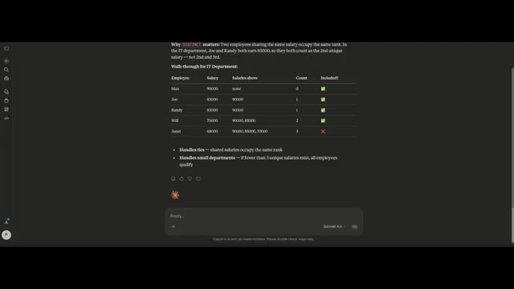
*Interface de Claude montrant un tableau d'explication de données SQL avec des employés, des salaires et des coches de validation.*

---

### ⏱️ `[00:05:55 - 00:06:14]` | Segment #17

**🔊 Audio (Transcription Intégrale Mot pour Mot en Français) :**
> Donc, félicitations à l'humanité. Parce que nous venons peut-être de construire quelque chose qui finira par nous rendre obsolètes. Mais d'ici ce jour-là, les développeurs sont toujours en sécurité. Parce que l'IA résout peut-être des problèmes de code, mais elle n'a toujours pas réparé le vieux code de production écrit en 2011 par un stagiaire.

**👁️ Analyse Visuelle d'Écran (gemini-3.5-flash-lite) :**
**Interface & Outils** : Illustration graphique de type dessin animé vectoriel avec sous-titres animés.

**Contenu textuel & Code** : Texte affiché en bas de l'écran : "SO CONGRATULATIONS TO HUMANITY" (avec le mot "TO" mis en valeur sur fond bleu).

**Action / Démonstration** : Affichage d'une illustration métaphorique sur l'évolution de l'humanité liée au passage de témoin technologique.

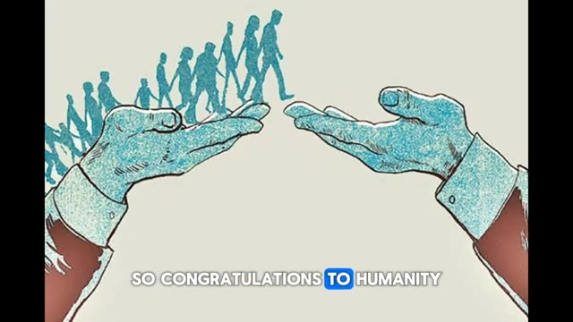
*Illustration graphique montrant une main en bas à gauche passant le relais d'une file de silhouettes humaines évoluant vers une autre main en bas à droite, avec le texte sous-titré "SO CONGRATULATIONS TO HUMANITY".*

---

### ⏱️ `[00:06:14 - 00:06:26]` | Segment #18

**🔊 Audio (Transcription Intégrale Mot pour Mot en Français) :**
> Et si vous voulez voir plus de tests montrant ce que l'IA peut réellement faire, alors aimez cette vidéo et abonnez-vous, car nous allons continuer à tester les limites de l'IA, et probablement notre propre sécurité de l'emploi.

**👁️ Analyse Visuelle d'Écran (gemini-3.5-flash-lite) :**
**Interface & Outils** : Écran de montage ou de sous-titrage vidéo affichant du texte stylisé.

**Contenu textuel & Code** : Texte à l'écran : "SHOWING WHAT AI CAN" avec le mot "SHOWING" surligné en bleu.

**Action / Démonstration** : Affichage de sous-titres animés textuels en superposition sur fond noir au cours de la narration.

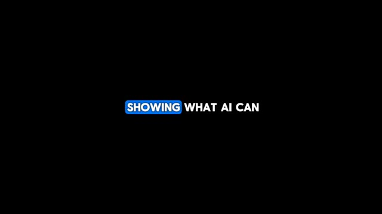
*Écran noir affichant le texte sous-titré "SHOWING WHAT AI CAN" en majuscules blanches avec un fond bleu sur le mot "SHOWING".*

---
