# 🎬 L'IA vient de devenir folle… Google Maps AI, ShotVerse, Neotron 3 et bien plus

> **Chaîne** : [Pursuing AI](https://www.youtube.com/@PursuingAi)  
> **Titre original** : `AI Just Got Crazy… Google Maps AI, ShotVerse, Neotron 3 & More`  
> **Lien YouTube** : [https://www.youtube.com/watch?v=rrlCHMdiZIc](https://www.youtube.com/watch?v=rrlCHMdiZIc)  
> **Date de publication** : 2026-03-17  
> **Durée** : 05m 43s (`343s`)  
> **Identifiant vidéo** : `rrlCHMdiZIc`  
> **Fiche Web Interactive** : [2026-03-17_YT-rrlCHMdiZIc_L'IA vient de devenir folle… Google Maps AI, ShotVerse, Neotron 3 et bien plus_by-whisper-v3-large-turbo+gemini-3.5-flash-lite.html](2026-03-17_YT-rrlCHMdiZIc_L'IA vient de devenir folle… Google Maps AI, ShotVerse, Neotron 3 et bien plus_by-whisper-v3-large-turbo+gemini-3.5-flash-lite.html)  
> **Captures de démonstration clés** : `33 captures réelles (anti-talking-head)`  
> **Modèles utilisés** : Audio: `large-v3-turbo` (Faster-Whisper int8 VPS) | Vision: `gemini-3.5-flash-lite` (Google AI Studio API)  

---

## 📌 Synthèse Exécutive & Outils

### 📌 Résumé
La récente vague d'innovations en intelligence artificielle redéfinit les frontières technologiques, englobant aussi bien l'optimisation des outils du quotidien que les avancées majeures en robotique et en génération visuelle. Google redéfinit l'expérience utilisateur de son application de navigation grâce à l'intégration de Gemini, transformant l'outil de cartographie en un véritable agent conversationnel contextuel capable de planifier des voyages, d'analyser des avis et d'offrir une navigation immersive en 3D ultra-détaillée. Parallèlement, le secteur de la robotique repousse ses limites physiques avec l'émergence de machines novatrices, à l'instar du cheval robotique quadrupède de Deep Robotics et des robots humanoïdes sur roues de Reflex Robotics, capables d'exécuter des tâches de manipulation fine en cuisine ou en milieu industriel. 

Dans l'univers de la création visuelle par IA, la dynamique s'accélère avec l'émergence de technologies capables de produire des séquences complexes et multi-angles en un minimum de temps. Le nouveau modèle **Shotverse** illustre cette révolution en générant des vidéos cinématographiques composées de plans multiples et de transitions fluides en une seule et unique génération, tout en garantissant une stricte cohérence des personnages. L'approche méthodologique repose sur un entraînement intensif réalisé exclusivement sur de véritables séquences cinématographiques issues de tournages réels, évitant ainsi la dégradation qualitative inhérente à l'utilisation de données synthétiques. 

Pour les créateurs de contenu et les réalisateurs vidéo, ces innovations ouvrent des perspectives inédites en matière de productivité et de mise en scène. L'intégration d'outils de génération multi-plans permet de s'affranchir des contraintes du montage traditionnel plan par plan, réduisant considérablement les frictions dans le processus de pré-visualisation et de réalisation. En s'appuyant sur des workflows basés sur des modèles ouverts et des pipelines d'inférence robustes, les créateurs disposent désormais de leviers puissants pour concevoir des récits visuels immersifs, dynamiques et d'une qualité esthétique comparable aux standards professionnels du cinéma.

### 🛠️ Outils, Modèles & Logiciels Présentés
* **Seedance 2.5** : Modèle de génération et de traitement vidéo par intelligence artificielle mentionné dans le panorama des nouveautés de la semaine.
* **Kling 3.0** : Solution de pointe pour la création de vidéos synthétiques à partir de descriptions textuelles ou d'images fixes.
* **Midjourney** : Outil de référence pour la génération d'images fixes à haute résolution et de concepts visuels artistiques.
* **Google Maps avec Gemini** : Assistant conversationnel intégré à la cartographie pour automatiser la recherche de lieux, la lecture d'avis et la planification d'itinéraires sur mesure.
* **Navigation Immersive (Google)** : Fonctionnalité de guidage visuel en 3D détaillée offrant des repères précis sur les bâtiments, les changements de voie et les structures routières complexes.
* **Deep Robotics (Cheval robotique)** : Machine quadrupède automatisée conçue pour imiter la locomotion équine et supporter des charges lourdes dans des environnements interactifs.
* **Reflex Robotics (Robot humanoïde sur roues)** : Robot polyvalent monté sur une base roulante, optimisé pour la manipulation fine d'objets, la cuisine et les tâches logistiques en milieu plat.
* **Shotverse** : Modèle de génération vidéo spécialisé dans la production de séquences cinématographiques multi-plans avec des transitions fluides et une cohérence de personnage préservée.

### 🔑 Points Clés & Enseignements Stratégiques
* L'intégration d'agents conversationnels comme Gemini dans les interfaces cartographiques démontre l'importance de coupler l'IA générative avec des bases de données massives en temps réel pour obtenir des recommandations contextuelles hautement pertinentes.
* Le passage de indications textuelles basiques à la planification intégrée d'itinéraires complexes (voyages, arrêts multiples, estimation du temps de marche) illustre le glissement vers des assistants proactifs et décisionnels.
* La fonctionnalité de Navigation Immersive résout les problématiques critiques de stress au volant en anticipant visuellement les changements de voies et les intersections délicates grâce au rendu 3D.
* Le développement de robots non humanoïdes, comme le cheval mécanique de Deep Robotics, prouve que l'inspiration biologique peut être combinée à des applications de divertissement ou marketing à forte visibilité.
* Les robots humanoïdes équipés d'une base roulante (Reflex Robotics) sacrifient la mobilité sur terrain accidenté au profit d'une efficacité redoutable et d'un équilibre stable sur surfaces planes pour des tâches de précision.
* La manipulation fine d'objets (couper des fruits, verser des liquides, retourner un steak) reste l'un des défis majeurs résolus progressivement par l'apprentissage robotique couplé à une vision par ordinateur avancée.
* **Shotverse** révolutionne la génération vidéo en s'affranchissant du format de scène continue unique pour basculer automatiquement entre plusieurs angles de caméra et plans au sein d'une même instruction.
* Le maintien de la cohérence des personnages à travers des changements d'angles multiples constitue une avancée technique majeure pour la crédibilité des récits visuels générés par IA.
* S'entraîner sur de véritables séquences cinématographiques plutôt que sur des données synthétiques générées par IA s'avère être la stratégie gagnante pour préserver la qualité visuelle et le réalisme des modèles de vidéo.
* L'adoption future de modèles open source (incluant le code d'inférence, les jeux de données et le pipeline d'entraînement de Shotverse) démocratisera l'accès aux techniques de réalisation multi-plans pour l'ensemble des créateurs indépendants.

---

## ⏱️ Chronologie & Transcription Complète Audio & Visuelle (Mot pour Mot)

### ⏱️ `[00:00:00 - 00:00:21]` | Segment #01

**🔊 Audio (Transcription Intégrale Mot pour Mot en Français) :**
> Cette semaine dans la recherche en IA a été absolument folle. Google intègre une IA puissante directement dans Google Maps. Un nouveau système peut générer des vidéos cinématiques multi-plans en une seule génération. NVIDIA a lancé un nouveau modèle d'IA agentique massif. Il existe un outil qui peut littéralement voler des effets visuels d'une vidéo et les appliquer sur une autre.

**👁️ Analyse Visuelle d'Écran (gemini-3.5-flash-lite) :**
**Interface & Outils** : Interface web de galerie de démonstration (EffectMaker Gallery) affichant des exemples de transfert d'effets visuels entre vidéos.

**Contenu textuel & Code** : Titre 'EffectMaker Gallery', pagination 'Page 1 / 7', 'Total: 131 items', boutons de navigation 'Previous Page', 'Next Page', 'Go to page', et trois sections intitulées 'Reference Video', 'Target Image' et 'Target Video'.

**Action / Démonstration** : Présentation de la galerie de résultats d'un outil permettant de transférer des effets visuels d'une vidéo de référence vers une image ou vidéo cible.

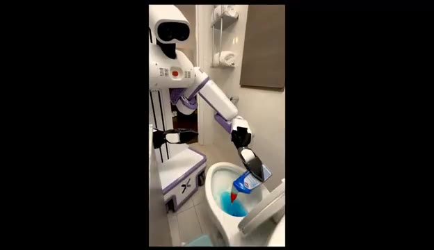
*Un robot humanoïde blanc manipule un flacon de produit nettoyant pour verser du liquide bleu dans une cuvette de toilettes.*

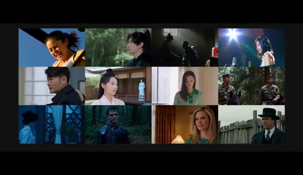
*Une grille de 12 vignettes vidéo montrant différents personnages, contextes et ambiances lumineuses cinématographiques.*

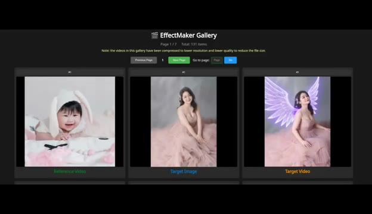
*Interface de l'outil EffectMaker Gallery montrant trois colonnes : 'Reference Video' avec un bébé, 'Target Image' avec une femme, et 'Target Video' avec la même femme dotée d'ailes lumineuses.*

---

### ⏱️ `[00:00:22 - 00:00:41]` | Segment #02

**🔊 Audio (Transcription Intégrale Mot pour Mot en Français) :**
> Nous voyons également des outils de clonage vocal extrêmement avancés et de très étranges démos de robots. Faisons donc le point sur tout cela avant que les robots n'apprennent à nous cuisiner à la place. C'est Pursuing AI, et vous regardez le Research Report. Commençons par Google. Cette semaine, Google a introduit plusieurs nouvelles fonctionnalités alimentées par l'IA pour Google Maps.

**👁️ Analyse Visuelle d'Écran (gemini-3.5-flash-lite) :**
**Interface & Outils** : Interface web de Hugging Face Spaces (TADA - Text-Acoustic Dual Alignment LLM) et interface de présentation Google Maps.

**Contenu textuel & Code** : Textes visibles : "TADA - Text-Acoustic Dual Alignment LLM", "HumeAI/tada-3b-ml", "Load Model", "Voice Prompt", "Transcript", "Text to Speak", un graphique d'onde audio, et la mention en bas de l'image de la fillette : "*Do Not Attempt Without Professional Guidance".

**Action / Démonstration** : Présentation d'outils d'IA vocale, démonstration vidéo d'un robot quadrupède monté par une enfant, puis animation graphique de la fonctionnalité de recherche IA pour Google Maps.

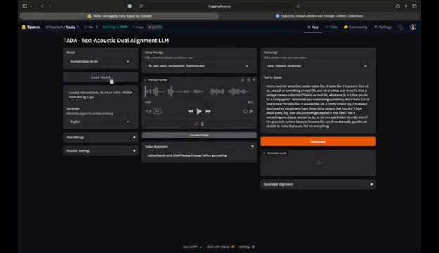
*Interface de l'outil TADA (Text-Acoustic Dual Alignment LLM) sur Hugging Face Spaces montrant les paramètres de modèle vocal et le champ de transcription.*

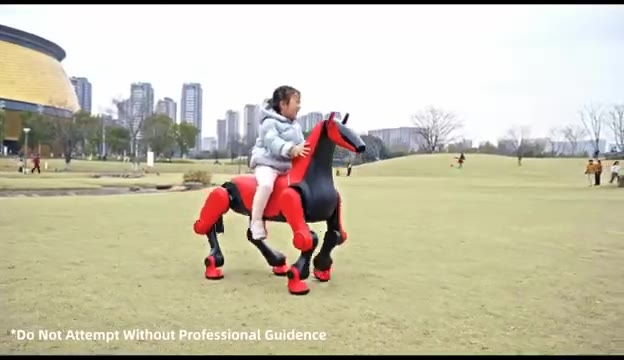
*Démonstration d'un robot quadrupède rouge et noir en forme de cheval monté par un enfant dans un parc, avec un avertissement textuel en bas.*

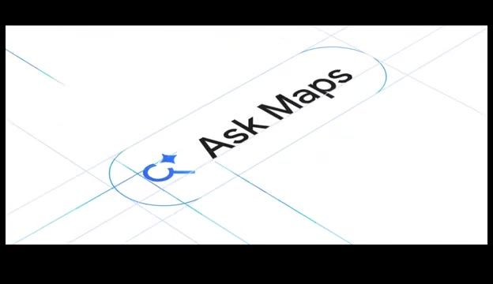
*Animation du logo « Ask Maps » sur fond blanc avec des lignes de construction graphiques bleues.*

---

### ⏱️ `[00:00:42 - 00:01:03]` | Segment #03

**🔊 Audio (Transcription Intégrale Mot pour Mot en Français) :**
> La première s'appelle Ask Maps. Considérez-le comme un assistant IA intégré directement dans l'application Maps. Au lieu de chercher manuellement des endroits comme un homme des cavernes, vous pouvez simplement poser une question à Gemini. Par exemple, vous pourriez lui demander de trouver des endroits chaleureux et esthétiques dans une zone spécifique. Le système analyse d'énormes quantités d'informations et vous donne des recommandations personnalisées.

**👁️ Analyse Visuelle d'Écran (gemini-3.5-flash-lite) :**
**Interface & Outils** : Application mobile Google Maps intégrant l'assistant IA Gemini (Ask Maps).

**Contenu textuel & Code** : Texte affiché : "Search here", "Ask Maps", "Home", "Restauran...", "Birdland Jazz Club", "Times Square", et les bulles de dialogue de l'assistant IA proposant des recommandations à Chelsea.

**Action / Démonstration** : Présentation de la fonctionnalité de recherche conversationnelle "Ask Maps" sur Google Maps avec des requêtes en langage naturel et des suggestions de lieux et de tables.

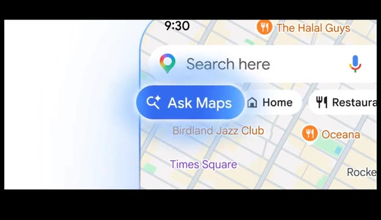
*Interface de l'application Google Maps montrant le bouton de la fonctionnalité Ask Maps.*

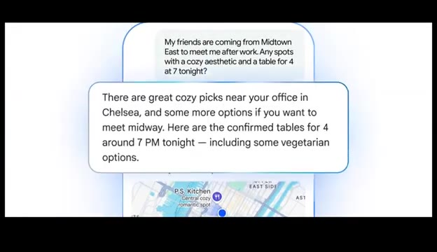
*Interface de Google Maps affichant un échange de conversation textuelle avec des recommandations personnalisées et des suggestions de tables.*

---

### ⏱️ `[00:01:04 - 00:01:28]` | Segment #04

**🔊 Audio (Transcription Intégrale Mot pour Mot en Français) :**
> Mais voici la partie intéressante. Elle ne se contente pas de lister des restaurants ou des emplacements. L'IA lit réellement les avis et les commentaires, extrait des informations utiles et résume les informations clés pour vous. Et comme Google Maps a déjà accès à des quantités astronomiques de données, du trafic en temps réel, des milliards de photos, des avis, des fiches d'établissement et des détails de localisation, l'IA peut générer des suggestions étonnamment détaillées.

**👁️ Analyse Visuelle d'Écran (gemini-3.5-flash-lite) :**
**Interface & Outils** : Interface de l'application Google Maps sur mobile et écrans de présentation graphique animée.

**Contenu textuel & Code** : Textes visibles : "Willow Vegan Bistro", "4.7", "Open - Closes 10 PM", "abcV", "People call the mushroom walnut bolognese a must-order", "Real-time traffic", "Crash ahead", "Imagine a map that's more".

**Action / Démonstration** : Démonstration visuelle des fonctionnalités d'IA et de résumé d'avis de Google Maps, illustrée par des captures d'interface mobiles et des infographies dynamiques.

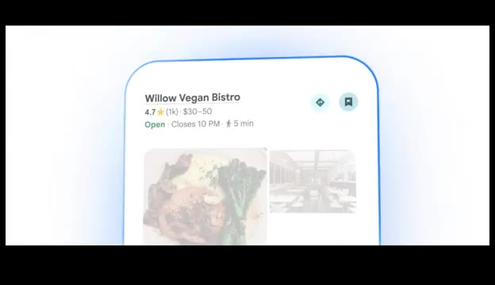
*Interface Google Maps sur mobile montrant la fiche du restaurant "Willow Vegan Bistro" avec sa note et ses horaires.*

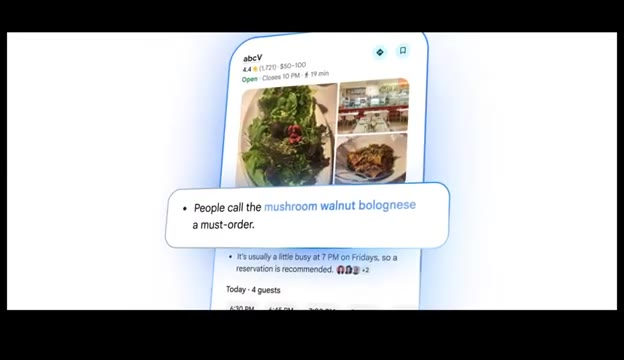
*Interface Google Maps sur mobile affichant une bulle de synthèse textuelle générée par l'IA basée sur les avis ("People call the mushroom walnut bolognese a must-order").*

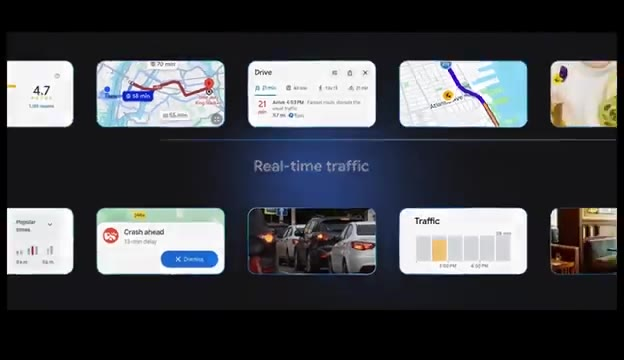
*Grille de captures et d'interfaces Google Maps illustrant le trafic en temps réel ("Real-time traffic") avec des cartes de navigation et des alertes d'incidents.*

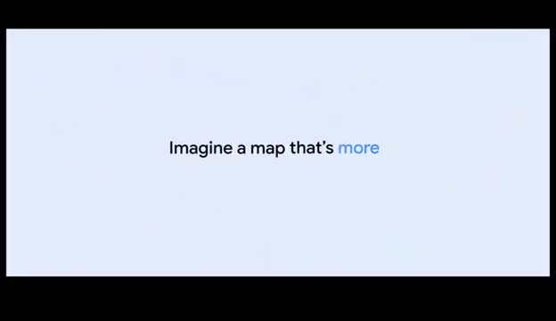
*Écran de transition sur fond clair avec le texte "Imagine a map that's more".*

---

### ⏱️ `[00:01:29 - 00:01:50]` | Segment #05

**🔊 Audio (Transcription Intégrale Mot pour Mot en Français) :**
> Un autre exemple est la planification de voyage. Vous pourriez demander à l'assistant d'aider à planifier un voyage en voiture, et il générera un itinéraire complet. Il peut suggérer des itinéraires, mettre en valeur des arrêts intéressants en chemin, et recommander des activités ou des lieux incontournables. En gros, votre agent de voyage vient d'être remplacé par un chatbot. Google a également introduit une autre fonctionnalité appelée Navigation Immersive.

**👁️ Analyse Visuelle d'Écran (gemini-3.5-flash-lite) :**
**Interface & Outils** : Application Google Maps (fonctionnalité Ask Maps et Navigation Immersive) sur smartphone et système de navigation.

**Contenu textuel & Code** : Texte « Hi, Elise. Ask anything, about anywhere. » avec des suggestions de trajets et un clavier virtuel. Sur la carte GPS : indications de direction (« Seneca St »), heure d'arrivée, vitesse et nom des parcs.

**Action / Démonstration** : Présentation de la recherche d'itinéraire par IA avec l'assistant Google Maps suivie de la démonstration de la navigation immersive.

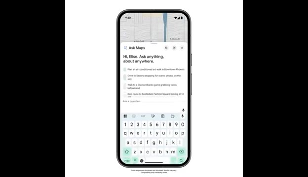
*Interface d'un smartphone affichant l'assistant de planification de voyage Ask Maps.*

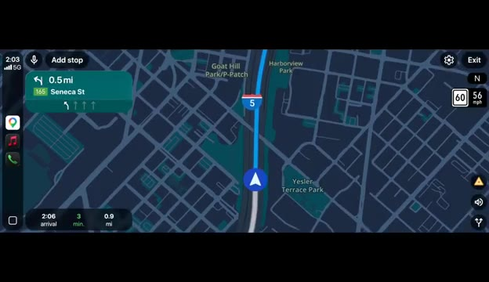
*Interface de navigation GPS immersive montrant une carte routière détaillée en 3D avec les indications de direction.*

---

### ⏱️ `[00:01:50 - 00:02:08]` | Segment #06

**🔊 Audio (Transcription Intégrale Mot pour Mot en Français) :**
> Cela améliore considérablement la navigation en fournissant un guidage visuel en 3D extrêmement détaillé. Au lieu de simples flèches sur une carte, vous pouvez réellement voir des vues réalistes des bâtiments, des routes, du terrain et des structures environnantes. Le système met en évidence des détails importants tels que les changements de voie, les insertions sur autoroute et les ponts.

**👁️ Analyse Visuelle d'Écran (gemini-3.5-flash-lite) :**
**Interface & Outils** : Interface de système de navigation automobile en 3D (type CarPlay / Google Maps immersif).

**Contenu textuel & Code** : Indications de direction ("0.3 mi Seneca St", "400 ft Seneca St"), temps d'arrivée ("2:06 arrival 3 min 0.9 mi"), limitations de vitesse ("60", "25"), noms de lieux ("Goat Hill Park", "5th Ave", "Seneca St", "Freeway Park").

**Action / Démonstration** : Démonstration visuelle d'un guidage de navigation GPS en 3D montrant le trajet d'un véhicule à travers un environnement urbain modélisé en trois dimensions.

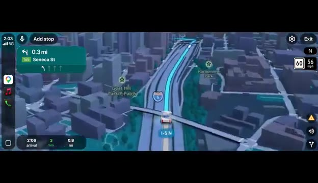
*Interface de navigation en 3D réaliste montrant une vue aérienne détaillée des autoroutes et des bâtiments environnants avec un itinéraire en surbrillance bleue.*

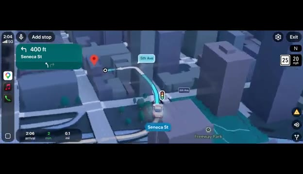
*Interface de navigation en 3D montrant un guidage de rue détaillé avec indication des intersections, des feux de circulation et des noms de rues.*

---

### ⏱️ `[00:02:08 - 00:02:28]` | Segment #07

**🔊 Audio (Transcription Intégrale Mot pour Mot en Français) :**
> Par exemple, s'il y a une voie de tourne-à-gauche spécifique que vous devez emprunter, le système la met clairement en surbrillance. Et parfois, il vous avertit même qu'immédiatement après le virage, vous devrez changer de voie à nouveau, ce qui est extrêmement utile, surtout si vous êtes du genre de conducteur qui panique et traverse quatre voies à la dernière seconde. La navigation sur autoroute est un autre domaine où cela brille.

**👁️ Analyse Visuelle d'Écran (gemini-3.5-flash-lite) :**
**Interface & Outils** : Application de navigation mobile avec interface cartographique 3D épurée.

**Contenu textuel & Code** : Indications de direction en haut avec "15th St", tracé bleu de l'itinéraire suggéré depuis "Market St", panneaux de limitation de vitesse (25 / 20 mph), et estimation du temps de trajet (2 min, 500 ft, 2:06 PM).

**Action / Démonstration** : Affichage d'une simulation de navigation GPS illustrant le guidage précis sur une intersection avec mise en surbrillance de la voie.

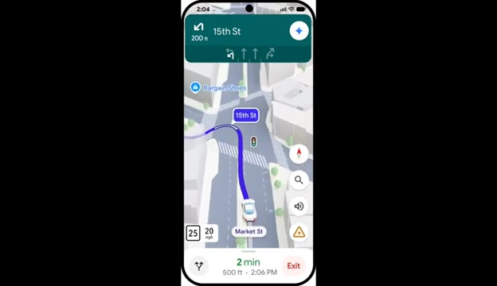
*Capture d'écran d'une application de navigation sur smartphone montrant l'itinéraire détaillé pour un tourne-à-gauche sur 15th St.*

---

### ⏱️ `[00:02:29 - 00:02:52]` | Segment #08

**🔊 Audio (Transcription Intégrale Mot pour Mot en Français) :**
> Quand il y a des tonnes de voies, il n'est souvent pas clair où aller. Le système met en surbrillance la bonne voie, afin que les conducteurs puissent éviter les changements de voie chaotiques de dernière seconde. Et lorsque vous arrivez à destination, l'application peut également afficher les zones de stationnement à proximité et estimer le temps de marche entre le parking et votre emplacement final. Selon Google, ces fonctionnalités sont actuellement en cours de déploiement à travers les États-Unis et seront bientôt étendues à d'autres régions.

**👁️ Analyse Visuelle d'Écran (gemini-3.5-flash-lite) :**
**Interface & Outils** : Interface mobile de navigation GPS (type Google Maps) et document de présentation textuelle officiel.

**Contenu textuel & Code** : Texte à l'écran : "Master the final stretch of your drive with helpful guidance..." et "Immersive Navigation starts rolling out today across the U.S...". Sur l'interface mobile : indications de voies, vitesse (55 mph, 3 mph), temps de trajet estimé (16 min).

**Action / Démonstration** : Démonstration de l'interface de navigation avec indication des voies complexes et présentation textuelle du déploiement géographique de la fonctionnalité.

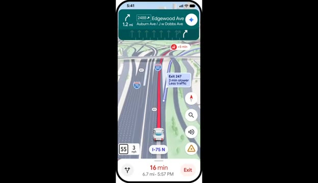
*Capture d'écran d'un smartphone montrant l'application de navigation GPS avec la mise en surbrillance des voies.*

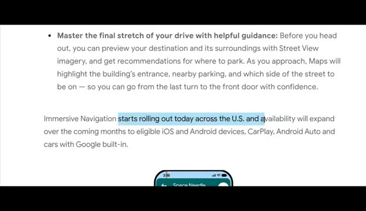
*Capture d'écran d'une page de présentation textuelle de Google détaillant le déploiement de la navigation immersive.*

---

### ⏱️ `[00:02:53 - 00:03:13]` | Segment #09

**🔊 Audio (Transcription Intégrale Mot pour Mot en Français) :**
> Maintenant, parlons des robots. Une entreprise de robotique chinoise appelée Deep Robotics a récemment présenté une machine très inhabituelle. Au lieu de construire un robot humanoïde, ils ont construit un cheval robotique. Oui, un cheval robotique. Le robot peut marcher, trotter et même se dresser sur ses pattes arrière, exactement comme un vrai cheval.

**👁️ Analyse Visuelle d'Écran (gemini-3.5-flash-lite) :**
**Interface & Outils** : Présentation face caméra sans partage d'écran (extraits vidéo d'illustration de robots uniquement)

**Contenu textuel & Code** : Logos "DEEP Robotics" et texte promotionnel "REDEFINING WHAT'S POSSIBLE" incrustés à l'écran.

**Action / Démonstration** : Démonstration visuelle du cheval robotique se déplaçant et se dressant sur ses pattes arrière dans un parc urbain.

---

### ⏱️ `[00:03:13 - 00:03:37]` | Segment #10

**🔊 Audio (Transcription Intégrale Mot pour Mot en Français) :**
> Il est également assez robuste pour supporter le poid d'un passager adulte. Les ingénieurs ont même conçu les pattes pour ressembler à la véritable anatomie d'un cheval. L'entreprise n'a pas encore totalement expliqué les cas d'usage pratiques, mais des robots de ce type pourraient potentiellement être utilisés dans des environnements de divertissement comme les parcs à thèmes. Il est intéressant de noter que le lancement coïncide également avec l'année du cheval dans le zodiaque chinois, ce qui pourrait donc être en partie une innovation en robotique et en partie un coup marketing.

**👁️ Analyse Visuelle d'Écran (gemini-3.5-flash-lite) :**
**Interface & Outils** : Présentation vidéo d'illustration sans interface logicielle ni partage d'écran

**Contenu textuel & Code** : Vidéo montrant un robot quadrupède en forme de cheval rouge et noir évoluant sur une pelouse, avec du texte incrusté (*Do Not Attempt Without Professional Guidance et YEAR OF HORSE 2026).

**Action / Démonstration** : Démonstration visuelle du robot cheval robotique en mouvement sur l'herbe et transportant un passager.

---

### ⏱️ `[00:03:38 - 00:03:58]` | Segment #11

**🔊 Audio (Transcription Intégrale Mot pour Mot en Français) :**
> Une autre démonstration de robotique est venue d'une startup appelée Reflex Robotics, basée à New York. Ils construisent des robots humanoïdes polyvalents conçus pour les entrepôts, les usines et éventuellement les maisons. Mais leur robot a une particularité. Au lieu de marcher sur des jambes, il utilise une base à roulettes. Cela signifie qu'il ne peut pas monter les escaliers ni naviguer sur des terrains accidentés.

**👁️ Analyse Visuelle d'Écran (gemini-3.5-flash-lite) :**
**Interface & Outils** : Vidéo de démonstration montrant un prototype de robot en conditions réelles (mode "2X SPEED" affiché en bas à gauche).

**Contenu textuel & Code** : Affichage de la mention "2X SPEED" en bas à gauche de la vidéo. Le robot humanoïde à bras articulés et base roulante est en action dans un intérieur domestique (salle de bains).

**Action / Démonstration** : Le robot utilise ses bras articulés pour interagir avec des objets du quotidien (flacon, brosse) près des toilettes, démontrant ses capacités de manipulation dans un espace restreint.

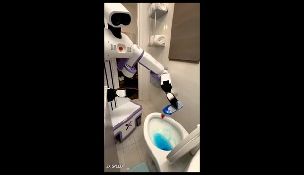
*Démonstration du robot Reflex Robotics doté d'une base à roulettes, manipulant un flacon de produit dans une salle de bains.*

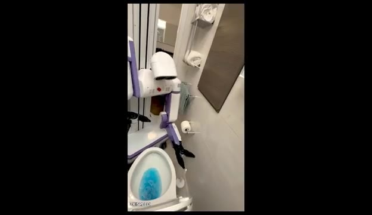
*Le robot sur roues en train d'effectuer une tâche de nettoyage ou d'entretien dans les toilettes.*

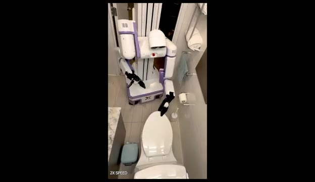
*Vue en plongée du robot humanoïde à base mobile dans une petite pièce, montrant sa structure sans jambes.*

---

### ⏱️ `[00:03:58 - 00:04:21]` | Segment #12

**🔊 Audio (Transcription Intégrale Mot pour Mot en Français) :**
> Mais sur des surfaces planes, il peut se déplacer très efficacement. Lors de démonstrations, le robot exécute une variété de tâches quotidiennes. Il peut ouvrir des stores de fenêtres, préparer des ingrédients dans la cuisine, couper des fruits, verser des liquides, ajouter des ingrédients en poudre et placer des objets dans un blender. Ces tâches semblent simples pour les humains, mais pour les robots, elles sont extrêmement difficiles car elles exigent un contrôle précis des mains et une manipulation minutieuse des objets.

**👁️ Analyse Visuelle d'Écran (gemini-3.5-flash-lite) :**
**Interface & Outils** : Vidéo de démonstration robotique montrant le robot domestique blanc et violet "REFLEX" en action dans un intérieur réel.

**Contenu textuel & Code** : Mentions textuelles incrustées dans les coins de l'écran : "5X SPEED" et "2X SPEED", ainsi que le logo ou nom "REFLEX" sur le châssis du robot.

**Action / Démonstration** : Le robot effectue des tâches ménagères et culinaires : déplacement sur surface plane, manipulation d'objets, découpe et préparation d'aliments dans une cuisine.

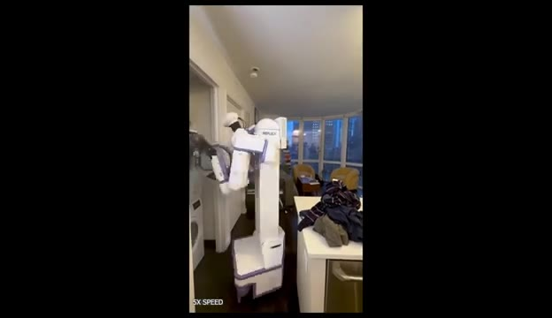
*Le robot se déplace dans un appartement et manipule des stores/portes en mode accéléré (5X SPEED).*

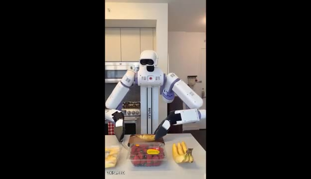
*Le robot prépare des ingrédients sur un plan de travail de cuisine, tenant une banane (2X SPEED).*

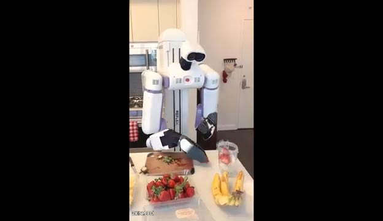
*Le robot coupe ou manipule des fruits (fraises) sur une planche à découper dans la cuisine (2X SPEED).*

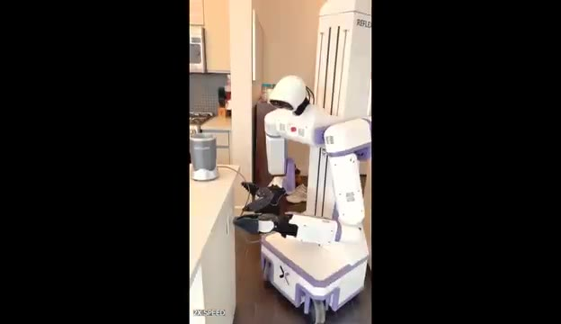
*Le robot déplace ou place des éléments vers un blender posé sur le comptoir de la cuisine (2X SPEED).*

---

### ⏱️ `[00:04:22 - 00:04:55]` | Segment #13

**🔊 Audio (Transcription Intégrale Mot pour Mot en Français) :**
> Dans une autre démo, le robot ouvre un paquet de steak, le place dans une poêle, le retourne pendant la cuisson et ajoute du beurre. Le résultat est un plat cuisiné prêt à être servi. Maintenant, pour être juste, les démonstrations contiennent des coupes entre les scènes, il n'est donc pas tout à fait clair quelle partie du processus a été automatisée en continu, mais les capacités restent très impressionnantes. Passons maintenant à la génération de vidéos par IA ; un nouveau système appelé Shotverse peut générer des vidéos cinématographiques à plans multiples en une seule génération, au lieu de produire une seule scène continue, le modèle...

**👁️ Analyse Visuelle d'Écran (gemini-3.5-flash-lite) :**
**Interface & Outils** : Démonstration vidéo de robotique et de génération de vidéo par IA (Shotverse).

**Contenu textuel & Code** : Texte affiché à l'écran : "AI Video Generation" et mention "2X SPEED" dans les vidéos de démonstration du robot.

**Action / Démonstration** : Le robot de cuisine manipule des ingrédients et des ustensiles pour cuisiner un steak, puis une transition introduit des exemples de génération vidéo cinématique multi-plans par IA.

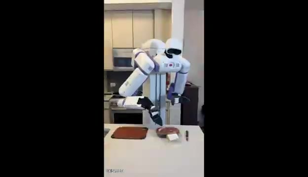
*Démonstration d'un robot humanoïde dans une cuisine préparant un steak.*

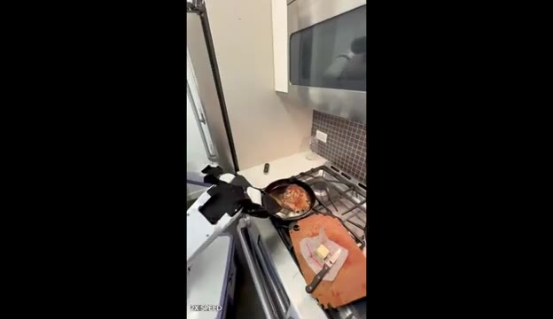
*Gros plan sur le robot manipulant une poêle pour cuire la viande sur une cuisinière.*

*Exemple de vidéo générée par le système Shotverse montrant une personne en train de travailler sur une structure métallique.*

---

### ⏱️ `[00:04:55 - 00:05:32]` | Segment #14

**🔊 Audio (Transcription Intégrale Mot pour Mot en Français) :**
> bascule automatiquement entre plusieurs angles de caméra et plans, exactement comme un vrai film. Dans l'exemple montré par les chercheurs, la vidéo générée effectue des transitions fluides entre les scènes tout en maintenant la cohérence des personnages, ce qui confère au résultat un rendu beaucoup plus cinématographique par rapport aux modèles de vidéo par IA traditionnels. La raison pour laquelle cela fonctionne si bien est que le modèle a été entraîné sur de véritables séquences cinématographiques. Selon les chercheurs, l'entraînement sur des vidéos générées par IA de manière synthétique réduit en réalité la qualité des résultats. Le projet sera éventuellement entièrement en open source. Les développeurs prévoient de publier le modèle, le jeu de données, le pipeline d'entraînement et l'inférence.

**👁️ Analyse Visuelle d'Écran (gemini-3.5-flash-lite) :**
**Interface & Outils** : Présentation de recherche / Article web et exemples vidéo de ShotVerse

**Contenu textuel & Code** : Texte à l'écran : "Training Data", "Synthetic supervision hurts film-like rendering. Aesthetics drops noticeably and semantics slightly weakens, suggesting real cinematic triplets provide crucial composition/lighting cues beyond what synthetic triplets capture.", "w/ Synthetic Data", "Real Cinematic Data (Ours)", "Code Release Plan", et bloc BibTeX "@misc{yang2026shotverseadvancingcinematiccamera...}"

**Action / Démonstration** : Démonstration visuelle de vidéos générées avec différentes techniques d'entraînement et affichage du planning de publication du code de recherche.

*Exemple de vidéo générée montrant une transition de plan sur un personnage.*

*Exemple supplémentaire de vidéo générée par le modèle montrant la cohérence des personnages.*

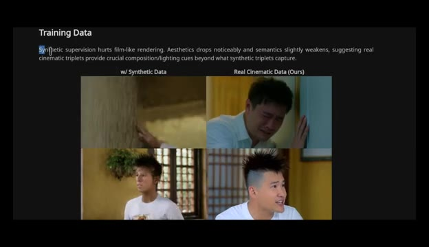
*Présentation des données d'entraînement comparant les données synthétiques et les données cinématiques réelles.*

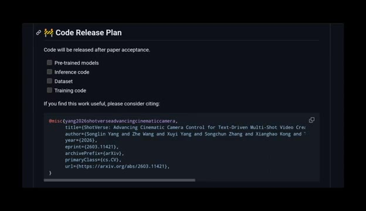
*Plan du projet open source avec les sections sur les modèles pré-entraînés, le code d'inférence, le jeu de données et le code de l'article de recherche (BibTeX).*

---

### ⏱️ `[00:05:32 - 00:05:43]` | Segment #15

**🔊 Audio (Transcription Intégrale Mot pour Mot en Français) :**
> codez une fois que l'article de recherche est officiellement accepté. Et c'est tout pour les actualités de la recherche en IA de cette semaine. Si vous souhaitez explorer plus en profondeur l'un de ces projets, je mettrai les liens dans la description. Merci d'avoir regardé.

**👁️ Analyse Visuelle d'Écran (gemini-3.5-flash-lite) :**
**Interface & Outils** : Écran de conclusion de la vidéo avec illustration animée, sans interface logicielle ni démonstration active.

**Contenu textuel & Code** : Illustration d'un cerveau connecté à une puce électronique portant le logo "PAI" dans un cercle néon bleu, avec le texte "The Resea" partiellement visible à l'écran.

**Action / Démonstration** : Affichage d'un écran graphique de clôture de la vidéo de la chaîne Pursuing AI.

---
