# 🎬 L'IA est en train de se réinventer... Et personne n'est prêt

> **Chaîne** : [Pursuing AI](https://www.youtube.com/@PursuingAi)  
> **Titre original** : `AI Is Reinventing Itself Right Now… And No One Is Ready`  
> **Lien YouTube** : [https://www.youtube.com/watch?v=2rgqYDoAETs](https://www.youtube.com/watch?v=2rgqYDoAETs)  
> **Date de publication** : 2026-03-20  
> **Durée** : 03m 57s (`237s`)  
> **Identifiant vidéo** : `2rgqYDoAETs`  
> **Fiche Web Interactive** : [2026-03-20_YT-2rgqYDoAETs_L'IA est en train de se réinventer... Et personne n'est prêt_by-whisper-v3-large-turbo+gemini-3.5-flash-lite.html](2026-03-20_YT-2rgqYDoAETs_L'IA est en train de se réinventer... Et personne n'est prêt_by-whisper-v3-large-turbo+gemini-3.5-flash-lite.html)  
> **Captures de démonstration clés** : `19 captures réelles (anti-talking-head)`  
> **Modèles utilisés** : Audio: `large-v3-turbo` (Faster-Whisper int8 VPS) | Vision: `gemini-3.5-flash-lite` (Google AI Studio API)  

---

## 📌 Synthèse Exécutive & Outils

En tant que réalisateur et analyste expert en vidéo par intelligence artificielle, voici l'analyse approfondie de cette édition de Pursuing AI.

### 📌 Résumé
La vidéo de Pursuing AI met en lumière un tournant civilisationnel et technique majeur : l'industrie de l'IA est au bord d'une rupture architecturale totale. Alors que les fondations actuelles de l'apprentissage profond (les *Transformers*) atteignent un mur économique et mathématique en raison d'une explosion exponentielle des coûts de calcul, les leaders du secteur comme Sam Altman annoncent déjà leur remplacement potentiel. Cette transition d'ampleur – comparable au passage des réseaux LSTM vers les Transformers – s'accompagne d'une accélération vertigineuse où l'IA elle-même commence à concevoir les générations futures de modèles, enclenchant une boucle d'intelligence récursive menant potentiellement à l'AGI d'ici deux ans.

Sur le plan technique et créatif, la vidéo décrypte l'émergence d'une nouvelle génération d'outils capables de modéliser la physique et la réalité tridimensionnelle avec une précision inédite. Des innovations telles que *Leto* d'Apple, qui convertit une simple image 2D en un objet 3D entièrement cohérent (avec gestion parfaite de l'éclairage et des reflets), ou encore *World FM*, qui résout les aberrations spatiales des vidéos générées par IA grâce à une cohérence multi-vue en temps réel sur un matériel grand public (RTX 4090), redéfinissent les standards de la production visuelle. 

Pour les créateurs de vidéo, ces avancées annoncent la fin des artefacts visuels aberrants (objets qui dérivent, géographies impossibles) et l'intégration native de la structure physique dans les pipelines de création. Le flux de travail de production bascule d'une simulation 2D trompeuse à une modélisation spatiale unifiée, permettant de générer des environnements complexes, des actifs 3D et des plans vidéo d'une stabilité physique irréprochable, tout en réduisant la complexité technique autrefois réservée aux studios lourds.

### 🛠️ Outils, Modèles & Logiciels Présentés
* **Seedance 2.5** : Modèle de pointe utilisé pour la génération et l'optimisation de séquences vidéo par IA dans les workflows de création visuelle avancés.
* **Kling 3.0** : Solution de génération vidéo par IA performante intégrée dans l'analyse des capacités actuelles de simulation de mouvement et de cohérence.
* **Midjourney** : Outil de référence pour la création d'images statiques de haute fidélité servant de points de départ aux pipelines de modélisation 3D.
* **Leto (par Apple)** : Modèle révolutionnaire transformant une unique image 2D en un objet 3D entièrement réaliste, doté d'un éclairage et de reflets cohérents sous tous les angles.
* **Inspiro World FM** : Modèle de vision et de simulation résolvant les faiblesses spatiales des vidéos par IA grâce à une cohérence multi-vue exécutable en temps réel sur un simple GPU RTX 4090.

### 🔑 Points Clés & Enseignements Stratégiques
* **Obsolescence programmée des architectures** : Les *Transformers*, qui alimentent l'ensemble de l'écosystème IA actuel (ChatGPT, assistants de code), font face à une loi d'évolution extrêmement défavorable où multiplier l'entrée par 10 multiplie le coût de calcul par 100.
* **L'analogie historique des LSTM** : Le passage de l'architecture actuelle vers la prochaine génération ne sera pas une simple mise à niveau incrémentale, mais un effacement total et une réinstallation du paradigme technique.
* **L'intelligence récursive auto-accélérée** : L'IA actuelle a atteint un seuil de maturité suffisant pour participer activement à la conception de la prochaine génération d'IA, provoquant une téléportation technologique du progrès plutôt qu'une progression linéaire.
* **Horizon temporel de l'AGI** : Les estimations concordent vers une émergence de l'AGI d'ici environ deux ans, obligeant les professionnels à réévaluer d'urgence leurs compétences et plans de carrière.
* **La fin de la tyrannie du multi-angle** : Grâce à des modèles comme *Leto*, posséder plusieurs prises de vue d'un objet n'est plus nécessaire ; une seule image suffit pour inférer la géométrie, l'éclairage et les reflets sous tous les angles.
* **Compréhension de la structure physique** : Les outils de nouvelle génération ne manipulent plus seulement du texte ou des pixels, mais intègrent la physique du monde réel, évitant l'effondrement visuel lors des mouvements de caméra.
* **Éradication des artefacts spatiaux** : Des solutions comme *World FM* corrigent la plus grande tare des vidéos IA actuelles (la dérive des objets et les agencements aberrants) en garantissant une stricte cohérence multi-vue.
* **Démocratisation du calcul temps réel** : Les percées architecturales permettent désormais d'exécuter des simulations spatiales complexes et des calculs multi-vues directement sur du matériel grand public haut de gamme (une simple carte graphique RTX 4090).
* **Piège de la surface esthétique** : Ne plus se fier uniquement à l'aspect flatteur de surface d'une vidéo générée ; l'analyse critique doit désormais porter sur la stabilité spatiale et la logique physique à long terme.
* **Transition vers les pipelines 3D natifs** : Les créateurs de contenu doivent anticiper l'intégration d'actifs 3D instantanés générés par IA dans leurs flux de montage pour s'affranchir des contraintes des moteurs CGI traditionnels.

---

## ⏱️ Chronologie & Transcription Complète Audio & Visuelle (Mot pour Mot)

### ⏱️ `[00:00:00 - 00:00:19]` | Segment #01

**🔊 Audio (Transcription Intégrale Mot pour Mot en Français) :**
> Sam Ullman vient de dire que ce qui alimente ChatGPT pourrait être obsolète. Oui, l'air de rien. Quoi ? C'est Pursuing AI et vous regardez le rapport de recherche. Toute la fondation de l'IA moderne, les transformers, pourrait être remplacée. Rien de grave, il s'agit juste de réécrire les lois de l'IA.

**👁️ Analyse Visuelle d'Écran (gemini-3.5-flash-lite) :**
**Interface & Outils** : Graphique explicatif animé sur fond noir illustrant l'architecture des transformers et le traitement de matrices numériques en intelligence artificielle.

**Contenu textuel & Code** : Texte "TRANSFORMERS" en haut de l'écran en lettres bleues et blanches, matrices numériques affichées sous forme de tableaux de vecteurs avec des valeurs décimales (ex: [0.3, 9.0, 8.1...]), flèche jaune pointant vers un système de probabilités avec des barres horizontales bleues et des valeurs numériques (ex: 0.78, 0.16).

**Action / Démonstration** : Animation graphique illustrant le traitement de données matricielles au sein des architectures de type transformer en IA.

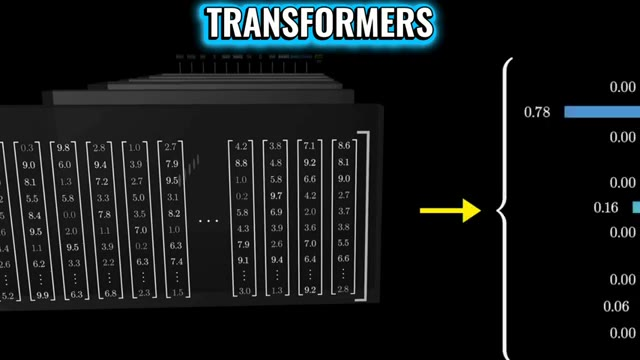
*Schéma technique animé illustrant le fonctionnement des transformers avec des matrices de vecteurs numériques et des graphiques de probabilité.*

---

### ⏱️ `[00:00:19 - 00:00:40]` | Segment #02

**🔊 Audio (Transcription Intégrale Mot pour Mot en Français) :**
> Pendant ce temps, Apple lance Leto, un modèle qui transforme une simple image en un objet 3D entièrement réaliste avec un éclairage et des reflets corrects. Parce qu'apparemment, une seule image est tout ce dont vous avez besoin maintenant. Les angles multiples sont pour les plébéiens. Commençons par la partie qui devrait légèrement préoccuper votre avenir. Sam Wallman est retourné à Stanford et a déclaré que les transformers ne sont pas la dernière étape.

**👁️ Analyse Visuelle d'Écran (gemini-3.5-flash-lite) :**
**Interface & Outils** : Page web de recherche / présentation technique (LiTo d'Apple) et enregistrement vidéo d'une conférence académique (Stanford ETL).

**Contenu textuel & Code** : Sur l'image 1, le titre "LiTo: Surface Light Field Tokenization", "Image-to-3D Generation Comparison", et des vignettes d'objets 3D comparant l'image de conditionnement, le modèle "Ours" et "TRELLIS". Sur l'image 2, les bannières de l'événement "ETL - Entrepreneurship Thought Leaders" de Stanford avec deux intervenants assis.

**Action / Démonstration** : L'écran affiche d'abord la documentation technique et les résultats visuels du modèle 3D d'Apple, puis passe à un extrait d'interview sur scène avec Sam Wallman à Stanford.

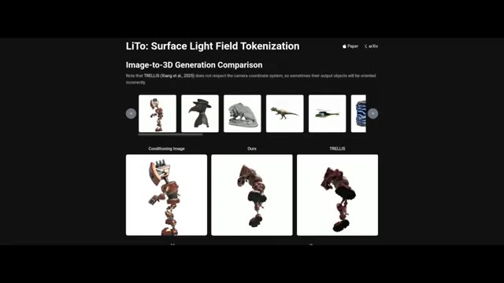
*Capture d'écran du site web de présentation du modèle "LiTo: Surface Light Field Tokenization" d'Apple montrant une comparaison de génération d'image vers 3D.*

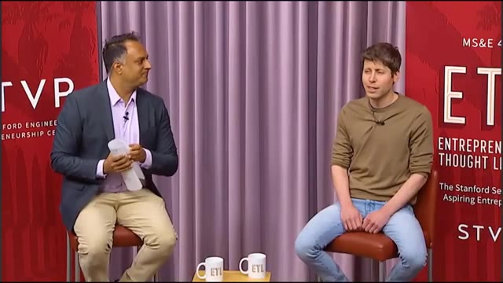
*Extrait vidéo d'une conférence à Stanford montrant deux hommes assis sur des chaises lors d'une session de discussion (talk).*

---

### ⏱️ `[00:00:40 - 00:01:01]` | Segment #03

**🔊 Audio (Transcription Intégrale Mot pour Mot en Français) :**
> Ce qui a l'air inoffensif. Jusqu'à ce que vous réalisiez que les transformers alimentent littéralement tout ce que vous avez vu dans l'IA. ChatGPT ? Des transformers. L'assistance au code ? Des transformers. Votre crise existentielle générée par l'IA ? Des transformers aussi. Donc, quand le PDG d'OpenAI dit que cette fondation pourrait être remplacée, ce n'est pas un tweet.

**👁️ Analyse Visuelle d'Écran (gemini-3.5-flash-lite) :**
**Interface & Outils** : Éléments graphiques et textuels animés en plein écran illustrant le montage vidéo de la chaîne Pursuing AI.

**Contenu textuel & Code** : Sur l'image 2 : Le logo d'OpenAI et un autre logo d'IA alignés en face du mot 'Transformers'. Sur l'image 3 : Le texte 'THAT'S NOT A TWEET' avec le mot 'THAT'S' encadré en violet.

**Action / Démonstration** : Affichage de graphiques animés textuels et visuels pour illustrer les propos de l'analyste sur les architectures d'intelligence artificielle.

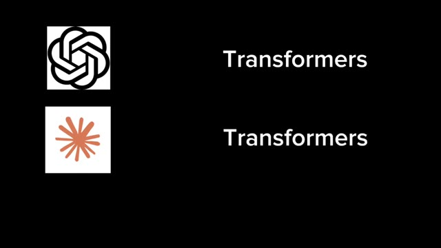
*Graphique textuel montrant des logos d'IA associés au mot 'Transformers'.*

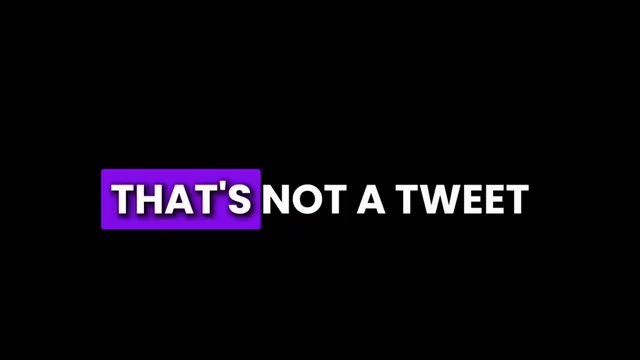
*Texte graphique affichant la phrase clé 'THAT'S NOT A TWEET'.*

---

### ⏱️ `[00:01:01 - 00:01:23]` | Segment #04

**🔊 Audio (Transcription Intégrale Mot pour Mot en Français) :**
> C'est un avertissement. Voici le problème. Les Transformers évoluent terriblement mal. Vous rendez votre entrée 10 fois plus longue et le coût de calcul est multiplié par 100. Ce n'est pas linéaire. Ce n'est pas raisonnable. C'est juste de la douleur. C'est le mur. Et nous l'avons heurté. Ensuite, il lâche la vraie bombe. La prochaine architecture pourrait être comme les transformers remplaçant les LSTM.

**👁️ Analyse Visuelle d'Écran (gemini-3.5-flash-lite) :**
**Interface & Outils** : Affichage de graphiques animés de texte (sous-titres dynamiques) et d'une capture d'écran d'un article d'actualité technologique.

**Contenu textuel & Code** : Textes animés "HERE'S THE PROBLEM TRANSFORMER", "NOT LINEAR NOT REASONABLE" et un article en anglais titrant "Altman declares the death of Transformer. AGI will arrive within two years, and the next-generation architecture is on the way." avec la date 2026-03-17 et la source "新智元" (Xinzhiyuan).

**Action / Démonstration** : Défilement de sous-titres animés rythmés par la voix off, puis affichage d'un article de presse/citation illustrant le propos sur l'abandon des transformers.

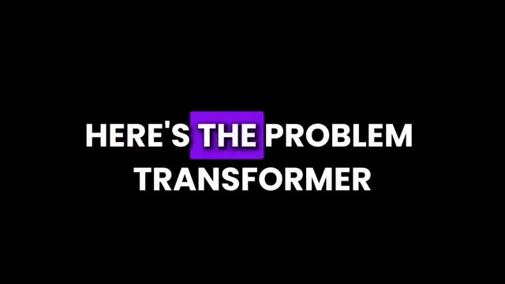
*Texte animé à l'écran affichant "HERE'S THE PROBLEM TRANSFORMER" avec des mots mis en surbrillance violette.*

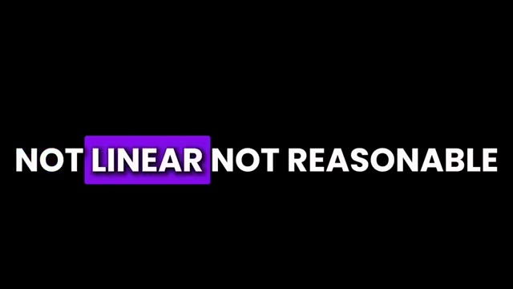
*Texte animé à l'écran affichant "NOT LINEAR NOT REASONABLE" avec des mots mis en surbrillance violette.*

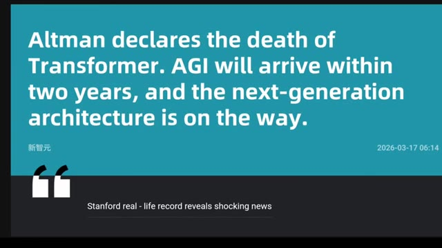
*Capture d'article sur fond bleu et gris citant : "Altman declares the death of Transformer. AGI will arrive within two years, and the next-generation architecture is on the way."*

---

### ⏱️ `[00:01:23 - 00:01:43]` | Segment #05

**🔊 Audio (Transcription Intégrale Mot pour Mot en Français) :**
> Traduction, pas une mise à niveau, un effacement total et une réinstallation. Et maintenant, ça devient légèrement terrifiant. Il dit que l'IA actuelle est peut-être déjà assez intelligente pour aider à inventer la prochaine IA. Donc maintenant, nous avons l'IA qui aide les humains à construire une meilleure IA, qui construit une IA encore meilleure, qui aide à construire une IA encore meilleure.

**👁️ Analyse Visuelle d'Écran (gemini-3.5-flash-lite) :**
**Interface & Outils** : Schéma explicatif animé sur fond noir.

**Contenu textuel & Code** : Logos et icônes représentant l'intelligence artificielle (OpenAI), un développeur humain travaillant sur des écrans informatiques, et une icône d'une nouvelle génération d'IA reliés par des flèches blanches.

**Action / Démonstration** : Illustration visuelle du concept de récursion où l'IA et les humains collaborent pour créer de nouvelles versions d'IA de plus en plus performantes.

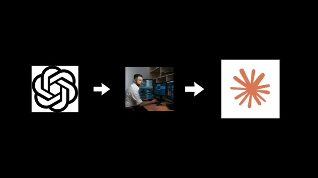
*Schéma explicatif montrant le cycle de développement avec le logo OpenAI, un humain devant des écrans, et une icône d'IA.*

---

### ⏱️ `[00:01:43 - 00:02:01]` | Segment #06

**🔊 Audio (Transcription Intégrale Mot pour Mot en Français) :**
> À ce stade, c'est fondamentalement de l'intelligence récursive avec un abonnement à la salle de sport. Une fois que cette boucle est lancée, le progrès n'avance plus. Il se téléporte. Allman a également parlé de son histoire d'origine. À l'époque à Stanford, il pensait que l'IA n'allait nulle part. Puis AlexNet est sorti, et il s'est dit, cool. C'est tout. Juste cool.

**👁️ Analyse Visuelle d'Écran (gemini-3.5-flash-lite) :**
**Interface & Outils** : Extrait vidéo / Illustration textuelle à l'écran

**Contenu textuel & Code** : Le mot "AlexNet" écrit en grandes lettres blanches sur fond noir.

**Action / Démonstration** : Présentation du nom du modèle de réseau de neurones lors de l'explication historique.

*Écran noir affichant le texte "AlexNet" en caractères blancs.*

---

### ⏱️ `[00:02:02 - 00:02:21]` | Segment #07

**🔊 Audio (Transcription Intégrale Mot pour Mot en Français) :**
> Pendant ce temps, l'histoire se disait, genre, mec, c'est le début. Finalement, il a réalisé que quelque chose d'important se préparait. Il a donc fondé OpenAI en 2015. Et les débuts ? Le chaos total d'une startup. Ils se sont rencontrés dans un appartement, ne savaient pas ce qu'ils faisaient, n'avaient même pas de tableau blanc, et ont dû en commander un en ligne comme si c'était une quête secondaire.

**👁️ Analyse Visuelle d'Écran (gemini-3.5-flash-lite) :**
**Interface & Outils** : ChatGPT 5.4 Thinking

**Contenu textuel & Code** : On peut lire le prompt utilisateur : "a baby japanese macaque has stolen my heart, where can i volunteer in nyc to be closer to animals?" ainsi que la réponse en cours de génération de l'IA : "I'm pulling together current NYC volunteer options that actually let you spend time around animals, with a bias toward places that are practical for regular volunteering." et l'indicateur "Thinking".

**Action / Démonstration** : Affichage de l'interface de l'application ChatGPT sur fond dégradé coloré, illustrant l'évolution technologique et les outils conversationnels modernes d'OpenAI.

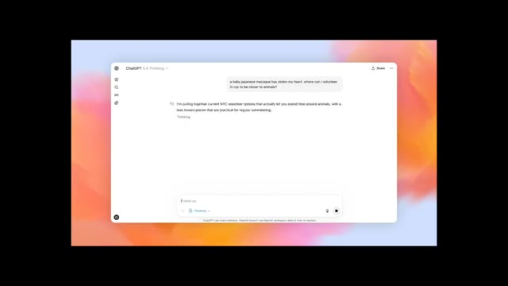
*Interface de ChatGPT 5.4 Thinking affichant une conversation textuelle avec une zone de saisie et un arrière-plan coloré.*

---

### ⏱️ `[00:02:21 - 00:02:40]` | Segment #08

**🔊 Audio (Transcription Intégrale Mot pour Mot en Français) :**
> Mais d'une manière ou d'une autre, en une semaine, ils avaient déjà les idées qui ont façonné OpenAI. Passons directement à maintenant, Allman dit que l'AGI pourrait arriver d'ici deux ans. Deux ans, ce qui est soit passionnant, soit profondément incommode selon vos choix de carrière. Maintenant, de l'autre côté du chaos, Apple.

**👁️ Analyse Visuelle d'Écran (gemini-3.5-flash-lite) :**
**Interface & Outils** : Navigateur web présentant des articles de recherche et des actualités sur l'intelligence artificielle (notamment sur LiTo par Apple et des déclarations sur l'AGI).

**Contenu textuel & Code** : Sur l'image 2 : "Altman declares the death of Transformer. AGI will arrive within two years, and the next-generation architecture is on the way." et "Stanford real - life record reveals shocking news". Sur l'image 3 : "LiTo: Surface Light Field Tokenization", "Image-to-3D Generation Comparison", "Conditioning Image", "Ours", "TRELLIS".

**Action / Démonstration** : Le créateur de la vidéo fait défiler ou présente à l'écran des articles et des articles de recherche technique pour illustrer ses propos sur l'arrivée prochaine de l'AGI et les travaux d'Apple.

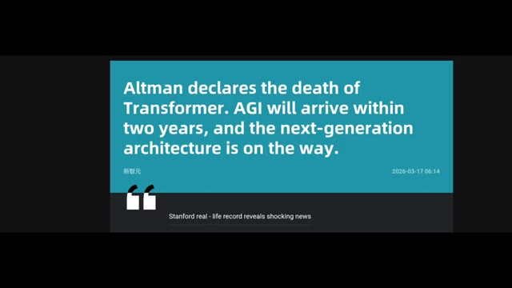
*Capture d'écran affichant un article de presse ou un tweet sur fond bleu turquoise avec une citation en anglais concernant Altman et l'AGI.*

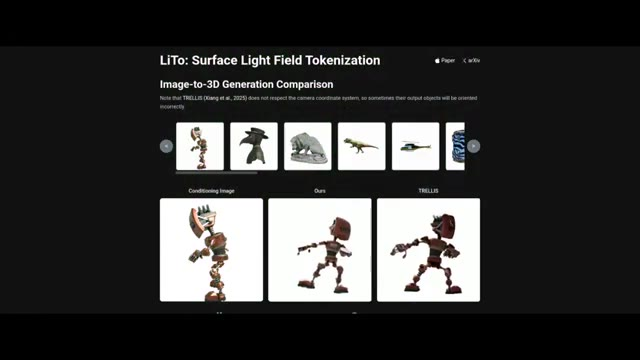
*Capture d'écran d'une page web de recherche intitulée "LiTo: Surface Light Field Tokenization" montrant une comparaison de génération d'image en 3D.*

---

### ⏱️ `[00:02:40 - 00:02:59]` | Segment #09

**🔊 Audio (Transcription Intégrale Mot pour Mot en Français) :**
> Ils ont construit Leto, et c'est ridicule. Vous lui donnez une seule image, juste une, et il génère un objet 3D complet. Pas seulement la forme, mais l'éclairage, les reflets, le tout cohérent sous tous les angles. Les anciens systèmes ont essayé cela et ont échoué. Déplacez légèrement la caméra et tout s'effondre comme un film CGI à petit budget.

**👁️ Analyse Visuelle d'Écran (gemini-3.5-flash-lite) :**
**Interface & Outils** : Interface web de recherche / démonstration académique (LiTo : Surface Light Field Tokenization).

**Contenu textuel & Code** : Titre "LiTo: Surface Light Field Tokenization", section "Image-to-3D Generation Comparison", étiquettes "Conditioning Image", "Ours", et "TRELLIS". Texte d'explication concernant TRELLIS.

**Action / Démonstration** : Présentation comparative de résultats de génération 3D à partir d'une image unique entre le modèle LiTo et le modèle concurrent TRELLIS.

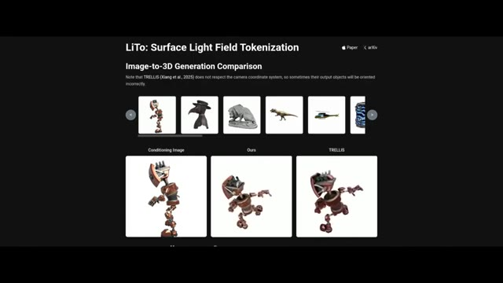
*Page de présentation de LiTo (Surface Light Field Tokenization) montrant une comparaison de génération image-à-3D.*

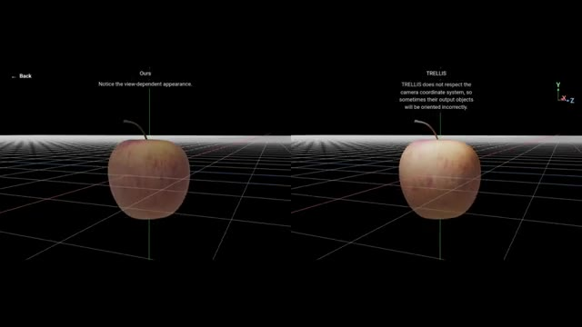
*Comparaison interactive en 3D côte à côte entre le modèle LiTo ('Ours') et TRELLIS représentant une pomme sur une grille.*

---

### ⏱️ `[00:03:00 - 00:03:20]` | Segment #10

**🔊 Audio (Transcription Intégrale Mot pour Mot en Français) :**
> Leto résout ce problème en apprenant la forme et l'éclairage en même temps. Au lieu de tout mémoriser, il comprend l'objet, puis le reconstruit. Une image en entrée, un objet 3D complet en sortie. Cela semble de niche, mais ça ne l'est pas. Cela signifie que l'IA commence à comprendre la réalité. Pas seulement du texte, pas seulement des pixels, mais la structure physique.

**👁️ Analyse Visuelle d'Écran (gemini-3.5-flash-lite) :**
**Interface & Outils** : Interface de visualisation 3D en grille avec deux fenêtres de comparaison côte à côte ("Ours" à gauche et "TRELLIS" à droite).

**Contenu textuel & Code** : À gauche, le texte indique : "Ours. Notice the view-dependent appearance." À droite, le texte indique : "TRELLIS. TRELLIS does not respect the camera coordinate system, so sometimes their output objects will be oriented incorrectly." Au centre de chaque fenêtre, une pomme en 3D repose sur une grille noire avec des axes de coordonnées (X, Y, Z).

**Action / Démonstration** : Comparaison comparative de modèles 3D d'une pomme affichée sur une grille virtuelle pour illustrer la reconstruction 3D.

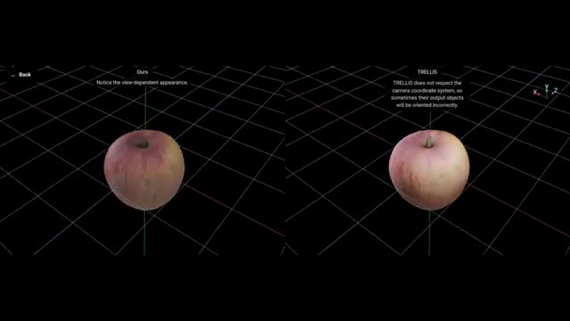
*Comparaison 3D côte à côte montrant une pomme modélisée sur une grille avec des annotations textuelles sur les performances.*

---

### ⏱️ `[00:03:20 - 00:03:43]` | Segment #11

**🔊 Audio (Transcription Intégrale Mot pour Mot en Français) :**
> Et cela nous mène à Inspiro World FM. L'objectif est de corriger la plus grande faiblesse de l'IA : la fausse compréhension de l'espace. Les vidéos IA actuelles ont l'air bien jusqu'à ce qu'on les regarde vraiment. Les objets dérivent, les agencements buguent. World FM résout ce problème grâce à la cohérence multi-vue. Il s'exécute en temps réel sur une seule RTX 4090, juste votre GPU de jeu hors de prix.

**👁️ Analyse Visuelle d'Écran (gemini-3.5-flash-lite) :**
**Interface & Outils** : Interface de démonstration 3D et page web comparative de recherche (LiTo).

**Contenu textuel & Code** : Texte à l'écran : "Ours - Notice the view-dependent appearance" et "TRELLIS - TRELLIS does not respect the camera coordinate system". Sur l'image 2 : "LiTo: Surface Light Field Tokenization", "Reconstruction Comparison", "Ground Truth", "Ours", "TRELLIS".

**Action / Démonstration** : Présentation comparative visuelle des performances de modélisation et de cohérence spatiale entre différents modèles d'IA 3D.

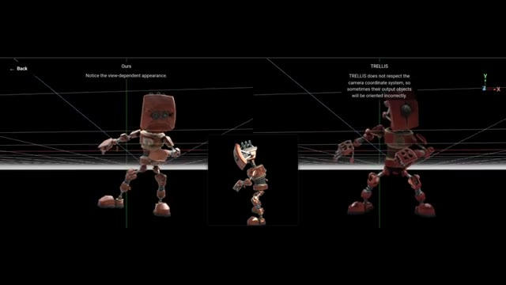
*Comparaison 3D côte à côte entre le modèle 'Ours' et 'TRELLIS' affichant un robot articulé.*

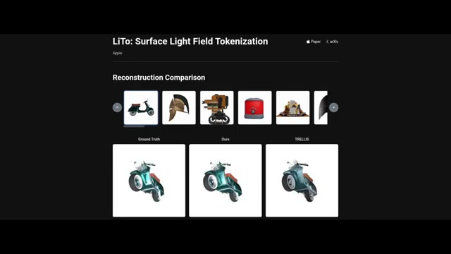
*Interface web 'LiTo: Surface Light Field Tokenization' montrant une section de comparaison de reconstruction de modèles 3D.*

---

### ⏱️ `[00:03:44 - 00:03:57]` | Segment #12

**🔊 Audio (Transcription Intégrale Mot pour Mot en Français) :**
> Alors, que se passe-t-il vraiment ici ? De meilleures architectures, l'IA qui conçoit l'IA, une compréhension du monde réel. Ce n'est pas un progrès graduel. C'est un changement de phase, et nous y sommes pleinement plongés.

**👁️ Analyse Visuelle d'Écran (gemini-3.5-flash-lite) :**
**Interface & Outils** : Interface web de présentation de recherche académique / démonstration de modèle d'IA (LiTo: Surface Light Field Tokenization par Apple).

**Contenu textuel & Code** : Titres visibles : "LiTo: Surface Light Field Tokenization", "Apple", "Paper", "arXiv", "Reconstruction Comparison". Une galerie d'objets miniatures (scooter, casque, robot, etc.) et trois fenêtres de comparaison sous le scooter étiquetées "Ground Truth", "Ours", et "TRELLIS", présentant des rendus 3D sous différents angles.

**Action / Démonstration** : Affichage d'une page de démonstration de recherche en IA comparant les performances de reconstruction 3D de différents modèles.

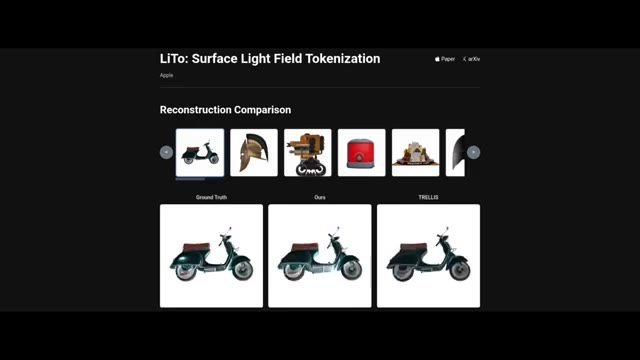
*Présentation du projet de recherche LiTo par Apple, montrant une interface de comparaison de reconstruction 3D d'objets (comme un scooter).*

---
