# 🎬 Seedance 2.0 – Le générateur vidéo IA ultime sur xmk

> **Chaîne** : [Pursuing AI](https://www.youtube.com/@PursuingAi)  
> **Titre original** : `Seedance 2.0 – AI Video Generator on xmk`  
> **Lien YouTube** : [https://www.youtube.com/watch?v=WGg88V3RGpQ](https://www.youtube.com/watch?v=WGg88V3RGpQ)  
> **Date de publication** : 2026-03-27  
> **Durée** : 06m 38s (`398s`)  
> **Identifiant vidéo** : `WGg88V3RGpQ`  
> **Fiche Web Interactive** : [2026-03-27_YT-WGg88V3RGpQ_Seedance 2.0 – Le générateur vidéo IA ultime sur xmk_by-whisper-v3-large-turbo+gemini-3.5-flash-lite.html](2026-03-27_YT-WGg88V3RGpQ_Seedance 2.0 – Le générateur vidéo IA ultime sur xmk_by-whisper-v3-large-turbo+gemini-3.5-flash-lite.html)  
> **Captures de démonstration clés** : `41 captures réelles (anti-talking-head)`  
> **Modèles utilisés** : Audio: `large-v3-turbo` (Faster-Whisper int8 VPS) | Vision: `gemini-3.5-flash-lite` (Google AI Studio API)  

---

## 📌 Synthèse Exécutive & Outils

### 📌 Résumé
La vidéo de Pursuing AI met en lumière l'arrivée en accès anticipé de **Seedance 2.0** (phonétiquement transcrit « C-Dance 2 »), un générateur vidéo par IA de pointe associé officiellement à la plateforme **xmk.com** (xmk). Ce modèle s'impose comme une révolution dans l'écosystème de la création audiovisuelle grâce à son réalisme saisissant, sa capacité à gérer des prompts complexes et sa faculté native à synchroniser l'audio et la vidéo. Le présentateur démontre comment contourner le lancement mondial officiel pour tester immédiatement le modèle sur une interface centralisée, ouvrant la voie à des productions cinématiques d'une fluidité inédite.

La méthode présentée repose sur un parcours utilisateur fluide au sein de la plateforme xmk.com, où le créateur sélectionne explicitement Seedance 2.0 parmi le menu des modèles disponibles. Le workflow s'articule autour de trois modes de génération majeurs : la référence multimodale (autorisant jusqu'à 12 fichiers combinant images, vidéos et audio), l'interpolation entre une première et une dernière image, et le classique mode texte-vers-vidéo. Pour chaque génération, l'utilisateur peut arbitrer entre les versions **Fast** et **Pro**, ajuster le format (16:9), définir la durée (de 4 à 15 secondes) et consommer des crédits payants adaptés à ses ambitions créatives.

Pour les créateurs de contenu, les réalisateurs et les agences, Seedance 2.0 représente un bond en avant technologique considérable pour concevoir des scènes ultra-détaillées sans artefacts visuels majeurs. Qu'il s'agisse de simuler des effets d'explosion complexes, de reproduire la viscosité naturelle du miel ou d'animer des personnages avec des micro-expressions oculaires et des mouvements fluides, l'outil redéfinit les standards de l'industrie. L'intégration de guides de prompts et la prise en charge de formats longs (jusqu'à 15 secondes) permettent de s'affranchir des limites habituelles de l'IA générative et d'accélérer les pipelines de production professionnelle.

### 🛠️ Outils, Modèles & Logiciels Présentés
* **Seedance 2.0 (C-Dance 2)** : Modèle d'intelligence artificielle générative vidéo ultra-avancé, reconnu pour son niveau de détail exceptionnel, sa fluidité, sa gestion de la physique et sa synchronisation audio-vidéo native.
* **xmk.com** : Plateforme tierce d'accès anticipé et d'agrégation de modèles d'IA, hébergeant Seedance 2.0, proposant un système de tarification par crédits, des guides de prompts et divers outils vidéo.
* **VO 3.1** : Modèle vidéo IA concurrent mentionné par le créateur comme étant surpassé par Seedance 2.0 en termes de précision des détails et de gestion des effets visuels complexes.

### 🔑 Points Clés & Enseignements Stratégiques
* **Accès anticipé stratégique** : Utiliser des plateformes partenaires comme xmk.com permet de contourner les calendriers de déploiement mondial pour tester et maîtriser les nouveaux modèles avant la concurrence.
* **Flexibilité des modes de génération** : Exploiter la diversité des approches — texte-vers-vidéo, interpolation première/dernière image et génération par référence multimodale — selon la nature du projet créatif.
* **Puissance de la référence multimodale** : Télécharger jusqu'à 12 fichiers simultanés (combinant images, clips vidéo et pistes audio) pour exercer un contrôle maximal sur l'esthétique et l'ambiance de la vidéo finale.
* **Arbitrage entre versions Fast et Pro** : Choisir la version *Fast* (64 crédits) pour le prototypage rapide et la version *Pro* (120 crédits pour 15 secondes) pour obtenir un rendu cinématique maximal et des détails haut de gamme.
* **Gestion optimale des formats et de la durée** : Paramétrer le format en 16:9 et calibrer la durée de génération de 4 à 15 secondes en fonction de la complexité narrative et du budget de crédits disponibles.
* **Maîtrise de la physique et des textures** : Capitaliser sur la capacité de Seedance 2.0 à restituer des mouvements complexes et fluides sans saccades, comme la viscosité du miel ou la propagation d'ondes de choc urbaines.
* **Synchronisation audio-visuelle native** : Tirer parti de la génération audio intégrée au modèle pour lier automatiquement les bruitages contextuels (battements d'ailes, bruits ambiants) aux actions affichées à l'écran.
* **Animation organique des personnages** : Expérimenter le mode image-vers-vidéo pour insuffler de la vie aux visages, obtenant des micro-mouvements oculaires et des interactions réalistes (comme manger un burger) d'un naturel confondant.
* **Utilisation des guides de prompts intégrés** : S'appuyer sur la documentation et les guides de prompts fournis par la plateforme xmk.com pour structurer les requêtes et maximiser la pertinence des résultats générés.
* **Anticipation de la forte demande** : Prendre en compte le fait que Seedance 2.0 subit une forte sollicitation mondiale, ce qui peut induire des temps de rendu plus longs lors des pics d'utilisation.
* **Investissement dans les crédits adaptés** : Analgriser les grilles tarifaires de la plateforme pour acheter des forfaits de crédits alignés sur le volume de production et la récurrence des projets cinématiques.
* **Veille technologique agressive** : Maintenir une formation continue face à l'évolution rapide de l'IA pour éviter l'obsolescence des compétences et intégrer immédiatement les standards les plus récents de l'industrie.

---

## ⏱️ Chronologie & Transcription Complète Audio & Visuelle (Mot pour Mot)

### ⏱️ `[00:00:00 - 00:00:19]` | Segment #01

**🔊 Audio (Transcription Intégrale Mot pour Mot en Français) :**
> C-Dance 2 est enfin là ! Et aujourd'hui, je vais vous montrer exactement comment y accéder. Oui, vous avez bien entendu. Vous pouvez réellement obtenir un accès anticipé à C-Dance 2 avant son lancement mondial officiel. Et non, il ne s'agit pas d'un faux modèle qui circule sur Internet.

**👁️ Analyse Visuelle d'Écran (gemini-3.5-flash-lite) :**
**Interface & Outils** : Site web de génération vidéo XMK.com (Seedance 2.0 AI Video Generator) et extraits vidéo de démonstration générés par IA.

**Contenu textuel & Code** : Textes visibles sur l'interface : "Seedance 2.0 AI Video Generator", "Supports text, image, audio, and video references with precise motion, consistency, and immersive audio-visual output. Create cinematic AI videos with unified multimodal control.", "Reference Generation", "Text to Video", "Upload Media", "Click to upload assets", "Prompt", "Cinematic Creation".

**Action / Démonstration** : Présentation de l'interface de l'outil Seedance 2.0 sur le web, suivie d'extraits vidéo cinématographiques générés par IA montrant une troupe de danseurs de rue dans une rue humide la nuit.

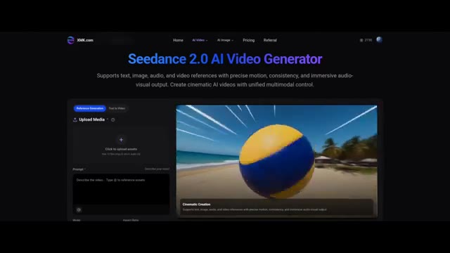
*Interface du site web XMK.com affichant le générateur de vidéo IA Seedance 2.0 avec une prévisualisation vidéo.*

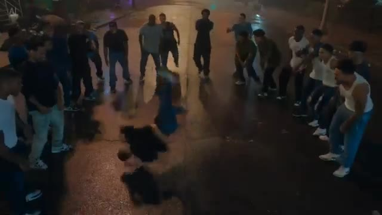
*Scène de danse de rue nocturne générée par IA montrant un danseur en plein breakdance entouré d'une foule.*

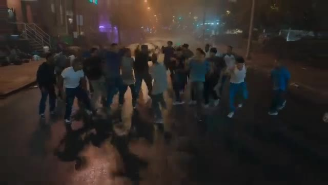
*Vue plus large de la scène de danse de rue nocturne avec un groupe de personnes dansant sous la pluie.*

---

### ⏱️ `[00:00:20 - 00:00:40]` | Segment #02

**🔊 Audio (Transcription Intégrale Mot pour Mot en Français) :**
> Ceci est le véritable modèle C-Dance 2. Et tout ce que vous voyez en ce moment, tous ces résultats vidéo, ont été générés en utilisant C-Dance 2 lui-même. Je joue avec ça depuis un moment maintenant, et c'est différent de tout ce que j'ai jamais vu auparavant. C'est Pursuing AI, et vous regardez The Research Report.

**👁️ Analyse Visuelle d'Écran (gemini-3.5-flash-lite) :**
**Interface & Outils** : Modèle de génération vidéo par intelligence artificielle (C-Dance 2) et graphismes de la chaîne Pursuing AI.

**Contenu textuel & Code** : Résultats de vidéos générées par IA (danse de rue nocturne, intérieur luxueux) et logo animé de la chaîne « PAI » avec un cerveau et des connexions.

**Action / Démonstration** : Présentation de séquences vidéo entièrement générées par le modèle C-Dance 2 suivies du logo de la chaîne.

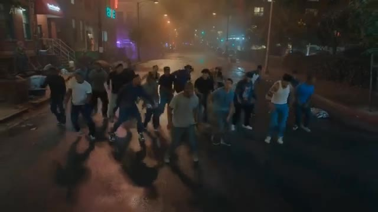
*Démonstration vidéo du modèle C-Dance 2 montrant un groupe de personnes dansant dans une rue nocturne humide.*

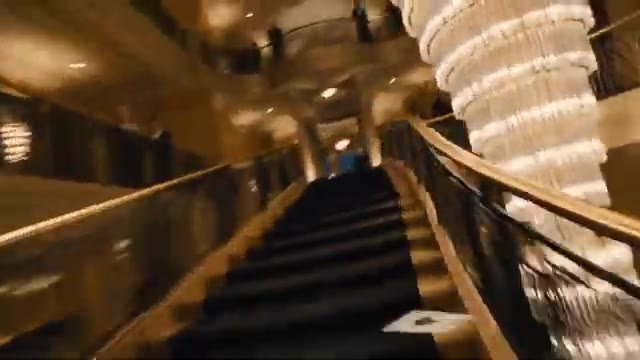
*Démonstration vidéo générée montrant un mouvement de caméra fluide dans un escalier luxueux avec un grand lustre.*

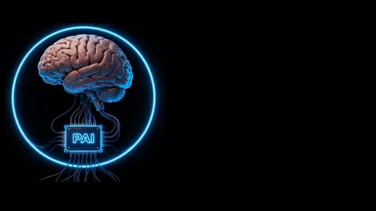
*Logo graphique de Pursuing AI représentant un cerveau connecté à une puce électronique dans un cercle lumineux.*

---

### ⏱️ `[00:00:40 - 00:01:04]` | Segment #03

**🔊 Audio (Transcription Intégrale Mot pour Mot en Français) :**
> Dans cette vidéo, je vais vous montrer étape par étape comment vous pouvez y accéder dès maintenant et commencer à créer des vidéos incroyables comme celle-ci. Donc, sans perdre plus de temps, plongeons directement dans la vidéo. D'accord, c'est donc le site web dont je parlais. Ils se sont officiellement associés à ByteDance, et le modèle C-Dance 2 est déjà en ligne sur leur plateforme, ce qui signifie que vous pouvez y accéder dès maintenant.

**👁️ Analyse Visuelle d'Écran (gemini-3.5-flash-lite) :**
**Interface & Outils** : Site web XMK.com et extraits de vidéos générées par intelligence artificielle.

**Contenu textuel & Code** : Textes visibles sur le site XMK.com : "XMK is your Ai eXtreme Media Kit. Try it now on XMK.com", "Create your image & video all-in-one with XMK.COM. Free try our advanced AI generation features now!", et le bouton bleu "Free Try Seedance 2.0". Menu supérieur avec Home, AI Video, AI Image, Pricing, Referral, Login.

**Action / Démonstration** : Présentation d'exemples de vidéos générées par IA suivie de la transition vers la page d'accueil du site web XMK.com.

*Extrait vidéo généré par IA montrant une femme blonde de dos marchant sur un pont devant le Tower Bridge.*

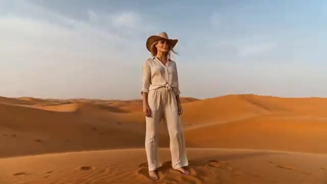
*Extrait vidéo généré par IA montrant une femme portant un chapeau de cowboy au milieu de dunes de désert.*

*Page d'accueil du site XMK.com avec un arrière-plan animé de vagues de mer et un titre promotionnel sur les outils média par IA.*

*Page d'accueil du site XMK.com avec un arrière-plan de rocher ruisselant et les options de navigation du site.*

---

### ⏱️ `[00:01:04 - 00:01:25]` | Segment #04

**🔊 Audio (Transcription Intégrale Mot pour Mot en Français) :**
> Pour commencer, cliquez simplement sur le lien dans la description et inscrivez-vous en utilisant votre identifiant e-mail. Une fois inscrit, vous serez dirigé directement vers cette interface. À partir de là, survolez le menu supérieur, et vous verrez l'option pour sélectionner différents modèles. Choisissez simplement le modèle C-Dance 2 dans la liste. Et une fois que vous l'aurez sélectionné, voici l'interface principale où vous pourrez commencer à créer vos vidéos.

**👁️ Analyse Visuelle d'Écran (gemini-3.5-flash-lite) :**
**Interface & Outils** : Site web XMK.com, interface de la plateforme de génération de vidéo Seedance 2.0.

**Contenu textuel & Code** : "XMK is your Ai eXtreme Media Kit. Try it now on XMK.com", "Create your image & video all-in-one with XMK.COM. Free to try our advanced AI generation features now!", "Free Try Seedance 2.0", "Seedance 2.0 AI Video Generator", "Supports text, image, audio, and video references with precise motion, consistency, and immersive audio-visual output."

**Action / Démonstration** : Navigation sur le site web de la plateforme d'intelligence artificielle et affichage de l'interface de génération vidéo Seedance 2.0.

*Page d'accueil du site XMK.com avec un arrière-plan montrant des vagues déchaînées et le texte principal annonçant le kit multimédia d'intelligence artificielle.*

*Page d'accueil du site XMK.com affichant une animation de vagues et un bouton bleu pour essayer gratuitement Seedance 2.0.*

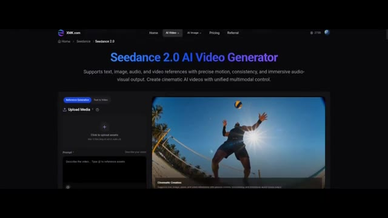
*Interface principale de génération de vidéo Seedance 2.0 sur XMK.com, avec des options d'importation de médias et un aperçu vidéo montrant un joueur de volley-ball.*

---

### ⏱️ `[00:01:25 - 00:01:50]` | Segment #05

**🔊 Audio (Transcription Intégrale Mot pour Mot en Français) :**
> Maintenant, voici la partie intéressante. Il y a trois façons différentes de générer des vidéos. La première est le modèle de génération par référence. Ici, vous pouvez télécharger des images, des vidéos et même des fichiers audio. Oui, vous avez bien entendu. Vous pouvez télécharger plusieurs types de médias en même temps. Comme vous pouvez le voir, vous pouvez télécharger jusqu'à 12 fichiers, y compris des vidéos et de l'audio, ce qui est franchement assez fou.

**👁️ Analyse Visuelle d'Écran (gemini-3.5-flash-lite) :**
**Interface & Outils** : Interface web de Seedance 2.0 AI Video Generator.

**Contenu textuel & Code** : Titre "Seedance 2.0 AI Video Generator", onglets "Reference Generation" et "Text to Video", zone "Upload Media" avec le texte "Click to upload assets. Max 12 files (img ≤9, vid ≤3, audio ≤3)", et le champ de prompt "Describe the video... Type @ to reference assets".

**Action / Démonstration** : Présentation de l'interface de génération vidéo par référence de Seedance 2.0, en se concentrant sur les options de téléchargement de multiples types de fichiers multimédias.

*Interface du générateur de vidéo Seedance 2.0 AI montrant l'option de génération par référence et un exemple vidéo de volley-ball sur la plage.*

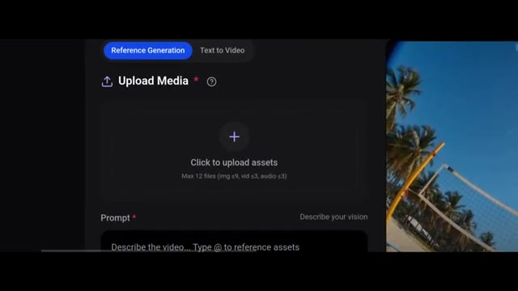
*Gros plan sur la zone de téléchargement de médias de Seedance 2.0 indiquant la limite de 12 fichiers maximum.*

---

### ⏱️ `[00:01:50 - 00:02:08]` | Segment #06

**🔊 Audio (Transcription Intégrale Mot pour Mot en Français) :**
> Cela vous donne beaucoup plus de contrôle sur l'apparence de votre vidéo finale. Elle dispose également d'une option de première et dernière image, ce qui est assez explicite. Vous pouvez télécharger une image de départ et une image de fin, et le modèle générera une transition fluide entre elles. Et puis vous avez aussi la classique option texte-vers-vidéo.

**👁️ Analyse Visuelle d'Écran (gemini-3.5-flash-lite) :**
**Interface & Outils** : Interface web de Seedance 2.0 AI Video Generator sur XMK.com avec un panneau de génération par référence et un lecteur vidéo de prévisualisation.

**Contenu textuel & Code** : Titre : "Seedance 2.0 AI Video Generator". Sous-titre : "Supports text, image, audio, and video references with precise motion, consistency, and immersive audio-visual output." Onglets : "Reference Generation", "Text to Video". Bouton : "Upload Media" avec "Click to upload assets". Champ de texte prompt : "Describe the video... Type @ to reference assets". Aperçu vidéo avec légende : "Cinematic Creation".

**Action / Démonstration** : Navigation et présentation de l'interface de génération vidéo de Seedance 2.0, montrant les zones de téléchargement de médias et les options de prompt textuel.

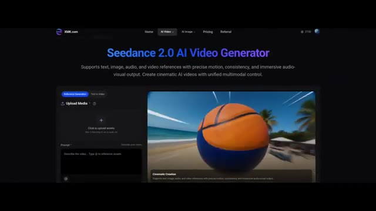
*Interface du générateur de vidéo par IA Seedance 2.0 sur le site XMK.com, affichant les options de téléchargement de médias et un aperçu vidéo.*

---

### ⏱️ `[00:02:09 - 00:02:27]` | Segment #07

**🔊 Audio (Transcription Intégrale Mot pour Mot en Français) :**
> Donc maintenant, allons-y pour créer quelques vidéos et voir cela en action. D'abord, essayons l'option texte-vers-vidéo. Ici, j'ai collé mon prompt. Comme vous pouvez le voir, il y a deux versions de C-Dance 2 disponibles, Fast et Pro. Je choisis le modèle Pro. Vous pouvez également sélectionner différents formats d'image selon vos besoins.

**👁️ Analyse Visuelle d'Écran (gemini-3.5-flash-lite) :**
**Interface & Outils** : Interface web de Seedance 2.0 AI Video Generator (XMK.com).

**Contenu textuel & Code** : Texte : "Seedance 2.0 AI Video Generator", champ de prompt avec un texte descriptif d'une ville américaine au coucher du soleil, options de modèle ("Seedance 2.0 Fast"), format d'image ("16:9"), curseur de durée (réglé sur 5s), et bouton "GENERATE".

**Action / Démonstration** : Le créateur montre l'interface de génération texte-vers-vidéo, survole les options de modèle et de format, et affiche un exemple de rendu vidéo à droite.

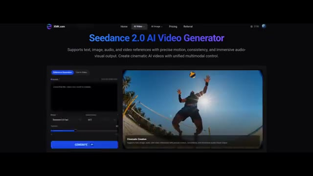
*Interface de Seedance 2.0 AI Video Generator sur le site XMK.com, montrant la section de génération avec un aperçu vidéo de volley-ball.*

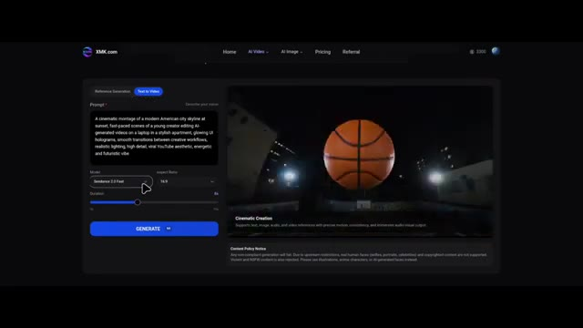
*Interface de Seedance 2.0 montrant le champ de prompt textuel rempli et les options de sélection du modèle (Seedance 2.0 Fast) et du format 16:9.*

---

### ⏱️ `[00:02:28 - 00:02:49]` | Segment #08

**🔊 Audio (Transcription Intégrale Mot pour Mot en Français) :**
> Je choisis le 16 par 9. Vous pouvez générer des vidéos de 4 secondes jusqu'à 15 secondes. Maintenant, une chose importante. La version Pro coûte 120 crédits pour une vidéo de 15 secondes, et la version Fast coûte 64 crédits. De plus, cela peut prendre un certain temps pour générer votre vidéo, car C-Dance 2 est très demandé dans le monde entier.

**👁️ Analyse Visuelle d'Écran (gemini-3.5-flash-lite) :**
**Interface & Outils** : Interface web de la plateforme XMK.com (génération de vidéo par IA) avec menu de navigation (Home, AI Video, AI Image, Pricing, Referral) et solde de crédits (3300).

**Contenu textuel & Code** : On peut lire le prompt textuel : "A cinematic montage of a modern American city skyline at sunset...". Paramètres visibles : Modèle réglé sur "Seedance 2.0 Pro", Aspect Ratio sur "16:9", curseur de durée (Duration) réglé sur 9s, et un bouton bleu "GENERATE 120".

**Action / Démonstration** : Le curseur de la souris survole le bouton "GENERATE" ou manipule les options de format d'image et de durée dans l'interface de génération.

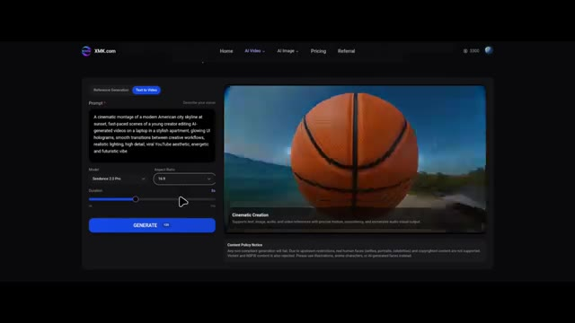
*Interface du site web XMK.com montrant les paramètres de génération vidéo avec le modèle Seedance 2.0 Pro, le format 16:9 et un curseur de durée.*

---

### ⏱️ `[00:02:50 - 00:03:09]` | Segment #09

**🔊 Audio (Transcription Intégrale Mot pour Mot en Français) :**
> Et voici le résultat. Regardez le niveau de détail.

**👁️ Analyse Visuelle d'Écran (gemini-3.5-flash-lite) :**
**Interface & Outils** : Application mobile affichée sur l'écran d'un smartphone.

**Contenu textuel & Code** : Icône rouge d'une cloche avec des ondes sonores concentriques à l'intérieur d'une interface d'application mobile, ainsi qu'une vue de synthèse générée par IA représentant une ville dévastée par les flammes.

**Action / Démonstration** : Présentation du résultat généré par l'IA à l'écran, alternant entre un plan rapproché sur une application mobile et un plan large d'une ville en feu.

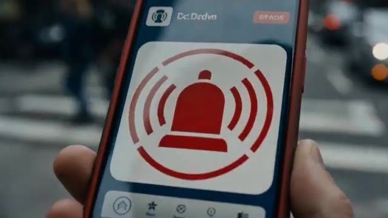
*Un smartphone tenu à la main affichant une application avec une icône de cloche rouge sur fond blanc.*

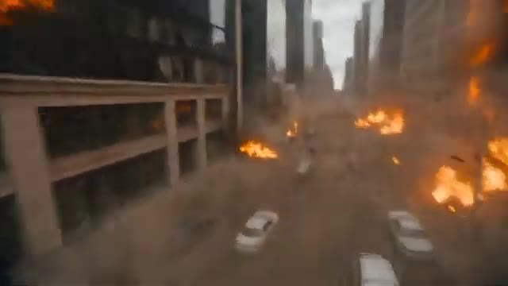
*Vue aérienne montrant une rue urbaine en ruines avec des bâtiments endommagés et des voitures incendiées.*

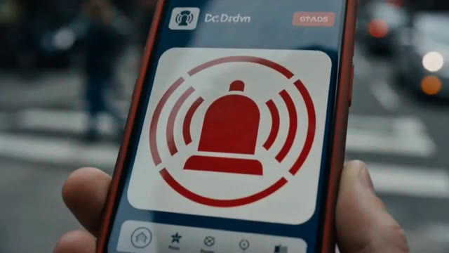
*Gros plan du même smartphone affichant l'application avec l'icône de cloche rouge.*

---

### ⏱️ `[00:03:09 - 00:03:28]` | Segment #10

**🔊 Audio (Transcription Intégrale Mot pour Mot en Français) :**
> Franchement, aucun autre modèle ne fait ça en ce moment. Même VO 3.1 a du mal à égaler cela. L'alerte sur le téléphone, l'explosion, la façon dont les effets se propagent dans la ville. C'est incroyable. Et la synchronisation audio est également parfaite. Maintenant, cette fois, j'utilise un prompt beaucoup plus complexe et délicat.

**👁️ Analyse Visuelle d'Écran (gemini-3.5-flash-lite) :**
**Interface & Outils** : Interface web de l'outil XMK.com avec panneau de prompt, paramètres de modèle (Seedance 2.5 Pro) et lecteur vidéo.

**Contenu textuel & Code** : Texte visible dans le champ de prompt : "[Camera & Style] 10-second ultra-cinematic, hyper-realistic first-person POV of a frantically flying bee. Single continuous shot, constant Dutch angle. Extreme macro fisheye lens..." avec les paramètres de modèle Seedance 2.5 Pro et un ratio de 16:9.

**Action / Démonstration** : Le créateur présente des exemples de rendus vidéo générés par intelligence artificielle, puis bascule sur l'interface de l'outil de génération pour tester un prompt complexe.

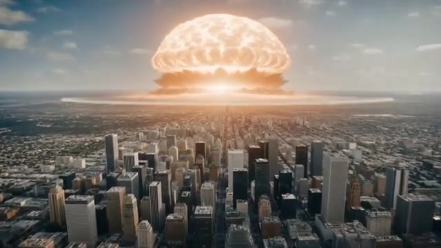
*Rendu vidéo généré par IA montrant une immense explosion nucléaire au-dessus d'une ville avec des gratte-ciels.*

*Rendu vidéo montrant des personnes marchant dans la rue en contre-jour avec une forte lumière vive.*

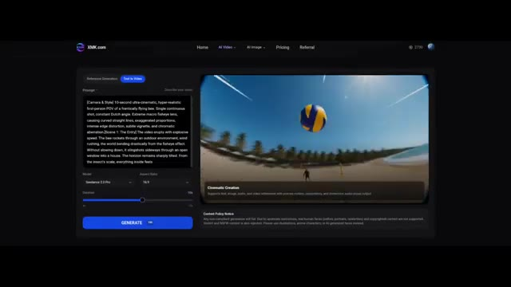
*Interface de l'outil XMK.com affichant un prompt textuel complexe et une vidéo en cours de lecture avec une balle de volley-ball.*

---

### ⏱️ `[00:03:29 - 00:03:48]` | Segment #11

**🔊 Audio (Transcription Intégrale Mot pour Mot en Français) :**
> Voyons voir s'il peut gérer ça. Et voici le résultat. Regardez ça ! C'est dingue ! Aucun autre modèle ne produit ce niveau de détail.

**👁️ Analyse Visuelle d'Écran (gemini-3.5-flash-lite) :**
**Interface & Outils** : Démonstration vidéo générée par intelligence artificielle (modèle de génération vidéo avancé).

**Contenu textuel & Code** : Génération de vidéo ultra-réaliste avec effet de lentille grand angle / caméra subjective (POV) suivant une abeille en mouvement rapide à l'extérieur et à l'intérieur d'une maison.

**Action / Démonstration** : Lecture d'une séquence vidéo générée par IA montrant un mouvement de caméra ultra-rapide et immersif.

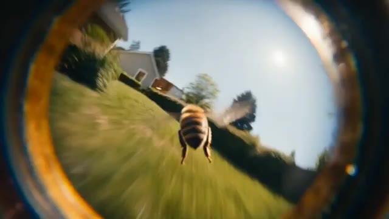
*Vue en gros plan à l'intérieur d'un tuyau ou tube, montrant une abeille volant à l'extérieur au-dessus d'une pelouse avec des maisons en arrière-plan.*

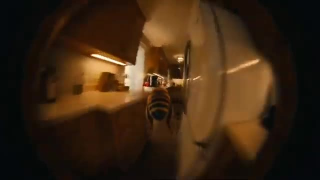
*Poursuite de la vidéo montrant l'abeille volant à travers un couloir sombre ou l'intérieur d'une maison près d'un réfrigérateur.*

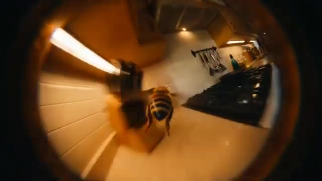
*L'abeille continue sa trajectoire de vol dynamique à l'intérieur d'une cuisine équipée.*

---

### ⏱️ `[00:03:49 - 00:04:21]` | Segment #12

**🔊 Audio (Transcription Intégrale Mot pour Mot en Français) :**
> Le mouvement du miel est fluide, sans saccades, sans artefacts bizarres, et même le son des ailes est parfaitement synchronisé. Maintenant, essayons quelque chose d'amusant, puisque C-Dance 2 peut également générer de l'audio. J'utilise cette image et un simple prompt. Et voici le résultat. Des burgers délicieux. Un incontournable.

**👁️ Analyse Visuelle d'Écran (gemini-3.5-flash-lite) :**
**Interface & Outils** : Interface web de génération vidéo (Seedance 2.0 Fast / XMK.com) avec options de modèle, ratio (16:9), durée et bouton de génération bleu.

**Contenu textuel & Code** : Prompt visible dans l'interface : "The character in the painting @Image1 has a guilty expression, eyes darting left and right before leaning out of the frame..." avec le texte publicitaire final "Delicious Burgers, A Must-Try!".

**Action / Démonstration** : Démonstration successive d'une génération vidéo d'abeille, de l'interface de configuration de Seedance, de l'image source de départ, et du résultat animé final avec sous-titres et audio.

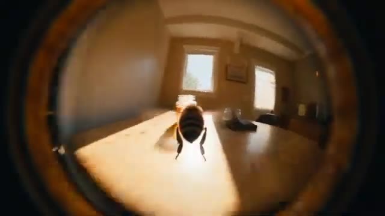
*Gros plan en caméra subjective (effet œil-de-bœuf) d'une abeille s'approchant d'un pot de miel posé sur une table en bois.*

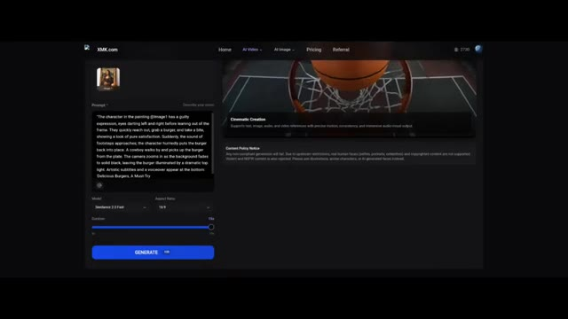
*Interface Web de l'outil de génération vidéo XMK.com (Seedance 2.0 Fast) avec champ de prompt textuel et aperçu d'un panneau de basket.*

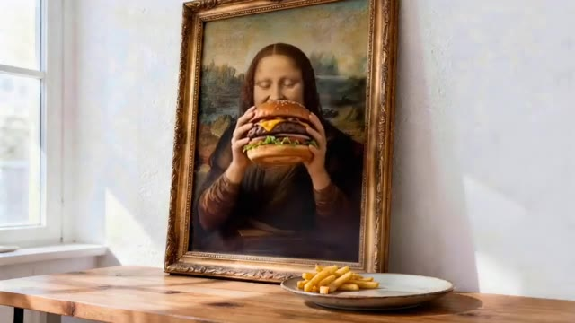
*Image source utilisée pour la génération, représentant un tableau encadré de type Mona Lisa posé sur une table en bois, tenant un gros burger avec des frites à côté.*

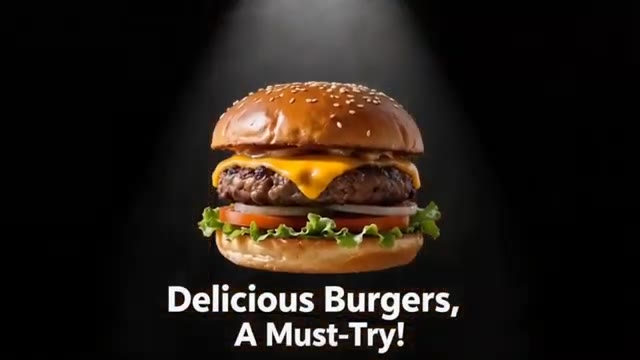
*Rendu final montrant un burger appétissant sur fond noir avec un éclairage zénithal, accompagné du texte sous-titré "Delicious Burgers, A Must-Try!".*

---

### ⏱️ `[00:04:21 - 00:04:42]` | Segment #13

**🔊 Audio (Transcription Intégrale Mot pour Mot en Français) :**
> Regardez ça. La fille bouge ses yeux, mange le burger, le remet sur l'assiette, et puis bouge ses yeux à nouveau. Ça a l'air tellement naturel. Maintenant, la plateforme que j'utilise pour accéder à Seedance 2 est xmk.com. Ici, vous pouvez également accéder à différentes versions de Seedance, ainsi qu'à d'autres modèles et outils de génération de vidéo par IA.

**👁️ Analyse Visuelle d'Écran (gemini-3.5-flash-lite) :**
**Interface & Outils** : Le site web xmk.com affichant l'interface de Seedance 2.0 AI Video Generator avec des onglets de navigation (Home, AI Video, AI Image, Pricing, Referral) et des sous-menus pour Seedance (Seedance AI, Seedance 2.0 Pro, Seedance 1.5 Pro, Seedance 1.0 Pro, etc.).

**Contenu textuel & Code** : Texte affiché sur la page : "Seedance 2.0 AI Video Generator" et "Supports text, image, audio, and video references with precise motion, consistency, and immersive audio-visual output. Create cinematic AI videos with unified multimodal control." Dans l'image 2, le texte incrusté est "Delicious Burgers, A Must-Try!".

**Action / Démonstration** : Le créateur montre des exemples de vidéos générées par IA (Mona Lisa mangeant un burger, un homme interagissant avec des burgers géants), puis navigue sur le site xmk.com pour présenter l'interface de Seedance 2.0.

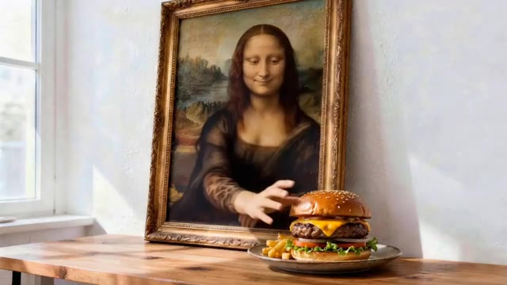
*Démonstration vidéo générée par IA montrant Mona Lisa animée interagissant avec un burger posé sur une table.*

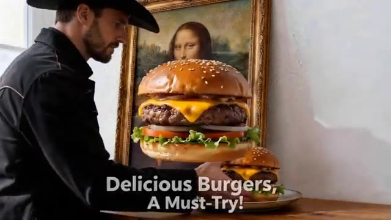
*Démonstration vidéo de Seedance 2 montrant un homme coiffé d'un chapeau de cowboy interagissant avec de gros burgers, avec le texte "Delicious Burgers, A Must-Try!" affiché en bas.*

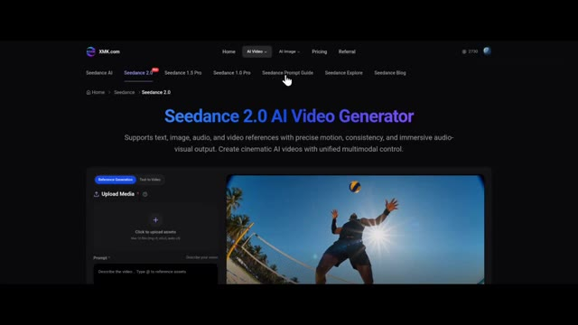
*Capture d'écran de la plateforme web xmk.com affichant l'interface du générateur de vidéo Seedance 2.0 AI Video Generator.*

---

### ⏱️ `[00:04:42 - 00:05:01]` | Segment #14

**🔊 Audio (Transcription Intégrale Mot pour Mot en Français) :**
> Et si vous ne savez pas comment rédiger des prompts, ils fournissent également un guide de prompts C-Dance, ce qui vous aide à obtenir de meilleurs résultats. Inversement, vous pouvez également consulter les tarifs ici. Choisissez simplement un forfait qui correspond à vos besoins, achetez des crédits et obtenez un accès anticipé à C-Dance 2. C'est tout pour cette vidéo. Maintenant, c'est à votre tour d'essayer.

**👁️ Analyse Visuelle d'Écran (gemini-3.5-flash-lite) :**
**Interface & Outils** : Site web XMK.com (plateforme d'IA génératrice multimédia).

**Contenu textuel & Code** : Textes visibles : "Seedance 2.0 AI Video Generator", "Premium Plans & Pricing of XMK AI Platform", "Base $9.9", "Pro $29.9", "Ultimate $49.9", "Creator $99.9", "XMK is your Ai eXtreme Media Kit. Try it now on XMK.com", "Free Try Seedance 2.0".

**Action / Démonstration** : Navigation sur le site web de XMK, visualisation des guides, des tarifs et de la page d'accueil de fin de vidéo.

*Page web du générateur de vidéo Seedance 2.0 sur la plateforme XMK.com montrant le menu des options et un exemple vidéo.*

*Page des tarifs et abonnements (Pricing) de la plateforme XMK.com avec quatre forfaits différents (Base, Pro, Ultimate, Creator).*

*Page d'accueil finale de XMK.com invitant les utilisateurs à essayer Seedance 2.0 gratuitement avec un arrière-plan marin agité.*

---

### ⏱️ `[00:05:01 - 00:05:23]` | Segment #15

**🔊 Audio (Transcription Intégrale Mot pour Mot en Français) :**
> Et si vous avez trouvé cela utile, assurez-vous de vous abonner. Parce que l'IA évolue rapidement, et vous ne voulez pas vous faire distancer. C-Dance 2.0 est maintenant sur XMK.com. C'est plus rapide, plus puissant, et conçu pour la création de vidéos IA cinématiques. Vous pouvez ainsi créer des scènes époustouflantes en quelques secondes. Rendez-vous sur xmk.com et obtenez CDance 2.0, ainsi que tous les principaux modèles d'IA, et commencez à créer sans limites.

**👁️ Analyse Visuelle d'Écran (gemini-3.5-flash-lite) :**
**Interface & Outils** : Site web XMK.com et extraits de démonstration vidéo générés par Seedance 2.0.

**Contenu textuel & Code** : Texte affiché sur le site web : "XMK is your Ai eXtreme Media Kit. Try it now on XMK.com" et "Free Try Seedance 2.0", ainsi que le titre "SEEEDANCE 2.0" et la mention "AI 生成" (Généré par IA).

**Action / Démonstration** : Présentation promotionnelle du site web XMK.com et démonstration de clips vidéo cinématiques générés par Seedance 2.0.

*Capture d'écran du site web XMK.com affichant l'interface de présentation avec un fond de cascade et le bouton d'essai gratuit de Seedance 2.0.*

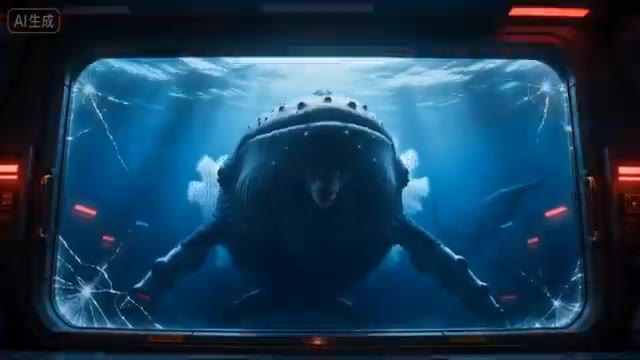
*Scène cinématique générée par IA montrant une grande créature sous-marine derrière une vitre renforcée fissurée.*

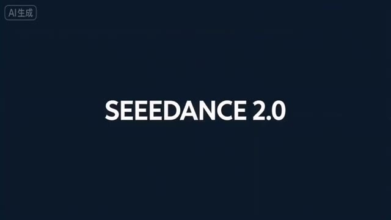
*Écran de titre affichant le texte "SEEEDANCE 2.0" sur fond sombre avec la mention "AI 生成" en haut à gauche.*

---
