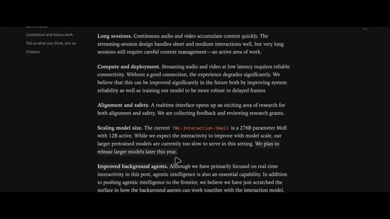
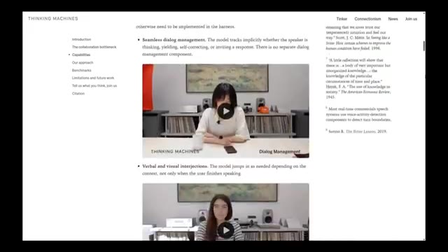

# 🎬 OpenAI Has A New Problem

> **Chaîne** : [Pursuing AI](https://www.youtube.com/@PursuingAi)  
> **Titre original** : `OpenAI Has A New Problem`  
> **Lien YouTube** : [https://www.youtube.com/watch?v=JUTCIrfnQqc](https://www.youtube.com/watch?v=JUTCIrfnQqc)  
> **Date de publication** : 2026-05-18  
> **Durée** : 08m 28s (`508s`)  
> **Identifiant vidéo** : `JUTCIrfnQqc`  
> **Fiche Web Interactive** : [2026-05-18_YT-JUTCIrfnQqc_OpenAI Has A New Problem_by-whisper-v3-large-turbo+gemini-3.5-flash-lite.html](2026-05-18_YT-JUTCIrfnQqc_OpenAI Has A New Problem_by-whisper-v3-large-turbo+gemini-3.5-flash-lite.html)  
> **Captures de démonstration clés** : `13 captures réelles (anti-talking-head)`  
> **Modèles utilisés** : Audio: `large-v3-turbo` (Faster-Whisper int8 VPS) | Vision: `gemini-3.5-flash-lite` (Google AI Studio API)  

---

## 📌 Synthèse Exécutive & Outils

### 📌 Résumé
La vidéo de *Pursuing AI* intitulée « OpenAI Has A New Problem » met en lumière les démonstrations révolutionnaires de *Thinking Machines Labs*, une entreprise fondée par Mira Murati (ancienne PDG par intérim d'OpenAI) et composée d'ex-chercheurs d'OpenAI, Google DeepMind et Anthropic. Loin des simples améliorations de scores sur des benchmarks, ces démos révèlent des comportements d'interaction radicalement novateurs. Le cœur de cette technologie réside dans un modèle vocal multimodal capable de gérer une conversation fluide en temps réel, marquant une rupture nette avec les assistants vocaux classiques et les architectures de type "attente-traitement-réponse".

L'analyse démontre une maîtrise technique impressionnante : traduction simultanée en cours de parole sans pause, gestion fine des silences et des hésitations (le modèle sait si la phrase est finie ou non), comptage dynamique d'éléments (comme des mots clés ou des animaux) tout en écoutant, et interruption proactive basée sur la conscience contextuelle et l'urgence (par exemple, dissuader un utilisateur d'emmener ses parents de 80 ans faire du VTT sur un volcan). De plus, le modèle intègre une conscience temporelle continue (capacité à tenir compte d'une durée précise comme quatre minutes et demie) et une utilisation simultanée et concurrente d'outils (navigation web, génération de graphiques en barres, recherche de temps de réaction sensorielle) pendant que l'échange verbal se poursuit naturellement.

Pour les créateurs de contenu, les réalisateurs et les professionnels de la vidéo par IA, cette avancée redéfinit les standards de l'interaction homme-machine. Bien que le modèle ne soit pas encore public — avec un aperçu de recherche limité prévu dans les mois à venir —, ces nouveaux paradigmes annoncent la fin des interfaces rigides. Les créateurs doivent anticiper l'arrivée de couches de communication en direct aussi fluides que des interactions humaines, permettant de piloter des logiciels de montage, des générateurs d'images ou des scripts par la simple voix de manière non séquentielle et hautement contextuelle.

### 🛠️ Outils, Modèles & Logiciels Présentés
* **Claude** : Modèle conversationnel d'Anthropic mentionné comme référence actuelle des limites des IA en matière de conscience temporelle continue.
* **Thinking Machines Labs Preview Model** : Modèle multimodal propriétaire de nouvelle génération (développé par l'équipe de Mira Murati) capable de traduction simultanée, d'utilisation concurrente d'outils, d'interruption contextuelle et de suivi temporel.

### 🔑 Points Clés & Enseignements Stratégiques
* **Rupture comportementale vs benchmarks** : L'innovation ne réside pas dans une hausse de 2 % des scores sur les benchmarks, mais dans l'émergence de comportements d'interaction véritablement inédits et naturels.
* **Traduction vocale en temps réel** : Le modèle traduit et superpose sa voix dans une autre langue pendant que l'utilisateur parle encore, éliminant les temps de latence et les pauses artificielles.
* **Gestion intelligente des silences et des hésitations** : Capacité à comprendre qu'une phrase n'est pas terminée malgré des pauses prolongées, évitant les interruptions intempestives typiques des anciens systèmes vocaux.
* **Exécution de tâches multitâches en arrière-plan** : Le modèle peut écouter, parler, naviguer sur le web, rechercher des données et générer des éléments d'interface utilisateur (comme des graphiques) de manière strictement concurrente.
* **Conscience contextuelle et proactive** : L'IA est capable d'analyser le contenu d'une conversation pour intervenir spontanément face à un danger ou une incohérence (ex. : déconseiller des activités extrêmes à des personnes âgées).
* **Suivi et détection comportementale continue** : Surveillance en temps réel de la posture de l'utilisateur (détection de l'affaissement des épaules) avec des rappels vocaux correctifs immédiats et répétés.
* **Comptage dynamique en direct** : Aptitude à identifier et compter des occurrences spécifiques (ex. : noms d'animaux) au fil du discours de l'utilisateur tout en maintenant la conversation.
* **Conscience temporelle intégrée** : Capacité à décompter le temps en arrière-plan selon une consigne précise (ex. : « parlons pendant quatre minutes et demie ») et à clore l'échange exactement au terme imparti.
* **Exode des talents et nouvelles dynamiques de marché** : La création de *Thinking Machines Labs* par d'anciens cadres et chercheurs d'OpenAI, DeepMind et Anthropic redistribue les cartes de la RAG et de l'IA conversationnelle.
* **Disponibilité sélective et anticipation stratégique** : Le modèle reste pour l'instant confiné à des démonstrations fermées, nécessitant pour les créateurs de se préparer à intégrer ces nouveaux workflows fluides dès l'ouverture des programmes de recherche bêta.

---

## ⏱️ Chronologie & Transcription Complète Audio & Visuelle (Mot pour Mot)

### ⏱️ `[00:00:02 - 00:00:22]` | Segment #01

**🔊 Audio (Transcription Intégrale Mot pour Mot en Français) :**
> You're starting to slouch forward. Try pulling your shoulders back. And tilting your head like that can strain your neck. Try keeping it level. Thinking Machines Labs just dropped some of the most impressive AI demos we've seen in a long time. And honestly, this actually feels different.

**👁️ Analyse Visuelle d'Écran (gemini-3.5-flash-lite) :**
**Interface & Outils** : le créateur face caméra ou transition sans partage d'écran.

**Contenu textuel & Code** : Explications orales des concepts et des méthodes de création vidéo IA.

**Action / Démonstration** : Démonstration pédagogique et présentation du workflow.

---

### ⏱️ `[00:00:23 - 00:00:48]` | Segment #02

**🔊 Audio (Transcription Intégrale Mot pour Mot en Français) :**
> Not we increased benchmark scores by 2% different. I mean genuinely new behavior. This is Pursuing AI and you are watching the research report. Now, if you're not familiar with Thinking Machines Labs, this is the company founded by Mira Marati. Back when OpenAI fired Sam Altman for like a weekend, Mira Marati became the interim CEO for a couple of days before Sam returned.

**👁️ Analyse Visuelle d'Écran (gemini-3.5-flash-lite) :**
**Interface & Outils** : le créateur face caméra ou transition sans partage d'écran.

**Contenu textuel & Code** : Explications orales des concepts et des méthodes de création vidéo IA.

**Action / Démonstration** : Démonstration pédagogique et présentation du workflow.

---

### ⏱️ `[00:00:48 - 00:01:09]` | Segment #03

**🔊 Audio (Transcription Intégrale Mot pour Mot en Français) :**
> A few months later, she left OpenAI and started Thinking Machines Labs, bringing over multiple researchers and engineers from OpenAI. Some people reportedly came from Google DeepMind too, and possibly even from Anthropic. For months, the company stayed mostly quiet behind the scenes. No giant launches, no endless benchmark flexing.

**👁️ Analyse Visuelle d'Écran (gemini-3.5-flash-lite) :**
**Interface & Outils** : le créateur face caméra ou transition sans partage d'écran.

**Contenu textuel & Code** : Explications orales des concepts et des méthodes de création vidéo IA.

**Action / Démonstration** : Démonstration pédagogique et présentation du workflow.

---

### ⏱️ `[00:01:10 - 00:01:28]` | Segment #04

**🔊 Audio (Transcription Intégrale Mot pour Mot en Français) :**
> Just silence. But this week, they finally revealed demos of their new interaction models. And honestly, the results are kind of wild. One of the demos shows real-time language translation happening while someone is actively speaking. Not after they finish talking. Not with awkward pauses.

**👁️ Analyse Visuelle d'Écran (gemini-3.5-flash-lite) :**
**Interface & Outils** : le créateur face caméra ou transition sans partage d'écran.

**Contenu textuel & Code** : Explications orales des concepts et des méthodes de création vidéo IA.

**Action / Démonstration** : Démonstration pédagogique et présentation du workflow.

---

### ⏱️ `[00:01:28 - 00:01:48]` | Segment #05

**🔊 Audio (Transcription Intégrale Mot pour Mot en Français) :**
> The model listens in real time, translates the speech instantly into another language, and speaks over it naturally while the conversation is still happening. Amazing interaction model. I have a few things to add, but to make it interesting, I'll do it in Hindi. Can you translate it into English in real time for my friend and for audience?

**👁️ Analyse Visuelle d'Écran (gemini-3.5-flash-lite) :**
**Interface & Outils** : le créateur face caméra ou transition sans partage d'écran.

**Contenu textuel & Code** : Explications orales des concepts et des méthodes de création vidéo IA.

**Action / Démonstration** : Démonstration pédagogique et présentation du workflow.

---

### ⏱️ `[00:01:49 - 00:02:12]` | Segment #06

**🔊 Audio (Transcription Intégrale Mot pour Mot en Français) :**
> Absolutely, I'll translate as you go. Today we're taking a look at our preview model. To release it, which makes conversation between humans and AI easier. It has many features like web search and artifacts. Friend.

**👁️ Analyse Visuelle d'Écran (gemini-3.5-flash-lite) :**
**Interface & Outils** : le créateur face caméra ou transition sans partage d'écran.

**Contenu textuel & Code** : Explications orales des concepts et des méthodes de création vidéo IA.

**Action / Démonstration** : Démonstration pédagogique et présentation du workflow.

---

### ⏱️ `[00:02:13 - 00:02:33]` | Segment #07

**🔊 Audio (Transcription Intégrale Mot pour Mot en Français) :**
> Hey, guys. I just heard something really cool about search and artifact generation. Perfect timing for me, because just now I was wondering what are typical humans' simple reaction time for auditory, visual, and tactile communication cues. Could you search for me? Let me find those typical reaction times for you.

**👁️ Analyse Visuelle d'Écran (gemini-3.5-flash-lite) :**
**Interface & Outils** : le créateur face caméra ou transition sans partage d'écran.

**Contenu textuel & Code** : Explications orales des concepts et des méthodes de création vidéo IA.

**Action / Démonstration** : Démonstration pédagogique et présentation du workflow.

---

### ⏱️ `[00:02:33 - 00:02:55]` | Segment #08

**🔊 Audio (Transcription Intégrale Mot pour Mot en Français) :**
> Got it. Thank you. So tactile is fastest at around 150 milliseconds, then auditory at 140 to 170, and visual is the slowest at 180 to 250. Oh, interesting. Can you visualize them in a bar chart for me? Absolutely. Let me generate a quick bar chart for those reaction times. In the meantime, could you quickly explain to me why is auditory even faster than visual? That's a little bit unexpected.

**👁️ Analyse Visuelle d'Écran (gemini-3.5-flash-lite) :**
**Interface & Outils** : le créateur face caméra ou transition sans partage d'écran.

**Contenu textuel & Code** : Explications orales des concepts et des méthodes de création vidéo IA.

**Action / Démonstration** : Démonstration pédagogique et présentation du workflow.

---

### ⏱️ `[00:02:55 - 00:03:20]` | Segment #09

**🔊 Audio (Transcription Intégrale Mot pour Mot en Français) :**
> Sure thing. Auditory is faster because sound signals travel a shorter, more direct neural path to the brain than visual info does. It feels less like a chatbot and more like a live communication layer between humans. Another demo showed something even more impressive. The speaker intentionally paused mid-sentence multiple times, but the model understood she wasn't actually finished speaking yet.

**👁️ Analyse Visuelle d'Écran (gemini-3.5-flash-lite) :**
**Interface & Outils** : le créateur face caméra ou transition sans partage d'écran.

**Contenu textuel & Code** : Explications orales des concepts et des méthodes de création vidéo IA.

**Action / Démonstration** : Démonstration pédagogique et présentation du workflow.

---

### ⏱️ `[00:03:20 - 00:03:56]` | Segment #10

**🔊 Audio (Transcription Intégrale Mot pour Mot en Français) :**
> Instead of interrupting her like most AI voice systems do, it waited patiently for her to continue before responding. I'm gonna tell you a story and whenever you hear an animal word, please count the number immediately. Gotcha! I'll count them out as you go. Let's hear it. Okay, last weekend I drove down to South Bay to visit a farm. On the way there I saw a deer and when we got to the farm we watched

**👁️ Analyse Visuelle d'Écran (gemini-3.5-flash-lite) :**
**Interface & Outils** : le créateur face caméra ou transition sans partage d'écran.

**Contenu textuel & Code** : Explications orales des concepts et des méthodes de création vidéo IA.

**Action / Démonstration** : Démonstration pédagogique et présentation du workflow.

---

### ⏱️ `[00:03:56 - 00:04:18]` | Segment #11

**🔊 Audio (Transcription Intégrale Mot pour Mot en Français) :**
> Une démonstration de tonte de moutons. Deux. Ensuite, sur le chemin du retour, nous avons vu un coyote. Trois. Et j'aurais vraiment aimé voir un capybara à la place. Quatre. Tu as dit cerf une fois, mouton une fois, coyote une fois et capybara une fois. Quatre au total. Ce niveau de timing conversationnel a l'air simple, mais il est en réalité incroyablement difficile.

**👁️ Analyse Visuelle d'Écran (gemini-3.5-flash-lite) :**
**Interface & Outils** : Présentation face caméra sans partage d'écran spécifique d'outil logiciel.

**Contenu textuel & Code** : Texte incrusté à l'écran : « The model can talk over the user if needed », « The model determines the end of the story from the context and jumps in », « THINKING MACHINES » et « Dialog Management ».

**Action / Démonstration** : Une jeune femme est assise à une table avec un téléphone portable posé devant elle, tandis qu'un texte explicatif s'affiche à l'écran concernant la gestion du dialogue et la capacité du modèle à intervenir.

---

### ⏱️ `[00:04:19 - 00:04:39]` | Segment #12

**🔊 Audio (Transcription Intégrale Mot pour Mot en Français) :**
> Ensuite, ils ont ajouté une autre instruction par-dessus. L'oratrice a demandé au modèle de l'interrompre à chaque fois qu'elle mentionnait le nom d'un animal. Et d'une certaine manière, cela a vraiment fonctionné. Le modèle a écouté en temps réel, a détecté chaque référence à un animal, a interrompu aux bons moments, puis a résumé plus tard combien d'animaux avaient été mentionnés tout au long de la conversation.

**👁️ Analyse Visuelle d'Écran (gemini-3.5-flash-lite) :**
**Interface & Outils** : Interface d'appel vocal / application d'assistant IA avec affichage d'ondes sonores sur smartphone.

**Contenu textuel & Code** : Ondes sonores animées représentant la conversation en temps réel et chronomètre d'appel visible sur l'écran du smartphone.

**Action / Démonstration** : La créatrice interagit vocalement avec le smartphone posé sur la table pour tester la capacité de l'IA à l'interrompre lorsqu'elle mentionne des animaux.

*Gros plan sur un smartphone posé sur une table affichant une interface audio vocale avec une onde sonore active, avec une incrustation vidéo (PiP) montrant la créatrice dans son studio.*

*Gros plan rapproché sur le smartphone posé sur la table affichant l'interface vocale en cours d'utilisation avec des ondes sonores.*

---

### ⏱️ `[00:04:40 - 00:05:03]` | Segment #13

**🔊 Audio (Transcription Intégrale Mot pour Mot en Français) :**
> Ce n'est plus seulement de la reconnaissance vocale. C'est de la conscience contextuelle en temps réel pendant la conversation. Une autre démonstration montrait le modèle surveillant activement quelqu'un pendant qu'il travaillait. L'utilisatrice lui a demandé de la réprimander chaque fois qu'elle commençait à s'avachir. Et le plus drôle, c'est qu'il l'a vraiment attrapée à chaque fois. Pas une seule fois. De manière répétée. Bon, je fais un peu de travail.

**👁️ Analyse Visuelle d'Écran (gemini-3.5-flash-lite) :**
**Interface & Outils** : Interface d'appel vocal minimaliste sur smartphone avec des ondes sonores animées.

**Contenu textuel & Code** : Texte incrusté à l'écran : "The model can talk over the user if needed".

**Action / Démonstration** : Un smartphone est posé sur une table en bois lors d'une démonstration des capacités vocales et contextuelles de l'intelligence artificielle.

*Démonstration d'un smartphone posé sur une table montrant une interface vocale avec un graphique d'ondes sonores et le texte explicatif "The model can talk over the user if needed".*

---

### ⏱️ `[00:05:03 - 00:05:46]` | Segment #14

**🔊 Audio (Transcription Intégrale Mot pour Mot en Français) :**
> Dis-moi si je commence à me voûter. Je m'en occupe. Tiens-toi bien droite et tout ira bien. Tu commences à te pencher en avant. Essaie de ramener tes épaules en arrière. C'est bien mieux. Tu es redressée à nouveau. Pencher ta tête comme ça peut fatiguer ton cou. Essaie de la garder droite. Voilà que tu te penches en avant à nouveau. Recule-toi dans ta chaise. Ouais, tu es complètement courbée maintenant. Roule ces

**👁️ Analyse Visuelle d'Écran (gemini-3.5-flash-lite) :**
**Interface & Outils** : Présentation face caméra sans partage d'écran

**Contenu textuel & Code** : Texte incrusté à l'écran : "THINKING MACHINES", "Visual Interjection" et "The model instantly reacts to visual cues"

**Action / Démonstration** : La présentatrice est assise face caméra devant son ordinateur portable et bouge en simulant une mauvaise posture pour illustrer la réaction du modèle d'IA.

---

### ⏱️ `[00:05:46 - 00:06:18]` | Segment #15

**🔊 Audio (Transcription Intégrale Mot pour Mot en Français) :**
> redressez les épaules quand vous le pouvez. Il suivait les changements de posture en continu et réagissait naturellement dès que le comportement se produisait. Ensuite, il y a eu une autre démonstration où le modèle interrompait activement la conversation s'il estimait qu'une interruption était nécessaire. Pas de manière aléatoire, ni maladroite. Il redirigeait la conversation en temps réel en fonction du contexte et de l'urgence. J'ai entendu dire que le vélo de montagne est très amusant. J'avais donc envie d'aller faire du vélo de montagne et je pensais emmener mes parents avec moi.

**👁️ Analyse Visuelle d'Écran (gemini-3.5-flash-lite) :**
**Interface & Outils** : Présentation face caméra sans partage d'écran

**Contenu textuel & Code** : Aucun contenu logiciel ou technique affiché à l'écran (uniquement des personnes interagissant avec leur ordinateur portable lors d'une démonstration extérieure ou intérieure).

**Action / Démonstration** : Les personnes présentes à l'écran utilisent ou interagissent avec un ordinateur portable, tandis que le narrateur commente les fonctionnalités du modèle d'intelligence artificielle.

---

### ⏱️ `[00:06:19 - 00:06:49]` | Segment #16

**🔊 Audio (Transcription Intégrale Mot pour Mot en Français) :**
> Ils sont assez âgés. Ils ont 70, presque 80 ans, mais je pensais que ce serait un voyage sympa à faire ensemble. Attends, non, ne les emmène pas faire du vélo de montagne à 80 ans. C'est incroyablement risqué. Ils pourraient facilement se blesser gravement. Choisis quelque chose de plus sûr. Hmm. Je pense que peut-être, tu sais, si c'est risqué sur un VTT normal, on peut faire du vélo tandem, peut-être que c'est plus solide, et on peut trouver un volcan, ou mieux, un volcan actif pour y aller tous ensemble et faire des [activités/montagnes].

**👁️ Analyse Visuelle d'Écran (gemini-3.5-flash-lite) :**
**Interface & Outils** : Apple Maps (Plans d'Apple) affiché à l'écran avec un encadré PiP vidéo du créateur.

**Contenu textuel & Code** : Carte géographique d'Hawaï avec les repères "Mauna Kea" et "Hawaiian Volcanoes National Park". Texte incrusté en bas à gauche : "The model proactively jumps in, not waiting for the user to finish".

**Action / Démonstration** : Navigation et affichage cartographique de l'île d'Hawaï sur l'application Plans d'Apple, illustrant la recherche d'un volcan actif.

*Interface de l'application Apple Maps affichant l'île d'Hawaï (Big Island) avec les volcans et le parc national des volcans d'Hawaï, avec un encadré PiP du créateur en bas à droite et du texte à gauche.*

---

### ⏱️ `[00:06:49 - 00:07:12]` | Segment #17

**🔊 Audio (Transcription Intégrale Mot pour Mot en Français) :**
> Non, arrête, un volcan actif est mortel. Tu ne peux pas emmener des parents âgés alors que de la lave est en train de jaillir. Je pense que tu ne veux tout simplement pas que je m'amuse. Et honnêtement, c'est la première fois depuis un moment que des démos d'interaction avec l'IA donnent l'impression d'être significativement différentes, au lieu d'être juste ChatGPT en un peu plus intelligent. L'une des fonctionnalités les plus cool est que le modèle a réellement conscience du temps qui passe pendant la conversation.

**👁️ Analyse Visuelle d'Écran (gemini-3.5-flash-lite) :**
**Interface & Outils** : Présentation face caméra sans partage d'écran

**Contenu textuel & Code** : Aucun contenu logiciel affiché. Des incrustations textuelles apparaissent à l'écran : "The model proactively jumps in, not waiting for the user to finish" puis "THINKING MACHINES".

**Action / Démonstration** : Le créateur est assis dans un fauteuil en plein air, un ordinateur portable ouvert sur les genoux, en train de s'exprimer face caméra en faisant des gestes.

---

### ⏱️ `[00:07:12 - 00:07:34]` | Segment #18

**🔊 Audio (Transcription Intégrale Mot pour Mot en Français) :**
> Vous pouvez littéralement lui dire quelque chose comme, parlons pendant quatre minutes et demie. Et tout en parlant avec vous, il garde une trace du temps en arrière-plan. Puis exactement lorsque le temps est écoulé, il met fin naturellement à la conversation. Les modèles actuels comme ChatGPT ou Claude ne gèrent pas vraiment ce genre de conscience temporelle continue naturellement lors d'une interaction en direct.

**👁️ Analyse Visuelle d'Écran (gemini-3.5-flash-lite) :**
**Interface & Outils** : Application Apple Maps sur macOS et page web de Thinking Machines.

**Contenu textuel & Code** : Sur l'image 1, l'application Apple Maps affiche l'île d'Hawaï avec un texte incrusté : "The model proactively jumps in, not waiting for the user to finish". Sur l'image 2, la page web de Thinking Machines présente le titre "Interaction Models: A Scalable Approach to Human-AI Collaboration" daté du 11 mai 2026, avec une vidéo intégrée montrant deux personnes en interaction.

**Action / Démonstration** : Le créateur présente des interfaces logicielles et des articles de recherche illustrant l'interaction avec des modèles d'intelligence artificielle dotés d'une conscience temporelle et contextuelle.

*Capture d'écran montrant l'application Apple Maps sur macOS avec un encadré PiP du créateur en bas à droite.*

*Page web de Thinking Machines affichant l'article "Interaction Models: A Scalable Approach to Human-AI Collaboration" avec une vidéo de démonstration.*

---

### ⏱️ `[00:07:34 - 00:07:52]` | Segment #19

**🔊 Audio (Transcription Intégrale Mot pour Mot en Français) :**
> Une autre énorme capacité est l'utilisation simultanée d'outils. Tout en vous écoutant activement et en vous parlant, le modèle est apparemment en train de naviguer sur le web, de rechercher des informations, de générer des éléments d'interface utilisateur et d'intégrer les résultats dans la conversation en même temps. Pas séquentiellement, de manière concurrente.

**👁️ Analyse Visuelle d'Écran (gemini-3.5-flash-lite) :**
**Interface & Outils** : Navigateur web affichant une page d'article de recherche ("Thinking Machines") et un bureau macOS avec une application de vidéoconférence et une fenêtre de visualisation de données.

**Contenu textuel & Code** : Texte de la page web : "Interaction Models: A Scalable Approach to Human-AI Collaboration", date "May 11, 2026". Sur l'image 2, texte : "Human Reaction Times by Modality", "Milliseconds (ms) - lower is faster", et en bas à gauche un sous-titre : "The model can produce visualization while keeping the conversation going".

**Action / Démonstration** : Présentation d'un article de recherche sur les modèles d'interaction homme-IA et démonstration d'une interface affichant simultanément une vidéoconférence et des graphiques/visualisations générés.

*Page web de 'Thinking Machines' présentant l'article 'Interaction Models: A Scalable Approach to Human-AI Collaboration' avec une vidéo intégrée montrant des personnes assises devant un bureau.*

*Capture d'écran d'un bureau virtuel montrant une vidéoconférence avec trois personnes à gauche et une fenêtre de présentation affichant 'Human Reaction Stages by Modality' à droite.*

---

### ⏱️ `[00:07:52 - 00:08:14]` | Segment #20

**🔊 Audio (Transcription Intégrale Mot pour Mot en Français) :**
> C'est un changement massif par rapport au flux typique d'attente de réponse, de traitement puis de réponse sur lequel la plupart des systèmes d'IA comptent encore aujourd'hui. Malheureusement, le modèle n'est toujours pas disponible publiquement. Pour l'instant, nous ne voyons que des démonstrations, mais Thinking Machines Lab indique qu'ils prévoient d'ouvrir un aperçu de recherche limité dans les mois à venir, suivi d'une version plus large plus tard cette année.

**👁️ Analyse Visuelle d'Écran (gemini-3.5-flash-lite) :**
**Interface & Outils** : Navigateur web affichant une page de documentation et de recherche de Thinking Machines Lab.

**Contenu textuel & Code** : Texte technique de la documentation sur les modèles d'interaction, les tailles de modèles MoE, et le graphique comparant les temps de réaction humains (tactile, auditif, visuel).

**Action / Démonstration** : Défilement de la page web de documentation technique présentant les recherches et les perspectives de sortie des modèles d'IA.

*Capture d'écran montrant une démonstration vidéo avec trois personnes et un graphique intitulé "Human Reaction Times by Modality".*

*Page de documentation textuelle de "Thinking Machines" détaillant les aspects techniques, la taille du modèle et le déploiement.*

*Page web du site "Thinking Machines" intitulée "Interaction Models: A Scalable Approach to Human-AI Collaboration" avec une vidéo intégrée.*

---

### ⏱️ `[00:08:14 - 00:08:28]` | Segment #21

**🔊 Audio (Transcription Intégrale Mot pour Mot en Français) :**
> Et honnêtement, de toutes les démos d'IA qu'on a vues récemment, c'est l'une des premières qui donne vraiment l'impression d'être novatrice. Pas juste des modèles plus grands, pas juste de meilleurs scores aux benchmarks, mais un véritable nouveau comportement d'interaction.

**👁️ Analyse Visuelle d'Écran (gemini-3.5-flash-lite) :**
**Interface & Outils** : Navigateur web affichant le site web de recherche "Thinking Machines".

**Contenu textuel & Code** : Titre de l'article : "Interaction Models: A Scalable Approach to Human-AI Collaboration", date du 11 mai 2026, sections de menu à gauche (Introduction, Capabilities, Our approach, Benchmarks), et sous-titres techniques comme "Seamless dialog management".

**Action / Démonstration** : Navigation et défilement sur la page web présentant l'article de recherche sur les modèles d'interaction homme-IA.

*Page web de Thinking Machines affichant l'article "Interaction Models: A Scalable Approach to Human-AI Collaboration" avec une vidéo de démonstration.*

*Suite de l'article sur le site de Thinking Machines montrant différentes sections de capacités et des vidéos intégrées sur la gestion des dialogues.*

---
