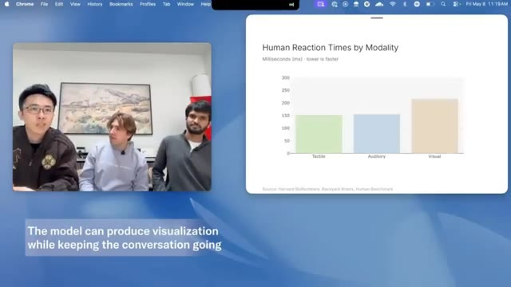
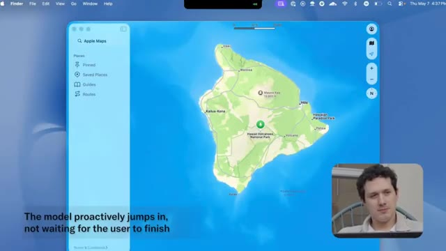
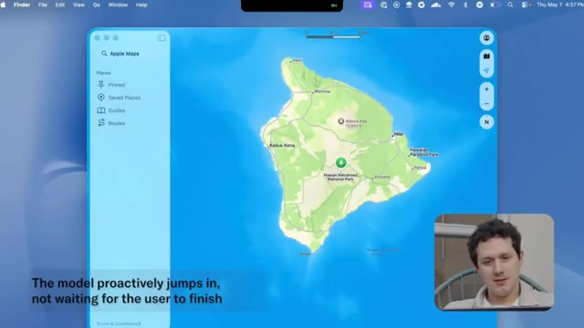
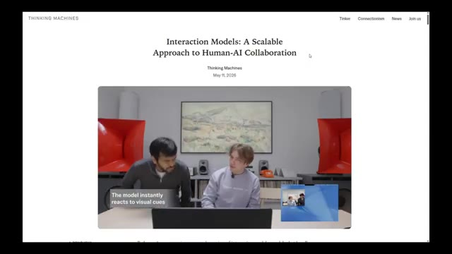
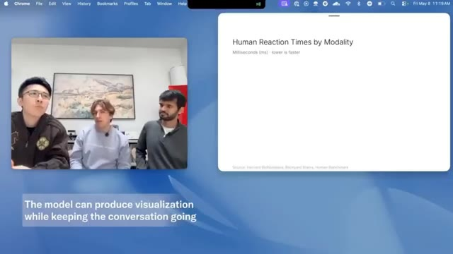
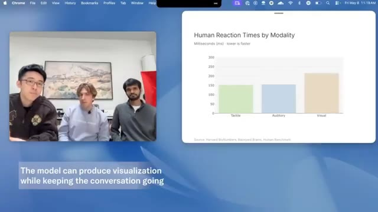
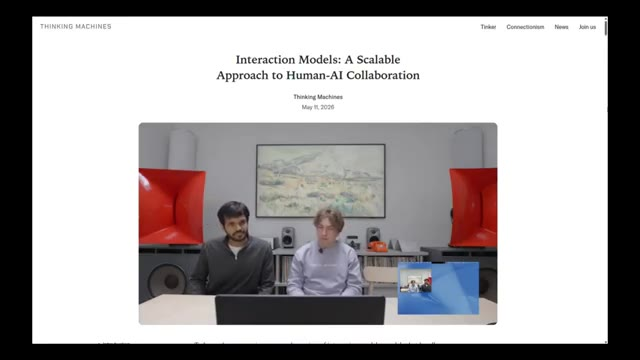

# 🎬 OpenAI Has A New Problem

> **Chaîne** : [Pursuing AI](https://www.youtube.com/@PursuingAi)  
> **Titre original** : `OpenAI Has A New Problem`  
> **Lien YouTube** : [https://www.youtube.com/watch?v=JUTCIrfnQqc](https://www.youtube.com/watch?v=JUTCIrfnQqc)  
> **Date de publication** : 2026-05-18  
> **Durée** : 08m 28s (`508s`)  
> **Identifiant vidéo** : `JUTCIrfnQqc`  
> **Fiche Web Interactive** : [2026-05-18_YT-JUTCIrfnQqc_OpenAI Has A New Problem_by-whisper-v3-large-turbo+gemini-3.5-flash-lite.html](2026-05-18_YT-JUTCIrfnQqc_OpenAI Has A New Problem_by-whisper-v3-large-turbo+gemini-3.5-flash-lite.html)  
> **Captures de démonstration clés** : `17 captures réelles (anti-talking-head)`  
> **Modèles utilisés** : Audio: `large-v3-turbo` (Faster-Whisper int8 VPS) | Vision: `gemini-3.5-flash-lite` (Google AI Studio API)  

---

## 📌 Synthèse Exécutive & Outils

### 📌 Résumé
La vidéo de *Pursuing AI* intitulée « OpenAI Has A New Problem » met en lumière les démonstrations spectaculaires publiées par *Thinking Machines Labs*, une entreprise fondée par Mira Murati (ancienne PDG intérimaire d'OpenAI) et composée d'ex-chercheurs d'OpenAI, de Google DeepMind et d'Anthropic. L'analyse se concentre sur un changement de paradigme fondamental dans l'interaction homme-machine : il ne s'agit plus d'augmenter marginalement des scores de benchmarks ou d'obtenir un chatbot textuel légèrement plus intelligent, mais d'introduire de nouveaux comportements natifs et temps réel. Les démos présentées s'affranchissent des temps de latence traditionnels et des interruptions maladroites pour proposer une véritable conscience contextuelle et temporelle.

Sur le plan technique, la méthode de présentation repose sur une décennie d'analyse comparative des interfaces conversationnelles, en contrastant les assistants classiques (comme les versions actuelles de ChatGPT ou Claude) avec ces nouveaux modèles d'interaction simultanée. Le créateur décortique une à une des capacités inédites : traduction simultanée incrémentielle sans pause, gestion des suspensions de phrases, comptage en direct d'éléments dans un flux narratif, surveillance posturale continue avec correction proactive, interruptions contextuelles et urgentes initiées par l'IA, ainsi qu'une conscience temporelle précise (capacité à tenir un décompte d'une durée exacte en arrière-plan). L'utilisation concurrente d'outils (recherche web, génération d'artefacts graphiques) pendant le dialogue s'exécute sans bloquer le flux de parole.

Pour les créateurs de contenu, les vidéastes et les développeurs, ces avancées redéfinissent les attentes du public en matière d'interfaces vocales et d'agents conversationnels. L'enseignement majeur réside dans la transition d'un modèle séquentiel (écouter, traiter, répondre) vers un modèle synchrone et multi-tâches concurrent. Bien que le modèle ne soit pas encore disponible publiquement (un aperçu de recherche limité étant prévu pour les prochains mois), cette rupture technologique préfigure des expériences utilisateur ultra-fluidifiées, ouvrant la voie à des assistants capables de s'immiscer naturellement dans le flux de travail créatif, d'interagir en temps réel sans friction et d'apporter une réelle valeur contextuelle immédiate.

### 🛠️ Outils, Modèles & Logiciels Présentés
* **Claude** : Mentionné comme l'un des modèles de référence actuels dotés de limites structurelles quant à la gestion de la conscience temporelle continue et des interactions vocales natives en direct.
* **Flux** : Identifié comme l'un des écosystèmes technologiques et outils de pointe évoqués dans le cadre de l'analyse des innovations en intelligence artificielle.
* **Thinking Machines Labs Preview Model** : Le modèle propriétaire secret présenté dans les démos, capable de traduction instantanée, de gestion fine des silences, de multitâche concurrent et d'interaction vocale en temps réel sans latence.

### 🔑 Points Clés & Enseignements Stratégiques
* **Dépassement des métriques classiques** : Le passage de scores de benchmarks légèrement supérieurs à l'apparition de comportements réellement novateurs constitue la seule vraie révolution perceptible par l'utilisateur final.
* **Traduction vocale incrémentielle** : Capacité à traduire instantanément et à voix haute la parole d'un locuteur *pendant* qu'il s'exprime, sans attendre la fin de sa phrase et sans créer de blancs conversationnels.
* **Gestion intelligente des silences et des hésitations** : Le modèle détecte qu'une phrase est suspendue et non terminée, évitant ainsi d'interrompre intempestivement l'utilisateur comme le font les systèmes vocaux traditionnels.
* **Conscience contextuelle en direct** : Aptitude à écouter une narration, à identifier des entités spécifiques (comme des animaux) à la volée, à compter leur occurrence et à synthétiser les données en temps réel.
* **Capacité d'interruption proactive par l'IA** : Le modèle peut couper la parole de l'utilisateur de manière pertinente et contextuelle lorsqu'il détecte un danger ou une incohérence évidente dans la discussion (ex: projet de VTT extrême pour des octogénaires).
* **Surveillance ergonomique et comportementale continue** : L'IA analyse en continu des flux (visuels ou audio) pour corriger proactivement la posture de l'utilisateur (comme le fait de se voûter) de façon répétée et naturelle.
* **Conscience temporelle intégrée** : Capacité à suivre précisément le temps écoulé en arrière-plan pendant une discussion et à mettre fin naturellement à la conversation exactement au terme de la durée impartie (ex: 4 minutes et demie).
* **Exécution concurrente des outils** : Contrairement aux flux séquentiels habituels (attendre la réponse, puis chercher), le modèle navigue sur le web, cherche des informations et génère des interfaces graphiques *en même temps* qu'il soutient la conversation.
* **Fluidité de l'interaction humaine** : L'illusion d'un chatbot disparaît au profit d'une couche de communication fluide, se rapprochant d'un échange direct entre humains.
* **Stratégie de lancement maîtrisée** : Le choix d'un silence absolu sans "flex" de benchmarks, suivi de la diffusion de démos percutantes, crée une attente maximale sur le marché face aux géants en place.

---

## ⏱️ Chronologie & Transcription Complète Audio & Visuelle (Mot pour Mot)

### ⏱️ `[00:00:02 - 00:00:22]` | Segment #01

**🔊 Audio (Transcription Intégrale Mot pour Mot en Français) :**
> You're starting to slouch forward. Try pulling your shoulders back. And tilting your head like that can strain your neck. Try keeping it level. Thinking Machines Labs just dropped some of the most impressive AI demos we've seen in a long time. And honestly, this actually feels different.

**👁️ Analyse Visuelle d'Écran (gemini-3.5-flash-lite) :**
**Interface & Outils** : le créateur face caméra ou transition sans partage d'écran.

**Contenu textuel & Code** : Explications orales des concepts et des méthodes de création vidéo IA.

**Action / Démonstration** : Démonstration pédagogique et présentation du workflow.

---

### ⏱️ `[00:00:23 - 00:00:48]` | Segment #02

**🔊 Audio (Transcription Intégrale Mot pour Mot en Français) :**
> Not we increased benchmark scores by 2% different. I mean genuinely new behavior. This is Pursuing AI and you are watching the research report. Now, if you're not familiar with Thinking Machines Labs, this is the company founded by Mira Marati. Back when OpenAI fired Sam Altman for like a weekend, Mira Marati became the interim CEO for a couple of days before Sam returned.

**👁️ Analyse Visuelle d'Écran (gemini-3.5-flash-lite) :**
**Interface & Outils** : le créateur face caméra ou transition sans partage d'écran.

**Contenu textuel & Code** : Explications orales des concepts et des méthodes de création vidéo IA.

**Action / Démonstration** : Démonstration pédagogique et présentation du workflow.

---

### ⏱️ `[00:00:48 - 00:01:09]` | Segment #03

**🔊 Audio (Transcription Intégrale Mot pour Mot en Français) :**
> A few months later, she left OpenAI and started Thinking Machines Labs, bringing over multiple researchers and engineers from OpenAI. Some people reportedly came from Google DeepMind too, and possibly even from Anthropic. For months, the company stayed mostly quiet behind the scenes. No giant launches, no endless benchmark flexing.

**👁️ Analyse Visuelle d'Écran (gemini-3.5-flash-lite) :**
**Interface & Outils** : le créateur face caméra ou transition sans partage d'écran.

**Contenu textuel & Code** : Explications orales des concepts et des méthodes de création vidéo IA.

**Action / Démonstration** : Démonstration pédagogique et présentation du workflow.

---

### ⏱️ `[00:01:10 - 00:01:28]` | Segment #04

**🔊 Audio (Transcription Intégrale Mot pour Mot en Français) :**
> Just silence. But this week, they finally revealed demos of their new interaction models. And honestly, the results are kind of wild. One of the demos shows real-time language translation happening while someone is actively speaking. Not after they finish talking. Not with awkward pauses.

**👁️ Analyse Visuelle d'Écran (gemini-3.5-flash-lite) :**
**Interface & Outils** : le créateur face caméra ou transition sans partage d'écran.

**Contenu textuel & Code** : Explications orales des concepts et des méthodes de création vidéo IA.

**Action / Démonstration** : Démonstration pédagogique et présentation du workflow.

---

### ⏱️ `[00:01:28 - 00:01:48]` | Segment #05

**🔊 Audio (Transcription Intégrale Mot pour Mot en Français) :**
> The model listens in real time, translates the speech instantly into another language, and speaks over it naturally while the conversation is still happening. Amazing interaction model. I have a few things to add, but to make it interesting, I'll do it in Hindi. Can you translate it into English in real time for my friend and for audience?

**👁️ Analyse Visuelle d'Écran (gemini-3.5-flash-lite) :**
**Interface & Outils** : le créateur face caméra ou transition sans partage d'écran.

**Contenu textuel & Code** : Explications orales des concepts et des méthodes de création vidéo IA.

**Action / Démonstration** : Démonstration pédagogique et présentation du workflow.

---

### ⏱️ `[00:01:49 - 00:02:12]` | Segment #06

**🔊 Audio (Transcription Intégrale Mot pour Mot en Français) :**
> Absolutely, I'll translate as you go. Today we're taking a look at our preview model. To release it, which makes conversation between humans and AI easier. It has many features like web search and artifacts. Friend.

**👁️ Analyse Visuelle d'Écran (gemini-3.5-flash-lite) :**
**Interface & Outils** : le créateur face caméra ou transition sans partage d'écran.

**Contenu textuel & Code** : Explications orales des concepts et des méthodes de création vidéo IA.

**Action / Démonstration** : Démonstration pédagogique et présentation du workflow.

---

### ⏱️ `[00:02:13 - 00:02:33]` | Segment #07

**🔊 Audio (Transcription Intégrale Mot pour Mot en Français) :**
> Hey, guys. I just heard something really cool about search and artifact generation. Perfect timing for me, because just now I was wondering what are typical humans' simple reaction time for auditory, visual, and tactile communication cues. Could you search for me? Let me find those typical reaction times for you.

**👁️ Analyse Visuelle d'Écran (gemini-3.5-flash-lite) :**
**Interface & Outils** : le créateur face caméra ou transition sans partage d'écran.

**Contenu textuel & Code** : Explications orales des concepts et des méthodes de création vidéo IA.

**Action / Démonstration** : Démonstration pédagogique et présentation du workflow.

---

### ⏱️ `[00:02:33 - 00:02:55]` | Segment #08

**🔊 Audio (Transcription Intégrale Mot pour Mot en Français) :**
> Compris. Merci. Le tactile est donc le plus rapide à environ 150 millisecondes, puis l'auditif entre 140 et 170, et le visuel est le plus lent, entre 180 et 250. Oh, c'est intéressant. Peux-tu me les visualiser dans un graphique à barres ? Absolument. Laisse-moi générer un graphique à barres rapide pour ces temps de réaction. En attendant, pourrais-tu m'expliquer rapidement pourquoi l'auditif est encore plus rapide que le visuel ? C'est un peu inattendu.

**👁️ Analyse Visuelle d'Écran (gemini-3.5-flash-lite) :**
**Interface & Outils** : Navigateur web affichant un graphique de données statistiques avec une fenêtre de visioconférence intégrée sur le côté gauche.

**Contenu textuel & Code** : Le graphique s'intitule "Human Reaction Times by Modality" avec l'axe des ordonnées en millisecondes (ms) et les barres pour Tactile (~150), Auditory (~150-170), et Visual (~200+).

**Action / Démonstration** : Présentation d'un graphique à barres généré par l'IA en temps réel pendant la discussion.

*Affichage d'un graphique à barres montrant les temps de réaction humains par modalité (Tactile, Auditory, Visual).*

---

### ⏱️ `[00:02:55 - 00:03:20]` | Segment #09

**🔊 Audio (Transcription Intégrale Mot pour Mot en Français) :**
> Bien sûr. L'auditif est plus rapide parce que les signaux sonores empruntent un chemin neural plus court et plus direct vers le cerveau que les informations visuelles. On a moins l'impression de parler à un chatbot et davantage l'impression d'avoir une couche de communication en direct entre humains. Une autre démonstration a montré quelque chose d'encore plus impressionnant. L'oratrice a fait exprès de s'arrêter au milieu de sa phrase à plusieurs reprises, mais le modèle a compris qu'elle n'avait pas réellement fini de parler.

**👁️ Analyse Visuelle d'Écran (gemini-3.5-flash-lite) :**
**Interface & Outils** : Interface logicielle de démonstration avec graphiques comparatifs et interface vocale mobile minimaliste avec visualisation d'ondes sonores.

**Contenu textuel & Code** : Graphique "Human Reaction Times by Modality" avec les valeurs en millisecondes : Tactile (~150ms), Auditory (~150ms), Visual (~210ms). Source : Harvard BioNumbers, Backyard Brains, Human Benchmark. Texte à l'écran : "The model can produce visualization while keeping the conversation going", "THINKING MACHINES", "Dialog Management".

**Action / Démonstration** : Présentation de données statistiques sur la vitesse de perception humaine, suivie d'une démonstration d'interaction vocale avec un smartphone posé sur une table.

*Graphique montrant les temps de réaction humains par modalité (tactile, auditif, visuel) en millisecondes.*

*Gros plan sur un smartphone posé sur une table affichant une interface d'interaction vocale avec une onde sonore active.*

---

### ⏱️ `[00:03:20 - 00:03:56]` | Segment #10

**🔊 Audio (Transcription Intégrale Mot pour Mot en Français) :**
> Au lieu de l'interrompre comme le font la plupart des systèmes vocaux par IA, il a attendu patiemment qu'elle continue avant de répondre. Je vais te raconter une histoire et dès que tu entends un mot d'animal, s'il te plaît, compte le nombre immédiatement. Compris ! Je les compterai au fur et à mesure. Je t'écoute. D'accord, le week-end dernier, je suis descendue à South Bay pour visiter une ferme. Sur le chemin, j'ai vu un cerf et quand nous sommes arrivés à la ferme, nous avons regardé

**👁️ Analyse Visuelle d'Écran (gemini-3.5-flash-lite) :**
**Interface & Outils** : Interface d'assistant vocal sur smartphone avec affichage d'ondes sonores et sous-titres incrustés (Thinking Machines, Dialog Management, The model can talk over the user if needed).

**Contenu textuel & Code** : Textes incrustés à l'écran : « THINKING MACHINES », « Dialog Management », et « The model can talk over the user if needed ». Interface de visualisation audio sur le téléphone.

**Action / Démonstration** : Le smartphone est posé sur la table pendant que le modèle vocal interagit avec l'utilisatrice qui raconte son histoire, démontrant la gestion des interruptions et du dialogue.

*Gros plan sur un smartphone posé sur la table affichant une interface vocale avec une onde sonore active et le texte explicatif « The model can talk over the user if needed ».*

---

### ⏱️ `[00:03:56 - 00:04:18]` | Segment #11

**🔊 Audio (Transcription Intégrale Mot pour Mot en Français) :**
> une démonstration de tonte de moutons. Deux. Ensuite, sur le chemin du retour, nous avons vu un coyote. Trois. Et j'aurais vraiment aimé voir un capybara à la place. Quatre. Tu as dit cerf une fois, mouton une fois, coyote une fois et capybara une fois. Quatre au total. Ce niveau de synchronisation conversationnelle a l'air simple, mais c'est en réalité incroyablement difficile.

**👁️ Analyse Visuelle d'Écran (gemini-3.5-flash-lite) :**
**Interface & Outils** : Présentation face caméra sans partage d'écran

**Contenu textuel & Code** : Texte affiché à l'écran : "The model can talk over the user if needed", "The model determines the end of the story from the context and jumps in", "THINKING MACHINES", "Dialog Management".

**Action / Démonstration** : Une personne est assise à une table avec un téléphone posé devant elle, tandis que du texte s'affiche pour commenter les capacités de gestion du dialogue du modèle d'IA.

---

### ⏱️ `[00:04:19 - 00:04:39]` | Segment #12

**🔊 Audio (Transcription Intégrale Mot pour Mot en Français) :**
> Ensuite, ils ont ajouté une autre instruction par-dessus. L'intervenante a dit au modèle de l'interrompre chaque fois qu'elle mentionnait le nom d'un animal. Et d'une certaine manière, cela a réellement fonctionné. Le modèle a écouté en temps réel, a détecté chaque référence à un animal, a interrompu aux moments corrects, puis a ensuite résumé combien d'animaux avaient été mentionnés tout au long de la conversation.

**👁️ Analyse Visuelle d'Écran (gemini-3.5-flash-lite) :**
**Interface & Outils** : Application d'assistant vocal en temps réel sur smartphone.

**Contenu textuel & Code** : Interface d'appel vocal avec visualisation d'onde sonore et chronomètre ("0:04" puis "0:24").

**Action / Démonstration** : Le smartphone posé à plat sur la table diffuse ou enregistre l'interaction vocale en temps réel, capturant les instructions et les interruptions de l'IA.

*Gros plan sur un smartphone posé sur une table affichant une interface d'assistant vocal, avec en incrustation (PiP) la créatrice assise en studio.*

*Gros plan rapproché sur le smartphone posé sur la table affichant l'interface de l'application vocale avec une onde sonore active.*

---

### ⏱️ `[00:04:40 - 00:05:03]` | Segment #13

**🔊 Audio (Transcription Intégrale Mot pour Mot en Français) :**
> Ce n'est plus seulement de la reconnaissance vocale. C'est de la conscience contextuelle qui se produit en direct pendant le déroulement de la conversation. Une autre démonstration montrait le modèle surveillant activement quelqu'un pendant qu'il travaillait. L'utilisatrice lui a demandé de l'interpeller à chaque fois qu'elle commençait à se voûter. Et le plus drôle, c'est qu'il n'arrêtait pas de la prendre en flagrant délit à chaque fois. Pas une seule fois. De manière répétée. D'accord, je fais un peu de travail.

**👁️ Analyse Visuelle d'Écran (gemini-3.5-flash-lite) :**
**Interface & Outils** : Interface d'appel vocal sur smartphone avec affichage d'ondes audio et texte d'explication.

**Contenu textuel & Code** : Texte à l'écran : « The model can talk over the user if needed ». Affichage d'ondes sonores en mouvement.

**Action / Démonstration** : Un smartphone est posé sur une table en bois tandis qu'une personne interagit vocalement avec l'IA.

*Démonstration d'un smartphone posé sur une table montrant une interface vocale avec des ondes sonores et le texte incrusté 'The model can talk over the user if needed'*

---

### ⏱️ `[00:05:03 - 00:05:46]` | Segment #14

**🔊 Audio (Transcription Intégrale Mot pour Mot en Français) :**
> Dis-moi si je commence à me voûter. Je m'en occupe. Tiens-toi bien droite et tu seras nickel. Tu commences à te pencher en avant. Essaie de ramener tes épaules en arrière. C'est beaucoup mieux. Tu es de nouveau bien droite. Incliner ta tête comme ça peut fatiguer ton cou. Essaie de la garder droite. Voilà que tu te penches en avant à nouveau. Recule-toi dans ta chaise. Ouais, tu es complètement courbée maintenant. Roule ces

**👁️ Analyse Visuelle d'Écran (gemini-3.5-flash-lite) :**
**Interface & Outils** : Présentation face caméra sans partage d'écran

**Contenu textuel & Code** : Texte affiché à l'écran : "THINKING MACHINES", "Visual Interjection" et "The model instantly reacts to visual cues".

**Action / Démonstration** : La présentatrice est assise devant son ordinateur portable dans une pièce, illustrant visuellement une mauvaise posture et se redressant au fil de la discussion.

---

### ⏱️ `[00:05:46 - 00:06:18]` | Segment #15

**🔊 Audio (Transcription Intégrale Mot pour Mot en Français) :**
> redressez les épaules quand vous le pouvez. Il suivait les changements de posture en continu et réagissait naturellement dès que le comportement se produisait. Ensuite, il y a eu une autre démonstration où le modèle interrompait activement la conversation s'il estimait qu'une interruption était nécessaire. Pas au hasard, ni maladroitement. Il redirigeait la conversation en temps réel en fonction du contexte et de l'urgence. J'ai entendu dire que le VTT est très amusant. Je voulais donc faire du VTT et je pensais emmener mes parents avec moi.

**👁️ Analyse Visuelle d'Écran (gemini-3.5-flash-lite) :**
**Interface & Outils** : Présentation face caméra sans partage d'écran

**Contenu textuel & Code** : Aucun contenu logiciel ou interface visible, uniquement des plans de personnes utilisant un ordinateur portable en extérieur ou en intérieur dans le cadre d'une démonstration vidéo contextuelle, avec du texte incrusté à l'écran ("The model instantly reacts to visual cues", "THINKING MACHINES", "Audio Interjection").

**Action / Démonstration** : Le créateur montre des extraits de démonstration d'utilisateurs interagissant avec un modèle d'intelligence artificielle sur ordinateur portable.

---

### ⏱️ `[00:06:19 - 00:06:49]` | Segment #16

**🔊 Audio (Transcription Intégrale Mot pour Mot en Français) :**
> Ils sont assez âgés. Ils ont 70, presque 80 ans, mais je pensais que ce serait un voyage sympa à faire ensemble. Attends, non, ne les emmène pas faire du vélo de montagne à 80 ans. C'est extrêmement risqué. Ils pourraient facilement se blesser gravement. Choisis quelque chose de plus sûr. Hmm. Je pense que peut-être, tu sais, si c'est risqué sur un VTT normal, on peut faire des vélos tandem, peut-être qu'ils sont plus solides, et on peut trouver un volcan, ou mieux, un volcan actif pour y aller tous ensemble et faire des [activités...].

**👁️ Analyse Visuelle d'Écran (gemini-3.5-flash-lite) :**
**Interface & Outils** : Apple Maps sur macOS avec incrustation vidéo (PiP) du créateur.

**Contenu textuel & Code** : Carte géographique de Hawaï montrant notamment "Hawaii Volcanoes National Park" et "Mauna Kea". Texte incrusté en bas à gauche : "The model proactively jumps in, not waiting for the user to finish".

**Action / Démonstration** : Le créateur navigue sur Apple Maps pour chercher une destination (un volcan à Hawaï).

*Interface d'Apple Maps affichant l'île de Hawaï, avec le créateur en incrustation PiP dans le coin inférieur droit et du texte explicatif à l'écran.*

---

### ⏱️ `[00:06:49 - 00:07:12]` | Segment #17

**🔊 Audio (Transcription Intégrale Mot pour Mot en Français) :**
> Non, arrête, un volcan actif est mortel. Tu ne peux pas emmener des parents âgés alors que de la lave est en train de faire éruption. Je pense que tu ne veux tout simplement pas que je m'amuse. Et honnêtement, c'est la première fois depuis un moment où les démos d'interaction avec l'IA donnent l'impression d'être significativement différentes, au lieu d'être juste ChatGPT en un peu plus intelligent. L'une des fonctionnalités les plus cool est que le modèle a réellement conscience du temps qui passe pendant la conversation.

**👁️ Analyse Visuelle d'Écran (gemini-3.5-flash-lite) :**
**Interface & Outils** : Présentation sans partage d'écran (le créateur est assis à l'extérieur avec un ordinateur portable)

**Contenu textuel & Code** : Aucun contenu logiciel ou interface visible

**Action / Démonstration** : Le créateur est assis dans un fauteuil à l'extérieur et s'exprime face caméra avec un ordinateur portable ouvert sur ses genoux

---

### ⏱️ `[00:07:12 - 00:07:34]` | Segment #18

**🔊 Audio (Transcription Intégrale Mot pour Mot en Français) :**
> Vous pouvez littéralement lui dire quelque chose comme, parlons pendant quatre minutes et demie. Et tout en parlant avec vous, il garde une trace du temps en arrière-plan. Puis exactement quand le temps est écoulé, il met fin naturellement à la conversation. Les modèles actuels comme ChatGPT ou Claude ne gèrent pas vraiment ce genre de conscience temporelle continue naturellement lors d'une interaction en direct.

**👁️ Analyse Visuelle d'Écran (gemini-3.5-flash-lite) :**
**Interface & Outils** : Interface macOS (Apple Maps) et page web du site Thinking Machines.

**Contenu textuel & Code** : Sur l'image 1 : Application Apple Maps affichant Hawaï, un encadré PiP du présentateur et le texte "The model proactively jumps in, not waiting for the user to finish". Sur l'image 2 : Titre "Interaction Models: A Scalable Approach to Human-AI Collaboration", date "May 11, 2026", et une vidéo intégrée avec le texte "The model instantly reacts to visual cues".

**Action / Démonstration** : Le créateur montre des exemples d'interfaces et de pages web illustrant les interactions avec les modèles d'IA.

*Interface d'Apple Maps sur macOS avec le présentateur incrusté en bas à droite et le texte descriptif à l'écran.*

*Page web de Thinking Machines affichant l'article "Interaction Models: A Scalable Approach to Human-AI Collaboration" avec une vidéo intégrée montrant deux personnes.*

---

### ⏱️ `[00:07:34 - 00:07:52]` | Segment #19

**🔊 Audio (Transcription Intégrale Mot pour Mot en Français) :**
> Une autre énorme capacité est l'utilisation simultanée d'outils. Tout en vous écoutant activement et en vous parlant, le modèle est apparemment en train de naviguer sur le web, de chercher des informations, de générer des éléments d'interface utilisateur et de réintégrer les résultats dans la conversation en même temps. Pas séquentiellement, de manière concurrente.

**👁️ Analyse Visuelle d'Écran (gemini-3.5-flash-lite) :**
**Interface & Outils** : Navigateur web affichant un article scientifique et une interface de présentation vidéo avec génération dynamique de graphiques.

**Contenu textuel & Code** : Texte du titre : "Interaction Models: A Scalable Approach to Human-AI Collaboration", date "May 11, 2026", et sur l'image 2 un graphique intitulé "Human Reaction Times by Modality (Milliseconds (ms) - lower is faster)". Texte incrusté : "The model can produce visualization while keeping the conversation going".

**Action / Démonstration** : Présentation d'une démonstration de collaboration homme-IA avec génération simultanée de visualisations de données pendant la conversation.

*Page web de Thinking Machines affichant l'article "Interaction Models: A Scalable Approach to Human-AI Collaboration" avec une vidéo de démonstration.*

*Capture d'écran du bureau montrant une interface de visioconférence avec trois participants à gauche et une fenêtre graphique intitulée "Human Reaction Times by Modality" à droite.*

---

### ⏱️ `[00:07:52 - 00:08:14]` | Segment #20

**🔊 Audio (Transcription Intégrale Mot pour Mot en Français) :**
> C'est un changement massif par rapport au flux typique d'attente de réponse, de traitement puis de réponse sur lequel la plupart des systèmes d'IA comptent encore aujourd'hui. Malheureusement, le modèle n'est toujours pas disponible publiquement. Pour l'instant, nous ne voyons que des démonstrations, mais Thinking Machines Lab indique qu'ils prévoient d'ouvrir un aperçu de recherche limité dans les mois à venir, suivi d'une sortie plus large plus tard cette année.

**👁️ Analyse Visuelle d'Écran (gemini-3.5-flash-lite) :**
**Interface & Outils** : Navigateur web affichant un article technique de recherche et des captures de démonstration vidéo.

**Contenu textuel & Code** : Graphique "Human Reaction Times by Modality" (Tactile, Auditory, Visual) et texte technique mentionnant "TML-Interaction-Small is a 276B parameter MoE with 12B active" ainsi que la mention "Thinking Machines".

**Action / Démonstration** : Le curseur de la souris survole ou parcourt la documentation textuelle et la page de présentation du modèle d'interaction.

*Capture d'écran montrant une démonstration vidéo avec trois personnes et un graphique comparant les temps de réaction humains par modalité.*

*Page web de documentation technique listant les sections relatives aux limitations, performances de calcul et à la taille des modèles.*

*Page web intitulée "Interaction Models: A Scalable Approach to Human-AI Collaboration" par Thinking Machines avec une vidéo intégrée.*

---

### ⏱️ `[00:08:14 - 00:08:28]` | Segment #21

**🔊 Audio (Transcription Intégrale Mot pour Mot en Français) :**
> Et honnêtement, de toutes les démos d'IA qu'on a vues récemment, c'est l'une des premières qui donne vraiment une sensation de nouveauté. Pas juste de plus grands modèles, pas juste des scores de benchmarks plus élevés, mais un véritable nouveau comportement d'interaction.

**👁️ Analyse Visuelle d'Écran (gemini-3.5-flash-lite) :**
**Interface & Outils** : Navigateur web affichant le site officiel de Thinking Machines (thinkingmachines.ai) avec des articles de recherche, des titres, des sommaires latéraux et des lecteurs vidéo intégrés.

**Contenu textuel & Code** : Titres visibles : "Interaction Models: A Scalable Approach to Human-AI Collaboration", "Thinking Machines", "May 11, 2026", "Seamless dialog management", "Verbal and visual interjections", ainsi que des menus de navigation et des notes de bas de page académiques.

**Action / Démonstration** : Le navigateur fait défiler la documentation de recherche et les démonstrations vidéo du modèle d'interaction homme-IA.

*Page web de Thinking Machines affichant l'article de recherche 'Interaction Models: A Scalable Approach to Human-AI Collaboration' avec une vidéo intégrée montrant deux personnes assises à une table.*

*Page web de Thinking Machines présentant les sections techniques et des extraits vidéo démontrant le 'Seamless dialog management' et les 'Verbal and visual interjections'.*

---
