# 🎬 NVIDIA vient de sortir une IA totalement folle

> **Chaîne** : [Pursuing AI](https://www.youtube.com/@PursuingAi)  
> **Titre original** : `NVIDIA Just Released a Crazy New AI`  
> **Lien YouTube** : [https://www.youtube.com/watch?v=kB1HjgYIoMw](https://www.youtube.com/watch?v=kB1HjgYIoMw)  
> **Date de publication** : 2026-06-07  
> **Durée** : 06m 31s (`391s`)  
> **Identifiant vidéo** : `kB1HjgYIoMw`  
> **Fiche Web Interactive** : [2026-06-07_YT-kB1HjgYIoMw_NVIDIA vient de sortir une IA totalement folle_by-whisper-v3-large-turbo+gemini-3.5-flash-lite.html](2026-06-07_YT-kB1HjgYIoMw_NVIDIA vient de sortir une IA totalement folle_by-whisper-v3-large-turbo+gemini-3.5-flash-lite.html)  
> **Captures de démonstration clés** : `39 captures réelles (anti-talking-head)`  
> **Modèles utilisés** : Audio: `large-v3-turbo` (Faster-Whisper int8 VPS) | Vision: `gemini-3.5-flash-lite` (Google AI Studio API)  

---

## 📌 Synthèse Exécutive & Outils

### 📌 Résumé
L'industrie de l'intelligence artificielle connaît une accélération fulgurante, comparée par les experts à un « speed-run du futur », où chaque semaine apporte son lot de percées technologiques disruptives. Ce rapport de recherche décrypte les innovations majeures du moment, en mettant un accent particulier sur les dernières avancées de NVIDIA. Face aux goulots d'étranglement traditionnels de la génération d'images, de la vidéo et de la 3D, les chercheurs repoussent sans cesse les limites de la vitesse, de la fidélité visuelle et de la cohérence physique, transformant des flux de travail complexes en processus instantanés et ouverts à la communauté.

Pour les créateurs de vidéo et les professionnels de l'image, ces nouveautés redéfinissent les standards de production. L'introduction de méthodes révolutionnaires de mise à l'échelle (upscaling) permet de s'affranchir des amplificateurs de résolution séparés grâce à des décodeurs de diffusion par pixels uniques, garantissant des rendus 2K ultra-rapides et d'une netteté chirurgicale. Parallèlement, l'émergence d'outils combinant l'édition audio-vidéo synchronisée, la reconstruction 3D à partir de simples smartphones et l'intégration de moteurs physiques (PhysX) ouvre des perspectives inédites pour la post-production, la réalité virtuelle et l'immobilier.

La méthode mise en avant par le créateur repose sur une veille technologique rigoureuse et une analyse comparative directe des performances (benchmarks) des modèles open-source. En décortiquant l'architecture des nouveaux outils — de leur espace latent jusqu'à l'espace pixel — il offre aux créateurs une vision stratégique claire pour intégrer ces technologies dans leurs workflows locaux. Le bénéfice concret est massif : gain de temps drastique, réduction des étapes superflues de rendu, et accès démocratisé à des outils de pointe compatibles avec des écosystèmes majeurs comme Flux et SDXL.

### 🛠️ Outils, Modèles & Logiciels Présentés
* **PID** : Nouvelle méthode open-source de NVIDIA qui supprime le goulot d'étranglement de l'upscaling en utilisant un décodeur de diffusion par pixels unique pour redimensionner les images jusqu'en 2K en moins d'une seconde, avec une compatibilité native pour Flux, Zimage et SD3 (et une prise curopéenne future pour SDXL et Qwen Image).
* **CDANCE (Version 2)** : Modèle de référence en matière de mise à l'échelle d'images, utilisé comme étalon de comparaison pour démontrer la supériorité de vitesse et de victoires de PID.
* **Instruct AV to AV** : Système d'édition combinée de la vidéo et de l'audio par simple prompt textuel, permettant de modifier les propos tenus, la synchronisation labiale, ou encore de transformer le genre du locuteur tout en conservant la cohérence visuelle.
* **Gen Recon** : Outil idéal pour l'immobilier et la VR qui transforme des vidéos de smartphone ou des collections de photos en scènes 3D complètes, éditables et prêtes pour le PBR avec rééclairage dynamique (s'appuyant sur Trellis 2).
* **Trellis 2** : Modèle agissant comme un a priori de forme génératif pour donner aux IA une solide compréhension de l'apparence réelle des objets 3D.
* **PhysX Omni** : Framework unifié de NVIDIA qui génère des objets 3D dotés de propriétés physiques intégrées (géométrie, échelle, matériaux et mouvement articulé), surpassant des concurrents comme Articulate Anything ou PhysXGen.
* **Articulate Anything** : Système concurrent de génération 3D spécialisé, utilisé dans les benchmarks comparatifs face à PhysX Omni.
* **PhysXGen** : Autre solution de génération 3D concurrente évaluée dans les benchmarks de simulation physique.
* **PhysXAnything** : Outil alternatif comparé aux performances globales de PhysX Omni sur les benchmarks de mouvement et de matériaux.
* **Flux** : Modèle de génération d'images puissant pris en charge par les nouveaux outils d'upscaling comme PID.
* **SDXL (Stable Diffusion XL)** : Modèle de génération d'images dont la prise en charge est explicitement planifiée pour les prochaines versions de PID.

### 🔑 Points Clés & Enseignements Stratégiques
1. **Élimination du double décodage** : Pour optimiser l'upscaling, privilégiez les architectures utilisant un décodeur de diffusion par pixels unique qui produit directement l'image haute résolution dans l'espace pixel sans passer par un amplificateur séparé.
2. **Gain de performance drastique** : L'utilisation de méthodes de pointe comme PID permet d'atteindre des vitesses de traitement jusqu'à 6 fois supérieures aux standards actuels (comme CDANCE v2), réduisant le temps de passage d'une image de 512px au format 2K à moins d'une seconde.
3. **Exploitation de l'écosystème Open-Source** : Surveillez activement les dépôts GitHub associés aux articles de recherche pour télécharger les poids et exécuter les modèles directement en local, garantissant une indépendance totale et une maîtrise des coûts de calcul.
4. **Synchronisation audio-visuelle automatisée** : Utilisez des outils de type *Instruct AV to AV* pour corriger ou réécrire les dialogues d'une vidéo par simple prompt, tout en automatisant la synchronisation labiale et la modification des caractéristiques vocales du locuteur.
5. **Reconstruction 3D à partir de sources légères** : Pour vos projets en réalité virtuelle ou en immobilier, exploitez *Gen Recon* pour transformer de simples vidéos de smartphone en maillages 3D complets prêts pour le PBR, facilitant le rééclairage et l'édition de scènes.
6. **Intégration d'un a priori de forme génératif** : S'appuyer sur des structures comme *Trellis 2* permet d'insuffler au modèle une compréhension approfondie de la morphologie réelle des objets 3D, évitant ainsi les artefacts visuels lors des changements d'angle.
7. **Du maillage statique à la simulation physique** : Ne vous contentez pas d'objets 3D esthétiquement réalistes ; orientez vos workflows vers des frameworks comme *PhysX Omni* pour intégrer nativement la physique, l'échelle, les articulations et les propriétés de mouvement dès la génération.
8. **Compatibilité multi-modèles** : Assurez-vous que vos outils de post-traitement (comme les upscalers) prennent en charge nativement les grands standards du marché tels que Flux, SD3 ou SDXL pour fluidifier votre pipeline de production créative.
9. **Analyse rigoureuse des benchmarks** : Avant d'adopter un nouvel outil d'IA, examinez les graphiques de taux de victoire (*win-rate*) par rapport aux concurrents pour valider sa supériorité sur des critères multiples (vitesse, fidélité, cohérence).
10. **Anticipation des fonctionnalités « Bientôt disponibles »** : Pour les technologies annoncées avec des articles de recherche mais sans code immédiat (comme certains modules de Gen Recon), restez en alerte sur les mises à jour des chercheurs pour être les premiers à tester les poids dès leur publication.
11. **Gestion de la cohérence spatiale** : Lors du traitement de scènes complexes (vidéos ou pièces 3D), veillez à ce que l'outil découpe et reconstçoive l'environnement par morceaux tout en maintenant une cohérence globale irréprochable sur l'ensemble de la séquence.

---

## ⏱️ Chronologie & Transcription Complète Audio & Visuelle (Mot pour Mot)

### ⏱️ `[00:00:00 - 00:00:20]` | Segment #01

**🔊 Audio (Transcription Intégrale Mot pour Mot en Français) :**
> L'industrie de l'intelligence artificielle a un sérieux problème. Chaque semaine, des chercheurs parviennent d'une manière ou d'une autre à publier une technologie qui a l'air complètement fausse. Une IA peut maintenant transformer une image floue en un chef-d'œuvre détaillé en 2K en moins d'une seconde. Une autre peut réécrire ce que quelqu'un dit dans une vidéo tout en synchronisant parfaitement ses mouvements de lèvres.

**👁️ Analyse Visuelle d'Écran (gemini-3.5-flash-lite) :**
**Interface & Outils** : Interface de démonstration technique / Logiciel de traitement vidéo et d'image par IA

**Contenu textuel & Code** : Texte affiché : "Early Termination of Latent Diffusion Model: FLUX.1 [dev]", étapes de 18 à 26 step et Full Step, "VAE Decode", "PiD Decode", étiquette "Edited" et sous-titres de dialogue.

**Action / Démonstration** : Comparaison côte à côte de rendus d'images générées par IA et démonstration de modification de dialogue synchronisé sur une vidéo.

![Interface de démonstration comparant le modèle FLUX.1 [dev] avec l'affichage des étapes (18 à Full Step) et les méthodes VAE Decode versus PiD Decode sur une image générée d'une femme aux cheveux ornés de poissons.](screenshots/YT-kB1HjgYIoMw/frame_001_00-00-10.jpg)
*Interface de démonstration comparant le modèle FLUX.1 [dev] avec l'affichage des étapes (18 à Full Step) et les méthodes VAE Decode versus PiD Decode sur une image générée d'une femme aux cheveux ornés de poissons.*

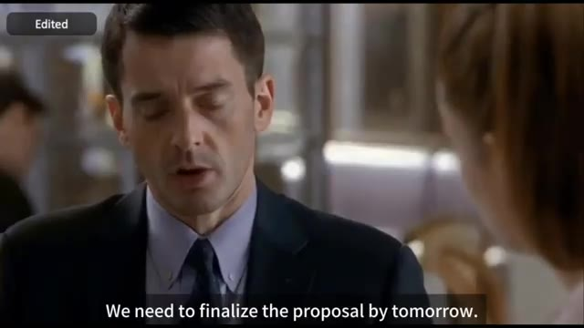
*Extrait vidéo montrant un homme en costume en train de parler, avec un encart "Edited" en haut à gauche et des sous-titres en bas indiquant "We need to finalize the proposal by tomorrow."*

---

### ⏱️ `[00:00:20 - 00:00:52]` | Segment #02

**🔊 Audio (Transcription Intégrale Mot pour Mot en Français) :**
> Un autre peut reconstruire une pièce 3D entière à partir de quelques photos de smartphone, et un autre peut générer des objets 3D qui n'ont pas seulement l'air réalistes mais comprennent réellement la physique. À ce stade, nous speed-runnons littéralement le futur. Donc aujourd'hui, nous allons examiner certaines des sorties d'IA les plus impressionnantes de cette semaine, ce qui se passe dans les coulisses, et pourquoi NVIDIA continue d'être incapable de prendre une semaine de congé. C'est Pursuing AI et vous regardez le Research Report. Également cette semaine, NVIDIA a lâché quelque chose d'assez dingue.

**👁️ Analyse Visuelle d'Écran (gemini-3.5-flash-lite) :**
**Interface & Outils** : Logiciels de visualisation 3D, outils de recherche en intelligence artificielle et page web de recherche NVIDIA Spatial Intelligence Lab.

**Contenu textuel & Code** : Texte à l'écran : "Phone Capture", "3D Reconstruction", "LIT", "PiD: Fast and High-Resolution Latent Decoding with Pixel Diffusion", noms des auteurs (Yifan Lu, Qi Wu, etc.), boutons "Read Paper (arXiv)", "Model", "Github", TL:DR, sections "Real Image Latent" (SD3 VAE, DINOv2) et "Generated Image Latent" (Z-Image, Flux.2 [dev]), section "Abstract".

**Action / Démonstration** : Démonstration visuelle de technologies d'IA 3D (reconstruction de pièce, objets 3D physiques) puis présentation de la page web du projet PiD de NVIDIA.

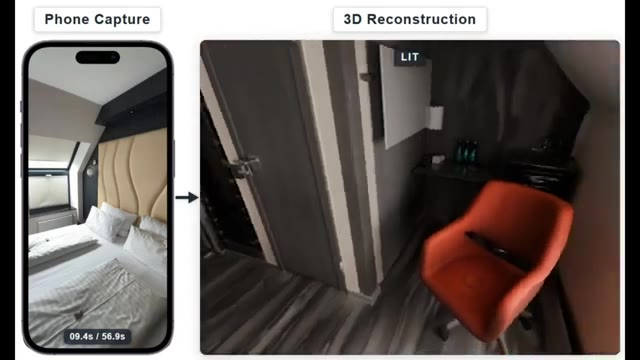
*Démonstration de la reconstruction 3D d'une pièce à partir de captures vidéo d'un smartphone (Phone Capture vs 3D Reconstruction).*

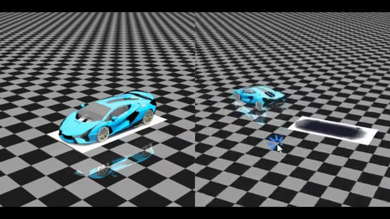
*Visualisation de modèles 3D interactifs d'une voiture de sport bleue sur un damier, illustrant la compréhension de la physique.*

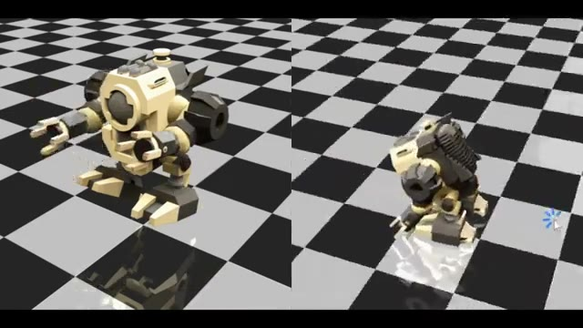
*Visualisation de modèles 3D interactifs d'un robot méca sur un damier, illustrant la physique des objets.*

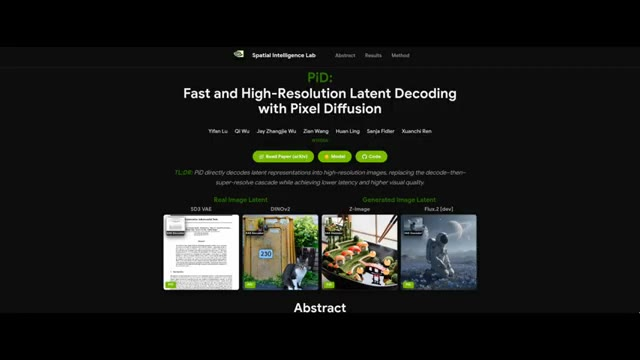
*Capture d'écran du site web de NVIDIA Spatial Intelligence Lab présentant le projet PiD (Fast and High-Resolution Latent Decoding with Pixel Diffusion).*

---

### ⏱️ `[00:00:52 - 00:01:12]` | Segment #03

**🔊 Audio (Transcription Intégrale Mot pour Mot en Français) :**
> Ça s'appelle PID, et c'est une nouvelle méthode open-source pour redimensionner des images à des résolutions beaucoup plus élevées avec des détails considérablement améliorés. Regardez simplement ces exemples. Vous pouvez prendre une image et la pousser jusqu'à 2K et au-delà tout en gardant tout net, propre et cohérent. L'augmentation de la qualité est honnêtement ridicule.

**👁️ Analyse Visuelle d'Écran (gemini-3.5-flash-lite) :**
**Interface & Outils** : Site web de recherche de la 'Spatial Intelligence Lab' (NVIDIA) présentant l'outil PiD (Pixel Diffusion).

**Contenu textuel & Code** : Textes : 'PiD: Fast and High-Resolution Latent Decoding with Pixel Diffusion', 'Read Paper (or ArXiv)', 'Model', 'Code', 'Real Image Latent', 'Generated Image Latent', 'PiD vs VAE — 4K Decoding Generated Latent', 'VAE Decode 1024 x 1024', 'PiD Decode 4096 x 4096', 'HARVEST SYMPHONY'.

**Action / Démonstration** : Navigation sur la page web du projet PiD et affichage d'une comparaison avant/après démontrant les capacités de suréchantillonnage et de décodage haute résolution.

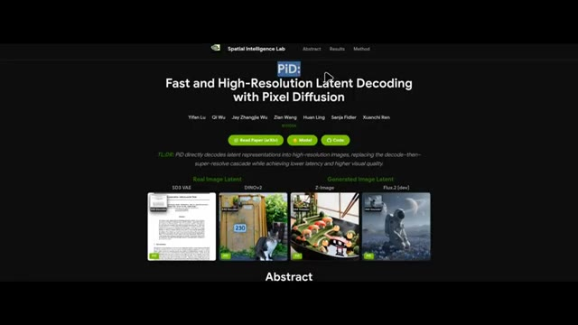
*Page du projet PiD montrant le titre principal 'Fast and High-Resolution Latent Decoding with Pixel Diffusion' et des exemples d'images latentes.*

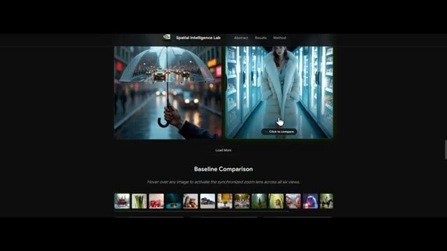
*Section de démonstration et de comparaison du site web PiD avec des exemples d'images en haute résolution.*

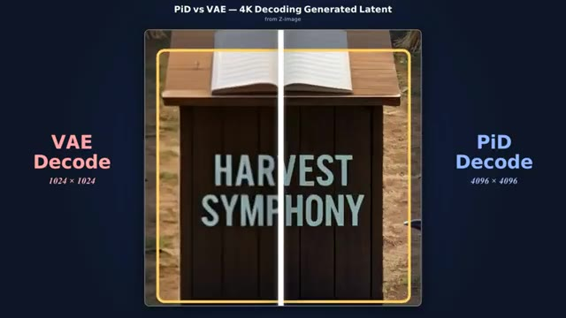
*Comparaison visuelle côte à côte entre le décodage VAE standard (1024x1024) et le décodage PiD (4096x4096) sur une image montrant un pupitre avec le texte 'HARVEST SYMPHONY'.*

---

### ⏱️ `[00:01:12 - 00:01:46]` | Segment #04

**🔊 Audio (Transcription Intégrale Mot pour Mot en Français) :**
> Les détails précis qui étaient à peine visibles auparavant deviennent soudainement nets et bien définis. Maintenant, voici un problème que PiD essaie de résoudre. Avec la plupart des systèmes de génération d'images traditionnels, la génération d'images haute résolution s'accompagne d'un goulot d'étranglement. Généralement, le modèle décode d'abord l'image de l'espace latent vers l'espace pixel, puis l'envoie via un amplificateur de résolution séparé pour augmenter la résolution. PiD supprime complètement cet élément superflu. À la place, il utilise un décodeur de diffusion par pixels unique qui produit directement une image haute résolution dans l'espace pixel, et c'est incroyablement rapide.

**👁️ Analyse Visuelle d'Écran (gemini-3.5-flash-lite) :**
**Interface & Outils** : Interface de présentation web comparative de PiD (Pixel Diffusion Decoder) montrant des curseurs de comparaison avant/après et une galerie de résultats.

**Contenu textuel & Code** : Textes visibles : 'PiD vs VAE - 4K Decoding Generated Latent', 'VAE Decode 1024x1024', 'PiD Decode 4096x4096', 'HARVEST SYMPHONY', 'PIXEL DIFFUSION DECODER', 'PiD', ainsi que plusieurs descriptions de prompts d'images (ex: 'Fashion campaign set inside a freezer aisle...').

**Action / Démonstration** : Présentation comparative visuelle démontrant la supériorité de résolution du décodeur PiD par rapport au décodeur VAE traditionnel à travers des curseurs interactifs et des gros plans de texte.

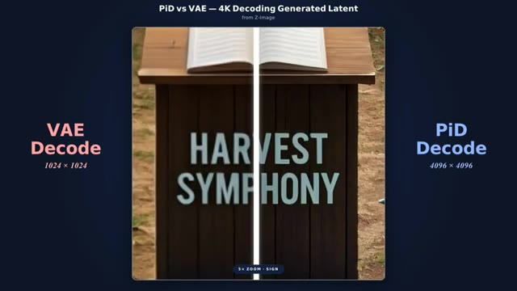
*Comparaison côte à côte entre le décodage VAE (1024x1024) et le décodage PiD (4096x4096) sur une image de lutrin avec le texte 'HARVEST SYMPHONY'.*

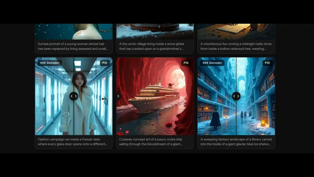
*Galerie de démonstration présentant plusieurs exemples de comparaisons d'images générées par IA avec curseur interactif entre le décodeur VAE et PiD.*

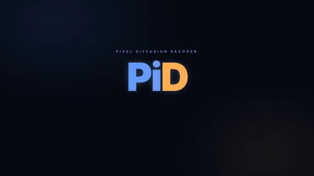
*Écran de titre affichant le logo coloré 'PiD' avec la mention 'PIXEL DIFFUSION DECODER' au-dessus.*

---

### ⏱️ `[00:01:46 - 00:02:06]` | Segment #05

**🔊 Audio (Transcription Intégrale Mot pour Mot en Français) :**
> Selon les benchmarks de Nvidia, PID peut mettre à l'échelle une image de 512 par 512 jusqu'en 2K en moins d'une seconde. C'est presque 6 fois plus rapide que la version 2 de CDANCE, qui est actuellement l'un des meilleurs outils de mise à l'échelle d'images disponibles. Et sur ce graphique de benchmark, vous pouvez voir le taux de victoire de PID par rapport aux modèles concurrents.

**👁️ Analyse Visuelle d'Écran (gemini-3.5-flash-lite) :**
**Interface & Outils** : Tableau de benchmarks quantitatifs montrant des graphiques de performance.

**Contenu textuel & Code** : Titre : "Quantitative Results (Decoding + Upsampling, 512² → 2048²)". Graphique de gauche : "End-to-End Decoding Latency (ms)" listant Real-ESRGAN (62,2 ms), PID (211,2 ms en vert), LUA (369,3 ms), TSD-SR (724,8 ms), InvSR-1 (1017,7 ms), SeedVR2 (1237,5 ms). Texte en bas : "PID is up to 5.9x faster than SeedVR2 (211.2 ms vs 1237.5 ms)". Graphique de droite : "Gemini-3-Flash Judge Rating (%)" listant InvSR-1 (90,1%), LUA (99,4% en vert), Real-ESRGAN (97,5%), SeedVR2 (85,1%), TSD-SR (87,2%). Texte en bas : "% of evaluations where judges prefer PID over each baseline". Légende en bas : PID (Ours) en vert, Baseline en gris.

**Action / Démonstration** : Le graphique de benchmarking s'affiche à l'écran pour illustrer les performances de vitesse et de qualité de PID comparées aux modèles concurrents.

*Graphique de résultats quantitatifs montrant la latence de décodage et le taux de notation pour le modèle PID par rapport aux modèles concurrents.*

---

### ⏱️ `[00:02:06 - 00:02:40]` | Segment #06

**🔊 Audio (Transcription Intégrale Mot pour Mot en Français) :**
> Dans la plupart des cas, il s'en sort haut la main. Le meilleur dans tout ça ? Ils l'ont déjà publié. Si vous faites défiler la page vers le haut et cliquez sur le bouton de code, vous trouverez des instructions pour télécharger et exécuter le tout localement sur votre propre machine. La version actuelle prend déjà en charge Flux, Zimage, SD3 et plusieurs autres modèles. La prise en charge de Qwen Image et de SDXL est prévue pour l'avenir. Si vous souhaitez l'explorer davantage, consultez le lien dans la description ci-dessous. Ensuite, cette IA est plutôt intéressante, elle s'appelle Instruct AV to AV et c'est un système qui permet d'éditer ensemble de la vidéo et de l'audio à partir d'un simple prompt.

**👁️ Analyse Visuelle d'Écran (gemini-3.5-flash-lite) :**
**Interface & Outils** : Interface de présentation de résultats de recherche avec graphiques et tableaux de données comparatives.

**Contenu textuel & Code** : Le titre principal indique "Quantitative Results (Decoding + Upsampling, 512² -> 2048²)". À gauche, un diagramme en barres horizontales détaille "End-to-End Decoding Latency (ms) ↓" avec les modèles Real-ESRGAN (62.2 ms), PID (211.2 ms en vert), LUA (369.3 ms), TSD-SR (724.8 ms), InvSR-1 (1017.7 ms) et SeedVR2 (1237.5 ms). Une note en bas à gauche précise "PID is up to 5.9x faster than SeedVR2 (211.2 ms vs 1237.5 ms)". À droite, un autre diagramme en barres présente "Gemini-3-Flash Judge Rating (%) ↑" avec InvSR-1 (90.1%), LUA (99.4%), Real-ESRGAN (97.5%), SeedVR2 (85.1%) et TSD-SR (87.2%). Une légende en bas indique "% of evaluations where judges prefer PID over each baseline", ainsi qu'un code couleur pour "PID (Ours)" en vert et "Baseline" en gris. Un curseur de souris est visible en bas au centre.

**Action / Démonstration** : Le présentateur affiche des graphiques de performances comparatives quantitatives pour illustrer les résultats et la vitesse d'exécution du modèle présenté.

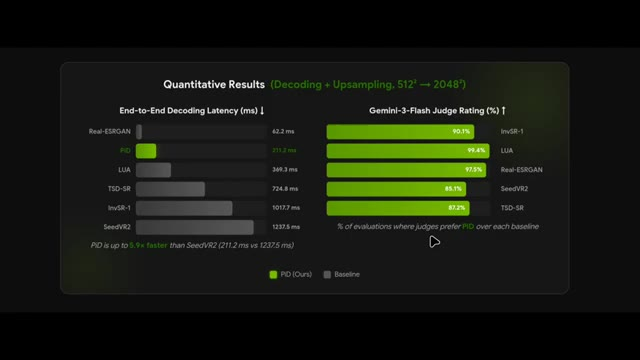
*Graphique de résultats quantitatifs comparant la latence de décodage et les notes d'évaluation du modèle PID par rapport à d'autres solutions.*

---

### ⏱️ `[00:02:40 - 00:02:59]` | Segment #07

**🔊 Audio (Transcription Intégrale Mot pour Mot en Français) :**
> Par exemple, vous pouvez prendre une vidéo existante et faire dire à une personne quelque chose de complètement différent. Non seulement cela modifie l'audio, mais cela met également à jour la synchronisation labiale pour correspondre. Voici un exemple. Ouais, je vois ce que tu veux dire, mais je pense vraiment qu'on devrait lui donner une autre chance. C'est plus que de l'art. C'est une déclaration.

**👁️ Analyse Visuelle d'Écran (gemini-3.5-flash-lite) :**
**Interface & Outils** : Interface web d'InstructAV2AV et lecteur vidéo de démonstration.

**Contenu textuel & Code** : Texte de l'instruction : "Keep the person's identity and change the spoken words to 'This is more than just art, it's a statement.'", et sous-titre "This is more than just art, it's a statement."

**Action / Démonstration** : Démonstration de modification vidéo par IA montrant l'entrée et la sortie synchronisées avec une nouvelle piste audio et une synchronisation labiale ajustée.

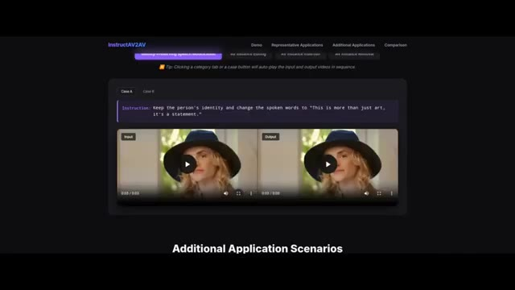
*Interface web du modèle InstructAV2AV montrant une comparaison vidéo avec instruction textuelle.*

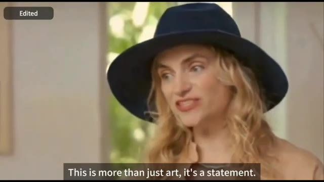
*Gros plan sur la vidéo éditée avec la phrase sous-titrée à l'écran.*

---

### ⏱️ `[00:02:59 - 00:03:37]` | Segment #08

**🔊 Audio (Transcription Intégrale Mot pour Mot en Français) :**
> Ou voici un autre exemple. Je comprends la situation et je crois que vous en êtes capable. Je pense vraiment que nous devrions faire de notre mieux pour y arriver. Ou voici un autre exemple où la voix de la personne est modifiée pour ressembler davantage à celle d'un homme tout en changeant les mots prononcés : j'ai trouvé une adresse pour une mère à Hartwell. Je comprends, mais je pense que nous devons considérer, mais cela ne s'arrête pas là. Vous pouvez garder le discours original et transformer simplement le locuteur d'un homme en femme, et voici le résultat : cet endroit me rappelle le moment où j'ai commencé ce voyage. Je pense vraiment que nous devrions lui donner une seconde chance.

**👁️ Analyse Visuelle d'Écran (gemini-3.5-flash-lite) :**
**Interface & Outils** : Interface web de l'outil de recherche ou de démonstration vidéo 'InstructAV2AV'.

**Contenu textuel & Code** : Texte de l'instruction visible : « Keep the person's appearance, change the timbre to a man, and change the spoken words to 'I understand, but I think we need to consider.' » et sur l'image 3 : « Change the man in the middle into a young woman. »

**Action / Démonstration** : Présentation d'exemples de modification vidéo et audio par intelligence artificielle via l'outil InstructAV2AV.

*Exemple vidéo d'un homme en costume sur une plage au téléphone portable avec la mention 'Original'.*

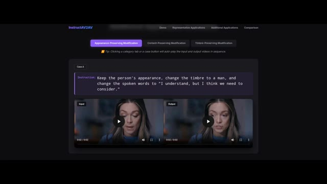
*Interface de l'outil InstructAV2AV montrant l'instruction textuelle de modification et les vidéos d'entrée/sortie.*

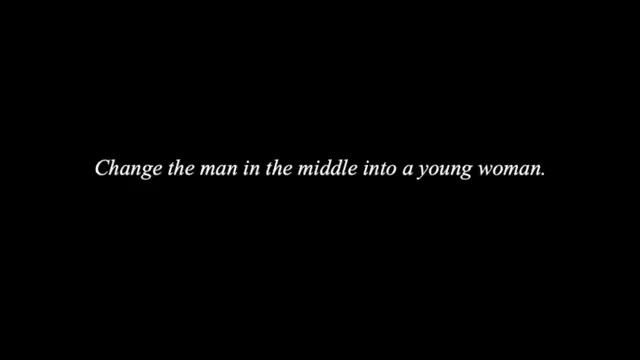
*Écran noir affichant une instruction textuelle en italique blanc sur la modification d'un personnage.*

---

### ⏱️ `[00:03:37 - 00:03:58]` | Segment #09

**🔊 Audio (Transcription Intégrale Mot pour Mot en Français) :**
> Waouh, c'est tellement incroyable. Nous devons finaliser la proposition pour demain. C'est un sujet plutôt intéressant. Maintenant, si vous faites défiler vers le haut de la page, vous verrez à la fois un bouton de code et un bouton pour les poids du modèle. Pour l'instant cependant, il n'y a encore rien sur la page GitHub. Pourtant, si vous souhaitez en savoir plus, consultez le lien dans la description ci-dessous.

**👁️ Analyse Visuelle d'Écran (gemini-3.5-flash-lite) :**
**Interface & Outils** : Navigateur web affichant la page de présentation du projet de recherche InstructAV2AV avec interface claire sur fond sombre.

**Contenu textuel & Code** : Titre 'InstructAV2AV: Instruction-Guided Audio-Video Joint Editing', noms des auteurs (Haojie Zheng, Yixin Yang, Siqi Yang, Shuchen Weng, Boxin Shi), affiliations (Beijing Academy of Artificial Intelligence, Peking University), boutons 'arXiv', 'Code (GitHub)', 'Model Weights', et section 'Demo'.

**Action / Démonstration** : Affichage de la page web du projet de recherche et défilement vers le haut pour montrer les différents boutons de ressources (code et poids du modèle).

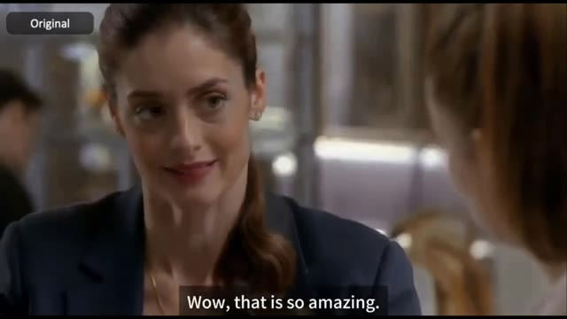
*Extrait vidéo illustratif montrant une femme souriante dans une scène de discussion avec le sous-titre 'Wow, that is so amazing.'*

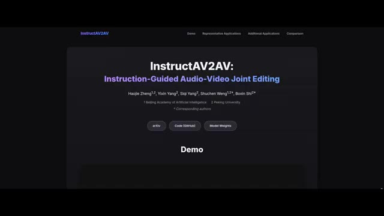
*Page web du projet 'InstructAV2AV: Instruction-Guided Audio-Video Joint Editing' montrant les boutons arXiv, Code (GitHub) et Model Weights.*

---

### ⏱️ `[00:03:58 - 00:04:30]` | Segment #10

**🔊 Audio (Transcription Intégrale Mot pour Mot en Français) :**
> Ensuite, cette IA est idéale pour l'immobilier et la VR. Elle s'appelle Gen Recon. Et comme vous pouvez le voir à partir de ces exemples, elle peut prendre des vidéos de smartphone décontractées ou même simplement une collection de photos d'une pièce et les transformer en une scène 3D complète et éditable. L'entrée est une vidéo ou un ensemble d'images, la sortie est un maillage prêt pour le PBR. En d'autres termes, un modèle 3D complet avec des matériaux qui peuvent être utilisés pour le rendu ou une édition ultérieure. Par exemple, vous pouvez rééclairer l'environnement sous différents angles, changer les matériaux ou même changer les couleurs dans toute la scène.

**👁️ Analyse Visuelle d'Écran (gemini-3.5-flash-lite) :**
**Interface & Outils** : Article de recherche / Présentation académique de GenRecon

**Contenu textuel & Code** : "GenRecon: Bridging Generative Priors for Multi-View 3D Scene Reconstruction", noms des chercheurs (Katharina Schmid, Nicolas von Lützow, Jozef Hladký, Angela Dai, Matthias Nießner), affiliations (Technical University of Munich, Computing Systems Lab, Huawei Technologies, Switzerland), boutons de liens (Paper, arXiv, Video, Code), étiquettes "Phone Capture", "3D Reconstruction", "GEOMETRY", "RELIGHTING".

**Action / Démonstration** : Présentation visuelle de la transformation d'une vidéo de smartphone en modèle 3D avec options de géométrie et de rééclairage.

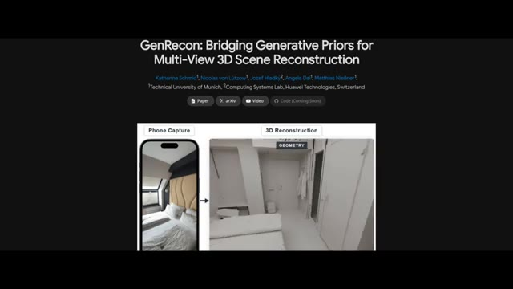
*Présentation du titre du projet GenRecon pour la reconstruction de scènes 3D multi-vues avec une vue côte à côte d'une capture par téléphone et d'une reconstruction 3D géométrique.*

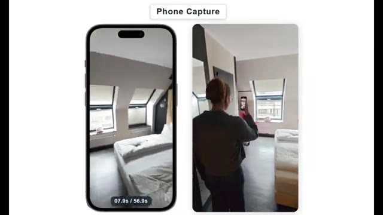
*Illustration d'une capture vidéo de pièce réalisée à l'aide d'un smartphone (Phone Capture).*

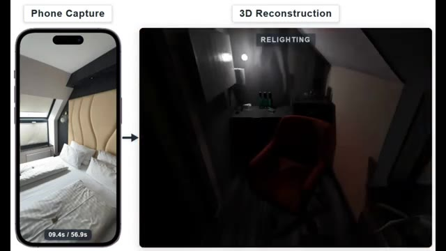
*Démonstration du rééclairage (Relighting) d'une scène 3D reconstruite à partir d'une vidéo de smartphone.*

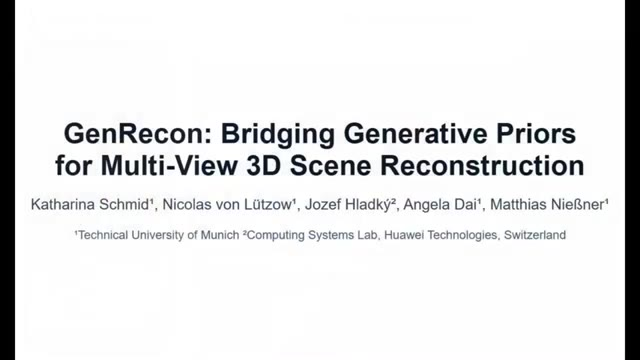
*Écran de titre institutionnel montrant le nom du projet GenRecon et les contributeurs universitaires et industriels.*

---

### ⏱️ `[00:04:31 - 00:04:51]` | Segment #11

**🔊 Audio (Transcription Intégrale Mot pour Mot en Français) :**
> Alors, comment ça fonctionne ? Genrecom prend une collection d'images ou de trames vidéo et reconstruit l'environnement par morceaux tout en maintenant la cohérence sur l'ensemble de la scène. Il utilise également Trellis 2 comme ce que les chercheurs appellent un a priori de forme génératif. Considérez cela comme le fait de donner au modèle une solide compréhension de l'apparence réelle des objets 3D.

**👁️ Analyse Visuelle d'Écran (gemini-3.5-flash-lite) :**
**Interface & Outils** : Démonstration logicielle / pipeline de recherche IA de modélisation 3D (Genrecom / Trellis 2).

**Contenu textuel & Code** : Texte "RGB INPUT IMAGES", aperçu d'images de caméra RGB d'une chambre à coucher, rendus 3D partiels de pièces et plans au sol (floor plans) en incrustation.

**Action / Démonstration** : Visualisation du processus de reconstruction d'un environnement 3D par morceaux à partir d'images d'entrée RVB et démonstration de la cohérence spatiale.

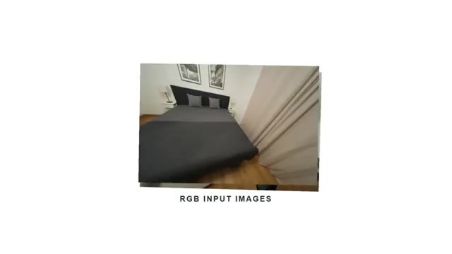
*Affichage des images d'entrée RVB d'une chambre à coucher avec le texte "RGB INPUT IMAGES".*

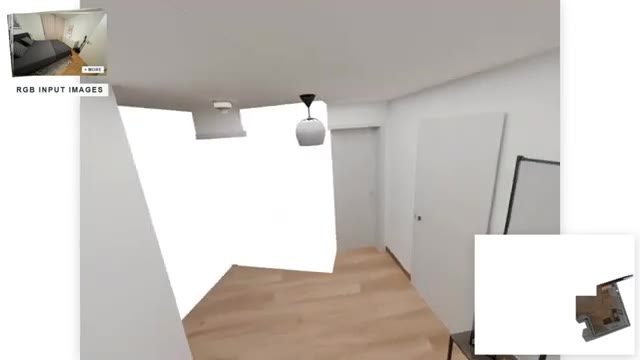
*Reconstruction 3D partielle de l'environnement en cours par morceaux, avec un aperçu de la pièce d'origine et du plan au sol en incrustation.*

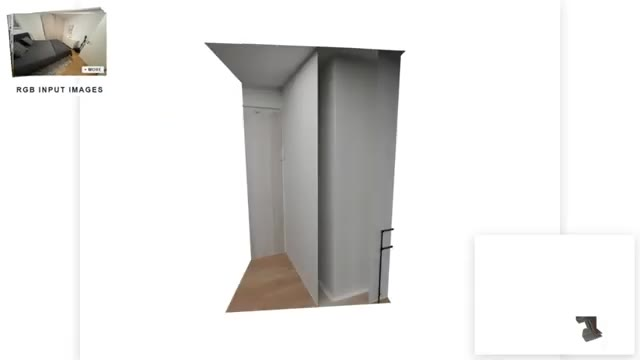
*Poursuite de la reconstruction 3D de l'environnement avec affichage d'un nouveau segment de la pièce et de la carte en bas à droite.*

---

### ⏱️ `[00:04:51 - 00:05:15]` | Segment #12

**🔊 Audio (Transcription Intégrale Mot pour Mot en Français) :**
> Tout en haut de la page, il y a actuellement un bouton "bientôt disponible". Espérons qu'ils le mettront en open source. Pour l'instant, ils ont seulement publié un article technique. Si vous souhaitez en savoir plus, je mettrai le lien de la page dans la description ci-dessous. Également cette semaine, nous avons découvert une IA très utile appelée PhysX Omni, et elle s'attaque à l'un des plus grands problèmes de la génération 3D. La plupart des systèmes d'IA peuvent générer des objets qui ont l'air bien, mais ils ne fonctionnent pas réellement dans les simulations physiques.

**👁️ Analyse Visuelle d'Écran (gemini-3.5-flash-lite) :**
**Interface & Outils** : Navigateur web affichant les pages de recherche des projets "GenRecon" et "PhysX-Omni".

**Contenu textuel & Code** : Titres de projets de recherche, boutons de liens (Paper, arXiv, Video, Code), captures d'écran de reconstruction 3D et grille de vidéos de simulations physiques d'objets rigides, déformables et articulés.

**Action / Démonstration** : Le curseur de la souris survole les différents boutons et sections des pages web présentées.

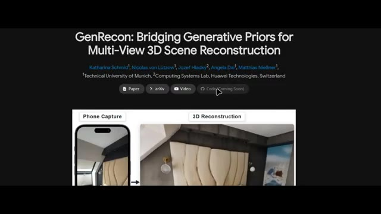
*Page web de présentation du projet "GenRecon" montrant le titre de la recherche et les liens vers le papier et le code.*

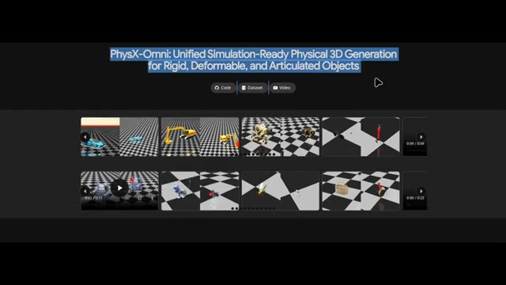
*Page web de présentation de l'IA "PhysX-Omni" montrant son titre, les boutons d'accès et une grille de vidéos de démonstration de simulations physiques 3D.*

---

### ⏱️ `[00:05:15 - 00:05:49]` | Segment #13

**🔊 Audio (Transcription Intégrale Mot pour Mot en Français) :**
> PhysX Omni change la donne. Au lieu de générer une voiture sous forme de maillage statique unique, il crée des éléments prêts pour la simulation. Cela signifie que la géométrie, l'échelle, les propriétés des matériaux et la compréhension du mouvement sont toutes intégrées au résultat. Par exemple dans cette démo, les roues bougent correctement lorsque la voiture est déplacée. Voici un autre exemple où l'objet possède des articulations correctement placées qui bougent de manière réaliste et en voici un autre. Ce qui est intéressant, c'est que la plupart des systèmes de génération 3D existants se concentrent soit sur l'apparence, soit sur des catégories d'objets très spécifiques telles que les objets rigides.

**👁️ Analyse Visuelle d'Écran (gemini-3.5-flash-lite) :**
**Interface & Outils** : Logiciel de simulation 3D (PhysX Omni) avec affichage en écran partagé ou double vue sur fond de damier.

**Contenu textuel & Code** : Modèles 3D interactifs (voiture de sport bleue, excavatrice jaune, créature robotique bleue) dans un environnement de simulation physique avec sol à motifs de damier gris et blanc.

**Action / Démonstration** : Présentation de différents actifs 3D dotés de propriétés physiques, de mouvements de roues et d'articulations fonctionnelles manipulés dans l'environnement de simulation.

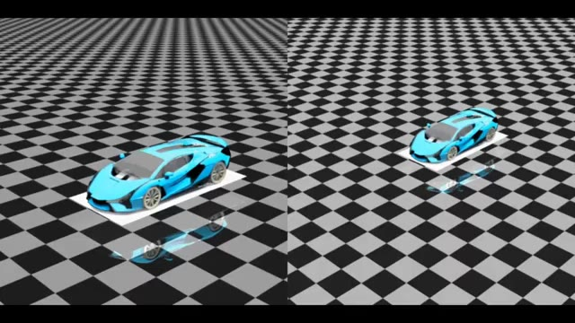
*Démonstration de PhysX Omni affichant une voiture de sport bleue modélisée en 3D sur un sol quadrillé dans un environnement de simulation, avec comparaison visuelle.*

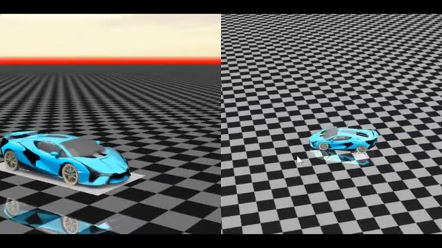
*Démonstration de PhysX Omni montrant le déplacement interactif de la voiture de sport bleue avec des roues fonctionnelles en temps réel.*

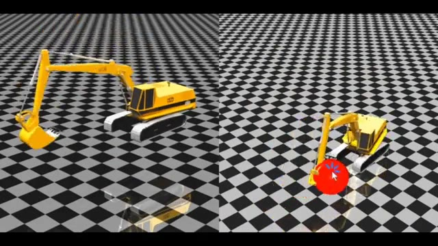
*Démonstration de PhysX Omni illustrant un modèle 3D d'excavatrice jaune interagissant avec un objet sphérique rouge grâce à des articulations réalistes.*

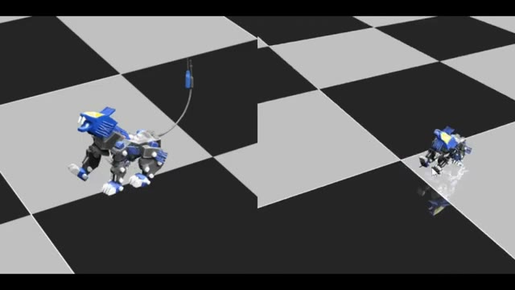
*Démonstration de PhysX Omni présentant un modèle 3D animé de créature robotique/animalte bleue et grise sur fond quadrillé.*

---

### ⏱️ `[00:05:49 - 00:06:08]` | Segment #14

**🔊 Audio (Transcription Intégrale Mot pour Mot en Français) :**
> PhysX Omni essaie d'unifier le tout en un seul framework et, lorsqu'on le compare à des systèmes concurrents tels qu'Articulate Anything, PhysXGen et PhysXAnything, on peut voir que PhysX Omni obtient systématiquement de meilleurs résultats sur de multiples benchmarks. En moyenne, il atteint les performances globales les plus élevées sur un graphique.

**👁️ Analyse Visuelle d'Écran (gemini-3.5-flash-lite) :**
**Interface & Outils** : Présentation vidéo technique / slides académiques sur PhysX-Bench.

**Contenu textuel & Code** : Graphiques en radar et schémas hexagonaux intitulés "III. Overview of PhysX-Bench", "Benchmark Overview" et "Evaluation Dimensions", avec la légende des différents modèles (Articulate-Anything, MonoArt, PhysXGen, PhysX-Anything).

**Action / Démonstration** : Affichage comparatif des performances de PhysX Omni par rapport aux systèmes concurrents sur différents benchmarks physiques.

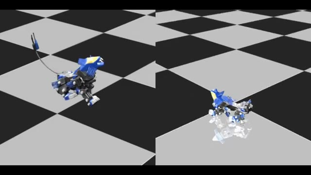
*Comparaison côte à côte de simulations 3D montrant le comportement physique d'un modèle animal robotique sur un sol damé.*

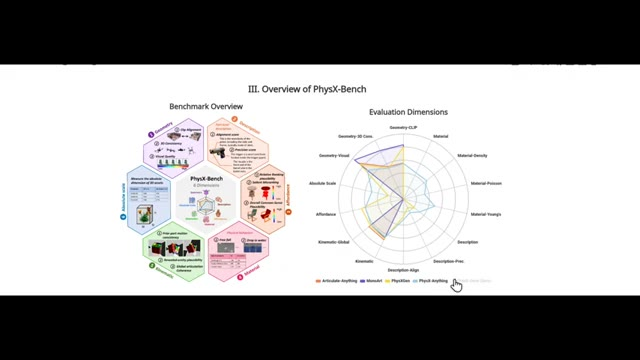
*Graphique de présentation intitulé "III. Overview of PhysX-Bench" détaillant les dimensions d'évaluation et les performances comparées des différents systèmes.*

---

### ⏱️ `[00:06:08 - 00:06:30]` | Segment #15

**🔊 Audio (Transcription Intégrale Mot pour Mot en Français) :**
> Et le truc génial, c'est qu'ils ont déjà tout publié. Si vous faites défiler la page vers le haut et cliquez sur le bouton de code, vous trouverez des instructions pour télécharger et exécuter le tout localement sur votre propre machine. Si vous souhaitez explorer cela plus en profondeur, consultez le lien dans la description ci-dessous. Et si vous avez apprécié ce rapport, pensez à vous abonner car la semaine prochaine sera probablement encore plus folle. C'est Pursuing AI, et je vous retrouve dans le prochain rapport de recherche.

**👁️ Analyse Visuelle d'Écran (gemini-3.5-flash-lite) :**
**Interface & Outils** : Navigateur web affichant le dépôt GitHub du projet PhysX-Omni et ses instructions d'installation et de démonstration.

**Contenu textuel & Code** : Texte affiché : "PhysX-Omni: Unified Simulation-Ready Physical 3D Generation for Rigid, Deformable, and Articulated Objects", instructions "Installation", "1. Clone the repo: git clone --recurse-submodules https://github.com/physx-omni/PhysX-Omni.git", et commandes d'installation des dépendances.

**Action / Démonstration** : Présentation des instructions de téléchargement et d'exécution locale du modèle d'intelligence artificielle sur GitHub, illustrée par des extraits de simulations physiques 3D.

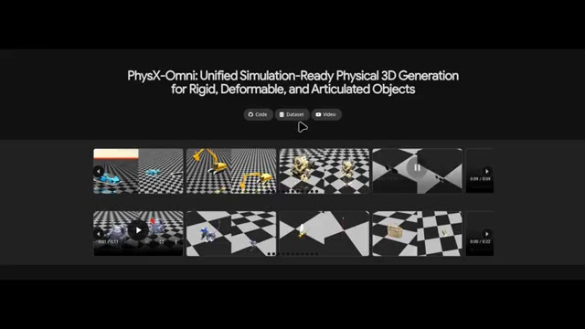
*Page web du projet PhysX-Omni présentant la génération 3D physique unifiée et prête pour la simulation, avec des boutons de code, de dataset et de vidéo ainsi qu'une grille de prévisualisations vidéo.*

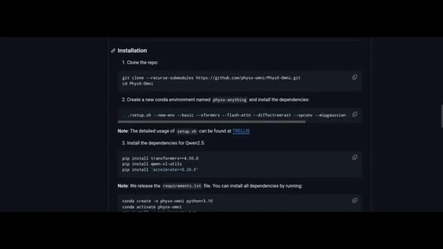
*Documentation d'installation du projet sur GitHub montrant les commandes de clonage du dépôt et les instructions de configuration de l'environnement Conda.*

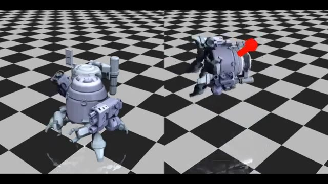
*Démonstration de simulation physique 3D montrant un objet articulé interagissant dans un environnement quadrillé.*

---
