# 🎬 La toute première IA vraiment réaliste ?

> **Chaîne** : [Pursuing AI](https://www.youtube.com/@PursuingAi)  
> **Titre original** : `The Most Realistic AI Ever?`  
> **Lien YouTube** : [https://www.youtube.com/watch?v=Q0XpvTcubPU](https://www.youtube.com/watch?v=Q0XpvTcubPU)  
> **Date de publication** : 2026-06-24  
> **Durée** : 08m 46s (`526s`)  
> **Identifiant vidéo** : `Q0XpvTcubPU`  
> **Fiche Web Interactive** : [2026-06-24_YT-Q0XpvTcubPU_La toute première IA vraiment réaliste_by-whisper-v3-large-turbo+gemini-3.5-flash-lite.html](2026-06-24_YT-Q0XpvTcubPU_La toute première IA vraiment réaliste_by-whisper-v3-large-turbo+gemini-3.5-flash-lite.html)  
> **Captures de démonstration clés** : `38 captures réelles (anti-talking-head)`  
> **Modèles utilisés** : Audio: `large-v3-turbo` (Faster-Whisper int8 VPS) | Vision: `gemini-3.5-flash-lite` (Google AI Studio API)  

---

## 📌 Synthèse Exécutive & Outils

### 📌 Résumé
La vidéo « La toute première IA vraiment réaliste ? » de *Pursuing AI* explore une mutation majeure dans la création audiovisuelle en présentant **Flova**, un agent créatif d'intelligence artificielle tout-en-un. Le créateur démontre la puissance de cet outil à travers un court-métrage dramatique et réaliste — simulant une tempête apocalyptique et une mère cherchant désespérément sa fille —, entièrement généré sans caméras, acteurs ni équipe technique. En partant d'une simple idée textuelle brute, Flova orchestre l'ensemble de la chaîne de production, de l'écriture du scénario jusqu'au montage final, en passant par le design des personnages et la composition musicale.

L'innovation centrale réside dans le concept de « compétences » (*skills*), des flux de travail encapsulés qui automatisent et mémorisent les choix artistiques, les paramètres de production et la cohérence des personnages (grâce à des modèles comme *Nano Banana*). L'agent analyse le concept initial, rédige le script, planifie 13 plans distincts, génère les visuels et permet au réalisateur d'intervenir à chaque étape pour ajuster précisément le storyboard par simple dialogue. Cette approche hybride entre automatisation intelligente et contrôle granulaire redéfinit le métier de réalisateur, reléguant au second plan la complexité technique du *prompt engineering* au profit de la vision purement créative.

Pour les créateurs de vidéo, ce rapport de recherche met en lumière un gain de temps et d'efficacité considérable, démocratisant l'accès à la réalisation cinématographique de haute qualité. Grâce à l'interopérabilité de Flova avec les meilleurs modèles du marché (*Kling*, *Veo*, *Seedance*, etc.), les créateurs n'ont plus besoin d'arbitrer manuellement entre les outils ou d'apprendre des interfaces hétérogènes. La possibilité de réutiliser des flux de travail communautaires ou personnels ouvre la voie à une industrialisation rapide des séries, des clips ou des films narratifs, posant frontalement la question de l'avenir de Hollywood face à cette automatisation cinématographique de pointe.

### 🛠️ Outils, Modèles & Logiciels Présentés
* **Flova** : Agent créatif d'intelligence artificielle centralisateur qui combine génération vidéo, image, musique et audio au sein d'un flux de travail unifié et automatisé.
* **Seedance V2** : Modèle de pointe utilisé par Flova pour la génération de séquences vidéo fluides et dynamiques.
* **Kling** : Modèle vidéo haute performance intégré pour la création de scènes complexes et réalistes.
* **Veo** : Modèle de génération vidéo avancé mobilisé pour sa capacité à restituer des atmosphères cinématographiques saisissantes.
* **Happy Horse** : Modèle vidéo secondaire exploité par l'agent selon les besoins spécifiques de la narration.
* **Nano Banana** : Modèle de pointe utilisé spécifiquement pour le design initial et la génération cohérente des personnages.
* **GPT Image** : Modèle d'imagerie mobilisé pour enrichir la palette visuelle et conceptuelle du projet.
* **Seedream 4.5** : Modèle d'image intégré pour concevoir des éléments graphiques et des textures détaillées.
* **Suno** : Solution de référence pour la génération de pistes musicales immersives et de bandes sons adaptées au récit.
* **Mureka** : Modèle audio et musical intégré pour composer des ambiances sonores et des fonds musicaux distincts.

### 🔑 Points Clés & Enseignements Stratégiques
* **Affranchissement du *Prompt Engineering* traditionnel** : L'utilisation d'un agent orchestrateur comme Flova permet de partir d'une simple idée brute, l'IA se chargeant elle-même de rédiger et d'optimiser les prompts détaillés pour chaque plan.
* **Centralisation des meilleurs modèles du marché** : Finie la dispersion entre plateformes ; l'agent sélectionne automatiquement le meilleur outil (vidéo, image ou audio) en fonction des besoins spécifiques de chaque scène.
* **Le concept de « Compétences » (*Skills*)** : Un flux de travail créatif complet peut être enregistré, stocké et réutilisé pour garantir une parfaite cohérence visuelle et narrative sur des projets épisodiques ou des suites.
* **Planification automatique de la production** : À partir d'un pitch, l'IA structure instantanément le projet en découpant l'histoire en plans précis (par exemple, 13 plans et 3 pistes musicales pour ce court-métrage).
* **Création et cohérence des personnages** : Grâce à des modèles dédiés comme *Nano Banana*, l'IA génère des personnages crédibles et maintient leur identité visuelle d'une scène à l'autre sans effort manuel complexe.
* **Contrôle granulaire et itératif** : L'utilisateur n'est pas passif ; il peut à tout moment modifier le storyboard, ajuster un mouvement de caméra ou régénérer un plan spécifique par simple dialogue textuel avec l'agent.
* **Bibliothèque de compétences communautaire** : Les créateurs débutants comme confirmés peuvent explorer, s'approprier et adapter des flux de travail partagés par des pairs, accélérant ainsi la courbe d'apprentissage.
* **Traçabilité et pédagogie des projets** : La plateforme permet d'analyser comment d'autres utilisateurs ont construit leurs œuvres, offrant une mine d'or pour étudier les choix de modèles et les processus créatifs.
* **Pipeline de production rationalisé** : Le flux imite les étapes d'un studio professionnel (scénario, validation, découpage, génération, édition chronologique), rendant la réalisation accessible sans compétences techniques cinématographiques préalables.
* **Gain de temps exponentiel** : La réduction des frictions techniques permet aux créateurs de se concentrer exclusivement sur la narration, le rythme dramatique et l'impact émotionnel de leurs histoires.

---

## ⏱️ Chronologie & Transcription Complète Audio & Visuelle (Mot pour Mot)

### ⏱️ `[00:00:06 - 00:00:28]` | Segment #01

**🔊 Audio (Transcription Intégrale Mot pour Mot en Français) :**
> Le Service Météorologique National a émis un avertissement de tempête extrême pour la zone métropolitaine. Il est conseillé aux citoyens de... Conclure l'accord Meridian aujourd'hui, pas demain. Aujourd'hui. Maman ?

**👁️ Analyse Visuelle d'Écran (gemini-3.5-flash-lite) :**
**Interface & Outils** : Présentation cinématographique d'une vidéo générée par IA (aucune interface de logiciel de création n'est affichée).

**Contenu textuel & Code** : Séquence vidéo narrative montrant un paysage urbain menaçant, une femme d'affaires interagissant avec un écran holographique et une main posant un téléphone sur une table.

**Action / Démonstration** : Illustration visuelle du scénario narré, sans démonstration d'outil d'intelligence artificielle.

---

### ⏱️ `[00:00:28 - 00:00:50]` | Segment #02

**🔊 Audio (Transcription Intégrale Mot pour Mot en Français) :**
> Les fenêtres se brisent. Le professeur dit de rester à l'intérieur, mais j'ai très peur. Lily ? Lily ! Ma fille est là-dehors.

**👁️ Analyse Visuelle d'Écran (gemini-3.5-flash-lite) :**
**Interface & Outils** : Présentation vidéo cinématique générée par IA (pas d'interface de logiciel visible).

**Contenu textuel & Code** : Séquence vidéo narrative montrant des plans de coupe dramatiques : une femme au téléphone, une avenue urbaine congestionnée sous un ciel d'orage menaçant, et une violente explosion sur le flanc d'un gratte-ciel avec des débris enflammés.

**Action / Démonstration** : Illustration visuelle du récit dramatique en cours, avec des plans cinématographiques générés par intelligence artificielle.

---

### ⏱️ `[00:00:52 - 00:01:13]` | Segment #03

**🔊 Audio (Transcription Intégrale Mot pour Mot en Français) :**
> J'arrive. Ordonnez de se confiner sur place !

**👁️ Analyse Visuelle d'Écran (gemini-3.5-flash-lite) :**
**Interface & Outils** : Présentation de séquences vidéo générées par intelligence artificielle sans interface logicielle visible.

**Contenu textuel & Code** : Générations de vidéos cinématiques montrant une skyline urbaine, un monstre géant ressemblant à Godzilla attaquant la ville, et des personnages fuyant en catastrophe à l'intérieur d'un bâtiment.

**Action / Démonstration** : Démonstration visuelle de séquences cinématiques générées par IA illustrant un scénario catastrophe.

---

### ⏱️ `[00:01:13 - 00:01:33]` | Segment #04

**🔊 Audio (Transcription Intégrale Mot pour Mot en Français) :**
> Ma fille est là-bas ! Maman ? J'ai vraiment peur. Tu ne peux pas.

**👁️ Analyse Visuelle d'Écran (gemini-3.5-flash-lite) :**
**Interface & Outils** : Présentation face caméra sans partage d'écran (extraits vidéo de démonstration de génération par IA sans interface logicielle visible)

**Contenu textuel & Code** : Séquences cinématiques montrant une femme ouvrant une porte sombre, courant dans des escaliers bétonnés d'un immeuble vétuste, puis s'enfuyant dans une rue alors qu'un grand bâtiment s'effondre en arrière-plan en dégageant un énorme nuage de poussière grise.

**Action / Démonstration** : Une femme court frénétiquement pour fuir un danger ou un bâtiment en train de s'effondrer.

---

### ⏱️ `[00:01:33 - 00:01:56]` | Segment #05

**🔊 Audio (Transcription Intégrale Mot pour Mot en Français) :**
> Bon, avant que j'explique ce qui se passe ici, je dois vous dire quelque chose. Aucune de ces scènes n'a été filmée. Pas de caméras, pas d'acteurs, pas d'équipe de production. J'ai tout fait avec l'IA. Et après avoir vu ce qui s'est passé ensuite, je commence à me demander, est-ce que Hollywood est fini ? Il y a quelques jours, je suis tombé sur une plateforme appelée Flova et j'ai décidé de tester jusqu'où la réalisation de films par IA est réellement arrivée.

**👁️ Analyse Visuelle d'Écran (gemini-3.5-flash-lite) :**
**Interface & Outils** : Extraits vidéo et animations textuelles générés par IA illustrant les capacités de la plateforme Flova.

**Contenu textuel & Code** : Texte affiché à l'écran : « Is HOLLYWOOD Over ? » et « Everyone can be a director with Flova ».
[DESC_IMAGE_1] Rendu vidéo de synthèse montrant une mégapole futuriste.
[DESC_IMAGE_2] Animation de caméra fluide sur une autoroute urbaine dense.
[DESC_IMAGE_3] Scène cinématographique mettant en scène un personnage enfantin avec un encart textuel posant la question de l'avenir d'Hollywood.
[DESC_IMAGE_4] Écran de transition textuel publicitaire introduisant l'outil Flova.

**Action / Démonstration** : Démonstration visuelle de séquences cinématographiques entièrement générées par IA pour illustrer le potentiel de la plateforme Flova.

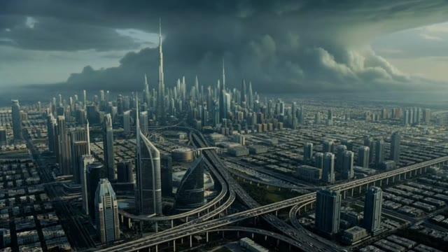
*Vue aérienne générée par IA d'une ville futuriste ressemblant à Dubaï sous un ciel d'orage menaçant.*

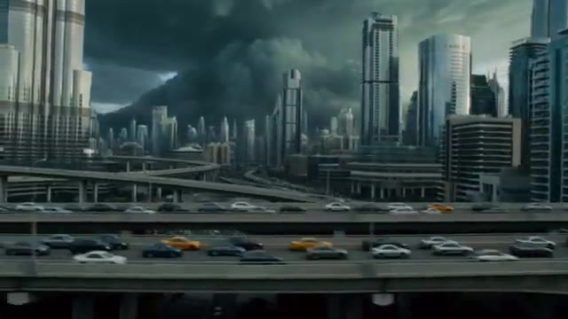
*Travelling avant à travers des grat-ciels et des autoroutes surélevées remplies de circulation automobile généré par IA.*

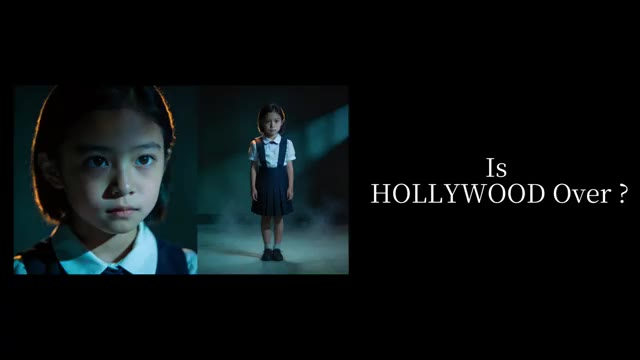
*Portrait d'une jeune fille en uniforme scolaire dans un décor sombre, avec le texte « Is HOLLYWOOD Over ? » affiché à droite.*

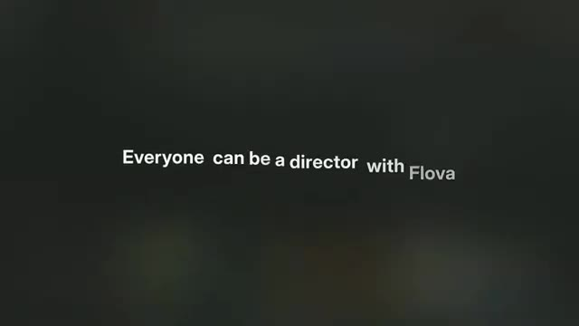
*Texte animé à l'écran sur fond flou : « Everyone can be a director with Flova ».*

---

### ⏱️ `[00:01:56 - 00:02:31]` | Segment #06

**🔊 Audio (Transcription Intégrale Mot pour Mot en Français) :**
> Donc, je lui ai donné une idée de film simple. Une tempête massive est sur le point de frapper une ville. Une mère se retrouve piégée dans le chaos et court à travers la ville pour sauver sa fille avant qu'il ne soit trop tard. C'était tout. Juste une idée vague. Et d'une manière ou d'une autre, Flova a transformé ça en ceci. Le fait qu'une simple idée puisse devenir quelque chose d'aussi cinématique est honnêtement assez fou. Donc dans cette vidéo, je vais vous montrer exactement comment j'ai fait ce court-métrage IA, comment fonctionne le flux de travail, et pourquoi des outils comme celui-ci poussent les gens à se poser des questions assez importantes sur l'avenir de la réalisation de films.

**👁️ Analyse Visuelle d'Écran (gemini-3.5-flash-lite) :**
**Interface & Outils** : Interface web de l'agent vidéo IA Flova 1.0 (Your Personal AI Video Agent Partner).

**Contenu textuel & Code** : Texte du prompt saisi : "A massive storm is about to hit a city. A mother gets trapped in the chaos and races across the city to save her daughter before it's too late." et panneau "Resource Analysis" avec les détails de caractérisation (Type: img, Character: Wednesday Addams, General Appearance, Clothing & Style, Personality & Mood, Location).

**Action / Démonstration** : L'utilisateur montre l'interface de saisie de prompt de l'outil Flova, puis un extrait cinématique généré, et enfin le panneau d'analyse détaillée des ressources du projet.

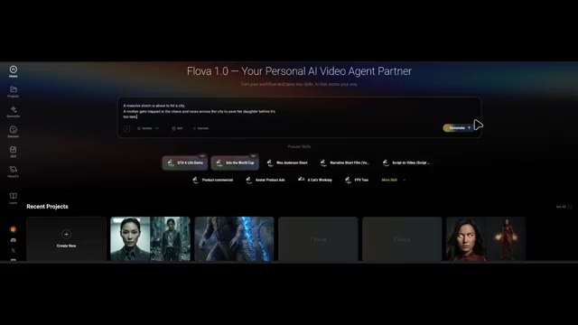
*Interface de l'outil Flova 1.0 montrant la saisie du prompt textuel pour l'idée de film.*

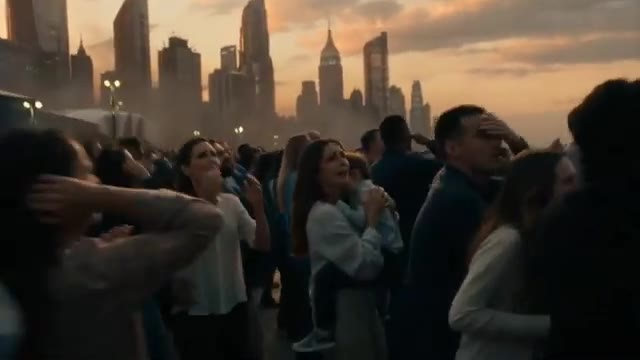
*Extrait du court-métrage généré par l'IA montrant une foule paniquée face à une ville sous la tempête.*

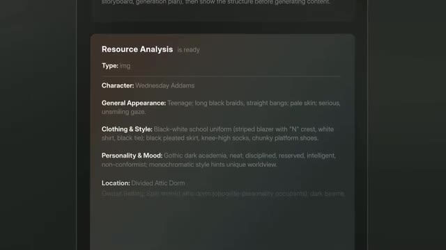
*Panneau d'analyse de ressources de Flova affichant les détails d'un personnage (Mercredi Addams) et son style.*

---

### ⏱️ `[00:02:31 - 00:02:56]` | Segment #07

**🔊 Audio (Transcription Intégrale Mot pour Mot en Français) :**
> C'est Pursuing AI, et vous regardez le Research Report. Maintenant, voici ce qui rend Flova intéressant. Flova n'est pas juste un autre modèle d'IA. C'est plutôt un agent créatif d'IA qui combine plusieurs modèles de pointe de génération de vidéo, d'image, de musique et d'audio en un seul flux de travail. Pour la génération de vidéos, il peut utiliser des modèles comme Seedance V2, Kling, Veo, Happy Horse, et d'autres.

**👁️ Analyse Visuelle d'Écran (gemini-3.5-flash-lite) :**
**Interface & Outils** : Interface web de la plateforme flova.ai et interface de montage de type timeline de Flova.

**Contenu textuel & Code** : Texte affiché : "Flova 1.0 — Your Personal AI Video Agent Partner", "Ask Flova to create a...", "Timeline", "Kling 3.0 Audio", "Vidu Q3 Pro", "Grok Imagine Video", "Kling 3.0 Omni", "Nano banana", "Seedance 1.0 Pro", "Veo3", "WAN2.5", "Sora2".

**Action / Démonstration** : Démonstration visuelle de l'interface de Flova, de ses fonctionnalités multi-modèles et de sa chronologie de montage.

*Illustration graphique montrant un cerveau humain relié par des câbles à une puce affichant les initiales PAI, encerclée par un halo lumineux néon bleu.*

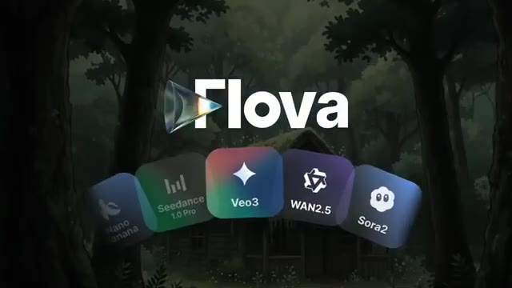
*Écran de présentation du logiciel Flova affichant son logo et les icônes de divers modèles de génération de vidéo pris en charge (Nano banana, Seedance 1.0 Pro, Veo3, WAN2.5, Sora2).*

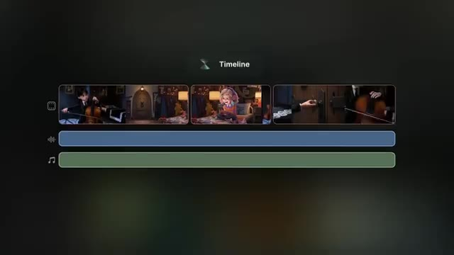
*Interface de montage de Flova présentant une chronologie (Timeline) avec des vignettes de clips vidéo générés et des pistes audio et musicales.*

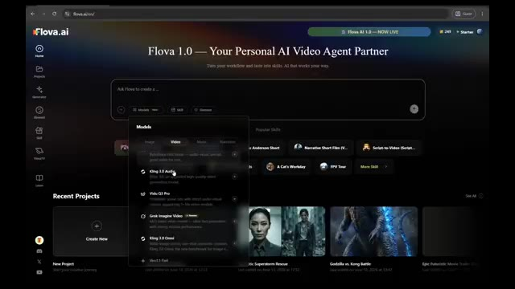
*Interface web de la plateforme flova.ai montrant le tableau de bord principal avec le menu de sélection des modèles vidéo de pointe (Kling 3.0 Audio, Vidu Q3 Pro, Grok Imagine Video, Kling 3.0 Omni).*

---

### ⏱️ `[00:02:56 - 00:03:18]` | Segment #08

**🔊 Audio (Transcription Intégrale Mot pour Mot en Français) :**
> Pour les images, vous avez accès à des modèles tels que GPT Image, Nano Banana, Seedream 4.5, et bien d'autres. Pour la musique et l'audio, l'outil intègre des solutions comme Suno, Mureka et d'autres grands modèles. Au lieu de vous forcer à choisir manuellement le bon modèle pour chaque tâche, Flova sélectionne automatiquement les meilleurs outils en fonction de ce que vous essayez de créer.

**👁️ Analyse Visuelle d'Écran (gemini-3.5-flash-lite) :**
**Interface & Outils** : Navigateur web affichant l'interface de l'application de création vidéo par IA Flova.ai, avec des menus contextuels de modèles et un espace de travail orienté agent conversationnel.

**Contenu textuel & Code** : Texte affiché : "Flova 1.0 — Your Personal AI Video Agent Partner", les onglets de modèles (Image, Video, Music, Narration), les outils Suno et Mureka, ainsi que le nom du projet "Futuristic Superstorm Rescue" et la boîte de discussion interactive.

**Action / Démonstration** : Navigation et démonstration visuelle des différents modèles intégrés dans la plateforme Flova.ai pour la génération d'images, de musique et de voix.

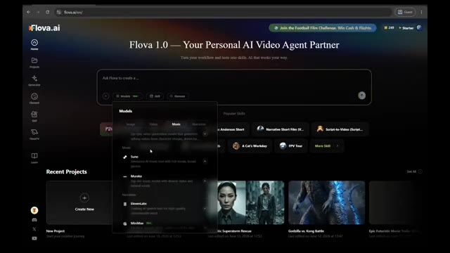
*Interface de Flova.ai montrant le menu déroulant de sélection des modèles musicaux et audio (Suno, Mureka, etc.).*

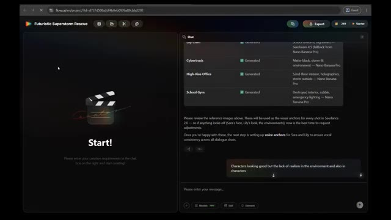
*Interface de projet de Flova.ai avec un panneau de chat interactif et la section de prévisualisation "Futuristic Superstorm Rescue".*

---

### ⏱️ `[00:03:18 - 00:03:39]` | Segment #09

**🔊 Audio (Transcription Intégrale Mot pour Mot en Français) :**
> Pour le tester, j'ai simplement décrit mon idée dans la boîte de saisie. Je n'ai pas écrit de scénario détaillé, j'ai juste expliqué le concept brut d'une femme d'affaires, de sa fille et d'une puissante tempête s'approchant de la ville. Après avoir analysé l'idée, Flova a identifié qu'il s'agissait d'un court-métrage narratif cinématographique et a automatiquement chargé un flux de travail appelé court-métrage narratif.

**👁️ Analyse Visuelle d'Écran (gemini-3.5-flash-lite) :**
**Interface & Outils** : Interface web de l'application Flova (flova.ai) avec un panneau de chat à droite et un panneau de prévisualisation à gauche affichant un bouton 'Start!'.

**Contenu textuel & Code** : Texte du prompt dans la bulle de chat : "A catastrophic superstorm suddenly strikes a futuristic city. A successful businesswoman is working in her high-rise office when she receives a call from her young daughter at school..." Réponse de Flova en dessous : "This is a full cinematic short film production — loading the best-fit skill for this narrative-driven pipeline!" avec les différentes phases du pipeline listées (Script, Spec & Storyboard, Character Elements, Voice Anchors, Shot Videos, Audio Layers, Final Assembly & Export).

**Action / Démonstration** : L'interface affiche le prompt textuel soumis par l'utilisateur et la réponse automatisée de l'IA qui charge le workflow adapté (Narrative Short Film).

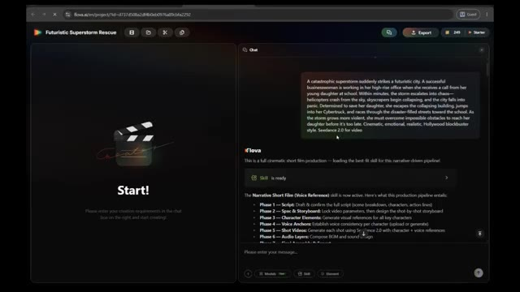
*Interface de Flova montrant le panneau de chat avec le prompt textuel décrivant le court-métrage et le chargement automatique du flux de travail 'Narrative Short Film'.*

---

### ⏱️ `[00:03:39 - 00:04:12]` | Segment #10

**🔊 Audio (Transcription Intégrale Mot pour Mot en Français) :**
> Dans Flova, ces flux de travail sont appelés des compétences (skills), mais les compétences sont bien plus que de simples pipelines de production. Une compétence peut stocker un flux de travail créatif entier, incluant les personnages, les styles visuels, les ressources, les choix de modèles, les paramètres de production et les processus de génération. Cela signifie que si vous créez plusieurs épisodes, des suites ou une série entière, vous pouvez réutiliser la même compétence et maintenir la cohérence sans tout reconstruire à partir de zéro. Flova comprend également une bibliothèque de compétences remplie de flux de travail prêts à l'emploi créés par des créateurs expérimentés.

**👁️ Analyse Visuelle d'Écran (gemini-3.5-flash-lite) :**
**Interface & Outils** : Interface web de Flova (flova.ai), comprenant un espace de projet avec des documents de spécifications, un panneau de chat interactif et une bibliothèque de compétences ("Skill") classées par catégories.

**Contenu textuel & Code** : Sur l'image 1 : URL "flova.ai/m/project/id...", titre "Futuristic Superstorm Rescue", documents "Final_Video_Spec.md", "skill.md", et des instructions de chat détaillant les phases de production ("Narrative Short Film (Voice Reference)"). Sur l'image 2 : Onglets "My", "Featured", catégories (Essentials, Auteur Aesthetics, Drama, etc.), et cartes de compétences telles que "Humanized Cat Shorts", "Cozy AI Vlog Creator", "Methodology Video Builder", "Akira Toriyama Style Animated Short", "Manifesto-Driven Concept Short", "Surreal Pop Aesthetic Concept Video Generation".

**Action / Démonstration** : Navigation dans l'interface de Flova montrant la structure d'un projet de court métrage et la bibliothèque de compétences pré-conçues.

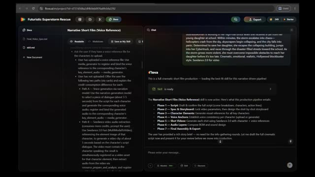
*Interface de l'application web Flova affichant un projet de court métrage narratif avec un panneau de documentation et une interface de chat.*

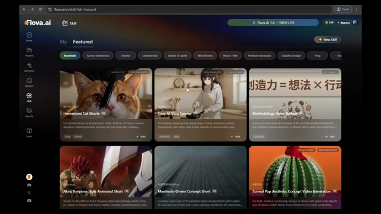
*Bibliothèque de compétences (Skill library) de Flova présentant différents modèles et flux de travail prêts à l'emploi pour les créateurs.*

---

### ⏱️ `[00:04:12 - 00:04:32]` | Segment #11

**🔊 Audio (Transcription Intégrale Mot pour Mot en Français) :**
> Donc même si vous débutez complètement dans la réalisation de films par IA, vous pouvez partir de flux de travail professionnels éprouvés et les personnaliser pour vos propres histoires. Une fois la compétence chargée, Flova a commencé à suivre son processus de production. D'abord, il a généré toute l'histoire et le scénario. Ensuite, il m'a demandé de tout examiner et d'apporter les modifications souhaitées.

**👁️ Analyse Visuelle d'Écran (gemini-3.5-flash-lite) :**
**Interface & Outils** : Navigateur web affichant l'interface de la plateforme Flova AI (flova.ai).

**Contenu textuel & Code** : Image 1 : Fenêtre contextuelle montrant le titre "Cozy AI Vlog Creator", une section "Process Planning" avec les étapes "1. Lock Global Parameters" et "2. Storyboard Design". Image 2 : Projet "Futuristic Superstorm Rescue" avec un panneau latéral montrant un panneau de discussion ("Chat") contenant des blocs de script découpés par scènes ("SCENE 1", "SCENE 2", "SCENE 3") et un champ de saisie de texte en bas.

**Action / Démonstration** : Navigation et affichage des détails d'une compétence de création de vlog sur l'image 1, puis basculement sur l'interface de projet montrant le script généré par l'IA sur l'image 2.

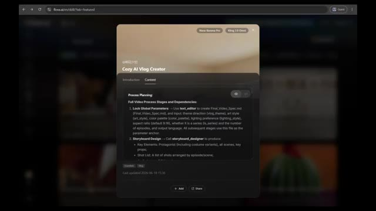
*Interface de Flova affichant les détails et le contenu d'une compétence "Cozy AI Vlog Creator" avec sa planification de processus.*

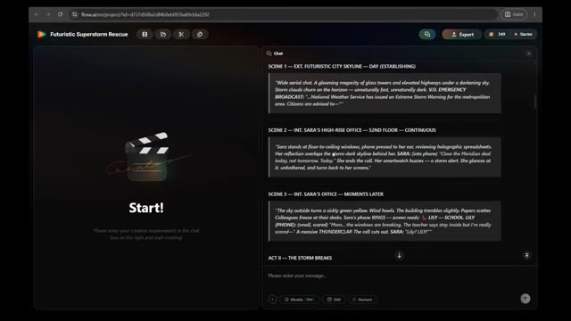
*Interface de Flova affichant la génération du scénario et des scènes pour un projet intitulé "Futuristic Superstorm Rescue".*

---

### ⏱️ `[00:04:32 - 00:04:53]` | Segment #12

**🔊 Audio (Transcription Intégrale Mot pour Mot en Français) :**
> Après avoir approuvé le scénario, il a automatiquement planifié la production. Il a décidé de créer 13 plans différents et trois pistes musicales de fond distinctes. Ensuite, il a demandé si j'avais des références de personnages. Je n'en avais pas, il a donc généré les personnages entièrement avec l'IA. Ce qui est intéressant, c'est qu'il a automatiquement sélectionné le modèle d'image le plus adapté à la tâche.

**👁️ Analyse Visuelle d'Écran (gemini-3.5-flash-lite) :**
**Interface & Outils** : Interface web de Flova AI (flova.ai) avec un panneau de prévisualisation à gauche (« Start! ») et un panneau de chat interactif (« Chat ») à droite affichant les spécifications de la vidéo.

**Contenu textuel & Code** : Dans le panneau de droite, on peut lire les paramètres confirmés de la vidéo (« Final Video Spec ») : titre (Storm Signal), type (Cinematic Action Drama), durée (~2-3 min), format (16:9), style visuel (Realistic Hollywood blockbuster), modèle vidéo (Seedance 2.0), modèle d'image (Nano Banana Pro), et musique de fond (Suno 5). Le storyboard indique 5 éléments clés, 13 plans sur 4 actes, et 3 couches audio BGM. Le texte demande ensuite si l'utilisateur possède des images de référence pour les personnages (Sara ou Lily).

**Action / Démonstration** : L'interface affiche le récapitulatif de la planification automatique de la production et pose une question interactive dans le chat pour savoir si l'utilisateur souhaite importer des images de référence de personnages.

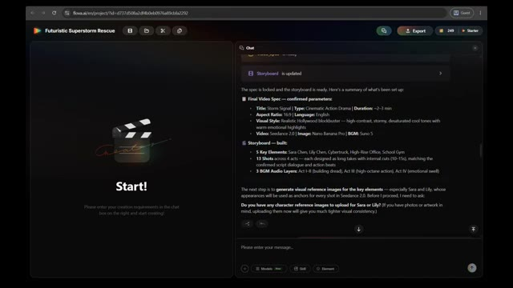
*Interface du logiciel de création vidéo par IA (Flova AI) montrant le résumé de la configuration du projet, les paramètres de production, le storyboard et l'assistant conversationnel.*

---

### ⏱️ `[00:04:53 - 00:05:11]` | Segment #13

**🔊 Audio (Transcription Intégrale Mot pour Mot en Français) :**
> Dans ce projet, il a utilisé Nano Banana pour créer le design des personnages. Une fois les personnages approuvés, Flova a commencé à générer chaque scène étape par étape. Et c'est là que les choses ont commencé à devenir vraiment impressionnantes. Regardez ces plans. L'éclairage, l'atmosphère, la composition de la caméra, le réalisme.

**👁️ Analyse Visuelle d'Écran (gemini-3.5-flash-lite) :**
**Interface & Outils** : Interface web de l'outil de création vidéo Flova.ai avec un panneau latéral de storyboard et un panneau de chat/génération d'actifs.

**Contenu textuel & Code** : On peut lire des titres de projets comme 'Futuristic Superstorm Rescue', des éléments de storyboard comme 'Element_School_Gym' et des rapports d'analyse d'agents de génération d'images.

**Action / Démonstration** : Le logiciel affiche l'état de la génération des différentes scènes et ressources du projet, suivi du rendu visuel final d'un personnage.

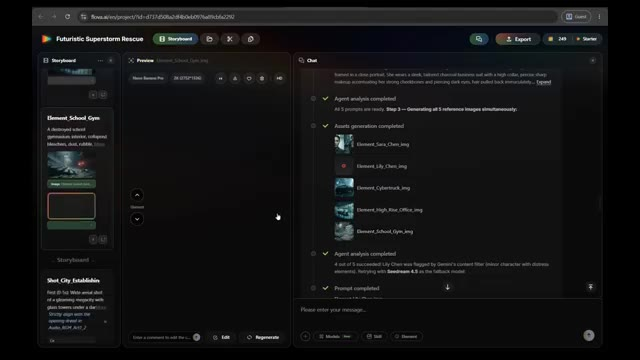
*Interface du logiciel Flova.ai montrant le panneau de storyboard et les étapes de génération des actifs du projet 'Futuristic Superstorm Rescue'.*

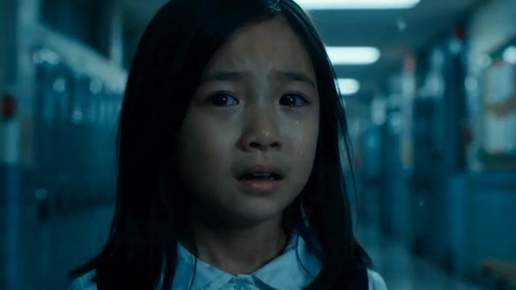
*Gros plan cinématographique d'une jeune fille en pleurs dans un couloir d'école, illustrant le réalisme et l'éclairage de la scène générée.*

---

### ⏱️ `[00:05:11 - 00:05:33]` | Segment #14

**🔊 Audio (Transcription Intégrale Mot pour Mot en Français) :**
> On a vraiment l'impression de voir des scènes d'un vrai film. Le plus fou, c'est que je n'ai jamais écrit de prompts pour ces plans individuels. Flova a généré tous les prompts de scène automatiquement. Mon rôle consistait simplement à examiner le résultat et à donner mon avis chaque fois que je voulais modifier quelque chose. Mais ce qui m'a encore plus impressionné, c'est le contrôle que l'on conserve tout au long du processus.

**👁️ Analyse Visuelle d'Écran (gemini-3.5-flash-lite) :**
**Interface & Outils** : Interface web de Flova AI (flova.ai/m/project/...)

**Contenu textuel & Code** : Interface web affichant un aperçu de projet Flova AI avec des visuels de personnage générés (gros plan et plan en pied d'une petite fille en uniforme scolaire sur fond neutre).

**Action / Démonstration** : Visualisation du projet sur l'interface de Flova AI pour illustrer la génération de plans cinématographiques.

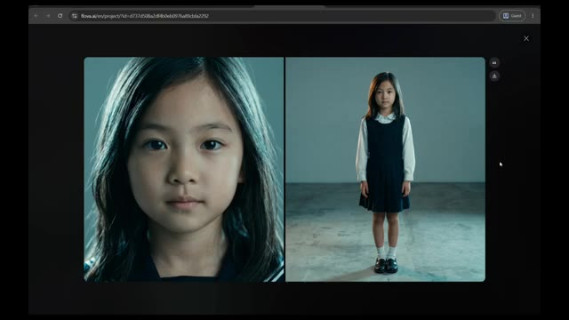
*Interface web de l'outil Flova AI montrant deux plans rapprochés d'une jeune fille dans un style cinématographique.*

---

### ⏱️ `[00:05:33 - 00:05:51]` | Segment #15

**🔊 Audio (Transcription Intégrale Mot pour Mot en Français) :**
> Ce n'est pas de ces systèmes où l'on appuie sur un bouton en croisant les doigts. À tout moment, vous pouvez sauter directement dans le storyboard et modifier des scènes spécifiques. Peut-être voulez-vous un mouvement de caméra différent. Peut-être qu'une scène a besoin de plus d'émotion. Peut-être qu'une action de personnage ne semble pas correcte. Ou peut-être qu'un seul plan a besoin d'être régénéré.

**👁️ Analyse Visuelle d'Écran (gemini-3.5-flash-lite) :**
**Interface & Outils** : Application web flova.ai (interface de montage et storyboard par IA) comprenant un menu supérieur avec l'onglet Storyboard et Media, un panneau de gauche pour le storyboard et les éléments, un panneau central de prévisualisation et de médias, et un panneau de chat à droite.

**Contenu textuel & Code** : Nom du projet : « Futuristic Superstorm Rescue ». Panneau de chat affichant le statut de l'analyse par l'agent (« Agent analysis completed ») avec un tableau récapitulatif des éléments (Sara Chen, Lily Chen, Cybertruck, High-Rise Office, School Gym) avec leur statut « Generated » et des notes techniques. Dans la prévisualisation, des images de référence d'une jeune fille (Lily Chen) sont affichées.

**Action / Démonstration** : Affichage de l'interface complète de gestion de projet et de storyboard sur l'outil de création vidéo par IA flova.ai.

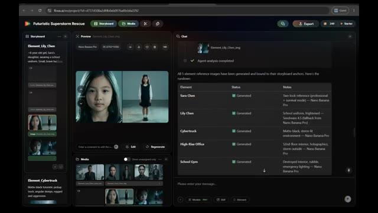
*Interface de l'application de création vidéo par IA (flova.ai) affichant un projet nommé « Futuristic Superstorm Rescue » avec le storyboard, la prévisualisation des scènes, les médias et un panneau de chat de l'agent.*

---

### ⏱️ `[00:05:52 - 00:06:13]` | Segment #16

**🔊 Audio (Transcription Intégrale Mot pour Mot en Français) :**
> Au lieu de reconstruire l'ensemble du projet, vous pouvez simplement dialoguer avec l'agent, décrire la modification souhaitée, et Flova met à jour cette partie spécifique du film. Une fois que vous êtes satisfait du résultat, vous pouvez passer directement à l'édition de la chronologie et à l'exportation. Ce niveau de contrôle donne l'impression que le flux de travail est beaucoup plus proche d'un véritable pipeline de production, plutôt que d'un simple générateur de vidéo par IA.

**👁️ Analyse Visuelle d'Écran (gemini-3.5-flash-lite) :**
**Interface & Outils** : Interface web de Flova (flova.ai) avec un thème sombre, divisée en plusieurs panneaux : Storyboard à gauche, Prévisualisation et Médias au centre, et un panneau de Chat IA à droite.

**Contenu textuel & Code** : On peut lire dans le panneau de chat le prompt utilisateur : "Characters looking good but the lack of realism in the environment and also in characters" ainsi que la réponse de l'agent Flova indiquant qu'il a régénéré les références d'éléments avec un accent accru sur le réalisme photoréaliste et cinématique. Dans la barre supérieure, le nom du projet est "Futuristic Superstorm Rescue".

**Action / Démonstration** : Le créateur montre l'interface de Flova où l'agent conversationnel discute et met à jour des parties spécifiques d'un film ou d'un storyboard en temps réel.

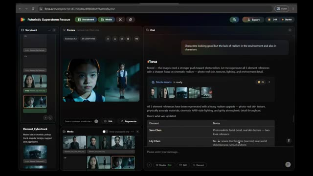
*Interface de l'application Flova montrant le storyboard, la prévisualisation vidéo, les éléments multimédias et le panneau de chat textuel avec l'agent IA.*

---

### ⏱️ `[00:06:13 - 00:06:33]` | Segment #17

**🔊 Audio (Transcription Intégrale Mot pour Mot en Français) :**
> Et honnêtement, c'est probablement le plus grand avantage ici. Vous n'avez pas besoin de devenir un ingénieur de prompt expert. Vous n'avez pas besoin d'apprendre quel modèle vidéo fonctionne le mieux pour les scènes d'action, ou quel modèle d'image crée les personnages les plus cohérents. Vous vous concentrez sur l'idée créative. L'agent gère le processus de production. Une fonctionnalité que j'aime vraiment ce sont les compétences (skills).

**👁️ Analyse Visuelle d'Écran (gemini-3.5-flash-lite) :**
**Interface & Outils** : Interface web de l'application Flowa AI (flowa.ai) comprenant un volet multimédia à gauche, un lecteur/prévisualiseur au centre, une timeline en bas à gauche et un assistant textuel interactif (Chat) à droite.

**Contenu textuel & Code** : On peut lire des éléments de texte dans le volet de chat comme "Great — with all element references approved, we're ready to move to the next phase: voice anchors for Sara and Lily", "Path B — Seedance video audio extraction", et un prompt narratif détaillé décrivant une tempête menaçant une ville futuriste ("A catastrophic superstorm suddenly strikes a futuristic city..."). Le projet s'intitule "Futuristic Superstorm Rescue".

**Action / Démonstration** : L'écran présente l'interface complète de production vidéo par IA de Flowa, montrant la gestion des éléments multimédias, l'interaction avec l'agent textuel pour choisir les options de production audio/vidéo et la prévisualisation des clips générés.

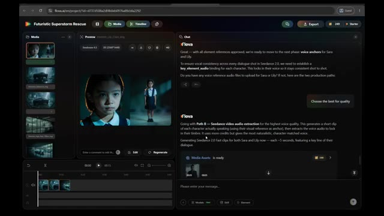
*Interface de l'application Flowa AI montrant les options de discussion de l'agent pour la sélection des voix des personnages (voix de Sara et Lily) et les médias associés générés.*

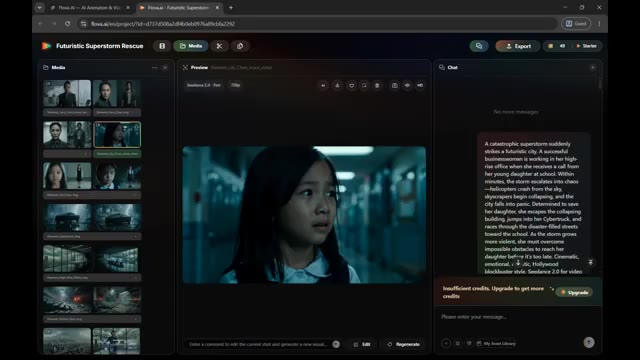
*Interface de l'application Flowa AI affichant un panneau de prévisualisation vidéo avec une scène dramatique d'une jeune fille, et le volet de chat à droite détaillant le scénario et l'avertissement de crédits insuffisants.*

---

### ⏱️ `[00:06:33 - 00:06:52]` | Segment #18

**🔊 Audio (Transcription Intégrale Mot pour Mot en Français) :**
> Une fois que vous avez construit un flux de travail qui vous plaît, vous pouvez simplement cliquer sur enregistrer et le transformer en compétence. Cela signifie que vous n'avez pas tout à reconstruire à partir de zéro à chaque fois. Vous pouvez le réutiliser chaque fois que vous commencez un nouveau projet, ce qui fait gagner beaucoup de temps. Et si vous débutez, vous n'avez même pas besoin de créer votre propre flux de travail. Ouvrez simplement la bibliothèque de compétences où d'autres créateurs ont déjà partagé leurs flux de travail.

**👁️ Analyse Visuelle d'Écran (gemini-3.5-flash-lite) :**
**Interface & Outils** : Flova.ai (interface de création vidéo par IA avec gestion de workflows et de compétences).

**Contenu textuel & Code** : Éditeur de documents avec "Process Planning", panneau de chat latéral avec le statut "Skill is ready", et bibliothèque de compétences classées par catégories (Essentials, Auteur Aesthetics, Drama, etc.) avec des cartes comme "Toy IP Design Kit", "Dark Chinese Mythic Fantasy", "Classic 3D J-Horror".

**Action / Démonstration** : Le curseur de la souris clique sur le bouton "Save as My Skill" pour enregistrer le workflow, puis navigue dans la bibliothèque de compétences pour montrer les modèles partagés.

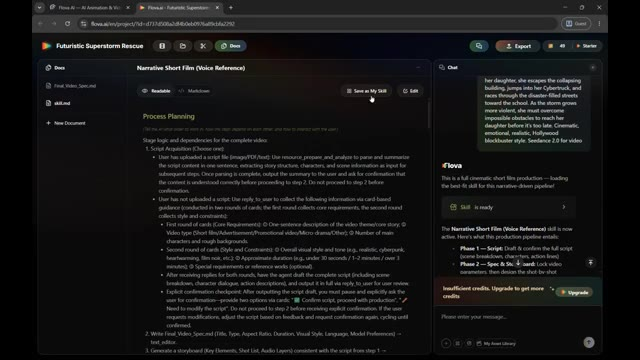
*Interface de Flova.ai montrant un projet de court-métrage narratif avec le bouton "Save as My Skill".*

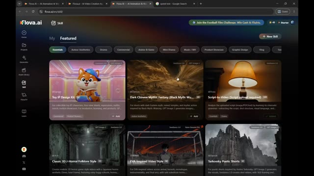
*Bibliothèque de compétences (Skill library) sur Flova.ai affichant des modèles partagés par d'autres créateurs.*

---

### ⏱️ `[00:06:53 - 00:07:15]` | Segment #19

**🔊 Audio (Transcription Intégrale Mot pour Mot en Français) :**
> Vous pouvez les parcourir, choisir celui dont vous avez besoin et commencer à générer des vidéos en quelques clics seulement. C'est l'un des moyens les plus simples d'apprendre à utiliser la plateforme tout en obtenant des résultats de haute qualité. Vous pouvez également explorer des projets créés par d'autres utilisateurs et même voir comment ces projets ont été réalisés. Flova montre le flux de travail, les modèles et le processus créatif derrière de nombreuses créations, ce qui facilite l'apprentissage et l'amélioration de vos propres projets.

**👁️ Analyse Visuelle d'Écran (gemini-3.5-flash-lite) :**
**Interface & Outils** : Navigateur web affichant l'interface de la plateforme Flova AI (flova.ai).

**Contenu textuel & Code** : Texte descriptif de projets de design, processus de planification, étapes de fabrication, spécifications techniques, éléments de storyboard et panneau de discussion avec l'intelligence artificielle.

**Action / Démonstration** : Navigation à travers les projets et exploration des workflows et processus créatifs d'autres utilisateurs sur la plateforme Flova.

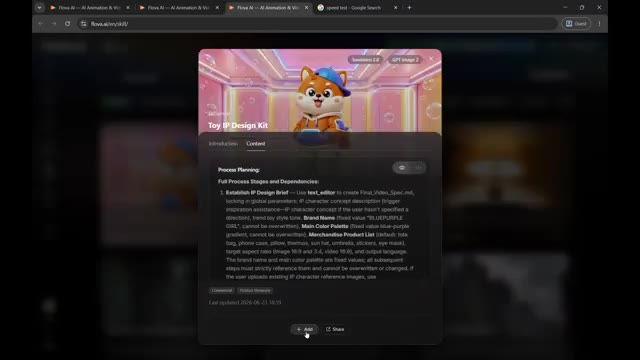
*Interface de Flova montrant le kit de design IP de jouet avec la planification du processus et le bouton d'ajout.*

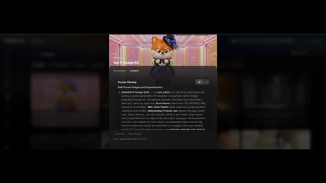
*Interface de Flova affichant une variante de personnage de jouet IP avec les étapes du processus et de dépendances.*

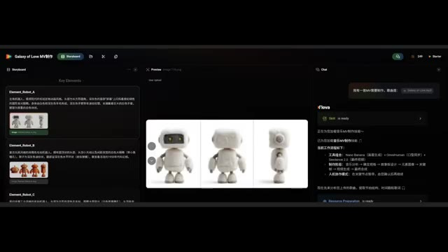
*Interface de Flova montrant le storyboard pour la création d'un clip vidéo avec des éléments robotiques et le panneau de chat.*

---

### ⏱️ `[00:07:16 - 00:07:49]` | Segment #20

**🔊 Audio (Transcription Intégrale Mot pour Mot en Français) :**
> Donc après avoir passé du temps avec Flova, je comprends pourquoi des outils de ce genre attirent autant l'attention. La combinaison de plusieurs modèles d'IA, de compétences réutilisables, de flux de travail contrôlables, de modèles professionnels et d'une production automatisée rend la création de contenu cinématographique nettement plus facile qu'il y a un an à peine. Et si vous voulez l'essayer vous-même, Flova vous offre cent crédits lors de votre inscription, plus 200 crédits supplémentaires en explorant la plateforme afin que vous puissiez découvrir ses fonctionnalités et commencer à créer vos propres projets d'IA. La question n'est plus de savoir si l'IA peut

**👁️ Analyse Visuelle d'Écran (gemini-3.5-flash-lite) :**
**Interface & Outils** : Interface de la plateforme web Flova dédiée à la création de contenu vidéo par intelligence artificielle.

**Contenu textuel & Code** : Noms des modèles d'IA (Seedream 4.0, Nano Banana, Midjourney V7), plans tarifaires de la plateforme Flova (Free à $0, Starter à $16, Basic à $41, Pro à $166) et détails des flux de travail automatisés.

**Action / Démonstration** : Navigation dans l'interface de Flova, sélection de modèles d'IA via le menu déroulant et consultation des grilles tarifaires.

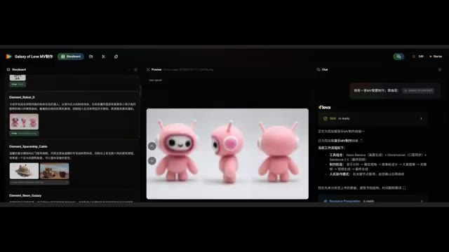
*Interface principale de Flova montrant le projet 'Galaxy of Love' avec le storyboard et l'aperçu d'un personnage robot rose en 3D.*

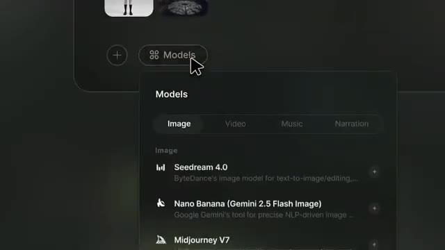
*Menu déroulant de sélection des modèles d'IA ('Models') pour l'image avec Seedream 4.0, Nano Banana et Midjourney V7.*

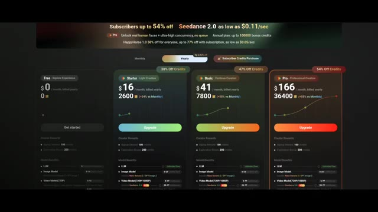
*Page de tarification et des abonnements de Flova montrant les différents forfaits (Free, Starter, Basic, Pro) et les crédits associés.*

*Rendu visuel cinématographique d'une pièce mystérieuse avec une grande porte en bois, une bibliothèque et des étagères.*

---

### ⏱️ `[00:07:49 - 00:08:05]` | Segment #21

**🔊 Audio (Transcription Intégrale Mot pour Mot en Français) :**
> aider à faire des films. La question est de savoir jusqu'où cette technologie ira à partir de maintenant. Si vous avez apprécié ce rapport de recherche, assurez-vous d'aimer la vidéo, de vous abonner à Pursuing AI, et dites-moi dans les commentaires, l'IA pourrait-elle éventuellement devenir un concurrent sérieux pour le cinéma traditionnel ? Je vous vois dans la prochaine.

**👁️ Analyse Visuelle d'Écran (gemini-3.5-flash-lite) :**
**Interface & Outils** : Extraits vidéo de démonstration avec le filigrane/logo de la plateforme Flova.ai.

**Contenu textuel & Code** : Logos de la plateforme Flova.ai sur les images 2 et 3, ainsi qu'une grille de plusieurs vidéos générées sur l'image 1.

**Action / Démonstration** : Démonstration de clips vidéo générés par intelligence artificielle mettant en scène divers personnages et scènes de films.

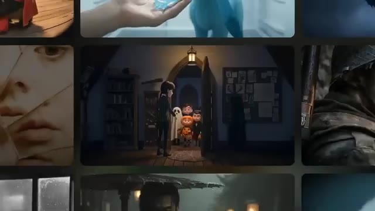
*Grille de vignettes vidéo illustrant différents types de productions visuelles générées par IA.*

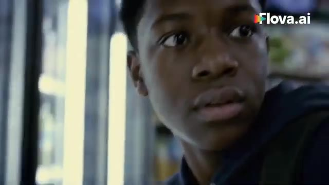
*Gros plan sur un jeune homme dans une épicerie avec le logo Flova.ai visible en haut à droite.*

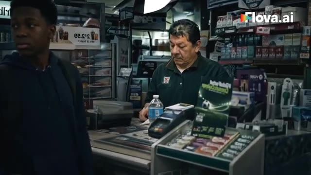
*Plan large d'un jeune homme dans un magasin près du comptoir avec un caissier, le logo Flova.ai en haut à droite.*

---
