# 🎬 Claude Fable 5 vs GPT-5.6 : qui gagne vraiment ?

> **Chaîne** : [Pursuing AI](https://www.youtube.com/@PursuingAi)  
> **Titre original** : `Claude Fable 5 vs GPT-5.6: Who Actually Wins?`  
> **Lien YouTube** : [https://www.youtube.com/watch?v=Zk9o9CQy8NA](https://www.youtube.com/watch?v=Zk9o9CQy8NA)  
> **Date de publication** : 2026-07-08  
> **Durée** : 04m 12s (`252s`)  
> **Identifiant vidéo** : `Zk9o9CQy8NA`  
> **Fiche Web Interactive** : [2026-07-08_YT-Zk9o9CQy8NA_Claude Fable 5 vs GPT-5.6 qui gagne vraiment_by-whisper-v3-large-turbo+gemini-3.5-flash-lite.html](2026-07-08_YT-Zk9o9CQy8NA_Claude Fable 5 vs GPT-5.6 qui gagne vraiment_by-whisper-v3-large-turbo+gemini-3.5-flash-lite.html)  
> **Captures de démonstration clés** : `32 captures réelles (anti-talking-head)`  
> **Modèles utilisés** : Audio: `large-v3-turbo` (Faster-Whisper int8 VPS) | Vision: `gemini-3.5-flash-lite` (Google AI Studio API)  

---

## 📌 Synthèse Exécutive & Outils

### 📌 Résumé
La vidéo de *Pursuing AI* propose un combat de titans entre deux des modèles d'intelligence artificielle générative les plus avancés du moment : **Claude Fable 5** et **GPT-5.6**. À travers l'analyse comparative de cas d'usage concrets extraits de la plateforme X (anciennement Twitter), le créateur décortique les capacités de ces deux intelligences artificielles sur des terrains complexes tels que l'animation 3D au style voxel, la génération de environnements de jeux vidéo interactifs, et la simulation architecturale. L'analyse met en lumière la rivalité féroce qui oppose ces géants, chacun démontrant des supériorités sectorielles nettes selon que l'on recherche le réalisme visuel brut ou l'interactivité poussée.

Pour mener à bien cette démonstration comparative, la méthode du créateur repose sur une observation empirique rigoureuse, juxtaposant des prompts similaires soumis aux deux intelligences artificielles. Il évalue méthodiquement des critères techniques précis : la fluidité des mouvements, la fidélité physique, la qualité de l'éclairage et le degré d'interactivité (comme la navigation dans des environnements ou l'utilisation d'objets). Cette approche séquentielle permet d'isoler les points forts de chaque écosystème sans parti pris technique.

Pour les créateurs de vidéo, les vidéastes et les développeurs de contenu, ces enseignements redéfinissent les standards de la production visuelle assistée par IA. Comprendre les nuances de performance entre **Claude Fable 5** et **GPT-5.6** permet d'optimiser le choix des outils selon le livrable attendu : privilégier le rendu cinématographique et l'esthétique globale d'un côté, ou miser sur l'interactivité dynamique de type "moteur de jeu" de l'autre. C'est une feuille de route indispensable pour anticiper les workflows de demain dans la création de mondes virtuels.

### 🛠️ Outils, Modèles & Logiciels Présentés
* **Claude Fable 5** : Modèle d'intelligence artificielle générative de pointe, particulièrement performant pour le rendu visuel de haute qualité, l'éclairage soigné et la création d'animations fluides et naturelles.
* **GPT-5.6** : Modèle de nouvelle génération développé par OpenAI, reconnu pour sa capacité exceptionnelle à générer des environnements interactifs complexes, de la physique de jeu poussée et de la simulation architecturale exploitable.
* **U7Buy** : Plateforme tierce de revente d'abonnements numériques présentée comme sponsor, permettant d'accéder à des offres à prix réduits pour des services comme ChatGPT+.

### 🔑 Points Clés & Enseignements Stratégiques
* **Supériorité esthétique de Fable 5 sur les textures** : Dans les animations stylisées (comme le paon en voxel Minecraft), Fable 5 offre un rendu global souvent plus propre et séduisant.
* **Fluidité et naturel du mouvement** : GPT-5.6 rivalise et surpasse parfois Fable 5 sur la cinématique organique des corps et la précision des flux de mouvement globaux.
* **Arbitrage entre rendu et interactivité** : Le choix technologique dépend de l'objectif final : Fable 5 excelle dans la qualité pure du rendu, tandis que GPT-5.6 l'emporte sur la profondeur fonctionnelle.
* **Gestion de l'éclairage (Lighting)** : Fable 5 conserve une longueur d'avance sur la maîtrise des ambiances lumineuses et des ombres réalistes, notamment dans les scènes architecturales.
* **Immersion et interactivité architecturale** : GPT-5.6 permet de générer des environnements visitables de type *GTA V*, où l'utilisateur peut réellement ouvrir des portes, des tiroirs ou interagir avec les lumières.
* **Gestion des limites dans les rendus de jeux de tir (FPS)** : Fable 5 simule des mécaniques de tir et de visée (utilisation de la lunette) extrêmement convaincantes, dignes de studios professionnels.
* **Écueils de la génération d'armes par GPT-5.6** : Dans les séquences d'action, GPT-5.6 montre des faiblesses techniques, notamment avec des lunettes de visée totalement obturées qui nuisent à la lisibilité de l'action.
* **Gestion de la physique et des moteurs de jeu** : Les deux outils démontrent une capacité bluffante à générer des environnements vidéoludiques dotés d'une physique impressionnante et de mécaniques de collecte fluides.
* **Équilibre concurrentiel inattendu** : La compétition entre les deux IA est beaucoup plus serrée que prévu, chaque modèle gagnant à tour de rôle selon le cas d'usage spécifique testé.
* **Analyse critique des prompts complexes** : L'évaluation démontre qu'aucun modèle n'est universellement supérieur ; l'hybridation des workflows ou le choix ciblé du modèle selon la scène est capital pour un créateur.

---

## ⏱️ Chronologie & Transcription Complète Audio & Visuelle (Mot pour Mot)

### ⏱️ `[00:00:00 - 00:00:35]` | Segment #01

**🔊 Audio (Transcription Intégrale Mot pour Mot en Français) :**
> Claude Fable 5 est de retour et GPT-5.6 est enfin là. Mais il n'y a qu'une seule question. Qui est réellement en train de gagner ? Regardons les vrais exemples que les gens publient sur X. C'est Pursuing AI et vous regardez le Research Report. Commençons par cette animation de paon style voxel Minecraft générée par Fable 5. À première vue, ça a l'air plutôt bien. L'animation est fluide et le style global est impressionnant. Mais comparez-la maintenant avec la génération de GPT-5.6. La différence

**👁️ Analyse Visuelle d'Écran (gemini-3.5-flash-lite) :**
**Interface & Outils** : Interface de présentation vidéo / démo de générations d'IA.

**Contenu textuel & Code** : Textes visibles : "NOW SHOWING FABLE 5", "CALIBER NYX-01", codes et options textuelles en bas à gauche de la vidéo de la voiture.

**Action / Démonstration** : Présentation d'exemples de générations de modèles vidéo par IA (Fable 5 et GPT-5.6) incluant des animations de style voxel (paon, voiture) et des rendus complexes 3D.

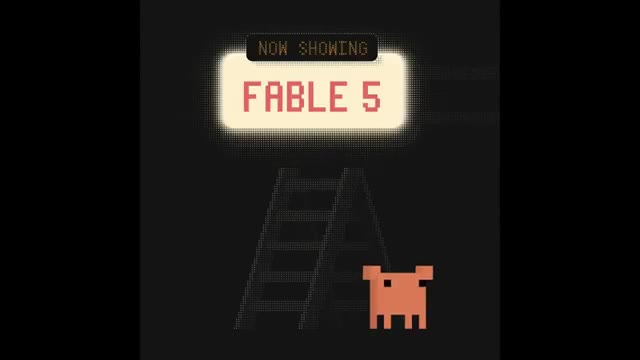
*Écran titre affichant 'NOW SHOWING FABLE 5' avec une petite créature pixelisée et une échelle en arrière-plan.*

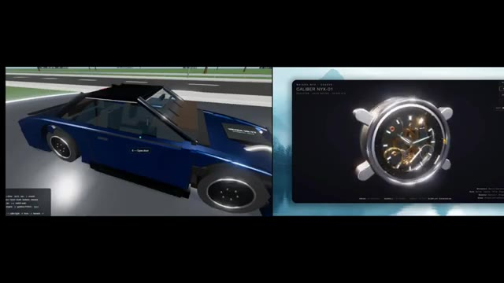
*Démonstration comparative divisée en deux fenêtres : à gauche, une voiture bleue en voxel style 3D dans un environnement routier ; à droite, une montre-gousset mécanique détaillée nommée 'CALIBER NYX-01'.*

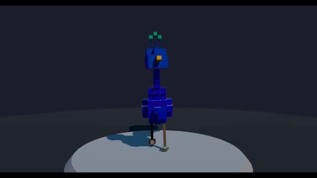
*Animation en vue frontale d'un paon en blocs de type voxel se tenant sur un socle circulaire dans un environnement sombre.*

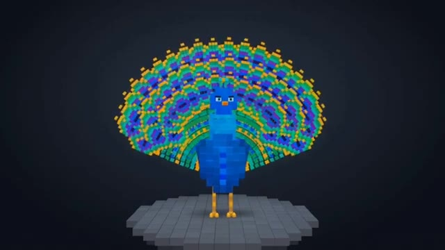
*Animation du même paon en voxel déployant magnifiquement sa grande roue aux motifs colorés bleus, verts et jaunes.*

---

### ⏱️ `[00:00:35 - 00:01:07]` | Segment #02

**🔊 Audio (Transcription Intégrale Mot pour Mot en Français) :**
> devient clair presque immédiatement. L'animation des plumes du paon a l'air beaucoup plus fluide, le mouvement du corps semble plus naturel, et le mouvement global a un flux beaucoup plus réaliste. Fable 5 offre définitivement un bon résultat, mais dans cette comparaison, GPT-5.6 l'emporte clairement. Avant de continuer, un grand merci au sponsor d'aujourd'hui, U7Buy. Si vous avez pensé à vous procurer ChatGBT+, mais que vous ne voulez pas payer le prix mensuel complet, U7Buy vaut le détour.

**👁️ Analyse Visuelle d'Écran (gemini-3.5-flash-lite) :**
**Interface & Outils** : Navigateur web affichant la plateforme U7Buy et interface vidéo de comparaison.

**Contenu textuel & Code** : Texte affichant "FABLE 5" et "GPT 5.6", ainsi que le site "U7Buy" avec divers bannières de jeux.

**Action / Démonstration** : Présentation comparative de deux modèles d'IA générative de vidéo puis affichage publicitaire du site partenaire.

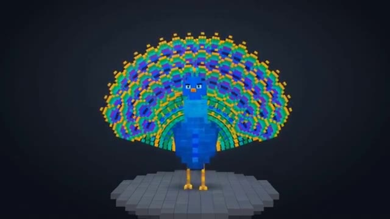
*Animation d'un paon en blocs de type voxel sur un socle circulaire gris.*

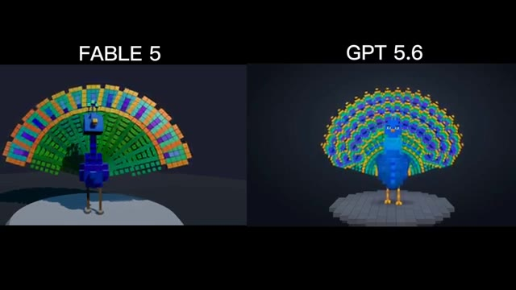
*Comparaison côte à côte entre Fable 5 et GPT 5.6 affichant des animations de paons en blocs.*

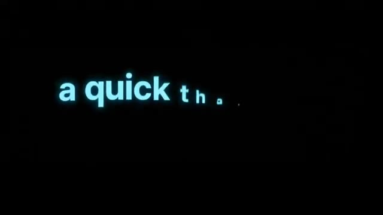
*Texte animé en caractères lumineux sur fond noir affichant "a quick th...".*

*Capture d'écran du site web U7Buy montrant des bannières de jeux et des options de navigation.*

---

### ⏱️ `[00:01:07 - 00:01:31]` | Segment #03

**🔊 Audio (Transcription Intégrale Mot pour Mot en Français) :**
> Ils proposent ChatGBT+, des options d'abonnement à des prix inférieurs selon l'offre, et ils ont actuellement une note Trustpilot de 4,8 étoiles basée sur plus de 47 000 avis. Le processus est simple. Il vous suffit de visiter le lien dans la description, de choisir une offre ChatGBT+, d'examiner la note du vendeur et les détails du compte, et lors du paiement, d'utiliser mon code PURSU pour obtenir 5 % de réduction supplémentaire.

**👁️ Analyse Visuelle d'Écran (gemini-3.5-flash-lite) :**
**Interface & Outils** : Navigateur web affichant le site e-commerce U7BUY et une page de profil Trustpilot.

**Contenu textuel & Code** : Textes visibles : "U7BUY", "ChatGPT Accounts for Sale", "Trustpilot 4.8 Excellent", "Subscription Account", "PURSU 5% OFF", options de paiement (Visa, Crypto, Google Pay).

**Action / Démonstration** : Navigation sur le site U7BUY pour présenter les abonnements ChatGPT, la note Trustpilot et l'application d'un code promo lors du paiement.

*Page produit de U7BUY montrant les détails et tarifs des comptes ChatGPT Plus.*

*Profil Trustpilot de la plateforme U7BUY affichant une note de 4,8 étoiles et plus de 47 000 avis.*

*Page de sélection des abonnements sur U7BUY affichant différentes applications comme ChatGPT, Netflix, Spotify et Prime Video.*

*Page de paiement sur U7BUY montrant l'application du code promo 'pursue' pour obtenir 5% de réduction.*

---

### ⏱️ `[00:01:31 - 00:01:50]` | Segment #04

**🔊 Audio (Transcription Intégrale Mot pour Mot en Français) :**
> Si vous cherchez un moyen plus abordable d'accéder à ChatGPT+, consultez U7Buy en utilisant le lien ci-dessous. Merci encore à U7Buy d'avoir sponsorisé cette vidéo, et maintenant revenons-en à nos moutons. Passons maintenant à quelque chose de beaucoup plus stimulant. Ce jeu généré par Fable 5 a été partagé par l'utilisateur Mirochill.

**👁️ Analyse Visuelle d'Écran (gemini-3.5-flash-lite) :**
**Interface & Outils** : Navigateur web affichant le site e-commerce U7Buy puis une publication sur le réseau social X (Twitter).

**Contenu textuel & Code** : Sur U7Buy, les options d'abonnement affichent 'ChatGPT Accounts for Sale', 'Plus (Private)', '1 Month $4.99'. Sur l'écran promotionnel, le texte indique 'USE pursue 5% off code'. Sur X, le post de @mirochill indique 'GPT 5.6 Sol Pro vs Claude Fables 5' avec une image de jeu vidéo montrant une ligne 'START' et des personnages à vélo.

**Action / Démonstration** : Navigation sur le site web promotionnel U7Buy puis affichage d'un post X montrant un test de jeu vidéo généré par IA.

*Page web de la plateforme U7Buy proposant des abonnements ChatGPT+ à prix réduit.*

*Écran promotionnel de U7Buy affichant le code promo 'pursue' offrant 5% de réduction sur Netflix et ChatGPT.*

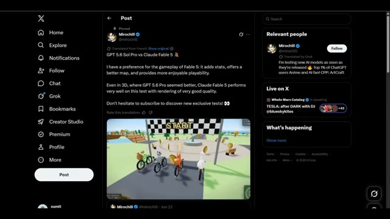
*Publication sur le réseau social X de l'utilisateur Mirochill montrant un jeu en 3D généré par Fable 5.*

---

### ⏱️ `[00:01:50 - 00:02:12]` | Segment #05

**🔊 Audio (Transcription Intégrale Mot pour Mot en Français) :**
> Comme vous pouvez le voir, le gameplay a l'air fluide, la physique est impressionnante, la carte semble plus grande, et même l'animation de collecte des pièces a l'air soignée. Dans l'ensemble, Fable 5 fait un très bon travail avec le rendu des jeux. Mais maintenant, comparez-le avec le GPT 5.6. La première chose que vous remarquerez probablement, c'est que le personnage brille un peu trop.

**👁️ Analyse Visuelle d'Écran (gemini-3.5-flash-lite) :**
**Interface & Outils** : Interface de jeu vidéo avec mini-carte en bas à droite, compteurs de score et classement en haut à droite.

**Contenu textuel & Code** : Éléments de jeu 3D stylisés, pièces dorées à collecter, ligne de départ, noms des joueurs (Moss, Bill, Pippa).

**Action / Démonstration** : Les personnages circulent sur des vélos, collectent des pièces et franchissent la ligne de départ/arrivée sur un circuit asphalté.

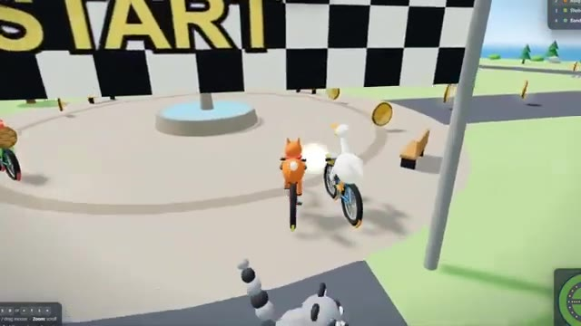
*Séquence de gameplay de Fable 5 montrant des personnages à vélo sous une banderole 'START'.*

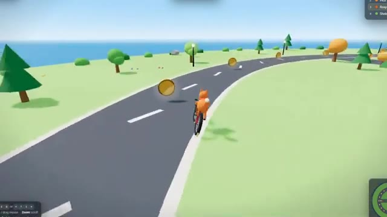
*Vue de la carte et du personnage à vélo roulant sur une route sinueuse en bord de mer.*

*Comparaison avec le jeu GPT 5.6 où un personnage brille de manière excessive au centre de l'écran.*

---

### ⏱️ `[00:02:12 - 00:02:47]` | Segment #06

**🔊 Audio (Transcription Intégrale Mot pour Mot en Français) :**
> Cependant, l'animation du jeu et la physique sont toujours très bonnes. Cela dit, en ce qui concerne la qualité de rendu, Fable 5 fait vraiment un meilleur travail dans cet exemple. Voici maintenant une autre comparaison intéressante. Il s'agit d'une maison en 3D générée par Fable 5. L'éclairage est vraiment bon, mais il y a une limite. On ne peut pas vraiment se déplacer à l'intérieur de la maison. Regardez maintenant la version de GPT 5.6. La toute première chose que vous remarquerez, c'est que vous pouvez réellement vous déplacer dans la maison. Vous pouvez ouvrir et fermer des portes, ouvrir des tiroirs, allumer et éteindre les lumières.

**👁️ Analyse Visuelle d'Écran (gemini-3.5-flash-lite) :**
**Interface & Outils** : Interface web de la plateforme X (anciennement Twitter) et interfaces de visualisation de scènes 3D interactives.

**Contenu textuel & Code** : Texte du tweet : "Claude Fable 5 is back, here's a comparison with GPT 5.6 Pro 👀... It's impossible to move around in the Fable 5 version, but the lighting is better...". Bouton d'interaction à l'écran : "F / Click : switch table lamp on". Mentions du profil "@mirochill".

**Action / Démonstration** : Le créateur navigue à travers des publications comparatives sur les réseaux sociaux et montre des séquences interactives permettant de manipuler des objets dans un environnement 3D généré par intelligence artificielle.

*Scène de gameplay montrant une moto sur une route goudronnée avec des éléments de jeu et des scores.*

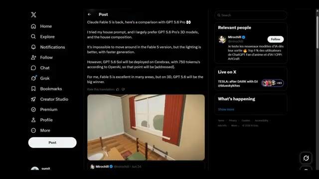
*Interface du réseau social X (Twitter) affichant un tweet de Mirochill comparant Claude Fable 5 et GPT 5.6 Pro avec une vidéo intégrée d'un intérieur 3D.*

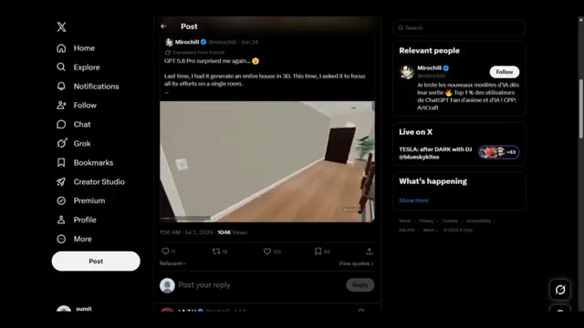
*Capture d'un autre post sur l'interface X montrant une vue intérieure d'une pièce générée en 3D avec un meuble et une porte.*

*Gros plan interactif d'une pièce virtuelle montrant un meuble avec une lampe de table, des livres, un vase de fleurs et une invite contextuelle permettant d'allumer la lampe.*

---

### ⏱️ `[00:02:48 - 00:03:11]` | Segment #07

**🔊 Audio (Transcription Intégrale Mot pour Mot en Français) :**
> En gros, ça génère une maison qui ressemble plus à GTA V. On peut même regarder dehors à travers les fenêtres. La seule chose qui lui manque comparé à Fable V, c'est la qualité de l'éclairage. Mais dans l'ensemble, c'est une génération vraiment impressionnante et qui offre beaucoup plus d'interaction que la version Fable V. Passons maintenant à l'exemple probablement le plus intéressant, un jeu de tir.

**👁️ Analyse Visuelle d'Écran (gemini-3.5-flash-lite) :**
**Interface & Outils** : Interface de jeu vidéo généré par IA avec des indications d'interaction textuelles à l'écran, et navigateur affichant le réseau social X (Twitter).

**Contenu textuel & Code** : Textes d'interface en bas de l'écran « E / Click interact », « doors, curtains, drawers, lights », mentions « @mirochill », ainsi qu'un post sur X de @chetaslua comparant Fable 5 et GPT 5.6 Pro.

**Action / Démonstration** : Navigation et démonstration interactive à l'intérieur d'un environnement de maison généré par IA, puis affichage d'un post comparatif sur X concernant des modèles de génération.

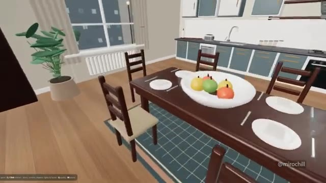
*Vue intérieure d'une maison générée par IA montrant une table à manger, une cuisine équipée et des indications textuelles d'interaction en bas à gauche.*

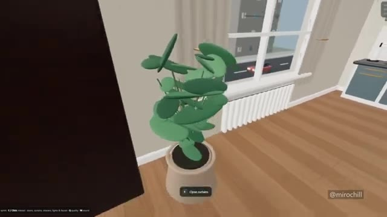
*Vue de la plante verte près de la fenêtre avec un menu contextuel affichant l'option d'interaction « Open curtains » (ouvrir les rideaux).*

*Vue de la fenêtre montrant le mouvement des rideaux qui se ferment ou s'ouvrent, avec le curseur d'interaction et la vue extérieure sur la rue.*

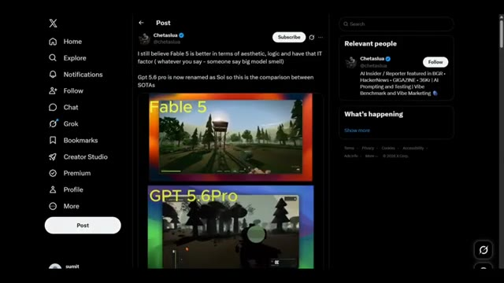
*Capture d'écran du réseau social X (Twitter) montrant un post comparatif entre Fable 5 et GPT 5.6 Pro (Sol) avec deux images de jeux vidéo.*

---

### ⏱️ `[00:03:11 - 00:03:33]` | Segment #08

**🔊 Audio (Transcription Intégrale Mot pour Mot en Français) :**
> C'est la génération Fable 5. Honnêtement, on dirait un vrai jeu fait par des développeurs. L'animation de marche, le lancer de grenade, le fait de regarder à travers la lunette de visée, le mouvement de tir, tout semble naturel et soigné. Maintenant, comparez cela avec le GPT 5.6. L'animation de tir n'est pas aussi bonne, et le plus gros problème, c'est la lunette de visée.

**👁️ Analyse Visuelle d'Écran (gemini-3.5-flash-lite) :**
**Interface & Outils** : Écran de comparaison vidéo divisé en deux parties, illustrant les performances de deux modèles d'IA différents sur le rendu de jeux vidéo en vue subjective (FPS).

**Contenu textuel & Code** : Texte jaune en haut à gauche de chaque section : "Fable 5" pour la vidéo supérieure et "GPT 5.6Pro" pour la vidéo inférieure. Les vidéos montrent des environnements de type jeu de tir en 3D avec des arbres, des rochers et des éléments d'interface de jeu (barre de vie, munitions).

**Action / Démonstration** : Comparaison visuelle de deux rendus de jeux vidéo générés par IA, illustrant les animations de personnages et les mécanismes de visée.

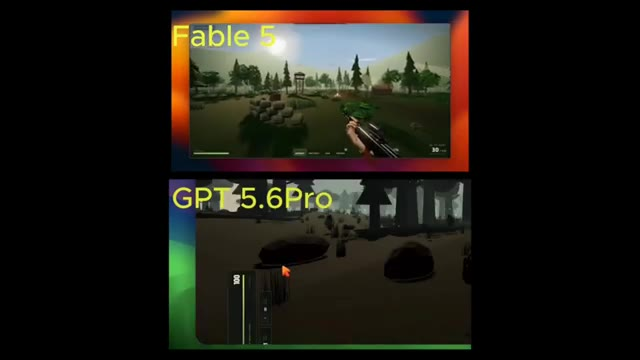
*Comparaison vidéo côte à côte montrant en haut une génération de jeu vidéo par 'Fable 5' et en bas par 'GPT 5.6Pro'.*

---

### ⏱️ `[00:03:33 - 00:03:52]` | Segment #09

**🔊 Audio (Transcription Intégrale Mot pour Mot en Français) :**
> complètement fermé pour qu'on ne puisse pas vraiment voir à travers correctement. Donc après avoir regardé tous ces exemples, voici le bilan global. GPT 5.6 est vraiment bon en génération 3D, mais Fable 5 est meilleur en ce qui concerne la qualité de rendu et pour offrir une expérience plus fluide et plus naturelle.

**👁️ Analyse Visuelle d'Écran (gemini-3.5-flash-lite) :**
**Interface & Outils** : Interface de comparaison comparative affichant des fenêtres de moteurs de rendu 3D labellisées "Fable 5" et "GPT 5.6 Pro".

**Contenu textuel & Code** : Étiquettes textuelles jaunes "Fable 5" et "GPT 5.6 Pro", vues subjectives de jeux vidéo avec des éléments d'interface utilisateur (viseur, compteur de munitions), modélisations 3D d'intérieurs de maison et d'animaux en blocs.

**Action / Démonstration** : Démonstration comparative de performances de génération 3D entre deux technologies différentes (Fable 5 vs GPT 5.6 Pro) à travers des environnements interactifs et des objets modélisés.

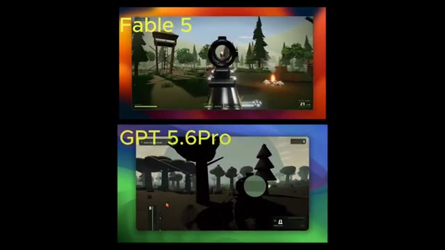
*Comparaison côte à côte ou empilée entre Fable 5 et GPT 5.6 Pro montrant un environnement 3D de type jeu vidéo de tir à la première personne.*

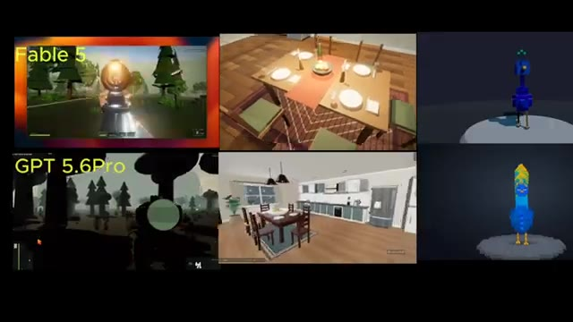
*Comparaison multi-panneaux entre Fable 5 et GPT 5.6 Pro affichant différents types de rendus 3D (scènes de salon et modèles de paon voxel).*

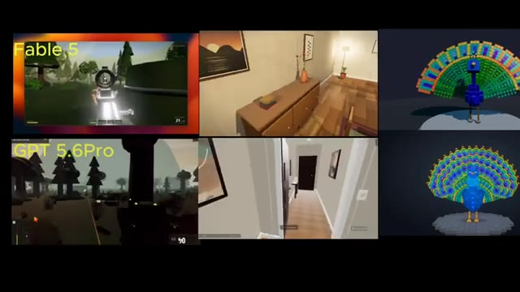
*Comparaison multi-panneaux détaillée montrant l'évolution des rendus intérieurs et le déploiement complet d'un modèle 3D de paon en voxel.*

---

### ⏱️ `[00:03:52 - 00:04:12]` | Segment #10

**🔊 Audio (Transcription Intégrale Mot pour Mot en Français) :**
> En même temps, GPT 5.6 obtient d'excellents résultats et bat même Fable 5 sur plusieurs exemples. La compétition est donc bien plus serrée que beaucoup ne le prévoyaient. Mais maintenant, je veux connaître votre avis. Lequel pensez-vous qui est réellement le meilleur ? Faites-moi part de vos réflexions dans les commentaires, et je vous retrouve dans le prochain rapport de recherche.

**👁️ Analyse Visuelle d'Écran (gemini-3.5-flash-lite) :**
**Interface & Outils** : Écran de comparaison vidéo montrant des tests comparatifs de modèles d'IA (Fable 5 vs GPT 5.6 Pro) avec des rendus 3D, des environnements de jeux et des modélisations d'animaux.

**Contenu textuel & Code** : Mentions textuelles "Fable 5" et "GPT 5.6 Pro" étiquetant les différentes fenêtres de démonstration vidéo montrant des intérieurs de pièces, des paysages forestiers et un paon en voxels 3D.

**Action / Démonstration** : Comparaison visuelle côte à côte de plusieurs exemples de génération entre Fable 5 et GPT 5.6 Pro.

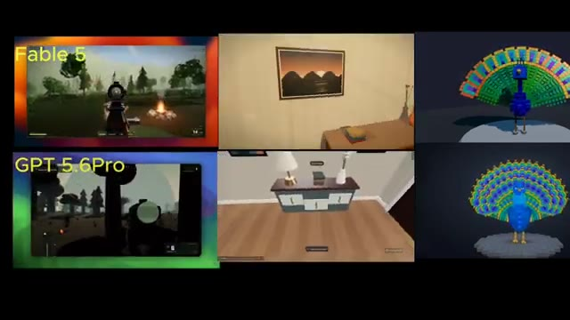
*Comparaison vidéo en grille montrant les performances de Fable 5 et GPT 5.6 Pro sur plusieurs exemples de scènes 3D et de modélisation.*

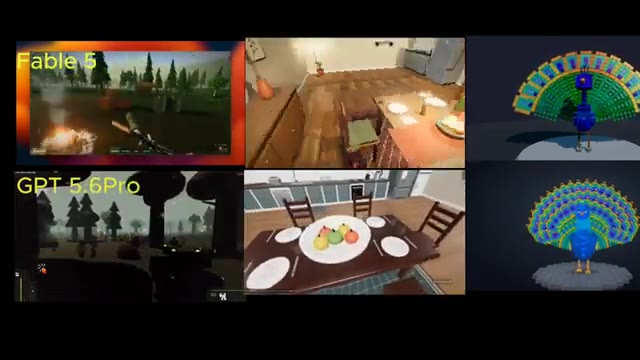
*Suite de la comparaison comparative en grille affichant d'autres exemples de génération entre Fable 5 et GPT 5.6 Pro.*

---
