# 🎬 Je ne m'attendais pas à ce que Grok 4.5 fasse ça

> **Chaîne** : [Pursuing AI](https://www.youtube.com/@PursuingAi)  
> **Titre original** : `I Didn't Expect Grok 4.5 to Do This`  
> **Lien YouTube** : [https://www.youtube.com/watch?v=MTVxdh7q9xg](https://www.youtube.com/watch?v=MTVxdh7q9xg)  
> **Date de publication** : 2026-07-12  
> **Durée** : 04m 04s (`244s`)  
> **Identifiant vidéo** : `MTVxdh7q9xg`  
> **Fiche Web Interactive** : [2026-07-12_YT-MTVxdh7q9xg_Je ne m'attendais pas à ce que Grok 4.5 fasse ça_by-whisper-v3-large-turbo+gemini-3.5-flash-lite.html](2026-07-12_YT-MTVxdh7q9xg_Je ne m'attendais pas à ce que Grok 4.5 fasse ça_by-whisper-v3-large-turbo+gemini-3.5-flash-lite.html)  
> **Captures de démonstration clés** : `32 captures réelles (anti-talking-head)`  
> **Modèles utilisés** : Audio: `large-v3-turbo` (Faster-Whisper int8 VPS) | Vision: `gemini-3.5-flash-lite` (Google AI Studio API)  

---

## 📌 Synthèse Exécutive & Outils

### 📌 Résumé
La vidéo de *Pursuing AI* intitulée « Je ne m'attendais pas à ce que Grok 4.5 fasse ça » explore le bond en avant monumental réalisé par le modèle d'intelligence artificielle de xAI dans le domaine du développement et de la génération applicative. Elon Musk affirmant que Grok 4.5 a officiellement surpassé Claude Opus, le rapport de recherche décortique les preuves empiriques de cette montée en puissance à travers une série de démonstrations saisissantes : des jeux multijoueurs fonctionnels aux animations fluides, des FPS 3D complets générés en une heure via de simples prompts, jusqu'à des tests d'applications mobiles autonomes et des sites web immersifs d'exploration spatiale. 

L'approche méthodologique mise en avant repose sur le passage du simple assistant de codage à un véritable agent de développement *full-stack*. Les créateurs et développeurs n'ont plus besoin d'écrire manuellement des lignes de code, de configurer des suites de tests complexes ou d'assembler péniblement des shaders graphiques. En s'appuyant sur des interfaces conversationnelles en langage naturel et sur des outils comme Grok Build (bénéficiant notamment des synergies post-acquisition de Cursor par xAI), le workflow consiste à décrire précisément l'expérience interactive souhaitée — de la logique de jeu aux animations cinématiques et au déploiement. L'IA interprète, structure, génère et optimise l'ensemble de la chaîne de production de manière autonome.

Pour les créateurs de vidéo et les technologues, cette mutation représente un levier de productivité et de créativité sans précédent. Il devient possible de concevoir des prototypes visuels complexes, des environnements 3D interactifs et des applications web ultra-poussées en un temps record, transformant ce qui était autrefois un projet de week-end fastidieux en une simple itération textuelle. Cette vidéo illustre la transition définitive vers une ère où l'idéation prime sur l'exécution technique pure, redéfinissant les standards de rapidité et de complexité atteignables par un seul individu.

### 🛠️ Outils, Modèles & Logiciels Présentés
* **Grok 4.5** : Modèle linguistique et agent d'intelligence artificielle d'xAI, servant de moteur principal pour la génération de code, la logique d'IA, la création d'applications et les tests logiciels autonomes.
* **Grok Build** : Interface ou module de développement intégré permettant de générer, structurer et déployer des sites web complets et interactifs à partir de descriptions textuelles en anglais simple.
* **Claude Opus** : Modèle d'IA concurrent développé par Anthropic, mentionné comme le jalon comparatif majeur qu'Elon Musk revendique avoir battu.
* **Cursor** : Plateforme de programmation avancée et d'ingénierie logicielle acquise par xAI, dont l'expertise technique et les briques technologiques ont été injectées pour booster les capacités de codage de Grok.

### 🔑 Points Clés & Enseignements Stratégiques
* **Saut qualitatif massif en programmation** : Grok 4.5 s'affranchit de sa réputation passée d'outil à la traîne pour rivaliser directement avec les meilleurs modèles du marché (comme Claude Opus) sur des tâches de code complexes.
* **Création de jeux vidéo express** : Il est désormais possible de générer des jeux 3D complets (incluant le rigging de personnages, des cartes détaillées, la logique IA et le design de menus) en seulement deux prompts et environ une heure de travail.
* **Fluidité et jouabilité réelle** : Les productions issues de Grok 4.5 ne sont pas de simples démos techniques éphémères, mais des applications jouables dotées d'animations fluides, de retours visuels (comme les flashs de dégâts) et de mécaniques de tir abouties.
* **Tests d'applications autonomes (Zero-Code Testing)** : Le modèle est capable d'interagir directement avec une application iPhone en recevant un simple prompt textuel, ouvrant, cliquant et naviguant à travers les écrans exactement comme le ferait un testeur humain, sans script de test manuel.
* **Génération de projets web full-stack** : Des sites web complexes et narratifs (type "Space Explorer" avec défilement cinématographique) peuvent être entièrement bâtis en quelques heures, incluant HTML, CSS, animations et effets interactifs.
* **Maîtrise des shaders et de l'optimisation** : Au-delà du code de base, l'IA gère des aspects avancés tels que la programmation de shaders personnalisés, le traitement vidéo et l'optimisation des performances graphiques.
* **Déploiement assisté** : Le workflow ne s'arrête pas à la génération de code brut ; l'outil aide activement à la mise en ligne et au déploiement du produit final.
* **Impact de l'intégration de Cursor** : L'accélération foudroyante des capacités de programmation de xAI est directement corrélée à l'intégration de la technologie et de l'expertise de la plateforme Cursor dans l'écosystème Grok.
* **Évolution du rôle du développeur** : L'IA agit désormais comme un développeur *full-stack* autonome qui ne nécessite plus de réunions de planification de sprint, déplaçant la valeur de l'écriture du code vers la clarté de la vision créative.
* **Raccourcissement drastique des cycles de prototypage** : Des projets nécessitant autrefois des semaines de travail nocturne et de café peuvent désormais être matérialisés en une seule session de travail grâce au langage naturel.

---

## ⏱️ Chronologie & Transcription Complète Audio & Visuelle (Mot pour Mot)

### ⏱️ `[00:00:00 - 00:00:19]` | Segment #01

**🔊 Audio (Transcription Intégrale Mot pour Mot en Français) :**
> Elon Musk dit que Grok 4.5 a officiellement battu Claude Opus. C'est une affirmation massive, mais est-ce réellement vrai ? Découvrons-le. C'est Pursuing AI, et vous regardez le Research Report. Tout d'abord, voici ce jeu multijoueur construit par l'ex-utilisateur Ash. Il tourne entièrement sur le web.

**👁️ Analyse Visuelle d'Écran (gemini-3.5-flash-lite) :**
**Interface & Outils** : Interface du réseau social X (Twitter) affichant des publications et un fil d'actualité.

**Contenu textuel & Code** : Texte de la publication de Grok : "Try Grok 4.5 for free, an all new Opus-class model that is fast and low cost. Great for real-world coding and engineering tasks." Texte du tweet d'Ash : "I downloaded @cursor_ai to try out the new Grok 4.5. Within minutes I added tool/weapon stowing so you can take things with you in vehicles without needing to drop them. Worked first time! What a time to be alive!"

**Action / Démonstration** : Affichage à l'écran de publications sur les réseaux sociaux illustrant l'annonce de Grok 4.5 et les tests de développement d'un jeu par un utilisateur.

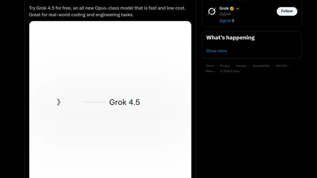
*Capture d'écran d'une publication X (Twitter) présentant Grok 4.5 comme un nouveau modèle de classe Opus rapide, économique et adapté au code.*

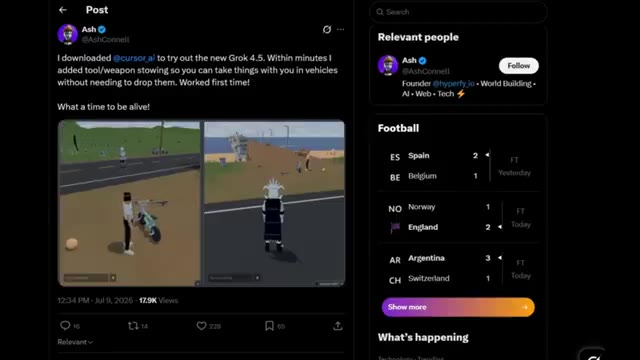
*Publication X (Twitter) d'Ash montrant un jeu multijoueur web avec des captures de gameplay et du texte sur l'utilisation de Grok 4.5 et Cursor AI.*

---

### ⏱️ `[00:00:19 - 00:00:42]` | Segment #02

**🔊 Audio (Transcription Intégrale Mot pour Mot en Français) :**
> C'est multijoueur, et honnêtement, c'est incroyable. Les animations de course et de saut sont ridiculement fluides. Et sur le côté droit, c'est en fait son ami qui observe tout ce qui se passe en temps réel. Si c'est ce que Grok 4.5 aide déjà les gens à construire, nous partons sur des bases plutôt convaincantes. Ensuite, il y a ce jeu 3D créé par Jaden Devis, et honnêtement, c'est un peu ridicule.

**👁️ Analyse Visuelle d'Écran (gemini-3.5-flash-lite) :**
**Interface & Outils** : Interface de jeu web (affichée via localhost:3001) et capture d'écran du réseau social X (Twitter).

**Contenu textuel & Code** : Texte du tweet de @JaydenDavisNC : "Grok 4.5 in Grok Build is insane for 3D game dev 🤯 I ran a detailed prompt using the /goal feature and I created this in only two prompts. Took roughly an hour. The model rigged all the enemy humanoids and made a fleshed out map and AI logic." Une image d'armurerie 3D (ARMORY, MULD-10) est visible dans le tweet.

**Action / Démonstration** : Le créateur montre un jeu vidéo multijoueur 3D fonctionnel en temps réel avec des personnages animés, puis présente le post X du créateur du jeu Jaden Davis.

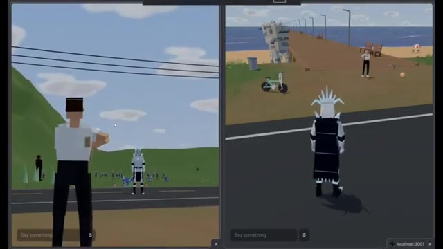
*Capture d'écran montrant le jeu 3D multijoueur en cours d'exécution avec deux fenêtres de jeu côte à côte.*

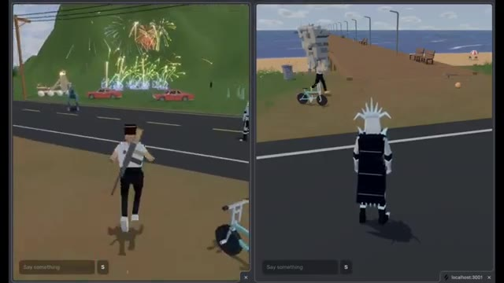
*Capture d'écran montrant le personnage du jeu en train de courir et des feux d'artifice générés dans le décor.*

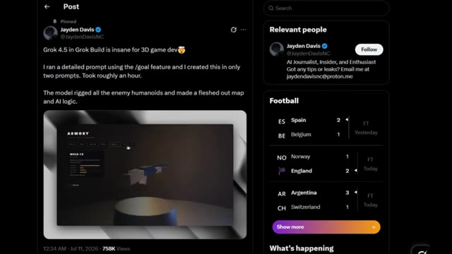
*Capture d'écran d'un tweet de Jaden Davis présentant le jeu développé avec Grok 4.5.*

---

### ⏱️ `[00:00:42 - 00:01:07]` | Segment #03

**🔊 Audio (Transcription Intégrale Mot pour Mot en Français) :**
> Il dit que le tout a été créé avec seulement deux prompts et a pris environ une heure. Le modèle a riggé tous les humanoïdes ennemis, a construit une carte entièrement détaillée et a même généré la logique IA. Ensuite, il y a le jeu lui-même. Vous obtenez un menu de démarrage correct, plusieurs armes au choix, une carte étonnamment grande, des animations de tir fluides, et lorsque vous subissez des dégâts, l'écran clignote en rouge, tout juste comme on s'y attend d'un vrai FPS.

**👁️ Analyse Visuelle d'Écran (gemini-3.5-flash-lite) :**
**Interface & Outils** : Interface de Twitter (X) affichant un post utilisateur avec intégration vidéo, puis interface de gameplay d'un jeu de tir subjectif (FPS) 3D avec mini-carte et indicateurs de munitions/vie.

**Contenu textuel & Code** : Texte du post Twitter de @JaydenDavisNC : "Grok 4.5 in Grok Build is insane for 3D game dev. I ran a detailed prompt using the /goal feature and I created this in only two prompts. Took roughly an hour. The model rigged all the enemy humanoids and made a fleshed out map and AI logic." Titre du jeu visible : "COUNTER PROTOCOL". Éléments de HUD visibles en jeu : mini-carte ronde, compteurs de score, chronomètre, indicateur de santé (100) et de munitions (15 / 45, puis 6).

**Action / Démonstration** : Navigation sur le fil Twitter présentant la création du jeu, puis démonstration en direct du gameplay du FPS avec exploration de la carte et manipulation d'armes.

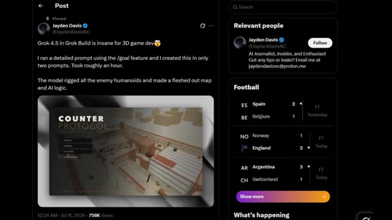
*Capture d'un post Twitter de Jayden Davis montrant une vidéo intégrée du jeu 'Counter Protocol' avec son menu principal et sa carte en arrière-plan.*

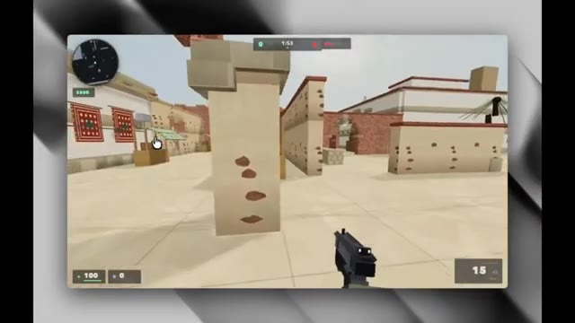
*Vue à la première personne dans le jeu, montrant un environnement 3D de style urbain/désertique avec une arme au premier plan et une interface de jeu (HUD).*

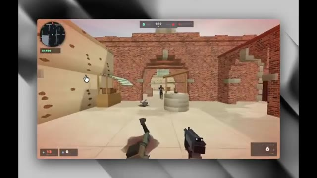
*Scène d'action dans le jeu montrant le joueur tenant une arme face à un ennemi lointain, avec un adversaire vaincu au sol et l'ATH complet.*

---

### ⏱️ `[00:01:08 - 00:01:26]` | Segment #04

**🔊 Audio (Transcription Intégrale Mot pour Mot en Français) :**
> Ce n'est pas juste une autre démo technique générée par IA qui s'effondre après cinq secondes. C'est un jeu qui a vraiment l'air jouable. Et si Grok peut construire quelque chose comme ça presque entièrement par lui-même, il est peut-être temps d'arrêter de penser à l'ancien Grok, celui qui était constamment à la traîne sur des tâches de codage comme celles-ci. Et voici un autre exemple fou.

**👁️ Analyse Visuelle d'Écran (gemini-3.5-flash-lite) :**
**Interface & Outils** : Interface d'un jeu vidéo de type FPS (semblable à Counter-Strike) exécuté dans un navigateur ou une application, affichant un mini-carte en haut à gauche, un chronomètre, un indicateur d'argent ($900), la santé (100) et les munitions (15/45).

**Contenu textuel & Code** : Texte affiché : "GO GO GO", chronomètre "1:54", "1:49", "1:41", argent "$900", munitions "15", "9". Environnement 3D low-poly rappelant la carte Dust de Counter-Strike.

**Action / Démonstration** : Le joueur se déplace dans un environnement de jeu de tir à la première personne, explore la carte et tire avec son arme, démontrant la jouabilité fonctionnelle d'un jeu créé par IA.

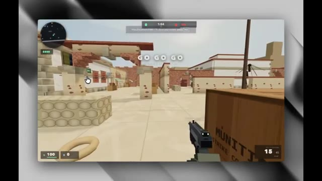
*Démonstration à l'écran @ 00:01:10*

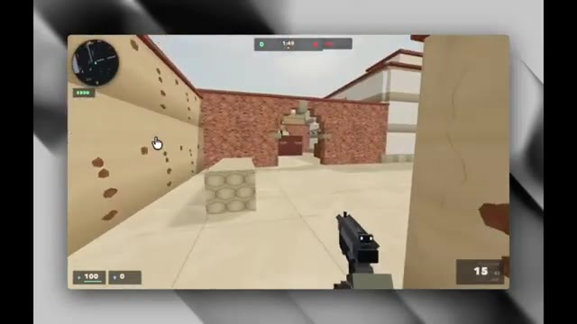
*Démonstration à l'écran @ 00:01:17*

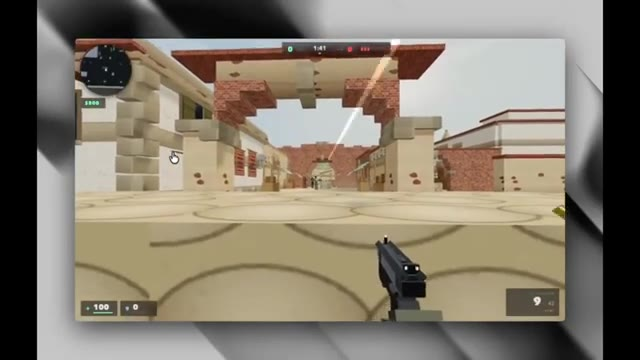
*Démonstration à l'écran @ 00:01:24*

---

### ⏱️ `[00:01:27 - 00:01:49]` | Segment #05

**🔊 Audio (Transcription Intégrale Mot pour Mot en Français) :**
> Dans cette démo, Grok 4.5 teste une application iPhone entièrement par lui-même. Normalement, les développeurs doivent écrire du code de test et indiquer manuellement au logiciel quels boutons presser. Mais ici, ils donnent simplement à Grok une invite textuelle en anglais simple. L'intelligence artificielle ouvre l'application, appuie sur des boutons, navigue à travers différents écrans et vérifie si tout fonctionne, exactement comme une vraie personne utilisant le téléphone.

**👁️ Analyse Visuelle d'Écran (gemini-3.5-flash-lite) :**
**Interface & Outils** : Interface de terminal de commande et émulateur d'iPhone intégré montrant une application mobile.

**Contenu textuel & Code** : Texte du tweet : « grok 4.5 can now test iOS features on live devices. no scripts. no selectors. no xcode. one prompt ». Code affiché dans le terminal avec des blocs verts et rouges, et un champ de prompt « > add a forget password flow ». Émulateur affichant l'application « Lockbox » avec un champ de connexion.

**Action / Démonstration** : L'intelligence artificielle saisit un prompt textuel pour ajouter et tester un flux de récupération de mot de passe, puis exécute les tests sur l'émulateur iPhone.

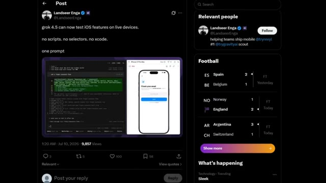
*Capture d'un post Twitter montrant Grok 4.5 tester des fonctionnalités iOS sur un appareil en direct.*

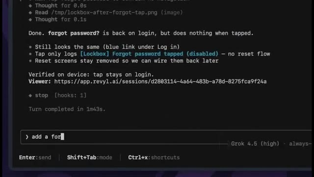
*Gros plan sur une interface de terminal textuel montrant les retours d'exécution et un champ de saisie de prompt.*

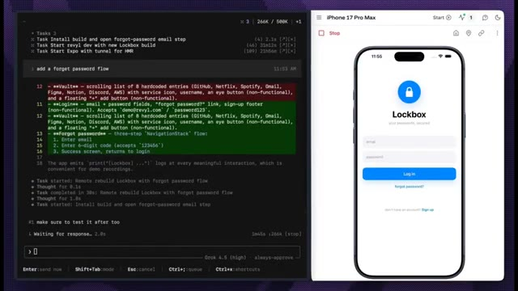
*Interface divisée en deux montrant un terminal de code à gauche et un émulateur d'iPhone 17 Pro Max à droite affichant l'application Lockbox.*

---

### ⏱️ `[00:01:49 - 00:02:16]` | Segment #06

**🔊 Audio (Transcription Intégrale Mot pour Mot en Français) :**
> C'est la partie impressionnante. Pas de code, pas de configuration compliquée, juste un seul prompt et l'IA gère les tests toute seule. Et celle-ci est vraiment impressionnante. Un développeur affirme avoir construit tout ce site web de type "Space Explorer" défilant en seulement deux heures en utilisant Grok Build. Au lieu d'écrire manuellement des centaines de lignes de code, il a simplement décrit ce qu'il voulait en anglais simple, et Grok a généré le site web, les animations et tous les effets interactifs.

**👁️ Analyse Visuelle d'Écran (gemini-3.5-flash-lite) :**
**Interface & Outils** : Émulateur mobile, interface de terminal de code, navigateur web affichant un site interactif, et interface du réseau social X (Twitter).

**Contenu textuel & Code** : Textes visibles : "Check your email", "123456", "Grok 4.5 is INSANE for web dev...", "International Space Station", "A laboratory the size of a football field".

**Action / Démonstration** : Navigation et démonstration du site web interactif sur l'espace généré par IA, ainsi que l'interface de développement avec Grok 4.5.

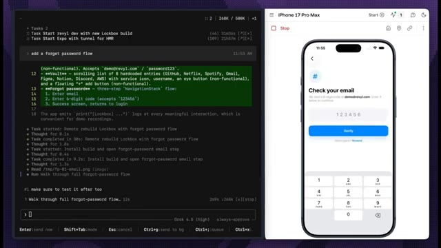
*Interface de développement avec un terminal de code à gauche et un émulateur mobile iPhone 17 Pro Max à droite montrant un écran de vérification d'e-mail.*

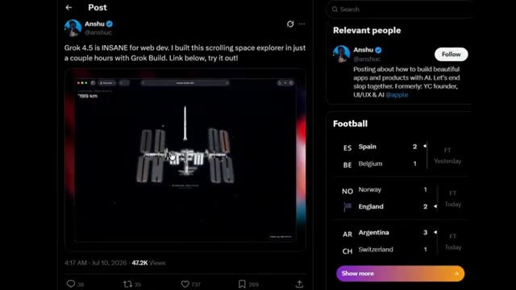
*Capture d'un post Twitter/X de l'utilisateur @anshu montrant une interface de site web avec une station spatiale.*

*Capture d'écran d'un navigateur web affichant un site sur l'espace avec le lancement d'une fusée entourée de fumée.*

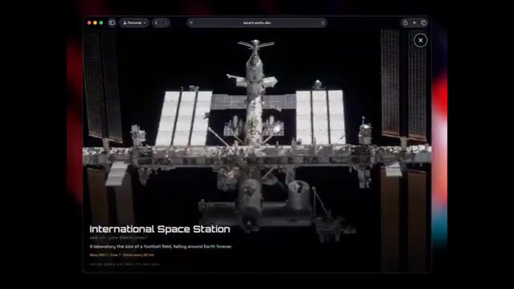
*Capture d'écran d'un navigateur web montrant la Station Spatiale Internationale avec le texte descriptif associé.*

---

### ⏱️ `[00:02:16 - 00:02:34]` | Segment #07

**🔊 Audio (Transcription Intégrale Mot pour Mot en Français) :**
> Il y a quelques années, cela aurait été un projet de week-end alimenté par du café et des choix de vie discutables. Maintenant, c'est quelque chose que vous pouvez décrire dans un prompt. C'est le véritable changement qui est en train de se produire ici. L'IA ne vous aide plus seulement à écrire du code. Elle construit des projets web complets à partir d'un simple prompt, rendant le développement considérablement plus rapide.

**👁️ Analyse Visuelle d'Écran (gemini-3.5-flash-lite) :**
**Interface & Outils** : Navigateur web affichant l'URL ascent.anshu.dev, puis interface de la plateforme X (anciennement Twitter).

**Contenu textuel & Code** : URL de l'application « ascent.anshu.dev » ; publication sur X par Anshu (@anshuc) disant : « Grok 4.5 is INSANE for web dev. I built this scrolling space explorer in just a couple hours with Grok Build. Link below, try it out! » avec une vidéo intégrée montrant la Lune, et un panneau latéral affichant des scores de football (Espagne vs Belgique, Norvège vs Angleterre, Argentine vs Suisse).

**Action / Démonstration** : Navigation et interaction au sein d'une application web interactive représentant le système solaire, puis défilement et affichage d'un post sur le réseau social X.

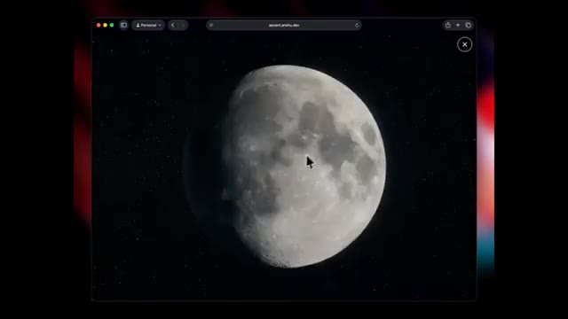
*Interface d'un navigateur web montrant une application interactive en 3D d'exploration de la Lune en gros plan sur fond d'étoiles.*

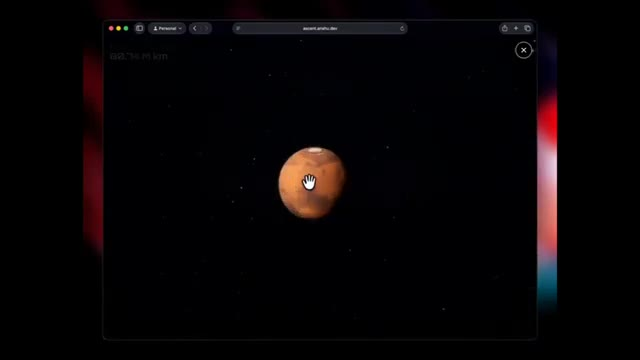
*Interface de la même application web montrant la planète Mars vue de loin dans l'espace avec le curseur en forme de main.*

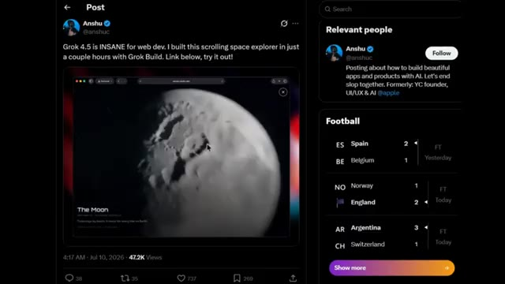
*Capture d'écran d'un tweet posté par Anshu sur X (Twitter) présentant une vidéo de démonstration de l'application "scrolling space explorer" construite avec Grok Build.*

---

### ⏱️ `[00:02:35 - 00:02:59]` | Segment #08

**🔊 Audio (Transcription Intégrale Mot pour Mot en Français) :**
> Et cette démo passe à un niveau supérieur. Un développeur a construit tout ce site web interactif d'exploration spatiale en seulement quelques heures en utilisant Grok Build. En faisant défiler la page, une fusée s'lance dans l'espace, vous emmenant dans un voyage cinématographique à travers l'ISS, la lune, et même Mars, avec des compteurs de distance en direct, des panneaux d'information interactifs, et des animations qui n'ont honnêtement aucune raison d'être aussi réussies.

**👁️ Analyse Visuelle d'Écran (gemini-3.5-flash-lite) :**
**Interface & Outils** : Navigateur web affichant une publication sur les réseaux sociaux (X/Twitter) et un site web interactif personnalisé nommé "Space Explorer" (ascent.anshu.dev).

**Contenu textuel & Code** : Texte du post : "Grok 4.5 is INSANE for web dev. I built this scrolling space explorer in just a couple hours with Grok Build. Link below, try it out!". Sur le site web : compteur de distance en direct ("516,371 km"), légende "International Space Station" avec des informations détaillées, et "The Moon".

**Action / Démonstration** : Défilement à travers le site web interactif simulant un voyage spatial avec des vues de l'espace, de la Station Spatiale Internationale et de la Lune.

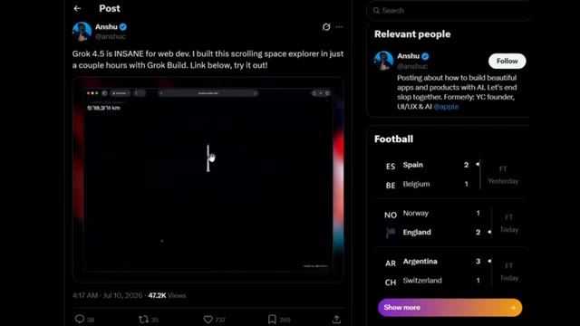
*Publication sur les réseaux sociaux montrant le site web interactif d'exploration spatiale créé avec Grok Build.*

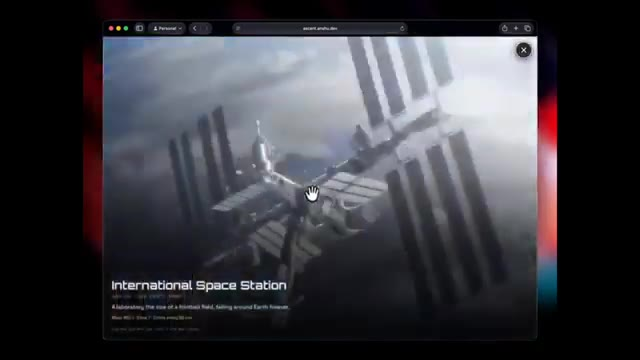
*Navigation sur le site web interactif affichant une vue détaillée de la Station Spatiale Internationale (ISS) avec des panneaux d'information.*

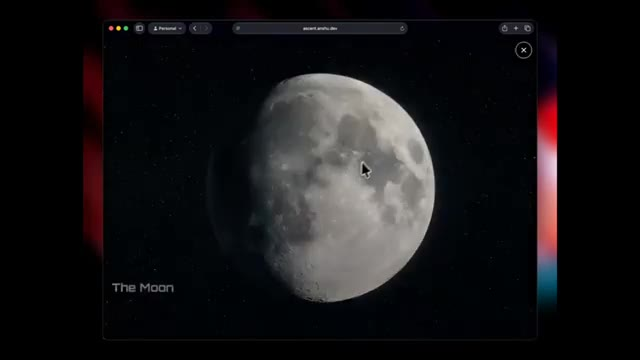
*Vue rapprochée de la Lune dans l'interface interactive du site web d'exploration spatiale.*

---

### ⏱️ `[00:02:59 - 00:03:34]` | Segment #09

**🔊 Audio (Transcription Intégrale Mot pour Mot en Français) :**
> Mais voici la partie qui a vraiment attiré mon attention. Grok n'a pas seulement généré du HTML et du CSS pour en rester là. Il a géré de la programmation avancée, généré des visuels, créé des animations et des shaders personnalisés, traité des vidéos, optimisé les performances et même aidé à déployer le site web final. Nous dépassons lentement le stade de l'IA qui se contente d'autocompléter du code. On commence à avoir l'impression d'avoir affaire à un développeur full-stack qui ne demande jamais une nouvelle réunion de planification de sprint. Et cela explique peut-être pourquoi Grok s'améliore si vite. Plus tôt cette année, XAI a acquis Cursor, l'un des

**👁️ Analyse Visuelle d'Écran (gemini-3.5-flash-lite) :**
**Interface & Outils** : Navigateur web affichant une application web interactive ("ascent.anshu.dev") puis un article de CNBC.

**Contenu textuel & Code** : URL "ascent.anshu.dev", texte "DISTANCE FROM EARTH: 429,628 km", "The Moon", article CNBC "SpaceX to acquire the AI coding startup Cursor for $60 billion" avec la journaliste Ashley Capoot.

**Action / Démonstration** : Navigation à travers une application web immersive illustrant l'espace et la Lune, puis affichage d'un article de presse sur une acquisition.

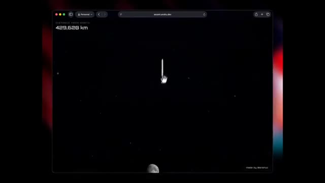
*Interface web interactive affichant une fusée stylisée dans l'espace avec l'indication "429,628 km" depuis la Terre.*

*Interface web montrant le décollage d'une fusée sur un pas de tir au crépuscule.*

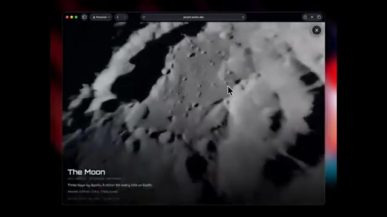
*Interface web montrant une vue rapprochée en noir et blanc de la surface lunaire avec le titre "The Moon".*

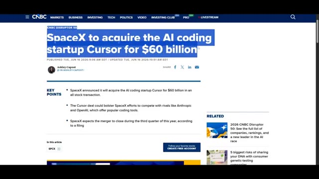
*Article de presse CNBC titrant "SpaceX to acquire the AI coding startup Cursor for $60 billion".*

---

### ⏱️ `[00:03:34 - 00:03:55]` | Segment #10

**🔊 Audio (Transcription Intégrale Mot pour Mot en Français) :**
> des plateformes de programmation. Depuis lors, la technologie et l'expertise en ingénierie de Cursor ont commencé à intégrer Grok. Cela pourrait être l'une des principales raisons pour lesquelles ses capacités de programmation se sont améliorées de façon si spectaculaire en si peu de temps. Si ce rythme se poursuit, le vieux Grok dont tout le monde se moquait pourrait disparaître bien plus tôt que prévu. Et c'est tout pour ce rapport de recherche.

**👁️ Analyse Visuelle d'Écran (gemini-3.5-flash-lite) :**
**Interface & Outils** : Interface logicielle de démonstration et présentations textuelles épurées.

**Contenu textuel & Code** : Texte '2.0' avec logo hexagonal, interface météo interactive avec widgets sombres, barre de saisie avec le prompt 'Build a site for my book review' et le sélecteur 'Grok 4.5', et le texte 'Built for science, math, and engineering'.

**Action / Démonstration** : Présentation des logos, des interfaces logicielles et des capacités techniques de l'IA.

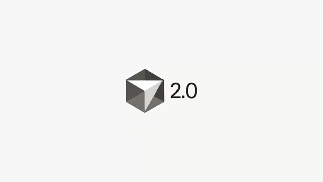
*Logo et numéro de version '2.0' sur fond clair.*

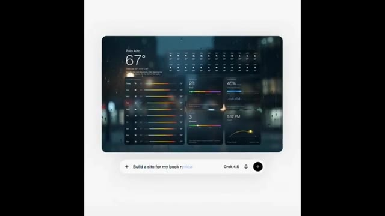
*Interface de démonstration affichant une application météo/dashboard sombre et une barre de prompt avec le texte 'Build a site for my book review'.*

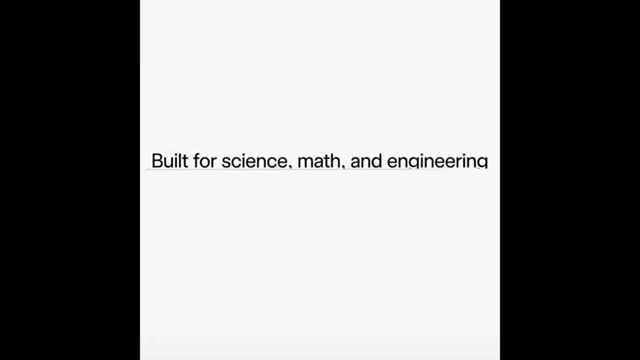
*Texte affiché à l'écran : 'Built for science, math, and engineering'.*

---

### ⏱️ `[00:03:55 - 00:04:34]` | Segment #11

**🔊 Audio (Transcription Intégrale Mot pour Mot en Français) :**
> Si vous avez aimé, assurez-vous de vous abonner car il y a beaucoup d'autres actualités sur l'IA qui arrivent. C'est Pursuing AI, et je vous retrouve dans le prochain rapport de recherche. Merci.

**👁️ Analyse Visuelle d'Écran (gemini-3.5-flash-lite) :**
**Interface & Outils** : Interface de type interface de génération 3D ou outil de design assisté par IA avec une barre de prompt en bas ("Grok 4.5") et une zone de visualisation centrale.

**Contenu textuel & Code** : Texte du prompt visible en bas : "Build me a 3D model of the booster", logo d'IA "Grok 4.5", et un widget de rappel d'abonnement YouTube en haut avec une icône de pouce levé et "SUBSCRIBED".

**Action / Démonstration** : Affichage d'un modèle 3D en filaire représentant un booster de fusée au centre de l'écran, avec une incitation à s'abonner positionnée au-dessus.

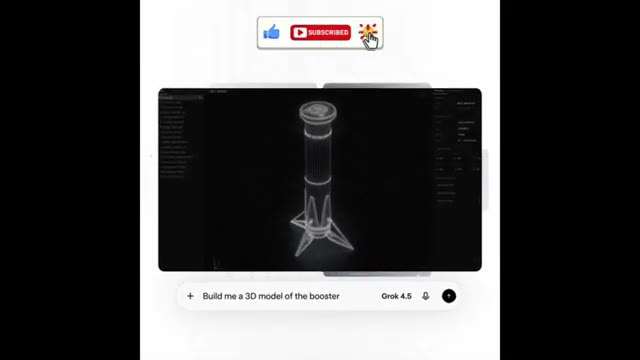
*Interface de modélisation 3D avec un panneau de prompt indiquant "Build me a 3D model of the booster" et un bouton de notification d'abonnement en haut.*

---
