# 🎬 Kimi K3 est hallucinant ! Encore un moment DeepSeek ?

> **Chaîne** : [Pursuing AI](https://www.youtube.com/@PursuingAi)  
> **Titre original** : `Kimi K3 is INSANE! Another DeepSeek Moment?`  
> **Lien YouTube** : [https://www.youtube.com/watch?v=QraT8ZNkxgw](https://www.youtube.com/watch?v=QraT8ZNkxgw)  
> **Date de publication** : 2026-07-16  
> **Durée** : 04m 51s (`291s`)  
> **Identifiant vidéo** : `QraT8ZNkxgw`  
> **Fiche Web Interactive** : [2026-07-16_YT-QraT8ZNkxgw_Kimi K3 est hallucinant ! Encore un moment DeepSeek_by-whisper-v3-large-turbo+gemini-3.5-flash-lite.html](2026-07-16_YT-QraT8ZNkxgw_Kimi K3 est hallucinant ! Encore un moment DeepSeek_by-whisper-v3-large-turbo+gemini-3.5-flash-lite.html)  
> **Captures de démonstration clés** : `38 captures réelles (anti-talking-head)`  
> **Modèles utilisés** : Audio: `large-v3-turbo` (Faster-Whisper int8 VPS) | Vision: `gemini-3.5-flash-lite` (Google AI Studio API)  

---

## 📌 Synthèse Exécutive & Outils

### 📌 Résumé
La vidéo de Pursuing AI analyse l'émergence anticipée du modèle **Kimi K3** (repéré sous le nom de code « Kevin » dans l'environnement *Ella Marina*), présenté par la communauté comme un potentiel « moment DeepSeek R1 » capable de bousculer la hiérarchie établie de l'intelligence artificielle. Les premiers retours de testeurs et de développeurs mettent en lumière des performances stupéfiantes en matière de raisonnement spatial, de génération d'interfaces graphiques complexes et de conception d'environnements 3D interactifs, rivalisant directement avec des ténors du marché comme GPT-5.6 Pro ou Fable 5. L'analyse détaillée de ces cas d'usage démontre un bond qualitatif majeur pour les modèles d'origine chinoise, notamment dans la cohérence visuelle globale, l'éclairage et la structure logique, le tout exécuté de surcroît en une seule tentative.

Sur le plan méthodologique, la vidéo explore la capacité du modèle à décoder des requêtes textuelles hautement exigeantes sans qu'il soit nécessaire de surcharger le prompt d'indications contextuelles complexes. Le processus repose sur une exécution fluide où le modèle mobilise de manière autonome des logiques de raisonnement avancées — comparables à celles observées chez ses rivaux occidentaux les plus onéreux. De plus, la mise en avant d'un mode d'essaim d'agents (agent swarm) propulsé par Moonshot AI illustre une avancée significative dans la coordination multi-agents, ouvrant la voie à des flux de travail automatisés et interconnectés d'une efficacité redoutable.

Pour les créateurs de vidéo et les développeurs, ces innovations annoncent des perspectives économiques et créatives décisives. Si les performances du Kimi K3 se confirment lors de sa sortie publique, la démocratisation de ces capacités de pointe à moindre coût exercera une pression concurrentielle féroce sur les laboratoires traditionnels, forçant une baisse des prix et une accélération de l'innovation. Les créateurs pourront ainsi concevoir des environnements visuels complexes, des interfaces front-end dynamiques et des simulations sophistiquées avec une précision quasi-humaine, tout en réduisant drastiquement les budgets de calcul et les itérations de prompt.

### 🛠️ Outils, Modèles & Logiciels Présentés
* **Kimi K3 (Kevin)** : Modèle de nouvelle génération développé par Moonshot AI, offrant des performances de pointe en raisonnement spatial, génération 3D et coordination d'agents.
* **Ella Marina (Elemarina)** : Environnement de test et plateforme d'évaluation précoce permettant d'accéder aux versions en développement des modèles d'IA.
* **DeepSeek R1** : Modèle de référence open-weight ayant bouleversé l'industrie par son rapport performances-coût extrêmement compétitif.
* **GPT-5.6 Pro** : Modèle propriétaire de pointe servant d'étalon de comparaison pour évaluer la qualité visuelle et le raisonnement des nouveaux entrants.
* **Fable 5** : Modèle de génération et de raisonnement avancé utilisé pour mesurer les approches méthodologiques et la cohérence de scène du Kimi K3.
* **Windows Clone Benchmark** : Protocole de test évaluant la capacité d'une IA à recréer des interfaces de systèmes d'exploitation complexes et fonctionnelles.

### 🔑 Points Clés & Enseignements Stratégiques
1. **Rupture du raisonnement spatial** : Kimi K3 démontre une aptitude inédite à traiter des invites exigeant une géométrie complexe (comme un pélican en art voxel détaillé), surpassant les limites historiques des modèles open-weight asiatiques.
2. **Maîtrise des benchmarks d'interface** : Le succès du modèle au test du clonage de Windows prouve sa capacité à générer des dispositions d'UI précises, des fenêtres professionnelles et des outils interactifs intégrés.
3. **Autonomie logique et mimétisme stratégique** : Le modèle adopte spontanément des approches de raisonnement avancées similaires à celles de Fable 5, et ce, sans qu'aucune consigne spécifique n'ait été incluse dans le prompt initial.
4. **Cohérence visuelle en un seul essai** : Kimi K3 parvient à égaler la qualité d'environnements intérieurs complexes générés par GPT-5.6 Pro dès la première tentative, garantissant un éclairage, une composition et un placement d'objets irréprochables.
5. **Génération d'expériences 3D front-end** : Le modèle excelle dans la création d'interfaces futuristes et de visualisations interactives complexes, réduisant l'écart qualitatif entre les solutions open-weights et les modèles propriétaires les plus onéreux.
6. **Le phénomène du « Moment DeepSeek »** : L'émergence potentielle de Kimi K3 illustre la capacité de nouveaux acteurs à offrir des performances de classe mondiale à une fraction du coût des laboratoires occidentaux traditionnels.
7. **Coordination par essaim d'agents** : L'intégration d'un mode multi-agents par Moonshot AI permet à Kimi K3 de coordonner plusieurs intelligences artificielles simultanément, optimisant la gestion de flux de travail complexes.
8. **Pression sur la politique tarifaire des géants** : L'arrivée imminente d'un tel modèle sur le marché menace directement les marges et la domination d'OpenAI et d'Anthropic, présageant une guerre des prix agressive.
9. **Prudence face aux effets de battage médiatique (hype)** : Les performances observées proviennent d'environnements fermés (Ella Marina) et nécessitent une vérification indépendante rigoureuse après le lancement public officiel.
10. **Optimisation des workflows de création** : Pour les créateurs de vidéo, l'adoption de tels outils permettra d'accélérer la production d'assets visuels hyper-réalistes tout en sranchissant des contraintes matérielles lourdes.

---

## ⏱️ Chronologie & Transcription Complète Audio & Visuelle (Mot pour Mot)

### ⏱️ `[00:00:00 - 00:00:18]` | Segment #01

**🔊 Audio (Transcription Intégrale Mot pour Mot en Français) :**
> Kimi K3 n'est même pas encore sorti, mais il apparaît déjà dans Ella Marina sous le nom de code Kevin. Et après avoir vu les premiers résultats de tests, je ne m'attends honnêtement pas à cela. Certaines personnes l'appellent déjà un autre moment DeepSeek R1. Alors, le battage médiatique est-il réel ? Découvrons-le.

**👁️ Analyse Visuelle d'Écran (gemini-3.5-flash-lite) :**
**Interface & Outils** : Interface de publication Twitter (X) et interface d'une application ou d'un monde virtuel interactif en blocs de type voxel ("Voxel Liberty").

**Contenu textuel & Code** : Sur l'image 1 : Publication du compte vérifié @Kimi_Moonshot (Kimi.ai), date de publication (4:03 AM · Jul 16, 2026), 521,9K vues, statistiques d'engagement. Sur l'image 2 et 3 : Interface avec les titres "VOXEL LIBERTY", options de navigation ("DRAG ORBIT", "SCROLL ZOOM", "M DAY / NIGHT", "SPACE PAUSE"), icônes de contrôle de caméra et de paramètres.

**Action / Démonstration** : Navigation et affichage d'une publication sur les réseaux sociaux suivie de la visualisation interactive d'un modèle 3D en voxels représentant la Statue de la Liberté dans un environnement nocturne.

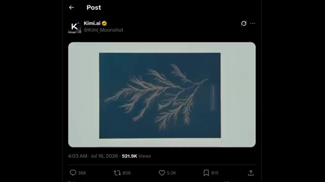
*Publication Twitter de Kimi.ai montrant un test ou une image générée sur fond bleu.*

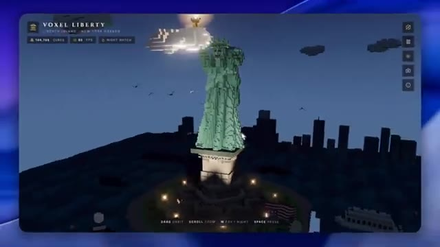
*Interface d'un logiciel ou d'un jeu de modélisation en blocs (voxel) représentant la Statue de la Liberté de nuit, intitulée Voxel Liberty.*

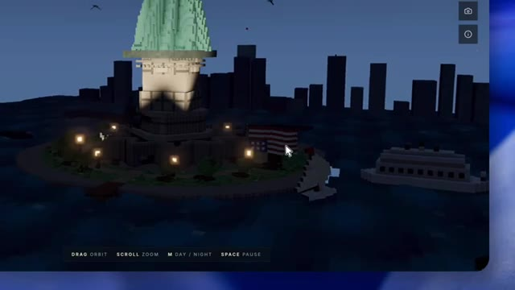
*Gros plan sur la base de la Statue de la Liberté en voxels, montrant les détails de l'île et des drapeaux.*

---

### ⏱️ `[00:00:19 - 00:00:39]` | Segment #02

**🔊 Audio (Transcription Intégrale Mot pour Mot en Français) :**
> Vous regardez Pursuing AI, et voici leur rapport de recherche. Commençons par quelque chose qui a immédiatement attiré mon attention. Un testeur a demandé à Kimi K3 de générer un pélican en art voxel extrêmement détaillé. Il y a quelques mois, les modèles chinois luttaient généralement avec des invites de ce genre car elles exigent un fort raisonnement spatial.

**👁️ Analyse Visuelle d'Écran (gemini-3.5-flash-lite) :**
**Interface & Outils** : Interface du réseau social X (Twitter) affichant un tweet de @Lentils80 et des widgets latéraux (panneaux d'information et résultats sportifs).

**Contenu textuel & Code** : Texte du tweet de @Lentils80 : "Another amazing output from Kimi K3 👀 For reference, just a few months ago Chinese models were VERY bad at these kinds of tests that require spatial reasoning I don't think they're cheating by training on these prompts directly, so either they did some magic or this model is big". Encart latéral affichant des scores de football (France vs Espagne, Angleterre vs Argentine).

**Action / Démonstration** : Affichage et lecture d'une publication X (Twitter) commentant les capacités de génération vidéo de Kimi K3 en art voxel, illustré par une vidéo générée par IA.

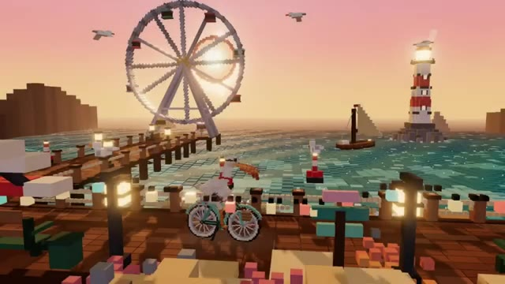
*Rendu vidéo généré en art voxel montrant un pélican sur un vélo au bord de l'eau avec une grande roue et un phare en arrière-plan.*

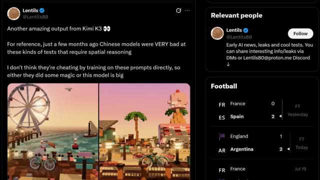
*Capture d'écran d'un tweet posté par @Lentils80 sur X (Twitter) montrant le test de Kimi K3 avec des images en art voxel et des commentaires sur le raisonnement spatial des modèles chinois.*

---

### ⏱️ `[00:00:40 - 00:01:03]` | Segment #03

**🔊 Audio (Transcription Intégrale Mot pour Mot en Français) :**
> Mais Kimi K3 a produit un résultat incroyablement détaillé avec une profondeur, un éclairage, des ombres et un placement d'objets corrects. C'est déjà un bond remarquable par rapport aux générations précédentes. Maintenant, voici où les choses deviennent encore plus intéressantes. Un autre développeur a exécuté le fameux Windows Clone Benchmark, où une IA recrée une interface de système d'exploitation de type Windows.

**👁️ Analyse Visuelle d'Écran (gemini-3.5-flash-lite) :**
**Interface & Outils** : Navigateur web affichant un tweet, et interface graphique émulée d'un système d'exploitation de type Windows (Window Clone Benchmark).

**Contenu textuel & Code** : Texte du tweet de @chetaslua : "Window Clone test. Kimi cooked so hard like you know i am running this test for a year now watch this video once gemini cooked so hard with visuals , fable done the visual+function solid one thing this model is super slow in arena maybe size is bigger < i hope so >". Sur l'interface Windows : barre des tâches avec menu Démarrer, barre de recherche « Search apps & files » et icônes d'applications.

**Action / Démonstration** : Démonstration visuelle d'une génération en voxel art très détaillée par Kimi K3, suivie de la présentation du benchmark « Windows Clone » montrant les performances de l'IA pour recréer une interface de système d'exploitation.

*Scène animée en style voxel art montrant une grande roue, un phare et une cigognette à vélo au bord de l'eau.*

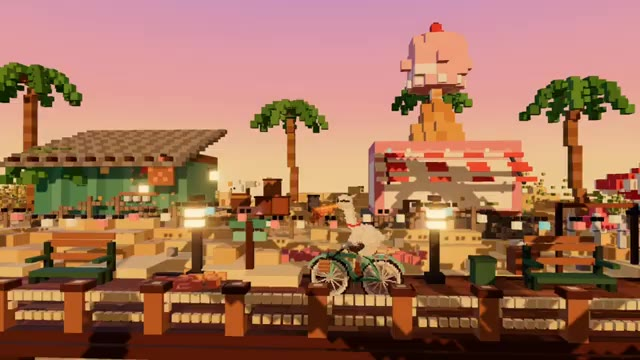
*Poursuite de la scène en voxel art le long d'une jetée avec des palmiers et un kiosque en forme de glace rose.*

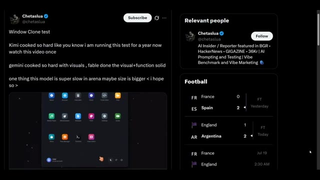
*Publication sur le réseau social X par @chetaslua concernant le « Window Clone test » avec l'interface du benchmark et le profil de l'auteur.*

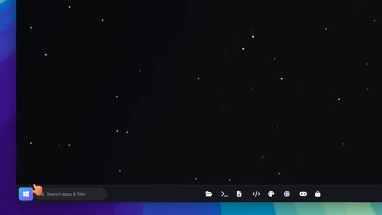
*Gros plan sur l'interface émulée d'un système d'exploitation de type Windows avec barre des tâches et fond étoilé.*

---

### ⏱️ `[00:01:03 - 00:01:24]` | Segment #04

**🔊 Audio (Transcription Intégrale Mot pour Mot en Français) :**
> Le résultat comprenait des fenêtres de style professionnel, des menus, des outils de peinture, une intégration de Wikipédia et des dispositions d'interface utilisateur étonnamment précises. Ce benchmark a traditionnellement été difficile pour de nombreux modèles aux poids ouverts, pourtant Kimi K3 s'en est sorti étonnamment bien. Vint ensuite un autre benchmark impliquant une simulation de tir à l'arc mécanique.

**👁️ Analyse Visuelle d'Écran (gemini-3.5-flash-lite) :**
**Interface & Outils** : Interface de bureau générique avec barre des tâches, puis interface du réseau social X (Twitter).

**Contenu textuel & Code** : Sur l'image 2, texte du tweet : "New test of Kimi K3... It doesn't seem incredible at first glance, but it's one of the best outputs on this prompt..." et une vidéo intégrée montrant un jeu de tir à l'arc en 3D avec des scores et des cibles.

**Action / Démonstration** : Navigation et présentation de publications sur les réseaux sociaux évaluant les performances du modèle Kimi K3 sur des benchmarks spécifiques.

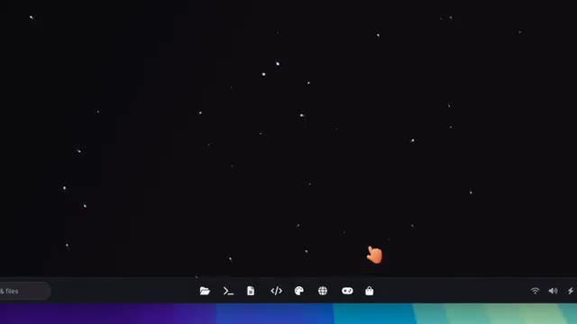
*Interface logicielle avec une barre de tâches en bas et une animation de particules sur fond noir.*

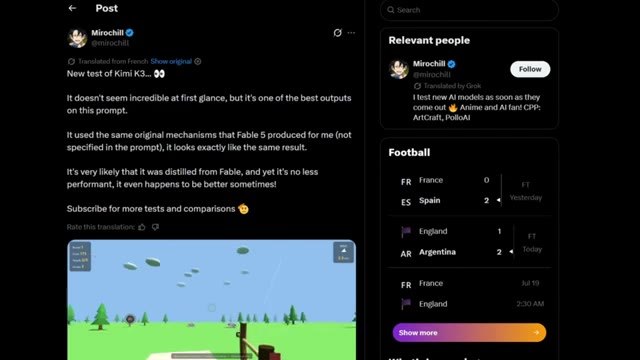
*Publication sur X (Twitter) par Mirochill montrant un test de Kimi K3 avec une simulation 3D de tir à l'arc.*

---

### ⏱️ `[00:01:25 - 00:01:43]` | Segment #05

**🔊 Audio (Transcription Intégrale Mot pour Mot en Français) :**
> La partie intéressante n'était pas seulement qu'il a résolu la tâche. Selon le testeur, Kimi K3 a utilisé presque la même approche de raisonnement que Fable 5 a utilisée, même si cette approche n'était mentionnée nulle part dans le prompt. Cela a immédiatement suscité des discussions en ligne. Certaines personnes ont même plaisanté en disant qu'il semblait distillé de Fable.

**👁️ Analyse Visuelle d'Écran (gemini-3.5-flash-lite) :**
**Interface & Outils** : Interface de Twitter (X) affichant un post et des actualités sportives sur le panneau latéral, ainsi qu'une interface de jeu vidéo 3D en vue subjective.

**Contenu textuel & Code** : Texte du tweet : "New test of Kimi K3... It doesn't seem incredible at first glance, but it's one of the best outputs on this prompt. It used the same original mechanisms that Fable 5 produced for me (not specified in the prompt), it looks exactly like the same result. It's very likely that it was distilled from Fable, and yet it's no less performant, it even happens to be better sometimes! Subscribe for more tests and comparisons". Le jeu affiche "Round 1", "Score 77", "Targets 1/3", "Arrows 4" et "WIND 3.0 m/s".

**Action / Démonstration** : Affichage d'un post sur les réseaux sociaux commentant les performances du modèle Kimi K3 par rapport à Fable 5, avec un extrait vidéo du jeu généré.

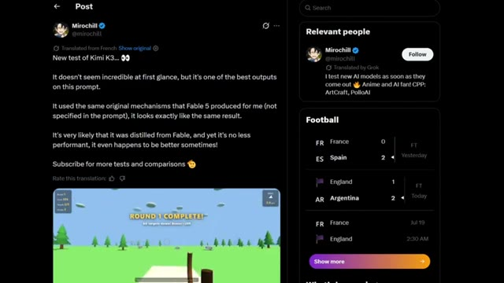
*Capture d'écran d'un tweet de Mirochill montrant un test de Kimi K3 avec une vidéo de jeu intégrée.*

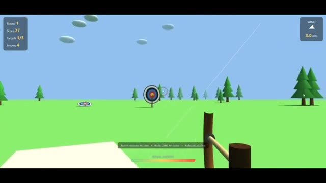
*Vue rapprochée d'un jeu de tir à l'arc en 3D avec des cibles et des scores affichés.*

---

### ⏱️ `[00:01:44 - 00:02:06]` | Segment #06

**🔊 Audio (Transcription Intégrale Mot pour Mot en Français) :**
> Bien sûr, il n'y a aucune preuve confirmant cela, alors traitez ces commentaires comme de la spéculation plutôt que comme un fait. Voici un autre exemple impressionnant. Un testeur a généré un environnement intérieur complexe et a affirmé que Kimi K3 égalait la qualité de GPT 5.6 Pro, qu'il surpassait Fable 5 sur cette invite spécifique, et qu'il l'avait fait en une seule tentative.

**👁️ Analyse Visuelle d'Écran (gemini-3.5-flash-lite) :**
**Interface & Outils** : Capture d'écran d'un jeu vidéo d'archerie et d'une interface de réseau social (Twitter/X).

**Contenu textuel & Code** : Sur l'image 1 : affichage du score (173), des cibles (2/3), des flèches et du vent (2.3 m/s). Sur l'image 2 : tweet de @mirochill affirmant « INCREDIBLE: Kimi K3 is in preparation, and it's amazing! » avec une image d'intérieur générée.

**Action / Démonstration** : Démonstration visuelle d'un environnement 3D de tir à l'arc, suivie de la présentation d'un post Twitter commentant les performances de Kimi K3.

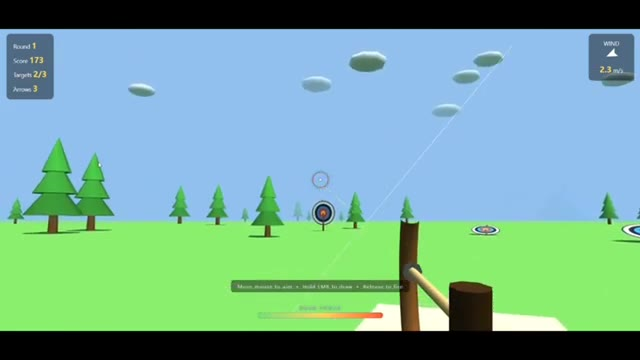
*Capture d'écran montrant un jeu vidéo 3D minimaliste avec un arc et une cible de tir à l'arc.*

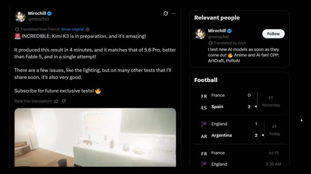
*Capture d'écran d'un tweet de Mirochill montrant un test du modèle Kimi K3.*

---

### ⏱️ `[00:02:06 - 00:02:25]` | Segment #07

**🔊 Audio (Transcription Intégrale Mot pour Mot en Français) :**
> Que cela soit toujours vrai de manière cohérente nécessite encore une vérification indépendante, mais visuellement, les résultats semblent étonnamment cohérents. L'éclairage, la composition, le placement des objets et la compréhension de la scène étaient tous bien plus solides que ce que nous avons l'habitude de voir de la part des précédents modèles open-weight chinois. Et les exemples ne s'arrêtent pas là.

**👁️ Analyse Visuelle d'Écran (gemini-3.5-flash-lite) :**
**Interface & Outils** : Démonstration visuelle de vidéos générées par IA (modèle open-weight chinois).

**Contenu textuel & Code** : Des scènes intérieures générées par IA démontrant la gestion de l'éclairage, des reflets et de la composition spatiale.

**Action / Démonstration** : Présentation d'exemples vidéo illustrant les capacités du modèle d'IA en matière de cohérence visuelle et d'éclairage.

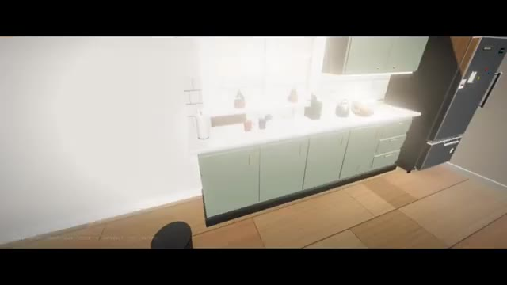
*Exemple visuel généré montrant une cuisine moderne et lumineuse avec des placards verts et un réfrigérateur.*

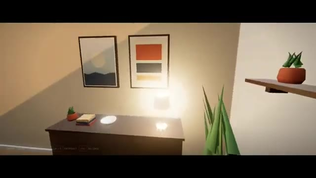
*Exemple visuel généré montrant un intérieur de salon avec des cadres au mur, une lampe allumée et des plantes.*

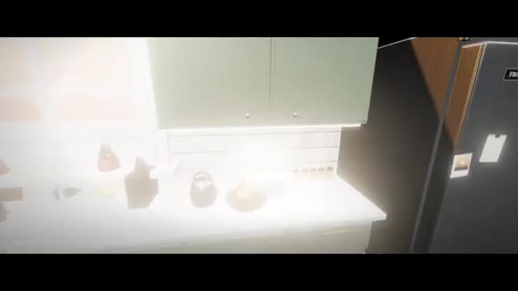
*Exemple visuel généré en gros plan sur le plan de travail d'une cuisine avec des effets de lumière vive.*

---

### ⏱️ `[00:02:26 - 00:02:49]` | Segment #08

**🔊 Audio (Transcription Intégrale Mot pour Mot en Français) :**
> Les développeurs ont également partagé des expériences web 3D interactives construites avec KimiK3, Des interfaces futuristes aux visualisations de machines volantes inspirées de Léonard de Vinci, le modèle semble beaucoup plus fort pour générer des expériences front-end interactives. Des comparaisons côte à côte avec GPT 5.6 montrent qu'ils se rapprochent étonnamment dans certaines tâches.

**👁️ Analyse Visuelle d'Écran (gemini-3.5-flash-lite) :**
**Interface & Outils** : Navigateur web affichant des applications interactives 3D, une interface de réseau social (X/Twitter) et des comparaisons côte à côte de modèles d'IA.

**Contenu textuel & Code** : Textes visibles : "Kimi K3 (kivine)", "THE ANTIKYTHERA MECHANISM", "GPT 5.6 sol xhigh", "Antikythera", "Kimi K3 is very good at 3d generations", "> leonardo da vinci ornithopter in three js", "Ornithopter", "A machine for flight, studied in the art of birds - Timber, linen and brass, imagined across five centuries.", "BUILT FROM PROCEDURAL PRIMITIVES ONLY. NO OBJ/GLTF. NO TEXTURES. NO MODELS.", "SCORCHED HORIZON", "GPT-5.6 Sol", "TERMINAL APPROACH".

**Action / Démonstration** : Navigation et présentation comparative d'expériences web 3D interactives générées par intelligence artificielle, illustrant les capacités de KimiK3 face à GPT 5.6.

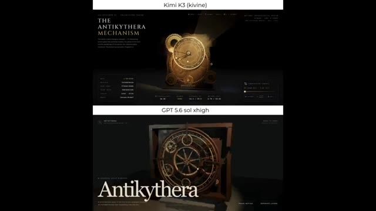
*Comparaison côte à côte entre une interface 3D interactive générée par KimiK3 montrant le mécanisme d'Anticythère et une version similaire générée par GPT 5.6.*

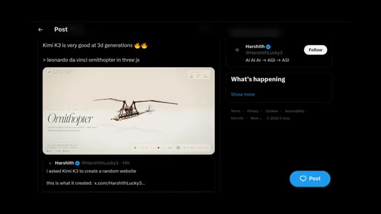
*Publication sur X (Twitter) montrant une interface interactive de l'ornithoptère de Léonard de Vinci en Three.js créée avec KimiK3.*

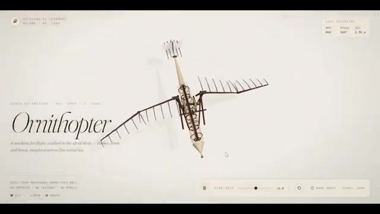
*Gros plan sur l'application interactive 3D de l'ornithoptère de Léonard de Vinci avec des contrôles de vitesse de battement d'ailes.*

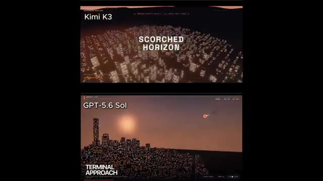
*Comparaison comparative entre KimiK3 (affichage 'Scorched Horizon') et GPT-5.6 Sol (affichage 'Terminal Approach') représentant des paysages urbains futuristes.*

---

### ⏱️ `[00:02:49 - 00:03:13]` | Segment #09

**🔊 Audio (Transcription Intégrale Mot pour Mot en Français) :**
> Alors pourquoi tout le monde compare-t-il cela à DeepSeek R1 ? Parce que l'année dernière, l'industrie de l'IA était largement dominée par OpenAI, Anthropic et Google. Puis, DeepSeek R1 est arrivé presque de nulle part. Il a offert des performances qui ont choqué tout le monde tout en étant considérablement moins cher. Les gens se sont même demandé si les laboratoires de pointe avaient vraiment besoin de budgets de calcul massifs pour rivaliser.

**👁️ Analyse Visuelle d'Écran (gemini-3.5-flash-lite) :**
**Interface & Outils** : Interface de lecture vidéo comparative divisée en deux fenêtres superposées affichant des simulations et rendus 3D de villes.

**Contenu textuel & Code** : Texte affiché : "Kimi K3", "GPT-5.6 Sol", "TERMINAL APPROACH", "GROUND ZERO", ainsi que des barres de progression de lecture vidéo.

**Action / Démonstration** : Comparaison visuelle des performances de rendu ou de simulation entre deux modèles d'IA différents (Kimi K3 et GPT-5.6 Sol).

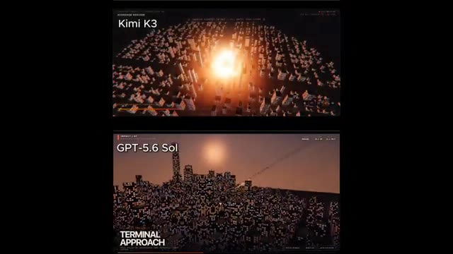
*Comparaison vidéo de simulations de villes générées par les modèles Kimi K3 et GPT-5.6 Sol avec le texte 'TERMINAL APPROACH'.*

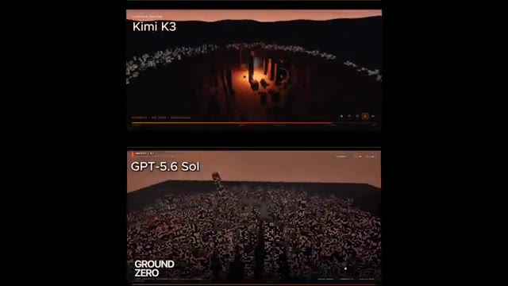
*Comparaison vidéo montrant 'Kimi K3' et 'GPT-5.6 Sol' avec le texte 'GROUND ZERO'.*

---

### ⏱️ `[00:03:13 - 00:03:38]` | Segment #10

**🔊 Audio (Transcription Intégrale Mot pour Mot en Français) :**
> Maintenant, de nombreux premiers testeurs pensent que Kimi K3 pourrait créer une perturbation similaire. Un autre domaine qui reçoit beaucoup d'attention est les capacités des agents. Moonshot AI propose déjà un mode d'essaim d'agents, où plusieurs agents IA travaillent ensemble sur une tâche. Les premiers testeurs affirment que Kimi K3 est nettement meilleur pour coordonner ces agents, rendant les flux de travail complexes beaucoup plus performants.

**👁️ Analyse Visuelle d'Écran (gemini-3.5-flash-lite) :**
**Interface & Outils** : Interface du réseau social X (Twitter) et interface d'un jeu vidéo de course en 3D avec affichage des tours et classement.

**Contenu textuel & Code** : Texte sur les posts X : « One of the first Kimi K3 outputs for y'all, tried it on frontend... » et « a chinese openweight model kimi k3 is already live on @arena under the name 'KIVINE'... ». Éléments de jeu : LAP 1/3, 1ST/6, mini-carte du circuit, classement des joueurs, animation d'un chat qui tape sur un clavier en bas à droite.

**Action / Démonstration** : Défilement de publications sur X montrant des retours d'utilisateurs sur Kimi K3, suivi d'une démonstration en jeu d'un jeu de course automobile style karting.

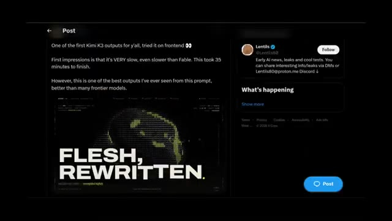
*Publication sur X (Twitter) montrant les premiers résultats de Kimi K3 avec un aperçu visuel textuel.*

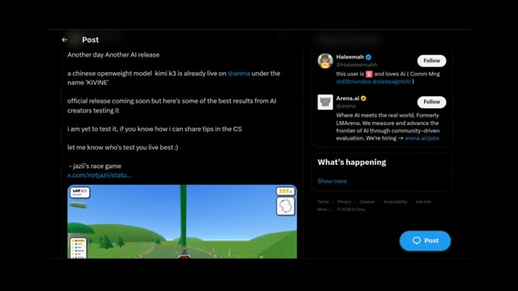
*Publication sur X (Twitter) présentant Kimi K3 sous le nom 'KIVINE' et un extrait de jeu de course.*

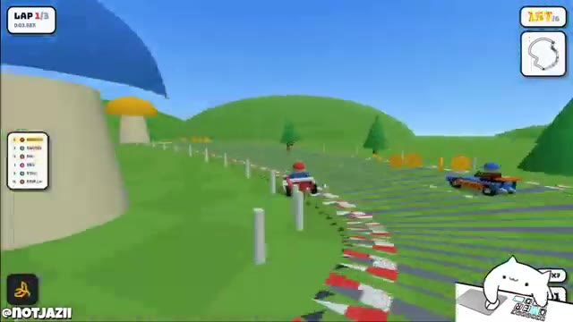
*Capture d'écran du jeu de course (type Mario Kart) développé ou généré, montrant la piste et l'interface de jeu.*

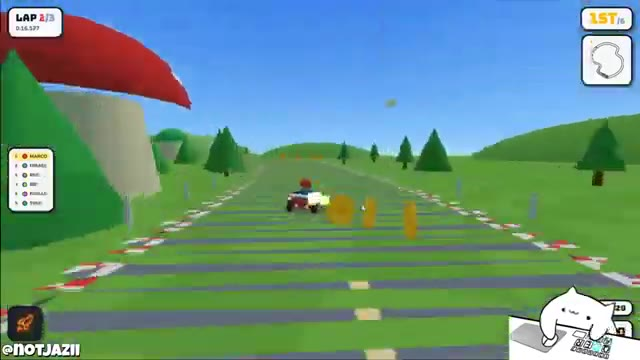
*Capture du jeu de course en cours de partie montrant le classement (LAP 2/3) et des pièces à collecter.*

---

### ⏱️ `[00:03:38 - 00:04:12]` | Segment #11

**🔊 Audio (Transcription Intégrale Mot pour Mot en Français) :**
> Si ces rapports se confirment après le lancement, cela pourrait devenir l'un des assistants IA en poids libres les plus puissants disponibles. Cela soulève une question intéressante. Si Kimi K3 peut offrir des performances proches de modèles comme Fable 5 ou GPT 5.6 tout en coûtant probablement beaucoup moins cher, cela exercera-t-il une nouvelle pression sur les prix des entreprises comme OpenAI et Anthropic ? Nous approchons également de la fin de vie prévue de Fable 5, il sera donc intéressant de voir si ces plans changent à mesure que la concurrence s'intensifie. Maintenant, il est important de rester réaliste.

**👁️ Analyse Visuelle d'Écran (gemini-3.5-flash-lite) :**
**Interface & Outils** : Interface de jeu vidéo et interface du réseau social X (Twitter) présentant une simulation 3D interactive réalisée avec Three.js.

**Contenu textuel & Code** : Texte du tweet : « Kimi K3 war scene made with @threejs one shot », nom d'utilisateur « @chetaslua », informations de profil (« AI Insider / Reporter featured in BGR... »), et interface tactique affichant « PACIFIC THUNDER » avec divers navires et statuts de combat (USS PRINCETON, FALCON-2, WOLF-5, etc.).

**Action / Démonstration** : Navigation et présentation d'une démo interactive de scène de guerre maritime créée par IA à l'aide de Kimi K3 et Three.js.

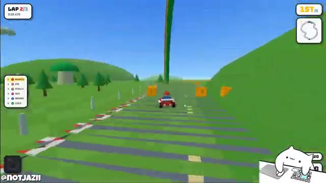
*Capture d'écran montrant un jeu vidéo de course de type kart en 3D avec un classement des joueurs à gauche et une mini-carte en haut à droite.*

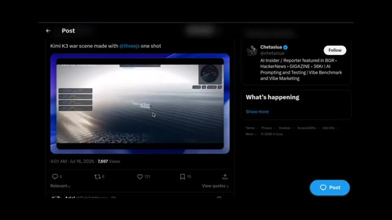
*Capture d'écran d'une publication sur le réseau social X (Twitter) montrant une vidéo intégrée intitulée « Kimi K3 war scene made with @threejs one shot ».*

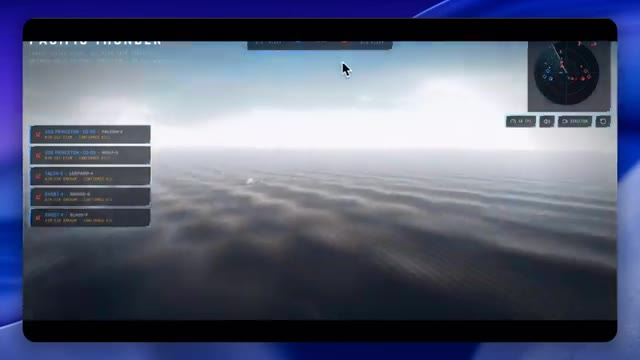
*Vue rapprochée de la simulation de scène de guerre maritime intitulée « PACIFIC THUNDER » générée avec Kimi K3 et Three.js.*

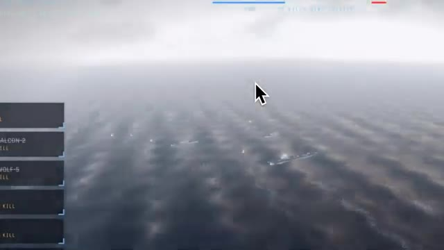
*Zoom sur la simulation de combat naval montrant les mouvements de la flotte sur l'océan avec des panneaux de statut tactiques sur le côté gauche.*

---

### ⏱️ `[00:04:12 - 00:04:31]` | Segment #12

**🔊 Audio (Transcription Intégrale Mot pour Mot en Français) :**
> Tout ce dont nous avons discuté aujourd'hui provient des premiers tests d'Elemarina et des rapports de développeurs qui y ont actuellement accès. Rien de tout cela ne doit être considéré comme un verdict définitif jusqu'à ce que le Kini K3 soit officiellement lancé et que des analyses comparatives plus larges soient disponibles. Mais les premiers signes sont vraiment enthousiasmants.

**👁️ Analyse Visuelle d'Écran (gemini-3.5-flash-lite) :**
**Interface & Outils** : Interface du logiciel ou jeu de simulation nommé "PACIFIC THUNDER" / "Elemarina Task Force 17" avec mini-radar, listes d'unités tactiques et curseur de souris.

**Contenu textuel & Code** : Texte affiché : "PACIFIC THUNDER", "ELEMARINA TASK FORCE 17", "SIMULATION // NO REAL-WORLD DATA", "FIRST TO 12 KILLS WINS THEATER", ainsi que divers noms d'unités et scores (RANGER-3, FALCON-2, WOLF-5, USS PRINCETON).

**Action / Démonstration** : Navigation et affichage d'une simulation de combat aéronaval ou tactique avec des porte-avions et des avions de chasse survolant l'océan.

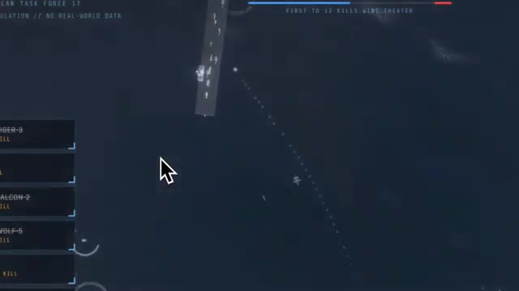
*Vue aérienne du jeu ou de la simulation montrant un porte-avions naviguant sur l'eau et un curseur de souris au centre.*

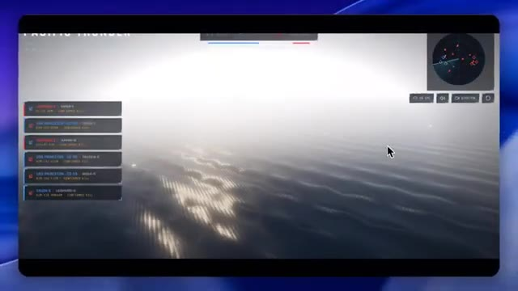
*Vue de l'interface de simulation "PACIFIC THUNDER" avec un radar en haut à droite, des listes d'unités à gauche et des reflets lumineux sur l'eau.*

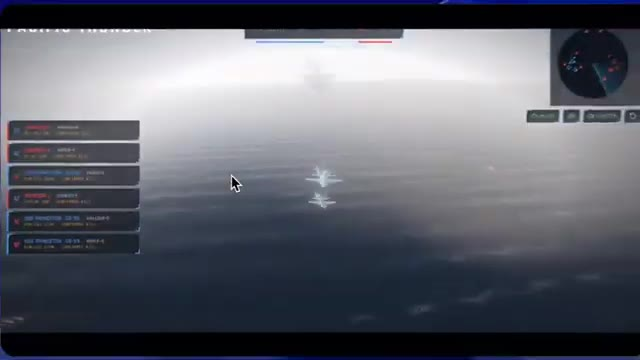
*Vue à la troisième personne montrant des avions en vol au-dessus de la mer avec le porte-avions en arrière-plan dans la brume.*

---

### ⏱️ `[00:04:31 - 00:04:50]` | Segment #13

**🔊 Audio (Transcription Intégrale Mot pour Mot en Français) :**
> Si ces résultats se traduisent dans la version publique, Kimi K3 pourrait devenir l'un des plus grands lancements d'IA de l'année. Qu'en pensez-vous ? S'agit-il vraiment d'un autre moment DeepSeek ou le battage médiatique dépasse-t-il la réalité ? Faites-moi part de vos réflexions dans les commentaires. Si vous avez apprécié ce rapport de recherche, n'oubliez pas de liker, de vous abonner et je vous retrouve dans le prochain.

**👁️ Analyse Visuelle d'Écran (gemini-3.5-flash-lite) :**
**Interface & Outils** : Interface de simulation de jeu/stratégie (type Pacific Thunder) et écran de fin de chaîne YouTube.

**Contenu textuel & Code** : Texte "PACIFIC THUNDER", menus de score/unités à gauche, mini-carte en haut à droite, logo "PAI" et boutons d'interaction de fin de vidéo ("LIKE", "SUBSCRIBE").

**Action / Démonstration** : Navigation et affichage d'une simulation de combat maritime, puis transition vers l'écran de fin de la chaîne YouTube invitant à s'abonner.

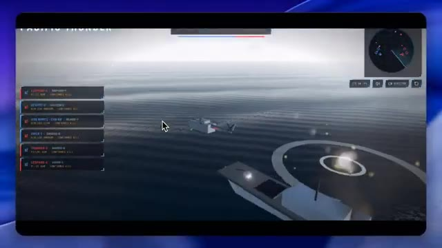
*Interface de simulation montrant un hélicoptère en vol au-dessus de l'océan avec un porte-avions et des menus de statistiques à gauche.*

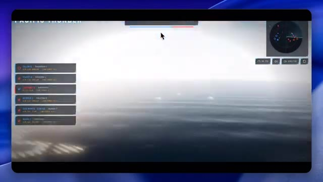
*Vue de la simulation au-dessus de la mer avec une nappe de brouillard lumineux au loin.*

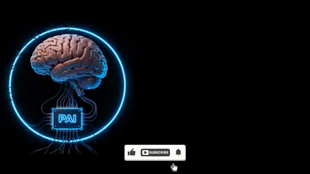
*Écran de fin de vidéo montrant le logo animé de Pursuing AI (cerveau et puce connectés) avec des boutons de like, abonnement et cloche.*

---
