# 🎬 Kimi K3 vs Fable 5 : Lequel l'emporte ?

> **Chaîne** : [Pursuing AI](https://www.youtube.com/@PursuingAi)  
> **Titre original** : `Kimi K3 vs Fable 5: Who Wins?`  
> **Lien YouTube** : [https://www.youtube.com/watch?v=MDdWGsuGcSE](https://www.youtube.com/watch?v=MDdWGsuGcSE)  
> **Date de publication** : 2026-07-18  
> **Durée** : 04m 52s (`292s`)  
> **Identifiant vidéo** : `MDdWGsuGcSE`  
> **Fiche Web Interactive** : [2026-07-18_YT-MDdWGsuGcSE_Kimi K3 vs Fable 5 Lequel l'emporte_by-whisper-v3-large-turbo+gemini-3.5-flash-lite.html](2026-07-18_YT-MDdWGsuGcSE_Kimi K3 vs Fable 5 Lequel l'emporte_by-whisper-v3-large-turbo+gemini-3.5-flash-lite.html)  
> **Captures de démonstration clés** : `39 captures réelles (anti-talking-head)`  
> **Modèles utilisés** : Audio: `large-v3-turbo` (Faster-Whisper int8 VPS) | Vision: `gemini-3.5-flash-lite` (Google AI Studio API)  

---

## 📌 Synthèse Exécutive & Outils

### 📌 Résumé

La vidéo de *Pursuing AI* intitulée « Kimi K3 vs Fable 5 : Lequel l'emporte ? » propose une analyse comparative de pointe dans l'écosystème en perpétuelle mutation de la génération par intelligence artificielle. Le sujet central décortique la confrontation directe entre Kimi K3 — un modèle open source qui bouscule la hiérarchie — et les ténors propriétaires du marché que sont Fable 5 et GPT 5.6. À travers une série de tests rigoureux issus de retours de la communauté sur la plateforme X, la vidéo démontre comment l'open source réduit, voire efface, l'écart historique de qualité avec les solutions fermées et onéreuses. 

La méthodologie adoptée par le créateur repose sur l'analyse comparative à l'aveugle et côte à côte (A/B testing) de prompts identiques appliqués à divers cas d'usage : environnements naturels, modélisations 3JS complexes (comme l'appartement de Monica dans *Friends* ou une écluse de canal), et génération de code front-end (site web de café premium). En guidant le spectateur à travers des révélations progressives, le créateur illustre l'impact des choix architecturaux sur les textures, l'éclairage volumétrique et la fluidité des animations, transformant une simple revue de benchmarks en une véritable masterclass d'analyse visuelle.

Pour les créateurs de vidéo et développeurs de contenu par IA, les bénéfices concrets sont immenses. Cette transition vers des modèles open source ultra-performants démocratise l'accès à une esthétique haut de gamme, réduit drastiquement les coûts de production, et offre une alternative crédible et souveraine face aux abonnements propriétaires prohibitifs. L'analyse prouve que la maîtrise du prompt ne suffit plus ; c'est la compréhension fine des forces de chaque moteur de rendu — notamment en matière de gestion de la lumière et de cohérence spatiale — qui garantit un résultat professionnel.

### 🛠️ Outils, Modèles & Logiciels Présentés

* **Kimi K3** : Modèle d'intelligence artificielle open source central de la vidéo, salué pour ses performances de pointe rivalisant directement avec les géants propriétaires en matière de rendu visuel, d'éclairage et de génération front-end.
* **Fable 5** : Modèle propriétaire de référence sur le marché, utilisé comme étalon de comparaison pour évaluer la qualité des textures, de la composition et des environnements 3D.
* **GPT 5.6** : Modèle frontalier fermé haut de gamme mobilisé dans certains tests comparatifs pour jauger la suprématie des différents moteurs sur des prompts complexes.
* **Seedance 2.5** : Solution technologique identifiée dans l'écosystème de création vidéo par IA, participant aux workflows de génération avancés.
* **Kling 3.0** : Modèle de génération vidéo de premier plan mentionné parmi les outils de référence du secteur.
* **Midjourney** : Outil de référence en génération d'images statiques, ancré dans le paysage des technologies d'IA créative.
* **3JS / HTML** : Technologies web et de rendu 3D interactif utilisées pour évaluer les capacités de simulation spatiale et de génération de code front-end des différents modèles.

### 🔑 Points Clés & Enseignements Stratégiques

* **L'essor fracassant de l'open source** : Kimi K3 démontre qu'un modèle ouvert peut non seulement rivaliser, mais parfois surpasser les modèles frontières fermés les plus coûteux, redéfinissant les équilibres économiques de la création par IA.
* **La suprématie de l'éclairage naturel** : Sur des environnements complexes comme les paysages de lacs ou les intérieurs, Kimi K3 se distingue par une gestion supérieure de la lumière, offrant des reflets plus organiques et des ambiances visuelles plus immersives que Fable 5.
* **Efficacité des tests à l'aveugle** : Utiliser la méthode du "devinez avant la révélation" engage l'audience et prouve objectivement que les préjugés en faveur des outils payants s'effondrent face à la réalité qualitative des outputs.
* **Richesse des textures et des détails** : Les comparatifs révèlent que Kimi K3 pousse le niveau de détail des textures (végétation, roches, matériaux architecturaux) bien au-delà des attentes initiales pour un modèle open source.
* **Maîtrise de la reconstitution 3D (Cas *Friends*)** : Pour des prompts spatiaux complexes nécessitant un plan d'origine précis et un éclairage chaleureux (appartement de Monica), Kimi K3 génère un niveau de finition supérieur et un sentiment de volume plus réaliste.
* **Fluidité des simulations techniques** : Dans les tests de simulation de transit de cargo via 3JS, Kimi K3 prouve sa capacité à maintenir une fluidité parfaite et une construction d'environnement irréprochable face à GPT 5.6 et Fable 5.
* **Supériorité en génération Front-End** : Kimi K3 surclasse ses concurrents sur les tests de design web grâce à l'intégration native d'animations d'ouverture fluides et une meilleure retranscription de l'identité de marque (ex: *Terra Roast*).
* **Rapport coût-efficacité révolutionnaire** : Alors que certains fichiers HTML propriétaires testés s'avèrent onéreux (12 dollars l'unité), l'émergence d'alternatives open source de qualité égale libère les créateurs des contraintes budgétaires lourdes.
* **L'émulation par la concurrence** : La rivalité frontale entre modèles ouverts et fermés accélère le rythme global des innovations technologiques, bénéficiant directement aux créateurs de contenu finaux.
* **Priorité aux cas d'usage réels** : La vidéo rappelle l'importance de juger les IA sur des cas d'utilisation concrets issus de la communauté (partagés sur X) plutôt que de se fier aveuglément aux scores de benchmarks théoriques.
* **Piège à éviter : négliger l'esthétique globale** : Un bon prompt ne suffit pas ; la capacité du modèle à interpréter l'ambiance globale (mood) fait toute la différence entre un rendu fonctionnel (Fable 5) et un rendu professionnel et soigné (Kimi K3).

---

## ⏱️ Chronologie & Transcription Complète Audio & Visuelle (Mot pour Mot)

### ⏱️ `[00:00:00 - 00:00:20]` | Segment #01

**🔊 Audio (Transcription Intégrale Mot pour Mot en Français) :**
> Tout le monde parle de Kimi K3. Certaines personnes disent même qu'il égale ou surpasse Fable 5. Mais est-ce vraiment vrai ? J'ai parcouru de vrais posts sur X comparant les deux modèles, et certains résultats m'ont vraiment surpris. Jetons un œil. C'est Pursuing AI, et vous regardez le Research Report.

**👁️ Analyse Visuelle d'Écran (gemini-3.5-flash-lite) :**
**Interface & Outils** : Présentation vidéo comparative de différents modèles d'IA (Kimi K3, Claude Fable 5, GPT 5.6, Grok 4.5) avec affichage de rendus 3D et métriques de performance.

**Contenu textuel & Code** : Texte affiché : "Kimi K3", "Claude Fable 5 High", "GPT 5.6 sol High", "The Lock", "Grok 4.5", "Claude Fable 5", métriques de vitesse en haut à gauche (Speed: 11.6 m/s, FPS: 420fps).

**Action / Démonstration** : Comparaison visuelle côte à côte de plusieurs modèles d'intelligence artificielle générant des scènes 3D interactives complexes.

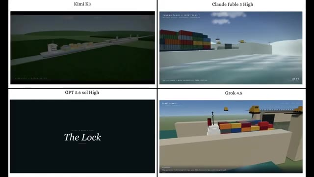
*Comparatif en grille de quatre modèles d'IA (Kimi K3, Claude Fable 5 High, GPT 5.6 sol High, Grok 4.5) simulant une scène de transit de porte d'écluse avec des conteneurs.*

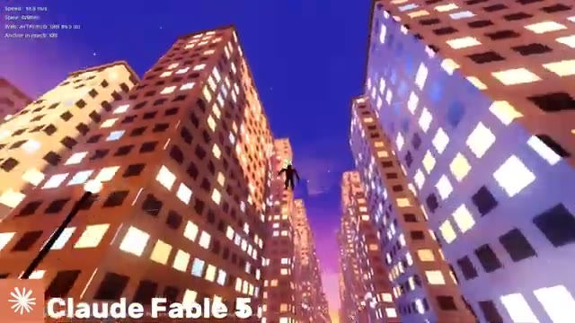
*Scène de simulation 3D urbaine de nuit générée par Claude Fable 5, montrant un personnage planant entre de hauts immeubles illuminés.*

---

### ⏱️ `[00:00:20 - 00:00:47]` | Segment #02

**🔊 Audio (Transcription Intégrale Mot pour Mot en Français) :**
> Tout d'abord, jetez un œil à ces deux résultats. Lequel pensez-vous a été généré par Kimi K3 et lequel par Fable 5 ?

**👁️ Analyse Visuelle d'Écran (gemini-3.5-flash-lite) :**
**Interface & Outils** : Interface de visualisation web en 3D interactive utilisant Three.js (Procedural Kyoto).

**Contenu textuel & Code** : Texte en haut à gauche « KYOTO AT DUSK » et « 京都の街並み », texte de bas de page avec des instructions de navigation (WASD, glisser pour regarder), mentions « THREE.JS - PROCEDURAL KYOTO » et « Kimi Agent ».

**Action / Démonstration** : Comparaison visuelle entre deux environnements 3D générés procéduralement présentés côte à côte à l'écran.

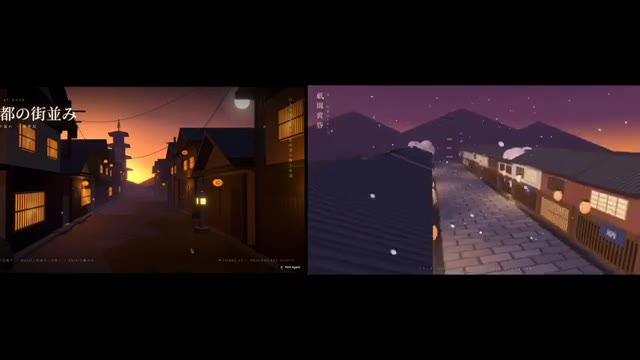
*Comparaison côte à côte de deux scènes virtuelles générées, montrant des rues traditionnelles de Kyoto au crépuscule.*

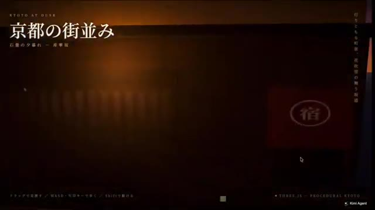
*Vue rapprochée d'une interface de démonstration en 3D intitulée 'Kyoto at Dusk' avec des caractères japonais.*

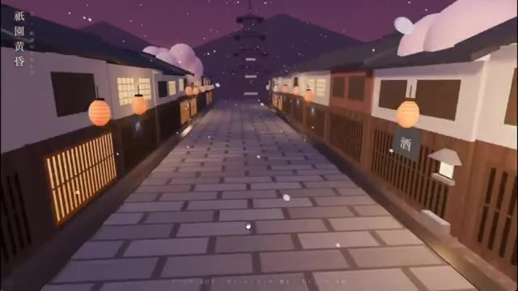
*Vue en plein écran d'une rue pavée de Kyoto avec des lanternes et des flocons de neige stylisés tombant.*

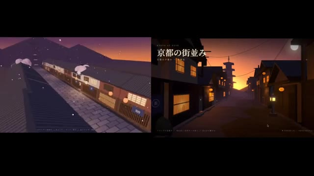
*Inversion de la disposition côte à côte des deux scènes virtuelles de Kyoto pour la comparaison comparative.*

---

### ⏱️ `[00:00:47 - 00:01:22]` | Segment #03

**🔊 Audio (Transcription Intégrale Mot pour Mot en Français) :**
> Donnez votre réponse avant que je ne la révèle. Les deux ont été générés en utilisant exactement le même prompt, mais les résultats sont complètement différents. Regardez simplement l'environnement de Kimi K3. L'éclairage, les textures et l'esthétique générale semblent beaucoup plus riches et soignés que ceux de Fable 5. Et voici le résultat de GPT 5.6 en utilisant ce même prompt. Étonnamment, Kimi K3 offre le meilleur résultat des trois. C'est honnêtement impressionnant de voir un modèle open source rivaliser directement avec certains des meilleurs modèles propriétaires. Une telle concurrence est bénéfique pour tout le monde car elle pousse

**👁️ Analyse Visuelle d'Écran (gemini-3.5-flash-lite) :**
**Interface & Outils** : Navigateur web affichant une interface de publication de type réseau social (X/Twitter) ainsi que des démonstrations comparatives de rendus 3D/vidéo d'environnements virtuels.

**Contenu textuel & Code** : Texte du post sur X : "Even using the same prompt as GPT5.6 and Fable 5, the difference is this stark... It kinda feels like there's a difference in aesthetic sense. I'll also post the URL for this in the thread." Profil de @gimu_ai ("Game Vibe Coder"). Textes en japonais à l'écran ("京都の街並み", "夜明けの町家通り").

**Action / Démonstration** : Le créateur présente une comparaison visuelle entre les rendus de différents modèles d'IA (Kimi K3, Fable 5, GPT 5.6) générés à partir du même prompt, en analysant la qualité de l'éclairage et des textures.

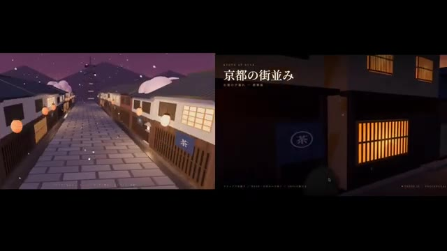
*Comparaison côte à côte de deux environnements virtuels générés par IA représentant des rues de style japonais à Kyoto.*

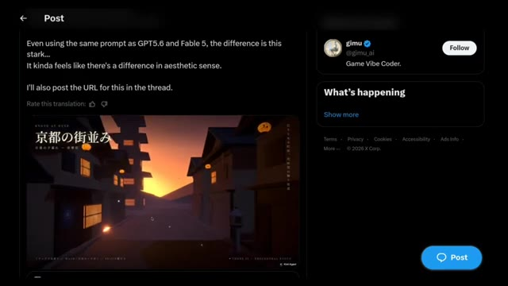
*Publication sur le réseau social X par @gimu_ai montrant un comparatif d'environnements générés avec le même prompt.*

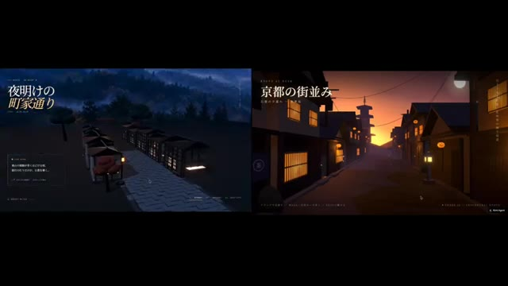
*Comparaison côte à côte montrant un environnement matinal brumeux à gauche et une rue illuminée au crépuscule à droite.*

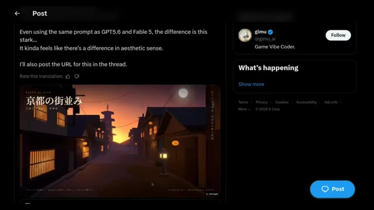
*Publication sur le réseau social X par @gimu_ai affichant une vidéo intégrée de l'environnement virtuel généré par Kimi K3.*

---

### ⏱️ `[00:01:22 - 00:01:46]` | Segment #04

**🔊 Audio (Transcription Intégrale Mot pour Mot en Français) :**
> L'IA progresse encore plus vite. Alors, avez-vous deviné correctement ? Dites-le-moi dans les commentaires. Je veux voir combien d'entre vous ont trouvé la bonne réponse. Ensuite, regardons cette scène de lac. D'abord, voici le résultat de Fable 5. Ça a l'air bien, mais maintenant, jetez un œil à la version de Kimi K3. La différence est immédiatement perceptible. Les reflets sur l'eau ont l'air beaucoup plus naturels, et la scène globale paraît plus réaliste.

**👁️ Analyse Visuelle d'Écran (gemini-3.5-flash-lite) :**
**Interface & Outils** : Interface de visualisation et de rendu 3D avec un panneau de réglages d'atmosphère (heure, vagues, brouillard) combiné à un affichage sur un fil d'actualité Twitter/X.

**Contenu textuel & Code** : Texte en haut à gauche '静 湖' (Lac paisible), panneaux de contrôle 'ATMOSPHERE', curseurs de réglage, et interface de publication de gimu_ai sur X (anciennement Twitter).
[DESC_IMAGE_1] [DESC_IMAGE_2] [DESC_IMAGE_3] [DESC_IMAGE_4] Démonstration comparative de rendus de scènes virtuelles et de paysages lacustres générés ou simulés, illustrant les performances et la qualité des reflets aquatiques.

**Action / Démonstration** : Navigation et affichage comparatif de différentes versions de scènes 3D de lacs et de paysages urbains, mettant en valeur les différences de reflets et de réalisme entre les outils.

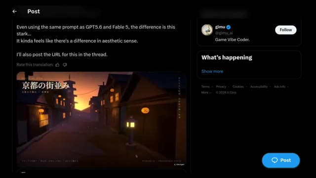
*Capture d'un post Twitter/X montrant une vidéo générée de rue urbaine avec texte en japonais et interface latérale du réseau social.*

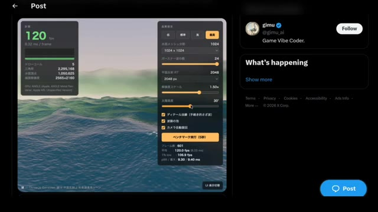
*Interface de rendu 3D avec des statistiques de performance (120 fps) et des curseurs de réglage pour l'eau et le soleil au-dessus d'un océan numérique.*

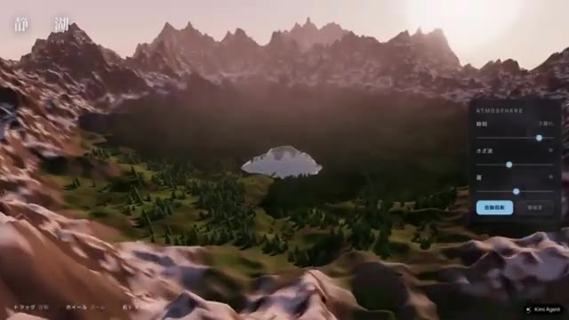
*Vue aérienne 3D d'un paysage montagneux avec un lac au centre et un panneau de configuration 'ATMOSPHERE' sur le côté droit.*

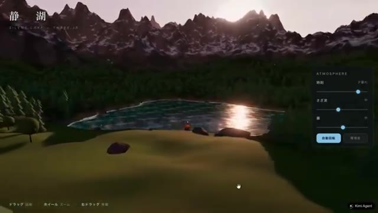
*Scène de lac réaliste au coucher du soleil avec des reflets lumineux sur l'eau et le panneau de contrôle de l'atmosphère visible à droite.*

---

### ⏱️ `[00:01:46 - 00:02:09]` | Segment #05

**🔊 Audio (Transcription Intégrale Mot pour Mot en Français) :**
> Les arbres, les montagnes, l'éclairage et la composition générale s'assemblent magnifiquement. Comparé à Fable 5, Kimi K3 offre un résultat beaucoup plus soigné, et dans cet exemple, il prend clairement l'avantage. La personne qui a partagé cette comparaison a déclaré : La qualité du lac est élevée, mais ce n'est pas tout. Les arbres et les montagnes environnants sont incroyables aussi, dépassant tous les attentes.

**👁️ Analyse Visuelle d'Écran (gemini-3.5-flash-lite) :**
**Interface & Outils** : Interface de génération 3D / application de paysage (Kimi K3) combinée à une capture d'écran du réseau social X (Twitter).

**Contenu textuel & Code** : Texte en japonais et anglais à l'écran (titre "静 湖" / "SILENT LAKE"), panneaux de configuration de l'atmosphère (lumière, curseurs), et le texte complet du tweet de @gimu_ai évaluant les performances de Kimi K3 par rapport à Fable 5.

**Action / Démonstration** : Navigation et démonstration visuelle d'un environnement 3D généré par IA, puis affichage du tweet de comparaison sur les réseaux sociaux.

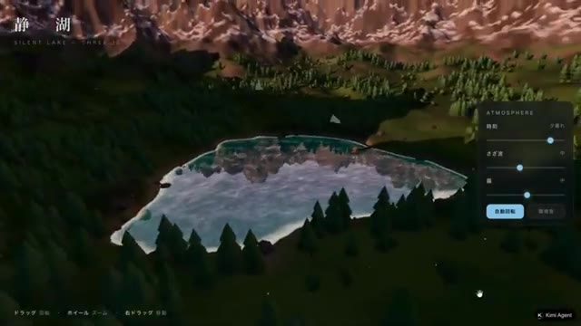
*Vue aérienne 3D d'un paysage généré avec un lac entouré de forêts et de montagnes, avec un panneau de contrôle "ATMOSPHERE" sur le côté droit.*

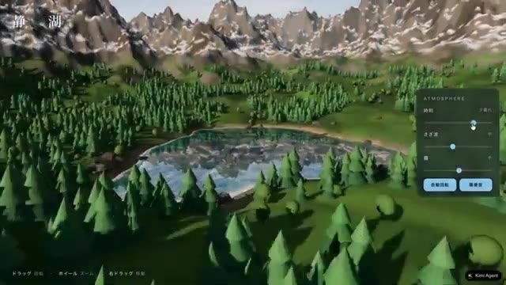
*Dézoom progressif sur le même paysage en 3D avec modification de l'éclairage via le panneau "ATMOSPHERE".*

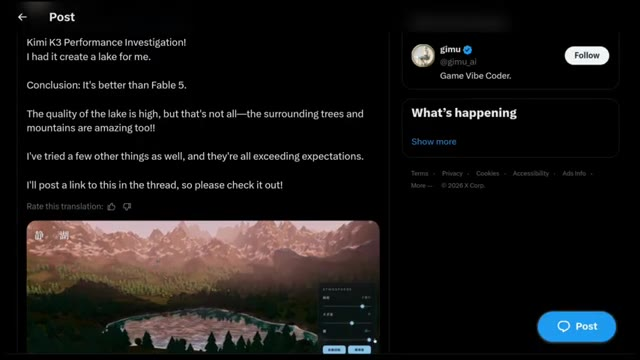
*Capture d'écran d'un tweet publié sur X par le compte "gimu" partageant les performances de Kimi K3 avec une image du paysage.*

---

### ⏱️ `[00:02:09 - 00:02:29]` | Segment #06

**🔊 Audio (Transcription Intégrale Mot pour Mot en Français) :**
> en regardant les deux images côte à côte, il est facile de comprendre pourquoi ils sont arrivés à cette conclusion. Vient ensuite cet exemple d'appartement 3JS. La consigne était de créer une reconstitution 3D navigable à la première personne de l'appartement de Monica dans Friends, en restant fidèle au plan d'origine avec un éclairage chaleureux. D'abord, voici le résultat de Fable5.

**👁️ Analyse Visuelle d'Écran (gemini-3.5-flash-lite) :**
**Interface & Outils** : Interface de développement 3D (Three.js), réseau social (X/Twitter) et navigateur web affichant un fichier HTML local.

**Contenu textuel & Code** : Prompt visible sur X : "in @threejs, create a first person pov navigable 3d scene of the iconic Monica's apartment from tv show Friends correctly based on this floor plan, stay true to the original look and feel, use warm lighting. This is by far THE BEST I've seen on this test! This single html cost me $12, but the result is stunning!". Paramètres 3D : 120 fps, 9.32 ms/frame, commandes d'atmosphère et de rendu.

**Action / Démonstration** : Présentation comparative de scènes 3D interactives et affichage d'une publication sur les réseaux sociaux avec le résultat de Fable5.

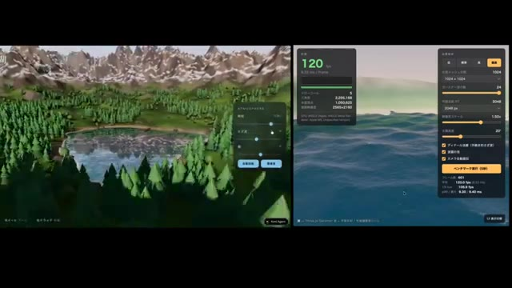
*Comparaison côte à côte de scènes 3D générées avec des panneaux de contrôle des performances et des paramètres atmosphériques.*

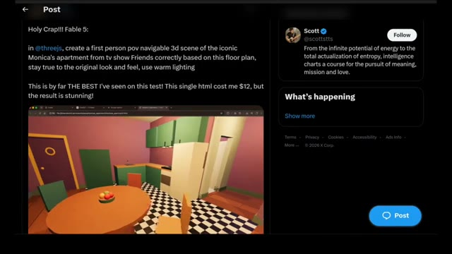
*Publication sur les réseaux sociaux montrant le prompt textuel pour créer l'appartement de Friends et une capture d'écran du résultat.*

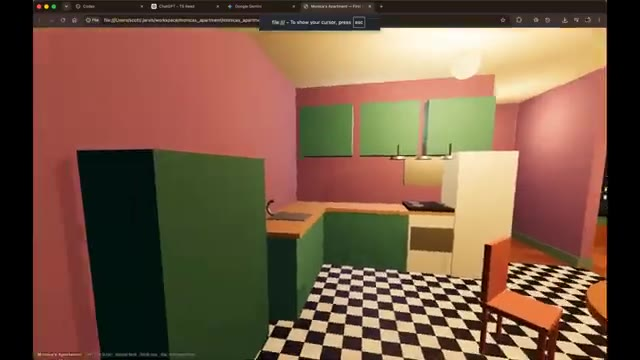
*Rendu 3D en vue subjective (première personne) de la cuisine de l'appartement de Monica depuis un navigateur web.*

---

### ⏱️ `[00:02:29 - 00:02:48]` | Segment #07

**🔊 Audio (Transcription Intégrale Mot pour Mot en Français) :**
> La personne qui l'a partagé a dit : c'est de loin le meilleur que j'ai vu sur ce test. Ce seul fichier HTML m'a coûté 12 dollars, mais le résultat est époustouflant. Regardons maintenant la version de Kimi K3. Tout de suite, la scène semble plus soignée, l'éclairage a l'air plus chaud et plus naturel, et l'environnement global a un niveau de détail supérieur.

**👁️ Analyse Visuelle d'Écran (gemini-3.5-flash-lite) :**
**Interface & Outils** : Navigateur web affichant un rendu 3D interactif au format HTML (fichier local Monica's Apartment).

**Contenu textuel & Code** : URL locale visible (`file:///Users/scott/Downloads/monicas-apartment/index.html`) et instructions de navigation en bas d'écran (`[W][A][S][D] Move`, `Mouse look`, `Shift Run`, `ESC Release cursor`).

**Action / Démonstration** : Le créateur navigue à travers un environnement 3D interactif généré à partir d'un code HTML représentant l'appartement de Monica.

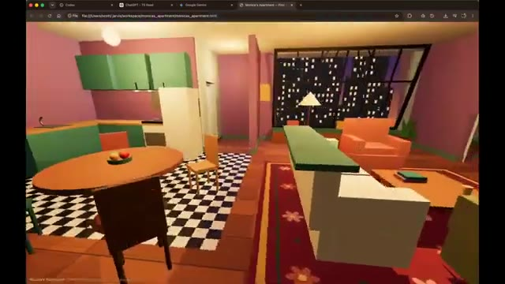
*Vue en 3D dans un navigateur web de l'appartement de la série Friends (version générée), montrant la cuisine et le salon avec un sol en damier et des murs violets.*

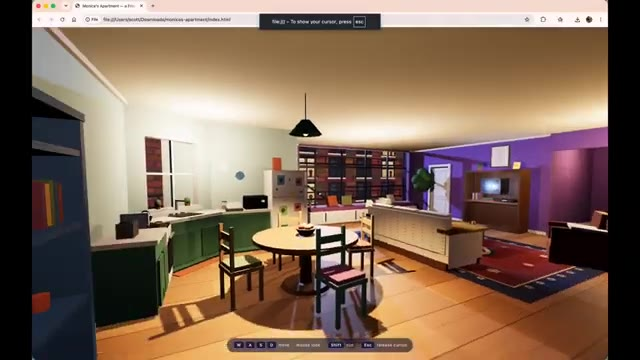
*Autre angle de vue dans le navigateur web montrant une perspective plus large de l'appartement avec l'indication des touches de contrôle en bas (WASD move, mouse look, shift run, esc release cursor).*

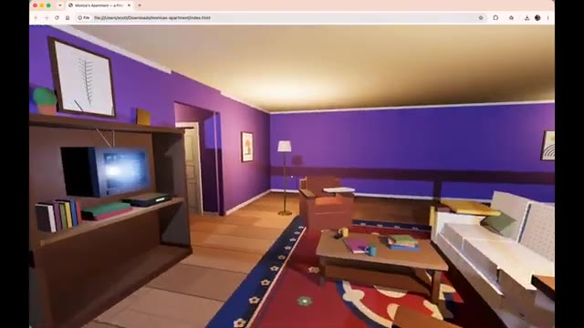
*Gros plan sur le coin salon de l'appartement virtuel interactif, affichant le canapé, la table basse, le meuble TV et les murs de couleur violette.*

---

### ⏱️ `[00:02:48 - 00:03:11]` | Segment #08

**🔊 Audio (Transcription Intégrale Mot pour Mot en Français) :**
> Côte à côte, Kimi K3 semble surpasser Fable 5 dans cet exemple particulier. Ce qui est vraiment surprenant, c'est que nous observons ce niveau de qualité de la part d'un modèle open source. Cela soulève une question intéressante : si les modèles open source atteignent ce niveau de performance, quel est l'écart qui subsiste entre eux et les coûteux modèles frontières fermés ? Passons maintenant à la comparaison suivante.

**👁️ Analyse Visuelle d'Écran (gemini-3.5-flash-lite) :**
**Interface & Outils** : Navigateur web affichant une application de simulation ou de génération interactive en 3D divisée en deux fenêtres comparatives.

**Contenu textuel & Code** : Textes "kimi k3" à gauche et "fable 5" à droite, environnements virtuels 3D interactifs (salon, cuisine, salle à manger, vue sur ville la nuit).

**Action / Démonstration** : Navigation et comparaison simultanée des rendus 3D générés par les deux modèles de modèles d'IA.

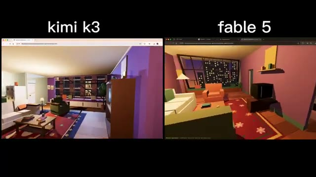
*Comparaison côte à côte de Kimi K3 et Fable 5 affichant un salon virtuel en 3D style low-poly.*

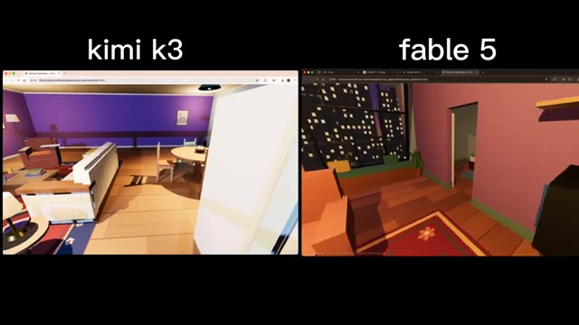
*Comparaison côte à côte de Kimi K3 et Fable 5 montrant un autre angle de l'appartement virtuel.*

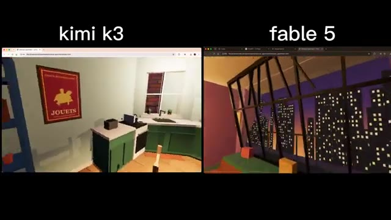
*Comparaison côte à côte de Kimi K3 et Fable 5 montrant la zone de la cuisine et de la fenêtre.*

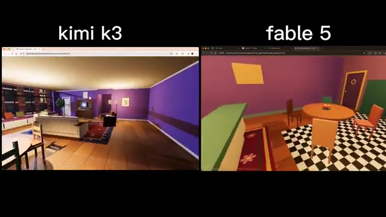
*Comparaison côte à côte de Kimi K3 et Fable 5 montrant la salle à manger virtuelle.*

---

### ⏱️ `[00:03:11 - 00:03:44]` | Segment #09

**🔊 Audio (Transcription Intégrale Mot pour Mot en Français) :**
> Ensuite, voici cette simulation de transit d'un cargo à travers une écluse de style canal de Panama en 3JS. Voici la comparaison entre les trois. Fable 5 s'en sort très bien, GPT 5.6 est également impressionnant, et Kimi K3 tire parfaitement son épingle du jeu. La simulation a l'air fluide, l'environnement est bien construit, et la qualité globale est tout à fait au niveau des modèles de pointe. Ce qui est le plus impressionnant, c'est que Kimi K3 ne se contente pas de produire des résultats corrects, il rivalise constamment en tête-à-tête avec ces meilleurs modèles propriétaires. Pour un open-source

**👁️ Analyse Visuelle d'Écran (gemini-3.5-flash-lite) :**
**Interface & Outils** : Interface de la plateforme X (anciennement Twitter) affichant un tweet comparatif et des fenêtres de rendu de simulations 3JS en grille.

**Contenu textuel & Code** : Texte du tweet : 'Kimi K3 vs Claude Fable 5 vs GPT 5.6 sol vs Grok 4.5. Kimi nailed it in one shot 🔥🔥. Fable level model with sonnet pricing. > Panama Canal style cargo ship lock transit simulation in Three js'. Noms des modèles affichés : Kimi K3, Claude Fable 5 High, GPT 5.6 sol High, Grok 4.5. Nom du navire visible : OCEAN PIONEER.

**Action / Démonstration** : Le créateur présente une comparaison visuelle côte à côte de simulations 3JS complexes générées par différents modèles d'intelligence artificielle.

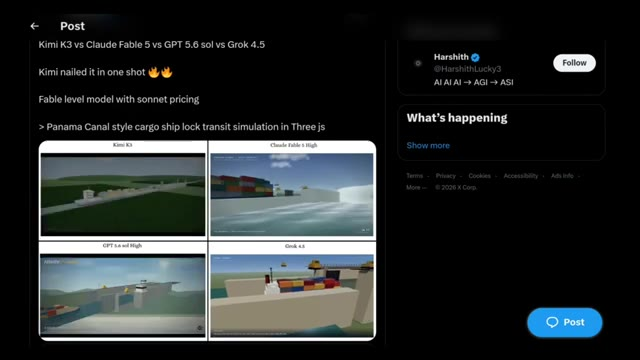
*Capture d'écran d'un tweet comparant quatre modèles d'IA sur une simulation 3JS de transit d'écluse de type canal de Panama, avec le post d'Harshith sur X.*

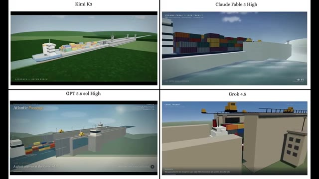
*Vue comparative en grille à quatre panneaux montrant les simulations 3JS de Kimi K3, Claude Fable 5 High, GPT 5.6 sol High et Grok 4.5.*

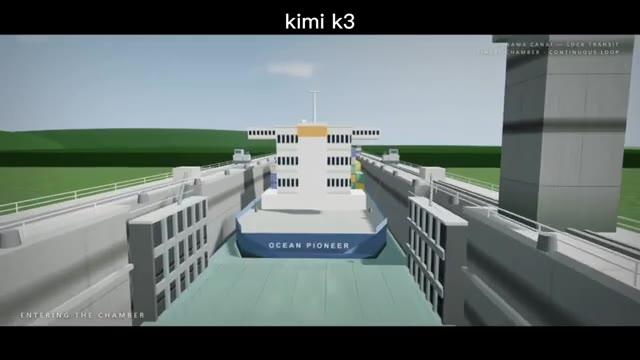
*Vue rapprochée de la simulation 3JS générée par Kimi K3 montrant un porte-conteneurs nommé 'OCEAN PIONEER' entrant dans la chambre d'écluse.*

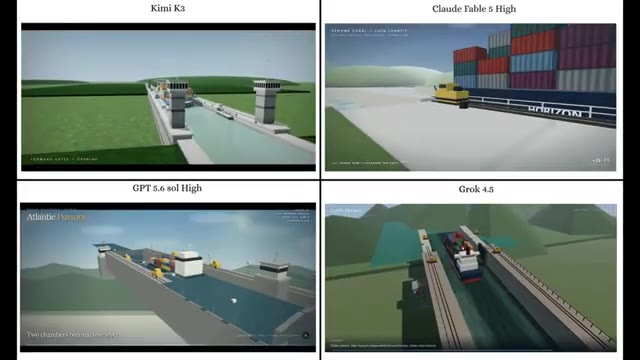
*Grille comparative à quatre panneaux montrant l'évolution des simulations 3JS par les différents modèles d'IA avec des vues sous différents angles.*

---

### ⏱️ `[00:03:44 - 00:04:18]` | Segment #10

**🔊 Audio (Transcription Intégrale Mot pour Mot en Français) :**
> modèle c'est une réalisation énorme et cela montre à quel point l'IA open-source est devenue compétitive. Passons maintenant à la prochaine comparaison. Celle-ci est un test de génération front-end. Jetez d'abord un œil au résultat de Fable 5. Il a l'air correct et fait le travail, mais comparez-le maintenant avec la sortie de Kimi K3. Dès le début, Kimi K3 attire votre attention avec une animation d'ouverture fluide qui donne immédiatement l'impression d'un site web plus soigné et professionnel. Il fait également un meilleur travail pour capturer l'apparence et l'ambiance d'une marque de café premium Terra Roast, avec des visuels plus propres et un design plus raffiné.

**👁️ Analyse Visuelle d'Écran (gemini-3.5-flash-lite) :**
**Interface & Outils** : Présentation comparative de pages web front-end générées par différents modèles d'IA (Kimi K3, Fable 5, GPT 5.6, Grok 4.5).

**Contenu textuel & Code** : Textes visibles : "Kimi K3", "Claude Fable 5 High", "GPT 5.6 sol High", "Grok 4.5", "TERRA ROAST", "FROM SOIL TO SIP", "ORIGIN", "Fire, Time & Transformation", "234°C", "PICKED AT PEAK CRIMSON".

**Action / Démonstration** : Comparaison visuelle côte à côte des interfaces web générées par Kimi K3 et Fable 5 pour illustrer la fluidité des animations et la qualité du design front-end.

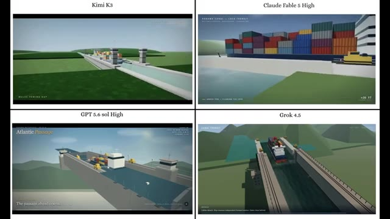
*Comparatif de quatre interfaces front-end générées par IA (Kimi K3, Claude Fable 5 High, GPT 5.6 sol High, Grok 4.5) sur le thème du canal de Panama.*

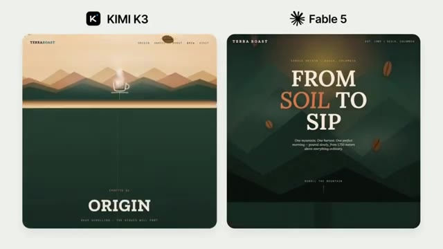
*Comparaison côte à côte des sites web de la marque Terra Roast générés par Kimi K3 et Fable 5, affichant la section d'en-tête "Origin".*

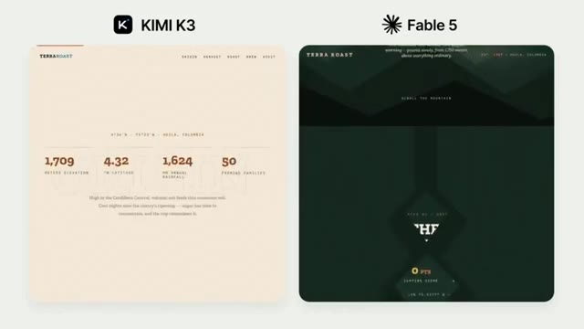
*Comparaison des interfaces web de Terra Roast par Kimi K3 (fond clair) et Fable 5 (fond sombre) montrant des données chiffrées sur l'élévation et la géolocalisation.*

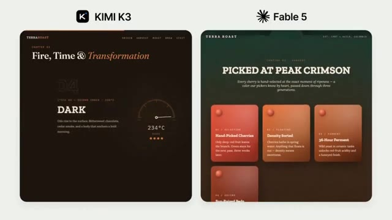
*Comparaison de la section "Fire, Time & Transformation" pour Kimi K3 (avec jauge de température à 234°C) et Fable 5 (section "Picked at Peak Crimson" avec des cartes de processus).*

---

### ⏱️ `[00:04:18 - 00:04:51]` | Segment #11

**🔊 Audio (Transcription Intégrale Mot pour Mot en Français) :**
> design global. D'après cet exemple, je pense que Kimi K3 s'en sort clairement mieux pour la génération de front-end. Maintenant, c'est à vous. Voici une dernière comparaison. Examinez attentivement les deux résultats et dites-moi lequel vous semble le meilleur. Ne faites pas défiler vers les commentaires tout de suite. Prenez votre propre décision et commentez votre réponse ci-dessous. Je suis vraiment curieux de voir si votre choix correspond au mien. Si vous avez apprécié ce rapport de recherche et que vous souhaitez voir davantage de comparaisons d'IA dans le monde réel au lieu de simples scores de benchmarks, assurez-vous de vous abonner. C'est Pursuing AI et je vous retrouve dans la prochaine vidéo.

**👁️ Analyse Visuelle d'Écran (gemini-3.5-flash-lite) :**
**Interface & Outils** : Présentation visuelle comparative d'interfaces web générées par IA (Kimi K3 et Fable 5), suivie d'une animation 3D thématique sur l'IA.

**Contenu textuel & Code** : Textes visibles : 'KIMI K3', 'Fable 5', 'TERRAROAST', 'The Final Ritual', 'FIRE, TIMED TO THE SECOND', 'MERIDIAN 8000', 'CAMP II - THE ICEFALL', 'SOUTH COL LINE - SPRING', 'FIVE LAYERS, ONE SYSTEM', ainsi que diverses données techniques et métriques.

**Action / Démonstration** : Défilement visuel comparatif de deux interfaces front-end générées par intelligence artificielle, puis affichage de l'animation de fin de vidéo.

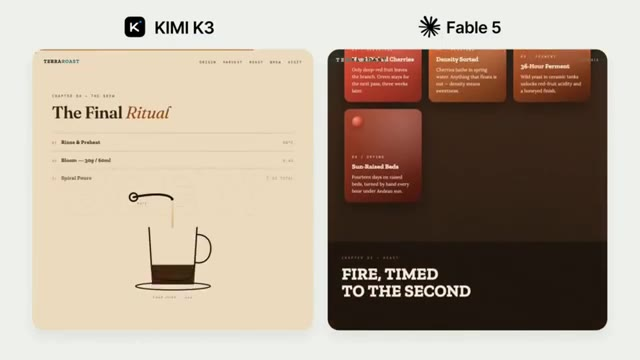
*Comparaison côte à côte de deux interfaces web générées par 'KIMI K3' et 'Fable 5', montrant des conceptions textuelles et visuelles autour du café.*

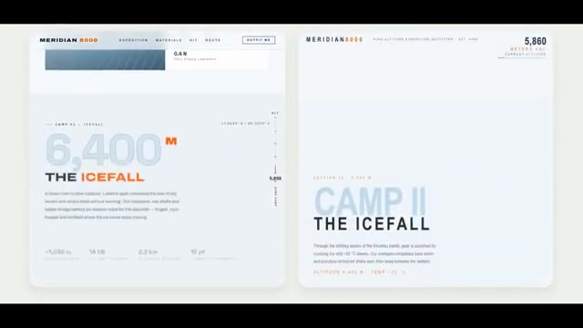
*Comparaison côte à côte de deux interfaces de site web 'MERIDIAN 8000' sur le thème de l'alpinisme et de l'escalade, affichant des données d'altitude et de campement.*

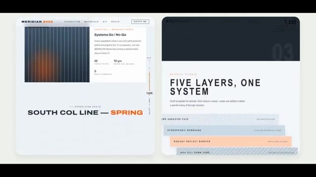
*Comparaison côte à côte d'autres sections du site 'MERIDIAN 8000' affichant des informations techniques sur la route sud et la science des matériaux.*

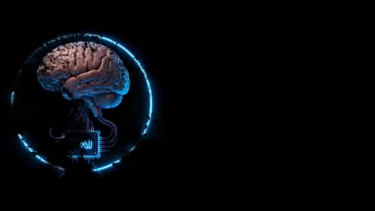
*Animation 3D illustrant un cerveau humain connecté à une puce électronique au sein d'un cercle néon bleu, symbolisant l'intelligence artificielle.*

---
