# 🎬 Claude Opus 5 est INCROYABLE ! (Vrais tests de développeur)

> **Chaîne** : [Pursuing AI](https://www.youtube.com/@PursuingAi)  
> **Titre original** : `Claude Opus 5 Is INSANE! (Real Developer Tests)`  
> **Lien YouTube** : [https://www.youtube.com/watch?v=2s4Y1oD9k3A](https://www.youtube.com/watch?v=2s4Y1oD9k3A)  
> **Date de publication** : 2026-07-25  
> **Durée** : 05m 51s (`351s`)  
> **Identifiant vidéo** : `2s4Y1oD9k3A`  
> **Fiche Web Interactive** : [2026-07-25_YT-2s4Y1oD9k3A_Claude Opus 5 est INCROYABLE ! (Vrais tests de développeur)_by-whisper-v3-large-turbo+gemini-3.5-flash-lite.html](2026-07-25_YT-2s4Y1oD9k3A_Claude Opus 5 est INCROYABLE ! (Vrais tests de développeur)_by-whisper-v3-large-turbo+gemini-3.5-flash-lite.html)  
> **Captures de démonstration clés** : `37 captures réelles (anti-talking-head)`  
> **Modèles utilisés** : Audio: `large-v3-turbo` (Faster-Whisper int8 VPS) | Vision: `gemini-3.5-flash-lite` (Google AI Studio API)  

---

## 📌 Synthèse Exécutive & Outils

### 📌 Résumé
La vidéo de *Pursuing AI* met en lumière la sortie et les capacités stupéfiantes de **Claude Opus 5** (développé par Anthropic), un modèle de pointe qui rivalise directement avec les cadors du marché (comme Fable 5) tout en maintenant le prix de la version précédente. Loin de se limiter aux simples scores des benchmarks, le réalisateur analyse des cas d'usage réels et complexes soumis par la communauté de développeurs et de créateurs. Ces tests démontrent la capacité d'Opus 5 à générer non seulement du code, mais des expériences interactives et visuelles immersives à partir de simples instructions textuelles.

La méthode présentée repose sur l'exploitation des capacités de raisonnement avancé du modèle (notamment via des fonctionnalités comme *Max Thinking*) pour concevoir des applications web interactives et des graphismes sophistiqués. Le workflow consiste à challenger l'IA sur des projets multidisciplinaires : génération de personnages 3D animés avec gestion des vêtements et affichage filaire, création de publicités animées complètes en pur HTML et CSS, ou encore imbrication de systèmes (comme un macOS virtuel fonctionnant à l'intérieur d'une pièce en 3.js). Les créateurs de contenu et de vidéos bénéficient ainsi d'un assistant capable d'automatiser le prototypage rapide d'interfaces, d'animations complexes et de scènes 3D interactives sans passer par des pipelines de production lourds.

Enfin, l'analyse comparative aborde les performances d'Opus 5 face à des concurrents tels que Kimi K3 et Fable 5, notamment sur la génération de textures complexes (comme le rendu photoréaliste d'un bonsaï Sakura). Bien que les benchmarks traditionnels placent Opus 5 au sommet dans de nombreuses catégories (à l'exception notable de la santé et d'une parité quasi parfaite sur les agents de codage), la vidéo souligne que la véritable valeur réside dans la transparence d'Anthropic et dans la fidélité des détails visuels et structurels produits, ouvrant de nouvelles perspectives créatives pour le design interactif et le développement assisté par IA.

### 🛠️ Outils, Modèles & Logiciels Présentés
* **Claude Opus 5** : Modèle d'intelligence artificielle d'Anthropic au centre de la vidéo, utilisé pour le raisonnement avancé, le codage, la génération de graphismes 3D (3.js) et la création d'expériences interactives complexes.
* **Max Thinking** : Fonctionnalité de raisonnement approfondi activée sur Claude Opus 5 pour structurer des tâches créatives d'envergure, comme la conception de publicités animées.
* **3.js** : Librairie JavaScript utilisée pour le rendu et la manipulation de graphismes 3D interactifs dans les navigateurs web, pilotée ici par le code généré par l'IA.
* **Kimi K3** : Modèle concurrent utilisé dans la vidéo pour des tests comparatifs de génération textuelle et visuelle (notamment sur le rendu de textures complexes).
* **Fable 5** : Modèle de référence du marché sur les benchmarks majeurs, confronté à Claude Opus 5 en termes de performances brutes et de réalisme visuel.
* **Artificial Analysis** : Plateforme de benchmark tierce mentionnée pour comparer objectivement les performances des différents modèles d'IA sur plusieurs catégories (codage, santé, agents).

### 🔑 Points Clés & Enseignements Stratégiques
* **Dépassement des benchmarks** : Les scores bruts ne suffisent pas ; la véritable puissance de Claude Opus 5 se mesure à sa capacité à exécuter des tâches créatives et techniques complexes dans le monde réel.
* **Animation 3D et textures** : Capacité à générer des personnages animés dotés de mouvements naturels, incluant la simulation physique de tissus ondulatoires et l'accès à des modes filaires (wireframe).
* **Génération publicitaire autonome** : Utilisation du prompt engineering et du *Max Thinking* pour concevoir de zéro une publicité animée de 30 secondes entièrement en HTML, avec effets de néon et transitions fluides.
* **Imbrication de systèmes (Inception logicielle)** : Réalisation de scènes 3.js sophistiquées intégrant un environnement virtuel (une pièce chaleureuse) qui abrite lui-même un MacBook virtuel doté d'une interface macOS pleinement fonctionnelle.
* **Maîtrise des détails microscopiques** : Supériorité manifeste d'Opus 5 face à ses concurrents (Kimi K3, Fable 5) sur la génération de textures organiques complexes, telles que l'écorce torsadée et réaliste d'un bonsaï Sakura.
* **Transparence des éditeurs** : Appréciation de la démarche d'Anthropic qui publie ouvertement les domaines où son modèle est légèrement en retrait (comme la santé), renforçant la confiance des développeurs.
* **Parité sur les agents de codage** : Constat d'une performance presque identique (à 0,1 % près) entre Opus 5 et Fable 5 sur les tâches de codage par agent, déplaçant la différenciation vers la créativité et la structure.
* **Accessibilité des sources** : Le partage systématique des prompts originaux et des liens de démo en direct par les créateurs permet une rétro-ingénierie et un apprentissage empirique rapides pour la communauté.
* **Prototypage instantané pour la vidéo** : Possibilité pour les créateurs de contourner les pipelines de production traditionnels en demandant à l'IA de coder des prototypes interactifs directement exploitables à l'écran.

---

## ⏱️ Chronologie & Transcription Complète Audio & Visuelle (Mot pour Mot)

### ⏱️ `[00:00:00 - 00:00:21]` | Segment #01

**🔊 Audio (Transcription Intégrale Mot pour Mot en Français) :**
> Tout le monde s'attendait à ce qu'Anthropic sorte un modèle plus puissant. Mais presque personne ne s'attendait à ces résultats. Anthropic vient de lancer Claude Opus 5, et sur plusieurs benchmarks majeurs, il rivalise directement avec Fable 5 tout en coûtant le même prix que l'Opus 4.8. Mais les benchmarks ne sont pas la partie intéressante.

**👁️ Analyse Visuelle d'Écran (gemini-3.5-flash-lite) :**
**Interface & Outils** : Interface de simulation 3D interactive, page web officielle d'Anthropic, et moteur de jeu vidéo en vue subjective (FPS).

**Contenu textuel & Code** : Sur l'image 1 : panneaux avec statistiques de l'animal (vitesse 0.2 km/h, démarche, cœur, faim, soif, etc.) et contrôles vocaux/corporels. Sur l'image 2 : en-tête "Introducing Claude Opus 5", date "24 Jul 2026", logo de l'entreprise et bouton "Try Claude". Sur l'image 3 : mini-carte en haut à gauche, compteur de munitions "30 / 210" en bas à droite, viseur et réticule d'arme.

**Action / Démonstration** : Visualisation d'une simulation 3D d'un animal, navigation sur la page de présentation du nouveau modèle d'Anthropic, et séquence de gameplay montrant un environnement de jeu vidéo interactif.

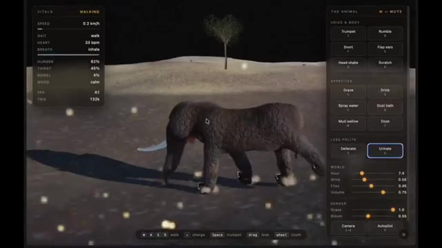
*Interface d'un logiciel ou d'une simulation 3D montrant un éléphant dans un paysage désertique avec des panneaux de contrôle sur les côtés.*

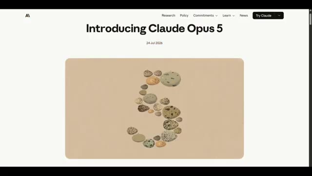
*Page web d'Anthropic annonçant le lancement de Claude Opus 5 avec une illustration en forme de chiffre 5 composé de pierres.*

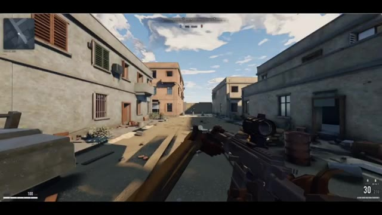
*Vue à la première personne (FPS) dans un jeu vidéo de type tir tactique montrant un personnage tenant un fusil d'assaut dans une ruelle urbaine.*

---

### ⏱️ `[00:00:21 - 00:00:44]` | Segment #02

**🔊 Audio (Transcription Intégrale Mot pour Mot en Français) :**
> Ce qui est intéressant, c'est ce qui se passe quand on pousse réellement Opus 5 dans ses retranchements. Certains résultats sont tellement surprenants qu'ils changent complètement la position de ce modèle face à la concurrence. Aujourd'hui, je vais vous montrer les exemples d'Opus 5 les plus impressionnants que j'ai pu trouver, de la programmation au raisonnement en passant par des tâches du monde réel qui ont même fait s'arrêter et regarder à deux fois des utilisateurs d'IA expérimentés.

**👁️ Analyse Visuelle d'Écran (gemini-3.5-flash-lite) :**
**Interface & Outils** : Interfaces de simulations interactives, de moteurs de jeu et d'environnements de test 3D.

**Contenu textuel & Code** : Menus techniques, paramètres atmosphériques (heure, vent), spécifications de baliste et affichage d'un aéronef commercial.
[DESC_IMAGE_1] Vue subjective d'un jeu vidéo avec un fusil en premier plan dans un décor de ville détruite.
[DESC_IMAGE_2] Panneau latéral « ATMOSPHERE » avec des curseurs pour régler l'heure, les vagues et le vent.
[DESC_IMAGE_3] Panneaux de contrôle techniques « BALLISTA », « LAYING & LOADING » et « QUADRANT ».
[DESC_IMAGE_4] Rendu 3D réaliste d'un avion portant l'inscription "BOEING" sur son flanc.

**Action / Démonstration** : Démonstration pédagogique et présentation du workflow.

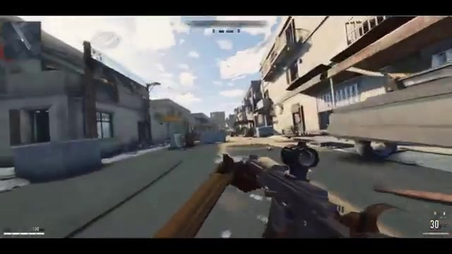
*Démonstration d'un jeu de tir à la première personne généré ou contrôlé par l'IA dans une rue urbaine.*

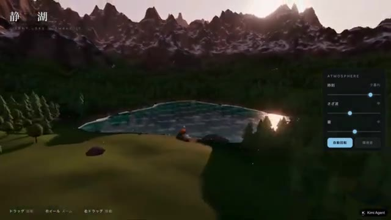
*Interface de simulation paysagère ou environnementale montrant un lac et des montagnes avec des curseurs d'atmosphère.*

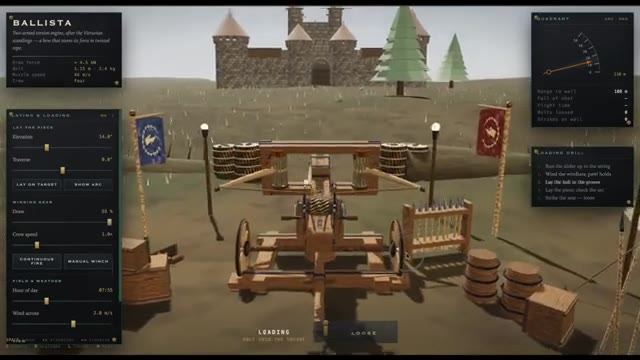
*Interface de simulation interactive d'une baliste médiévale avec des paramètres techniques et des contrôles de tir.*

*Modélisation 3D détaillée d'un avion de ligne Boeing sur une piste d'atterrissage.*

---

### ⏱️ `[00:00:44 - 00:01:03]` | Segment #03

**🔊 Audio (Transcription Intégrale Mot pour Mot en Français) :**
> Ceci est Pursuing AI, et vous regardez The Research Report. Commençons par quelque chose qui a vraiment attiré mon attention. L'utilisateur Majid Manzarpur a utilisé Clot Opus 5 pour créer ce personnage entièrement animé. À première vue, ça a l'air impressionnant. Mais regardez d'un peu plus près.

**👁️ Analyse Visuelle d'Écran (gemini-3.5-flash-lite) :**
**Interface & Outils** : Navigateur web affichant X (Twitter) et une application de visualisation 3D interactive utilisant Three.js avec un panneau « RIG INSPECTOR ».

**Contenu textuel & Code** : Texte du tweet de Majid Manzarpur : « So.. @claudeai Opus 5 can build a game character, equip, rig and animate it in @threejs with pure code Prompt and demo link below 👇 ». Interface « RIG INSPECTOR » avec options de graines (Seed), animations (IDLE, WALK, RUN, ATTACK, BLOCK, HIT), calques (BODY, ARMOR, BOTH) et options d'armure.

**Action / Démonstration** : Affichage d'un tweet sur X puis zoom sur la démonstration interactive d'un personnage 3D en armure noire manipulé dans un visualiseur avec squelette et options d'animation.

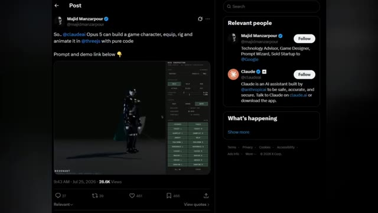
*Publication sur le réseau social X (Twitter) de Majid Manzarpur montrant un personnage en armure 3D animé et des informations sur Claude d'Anthropic.*

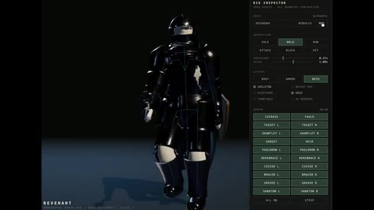
*Gros plan sur le panneau de contrôle « RIG INSPECTOR » avec un personnage en armure noire entièrement riggé et animé.*

---

### ⏱️ `[00:01:03 - 00:01:25]` | Segment #04

**🔊 Audio (Transcription Intégrale Mot pour Mot en Français) :**
> Remarquez à quel point le personnage marche naturellement. Regardez maintenant le tissu qui flotte derrière lui. Ces mouvements ondulatoires ajoutent un niveau de réalisme qu'il est difficile d'ignorer. Et si cela ne suffit pas, vous pouvez même inspecter l'ensemble du modèle en mode filaire et carte de pondération pour voir comment il est construit. Le meilleur dans tout ça, c'est que le créateur a partagé à la fois le prompt original et un lien de démo en direct, afin que vous puissiez l'explorer vous-même.

**👁️ Analyse Visuelle d'Écran (gemini-3.5-flash-lite) :**
**Interface & Outils** : Interface de l'outil de rigging 3D (Rig Inspector) et interface du réseau social X (Twitter).

**Contenu textuel & Code** : Panneau latéral avec les options de rig (Seed, Animation, Layers avec Skeleton, Wireframe, Grid, etc.), et nom du personnage "REVENANT". Sur la capture X : publication de Majid Manzarpour avec le texte "Prompt if you want to compare to other models" et un lien de démo vers Claude AI.

**Action / Démonstration** : Visualisation du modèle 3D d'un chevalier en mouvement de marche avec son panneau de contrôle interactif, suivie d'une transition vers une publication sur les réseaux sociaux montrant le prompt et le lien de démo.

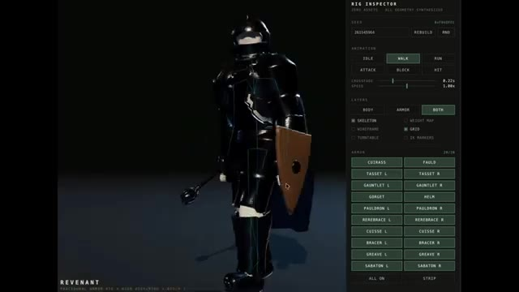
*Interface du "Rig Inspector" montrant un personnage 3D en armure noire avec des options d'animation (Walk, Run, Idle) et des réglages de squelette et de grille.*

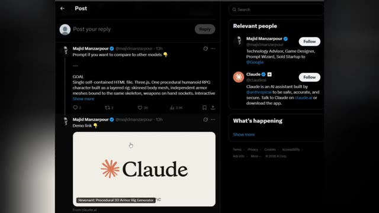
*Publication sur le réseau social X (Twitter) du compte de Majid Manzarpour partageant le prompt et le lien de démonstration de Claude AI pour le générateur d'armures 3D.*

---

### ⏱️ `[00:01:25 - 00:01:44]` | Segment #05

**🔊 Audio (Transcription Intégrale Mot pour Mot en Français) :**
> J'ai mis tous les liens dans la description. Mais ce n'est que le début, car le prochain exemple d'Opus 5 est encore plus surprenant. Le prochain exemple prend une direction complètement différente. L'utilisateur Stevie a mis au défi Claude Opus 5 en utilisant Max Thinking pour créer sa propre publicité.

**👁️ Analyse Visuelle d'Écran (gemini-3.5-flash-lite) :**
**Interface & Outils** : Interface du réseau social X (anciennement Twitter) en mode sombre, affichant un post avec un lecteur vidéo intégré.

**Contenu textuel & Code** : Texte du post de Majid Manzarpour (@majidmanzarpour) : "So... @claudeai Opus 5 can build a game character, equip, rig and animate it in @threejs with pure code. Prompt and demo link below 👇". Dans la vidéo intégrée, on aperçoit un personnage de type chevalier/robot sombre manipulé via une interface de type "Rig Inspector". Sur le panneau latéral droit, des suggestions de comptes pertinents (« Relevant people ») incluent Majid Manzarpour et Claude (@claudeai).

**Action / Démonstration** : Le créateur présente une capture d'écran d'un tweet illustrant les capacités de Claude Opus 5 à coder entièrement un personnage 3D interactif.

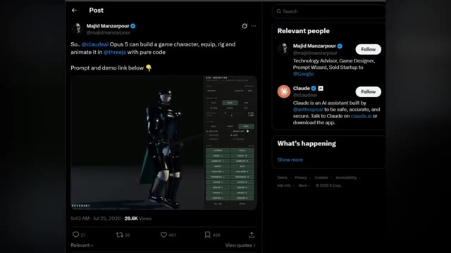
*Publication sur le réseau social X montrant un post de Majid Manzarpour avec une vidéo de démonstration d'un personnage de jeu généré par Claude Opus 5.*

---

### ⏱️ `[00:01:44 - 00:02:08]` | Segment #06

**🔊 Audio (Transcription Intégrale Mot pour Mot en Français) :**
> Et au lieu de générer une simple démo, Opus 5 a créé une publicité animée entière de 30 secondes en pur HTML. Regardez simplement le résultat. Les animations de style néon clignotant, les transitions fluides et la présentation cinématographique. On a vraiment l'impression d'une publicité de station-service tard dans la nuit, et non de quelque chose qu'on s'attendrait à ce qu'une IA construise à partir d'une seule invite.

**👁️ Analyse Visuelle d'Écran (gemini-3.5-flash-lite) :**
**Interface & Outils** : Interface de la plateforme X (anciennement Twitter) affichant un tweet et la vidéo intégrée, suivie du rendu vidéo en plein écran.

**Contenu textuel & Code** : Texte du tweet : "I asked Claude Opus 5 (thinking Max) to make its own launch ad. 'You just launched. Direct your own intro film. Theme: old-school neon.' It wrote the storyboard, then coded the whole thing: flickering tubes, rain reflections, a power surge before the reveal. 30 seconds. Pure HTML canvas." Éléments visuels animés incluant des enseignes au néon colorées ("REASONING", "VISION", "WRITING") et le logo de Claude.

**Action / Démonstration** : Démonstration du rendu visuel de la publicité animée générée entièrement en HTML par l'intelligence artificielle.

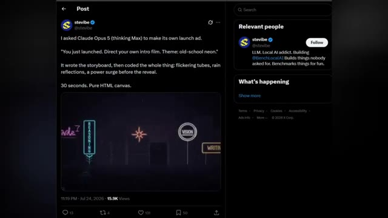
*Capture d'écran d'un tweet montrant le résultat visuel de l'annonce animée en HTML générée par Opus 5.*

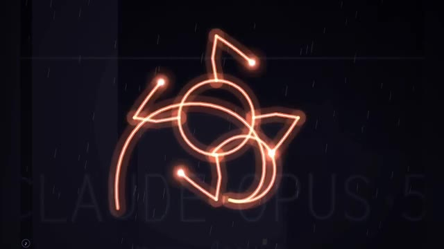
*Animation de néons orange scintillants sur fond sombre avec effet de pluie.*

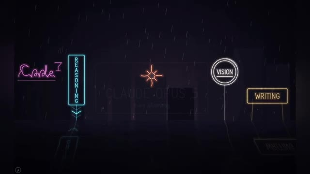
*Scène animée complète de style néon urbain avec des enseignes lumineuses colorées sous la pluie.*

---

### ⏱️ `[00:02:08 - 00:02:27]` | Segment #07

**🔊 Audio (Transcription Intégrale Mot pour Mot en Français) :**
> Ce qui est encore plus impressionnant, c'est qu'Opus 5 a décidé de générer cette expérience interactive complète de lui-même. Cela en dit long sur l'évolution de son raisonnement créatif. Si vous souhaitez explorer par vous-même, j'ai mis le lien vers la publication originale dans la description. Et croyez-moi, vous n'avez pas encore vu l'exemple le plus fou d'Opus 5.

**👁️ Analyse Visuelle d'Écran (gemini-3.5-flash-lite) :**
**Interface & Outils** : Interface vidéo graphique puis interface du réseau social X (Twitter).

**Contenu textuel & Code** : Texte à l'écran : "CLAUDE OPUS 5", "non gaming", et sur l'image 3 le post de stevibe expliquant : "I asked Claude Opus 5 (thinking Max) to make its own launch ad...".

**Action / Démonstration** : Affichage des visuels animés de l'interface graphique générée par l'IA, puis transition vers la publication originale sur les réseaux sociaux.

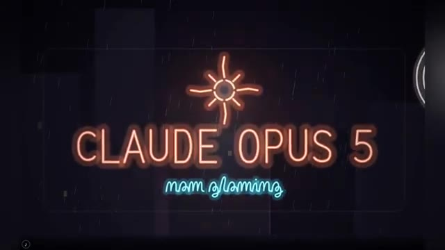
*Animation graphique simulant une enseigne au néon avec le texte 'CLAUDE OPUS 5'.*

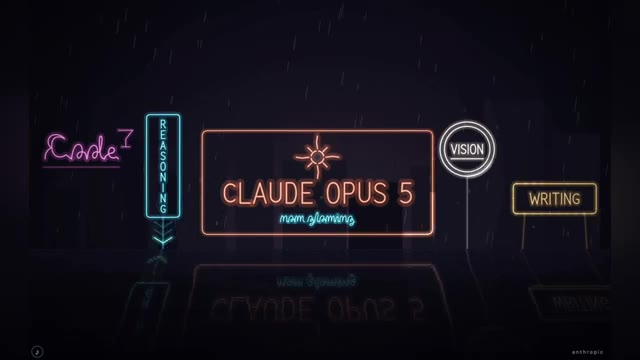
*Vue élargie de l'animation de néons montrant de nouveaux éléments textuels et symboles associés à Claude Opus 5.*

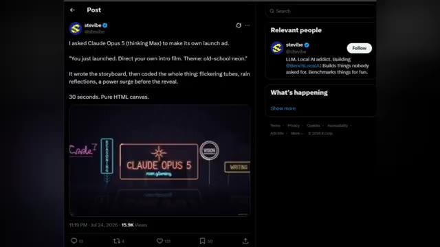
*Capture d'écran d'une publication sur le réseau social X montrant le post original avec la vidéo de démonstration et le texte descriptif.*

---

### ⏱️ `[00:02:27 - 00:02:49]` | Segment #08

**🔊 Audio (Transcription Intégrale Mot pour Mot en Français) :**
> L'exemple suivant brouille complètement la frontière entre la génération par IA et l'expérience interactive réelle. L'utilisateur Token Gremlin a demandé à Claude Opus 5 de créer une pièce interactive chaleureuse en 3.js. Mais regardez de plus près. À l'intérieur de la pièce se trouve un MacBook virtuel exécutant une interface entièrement fonctionnelle semblable à macOS.

**👁️ Analyse Visuelle d'Écran (gemini-3.5-flash-lite) :**
**Interface & Outils** : Navigateur web affichant une publication sur le réseau social X (Twitter) et un projet interactif 3.js montrant un bureau macOS virtuel.

**Contenu textuel & Code** : Texte du tweet de @stevibe : "I asked Claude Opus 5 (thinking Max) to make its own launch ad. You just launched. Direct your own intro film. Theme: old-school neon. It wrote the storyboard, then coded the whole thing: flickering tubes, rain reflections, a power surge before the reveal. 30 seconds. Pure HTML canvas." Dans la deuxième image, on aperçoit une simulation de bureau macOS avec un Dock d'applications et un fond d'écran coloré.

**Action / Démonstration** : Présentation d'un tweet illustrant les capacités de codage de Claude Opus 5, puis affichage de la pièce interactive en 3.js avec le MacBook virtuel affichant une interface macOS fonctionnelle.

*Capture d'écran d'une publication sur X (Twitter) par @stevibe montrant un tweet et une vidéo de démonstration sur Claude Opus 5.*

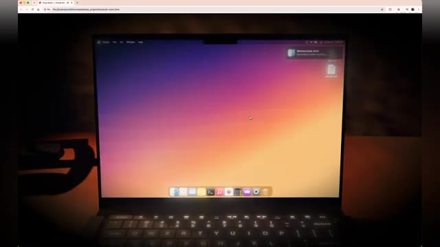
*Capture d'écran montrant l'écran d'un ordinateur affichant une interface simulant un bureau macOS à l'intérieur d'une pièce interactive 3.js.*

---

### ⏱️ `[00:02:49 - 00:03:11]` | Segment #09

**🔊 Audio (Transcription Intégrale Mot pour Mot en Français) :**
> Vous ne regardez pas seulement une scène en 3D, vous interagissez avec un logiciel à l'intérieur d'un ordinateur qui existe lui-même à l'intérieur d'un autre monde virtuel. Ce qui rend cela si impressionnant, c'est la superposition. Opus 5 a généré l'environnement, l'éclairage, la disposition des meubles, l'atmosphère, puis a intégré un système d'exploitation interactif au sein de cette même expérience.

**👁️ Analyse Visuelle d'Écran (gemini-3.5-flash-lite) :**
**Interface & Outils** : Interface d'un système d'exploitation virtuel de type macOS (Finder et Dock) affichée sur l'écran d'un ordinateur portable dans un environnement 3D.

**Contenu textuel & Code** : Fenêtre du Finder ouverte montrant les dossiers par défaut (Desktop, Documents, Downloads, Movies, Music, Pictures), le Dock d'applications macOS en bas et un fond d'écran coloré.

**Action / Démonstration** : Navigation dans le système d'exploitation virtuel intégré au sein d'une scène 3D interactive générée par intelligence artificielle.

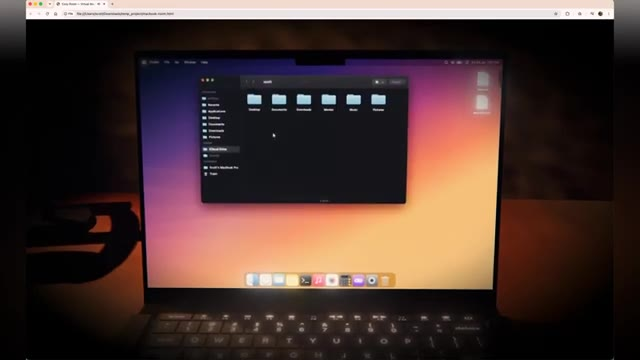
*Vue d'un ordinateur virtuel affichant le Finder de macOS à l'intérieur d'une scène 3D générée par IA.*

---

### ⏱️ `[00:03:11 - 00:03:30]` | Segment #10

**🔊 Audio (Transcription Intégrale Mot pour Mot en Français) :**
> Ce n'est pas seulement un rendu impressionnant, ce sont de multiples couches de génération qui travaillent ensemble. Et honnêtement, le MacBook virtuel et l'environnement global semblent étonnamment réels. L'éclairage, les reflets et les minuscules détails naturels font qu'il est facile d'oublier que l'on regarde quelque chose généré par l'IA.

**👁️ Analyse Visuelle d'Écran (gemini-3.5-flash-lite) :**
**Interface & Outils** : Navigateur web affichant un environnement virtuel interactif simulant un ordinateur portable (MacBook virtuel).

**Contenu textuel & Code** : Interface d'un système d'exploitation inspiré de macOS affichée sur l'écran virtuel, avec le bureau, des fenêtres ouvertes (dont une visionneuse d'images d'une ville nocturne) et un dock d'applications en bas.

**Action / Démonstration** : Présentation visuelle d'un environnement virtuel extrêmement réaliste généré par intelligence artificielle, mettant en valeur les reflets, l'éclairage et la fidélité graphique de l'écran du MacBook.

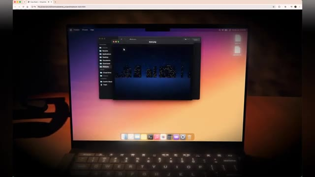
*Affichage d'un MacBook virtuel intégré dans un environnement 3D généré par IA, montrant le système d'exploitation avec ses fenêtres et son dock.*

---

### ⏱️ `[00:03:30 - 00:03:48]` | Segment #11

**🔊 Audio (Transcription Intégrale Mot pour Mot en Français) :**
> Si vous souhaitez l'explorer vous-même, j'ai mis le lien du message original dans la description. Mais la prochaine démo d'Opus 5 pousse le réalisme encore plus loin. Passons maintenant des expériences interactives à quelque chose de beaucoup plus stimulant : un test détaillé de génération de bonsaï Sakura réalisé par UserSynipsis.

**👁️ Analyse Visuelle d'Écran (gemini-3.5-flash-lite) :**
**Interface & Outils** : Système d'exploitation de type macOS et interface du réseau social X (Twitter).

**Contenu textuel & Code** : Sur l'image 1, on aperçoit une fenêtre de recherche avec le texte "Search" et "No results. There are only five pages and you have probably seen them all". Sur l'image 2, le tweet de @abhinavflac indique "Opus 5 clears kimi k3 hard" avec des comparaisons textuelles détaillées sur le tronc, la canopée et la chute des pétales, ainsi qu'une vidéo intégrée montrant le bonsaï Sakura en 3D.

**Action / Démonstration** : L'écran montre d'abord un environnement virtuel de bureau avec une recherche infructueuse, puis bascule sur une publication X affichant un comparatif de génération d'IA sur le thème d'un bonsaï.

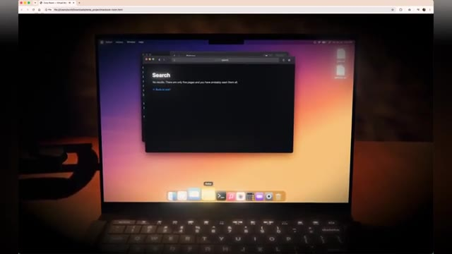
*Un écran d'ordinateur portable affichant une interface de bureau type macOS avec une fenêtre de recherche ouverte.*

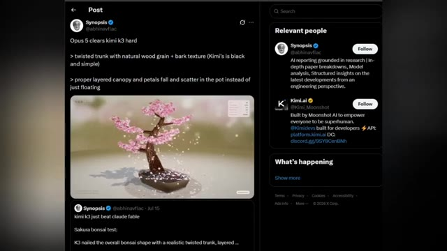
*Une capture d'écran du réseau social X (Twitter) montrant une publication de l'utilisateur @abhinavflac concernant le test de génération d'un bonsaï Sakura.*

---

### ⏱️ `[00:03:48 - 00:04:10]` | Segment #12

**🔊 Audio (Transcription Intégrale Mot pour Mot en Français) :**
> Ce n'est pas seulement une comparaison côte à côte. C'est un test qui révèle dans quelle mesure chaque modèle comprend les détails précis et le réalisme. Et dans cette comparaison, Claude Opus 5 surpasse à la fois Kimi K3 et Fable 5. Regardez de plus près le tronc. Remarquez le bois naturellement torsadé, le grain réaliste et les riches textures de l'écorce.

**👁️ Analyse Visuelle d'Écran (gemini-3.5-flash-lite) :**
**Interface & Outils** : Interface de présentation de rendu 3D avec affichage de statistiques de diagnostic en temps réel.

**Contenu textuel & Code** : Texte "OPUS 5", texte japonais en haut à gauche ("桜盆栽 SAKURA BONSAI"), encadré de diagnostic avec des données techniques en haut à droite ("FPS: 147", "BLOSSOMS: 2,974", "PETALS IN AIR: 214", "BRANCHES: 310", "DRAW CALLS: 31", "TRIANGLES: 423,647"), et texte en bas à gauche ("Procedural Nejiki Bonsai - unstressed, emissions - continuously falling petals") et bouton "DIAGNOSTICS".

**Action / Démonstration** : Démonstration visuelle et gros plan sur le rendu détaillé d'un bonsaï en 3D avec simulation de chute de pétales de fleurs.

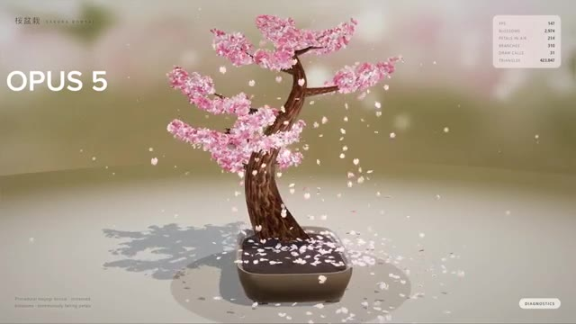
*Rendu visuel d'un bonsaï généré par Claude Opus 5 avec des pétales de fleurs roses qui tombent et des statistiques de performance affichées.*

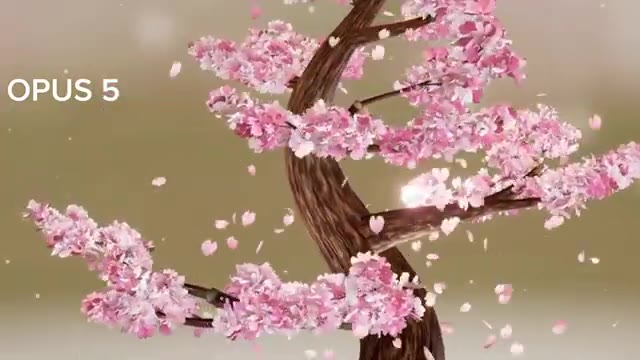
*Gros plan sur le tronc torsadé et les branches fleuries du bonsaï généré par Claude Opus 5, avec le texte "OPUS 5" visible sur la gauche.*

---

### ⏱️ `[00:04:10 - 00:04:32]` | Segment #13

**🔊 Audio (Transcription Intégrale Mot pour Mot en Français) :**
> On a vraiment l'impression d'avoir affaire à un bonsaï vivant. En comparaison, Kimi K3 produit un tronc beaucoup plus sombre et simple avec nettement moins de texture. Et Fable 5 rate également de nombreux détails réalistes de l'écorce, ce qui donne à l'arbre un aspect plus plat et moins naturel. C'est le genre de comparaison où la différence n'est pas évidente au premier abord.

**👁️ Analyse Visuelle d'Écran (gemini-3.5-flash-lite) :**
**Interface & Outils** : Interface de démonstration et de benchmark web affichant des modèles de bonsaïs générés en 3D avec des onglets de navigateur et des panneaux de diagnostics.

**Contenu textuel & Code** : Texte affichant "OPUS 5", "SAKURA BONSAI", des métriques de performance en haut à droite (FPS 144, Blossoms 2,974, etc.), ainsi que les libellés "kimi k3" et "fable 5" sur les comparatifs.

**Action / Démonstration** : Présentation comparative des différents modèles de génération d'arbres bonsaïs (Opus 5, Kimi K3, Fable 5) pour évaluer la qualité des textures d'écorce et du rendu des pétales.

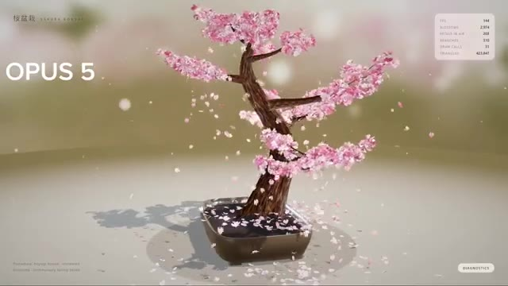
*Rendu visuel d'un bonsaï de cerisier en fleurs étiqueté "OPUS 5" avec des pétales tombant dans le vent et des données de diagnostic à l'écran.*

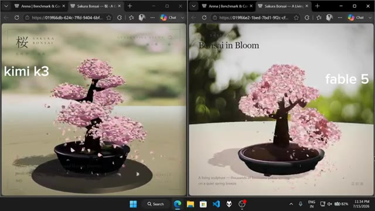
*Comparaison côte à côte de deux fenêtres de navigateur montrant "kimi k3" à gauche et "fable 5" à droite représentant des modèles de bonsaï différents.*

---

### ⏱️ `[00:04:32 - 00:04:53]` | Segment #14

**🔊 Audio (Transcription Intégrale Mot pour Mot en Français) :**
> Mais une fois que vous remarquez les détails, vous ne pouvez tout simplement plus les ignorer. Avant de conclure, prenons du recul et examinons la vue d'ensemble. Selon le benchmark d'Artificial Analysis, Cloud Opus 5 est actuellement classé au sommet. Et si vous comparez les scores des benchmarks, Opus 5 surpasse Fable 5 dans presque toutes les catégories principales.

**👁️ Analyse Visuelle d'Écran (gemini-3.5-flash-lite) :**
**Interface & Outils** : Interface du réseau social X (anciennement Twitter) et site web de benchmark Artificial Analysis.

**Contenu textuel & Code** : Tweets sur X concernant "Opus 5 clears kimi k3 hard" et graphiques statistiques d'Artificial Analysis montrant les scores d'intelligence, la vitesse d'inférence en tokens par seconde et le coût moyen par tâche pour des modèles tels que Claude Opus 5, Fable 5, GPT-5.6 Sol, Kimi K3, etc. Le tableau de benchmark détaille des scores pour des critères comme l'agentic terminal coding, knowledge work, computer use, et agentic coding.

**Action / Démonstration** : Défilement à travers des publications sur les réseaux sociaux puis affichage de graphiques statistiques et de tableaux de benchmarks comparatifs entre modèles d'intelligence artificielle.

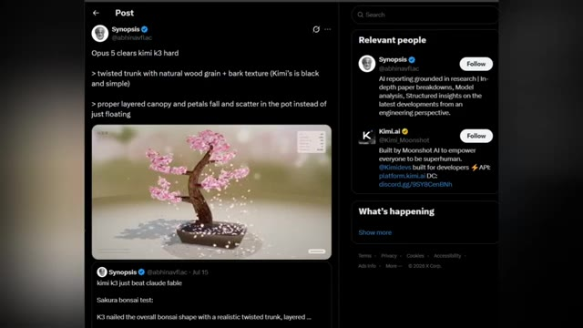
*Capture d'écran d'un tweet sur X montrant une discussion sur les performances comparées entre Opus 5 et Kimi K3, avec une vidéo de bonsaï en sakura.*

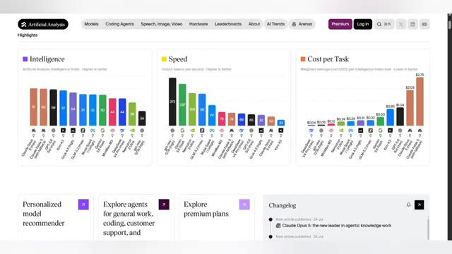
*Tableau de bord d'Artificial Analysis affichant les graphiques de benchmarks de l'Intelligence, de la Vitesse et du Coût par tâche de différents modèles d'IA.*

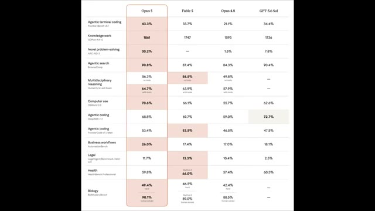
*Tableau comparatif détaillé des scores de performance par catégorie entre les modèles Opus 5, Fable 5, Opus 4.8 et GPT-5.6 Sol.*

---

### ⏱️ `[00:04:53 - 00:05:13]` | Segment #15

**🔊 Audio (Transcription Intégrale Mot pour Mot en Français) :**
> La seule exception notable est la santé. Ici, Fable 5 obtient 66 %, tandis que Cloud Opus 5 arrive à 59,8 %. Et pour le codage d'un agent, la différence est presque inexistante, seulement 0,1 %. Mais voici la partie que j'ai trouvée la plus intéressante. Anthropic n'a pas prétendu tout gagner.

**👁️ Analyse Visuelle d'Écran (gemini-3.5-flash-lite) :**
**Interface & Outils** : Tableau comparatif de benchmarks de modèles d'intelligence artificielle (Opus 5, Fable 5, Opus 4.8, GPT-5.6 Sol).

**Contenu textuel & Code** : Tableaux de scores pour différentes catégories : Agentic terminal coding, Knowledge work, Novel problem-solving, Agentic search, Multidisciplinary reasoning, Computer use, Agentic coding, Business workflows, Legal, Health, Biology. Noms des modèles en en-tête : Opus 5, Fable 5, Opus 4.8, GPT-5.6 Sol.

**Action / Démonstration** : Défilement et navigation à l'écran sur le tableau des benchmarks de performance des modèles d'IA.

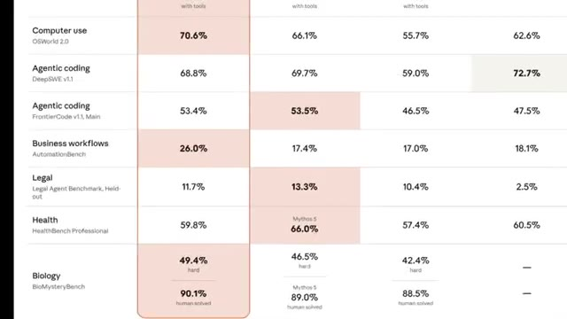
*Gros plan sur le tableau comparatif montrant les scores de santé et de biologie des différents modèles d'IA.*

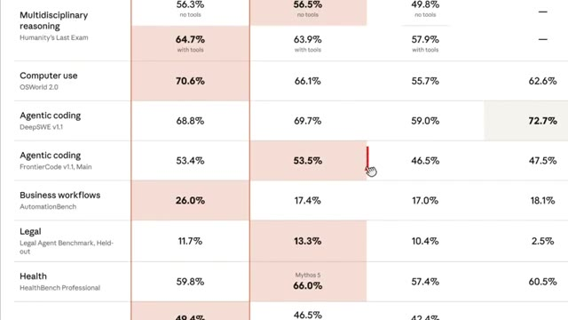
*Vue dézoomée du tableau comparatif avec un curseur de souris pointant sur une ligne de performance.*

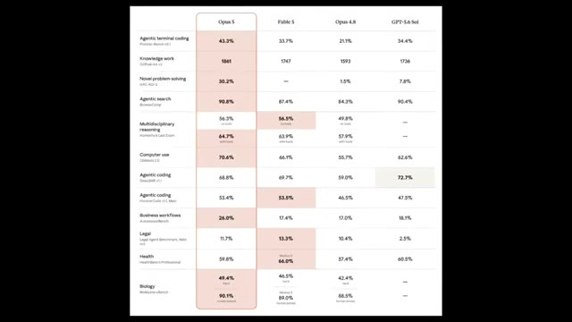
*Vue d'ensemble complète du tableau comparatif des performances des modèles Opus 5, Fable 5, Opus 4.8 et GPT-5.6 Sol.*

---

### ⏱️ `[00:05:13 - 00:05:35]` | Segment #16

**🔊 Audio (Transcription Intégrale Mot pour Mot en Français) :**
> Au lieu de cela, ils ont ouvertement publié les domaines où Opus 5 était légèrement en retard. Que ce soit de la transparence ou de la confiance dans le modèle, je vous laisse décider. Et c'est exactement pourquoi les chiffres des benchmarks ne racontent jamais toute l'histoire. Le véritable test, c'est ce que ces modèles peuvent réellement construire. Et comme vous l'avez vu aujourd'hui, Opus 5 livre des résultats vraiment impressionnants.

**👁️ Analyse Visuelle d'Écran (gemini-3.5-flash-lite) :**
**Interface & Outils** : Navigateur web affichant des graphiques de performance et des pages de documentation/démonstration d'Anthropic (Claude).

**Contenu textuel & Code** : Tableaux de benchmarks détaillant des métriques telles que "Agentic terminal coding", "Knowledge work", "Novel problem-solving", "Agentic search", "Multidisciplinary reasoning", etc. Sur les images 2 et 3, le texte indique : "Finally, Opus 5 is capable of producing much stronger visual outputs:" ainsi que les boutons "Wind tunnel" et "Cell artifact", et une légende sous la simulation : "Opus 5 visualized the flow of air over aerodynamic (and non-aerodynamic) objects. Try different settings in the wind tunnel here."

**Action / Démonstration** : Présentation visuelle comparative des benchmarks de performance suivie d'une démonstration des capacités de rendu visuel d'Opus 5 dans une simulation de soufflerie interactive.

*Tableau de comparaison des performances de différents modèles d'IA, dont Opus 5, Fable 5, Opus 4.8 et GPT-5.6 Sol, à travers divers benchmarks.*

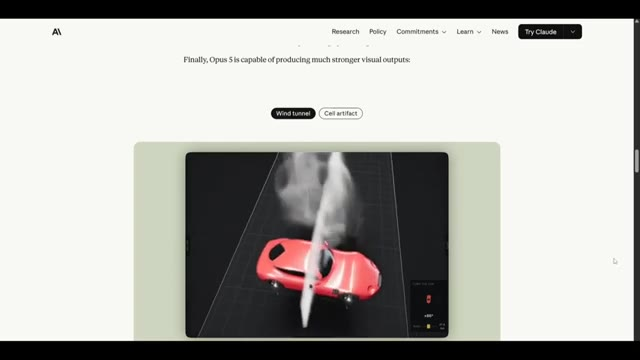
*Page web de présentation d'Anthropic montrant une simulation visuelle d'une soufflerie aérodynamique avec une voiture rouge.*

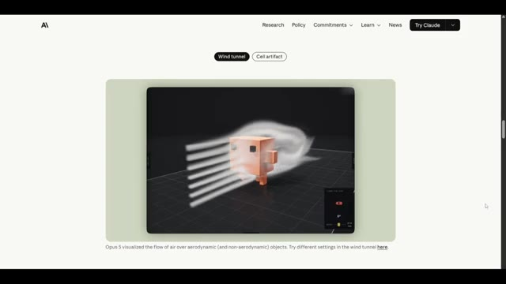
*Page web de présentation d'Anthropic montrant une simulation visuelle de flux d'air autour d'un objet cubique texturé.*

---

### ⏱️ `[00:05:35 - 00:05:50]` | Segment #17

**🔊 Audio (Transcription Intégrale Mot pour Mot en Français) :**
> Ceci est Pursuing AI, et vous avez regardé The Research Report. Si vous avez apprécié cette plongée en profondeur, assurez-vous d'aimer, de vous abonner et de partager cette vidéo avec quelqu'un qui s'intéresse à l'IA. Merci d'avoir regardé, et je vous retrouve dans le prochain rapport de recherche.

**👁️ Analyse Visuelle d'Écran (gemini-3.5-flash-lite) :**
**Interface & Outils** : Écran de fin / Animation de clôture de la chaîne (pas de logiciel de démonstration ni de partage d'écran).

**Contenu textuel & Code** : Animation graphique sur fond noir montrant un cerveau humain connecté à un microprocesseur lumineux entouré d'un cercle néon bleu, sans texte visible.

**Action / Démonstration** : Affichage de l'animation graphique de clôture de la chaîne Pursuing AI pendant la conclusion de la vidéo.

---
