# 🎬 Un seul prompt a créé cette scène cinématique par IA ! Akool Clash

> **Chaîne** : [Pursuing AI](https://www.youtube.com/@PursuingAi)  
> **Titre original** : `One Prompt Created This Cinematic AI Scene! Akool Clash`  
> **Lien YouTube** : [https://www.youtube.com/watch?v=hY7daRwGnaw](https://www.youtube.com/watch?v=hY7daRwGnaw)  
> **Date de publication** : 2026-07-27  
> **Durée** : 04m 43s (`283s`)  
> **Identifiant vidéo** : `hY7daRwGnaw`  
> **Fiche Web Interactive** : [2026-07-27_YT-hY7daRwGnaw_Un seul prompt a créé cette scène cinématique par IA ! Akool Clash_by-whisper-v3-large-turbo+gemini-3.5-flash-lite.html](2026-07-27_YT-hY7daRwGnaw_Un seul prompt a créé cette scène cinématique par IA ! Akool Clash_by-whisper-v3-large-turbo+gemini-3.5-flash-lite.html)  
> **Captures de démonstration clés** : `28 captures réelles (anti-talking-head)`  
> **Modèles utilisés** : Audio: `large-v3-turbo` (Faster-Whisper int8 VPS) | Vision: `gemini-3.5-flash-lite` (Google AI Studio API)  

---

## 📌 Synthèse Exécutive & Outils

### 📌 Résumé
La vidéo de Pursuing AI, intitulée « Un seul prompt a créé cette scène cinématique par IA ! Akool Clash », explore la création de plans cinématographiques ultra-réalistes grâce à l'écosystème de pointe d'Akool Studio et au modèle de génération vidéo Seedance 2 (phonétiquement retranscrit *C-Dance 2*). Le créateur y démontre comment transformer une simple idée textuelle en un plan complexe au ralenti, intégrant des mouvements de caméra fluides et des effets spectaculaires dignes d'Hollywood, le tout en quelques clics. Cette approche démocratise la réalisation haut de gamme en s'affranchissant des contraintes techniques et budgétaires traditionnelles, offrant aux vidéastes un contrôle inédit sur le rendu visuel.

Au-delà de la prouesse technique, la vidéo se positionne comme un guide pratique pour capitaliser sur l'industrie naissante du cinéma par IA. En détaillant l'utilisation d'assistants de prompt intelligents capables d'enrichir une description minimaliste, le tutoriel met en lumière l'importance cruciale de l'ingénierie du prompt dans le workflow moderne. Les créateurs apprennent à paramétrer finement leurs générations — de la gestion de l'audio intégré à la résolution 4K et aux ratios d'image adaptés aux différentes plateformes sociales — pour maximiser l'impact visuel et narratif de leurs productions.

Enfin, l'intervention intègre une dimension stratégique majeure en présentant le concours vidéo d'Akool, doté de 300 000 dollars de prix. Cette initiative illustre la monétisation croissante et la reconnaissance institutionnelle accordée aux artistes génératifs. L'analyse des critères de notation du concours (créativité, exécution technique, narration et intégration de la plateforme) offre une feuille de route précieuse pour tout créateur souhaitant professionnaliser sa démarche, valider son savoir-faire et s'imposer sur le marché ultra-compétitif de la vidéo synthétique.

### 🛠️ Outils, Modèles & Logiciels Présentés
* **Akool Studio** : La plateforme cloud tout-en-un centralisant les outils de génération d'IA (vidéo, image, audio) et hébergeant l'espace de travail du projet ainsi que le concours.
* **Seedance 2 (C-Dance 2)** : Le modèle de pointe de génération vidéo par IA utilisé pour produire des séquences fluides, de haute qualité et dotées de mouvements de caméra cinématographiques.
* **Outil de prompt IA d'Akool** : Un assistant intelligent intégré qui convertit une description textuelle simple et basique en un prompt professionnel, détaillé et optimisé pour la génération cinématique.
* **Plateformes de diffusion (YouTube, Instagram, X)** : Les réseaux sociaux utilisés pour l'hébergement public des vidéos créées avant la soumission officielle au concours.

### 🔑 Points Clés & Enseignements Stratégiques
* **Simplification du processus créatif** : Il est possible de concevoir des scènes cinématiques complexes en partant d'une simple idée textuelle brute grâce aux assistants de prompts intégrés.
* **Effet "Bullet Time" et mouvements fluides** : Le modèle Seedance 2 excelle dans la restitution de mouvements de caméra sophistiqués et de ralentis spectaculaires sans perte de cohérence visuelle.
* **Optimisation par l'IA générative** : L'utilisation d'un outil de prompt intelligent permet d'enrichir instantanément un concept minimaliste (ex: un papillon et un perroquet) en instructions artistiques professionnelles.
* **Flexibilité des formats de sortie** : La plateforme prend en charge des ratios d'image adaptés à tous les canaux de diffusion (formats paysage pour YouTube, verticaux pour les Shorts et réseaux sociaux).
* **Maîtrise de la durée et de la résolution** : Les créateurs peuvent générer des clips d'une durée allant de 5 à 15 secondes avec une résolution atteignant la qualité 4K pour un rendu professionnel.
* **Gestion audio et génération multiple** : Le studio permet d'activer ou de désactiver des pistes audio et de produire plusieurs variations de vidéos en simultané pour optimiser les choix de montage.
* **Structure d'un concours à fort enjeu** : Le concours Akool offre 300 000 $ de prix globaux, démontrant la viabilité économique et la reconnaissance croissante des créateurs de contenu par IA.
* **Critères de notation pondérés** : La créativité pèse 40 %, l'exécution technique 30 %, la narration 20 %, et l'utilisation spécifique de l'outil Akool/Seedance 10 %, guidant les efforts d'optimisation des artistes.
* **Incitations financières incitatives** : La présence d'un "bonus créateur" garantissant 100 $ pour chaque soumission qualifiée abaisse la barrière à l'entrée et encourage la participation active.
* **Workflow de soumission simplifié** : Le processus exige uniquement un compte sur la plateforme, l'hébergement de la vidéo sur un réseau social compatible et le remplissage d'un formulaire avec l'URL publique.
* **Importance de la narration (Storytelling)** : Malgré la puissance technologique de l'IA, 20 % de la note d'un concours professionnel reposent sur la capacité de la vidéo à susciter l'émotion et l'engagement.

---

## ⏱️ Chronologie & Transcription Complète Audio & Visuelle (Mot pour Mot)

### ⏱️ `[00:00:15 - 00:00:36]` | Segment #01

**🔊 Audio (Transcription Intégrale Mot pour Mot en Français) :**
> Vous pouvez créer des vidéos cinématiques par IA exactement comme celle-ci. Aujourd'hui, je vais vous montrer exactement comment j'ai fait cette scène en utilisant C-Dance 2 à l'intérieur d'un super studio. De l'écriture du prompt à la génération de mouvements de caméra cinématographiques fluides, je vais vous guider tout au long du processus, étape par étape. Et si vous prévoyez de créer vos propres films par IA, il y a une nouvelle encore meilleure.

**👁️ Analyse Visuelle d'Écran (gemini-3.5-flash-lite) :**
**Interface & Outils** : Akool (plateforme Web d'IA avec outils vidéo, image, audio, etc.)

**Contenu textuel & Code** : Bannière « Win Your Share of $300,000 in Creator Rewards », sections de modules (Upgrade to Pro & Save 34%, Pixverse, Seedance 2.0, Recent results).

**Action / Démonstration** : Affichage de l'interface principale du tableau de bord de la plateforme Akool.

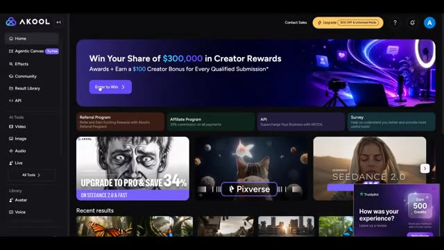
*Interface de la plateforme Akool montrant divers outils de création vidéo par IA, notamment Seedance 2.0.*

---

### ⏱️ `[00:00:37 - 00:00:58]` | Segment #02

**🔊 Audio (Transcription Intégrale Mot pour Mot en Français) :**
> Akul héberge actuellement un concours de vidéos IA de 300 000 $ où les créateurs ont la chance de présenter leur travail et de gagner des prix. Je vais également vous montrer comment participer avant la fin de cette vidéo. C'est Pursuing AI et vous regardez Research Report. Commençons. Pour commencer, cliquez sur le lien dans la description. Il vous mènera directement à un studio sympa.

**👁️ Analyse Visuelle d'Écran (gemini-3.5-flash-lite) :**
**Interface & Outils** : Site web et plateforme en ligne Akul (avec menus Home, Agentic Canvas, Effects, Community, Result Library, API, Video, Image, Audio, Live, Avatar, Voice).

**Contenu textuel & Code** : Texte à l'écran : "Win Your Share of $300,000 in Creator Rewards*", "Push Seedance 2 to the limit", "Submit by September 15", et un compteur temporel (54 jours 03 heures 19 minutes).

**Action / Démonstration** : Navigation sur la page web du concours Akul puis affichage de l'interface du tableau de bord de la plateforme de création.

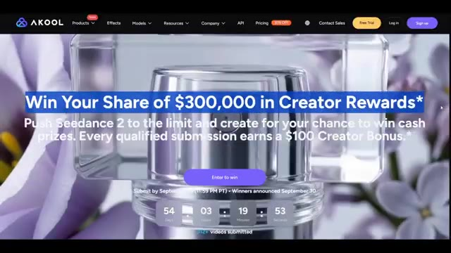
*Page d'accueil du site Akul présentant le concours de vidéos avec un compte à rebours de 54 jours et l'arrière-plan d'un flacon de parfum.*

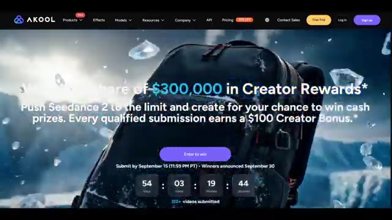
*Page d'accueil du site Akul affichant le concours avec en arrière-plan une vidéo de sac à dos dans un paysage enneigé.*

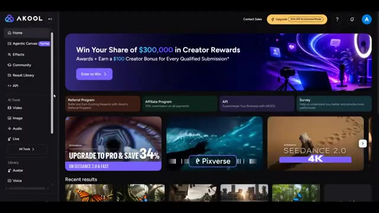
*Tableau de bord de la plateforme Akul avec le menu latéral, la bannière du concours de 300 000 $ et les vignettes des outils Seedance 2.0.*

---

### ⏱️ `[00:00:58 - 00:01:33]` | Segment #03

**🔊 Audio (Transcription Intégrale Mot pour Mot en Français) :**
> Connectez-vous simplement à votre compte. Une fois à l'intérieur, vous trouverez une variété d'outils d'IA pour créer des vidéos, des images et même de l'audio. Pour ce tutoriel, nous nous concentrons sur la génération de vidéos. Cliquez sur vidéo, puis choisissez soit texte vers vidéo, soit image vers vidéo selon le type de vidéo que vous souhaitez créer. Ensuite, sélectionnez C-Dance 2 comme modèle vidéo. Ici, vous pouvez personnaliser vos paramètres de génération. Vous pouvez activer ou désactiver l'audio, choisir combien de vidéos vous voulez générer en même temps, et définir la durée de la vidéo. Akul prend en charge des longueurs de vidéo de 5 secondes jusqu'à 15 secondes. Si vous avez besoin de plus

**👁️ Analyse Visuelle d'Écran (gemini-3.5-flash-lite) :**
**Interface & Outils** : Interface web de la plateforme Akul (générateur de médias par intelligence artificielle).

**Contenu textuel & Code** : Menus Home, Agentic Canvas, Effects, Community, Result Library, API, AI Tools (Video, Image, Audio, Live), section Video Generator avec les options Image to Video, Text to Video, Video to Video, Talking Photo, sélection du modèle Seedance 2.0, réglages audio (Audio: On), nombre de vidéos, durée (15s), résolution (720p), format (16:9).

**Action / Démonstration** : Navigation dans l'interface de la plateforme Akul, sélection de l'outil vidéo, affichage du modèle Seedance et des paramètres de génération.

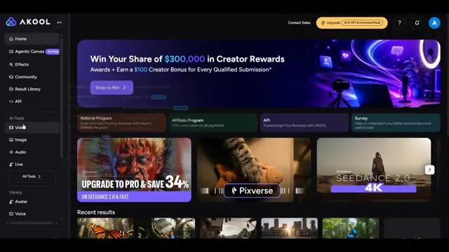
*Page d'accueil de la plateforme Akul avec le menu latéral des outils d'IA et les bannières promotionnelles.*

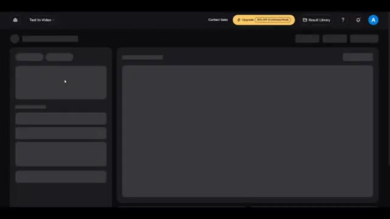
*Interface de chargement de l'outil Text to Video sur la plateforme Akul en cours de chargement.*

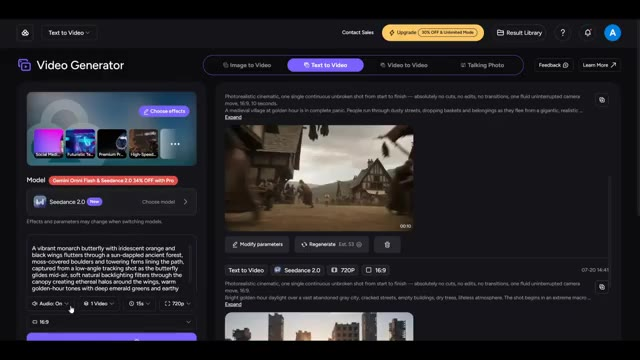
*Interface complète du générateur de vidéo sur Akul montrant le modèle Seedance 2.0, les options de prompt et les paramètres de durée et de résolution.*

---

### ⏱️ `[00:01:33 - 00:01:56]` | Segment #04

**🔊 Audio (Transcription Intégrale Mot pour Mot en Français) :**
> qualité, vous pouvez également générer vos vidéos en 4k et sélectionner le format d'image qui correspond le mieux à votre projet, que ce soit pour YouTube, les shorts, ou les réseaux sociaux. L'une de mes fonctionnalités préférées dans un studio cool est l'outil de prompt IA. Il aide à transformer une idée simple en un prompt professionnel détaillé. Par exemple, j'ai seulement écrit un papillon volant à travers une forêt jusqu'à ce qu'un perroquet l'attrape.

**👁️ Analyse Visuelle d'Écran (gemini-3.5-flash-lite) :**
**Interface & Outils** : Interface web de génération de vidéos par IA (« Video Generator ») comprenant des options de rapport hauteur/largeur (16:9), le choix des modèles (Seedance 2.0), et un outil de prompt IA.

**Contenu textuel & Code** : Texte du prompt visible : « A vibrant monarch butterfly with iridescent orange and black wings flutters through a sun-dappled ancient forest... », options de résolution (720p), durée (15s), et paramètres de génération (Audio: On, 1 Video).

**Action / Démonstration** : Navigation dans l'interface de génération vidéo, visualisation des résultats précédents et de la zone de saisie du prompt textuel.

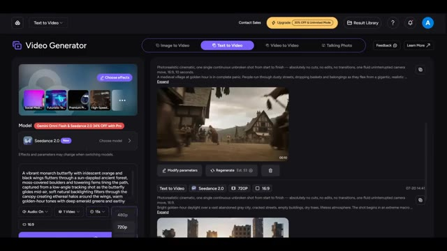
*Interface de l'outil de génération vidéo affichant les paramètres de format, la sélection du modèle Seedance 2.0 et l'historique des vidéos générées.*

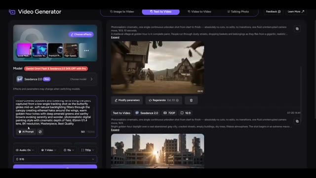
*Interface de l'outil de génération vidéo montrant le champ de saisie de prompt textuel avec le bouton AI Prompt et les options de configuration de la vidéo (audio, durée, résolution).*

---

### ⏱️ `[00:01:56 - 00:02:19]` | Segment #05

**🔊 Audio (Transcription Intégrale Mot pour Mot en Français) :**
> Ensuite, tout se transforme en plan au ralenti cinématographique type "bullet time". Ce n'est que quelques lignes. Cliquez maintenant sur le prompt IA et, en quelques secondes, il génère plusieurs prompts de qualité professionnelle. Choisissez celui que vous préférez ou apportez de petites modifications si nécessaire. Une fois votre prompt prêt, définissez le reste des paramètres de votre vidéo, tels que la durée, la résolution, le format d'image et toute autre option adaptée à votre projet.

**👁️ Analyse Visuelle d'Écran (gemini-3.5-flash-lite) :**
**Interface & Outils** : Interface web de génération de vidéo (Seedance / Video Generator) avec panneau de configuration à gauche et bibliothèque de vidéos générées à droite.

**Contenu textuel & Code** : Texte du prompt saisi : "A butterfly flying through a forest until a parrot catches it, then everything turns into a cinematic bullet-time slow-motion shot". Sur l'image 2, la modale "Refine Prompt" propose plusieurs variantes descriptives détaillées. Paramètres visibles : Seedance 2.0, 720P, 16:9, durée 15s.

**Action / Démonstration** : L'utilisateur saisit ou visualise le prompt dans l'interface, puis la modale de raffinement par IA s'ouvre pour proposer des prompts professionnels améliorés.

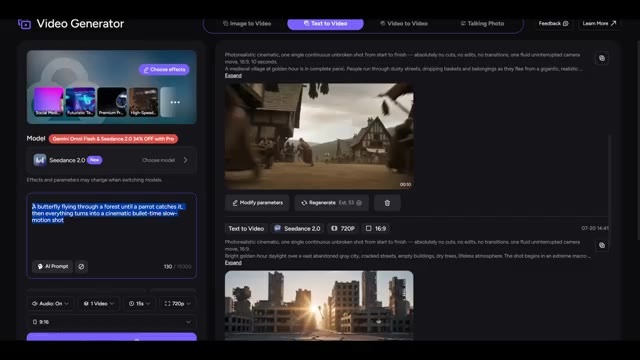
*Interface du générateur vidéo Seedance affichant le champ de saisie du prompt et les options de modèles.*

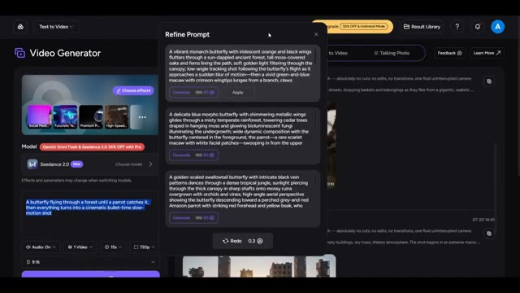
*Fenêtre contextuelle "Refine Prompt" affichant plusieurs propositions de prompts générés par l'IA.*

---

### ⏱️ `[00:02:20 - 00:02:42]` | Segment #06

**🔊 Audio (Transcription Intégrale Mot pour Mot en Français) :**
> Ensuite, cliquez sur Générer. Après quelques minutes, votre vidéo sera prête. Voici le résultat. Jetons un coup d'œil. Vient maintenant la partie passionnante : comment vous pouvez participer au concours vidéo IA de 300 000 $ d'Akul.

**👁️ Analyse Visuelle d'Écran (gemini-3.5-flash-lite) :**
**Interface & Outils** : Interface web de génération de vidéo (semblable à Seedance 2.0 / Video Generator) avec options de Text to Video, Image to Video, Video to Video et Talking Photo.

**Contenu textuel & Code** : Texte du prompt visible : "Photorealistic cinematic, one single continuous unbroken shot... Bright daylight in a lush tropical rainforest... vibrant blue-and-orange butterfly...". Paramètres : Modèle Seedance 2.0, résolution 720p, format 16:9, durée 15s. Mention d'une notification verte "Generation in progress".

**Action / Démonstration** : Le créateur montre l'interface de génération de vidéo en cours de traitement, puis présente les résultats finaux de la vidéo générée sous différents angles et plans (mouvement dans la jungle et gros plan sur le perroquet).

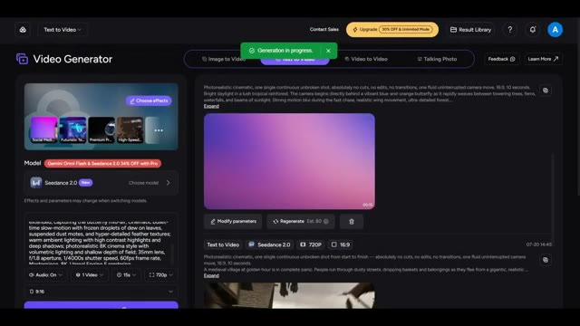
*Interface du générateur de vidéo montrant le processus de génération en cours avec les options de modèle Seedance 2.0.*

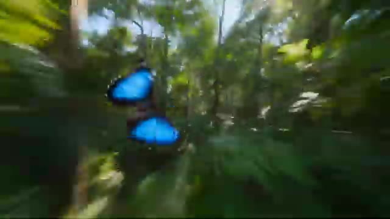
*Résultat vidéo généré montrant un mouvement rapide à travers une forêt tropicale avec des papillons bleus.*

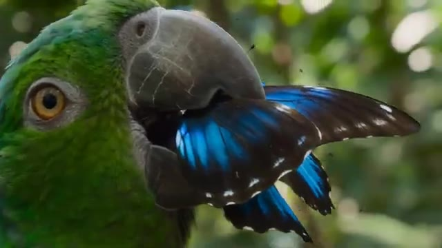
*Gros plan sur le résultat de la vidéo générée montrant un perroquet vert tenant un papillon bleu.*

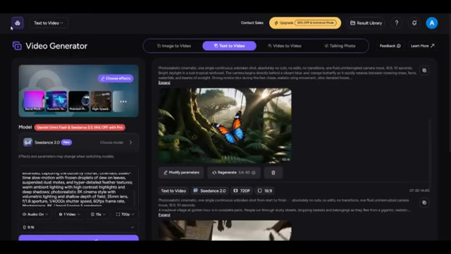
*Affichage de l'interface principale avec la vidéo générée finale mettant en scène un papillon dans un décor de jungle luxuriante.*

---

### ⏱️ `[00:02:42 - 00:03:06]` | Segment #07

**🔊 Audio (Transcription Intégrale Mot pour Mot en Français) :**
> Retournez sur la page d'accueil d'Akul Studio, et tout en haut de la page d'accueil, vous verrez la bannière du concours. Cliquez dessus. Vous trouverez ici tous les détails du concours. Le grand prix est de 300 000 dollars plus un abonnement Enterprise d'un an. Il y a aussi le prix de la création la plus originale, qui offre 15 000 dollars et un abonnement Pro d'un an, et le prix de la meilleure publicité, également d'une valeur de 15 000 dollars avec un abonnement Pro d'un an.

**👁️ Analyse Visuelle d'Écran (gemini-3.5-flash-lite) :**
**Interface & Outils** : Navigateur web affichant le site officiel de la plateforme Akool (Akool Studio).

**Contenu textuel & Code** : Texte de la bannière : "Win Your Share of $300,000 in Creator Rewards". Catégories de prix visibles : Grand Prize ($30,000, 1 Year Enterprise), Most Creative ($15,000, 1 Year Pro), Best Ad ($15,000, 1 Year Pro), AKOOL Picks ($1,000, Pro Access), Creator Bonus ($100).

**Action / Démonstration** : Navigation sur le site web d'Akool, passage de la page d'accueil à la page détaillée des prix et du concours.

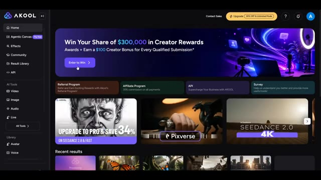
*Page d'accueil d'Akool Studio affichant la bannière du concours en haut.*

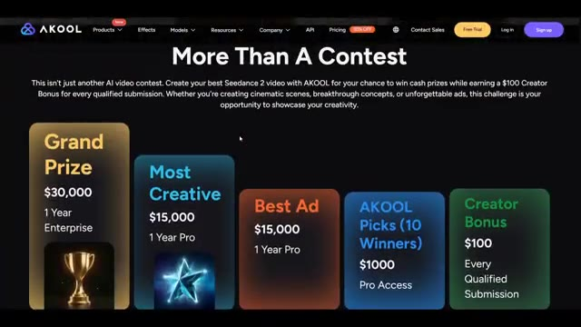
*Page de détails du concours Akool présentant les différentes catégories de prix.*

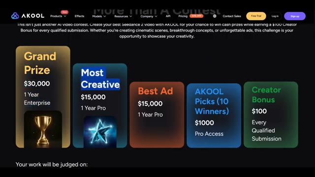
*Page de détails du concours défilant vers le bas pour montrer les critères de notation.*

---

### ⏱️ `[00:03:07 - 00:03:31]` | Segment #08

**🔊 Audio (Transcription Intégrale Mot pour Mot en Français) :**
> Akul sélectionnera également 10 gagnants du choix des éditeurs, chacun recevant 1 000 $ et un accès Pro. Et voici le meilleur. Grâce au bonus créateur, chaque soumission qualifiée reçoit 100 $. Le jugement est basé sur quatre catégories. 40 % pour la créativité. Les gens peuvent-ils immédiatement dire que cette idée est unique ? 30 % pour l'exécution. Qualité de production, rythme, montage et savoir-faire global.

**👁️ Analyse Visuelle d'Écran (gemini-3.5-flash-lite) :**
**Interface & Outils** : Navigateur web affichant le site officiel de la plateforme Akool pour le concours vidéo.

**Contenu textuel & Code** : Textes détaillant les prix (Grand Prize $30,000, Most Creative $15,000, Best Ad $15,000, AKOOL Picks $1000, Creator Bonus $100) et les critères d'évaluation en pourcentage (40% Creativity, 30% Execution, 20% Storytelling, 10% Use of AKOOL).

**Action / Démonstration** : Le curseur de la souris survole différentes sections de la page web pour illustrer les récompenses et les critères de notation.

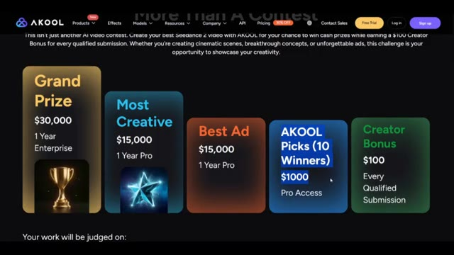
*Page web d'Akool montrant les prix du concours et le bonus de 100 $ pour chaque soumission.*

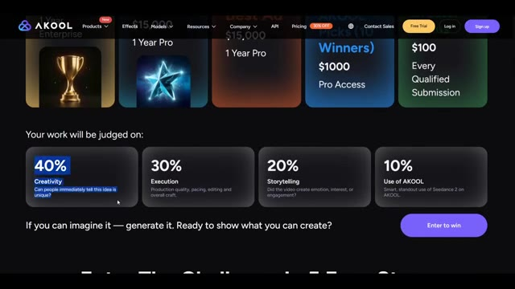
*Page web d'Akool détaillant les quatre critères de notation : 40% créativité, 30% exécution, 20% narration et 10% utilisation d'Akool.*

---

### ⏱️ `[00:03:31 - 00:03:50]` | Segment #09

**🔊 Audio (Transcription Intégrale Mot pour Mot en Français) :**
> 20% de narration. Est-ce que la vidéo a suscité de l'émotion, de l'intérêt ou de l'engagement ? Et 10% d'utilisation d'un cool. Utilisation intelligente et remarquable de C Dance 2 sur un cool. Pour participer, cliquez sur Participer pour gagner. Remplissez votre prénom, nom, e-mail personnel et la même adresse e-mail que celle utilisée pour vous connecter à un cool.

**👁️ Analyse Visuelle d'Écran (gemini-3.5-flash-lite) :**
**Interface & Outils** : Site web de la plateforme Akool (page du concours de création vidéo avec critères de notation et formulaire de soumission).

**Contenu textuel & Code** : Texte affiché : "Your work will be judged on: 40% Creativity, 30% Execution, 20% Storytelling (Did the video create emotion, interest, or engagement?), 10% Use of AKOOL". Formulaire avec champs : First name*, Last name*, Personal email*, Akool Email*, Submission URL*. Bouton "Enter to win".

**Action / Démonstration** : Le curseur de la souris survole le critère "20% Storytelling" sur la première image, puis passe au remplissage du formulaire de participation sur la seconde image.

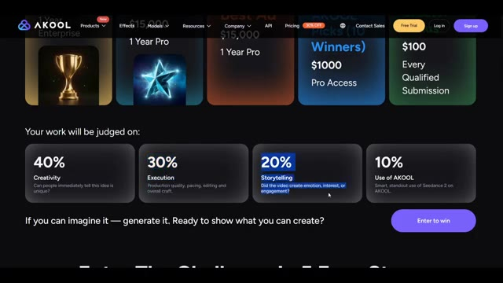
*Interface du site web Akool montrant les critères de notation du concours (créativité, exécution, narration, utilisation d'Akool) avec le détail des pourcentages.*

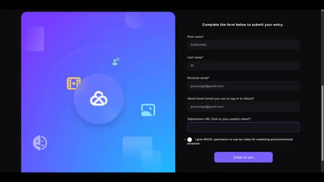
*Formulaire de participation en ligne du site Akool demandant le prénom, le nom, l'e-mail personnel et l'e-mail du compte Akool.*

---

### ⏱️ `[00:03:50 - 00:04:19]` | Segment #10

**🔊 Audio (Transcription Intégrale Mot pour Mot en Français) :**
> Enfin, collez l'URL de votre vidéo publiée. Vous pouvez télécharger votre vidéo sur YouTube, Instagram, X ou une autre plateforme prise en charge. Dans mon cas, j'ai publié la mienne sur Instagram, copié le lien, l'ai collé dans le formulaire de soumission et j'ai cliqué sur Entrée pour gagner. C'est tout. Votre participation est soumise et vous participez officiellement au concours. Et c'est ainsi que vous pouvez créer des vidéos cinématiques par IA en utilisant C Dance 2 dans Akul Studio, et même participer au concours de vidéos IA de 300 000 $ pour avoir une chance de gagner de superbes prix.

**👁️ Analyse Visuelle d'Écran (gemini-3.5-flash-lite) :**
**Interface & Outils** : Site web de la plateforme Akool (Akool Studio).

**Contenu textuel & Code** : Formulaire de soumission avec les champs "First name" (avec "PURSUING"), "Last name" (avec "AI"), "Personal email", "Akool Email", "Submission URL", case à cocher pour l'utilisation marketing, et bouton "Enter to win". Sur les autres images, page d'accueil d'Akool avec les menus de navigation et le slogan "Turn Ideas into Reality with Gen AI Tools for Video Production".

**Action / Démonstration** : Présentation du formulaire de participation au concours et de la plateforme Akool.

*Formulaire de soumission en ligne sur le site d'Akool avec les champs de coordonnées et le lien de la vidéo.*

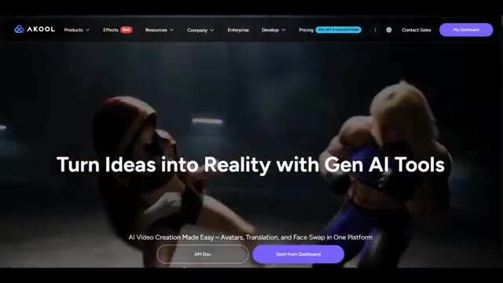
*Page d'accueil du site Akool montrant le slogan "Turn Ideas into Reality with Gen AI Tools".*

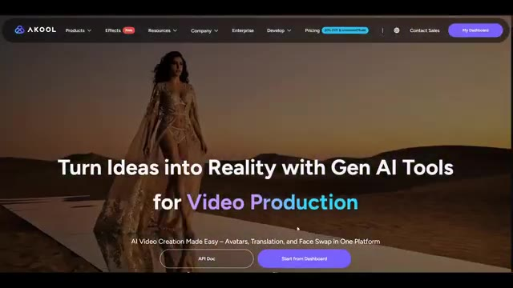
*Page d'accueil du site Akool avec une autre bannière mettant en avant la production de vidéos par IA.*

---

### ⏱️ `[00:04:19 - 00:04:37]` | Segment #11

**🔊 Audio (Transcription Intégrale Mot pour Mot en Français) :**
> Si vous avez trouvé ce tutoriel utile, vous trouverez le lien Akul et le lien du concours dans la description ci-dessous. Essayez-le et faites-moi savoir ce que vous créez. J'aimerais beaucoup voir vos résultats. Si vous avez apprécié cette vidéo, n'oubliez pas d'aimer, de vous abonner et d'activer les notifications, car je partage régulièrement des outils d'IA, des tutoriels et des recherches pour vous aider à garder une longueur d'avance.

**👁️ Analyse Visuelle d'Écran (gemini-3.5-flash-lite) :**
**Interface & Outils** : Site web de la plateforme Akool (outil d'IA pour la création vidéo, avatars, traduction et face swap).

**Contenu textuel & Code** : En-tête avec le logo AKOOL et les menus (Products, Effects, Resources, Company, Enterprise, Develop, Pricing, Contact Sales, My Dashboard). Slogan central : « Turn Ideas into Reality with Gen AI Tools for Translation / Education ». Sous-titre : « AI Video Creation Made Easy - Avatars, Translation, and Face Swap in One Platform ». Boutons « API Doc » et « Start from Dashboard ».

**Action / Démonstration** : Navigation et affichage de la page d'accueil du site web Akool présentant les différentes fonctionnalités et cas d'usage de la plateforme.

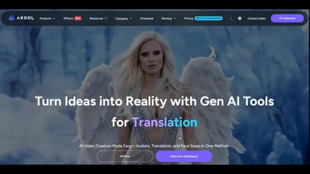
*Page d'accueil du site Akool montrant un personnage féminin avec des ailes d'ange et le slogan sur la traduction par IA.*

*Page d'accueil du site Akool avec un couple regardant par la fenêtre et le slogan sur l'éducation par IA.*

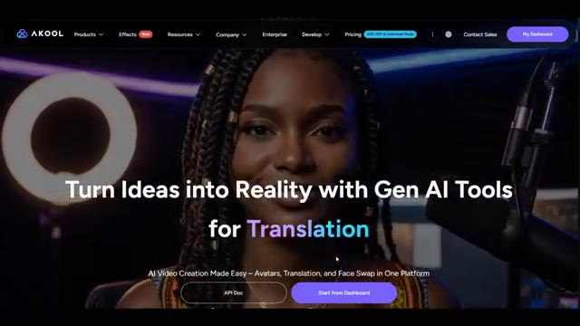
*Page d'accueil du site Akool présentant une femme parlant devant un micro avec le slogan sur les outils d'IA pour la traduction.*

---

### ⏱️ `[00:04:37 - 00:04:43]` | Segment #12

**🔊 Audio (Transcription Intégrale Mot pour Mot en Français) :**
> C'est Pursuing AI, et vous avez regardé Research Report. Merci d'avoir regardé, et je vous dis à la prochaine.

**👁️ Analyse Visuelle d'Écran (gemini-3.5-flash-lite) :**
**Interface & Outils** : Présentation face caméra / écran de fin sans partage d'écran (animation du logo de la chaîne avec un cerveau et une puce électronique portant l'inscription PAI entourés d'un cercle néon bleu).

**Contenu textuel & Code** : Animation graphique affichant le logo "PAI" sur un fond noir avec un anneau lumineux bleu.

**Action / Démonstration** : Affichage de l'écran de fin de la vidéo avec le logo de la chaîne Pursuing AI.

---
