# 🎬 Opus 5 vient de franchir toutes les limites ! La fin des développeurs de jeux ?

> **Chaîne** : [Pursuing AI](https://www.youtube.com/@PursuingAi)  
> **Titre original** : `Opus 5 Just Crossed The Limits! End of Game Devs..`  
> **Lien YouTube** : [https://www.youtube.com/watch?v=4lFiMR0DilQ](https://www.youtube.com/watch?v=4lFiMR0DilQ)  
> **Date de publication** : 2026-07-31  
> **Durée** : 07m 54s (`474s`)  
> **Identifiant vidéo** : `4lFiMR0DilQ`  
> **Fiche Web Interactive** : [2026-07-31_YT-4lFiMR0DilQ_Opus 5 vient de franchir toutes les limites ! La fin des développeurs de jeux_by-whisper-v3-large-turbo+gemini-3.5-flash-lite.html](2026-07-31_YT-4lFiMR0DilQ_Opus 5 vient de franchir toutes les limites ! La fin des développeurs de jeux_by-whisper-v3-large-turbo+gemini-3.5-flash-lite.html)  
> **Captures de démonstration clés** : `53 captures réelles (anti-talking-head)`  
> **Modèles utilisés** : Audio: `large-v3-turbo` (Faster-Whisper int8 VPS) | Vision: `gemini-3.5-flash-lite` (Google AI Studio API)  

---

## 📌 Synthèse Exécutive & Outils

### 📌 Résumé
La vidéo de *Pursuing AI* explore les capacités révolutionnaires du modèle d'intelligence artificielle **Claude Opus 5** appliquées à la création et au développement de jeux vidéo. À travers plusieurs démonstrations de pointe, la vidéo met en lumière le passage d'une simple assistance au codage à une génération autonome de systèmes graphiques complexes, de jeux de stratégie en temps réel et de démos interactives par navigateur (comme le projet *Snowflow*). Le créateur décortique la méthode de « boucle de gantelet » (*gauntlet loop*), où l'IA emploie des sous-agents pour évaluer en continu son propre travail, comparer les résultats à des références existantes, corriger visuellement les bugs via l'analyse de captures d'écran et itérer jusqu'à obtenir un niveau de qualité prêt pour la production.

Au-delà des performances techniques ahurissantes — telles que la génération de jeux 3D complexes via 3.js, BabylonJS et des shaders WGSL personnalisés en quelques heures pour un coût de calcul mesuré en millions de jetons —, le rapport alerte sur la prolifération de fausses démos virales sur les réseaux sociaux. La méthode d'analyse du créateur repose sur un scepticisme rigoureux : exiger des preuves tangibles telles que des dépôts GitHub, du code source ouvert, des journaux de développement et des versions jouables. Pour les créateurs de contenu et les développeurs, l'enseignement majeur réside dans la compréhension des limites actuelles et des réelles opportunités de ces flux de travail agentiques autonomes.

### 🛠️ Outils, Modèles & Logiciels Présentés
* **Claude (Opus 5)** : Modèle d'intelligence artificielle avancé servant de moteur central pour la génération de code, la création d'environnements graphiques et l'auto-débogage visuel.
* **Claude Code** : Environnement de travail associé à Opus 5 pour automatiser la construction de projets logiciels complexes et de démos graphiques.
* **3.js** : Librairie JavaScript utilisée pour le rendu de graphismes 3D en temps réel dans le navigateur pour le jeu de stratégie inspiré de *Homeworld*.
* **BabylonJS** : Moteur de rendu 3D par navigateur employé dans le projet *Snowflow* pour la gestion des terrains et des interactions environnementales.
* **Shaders WGSL** : Langage de shader utilisé pour concevoir des effets visuels personnalisés et de pointe dans les démonstrations graphiques basées sur le web.
* **U7Buy** : Plateforme tierce présentée pour l'achat d'abonnements à prix réduits à des services d'IA (ChatGPT Plus, Gemini, Netflix, Spotify).

### 🔑 Points Clés & Enseignements Stratégiques
* **Transition vers des agents autonomes** : L'IA ne se contente plus d'écrire des lignes de code isolées ; elle conçoit des architectures logicielles complètes et gère des pipelines de rendu complexes de manière autonome.
* **L'utilisation de la boucle de gantelet (*gauntlet loop*)** : Intégration de sous-agents IA constructeurs et critiques qui évaluent, comparent au matériel d'origine et affinent le code en continu.
* **Auto-correction visuelle** : Capacité pour l'IA d'analyser des captures d'écran de son propre rendu, d'identifier les artéfacts visuels et d'appliquer des correctifs ciblés.
* **Économie de jetons et coûts de calcul** : La génération de projets d'envergure (comme des jeux par navigateur open-source) nécessite des volumes de jetons considérables (plusieurs millions de tokens de sortie) et des investissements de calcul mesurables.
* **Le piège des fausses démos virales** : Marge de tromperie élevée sur les réseaux sociaux (notamment sur X) avec des vidéos de jeux de style GTA prétendument générés en un seul prompt, mais s'avérant être des habillages de jeux existants.
* **Critères de validation technique** : Exigence systématique de preuves tangibles avant de valider une percée en IA (dépôt GitHub, démo jouable directement dans le navigateur, code source ou documentation technique).
* **Réalisme des environnements générés** : Atteinte d'un point d'inflexion où l'IA produit des ressources de qualité indépendante (suspensions réactives, particules, météo interactive, shaders de neige persistante).
* **Optimisation des coûts d'infrastructure** : Recours à des plateformes spécialisées d'abonnement groupé ou à prix réduits pour amortir l'utilisation intensive des outils d'intelligence artificielle de pointe.

---

## ⏱️ Chronologie & Transcription Complète Audio & Visuelle (Mot pour Mot)

### ⏱️ `[00:00:00 - 00:00:19]` | Segment #01

**🔊 Audio (Transcription Intégrale Mot pour Mot en Français) :**
> Opus 5 assure un max en ce moment. Les générations que les gens créent sont tellement réalistes que certaines n'ont même plus l'air d'appartenir à l'IA. J'ai parcouru les meilleurs exemples et croyez-moi, vous comprendrez pourquoi tout le monde parle de ce modèle. C'est Pursuing AI et vous regardez le rapport de recherche.

**👁️ Analyse Visuelle d'Écran (gemini-3.5-flash-lite) :**
**Interface & Outils** : Interface de type jeu vidéo avec affichage de débogage (Debug HUD) et interface de jeu de stratégie spatiale en temps réel.

**Contenu textuel & Code** : Texte affiché : "OPUS 5", "OBJECTIVE: Reach the Starship, Board the Starship", "DEBUG HUD", "build: UE5.4 dev", statistiques de performance (FPS, VRAM, RAM, Nanite tris).

**Action / Démonstration** : Démonstration de rendus visuels ultra-réalistes générés par intelligence artificielle, présentés sous forme de fausses séquences de jeu vidéo et d'interfaces tactiques.

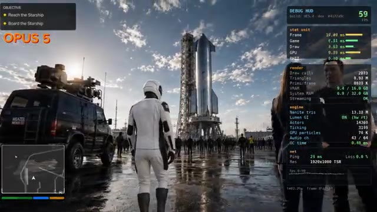
*Rendu vidéo de type jeu vidéo avec une fusée Starship et des personnages en arrière-plan, accompagné d'un panneau de débogage HUD.*

*Interface de stratégie spatiale de type jeu de gestion avec des vaisseaux et des menus de flotte.*

*Illustration graphique d'un cerveau connecté à une puce électronique portant l'inscription PAI dans un cercle lumineux.*

---

### ⏱️ `[00:00:19 - 00:00:38]` | Segment #02

**🔊 Audio (Transcription Intégrale Mot pour Mot en Français) :**
> En commençant par cette démonstration de conduite tout-terrain, Chris a demandé à Opus 5 de générer les plus beaux graphismes de jeu possibles, et tout ce que vous voyez ici a été créé par le modèle lui-même. À première vue, il est difficile de croire que cela a été généré par IA. L'éclairage, le terrain, la végétation et l'environnement global ont l'air étonnamment soignés.

**👁️ Analyse Visuelle d'Écran (gemini-3.5-flash-lite) :**
**Interface & Outils** : Interface de la plateforme X (Twitter) affichant un tweet avec une vidéo intégrée, ainsi qu'une barre latérale à droite montrant les suggestions de profils à suivre et les tendances actuelles.

**Contenu textuel & Code** : Texte du tweet de Chris : "I asked Claude 5 Opus to generate me the best game graphics it could! I wanted to create a car on a dirt trail demo and see how good it was at crafting car graphics without any textures. Everything you see here is 100% crafted from the model itself." Le profil de Chris (@ChrisGPT) est également visible avec la mention "Agi 2029 - AI Insider / Reporter as featured in The Information - NYT - Techcrunch".

**Action / Démonstration** : Affichage d'un post sur les réseaux sociaux présentant une vidéo de gameplay générée par intelligence artificielle, démontrant les capacités graphiques d'un modèle d'IA pour la création de jeux vidéo.

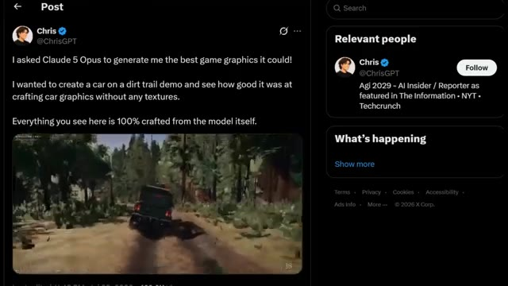
*Capture d'écran d'une publication X (Twitter) de Chris (@ChrisGPT) montrant une vidéo de démonstration de conduite tout-terrain générée par IA.*

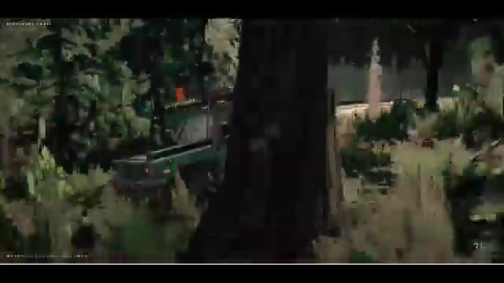
*Gros plan sur la démo de jeu vidéo montrant un véhicule tout-terrain circulant sur un sentier en terre au milieu d'une forêt dense.*

---

### ⏱️ `[00:00:38 - 00:01:01]` | Segment #03

**🔊 Audio (Transcription Intégrale Mot pour Mot en Français) :**
> Bien sûr, ce n'est pas parfait, il y a encore des artéfacts visuels et des limitations de gameplay, mais la qualité visuelle globale est vraiment impressionnante. Chris lui a alors donné un tout dernier prompt : augmenter la qualité. Et les résultats ont complètement changé la scène. Il a même dit : Nous avons atteint le point d'inflexion où l'IA peut produire des ressources de qualité indépendante pour les jeux vidéo.

**👁️ Analyse Visuelle d'Écran (gemini-3.5-flash-lite) :**
**Interface & Outils** : Interface de la plateforme X (Twitter) affichant un tweet de ChrisGPT et le panneau latéral des tendances.

**Contenu textuel & Code** : Texte du tweet de ChrisGPT : "Claude Opus 5, I think we've reached the inflection point where AI can produce indie quality assets for video games. This is after my second prompt, just simply telling it to increase the quality. Some of these angles on the car are truly stunning and I can 100% say they look better than a lot of Indie games I've recently played."

**Action / Démonstration** : L'écran affiche d'abord les images en mouvement d'une démo de jeu vidéo générée par IA, puis passe à une capture d'un post sur les réseaux sociaux commentant cette réalisation.

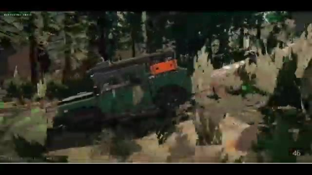
*Rendu vidéo d'un jeu de conduite généré par IA montrant un véhicule vert progressant sur un sentier forestier (Ridgeline Trail).*

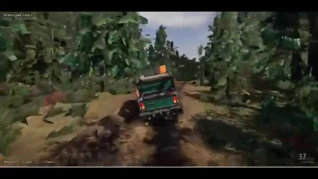
*Vue de gameplay poursuivant la scène du véhicule vert roulant dans la forêt sur un chemin boueux.*

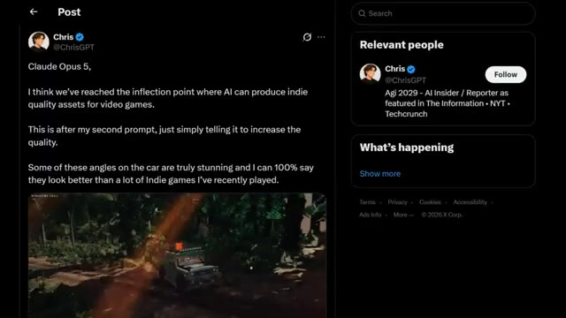
*Capture d'écran d'un tweet de @ChrisGPT commentant les capacités de Claude Opus 5 à générer des graphismes de qualité indie.*

---

### ⏱️ `[00:01:01 - 00:01:20]` | Segment #04

**🔊 Audio (Transcription Intégrale Mot pour Mot en Français) :**
> En regardant la version améliorée, il est facile de comprendre pourquoi. Les reflets sur la carrosserie de la voiture, la lumière du soleil frappant la peinture et les détails de l'environnement ont l'air beaucoup plus raffinés. Dans certains plans, je dirais sincèrement que les visuels rivalisent avec de nombreux jeux indépendants disponibles aujourd'hui. Ce qui m'a encore plus impressionné, ce sont les petits détails.

**👁️ Analyse Visuelle d'Écran (gemini-3.5-flash-lite) :**
**Interface & Outils** : Capture d'écran de gameplay montrant un environnement virtuel interactif de type jeu vidéo avec des éléments d'interface (HUD, titre "RIDGELINE TRAIL").

**Contenu textuel & Code** : Texte affiché en haut à gauche : "RIDGELINE TRAIL", ainsi que des indicateurs de vitesse ou de performance en bas de l'écran.

**Action / Démonstration** : Démonstration visuelle d'un véhicule en mouvement à travers différents angles de caméra (extérieur et intérieur) pour mettre en valeur les graphismes, l'éclairage et les détails de l'environnement.

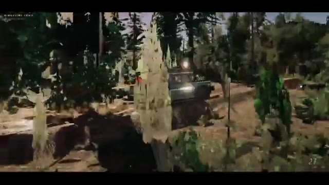
*Vue extérieure de profil d'un véhicule tout-terrain traversant un sentier boisé, illustrant les reflets sur la carrosserie et l'éclairage.*

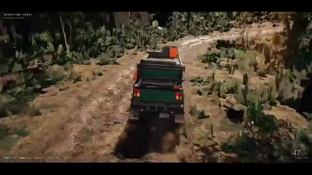
*Vue arrière en léger contre-plongée d'un véhicule tout-terrain roulant sur un chemin de terre rocailleux dans une forêt.*

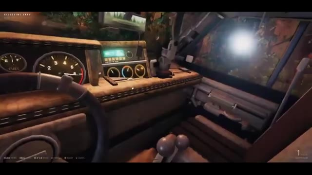
*Vue intérieure détaillée du poste de pilotage (tableau de bord, volant, cadrans et rétroviseur) d'un véhicule tout-terrain.*

---

### ⏱️ `[00:01:20 - 00:01:39]` | Segment #05

**🔊 Audio (Transcription Intégrale Mot pour Mot en Français) :**
> La suspension réagit à mesure que la voiture roule sur un terrain accidenté. Les pneus soulèvent du sable, l'odomètre est fonctionnel, et l'environnement semble beaucoup plus vivant que ce à quoi on s'attendrait d'un contenu généré par l'IA. Ça ne remplace toujours pas le développement de jeux AAA, mais c'est un signe évident de la rapidité avec laquelle l'IA s'améliore.

**👁️ Analyse Visuelle d'Écran (gemini-3.5-flash-lite) :**
**Interface & Outils** : Démonstration vidéo d'un contenu généré par IA ou d'un moteur de jeu interactif style "Ridgeline Trail" avec des éléments d'interface utilisateur en surimpression (commandes de touches, odomètre/compteur).

**Contenu textuel & Code** : Texte affiché "RIDGELINE TRAIL", commandes de jeu en bas à gauche (Click, Drag, WASD, etc.), et compteur de vitesse/odomètre fonctionnel en bas à droite.

**Action / Démonstration** : Un véhicule tout-terrain vert roule sur un terrain accidenté, simulant dynamiquement la physique des suspensions et la projection de sable/poussière par les pneus.

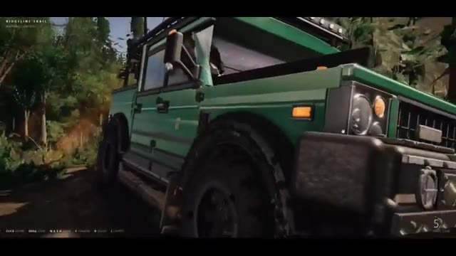
*Gros plan en caméra embarquée sur le côté d'un 4x4 vert tout-terrain roulant sur un sentier accidenté (Ridgeline Trail), montrant la réaction des suspensions et des pneus soulevant de la poussière.*

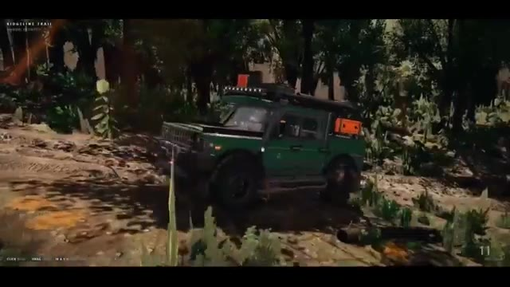
*Vue générale du 4x4 vert naviguant à travers un terrain boisé et accidenté, avec des affichages de télémétrie de jeu en surimpression.*

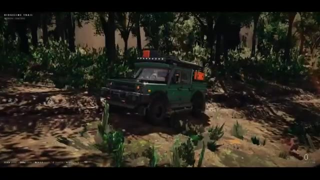
*Vue légèrement plus éloignée du véhicule tout-terrain en mouvement dans la forêt, illustrant le réalisme du comportement de conduite simulé.*

---

### ⏱️ `[00:01:39 - 00:01:57]` | Segment #06

**🔊 Audio (Transcription Intégrale Mot pour Mot en Français) :**
> Si c'est ce qu'Opus 5 peut générer aujourd'hui, imaginez où en seront ces outils d'ici un an. À ce rythme, nous obtiendrons honnêtement GTA 7 fait avec l'IA avant que Rockstar ne sorte officiellement GTA 6. Avant de continuer, je veux rapidement vous montrer un moyen d'économiser de l'argent sur les abonnements IA.

**👁️ Analyse Visuelle d'Écran (gemini-3.5-flash-lite) :**
**Interface & Outils** : Navigateur web affichant une publication sur le réseau social X (anciennement Twitter) et une page de tarification officielle de ChatGPT.

**Contenu textuel & Code** : Publication de ChrisGPT sur X mentionnant "Claude Opus 5" et la génération d'actifs de jeux vidéo de qualité indépendante. Page des tarifs de ChatGPT affichant les formules Free ($0), Go ($8), Plus ($20) et Pro ($100/mois) avec leurs caractéristiques respectives.

**Action / Démonstration** : Présentation visuelle d'un post sur les réseaux sociaux illustrant la génération par IA, suivie d'une démonstration de la page de tarification des abonnements IA.

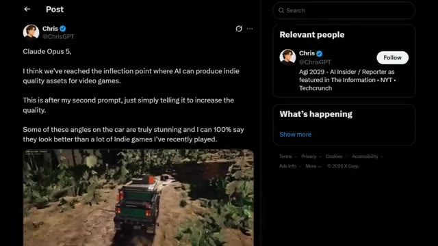
*Capture d'écran du réseau social X montrant une publication de l'utilisateur ChrisGPT à propos des capacités de Claude Opus 5 pour générer des assets de jeux vidéo.*

*Page web de tarification de ChatGPT présentant les différentes offres d'abonnement (Free à 0$, Go à 8$, Plus à 20$ et Pro à 100$).*

---

### ⏱️ `[00:01:57 - 00:02:19]` | Segment #07

**🔊 Audio (Transcription Intégrale Mot pour Mot en Français) :**
> Si vous recherchez un abonnement ChatGPT Plus moins cher en 2026, U7Buy vaut vraiment le détour. U7Buy propose un abonnement privé d'un mois à ChatGPT Plus pour environ 9 dollars au lieu du prix officiel de 20 dollars, tout en vous donnant accès à des fonctionnalités puissantes comme GPT 5.6, Image 2.0 et Deep Research.

**👁️ Analyse Visuelle d'Écran (gemini-3.5-flash-lite) :**
**Interface & Outils** : Site web de commerce en ligne U7Buy (page d'achat de comptes ChatGPT Accounts).

**Contenu textuel & Code** : "ChatGPT Accounts for Sale", "Safe", "Full Warranty", "Plan Type: Plus (Private), Go (Private), Pro (Private), Plus (Shared)", "Duration: 1 Month $9.99, 12 Months $53.50", "ChatGPT Plus Private 1 Month", "Price $9.99", "Buy Now", texte superposé "GPT 5.6" et "IMAGE 2.0".

**Action / Démonstration** : Navigation et présentation de la page d'achat d'un compte ChatGPT Plus à prix réduit sur le site U7Buy.

*Navigation sur le site U7Buy montrant la page d'achat de comptes ChatGPT Plus avec les options de prix et de durée.*

*Gros plan sur les options de type de forfait (Plus Private, Go, Pro) et de durée (1 mois à 9.99$, 12 mois à 53.50$).*

*Affichage de l'interface du site U7Buy avec superposition des textes illustrant les fonctionnalités mentionnées (GPT 5.6, Image 2.0).*

---

### ⏱️ `[00:02:19 - 00:02:41]` | Segment #08

**🔊 Audio (Transcription Intégrale Mot pour Mot en Français) :**
> En plus de ChatGPT+, U7buy propose également des abonnements pour des services tels que Netflix, Gemini et Spotify, ce qui en fait un endroit pratique pour économiser sur plusieurs abonnements. Ils fournissent également un support client 24h/24 et 7j/7 si vous avez besoin d'aide. U7buy fonctionne depuis plus de 10 ans et a obtenu une note de 4,8 étoiles sur Trustpilot avec des milliers d'avis clients.

**👁️ Analyse Visuelle d'Écran (gemini-3.5-flash-lite) :**
**Interface & Outils** : Site web U7buy et plateforme d'avis Trustpilot.

**Contenu textuel & Code** : Logos et abonnements de services (Crunchyroll, Amazon Prime Video, Gemini, Xbox, Claude, Apple TV, Apple Music, Perplexity AI, Apple One, Spotify), barres de recherche, note globale de 4.8 sur Trustpilot avec 47 172 avis.
[DESC_IMAGE_1] Navigation sur la boutique en ligne U7buy présentant les offres d'abonnements multiples.
[DESC_IMAGE_2] Affichage de la rubrique d'assistance client 24/7 de U7buy.
[DESC_IMAGE_3] Consultation de la note Trustpilot de 4.8 étoiles accumulée au fil de plus de 10 ans d'activité.

**Action / Démonstration** : Démonstration pédagogique et présentation du workflow.

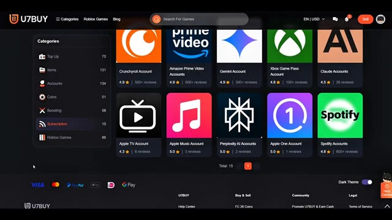
*Page du site U7buy montrant les différentes catégories d'abonnements disponibles (Netflix, Gemini, Spotify, etc.).*

*Centre d'aide (Help Center) du site U7buy avec une barre de recherche.*

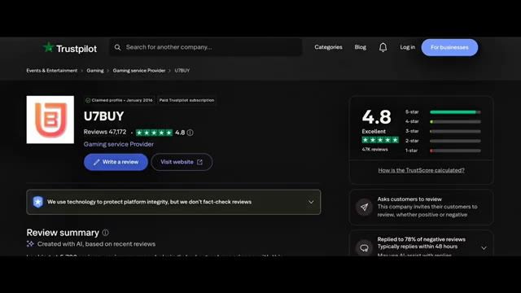
*Page Trustpilot de U7buy affichant la note de 4.8 étoiles et le résumé des avis clients.*

---

### ⏱️ `[00:02:41 - 00:03:09]` | Segment #09

**🔊 Audio (Transcription Intégrale Mot pour Mot en Français) :**
> Si vous souhaitez économiser de l'argent sur vos abonnements, consultez mon lien dans la description et utilisez mon code de réduction PURSU pour obtenir 5 % de réduction supplémentaire sur votre commande. Revenons maintenant à la vidéo. Si vous pensiez que le dernier exemple était impressionnant, celui-ci passe à un niveau supérieur. Imaginez donner à Opus 5 un seul prompt détaillé et le regarder construire un tout nouveau jeu de stratégie en temps réel inspiré de Homeworld, entièrement à partir de zéro. Pas d'actifs préfabriqués, pas de modèles 3D existants.

**👁️ Analyse Visuelle d'Écran (gemini-3.5-flash-lite) :**
**Interface & Outils** : Écran promotionnel de code de réduction (U7BUY) suivi d'une interface de réseau social (X/Twitter) et d'une interface de jeu vidéo de stratégie en temps réel (RTS) spatiale.

**Contenu textuel & Code** : Code promo "PURSU", texte "5% off code", publication X mentionnant "Homeworld Style Space RTS with OPUS 5 (workflow)", métriques de jetons (68.6k input, 4.6m output, $632.65), et interface de jeu affichant les ressources, les unités de flotte, les icônes de vaisseaux et les arbres de recherche.

**Action / Démonstration** : Présentation d'un code promotionnel de parrainage, puis affichage d'un post sur les réseaux sociaux et d'une démonstration détaillée du jeu de stratégie spatiale généré par Opus 5.

*Écran promotionnel U7BUY affichant l'offre de réduction de 5 % avec le code promo PURSU.*

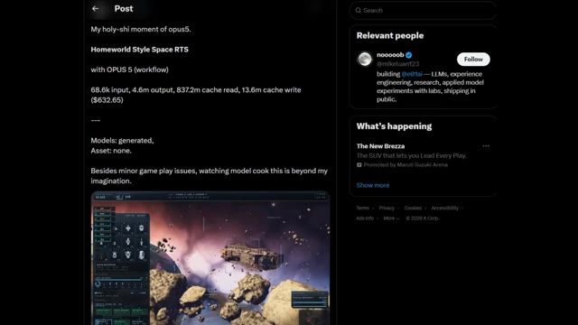
*Capture d'écran d'une publication sur les réseaux sociaux (X/Twitter) montrant le projet de jeu de stratégie spatiale réalisé avec Opus 5.*

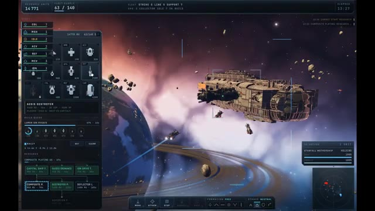
*Interface de jeu en plein écran montrant le jeu de stratégie spatiale de type Homeworld généré par IA, avec des vaisseaux et des menus de gestion.*

---

### ⏱️ `[00:03:10 - 00:03:40]` | Segment #10

**🔊 Audio (Transcription Intégrale Mot pour Mot en Français) :**
> Tout ce que vous voyez, depuis les immenses vaisseaux capitaux jusqu'aux planètes, champs d'astéroïdes, contrôles de flotte, objectifs, gestion des ressources et batailles en temps réel, a été généré par Opus 5 en utilisant 3.js. Mais voici la partie vraiment intéressante. Le modèle n'a pas seulement généré du code une fois pour s'arrêter, il a évalué en continu son propre travail, utilisé des sous-agents pour améliorer différentes parties du projet, comparé les résultats avec le jeu original Homeworld, et continué à affiner le jeu jusqu'à atteindre ce niveau de qualité.

**👁️ Analyse Visuelle d'Écran (gemini-3.5-flash-lite) :**
**Interface & Outils** : Interface utilisateur de type jeu de stratégie de science-fiction (style Homeworld) avec des panneaux de ressources, de gestion de flotte, de recherche et une mini-carte radar.

**Contenu textuel & Code** : Textes visibles : "RESOURCE UNITS 14 688", "FLEET SUPPLY 63 / 140", "AEGIS DESTROYER", "COMPOSITE PLATING", "SELECTION: STARFALL MOTHERSHIP", "CRUCIBLE REFINERY", "FLEET UNDER ATTACK".

**Action / Démonstration** : Navigation et gestion de jeu de stratégie spatiale en temps réel, avec sélection d'unités, construction de vaisseaux et observation de combats spatiaux.

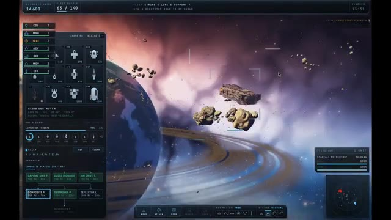
*Interface d'un jeu de stratégie spatiale généré par IA, montrant une planète avec des anneaux, un champ d'astéroïdes et des menus de gestion de flotte.*

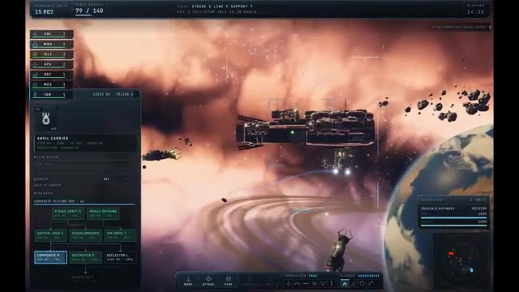
*Vue rapprochée d'un vaisseau capital dans le jeu spatial avec des informations sur les unités et des options de construction.*

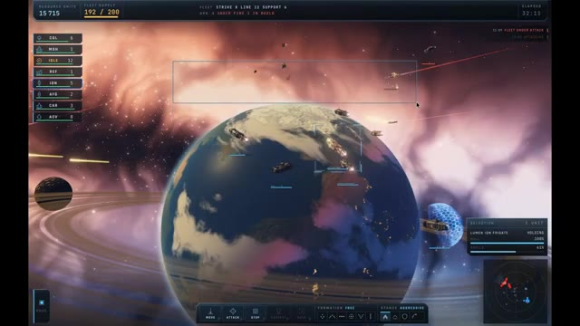
*Scène de bataille spatiale en temps réel au-dessus d'une planète avec des tirs de laser et des sélections de zones par encadré.*

---

### ⏱️ `[00:03:40 - 00:03:59]` | Segment #11

**🔊 Audio (Transcription Intégrale Mot pour Mot en Français) :**
> Les chiffres derrière ce projet sont honnêtement fous. Environ 68 000 jetons d'entrée, plus de 4,6 millions de jetons de sortie, et environ 632 $ de coût de calcul pour le terminer. Et le résultat ? Un jeu par navigateur entièrement jouable qui est également open source.

**👁️ Analyse Visuelle d'Écran (gemini-3.5-flash-lite) :**
**Interface & Outils** : Interface du réseau social X (anciennement Twitter) affichant un post avec texte et image intégrée.

**Contenu textuel & Code** : Texte du post : "My holy-shi moment of opus5. Homeworld Style Space RTS with OPUS 5 (workflow) 68.6k input, 4.6m output, 837.2m cache read, 13.6m cache write ($632.65). Models: generated, Asset: none. Besides minor game play issues, watching model cook this is beyond my imagination." Capture d'écran d'un jeu de stratégie en temps réel (RTS) spatial avec des vaisseaux dans un décor nébuleux. Panneau latéral droit affichant les sections "Relevant people" et "What's happening".

**Action / Démonstration** : Affichage à l'écran d'une publication sur les réseaux sociaux illustrant les statistiques et le rendu du projet discuté dans la vidéo.

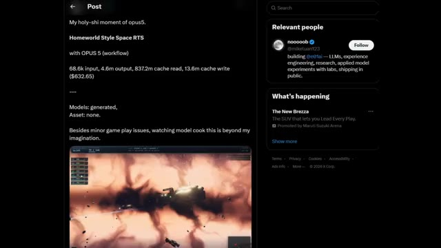
*Publication sur le réseau social X montrant les détails d'un projet de jeu de stratégie spatiale généré par IA, incluant les statistiques de jetons et une capture d'écran du jeu.*

---

### ⏱️ `[00:03:59 - 00:04:22]` | Segment #12

**🔊 Audio (Transcription Intégrale Mot pour Mot en Français) :**
> Et juste au moment où vous pensez qu'Opus 5 ne pouvait pas être plus impressionnant, voici un autre exemple. Ce développeur a associé Claude Code à Opus 5 et lui a donné un seul objectif. À partir de là, l'IA a presque tout géré. Après environ 9 heures et près de 4 millions de jetons, elle a construit Snowflow, une démo graphique basée sur un navigateur qui est honnêtement difficile à croire comme étant principalement créée par une IA.

**👁️ Analyse Visuelle d'Écran (gemini-3.5-flash-lite) :**
**Interface & Outils** : Navigateur web affichant un tweet (interface de type X/Twitter).

**Contenu textuel & Code** : Texte du tweet : "Someone used Claude Code with Opus 5 to build SNOWFLOW, a browser WebGPU snow and waterbending demo with persistent terrain deformation in 9 hours. - Full-Stack Graphics Pipeline... - Interactive Terrain Deformation... - Visual Self-Correction... - 9-Hour Build Window..." ainsi qu'une vidéo intégrée montrant le rendu enneigé. Dans le panneau de droite, des sections "Relevant people" avec le compte d'0xMarioNawfal et "What's happening".

**Action / Démonstration** : Affichage d'une publication sur les réseaux sociaux détaillant les caractéristiques techniques d'une démo graphique créée par une IA.

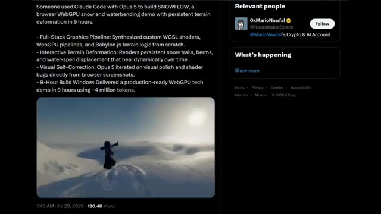
*Capture d'écran d'un tweet expliquant la création de Snowflow avec Claude Code et Opus 5, incluant une vidéo de démonstration.*

---

### ⏱️ `[00:04:22 - 00:04:40]` | Segment #13

**🔊 Audio (Transcription Intégrale Mot pour Mot en Français) :**
> Le projet comprend des shaders WGSL personnalisés, un pipeline de rendu WebPG complet, un système de terrain BabylonJS, de la neige interactive qui réagit à vos sorts, des traces de neige persistantes, un déplacement d'eau réaliste et même un terrain qui se restitue lentement de lui-même au fil du temps.

**👁️ Analyse Visuelle d'Écran (gemini-3.5-flash-lite) :**
**Interface & Outils** : Navigateur web affichant une publication sur la plateforme X (anciennement Twitter).

**Contenu textuel & Code** : Texte du tweet : "Someone used Claude Code with Opus 5 to build SNOWFLOW, a browser WebGPU snow and waterbending demo with persistent terrain deformation in 9 hours." Suivi de points clés techniques incluant "Full-Stack Graphics Pipeline", "Interactive Terrain Deformation", "Visual Self-Correction", et "9-Hour Build Window", avec une vidéo intégrée montrant un personnage dans un paysage enneigé.

**Action / Démonstration** : Affichage d'une publication sur les réseaux sociaux détaillant la création d'une démo WebGPU interactive à l'aide de Claude Code et Opus 5.

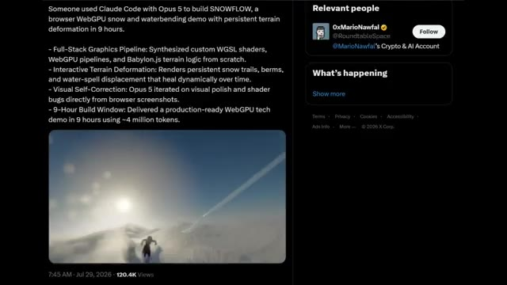
*Capture d'écran d'un tweet sur X présentant la démo technique "SNOWFLOW" avec des détails sur les pipelines graphiques WebGPU et Babylon.js.*

---

### ⏱️ `[00:04:40 - 00:05:01]` | Segment #14

**🔊 Audio (Transcription Intégrale Mot pour Mot en Français) :**
> Mais la partie la plus folle, c'est que Opus 5 n'a pas seulement généré le projet, il a réellement examiné des captures d'écran de son propre travail, trouvé des bugs visuels et les a corrigés automatiquement. Maintenant, jetez un œil à ce gameplay. Vous pouvez parcourir le monde, lancer des sorts d'eau, tailler des chemins à travers la neige, et chaque interaction modifie l'environnement en temps réel.

**👁️ Analyse Visuelle d'Écran (gemini-3.5-flash-lite) :**
**Interface & Outils** : Interface d'une application de réseau social (X / Twitter) montrant un post explicatif et des extraits vidéo, suivie d'un moteur de rendu graphique 3D WebGPU.

**Contenu textuel & Code** : Texte du post X : "Someone used Claude Code with Opus 5 to build SNOWFLOW, a browser WebGPU snow and waterbending demo with persistent terrain deformation in 9 hours." avec les points techniques : Full-Stack Graphics Pipeline, Interactive Terrain Deformation, Visual Self-Correction, 9-Hour Build Window.

**Action / Démonstration** : Le créateur montre une publication détaillant le projet Snowflow, puis présente des séquences de gameplay interactives où le personnage se déplace et interagit dynamiquement avec le décor enneigé.

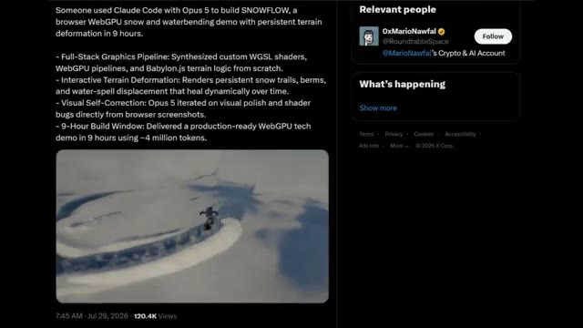
*Publication sur X (Twitter) présentant le projet Snowflow créé avec Claude Code et Opus 5 en 9 heures.*

*Vue de gameplay montrant un personnage en tenue sombre marchant sur un vaste paysage enneigé vallonné.*

*Vue de gameplay montrant le personnage en train de courir et de manipuler l'environnement enneigé en temps réel.*

---

### ⏱️ `[00:05:01 - 00:05:22]` | Segment #15

**🔊 Audio (Transcription Intégrale Mot pour Mot en Français) :**
> L'éclairage, les effets de particules, les reflets et la déformation du terrain ont l'air incroyablement soignés. C'est l'une des démonstrations les plus fortes de ce dont Opus 5 est capable aujourd'hui. Ce n'est plus seulement une IA qui écrit du code, elle peut construire des systèmes graphiques avancés, les déboguer visuellement et itérer jusqu'à ce que le résultat final semble prêt pour la production.

**👁️ Analyse Visuelle d'Écran (gemini-3.5-flash-lite) :**
**Interface & Outils** : Système de rendu graphique 3D interactif généré par Opus 5.

**Contenu textuel & Code** : Environnement virtuel 3D photoréaliste enneigé, incluant un personnage animé, des effets de traînée et de particules dans la neige, un soleil éclatant avec reflets atmosphériques et des formations de glace.

**Action / Démonstration** : Le personnage évolue dynamiquement à travers le décor enneigé, provoquant des déformations physiques réalistes du terrain et interagissant avec les effets de particules.

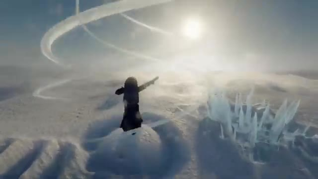
*Rendu graphique en temps réel montrant un personnage dans un paysage enneigé avec des effets de particules et d'éclairage dynamiques.*

*Vue aérienne montrant la déformation du terrain et les traînées laissées par le personnage glissant sur la neige.*

*Vue panoramique d'un environnement enneigé étendu sous un ciel lumineux, illustrant la qualité des reflets et de l'éclairage.*

---

### ⏱️ `[00:05:22 - 00:05:56]` | Segment #16

**🔊 Audio (Transcription Intégrale Mot pour Mot en Français) :**
> Si c'est ce que l'IA peut créer en moins d'un jour aujourd'hui, imaginez à quoi le développement de jeux, la création et les simulations pourraient ressembler au cours des prochaines années. Le rythme des progrès est franchement incroyable. Une chose rapide avant de conclure. Ne croyez pas chaque démo virale d'Opus 5 que vous voyez sur X. Par exemple, cette publication affirme qu'Opus 5 a généré un jeu 3D de style GTA réaliste dans un navigateur, situé sur un site de lancement de SpaceX Starship, en utilisant un seul prompt et la boucle de gant (gauntlet loop) où des agents IA construisent, critiquent et améliorent à plusieurs reprises le projet.

**👁️ Analyse Visuelle d'Écran (gemini-3.5-flash-lite) :**
**Interface & Outils** : Interface du réseau social X (anciennement Twitter) affichant un tweet et un profil utilisateur.

**Contenu textuel & Code** : Texte du tweet de l'utilisateur @MarlburroW38 mentionnant : "GTA SpaceX running in the browser 👀, built by Claude in one prompt using a Gauntlet Loop." et détaillant la pile technique (Stack: three.js + WebGPU, etc.).

**Action / Démonstration** : Le créateur illustre ses propos en affichant des exemples de rendus visuels générés par IA puis une publication sur les réseaux sociaux pour mettre en garde contre les fausses démos virales.

*Démonstration visuelle de simulation ou de jeu montrant un personnage se déplaçant au-dessus de nuages dans un environnement enneigé.*

*Poursuite de la démonstration visuelle avec une vue en mouvement au ras du sol ou d'une surface enneigée.*

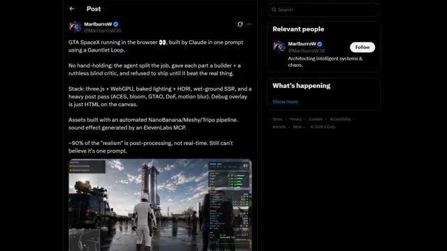
*Capture d'écran d'une publication sur le réseau social X montrant un tweet sur un jeu GTA généré par Claude avec des détails techniques et un aperçu vidéo.*

---

### ⏱️ `[00:05:56 - 00:06:20]` | Segment #17

**🔊 Audio (Transcription Intégrale Mot pour Mot en Français) :**
> Ça a l'air impressionnant, mais cet exemple est presque certainement faux. Voici pourquoi. Le gameplay lui-même montre de multiples signes qu'il n'a pas été généré de zéro par un agent de codage IA. Les animations, le mouvement de caméra, le comportement des PNJ, l'éclairage et la cohérence globale de la scène ressemblent beaucoup plus à un jeu existant lourdement modifié qu'à un projet de navigateur créé en un seul prompt.

**👁️ Analyse Visuelle d'Écran (gemini-3.5-flash-lite) :**
**Interface & Outils** : Navigateur web (plateforme X/Twitter) et moteur de jeu (Unreal Engine 5 avec HUD de débogage et mini-carte style GTA).

**Contenu textuel & Code** : Publication textuelle : "GTA SpaceX running in the browser, built by Claude in one prompt using a Gauntlet Loop..." avec spécifications techniques (three.js + WebGPU, baked lighting + HDRI, wet-ground SSR...). Interface de jeu avec les objectifs "Reach the Starship", "Board the Starship" et des statistiques de performance (FPS, mémoire, triangles).

**Action / Démonstration** : Le créateur montre d'abord un post X détaillant un prétendu jeu généré par IA, puis diffuse des images de gameplay en vue à la troisième personne avec un personnage en combinaison blanche évoluant dans un décor sophistiqué.

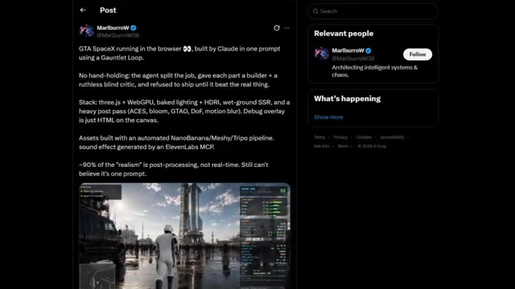
*Capture d'écran d'une publication X (Twitter) montrant le texte descriptif du projet de jeu "GTA SpaceX" et un aperçu vidéo en bas.*

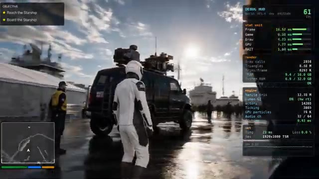
*Vue de gameplay montrant un personnage en combinaison spatiale blanche marchant dans un environnement humide avec des reflets au sol et l'interface de débogage Unreal Engine 5 à droite.*

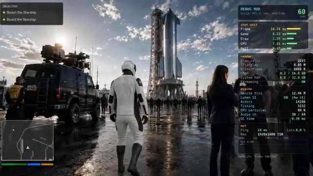
*Vue de gameplay similaire avec un grand vaisseau spatial (Starship) visible à l'arrière-plan et des PNJ autour du personnage principal.*

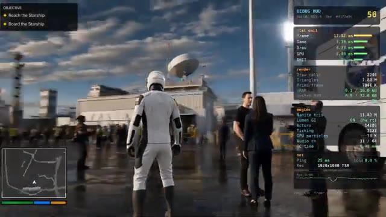
*Mouvement de caméra panoramique dans le jeu montrant des structures de base, des PNJ et des moniteurs de performance technique (HUD) sur le côté droit.*

---

### ⏱️ `[00:06:20 - 00:06:50]` | Segment #18

**🔊 Audio (Transcription Intégrale Mot pour Mot en Français) :**
> Deuxièmement, il n'y a pas de code source, pas de journaux de développement, pas de démo jouable et aucune preuve technique pour étayer une affirmation aussi extraordinaire. Pour des projets aussi avancés, les développeurs publient normalement un dépôt GitHub, une version pour navigateur, ou expliquent au moins comment ils l'ont construit. Rien de tout cela n'existe ici. Et bien que la boucle de gantelet soit une réelle technique de prompting qui améliore le code généré par l'IA en utilisant des agents constructeurs et critiques, elle ne génère pas magiquement un jeu de qualité GTA à partir d'une seule invite sans aucune preuve.

**👁️ Analyse Visuelle d'Écran (gemini-3.5-flash-lite) :**
**Interface & Outils** : Navigateur web affichant des publications sur le réseau social X (Twitter) ainsi qu'une capture d'écran de jeu vidéo dotée d'un HUD de débogage.

**Contenu textuel & Code** : Texte du tweet de MarlburroW : "GTA SpaceX running in the browser 👀, built by Claude in one prompt using a Gauntlet Loop... Stack: three.js + WebGPU...". Texte du tweet de Matt Schumer : "Claude Opus 5 one-shotted this game. EVERYTHING you see in this demo is custom code...". Affichage des métriques de performance sur l'écran du jeu (FPS, frame time, triangles, mémoire VRAM).

**Action / Démonstration** : Le créateur montre des exemples de publications virales sur X affirmant la génération de jeux vidéo par IA pour appuyer son argumentation sur l'absence de preuves techniques.

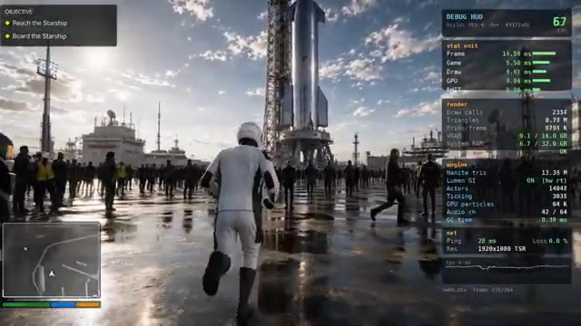
*Capture d'écran du jeu en cours avec un personnage en combinaison spatiale blanche courant sur une piste mouillée devant une fusée SpaceX.*

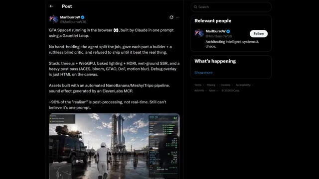
*Publication X (Twitter) de MarlburroW détaillant le fonctionnement de "GTA SpaceX" généré par Claude via un Gauntlet Loop.*

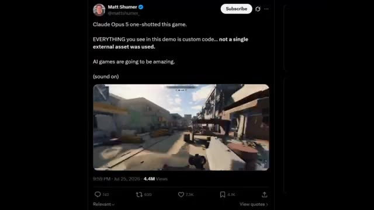
*Publication X (Twitter) de Matt Schumer affirmant que Claude Opus 5 a généré un jeu complet en une seule invite.*

---

### ⏱️ `[00:06:51 - 00:07:12]` | Segment #19

**🔊 Audio (Transcription Intégrale Mot pour Mot en Français) :**
> Donc, chaque fois que vous voyez des présentations virales d'Opus 5, cherchez toujours des preuves : code source, démo jouable, documentation technique ou processus de développement transparent. Les vrais exemples d'Opus 5 que nous avons examinés aujourd'hui sont déjà incroyables. Nous n'avons pas besoin de fausses démos pour apprécier la rapidité avec laquelle l'intelligence artificielle progresse. Et c'est tout pour le rapport de recherche d'aujourd'hui.

**👁️ Analyse Visuelle d'Écran (gemini-3.5-flash-lite) :**
**Interface & Outils** : Navigateur web affichant une publication sur les réseaux sociaux (X/Twitter) et lecteur vidéo illustrant des démos techniques.

**Contenu textuel & Code** : Texte du tweet : "GTA SpaceX running in the browser 👀, built by Claude in one prompt using a Gauntlet Loop. No hand-holding: the agent split the job..." et détails de la pile (three.js + WebGPU, baked lighting, etc.).

**Action / Démonstration** : Présentation d'exemples concrets de code généré par IA et de démonstrations visuelles à l'écran pour illustrer les propos sur la vérification des sources.

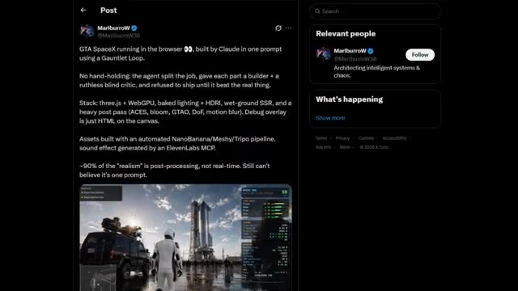
*Capture d'écran d'un tweet montrant un projet type GTA SpaceX généré par Claude dans un navigateur, avec des détails techniques sur la pile logicielle.*

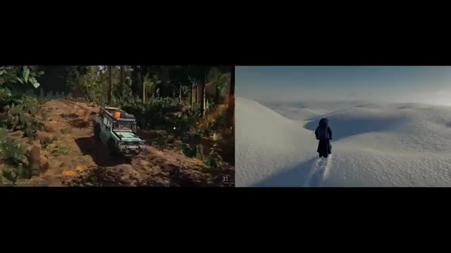
*Démonstration vidéo côte à côte de scènes générées en 3D, montrant à gauche un véhicule tout-terrain en forêt et à droite un personnage marchant dans la neige.*

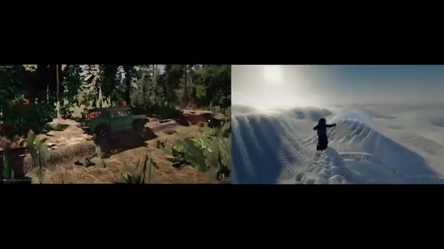
*Suite de la démonstration vidéo côte à côte avec une caméra en mouvement au-dessus de paysages enneigés.*

---

### ⏱️ `[00:07:13 - 00:07:48]` | Segment #20

**🔊 Audio (Transcription Intégrale Mot pour Mot en Français) :**
> Opus 5 repousse clairement les limites de ce qui est possible avec l'IA. Qu'il s'agisse de générer des environnements de jeu réalistes, de construire des jeux par navigateur complets ou même de déboguer son propre travail, il devient évident que l'IA n'aide plus seulement les développeurs. Elle commence à en devenir un. En même temps, il est important de séparer les réelles avancées des faux posts viraux. C'est exactement ce que je continuerai à faire sur cette chaîne. Trouver les développements d'IA les plus impressionnants, tester les affirmations et vous montrer ce qui est réellement vrai. Si vous avez apprécié ce rapport de recherche, n'oubliez pas de laisser un pouce bleu et de vous abonner à Pursuing AI car je couvrirai chaque

**👁️ Analyse Visuelle d'Écran (gemini-3.5-flash-lite) :**
**Interface & Outils** : Écran partagé présentant des environnements de jeux vidéo générés ou rendus par intelligence artificielle.

**Contenu textuel & Code** : Éléments visuels de jeux vidéo (véhicule, tableau de bord, paysages enneigés), logo circulaire « PAI » avec un cerveau robotisé et le texte « The Research Report », ainsi que des boutons de likes et d'abonnement.

**Action / Démonstration** : Affichage d'environnements de jeux vidéo dynamiques générés par IA pour illustrer les capacités d'Opus 5.

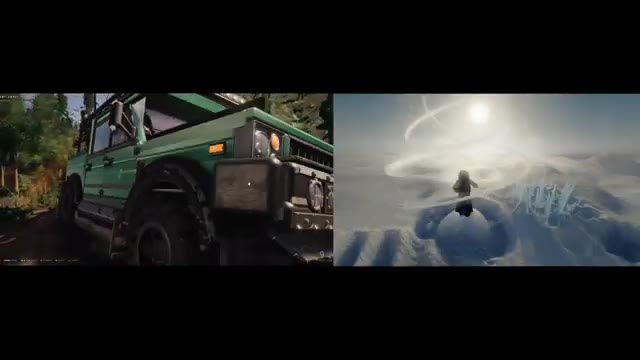
*Démonstration à l'écran divisé montrant un véhicule vert tout-terrain d'un côté et un personnage sur un paysage enneigé de l'autre, générés par l'IA.*

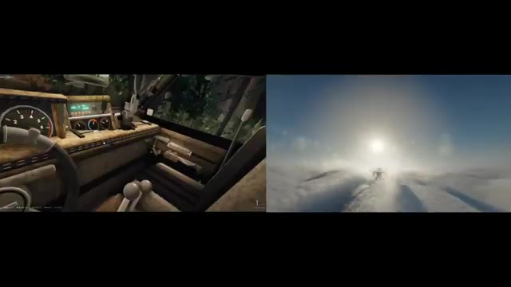
*Vue intérieure depuis le poste de pilotage du véhicule vert et le personnage volant au-dessus des nuages.*

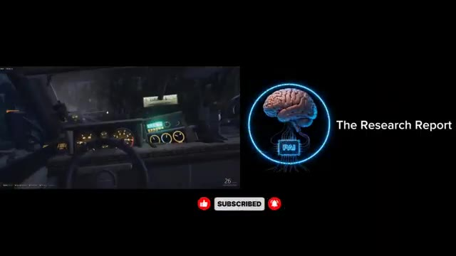
*Vue de l'habitacle sombre d'un véhicule avec le logo de la chaîne « Pursuing AI » et le texte « The Research Report » sur le côté droit.*

---

### ⏱️ `[00:07:48 - 00:07:54]` | Segment #21

**🔊 Audio (Transcription Intégrale Mot pour Mot en Français) :**
> majeure percée en IA au moment même où elle se produit. Merci d'avoir regardé et je vous vois dans le prochain rapport de recherche.

**👁️ Analyse Visuelle d'Écran (gemini-3.5-flash-lite) :**
**Interface & Outils** : Présentation sans interface logicielle active.

**Contenu textuel & Code** : Animation graphique illustrant un cerveau stylisé.

**Action / Démonstration** : Affichage d'un visuel de transition sur fond noir.

---
