# 🎬 DeepSeek V4 Flash est TELLEMENT plus puissant qu'on le pensait ! 🤯

> **Chaîne** : [Pursuing AI](https://www.youtube.com/@PursuingAi)  
> **Titre original** : `DeepSeek V4 Flash is WAY Powerful Than We Thought! 🤯`  
> **Lien YouTube** : [https://www.youtube.com/watch?v=hyDviOrokpc](https://www.youtube.com/watch?v=hyDviOrokpc)  
> **Date de publication** : 2026-08-01  
> **Durée** : 05m 01s (`301s`)  
> **Identifiant vidéo** : `hyDviOrokpc`  
> **Fiche Web Interactive** : [2026-08-01_YT-hyDviOrokpc_DeepSeek V4 Flash est TELLEMENT plus puissant qu'on le pensait ! 🤯_by-whisper-v3-large-turbo+gemini-3.5-flash-lite.html](2026-08-01_YT-hyDviOrokpc_DeepSeek V4 Flash est TELLEMENT plus puissant qu'on le pensait ! 🤯_by-whisper-v3-large-turbo+gemini-3.5-flash-lite.html)  
> **Captures de démonstration clés** : `38 captures réelles (anti-talking-head)`  
> **Modèles utilisés** : Audio: `large-v3-turbo` (Faster-Whisper int8 VPS) | Vision: `gemini-3.5-flash-lite` (Google AI Studio API)  

---

## 📌 Synthèse Exécutive & Outils

### 📌 Résumé
La vidéo de *Pursuing AI* explore les performances révolutionnaires de **DeepSeek V4 Flash**, un modèle d'IA léger mais extrêmement performant, capable de générer des environnements interactifs complexes, des jeux vidéo complets (GTA 6-style, FPS) et des interfaces web à partir d'un simple prompt textuel. Le créateur analyse minutieusement ce nouveau modèle en le confrontant aux poids lourds du secteur comme **GPT-5.6 Luna** et **Kimi K3**, tout en dévoilant les premiers aperçus prometteurs de **DeepSeek V4 Pro**. L'analyse met en lumière un changement de paradigme majeur dans l'industrie : l'efficacité économique extrême des petits modèles qui talonnent les architectures dix fois plus grandes pour une fraction du coût.

La méthodologie démontrée repose sur une approche itérative via des agents conversationnels et des environnements de développement intégrés (comme l'utilisation de *Hermes Agent*). Le créateur procède par des benchmarks comparatifs rigoureux en soumettant exactement le même prompt à différents modèles pour évaluer le ratio coût-temps-qualité. Pour les créateurs de vidéo et de contenu interactif, ces avancées ouvrent des perspectives inédites : la possibilité de prototyper des univers virtuels interactifs, des décors complexes et des applications web cinématiques en quelques minutes, pour à peine quelques centimes, redéfinissant ainsi les standards de production rapide.

### 🛠️ Outils, Modèles & Logiciels Présentés
* **DeepSeek V4 Flash** : Modèle d'IA léger et ultra-économique utilisé pour générer des environnements interactifs, des jeux et des interfaces web complexes en un temps record.
* **DeepSeek V4 Pro** : Version haut de gamme et plus puissante de DeepSeek, offrant un niveau de détail visuel et de composition de scène nettement supérieur.
* **Kimi K3** : Modèle open source de grande taille, reconnu comme l'un des plus robustes du marché, servant ici de référence comparative pour la finesse typographique et le raffinement visuel.
* **GPT-5.6 Luna** : Modèle concurrent haut de gamme utilisé dans les tests de stress (Minecraft et interfaces front-end) pour évaluer la vitesse, le coût et la qualité globale.
* **Seedance 2.5** : Outil de génération vidéo par intelligence artificielle identifié dans l'écosystème technique global de la vidéo.
* **Kling 3.0** : Solution de pointe pour la génération de contenu visuel et vidéo par IA mentionnée parmi les outils de référence.
* **Midjourney** : Logiciel de génération d'images par IA de premier plan utilisé pour la création d'actifs visuels.
* **Hermes Agent** : Agent conversationnel et d'exécution utilisé pour orchestrer la génération de code et de projets (comme le jeu de tir FPS) à partir de prompts textuels.
* **Three.js** : Librairie JavaScript utilisée pour la construction et le rendu de scènes 3D interactives dans le navigateur, pilotée ici par la génération de l'IA.

### 🔑 Points Clés & Enseignements Stratégiques
* **La démocratisation du prototypage interactif** : DeepSeek V4 Flash prouve qu'un modèle léger peut générer des mondes ouverts interactifs (style GTA 6) avec gestion de la physique, tirs et réactions des PNJ sans nécessiter d'actifs externes.
* **Un ratio coût-performance spectaculaire** : La génération d'un jeu de tir à la première personne (FPS) complet via Hermes Agent a pris seulement 32 minutes pour un coût dérisoire de 7 cents, rendant l'expérimentation accessible à tous les créateurs.
* **L'efficacité des petits modèles** : Bien que Kimi K3 soit environ 10 fois plus grand, DeepSeek V4 Flash parvient à atteindre près de 90 % de sa qualité pour un coût inférieur à 10 cents par itération.
* **Le compromis vitesse/qualité face aux géants** : Face à GPT-5.6 Luna sur un test complexe comme la création d'un clone de Minecraft, le modèle Flash demande plus de temps (plus de 5 minutes) et se montre légèrement plus cher ($1,30 contre $0,75), illustrant les limites actuelles des modèles légers sur des tâches hautement itératives et correctives.
* **Des approches créatives diversifiées en front-end** : À prompt égal, DeepSeek V4 Flash privilégie une esthétique cosmique et poétique (*Orbit*), tandis que GPT-5.6 Luna opte pour une interactivité environnementale poussée (*Era*), prouvant que le choix du modèle dépend de la sensibilité artistique recherchée.
* **L'importance des passes de contrôle qualité** : Le succès d'un projet généré par IA réside dans l'intégration de boucles itératives (comme les 6 itérations de construction et 8 passes de contrôle qualité observées pour le produit *Arc01*).
* **Le bond en avant de DeepSeek V4 Pro** : Les premiers résultats du modèle Pro confirment une nette amélioration de la composition de scène, de l'éclairage (feu de camp, tentes) et de la précision des détails par rapport aux versions Flash.
* **Les spéculations sur l'architecture cachée** : Des rumeurs suggèrent que l'API de DeepSeek pourrait acheminer vers *Fable 5*, ce qui expliquerait l'impressionnant bond de performance observé sur ces dernières versions.
* **L'optimisation du budget de production** : Avec un coût estimé à environ 2 dollars pour une journée entière de travail intensif sur de multiples projets, les créateurs peuvent multiplier les tests sans impacter leur trésorerie.
* **La robustesse des fondamentaux** : Même s'ils pèchent parfois sur le dernier niveau de raffinement visuel ultime (comparé à Kimi K3), les modèles flash maîtrisent parfaitement la structure, la typographie de base et la mise en page globale.

---

## ⏱️ Chronologie & Transcription Complète Audio & Visuelle (Mot pour Mot)

### ⏱️ `[00:00:00 - 00:00:38]` | Segment #01

**🔊 Audio (Transcription Intégrale Mot pour Mot en Français) :**
> DeepSeq VAC avec son nouveau modèle v4 flash. Aujourd'hui, nous allons voir comment il performe, le comparer avec Kimi K3, l'un des plus forts modèles open source, et jeter également un œil rapide aux premiers résultats de DeepSeq v4 Pro. C'est Pursuing AI et vous regardez le Research Report. En commençant par cette démo de style GTA 6 en un seul coup. Tout ce que vous voyez a été généré entièrement par DeepSeq v4 flash sans actifs externes. Pour un modèle Flash, il fait un travail impressionnant en recréant un environnement de monde ouvert réaliste. Vous pouvez tirer avec des armes, les PNJ réagissent en s'enfuyant, conduire des voitures, frapper

**👁️ Analyse Visuelle d'Écran (gemini-3.5-flash-lite) :**
**Interface & Outils** : Interface de démonstration de moteur de jeu ou de simulation en monde ouvert avec affichage tête haute (HUD) et interface de comparaison côte à côte

**Contenu textuel & Code** : Textes "V4 FLASH", "5.6 Luna", compteur de score et d'objectifs, inventaire dans le coin supérieur gauche, indicateur de munitions et d'argent dans le coin supérieur droit

**Action / Démonstration** : Comparaison de performances de modèles d'IA générative jouant à des jeux de plateforme et navigation dans un environnement open-world virtuel en 3D

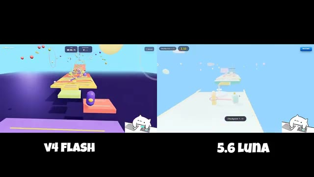
*Comparaison côte à côte entre V4 Flash et 5.6 Luna montrant un parcours d'obstacles en 3D*

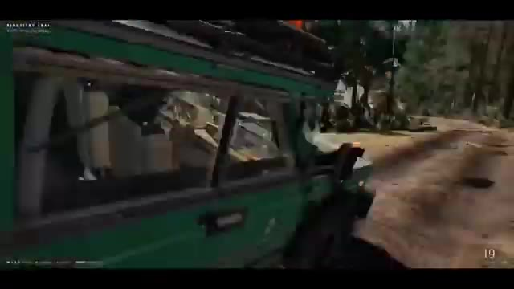
*Vue rapprochée à l'intérieur d'un véhicule vert dans une démonstration de style open-world*

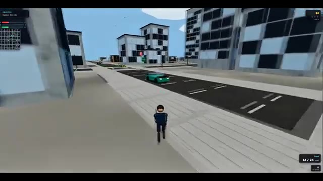
*Vue en monde ouvert de style GTA 6 avec un personnage sur un trottoir et des voitures circulant en arrière-plan*

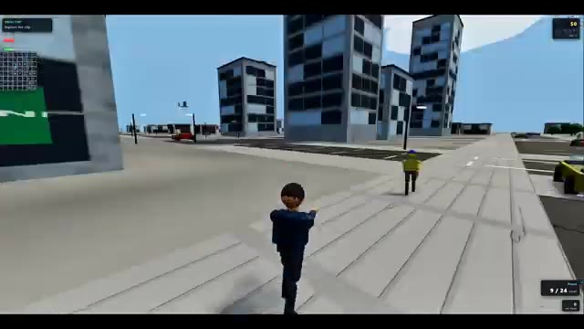
*Personnage pointant une arme dans une rue de la ville virtuelle avec des PNJ à proximité*

---

### ⏱️ `[00:00:38 - 00:01:00]` | Segment #02

**🔊 Audio (Transcription Intégrale Mot pour Mot en Français) :**
> piétons, et entrent même en collision avec des bâtiments au lieu de les traverser. La physique et les interactions ne sont pas parfaites, mais il est quand même impressionnant de voir un modèle léger générer un jeu interactif de ce type. Vient ensuite cette gare ferroviaire entièrement générée construite avec Three.js. Pour un modèle Flash, la qualité est étonnamment bonne, surtout compte tenu du prix.

**👁️ Analyse Visuelle d'Écran (gemini-3.5-flash-lite) :**
**Interface & Outils** : Interface de jeu vidéo et application web 3D interactive utilisant Three.js.

**Contenu textuel & Code** : Éléments d'interface de jeu (compteur d'argent en haut à droite, objectif "Explore the city") et étiquette "KINGSWAY STATION - Photorealistic Three.js railway station - PBR - dynamic shadows" avec des boutons de navigation (Overview, Platform, Train, Station, Footbridge).

**Action / Démonstration** : Navigation interactive dans un jeu de type monde ouvert généré par IA, suivie de la présentation d'une scène 3D de gare ferroviaire.

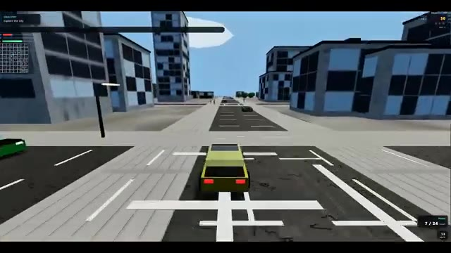
*Vue à la troisième personne d'un jeu vidéo interactif généré par IA montrant une voiture jaune naviguant dans une rue urbaine.*

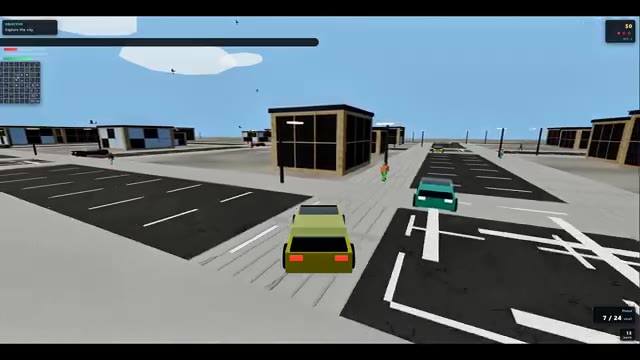
*Suite de la séquence du jeu montrant la voiture circulant près de bâtiments et croisant d'autres véhicules.*

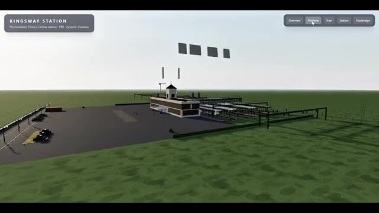
*Présentation d'un modèle 3D interactif d'une gare ferroviaire nommée 'Kingsway Station' construit avec Three.js.*

---

### ⏱️ `[00:01:00 - 00:01:20]` | Segment #03

**🔊 Audio (Transcription Intégrale Mot pour Mot en Français) :**
> La scène a l'air propre, la structure est détaillée et la présentation globale est solide. Et rappelez-vous, il s'agit de DeepSeek V4 Flash, pas du modèle Pro. Plus tard dans la vidéo, je vous montrerai également ce dont DeepSeek V4 Pro est capable. Ensuite, voici ce jeu de tir à la première personne (FPS). Et honnêtement, la partie la plus impressionnante n'est pas les graphismes, c'est le coût.

**👁️ Analyse Visuelle d'Écran (gemini-3.5-flash-lite) :**
**Interface & Outils** : Interface de simulation 3D interactive et moteur de jeu vidéo à la première personne (FPS) avec affichage de l'arme et compteur de munitions.

**Contenu textuel & Code** : Textes visibles : "KINGSWAY STATION", "Photorealistic Three.js railway station - PBR - dynamic shadows", boutons de navigation ("Overview", "Platform", "Train", "Station", "Footbridge"), et sur l'image 3 un chargeur/arme étiqueté "TAC-9 (92mm Ammo)" avec le chiffre "26".

**Action / Démonstration** : Navigation et exploration d'une scène 3D de gare ferroviaire interactive, puis transition vers une séquence de jeu de tir à la première personne (FPS).

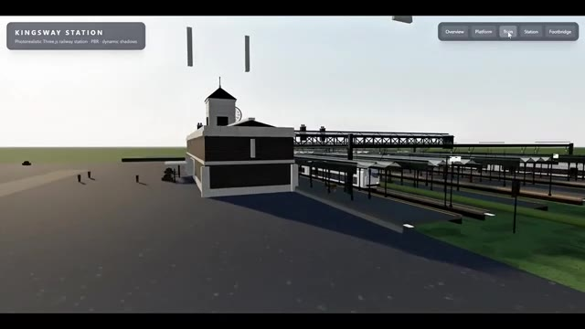
*Vue d'une simulation 3D de gare ferroviaire intitulée 'Kingsway Station' avec des options de navigation en haut à droite.*

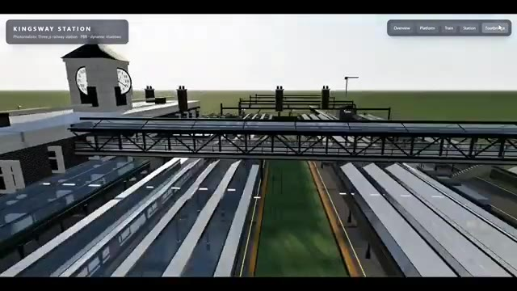
*Vue aérienne rapprochée de la même gare ferroviaire montrant les quais et la passerelle.*

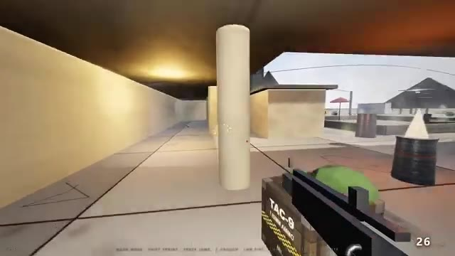
*Vue à la première personne (FPS) d'un jeu vidéo montrant une arme et des munitions TAC-9.*

---

### ⏱️ `[00:01:20 - 00:01:42]` | Segment #04

**🔊 Audio (Transcription Intégrale Mot pour Mot en Français) :**
> Cela a été construit en utilisant DeepSeq V4 Flash 0731 dans Hermes Agent avec un seul prompt. Cela a pris environ 32 minutes à générer et n'a coûté que 7 cents. C'est incroyablement bon marché. Environ 2 dollars peuvent durer toute une journée pour de nombreux projets. Et compte tenu du prix, les graphismes et la qualité générale sont en réalité plutôt bons.

**👁️ Analyse Visuelle d'Écran (gemini-3.5-flash-lite) :**
**Interface & Outils** : Navigateur web affichant une publication sur la plateforme X (Twitter) et lecteur vidéo en plein écran.

**Contenu textuel & Code** : Texte du tweet : "DeepSeek V4 Flash 0731 in Hermes Agent and one prompt, took 32 minutes and cost 0.07$, this model is so cheap to the point where 2 dollars can last you a full day." Profil d'Elshayib : "A Father | Full-stack dev going into network engineering while contributing to open source and building side projects".

**Action / Démonstration** : Affichage d'un post Twitter contenant un exemple de projet généré par IA, puis transition vers un zoom sur la vidéo du projet en question.

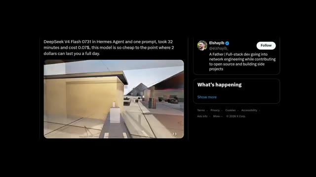
*Capture d'écran d'une publication X (Twitter) montrant une vidéo de jeu et le profil d'Elshayib (@elshayib).*

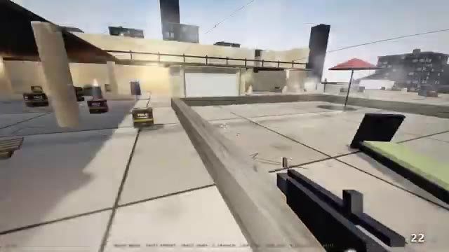
*Vue rapprochée en plein écran du rendu d'un jeu vidéo montrant une terrasse avec des caisses et un parasol.*

---

### ⏱️ `[00:01:42 - 00:02:06]` | Segment #05

**🔊 Audio (Transcription Intégrale Mot pour Mot en Français) :**
> Maintenant, comparons DeepSeq V4 Flash à GPT 5.6 Luna dans le test Minecraft. Pour être juste, aucun des deux modèles n'a réussi à construire un clone convaincant de Minecraft, mais les deux ont tout de même produit des résultats exploitables. La plus grande différence réside dans le temps, le coût et la qualité. GPT-5.6 Luna a complété tous les tests en environ 3 minutes et a coûté environ 75 cents.

**👁️ Analyse Visuelle d'Écran (gemini-3.5-flash-lite) :**
**Interface & Outils** : Interface de test comparative avec affichage côte à côte de deux environnements de type Minecraft (V4 Flash à gauche, 5.6 Luna à droite), puis capture d'un post Twitter (X).

**Contenu textuel & Code** : Texte affiché : "V4 FLASH", "5.6 Luna", et le tweet de JAZII (@notjazii) indiquant : "both models failed on making a good minecraft clone / but not bad / here's the pricing of all three test: / > luna took around 3 mins for all test which costed around .75$ / > v4 flash took over 5 mins... and costed 1.3$".

**Action / Démonstration** : Comparaison visuelle des performances des deux IA à l'écran, suivie de la lecture d'un tweet récapitulatif des coûts et du temps de traitement.

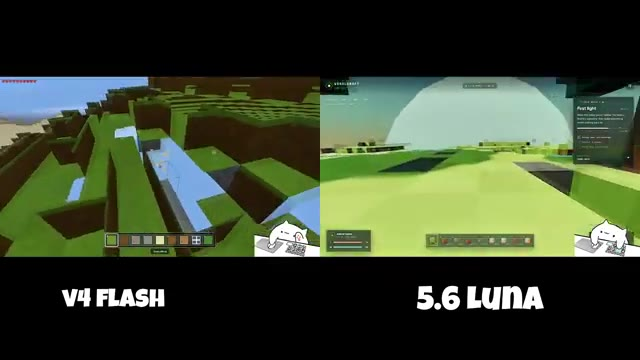
*Comparaison vidéo côte à côte entre DeepSeq V4 Flash et GPT 5.6 Luna exécutant un clone de Minecraft.*

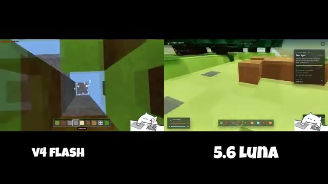
*Poursuite de la comparaison vidéo des deux modèles générant des environnements en blocs.*

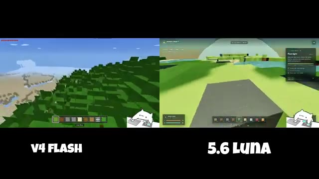
*Vue panoramique de la génération de paysages par les deux intelligences artificielles.*

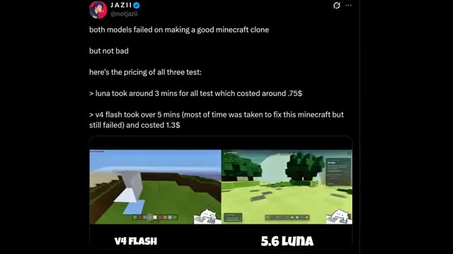
*Capture d'écran d'un tweet de @notjazii détaillant les performances, les coûts et le temps d'exécution des deux modèles.*

---

### ⏱️ `[00:02:06 - 00:02:28]` | Segment #06

**🔊 Audio (Transcription Intégrale Mot pour Mot en Français) :**
> Deep Seek V4 Flash a pris plus de 5 minutes, essayant principalement de corriger la génération de Minecraft, et a fini par coûter environ 1,30 $. Bien que les deux aient échoué, GPT-5.6 Luna a offert une qualité globale nettement supérieure dans ce test. Passant au test de front-end, les deux modèles ont livré des résultats impressionnants mais avec des approches créatives très différentes.

**👁️ Analyse Visuelle d'Écran (gemini-3.5-flash-lite) :**
**Interface & Outils** : Capture d'un post Twitter intégrée affichant des comparatifs vidéo côte à côte de jeux et de sites web générés par IA.

**Contenu textuel & Code** : Texte du tweet : "both models failed on making a good minecraft clone... > luna took around 3 mins for all test which costed around .75$ > v4 flash took over 5 mins... and costed 1.3$". Étiquettes "V4 FLASH" et "5.6 LUNA".

**Action / Démonstration** : Présentation comparative des résultats, du temps de calcul et des coûts des deux modèles d'IA sur des tâches de génération de jeux vidéo et d'interfaces web.

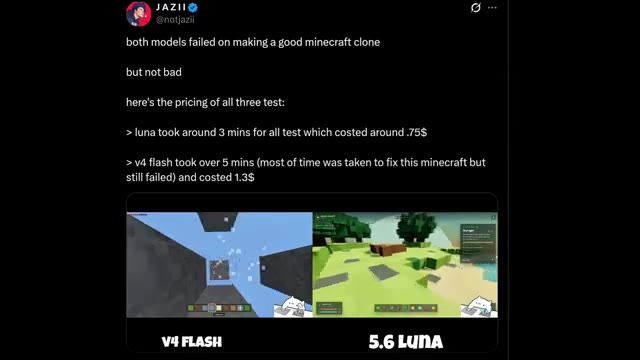
*Capture d'écran d'un tweet comparant les performances et les coûts de DeepSeek V4 Flash et GPT-5.6 Luna sur la génération de Minecraft.*

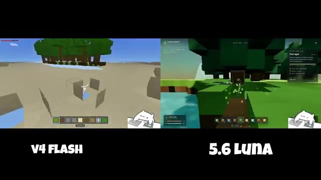
*Comparaison vidéo côte à côte entre V4 Flash et 5.6 Luna montrant le rendu du jeu style Minecraft en cours d'exécution.*

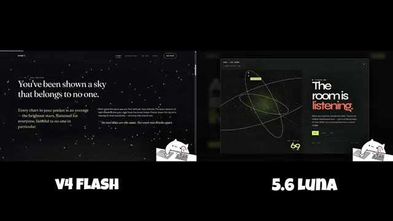
*Comparaison des interfaces web de front-end générées par V4 Flash et 5.6 Luna avec des animations spatiales et typographiques.*

---

### ⏱️ `[00:02:28 - 00:02:47]` | Segment #07

**🔊 Audio (Transcription Intégrale Mot pour Mot en Français) :**
> DeepSeq V4 Flash a construit Orbit, un site web sombre et étoilé avec des textes poétiques, des visuels inspirés de constellations et une atmosphère cinématique. D'un autre côté, GPT-5.6 Luna a créé Era, une expérience interactive aux tons verts où la pièce réagit à la lumière, à l'air et au son.

**👁️ Analyse Visuelle d'Écran (gemini-3.5-flash-lite) :**
**Interface & Outils** : Présentation comparative divisée en deux colonnes (V4 Flash à gauche, 5.6 Luna à droite) affichant des captures d'écran de sites web générés par IA.

**Contenu textuel & Code** : À gauche (V4 Flash / Orbit) : fond étoilé sombre, graphiques de constellations, texte "Find your patch of dark.". À droite (5.6 Luna / Era) : fond vert vif, interface interactive, formulaires et textes descriptifs.

**Action / Démonstration** : Affichage comparatif côte à côte de deux interfaces web créées par différentes IA, illustrant leurs styles visuels distincts.

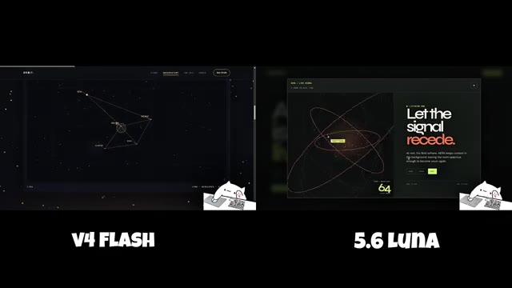
*Comparaison côte à côte montrant à gauche le site sombre "Orbit" généré par V4 Flash avec des constellations et à droite l'interface verte "Era" générée par 5.6 Luna.*

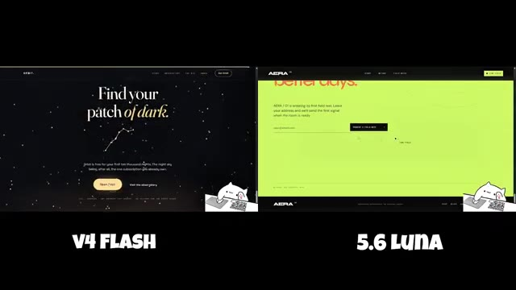
*Comparaison côte à côte montrant la suite des deux interfaces web avec le texte "Find your patch of dark" pour Orbit à gauche et l'interface interactive verte d'Era à droite.*

---

### ⏱️ `[00:02:47 - 00:03:05]` | Segment #08

**🔊 Audio (Transcription Intégrale Mot pour Mot en Français) :**
> Les deux sites web sont entièrement responsifs, dotés d'animations fluides et possèdent une forte hiérarchie visuelle sans ressembler à des modèles SaaS génériques. Dans cette comparaison, tout est une question de créativité et de préférence personnelle, plutôt que de capacité. Maintenant, comparons DeepSeq V4 Flash avec Kimi K3.

**👁️ Analyse Visuelle d'Écran (gemini-3.5-flash-lite) :**
**Interface & Outils** : Navigateurs web affichant des interfaces de sites web comparatifs (V4 Flash, 5.6 Luna, DeepSeek V4 Flash, Kimi K3).

**Contenu textuel & Code** : Textes visibles : "Step into a darker sky.", "AERA", "V4 FLASH", "5.6 LUNA", "ARC 01", "DeepSeek V4 Flash", "KIMI K3", "$10,000".

**Action / Démonstration** : Présentation comparative de designs de sites web et d'interfaces utilisateur générés par différents modèles d'IA.

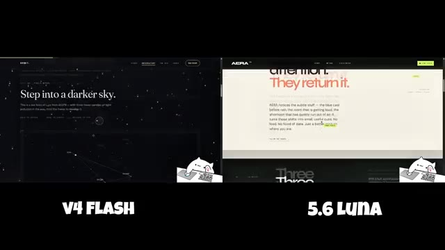
*Comparaison côte à côte de deux interfaces de sites web nommées 'V4 FLASH' et '5.6 LUNA' affichant des thèmes sombres et clairs avec des textes typographiés.*

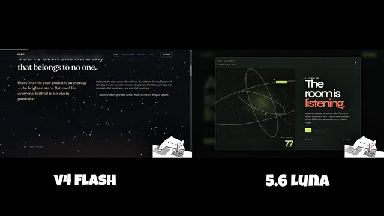
*Continuation de la comparaison entre les interfaces 'V4 FLASH' et '5.6 LUNA' avec des éléments graphiques et textuels animés.*

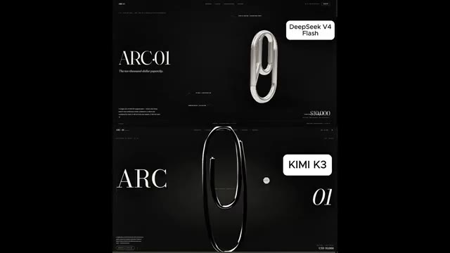
*Comparaison verticale de deux interfaces de sites web étiquetées 'DeepSeek V4 Flash' et 'KIMI K3' montrant des éléments 3D en forme de trombone métallique sur fond noir.*

---

### ⏱️ `[00:03:05 - 00:03:24]` | Segment #09

**🔊 Audio (Transcription Intégrale Mot pour Mot en Français) :**
> Les deux modèles ont reçu exactement le même prompt pour créer une page de destination de produit de luxe pour un produit conceptuel fictif à 10 000 $ appelé Arc01. Kimi K3 prend clairement la tête en termes de finition. Il a une meilleure typographie, une utilisation plus forte de l'espace négatif, et la présentation du produit phare a l'air plus raffinée.

**👁️ Analyse Visuelle d'Écran (gemini-3.5-flash-lite) :**
**Interface & Outils** : Écran partagé comparant deux interfaces de pages web générées par IA (DeepSeek V4 Flash en haut, Kimi K3 en bas).

**Contenu textuel & Code** : Textes visibles : "ARC 01", "The ten-thousand-dollar paperclip.", "DeepSeek V4 Flash", "KIMI K3", ainsi que diverses sections techniques de présentation du produit conceptuel.

**Action / Démonstration** : Comparaison visuelle côte à côte de deux designs de pages web de produits de luxe générés par deux modèles d'IA différents.

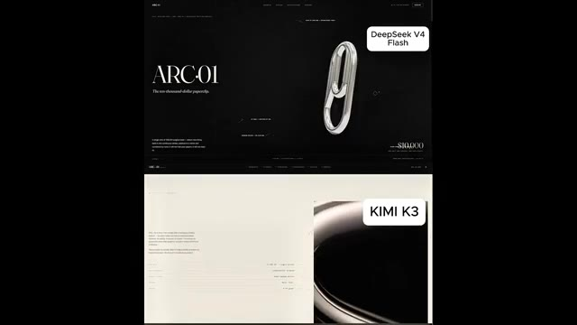
*Comparaison côte à côte de deux pages de destination web générées par DeepSeek V4 Flash (haut) et Kimi K3 (bas) pour le produit Arc01.*

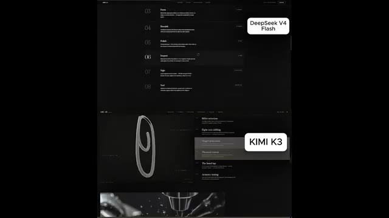
*Comparaison côte à côte des sections de spécifications et de fabrication des pages web générées par les deux modèles IA.*

---

### ⏱️ `[00:03:24 - 00:03:51]` | Segment #10

**🔊 Audio (Transcription Intégrale Mot pour Mot en Français) :**
> Mais DeepSeq V4 Flash s'en approche étonnamment. La mise en page, le texte et la structure générale sont tous solides. Il est principalement en retard sur le dernier niveau de raffinement visuel, pas sur les fondamentaux. Ce qui est vraiment impressionnant, c'est que Kimi K3 est environ 10 fois plus grand, pourtant DeepSeek V4 Flash atteint environ 90 % de la qualité tout en coûtant moins de 10 cents pour 6 itérations de construction et 8 passes de contrôle qualité.

**👁️ Analyse Visuelle d'Écran (gemini-3.5-flash-lite) :**
**Interface & Outils** : Capture d'écran de pages web comparatives et interface de réseau social X (Twitter).

**Contenu textuel & Code** : Textes comparatifs montrant "DeepSeek V4 Flash" et "KIMI K3", ainsi qu'un tweet de @filiroval parlant de modèles 10x plus petits atteignant 90% du résultat pour moins de 0.10$.

**Action / Démonstration** : Présentation comparative côte à côte de deux interfaces générées par les modèles DeepSeek V4 Flash et Kimi K3.

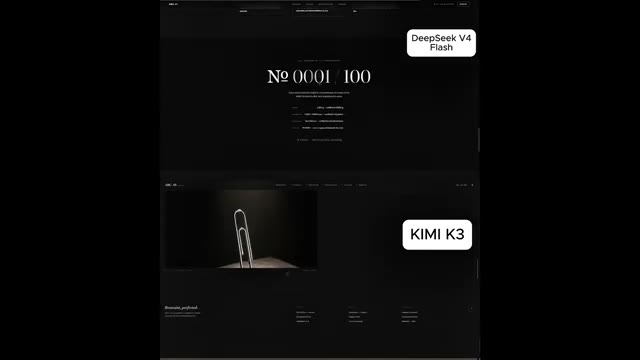
*Comparaison visuelle divisée en deux écrans montrant les résultats de DeepSeek V4 Flash et Kimi K3 avec des interfaces web sur fond sombre.*

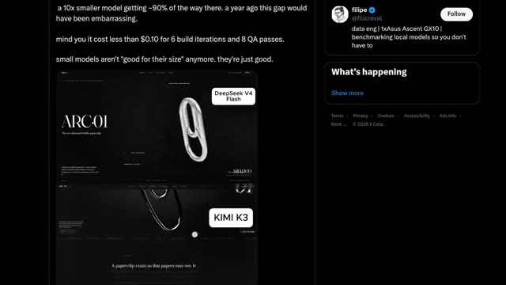
*Capture d'écran d'un tweet de @filiroval affichant une comparaison similaire entre DeepSeek V4 Flash et Kimi K3 sur le web.*

---

### ⏱️ `[00:03:51 - 00:04:09]` | Segment #11

**🔊 Audio (Transcription Intégrale Mot pour Mot en Français) :**
> Cela montre à quel point les petits modèles sont devenus performants. Ils ne sont plus seulement bons pour leur taille, ils sont réellement bons. Enfin, jetons un œil à DeepSeek V4 Pro. Les premiers résultats proviennent du modèle utilisant exactement le même prompt qui a été précédemment utilisé pour tester Kimi K3 et GPT 5.6.

**👁️ Analyse Visuelle d'Écran (gemini-3.5-flash-lite) :**
**Interface & Outils** : Interface de démonstration et de tests comparative de modèles d'IA (DeepSeek V4 Pro, DeepSeek V4 Flash, GPT-5.6 Sol, Kimi K3) affichant des environnements 3D interactifs et des interfaces web de présentation.

**Contenu textuel & Code** : Textes visibles : « DeepSeek V4 Flash », « KIMI K3 », « Ballista », « GPT-5.6 Sol », « V4 Pro ». Éléments d'interface de jeu ou de simulation 3D incluant des commandes de baliste, des paysages avec chemins, herbe et torches.

**Action / Démonstration** : Présentation comparative des résultats de différents modèles d'IA (DeepSeek V4 Pro, Flash, GPT-5.6 Sol, Kimi K3) sur un même prompt de simulation 3D interactive de baliste.

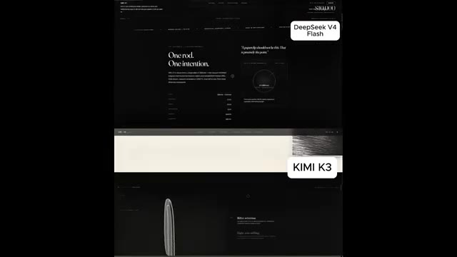
*Capture d'écran montrant des interfaces sombres de sites web avec les étiquettes DeepSeek V4 Flash et KIMI K3.*

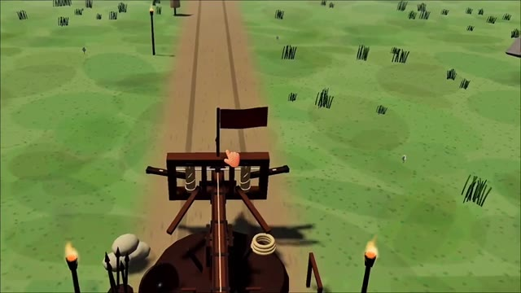
*Vue rapprochée d'une simulation 3D interactive représentant une catapulte ou une baliste sur un chemin enherbé.*

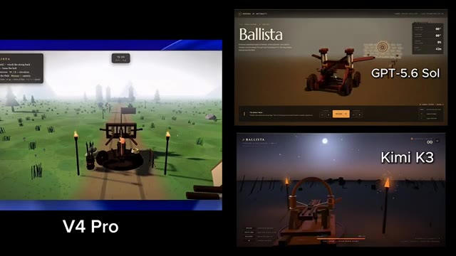
*Comparatif à l'écran montrant l'interface V4 Pro à gauche, ainsi que GPT-5.6 Sol et Kimi K3 à droite.*

---

### ⏱️ `[00:04:09 - 00:04:28]` | Segment #12

**🔊 Audio (Transcription Intégrale Mot pour Mot en Français) :**
> Tout de suite, vous pouvez voir le souci du détail amélioré, des tentes et du feu de camp jusqu'à la composition globale de la scène. Si ces premiers résultats sont un indicateur, DeepSeek V4 Pro s'annonce très prometteur. Voici un autre résultat de DeepSeek V4 Pro. En ce moment, il y a beaucoup de discussions autour de l'API.

**👁️ Analyse Visuelle d'Écran (gemini-3.5-flash-lite) :**
**Interface & Outils** : Interface de comparaison comparative de modèles d'IA et environnement de simulation 3D interactive (type jeu vidéo ou banc de test technique).

**Contenu textuel & Code** : Textes visibles : "V4 Pro", "GPT-5.6 Sol", "Kimi K3", "Ballista", commandes WASD, score et statistiques de tir.

**Action / Démonstration** : Comparaison visuelle des performances graphiques et physiques de différents modèles d'IA (DeepSeek V4 Pro, GPT-5.6 Sol, Kimi K3) sur une simulation de baliste et de stand de tir.

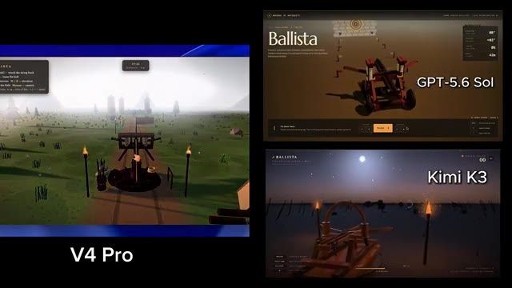
*Comparaison multi-modèles montrant une simulation de baliste avec DeepSeek V4 Pro, GPT-5.6 Sol et Kimi K3.*

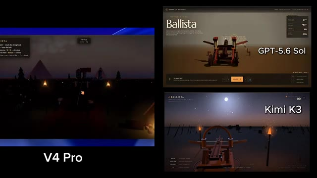
*Évolution de la simulation de baliste avec DeepSeek V4 Pro dans un décor nocturne, aux côtés de GPT-5.6 Sol et Kimi K3.*

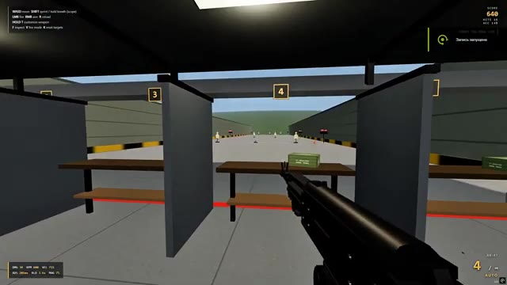
*Vue à la première personne dans un stand de tir virtuel simulant une arme de type AK-47 avec indicateurs de score et commandes.*

---

### ⏱️ `[00:04:28 - 00:04:48]` | Segment #13

**🔊 Audio (Transcription Intégrale Mot pour Mot en Français) :**
> Plusieurs personnes sur X ont suggéré que cela pourrait être acheminé vers Fable 5, ce qui pourrait expliquer le bond des performances. Si c'est vrai, les améliorations ont du sens. Mais si ce n'est pas acheminé vers Fable 5, alors DeepSeek a peut-être construit un modèle encore plus puissant que Kimi K3. Quoi qu'il en soit, cela vaut la peine de garder un œil dessus jusqu'à ce que DeepSeek partage officiellement plus de détails.

**👁️ Analyse Visuelle d'Écran (gemini-3.5-flash-lite) :**
**Interface & Outils** : Jeu vidéo de type FPS / simulateur de tir avec un menu de configuration d'armes interactif (Gunsmith).

**Contenu textuel & Code** : Menus de configuration d'armes (Barrel, Muzzle, Optic, Stock, Underbarrel, Magazine, Finish), statistiques de l'arme (Damage, Fire Rate, Control, Accuracy, Handling, Mobility, Reload, Magazine), score en haut à droite (665, 790), indications de touches en haut à gauche (WASD, SHIFT, LMB, RMB, R, HOLD T, F).

**Action / Démonstration** : Le joueur se trouve dans un stand de tir, navigue dans le menu de personnalisation de l'AK-47 pour modifier les accessoires de l'arme et vise les cibles.

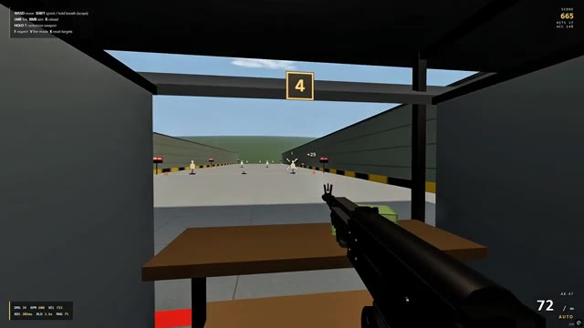
*Vue à la première personne dans un jeu vidéo de tir montrant un stand de tir avec des cibles au loin.*

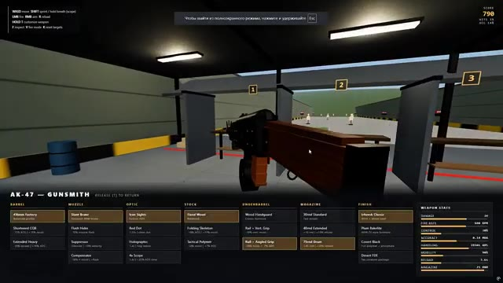
*Interface de personnalisation d'arme (« AK-47 - GUNSMITH ») avec différents composants modifiables affichés en bas de l'écran.*

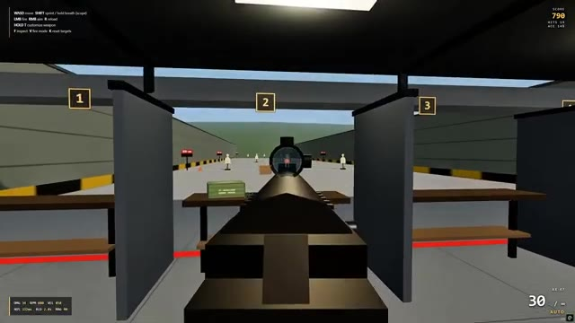
*Vue à la première personne à travers la lunette de visée d'un fusil pointant vers une cible lointaine.*

---

### ⏱️ `[00:04:48 - 00:05:00]` | Segment #14

**🔊 Audio (Transcription Intégrale Mot pour Mot en Français) :**
> C'est tout pour le rapport de recherche d'aujourd'hui. Si vous avez apprécié cette analyse détaillée et que vous souhaitez garder une longueur d'avance sur les derniers modèles, outils et avancées en matière d'IA, assurez-vous de vous abonner à Pursuing AI. Merci d'avoir regardé, et je vous dis à la prochaine.

**👁️ Analyse Visuelle d'Écran (gemini-3.5-flash-lite) :**
**Interface & Outils** : Interface de jeu vidéo de tir avec affichage des scores et des commandes en haut à gauche.

**Contenu textuel & Code** : Texte des commandes (WASD move, SHIFT sprint / hold breath, etc.), score de 1205 en haut à droite, munitions et statistiques de l'arme en bas à gauche et en bas à droite.

**Action / Démonstration** : Visualisation d'une session de jeu ou d'un test de simulation de tir avec une arme de type fusil d'assaut (AK-47).

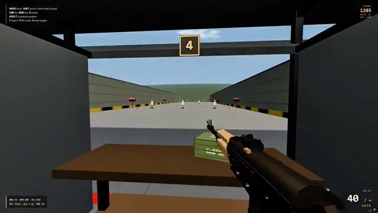
*Capture d'écran montrant un jeu vidéo ou un simulateur de tir à la première personne avec des cibles.*

---
