# 🎬 Qwen 3.8 Max met GPT en difficulté

> **Chaîne** : [Pursuing AI](https://www.youtube.com/@PursuingAi)  
> **Titre original** : `Qwen 3.8 Max Makes GPT In Trouble`  
> **Lien YouTube** : [https://www.youtube.com/watch?v=aAnaH3o6mF4](https://www.youtube.com/watch?v=aAnaH3o6mF4)  
> **Date de publication** : 2026-08-03  
> **Durée** : 03m 51s (`231s`)  
> **Identifiant vidéo** : `aAnaH3o6mF4`  
> **Fiche Web Interactive** : [2026-08-03_YT-aAnaH3o6mF4_Qwen 3.8 Max met GPT en difficulté_by-whisper-v3-large-turbo+gemini-3.5-flash-lite.html](2026-08-03_YT-aAnaH3o6mF4_Qwen 3.8 Max met GPT en difficulté_by-whisper-v3-large-turbo+gemini-3.5-flash-lite.html)  
> **Captures de démonstration clés** : `27 captures réelles (anti-talking-head)`  
> **Modèles utilisés** : Audio: `large-v3-turbo` (Faster-Whisper int8 VPS) | Vision: `gemini-3.5-flash-lite` (Google AI Studio API)  

---

## 📌 Synthèse Exécutive & Outils

### 📌 Résumé
La vidéo de *Pursuing AI* dissèque l'impact tectonique du nouveau modèle d'intelligence artificielle **Qwen 3.8 Max** d'Alibaba, un monstre de 2400 milliards de paramètres à poids ouverts qui bouscule l'hégémonie des géants américains comme OpenAI, Anthropic et Google. L'analyse met en lumière un changement de paradigme fondamental dans l'industrie : on passe de la simple course au meilleur chatbot conversationnel à la conception d'agents capables d'effectuer de véritables travaux d'ingénierie autonome sur de longues périodes. 

Sur le plan technique, la vidéo détaille comment Qwen 3.8 Max combine une architecture massive de mélange d'experts (MoE) — avec seulement 95 milliards de paramètres actifs lors de l'inférence — à une fenêtre de contexte d'un million de jetons et à des capacités multimodales natives (texte, images, vidéo, documents). Le créateur illustre l'efficacité de cette architecture à travers des démonstrations saisissantes : une autonomie de plus de 10 jours en écriture de code sans intervention humaine, et une boucle d'ingénierie fermée pour l'optimisation de conceptions matérielles numériques. 

Pour les créateurs de contenu vidéo et les professionnels de l'IA, cette avancée représente un tournant stratégique majeur. La démocratisation imminente de poids ouverts aussi puissants redéfinit les workflows de production, illustrant comment l'écosystème chinois (aux côtés de DeepSeek, Kimi et GLM) ne se contente plus de rattraper le retard occidental, mais définit désormais la frontière technologique, offrant aux créateurs des outils d'automatisation et de raisonnement multimodal d'une puissance inédite.

### 🛠️ Outils, Modèles & Logiciels Présentés
* **Seedance 2.5** : Utilisé pour la génération et l'optimisation de séquences vidéo dynamiques illustrant le rapport de recherche.
* **Kling 3.0** : Mobilisé pour produire des visuels cinématographiques de haute fidélité renforçant l'immersion narrative de la vidéo.
* **Midjourney** : Employé pour concevoir des illustrations conceptuelles percutantes et des visuels futuristes en début de vidéo.
* **Qwen 3.8 Max** : Le modèle de langage et multimodal central (2,4 billions de paramètres) développé par Alibaba, au cœur de l'analyse stratégique de la vidéo.
* **DeepSeek, Kimi & GLM** : Modèles alternatifs cités pour contextualiser la montée en puissance de l'écosystème d'IA à poids ouverts en provenance de Chine.

### 🔑 Points Clés & Enseignements Stratégiques
* **Transition du chatbot vers l'agent d'exécution** : Le marché délaisse la simple optimisation de réponses textuelles pour se concentrer sur des agents capables d'exécuter de véritables tâches professionnelles complexes.
* **Architecture MoE (Mixture of Experts)** : L'utilisation de 2400 milliards de paramètres bruts dont seulement 95 milliards sont actifs à l'inférence permet de concilier performance de pointe et maîtrise des coûts de calcul.
* **Fenêtre de contexte et multimodalité** : L'intégration d'un million de jetons combinée à la prise en charge native du texte, des images, de la vidéo et des documents redéfinit les standards de l'analyse documentaire.
* **Autonomie à long terme** : La capacité d'un modèle à travailler de manière autonome pendant plus de 10 jours sur un projet informatique marque l'ère des flux de travail auto-itératifs.
* **Boucles de rétroaction fermée** : Qwen démontre une aptitude inédite à compiler, tester, corriger et optimiser des conceptions matérielles de manière répétée sans supervision humaine.
* **Le mythe des benchmarks** : Le créateur rappelle que les graphiques de benchmarks ("la cryptomonnaie de l'IA") sont souvent subjectifs et que l'évaluation réelle doit reposer sur des cas d'usage pratiques et industriels.
* **La percée des poids ouverts** : L'annonce de la publication prochaine des poids complets par Alibaba bouleverse le monopole des modèles propriétaires fermés (OpenAI, Google).
* **Changement géopolitique de l'IA** : L'Amérique ne détient plus seule le monopole de la pointe technologique ; la Chine s'impose désormais comme un acteur majeur définissant les standards mondiaux grâce à l'open source.
* **Gestion des compétences spécialisées** : Bien que dominant en raisonnement multimodal, le modèle reste perfectible sur certains benchmarks spécifiques de génie logiciel (comme SWE Bench Pro), rappelant l'importance d'analyser les forces et faiblesses granulaires.
* **Immersion visuelle par l'IA générative** : Le recours combiné à Seedance et Kling illustre comment illustrer un sujet technique abstrait (architecture de modèles, paramètres) à travers une esthétique de science-fiction hautement engageante.

---

## ⏱️ Chronologie & Transcription Complète Audio & Visuelle (Mot pour Mot)

### ⏱️ `[00:00:00 - 00:00:22]` | Segment #01

**🔊 Audio (Transcription Intégrale Mot pour Mot en Français) :**
> Qwen 3.8 Max vient de changer la course à l'intelligence artificielle pour toujours. Il y a deux semaines, tout le monde se disputait pour savoir qui avait le modèle d'IA le plus intelligent. OpenAI, Anthropic, Google. Puis Alibaba a débarqué et a lâché l'air de rien un monstre de 2400 milliards de paramètres qui pourrait bien être le modèle d'IA à poids ouverts le plus ambitieux jamais construit.

**👁️ Analyse Visuelle d'Écran (gemini-3.5-flash-lite) :**
**Interface & Outils** : Interface de site web de présentation de modèle d'IA (Qwen) et éditeur de code / interface de développement sur ordinateur portable.

**Contenu textuel & Code** : Texte de présentation : "Today, we are officially releasing Qwen 3.8-Max, the most capable model in the Qwen family to date... 2.4T parameters (958 active)...", lignes de code source et graphiques de benchmarks (SWE-Pro, TerminalBench-2.1, PaperBench, FrontierSWE).

**Action / Démonstration** : Défilement de la page web officielle d'annonce de Qwen 3.8-Max et affichage de séquences de démonstration technique.

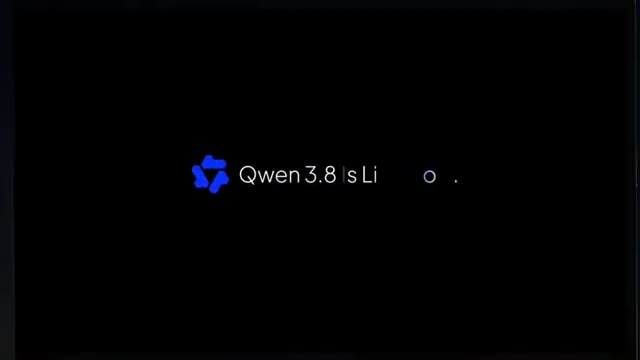
*Écran noir affichant le logo Qwen et le texte d'introduction "Qwen 3.8 is Li...".*

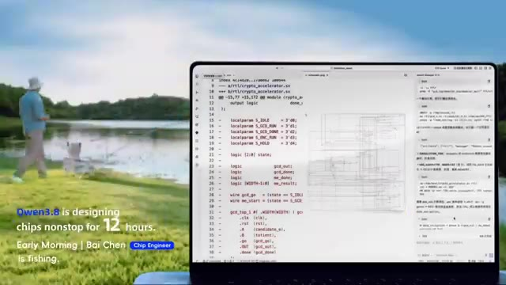
*Ordinateur portable affichant du code informatique et un schéma de conception de puces, avec en arrière-plan un paysage de lac et le texte explicatif "Qwen3.8 is designing chips nonstop for 12 hours. Early Morning | Bai Chen Chip Engineer is fishing."*

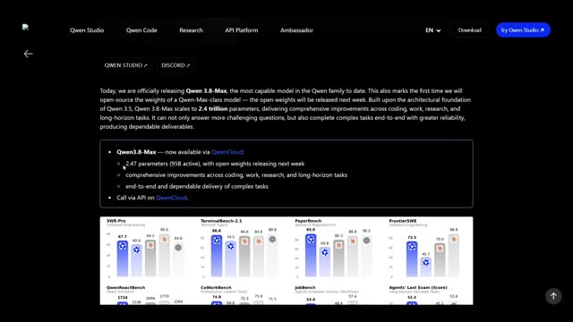
*Page web officielle de présentation de Qwen 3.8-Max détaillant ses 2,4 trillions de paramètres et ses graphiques de performance comparative.*

---

### ⏱️ `[00:00:22 - 00:00:42]` | Segment #02

**🔊 Audio (Transcription Intégrale Mot pour Mot en Français) :**
> Non pas parce qu'il écrit de meilleurs e-mails, non pas parce qu'il obtient un score plus élevé sur un autre benchmark "Trust Me Bro", mais parce que ce truc a passé plus de 10 jours à construire du code de manière autonome, a optimisé des conceptions matérielles à travers des centaines d'itérations d'ingénierie, et peut littéralement observer son propre écran pour corriger des erreurs tout en travaillant.

**👁️ Analyse Visuelle d'Écran (gemini-3.5-flash-lite) :**
**Interface & Outils** : Interface de développement et de démonstration d'IA avec affichage de code, visualiseur de structure moléculaire 3D et tableau de bord statistique.

**Contenu textuel & Code** : Sur l'image 1 : code Python, structure cristalline 3D et textes "Qwen3.8 is verifying protein sources." et "Noon | Leon Biology Professor is playing tennis.". Sur l'image 2 : "16 Days Autonomous Coding", "172 Issues | 127 PRs | 265 Commits", "Building oh-my-cli harness", "As of the making of this video".

**Action / Démonstration** : Démonstration visuelle des capacités d'un modèle d'IA effectuant du codage autonome et analysant des données biologiques en parallèle d'une activité de tennis virtuelle.

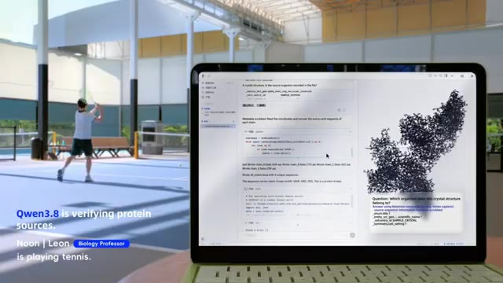
*Un ordinateur portable affichant une interface d'analyse de protéines et de code, avec en arrière-plan une personne jouant au tennis.*

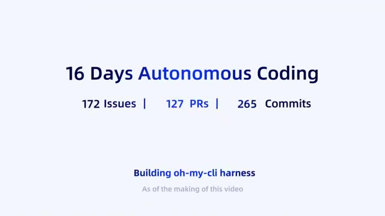
*Un écran de synthèse textuelle affichant les statistiques de développement : "16 Days Autonomous Coding" avec 172 Issues, 127 PRs et 265 Commits.*

---

### ⏱️ `[00:00:43 - 00:01:03]` | Segment #03

**🔊 Audio (Transcription Intégrale Mot pour Mot en Français) :**
> Selon Alibaba, il combine un mélange massif d'architectures d'experts avec un contexte d'un million de jetons, une compréhension multimodale, et prévoit de publier les poids publiquement la semaine prochaine. Si ces affirmations se vérifient, la course à l'IA vient de devenir beaucoup plus intéressante. C'est Pursuing AI et vous regardez le rapport de recherche.

**👁️ Analyse Visuelle d'Écran (gemini-3.5-flash-lite) :**
**Interface & Outils** : Écrans de démonstration technique et graphique de présentation de l'IA (animation de concepts et modélisation).

**Contenu textuel & Code** : Textes visibles : "Everything It Sees", "Inputs", "Science Question Photo", "Raw Video Clips", et en bas à droite "Process visualization - final 3D model generated by Qwen 3.8-Max".

**Action / Démonstration** : Présentation visuelle des fonctionnalités d'entrée et de compréhension multimodale d'un modèle d'intelligence artificielle.

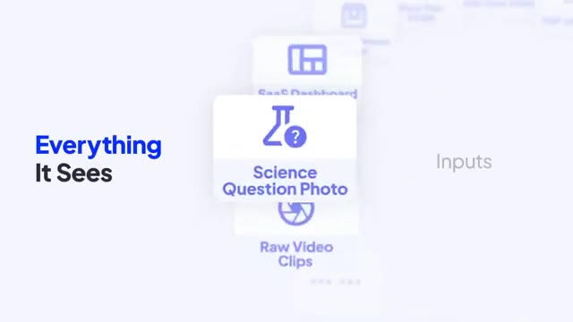
*Interface animée présentant les différentes capacités multimodales d'entrée sous le titre "Everything It Sees".*

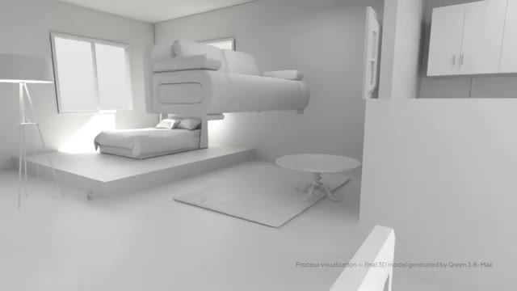
*Visualisation 3D d'un intérieur de pièce montrant le processus de modélisation par Qwen 3.8-Max.*

---

### ⏱️ `[00:01:04 - 00:01:24]` | Segment #04

**🔊 Audio (Transcription Intégrale Mot pour Mot en Français) :**
> Pendant la dernière année, chaque modèle de pointe a poursuivi le même objectif. Construire un meilleur chatbot. Qwen semble avoir une idée différente. Au lieu de rendre l'IA meilleure pour répondre aux questions, ils essaient de la rendre meilleure pour effectuer de véritables travaux. Les chiffres phares sont absurdes. 2,4 billions de paramètres.

**👁️ Analyse Visuelle d'Écran (gemini-3.5-flash-lite) :**
**Interface & Outils** : Interface logicielle de développement/visualisation (Image 1), traitement de texte/documents (Image 2), et site web officiel de Qwen Studio / Qwen 3.8-Max (Image 3).

**Contenu textuel & Code** : Sur l'image 1 : Texte « Qwen3.8 is generating contracts automatically. Evening | An An Lawyer is unwinding outdoors. » Sur l'image 2 : Texte « Always-on Workmate ». Sur l'image 3 : Texte de présentation « Today, we are officially releasing Qwen 3.8-Max, the most capable model in the Qwen family to date... 2.4 trillion parameters... » ainsi que divers graphiques de benchmarks (SWE-Pro, TerminalBench-2.1, PaperBench, FrontierSWE, etc.).

**Action / Démonstration** : Présentation visuelle et démonstration des capacités de Qwen à travers des interfaces de travail, des cas d'usage juridiques et des spécifications techniques de modèles d'IA.

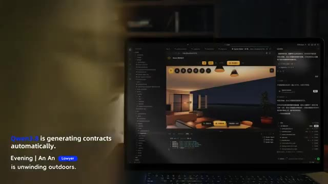
*Un ordinateur portable affichant une interface logicielle avec des visualisations et du code, accompagné d'un texte incrusté concernant la génération automatique de contrats par Qwen3.8.*

*Un ordinateur portable posé à l'extérieur sur une table de camping la nuit, affichant des documents textuels à l'écran.*

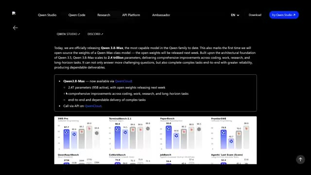
*Une page web officielle de Qwen détaillant la sortie de Qwen 3.8-Max avec des graphiques de performance et ses caractéristiques techniques.*

---

### ⏱️ `[00:01:25 - 00:01:43]` | Segment #05

**🔊 Audio (Transcription Intégrale Mot pour Mot en Français) :**
> Seulement environ 95 milliards d'experts sont actifs lors de l'inférence, ce qui maintient le coût de calcul gérable tout en offrant des performances de niveau supérieur. Il accepte le texte, les images, la vidéo et les documents, prend en charge une fenêtre de contexte d'un million de jetons, et Alibaba affirme que les poids ouverts arrivent bientôt.

**👁️ Analyse Visuelle d'Écran (gemini-3.5-flash-lite) :**
**Interface & Outils** : Interface web de présentation technique de QWen Studio et interface de développement logiciel (IDE/éditeur de code).

**Contenu textuel & Code** : Texte sur QWen 3.8-Max (2.4T parameters, 958 active), graphiques de performance (SWE-Pro, TerminalBench-2.1), icônes d'entrées multiples (PDF, 100-hour Video, Floor Plan Image) et panneau de contrôles de débogage.

**Action / Démonstration** : Navigation à travers la documentation technique et affichage des capacités multimodales du modèle d'intelligence artificielle.

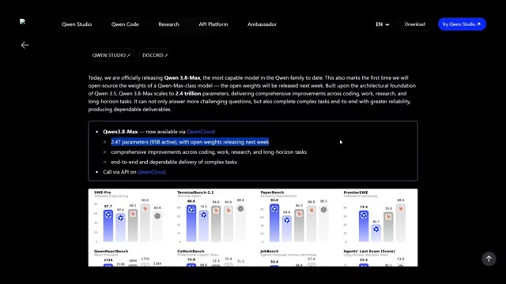
*Page de présentation de QWen 3.8-Max détaillant ses performances et ses paramètres.*

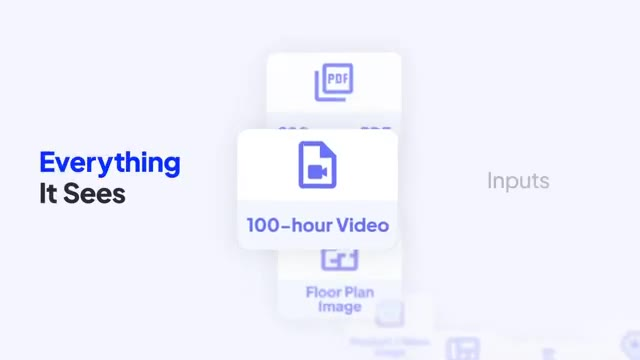
*Illustration des types d'entrées acceptées (« Everything It Sees »), incluant une vidéo de 100 heures.*

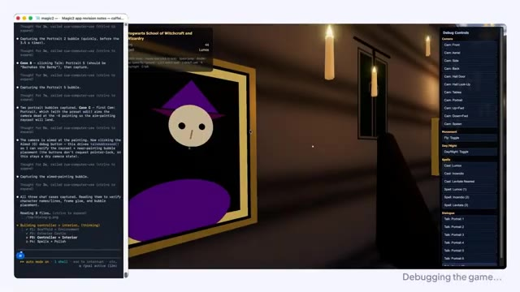
*Interface de débogage et de développement d'un jeu ou d'une application avec fenêtres de code et de contrôle.*

---

### ⏱️ `[00:01:43 - 00:02:06]` | Segment #06

**🔊 Audio (Transcription Intégrale Mot pour Mot en Français) :**
> Mais la taille brute n'est pas la partie intéressante. La partie intéressante est ce qu'ils ont réellement testé. Au lieu de demander au modèle de résoudre un autre examen de mathématiques, Alibaba lui a donné de vrais problèmes d'ingénierie. Une démonstration a montré le modèle travaillant de manière autonome pendant plus de 10 jours, en partant d'un projet vide et en améliorant continuellement le logiciel sans intervention humaine.

**👁️ Analyse Visuelle d'Écran (gemini-3.5-flash-lite) :**
**Interface & Outils** : Environnement de développement logiciel avec terminal intégré et interface de jeu 3D, application de démonstration médicale 3D, et diapositives de présentation.

**Contenu textuel & Code** : Texte affiché : "magic2", "Debugging the game...", "Hogwarts School of Witchcraft and Wizardry", "16 Days Autonomous Coding", "172 Issues | 127 PRs | 265 Commits", "Building oh-my-cli harness".

**Action / Démonstration** : Débogage d'un jeu vidéo par intelligence artificielle, visualisation d'exercices de rééducation en 3D, et affichage de statistiques de performances de codage autonome.

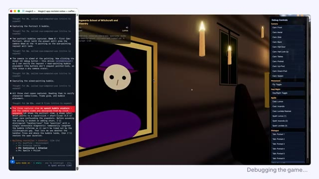
*Interface de développement avec une console de code à gauche et un environnement 3D affichant un jeu en cours de débogage ("Debugging the game...").*

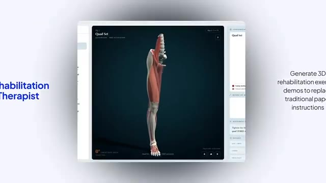
*Interface de démonstration 3D médicale montrant un modèle anatomique de jambe avec les muscles pour la rééducation ("Quad Set").*

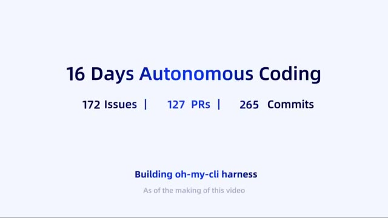
*Diapositive résumant les statistiques de codage autonome sur 16 jours avec 172 problèmes, 127 PRs et 265 commits.*

---

### ⏱️ `[00:02:06 - 00:02:28]` | Segment #07

**🔊 Audio (Transcription Intégrale Mot pour Mot en Français) :**
> Une autre montrait la conception de matériel numérique dans une boucle d'ingénierie fermée, compilant, testant, corrigeant et optimisant de manière répétée jusqu'à ce que le circuit se réduise considérablement tout en respectant les contraintes de synchronisation. Ces démonstrations sont présentées par Alibaba comme des exemples d'ingénierie autonome à long terme plutôt que de simples interactions avec des chatbots.

**👁️ Analyse Visuelle d'Écran (gemini-3.5-flash-lite) :**
**Interface & Outils** : Éditeur de code (VS Code ou similaire) et interface de réseau social (style X/Twitter).

**Contenu textuel & Code** : Texte « Init Oh-my-cli with Qwen3.8-Max self-testing » et lignes de code source TypeScript. Texte « Autonomous Exploration to Continuous Evolution » avec un flux de publications sur l'exploration autonome et des objectifs persistants (« /goal all tests pass and list is clean »).

**Action / Démonstration** : Présentation de lignes de code informatique en cours d'auto-test, suivie d'une interface montrant des publications sur l'exploration et l'évolution autonomes des agents d'IA.

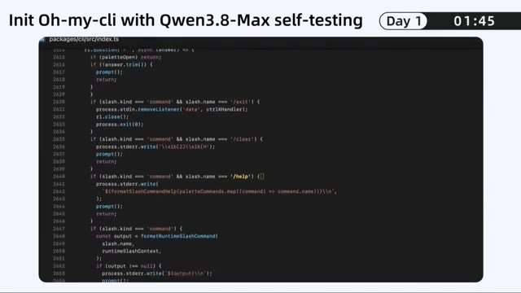
*Éditeur de code affichant un fichier TypeScript avec l'initialisation de Oh-my-cli par Qwen3.8-Max.*

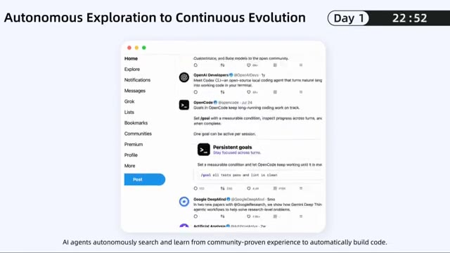
*Interface de type réseau social affichant des publications sur l'exploration autonome et l'évolution continue.*

---

### ⏱️ `[00:02:28 - 00:03:01]` | Segment #08

**🔊 Audio (Transcription Intégrale Mot pour Mot en Français) :**
> C'est un point de comparaison très différent. Parce qu'écrire du code est une chose, mais déboguer, tester, refactoriser, trouver ses propres erreurs, et répéter ce processus des centaines de fois sans abandonner, cela commence à ressembler beaucoup plus à un ingénieur qu'à de l'autocomplétion. Et selon les résultats des benchmarks d'Alibaba, QEN 3.8 Max obtient également des performances compétitives par rapport aux meilleurs modèles propriétaires en matière de raisonnement multimodal, de compréhension de documents et de plusieurs évaluations axées sur les agents, tout en restant à la traîne sur certains benchmarks de génie logiciel comme

**👁️ Analyse Visuelle d'Écran (gemini-3.5-flash-lite) :**
**Interface & Outils** : Interface utilisateur de chat textuel, application de développement de bureau et tableau de benchmarks de performance de modèles d'IA.

**Contenu textuel & Code** : Texte affichant "One Message, A Desktop App", "@User @Qwen3.8-Max We need a desktop task center. Let's make it happen.", "Got it", ainsi que de multiples graphiques de benchmarks (SWE-Pro, TerminalBench-2.1, PaperBench, FrontierSWE, QwenReactBench, CoWorkBench, JobBench, Agents' Last Exam, BabyVision, CharXiv, ERQA, PerceptionBench, LVBench, Vision2Web, MobileWorld, OSWorld-Verified) avec des scores comparatifs pour Qwen 3.8 Max, Qwen 3.7 Max, Opus4.8, Fable5, Gemini 3.1-Pro, et GPT5.6 Sol.

**Action / Démonstration** : Affichage successif d'une conversation de requête utilisateur, d'un espace de travail de génération d'application (système solaire en rendu 3D), puis d'un tableau récapitulatif des performances des benchmarks d'évaluation.

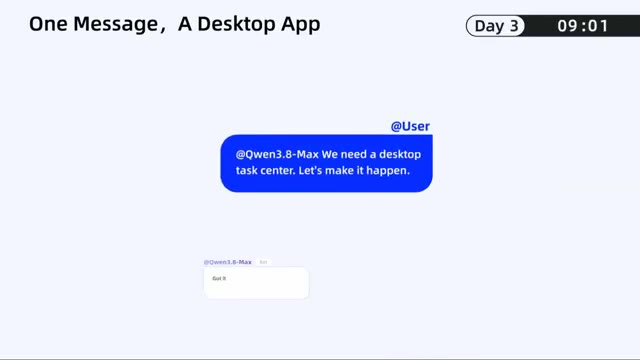
*Interface d'interaction textuelle avec Qwen3.8-Max montrant la demande d'une application de bureau.*

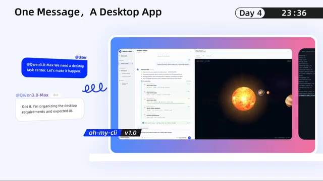
*Interface de développement montrant la création d'une simulation du système solaire en 3D avec Qwen3.8-Max.*

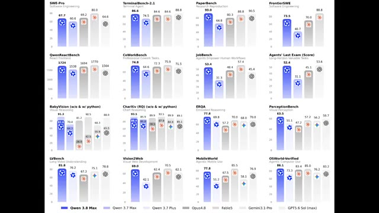
*Tableau comparatif complet des performances de Qwen 3.8 Max par rapport à d'autres modèles sur divers benchmarks.*

---

### ⏱️ `[00:03:01 - 00:03:20]` | Segment #09

**🔊 Audio (Transcription Intégrale Mot pour Mot en Français) :**
> SWE Bench Pro. Maintenant, les graphiques de benchmarks sont fondamentalement la cryptomonnaie de l'IA. Tout le monde en a un, personne n'est d'accord sur celui qui compte. Mais la plus grande histoire n'est pas de savoir si Quen est numéro un. C'est que la Chine ne court plus après la frontière. Elle contribue à la définir.

**👁️ Analyse Visuelle d'Écran (gemini-3.5-flash-lite) :**
**Interface & Outils** : Interface logicielle de développement/interface utilisateur web de documentation ou d'outil de code.

**Contenu textuel & Code** : Image 1 : "Day 6", "01:50", "Keep Evolving oh-my-cli", et une liste de commits Git (feat(cli): surface...). Image 2 : Titres de chapitres "A Brief History of Geologic Time", "Continents Ranked by Area", "Major Climate Types", et la section centrale "02 Geography • Earth & Nature".

**Action / Démonstration** : Affichage d'interfaces de développement logiciel suivies d'une vue d'ensemble de plusieurs documents ou graphiques de cours/documentation organisés en grille.

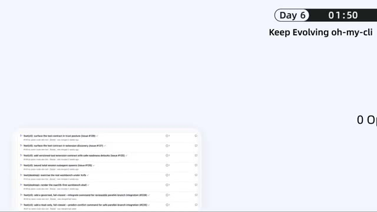
*Interface de développement montrant le projet 'oh-my-cli' avec un journal de commits et des statistiques de temps (Day 6, 01:50).*

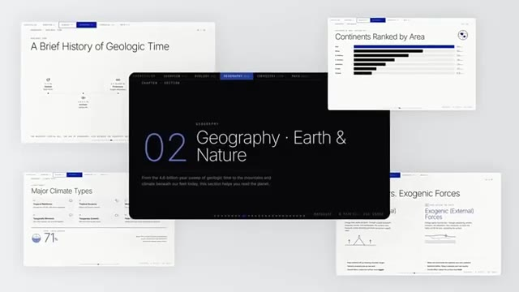
*Présentation multi-fenêtres de documents et graphiques éducatifs incluant 'A Brief History of Geologic Time', 'Continents Ranked by Area' et 'Geography - Earth & Nature'.*

---

### ⏱️ `[00:03:20 - 00:03:39]` | Segment #10

**🔊 Audio (Transcription Intégrale Mot pour Mot en Français) :**
> Pendant des années, l'hypothèse était simple. L'Amérique construit les modèles de pointe. La Chine construit des copies moins chères. Cette hypothèse devient de plus en plus difficile à défendre. Entre DeepSeq, Kimi, GLM, et maintenant Quen 3.8 Max, l'IA à poids ouverts devient le plus grand avantage concurrentiel de la Chine.

**👁️ Analyse Visuelle d'Écran (gemini-3.5-flash-lite) :**
**Interface & Outils** : Interface logicielle de tableaux de bord et d'analyse financière interactive (sans rapport direct avec le sujet textuel de la vidéo).

**Contenu textuel & Code** : Textes visibles : "HARBO", "RIVE", "10", "8", "1:13", "BUSINESS PLAN ROADMAP", "I'm a Commercial Operations Director. Build dynamic business roadmaps for me.", "Financial Analyst", ainsi que divers symboles boursiers (MSFT, AMZN, NVDA, AAPL, etc.).

**Action / Démonstration** : Défilement et affichage successifs d'interfaces logicielles d'analyse et de gestion de données.

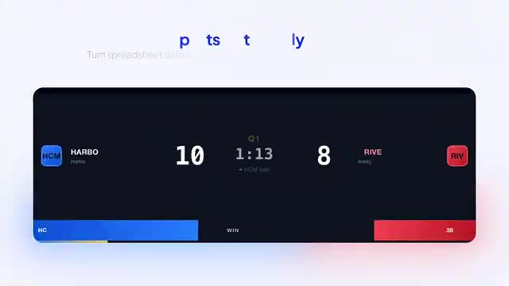
*Interface d'un tableau de bord affichant un score en direct entre deux équipes, Harbo et Rive.*

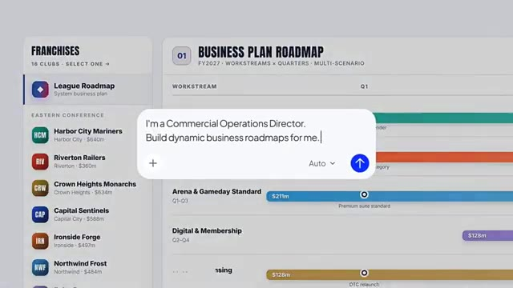
*Interface de planification avec une boîte de dialogue pour créer des feuilles de route opérationnelles dynamiques.*

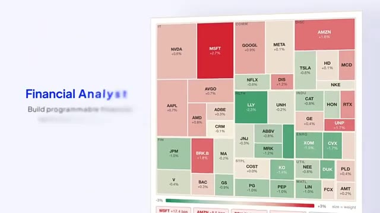
*Carte thermique financière (treemap) représentant les performances boursières de différentes grandes entreprises.*

---

### ⏱️ `[00:03:39 - 00:03:50]` | Segment #11

**🔊 Audio (Transcription Intégrale Mot pour Mot en Français) :**
> Et si Alibaba publie réellement les pondérations complètes la semaine prochaine, le plus grand lancement d'IA de l'été pourrait bien ne pas venir d'OpenAI, d'Anthropic ou de Google. Il pourrait venir de Hangzhou.

**👁️ Analyse Visuelle d'Écran (gemini-3.5-flash-lite) :**
**Interface & Outils** : Interface de dialogue épurée superposée à un tableau de bord financier.

**Contenu textuel & Code** : Texte affiché dans la bulle : « I'm a Full Stack Engineer. Build production-ready apps for me. » On y voit également un bouton d'ajout (+), un sélecteur de mode « Auto » et un bouton de validation fléché vers le haut sur fond bleu.

**Action / Démonstration** : Affichage d'une invite textuelle (prompt) invitant l'intelligence artificielle à concevoir des applications prêtes pour la production, superposée à des données boursières.

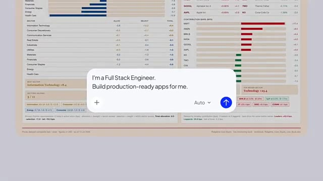
*Interface de type chatbot affichant une bulle de texte avec un prompt sur fond de graphiques financiers.*

---
