# 🎬 Est-ce que Qwen 3.8 Max peut battre Fable 5 ?

> **Chaîne** : [Pursuing AI](https://www.youtube.com/@PursuingAi)  
> **Titre original** : `Can Qwen 3.8 Max Beat Fable 5?`  
> **Lien YouTube** : [https://www.youtube.com/watch?v=yzNl4SLoSDI](https://www.youtube.com/watch?v=yzNl4SLoSDI)  
> **Date de publication** : 2026-08-05  
> **Durée** : 03m 55s (`235s`)  
> **Identifiant vidéo** : `yzNl4SLoSDI`  
> **Fiche Web Interactive** : [2026-08-05_YT-yzNl4SLoSDI_Est-ce que Qwen 3.8 Max peut battre Fable 5_by-whisper-v3-large-turbo+gemini-3.5-flash-lite.html](2026-08-05_YT-yzNl4SLoSDI_Est-ce que Qwen 3.8 Max peut battre Fable 5_by-whisper-v3-large-turbo+gemini-3.5-flash-lite.html)  
> **Captures de démonstration clés** : `26 captures réelles (anti-talking-head)`  
> **Modèles utilisés** : Audio: `large-v3-turbo` (Faster-Whisper int8 VPS) | Vision: `gemini-3.5-flash-lite` (Google AI Studio API)  

---

## 📌 Synthèse Exécutive & Outils

### 📌 Résumé
Cette vidéo de *Pursuing AI*, intitulée « Est-ce que Qwen 3.8 Max peut battre Fable 5 ? », propose une analyse comparative de terrain rigoureuse, s'affranchissant des simples benchmarks marketing pour évaluer les performances en conditions réelles de grands modèles d'intelligence artificielle. Plutôt que de se fier aux arguments théoriques, le créateur s'appuie sur des cas d'usage pratiques partagés par la communauté sur X (anciennement Twitter). L'objectif est de confronter le nouveau modèle open-weights **Qwen 3.8 Max** (transcrit phonétiquement « QN ») face à des cadors de l'industrie comme **Claude (notamment Opus 5 et Fable 5)**, Kimi K3 et GPT 5.6, à travers des défis créatifs et techniques exigeants. 

La méthodologie du créateur s'articule autour d'une revue séquentielle de tests concrets menés par des utilisateurs indépendants. Le rapport explore d'abord des tâches de créativité visuelle (comme interpréter la silhouette d'un animal à partir de nuages), puis monte en puissance vers des défis de programmation et de modélisation 3D complexes via du code (HTML, physique interactive, et Three.js). Chaque comparaison est décortiquée en analysant les rendus visuels, la précision physique, le respect des contraintes des prompts, ainsi que l'efficience économique et technique mesurée par le nombre de tokens consommés et le coût de génération.

Pour les créateurs de vidéo et les développeurs, les bénéfices de cette analyse sont majeurs. Elle démontre l'émergence fulgurante des modèles d'IA à poids ouverts (« open-weights ») capables de rivaliser, voire de surpasser, les solutions propriétaires les plus onéreuses sur des tâches de génération de scènes 3D interactives. Le rapport met en lumière un ratio performance/coût extrêmement favorable pour Qwen 3.8 Max, qui se montre non seulement plus détaillé et réaliste dans ses animations physiques (gestion des collisions, éclairages, textures), mais également nettement plus économique à l'utilisation que Claude Fable 5, redéfinissant ainsi les standards de production pour le prototypage rapide et le web design génératif.

### 🛠️ Outils, Modèles & Logiciels Présentés
* **Claude (Opus 5 / Fable 5 / Fable 5 High)** : Modèle d'intelligence artificielle propriétaire de pointe, utilisé comme référence haut de gamme pour la génération de code 3D, le design artistique et le respect de prompts complexes, malgré un coût d'exécution parfois élevé.
* **Qwen 3.8 Max** : Modèle d'IA à poids ouverts (« open-weights ») haute performance, qui surprend par sa capacité à produire des rendus 3D photoréalistes et des simulations physiques complexes à un coût très inférieur à ses concurrents.
* **Kimi K3** : Modèle d'IA alternatif testé dans le cadre d'exercices de créativité visuelle et d'interprétation de formes naturelles.
* **GPT 5.6** : Modèle d'IA générative inclus dans les comparatifs initiaux de créativité graphique sur des tâches d'association d'idées visuelles.
* **X (Twitter)** : Plateforme de veille et source primaire d'où sont extraites les comparaisons côte à côte partagées par la communauté d'experts.
* **HTML / Three.js** : Technologies web et bibliothèques de rendu 3D utilisées pour évaluer la capacité des IA à générer du code fonctionnel, interactif et doté de lois physiques autonomes.

### 🔑 Points Clés & Enseignements Stratégiques
* **Dépassement des benchmarks théoriques** : L'analyse démontre la nécessité de juger les modèles d'IA sur des cas d'usage réels et complexes plutôt que sur des arguments marketing ou des scores de laboratoires isolés.
* **L'essor des modèles open-weights** : Qwen 3.8 Max prouve qu'un modèle à poids ouverts peut désormais rivaliser directement et surpasser des architectures propriétaires de pointe comme celles de Claude.
* **Disparité saisissante du ratio coût/performance** : Sur un défi de construction 3D identique, Qwen 3.8 Max a coûté seulement 0,28 $ (pour ~46,6k tokens) contre 1,93 $ pour Fable 5 (pour ~38,7k tokens), illustrant une efficacité économique redoutable.
* **Maîtrise supérieure de la physique et des animations** : Qwen intègre des détails cinématiques absents chez ses concurrents, comme l'animation des billes soulevées mécaniquement dans une machine plutôt qu'une simple apparition par téléportation.
* **Vigilance sur la rigueur géométrique** : Les tests sur Three.js révèlent que certains modèles (comme Fable 5 sur la scierie) peuvent commettre des erreurs grossières de collision, les objets traversant littéralement les éléments structurels de décor.
* **Excellence dans le rendu photoréaliste en Three.js** : Face à des prompts exigeants (station d'épuration ou maison en porte-à-faux), Qwen et Claude affichent tous deux un niveau de détail, de matériaux et d'éclairage impressionnant, validant l'utilisation de l'IA pour le prototypage architectural.
* **Importance de l'interprétation créative** : Les tests d'imagerie (formes de nuages) montrent que chaque modèle possède une sensibilité artistique propre (style coloré pour Claude, interprétation naturaliste pour Qwen), utile selon la direction artistique recherchée.
* **Optimisation des prompts complexes** : L'utilisation de prompts exigeants et multicritères (génération de scènes autonomes avec physique dans un fichier HTML unique) constitue le test ultime pour départager la fiabilité des modèles de code.
* **Impact des textures et de l'éclairage** : Qwen se distingue par un effort visible sur la micro-détails texturaux et la gestion d'un environnement naturel plus convaincant dans les scènes 3D générées par code.
* **Fiabilité de la veille communautaire** : S'appuyer sur des retours d'utilisateurs indépendants (comme Anne Nguyen ou Harshit sur X) permet d'identifier rapidement les forces cachées et les failles inattendues des nouvelles versions de modèles.

---

## ⏱️ Chronologie & Transcription Complète Audio & Visuelle (Mot pour Mot)

### ⏱️ `[00:00:00 - 00:00:19]` | Segment #01

**🔊 Audio (Transcription Intégrale Mot pour Mot en Français) :**
> Est-ce que QN 3.8 Max peut réellement battre Claude Fabel 5 ? Aujourd'hui, nous ne regardons pas les benchmarks ou les arguments marketing. À la place, nous examinons de vraies comparaisons côte à côte partagées par des personnes sur X pour voir quel modèle est plus performant en conditions réelles. C'est Pursuing AI et vous regardez The Research Report. Découvrons-le.

**👁️ Analyse Visuelle d'Écran (gemini-3.5-flash-lite) :**
**Interface & Outils** : Écrans de comparatifs visuels de modèles d'IA, interface de l'émission 'The Research Report' de la chaîne Pursuing AI.

**Contenu textuel & Code** : Texte affiché : "Qwen3.8-Max", "Kimi K3", "GPT 5.6 Sol", "Claude Opus 5", "Experimented with TypingMind.com", "Qwen 3.8 new checkpoint Kinsley", "Claude Fable 5 High", "QWEN 3.8 MAX", "OPUS 5", "KIMI K3", "GPT-5.6 SOL", et le titre "The Re[search Report]" avec un cerveau et une puce PAI.

**Action / Démonstration** : Présentation visuelle de tests comparatifs côte à côte entre plusieurs grands modèles d'intelligence artificielle sur des tâches de génération visuelle et 3D.

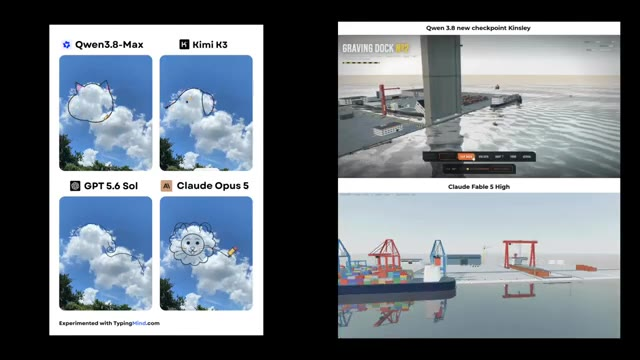
*Comparaison de quatre modèles d'IA (Qwen3.8-Max, Kimi K3, GPT 5.6 Sol, Claude Opus 5) générant des formes de nuages, ainsi qu'une démonstration comparative de rendus 3D de ports.*

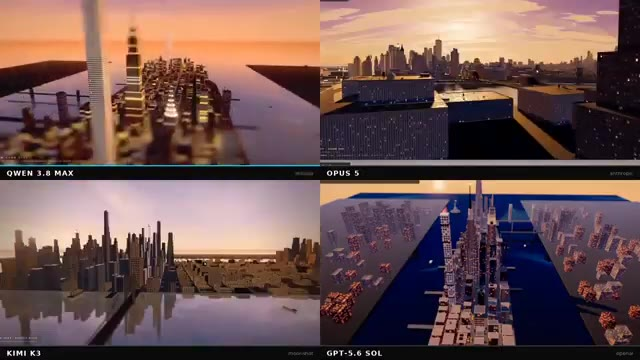
*Grille à quatre quadrants comparant quatre modèles (Qwen 3.8 Max, Opus 5, Kimi K3, GPT-5.6 Sol) générant des environnements urbains en 3D au crépuscule.*

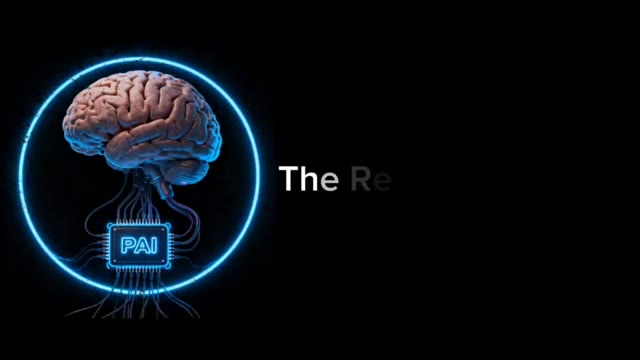
*Écran titre de l'émission 'The Research Report' avec le logo animé de Pursuing AI représentant un cerveau connecté à une puce informatique entourée d'un anneau néon bleu.*

---

### ⏱️ `[00:00:19 - 00:00:39]` | Segment #02

**🔊 Audio (Transcription Intégrale Mot pour Mot en Français) :**
> Tout d'abord, voici une publication d'Anne Nguyen. Elle a téléchargé une photo du ciel sur QN 3.8 Max, Claude Opus 5, Kimi K3 et GPT 5.6, puis leur a lancé un défi simple : dessiner la silhouette d'un animal en se basant sur la forme des nuages. Et honnêtement, QN 3.8 Max tire très bien son épingle du jeu face à la concurrence.

**👁️ Analyse Visuelle d'Écran (gemini-3.5-flash-lite) :**
**Interface & Outils** : Interface du réseau social X (anciennement Twitter) affichant un post et une grille comparative d'images générées par IA.

**Contenu textuel & Code** : Texte du post : "Qwen 3.8 Max is actually impressive. Sent a sky pic to it along with Claude Opus 5, Kimi K3, and GPT 5.6 Sol, and asked them to draw an animal silhouette based on the cloud shape. Qwen 3.8 Max is honestly on par with all the other models". Quatre images avec les labels : "Qwen3.8-Max" (chat), "Kimi K3" (chien), "GPT 5.6 Sol", et "Claude Opus 5" (lion). Mention en bas : "Experimented with TypingMind.com".

**Action / Démonstration** : Le créateur présente une publication sur les réseaux sociaux comparant les capacités de plusieurs modèles d'IA à dessiner des silhouettes d'animaux à partir de la forme de nuages sur une photo.

*Capture d'écran d'une publication sur le réseau social X (Twitter) montrant le post d'Anne Nguyen avec les résultats comparatifs de quatre IA sur des images de nuages.*

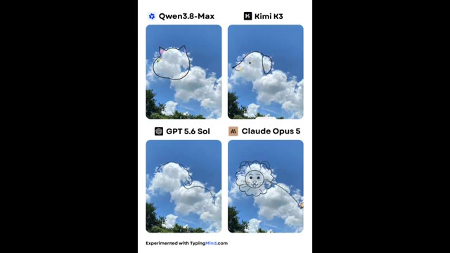
*Gros plan sur la grille comparative des quatre modèles d'intelligence artificielle (Qwen3.8-Max, Kimi K3, GPT 5.6 Sol, Claude Opus 5) illustrant des silhouettes d'animaux dessinées dans le ciel.*

---

### ⏱️ `[00:00:39 - 00:00:59]` | Segment #03

**🔊 Audio (Transcription Intégrale Mot pour Mot en Français) :**
> QN a transformé les nuages en un chat simple et naturel qui s'adapte étonnamment bien à la forme du nuage. Kimi K3 a vu un chien et a, d'une certaine manière, ajouté un soleil aussi. Cloud Opus 5 a également créé un chat, mais avec un style beaucoup plus coloré et artistique. Quant à GPT 5.6, j'essaie toujours de comprendre ce qu'il essayait de viser.

**👁️ Analyse Visuelle d'Écran (gemini-3.5-flash-lite) :**
**Interface & Outils** : Interface de présentation comparative avec quatre panneaux visuels.

**Contenu textuel & Code** : Quatre sections avec les étiquettes : 'Qwen3.8-Max' montrant un chat tracé sur un nuage, 'Kimi K3' montrant un chien avec un soleil, 'GPT 5.6 Sol' montrant une forme animale ambiguë, et 'Claude Opus 5' montrant un lion coloré. Mention en bas : 'Experimented with TypingMind.com'.

**Action / Démonstration** : Affichage comparatif des résultats générés par les différents modèles d'intelligence artificielle à partir de la même forme de nuage de base.

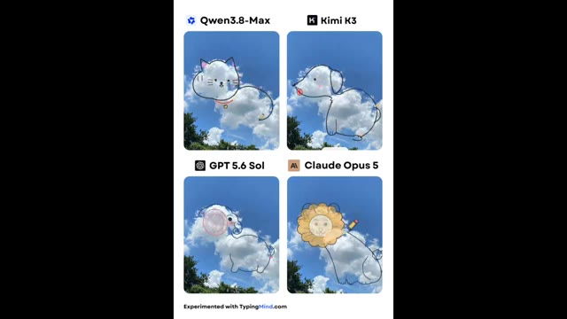
*Comparaison côte à côte de quatre images de nuages transformés en animaux par différents modèles d'IA (Qwen3.8-Max, Kimi K3, GPT 5.6 Sol, Claude Opus 5).*

---

### ⏱️ `[00:00:59 - 00:01:22]` | Segment #04

**🔊 Audio (Transcription Intégrale Mot pour Mot en Français) :**
> Je vous laisse juger par vous-même. Ensuite, voici une comparaison provenant d'Atomic.chat, et celle-ci est vraiment intéressante. Ils ont donné à la fois à QWN 3.8 Max et à Claude Fabel 5 exactement le même défi : construire trois scènes 3D entièrement autonomes dans un seul fichier HTML avec de la vraie physique. Les scènes étaient une machine à billes, une chaîne de montage d'usine automobile et une scierie coupant des bûches en planches.

**👁️ Analyse Visuelle d'Écran (gemini-3.5-flash-lite) :**
**Interface & Outils** : Interface du réseau social X (Twitter) affichant un tweet posté par atomic.chat avec des détails textuels et des suggestions de comptes à suivre.

**Contenu textuel & Code** : Texte du tweet : "Qwen 3.8 Max beat Fabel 5 at building 3D physics scenes for 7x cheaper! We gave two models the same task. Build three self-contained 3D scenes, each one HTML file with real physics that runs itself. Prompts: - A marble machine that lifts marbles up a wheel and drops them on a loop - A car factory assembly line - A sawmill cutting logs into planks. Outputs: Qwen 3.8 Max: 46.6K tokens, $0.28. Fabel 5: 38.7K tokens, $1.93. Qwen worked much harder on the details. Its textures and shadows look real. Fabel 5 built a fast prototype that works and left it there. In the marble machine, Fabel's marbles show up from nowhere at the top of the wheel. In Qwen's, you can see them go up. On the car line, Qwen's cars look much better and more real. Fabel's sawmill is very strange. The saw looks wrong, and the log goes right through a beam before the saw cuts it. Atomic Chat will have day zero support to run Qwen 3.8 Max locally!"

**Action / Démonstration** : Présentation comparative des performances et des coûts entre Qwen 3.8 Max et Fabel 5 pour la génération de code 3D avec physique.

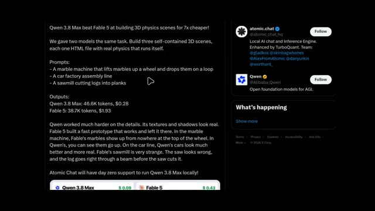
*Capture d'écran d'un tweet et de ses détails comparant les modèles Qwen 3.8 Max et Fabel 5 sur la création de scènes 3D avec physique.*

---

### ⏱️ `[00:01:23 - 00:01:46]` | Segment #05

**🔊 Audio (Transcription Intégrale Mot pour Mot en Français) :**
> Maintenant, voici la partie surprenante. QN a utilisé environ 46,6 mille tokens et a coûté seulement 28 cents, tandis que Fable 5 a utilisé 38,7 mille tokens mais a coûté 1,93 dollar. Quand on regarde les résultats, il est facile de voir où QN a dépensé cet effort supplémentaire. Les textures sont plus détaillées, l'éclairage est plus réaliste et les animations ont l'air beaucoup plus soignées.

**👁️ Analyse Visuelle d'Écran (gemini-3.5-flash-lite) :**
**Interface & Outils** : Interface de type navigateur web / application montrant des comparaisons de modèles d'IA (Atomic Chat, Qwen 3.8 Max, Fable 5) avec rendus 3D interactifs.

**Contenu textuel & Code** : Texte comparatif : "Qwen 3.8 Max beat Fable 5 at building 3D physics scenes for 7x cheaper!", "Outputs: Qwen 3.8 Max: 46.6K tokens, $0.28, Fable 5: 38.7K tokens, $1.93". Rendu visuel comparant "The Perpetual Marble Machine" avec des coûts respectifs de $0.09 et $0.43.

**Action / Démonstration** : Affichage des résultats de performances, des coûts en tokens et de la comparaison visuelle des animations physiques 3D entre les deux modèles d'intelligence artificielle.

*Comparaison textuelle des performances et des coûts entre Qwen 3.8 Max et Fable 5, avec affichage des tokens et de l'analyse détaillée.*

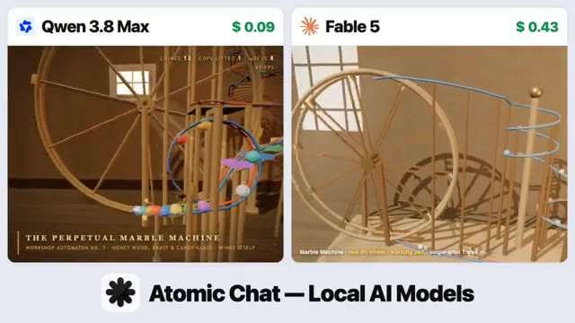
*Comparaison visuelle côte à côte de la simulation 3D (The Perpetual Marble Machine) générée par Qwen 3.8 Max et Fable 5.*

---

### ⏱️ `[00:01:46 - 00:02:05]` | Segment #06

**🔊 Audio (Transcription Intégrale Mot pour Mot en Français) :**
> Prenez la machine à billes par exemple. Dans la version de Fable, les billes apparaissent simplement au sommet de la roue comme si elles s'y étaient téléportées. QN les anime en train d'être soulevées avant de tomber sur la piste, ce qui rend toute la simulation crédible. Le même schéma se poursuit dans l'usine de voitures, où les véhicules de QN ont l'air beaucoup plus réalistes.

**👁️ Analyse Visuelle d'Écran (gemini-3.5-flash-lite) :**
**Interface & Outils** : Interface de comparaison comparative de modèles d'IA avec affichage côte à côte de rendus 3D ("Qwen 3.8 Max" et "Fable 5").

**Contenu textuel & Code** : Texte affiché : "Qwen 3.8 Max" ($ 0.09 / $ 0.09), "Fable 5" ($ 0.43 / $ 0.65), "THE PERPETUAL MARBLE MACHINE", et le logo "Atomic Chat — Local AI Models".

**Action / Démonstration** : Comparaison visuelle de deux rendus de simulations physiques générées par IA (une machine à billes et une usine automobile) pour illustrer les différences de réalisme et de physique.

*Comparaison côte à côte de la simulation de machine à billes entre Qwen 3.8 Max et Fable 5, avec le logo Atomic Chat en bas.*

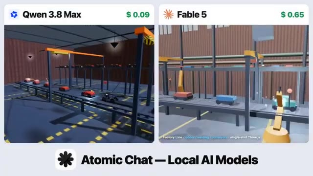
*Comparaison côte à côte d'une simulation d'usine de voitures entre Qwen 3.8 Max et Fable 5, avec le logo Atomic Chat en bas.*

---

### ⏱️ `[00:02:05 - 00:02:23]` | Segment #07

**🔊 Audio (Transcription Intégrale Mot pour Mot en Français) :**
> Et puis il y a la scierie. La version de Fabble est... assez bizarre. La scie n'a pas l'air correcte, et la grume passe littéralement à travers un pilier de support avant d'être coupée. D'après cet exemple, QN 3.8 Max met clairement beaucoup plus d'efforts dans les petits détails, et cela se voit vraiment dans le résultat final.

**👁️ Analyse Visuelle d'Écran (gemini-3.5-flash-lite) :**
**Interface & Outils** : Interface de comparaison de modèles d'IA avec affichage côte à côte de deux simulations de scierie, incluant des indicateurs de prix et le logo "Atomic Chat — Local AI Models".

**Contenu textuel & Code** : Texte "Qwen 3.8 Max ($0.10)" à gauche, "Fable 5 ($0.85)" à droite, interface de simulation "Timberline No.7" avec des compteurs (logs sawed, boards, packs shipped).

**Action / Démonstration** : Comparaison visuelle des performances de deux modèles d'IA générant une simulation de scierie en 3D, mettant en évidence les défauts de collision et de physique dans Fable 5.

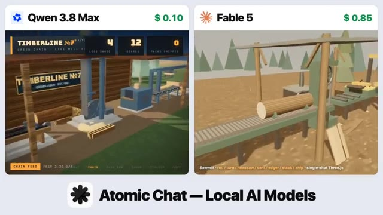
*Comparaison côte à côte entre Qwen 3.8 Max et Fable 5 montrant le fonctionnement d'une scierie générée par IA.*

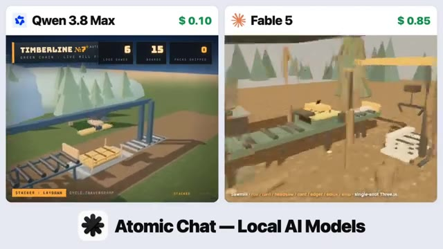
*Comparaison côte à côte entre Qwen 3.8 Max et Fable 5 montrant une étape différente du processus de sciage et de manipulation des grumes.*

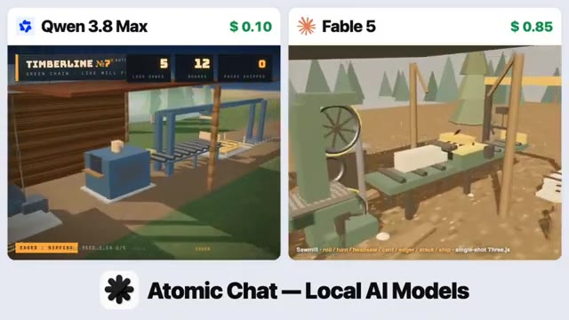
*Comparaison côte à côte entre Qwen 3.8 Max et Fable 5 montrant les détails de coupe et les mécanismes de la scierie.*

---

### ⏱️ `[00:02:23 - 00:02:41]` | Segment #08

**🔊 Audio (Transcription Intégrale Mot pour Mot en Français) :**
> Ensuite vient une publication de Harshit, et la légende a immédiatement attiré mon attention. Nous devons prendre les modèles QN au sérieux. Dans cette comparaison, il a testé le nouveau QN 3.8 Max par rapport à Claude Fabel 5 High, en utilisant un prompt exigeant. Créer une station d'épuration d'eau photoréaliste en 3JS.

**👁️ Analyse Visuelle d'Écran (gemini-3.5-flash-lite) :**
**Interface & Outils** : Interface de publication sur le réseau social X (Twitter) intégrant une vidéo de démonstration comparative générée en Three.js avec panneaux de contrôle interactifs.

**Contenu textuel & Code** : Texte du post : "WTF 🤯 we have to take qwen models seriously Qwen 3.8 new checkpoint "kinsley" vs Claude Fable 5 High they lit cooked with this 🔥🔥 > photorealistic water treatment plant in Three.js". Mentions "Riverside Regional Water Reclamation Facility".

**Action / Démonstration** : Le créateur montre une comparaison comparative côte à côte de deux interfaces 3D interactives de stations d'épuration d'eau générées par code à partir d'un prompt complexe.

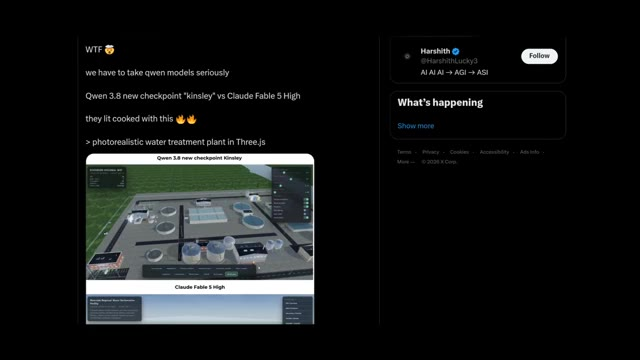
*Capture d'un post Twitter/X de Harshit présentant une comparaison entre le nouveau point de contrôle QN 3.8 Kinsley et Claude Fable 5 High avec le prompt d'une station d'épuration en Three.js.*

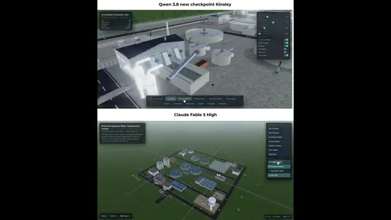
*Comparaison vidéo en écran partagé montrant en haut le rendu de QN 3.8 Kinsley et en bas celui de Claude Fable 5 High.*

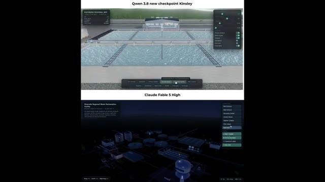
*Gros plan sur l'interface interactive comparant les deux modèles 3JS de station d'épuration d'eau.*

---

### ⏱️ `[00:02:41 - 00:03:01]` | Segment #09

**🔊 Audio (Transcription Intégrale Mot pour Mot en Français) :**
> Et honnêtement, les deux modèles ont assuré à fond. Le niveau de détail, l'éclairage et le réalisme sont impressionnants des deux côtés. C'est un autre exemple qui montre à quel point QN s'est amélioré, jouant des coudes avec l'un des modèles d'IA les plus puissants disponibles. Je vous laisse décider quelle sortie vous préférez. Ensuite, c'est une autre comparaison de Harshit.

**👁️ Analyse Visuelle d'Écran (gemini-3.5-flash-lite) :**
**Interface & Outils** : Interface de comparaison vidéo avec deux fenêtres superposées et affichage d'un post sur le réseau social X (Twitter).

**Contenu textuel & Code** : Texte à l'écran : "Qwen 3.8 new checkpoint Kinsley", "Claude Fable 5 High", et sur le tweet : "Qwen 3.8 new checkpoint 'Kinsley' vs Claude Fable 5 High 🔥🔥. i didnt expected this from Qwen. > photorealistic 3D cantilever house in Three.js. this is just a sample one - i will share more.....", avec le profil de Harshit (@HarshithLucky3).

**Action / Démonstration** : Le créateur présente une comparaison côte à côte de rendus 3D générés par deux modèles d'IA différents, illustrée par un post X.

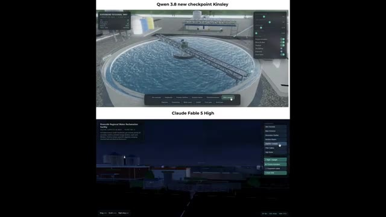
*Comparaison vidéo en écran partagé entre Qwen 3.8 new checkpoint Kinsley et Claude Fable 5 High montrant une station d'épuration d'eau en 3D.*

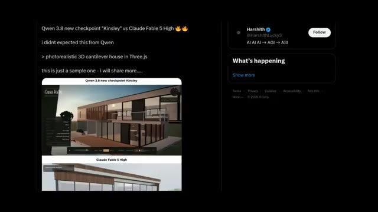
*Capture d'écran du tweet de Harshit sur X (Twitter) comparant Qwen 3.8 checkpoint "Kinsley" et Claude Fable 5 High pour une maison en porte-à-faux photoréaliste en Three.js.*

---

### ⏱️ `[00:03:01 - 00:03:22]` | Segment #10

**🔊 Audio (Transcription Intégrale Mot pour Mot en Français) :**
> Cette fois-ci, il a demandé aux deux modèles de générer une maison en porte-à-faux en 3D photoréaliste en Three.js. Et je dois dire que QN 3.8 Max m'a vraiment surpris. Je ne m'attendais honnêtement pas à ce qu'un modèle à poids ouverts produise un résultat à ce niveau. La maison a l'air incroyablement réaliste, avec de meilleurs matériaux, un meilleur éclairage et un environnement qui semble beaucoup plus naturel.

**👁️ Analyse Visuelle d'Écran (gemini-3.5-flash-lite) :**
**Interface & Outils** : Interface de démonstration 3D (Three.js) comparant les résultats de deux modèles d'IA (QN 3.8 Kinsley et Claude Fable 5 High) sur un navigateur web et une interface de réseau social (X/Twitter).

**Contenu textuel & Code** : Textes visibles : "Qwen 3.8 new checkpoint 'Kinsley' vs Claude Fable 5 High", "photorealistic 3D cantilever house in Three.js", "Casa Volta", et panneaux de configuration de scène 3D.

**Action / Démonstration** : Présentation comparative des résultats de génération de code 3D entre deux modèles d'intelligence artificielle différents.

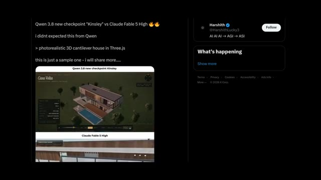
*Capture d'écran montrant un comparatif entre le rendu de QN 3.8 avec le checkpoint "Kinsley" et celui de Claude Fable 5 High, affiché sur un fil de réseau social.*

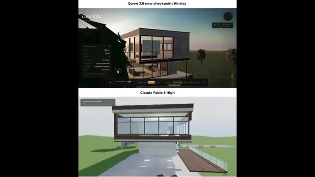
*Gros plan comparatif en deux parties affichant en haut le rendu de QN 3.8 (checkpoint Kinsley) et en bas celui de Claude Fable 5 High d'une maison en 3D.*

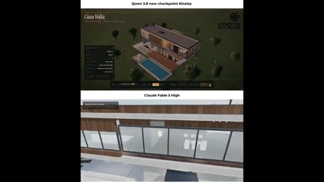
*Vue rapprochée des rendus 3D de la maison en porte-à-faux, comparant les détails visuels de QN 3.8 (Kinsley) et de Claude Fable 5 High.*

---

### ⏱️ `[00:03:22 - 00:03:42]` | Segment #11

**🔊 Audio (Transcription Intégrale Mot pour Mot en Français) :**
> C'est un autre exemple qui montre à quel point QN 3.8 Max a progressé. Il ne se contente plus de rivaliser avec Claude Fabel 5, il le concurrence directement et fournit des résultats vraiment impressionnants. Alors, qu'en pensez-vous ? QN 3.8 Max vous a-t-il assez impressionné pour devenir votre nouveau modèle d'IA de référence ? Ou préférez-vous toujours vous en tenir à Claude Fabel 5 ?

**👁️ Analyse Visuelle d'Écran (gemini-3.5-flash-lite) :**
**Interface & Outils** : Interface de comparaison de modèles d'IA générative 3D / architecturale avec panneaux de contrôle et interface de visualisation 3D interactive sur navigateur.

**Contenu textuel & Code** : Textes visibles : 'Qwen 3.8 new checkpoint Kinsley', 'Casa Volta', 'PROJECT INFO', 'Claude Fabel 5 High', 'CANTILEVER HOUSE', 'Ornithopter - after Leonardo da Vinci', 'Codex Atlanticus, fol. 335 v. (c. 1488-90)'.

**Action / Démonstration** : Présentation comparative de rendus 3D architecturaux générés par les deux modèles d'IA, suivie de la visualisation interactive d'un modèle 3D d'ingénierie historique.

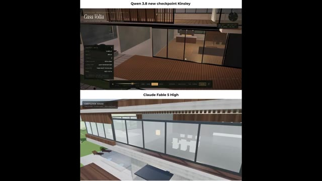
*Comparaison côte à côte de rendus architecturaux montrant en haut le modèle 'Qwen 3.8 new checkpoint Kinsley' et en bas 'Claude Fabel 5 High', zoomé sur une maison moderne.*

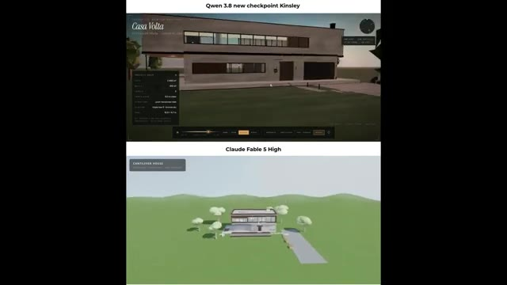
*Comparaison côte à côte de rendus architecturaux montrant en haut le modèle 'Qwen 3.8 new checkpoint Kinsley' (vue d'ensemble d'une maison) et en bas 'Claude Fabel 5 High' (vue lointaine dans un paysage).*

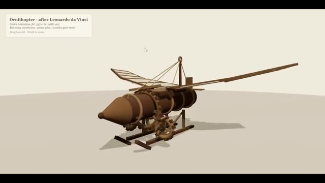
*Visualiseur 3D interactif affichant un modèle texturé d'un ornithoptère d'après Léonard de Vinci.*

---

### ⏱️ `[00:03:43 - 00:03:54]` | Segment #12

**🔊 Audio (Transcription Intégrale Mot pour Mot en Français) :**
> Faites-moi part de vos réflexions dans les commentaires. Je les lis tous. C'est Pursuing AI, et c'était le rapport de recherche d'aujourd'hui. Merci d'avoir regardé. Si vous avez apprécié cette vidéo, n'oubliez pas de vous abonner, et je vous retrouve dans le prochain rapport de recherche.

**👁️ Analyse Visuelle d'Écran (gemini-3.5-flash-lite) :**
**Interface & Outils** : Écran de fin / carte graphique de conclusion de la chaîne YouTube Pursuing AI.

**Contenu textuel & Code** : Texte « The Research Report », illustration d'un cerveau humain connecté à un processeur central avec l'acronyme « PAI » entouré d'un cercle lumineux bleu sur fond noir.

**Action / Démonstration** : Affichage de l'écran final de clôture de la vidéo avec le logo de la chaîne et l'incitation à s'abonner.

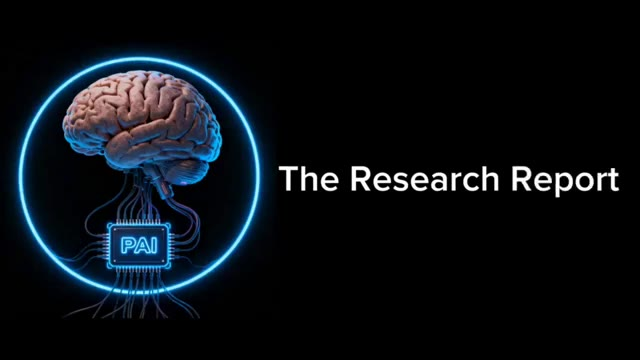
*Écran de fin de la chaîne Pursuing AI affichant un cerveau bionique et le titre The Research Report.*

---
