# 🎬 55 % des cyberattaques utilisent l'IA ?

> **Chaîne** : [Pursuing AI](https://www.youtube.com/@PursuingAi)  
> **Titre original** : `55% of Cyberattacks Use AI?`  
> **Lien YouTube** : [https://www.youtube.com/watch?v=bcDvdUb-fEw](https://www.youtube.com/watch?v=bcDvdUb-fEw)  
> **Date de publication** : 2026-08-13  
> **Durée** : 03m 02s (`182s`)  
> **Identifiant vidéo** : `bcDvdUb-fEw`  
> **Fiche Web Interactive** : [2026-08-13_YT-bcDvdUb-fEw_55 % des cyberattaques utilisent l'IA_by-whisper-v3-large-turbo+gemini-3.5-flash-lite.html](2026-08-13_YT-bcDvdUb-fEw_55 % des cyberattaques utilisent l'IA_by-whisper-v3-large-turbo+gemini-3.5-flash-lite.html)  
> **Captures de démonstration clés** : `14 captures réelles (anti-talking-head)`  
> **Modèles utilisés** : Audio: `large-v3-turbo` (Faster-Whisper int8 VPS) | Vision: `gemini-3.5-flash-lite` (Google AI Studio API)  

---

## 📌 Synthèse Exécutive & Outils

### 📌 Résumé
Cette vidéo de *Pursuing AI* dresse un panorama percutant et global de l'accélération industrielle et géopolitique de l'intelligence artificielle, loin des simples effets de mode. En s'appuyant sur des visuels de pointe générés via Seedance 2.5, Kling 3.0 et Midjourney, le créateur structure son récit autour du basculement de l'IA du laboratoire vers le monde réel. L'analyse démontre comment la technologie se fragmente en deux flux distincts : d'une part, la course aux armements des modèles géants hébergés dans le cloud, et d'autre part, la démocratisation foudroyante d'outils open-source ultra-performants taillés pour le matériel local.

Sur la forme, le créateur adopte une méthode rigoureuse basée sur le "news-stacking" thématique : introduction choc par l'image, transition fluide entre des sujets macroéconomiques (puces, open-source), géopolitiques (défense), sociétaux (cybersécurité) et industriels (robotique), puis conclusion prospective. Cette structure narrative maintient un rythme haletant grâce à un montage visuel dynamique et synchronisé. Les créateurs de vidéo par IA y trouvent une masterclass sur l'art d'illustrer des concepts abstraits (comme le traitement des tokens ou la cybersécurité) par des métaphores visuelles hyper-réalistes et cinématographiques.

Pour les créateurs de contenu, cette vidéo enseigne comment maximiser l'engagement en traitant l'actualité technologique sous l'angle de l'impact direct et tangible. L'utilisation stratégique de génération vidéo par IA permet de combler le fossé entre des communiqués de presse arides et des séquences visuelles dignes de blockbusters. En maîtrisant la cohérence visuelle entre les différents outils de génération, il devient possible de produire des analyses géopolitiques et techniques hautement professionnelles, captivant l'audience de la première à la dernière seconde.

### 🛠️ Outils, Modèles & Logiciels Présentés
* **Seedance 2.5** : Utilisé pour générer des séquences vidéo fluides et cinématographiques illustrant les transitions narratives et les concepts futuristes de la vidéo.
* **Kling 3.0** : Mobilisé pour la production de plans visuels hyper-réalistes, notamment pour dynamiser les séquences de robotique et d'aviation autonome.
* **Midjourney** : Exploité en amont pour concevoir les concepts arts fixes et les visuels de référence servant de base aux animations vidéo.
* **Générations Vidéo IA** : Terme global englobant le pipeline technique permettant de synthétiser des images de synthèse réalistes pour illustrer l'actualité de l'IA.
* **Muse Glimmer** : Modèle multimodal à 30 milliards de paramètres (évoqué dans le contenu) servant d'exemple central sur la décentralisation de l'IA locale.
* **Mixture of Kittens (Cursor)** : Outil open-source d'optimisation logicielle mentionné pour maximiser les performances des infrastructures GPU.

### 🔑 Points Clés & Enseignements Stratégiques
* **Démocratisation du calcul local** : La sortie de modèles comme Muse Glimmer prouve qu'il n'est plus nécessaire de dépendre de clusters géants pour exécuter des IA puissantes, ouvrant la voie à une utilisation sur un GPU unique.
* **Bifurcation du marché de l'IA** : Le secteur se divise clairement entre les laboratoires aux budgets pharaoniques et l'écosystème open-source ultra-rapide destiné aux startups et créateurs indépendants.
* **Industrialisation de la robotique** : Les robots humanoïdes ne relèvent plus de la démonstration marketing ; ils intègrent activement les chaînes de montage automobiles (comme chez BMW) avec des tolérances industrielles strictes.
* **L'IA au cœur de la défense moderne** : Le vol réussi d'un F-16 piloté par IA par la DARPA marque un point de non-retour dans l'autonomie des systèmes d'armement et la stratégie militaire mondiale.
* **Explosion de la cybercriminalité augmentée** : Le rapport d'Interpol soulignant que 55 % des cybercrimes en Afrique utilisent l'IA illustre la double peine de l'accessibilité technologique, désormais aux mains des acteurs malveillants.
* **Valorisation de l'infrastructure logicielle** : Des initiatives comme *Mixture of Kittens* rappellent que l'optimisation du code et des couches logicielles est aussi cruciale que la puissance brute du matériel.
* **Rythme de production "News-Stacking"** : Structurer une vidéo d'actualité technologique par strates (logiciel, militaire, sécurité, industrie) maintient l'attention sans saturer le spectateur.
* **Illustration visuelle de l'abstrait** : Pour garder le spectateur captif, chaque concept technique lourd (tokens, GPU, cybersécurité) doit impérativement être incarné par une illustration visuelle générée par IA de haute qualité.
* **Piège à éviter : la sur-promesse déconnectée** : Contrairement aux simples teasers de laboratoire, l'accent doit être mis sur l'impact réel et mesurable (chiffres de production, déploiements concrets).
* **Workflow multi-outils** : Combiner Midjourney pour la statique et Seedance/Kling pour le mouvement garantit une esthétique visuelle haut de gamme et cohérente tout au long du format court.

---

## ⏱️ Chronologie & Transcription Complète Audio & Visuelle (Mot pour Mot)

### ⏱️ `[00:00:00 - 00:00:21]` | Segment #01

**🔊 Audio (Transcription Intégrale Mot pour Mot en Français) :**
> Un robot humanoïde a battu le record du monde du marathon, et le plus grand fabricant de puces au monde vient de publier des chiffres qui devraient effrayer quiconque parie contre le boom de l'IA. Cette semaine, la course aux armements de l'IA est devenue locale, ouverte et farouchement disputée, et les robots quittent officiellement la scène des démonstrations pour entrer dans les usines. Entrons dans le vif du sujet. Comment ça va tout le monde, bienvenue sur la chaîne.

**👁️ Analyse Visuelle d'Écran (gemini-3.5-flash-lite) :**
**Interface & Outils** : Présentation face caméra sans partage d'écran (extraits vidéo B-roll d'illustration uniquement)

**Contenu textuel & Code** : Aucun texte, code ou prompt visible à l'écran.

**Action / Démonstration** : Aucune manipulation de logiciel ou d'outil d'IA montrée à l'écran.

---

### ⏱️ `[00:00:22 - 00:00:47]` | Segment #02

**🔊 Audio (Transcription Intégrale Mot pour Mot en Français) :**
> Meta a discrètement lancé quelque chose qui compte beaucoup pour quiconque développe réellement avec l'IA. Ça s'appelle Muse Glimmer, un modèle multimodal à 30 milliards de paramètres publié sous licence Apache 2.0, ce qui signifie qu'il est véritablement ouvert et utilisable commercialement. Il est spécifiquement optimisé pour l'utilisation d'outils d'agents locaux et le codage, gère une fenêtre contextuelle de 131 000 tokens et prend en charge plus de 100 langues, la statistique phare qui fait parler les développeurs.

**👁️ Analyse Visuelle d'Écran (gemini-3.5-flash-lite) :**
**Interface & Outils** : Interface de ligne de commande OpenCode et page web de présentation d'un modèle d'IA.

**Contenu textuel & Code** : Titres de l'article de blog Meta, lignes de code, invite utilisateur « I just installed Home Assistant on a Raspberry Pi... », et liste des tâches à accomplir (« Discover Home Assistant instance on home network », « Identify A/V receiver entity... », « Design responsive dashboard UI/UX... », etc.).

**Action / Démonstration** : Démonstration de l'exécution d'une tâche agentique en plusieurs étapes à partir d'un unique prompt utilisateur dans OpenCode.

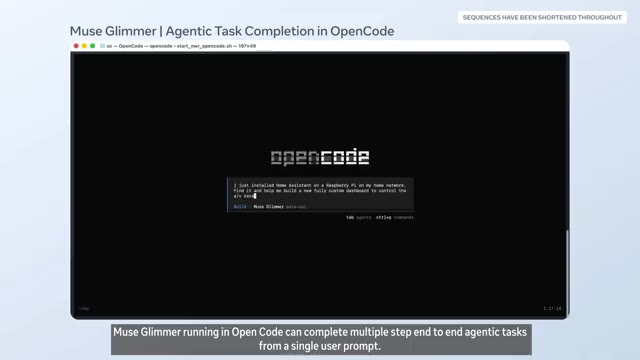
*Interface d'OpenCode montrant le terminal avec une invite de commande pour Muse Glimmer.*

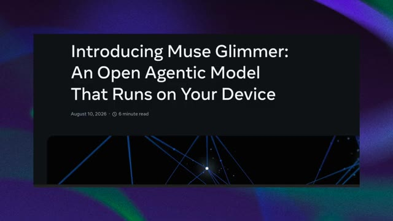
*Article de présentation officiel intitulé « Introducing Muse Glimmer: An Open Agentic Model That Runs on Your Device ».*

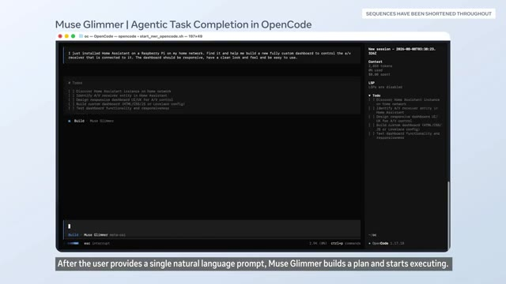
*Interface OpenCode affichant une session active avec la liste des tâches (To-do) générées par Muse Glimmer.*

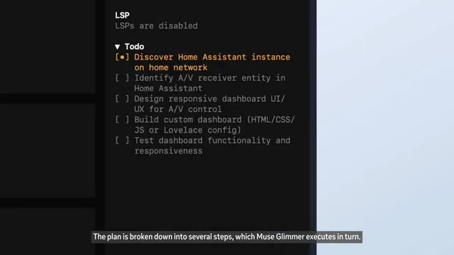
*Zoom sur la liste des tâches (To-do) détaillant les étapes d'exécution de l'agent IA.*

---

### ⏱️ `[00:00:47 - 00:01:11]` | Segment #03

**🔊 Audio (Transcription Intégrale Mot pour Mot en Français) :**
> Cette chose tourne sur un seul GPU, pas un cluster, pas un centre de données, un seul GPU. Cela fait partie d'une tendance plus large. La course à l'IA ne se résume plus seulement à qui possède le plus grand modèle de pointe. Elle se divise en deux voies : la course aux armements des laboratoires de pointe à mille milliards de dollars et une course open-source parallèle visant à réduire des modèles puissants pour qu'une startup ou, honnêtement, un passionné puisse les exécuter localement.

**👁️ Analyse Visuelle d'Écran (gemini-3.5-flash-lite) :**
**Interface & Outils** : Interface logicielle d'OpenCode avec un panneau de terminal à gauche et un panneau de gestion de tâches (To-do) à droite.

**Contenu textuel & Code** : Titre "Muse Glimmer | Agentic Task Completion in OpenCode", commandes de terminal ($ ifconfig, $ ip getifaddr en0, $ arp -a), panneaux de suivi des tâches et du contexte (tokens utilisés, coût).

**Action / Démonstration** : Exécution de commandes et appels d'outils par l'agent IA pour découvrir l'adresse IP de Home Assistant sur le réseau local.

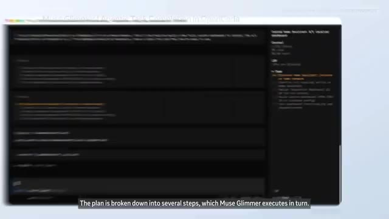
*Interface d'OpenCode montrant l'exécution d'une tâche par Muse Glimmer avec le plan découpé en plusieurs étapes.*

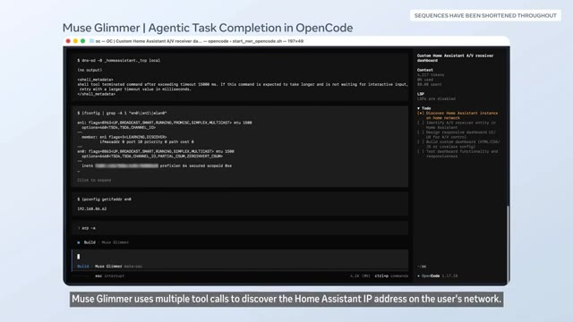
*Interface d'OpenCode affichant un terminal et une liste de tâches pour Muse Glimmer recherchant l'adresse IP de Home Assistant.*

---

### ⏱️ `[00:01:11 - 00:01:35]` | Segment #04

**🔊 Audio (Transcription Intégrale Mot pour Mot en Français) :**
> Et ce n'est pas seulement Meta. Cursor a publié un outil d'optimisation open-source appelé Mixture of Kittens, conçu pour extraire davantage de performances des systèmes GPU NVL72 de NVIDIA pour les modèles de type Mixture of Experts. Même l'infrastructure logicielle autour de l'IA est maintenant en open source. Si vous êtes développeur, c'est important, car vos options pour exécuter une IA performante sans payer de frais d'API viennent de s'améliorer considérablement.

**👁️ Analyse Visuelle d'Écran (gemini-3.5-flash-lite) :**
**Interface & Outils** : Articles de blog et graphiques techniques présentés sous forme de diapositives ou de captures d'écran documentaires.

**Contenu textuel & Code** : Textes : "Mixture-of-Kittens: our open-source MoE megakernel for NVL72s", graphiques de performance avec barres orange montrant la supériorité de Mixture-of-Kittens, et schémas d'architecture GPU intitulés "Push vs pull based dispatch".

**Action / Démonstration** : Défilement et affichage successif de captures d'écran documentaires illustrant l'outil Mixture-of-Kittens, ses performances et son architecture technique.

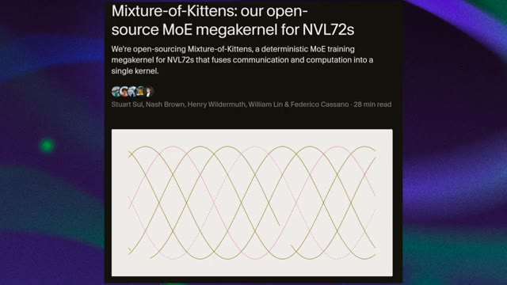
*Capture d'écran d'un article en ligne présentant l'outil open-source Mixture-of-Kittens de Cursor.*

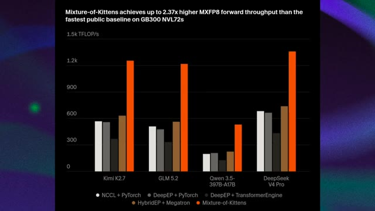
*Graphique à barres comparant les performances du débit MXFP8 de Mixture-of-Kittens par rapport à d'autres architectures sur les systèmes GB300 NVL72.*

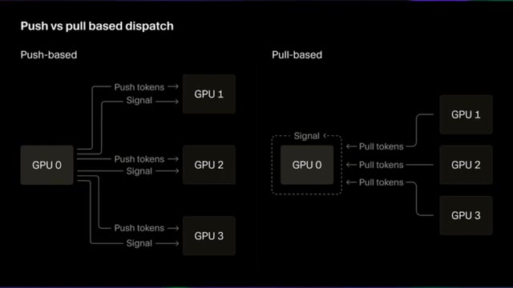
*Schéma comparatif illustrant les méthodes de répartition des tâches 'Push vs pull based dispatch' entre GPU.*

---

### ⏱️ `[00:01:35 - 00:02:11]` | Segment #05

**🔊 Audio (Transcription Intégrale Mot pour Mot en Français) :**
> Maintenant, passons à une histoire qui est un peu moins une démonstration technologique cool et un peu plus un sujet auquel nous devrions prêter attention. Pour la première fois, la DARPA a réalisé un vol réel d'un avion de chasse F-16 entièrement contrôlé par intelligence artificielle. Pas un simulateur, pas un drone, un véritable F-16 piloté entièrement par l'IA. C'est une étape majeure dans l'aviation de combat autonome, et cela reflète une volonté stratégique beaucoup plus large de l'armée américaine d'intégrer l'IA au cœur des futures capacités de combat. Quels que soient vos sentiments sur les armes autonomes, et il y a beaucoup de sentiments légitimes de tous côtés, c'est en train de se produire, c'est réel.

**👁️ Analyse Visuelle d'Écran (gemini-3.5-flash-lite) :**
**Interface & Outils** : Articles de blog et séquences vidéo documentaires illustrant l'actualité militaire et technologique.

**Contenu textuel & Code** : Textes d'articles de presse et de recherche sur l'IA et l'aéronautique militaire (DARPA, F-16, NVL72s).

**Action / Démonstration** : Présentation visuelle de captures d'articles et d'extraits vidéo documentaires illustrant le vol du F-16 contrôlé par l'IA.

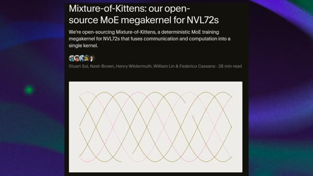
*Article de blog intitulé 'Mixture-of-Kittens: our open-source MoE megakernel for NVL72s' avec un graphique sinusoïdal.*

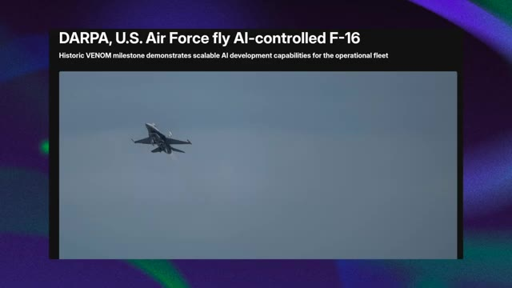
*Article intitulé 'DARPA, U.S. Air Force fly AI-controlled F-16' montrant un F-16 en vol.*

---

### ⏱️ `[00:02:11 - 00:02:30]` | Segment #06

**🔊 Audio (Transcription Intégrale Mot pour Mot en Français) :**
> et ça s'accélère. Et du côté de la sécurité, un nouveau rapport d'Interpol sur les cybermenaces en Afrique révèle que l'IA est désormais impliquée dans 55 % des cybercrimes signalés à travers le continent. On parle de phishing automatisé, de deepfakes, d'e-mails frauduleux et d'identités synthétiques, le tout accéléré par des outils d'IA.

**👁️ Analyse Visuelle d'Écran (gemini-3.5-flash-lite) :**
**Interface & Outils** : Document textuel / Capture d'écran d'article (source @medium en bas à droite).

**Contenu textuel & Code** : Texte affiché : "5. AI IS NOW INVOLVED IN 55% OF CYBERATTACKS IN AFRICA. According to INTERPOL's African Cyberthreat Assessment 2026 report, artificial intelligence is now involved in 55% of reported cybercrimes across Africa. Cybercriminals are using AI to automate phishing campaigns, create deepfakes, generate fraudulent emails, produce synthetic digital identities, and make their attacks faster, more targeted, and harder to detect. Based on data collected from 36 African countries, the report shows that cybercrime has evolved into a cross-border industrial ecosystem. Since 2024, financial losses linked to cyberattacks have more than doubled, rising from $192 million to $484 million. While INTERPOL is the first organization to quantify AI's impact at 55% in Africa, Europol and ENISA have also warned..."

**Action / Démonstration** : Affichage fixe d'un extrait de rapport textuel illustrant les statistiques des cyberattaques liées à l'IA en Afrique.

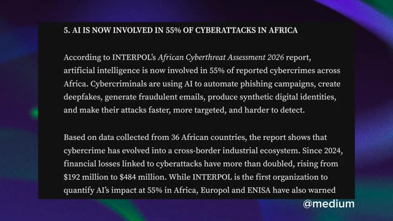
*Capture d'écran d'un article ou rapport texte intitulé "5. AI IS NOW INVOLVED IN 55% OF CYBERATTACKS IN AFRICA" détaillant les conclusions d'Interpol sur les cybermenaces en Afrique.*

---

### ⏱️ `[00:02:30 - 00:02:48]` | Segment #07

**🔊 Audio (Transcription Intégrale Mot pour Mot en Français) :**
> Pendant ce temps, ces robots ont aidé à construire plus de 30 000 BMW X3 et ont chargé plus de 90 000 pièces de tôle, travaillant quotidiennement sur une chaîne de montage active avec une précision de 5 mm. Ce n'est pas une démo. C'est un vrai travail. Agbot, originaire de Chine, a atteint 15 000 unités cumulées produites.

**👁️ Analyse Visuelle d'Écran (gemini-3.5-flash-lite) :**
**Interface & Outils** : Capture d'article web/presse sur fond abstrait violet et vert.

**Contenu textuel & Code** : Texte de l'article : "AGIBOT's 15,000th Robot Rolls Off the Production Line, Marking a New Milestone in Embodied AI Deployment. [SHANGHAI, China, June 28, 2026] AGIBOT, a global leader in embodied AI and robotics, today announced that its 15,000th robot has officially rolled off the production line. The milestone unit is the AGIBOT G2, an industrial-grade embodied task robot designed for industrial and real-world operational scenarios."

**Action / Démonstration** : Affichage d'un article de presse officielle concernant le jalon de production d'Agibot.

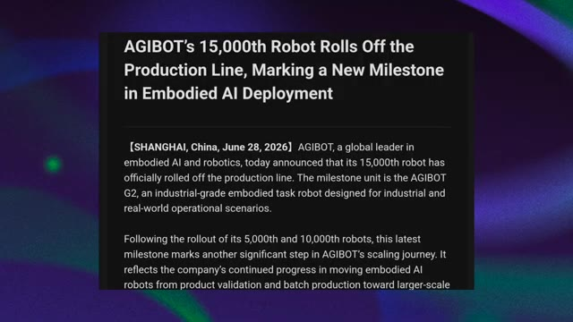
*Capture d'écran d'un article de presse annonçant qu'AGIBOT a atteint 15 000 robots produits.*

---

### ⏱️ `[00:02:49 - 00:03:02]` | Segment #08

**🔊 Audio (Transcription Intégrale Mot pour Mot en Français) :**
> 2026 n'est pas l'année où l'IA est devenue puissante. C'est l'année où elle s'est intégrée dans les usines, dans les avions de chasse, dans votre dépôt GitHub et très bientôt, peut-être dans votre entrepôt. C'est le récapitulatif de votre semaine.

**👁️ Analyse Visuelle d'Écran (gemini-3.5-flash-lite) :**
**Interface & Outils** : OpenCode (interface de ligne de commande / IDE)

**Contenu textuel & Code** : Texte affiché : "Muse Glimmer | Agentic Task Completion in OpenCode" et "Muse Glimmer running in Open Code can complete multiple step end to end agentic tasks from a single user prompt."

**Action / Démonstration** : Affichage simultané d'un robot humanoïde effectuant des tâches en usine et d'une interface de code exécutant des tâches agentiques complexes via Muse Glimmer.

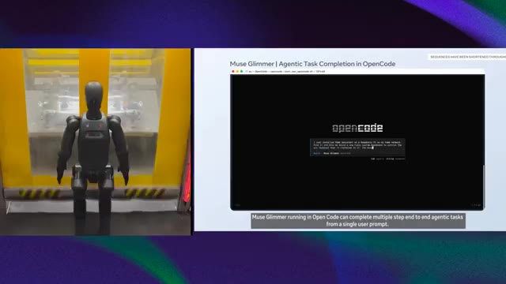
*Écran partagé montrant à gauche un robot humanoïde dans une usine et à droite l'interface d'OpenCode avec Muse Glimmer.*

---
